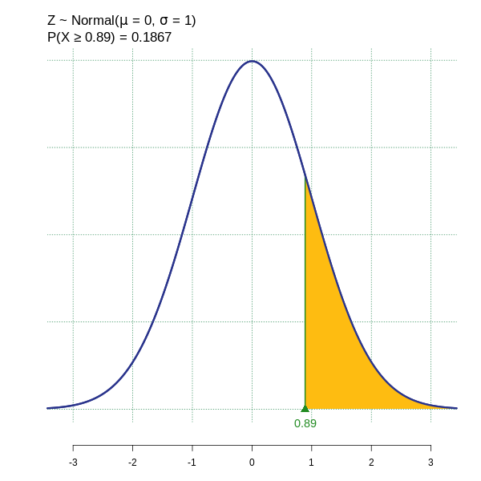
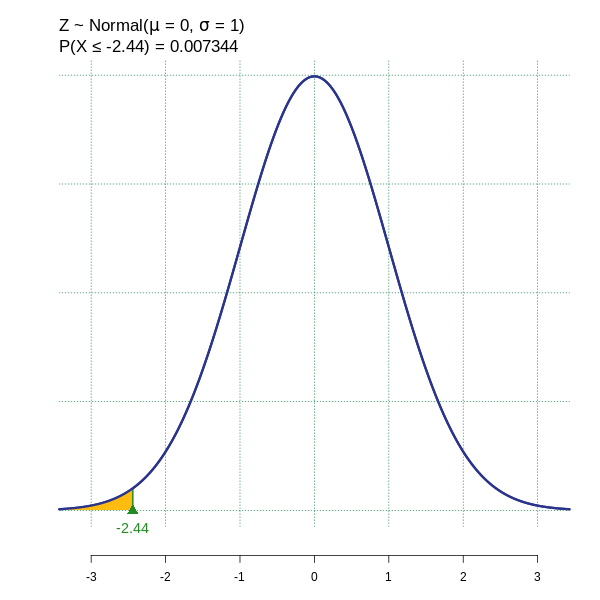
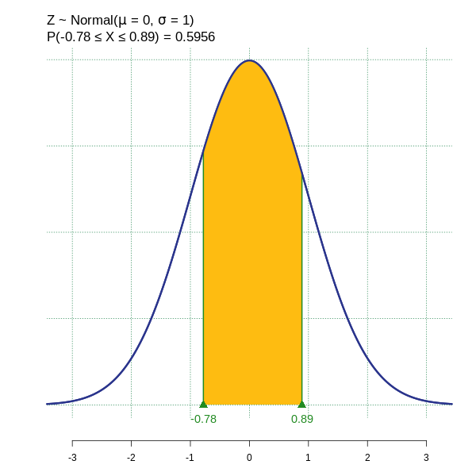
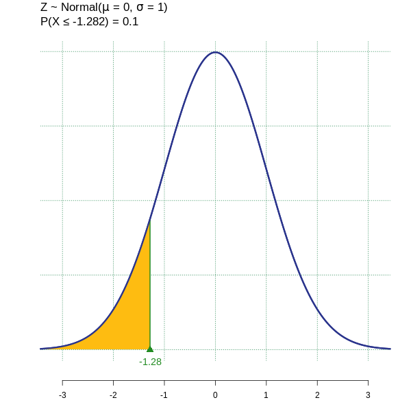
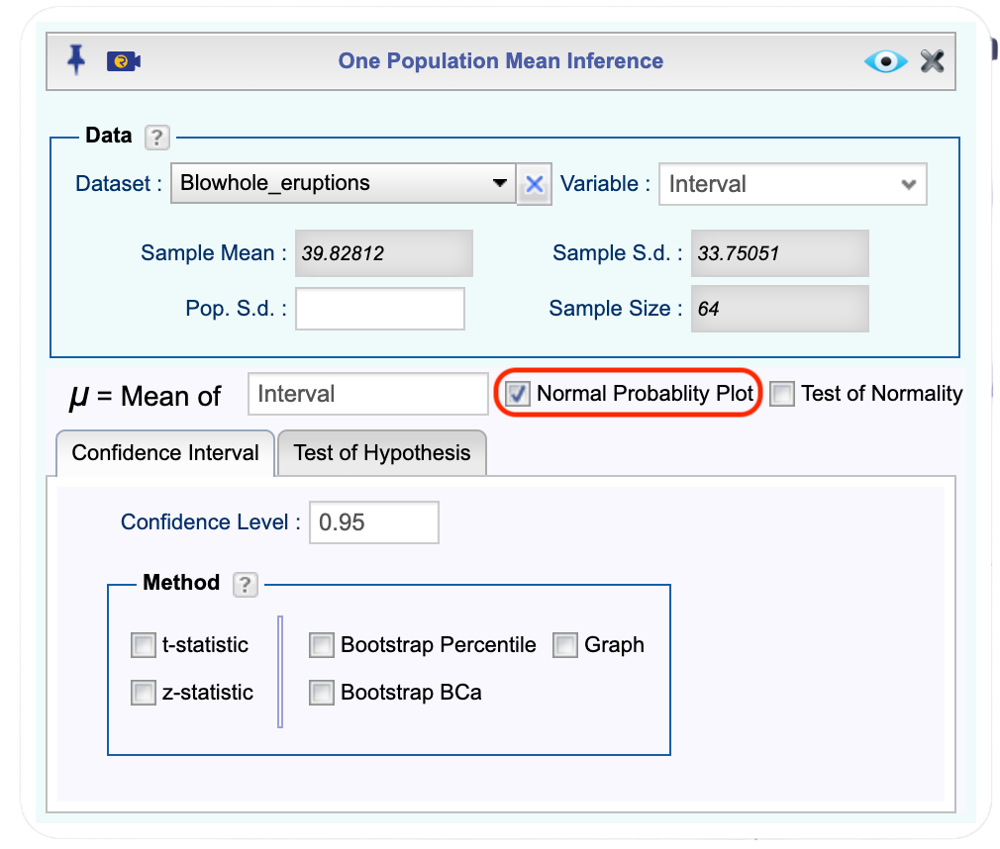
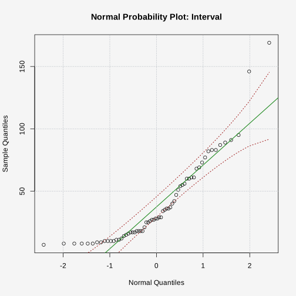
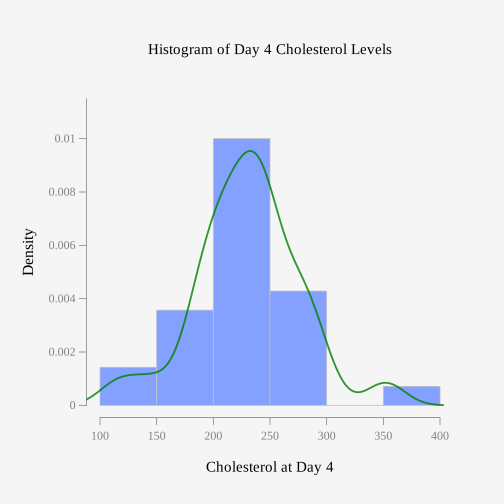
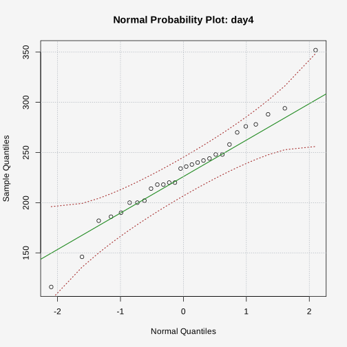

```{r setup6, include=FALSE}
library("mosaic") 
library("NHANES") 
Cholesterol<-read.csv( "https://krkozak.github.io/MAT160/cholesterol.csv")
```

::: {.callout-note}
## Chapter 6 Objectives

By the end of Chapter 6, you should be able to:

- Distinguish between discrete and continuous random variables and explain what makes a probability density function valid.
- Compute and interpret probabilities for a uniform distribution as areas of rectangles.
- Find and interpret probabilities and percentiles for normal distributions using the empirical rule, z-scores, and Rguroo.
- Assess whether a sample appears to come from a normally distributed population using visual tools.
:::


**Before you begin, review the process for importing a dataset.** Click on the box below to expand the directions for importing a dataset into your Data Toolbox.

::: {#Importing-Data-to-Rguroo-Chapter-5 .callout-note appearance="simple" collapse="true" icon="none" title="{width=22px style='vertical-align:middle;'}  Importing Data to Rguroo"} 

1. Open the **Data** toolbox in Rguroo.  
2. From the [Data Import]{.dpd} dropdown, select [Dataset Repository]{.fun}.  
3. In the top search box, type [kozak]{.typein}, then select the [Statistics Using Technology – Kozak]{.repo} repository.  
4. In the middle search box, type the first few letters of the dataset, and choose your dataset that appears in the lower panel.  
5. Click the [Import]{.button}. The dataset will be imported into your Rguroo account.  
6. Click the [Close]{.button} to close the dialog.  
7. To view the dataset, double-click the dataset under the **Data** toolbox list.

:::


This chapter builds on the probability foundations established in earlier chapters by introducing **continuous probability distributions** — mathematical models used when a variable can take any value within a range rather than a list of separate counts. Continuous models are essential for describing measured quantities such as height, time, blood pressure, and test scores, and they lay the groundwork for every confidence interval and hypothesis test covered later in the course.

## Continuous Random Variables and Probability Density Functions

### From Discrete to Continuous

In previous chapters, you worked with **discrete random variables** — variables whose values you count, such as the number of heads in a coin flip experiment, or the number of accidents at an intersection in a week. A discrete variable can only take specific, separate values, and its probability distribution is typically displayed in a table.

A **continuous random variable**, by contrast, can take *any* value within an interval of real numbers. Continuous variables arise from **measurement** rather than counting. Examples include:

- The height of a randomly selected student (measured in inches)
- The time it takes to complete a statistics exam (measured in minutes)
- The amount of rainfall in a city during a given month (measured in millimeters)
- The blood pressure reading of a randomly selected adult

Because a continuous variable can theoretically take on infinitely many values within any interval, we cannot assign probability to individual values the way we did with discrete distributions. Instead, **probability is represented by area under a curve**.


::: {.callout-note appearance="simple" icon="false"}
**Key Concept.** For a continuous random variable, the probability that the variable equals any single exact value is **zero**. Probability is only defined for intervals. For example, it makes sense to ask "what is the probability that wait time is between 2 and 5 minutes?" but not "what is the probability that wait time is exactly 3.0 minutes?"
:::

This is one of the most important conceptual shifts in the course. Take a moment to make sure this makes sense before moving on. Think about measuring your height — there is no one exact value for your height because every measurement tool has some limit to its precision.

### Probability Density Functions

A **probability density function** (pdf), written $f(x)$, is an equation whose curve describes the distribution of a continuous random variable and is used to calculate probabilities of continuous random variables. Two rules must be satisfied for a function to be a valid probability density function:

1.  The height of the graph of the equation must be greater than or equal to 0 for all possible values of the random variable. 
2.  The total area under the graph of the equation over all possible values of the random variable must equal 1.

The probability that the random variable $X$ falls between two values $a$ and $b$ is the area under the density curve from $a$ to $b$:

$$
P(a \leq X \leq b) = \text{area under } f(x) \text{ from } a \text{ to } b
$$


::: {.callout-note appearance="simple" icon="false"}
**Notation note.** For continuous distributions, $P(a < X < b)$ and $P(a \leq X \leq b)$ give the same answer, because the probability of any single endpoint is zero. This is different from discrete distributions, where the endpoints do matter.
:::

::: {.callout-note appearance="simple" icon="false"}
**Key Concept.** The area under the graph of a density function over an interval represents the probability of observing a value of the random variable in that interval.
:::

### Classifying Variables

Before using any continuous distribution, confirm that the variable is indeed continuous by asking: is this variable measured or counted?

| Variable | Discrete or Continuous? | Reason |
|------------------------|------------------------|------------------------|
| Number of customers in a store | Discrete | Counted |
| Time a customer spends shopping | Continuous | Measured |
| Number of credit hours enrolled | Discrete | Counted |
| Weight of a bag of apples | Continuous | Measured |
| Score on a multiple-choice exam (points) | Discrete | Counted |


:::{#exm-classify-variables}

Classify each variable below as discrete or continuous.

a.  The number of miles driven to school (rounded to the nearest mile)
b.  The exact distance driven to school, in miles
c.  The number of pages in a randomly selected library book
d.  The weight of a randomly selected library book
:::

::: {.callout-tip .solution-callout collapse="true" icon=false}
## 🔎 Solution

a.  Discrete — rounded to the nearest mile means we are counting miles.
b.  Continuous — the exact distance is a measurement that can take any decimal value.
c.  Discrete — the number of pages is counted.
d.  Continuous — weight is a measurement.

:::

### Homework for Section 6.1

1. What is the difference between a discrete and a continuous random variable?

2. What is a probability density function?

3. Classify each variable below as discrete or continuous, and briefly explain your reasoning.

a. The number of text messages sent by a student in one day
b. The exact amount of time (in seconds) a student spends on a phone call
c. The number of siblings a randomly selected student has
d. The exact volume of coffee (in ounces) in a to-go cup
e. The number of parking tickets issued on a college campus in a week

4. For each function below, determine whether it could represent a valid probability density function on the given interval. Justify your answer using the two rules for a valid pdf.

a. $f(x) = 0.25$ for $2 \leq x \leq 6$
b. $f(x) = -0.1$ for $0 \leq x \leq 10$
c. $f(x) = 0.5$ for $0 \leq x \leq 3$

5. A statistics instructor tells the class that the amount of time students spend completing a quiz is a continuous random variable.

a. Explain why it does not make sense to ask, "What is the probability that a student takes exactly 14.0 minutes to complete the quiz?"
b. Rewrite the question in part (a) so that it is a meaningful probability question about quiz completion time.
c. In your own words, explain why probability for a continuous random variable is represented by area under a curve rather than the height of the curve at a single point.


## The Uniform Distribution

The **uniform distribution** is the simplest continuous distribution and the best starting point for understanding how density curves work. In a uniform distribution, every value in an interval is equally likely in the sense that the density is constant across the entire interval. This makes the graph a **horizontal rectangle**, which means probability is simply area — length times width.

If a continuous random variable $X$ is uniformly distributed on the interval $[a, b]$ we write $X \sim U(a,b)$, then the probability density function is:

$$
f(x) = \frac{1}{b - a}, \quad \text{for } a \leq x \leq b
$$

The height of the rectangle is the constant $\frac{1}{b-a}$, which ensures the total area equals 1:

$$
\text{Total area} = (b - a) \cdot \frac{1}{b - a} = 1 
$$

@fig-uniform-density shows the general shape of a uniform distribution on the interval $[a, b]$. The curve is a horizontal line at height $f(x) = \frac{1}{b-a}$ across the entire interval, and it drops to 0 outside of $[a, b]$, since values outside that range are impossible. The shaded rectangle represents the total probability, which equals the area of the rectangle — width, $(b-a)$, times height, $\frac{1}{b-a}$ — confirming that the total area under the curve is exactly 1, as required for any valid probability density function.

```{r uniform-density-plot}
#| fig-alt: "Density curve for a uniform distribution from a to b. The curve is a horizontal rectangle with constant height f(x) = 1/(b-a) across the entire interval [a, b], and zero outside that interval. The shaded region illustrates that all values are equally likely."
#| warning: FALSE
#| echo: FALSE
#| label: fig-uniform-density
#| fig-cap: "Probability Density Function of a Uniform Distribution on [a, b]"

library(ggformula)
library(ggplot2)

# Define the parameters — change a and b for any uniform distribution
a <- 0
b <- 1

# Height of the uniform pdf
height <- 1 / (b - a)

# Create a data frame for the rectangle
uniform_df <- data.frame(
  x = c(a - 0.2*(b-a), a, a, b, b, b + 0.2*(b-a)),
  fx = c(0, 0, height, height, 0, 0)
)

ggplot(uniform_df, aes(x = x, y = fx)) +
  geom_line(color = "steelblue", linewidth = 1.2) +
  geom_ribbon(
    data = subset(uniform_df, x >= a & x <= b),
    aes(ymin = 0, ymax = fx),
    fill = "steelblue", alpha = 0.3
  ) +
  geom_hline(yintercept = 0, color = "black", linewidth = 0.5) +
  #annotate("text", x = (a + b) / 2, y = height + 0.02 * height,
           #label = paste0("f(x) = 1/(b \u2212 a) = ", round(height, 4)),
           #hjust = 0.5, size = 4) +
  scale_x_continuous(
    breaks = c(a, (a + b) / 2, b),
    labels = c("a", "(a+b)/2", "b")
  ) +
  scale_y_continuous(
    limits = c(0, height * 1.3),
    breaks = c(0, height),
    labels = c("0", "1/(b\u2212a)")
  ) +
  labs(
    title = paste0("Uniform Distribution on [a,b]"),
    x = "x",
    y = "f(x)"
  ) +
  theme_classic(base_size = 13)
```

For a uniform distribution on $[a, b]$, the mean and standard deviation are

$$
\mu = \frac{a + b}{2} 
$$

and

$$
\sigma = \frac{b-a}{\sqrt{12}}
$$

The mean is the midpoint of the interval, and the standard deviation measures how spread out the values are across that interval.

:::{#exm-uniform-dist}

A city bus arrives at a particular stop every 20 minutes. If you arrive at the stop at a random time, your waiting time $X$ is uniformly distributed on the interval $[0, 20]$ minutes.

a. Draw the density curve and confirm it is valid.

b. Find the probability that you wait less than 8 minutes.

c. Find the probability that you wait between 5 and 15 minutes.

d. Find the probability that you wait exactly 10 minutes.


:::

::: {.callout-tip .solution-callout collapse="true" icon=false}
## 🔎 Solution
a. The height of the density curve is $f(x) = \frac{1}{20-0} = \frac{1}{20} = 0.05$. The total area is $20 \times 0.05 = 1$. The curve is a horizontal line at height 0.05 from $x = 0$ to $x = 20$.
```{r fig-bus-wait}
#| fig-alt: "Probability density function for a uniform waiting time between 0 and 20 minutes. The curve is a horizontal line at height 0.05 from x = 0 to x = 20, with a shaded rectangle showing that the total area under the curve equals 1."
#| warning: FALSE
#| label: fig-bus-wait
#| echo: FALSE
#| fig-cap: "Density Curve for Uniform Bus Waiting Time, X ~ U(0, 20)"

library(ggplot2)

a <- 0
b <- 20
height <- 1 / (b - a)

uniform_df <- data.frame(
  x  = c(a - 0.2*(b-a), a, a, b, b, b + 0.2*(b-a)),
  fx = c(0, 0, height, height, 0, 0)
)

ggplot(uniform_df, aes(x = x, y = fx)) +
  geom_line(color = "steelblue", linewidth = 1.2) +
  geom_ribbon(
    data = subset(uniform_df, x >= a & x <= b),
    aes(ymin = 0, ymax = fx),
    fill = "steelblue", alpha = 0.3
  ) +
  geom_hline(yintercept = 0, color = "black", linewidth = 0.5) +
  annotate(
    "text",
    x = (a + b) / 2,
    y = height + 0.02 * height,
    label = "f(x) = 1 / (20 - 0) = 0.05",
    hjust = 0.5,
    size = 4
  ) +
  scale_x_continuous(
    breaks = c(a, (a + b) / 2, b),
    labels = c("0", "10", "20")
  ) +
  scale_y_continuous(
    limits = c(0, height * 1.3),
    breaks = c(0, height),
    labels = c("0", "0.05")
  ) +
  labs(
    title = "Uniform Distribution of Bus Waiting Time, X ~ U(0, 20)",
    x = "Waiting time X (minutes)",
    y = "f(x)"
  ) +
  theme_classic(base_size = 13)
```

b. $P(X < 8) = (8 - 0) \times 0.05 = 0.40$

:::: {#calculating-uniform-probability-in-Rguroo .callout-note appearance="simple" collapse="true" icon="none" title="{width=22px style='vertical-align:middle;'} Finding Uniform Probabilities in Rguroo"}


1. Open the **Probability-Simulation** toolbox in Rguroo.  
2. Open the [Probability]{.dpd} dropdown, hover over [Probability Calculator]{.fun}, and select [Continuous]{.fun}.  This opens the [Continuous Distributions Probability Calculator]{.dialog} dialog.
3. In the [Continuous Discrete Distributions Probability Calculator]{.dialog} dialog, select **Uniform** from the [Distributions]{.dpd} dropdown menu.
4. Select Values $\Rightarrow$ Probability, since we will be inputting values and we want the probability.
5. Enter [0]{.typein} for the Min (a) and [20]{.typein} for the Max (b). 
6. Since we want the probability below 8, select [Below]{.dpd} in the dropdown menu. Then enter [8]{.typein} in the next box.
7. Click the preview icon  to see the probability.

::: {.callout-tip .inner-callout appearance="simple" collapse="true" icon="none" title="Click here to see the Rguroo dialog"}

{width=500px}

:::
::::

There is a 40% chance you wait less than 8 minutes for the bus.

 c.  $P(5 \leq X \leq 15) = (15 - 5) \times 0.05 = 10 \times 0.05 = 0.50$. 

 Using the same continuous probability calculator in Rugroo with Uniform Distribution, enter [0]{.typein} for the Min (a) and [20]{.typein} for the Max (b). Since we want the probability between 5 and 15, select [Between]{.dpd} in the dropdown menu. Then enter [5]{.typein} for the Lower tail... and [15]{.typein} for the Upper tail... boxes as shown in the figure below.

 {width=500px}

Below is the graphical output from Rguroo if you select the graph checkbox.

 {width=500px}

 There is a 50% chance you wait between 5 and 15 minutes for the bus.

 d. $P(X = 10) = 0$. For any continuous random variable, the probability of any single exact value is zero.
:::

:::{#exm-battery-life}

A particular smartphone model has a battery life that is approximately uniformly distributed between 8 and 14 hours.

a. State the random variable and identify the minimum ($a$) and maximum ($b$).

b. Find the mean and standard deviation of battery life.

c. Find the probability that a randomly selected phone lasts more than 11 hours.

d. Find the probability that a randomly selected phone lasts between 9 and 12 hours.

:::

::: {.callout-tip .solution-callout collapse="true" icon=false}
## 🔎 Solution

a.  Let $X =$ battery life in hours where $a = 8$ and $b = 14$. So, $X \sim U(8,14)$.

b.  The mean of the battery life of a smartphone is

$$
\mu = \frac{8 + 14}{2} = 11 \text{ hours} 
$$

and the standard deviation is

$$
\sigma = \frac{14 - 8}{\sqrt{12}} = \frac{6}{3.464} \approx 1.7 \text{ hours}
$$

c. $P(X > 11) = (14 - 11) \times \frac{1}{6} = 3 \times \frac{1}{6} = 0.50$ 

Verifying with Rguroo, using the continuous probability calculator with Uniform Distribution, enter [8]{.typein} for the Min (a) and [14]{.typein} for the Max (b). Since we want the probability of more than 11 hours, select [Above]{.dpd} in the dropdown menu. Then enter [11]{.typein} in the box as shown in the figure below.

 {width=500px}

There is a 50% chance the phone lasts more than 11 hours. Note: this makes sense because 11 is the mean and midpoint of a symmetric distribution.

d. $P(9 \leq X \leq 12) = (12 - 9) \times \frac{1}{6} = 3 \times \frac{1}{6} = 0.50$. 

Verifying with Rguroo, using the continuous probability calculator in Rugroo with Uniform Distribution, enter [8]{.typein} for the Min (a) and [14]{.typein} for the Max (b). Since we want the probability of between 9 and 12 hours, select [Between]{.dpd} in the dropdown menu. Then enter [9]{.typein} for the Lower tail... and [12]{.typein} for the Upper tail... boxes as shown in the figure below.

 {width=500px}


There is a 50% chance the battery lasts between 9 and 12 hours.

:::

### Homework for Section 6.2

1.  The amount of time a student spends waiting in line at the college bookstore is uniformly distributed between 0 and 12 minutes.

    a.  State the random variable.
    b.  Find the probability a student waits fewer than 4 minutes.
    c.  Find the probability a student waits between 3 and 9 minutes.
    d.  Find the mean waiting time.
    e.  Is it unusual to wait more than 11 minutes? Explain.

2.  A vending machine dispenses between 11.5 oz and 12.5 oz of soda per cup, with a uniform distribution.

    a.  Find the probability a cup contains more than 12 oz.
    b.  Find the probability a cup contains between 11.8 and 12.2 oz.
    c.  Find the mean and standard deviation of the amount dispensed.

3.  The amount of time between calls to a customer service center is uniformly distributed from 1 to 6 minutes.

    a.  What is the probability that the next call arrives within 2 minutes?
    b.  What is the probability that the next call takes more than 4 minutes to arrive?
   

## The Normal Distribution and the Standard Normal Distribution

### Why the Normal Distribution Matters

The **normal distribution** is the most important continuous probability distribution in statistics. Many naturally occurring variables, such as heights, birth weights, IQ scores, blood pressure readings, and measurement errors, follow distributions that are approximately normal. More importantly, many statistical inference methods are based on normal distributions, so understanding the normal model is essential for the rest of the course.

A normal distribution is:

- **Bell-shaped** — symmetric about the center, with the curve rising steeply
  to its highest point directly above the mean. Moving away from the center,
  the curve falls sharply at first, then tapers more and more gradually toward
  the tails.
- **Unimodal** — has one peak
- **Asymptotic** — the tails approach but never touch the $x-$axis
- Completely described by exactly two parameters: the **mean** $\mu$ and the **standard deviation** $\sigma$

We write $X \sim N(\mu, \sigma)$ to mean "the random variable $X$ follows a normal distribution with mean $\mu$ and standard deviation $\sigma$."

::: {.callout-note appearance="simple" icon="false"}
**Important.** There are infinitely many different normal distributions — one for each combination of $\mu$ and $\sigma$. All of them are bell-shaped, but a larger $\sigma$ produces a shorter, wider curve, and a smaller $\sigma$ produces a taller, narrower curve. The center of the curve is always at $\mu$.
:::


```{r normal-compare}
#| fig-alt: "Three normal distribution curves plotted on the same axes. All three are bell-shaped and symmetric. The blue curve is centered at 0 with standard deviation 1 — it is the tallest and narrowest. The orange curve is also centered at 0 but has standard deviation 2 — it is shorter and wider. The green curve is centered at 4 with standard deviation 1 — it is the same height and width as the blue curve but shifted to the right, showing that the center is controlled by the mean."
#| warning: FALSE
#| label: fig-normal-compare
#| echo: FALSE
#| fig-cap: "Three normal distributions illustrating the effect of different means and standard deviations. All curves are bell-shaped, but the center is controlled by μ and the width and height are controlled by σ."

library(ggplot2)

x <- seq(-6, 9, length.out = 500)

curves <- data.frame(
  x = rep(x, 3),
  y = c(
    dnorm(x, mean = 0, sd = 1),
    dnorm(x, mean = 0, sd = 2),
    dnorm(x, mean = 4, sd = 1)
  ),
  Distribution = rep(
    c(
      "\u03bc = 0, \u03c3 = 1  (tall, narrow)",
      "\u03bc = 0, \u03c3 = 2  (short, wide)",
      "\u03bc = 4, \u03c3 = 1  (shifted right)"
    ),
    each = length(x)
  )
)

pal <- c(
  "\u03bc = 0, \u03c3 = 1  (tall, narrow)"  = "#0072B2",
  "\u03bc = 0, \u03c3 = 2  (short, wide)"   = "#E69F00",
  "\u03bc = 4, \u03c3 = 1  (shifted right)" = "#009E73"
)

ggplot(curves, aes(x = x, y = y, color = Distribution, linetype = Distribution)) +
  geom_line(linewidth = 1.1) +
  geom_hline(yintercept = 0, color = "black", linewidth = 0.4) +
  scale_color_manual(values = pal) +
  scale_linetype_manual(values = c("solid", "dashed", "dotdash")) +
  scale_x_continuous(breaks = seq(-6, 9, by = 2)) +
  labs(
    title    = "Normal Distributions with Different \u03bc and \u03c3",
    x        = "x",
    y        = "f(x)",
    color    = NULL,
    linetype = NULL
  ) +
  theme_classic(base_size = 13) +
  theme(
    legend.position = "bottom",
    legend.text     = element_text(size = 11),
    plot.title      = element_text(hjust = 0.5)
  )
```

**Properties of the Normal Curve**

Every normal distribution shares these properties:

- The curve is symmetric about the mean $\mu$, so the mean, median, and mode are all roughly equal.
- The highest point on the curve is at $x = \mu$.
- The curve changes from "hill-shaped" to "valley-shaped" (i.e., the inflection points occur) at exactly one standard deviation on either side of the mean: at $\mu - \sigma$ and $\mu + \sigma$.
- The total area under the curve equals 1.
- The area to the left of the mean equals 0.5 and the area to the right equals 0.5, by symmetry.

### The Empirical Rule

The **Empirical Rule** (also called the 68-95-99.7 rule) gives approximate probability values for any normal distribution based on distance from the mean in standard deviations.

| Interval | Approximate Probability |
|------------------------------------|------------------------------------|
| Within 1 standard deviation of the mean: $\mu \pm \sigma$ | About 68% |
| Within 2 standard deviations of the mean: $\mu \pm 2 \sigma$ | About 95% |
| Within 3 standard deviations of the mean: $\mu \pm 3 \sigma$ | About 99.7% |


```{r empirical-rule}
#| label: fig-empirical-rule
#| fig-alt: "A bell-shaped normal distribution curve centered at mu. Three shaded regions are shown in progressively darker shades of blue moving inward. The lightest region spans three standard deviations on each side of the mean and contains approximately 99.7 percent of the area. The medium region spans two standard deviations and contains approximately 95 percent. The darkest region spans one standard deviation and contains approximately 68 percent. A legend at the bottom identifies each shading level."
#| warning: FALSE
#| echo: FALSE
#| fig-cap: "The Empirical Rule: For any normal distribution, approximately 68% of values fall within 1σ of the mean, 95% within 2σ, and 99.7% within 3σ."

library(ggplot2)

mu    <- 0
sigma <- 1
x     <- seq(-4, 4, length.out = 1000)
y     <- dnorm(x, mean = mu, sd = sigma)
df    <- data.frame(x = x, y = y)

ribbon <- function(lo, hi) subset(df, x >= lo & x <= hi)

# Legend dummy data
legend_df <- data.frame(
  label = factor(
    c("68%  (\u03bc \u00b1 1\u03c3)", "95%  (\u03bc \u00b1 2\u03c3)", "99.7%  (\u03bc \u00b1 3\u03c3)"),
    levels = c("68%  (\u03bc \u00b1 1\u03c3)", "95%  (\u03bc \u00b1 2\u03c3)", "99.7%  (\u03bc \u00b1 3\u03c3)")
  )
)

fill_pal <- c(
  "68%  (\u03bc \u00b1 1\u03c3)"   = "#0072B2",
  "95%  (\u03bc \u00b1 2\u03c3)"   = "#56B4E9",
  "99.7%  (\u03bc \u00b1 3\u03c3)" = "#C5E4F3"
)

ggplot(df, aes(x, y)) +

  # 99.7% band — lightest
  geom_ribbon(
    data = ribbon(-3, 3),
    aes(ymin = 0, ymax = y, fill = "99.7%  (\u03bc \u00b1 3\u03c3)"),
    alpha = 1
  ) +
  # 95% band — medium
  geom_ribbon(
    data = ribbon(-2, 2),
    aes(ymin = 0, ymax = y, fill = "95%  (\u03bc \u00b1 2\u03c3)"),
    alpha = 1
  ) +
  # 68% band — darkest
  geom_ribbon(
    data = ribbon(-1, 1),
    aes(ymin = 0, ymax = y, fill = "68%  (\u03bc \u00b1 1\u03c3)"),
    alpha = 1
  ) +

  # Curve and baseline
  geom_line(linewidth = 1.1, color = "black") +
  geom_hline(yintercept = 0, color = "black", linewidth = 0.4) +

  # Dashed vertical lines
  geom_vline(
    xintercept = c(-3, -2, -1, 0, 1, 2, 3),
    linetype   = "dashed",
    color      = "gray40",
    linewidth  = 0.5
  ) +

  scale_fill_manual(
    name   = NULL,
    values = fill_pal,
    guide  = guide_legend(
      direction    = "horizontal",
      label.position = "right",
      keywidth     = unit(1.2, "cm"),
      keyheight    = unit(0.5, "cm")
    )
  ) +

  scale_x_continuous(
    breaks = -3:3,
    labels = c(
      expression(mu - 3*sigma),
      expression(mu - 2*sigma),
      expression(mu - sigma),
      expression(mu),
      expression(mu + sigma),
      expression(mu + 2*sigma),
      expression(mu + 3*sigma)
    )
  ) +

  scale_y_continuous(expand = expansion(mult = c(0, 0.05))) +

  labs(
    title = "The Empirical Rule",
    x     = NULL,
    y     = "f(x)"
  ) +
  theme_classic(base_size = 13) +
  theme(
    plot.title      = element_text(hjust = 0.5, face = "bold"),
    axis.text.x     = element_text(size = 10),
    legend.position = "bottom",
    legend.text     = element_text(size = 11)
  )
```

The empirical rule is useful for quick estimates and for identifying **unusual observations**. Values that fall more than 2 standard deviations from the mean are unusual (they occur less than 5% of the time), and values more than 3 standard deviations away are very unusual.


::: {#exm-empirical-rule}
## Using the Empirical Rule

Heights of adult women in the United States are approximately normally distributed with a mean of 64 inches and a standard deviation of 2.8 inches.

a. Between what two heights do approximately 68% of women fall?

b. What percentage of women are taller than 69.6 inches?

c. A woman is 57.6 inches tall. Is her height unusual?

:::

:::{.callout-tip .solution-callout collapse="true" icon=false}
## 🔎 Solution

a.  By the Empirical Rule, 68% of data points fall within 1 standard deviation: 
$$
64 \pm 2.8 = (61.2, 66.8) \text{ inches}
$$ 

  About 68% of women are between 61.2 and 66.8 inches tall.

b. We want to find how many standard deviations 69.6 is away from the mean height of 64 inches. 
$$
\sigma = \dfrac{69.6-64}{2.8} = 2
$$

  This means 69.6 is 2 standard deviations above the mean. From the Empirical Rule, about 95% of women are between $69.6 + 2(2.8) = 58.4$ and 69.6 inches. Because the curve is symmetric, the remaining 5% is split equally between the two tails, so about $\dfrac{5}{2}=2.5\%$ of women are taller than 69.6 inches.

c. We want to determine the number of standard deviations the value 57.6 is from the mean. 

$$
\sigma = \dfrac{57.6-64}{2.8} = -2.29
$$

 So 57.6 is between 2 and 3 standard deviations below the mean. This is an unusual height — fewer than 5% of women are this short or shorter.
:::

### The Standard Normal Distribution

Working with many different normal distributions would be cumbersome if we needed separate tables or calculations for each one. The **standard normal distribution** solves this by providing a single reference distribution.

The standard normal distribution is the normal distribution with mean 0 and standard deviation 1. It is written $Z \sim N(0, 1)$.

Any value $x$ from a normal distribution with mean $\mu$ and standard deviation $\sigma$ can be converted to a **z-score** using:

$$
z = \frac{x - \mu}{\sigma}
$$

The $z-$ score tells you how many standard deviations the value $x$ is above or below the mean. A $z-$ score of 0 means the value equals the mean exactly, a positive $z-$ score means the value is above the mean, and a negative $z-$ score means the value is below the mean. The size of the $z-$ score indicates how far the value is from the mean. For example, a $z-$ score of 2 means the value is 2 standard deviations above the mean, while a $z-$ score of −1.5 means the value is 1.5 standard deviations below it. 


::: {.callout-note appearance="simple" icon="false"}
**Why $z-$ scores matter.** After standardizing, you can compare values from different normal distributions directly. A math SAT score and a blood pressure reading cannot be compared directly, but their $z-$ scores can be, because both $z-$ scores are on the same scale.
:::


::: {#exm-calculating-normal-probs}
## Length of Human Pregnancy

The length of a human pregnancy is approximately normally distributed with a mean of 272 days and a standard deviation of 9 days.

a. State the random variable.

b. Find the probability that a pregnancy lasts more than 280 days.

c. Find the probability that a pregnancy lasts less than 250 days.

d. Find the probability that a pregnancy lasts between 265 and 280 days.

e.  Find the length that only 10% of pregnancies are shorter than.

:::

:::{.callout-tip .solution-callout collapse="true" icon=false}
## 🔎 Solution

a. Let $X =$ length of a human pregnancy in days. $X \sim N(272, 9)$.

b. We want to find $P(X > 280)$. First, we convert 280 to a $z-$ score:

$$
z = \frac{280 - 272}{9} = \frac{8}{9} \approx 0.89
$$

So, $P(X > 280) = P(Z > 0.89)$. 

:::: {#calculating-standard-normal-probability-in-Rguroo .callout-note appearance="simple" collapse="true" icon="none" title="{width=22px style='vertical-align:middle;'} Finding Standard Normal Probabilities in Rguroo"}


1. Open the **Probability-Simulation** toolbox in Rguroo.  
2. Open the [Probability]{.dpd} dropdown, hover over [Probability Calculator]{.fun}, and select [Continuous]{.fun}.  This opens the [Continuous Distributions Probability Calculator]{.dialog} dialog.
3. In the [Continuous Discrete Distributions Probability Calculator]{.dialog} dialog, select **Normal** from the [Distributions]{.dpd} dropdown menu.
4. Select Values $\Rightarrow$ Probability, since we will be inputting values and we want the probability.
5. Enter [0]{.typein} for the mean ($\mu$) and [1]{.typein} for the standard deviation ($\sigma$). 
6. Since we want the probability above 0.89, select [Above]{.dpd} in the dropdown menu. Then enter [0.89]{.typein} in the next box.
7. (Optional) You can check the "Graph" box to see a graph of the probability.
8. Click the preview icon  to see the probability.

::: {.callout-tip .inner-callout appearance="simple" collapse="true" icon="none" title="Click here to see the Rguroo dialog"}

{width=500px}

:::
```{r,echo=FALSE}
#| fig-alt: "Rguroo graph output of probability above z = 0.89 for the standard normal distribution. The graph shows a bell-shaped curve centered at 0, with the area to the right of z = 0.89 shaded in yellow, representing the probability of observing a value greater than 0.89."
#| warning: FALSE
#| label: fig-standard-normal-graph
#| fig-cap: "Graph of the standard normal distribution showing the area above z = 0.89 shaded in yellow, representing P(Z > 0.89)."

```

::::

So, $P(X > 280) \approx 0.1867$. About 18.7% of all pregnancies last more than 280 days. This is not unusual since the probability exceeds 5%.


c. We want to find $P(X < 250)$. First, we convert 250 to a $z-$ score:

$$
z = \frac{250 - 272}{9} = \frac{-22}{9} \approx -2.44
$$

So, $P(X < 250) = P(Z < -2.44)$.

Using the continuous probability calculator in Rugroo with Normal Distribution, enter [0]{.typein} for the mean ($\mu$) and [1]{.typein} for the standard deviation ($\sigma$). Since we want the probability below -2.44, select [Below]{.dpd} in the dropdown menu. Then enter [-2.44]{.typein} in the next box.

{width=500px}

```{r,echo=FALSE}
#| fig-alt: "Rguroo graph output of probability below z = -2.44 for the standard normal distribution. The graph shows a bell-shaped curve centered at 0, with the area to the left of z = -2.44 shaded in yellow, representing the probability of observing a value less than -2.44."
#| warning: FALSE
#| label: fig-standard-normal-graph-c
#| fig-cap: "Graph of the standard normal distribution showing the area below z = -2.44 shaded in yellow, representing P(Z < -2.44)."

```


So, $P(X < 250) \approx 0.0073$. This is unusual since almost no pregnancies last less than 250 days.

d. We want to find $P(265 < X < 280)$. First, we convert both values to $z-$ scores:

$$
z_1 = \frac{265 - 272}{9} = \frac{-7}{9} \approx -0.78
$$

$$
z_2 = \frac{280 - 272}{9} = \frac{8}{9} \approx 0.89
$$

So, $P(265 < X < 280) = P(-0.78 < Z < 0.89)$.

Using the continuous probability calculator in Rugroo with Normal Distribution, enter [0]{.typein} for the mean ($\mu$) and [1]{.typein} for the standard deviation ($\sigma$). Since we want the probability between -0.78 and 0.89, select [Between]{.dpd} in the dropdown menu. Then enter [-0.78]{.typein} and [0.89]{.typein} in the respective boxes.


{width=500px}

```{r,echo=FALSE}
#| fig-alt: "Rguroo graph output of probability between z = -0.78 and z = 0.89 for the standard normal distribution. The graph shows a bell-shaped curve centered at 0, with the area between these two z-scores shaded in yellow, representing the probability of observing a value between -0.78 and 0.89."
#| warning: FALSE
#| label: fig-standard-normal-graph-d
#| fig-cap: "Graph of the standard normal distribution showing the area between z = -0.78 and z = 0.89 shaded in yellow, representing P(-0.78 < Z < 0.89)."

```

$P(265 < X < 280) \approx 0.5956$. About 59.6% of pregnancies last between 265 and 280 days.

e. We want to find the length $x$ such that $P(Z < z) = 0.10$. This means we are looking for the 10th percentile of the distribution.

Using the continuous probability calculator in Rugroo with Normal Distribution, select Probability $\Rightarrow$ Values, since we will be inputting probability and we want the value. Enter [0]{.typein} for the mean ($\mu$) and [1]{.typein} for the standard deviation ($\sigma$).  We want the value such that the area below some value $z$ is 0.1, select [below]{.dpd} in the dropdown menu. Then enter [0.1]{.typein} in the next box.

{width=500px}

```{r,echo=FALSE}
#| fig-alt: "Rguroo graph output of probability for the 10th percentile of the standard normal distribution. The graph shows a bell-shaped curve centered at 0, with the area to the left of the 10th percentile shaded in yellow, representing the probability of observing a value less than the 10th percentile."
#| warning: FALSE
#| label: fig-standard-normal-graph-e
#| fig-cap: "Graph of the standard normal distribution showing the area to the left of the 10th percentile shaded in yellow, representing P(Z < z_{0.10})."

```

Now that we have found $z=-1.28$ for the 10th percentile, we can convert back to the original pregnancy distribution using the formula $x = \mu + z\sigma$:

$$
x = 272 + (-1.28)(9) = 272 - 11.52 = 260.48
$$

About 10% of all pregnancies last less than approximately 260 days.
:::


Technology, including Rguroo, can find exact probabilities for any normal distribution. The general steps are:

1.  **Identify the random variable** and write it in words: "Let $X=$..."
2.  **State the distribution**: $X \sim N(\mu, \sigma)$
3.  **Translate the question into a probability statement**: e.g., $P(X > 280)$
4.  **Sketch a normal curve**, shade the region, and estimate the probability.
5.  **Use technology** to find the exact probability.
6.  **Interpret the result in context.**


::: {#exm-SAT-scores}
## Mathematics SAT Scores

The mean mathematics SAT score is 514 with a standard deviation of 117. Assume the mathematics SAT score is approximately normally distributed.

a. Stat the random variable and its distribution.

b. Find the probability that a randomly selected person has a score above 700.

c. Find the probability that a person has a score below 400.

d. Find the score that represents the top 1% of all scores.

:::

:::{.callout-tip .solution-callout collapse="true" icon=false}
## 🔎 Solution

a. Let $X$ = SAT mathematics score, then $X \sim N(514, 117)$ 

b. We want to find $P(X > 700)$. Using Rguroo's continuous probability calculator with Normal Distribution, enter [514]{.typein} for the mean ($\mu$) and [117]{.typein} for the standard deviation ($\sigma$). Since we want the probability above 700, select [Above]{.dpd} in the dropdown menu. Then enter [700]{.typein} in the next box.

```{r,echo=FALSE}
#| fig-alt: "Rguroo dialog and output for calculating the probability of a mathematics SAT score above 700. The dialog shows the mean as 514, standard deviation as 117, and the value of 700 entered for the 'Above' option. The output graph displays a bell-shaped curve with the area to the right of 700 shaded, representing the probability."
#| warning: FALSE
#| label: fig-SAT-scores-graph
#| fig-cap: "Dialog and graph of the normal distribution showing the area to the right of 700 shaded in yellow, representing P(X > 700)."
#| fig-subcap: 
#|   - "Dialog box"
#|   - "Graphical output"
#| out-width: "70%"
knitr::include_graphics(c("Rguroo_dialogs/Continuous_Probability/sat_scores_dialog_a.png",
"Rguroo_outputs/Continuous_Probability/sat_scores_graph_a.png"))
```


$P(X > 700) \approx 0.0559$.  About 5.6% of test-takers score above 700. 

c. We want to find $P(X < 400)$. Using Rguroo's continuous probability calculator with Normal Distribution, enter [514]{.typein} for the mean ($\mu$) and [117]{.typein} for the standard deviation ($\sigma$). Since we want the probability below 400, select [Below]{.dpd} in the dropdown menu. Then enter [400]{.typein} in the next box.

```{r,echo=FALSE}
#| fig-alt: "Rguroo dialog and output for calculating the probability of a mathematics SAT score below 400. The dialog shows the mean as 514, standard deviation as 117, and the value of 400 entered for the 'Below' option. The output graph displays a bell-shaped curve with the area to the left of 400 shaded, representing the probability."
#| warning: FALSE
#| label: fig-SAT-scores-graph-b
#| fig-cap: "Dialog and graph of the normal distribution showing the area to the left of 400 shaded in yellow, representing P(X < 400)."
#| fig-subcap: 
#|   - "Dialog box"
#|   - "Graphical output"
#| out-width: "70%"
knitr::include_graphics(c("Rguroo_dialogs/Continuous_Probability/sat_scores_dialog_b.png",
"Rguroo_outputs/Continuous_Probability/sat_scores_graph_b.png"))
```


$P(X < 400) \approx 0.1649$. About 16.5% of test-takers score below 400.

d. We want to find the score $x$ such that $P(X > x) = 0.01$. Since 1-0.01 = 0.99, this means we are looking for the 99th percentile of the distribution. Using Rguroo's continuous probability calculator with Normal Distribution, select Probability $\Rightarrow$ Values, since we will be inputting probability and we want the value. Enter [514]{.typein} for the mean ($\mu$) and [117]{.typein} for the standard deviation ($\sigma$).  We want the value such that the area above some value $x$ is 0.01, select [Upper Tail]{.dpd} in the dropdown menu. Then enter [0.01]{.typein} in the next box.

```{r,echo=FALSE}
#| fig-alt: "Rguroo dialog and output for calculating the value corresponding to the 99th percentile of the mathematics SAT scores. The dialog shows the mean as 514, standard deviation as 117, and the probability of 0.01 entered for the 'Upper Tail' option. The output graph displays a bell-shaped curve with the area to the right of the value shaded, representing the probability."
#| warning: FALSE
#| label: fig-SAT-scores-graph-c
#| fig-cap: "Dialog and graph of the normal distribution showing the area to the right of the value shaded in yellow, representing P(X > x) = 0.01."
#| fig-subcap: 
#|   - "Dialog box"
#|   - "Graphical output"
#| out-width: "70%"
knitr::include_graphics(c("Rguroo_dialogs/Continuous_Probability/sat_scores_dialog_c.png",
"Rguroo_outputs/Continuous_Probability/sat_scores_graph_c.png"))
```

 $x \approx 786$. A score of about 786 is in the top 1% of all mathematics SAT scores.
:::

### Homework for Section 6.3

1. A college offers two placement exams: a Math Placement Exam with a mean score of 68 and a standard deviation of 9, and an English Placement Exam with a mean score of 74 and a standard deviation of 6. Both exams are approximately normally distributed.

    a. A student scores 82 on the Math Placement Exam. Find the z-score for this score.
    b. The same student scores 83 on the English Placement Exam. Find the z-score for this score.
    c. Relative to other test-takers, on which exam did the student perform better? Explain using the z-scores from parts (a) and (b).

2. The heights of adult women are approximately normally distributed with a mean of 64 inches and a standard deviation of 2.8 inches. The heights of adult men are approximately normally distributed with a mean of 69 inches and a standard deviation of 3.0 inches.

    a. Find the $z$-score for a woman who is 70 inches tall.
    b. Find the $z$-score for a man who is 75 inches tall.
    c. Which person is relatively taller compared to their own sex — the 70-inch woman or the 75-inch man? Justify your answer using $z$-scores.
    d. Would either height be considered unusual? Explain using the value of the $z$-score.

3. A car's fuel efficiency is measured in miles per gallon (mpg). For a particular model of sedan, fuel efficiency is normally distributed with a mean of 32 mpg and a standard deviation of 4 mpg. For a particular model of SUV, fuel efficiency is normally distributed with a mean of 24 mpg and a standard deviation of 3 mpg.

    a. Convert a sedan fuel efficiency of 28 mpg to a $z$-score.
    b. Convert an SUV fuel efficiency of 21 mpg to a $z$-score.
    c. Which vehicle has a fuel efficiency that is more unusual (farther from its own mean), the sedan at 28 mpg or the SUV at 21 mpg? Explain your reasoning.
    d. If a sedan has a $z$-score of $−2.5$, find its fuel efficiency in mpg.
    b. Convert an SUV fuel efficiency of 21 mpg to a $z$-score.
    c. Which vehicle has a fuel efficiency that is more unusual (farther from its own mean), the sedan at 28 mpg or the SUV at 21 mpg? Explain your reasoning.
    d. If a sedan has a $z$-score of $−2.5$, find its fuel efficiency in mpg.

4.  The amount of time a student spends waiting in line at the college bookstore is normally distributed with a mean of 6 minutes and a standard deviation of 2 minutes.

    a.  State the random variable and its distribution 
    b.  Find the probability a student waits more than 8 minutes.
    c.  Find the probability a student waits less than 3 minutes.
    d.  Find the probability a student waits between 4 and 7 minutes.
    e.  Find the waiting time that only 5% of students exceed.

5.  The amount of time between calls to a customer service center is normally distributed with a mean of 3 minutes and a standard deviation of 1 minute.

    a.  State the random variable and its distribution
    b.  Find the probability that the next call arrives within 2 minutes.
    c.  Find the probability that the next call takes more than 4 minutes to arrive.
    d.  Find the time that only 10% of calls take longer than.

6.  The amount of time a student spends studying for a statistics exam is normally distributed with a mean of 12 hours and a standard deviation of 3 hours.

    a.  State the random variable and its distribution
    b.  Find the probability a student studies more than 15 hours.
    c.  Find the probability a student studies less than 8 hours.
    d.  Find the probability a student studies between 10 and 14 hours.
    e.  Find the number of hours that only 5% of students study more than.

7. The mean starting salary for nurses nationally is approximately $\$67,000$ with a standard deviation of about $\$10,000$. Assume starting salary is normally distributed.
    
    a.  State the random variable and its distribution
    b.  Find the probability a randomly selected new nurse earns more than $\$80,000$.
    c.  Find the probability a new nurse earns less than $\$55,000$.
    d.  What salary marks the bottom 5% of starting salaries?

## Assessing Normality

Many statistical inference procedures such as confidence intervals, hypothesis tests, and others covered in later chapters assume that the data come from a population that is approximately normally distributed. Before applying these methods, it is good practice to check whether a normal model is reasonable.

For small samples, this check is mainly visual and contextual. No sample will be perfectly normal, so the goal is not to prove normality but to decide whether serious departures from normality would make the normal model unreasonable.

### Tools for Assessing Normality

Two main visual tools are used:

**1. Histogram or Density Plot**

Look for a distribution that is:

- Roughly symmetric (not strongly skewed to the left or right)
- Unimodal (one peak, not two or more humps)
- Approximately bell-shaped
- Free from extreme outliers

A histogram, as shown in @fig-histogram-shapes, that is strongly right-skewed, left-skewed, bimodal, or heavily influenced by extreme values suggests the data may not come from a normal distribution.

```{r histogram-shapes}
#| label: fig-histogram-shapes
#| fig-alt: "Four histograms arranged in a two by two grid. The top left histogram is roughly symmetric and bell-shaped with a single peak, consistent with a normal distribution. The top right histogram is strongly right-skewed, with a tall bar on the left and a long tail extending to the right. The bottom left histogram is bimodal, showing two distinct peaks separated by a dip. The bottom right histogram is roughly bell-shaped in the main body but has a small cluster of extreme values far to the right, representing outliers."
#| warning: FALSE
#| echo: FALSE
#| fig-cap: "Four histogram shapes: approximately normal (top left), right-skewed (top right), bimodal (bottom left), and normal with extreme outliers (bottom right)."
#| fig-width: 9
#| fig-height: 7

library(ggplot2)
library(patchwork)

set.seed(42)

normal_data   <- data.frame(x = rnorm(300, mean = 50, sd = 8))
skewed_data   <- data.frame(x = rgamma(300, shape = 2, scale = 8))
bimodal_data  <- data.frame(x = c(rnorm(150, mean = 35, sd = 5),
                                   rnorm(150, mean = 65, sd = 5)))
outlier_data  <- data.frame(x = c(rnorm(290, mean = 50, sd = 8),
                                   rep(c(95, 98, 100), times = c(4, 3, 3))))

make_hist <- function(df, title_text, fill_color) {
  ggplot(df, aes(x = x)) +
    geom_histogram(
      aes(y = after_stat(density)),
      bins = 18, fill = fill_color, color = "white", alpha = 0.85
    ) +
    geom_density(color = "#000000", linewidth = 0.8, linetype = "dashed") +
    labs(title = title_text, x = "Value", y = "Density") +
    theme_classic(base_size = 12) +
    theme(plot.title = element_text(hjust = 0.5, face = "bold", size = 11))
}

p1 <- make_hist(normal_data,  "Roughly Symmetric, Bell-Shaped", "#0072B2")
p2 <- make_hist(skewed_data,  "Right-Skewed",                    "#E69F00")
p3 <- make_hist(bimodal_data, "Bimodal (Two Peaks)",              "#CC79A7")
p4 <- make_hist(outlier_data, "Bell-Shaped with Outliers",        "#009E73")

(p1 + p2) / (p3 + p4)
```

**2. Normal Quantile Plot (Normal Probability Plot)**

A **normal quantile plot** (also called a Q-Q plot) compares the actual data values against the values we would expect if the data were perfectly normal. If the data follow a normal distribution, the points will fall close to a **straight line**. Departures from that line — especially S-shaped curves, strong bends, or systematic patterns — suggest the data are not well-described by a normal model. @fig-qq-comparison illustrates three common patterns you may encounter: data that closely follow the reference line, data that curve away from the line in an S-shape, and data that mostly follow the line but contain one or two points that break away from it.

**Guidelines for interpretation:**

- Points close to a line → consistent with normality
- Strong curve or S-shape → not consistent with normality
- One or two points far from the line → possible outliers worth investigating

```{r qq-comparison}
#| label: fig-qq-comparison
#| fig-alt: "Three side-by-side normal quantile plots. The left panel shows points falling closely along a straight diagonal line, consistent with a normally distributed sample. The middle panel shows points that curve upward away from the line in an S-shape, consistent with a right-skewed distribution. The right panel shows most points following the line closely but with two points at the upper right far away from the line, indicating possible outliers."
#| warning: FALSE
#| echo: FALSE
#| fig-cap: "Normal quantile plots (Q-Q plots) showing three patterns: data consistent with normality (left), right-skewed data forming a curved pattern (middle), and data with possible outliers (right)."
#| fig-width: 10
#| fig-height: 4

library(ggplot2)
library(patchwork)

set.seed(42)

# Panel 1: approximately normal data
normal_data <- data.frame(y = rnorm(80, mean = 50, sd = 8))

# Panel 2: right-skewed data
skewed_data <- data.frame(y = rgamma(80, shape = 2, scale = 8))

# Panel 3: normal data with two extreme outliers
outlier_data <- data.frame(y = c(rnorm(78, mean = 50, sd = 8), 95, 98))

make_qq <- function(df, title_text) {
  ggplot(df, aes(sample = y)) +
    stat_qq(color = "#0072B2", size = 1.8, alpha = 0.8) +
    stat_qq_line(color = "#D55E00", linewidth = 1, linetype = "dashed") +
    labs(
      title = title_text,
      x     = "Theoretical quantiles",
      y     = "Sample quantiles"
    ) +
    theme_classic(base_size = 12) +
    theme(
      plot.title = element_text(hjust = 0.5, face = "bold", size = 11)
    )
}

p1 <- make_qq(normal_data,  "Consistent with Normality")
p2 <- make_qq(skewed_data,  "Right-Skewed (S-shape)")
p3 <- make_qq(outlier_data, "Possible Outliers")

p1 + p2 + p3
```

You will learn more about normal quantile plots in later chapters, but for now, the main idea is that a straight line indicates the data are consistent with a normal distribution.

::: {.callout-note appearance="simple" icon="false"}
**Reminder.** The goal is not to prove that the data are exactly normally distributed — that would be impossible in practice. The goal is to ask whether a normal model is *reasonable* for the purpose at hand. Small samples show more variation even when the population is normal, so visual checks are less definitive with small samples.
:::

::: {#exm-eruption-times}
## Kiama Blowhole Eruption Times

The dataset [Blowhole_eruptions]{.data} contains times (in seconds) between eruptions of a blowhole on the coast of Australia. The data in @tbl-Eruption are times in seconds between eruptions ("Kiama blowhole eruptions," 2013).  A complete description of the variables is provided in the [dataset code book](#code-book-class) that follows.


a.  State the random variable
b.  Draw a density plot overlay of a histogram of the data.
c.  Draw the normal quantile plot.
d.  Do the data come from a population that is normally distributed?

:::

 The dataset for this example is available in the Rguroo dataset repository [Kozak]{.repo}, with the dataset name [Blowhole_eruptions]{.data}.

```{r eruption6-data, eval = TRUE, echo = FALSE}
#| tbl-alt: "Time (in Seconds) Between Kiama Blowhole Eruptions"
#| label: tbl-Eruption
#| tbl-cap: "Time (in Seconds) Between Kiama Blowhole Eruptions"
Eruption<-read.csv( "https://krkozak.github.io/MAT160/Blowhole_eruptions.csv") 
knitr::kable(head(Eruption))
```

::: {#code-book-class .callout-tip .codebook collapse="true"}
## Code book for Class Blowhole_eruptions Dataset
**Description** The ocean swell produces spectacular eruptions of water through a hole in the cliff at Kiama, about 120km south of Sydney, known as the Blowhole. The times at which 65 successive eruptions occurred from 1340 hours on 12 July 1998 were observed using a digital watch.

Format 

This data frame contains the following columns:

[Interval]{.var}: Waiting time between eruptions (seconds)

Source Kiama Blowhole Eruptions. (n.d.). Retrieved from http://www.statsci.org/data/oz/kiama.html

References The data was collected and contributed by Jim Irish, Faculty of Engineering, University of Technology, Sydney.
:::

:::{.callout-tip .solution-callout collapse="true" icon=false}
## 🔎 Solution

a. Let $X =$ time (in seconds) between eruptions of the Kiama blowhole.
b. It was shown in Chapter 2 [Example](#exm-drawing-a-histogram-density-plot) how to create a density plot overlay of a histgram in Rguroo. The histogram of eruption times and dialog box are shown in @fig-eruption-histogram.

```{r,echo=FALSE}
#| fig-alt: "Rguroo dialog and output for creating a histogram and density plot of Kiama Blowhole eruption times. The dialog shows the dataset Blowhole_eruptions selected, with the variable Interval chosen for the histogram. The output graph displays a histogram of the eruption times with a density curve overlaid."
#| warning: FALSE
#| label: fig-eruption-histogram
#| fig-cap: "Histogram and density plot for Kiama Blowhole eruption times."
#| fig-subcap: 
#|   - "Dialog box"
#|   - "Graphical output"
#| out-width: "70%"
knitr::include_graphics(c("Rguroo_dialogs/Continuous_Probability/density_erup_dialog.png",
"Rguroo_outputs/Continuous_Probability/density_hist_erup.svg"))
```

The shape of the histogram is right-skewed, so the data are not consistent with a normal distribution.

c. Click to expand the box below to review how to create a normal probability plot in Rguroo.

::: {#mean-inference-qqplot .callout-note appearance="simple" collapse="true" icon="none" title="{width=22px style='vertical-align:middle;'} Creating a Normal Probability Plot in Rguroo"}

1. Open the **Analytics** toolbox in Rguroo.  

2. From the [Analysis]{.dpd} dropdown, select [Mean Inference]{.fun} --> [One Population]{.fun}. This opens the [One Population Mean Inference]{.dialog} dialog.

3. Select the [Blowhole_eruptions]{.data} dataset and the [Interval]{.var} variable.

4. Check the box labeled [Normal Probability Plot]{.des}.

5. Click the preview icon  to view the output.


::: {.callout-tip .inner-callout collapse="true" title="Click here to see the Rguroo dialog"}

```{r,echo=FALSE}
#| fig-alt: "Rguroo dialog for creating a normal quantile plot of Kiama Blowhole eruption times. The dialog shows the dataset Blowhole_eruptions selected, with the variable Interval chosen for the analysis. "
#| label: fig-qqplot-dialog 
#| fig-cap: "Rguroo dialog for creating a normal quantile plot of Kiama Blowhole eruption times."
#| out-width: "100%"

```

:::

:::


```{r,echo=FALSE}
#| fig-alt: "Rguroo output for a normal quantile plot of Kiama Blowhole eruption times. The plot shows the sample quantiles of the eruption times on the y-axis and the theoretical quantiles of a normal distribution on the x-axis. The points deviate from the straight reference line, indicating that the data are not normally distributed."
#| label: fig-qqplot-erup 
#| fig-cap: "Normal probability plot of Kiama Blowhole eruption times."
#| out-width: "100%"

```

@fig-qqplot-erup shows the normal probability plot of the eruption times. The points deviate from the straight reference line, indicating that the data are not normally distributed.

d. The histogram and normal probability plot show that the eruption times are not consistent with a normal distribution. The data are right-skewed, so a normal model is not appropriate for this dataset.

:::


::: {#exm-cholesterol-data}
## Cholesterol Data

The dataset [cholesterol]{.data}  was collected on patients four days after having a heart attack. The data is in @tbl-Cholesterol.

  a. Create a density plot overlay of the histogram of the day 4 cholesterol values and describe the shape.
  b. Create a normal probability plot. Do the points fall close to a line?
  c. Based on the two plots, does it appear that day 4 cholesterol levels are approximately normally distributed? Explain your reasoning.


:::

:::{.callout-tip .solution-callout collapse="true" icon=false}
## 🔎 Solution

a. Let $X =$ day 4 cholesterol levels measured in mg/dL

b. The histogram of day 4 cholesterol levels with the density overlay is shown in @fig-cholesterol-hist.

```{r,echo=FALSE}
#| fig-alt: "Rguroo output for creating a histogram and density plot of Day 4 Cholesterol levels. The output graph displays a histogram of the cholesterol levels with a density curve overlaid."
#| warning: FALSE
#| label: fig-cholesterol-hist
#| fig-cap: "Histogram of day 4 cholesterol levels"
#| out-width: "70%"

```

The density plot of day 4 cholesterol levels looks roughly bell-shaped and symmetric. 

c. The normal probability plot of day 4 cholesterol levels is shown in @fig-cholesterol-qqplot.

```{r, echo = FALSE}
#| fig-alt: "Rguroo output for creating a normal probability of Day 4 Cholesterol levels. The output graph displays qq plot of cholesterol where the points look fairly linear."
#| warning: FALSE
#| label: fig-cholesterol-qqplot
#| fig-cap: "QQ plot of day 4 cholesterol levels"
#| out-width: "70%"

```

The points follow along the straight reference line, indicating that the data may be normally distributed.

d. Considering the density plot is bell shaped and the normal probability plot looks linear. The conclusion is that this sample is from a population that is normally distributed.

:::

### Homework for Section 6.4

1. The size of fish is very important to commercial fishing. A study conducted in 2012 collected the lengths of Atlantic cod caught in nets in Karlskrona (Ovegard, Berndt & Lunneryd, 2012). Data based on information from the study is in @tbl-Cod. Determine if the data is from a population that is normally distributed.

::: {tabindex="0" style="width:85%; margin:auto;"}
 The dataset for this exercise is available in the Rguroo dataset repository [Kozak]{.repo}, with the dataset name [Cod]{.data}.
:::

```{r cod6-data, echo = FALSE}
#| tbl-alt: "Atlantic Cod Lengths"
#| label: tbl-Cod
#| tbl-cap: "Atlantic Cod Lengths"
Cod<-read.csv( "https://krkozak.github.io/MAT160/cod.csv") 
knitr::kable(head(Cod))
```

2.  The WHO MONICA Project collected blood pressure data for people in China (Kuulasmaa, Hense & Tolonen, 1998). Data based on information from the study is in @tbl-BP. Determine if the data is from a population that is normally distributed.

::: {tabindex="0" style="width:85%; margin:auto;"}
 The dataset for this exercise is available in the Rguroo dataset repository [Kozak]{.repo}, with the dataset name [BP]{.data}.
:::

```{r BP6-data, echo = FALSE}
#| tbl-alt: "Blood Pressure Values for People in China"
#| label: tbl-BP
#| tbl-cap: "Blood Pressure Values for People in China"
BP<-read.csv( "https://krkozak.github.io/MAT160/bp.csv") 
knitr::kable(head(BP))
```

3.  Annual rainfalls for Sydney, Australia are given in @tbl-Annual ("Annual maximums of," 2013). Can you assume rainfall is normally distributed?

::: {tabindex="0" style="width:85%; margin:auto;"}
 The dataset for this exercise is available in the Rguroo dataset repository [Kozak]{.repo}, with the dataset name [Annual]{.data}.
:::

```{r annual6-data, echo = FALSE}
#| tbl-alt: "Annual Rainfall in Sydney, Australia"
#| label: tbl-Annual
#| tbl-cap: "Annual Rainfall in Sydney, Australia"
Annual<-read.csv( "https://krkozak.github.io/MAT160/annual.csv") 
knitr::kable(head(Annual))
```