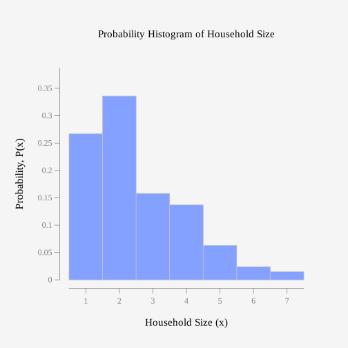
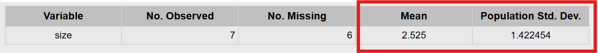

::: {.callout-note}
## Chapter 5 Objectives

By the end of Chapter 5, you should be able to:

 - Recognize, describe, and verify discrete probability distributions.
 - Calculate and interpret expected value (mean) and standard deviation.
 - Recognize, verify, and analyze binomial proability distributions.
 - Calculate and intertpret binomial probabilities.
 - Create binomial probability distributions.

:::

**Before you begin, review the process for importing a dataset.** Click on the box below to expand the directions for importing a dataset into your Data Toolbox.

::: {#Importing-Data-to-Rguroo-Chapter-5 .callout-note appearance="simple" collapse="true" icon="none" title="{width=22px style='vertical-align:middle;'}  Importing Data to Rguroo"} 

1. Open the **Data** toolbox in Rguroo.  
2. From the [Data Import]{.dpd} dropdown, select [Dataset Repository]{.fun}.  
3. In the top search box, type [kozak]{.typein}, then select the [Statistics Using Technology – Kozak]{.repo} repository.  
4. In the middle search box, type the first few letters of the dataset, and choose your dataset that appears in the lower panel.  
5. Click the [Import]{.button}. The dataset will be imported into your Rguroo account.  
6. Click the [Close]{.button} to close the dialog.  
7. To view the dataset, double-click the dataset under the **Data** toolbox list.

:::

When calculating probabilities, we begin by identifying the sample space—the complete set of all possible outcomes of an experiment. When each of these outcomes is assigned a probability, the combination forms a probability distribution. This distribution allows us to examine the overall shape of the data, compute measures such as the mean and standard deviation, and determine the likelihood of specific events. The methods used to find these values depend on the type of numerical data involved. Recall that numerical variables fall into two categories: discrete and continuous. **Discrete data** can only take specific, separate values within a given range, while **continuous data** can take on any value within that range. Typically, discrete data arise from counting, whereas continuous data come from measurement. Discrete probability distributions provide a way to model and understand situations in which outcomes can be counted.

::: {#exm-discrete-continuous-review}
## Review of Discrete or Continuous Variables

Classify the numerical variable as discrete or continuous.

a.  The height of a tree measured in inches.

b.  The number of A's you receive on your college transcript.

:::

::: {.callout-tip .solution-callout collapse="true" icon=false}
## 🔎 Solution
a.  The heigt of a tree in inches is continuous since it is something you measure and can take on fractional values.

b.  The number of A's you receive on your college transcript is discrete since it is something you count.
:::

## Basics of Probability Distributions

A probability distribution can be illustrated with a simple experiment such as tossing a fair coin twice. The sample space, which lists all possible outcomes, is:
$$\{HH, HT, TH, TT\}$$

where H represents heads and T represents tails. Since the coin is fair, each outcome has an equal probability of $1/4$.

But, what if we wanted to ask other questions such as

- What is the probability of getting exactly one heads?
- What is the probability of getting at most one tails?

These questions can be answered more easily with a discrete probability distribution.


### Random Variables and Probability Distributions

A **random variable** describes the outcomes of an experiment.  Usually, we use capital $X$ to describe the random variable in words and use lower case $x$ to denote the values that the random variable can take on.  For example, in the fair coin toss experiment above, we can let $X$ = the number of heads. Then, $x$ could be 0 (no heads - TT), 1 (one heads - HT or TH), or 2 (two heads - HH). So 

$$X= \text{number of heads}$$
$$x=\{0, 1, 2\}$$


Now suppose you put all the values of the random variable together with the probability that the random variable would occur. You would then have a **probability distribution**, a table of values that lists the random variable values with their corresponding probabilities. For the random variable $X$ = the number of heads (in the coin toss example), we would need to calculate the probabilities for each outcome. So, for $x$ = 0, that would be zero heads (or TT) and occurs one out of four times in the sample space. As a result, the probability for $x$ = 0 is $1/4$.  For $x$ = 1 (or one head), this could occur as HT or TH. So, the probability of $x$ = 1 would be two possible ways in the sample space out of four or $2/4$ which reduced equals $1/2$.  Finally, for $x$ = 2 (or two heads), this occurs as HH in the sample space and the probability would be $1/4$.  Putting this all together in a table, we get the probability distribution below.

<div style="width: 50%; margin: auto;">

|  $x$  | $P(x)$ |
|-------|--------|
|  $0$  | $1/4$  |
|  $1$  | $1/2$  |
|  $2$  | $1/4$  |

: Probability Distribution for Number of Heads {#tbl-prob-dist-coin tbl-alt="Probability distribution showing the values of the random variable x in the first column and probabilities in the second column"}

</div>

As with probabilities, probability distributions, have to follow the rules of probabilities, $0 \le P(outcome)\le1$ and $\sum{P(outcomes)}=1$. We can check these ruleswith the probability distribution above. First we can verify that each probability, $P(x)$, is between 0 and 1.  And, if we add up all the probabilities, $1/4 + 1/2 + 1/4$ we get 1.

::: {#exm-verify-distribution}
## Verifying Probability Distributions

Determine if the following distributions are discrete probability distributions.  If it is not a discrete probability distribution, state why.

a. Suppose a traffic study records the number of accidents that happen at a busy intersection in one week. Let 
$X$ = number of accidents per week. The probabilities are shown in the table below.

<div style="width: 50%; margin: auto;">

| $x$  | $P(x)$ |
|------|--------|
| 0    | 0.30   |
| 1    | 0.40   |
| 2    | 0.10   |
| 3    | 0.20   |

: Distribution for number of accidents {#tbl-accidents tbl-alt="Table showing values of the random variable as 0, 1, 2, and 3. The probabilities in the second column are 0.30, 0.40, 0.10, and 0.20"}

</div>

b. Suppose a researcher records the number of texts people receive. Let $X$ = number of texts in one hour. The probabilities are shown in the table below.

<div style="width: 50%; margin: auto;">

| $x$  | $P(x)$ |
|------|--------|
| 0    | 0.10   |
| 1    | 0.15   |
| 2    | 0.25   |
| 3    | 0.33   |
| 4    | 0.12   |
| 5    | 0.10   |

: Distribution for number of texts received in one hour {#tbl-texts tbl-alt="Table showing values of the random variable as 0, 1, 2, 3, 4, and 5. The probabilities in the second column are 0.10, 0.15, 0.25, 0.33, 0.12, and 0.10"}

</div>
 
:::


:::{.callout-tip .solution-callout collapse="true" icon=false}
## 🔎 Solution

To determine if each is a discrete probability disribution, we must verify the two rules of probability.

a. Verify Rule 1: Each probability is between 0 and 1. 

   Verify Rule 2: $0.30 + 0.40 + 0.10 + 0.20 = 1.00$

   Both rules are satisfied, so this is a valid discrete probability distribution.

b. Verify Rule 1: Each probability is between 0 and 1. 

   Verify Rule 2: $0.10 + 0.15 + 0.25 + 0.33 + 0.12 + 0.10 = 1.05$

   The probabilities do not add up to exactly $1$, so this is not a valid discrete probability distribution.

:::

::: {#exm-prob-dist}
## Using a Probability Distribution

The 2010 U.S. Census found the chance of a household being a certain size. The data is in @tbl-Household (\\"Households by age,\\" 2013). Note, the category 7 is really 7 or more people in the household. Use the probability distribution to answer the following questions.

 The dataset for this example is available in the Rguroo dataset repository [Kozak]{.repo}, with the dataset name [table_5_1_1]{.data}.

```{r , echo=FALSE}
#| tbl-alt: "Table showing household size"
#| label: tbl-Household
#| tbl-cap: "Household Size from U.S. Census of 2010"
Household<- read.csv( "https://krkozak.github.io/MAT160/table_5_1_1.csv") 
knitr::kable(Household)
```

a. What is the probability that a randomly selected household has exactly 2 people?

b. What is the probability that a randomly selected household has at most 3 people?

c. What is the probability that a randomly selected household has at least 4 people?

:::

:::{.callout-tip .solution-callout collapse="true" icon=false}
## 🔎 Solution

a.  We want to find the probability of exactly 2 people in the household. We can denote that with $P(2)$. To find this, we can use the table and find the probability that corresponds to $x = 2$.  So, $P(2) = 0.336$.

b. "At most 3" people means 3 or less (including 3), so we would need to find $P(x\le 3)$, meaning $P(x) = 1$ or $P(x) = 2$ or $P(x) = 3$.  Remember that "or" means add in probability. So, to find $P(x \le 3)$, we add up the probabilities from $x=1$ to $x=3$.  So, $P(x \le 3) = 0.267 + 0.336 + 0.158  = 0.761$.

c.  "At least 4" people means 4 people or more.  Similarly to part (b) we need to add.  In this case, we would calculate $P(x \ge 4) = P(4) + P(5) + P(6) + P(7) = 0.137 + 0.063 + 0.024 + 0.015 = 0.239$

:::

We can also display probability distributions in graphical form, called a **probability histogram**.  Probability histograms are similar to the histograms in Chapter 2, only the x axis will contain the random variable $x$ and the y-axis will contain the $P(x)$. We will use Rguroo to create probability histograms.

::: {#exm-prob-histogram}
## Creating a Probability Histogram

Use the 2010 U.S. census for number of people in a household to create a probability histogram.

 The dataset for this example is available in the Rguroo dataset repository [Kozak]{.repo}, with the dataset name [table_5_1_1]{.data}.

:::

:::{.callout-tip .solution-callout collapse="true" icon=false}
## 🔎 Solution

Click to expand the box below see how to create a probability histogram for [table_5_1_1]{.data}.

:::: {#Creating-Probability-Histogram-in-Rguroo .callout-note appearance="simple" collapse="true" icon="none" title="{width=22px style='vertical-align:middle;'} Creating a Probability Histogram in Rgruoo"}

**Before you begin:** Make sure you have already imported the [table_5_1_1]{.data} dataset into your Rguroo account, as was shown [here](#Importing-Data-to-Rguroo-Chapter-5).

1. Open the **Plots** toolbox in Rguroo.  
2. Open the [Create Plot]{.dpd} dropdown, and select [Histogram]{.fun}. This opens the Histogram dialog.  
3. In the Histogramn dialog, choose the [table_5_1_1]{.data} dataset from the [Dataset]{.dpd} dropdown. 
4. Then, select [size]{.var} in the [Variable]{.dpd} dropdown menu and [prob]{.var} in the [Frequency]{.dpd} dropdown menu. 
5. Type in a title for your table, and label the x and y axes. Since this graph represents a probability histogram, we can use "Probability Histogram for Household Size" as the title, "Household size (x)" for the x-axis, and "Probability, P(x)" as for the y-axis.
5. Select "Relative Frequency" in the Type box, since this is probability.     
6. Click the preview icon  to see a preview of the probability histogram.

::: {.callout-tip .inner-callout appearance="simple" collapse="true" icon="none" title="Click here to see the Rguroo dialog"}

{width=500px}

:::

Now, since this is a probability histogram, we need to adjust the graph.  To do this, follow the steps below.

1. Click on the Details box.
2. Select Bins, Bars, and Smoothing.
3. In the Bin Breakpoints box, select center and enter [1]{.typein} for start and [1]{.typein} for the width. This will start the probability histogram at the fist value of our random variable and center the bars.
4. Click the preview icon  to see a preview of the final probability histogram.

::: {.callout-tip .inner-callout appearance="simple" collapse="true" icon="none" title="Click here to see the Rguroo dialog"}

{width=500px}

:::
::::

```{r,echo=FALSE}
#| fig-alt: "See the description of the graph below the graph"
#| warning: FALSE
#| label: fig-prob-hist
#| fig-cap: "Probability histogram of household size"

```

@fig-prob-hist shows the probability distribution of household sizes, with the highest probabilities occurring at  households with 1–2 people. As the household size increases from 3 to 7, the probability steadily decreases, indicating that larger households are less common. Overall, the distribution is right-skewed, demonstrating that most households tend to be small, while very large households are not as common.

:::

### Mean or Expected Value and Standard Deviation 

In probability distributions, the **mean**, also called the **expected value**, represents the long-run average outcome of a random variable. Recall from Chapter 3, the Law of Large Numbers states that as the number of trials, $n$, of an experiment increases, the relative frequency of an event gets closer and closer to the true probability of that event. So, the long-term average, the mean (or expected value) of a probability distribution, is the average you would expect if the number of trials were repeated an infinite number of times. Since the expected value of a random variable is a theoretical, long-run average, it is treated as a population parameter and is labeled as $\mu$.  We can calculate the expected value using the formula below or using statistical software, like Rgruoo.

$$\mu = \sum (x \cdot P(x))$$


The standard deviation is 

$$\sigma = \sqrt{\sum[(x-\mu)^2 \cdot P(x)]}$$

Since the formula for standard deviation is a little more complicated, we will only find this using technology.

::: {#exm-expected-value1}
## Calculating Expected Value and Standard Deviation

Use the 2010 U.S. census for number of people in a household to find the expected value and standard deviation. Interpret the expected value.

 The dataset for this example is available in the Rguroo dataset repository [Kozak]{.repo}, with the dataset name [table_5_1_1]{.data}.
:::

:::{.callout-tip .solution-callout collapse="true" icon=false}
## 🔎 Solution

Click to expand the box below to see how to find the mean and standard deviation for [table_5_1_1]{.data}.

:::: {#Finding-Expected-Value-in-Rguroo .callout-note appearance="simple" collapse="true" icon="none" title="{width=22px style='vertical-align:middle;'} Finding Expected Value and Standard Deviation in Rgruoo"}

**Before you begin:** Make sure you have already imported the [table_5_1_1]{.data} dataset into your Rguroo account, as was shown [here](#Importing-Data-to-Rguroo-Chapter-5).

1. Open the **Analysis** toolbox in Rguroo.  
2. Select [Numerical Summaries]{.fun}. This opens the Numerical Summaries dialog.  
3. In the Numerical Summaries dialog, choose the [table_5_1_1]{.data} dataset from the [Dataset]{.dpd} dropdown. 
4. Then, select [size]{.var} and either click the right arrow or drag it over to the Selected box.
5. Select [prob]{.var} in the [Frequency]{.dpd} dropdown menu. 
6. Click the univariate button, then select mean and population standard deviation. We select the population standard deviation since the probability distribution accounts for 100% of the outcomes.    
7. Click the preview icon  to see a preview of the mean (expected value).

::: {.callout-tip .inner-callout appearance="simple" collapse="true" icon="none" title="Click here to see the Rguroo dialog"}

{width=500px}

{width=500px}

:::

::::

```{r,echo=FALSE}
#| fig-alt: "Rguroo output of mean equal to 2.525 and standard deviation equal to 1.422454"
#| warning: FALSE
#| label: fig-exp-value
#| fig-cap: "Rguroo Output of Expected Value (Mean) and Standard Deviation"

```

Rguroo gives us $\mu = 2.525$ and $\sigma = 1.422454$

The expected value means that on average, across many households, you can expect about 2.525 people per household.  In other words, most households have between 2 and 3 people.

:::


::: {#exm-expected-value2}
## Calculating Expected Value

In the Arizona lottery game called Pick 3, a player pays \\\$1 and then picks a three-digit number. If those three numbers are picked in that specific order the person wins \\\$500. What is the expected value to the player in this game? Interpret the expected value.

:::

:::{.callout-tip .solution-callout collapse="true" icon=false}
## 🔎 Solution

To find the expected value, we need to create a probability distribution with all possible outcomes.  Since we are finding the expected value to the player, the random varibale $x$ = winnings to the player. 

In the lottery, there are two outcomes for the player: win or lose. If you pick the right numbers in the right order, then you win \\\$500, but remember, you paid \\\$1 to play, so you actually win \\\$499. If you didn't pick the right numbers, you lose the \\\$1, and the $x$ value is \$-1\$. 

You also need the probability of winning and losing. Since you are picking a three-digit number, and for each digit there are 10 numbers you can pick with each independent of the others, you can use the multiplication rule. To win, you have to pick the right numbers in the right order. The first digit, you pick 1 number out of 10, the second digit you pick 1 number out of 10, and the third digit you pick 1 number out of 10. So there are $10 \cdot 10 \cdot 10 = 1000$ ways to pick three numbers.

The probability of picking the right number in the right order is \$\frac{1}{1000}\$. The probability of losing (not winning) would be

$1-\frac{1}{1000}=\frac{999}{1000}$.

This can be best orgainized in a table.

| outcome | amount | probability |
|---------|--------|-------------|
| win     | 499    | 0.001       |
| lose    | -1     | 0.999       |

: Probability distribution for winning lottery {#tbl-texts tbl-alt="Table showing toe outcomes, win or lose. Value of winning is 499, with a probability of 0.001 and value of losing is -1, with a probability of 0.999."}

We can create this table in Rguroo so we can find the expected value.  

Click to expand the box below see how to create a new dataset.

:::: {#Creating-Dataset-in-Rguroo .callout-note appearance="simple" collapse="true" icon="none" title="{width=22px style='vertical-align:middle;'} Creating a Dataset in Rgruoo"}

1. Open the **Data** toolbox in Rguroo.  
2. Select [Data Import]{.fun} and select Create New Dataset. 
3. Enter the number of rows and columns. In this case, we only enter the numbers, so enter [2]{.typein} for the No. of Rows and [2]{.typein} for the No. of Columns.
4. Click, create dataset.
5. Enter the values in the table. You can use the tab key on your computer to move from cell to cell.
6. Click the three horizontal line icon by Var1, and select rename. Rename to [Amount]{.typein}.  Repeat this process for Var2, and rename to [Probability]{.typein}.  
7. In Save As... textbox, name the new dataset [Arizona Lottery]{.typein} and click the [Save As...]{.button} button.

::: {.callout-tip .inner-callout appearance="simple" collapse="true" icon="none" title="Click here to see the Rguroo dataset"}

{width=500px}

:::

::::

Use Rguroo and the steps from the last example [here](#exm-expected-value1) to find the expected value.  We get,

$\mu_{winnings} = -0.50$

This means that if you played the lottery *many* times, you would expect to lose about \\\$0.50 each game. Remember that expected value is the long-run average. We know we lose exactly \\\$1 each time, but from winning and losing if we played the game often, we would average a loss of 50 cents per game.  Another way to think of this is if we played the game 100 times, we would expect to lose about $0.50 \cdot 1000 =$ \\\$50.

:::

::: {#exm-expected-value3}
## Using Expected Value

Suppose an auto insurance company collects data on the number of accidents per year for both males and females.  Based on the data, the following are probability distributions where $x$ = number of accidents per year.

<div style="width: 50%; margin: auto;">

| $x$  | $P(x)$ |
|------|--------|
| 0    | 0.50   |
| 1    | 0.25   |
| 2    | 0.15   |
| 3    | 0.07   |
| 4    | 0.03   |

: Distribution for number of accidents per year for males {#tbl-texts tbl-alt="Table showing values of the random variable as 0, 1, 2, 3, and 4. The probabilities in the second column are 0.50, 0.25, 0.15, 0.07, and 0.03"}

</div>
 

<div style="width: 50%; margin: auto;">

| $x$  | $P(x)$ |
|------|--------|
| 0    | 0.60   |
| 1    | 0.22   |
| 2    | 0.10   |
| 3    | 0.05   |
| 4    | 0.03   |

: Distribution for number of accidents per year for females {#tbl-texts tbl-alt="Table showing values of the random variable as 0, 1, 2, 3, and 4. The probabilities in the second column are 0.60, 0.22, 0.10, 0.05, and 0.03"}

</div>

How could the insurance company use this data to inform auto policy premiums?
 
:::

:::{.callout-tip .solution-callout collapse="true" icon=false}
## 🔎 Solution

Insurance companies could compare the expected values of the number of accidents per year for both males and females.  Let's compute both and compare.

Using Rguroo, we get the following expected values.

$\mu_{males} = 0.88$

$\mu_{females} = 0.69$

This means, on average (in the long run), males are expected to have about 0.88 accidents per year, while females are expected to have about 0.69 accidents per year.  Since males are expected to have more accidents per year, the insurance company could assign higher yearly premiums to male drivers to account for more expected payouts from accidents.

:::

### Unusual Events

Imagine flipping a fair coin 10 times and getting heads every single time. While it is possible, it is extremely unlikely and would make most people question whether the coin is truly fair. In statistics, this type of outcome is called an **unusual event**, meaning it has a very low probability of occurring under normal conditions. Typically, events with a probability of 5% (or 0.05) or less are considered unusual, and those with a probability of 1% (or 0.01) or less are considered very unusual. Recognizing unusual events helps statisticians determine whether a result is simply due to chance or if there may be an underlying factor influencing the outcome.

::: {#exm-unusual1}
## Determining if an Event is Unusual

Use the 2010 U.S. Census for household size to answer the following questions. The data is in @tbl-Household (\\"Households by age,\\" 2013).

a. Is it unusual to have at most 2 people in a household?

b. Is it unusual to have between 3 and 5 people in a household?

c. Is it unusual to have more than 7 people in a household?

:::

:::{.callout-tip .solution-callout collapse="true" icon=false}
## 🔎 Solution

Below is a copy of the dataset for number of people in a household. Remember, the category 7 is really 7 or more people in the household. 

```{r , echo=FALSE}
#| tbl-alt: "Table showing household size"
#| label: tbl-Household2
#| tbl-cap: "Household Size from U.S. Census of 2010"
Household<- read.csv( "https://krkozak.github.io/MAT160/table_5_1_1.csv") 
knitr::kable(Household)
```

a. At most two people means either having one or two people in the household.  This can also be written as $P(x\le 2)$. Remember from Chapter 4 that "or" means add, so we get 

   $P(x\le 2) = P(1) + P(2) = 0.267 + 0.336 = 0.603$.  

   Since this probability is not less than 0.05, it is not unusual to have at most 2 people in a household.

b. Between 3 and 5 people means either 3 or 4 or 5 people.  Just as before, we can add all the probabilities together. 

   $P(3\le x \le 5)= P(3) + P(4) + P(5) = 0.158 + 0.137 + 0.063 = 0.358$.  

   Again, because this probability is not less than 0.05, it is not ususaul to have between 3 and 5 people in a household.

c. For 7 or more people in a household, remember that the row with 7 is really 7 or more people.  For this we take the value given in the table, 

   $P(x\ge 7) = 0.015$.  

   This probability is less than 0.05, so it is unusual to have 7 or more people in a household.

:::

### Homework for Section 5.1

1.  Eyeglassomatic manufactures eyeglasses for different retailers. The number of days it takes to fix defects in an eyeglass and the probability that it will take that number of days are in @tbl-Days.

::: {tabindex="0" style="width:85%; margin:auto;"}
 The dataset for this exercise is available in the Rguroo dataset repository [Kozak]{.repo}, with the dataset name [table_5_1_3]{.data}.
:::

```{r, echo=FALSE }
#| tbl-alt: "Table showing Number of Days to Fix Eyeglasses"
#| label: tbl-Days
#| tbl-cap: "Number of Days to fix Eyeglasses"
Days<- read.csv("https://krkozak.github.io/MAT160/table_5_1_3.csv") 
knitr::kable(Days)
```

a.  State the random variable.
b.  Draw a histogram of the number of days to fix defects
c.  Find the mean number of days to fix defects.
d.  Find the variance for the number of days to fix defects.
e.  Find the standard deviation for the number of days to fix defects.
f.  Find probability that a lens will take at least 16 days to make a fix the defect.
g.  Is it unusual for a lens to take 16 days to fix a defect?
h.  If it does take 16 days for eyeglasses to be repaired, what would you think?


2.  Suppose you have an experiment where you flip a coin three times. You then count the number of heads.

<!-- -->

a.  State the random variable.
b.  Write the probability distribution for the number of heads.
c.  Draw a histogram for the number of heads.
d.  Find the mean number of heads.
e.  Find the variance for the number of heads.
f.  Find the standard deviation for the number of heads.
g.  Find the probability of having two or more number of heads.
h.  Is it unusual for to flip two heads?

<!-- -->

3.  The Ohio lottery has a game called Pick 4 where a player pays \\\$1 and picks a four-digit number. If the four numbers come up in the order you picked, then you win \\\$2,500. What is your expected value? Interpret the results.

4.  An LG Dishwasher, which costs \\\$800, has a 20% chance of needing to be replaced in the first 2 years of purchase. A two-year extended warranty costs \\\$112.10 on a dishwasher. What is the expected value of the extended warranty assuming it is replaced in the first 2 years? Interpret the results.

## Binomial Probability Distribution 

Imagine a factory that produces light bulbs, where each bulb can either be defective or not defective. If a company tests 20 bulbs and wants to know the probability that exactly 3 are defective, they need a systematic way to calculate that likelihood. In Section 5.1, we learned about probability distributions. One important type of probability distribution is the **binomial probability distribution**, which comes from a **binomial experiment** (or Bernoulli trial). This type of experiment allows us to calculate a specific number of successes.

::: {.callout-note}
## Properties of a Binomial Experiment

1.  The experiment has a fixed number of trials, $n$.

2.  The $n$ trials are independent, which means that what happens on one trial does not influence the outcomes of other trials.

3.  There are only two disjoint outcomes, which are called a success and a failure.

4.  The probability of a success doesn't change from trial to trial, where $p$ = probability of success and $q = 1-p$ = probability of failure.

:::

If you know you have a binomial experiment, then you can calculate binomial probabilities. This is important because binomial probabilities come up often in real life. Examples of binomial experiments are:

Toss a fair coin ten times, and find the probability of getting two heads.

Question twenty people in class, and look for the probability of more than half being women?

Shoot five arrows at a target, and find the probability of hitting it five times?

::: {#exm-binomial-conditions}
## Verify if Experiment is Binomial

Determine if the following represent a binomial experiment.  If it is not binomial, explain why.

a. You survey 200 people and ask if they think gas prices are too high.

b. You roll a six-sided fair die 8 times and record the face value.

c. You select 5 cards from a standard deck without replacement and record the number of Aces.

d. You select 3 marbles from a bag with replacement and record the number of green marbles.

:::

:::{.callout-tip .solution-callout collapse="true" icon=false}
## 🔎 Solution

In each case, we need to verify that all four properties of a binomial experiment are met.

*Property 1: Fixed number of trials.*

*Property 2: Trials are independent.* 

*Property 3: Two disjoint outcomes.*

*Property 4: Probability of success is the same for each trial.*

a. Property 1: Since we survey 200 people, $n=200$ is fixed.

   Property 2: One person's answer does not affect the next person's answer, so the trials are independent.

   Property 3: The person can answer yes or no, so there are two disjoint outcomes.

   Property 4: The probability that a person says "yes" is 50% and is the same for each trial.

   Since all four properties are met, this is a binomial experiment.  

b. Property 1: Since we roll the die 8 times, $n=8$ is fixed.

   Property 2: Rolling a die does not affect the next roll, so the trials are independent.

   Property 3: Since you record the face value of the die, there are 6 outcomes (1, 2, 3, 4, 5, 6). 

   Since there are 6 outcomes, this is not a binomial experiment and we do not need to continue verifying the properties.

c. Property 1: Since we select 5 cards, $n=5$ is fixed.

   Property 2: Since you draw the cards without replacement, the first draw is out of 52 cards, the next draw is out of 51 card, and so on. So the trials are not independent.

   Since the trials are not independent, this is not a binomial experiment and we do not need to continue verifying properties. 

d. Property 1: Since we draw 3 marbles, $n=3$ is fixed.

   Property 2: Since we draw *with replacement*, we will be always drawing out of the original bag of marbles. So, the trials are independent.

   Property 3: When we draw a marble, we record if it is green or not green, so there are two disjoint outcomes.

   Property 4: Again, since we draw with replacement, the probability of drawing a green is the same for all trials. 

   Since all four properties are met, this is a binomial experiment.  

:::

### Calculating Binomial Probabilities

Just as we did in Section 5.1, we need to define our random variable $x$. Since we measure success in a binomial experiment, the random variable is $x$ = number of successes.

Note, success does not always mean a positive outcome.  For example, for medication trials, you may want to measure the number of side effects.  In this case, the side effects would be considered the "success." So, a success just means you observed the outcome you are measuring.

To calculate binomial probabilities, there are two methods, a formula and using technology, such as Rguroo.

The Binomial Formula for the probability is 

$$P(X=r)=_nC_r\cdot p^r \cdot q^{n-r}$$

where $n$ is the number of trials, $r$ is the number of successes, $p$ is the probability of success, and $q = (1-p)$ is the probability of failure. Note: $_nC_r$ is the number of combinations of $n$ things taking $r$ at a time (from Chapter 4).

When solving problems, make sure you define your random variable and state what $n$, $p$, and $r$ are. This makes calculating binomial probabilities much easier. Also, remember that binomial probabilities still follow the probability rules that each probability is between 0 and 1, inclusive and all probabilities add to a total of 1.

::: {#exm-calculating-binomial1}
## Calculating Binomial Probability

When looking at a person's eye color, it turns out that 1% of people in the world have green eyes ("What percentage of," 2013). Consider a group of 20 people. Use the formula to find the probabilities.

a. Verify that this is a binomial experiment.
b. State the random variable, the number of trials, and the probability of success.
c. Find the probability that none of the 20 people have green eyes.
d. Find the probability that exactly 9 of the people have green eyes.
e. Find the probability that at most 1 person has green eyes.

:::

:::{.callout-tip .solution-callout collapse="true" icon=false}
## 🔎 Solution

a. To verify that this is a binomial distribution, we need to check all four properties.

   Property 1: There are a fixed number of trials since we have 20 people total.

   Property 2: Since the eye color of one person does not affect the eye color of another person, the trials are independent.

   Property 3: Since we are recording if the eye color is green or not green, there are two disjoint outcomes.

   Property 4: The probability of a person having green eyes is 0.01 and that probability is the same for each person in this experiment.


b. Since we wish to measure the number of people with green eyes, we have the following 

   $x$ = number of people with green eyes

   $n = 20$

   $p = 0.01$

c. If none of the 20 people have green eyes, $r=0$.  Plugging into the formula, we get 

   $P(X=0)=_{20}C_0\cdot (0.01)^0 \cdot (1-0.01)^{20-0}$

   $= _{20}C_0\cdot (0.01)^0 \cdot (0.99)^{20}$ 

   $= (1)(1)(0.8179) = 0.8179$

d. For exactly 9 people to have green eyes, we use the same technique, only $r=9$

   $P(X=9)=_{20}C_9\cdot (0.01)^9 \cdot (1-0.01)^{20-9}$

   $= _{20}C_9\cdot (0.01)^9 \cdot (0.99)^{11}$ 

   $= 1.5 \cdot 10^{-13}$

   $1.5 \cdot 10^{-13}$ is scientific notation, where if we converted this to a standard number, we would need to move the decimal place left 13 places.  This means the probability of 9 people out of 20 having green eyes is extremly small, almost 0. Finding 9 people out of 20 that have green eyes would be considered unusual.

e. If we want the probability of at most 1 person, then $r$ could be 0 or 1 people having green eyes.  Just as we did before, we will find the probabilities and add them together.

   $P(x\le 1) = P(X=0) + P(X=1)$

   This means we will need to use the formula twice and add the values together.  Luckily, we already found $P(X=0) = 0.8179$ in part b. So we will focus on finding $P(X=1)$

   $P(X=1)=_{20}C_1\cdot (0.01)^1 \cdot (1-0.01)^{20-1}$

   $= _{20}C_1\cdot (0.01)^1 \cdot (0.99)^{19}$ 

   $= 0.1652$

   So $P(x\le 1) = P(X=0) + P(X=1) = 0.8179 + 0.1652 = 0.9831$

:::

Notice that the formula for binomial proabilities only calculates *exact* probabilities.  As we saw in part (e) of the last example, we needed to use the formula twice.  Only using the formula for binomial probabilities can be time consuming since we do not always want to find exact probabilities.  That is where technology, such as Rguroo, comes in!

::: {#exm-calculating-binomial2}
## Calculating Binomial Probability

According to the Center for Disease Control (CDC), about 1 in 88 children in the U.S. have been diagnosed with autism ("CDC-data and statistics," 2013). Suppose you consider a group of 10 children. Use Rguroo to find the probabilities.

a. Verify that this is a binomial experiment.
b. State the random variable, the number of trials, and the probability of success. 
c. Find the probability that none have autism.
d. Find the probability that at least five have autism.
e. Find the probability that at most two have autism.
f. Find the probability that between 1 and 4, inclusive of 1 but not 4, have autism.
g. Suppose six children out of ten have autism. Is this unusual? What does that tell you?

:::

:::{.callout-tip .solution-callout collapse="true" icon=false}
## 🔎 Solution

a. We again need to verify all four properties.

   Property 1: There are 10 children, and each child is a trial, so there are a fixed number of trials. 

   Property 2: Whether a child has autism does not affect the chance that the next child has autism. Thus the trials are independent.

   Property 3: Either a child has autism or they do not have autism, so there are two disjoint outcomes. 

   Property 4: The probability of a child having autism is $\frac{1}{88}$. This is the same for every trial since each child has the same chance of having autism.

b. Since we wish to measure whether the child has autism, we have the following 

   $x$ = number of children with autism

   $n = 10$

   $p = \frac{1}{88}$

c.  To find the probability that none have autism, $r=0$ and we find $P(X=0)$

Click to expand the box below to see how to calculate binomial probabilities.

:::: {#Calculate-Bin_Prob-in-Rguroo .callout-note appearance="simple" collapse="true" icon="none" title="{width=22px style='vertical-align:middle;'} Calculating Binomial Probabilities in Rgruoo"}

1. Open the **Probability-Simulation** toolbox in Rguroo.  
2. Click on the [Probability]{.dpd}, hover over [Probability Calculator]{.fun}, and select [Discrete]{.fun}.  This opens the [Discrete Distributions Probability Calculator]{.dialog} dialog.
3. In the [Discrete Distributions Probability Calculator]{.dialog} dialog, select [Binomial]{.dpd} from the dropdown menu (it usually defaults to this).
4. Select Values $\Rightarrow$ Probability, since we will be inputting values and we want the probability.
5. Enter [20]{.typein} for the No. of Trials and [1/88]{.typein} for the Prob. of Success. 
6. Since we want the probability of exactly 0, select [Equal]{.dpd} in the dropdown menu. Then enter [0]{.typein} in the next box.
7. Click the preview icon  to see the probability.


::: {.callout-tip .inner-callout appearance="simple" collapse="true" icon="none" title="Click here to see the Rguroo dialog"}

{width=500px}

:::

::::

Rguroo gives $P(X=0)=0.892$

d.  At least 5 have autism would be finidng $P(X\ge 5)$.  Follow the same steps as in part (c), but adjust for the values and inequality sign.  In this case, we would select [Above]{.dpd} in the dropdown since we want greater than.  Notice also that a little check box appears. When the box is checked, it means to include the value. Since we want greater than *or equal to* keep the box checked.

::: {.callout-tip .inner-callout appearance="simple" collapse="true" icon="none" title="Click here to see the Rguroo dialog"}

{width=500px}

:::

Rguroo gives $P(X\ge 5) = 4.5534 e-08$

This is scientific notation, and if we were to write in standard form we would move the decimal left 8 places. Taht means that the probability is very small.

e.  At most two have autism would be finding $P(\le2)$. We will use Rguroo again. In this case, we would select [Below]{.dpd} and keep the little box checked.

::: {.callout-tip .inner-callout appearance="simple" collapse="true" icon="none" title="Click here to see the Rguroo dialog"}

{width=500px}

:::

Rguroo gives $P(X\le2) = 0.99983$

f. Between 1 and 4, inclusive of 1 but not 4, have autism would be finding $P(1\le X<4)$

In the Rguroo probability calculator, select [Between]{.dpd}. Notice that two boxes appear with two little boxes next to them.  We will enter [1]{.typein} in the Lower tail box and [4]{.typein} in the Upper tail box.  Since we want to inlcude 1, we leave the little check box next to 1.  Since we do not want to include 4, we uncheck the little box next to 4.

::: {.callout-tip .inner-callout appearance="simple" collapse="true" icon="none" title="Click here to see the Rguroo dialog"}

{width=500px}

:::

Rguroo gives $P(1\le X<4) = 0.110799$

g.  To find if 6 out of 10 children having autism is unusual, we need to find the probability of $P(X=6)$.

::: {.callout-tip .inner-callout appearance="simple" collapse="true" icon="none" title="Click here to see the Rguroo dialog"}

{width=500px}

:::

Rguroo gives $P(X=6) = 4.3199e-10$. If we change this to a standard number, we would get $0.00000000043199$. Since this is less than 0.05, it is unusual for 6 children out of 10 to have autism. If this does happen, then one may think that the proportion of children diagnosed with autism is actually more than $\frac{1}{88}$.

:::

### Mean and Standard Deviation

If you list all possible values of $x$ in a Binomial distribution, you get the **Binomial Probability Distribution**.When working with a binomial probability distribution, we are often interested not only in the probability of specific outcomes but also in the overall behavior of the distribution. Two important measures that describe this behavior are the mean and standard deviation. The mean tells us the expected number of successes in a given number of trials, while the standard deviation measures how much the results typically vary from that expected value. Together, these values provide a clearer understanding of where most outcomes are likely to fall and how spread out the distribution is, helping us interpret binomial experiments more effectively.

Just like calculating expected value, there are two ways to compute the mean and standard deviation of a binomial distribution; a formula and using technology.

The formulas for the mean, $\mu$ and standard deviation $\sigma$ are 

$\mu = np$ $\;$      and $\;$        $\sigma = \sqrt{np(1-p)}$

These formulas are useful since they are simple. However, you can also use technology to find the mean and standard deviation as we did in Section 5.1.


::: {#exm-calculating-binomial-mean-std-dev}
## Calculating Mean and Standard Deviation for Binomial Probability

A hospital finds that a vaccine is effective 95% of the time. A nurse administers the vaccine to 20 patients. Let $X$ represent the number of patients for whom the vaccine is effective.

a. Find the mean and standard deviation of the distribution.

b. Interpret both values in the context of this scenario.

:::

:::{.callout-tip .solution-callout collapse="true" icon=false}
## 🔎 Solution

Note: You should always verify that the experiment is a binomial experiment (satisfies the four properties) *before* using the binomial distribution formulas for the mean and standard deviation. This experiment is a binomial experiment, with $n = 20$ and $p = 0.95$.

a. The mean is $\mu = np = (20)(0.95) = 19$

   The standard deviation is $\sigma = \sqrt{np(1-p)} = \sqrt{(20)(0.95)(1-0.95)} = \sqrt{(20)(0.95)(0.05)} = 0.975$

b.  A mean of 19 means that, on average, we expect about 19 out of 20 patients to have an effective response to the vaccine. The standard deviation of about 0.98 indicates that the number of successful outcomes typically varies by about 1 patient from the mean.

:::

### Creating Probability Distributions 

When a situation meets the conditions of a binomial experiment (satisfying all four properties), we can build a binomial probability distribution using the values of $n$ (number of trials) and $p$ (probability of success). This distribution shows the likelihood of obtaining each possible number of successes, from $0$ up to $n$. By using Rguroo to find the probability for each value of the random variable $x$, we can construct the full distribution and better understand how probable different outcomes are in a real-world scenario.

::: {#exm-binomial-distribution}
## Creating a Distribution for Binomial Probability

Imagine a quality inspector at a factory is checking boxes of batteries for defects. Each battery has a 1% chance of being defective, and the inspector selects a box of 15 batteries.  A sample of 3 batteries from the box is selected at random with replacement. Define the random variable X as the number of defective batteries in the box.

a. Construct a binomial distribution for X.

b. What is the expected value of X? Interpret the results.

:::

:::{.callout-tip .solution-callout collapse="true" icon=false}
## 🔎 Solution

Note: You should always verify that the experiment is a binomial experiment (satisfies the four properties) *before* using the binomial distribution formulas for the mean and standard deviation. This experiment is a binomial experiment.

a. To construct a binomial distribution, we need to create a table that lists all the possible values of the random variable $X$ along with their probabilities.  Since we are sampling 3 batteries, $n = 3$, and the number of defective batteries could be $x=0, 1, 2, 3$ in that sample. We also know that $p=0.01$. Now we need to find the probability of each outcome.

For $P(X=0)$, we will use Rguroo to find the exact probability as we did in [Example 5.11](#exm-calculating-binomial2), with No. of Trials being [3]{.typein}, Prob. of Success being [0.01]{.typein}, using [Equal]{.dpd} and [0]{.typein}. Then, we will repeat the process for all the values of $x$. To easily repeat the process in Rguroo, simply change the value next to the [Equal]{.dpd} and click on the preview button.

Organizing this into a table, we get

<div style="width: 50%; margin: auto;">

| $x$  | $P(x)$    |
|------|-----------|
| 0    | 0.9703    |
| 1    | 0.0294    |
| 2    | 0.0003    |
| 3    | 0.000001  |

: Binomial distribution for number of defective batteries in a sample of 3 {#tbl-texts tbl-alt="Table showing values of the random variable as 0, 1, 2, and 3. The binomial probabilities in the second column are 0.60, 0.22, 0.10, 0.05, and 0.03"}

</div>

b. Since this is a binomial experiment, we can use the formula to find the expected value.

   The expected value is $\mu = np = (3)(0.01) = 0.03$

   This means that on average, we expect about 0.03 defective batteries in a sample of 3 batteries. So, in most samples of 3, we would expect no defective batteries.

:::

### Homework for Section 5.2

1.  Approximately 10% of all people are left-handed (\\"11 little-known facts,\\" 2013). Consider a grouping of fifteen people.

a.  Verify that this is a binomial experiment.
b.  State the random variable, the number of trials, and the probability of success. 
c.  Find the probability that none are left-handed.
d.  Find the probability that seven are left-handed.
e.  Find the probability that at least two are left-handed.
f.  Find the probability that at most three are left-handed.
g.  Find the probability that at least seven are left-handed.
h.  Seven of the last 15 U.S. Presidents were left-handed. Is this unusual? What does that tell you?

2.  According to an article in the American Heart Association's publication \*Circulation\*, 24% of patients who had been hospitalized for an acute myocardial infarction did not fill their cardiac medication by the seventh day of being discharged (Ho, Bryson & Rumsfeld, 2009). Suppose there are twelve people who have been hospitalized for an acute myocardial infarction.

a.  Verify that this is a binomial experiment.
b.  State the random variable, the number of trials, and the probability of success. 
c.  Find the probability that all filled their cardiac medication.
d.  Find the probability that seven did not fill their cardiac medication.
e.  Find the probability that none filled their cardiac medication.
f.  Find the probability that at most two did not fill their cardiac medication.
g.  Find the probability that at least three did not fill their cardiac medication.
h.  Find the probability that at least ten did not fill their cardiac medication.
i.  Suppose of the next twelve patients discharged, ten did not fill their cardiac medication, would this be unusual? What does this tell you?

3.  Eyeglassomatic manufactures eyeglasses for different retailers. In March 2010, they tested to see how many defective lenses they made, and there were 16.9% defective lenses due to scratches. Suppose Eyeglassomatic examined twenty eyeglasses.

a.  Verify that this is a binomial experiment.
b.  State the random variable, the number of trials, and the probability of success. 
c.  Find the probability that none are scratched.
d.  Find the probability that all are scratched.
e.  Find the probability that at least three are scratched.
f.  Find the probability that at most five are scratched.
g.  Find the probability that at least ten are scratched.
h.  Is it unusual for ten lenses to be scratched? If it turns out that ten lenses out of twenty are scratched, what might that tell you about the manufacturing process?

4.  The proportion of brown M&M's in a milk chocolate packet is approximately 14% (Madison, 2013). Suppose a package of M&M's typically contains 52 M&M's.

a.  Verify that this is a binomial experiment.
b.  State the random variable, the number of trials, and the probability of success. 
c.  Find the probability that six M&M's are brown.
d.  Find the probability that twenty-five M&M's are brown.
e.  Find the probability that all of the M&M's are brown.
f.  Would it be unusual for a package to have only brown M&M's? If this were to happen, what would you think is the reason?

5.  Suppose a random variable, $x$, arises from a binomial experiment. Suppose $n = 6$, and $p = 0.13$.

a.  Create a probability distribution.
b.  Find the mean.
c.  Find the standard deviation.

6.  Suppose a random variable, $x$, arises from a binomial experiment. Suppose $n = 10$, and $p = 0.81$.

a.  Create a probability distribution.
b.  Find the mean.
c.  Find the standard deviation.

7.  Suppose a random variable, $x$, arises from a binomial experiment. Suppose $n = 7$, and $p = 0.50$.

a.  Create a probability distribution.
b.  Find the mean.
c.  Find the standard deviation.

8.  Approximately 10% of all people are left-handed. Consider a grouping of fifteen people.

a.  Verify that this is a binomial experiment.
b.  State the random variable.
c.  Create a probability distribution.
d.  Find the mean and interpret the value.
e.  Find the standard deviation and interpret the value.

9.  According to an article in the American Heart Association's publication \*Circulation\*, 24% of patients who had been hospitalized for an acute myocardial infarction did not fill their cardiac medication by the seventh day of being discharged (Ho, Bryson & Rumsfeld, 2009). Suppose there are twelve people who have been hospitalized for an acute myocardial infarction.

a.  Verify that this is a binomial experiment.
b.  State the random variable.
c.  Create a probability distribution.
d.  Find the mean and interpret the value.
e.  Find the standard deviation and interpret the value.

10.  Eyeglassomatic manufactures eyeglasses for different retailers. In March 2010, they tested to see how many defective lenses they made, and there were 16.9% defective lenses due to scratches. Suppose Eyeglassomatic examined twenty eyeglasses.

a.  Verify that this is a binomial experiment.
b.  State the random variable.
c.  Create a probability distribution.
d.  Find the mean and interpret the value.
e.  Find the standard deviation and interpret the value.

11.  The proportion of brown M&M's in a milk chocolate packet is approximately 14% (Madison, 2013). Suppose a package of M&M's typically contains 52 M&M's.

a.  Verify that this is a binomial experiment.
b.  State the random variable.
c.  Find the mean and interpret the value.
d.  Find the standard deviation and interpret the value.