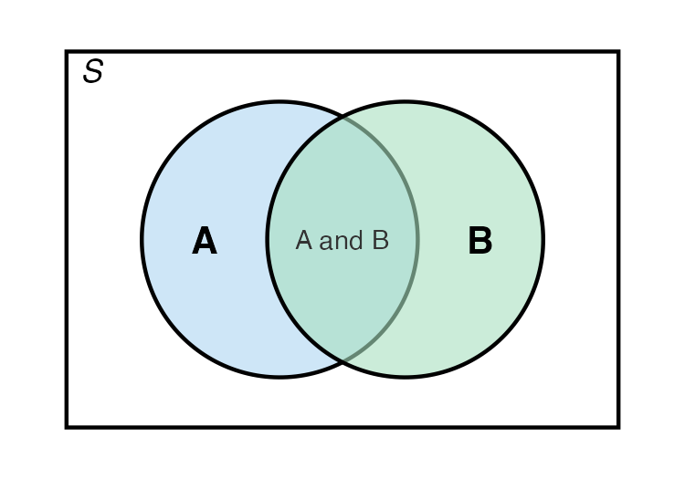
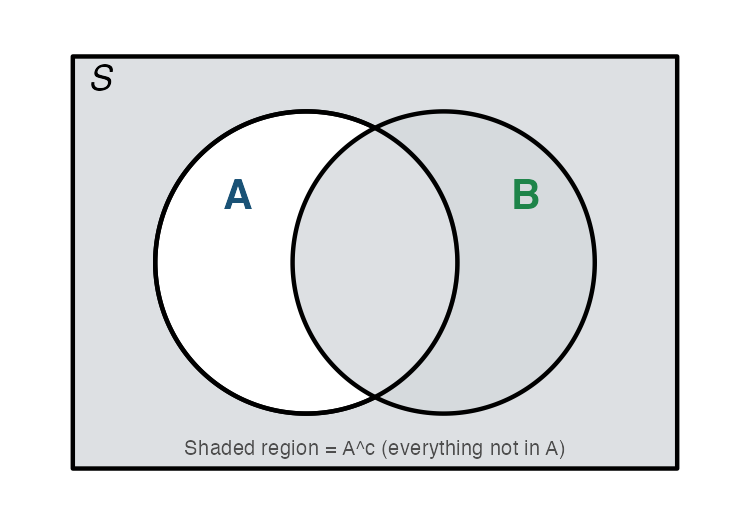
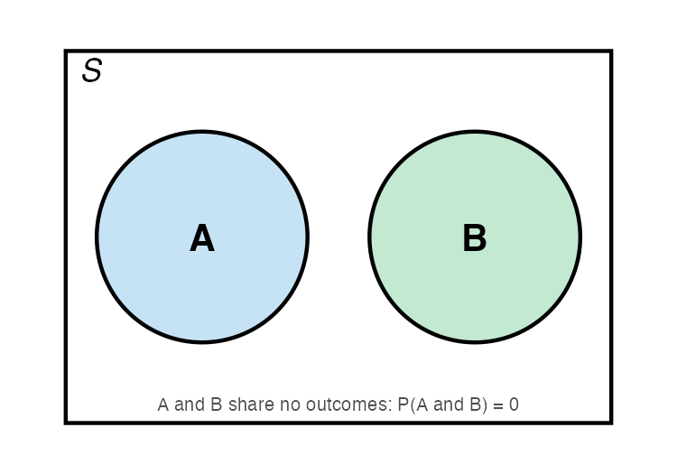
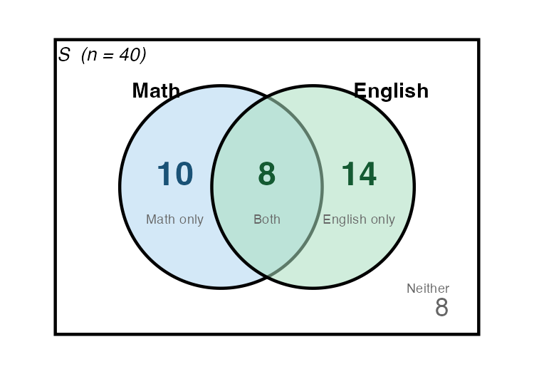
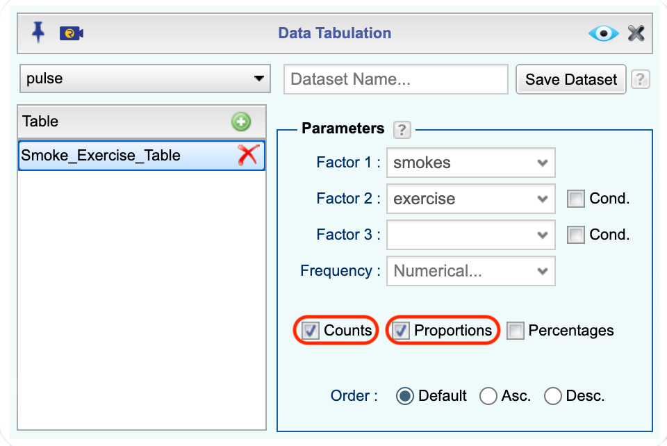
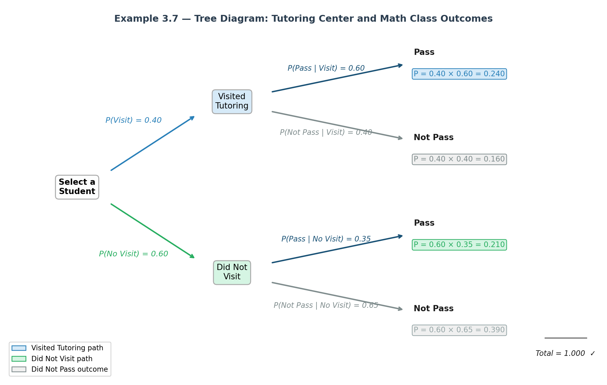

```{r setup4, include=FALSE}
library("mosaic")
Class<-read.csv( "https://krkozak.github.io/MAT160/class_survey.csv") 
Eyeglasses<-read.csv( "https://krkozak.github.io/MAT160/eyglasses.csv") 
Defects<- read.csv( "https://krkozak.github.io/MAT160/defects.csv") 
```

::: {#Importing-data-to-Rguroo .callout-note appearance="simple" collapse="true" icon="none" title="{width=22px style='vertical-align:middle;'}  Importing Data to Rguroo"} 

1. Open the **Data** toolbox in Rguroo.  
2. From the [Data Import]{.dpd} dropdown, select [Dataset Repository]{.fun}.  
3. In the top search box, type [kozak]{.typein}, then select the [Statistics Using Technology – Kozak]{.repo} repository.  
4. In the middle search box, type the first few letters of the dataset name, and choose your desired dataset name that appears in the lower panel.  
5. Click the [Import]{.button}. The dataset will be imported to your Rguroo account.
6. Click [Close]{.button} to exit the dialog.  
7. To view the dataset, double-click the dataset name under the **Data** toolbox list.

:::

Every day you encounter uncertainty. Will it rain during your commute? Is a new medication likely to help a patient? Does a positive test result mean someone actually has a disease? Should a business stock more inventory before a holiday weekend? Although these questions cannot be answered with certainty, probability gives us a mathematical framework for making informed decisions about them.

Probability is not just an abstract mathematical topic. It is the foundation of all of statistics. When we collect data and draw conclusions, we are always asking: *How likely is it that what I observed happened by chance?* Without understanding probability, we cannot answer that question honestly.

Probability is the "language" that connects data to decisions. Every confidence interval, every hypothesis test, and every statistical claim you will encounter in this course rests on the ideas in this chapter. Taking the time to build a solid foundation here will make the rest of the course much more meaningful.

The ideas in this chapter appear across every discipline. A criminologist asks: what is the likelihood that an eyewitness identification is correct? A nurse asks: if I screen 100 patients, how many will test positive by chance alone? An economist asks: what is the probability that a recession will occur in the next two years? A political scientist asks: what is the chance a polling result reflects the true opinions of voters? These are all probability questions.

This chapter begins with the fundamental vocabulary and rules of probability, builds toward a distinction between two major approaches to calculating probabilities, and introduces how technology — specifically **Rguroo** — can be used to simulate random processes and explore probability in a hands-on way.

## Fundamentals of Probability

### Random Processes and Experiments

Some things in life are **deterministic**. For example, if you drop a ball, you can calculate exactly where it will land. But many things are **random**, meaning the outcome is not fully predictable in advance no matter how much information you have.

A **random process** is any process or phenomenon in which individual outcomes are unpredictable, even though a pattern of outcomes tends to emerge over a large number of repetitions.

**Examples of random processes you encounter:**

-   Flipping a coin — you cannot predict whether it will land heads or tails on any single flip
-   Drawing a card from a shuffled deck
-   Whether a patient responds to a treatment
-   Whether it rains on a given day in your city
-   Whether a product coming off an assembly line is defective
-   Which political candidate a randomly selected voter supports

A **probability experiment** is any process whose result is determined by chance. This is different from the everyday use of the word "experiment." The experiment must be well-defined: you must be able to describe every possible result in advance.

**Examples:**

| Everyday Description | Probability Experiment |
|------------------------------------|------------------------------------|
| Roll a six-sided die | Observe which face (1–6) lands face up |
| Ask a student their major | Record the declared major of one randomly selected student |
| Test whether a lightbulb is defective | Inspect one lightbulb and record: defective or not defective |
| Check today's high temperature | Record whether the high exceeds 90°F |

: Examples of experiments in probability {#tbl-experiments tbl-alt="Table listing everyday descriptions alongside their corresponding probability experiment definitions"}

------------------------------------------------------------------------


### Outcomes, Sample Spaces, and Events

Every probability experiment produces a result. An **outcome** is a single possible result of a probability experiment. When you roll a die, getting a 3 is one outcome. When you flip a coin, getting heads is one outcome. Outcomes must cover every possibility and cannot overlap; no two outcomes can occur at the same time in a single trial.

The **sample space** is the complete list of all possible outcomes. If outcomes are the individual items, the sample space is the entire collection. We write it using set notation with curly braces and usually label it $S$.

An **event** is any group of outcomes we are interested in. Events are subsets of the sample space and are built from outcomes. We usually name events with capital letters like $A$, $B$, or $C$. A **simple event** contains exactly one outcome. A **compound event** contains more than one outcome.

::: {#exm-roll-die}
## Rolling a Die
Consider rolling a fair six-sided die once.

- The **outcomes** are the six individual faces: 1, 2, 3, 4, 5, and 6.
- The **sample space** is $S = \{1, 2, 3, 4, 5, 6\}$.
- Let $A =$ rolling an even number. Then $A = \{2, 4, 6\}$ is a **compound event** made up of three outcomes from the sample space.
- Let $B =$ rolling a 5. Then $B = \{5\}$ is a **simple event** made up of one outcome.
- Let $C =$ rolling a number greater than 4. Then $C = \{5, 6\}$.


Notice that $A$, $B$, and $C$ are all built from the same six outcomes in $S$. The sample space does not change; only the question we are asking changes.
:::

Two special events come up often. A **certain event** contains every outcome in the sample space and will always occur. For example, rolling a number between 1 and 6 on a standard die is a certain event. An **impossible event** contains no outcomes at all and is written as the empty set, $\emptyset$. Rolling a 9 on a standard die is an impossible event.

### Probability: Definition and Rules

Now that we know what outcomes, sample spaces, and events are, we can define probability itself, establish the rules every probability must follow, and understand how probabilities behave when an experiment is repeated many times.

The **probability** of an event $A$, written $P(A)$ (read "probability of A"), is a number between 0 and 1 (inclusive) that represents how likely A is to occur.
$$0 \leq P(A) \leq 1   \text{ for any event } A$$

Probabilities can be expressed as fractions, decimals, or percentages. For example, $P(A) = 1/4 = 0.25 = 25\%$.

When we say an event has a probability of 0.30, we mean: if we were to repeat this experiment a very large number of times under the same conditions, about 30\% of those repetitions would result in that event occurring. Probability does not tell us what will happen on any single trial; it tells us about long-run patterns.

Before we can calculate a probability, we need to ask a key question: are the outcomes in our sample space equally likely? This matters because it determines how we find probabilities.

Outcomes are **equally likely** when every outcome in the sample space has the same probability of occurring. No outcome is favored over any other.


::: {#exm-equally-likely}
## Are the Outcomes Equally Likely?
For each experiment, decide whether the outcomes are equally likely.

**(a)** Rolling a *fair* die: **Yes.** Each face has the same chance of landing face up.

**(b)** Flipping a *weighted* coin where heads is twice as likely as tails: **No.** Heads and tails do not have equal chances.

**(c)** Selecting a ball from a bag containing 4 red balls and 4 blue balls (all the same size): **Yes.** Each individual ball is equally likely to be selected.

**(d)** Selecting a ball from a bag containing 4 red balls and *8* blue balls (all the same size): **No.** Blue balls are more likely to be drawn because there are more of them. 

**(e)** Testing whether the next customer at a coffee shop orders a hot or cold drink: **Probably not.** Without data, we cannot assume customers are equally split between the two options.
:::

When outcomes are not equally likely, you cannot use simple counting to find probabilities. You must use observed data instead. This leads us to the two approaches to probability covered in [Section 4.1.4](#two-approaches-to-calculate-probability).

A **probability model** lists the possible outcomes of a probability experiment and each outcome's probability. Every valid probability model must satisfy two rules. These are not optional; they are requirements that any set of numbers must meet in order to qualify as probabilities.

**Rule 1: Probability is always between 0 and 1 (inclusive)**
$$0 \leq P(A) \leq 1   \text{ for every event } A$$

No probability can be negative. No probability can be greater than 1. If you calculate a probability outside this range, you have made an error.

**Rule 2: The probabilities of all outcomes in the sample space must sum to 1**
$$\sum P(\text{all outcomes}) = 1$$

This means that something always happens. When you list all possible outcomes of an experiment, their probabilities must add up to exactly 1, or 100\%.

::: {#exm-equally-likely}
## Verifying Probability Rules
A psychology researcher studies the types of social media platforms used most frequently by college students. Based on survey data, she estimates the following probabilities:

| Platform     | Estimated Probability |
|--------------|-----------------------|
| Instagram    | 0.34                  |
| TikTok       | 0.28                  |
| Snapchat     | 0.18                  |
| X (Twitter)  | 0.11                  |
| Other / None | 0.09                  |

: Estimated probabilities for most-used social media platform {#tbl-socialmedia tbl-alt="Table showing estimated probabilities for five social media platform categories including Instagram, TikTok, Snapchat, X Twitter, and Other or None"}

Verify this satisifies the rules of probability model. 
:::


:::{.solution}
Verify Rule 1: Each probability is between 0 and 1. 

Verify Rule 2: $0.34 + 0.28 + 0.18 + 0.11 + 0.09 = 1.00$

Both rules are satisfied, so this is a valid probability model.

:::

::: {#exm-missing-prob}
## Finding a Missing Probability

 A weather forecasting model gives the following probabilities for tomorrow's weather in a coastal city:

| Weather       | Probability |
|---------------|-------------|
| Sunny         | 0.45        |
| Partly Cloudy | 0.30        |
| Overcast      | ?           |
| Rain          | 0.12        |

: Weather probability model with missing value {#tbl-weather tbl-alt="Table showing weather probability model with probabilities for Sunny, Partly Cloudy, and Rain, and a missing probability for Overcast"}
:::

:::{.solution}
Since all probabilities must sum to 1:

$$P(\text{Overcast}) = 1 - 0.45 - 0.30 - 0.12 = 0.13$$

There is a 13% chance of overcast skies tomorrow.
:::

### Two Approaches to Calculate Probability

There are two fundamental ways to determine the probability of an event.

**Relative Frequency (Empirical) Probability**

The first approach is based on observation and data. We actually conduct the experiment many times, or use existing data, and measure how often the event occurs. The resulting probability estimate is called the **relative frequency** or **empirical probability**.

Recall from Chapter 2, the **relative frequency** of an event is the number of times of times it occurs out of the total number of trials:
$$\text{Relative Frequency of A} = \dfrac{\text{Number of times A occurred}}{\text{Total number of trials}}$$

This is the empirical approach to probability. It is based on observed data rather than assumptions. The relative frequency gives an estimate of the true probability, and that estimate improves as the number of trials increases.

::: {#exm-empirical-prob}
## Empirical Probability from Survey Data
The General Social Survey (GSS) is a national survey conducted regularly in the United States. In a recent survey, 1,832 out of 2,867 respondents reported that they use social media daily. What is the probability a randomly selected U.S. adult uses social media?
:::

:::{.solution}
This estimate is based on observed data, so it is an empirical probability and we would use relative frequency to find the probability

$$ P(\text{uses social media daily}) \approx \dfrac{1832}{2867} \approx 0.639$$

We estimate there is about a 63.9\% chance that a randomly selected U.S. adult uses social media daily.
:::


*When Would You Use Empirical Probability*

- Outcomes are not equally likely and you do not know the true proportions
- The experiment involves real-world behavior that must be measured
- You want to check whether a theoretical model, like a fair coin, matches reality

**Theoretical Probability**

The second approach is used when we know the structure of the experiment and can assume all outcomes are equally likely. Rather than collecting data, we count the outcomes.

If all outcomes in the sample space are *equally likely*, the probability of event $A$ is:
$$P(A) = \dfrac{\text{Number of outcomes in } A}{\text{Total number of outcomes in }S}$$

This is called the **classical** or **theoretical** probability. It is calculated by reasoning about the structure of the experiment; no data collection is required.

::: {#exm-theoretical-prob}
## Theoretical Probability
A fair six-sided die is rolled. Sample space: $S = \{1, 2, 3, 4, 5, 6\}$, with 6 equally likely outcomes. Find the following probabilities.

**(a)** P(rolling a 4)

**(b)** P(rolling an even number)

**(c)** P(rolling a number > 4)

**(d)** P(rolling a number < 10)

**(e)** P(rolling a 7)

:::

:::{.solution}
**(a)** The event space for the event "rolling a 4" is $A= \{4\}$. Using the theoretical probability formula, 
$$P(\text{rolling a }4) = P(A) = \frac{1}{6} \approx 0.167$$

**(b)** The event space for the event "rolling an even number" is $B = \{2,4,6\}$. Then, the probability is
$$ P(\text{rolling an even number}) = P(B) = \frac{3}{6} = \frac{1}{2} = 0.5$$

**(c)** The event space for the event "rolling a number > 4" is $C = \{5,6\}$. The probability of event $C$ is

$$P(\text{rolling a number }> 4) = P(C) = \frac{2}{6} = \frac{1}{3} \approx 0.333$$

**(d)** The event space for the event "rolling a number < 10" is $D = \{1,2,3,4,5,6\} = S$. The probability of event $D$ is

$$ P(\text{rolling a number }< 10)=P(D) = \frac{6}{6} = 1$$

which makes this a certain event.

**(e)** The event space for the event "rolling a 7" is $E = \{\emptyset\}$. Therefore, the probability of event $E$ is 

$$P(\text{rolling a }7) = P(E) = \frac{0}{6} = 0$$

which makes this an impossible event. 
:::

You might wonder: if I flip a coin just 10 times and get 7 heads, does that mean the probability of heads is 0.70? The **Law of Large Numbers** answers this question.

The **Law of Large Numbers** states that as the number of trials, $n$, of a random experiment increases, the relative frequency of an event gets closer and closer to the true probability of that event.
$$\text{As } n \rightarrow \infty, \quad \dfrac{\text{frequency of A}}{n} \rightarrow P(A)$$

With a small number of trials, expect significant variation from the true probability. With a large number of trials, the relative frequency will closely approximate it.

### Simulation: Exploring Probability with Rguroo

One of the most powerful ways to build intuition about probability is through **simulation**: using technology to imitate a random process thousands of times and observing the results. Simulation makes the Law of Large Numbers visible and concrete. Simulations are especially useful when:

- Theoretical probabilities are difficult to calculate
- We want to visualize how relative frequencies converge over many trials 
- We want to explore what random variation really looks like

::: {#exm-simulation-die-roll}
## Simulating a Die Roll
Suppose you want to explore whether a fair six-sided die actually produces each face with equal frequency. The theoretical probability of rolling any single face is $1/6 \approx 0.167$. But does that hold up when you actually simulate rolls? And how many trials do you need before the results start to look balanced?

You can investigate this using Rguroo’s simulation tool.
:::

:::{.solution}
Click to expand the box below to see how to use Rguroo to simulate rolling a six-sided die.

::: {#simulating-in-Rguroo .callout-note appearance="simple" collapse="true" icon="none" title="{width=22px style='vertical-align:middle;'} Simulating in Rguroo"}

1.  Open the **Probability-Simulation** toolbox.\
2.  Click on the [Probability]{.dpd} dropdown, and select [Random Generator]{.fun}. This opens the [Random Number Generator]{.dialog} dialog.\
3.  From the [Distribution]{.dpd} dropdown, select [Discrete Uniform]{.fun}. This tells Rguroo to treat all values in a range as equally likely.\
4.  In the [Minimum]{.des} field, enter 1. In the [Maximum]{.des} field, enter 6. This sets up the six equally likely outcomes of a die roll.\
5.  In the [Sample Size]{.des} field, enter 600 for the first run.\
6.  Click the preview icon  to see the sample.
7. Click the  button to save the sample results as [DieRollSim]{.typein}.

::: {.callout-note appearance="simple" collapse="true" icon="none" title="Click here to see the Rguroo dialog"}
{width="500px"}
:::
:::


We can create and examine a barplot of the resulting sample as seen in @fig-sim-barplot. Each bar represents one face of the die (1 through 6). The height of each bar shows the relative frequency of that face in your simulation.
```{r,echo=FALSE}
#| fig-alt: "Screenshot of the barplot output showing six bars, one per face, with relative frequencies annotated for each"
#| warning: FALSE
#| label: fig-sim-barplot
#| fig-cap: "Simulated relative frequencies for 600 rolls of a fair die"
#| fig-subcap: 
#|   - "Dialog box"
#|   - "Barplot"
#| out-width: "80%"
knitr::include_graphics(c("Rguroo_dialogs/Probability/sim_barplot_dialog.png",
"Rguroo_outputs/Probability/die_sim_barplot.png"))
```

With 600 simulated rolls, your barplot will likely show some variation across the six faces. Some faces may appear more than others, and the relative frequencies will probably range from around 0.15 to 0.18 rather than all landing exactly at 0.167. This is normal and expected with a moderate number of trials.

If we repeat the simulation with 6,000 trials (set [Sample Size]{.des} field equal to 6000), and compare the barplots we should notice the barplot of 6,000 trials should be more uniform. The relative frequencies will cluster more tightly around 0.167 for each face, and the differences between bars will shrink.

```{r,echo=FALSE}
#| fig-alt: "Screenshot of the barplot of n = 6,000 trials, showing the bars becoming more uniform as n increases"
#| warning: FALSE
#| label: fig-6000-sim
#| fig-cap: "Simulated relative frequencies for 6000 rolls of a fair die"
#| out-width: "80%"
knitr::include_graphics("Rguroo_outputs/Probability/sim_6000_barplot.png")
```

This is the **Law of Large Numbers** in action. With a small number of trials, random variation produces noticeable differences between the outcomes. With a large number of trials, those differences smooth out and the relative frequencies converge toward the theoretical probability of $1/6 \approx 0.167$.

:::

### Homework for Fundamentals of Probability Section

1. An instructor reports the following model for letter grades in her course. Determine if this represents a probabillity model. Explain why or why not.

| Grade       | A    | B    | C    | D    | F    |
|-------------|------|------|------|------|------|
| Probability | 0.22 | 0.35 | 0.28 | 0.10 | 0.08 |  
: Estimated probabilities for letter grades {#tbl-lettergrades tbl-alt="Table showing estimated probabilities for five letter grades: A, B, C, D, and F"}

2.  A researcher in criminal justice records the type of crime in a randomly selected case from a county court database. The categories are: Violent, Property, Drug, and Other.

    a.  List the sample space.\
    b.  Based on county data, $P(\text{Violent}) = 0.19$, $P(\text{Property}) = 0.41$, $P(\text{Drug}) = 0.27$. Find $P(\text{Other})$.\
    c.  Verify that this is a valid probability model.

3. Two fair coins are flipped. List the sample space using ordered pairs (e.g., HH, HT, ...). Then find:

    a.  $P(\text{exactly one head})$\
    b.  $P(\text{at least one tail})$\
    c.  $P(\text{no heads})$\
    d.  $P(\text{two heads or two tails})$

4. The number of M&M's of each color that were found in 48 packets is in the dataset [M_and_Ms]{.data}. The first six rows of these data are given in @tbl-MaM (M&M's Color Distribution Analysis, 2019). Find the probability of choosing each color based on this data frame.

::: {tabindex="0" style="width:85%; margin:auto;"}
 The dataset for this exercise is available in the Rguroo dataset repository [Kozak]{.repo}, with the dataset name [M_and_Ms]{.data}.
:::

```{r mam-table, echo=FALSE}
#| tbl-alt: "Table showing M&M Distribution"
#| label: tbl-MaM
#| tbl-cap: "M&M Distribution"
MaM<- read.csv( "https://krkozak.github.io/MAT160/M_and_Ms.csv") 
knitr::kable(head(MaM))
```

::: {#code-book-MaM .callout-tip .codebook collapse="true"}
## Code book for M_and_Ms Dataset

**Description** An analysis of the colors in a case of M&M's to see if they match the published percentages

Usage MaM

Format

This data frame contains the following columns:

[color]{.var}: color of M&Ms

[type]{.var}: The type of M&M such as plain, peanut, peanut butter

[pack]{.var}: which pack the M&Ms came from.

[Source](https://joshmadison.com/2007/12/02/mms-color-distribution-analysis/) M&M's Color Distribution Analysis. (n.d.). Retrieved July 11, 2019.

References Josh Madison, 2019

:::


2.  Eyeglassomatic manufactures eyeglasses for different retailers. They test to see how many defective lenses they made the time period of January 1 to March 31. The defect and the number of defects is in @tbl-Defects. Find the probability of each defect type based on this data.

::: {tabindex="0" style="width:85%; margin:auto;"}
 The dataset for this exercise is available in the Rguroo dataset repository [Kozak]{.repo}, with the dataset name [defects]{.data}.
:::

**Code book for Data Frame Defects** below @tbl-Defects.


5.  In Australia in 1995, of the 2907 indigenous people in prison 17 of them died. In that same year, of the 14501 non-indigenous people in prison 42 of them died (\\"Aboriginal deaths in,\\" 2013). Find the probability that an indigenous person dies in prison and the probability that a non-indigenous person dies in prison. Compare these numbers and discuss what the numbers may mean.

6.  A project conducted by the Australian Federal Office of Road Safety asked people many questions about their cars. One question was the reason that a person chooses a given car, and the first six rows of that data is in @tbl-Car_pref (Car Preferences, 2019). 
Find the probability a person chooses a car for each of the given reasons.

::: {tabindex="0" style="width:85%; margin:auto;"}
 The dataset for this exercise is available in the Rguroo dataset repository [Kozak]{.repo}, with the dataset name [carprefs]{.data}.
:::

```{r car-pref-table, echo=FALSE}
#| tbl-alt: "Table showing reason for choosing a car"
#| label: tbl-Car_pref
#| tbl-cap: "Reason for Choosing a Car"
Car_pref<- read.csv( "https://krkozak.github.io/MAT160/carprefs.csv") 
knitr::kable(head(Car_pref))
```

::: {#code-book-carprefs .callout-tip .codebook collapse="true"}
## Code book for carprefs Dataset

**Description** These data were collected as part of a project for the Federal Office for Road Safety conducted by the Research Institute of Gender and Health at the University of Newcastle. There is evidence that women drivers who are involved in motor vehicle accidents are more likely than men to be injured. A possible reason is that women often drive smaller cars that provide less protection in a collision. One of the aims of the project was to examine preferences for cars among men and women and investigate the extent to which safety was a factor in determining preferences. The survey was conducted by research assistants who asked people in car parks to participate and administered a structured questionnaire. They were instructed to obtain data from men and women with small, medium and large cars, with 50 people per group for a total of 300 respondents. (The sample size was based on power requirements for another part of the survey that involved anthropometric measurements.) The research assistants approached people in car parks of the University of Newcastle and nearby shopping centers during December 1997 and January 1998.

Usage Car_pref

Format

This data frame contains the following columns:

[ID]{.var}: Identification number of respondent

[Age]{.var}: Age of respondent (years)

[Sex]{.var}: female, male

[LicYr]{.var}: Time they have held a full driving licence, in years and months (years)

[LicMth]{.var}: Time they have held a full driving licence, in years and months (months)

[ActCar]{.var}: Make, model and year of car most often driven, coded to size of car small, medium, large

[Kids5]{.var}: Children under five, yes, no

[Kids6]{.var}: Children 6 to 16, yes, no

[PrefCar]{.var}: Preferred car, coded to size of car small, medium, large

[Car15k]{.var}: Preferred type of car if cost \\\$15000, small new car; large second-hand car

[Reason]{.var}: safety, reliability, cost, performance, comfort, looks

[Cost]{.var}: How important is cost when buying a car? not important, little importance, important, very important

[Reliable]{.var}: How important is reliability ...?

[Perform]{.var}: How important is performance ...?

[Fuel]{.var}: How important is fuel consumption ...?

[Safety]{.var}: How important is safety ...?

[AC/PS]{.var}: How important is air conditioning/power steering ...?

[Park]{.var}: How important is ease of parking ...?

[Room]{.var}: How important is space/roominess ...?

[Doors]{.var}: How important is the number of doors ...?

[Prestige]{.var}: How important is prestige/style ...?

[Colour]{.var}: How important is colour ...?

[Source](http://www.statsci.org/data/oz/carprefs.html) Car Preferences. (n.d.). Retrieved July 11, 2019.

References

The data was contributed to OzDASL by Professor Annette Dobson, University of Queensland. Information on the data set was originally provided by Jenny Powers.
:::

7. Using Rguroo’s Simulation tool ( From the [Distribution]{.dpd} dropdown, select [Bernoulli Trial]{.fun}.), simulate flipping a fair coin with p = 0.5. Run simulations with n = 20, 100, 500, and 5,000. For each run, record the relative frequency of heads. Create a table of your results and write 2 to 3 sentences describing how the relative frequency changes as n increases.

## Probability Rules

So far, we have defined probability experiments, sample spaces, and events, and we have calculated probabilities using both the classical and empirical approaches. In all of these cases, we asked about the probability of one specific event occuring.

But in real life, we often ask more complex questions:

- What is the probability that a student is *not* enrolled full-time?
- What is the probability that a patient tests positive *and* has the disease?
- What is the probability that a randomly selected person works in healthcare *or* education?

These questions require us to combine events. This section covers four key ideas: complement, intersection, union, and the addition rule. We will also build two practical tools, Venn diagrams and probability tables, that help us organize and calculate combined probabilities.

### The Complement of an Event

Every event has an "opposite," meaning the collection of all outcomes in the sample space that are not in the event. This opposite is called the **complement**.

::: {.callout-tip appearance="simple" icon="false"}
## Key Term: Complement

The **complement** of an event $A$, written $A^c$ (read "A complement"), is the set of all outcomes in the sample space $S$ that are **not** in $A$.

In plain language: $A^c$ is "everything except $A$."
:::

Because every outcome in the sample space must either belong to $A$ or to $A^c$ (but never both), their probabilities must add up to exactly 1. This gives us the **Complement Rule**:

::: {.callout-important appearance="simple" icon="false"}
## The Complement Rule

$$P(A^c) = 1 - P(A)$$

Equivalently: $P(A) + P(A^c) = 1$
:::

::: {#exm-complement-dice}
## Using the Complement Rule

A fair six-sided die is rolled. Let $A$ = rolling a number greater than 2.

**(a)** Find $P(A)$ directly.

**(b)** Find $P(A^c)$ using the definition of complement.

**(c)** Verify the Complement Rule.
:::

::: {.solution}
**(a)** The event $A = \{3, 4, 5, 6\}$ contains 4 outcomes out of 6 equally likely outcomes.

$$P(A) = \frac{4}{6} = \frac{2}{3} \approx 0.667$$

**(b)** The complement $A^c$ = rolling a number *not* greater than 2 = rolling a 1 or 2 = $\{1, 2\}$.

$$P(A^c) = \frac{2}{6} = \frac{1}{3} \approx 0.333$$

**(c)** Verify: $P(A) + P(A^c) = \frac{2}{3} + \frac{1}{3} = 1$ 
:::

::: {#exm-complement-health}
## Complement in a Health Context

A public health study found that $23\%$ of adults in a city do not meet the recommended weekly physical activity guidelines. If one adult is randomly selected, what is the probability that the selected person **does** meet the guidelines?
:::

::: {.solution}
Let $A$ = the person does not meet the activity guidelines.

We are told: $P(A) = 0.23$

We want: $P(A^c)$ = the person *does* meet the guidelines.

$$P(A^c) = 1 - P(A) = 1 - 0.23 = 0.77$$

There is a $77\%$ chance the selected adult meets the recommended activity guidelines.
:::

### Visualizing Events: Venn Diagrams

A **Venn diagram** is a visual tool for representing events and their relationships. In a Venn diagram:

-   The **rectangle** represents the entire sample space $S$ of all possible outcomes.
-   Each **circle** represents the set of outcomes belonging to that event.
-   Outcomes that belong to both events appear in the **overlapping region** of the circles.
-   Outcomes that belong to neither event appear **outside** all circles but still inside the rectangle.


Venn diagrams are not just decorative. They help us see at a glance whether events overlap, contain each other, or share no outcomes at all. The diagrams in this section use two circles representing events $A$ and $B$ inside a rectangle representing $S$ shown in @fig-venn-general.

```{r, echo=FALSE}
#| fig-alt: "Venn diagram showing two overlapping circles labeled A and B inside a rectangle labeled S. The overlapping region is shaded and labeled A and B. The region inside A only is labeled A only. The region inside B only is labeled B only. The region outside both circles is labeled neither A nor B."
#| fig-cap: "A general Venn diagram for two events A and B"
#| label: fig-venn-general
#| out-width: "55%"

```

As a first example, @fig-venn-Ac shows the complement of event $A$. The shaded region is $A^c$ — everything in the sample space that is not in $A$. Notice that the shading covers part of circle $B$ and the space outside both circles. In other words, $A^c$ includes any outcome that is simply not in $A$, no matter where else it falls. The only unshaded part is circle $A$ itself.

```{r fig-venn-Ac, echo=FALSE}
#| fig-cap: "The shaded region represents the complement of A"
#| fig-alt: "Venn diagram with two overlapping circles labeled A and B inside a rectangle labeled S. The region outside circle A is shaded gray, representing the complement of A. This includes the B-only region and the area outside both circles."
#| label: fig-venn-Ac
#| out-width: "55%"
#| fig-align: "center"

```


### Mutually Exclusive (Disjoint) Events 

Two events are **mutually exclusive** if they have no outcomes in common. This is also known as **disjoint** events. In plain language: $A$ and $B$ cannot happen at the same time. This means $P(A \text{ and } B) = 0$. On a Venn diagram, mutually exclusive events are shown as **circles that do not overlap** as shown in @fig-venn-disjoint.


```{r, echo=FALSE}
#| fig-alt: "Venn diagram showing two circles labeled A and B that do not overlap, inside a rectangle labeled S, illustrating that A and B are mutually exclusive events with no shared outcomes."
#| fig-cap: "Venn diagram of mutually exclusive (disjoint) events A and B"
#| label: fig-venn-disjoint
#| out-width: "55%"

```

::: {#exm-mutually-exclusive}
## Identifying Mutually Exclusive Events

A student is randomly selected from a community college. Classify each pair of events as mutually exclusive or not mutually exclusive. Explain your reasoning.

**(a)** $A$ = the student is enrolled in a math course; $B$ = the student is enrolled in an English course.

**(b)** $A$ = the student is a full-time student; $B$ = the student is a part-time student.

**(c)** $A$ = the student works more than 20 hours per week; $B$ = the student is a full-time student.
:::

::: {.solution}
**(a)** **Not mutually exclusive.** A student can be enrolled in both a math course and an English course at the same time.

**(b)** **Mutually exclusive.** A student cannot simultaneously be both a full-time and a part-time student.

**(c)** **Not mutually exclusive.** While it may be difficult, a student can work more than 20 hours per week and also carry a full-time course load. These events can occur together.
:::

### Intersection of Two Events

When we ask whether **both** events occur in the same trial, we are looking at the **intersection**.

::: {.callout-tip appearance="simple" icon="false"}
## Key Term: Intersection

The **intersection** of events $A$ and $B$, written $A \cap B$ (read "A and B" or "A intersect B"), is the event that **both $A$ and $B$ occur**.

$$A \cap B = \text{outcomes that are in both } A \text{ and } B$$

$P(A \cap B)$ is the probability that both events happen.

On a Venn diagram, the intersection is the **overlapping region** of the two circles seen in @fig-venn-general.
:::

Note that if $A$ and $B$ are mutually exclusive, then $A \cap B = \emptyset$ (the empty set), and $P(A \cap B) = 0$.

::: {#exm-intersection-card}
## Finding an Intersection — Card Draw

A single card is drawn at random from a standard 52-card deck. Let $A$ = the card is a heart, and $B$ = the card is a face card (Jack, Queen, or King).

Find $P(A \cap B)$.
:::

::: {.solution}

First, check whether the two events can occur together. A card can be both a heart and a face card (for example, the Jack of Hearts). So $A$ and $B$ are **not** mutually exclusive, and their intersection is non-empty.
The outcomes in $A \cap B$ are the face cards that are also hearts:

$$A \cap B = \{\text{Jack of Hearts, Queen of Hearts, King of Hearts}\}$$

There are 3 such cards out of 52 equally likely outcomes.

$$P(A \cap B) = \dfrac{3}{52} \approx 0.058$$

There is about a $5.8\%$ chance of drawing a card that is both a heart and a face card.
:::

::: {#exm-intersection-enrollment}
## Finding an Intersection — Enrollment Overlap

In a group of 40 students, 18 are enrolled in math, 22 are enrolled in English, and 8 are enrolled in **both**. One student is selected at random.

Let $A$ = enrolled in math and $B$ = enrolled in English.

**(a)** Find $P(A)$, $P(B)$, and $P(A \cap B)$.

**(b)** Represent this situation with a Venn diagram showing the count of students in each region.
:::

::: solution
**(a)** Using the given counts:

$$P(A) = \frac{18}{40} = 0.45 \qquad P(B) = \frac{22}{40} = 0.55 \qquad P(A \cap B) = \frac{8}{40} = 0.20$$

**(b)** To build the Venn diagram, we find the count in each region:

-   Students in math but not English: $18 - 8 = 10$ students
-   Students in both math *and* English: $8$ students
-   Students in English but not Math: $22 - 8 = 14$ students
-   Students in neither course: $40 - 10 - 8 - 14 = 8$ students

```{r fig-venn-enrollment, echo=FALSE}
#| fig-cap: "Venn diagram showing Math and English enrollment counts for 40 students"
#| fig-alt: "Venn diagram with two overlapping circles labeled Math and English inside a rectangle labeled S representing 40 students. The left region shows 10 for Math only, the center overlap shows 8 for both, the right region shows 14 for English only, and the corner outside both circles shows 8 for neither course."
#| out-width: "60%"
#| fig-align: "center"

```

Notice that the four regions account for all 40 students: $10 + 8 + 14 + 8 = 40$ 

The center region (labeled "8") is the visual representation of $A \cap B$, students enrolled in **both** math and English.
:::

### Union of Two Events 

When we ask whether at least one of two events occurs (either $A$, or $B$, or both), we are looking at the union.

::: {.callout-tip appearance="simple" icon="false"}
## Key Term: Union

The **union** of events $A$ and $B$, written $A \cup B$ (read "A or B" or "A union B"), is the event that $A$ occurs or $B$ occurs or both $A$ and $B$ occur.

$$A \cup B = \text{outcomes in } A \text{, in } B \text{, or in both}$$

$P(A \cup B)$ is the probability that $A$ occurs, $B$ occurs, or both occur.

On a Venn diagram, the union is the entire shaded region covered by **either or both circles**.

:::


### The General Addition Rule

Now that we understand intersection and union, we can write a formula to compute $P(A \cup B)$.

**Why not just add $P(A) + P(B)$?**

Look at the Venn diagram in @fig-venn-general. If we add the area of circle $A$ to the area of circle $B$ in a Venn diagram, we count the overlapping region **twice**, once for each circle. To get the correct total, we must subtract the overlap (the intersection) exactly once.

::: {.callout-important appearance="simple" icon="false"}
## The General Addition Rule

For any two events $A$ and $B$:

$$P(A \cup B) = P(A) + P(B) - P(A \cap B)$$

In words: The probability that $A$ *or* $B$ occurs equals the probability of $A$ plus the probability of $B$, minus the probability that both $A$ and $B$ occur.

The subtraction accounts for the fact that outcomes in the intersection would otherwise be counted twice.
:::


When $A$ and $B$ are **mutually exclusive**, $P(A \cap B) = 0$, so the formula simplifies:

$$P(A \cup B) = P(A) + P(B) \quad \text{(mutually exclusive only)}$$

This simpler version only applies when the events cannot both occur.

::: {#exm-addition-rule}
## Applying the General Addition Rule
Using the enrollment data from the previous [Example](#exm-intersection-enrollment), where we let $A =$ enrolled in math, $B =$ enrolled in English. Find:

**(a)** $P(A)$

**(b)** $P(B)$

**(c)** $P(A \cap B)$

**(d)** $P(A \cup B)$ using the General Addition Rule

**(e)** Interpret $P(A \cup B)$ in context.
:::

:::{.solution}
We previously found

$$P(A) = \dfrac{18}{40} = 0.45 \qquad P(B) = \dfrac{22}{40} = 0.55 \qquad P(A \cap B) = \dfrac{8}{40} = 0.20$$

Applying the general addition rule:

$$P(A \cup B) = P(A) + P(B) - P(A\cap B) = \dfrac{18}{40} + \dfrac{22}{40} - \dfrac{8}{40} = \dfrac{32}{40} = 0.80$$

Interpretation: There is an $80\%$ chance a randomly selected student is enrolled in math, English, or both.

:::

::: {#exm-addition-mutually-exclusive}
## Addition Rule for Mutually Exclusive Events

A single card is drawn from a well-shuffled standard deck of 52 cards. Let $A$ = the card is a King, and $B$ = the card is a Queen.

Find $P(A \cup B)$.
:::

::: {.solution}
Are $A$ and $B$ mutually exclusive? Yes, a single card cannot be both a King and a Queen, so $P(A \cap B) = 0$.

There are 4 Kings and 4 Queens in the deck.

$$P(A) = \dfrac{4}{52}, \quad P(B) = \dfrac{4}{52}$$

Since the events are mutually exclusive:

$$P(A \cup B) = P(A) + P(B) = \dfrac{4}{52} + \dfrac{4}{52} = \dfrac{8}{52} = \dfrac{2}{13} \approx 0.154$$

There is about a $15.4\%$ chance of drawing a King or a Queen.
:::

### Probability Tables {#sec-probability-tables}

A **probability table** (or **two-way table** or **contingency table**) is a table that organizes the outcomes of two categorical variables, showing either **counts** or **proportions** for each combination of categories, along with **marginal totals** (the row totals and column totals).

-   **Joint probabilities** appear in the interior cells. They represent $P(A \cap B)$ for specific combinations.
-   **Marginal probabilities** appear in the totals row and column. They represent the probability of one variable alone, $P(A)$ or $P(B)$.


When a table contains **counts**, divide each cell by the total sample size to convert to **proportions**. A proportion table has the same layout but each cell contains a probability rather than a raw count.

::: {#exm-probability-table}
## Using a Probability Table

A community college health survey of 400 students recorded two variables: whether a student reports getting enough sleep (Yes/No) and whether the student is enrolled full-time (Full-time/Part-time). The counts are:

|                    | **Enough Sleep** | **Not Enough Sleep** | **Total** |
|--------------------|:----------------:|:--------------------:|:---------:|
| **Full-time**      |       112        |         128          |    240    |
| **Part-time**      |        88        |          72          |    160    |
| **Total**          |       200        |         200          |  **400**  |

: Sleep and enrollment status for 400 community college students {#tbl-sleep-enrollment tbl-alt="Two-way table showing counts for sleep status (enough sleep versus not enough sleep) and enrollment status (full-time versus part-time) for 400 community college students, with row and column totals."}

Let $F$ = the student is enrolled full-time, and $E$ = the student gets enough sleep.

Find each probability.

**(a)** $P(F)$

**(b)** $P(E)$

**(c)** $P(F \cap E)$

**(d)** $P(F^c)$

**(e)** $P(F \cup E)$
:::

::: {.solution}
Use the counts in the table, dividing by the total $n = 400$.

**(a)** $P(F) = \dfrac{240}{400} = 0.60$

**(b)** $P(E) = \dfrac{200}{400} = 0.50$

**(c)** The intersection of $F$ and $E$ is the cell for full-time students who get enough sleep:

$$P(F \cap E) = \dfrac{112}{400} = 0.28$$

**(d)** $F^c$ = part-time student:

$$P(F^c) = 1 - P(F) = 1 - 0.60 = 0.40 \quad \text{or} \quad 1-\dfrac{240}{400} = \frac{160}{400}$$

**(e)** Using the General Addition Rule:

$$P(F \cup E) = P(F) + P(E) - P(F \cap E) = 0.60 + 0.50 - 0.28 = 0.82$$

There is an $82\%$ chance a randomly selected student is either full-time, gets enough sleep, or both.
:::

::: {#exm-prob-table-rguroo}
## Creating a Probability Table in Rguroo

The [pulse]{.data} dataset shown in @tbl-Pulse contains physiological and lifestyle data from students who participated in a pulse rate experiment. Two categorical variables in this dataset are:

- [smokes]{.var}: whether the subject regularly smokes (`yes` or `no`)
- [exercise]{.var}: the subject's exercise intensity (`low`, `moderate`, or `high`)

Use Rguroo to create a two-way frequency table (contingency table) for [smokes]{.var} and [exercise]{.var}. Then convert the counts to proportions and use the table to find the following probabilities for a randomly selected subject:

**(a)** $P(\text{smokes})$

**(b)** $P(\text{high exercise})$

**(c)** $P(\text{smokes} \cap \text{high exercise})$

**(d)** $P(\text{smokes} \cup \text{high exercise})$

**(e)** Are "smokes" and "high exercise" mutually exclusive? Explain.

::: {tabindex="0" style="width:85%; margin:auto;"}
 The dataset for this exercise is available in the Rguroo dataset repository [Kozak]{.repo}, with the dataset name [pulse]{.data}.
:::

:::

::: {.solution}
Click to expand the box below to see how to create a contingency table in Rguroo.

::: {.callout-note appearance="simple" collapse="true" icon="none" title="{width=22px style='vertical-align:middle;'} Creating a Contingency Table"}
**Before you begin:** Make sure you have already imported the [pulse]{.data} dataset into your **Data** Toolbox, as was shown [here](#Importing-data-to-Rguroo).

1. Open the **Analytics** toolbox.
2. From the [Analysis]{.dpd} dropdown menu, choose **Tabulation** $\rightarrow$ **Categorical**. The [Data Tabulation]{.dialog} dialog opens.
3. In the [Dataset]{.dpd} dropdown, select the dataset [pulse]{.data}.
4. In the [Factor 1]{.dpd} dropdown, select [smokes]{.var}. This will define the column categories (yes, no).
5. In the [Factor 2]{.dpd} dropdown, select [exercise]{.var}. This will define the row categories (low, moderate, high).
6. Check Counts to display the frequency table. Also check Proportions (or Percentage) if you want Rguroo to display the probability/proportion table.
7. Click the Preview icon  to see the result.

::: {.callout-note appearance="simple" collapse="true" icon="none" title="Click here to see the Rguroo dialog"}
{width="500px"}
:::

:::

The resulting contingency table for counts and proportions is below:

::: {.rg-iframe-wrapper tabindex="0"}
<iframe src="Rguroo_html_output/Probability/Tabulation_2_docx/Tabulation_2.html" class="rg-iframe" title="Contingency Table for the Categorical Variable Smoke and Exercise">

</iframe>

:::

We can use these tables to answer the probability questions.

**(a)** $P(\text{smokes})$ is the marginal total for the "Yes" column:

$$P(\text{smokes}) = \frac{11}{110} \approx 0.1$$

About $10\%$ of subjects in this dataset regularly smoke.

**(b)** $P(\text{high exercise})$ is the marginal total for the "High" row:

$$P(\text{high exercise}) = \frac{14}{110} \approx 0.127$$

About $12.7\%$ of subjects report high exercise intensity.

**(c)** $P(\text{smokes} \cap \text{high exercise})$ is the interior cell where smokes = yes and exercise = high:

$$P(\text{smokes} \cap \text{high exercise}) = \frac{0}{110} = 0$$

About $0\%$ of subjects both smoke and report high exercise intensity.

**(d)** Using the General Addition Rule:

$$P(\text{smokes} \cup \text{high exercise}) = P(\text{smokes}) + P(\text{high exercise}) - P(\text{smokes} \cap \text{high exercise})$$

$$= 0.1 + 0.127 - 0 = 0.227$$

About $22.7\%$ of subjects either smoke, report high exercise intensity, or both.

**(e)** Are "smokes" and "high exercise" mutually exclusive?

**Yes.** From the table, 0 subjects both smoke and report high exercise intensity. Since $P(\text{smokes} \cap \text{high exercise}) = 0$, the two events do not occur together and are therefore mutually exclusive.

:::


::: {#exm-comprehensive}
## Student Transportation Survey

A survey of 500 students at a community college recorded how students commute to campus and whether they have a parking permit. The results are shown below.

|                    | **Has Parking Permit** | **No Parking Permit** | **Total** |
|--------------------|:----------------------:|:---------------------:|:---------:|
| **Drives**         |          185           |          65           |    250    |
| **Does Not Drive** |           15           |          235          |    250    |
| **Total**          |          200           |          300          |  **500**  |

: Commute method and parking permit status for 500 community college students {#tbl-transport tbl-alt="Two-way table showing counts for commute method (drives versus does not drive) and parking permit status (has a permit versus no permit) for 500 students, with row and column totals."}

Let $D$ = the student drives to campus, and $P$ = the student has a parking permit.

**(a)** Are $D$ and $P^c$ (no parking permit) mutually exclusive? Explain.

**(b)** Find $P(D)$, $P(P)$, and $P(D \cap P)$.

**(c)** Find $P(D \cup P)$ and interpret it.

**(d)** Find $P(D^c \cup P^c)$.
:::

::: {.solution}
**(a)** $D$ = drives, $P^c$ = no parking permit. From the table, 65 students drive and have no permit. Since this intersection is not empty ($65 > 0$), the events are **not mutually exclusive**. A student can drive to campus and still not have a parking permit.

**(b)**

$$P(D) = \frac{250}{500} = 0.50$$

$$P(P) = \frac{200}{500} = 0.40$$

$$P(D \cap P) = \frac{185}{500} = 0.37$$

**(c)**

$$P(D \cup P) = P(D) + P(P) - P(D \cap P) = 0.50 + 0.40 - 0.37 = 0.53$$

There is a $53\%$ chance that a randomly selected student either drives to campus, has a parking permit, or both.

**(d)** $D^c$ = does not drive, $P^c$ = no permit.

$P(D^c) = 1 - 0.50 = 0.50$

$P(P^c) = 1 - 0.40 = 0.60$

$P(D^c \cap P^c)$ = does not drive and has no permit = $\dfrac{235}{500} = 0.47$

$$P(D^c \cup P^c) = P(D^c) + P(P^c) - P(D^c \cap P^c) = 0.50 + 0.60 - 0.47 = 0.63$$

There is a $63\%$ chance a randomly selected student either does not drive, has no parking permit, or both.
:::


### Homework for Probability Rules Section

1.  A survey found that $58\%$ of college students stream music daily. If a student is randomly selected, what is the probability they do NOT stream music daily? Identify the rule you used.

2.  Two fair six-sided dice are rolled. Let $A =$ the sum is 7, $B =$ the sum is 11.

(a) List the outcomes in $A$ and in $B$.
(b) Are $A$ and $B$ mutually exclusive? Explain.
(c) Find $P(A \text{ or } B)$.


3. A social work professor surveyed 300 students about employment status and stress level. The results are summarized in the two-way table below.

```{r tbl-employment-stress, echo=FALSE}
#| tbl-alt: "Two-way table showing counts for employment status (Employed versus Not Employed) and stress level (High Stress versus Low/Medium Stress) for 300 students, with row and column totals."
#| label: tbl-employment-stress
#| tbl-cap: "Employment Status and Stress Level for 300 Students"

employment_stress <- matrix(
  c(126,  84, 210,
     54,  36,  90,
    180, 120, 300),
  nrow = 3, byrow = TRUE
)

colnames(employment_stress) <- c("High Stress", "Low/Med Stress", "Total")
rownames(employment_stress) <- c("Employed", "Not Employed", "Total")

knitr::kable(employment_stress)
```

Let $E =$ employed, $H =$ high stress.

(a) Find $P(E)$, $P(H)$, and $P(E \text{ and } H)$.
(b) Find $P(E \text{ or } H)$ and interpret in context.
(c) Find $P(E^c)$. What does this represent?
(d) Are $E$ and $H$ mutually exclusive? Explain using the data.


4. A student picks one card at random from a standard 52-card deck. Let $A =$ the card is red, $B =$ the card is a face card (Jack, Queen, or King).
(a) Are $A$ and $B$ mutually exclusive? Explain.
(b) Find $P(A)$, $P(B)$, and $P(A \text{ and } B)$.
(c) Find $P(A \text{ or } B)$ using the General Addition Rule.


5. A project conducted by the Australian Federal Office of Road Safety asked people many questions about their cars. One question was the reason that a person chooses a given car, and that data is in @tbl-Car_pref (Car Preferences, 2019).

::: {tabindex="0" style="width:85%; margin:auto;"}
 The dataset for this exercise is available in the Rguroo dataset repository [Kozak]{.repo}, with the dataset name [car_pref]{.data}.

**Code book for Data Frame Car_pref** is below @tbl-Car_pref.
:::


(a) Create a contingency table for the sex of a person and the size car the person prefers
(b) What is the probability that a person questioned was female?
(c)  What is the probability that a person questioned prefers a medium car?
(d)  What is the probability that a person questioned was a female and prefers a medium car?
(e)  What is the probability that a person questioned was a female or prefers a medium car?
(f)  Are the events person questioned is a female and person questioned prefers a medium car mutually exclusive? Why or why not?


<!-- -->

6. Researchers watched groups of dolphins off the coast of Ireland in 1998 to determine what activities the dolphins partake in at certain times of the day (Activities of Dolphin Groups, 2019). The data in @tbl-Dolphin represent the activity the groups of dolphins were partaking in at certain times of days.

::: {tabindex="0" style="width:85%; margin:auto;"}
 The dataset for this exercise is available in the Rguroo dataset repository [Kozak]{.repo}, with the dataset name [dolphin]{.data}.
:::
```{r dolphin-data, eval = TRUE, echo = FALSE}
#| tbl-alt: "Table showing dolphin activities"
#| label: tbl-Dolphin
#| tbl-cap: "Dolphin Activity"
Dolphin<- read.csv( "https://krkozak.github.io/MAT160/dolphins.csv") 
knitr::kable(head(Dolphin))
```


::: {#code-book-dolphin .callout-tip .codebook collapse="true"}
## Code book for Dolphin Dataset

**Description** Groups of dolphins were observed off the coast of Iceland near Keflavik in 1998. The data here give the time of the day and the main activity of the group, whether travelling quickly, feeding or socializing. The dolphin groups varied in size - usually feeding or socializing groups were larger than travelling groups.

Usage Dolphin

Format

This data frame contains the following columns:

[Activity]{.var}: Main activity of group: travelling (Travel), feeding (Feed) or socializing (Social)

[Period]{.var}: Time of the day: Morning, Noon, Afternoon or Evening

[Source](http://www.statsci.org/data/general/dolpacti.html) Activities of Dolphin Groups. (n.d.). Retrieved July 12, 2019 

References Marianne Rasmussen, Department of Biology, University of Southern Denmark, Odense, Denmark.
:::

(a)  Create a contingency table for the activity of the group of dolphins and time of day
(b)  What is the probability that a dolphin group is partaking in travel?
(c)  What is the probability that a dolphin group is around in the morning?
(d)  What is the probability that a dolphin group is around in the afternoon and is partaking in feeding?
(e)  What is the probability that a dolphin group is around in the afternoon or is partaking in feeding?
(f)  Are the events dolphin group around in the afternoon and dolphin group feeding mutually exclusive events? Why or why not?

7. A group of 250 community college students was asked about their primary home language and use of the tutoring center. Results: 110 speak a language other than English ($L$), 95 use the tutoring center ($T$), and 45 do both.

(a) Set up a two-way probability table for $L$ and $T$.
(b) Find $P(L \text{ or } T)$.
(c) Find $P(L^c \text{ and } T^c)$. What does this event represent in context?
(d) Are $L$ and $T$ mutually exclusive? Justify.

## Conditional Probability and Independence

In the previous section, we combined events using union, intersection, and complement. Those tools
answered questions like "What is the probability that A or B occurs?" But many real-world questions
have a different structure: knowing that one thing has already happened changes the probability of
something else.

A doctor adjusting the probability of a diagnosis after seeing a test result. An employer weighing
an application after knowing the college an applicant attended. A nurse asking whether a positive screening
actually means a patient has the disease. All of these are **conditional probability** questions.

This section builds the tools to answer them.

### Conditional Probability

::: {#exm-conditional-intro}
## A Health Screening Example

A community health clinic screened 500 patients for high blood pressure. The results are
shown below.

|                     | **High BP** | **Normal BP** | **Total** |
|:--------------------|:-----------:|:-------------:|:---------:|
| **Age 40 or older** | 120         | 130           | 250       |
| **Under age 40**    | 30          | 220           | 250       |
| **Total**           | 150         | 350           | **500**   |

: Blood pressure screening results for 500 patients {#tbl-bp tbl-alt="Two-way table showing counts for blood pressure status (high versus normal) and age group (age 40 or older versus under age 40) for 500 patients, with row and column totals."}

**(a)** If a patient is selected at random, what is the probability the patient has high blood pressure?

**(b)** If we are told the selected patient is **age 40 or older**, what is the probability the
patient has high blood pressure?
:::

::: {.solution}
**(a)** Without any additional information, we use all 500 patients:

$$P(\text{High BP}) = \frac{150}{500} = 0.30$$

**(b)** If you know the patient is age 40 or older, you no longer need to consider all 500 patients. You can *zoom* in on just the "Age 40 or older" row. That row contains 250 patients. Of those 250, exactly 120 have high blood pressure.

So your new probability is:

$$\frac{120}{250} = 0.48$$

Knowing the patient's age group **changed** our probability estimate from 30% to 48%. The extra information narrowed our view to a smaller group of patients, and within that smaller group, high blood pressure is more common.
:::

::: {.callout-tip appearance="simple" icon="false"}
## Key Term: Conditional Probability

The **conditional probability** of event $A$ given event $B$ is:

$$P(A \mid B) = \frac{P(A \cap B)}{P(B)}$$

This is the probability that $A$ occurs, **given that $B$ has already occurred**. We assume $P(B) > 0$.

In plain language: restrict the sample space to only the outcomes where $B$ occurred, then
find the fraction of those outcomes where $A$ also occurred.
:::


::: {#exm-conditional-table}
## Finding Conditional Probability from a Table

Using the blood pressure table above, find:

**(a)** $P(\text{High BP} \mid \text{Age 40 or older})$

**(b)** $P(\text{Age 40 or older} \mid \text{High BP})$
:::

::: {.solution}
**(a)** Using the formula:

$$P(\text{High BP} \mid \text{Age 40 or older}) = \frac{P(\text{High BP} \cap \text{Age 40+})}{P(\text{Age 40+})}
= \frac{120/500}{250/500} = \frac{120}{250} = 0.48$$

**(b)** Now the condition and outcome are reversed:

$$P(\text{Age 40+} \mid \text{High BP}) = \frac{P(\text{Age 40+} \cap \text{High BP})}{P(\text{High BP})}
= \frac{120/500}{150/500} = \frac{120}{150} = 0.80$$

Notice that $P(A \mid B) \neq P(B \mid A)$. These are different questions with different answers.
:::

$P(\text{High BP} \mid \text{Age 40+}) = 0.48$ and $P(\text{Age 40+} \mid \text{High BP}) = 0.80$
are **not** the same probability. Always pay close attention to which event is the condition (after
the bar) and which is the outcome of interest (before the bar).

### Independent and Dependent Events

In the blood pressure example, knowing a patient's age group changed the probability of high
blood pressure. This means age group and blood pressure status are related, they are
**dependent** events. But sometimes knowing one event gives you no useful information about
another. Two events are **independent** if knowing one occurred does not change the probability of the other.

::: {.callout-tip appearance="simple" icon="false"}
## Key Terms: Independent and Dependent Events

Two events $A$ and $B$ are **independent** if

$$P(A \mid B) = P(A) \qquad \text{and} \qquad P(B \mid A) = P(B)$$

If $P(A \mid B) \neq P(A)$, then $A$ and $B$ are **dependent events**.
:::

::: {#exm-independence-check}
## Testing for Independence

A fair die is rolled twice. Let $A$ = "the first roll is a 4" and $B$ = "the second roll is a 4."

Are $A$ and $B$ independent?
:::

::: {.solution}
$P(A) = \frac{1}{6}$. 

Now check whether knowing $B$ changes $P(A)$. The two rolls are physically separate, what
happens on the second roll cannot affect the first. Therefore:

$$P(A \mid B) = \frac{1}{6} = P(A)$$

Since $P(A \mid B) = P(A)$, the events are **independent**.

This makes intuitive sense: the die has no memory. The result of the second roll gives no
information about the first.
:::

::: {#exm-dependence-check}
## Testing for Dependence Using a Table

Using the blood pressure data in the [table](#tbl-bp) above, let $A$ = High BP and $B$ = Age 40 or older. Are $A$ and $B$
independent?
:::

::: {.solution}
We already found:

$$P(A) = P(\text{High BP}) = \frac{150}{500} = 0.30$$

$$P(A \mid B) = P(\text{High BP} \mid \text{Age 40+}) = \frac{120}{250} = 0.48$$

Since $P(A \mid B) = 0.48 \neq 0.30 = P(A)$, the events are **dependent**. Knowing a patient
is age 40 or older changes the probability of having high blood pressure, so the two variables
are related.
:::

**Mutually Exclusive vs. Independent**

Mutually exclusive events and independent events are different concepts. Recall that two events are mutually exclusive if they share no common outcomes. We could say that knowing one event occurs means the other event did not occur. On the other hand, independence means that one event occuring does not affect the probability of the other event occuring. This means that knowing two events are mutually exclusive means the events are *not* independent. 

::: {#exm-me-vs-ind}
## Mutually Exclusive vs. Independent: Two Examples

**(a)** A single card is drawn. Let $A$ = the card is a King, $B$ = the card is a Queen. Are
$A$ and $B$ mutually exclusive? Are they independent?

**(b)** Two fair coins are flipped. Let $A$ = first coin is heads, $B$ = second coin is heads.
Are $A$ and $B$ mutually exclusive? Are they independent?
:::

::: {.solution}
**(a)** A card cannot be both a King and a Queen, so $P(A \cap B) = 0$. They are **mutually
exclusive**.

Are they independent? If we know $A$ occurred (the card is a King), then $B$ is **impossible**:
$P(B \mid A) = 0 \neq \frac{4}{52} = P(B)$. They are **dependent**.

**(b)** Can both coins be heads at the same time? Yes, HH is a possible outcome. So $A$ and
$B$ are **not** mutually exclusive.

Are they independent? $P(A) = \frac{1}{2}$ and $P(A \mid B) = \frac{1}{2}$, knowing the second
coin is heads gives no information about the first coin. They are **independent**.
:::

### Multiplication Rules

Now that we understand conditional probability and independence, we can build the rules for
computing the probability that both events occur, the intersection $P(A \cap B)$.

**The General Multiplication Rule**

Rearranging the conditional probability formula gives us:

$$P(A \cap B) = P(A) \cdot P(B \mid A)$$

This rule works whether the events are independent or dependent.

::: {#exm-general-mult}
## Applying the General Multiplication Rule

A bag contains 5 red marbles and 3 blue marbles (8 total). Two marbles are drawn **without
replacement**. What is the probability that both marbles are red?

Let $A$ = first marble is red, $B$ = second marble is red.
:::

::: {.solution}
Because we are drawing **without replacement**, the two draws are **dependent**: the first draw
changes what is available for the second.

$$P(A) = \frac{5}{8}$$

Given that the first marble was red, there are now 4 red marbles left out of 7 total:

$$P(B \mid A) = \frac{4}{7}$$

Applying the General Multiplication Rule:

$$P(A \cap B) = P(A) \cdot P(B \mid A) = \frac{5}{8} \cdot \frac{4}{7} = \frac{20}{56} = \frac{5}{14} \approx 0.357$$

There is about a 35.7% chance both marbles drawn are red.
:::


**The Mulitplication Rule for Independent Events**

When two events are **independent**, the conditional probability simplifies: $P(B \mid A) = P(B)$.
This gives us a simpler version of the multiplication rule.

$$P(A \cap B) = P(A) \cdot P(B)$$


This rule only applies when the events are independent. Using it for dependent events will
give the wrong answer.

::: {#exm-ind-mult}
## Multiplication Rule for Independent Events

A fair coin is flipped and a fair die is rolled. What is the probability of getting heads
**and** rolling a 3?

Let $A$ = heads, $B$ = rolling a 3.
:::

::: {.solution}
The coin flip and die roll are **independent**, the result of one does not affect the other.

$$P(A) = \frac{1}{2} \qquad P(B) = \frac{1}{6}$$

$$P(A \cap B) = P(A) \cdot P(B) = \frac{1}{2} \cdot \frac{1}{6} = \frac{1}{12} \approx 0.083$$

There is about an 8.3% chance of getting heads and rolling a 3.
:::


### Tree Diagrams

When a probability problem involves a **sequence of events** — one after another — a **tree
diagram** is the most powerful tool for organizing the information.

A **tree diagram** is a diagram that uses branches to represent the outcomes of sequential
events. Each branch shows a probability, and each path from left to right represents one possible
sequence of outcomes.

To find the probability of a path, **multiply the probabilities along the branches**.
To find the probability of an event that spans multiple paths, **add the path probabilities**.

::: {#exm-tree-basic}
## Building a Tree Diagram

A community college runs a tutoring program. Records show that 60% of students who visit
the tutoring center pass their math class, while only 35% of students who do not visit pass.
Suppose 40% of all students visit the tutoring center.

**(a)** Draw a tree diagram to represent this situation.

**(b)** What is the probability that a randomly selected student passes math?

**(c)** What is the probability that a student visited the tutoring center, given they passed?
:::

::: {.solution}
**(a)** The tree has two levels:

- Primary branches: Visits (0.40) and Does Not Visit (0.60)
- Secondary branches: Passes or Does Not Pass, conditioned on visiting

```{r tree-fig, eval = TRUE, echo = FALSE}
#| label: fig-tree-ex37
#| fig-cap: "Tree diagram for Example 3.7: Tutoring center visits and math class outcomes."
#| fig-alt: "Tree diagram with two primary branches (Visit with probability 0.40, No Visit with probability 0.60), each splitting into Pass and Not Pass. Joint probabilities at the four leaves are 0.240, 0.160, 0.210, and 0.390, summing to 1.000."
#| out-width: "95%"
#| fig-align: "center"

```

**(b)** Add the two "passes" paths:

$$P(\text{Pass}) = 0.240 + 0.210 = 0.450$$

There is a 45% chance a randomly selected student passes math.

**(c)** Using conditional probability:

$$P(\text{Visited} \mid \text{Passed}) = \frac{P(\text{Visited and Passed})}{P(\text{Passed})}
= \frac{0.240}{0.450} \approx 0.533$$

About 53.3% of students who passed had visited the tutoring center.
:::

### "At Least One" Probabilities

One of the most useful applications of the complement rule is computing **"at least one"**
probabilities. These problems are much easier using the complement than by trying to count all
the ways "at least one" can occur.

The complement of "at least one" is "none":

$$P(\text{at least one}) = 1 - P(\text{none})$$

Use this strategy whenever:

- You see the phrase "at least one," "at least once," or "one or more"
- The direct calculation would require adding many cases

::: {#exm-at-least-one}
## Probability of At Least One

A nursing student takes a 5-question multiple choice quiz where each question has 4 options.
If the student guesses randomly on every question, what is the probability of getting
**at least one** question correct?
:::

::: {.solution}
**Direct approach:** We would need to add $P(\text{exactly 1 correct}) + P(\text{exactly 2 correct})
+ \ldots + P(\text{exactly 5 correct})$ — that's five calculations.

**Complement approach:** The complement of "at least one correct" is "none correct."

Each question has a $\frac{1}{4}$ chance of being correct and a $\frac{3}{4}$ chance of being
wrong. Since guesses on different questions are **independent**:

$$P(\text{none correct}) = \left(\frac{3}{4}\right)^5 = \frac{243}{1024} \approx 0.237$$

Therefore:

$$P(\text{at least one correct}) = 1 - P(\text{none correct}) = 1 - 0.237 = 0.763$$

There is about a $76.3\%$ chance of getting at least one question correct by guessing randomly.
:::

::: {#exm-at-least-health}
## At Least One: A Health Context

A hospital screens patients for a rare genetic marker. The probability that any one patient
tests positive is 0.08. If 3 patients are screened independently, what is the probability that
**at least one** tests positive?
:::

::: {.solution}
The complement of "at least one positive" is "all three negative."

$$P(\text{one patient negative}) = 1 - 0.08 = 0.92$$

Since the screenings are independent:

$$P(\text{all three negative}) = 0.92 \times 0.92 \times 0.92 = 0.92^3 \approx 0.779$$

$$P(\text{at least one positive}) = 1 - 0.779 = 0.221$$

There is about a 22.1% chance that at least one of the three patients tests positive.
:::

### Homework for Conditional Probability and Independance Section


1. A professor surveyed 200 students about attendance and final grade. The results:

|                   | **Passed** | **Did Not Pass** | **Total** |
|:------------------|:----------:|:----------------:|:---------:|
| **Regular Attendance**  | 126   | 14               | 140       |
| **Irregular Attendance** | 36   | 24               | 60        |
| **Total**         | 162        | 38               | **200**   |

Let $A$ = regular attendance, $P$ = passed. Find:

(a) $P(P \mid A)$ and $P(P \mid A^c)$. Interpret both in context.
(b) $P(A \mid P)$. Interpret in context.
(c) Are $A$ and $P$ independent? Justify your answer using the definition.

2. A bag contains 4 green and 6 yellow marbles. Two marbles are drawn without replacement.

(a) Draw a tree diagram for this situation.
(b) Find the probability both marbles are the same color.
(c) Find the probability at least one marble is green.

3. Records at a health clinic show that 30\% of patients have high blood pressure. Of those
with high blood pressure, 70\% also report high stress. Of those without high blood pressure,
40\% report high stress.

(a) Draw a tree diagram for this situation.
(b) Find the probability that a randomly selected patient has both high blood pressure and high stress.
(c) Find the probability that a patient reports high stress.
(d) Given that a patient reports high stress, what is the probability they have high blood pressure?

4. The dataset Pulse in @tbl-Pulse contains various variables about a person including their pulse rates before the subject exercised and after the subject ran in place for one minute. Using the Rguroo use the
**Tabulation** tool to create a contingency table for [smokes]{.var} (yes/no) and [ran]{.var}
(ran/sat). Then:

::: {tabindex="0" style="width:85%; margin:auto;"}
 The dataset for this exercise is available in the Rguroo dataset repository [Kozak]{.repo}, with the dataset name [pulse]{.data}.

**Code book for Data Frame pulse** is below @tbl-Pulse.
:::

(a) Find $P(\text{smokes} \mid \text{ran})$ and $P(\text{smokes} \mid \text{sat})$.
(b) Are smoking status and running behavior independent in this sample? Justify.
(c) Write a sentence interpreting the results in context.

5. A social work intern reviews case files. In a caseload of 500 files:
300 involve housing instability, 200 involve substance use, and 120 involve both.

(a) Are housing instability and substance use independent? Show your work.
(b) Given that a case involves housing instability, what is the probability it also involves
substance use?
(c) A case is selected at random. What is the probability it involves **at least one** of the
two issues?
(d) Draw a Venn diagram showing the counts for each region.

## Counting Techniques

Imagine trying to find the probability of winning a specific 5-card poker hand by listing
every possible hand. There are 2,598,960 possible 5-card hands from a standard deck. Writing out all possible hands is simply not feasible.

This is where **counting techniques** come in. Rather than listing every outcome, we use
mathematical tools to *count* the size of the sample space and event space, which then lets
us compute probabilities efficiently. By the end of this section, you will be able to find
probabilities for complex situations that would be impossible to solve by listing outcomes.

### The Multiplication Rule of Counting 

We start with the most fundamental counting tool.

::: {.callout-tip appearance="simple" icon="false"}
## The Multiplication Rule of Counting

If a task has $k$ sequential steps where step 1 can be done $n_1$ ways, step 2 $n_2$ ways, $\dots$, step $k$ $n_k$ ways, then the total number of ways to complete all steps is:

$$n_1 \times n_2 \times \cdots \times n_k$$

This works when the number of choices at each step does not depend on prior choices.
:::

::: {#exm-mult-rule-meal}
## Building a Meal

A menu offers a choice of 3 salads, 8 main dishes, and 5 desserts. How many different meals consisting of one salad, one main dish, and one dessert are possible? 
:::

::: {.solution}
There are three steps: choose a salad, choose a main dish, choose a dessert.

$$3 \times 8 \times 5 = 120 \text{ possible meals}$$

Even though 120 is a manageable number, notice how quickly options multiply. If the dining
hall adds just one more dessert option, the total jumps to 126.
:::

::: {#exm-mult-rule-letters}
## Arranging Letters Without Repetition

How many three-letter arrangements can be made from the letters **a**, **b**, and **c**,
with no letter repeating? (The arrangement does not need to be a real word.)
:::

::: solution
Think of three blank slots: _ _ _

- **Slot 1:** 3 choices (a, b, or c)
- **Slot 2:** 2 choices (the letter chosen for Slot 1 is no longer available)
- **Slot 3:** 1 choice (both previous letters are used)

$$3 \times 2 \times 1 = 6 \text{ arrangements}$$

The six arrangements are: abc, acb, bac, bca, cab, cba.

Notice that the answer is $3 \times 2 \times 1$. Multiplying a whole number down to 1 like
this comes up so often in counting problems that it has its own name and notation — the
**factorial**.
:::

### Factorials

::: {.callout-tip appearance="simple" icon="false"}
## Factorial

For any positive integer $n$, the **factorial** of $n$, written $n!$, is the product
of all positive integers from $n$ down to 1:

$$n! = n \times (n-1) \times (n-2) \times \cdots \times 2 \times 1$$

Two special cases:
$$0! = 1 \qquad 1! = 1$$

:::

Some examples to build familiarity:

| Expression | Calculation | Value |
|:----------:|:-----------:|------:|
| $3!$ | $3 \times 2 \times 1$ | 6 |
| $5!$ | $5 \times 4 \times 3 \times 2 \times 1$ | 120 |
| $7!$ | $7 \times 6 \times 5 \times 4 \times 3 \times 2 \times 1$ | 5,040 |
| $10!$| $10 \times 9 \times \cdots \times 1$ | 3,628,800 |

: Selected factorial values {#tbl-factorial tbl-alt="Table showing factorial notation, the expanded multiplication, and the resulting value for n equals 3, 5, 7, and 10."}

Factorials grow very quickly. $13!$ is already over 6 billion.

### Order Matters vs. Order Does Not Matter

Before applying any formula, you must answer one question: **Does order matter?**

Ask yourself: If I rearrange my selections, do I get a different outcome?

- Yes → Order matters → Use a Permutation
- No → Order does not matter → Use a Combination

**Permutations: Distinct Items**

A **permutation** is an ordered arrangement of items. Use permutations when the order of
your selections matters and the items are all different from each other.

::: {.callout-tip appearance="simple" icon="false"}
## Permutation (Distinct Items)

The number of ways to select and arrange $r$ items from $n$ distinct items, **where
order matters**, is:

$$_nP_r = \frac{n!}{(n-r)!}$$

Read as *"n P r"* or *"permutations of n things taken r at a time."*

:::

::: {#exm-perm-officers}
## Electing Officers

A student government association has 12 members. They need to elect a president, a
vice president, and a secretary. How many different arrangements of officers are possible?
:::

:::{.solution}
We are choosing 3 people from 12, **and the order matters**.

Here $n = 12$, $r = 3$:

$$_{12}P_3 = \frac{12!}{(12-3)!} = \frac{12!}{9!} = 12 \times 11 \times 10 = 1{,}320$$

There are 1,320 possible arrangements of officers.

:::


::: {#exm-perm-batting}
## Batting Order

A baseball team has a 25-person roster. A batting order lists 9 players in sequence.
How many different batting orders are possible?
:::

::: {.solution}
Order matters (batting 1st is very different from batting 9th). Here $n = 25$, $r = 9$:

$$_{25}P_9 = \frac{25!}{(25-9)!} = \frac{25!}{16!} = 25 \times 24 \times 23 \times 22 \times 21 \times 20 \times 19 \times 18 \times 17$$

$$= 741{,}354{,}768{,}000$$

Over 741 billion possible batting orders!
:::

**Combinations**

A **combination** is a selection of items where order does **not** matter. Because many
arrangements of the same items count as just one combination, there are always fewer
combinations than permutations.

::: {.callout-tip appearance="simple" icon="false"}
## Combination

The number of ways to select $r$ items from $n$ distinct items, **where order does
not matter**, is:

$$_nC_r = \binom{n}{r} = \frac{n!}{r!(n-r)!}$$

Read as *"n choose r."* Notice: $_nC_r = \dfrac{_nP_r}{r!}$. We divide by $r!$ to
un-order the arrangements we would have counted in a permutation.

:::

Why Do We Divide by $r!$?

Suppose you pick 3 people — Alex, Blake, and Casey — for a committee. In permutations,
these 6 arrangements count separately:

ABC, ACB, BAC, BCA, CAB, CBA

But for a committee, these are all the **same group**. There are $3! = 6$ ways to
arrange 3 people, so we divide by 6 to count each group exactly once.

$$_nC_r = \frac{_nP_r}{r!} = \frac{n!}{r!(n-r)!}$$

::: {#exm-combo-committee}
## Forming a Committee

From a group of 20 students, 7 are chosen to serve on a planning committee.
How many ways can the committee be formed?
:::

::: {.solution}
Order does **not** matter — being chosen 1st or 7th leads to the same committee.
Here $n = 20$, $r = 7$:

$$_{20}C_7 = \frac{20!}{7! \cdot 13!} = \frac{20 \times 19 \times 18 \times 17 \times 16 \times 15 \times 14}{7!}
= \frac{390{,}700{,}800}{5{,}040} = 77{,}520$$

There are 77,520 ways to form the committee.

:::

::: {#exm-combo-balls}
## Drawing Red Balls

An urn contains 5 red balls, 7 yellow balls, and 8 white balls. How many ways can
you pick exactly two red balls without replacement?
:::

::: {.solution}
We are choosing 2 balls from the 5 red balls. Order does not matter (ball #1 and ball #2
is the same pair as ball #2 and ball #1).

$$_5C_2 = \frac{5!}{2! \cdot 3!} = \frac{5 \times 4}{2 \times 1} = 10$$

There are 10 ways to choose 2 red balls.
:::

**Permutations: Non-Distinct Items**

So far, we have assumed all items are different from each other. But what if some items are
identical? Arrangements that swap identical items look the same and should be counted only once.

::: {.callout-tip appearance="simple" icon="false"}
## Permutation of Non-Distinct Items

If $n$ items contain groups of identical items — $r_1$ of one type, $r_2$ of another,
$\dots$, $r_k$ of another type — the number of **distinct** arrangements is:

$$\frac{n!}{r_1! \cdot r_2! \cdot \, \cdots \, \cdot r_k!}$$

We divide by the factorials of the repeat counts to eliminate duplicate arrangements.
:::

::: {#exm-nondistinct-word}
## Arrangements of a Word with Repeated Letters

How many distinct arrangements are there of the letters in the word **STATISTICS**?
:::

::: {.solution}
**STATISTICS** has 10 letters. Count the repeats:

| Letter | Count |
|:------:|:-----:|
| S | 3 |
| T | 3 |
| A | 1 |
| I | 2 |
| C | 1 |

$$\frac{10!}{3! \cdot 3! \cdot 1! \cdot 2! \cdot 1!} = \frac{3{,}628{,}800}{6 \times 6 \times 1 \times 2 \times 1} = \frac{3{,}628{,}800}{72} = 50{,}400$$

There are 50,400 distinct arrangements of the letters in STATISTICS.

**Why not just use $10!$?** Because swapping identical letters creates no new arrangement. Dividing corrects the overcounting.
:::

::: {#exm-nondistinct-schedule}
## Scheduling Identical Sessions

A professional development coordinator needs to schedule 8 workshop sessions in a week:
3 identical Excel workshops, 3 identical Communication workshops, and
2 identical Leadership workshops. How many distinct weekly schedules are possible?
:::

::: {.solution}
Total sessions: $n = 8$. Repeats: $r_1 = 3$ (Excel), $r_2 = 3$ (Communication),
$r_3 = 2$ (Leadership).

$$\frac{8!}{3! \cdot 3! \cdot 2!} = \frac{40{,}320}{6 \times 6 \times 2} = \frac{40{,}320}{72} = 560$$

There are 560 distinct weekly schedules.
:::

### Counting Techniques and Probability

Counting techniques become most powerful when we use them to compute probabilities. Recall that
for equally likely outcomes:

$$P(\text{event}) = \frac{\text{number of outcomes in the event}}{\text{total number of outcomes in the sample space}}$$

When the sample space is too large to list, we count both the numerator and denominator using
the techniques from this section.


::: {#exm-prob-perm}
## Probability Using Permutations

A club of 10 people randomly assigns a president and a vice president.
Three of the 10 members are close friends of yours.
What is the probability you are named president **and** one of your friends is named
vice president?
:::

::: {.solution}
**Sample space:** Number of ways to assign president and VP from 10 people (order matters):

$$_{10}P_2 = \frac{10!}{8!} = 10 \times 9 = 90$$

**Event:** You are president (1 way) AND one of your 3 friends is VP (3 ways):

$$1 \times 3 = 3 \text{ outcomes in the event}$$

**Probability:**

$$P(\text{you are president, friend is VP}) = \frac{3}{90} = \frac{1}{30} \approx 0.033$$

There is about a $3.3\%$ chance you are named president and one of your friends is named vice president.
:::

::: {#exm-prob-combo}
## Probability Using Combinations

An urn contains 5 red, 7 yellow, and 8 white balls (20 total). Two balls are
selected at random. What is the probability that both balls are red?
:::

::: {.solution}
**Sample space:** Total ways to choose 2 balls from 20 (order does not matter):

$$_{20}C_2 = \frac{20!}{2! \cdot 18!} = \frac{20 \times 19}{2} = 190$$

**Event:** Both balls are red — ways to choose 2 from the 5 red balls:

$$_5C_2 = \frac{5!}{2! \cdot 3!} = \frac{5 \times 4}{2} = 10$$

**Probability:**

$$P(\text{both red}) = \frac{10}{190} = \frac{1}{19} \approx 0.053$$

There is about a $5.3\%$ chance of selecting two red balls.
:::

::: {#exm-prob-lottery}
## Probability in a Lottery

A simple lottery asks players to choose 5 numbers from 1 to 38. The jackpot is won if all
5 numbers match the 5 drawn (in any order). If you buy one ticket, what is your probability
of winning the jackpot?
:::

::: {.solution}
Order does not matter, so:

$$\text{Sample space} = \,_{38}C_5 = \frac{38!}{5! \cdot 33!} = 501{,}492$$

Only 1 outcome matches the winning numbers:

$$P(\text{jackpot}) = \frac{1}{501{,}492} \approx 0.000002$$

Your chance is about 2 in a million, which illustrates why lottery play is a very poor
financial strategy despite the appeal of a large prize.
:::


### Homework for Counting Techniques Sections

1.  You are going to a benefit dinner, and need to decide before the dinner what you want for salad, main dish, and dessert. You have 2 different salads to choose from, 3 main dishes, and 5 desserts. How many different meals are available?

2.   A cell phone company creates PINs that are 4 digits long (digits 0–9). How many
different PINs are possible if:

(a) Digits can be repeated.
(b) Digits cannot be repeated.


3.  You are opening a T-shirt store. You can have long sleeves or short sleeves, three different colors, five different designs, and four different sizes. How many different shirts can you make?

4.  A California license plate has the format: one digit, followed by three letters,
followed by three digits. Assuming all digits (0–9) and letters (A–Z) are allowed:

(a) How many different license plates are possible?
(b) How does your answer change if no repetition of letters or digits is allowed?

5. Evaluate each expression.

(a) $6!$
(b) $\dfrac{9!}{6!}$
(c) $_{8}P_3$
(d) $_{10}C_4$
(e) $\dfrac{7!}{3! \cdot 2! \cdot 2!}$

9.  You have a group of 12 people. You need to pick a president, treasurer, and secretary from the 12.  How many different ways can these three offices be filled? Explain why this is a permutation and not a combination.


10. An urn contains 5 red balls, 7 yellow balls, and 8 white balls.

(a) How many ways can you pick exactly 2 red balls?
(b) How many ways can you pick exactly 2 yellow balls?
(c) How many ways can you choose any 2 balls from the urn?
(d) Use (a) and (c) to find the probability that 2 randomly selected balls are both red.

11. Find the number of distinct arrangements of the letters in each word.

(a) MATH
(b) MISSISSIPPI

12. A 5-card hand is dealt from a standard 52-card deck.

(a) How many possible 5-card hands are there?
(b) How many 5-card hands contain exactly 3 aces?
   *(Hint: choose 3 aces from 4, then choose 2 non-aces from 48.)*
(c) What is the probability of being dealt exactly 3 aces?

13. A student council has 8 members: 5 women and 3 men. A committee of 4
will be chosen at random.

(a) How many 4-person committees are possible?
(b) How many committees contain exactly 2 women and 2 men?
(c) What is the probability that a randomly chosen committee has exactly 2 women and 2 men?
(d) What is the probability that a randomly chosen committee contains at least one man?
   *(Hint: use the complement.)*