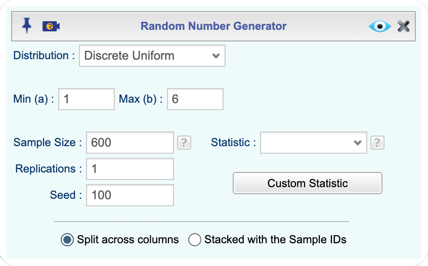
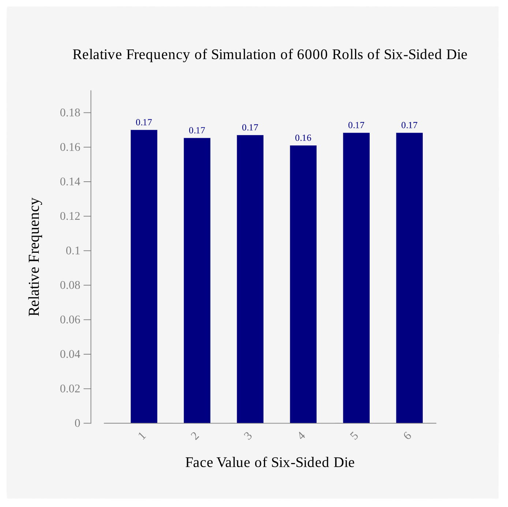

```{r setup4, include=FALSE}
library("mosaic")
Class<-read.csv( "https://krkozak.github.io/MAT160/class_survey.csv") 
Eyeglasses<-read.csv( "https://krkozak.github.io/MAT160/eyglasses.csv") 
Defects<- read.csv( "https://krkozak.github.io/MAT160/defects.csv") 
```

Every day you encounter uncertainty. Will it rain during your commute? Is a new medication likely to help a patient? Does a positive test result mean someone actually has a disease? Should a business stock more inventory before a holiday weekend? Although these questions cannot be answered with certainty, probability gives us a mathematical framework for making informed decisions about them.

Probability is not just an abstract mathematical topic. It is the foundation of all of statistics. When we collect data and draw conclusions, we are always asking: *How likely is it that what I observed happened by chance?* Without understanding probability, we cannot answer that question honestly.

Probability is the "language" that connects data to decisions. Every confidence interval, every hypothesis test, and every statistical claim you will encounter in this course rests on the ideas in this chapter. Taking the time to build a solid foundation here will make the rest of the course much more meaningful.

The ideas in this chapter appear across every discipline. A criminologist asks: what is the likelihood that an eyewitness identification is correct? A nurse asks: if I screen 100 patients, how many will test positive by chance alone? An economist asks: what is the probability that a recession will occur in the next two years? A political scientist asks: what is the chance a polling result reflects the true opinions of voters? These are all probability questions.

This chapter begins with the fundamental vocabulary and rules of probability, builds toward a distinction between two major approaches to calculating probabilities, and introduces how technology — specifically **Rguroo** — can be used to simulate random processes and explore probability in a hands-on way.

## Fundamentals of Probability

### Random Processes and Experiments

Some things in life are **deterministic**. For example, if you drop a ball, you can calculate exactly where it will land. But many things are **random**, meaning the outcome is not fully predictable in advance no matter how much information you have.

A **random process** is any process or phenomenon in which individual outcomes are unpredictable, even though a pattern of outcomes tends to emerge over a large number of repetitions.

**Examples of random processes you encounter:**

-   Flipping a coin — you cannot predict whether it will land heads or tails on any single flip
-   Drawing a card from a shuffled deck
-   Whether a patient responds to a treatment
-   Whether it rains on a given day in your city
-   Whether a product coming off an assembly line is defective
-   Which political candidate a randomly selected voter supports

A probability experiment (often shortened to just *experiment*) is any random process we observe and record. This is different from the everyday use of the word "experiment." An **experiment** is any process whose result is determined by chance. The experiment must be well-defined: you must be able to describe every possible result in advance.

**Examples:**

| Everyday Description | Probability Experiment |
|------------------------------------|------------------------------------|
| Roll a six-sided die | Observe which face (1–6) lands face up |
| Ask a student their major | Record the declared major of one randomly selected student |
| Test whether a lightbulb is defective | Inspect one lightbulb and record: defective or not defective |
| Check today's high temperature | Record whether the high exceeds 90°F |

: Examples of experiments in probability {#tbl-experiments tbl-alt="Table listing everyday descriptions alongside their corresponding probability experiment definitions"}

------------------------------------------------------------------------


### Outcomes, Sample Spaces, and Events

Every probability experiment produces a result. An **outcome** is a single possible result of a probability experiment. When you roll a die, getting a 3 is one outcome. When you flip a coin, getting heads is one outcome. Outcomes must cover every possibility and cannot overlap; no two outcomes can occur at the same time in a single trial.

The **sample space** is the complete list of all possible outcomes. If outcomes are the individual items, the sample space is the entire collection. We write it using set notation with curly braces and usually label it $S$.

An **event** is any group of outcomes we are interested in. Events are subsets of the sample space and are built from outcomes. We usually name events with capital letters like $A$, $B$, or $C$. A **simple event** contains exactly one outcome. A **compound event** contains more than one outcome.

::: {#exm-roll-die}
## Rolling a Die
Consider rolling a fair six-sided die once.

- The **outcomes** are the six individual faces: 1, 2, 3, 4, 5, and 6.
- The **sample space** is $S = \{1, 2, 3, 4, 5, 6\}$.
- Let $A =$ rolling an even number. Then $A = \{2, 4, 6\}$ is a **compound event** made up of three outcomes from the sample space.
- Let $B =$ rolling a 5. Then $B = \{5\}$ is a **simple event** made up of one outcome.
- Let $C =$ rolling a number greater than 4. Then $C = \{5, 6\}$.


Notice that $A$, $B$, and $C$ are all built from the same six outcomes in $S$. The sample space does not change; only the question we are asking changes.
:::

Two special events come up often. A **certain event** contains every outcome in the sample space and will always occur. For example, rolling a number between 1 and 6 on a standard die is a certain event. An **impossible event** contains no outcomes at all and is written as the empty set, $\emptyset$. Rolling a 9 on a standard die is an impossible event.

### Probability: Definition and Rules

Now that we know what outcomes, sample spaces, and events are, we can define probability itself, establish the rules every probability must follow, and understand how probabilities behave when an experiment is repeated many times.

The **probability** of an event $A$, written $P(A)$ (read "probability of A"), is a number between 0 and 1 (inclusive) that represents how likely A is to occur.
$$0 \leq P(A) \leq 1   \text{ for any event } A$$

Probabilities can be expressed as fractions, decimals, or percentages. For example, $P(A) = 1/4 = 0.25 = 25\%$.

When we say an event has a probability of 0.30, we mean: if we were to repeat this experiment a very large number of times under the same conditions, about 30\% of those repetitions would result in that event occurring. Probability does not tell us what will happen on any single trial; it tells us about long-run patterns.

Before we can calculate a probability, we need to ask a key question: are the outcomes in our sample space equally likely? This matters because it determines how we find probabilities.

Outcomes are **equally likely** when every outcome in the sample space has the same probability of occurring. No outcome is favored over any other.


::: {#exm-equally-likely}
## Are the Outcomes Equally Likely?
For each experiment, decide whether the outcomes are equally likely.

**(a)** Rolling a *fair* die: **Yes.** Each face has the same chance of landing face up.

**(b)** Flipping a *weighted* coin where heads is twice as likely as tails: **No.** Heads and tails do not have equal chances.

**(c)** Selecting a ball from a bag containing 4 red balls and 4 blue balls (all the same size): **Yes.** Each individual ball is equally likely to be selected.

**(d)** Selecting a ball from a bag containing 4 red balls and *8* blue balls (all the same size): **No.** Blue balls are more likely to be drawn because there are more of them. 

**(e)** Testing whether the next customer at a coffee shop orders a hot or cold drink: **Probably not.** Without data, we cannot assume customers are equally split between the two options.
:::

When outcomes are not equally likely, you cannot use simple counting to find probabilities. You must use observed data instead. This leads us to the two approaches to probability covered in [Section 4.1.4](#two-approaches-to-calculate-probability).

A **probability model** lists the possible outcomes of a probability experiment and each outcome's probability. Every valid probability model must satisfy two rules. These are not optional; they are requirements that any set of numbers must meet in order to qualify as probabilities.

**Rule 1: Probability is always between 0 and 1 (inclusive)**
$$0 \leq P(A) \leq 1   \text{ for every event } A$$

No probability can be negative. No probability can be greater than 1. If you calculate a probability outside this range, you have made an error.

**Rule 2: The probabilities of all outcomes in the sample space must sum to 1**
$$\sum P(\text{all outcomes}) = 1$$

This means that something always happens. When you list all possible outcomes of an experiment, their probabilities must add up to exactly 1, or 100\%.

::: {#exm-equally-likely}
## Verifying Probability Rules
A psychology researcher studies the types of social media platforms used most frequently by college students. Based on survey data, she estimates the following probabilities:

| Platform     | Estimated Probability |
|--------------|-----------------------|
| Instagram    | 0.34                  |
| TikTok       | 0.28                  |
| Snapchat     | 0.18                  |
| X (Twitter)  | 0.11                  |
| Other / None | 0.09                  |

: Estimated probabilities for most-used social media platform {#tbl-socialmedia tbl-alt="Table showing estimated probabilities for five social media platform categories including Instagram, TikTok, Snapchat, X Twitter, and Other or None"}

Verify this satisifies the rules of probability model. 
:::


:::{.solution}
Verify Rule 1: Each probability is between 0 and 1. 

Verify Rule 2: $0.34 + 0.28 + 0.18 + 0.11 + 0.09 = 1.00$

Both rules are satisfied, so this is a valid probability model.

:::

::: {#exm-missing-prob}
## Finding a Missing Probability

 A weather forecasting model gives the following probabilities for tomorrow's weather in a coastal city:

| Weather       | Probability |
|---------------|-------------|
| Sunny         | 0.45        |
| Partly Cloudy | 0.30        |
| Overcast      | ?           |
| Rain          | 0.12        |

: Weather probability model with missing value {#tbl-weather tbl-alt="Table showing weather probability model with probabilities for Sunny, Partly Cloudy, and Rain, and a missing probability for Overcast"}
:::

:::{.solution}
Since all probabilities must sum to 1:

$$P(\text{Overcast}) = 1 - 0.45 - 0.30 - 0.12 = 0.13$$

There is a 13% chance of overcast skies tomorrow.
:::

### Two Approaches to Calculate Probability

There are two fundamental ways to determine the probability of an event.

**Relative Frequency (Empirical) Probability**

The first approach is based on observation and data. We actually conduct the experiment many times, or use existing data, and measure how often the event occurs. The resulting probability estimate is called the **relative frequency** or **empirical probability**.

Recall from Chapter 2, the **relative frequency** of an event is the number of times of times it occurs out of the total number of trials:
$$\text{Relative Frequency of A} = \dfrac{\text{Number of times A occurred}}{\text{Total number of trials}}$$

This is the empirical approach to probability. It is based on observed data rather than assumptions. The relative frequency gives an estimate of the true probability, and that estimate improves as the number of trials increases.

::: {#exm-empirical-prob}
## Empirical Probability from Survey Data
The General Social Survey (GSS) is a national survey conducted regularly in the United States. In a recent survey, 1,832 out of 2,867 respondents reported that they use social media daily. What is the probability a randomly selected U.S. adult uses social media?
:::

:::{.solution}
This estimate is based on observed data, so it is an empirical probability and we would use relative frequency to find the probability

$$ P(\text{uses social media daily}) \approx \dfrac{1832}{2867} \approx 0.639$$

We estimate there is about a 63.9\% chance that a randomly selected U.S. adult uses social media daily.
:::


*When Would You Use Empirical Probability*

- Outcomes are not equally likely and you do not know the true proportions
- The experiment involves real-world behavior that must be measured
- You want to check whether a theoretical model, like a fair coin, matches reality

**Theoretical Probability**

The second approach is used when we know the structure of the experiment and can assume all outcomes are equally likely. Rather than collecting data, we count the outcomes.

If all outcomes in the sample space are *equally likely*, the probability of event $A$ is:
$$P(A) = \dfrac{\text{Number of outcomes in } A}{\text{Total number of outcomes in }S}$$

This is called the **classical** or **theoretical** probability. It is calculated by reasoning about the structure of the experiment; no data collection is required.

::: {#exm-theoretical-prob}
## Theoretical Probability
A fair six-sided die is rolled. Sample space: $S = \{1, 2, 3, 4, 5, 6\}$, with 6 equally likely outcomes. Find the following probabilities.

**(a)** P(rolling a 4)

**(b)** P(rolling an even number)

**(c)** P(rolling a number > 4)

**(d)** P(rolling a number < 10)

**(e)** P(rolling a 7)

:::

:::{.solution}
**(a)** The event space for the event "rolling a 4" is $A= \{4\}$. Using the theoretical probability formula, 
$$P(\text{rolling a }4) = P(A) = \frac{1}{6} \approx 0.167$$

**(b)** The event space for the event "rolling an even number" is $B = \{2,4,6\}$. Then, the probability is
$$ P(\text{rolling an even number}) = P(B) = \frac{3}{6} = \frac{1}{2} = 0.5$$

**(c)** The event space for the event "rolling a number > 4" is $C = \{5,6\}$. The probability of event $C$ is

$$P(\text{rolling a number }> 4) = P(C) = \frac{2}{6} = \frac{1}{3} \approx 0.333$$

**(d)** The event space for the event "rolling a number < 10" is $D = \{1,2,3,4,5,6\} = S$. The probability of event $D$ is

$$ P(\text{rolling a number }< 10)=P(D) = \frac{6}{6} = 1$$

which makes this a certain event.
**(e)** The event space for the event "rolling a 7" is $E = \{\emptyset\}$. Therefore, the probability of event $E$ is 

$$P(\text{rolling a }7) = P(E) = \frac{0}{6} = 0$$

which makes this an impossible event. 
:::

You might wonder: if I flip a coin just 10 times and get 7 heads, does that mean the probability of heads is 0.70? The **Law of Large Numbers** answers this question.

The **Law of Large Numbers** states that as the number of trials, $n$, of a random experiment increases, the relative frequency of an event gets closer and closer to the true probability of that event.
$$\text{As } n \rightarrow \infty, \quad \dfrac{\text{frequency of A}}{n} \rightarrow P(A)$$

With a small number of trials, expect significant variation from the true probability. With a large number of trials, the relative frequency will closely approximate it.

### Simulation: Exploring Probability with Rguroo

One of the most powerful ways to build intuition about probability is through **simulation**: using technology to repeat a random experiment thousands of times quickly and observing the results. Simulation makes the Law of Large Numbers visible and concrete.

A **simulation** uses a computer to imitate a random process many times. By observing the outcomes of a large number of simulated trials, we can estimate probabilities and explore how random processes behave. Simulations are especially useful when:

- Theoretical probabilities are difficult to calculate
- We want to visualize the Law of Large Numbers
- We want to explore what random variation really looks like

::: {#exm-simulation-die-roll}
## Simulating a Die Roll
Suppose you want to explore whether a fair six-sided die actually produces each face with equal frequency. The theoretical probability of rolling any single face is $1/6 \approx 0.167$. But does that hold up when you actually simulate rolls? And how many trials do you need before the results start to look balanced?

You can investigate this using Rguroo’s simulation tool.
:::

:::{.solution}
Click to expand the box below to see how to use Rguroo to simulate rolling a six-sided die.

::: {#simulating-in-Rguroo .callout-note appearance="simple" collapse="true" icon="none" title="{width=22px style='vertical-align:middle;'} Simulating in Rguroo"}

1.  Open the **Probability-Simulation** toolbox.\
2.  Click on the [Probability]{.dpd} dropdown, and select [Random Generator]{.fun}. This opens the [Random Number Generator]{.dialog} dialog.\
3.  From the [Distribution]{.dpd} dropdown, select [Discrete Uniform]{.fun}. This tells Rguroo to treat all values in a range as equally likely.\
4.  In the [Minimum]{.des} field, enter 1. In the [Maximum]{.des} field, enter 6. This sets up the six equally likely outcomes of a die roll.\
5.  In the [Sample Size]{.des} field, enter 600 for the first run.\
6.  Click the preview icon  to see the sample.
7. Click the  button to save the sample results as [DieRollSim]{.typein}.

::: {.callout-note appearance="simple" collapse="true" icon="none" title="Click here to see the Rguroo dialog"}
{width="500px"}
:::
:::


We can create and examine a barplot of the resulting sample as seen in @fig-sim-barplot. Each bar represents one face of the die (1 through 6). The height of each bar shows the relative frequency of that face in your simulation.
```{r,echo=FALSE}
#| fig-alt: "Screenshot of the barplot output showing six bars, one per face, with relative frequencies annotated for each"
#| warning: FALSE
#| label: fig-sim-barplot
#| fig-cap: "Simulated relative frequencies for 600 rolls of a fair die"
#| fig-subcap: 
#|   - "Dialog box"
#|   - "Barplot"
#| out-width: "80%"
knitr::include_graphics(c("Rguroo_dialogs/Probability/sim_barplot_dialog.png",
"Rguroo_outputs/Probability/die_sim_barplot.png"))
```

With 600 simulated rolls, your barplot will likely show some variation across the six faces. Some faces may appear more than others, and the relative frequencies will probably range from around 0.15 to 0.18 rather than all landing exactly at 0.167. This is normal and expected with a moderate number of trials.

If we repeat the simulation with 6,000 trials (set [Sample Size]{.des} field equal to 6000), and compare the barplots we should notice the barplot of 6,000 trials should be more uniform. The relative frequencies will cluster more tightly around 0.167 for each face, and the differences between bars will shrink.

```{r,echo=FALSE}
#| fig-alt: "Screenshot of the barplot of n = 6,000 trials, showing the bars becoming more uniform as n increases"
#| warning: FALSE
#| label: fig-6000-sim
#| fig-cap: "Simulated relative frequencies for 6000 rolls of a fair die"
#| out-width: "80%"

```

This is the **Law of Large Numbers** in action. With a small number of trials, random variation produces noticeable differences between the outcomes. With a large number of trials, those differences smooth out and the relative frequencies converge toward the theoretical probability of $1/6 \approx 0.167$.

:::

### Homework for Empirical Probability Section

1. An instructor reports the following model for letter grades in her course. Determine if this represents a probabillity model.

| Grade       | A    | B    | C    | D    | F    |
|-------------|------|------|------|------|------|
| Probability | 0.22 | 0.35 | 0.28 | 0.10 | 0.08 |  
: Estimated probabilities for letter grades {#tbl-lettergrades tbl-alt="Table showing estimated probabilities for five letter grades: A, B, C, D, and F"}

2.  A researcher in criminal justice records the type of crime in a randomly selected case from a county court database. The categories are: Violent, Property, Drug, and Other.

    a.  List the sample space.\
    b.  Based on county data, $P(\text{Violent}) = 0.19$, $P(\text{Property}) = 0.41$, $P(\text{Drug}) = 0.27$. Find $P(\text{Other})$.\
    c.  Verify that this is a valid probability model.

3. Two fair coins are flipped. List the sample space using ordered pairs (e.g., HH, HT, ...). Then find:

    a.  $P(\text{exactly one head})$\
    b.  $P(\text{at least one tail})$\
    c.  $P(\text{no heads})$\
    d.  $P(\text{two heads or two tails})$

4. The number of M&M's of each color that were found in 48 packets. The first six rows of these data are given in @tbl-MaM (M&M's Color Distribution Analysis, 2019). Find the probability of choosing each color based on this data frame.

::: {tabindex="0" style="width:85%; margin:auto;"}
 The dataset for this exercise is available in the Rguroo dataset repository [Kozak]{.repo}, with the dataset name [M_and_Ms]{.data}.
:::

```{r mam-table, echo=FALSE}
#| tbl-alt: "Table showing M&M Distribution"
#| label: tbl-MaM
#| tbl-cap: "M&M Distribution"
MaM<- read.csv( "https://krkozak.github.io/MAT160/M_and_Ms.csv") 
knitr::kable(head(MaM))
```

::: {#code-book-MaM .callout-tip .codebook collapse="true"}
## Code book for M_and_Ms Dataset

**Description** An analysis of the colors in a case of M&M's to see if they match the published percentages

Usage MaM

Format

This data frame contains the following columns:

[color]{.var}: color of M&Ms

[type]{.var}: The type of M&M such as plain, peanut, peanut butter

[pack]{.var}: which pack the M&Ms came from.

[Source](https://joshmadison.com/2007/12/02/mms-color-distribution-analysis/) M&M's Color Distribution Analysis. (n.d.). Retrieved July 11, 2019.

References Josh Madison, 2019

:::


2.  Eyeglassomatic manufactures eyeglasses for different retailers. They test to see how many defective lenses they made the time period of January 1 to March 31. The defect and the number of defects is in @tbl-Defects. Find the probability of each defect type based on this data.

::: {tabindex="0" style="width:85%; margin:auto;"}
 The dataset for this exercise is available in the Rguroo dataset repository [Kozak]{.repo}, with the dataset name [defects]{.data}.
:::

**Code book for Data Frame Defects** below @tbl-Defects.


5.  In Australia in 1995, of the 2907 indigenous people in prison 17 of them died. In that same year, of the 14501 non-indigenous people in prison 42 of them died (\\"Aboriginal deaths in,\\" 2013). Find the probability that an indigenous person dies in prison and the probability that a non-indigenous person dies in prison. Compare these numbers and discuss what the numbers may mean.

6.  A project conducted by the Australian Federal Office of Road Safety asked people many questions about their cars. One question was the reason that a person chooses a given car, and the first six rows of that data is in @tbl-Car_pref (Car Preferences, 2019). 
Find the probability a person chooses a car for each of the given reasons.

::: {tabindex="0" style="width:85%; margin:auto;"}
 The dataset for this exercise is available in the Rguroo dataset repository [Kozak]{.repo}, with the dataset name [carprefs]{.data}.
:::

```{r car-pref-table, echo=FALSE}
#| tbl-alt: "Table showing reason for choosing a car"
#| label: tbl-Car_pref
#| tbl-cap: "Reason for Choosing a Car"
Car_pref<- read.csv( "https://krkozak.github.io/MAT160/carprefs.csv") 
knitr::kable(head(Car_pref))
```

::: {#code-book-carprefs .callout-tip .codebook collapse="true"}
## Code book for carprefs Dataset

**Description** These data were collected as part of a project for the Federal Office for Road Safety conducted by the Research Institute of Gender and Health at the University of Newcastle. There is evidence that women drivers who are involved in motor vehicle accidents are more likely than men to be injured. A possible reason is that women often drive smaller cars that provide less protection in a collision. One of the aims of the project was to examine preferences for cars among men and women and investigate the extent to which safety was a factor in determining preferences. The survey was conducted by research assistants who asked people in car parks to participate and administered a structured questionnaire. They were instructed to obtain data from men and women with small, medium and large cars, with 50 people per group for a total of 300 respondents. (The sample size was based on power requirements for another part of the survey that involved anthropometric measurements.) The research assistants approached people in car parks of the University of Newcastle and nearby shopping centers during December 1997 and January 1998.

Usage Car_pref

Format

This data frame contains the following columns:

[ID]{.var}: Identification number of respondent

[Age]{.var}: Age of respondent (years)

[Sex]{.var}: female, male

[LicYr]{.var}: Time they have held a full driving licence, in years and months (years)

[LicMth]{.var}: Time they have held a full driving licence, in years and months (months)

[ActCar]{.var}: Make, model and year of car most often driven, coded to size of car small, medium, large

[Kids5]{.var}: Children under five, yes, no

[Kids6]{.var}: Children 6 to 16, yes, no

[PrefCar]{.var}: Preferred car, coded to size of car small, medium, large

[Car15k]{.var}: Preferred type of car if cost \\\$15000, small new car; large second-hand car

[Reason]{.var}: safety, reliability, cost, performance, comfort, looks

[Cost]{.var}: How important is cost when buying a car? not important, little importance, important, very important

[Reliable]{.var}: How important is reliability ...?

[Perform]{.var}: How important is performance ...?

[Fuel]{.var}: How important is fuel consumption ...?

[Safety]{.var}: How important is safety ...?

[AC/PS]{.var}: How important is air conditioning/power steering ...?

[Park]{.var}: How important is ease of parking ...?

[Room]{.var}: How important is space/roominess ...?

[Doors]{.var}: How important is the number of doors ...?

[Prestige]{.var}: How important is prestige/style ...?

[Colour]{.var}: How important is colour ...?

[Source](http://www.statsci.org/data/oz/carprefs.html) Car Preferences. (n.d.). Retrieved July 11, 2019.

References

The data was contributed to OzDASL by Professor Annette Dobson, University of Queensland. Information on the data set was originally provided by Jenny Powers.
:::

7. Using Rguroo’s Simulation tool ( From the [Distribution]{.dpd} dropdown, select [Bernoulli Trial]{.fun}.), simulate flipping a fair coin with p = 0.5. Run simulations with n = 20, 100, 500, and 5,000. For each run, record the relative frequency of heads. Create a table of your results and write 2 to 3 sentences describing how the relative frequency changes as n increases.

## Theoretical Probability

It is not always feasible to conduct an experiment over and over again, so it would be better to be able to find the probabilities without conducting the experiment. These probabilities are called **Theoretical Probabilities**.

To be able to do theoretical probabilities, there is an assumption that you need to consider. It is that all of the outcomes in the sample space need to be \*\*equally likely outcomes\*\*. This means that every outcome of the experiment needs to have the same chance of happening.

### Example: Equally Likely Outcomes

Which of the following experiments have equally likely outcomes?

a.  Rolling a fair die.
b.  Flip a coin that is weighted so one side comes up more often than the other.
c.  Pull a ball out of a can containing 6 red balls and 8 green balls. All balls are the same size.
d.  Picking a card from a deck.
e.  Rolling a die to see if it is fair.

#### **Solution**

a.  Rolling a fair die.

    Since the die is fair, every side of the die has the same chance of coming up. The outcomes are the different sides, so each outcome is equally likely

b.  Flip a coin that is weighted so one side comes up more often than the other.

    Since the coin is weighted, one side is more likely to come up than the other side. The outcomes are the different sides, so each outcome is not equally likely

c.  Pull a ball out of a can containing 6 red balls and 8 green balls. All balls are the same size.

    Since each ball is the same size, then each ball has the same chance of being chosen. The outcomes of this experiment are the individual balls, so each outcome is equally likely. Don't assume that because the chances of pulling a red ball are less than pulling a green ball that the outcomes are not equally likely. The outcomes are the individual balls and they are equally likely.

d.  Picking a card from a deck.

    If you assume that the deck is fair, then each card has the same chance of being chosen. Thus the outcomes are equally likely outcomes. You do have to make this assumption. For many of the experiments you will do, you do have to make this kind of assumption.

e.  Rolling a die to see if it is fair.

    In this case you are not sure the die is fair. The only way to determine if it is fair is to actually conduct the experiment, since you don't know if the outcomes are equally likely. If the experimental probabilities are fairly close to the theoretical probabilities, then the die is fair.

If the outcomes are not equally likely, then you must do experimental probabilities. If the outcomes are equally likely, then you can do theoretical probabilities.

**Theoretical Probabilities**: If the outcomes of an experiment are equally likely, then the probability of event A happening is

$P(A)=\frac{\text{number of outcomes in event space}}{\text{number of outcomes in sample space}}$

### Example: Calculating Theoretical Probabilities {#example-calculating-theoretical-probabilities}

Suppose you conduct an experiment where you flip a fair coin twice

a.  What is the sample space?
b.  What is the probability of getting exactly one head?
c.  What is the probability of getting at least one head?
d.  What is the probability of getting a head and a tail?
e.  What is the probability of getting a head or a tail?
f.  What is the probability of getting a foot?
g.  What is the probability of each outcome? What is the sum of these probabilities?

#### Solution

a.  What is the sample space?

    There are several different sample spaces you can do. One is SS={0, 1, 2} where you are counting the number of heads. However, the outcomes are not equally likely since you can get one head by getting a head on the first flip and a tail on the second or a tail on the first flip and a head on the second. There are 2 ways to get that outcome and only one way to get the other outcomes. Instead it might be better to give the sample space as listing what can happen on each flip. Let H = head and T = tail, and list which can happen on each flip.

    $SS$={HH, HT, TH, TT}

b.  What is the probability of getting exactly one head?

    Let $A$ = getting exactly one head. The event space is $A$ = {HT, TH}. So $P(A)=\frac{2}{4}$

    It may not be advantageous to reduce the fractions to lowest terms, since it is easier to compare fractions if they have the same denominator.

c.  What is the probability of getting at least one head?

    Let $B$ = getting at least one head. At least one head means get one or more. The event space is $B$ = {HT, TH, HH} and $P(B)=\frac{3}{4}$ Since $P(B)$ is greater than the $P(A)$, then event $B$ is more likely to happen than event $A$.

d.  What is the probability of getting a head and a tail?

    Let $C$ = getting a head and a tail = {HT, TH} and $P(C)=\frac{2}{4}$ This is the same event space as event $A$, but it is a different event. Sometimes two different events can give the same event space.

e.  What is the probability of getting a head or a tail?

    Let $D$ = getting a head or a tail. Since or means one or the other or both and it doesn't specify the number of heads or tails, then $D$ = {HH, HT, TH, TT} and $P(D)=\frac{3}{4}$

f.  What is the probability of getting a foot?

    Let $E$ = getting a foot. Since you can't get a foot, $E$ = {} or the empty set and $P(E)=\frac{0}{4}=0$

g.  What is the probability of each outcome? What is the sum of these probabilities?

    $P(HH)=P(HT)=P(TH)=P(TT)=\frac{1}{4}$. If you add all of these probabilities together you get $1$.

This example had some results in it that are important concepts. They are summarized below:

### **Probability Properties**

1.  $0 \le P(\text{event}) \le 1$
2.  If the $P(\text{event}) = 1$, then it will happen and is called the certain event
3.  If the $P(\text{event}) = 0$, then it cannot happen and is called the impossible event
4.  $\sum{P(\text{all outcomes})}=1$

### Example: Calculating Theoretical Probabilities 2

Suppose you conduct an experiment where you pull a card from a standard deck.

a.  What is the sample space?
b.  What is the probability of getting a Spade?
c.  What is the probability of getting a Jack?
d.  What is the probability of getting an Ace?
e.  What is the probability of not getting an Ace?
f.  What is the probability of not getting an Ace?
g.  What is the probability of getting a Spade or an Ace?
h.  What is the probability of getting a Jack and an Ace?
i.  What is the probability of getting a Jack and an Ace?

#### **Solution**

a.  What is the sample space?

    $SS$ = {2S, 3S, 4S, 5S, 6S, 7S, 8S, 9S, 10S, JS, QS, KS, AS, 2C, 3C, 4C, 5C, 6C, 7C, 8C, 9C, 10C, JC, QC, KC, AC, 2D, 3D, 4D, 5D, 6D, 7D, 8D, 9D, 10D, JD, QD, KD, AD, 2H, 3H, 4H, 5H, 6H, 7H, 8H, 9H, 10H, JH, QH, KH, AH}

b.  What is the probability of getting a Spade?

    Getting a spade = {2S, 3S, 4S, 5S, 6S, 7S, 8S, 9S, 10S, JS, QS, KS, AS} so $P(spade)=\frac{13}{52}$

c.  What is the probability of getting a Jack?

    Getting a Jack = {JS, JC, JH, JD} so $P(jack)=\frac{4}{52}$

d.  What is the probability of getting an Ace?

    Getting an Ace = {AS, AC, AH, AD} so $P(ace)=\frac{4}{52}$

e.  What is the probability of not getting an Ace?

    Not getting an Ace = {2S, 3S, 4S, 5S, 6S, 7S, 8S, 9S, 10S, JS, QS, KS, 2C, 3C, 4C, 5C, 6C, 7C, 8C, 9C, 10C, JC, QC, KC, 2D, 3D, 4D, 5D, 6D, 7D, 8D, 9D, 10D, JD, QD, KD, 2H, 3H, 4H, 5H, 6H, 7H, 8H, 9H, 10H, JH, QH, KH} so $P(\text{not ace})=\frac{48}{52}$

Notice, $P(ace)+P(\text{not ace})=1$, so you could have found the probability of not ace by doing $1$ minus the probability of ace. $P(\text{not ace})=1-P(ace) = 1-\frac{4}{52} = \frac{48}{52}$

f.  What is the probability of getting a Spade and an Ace?

    Getting a Spade and an Ace = {AS} so $P(AS)=\frac{1}{52}$

g.  What is the probability of getting a Spade or an Ace?

    Getting a Spade and an Ace ={2S, 3S, 4S, 5S, 6S, 7S, 8S, 9S, 10S, JS, QS, KS, AS, AC, AD, AH} so $P(\text{spade and ace})=\frac{16}{52}$

h.  What is the probability of getting a Jack and an Ace?

    Getting a Jack and an Ace = { } since you can't do that when picking one card. So $P(\text{Jack and Ace})=\frac{0}{52}=0$

i.  What is the probability of getting a Jack or an Ace?

    Getting a Jack or an Ace = {JS, JC, JD, JH, AS, AC, AD, AH} so $P(\text{Jack or Ace})=\frac{8}{52}$

### Example: Calculating Theoretical Probabilities 3

Suppose you have an iPhone and playing iTunes with the following songs on it: 5 Rolling Stones songs, 7 Beatles songs, 9 Bob Dylan songs, 4 Faith Hill songs, 2 Taylor Swift songs, 7 U2 songs, 4 Mariah Carey songs, 7 Bob Marley songs, 6 Bunny Wailer songs, 7 Elton John songs, 5 Led Zeppelin songs, and 4 Dave Mathews Band songs. The different genre that you have are rock from the 60s which includes Rolling Stones, Beatles, and Bob Dylan; country includes Faith Hill and Taylor Swift; rock of the 90s includes U2 and Mariah Carey; Reggae includes Bob Marley and Bunny Wailer; rock of the 70s includes Elton John and Led Zeppelin; and bluegrass-rock includes Dave Mathews Band.

Suppose the iTunes is set to shuffle the songs, so it randomly picks the next song so you have no idea what the next song will be. Now you would like to calculate the probability that you will hear the type of music or the artist that you are interested in. The sample set is too difficult to write out, but you can figure it from looking at the number in each set and the total number. The total number of songs you have is 67.

a.  What is the probability that you will hear a Faith Hill song?
b.  What is the probability that you will hear a Bunny Wailer song?
c.  What is the probability that you will hear a song from the 60s?
d.  What is the probability that you will hear a Reggae song?
e.  What is the probability that you will hear a song from the 90s or a bluegrass-rock song?
f.  What is the probability that you will hear an Elton John or a Taylor Swift song?
g.  What is the probability that you will hear a country song or a U2 song?

#### **Solution**

a.  What is the probability that you will hear a Faith Hill song?

    There are 4 Faith Hill songs out of the 67 songs, so $P(\text{Faith Hill})=\frac{4}{67}$

b.  What is the probability that you will hear a Bunny Wailer song?

    There are 6 Bunny Wailer songs, so $P(\text{Bunny Wailer})=\frac{6}{67}$

c.  What is the probability that you will hear a song from the 60s?

    There are 5, 7, and 9 songs that are classified as rock from the 60s, which is 21 total, so $P(\text{song from 60s})=\frac{21}{67}$

d.  What is the probability that you will hear a Reggae song?

    There are 6 and 7 songs that are classified as Reggae, which is 13 total, so $P(\text{Reggae})=\frac{13}{67}$

e.  What is the probability that you will hear a song from the 90s or a bluegrass-rock song?

    There are 7 and 4 songs that are songs from the 90s and 4 songs that are bluegrass-rock, for a total of 15, so $P(\text{song 90s or bluegrass-rock})=\frac{15}{67}$

f.  What is the probability that you will hear an Elton John or a Taylor Swift song?

    There are 7 Elton John songs and 2 Taylor Swift songs, for a total of 9, so $P(\text{Elton John or Taylor Swift})=\frac{9}{67}$

g.  What is the probability that you will hear a country song or a U2 song?

    There are 6 country songs and 7 U2 songs, for a total of 13, so $P(\text{country or U2})=\frac{13}{67}$

Of course you can do any other combinations you would like.

Notice in [Example: Calculating Theoretical Probabilities](#example-calculating-theoretical-probabilities) part e, it was mentioned that the probability of getting an ace plus the probability of not getting an ace was 1. This is because these two events have no outcomes in common, and together they make up the entire sample space. Events that have this property are called **complementary events**.

If two events are **complementary events** then to find the probability of one just subtract the probability of the other from one. Notation used for complement of $A$ is $\text{not }A$ or $A^{c}$.

$P(A)+P(\text{not }A)=1$

### Example: Complementary Events

a.  Suppose you know that the probability of it raining today is 0.45. What is the probability of it not raining?
b.  Suppose you know the probability of not getting the flu is 0.24. What is the probability of getting the flu?
c.  In an experiment of picking a card from a deck, what is the probability of not getting a card that is a Queen?

#### **Solution**

a.  Suppose you know that the probability of it raining today is 0.45. What is the probability of it not raining?

    Since not raining is the complement of raining, then $P(\text{not raining})=1-P(\text{raining}) = 1-0.45=0.55$

b.  Suppose you know the probability of not getting the flu is 0.24. What is the probability of getting the flu?

    Since getting the flu is the complement of not getting the flu, then $P(\text{getting flu})=1-P(flu)=1-0.24=0.76$

c.  In an experiment of picking a card from a deck, what is the probability of not getting a card that is a Queen?

    You could do this problem by listing all the ways to not get a queen, but that set is fairly large. One advantage of the complement is that it reduces the workload. You use the complement in many situations to make the work shorter and easier. In this case it is easier to list all the ways to get a Queen, find the probability of the Queen, and then subtract from one.

    Queen = {QS, QC, QD, QH} so $P(Queen)=\frac{4}{52}$ and $P(\text{not Queen})=1-P(Queen)=1-\frac{4}{52}=\frac{48}{52}$

The complement is useful when you are trying to find the probability of an event that involves the words at least or an event that involves the words at most. As an example of an at least event is suppose you want to find the probability of making at least \\\$50,000 when you graduate from college. That means you want the probability of your salary being greater than or equal to \\\$50,000. An example of an at most event is suppose you want to find the probability of rolling a die and getting at most a 4. That means that you want to get less than or equal to a 4 on the die. The reason to use the complement is that sometimes it is easier to find the probability of the complement and then subtract from 1.

### Example: Using the Complement to Find Probabilities

a.  In an experiment of rolling a fair die one time, find the probability of rolling at most a 4 on the die.
b.  In an experiment of pulling a card from a fair deck, find the probability of pulling at least a 5 (ace is a high card in this example).

#### **Solution**

a.  In an experiment of rolling a fair die one time, find the probability of rolling at most a 4 on the die.

    The sample space for this experiment is {1, 2, 3, 4, 5, 6}. You want the event of getting at most a 4, which is the same as thinking of getting 4 or less. The event space is {1, 2, 3, 4}. The probability is $P(\text{at most a 4})=\frac{4}{6}$

    Or you could have used the complement. The complement of rolling at most a 4 would be rolling number bigger than 4. The event space for the complement is {5, 6}. The probability of the complement is $P(\text{more than 4})=\frac{2}{6}$. The probability of at most 4 would be $P(\text{at most 4})=1-P(\text{more than 4})=1-\frac{2}{6}=\frac{4}{6}$

    Notice you have the same answer, but the event space was easier to write out. For this example the complement probability wasn't that useful, but in the future there will be events where it is much easier to use the complement.

b.  In an experiment of pulling a card from a fair deck, find the probability of pulling at least a 5 (ace is a high card in this example).

    The sample space for this experiment is $SS$ = {2S, 3S, 4S, 5S, 6S, 7S, 8S, 9S, 10S, JS, QS, KS, AS, 2C, 3C, 4C, 5C, 6C, 7C, 8C, 9C, 10C, JC, QC, KC, AC, 2D, 3D, 4D, 5D, 6D, 7D, 8D, 9D, 10D, JD, QD, KD, AD, 2H, 3H, 4H, 5H, 6H, 7H, 8H, 9H, 10H, JH, QH, KH, AH}

Pulling a card that is at least a 5 would involve listing all of the cards that are a 5 or more. It would be much easier to list the outcomes that make up the complement. The complement of at least a 5 is less than a 5. That would be the event of 4 or less. The event space for the complement would be {2S, 3S, 4S, 2C, 3C, 4C, 2D, 3D, 4D, 2H, 3H, 4H}. The probability of the complement would be $\frac{12}{52}$. The probability of at least a 5 would be $P(\text{at least 5})=1-P(\text{at most 4})=1-\frac{12}{52}=\frac{40}{52}$

Another concept was shown in [Example: Calculating Theoretical Probabilities 2] parts g and i. The problems were looking for the probability of one event or another. In part g, it was looking for the probability of getting a Spade or an Ace. That was equal to $\frac{16}{52}$. In part i, it was looking for the probability of getting a Jack or an Ace. That was equal to $\frac{8}{52}$. If you look back at the parts b, c, and d, you might notice the following result: $P(\text{Jack or Ace})=P(Jack)+P(Ace)$ but $P(\text{Spade or Ace})\ne P(Spade)+P(Ace)$.

Why does adding two individual probabilities together work in one situation to give the probability of one or another event and not give the correct probability in the other?

The reason this is true in the case of the Jack and the Ace is that these two events cannot happen together. There is no overlap between the two events, and in fact the $P(\text{Jack and Ace})=0$. However, in the case of the Spade and Ace, they can happen together. There is overlap, mainly the ace of spades. The $P(\text{Spade and Ace})\ne0$.

When two events cannot happen at the same time, they are called **mutually exclusive**. In the above situation, the events Jack and Ace are mutually exclusive, while the events Spade and Ace are not mutually exclusive.

### **Addition Rules:**

If two events A and B are mutually exclusive, then $P(\text{A and B})=0$ and $P(\text{A or B})=P(A)+P(B)$

If two events A and B are not mutually exclusive, then $P(\text{A or B})=P(A)+P(B)-P(\text{A and B})$

### Example: Using Addition Rules

Suppose your experiment is to roll two fair dice.

a.  What is the sample space?
b.  What is the probability of getting a sum of 5?
c.  What is the probability of getting the first die a 2?
d.  What is the probability of getting a sum of 7?
e.  What is the probability of getting a sum of 5 and the first die a 2?
f.  What is the probability of getting a sum of 5 or the first die a 2?
g.  What is the probability of getting a sum of 5 and sum of 7?
h.  What is the probability of getting a sum of 5 or sum of 7?

#### **Solution**

a.  What is the sample space?

    As with the other examples you need to come up with a sample space that has equally likely outcomes. One sample space is to list the sums possible on each roll. That sample space would look like: $SS$ = {2, 3, 4, 5, 6, 7, 8, 9, 10, 11, 12}. However, there are more ways to get a sum of 7 then there are to get a sum of 2, so these outcomes are not equally likely. Another thought is to list the possibilities on each roll. As an example you could roll the dice and on the first die you could get a $1$. The other die could be any number between $1$ and $6$, but say it is a $1$ also. Then this outcome would look like (1,1). Similarly, you could get (1, 2), (1, 3), (1,4), (1, 5), or (1, 6). Also, you could get a 2, 3, 4, 5, or 6 on the first die instead. Putting this all together, you get the sample space:

    $SS$ = {(1,1), (1,2), (1,3), (1,4), (1,5), (1,6),

    (2,1), (2,2), (2,3), (2,4), (2,5), (2,6),

    (3,1), (3,2), (3,3), (3,4), (3,5), (3,6),

    (4,1), (4,2), (4,3), (4,4), (4,5), (4,6),

    (5,1), (5,2), (5,3), (5,4), (5,5), (5,6),

    (6,1), (6,2), (6,3), (6,4), (6,5), (6,6)}

    Notice that a (2,3) is different from a (3,2), since the order that you roll the die is important and you can tell the difference between these two outcomes. You don't need any of the doubles twice, since these are not distinguishable from each other in either order.

**This will always be the sample space for rolling two dice.**

b.  What is the probability of getting a sum of 5?

    Getting a sum of 5 = {(4,1), (3,2), (2,3), (1,4)} so $P(\text{sum of 5})=\frac{4}{36}$

c.  What is the probability of getting the first die a 2?

    Getting first die a 2 = {(2,1), (2,2), (2,3), (2,4), (2,5), (2,6)} so $P(\text{1st die 2})=\frac{6}{36}$

d.  What is the probability of getting a sum of 7?

    Getting a sum of 7 = {(6,1), (5,2), (4,3), (3,4), (2,5), (1,6)} so $P(\text{sum of 7})=\frac{6}{36}$

e.  What is the probability of getting a sum of 5 and the first die a 2?

    This is events A and B which contains the outcome {(2,3)} so $P(\text{sum of 5 and 1st die a 2})=\frac{1}{36}$

f.  What is the probability of getting a sum of 5 or the first die a 2?

    Notice from part e, that these two events are not mutually exclusive, so

$P(\text{sum of 5 or 1st die a 2})$

$=P(\text{sum of 5})+P(\text{1st die 2})-P(\text{sum of 5 and 1st die a 2})$

$= \frac{4}{36}+\frac{6}{36}-\frac{1}{36}=\frac{9}{36}$

g.  What is the probability of getting a sum of 5 and sum of 7?

    These are the events parts a and c, which have no outcomes in common. Thus sum of 5 and sum of 7 = { } so $P(\text{sum of 5 and sum of 7})=0$

h.  What is the probability of getting a sum of 5 or sum of 7?

    From part g, these two events are mutually exclusive, so $P(\text{sum of 5 or sum of 7})=P(\text{sum of 5})+P(\text{sum of 7})$

    $=\frac{4}{36}+\frac{6}{36}=\frac{10}{36}$

### Odds

Many people like to talk about the odds of something happening or not happening. Mathematicians, statisticians, and scientists prefer to deal with probabilities since odds are difficult to work with, but gamblers prefer to work in odds for figuring out how much they are paid if they win.

The **actual odds against** event $A$ occurring are the ratio $\frac{P(\text{not }A)}{P(A)}$, usually expressed in the form $a:b$ or $a$ to $b$, where $a$ and $b$ are integers with no common factors.

The **actual odds in favor** event $A$ occurring are the ratio $\frac{P(A)}{P(\text{not }A)}$, which is the reciprocal of the odds against. If the odds against event $A$ are $a:b$, then the odds in favor event $A$ are $b:a$.

The **payoff odds** against event $A$ occurring are the ratio of the net profit (if you win) to the amount bet.

payoff odds against event $A$ = (net profit) : (amount bet)

### Example: Odds Against and Payoff Odds

In the game of Craps, if a shooter has a come-out roll of a 7 or an 11, it is called a natural and the pass line wins. The payoff odds are given by a casino as $1:1$.

a.  Find the probability of a natural.
b.  Find the actual odds for a natural.
c.  Find the actual odds against a natural.
d.  If the casino pays 1:1, how much profit does the casino make on a \\\$10 bet?

#### **Solution**

a.  Find the probability of a natural.

    A natural is a 7 or 11. The sample space is

    SS = {(1,1), (1,2), (1,3), (1,4), (1,5), (1,6), (2,1), (2,2), (2,3), (2,4), (2,5), (2,6), (3,1), (3,2), (3,3), (3,4), (3,5), (3,6), (4,1), (4,2), (4,3), (4,4), (4,5), (4,6), (5,1), (5,2), (5,3), (5,4), (5,5), (5,6), (6,1), (6,2), (6,3), (6,4), (6,5), (6,6)}

    The event space is {(1,6), (2,5), (3,4), (4,3), (5,2), (6,1), (5,6), (6,5)}

    So $P(\text{7 or 11})=\frac{8}{36}$

b.  Find the actual odds for a natural.

    $\text{odds of natural}=\frac{P(\text{7 or 11})}{P(\text{not 7 or 11})} =\frac{\frac{8}{36}}{1-\frac{8}{36}} =\frac{\frac{8}{36}}{\frac{28}{36}} =\frac{8}{28}=\frac{2}{7}$

c.  Find the actual odds against a natural.

    $\text{odds of against a natural}=\frac{P(\text{not 7 or 11})}{P(\text{7 or 11})} =\frac{1-\frac{8}{36}}{\frac{8}{36}} =\frac{\frac{28}{36}}{\frac{8}{36}} =\frac{28}{8}=\frac{3.5}{1}$

d.  If the casino pays 1:1, how much profit does the casino make on a \\\$10 bet?

    The actual odds are 3.5 to 1 while the payoff odds are 1 to 1. The casino pays you \\\$10 for your \\\$10 bet. If the casino paid you the actual odds, they would pay \\\$3.50 on every \\\$1 bet, and on \\\$10, they pay \$3.5\*10\$ =\\\$35. Their profit is $35-10$= \\\$25.

### Homework for Theoretical Probability Section

1.  In [Homework for Empirical Probability Section], the probabilities of each color of M&Ms in a packet were found. Use that information to answer the following questions.

<!-- -->

a.  Find the probability of choosing a green or red M&M.
b.  Find the probability of choosing a blue, red, or yellow M&M.
c.  Find the probability of not choosing a brown M&M.
d.  Find the probability of not choosing a green M&M.

<!-- -->

2.  In [Homework for Empirical Probability Section], the probabilities for defects in eyeglasses manufactured by Eyeglassomatic were calculated. Use that information to find the following probabilities.

<!-- -->

a.  Find the probability of picking a lens that is scratched or flaked.
b.  Find the probability of picking a lens that is the wrong PD or was lost in lab.
c.  Find the probability of picking a lens that is not scratched.
d.  Find the probability of picking a lens that is not the wrong shape.

<!-- -->

3.  An experiment is to flip a fair coin three times.

<!-- -->

a.  State the sample space.
b.  Find the probability of getting exactly two heads. Make sure you state the event space.
c.  Find the probability of getting at least two heads. Make sure you state the event space.
d.  Find the probability of getting an odd number of heads. Make sure you state the event space.
e.  Find the probability of getting all heads or all tails. Make sure you state the event space.
f.  Find the probability of getting exactly two heads or exactly two tails.
g.  Find the probability of not getting an odd number of heads.

<!-- -->

4.  An experiment is rolling a fair die and then flipping a fair coin.

<!-- -->

a.  State the sample space.
b.  Find the probability of getting a head. Make sure you state the event space.
c.  Find the probability of getting a 6. Make sure you state the event space.
d.  Find the probability of getting a 6 or a head.
e.  Find the probability of getting a 3 and a tail.

<!-- -->

5.  An experiment is rolling two fair dice.

<!-- -->

a.  State the sample space.
b.  Find the probability of getting a sum of 3. Make sure you state the event space.
c.  Find the probability of getting the first die is a 4. Make sure you state the event space.
d.  Find the probability of getting a sum of 8. Make sure you state the event space.
e.  Find the probability of getting a sum of 3 or sum of 8.
f.  Find the probability of getting a sum of 3 or the first die is a 4.
g.  Find the probability of getting a sum of 8 or the first die is a 4.
h.  Find the probability of not getting a sum of 8.

<!-- -->

6.  An experiment is pulling one card from a fair deck.

<!-- -->

a.  State the sample space.
b.  Find the probability of getting a Ten. Make sure you state the event space.
c.  Find the probability of getting a Diamond. Make sure you state the event space.
d.  Find the probability of getting a Club. Make sure you state the event space.
e.  Find the probability of getting a Diamond or a Club.
f.  Find the probability of getting a Ten or a Diamond.

<!-- -->

7.  An experiment is pulling a ball from an urn that contains 3 blue balls and 5 red balls.

<!-- -->

a.  Find the probability of getting a red ball.
b.  Find the probability of getting a blue ball.
c.  Find the odds for getting a red ball.
d.  Find the odds for getting a blue ball.

<!-- -->

8.  In the game of roulette, there is a wheel with spaces marked 0 through 36 and a space marked 00.

<!-- -->

a.  Find the probability of winning if you pick the number 7 and it comes up on the wheel.
b.  Find the odds against winning if you pick the number 7.
c.  The casino will pay you \\\$20 for every dollar you bet if your number comes up. How much profit is the casino making on the bet?

## Conditional Probability

Suppose you want to figure out if you should buy a new car. When you first go and look, you find two cars that you like the most. In your mind they are equal, and so each has a 50% chance that you will pick it. Then you start to look at the reviews of the cars and realize that the first car has had 40% of them needing to be repaired in the first year, while the second car only has 10% of the cars needing to be repaired in the first year. You could use this information to help you decide which car you want to actually purchase. Both cars no longer have a 50% chance of being the car you choose. You could actually calculate the probability you will buy each car, which is a conditional probability. You probably wouldn't do this, but it gives you an example of what a conditional probability is.

**Conditional probabilities** are probabilities calculated after information is given. This is where you want to find the probability of event $A$ happening after you know that event $B$ has happened. If you know that $B$ has happened, then you don't need to consider the rest of the sample space. You only need the outcomes that make up event $B$. Event $B$ becomes the new sample space, which is called the **restricted sample space,** $R$. If you always write a restricted sample space when doing conditional probabilities and use this as your sample space, you will have no trouble with conditional probabilities. The notation for conditional probabilities is $P(\text{A, given B})=P(A|B)$. The event following the vertical line is always the restricted sample space.

### Example: Conditional Probabilities

a.  Suppose you roll two dice. What is the probability of getting a sum of 5, given that the first die is a 2?
b.  Suppose you roll two dice. What is the probability of getting a sum of 7, given the first die is a 4?
c.  Suppose you roll two dice. What is the probability of getting the second die a 2, given the sum is a 9?
d.  Suppose you pick a card from a deck. What is the probability of getting a Spade, given that the card is a Jack?
e.  Suppose you pick a card from a deck. What is the probability of getting an Ace, given the card is a Queen?

#### **Solution**

a.  Suppose you roll two dice. What is the probability of getting a sum of 5, given that the first die is a 2?

    Since you know that the first die is a 2, then this is your restricted sample space, $R$ = {(2,1), (2,2), (2,3), (2,4), (2,5), (2,6)} Out of this restricted sample space, the way to get a sum of 5 is {(2,3)}. Thus

    $P(\text{sum of 5, given first die a 2})=P(\text{sum of 5}|\text{first die 2})=\frac{1}{6}$

b.  Suppose you roll two dice. What is the probability of getting a sum of 7, given the first die is a 4?

    Since you know that the first die is a 4, this is your restricted sample space, $R$ = {(4,1), (4,2), (4,3), (4,4), (4,5), (4,6)} Out of this restricted sample space, the way to get a sum of 7 is {(4,3)}. Thus

    $P(\text{sum of 7, given first die a 4})=P(\text{sum of 7}|\text{first die 4})=\frac{1}{6}$

c.  Suppose you roll two dice. What is the probability of getting the second die a 2, given the sum is a 9?

    Since you know the sum is a 9, this is your restricted sample space, $R$ = {(3,6), (4,5), (5,4), (6,3)}. Out of this restricted sample space there is no way to get the second die a 2. Thus

    $P(\text{first die a 2, given sum is 9})=P(\text{1st die a 2}|\text{sum of 9})=\frac{0}{4}$

d.  Suppose you pick a card from a deck. What is the probability of getting a Spade, given that the card is a Jack?

    Since you know that the card is a Jack, this is your restricted sample space, $R$ = {JS, JC, JD, JH}. Out of this restricted sample space, the way to get a Spade is {JS}. Thus

    $P(\text{spade, given card a Jack})=P(\text{spade}|\text{Jack})=\frac{1}{4}$

e.  Suppose you pick a card from a deck. What is the probability of getting an Ace, given the card is a Queen?

    Since you know that the card is a Queen, then this is your restricted sample space, $R$ = {QS, QC, QD, QH} Out of this restricted sample space, there is no way to get an Ace, thus

    $P(\text{Ace, given Queen})=P(\text{Ace}|\text{Queen})=\frac{0}{4}$

If you look at the results of [Example: Calculating Theoretical Probabilities 2] part d and [Example: Calculating Theoretical Probabilities](#example-calculating-theoretical-probabilities) part b, you will notice that you get the same answer. This means that knowing that the first die is a 4 did not change the probability that the sum is a 7. This added knowledge did not help you in any way. It is as if that information was not given at all. However, if you compare example [Example: Calculating Theoretical Probabilities 2] part b and [Example: Calculating Theoretical Probabilities](#example-calculating-theoretical-probabilities) part a, you will notice that they are not the same answer. In this case, knowing that the first die is a 2 did change the probability of getting a sum of 5. In the first case, the events sum of 7 and first die is a 4 are called **independent events**. In the second case, the events sum of 5 and first die is a 2 are called **dependent events**.

Events $A$ and $B$ are considered **independent events** if the fact that one event happens does not change the probability of the other event happening. In other words, events $A$ and $B$ are independent if the fact that $B$ has happened does not affect the probability of event $A$ happening and the fact that $A$ has happened does not affect the probability of event $B$ happening. Otherwise, the two events are dependent.

In symbols, $A$ and $B$ are independent if $P(A|B)=P(A)$ or $P(B|A)=P(B)$

### Example: Independent Events

a.  Suppose you roll two dice. Are the events "sum of 7" and "first die is a 3" independent?
b.  Suppose you roll two dice. Are the events "sum of 6" and "first die is a 4" independent?
c.  Suppose you pick a card from a deck. Are the events "Jack" and "Spade" independent?
d.  Suppose you pick a card from a deck. Are the events "Heart" and "Red" card independent?
e.  Suppose you have two children via separate births. Are the events "the first is a boy" and "the second is a girl" independent?
f.  Suppose you flip a coin 50 times and get a head every time, what is the probability of getting a head on the next flip?

#### **Solution**

a.  Suppose you roll two dice. Are the events "sum of 7" and "first die is a 3" independent?

    To determine if they are independent, you need to see if $P(\text{sum of 7| first die a 3}=P(\text{sum of 7})$ or the other way around. It doesn't matter which order these are calculated in, so pick whichever is easier. sum of 7 = {(1,6), (2,5), (3,4), (4,3), (5,2), (6,1)} first die is a 3 = {(3,1), (3,2), (3,3), (3,4), (3,5), (3,6)} $P(\text{sum of 7| first die a 3})$ means that you assume that first die is a 3 has happened. The restricted sample space is the first die is a 3, $R$ = {(3,1), (3,2), (3,3), (3,4), (3,5), (3,6)} In this restricted sample space, the way for a sum of 7 to happen is {(3,4)}, so $P(\text{sum of 7| first die a 3})=\frac{1}{6}$ The $P(\text{sum of 7})=\frac{6}{36}=\frac{1}{6}$. Since $P(\text{sum of 7| first die a 3})=P(\text{sum of 7})$, the "sum of 7" and "first die is a 3" are independent events.

b.  Suppose you roll two dice. Are the events "sum of 6" and "first die is a 4" independent?

    To determine if they are independent, you need to see if

    $P(\text{sum of 6| first die a 4}) = P(\text{sum of 6})$.

    Again it doesn't matter what order you do this in. Do which is easier. sum of 6 = {(1,5), (2,4), (3,3), (4,2), (5,1)} and first die is a 4 = {(4,1), (4,2), (4,3), (4,4), (4,5), (4,6)}, if want $P(\text{sum of 6| first die a 4})$, the restricted sample space is 1st die is a 4, $R$ = {(4,1), (4,2), (4,3), (4,4), (4,5), (4,6)} In this restricted sample space, the way to get a sum of 6 is {(4,2)}, so $P(\text{sum of 6| first die a 4})=\frac{1}{6}$. The $P(\text{sum of 6})=\frac{5}{36}$ Notice $P(\text{sum of 6| first die a 4})\ne P(\text{sum of 6})$, Thus "sum of 6" and "first die is a 4" are dependent.

c.  Suppose you pick a card from a deck. Are the events "Jack" and "Spade" independent?

    To determine if they are independent, you need to see if

    $P(Jack| space)=P(Jack)$.

    Remember, you can do this the other order if you wish. Jack = {JS, JC, JD, JH} and $R$ = Spade {2S, 3S, 4S, 5S, 6S,7S, 8S, 9S, 10S, JS, QS, KS, AS} For $P(\text{Jack| Spade})$, the restricted sample space is Spade, $R$ = {2S, 3S, 4S, 5S, 6S, 7S, 8S, 9S, 10S, JS, QS, KS, AS}. In this restricted sample space, the way to get a Jack is {JS}, so $P(\text{Jack| Spade})=\frac{1}{13}$. The $P(Jack)=\frac{4}{52}=\frac{1}{13}$ Since $P(\text{Jack| Spade})=P(\text{Jack})$, "Jack" and "Spade" are independent.

d.  Suppose you pick a card from a deck. Are the events "Heart" and "Red" card independent?

    To determine if they are independent, you need to see if

    $P(\text{Heart| Red})=P(\text{Heart})$.

    Heart = {2H, 3H, 4H, 5H, 6H, 7H, 8H, 9H, 10H, JH, QH, KH, AH} and Red card = {2D, 3D, 4D, 5D, 6D, 7D, 8D, 9D, 10D, JD, QD,KD, AD, 2H, 3H, 4H, 5H, 6H, 7H, 8H, 9H, 10H, JH, QH, KH, AH}. The restricted sample space is, red card, \$R\$ = {2D, 3D, 4D, 5D, 6D, 7D, 8D, 9D, 10D, JD, QD, KD, AD, 2H, 3H,4H, 5H, 6H, 7H, 8H, 9H, 10H, JH, QH, KH, AH} In this restricted sample space, the way to get a heart is 13, and

    $P(\text{Heart| Red})=\frac{13}{26}$.

    $P(\text{Heart})=\frac{13}{52}$

    Note $P(\text{Heart| Red})\ne P(\text{Heart})$, so, "Heart" and "Red" card are dependent.

e.  Suppose you have two children via separate births. Are the events "the first is a boy" and "the second is a girl" independent?

    In this case, you actually don't need to do any calculations. The sex of one child does not affect the sex of the second child. The events are independent.

f.  Suppose you flip a coin 50 times and get a head every time, what is the probability of getting a head on the next flip?

    Since one flip of the coin does not affect the next flip (the coin does not remember what it did the time before), the probability of getting a head on the next flip is still one-half.

### **Multiplication Rule**:

Two more useful formulas:

If two events are dependent, then $P(\text{A and B})=P(A)*P(B|A)$

If two events are independent, then $P(\text{A and B})=P(A)*P(B)$

These two formulas are useful if the sample space is too large to write out, but it the sample space isn't too large, it is better to find probabilities of and statements using the sample space techniques.

If you solve the first equation for $P(B|A)$, you obtain $P(B|A)=\frac{P(\text{A and B})}{P(A)}$, which is a formula to calculate a conditional probability. However, it is easier to find a conditional probability by using the restricted sample space and counting unless the sample space is large.

### Example: Multiplication Rule

a.  Suppose you pick three cards from a deck, what is the probability that they are all Queens if the cards are not replaced after they are picked?
b.  Suppose you pick three cards from a deck, what is the probability that they are all Queens if the cards are replaced after they are picked and before the next card is picked?

#### **Solution**

a.  Suppose you pick three cards from a deck, what is the probability that they are all Queens if the cards are not replaced after they are picked?

    This sample space is too large to write out, so using the multiplication rule makes sense. Since the cards are not replaced, then the probability will change for the second and third cards. They are dependent events. This means that on the second draw there is one less Queen and one less card, and on the third draw there are two less Queens and 2 less cards.

    $P(\text{3 Queens})$$=P(\text{Queen on 1st})*P(\text{Queen on 2nd, given Queen on first})*P(\text{Queen on third, given Queens on fist 2 draws})$

    $=\frac{4}{52}*\frac{3}{51}*\frac{2}{50}$

b.  Suppose you pick three cards from a deck, what is the probability that they are all Queens if the cards are replaced after they are picked and before the next card is picked?

    Again, the sample space is too large to write out, so using the multiplication rule makes sense. Since the cards are put back, one draw has no affect on the next draw and they are all independent. $P(\text{3 Queens})=P(\text{Queen on 1st})*P(\text{Queen on 2nd})*P(\text{Queen on 3rd})$ $=\frac{4}{52}*\frac{4}{52}*\frac{4}{52}$

### Example: Application Problem

A project conducted by the Australian Federal Office of Road Safety asked people many questions about their cars. One question was the reason that a person chooses a given car, and that data is in @tbl-Car_pref (Car Preferences, 2019).

**Code book for Data Frame Car_pref** is below @tbl-Car_pref.

A contingency table, is a cross tabulation of the data into different categories. As an example, a contingency table of if the person has children under 5 and their current car is below, the following command in R Studio can be used to create this table.

```{r car-pref-tally}
tally(~Kids5+ActCar, data=Car_pref, margins=TRUE)
```

a.  Find the probability that a person questioned has kids under 5.
b.  Find the probability that a person questioned actually has a large car.
c.  Find the probability that a person questioned actually has a large car and has children under 5.
d.  Find the probability that a person questioned has a large car given that they have children under 5.
e.  Find the probability that a person has a large car or has children under 5.
f.  Find the probability that a person questioned has children under 5 given that they have a large car.
g.  Are the events that a person questioned has a "large car" and "kids under 5" independent events? Why or why not?

#### **Solution**

a.  Find the probability that a person questioned has kids under 5.

    First, you need to find the number of people questioned. Add the first row, there are 150 people who did not have kids under 5. Adding the second row, there are 29 people who do have kids under 5. Also, you can add the columns. There are 100 people who have large cars, 100 people who have medium cars, and 100 who have small cars. Adding either the row totals or the columns totals, gives you 300 people in the study. Out of the 300 people, 29 people had kids under 5. So the

    $P(\text{kids under 5})=\frac{29}{300}$.

    So 9.7% of the people questioned had children under 5.

b.  Find the probability that a person questioned actually has a large car.

    There are 100 people with large cars out of 300 people. So,

    $P(\text{large car})= \frac{100}{300}$. There are 33% of the people who have a large car.

c.  Find the probability that a person questioned actually has a large car and has children under 5.

    There are 13 people who have a large car and have children under 5, so the $P(\text{large car and children under 5})=\frac{13}{300}=0.043$. 4.3% of all people surveyed have a large car and children under 5.

d.  Find the probability that a person questioned has a large car given that they have children under 5.

    In this case you know that the person had children under 5. You don't need to consider the people who don't. You only need to look at the row with people who have have children under 5. In that row, look to see how many people have a large car. There are 13 people with a large car out of the 29 people with kids under 5. So,$P(\text{large car|kids under 5})=\frac{13}{29}=0.45$

    There is 45% chance that a person with a large car have children under 5.

e.  Find the probability that a person has a large car or has children under 5.

    This problem can be done two ways. One is to use the addition formula, but a better way is to realize that there are 29 people who have kids under 5, and there are 100 people who have a large car. That is 34 people. But the 13 people who have large cars and kids under 5 were just counted twice. So subtract the 13 people from the 34. That give 21 people who have either kids under 5 or a large car. So

    $P(\text{large car or kids under 5})=\frac{21}{300}=0.07$.

    That means 70% of the people questioned has a large car or has children under 5.

f.  Find the probability that a person questioned has children under 5 given that they have a large car.

    In this case you know that the person has a large car. You don't need to include the people who have medium or small cars. You only need to consider the column headed by large. In that column, there are 100 people who have large cars and out of those 100, 13 have children under 5. So, $P(\text{kids under 5|large})=\frac{13}{100}=0.13$. Thus 13% of people have children under 5 given that they have a large car.

g.  Are the events that a person questioned has a "large car" and "kids under 5" independent events? Why or why not?

    In order for these events to be independent, either $P(\text{kids under 5|large car})=P(\text{kids under 5})$ or $P(\text{large car|kids under 5})=P(\text{large car})$ have to be true. Part (d) showed $P(\text{kids under 5|large car})=0.44$ and part (b) showed $P(\text{kids under 5})==0.33$. Since these are not equal, then these two events are dependent.

A big deal has been made about the difference between dependent and independent events while calculating the probability of \*and\* compound events. You must multiply the probability of the first event with the conditional probability of the second event.

Why do you care? Calculating probabilities when performing sampling is important, as this will be seen later. But here is a simplification that can make the calculations a lot easier: when the sample size is very small compared to the population size, you can assume that the conditional probabilities just don't change very much over the sample.

For example, consider acceptance sampling. Suppose there is a big population of parts delivered to you factory, say 12,000 parts. Suppose there are 85 defective parts in the population. You decide to randomly select ten parts, and see if you should reject the shipment. What is the probability of rejecting the shipment?

There are many different ways you could reject the shipment. For example, maybe the first three parts are good, one is bad, and the rest are good. Or all ten parts could be bad, or maybe the first five. So many ways to reject! But there is only **one** way that you'd accept the shipment: if **all** **ten** parts are good. That would happen if the first part is good, **and** the second part is good, **and** the third part is good, and so on. Since the probability of the second part being good is (slightly) dependent on whether the first part was good, technically you should take this into consideration when you calculate the probability that all ten are good.

The probability of getting the first sampled part good is \$\\frac{1200-85}{1200}=\\frac{11915}{1200}\$. So the probability that all ten being good is

$\frac{11915}{1200}*\frac{11914}{1200}*\frac{11913}{1200}*\cdots*\frac{11906}{1200}=0.931357$.

If instead you assume that the probability doesn't change much, you get $(\frac{11915}{12000})^{10}=0.931382$. So as you can see, there is not much difference. So here is the rule: if the sample is very small compared to the size of the population, then you can assume that the probabilities are independent, even though they aren't technically. By the way, the probability of rejecting the shipment is $1-0.9314=0.0686$.

### Homework for Conditional Probability Section

1.  Are owning a refrigerator and owning a car independent events? Why or why not?

2.  Are owning a computer, tablet, or smart phone and paying for Internet service independent events? Why or why not?

3.  Are passing your statistics class and passing your biology class independent events? Why or why not?

4.  Are owning a bike and owning a car independent events? Why or why not?

5.  An experiment is picking a card from a fair deck.

<!-- -->

a.  What is the probability of picking a Jack given that the card is a face card?
b.  What is the probability of picking a heart given that the card is a three?
c.  What is the probability of picking a red card given that the card is an ace?
d.  Are the events Jack and face card independent events? Why or why not?
e.  Are the events red card and ace independent events? Why or why not?

<!-- -->

6.  An experiment is rolling two dice.

<!-- -->

a.  What is the probability that the sum is 6 given that the first die is a 5?
b.  What is the probability that the first die is a 3 given that the sum is 11?
c.  What is the probability that the sum is 7 given that the fist die is a 2?
d.  Are the two events sum of 6 and first die is a 5 independent events? Why or why not?
e.  Are the two events sum of 7 and first die is a 2 independent events? Why or why not?

<!-- -->

7.  You flip a coin four times. What is the probability that all four of them are heads?

8.  You flip a coin six times. What is the probability that all six of them are heads?

9.  You pick three cards from a deck with replacing the card each time before picking the next card. What is the probability that all three cards are kings?

10. You pick three cards from a deck without replacing a card before picking the next card. What is the probability that all three cards are kings?

11. A project conducted by the Australian Federal Office of Road Safety asked people many questions about their cars. One question was the reason that a person chooses a given car, and that data is in @tbl-Car_pref (Car Preferences, 2019).

**Code book for Data Frame Car_pref** is below @tbl-Car_pref.

The contingency table for the sex of a person and the size car the person prefers is in table below

```{r tally-car-sex-table}
tally(~PreferCar+Sex, data=Car_pref, margins=TRUE)
```

a.  What is the probability that a person questioned was female?
b.  What is the probability that a person questioned prefers a medium car?
c.  What is the probability that a person questioned prefers a medium car given that the person was female?
d.  What is the probability that a person questioned was a female and prefers a medium car?
e.  What is the probability that a person questioned was a female or prefers a medium car?
f.  Are the events person questioned is a female and person questioned prefers a medium car mutually exclusive? Why or why not?
g.  Are the events person questioned is a female and person questioned prefers a medium car independent? Why or why not?

<!-- -->

12. Researchers watched groups of dolphins off the coast of Ireland in 1998 to determine what activities the dolphins partake in at certain times of the day (Activities of Dolphin Groups, 2019). The numbers in table \\#4.3.5 represent the number of groups of dolphins that were partaking in an activity at certain times of days.

```{r dolphin-data}
#| tbl-alt: "Table showing dolphin activities"
#| label: tbl-Dolphin
#| tbl-cap: "Dolphin Activity"
Dolphin<- read.csv( "https://krkozak.github.io/MAT160/dolphins.csv") 
knitr::kable(head(Dolphin))
```

**Code book for Data Frame Dolphin**

**Description** Groups of dolphins were observed off the coast of Iceland near Keflavik in 1998. The data here give the time of the day and the main activity of the group, whether travelling quickly, feeding or socializing. The dolphin groups varied in size - usually feeding or socializing groups were larger than travelling groups.

Usage Dolphin

Format

This data frame contains the following columns:

Activity: Main activity of group: travelling (Travel), feeding (Feed) or socializing (Social)

Period: Time of the day: Morning, Noon, Afternoon or Evening

Source Activities of Dolphin Groups. (n.d.). Retrieved July 12, 2019, from http://www.statsci.org/data/general/dolpacti.html

References Marianne Rasmussen, Department of Biology, University of Southern Denmark, Odense, Denmark.

a.  What is the probability that a dolphin group is partaking in travel?
b.  What is the probability that a dolphin group is around in the morning?
c.  What is the probability that a dolphin group is partaking in travel given that it is morning?
d.  What is the probability that a dolphin group is around in the morning given that it is partaking in socializing?
e.  What is the probability that a dolphin group is around in the afternoon given that it is partaking in feeding?
f.  What is the probability that a dolphin group is around in the afternoon and is partaking in feeding?
g.  What is the probability that a dolphin group is around in the afternoon or is partaking in feeding?
h.  Are the events dolphin group around in the afternoon and dolphin group feeding mutually exclusive events? Why or why not?
i.  Are the events dolphin group around in the morning and dolphin group partaking in travel independent events? Why or why not?

## Counting Techniques

There are times when the sample space or event space are very large, that it isn't feasible to write it out. In that case, it helps to have mathematical tools for counting the size of the sample space and event space. These tools are known as counting techniques.

### **Multiplication Rule in Counting Techniques**

If task 1 can be done ways, task 2 can be done ways, and so forth to task $n$ being done ways. Then the number of ways to do task 1, 2,..., $n$ together would be $m_{1}*m_{2}*\cdots *m_{n}$.

### Example: Multiplication Rule in Counting

A menu offers a choice of 3 salads, 8 main dishes, and 5 desserts. How many different meals consisting of one salad, one main dish, and one dessert are possible?

#### **Solution**

There are three tasks, picking a salad, a main dish, and a dessert. The salad task can be done 3 ways, the main dish task can be done 8 ways, and the dessert task can be done 5 ways. The ways to pick a salad, main dish, and dessert are $3*8*5=120$.

### Example: Multiplication Rule in Counting

How many three letter "words" can be made from the letters a, b, and c with no letters repeating? A "word" is just an ordered group of letters. It doesn't have to be a real word in a dictionary.

#### **Solution**

There are three tasks that must be done in this case. The tasks are to pick the first letter, then the second letter, and then the third letter. The first task can be done 3 ways since there are 3 letters. The second task can be done 2 ways, since the first task took one of the letters. The third task can be done 1 way, since the first and second task took two of the letters. There are $3*2*1=6$

In [Example: Multiplication Rule], the solution was found by find $3*2*1$. Many counting problems involve multiplying a list of decreasing numbers. This is called a **factorial**. There is a special symbol for this.

### **Factorial**

$n!=n(n-1)(n-2)*\cdots*2*1$

As an example: $5!=5*4*3*2*1=120$ $8!=8*7*6*5*4*3*2*1=40320$

**0 factorial** is defined to be $0!=1$ and **1 factorial** is defined to be $1!=1$. In rStudio, the command for factorial is factorial(number). As an example $7!$ using r Studio would be

```{r factorial7}
factorial(7)
```

Sometimes you are trying to select $r$ objects from $n$ total objects. The number of ways to do this depends on if the order you choose the $r$ objects matters or if it doesn't. As an example if you are trying to call a person on the phone, you have to have their number in the right order. Otherwise, you call someone you didn't mean to. In this case, the order of the numbers matters. If however you were picking random numbers for the lottery, it doesn't matter which number you pick first. As long as you have the same numbers that the lottery people pick, you win. In this case the order doesn't matter. A **permutation** is an arrangement of items with a specific order. You use permutations to count items when the order matters. When the order doesn't matter you use combinations. A **combination** is an arrangement of items when order is not important. When you do a counting problem, the first thing you should ask yourself is "does order matter?"

### **Permutation Formula**

Picking $r$ objects from $n$ total objects when order matters

$_{n}P_{r}=\frac{n!}{(n-r)!}$.

### **Combination Formula**

Picking $r$ objects from $n$ total objects when order doesn't matter

$_{n}C_{r}=\frac{n!}{r!(n-r)!}$

Most calculators have a factorial button on them, and many have the combination and permutation functions also.

### Homework for Counting Techniques Sections

1.  You are going to a benefit dinner, and need to decide before the dinner what you want for salad, main dish, and dessert. You have 2 different salads to choose from, 3 main dishes, and 5 desserts. How many different meals are available?

2.  How many different phone numbers are possible in the area code 928?

3.  You are opening a T-shirt store. You can have long sleeves or short sleeves, three different colors, five different designs, and four different sizes. How many different shirts can you make?

4.  The California license plate has one number followed by three letters followed by three numbers. How many different license plates are there?

5.  Find $_9P_4$

6.  Find $_{10}P_6$

7.  Find $_{10}C_5$

8.  Find $_{20}P_4$

9.  You have a group of twelve people. You need to pick a president, treasurer, and secretary from the twelve. How many different ways can you do this?

10. A baseball team has a 25-person roster. A batting order has nine people. How many different batting orders are there?

11. An urn contains five red balls, seven yellow balls, and eight white balls. How many different ways can you pick two red balls?

12. How many ways can you choose seven people from a group of twenty?
