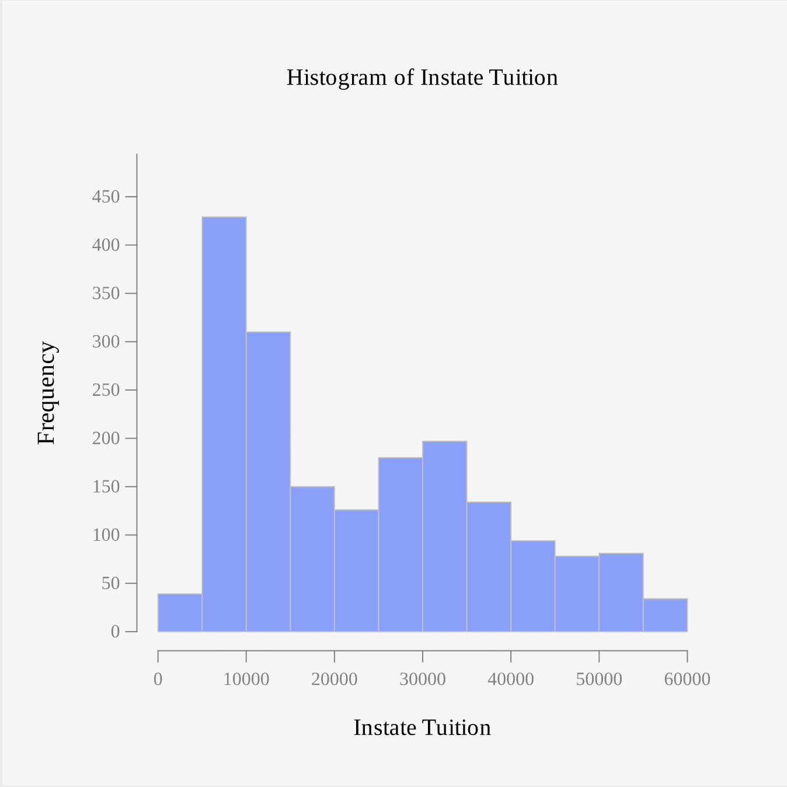
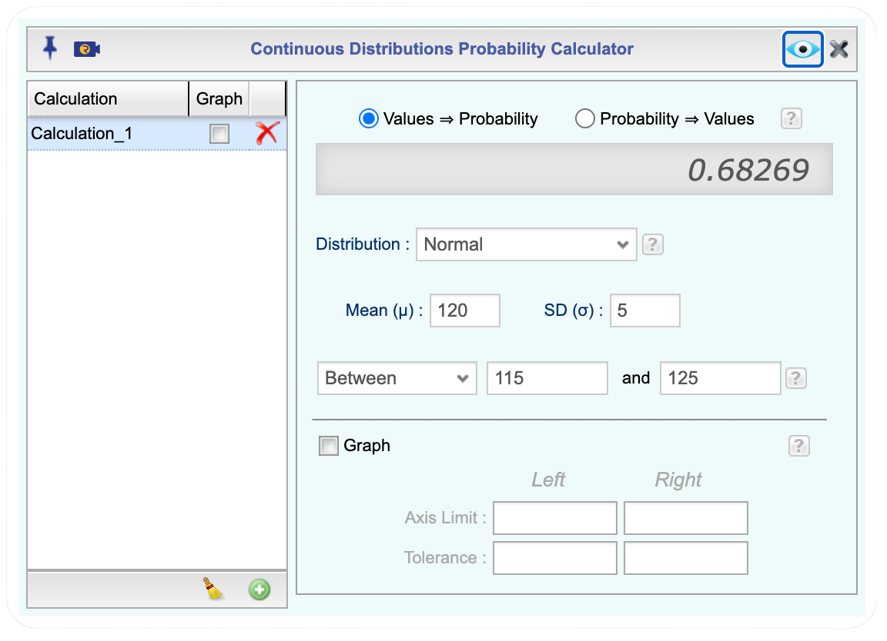
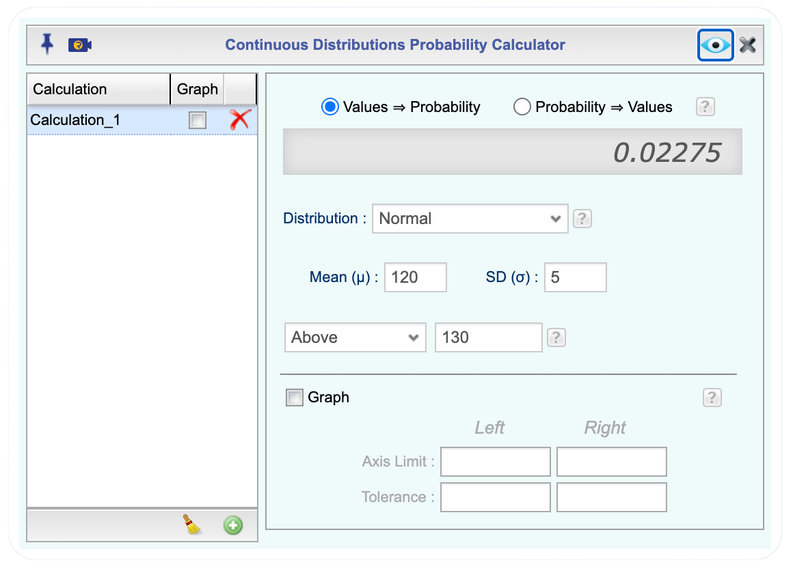
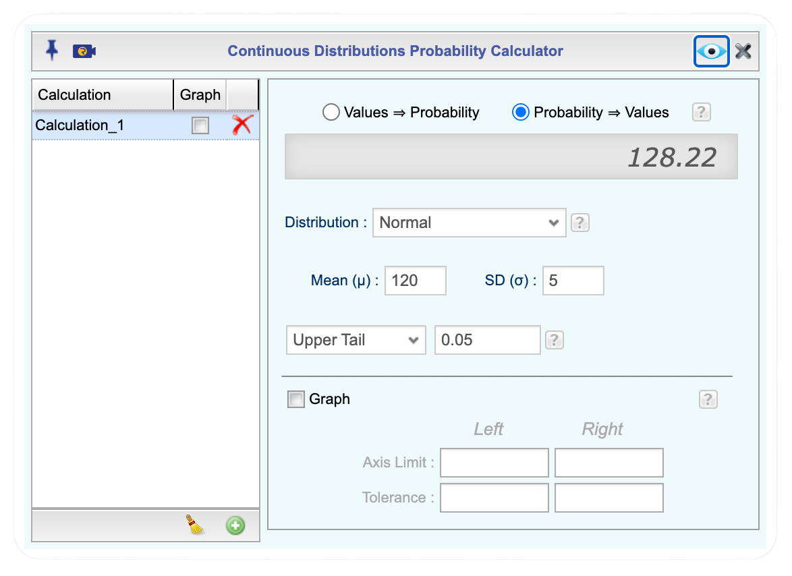
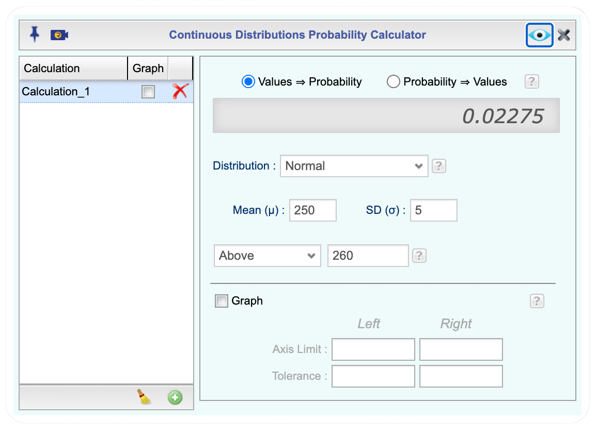
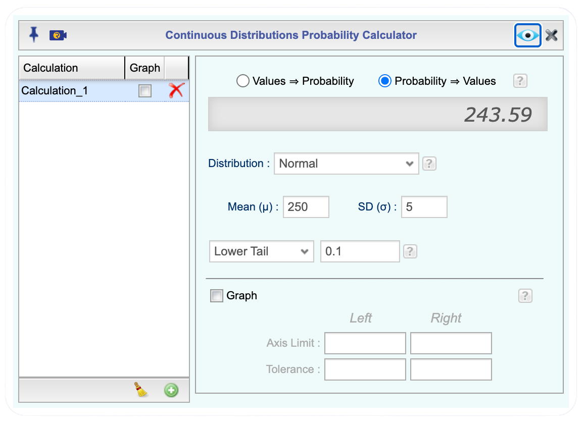

## Sampling Distribution of the Mean 


Earlier chapters treated a sample as a single snapshot of a population, one sample mean calculated once and reported. But if a different random sample were drawn from the same population, a different sample mean would very likely result. This raises an important question: how much does the sample mean vary from sample to sample, and what pattern does that variation follow? Answering this question is the foundation for nearly every method of statistical inference used in the remainder of this course.

Imagine that a beverage company wants to determine the average fill weight of bottles coming off one of its production lines. Weighing every bottle produced would be expensive and impractical, so a quality control inspector randomly selects 40 bottles and weighs each one. Suppose the sample mean fill weight turns out to be $\bar{x} = 499.2$ mL.

Now suppose a different random sample of 40 bottles is selected. This new sample might have a mean of $\bar{x} = 500.6$ mL, or a third sample might give $\bar{x} = 498.9$ mL. Because different random samples produce different values of $\bar{x}$, the sample mean is a random variable. If this process, drawing a sample and computing its mean, is repeated over and over, the collection of all those sample means forms its own distribution, called the **sampling distribution of the sample mean**.


::: {.callout-note appearance="simple" icon="false"}
**Key Concept.** The **sampling distribution of the sample mean** is the distribution of the sample mean, $\bar{x}$, across all possible random samples of a given size $n$ drawn from a population. It describes how much the sample mean would vary from sample to sample if the sampling process were repeated indefinitely.
:::

Two properties of this distribution are developed in this section: how the sample mean behaves as sample size grows, described by the **Law of Large Numbers**, and what shape the sampling distribution takes, described by the **Central Limit Theorem**. As the Central Limit Theorem is developed, it matters a great deal whether the underlying population itself is normally distributed or not, so both cases are considered directly.

### The Law of Large Numbers

Intuitively, a larger sample should give a more reliable estimate of the population mean than a smaller sample does. This intuition is formalized by the **Law of Large Numbers**: as the sample size $n$ increases, the sample mean $\bar{x}$ tends to get closer to the true population mean $\mu$. In other words, the larger the sample, the less the sample mean is expected to differ from the population mean purely due to chance.

::: {.callout-note appearance="simple" icon="false"}
**Key Concept.** As the sample size $n$ increases, the sample mean $\bar{x}$ tends to get closer to the population mean $\mu$. Larger samples give more reliable estimates than smaller samples, regardless of the shape of the population.
:::

For example, suppose the true mean amount customers spend per visit at a coffee chain, across every customer at every location, is $\mu = \$6.50$. With a sample of $n = 5$ customers, the sample mean might be \$5.10 in one sample and \$8.20 in another, swinging widely from sample to sample. With a sample of $n = 50$ customers, the sample means cluster more tightly, most falling between \$6.00 and \$7.00. With a sample of $n = 500$ customers, the sample means cluster even more tightly around \$6.50, rarely straying far from the true population mean. This pattern, sample means clustering closer to $\mu$ as $n$ grows, is the Law of Large Numbers in action. It does not guarantee that any single sample mean will be close to $\mu$, but it does mean that larger samples are systematically more trustworthy than smaller ones, whether or not the population itself is normally distributed.

### Describing the Sampling Distribution of the Sample Mean

The **sampling distribution of the sample mean** is the probability distribution of all possible values of $\bar{x}$ that could occur from repeated random samples of the same size taken from the population. This distribution describes how the sample mean varies from one sample to another and helps us assess how accurately a sample mean estimates the true population mean.

If $\mu$ and $\sigma$ denote the true population mean and standard deviation, then the sampling distribution of $\bar{x}$ has the following properties:

$$\text{Mean:} \quad \mu_{\bar{x}} = \mu$$

and

$$\text{Standard Deviation:} \quad \sigma_{\bar{x}} = \frac{\sigma}{\sqrt{n}}.$$

The standard deviation is often called the **standard error** of $\bar{x}$, since it measures how much we expect $\bar{x}$ to vary from sample to sample.

The sample mean has two paths to a normal sampling distribution:

- If the population samples are drawn from is normally distributed, the sampling distribution of $\bar{x}$ is normal for every sample size $n$, including very small samples.
- If the population is not normally distributed, the sampling distribution of $\bar{x}$ is *approximately normal*, provided the sample size is sufficiently large. As a rule of thumb, $n \ge 30$ is considered large enough, although a smaller $n$ may be sufficient if the population is only mildly skewed, and a larger $n$ may be needed if the population is heavily skewed or contains extreme outliers.

This second result is the **Central Limit Theorem**: when the sample size is sufficiently large, the sampling distribution of $\bar{x}$ is approximately normal, whatever the shape of the underlying population distribution. 

::: {.callout-note appearance="simple" icon="false"}
**Key Concept.** For a sufficiently large sample size $n$, the sampling distribution of the sample mean $\bar{x}$ is approximately normal, regardless of the shape of the population distribution. This makes it possible to use the normal distribution to answer probability questions about $\bar{x}$, even when the population itself is skewed or otherwise non-normal.
:::


Under either path, once normality is established,

$$\bar{x} \sim N\left(\mu, \ \frac{\sigma}{\sqrt{n}}\right)$$

::: {#exm-describe-sampling-distribution-mean-nonnormal}
## Describe the Sampling Distribution: A Non-Normal Population

A beverage company's records show that the fill weights of bottles at one plant have a mean of $\mu = 500$ mL and a standard deviation of $\sigma = 4$ mL, but the distribution of fill weights is right skewed rather than normal. Suppose a quality control inspector randomly selects samples of $n = 40$ bottles. Describe the sampling distribution of the sample mean fill weight.
:::

::: {.callout-tip .solution-callout collapse="true" icon="false"}
## 🔎 Solution

Let $\bar{x} =$ the sample mean fill weight of a random sample of 40 bottles.

Because the population of fill weights is not normally distributed, we need to check that the sample size is large enough for the Central Limit Theorem to apply.

$\text{Check Condition:} \quad n \ge 30$

$n = 40 \ge 30$, so the condition is satisfied.

Next, we find the mean and standard error.

$\text{Mean:} \quad \mu_{\bar{x}} = 500 \text{ mL}$

$\text{Standard Error:} \quad \sigma_{\bar{x}} = \dfrac{4}{\sqrt{40}} = 0.632 \text{ mL}$

So,

$$ \bar{x} \sim N\left(500, \ 0.632\right) $$
:::

::: {#exm-describe-sampling-distribution-mean-normal}
## Describe the Sampling Distribution: A Normal Population

Systolic blood pressure for adult patients at a clinic is approximately normally distributed with a mean of $\mu = 120$ mmHg and a standard deviation of $\sigma = 15$ mmHg. Each morning, a nurse records the blood pressure of a random sample of $n = 9$ patients. Describe the sampling distribution of the sample mean blood pressure.
:::

::: {.callout-tip .solution-callout collapse="true" icon="false"}
## 🔎 Solution

Let $\bar{x} =$ sample mean blood pressure of 9 randomly selected patients.

Because the population of systolic blood pressure values is already normally distributed, the sampling distribution of $\bar{x}$ is normal, even though $n = 9$ is small. No check of $n \ge 30$ is needed in this case.

$\text{Mean:} \quad \mu_{\bar{x}} = 120 \text{ mmHg}$

$\text{Standard Error:} \quad \sigma_{\bar{x}} = \dfrac{15}{\sqrt{9}} = \dfrac{15}{3} = 5 \text{ mmHg}$

Then,

$$ \bar{x} \sim N\left(120, \ 5\right)$$
:::

The distinction between these two cases can feel difficult to understand until it is seen visually. Rguroo's simulation tools make it possible to draw thousands of random samples from a population in seconds and directly observe how the distribution of sample means behaves, both when the population is already normal and when it is not.

::: {#exm-clt-simulation-normal}
## Simulating the Sampling Distribution of the Mean from a Normal Population

Suppose a population of adult resting heart rates, in beats per minute, is approximately normally distributed with $\mu = 70$ and $\sigma = 10$. Use Rguroo to simulate the sampling distribution of the sample mean heart rate for samples of size $n = 5$, $n = 30,$ and $n = 100,$ and observe what happens to the shape and spread of the sampling distribution.
:::

::: {.callout-tip .solution-callout collapse="true" icon="false"}
## 🔎 Solution

::: {.callout-note appearance="simple" collapse="true" icon="none" title="{width=22px style='vertical-align:middle;'} Rguroo Steps: Simulating Sampling Distribution of the Mean from a Normal Population"}

1. Open the [Probability-Simulation]{.dialog} toolbox on the left-hand side of the Rguroo window.
2. Open the [Probability]{.dpd} dropdown, and select [Multiple Distribution Generator]{.fun}.
3. Click the plus icon and name the variable, for example [heart_rate]{.typein}.
4. From the distribution dropdown, select [Normal]{.fun}, and enter the mean, [70]{.typein}, and standard deviation, [10]{.typein}.
5. In the [Sample Size]{.des} box, enter [5]{.typein}. In the [Replications]{.des} box, enter [1000]{.typein}. Enter a [Seed]{.des} value so the simulation can be reproduced.
6. From the [Statistic]{.dpd} dropdown, select [Mean]{.fun}.
7. Click the preview icon  to view the simulated samples.
8. Type a name such as [hr_means_n5]{.typein} in the [Save Dataset As]{.des} textbox, and click [Save Dataset As]{.fun}.
9. Repeat steps 3 through 8 twice more, using [Sample Size]{.des} [30]{.typein} and [100]{.typein}, saving the results as [hr_means_n30]{.typein} and [hr_means_n100]{.typein}.
10. For each saved dataset, open the [Plots for Numerical Data]{.dialog} toolbox and create a [Histogram]{.fun} to display the shape of the sampling distribution of the sample mean.

::: {.callout-tip .inner-callout appearance="simple" collapse="true" icon="none" title="Click here to see the Rguroo dialog"}
{width=500px}
:::

:::

```{r,echo=FALSE}
#| fig-alt: "Three histograms of simulated sample means of heart rate, all centered at 70 beats per minute with an overlaid normal curve. The spread narrows noticeably from n = 5 to n = 30 to n = 100, while the bell shape remains consistent across all three."
#| warning: FALSE
#| label: fig-clt-simulation-normal
#| fig-cap: "Sampling distributions of the sample mean heart rate for samples of size n = 5, n = 30, and n = 100, drawn from a normal population with mu = 70 and sigma = 10."
#| fig-subcap: 
#|   - "n=5"
#|   - "n=30"
#|   - "n=100"
#| layout-ncol: 3
#| out-width: "90%"
knitr::include_graphics(c("Rguroo_outputs/Sampling_Distributions/hist_hr_means_n5.png",
"Rguroo_outputs/Sampling_Distributions/hist_hr_means_n30.png","Rguroo_outputs/Sampling_Distributions/hist_hr_means_n100.png"))
```

:::

Where the Central Limit Theorem really shines is when we are sampling from a skewed population as in the next example.

::: {#exm-clt-simulation-skewed}
## Simulating the Sampling Distribution of the Mean from a Skewed Population

In-state tuition at four-year colleges and universities is right skewed: most institutions charge less than \$20,000 per year, but a smaller number of expensive private institutions charge much more, pulling the tail of the distribution out to the right. The [Tuition_4_Year]{.data} dataset contains in-state tuition for a large collection of four-year institutions in the [INSTATE_TUITION]{.var} variable.

Because this is real, finite data rather than a theoretical distribution, we treat the full [Tuition_4_Year]{.data} dataset as the population and repeatedly draw random samples directly from it, rather than generating data from a fitted distribution. Use Rguroo to simulate the sampling distribution of the sample mean in-state tuition for samples of size $n = 5$, $n = 30,$ and $n = 100,$ and observe how the Central Limit Theorem applies.
:::

::: {.callout-tip .solution-callout collapse="true" icon="false"}
## 🔎 Solution

First, let's start by looking at the histogram of the dataset to confirm it is skewed.

```{r,echo=FALSE}
#| fig-alt: "Histogram of in-state tuition, ranging from 0 to 60,000 dollars. The distribution is bimodal and right skewed: a tall peak occurs between 5,000 and 10,000 dollars, a smaller secondary peak occurs between 30,000 and 35,000 dollars, and frequency declines gradually toward a long right tail extending to 60,000 dollars."
#| warning: FALSE
#| label: fig-tuition-population
#| fig-cap: "Population distribution of in-state tuition (INSTATE_TUITION) across four-year institutions in the Tuition_4_Year dataset."
#| out-width: "90%"

```

As expected, the histogram confirms that the population is right skewed, with a long tail extending to \$60,000. It is also bimodal, with peaks near \$5,000–\$10,000 and \$30,000–\$35,000, likely reflecting the mix of public and private institutions. Because this population is far from normal, it makes a good test case for the Central Limit Theorem.

::: {.callout-note appearance="simple" collapse="true" icon="none" title="{width=22px style='vertical-align:middle;'} Rguroo Steps: Simulating from a Skewed Population"}

1. Open the [Probability-Simulation]{.dialog} toolbox on the left-hand side of the Rguroo window.
2. Open the [Probability]{.dpd} dropdown, and select [Random Selection]{.fun}. This opens the [Dataset Random Selection]{.dialog} dialog.
3. Select [Tuition_4_Year]{.data} from the Dataset dropdown.
4. In the [Sample Size]{.des} box, enter [5]{.typein}. In the [Replications]{.des} box, enter [1000]{.typein}. Enter a [Seed]{.des} value so the simulation can be reproduced.
5. Select [With replacement]{.des}, since we are treating the data frame as the population and sampling repeatedly from it.
6. Enter [5]{.typein} in the columns subset since the [INSTATE_TUITION]{.var} is in the fifth column.
6. Click the preview icon  to view the selected samples.
7. Click the [Statistic]{.fun} button at the top right of the application. This opens the [Custom Statistic]{.dialog} dialog.
8. Click the plus icon and name the new variable, for example [sample_mean]{.typein}. In the code panel, type [mean(INSTATE_TUITION)]{.fun} so that Rguroo computes the sample mean of [INSTATE_TUITION]{.var} for each of the 1000 samples. Click the preview icon to check the result.
9. Type a name such as [tuition_means_n5]{.typein} in the [Save Dataset As]{.des} textbox, and click [Save Dataset As]{.fun}.
10. Repeat steps 3 through 10 twice more, using [Sample Size]{.des} [30]{.typein} and [100]{.typein}, saving the results as [tuition_means_n30]{.typein} and [tuition_means_n100]{.typein}.
11. For each saved dataset, open the [Plots for Numerical Data]{.dialog} toolbox and create a [Histogram]{.fun} of [sample_mean]{.fun} to display the shape of the sampling distribution of the sample mean.

::: {.callout-tip .inner-callout appearance="simple" collapse="true" icon="none" title="Click here to see the Dataset Random Selection and Custom Statistic dialog"}
```{r,echo=FALSE}
#| fig-alt: "Two screenshots of Rguroo dialogs. The first, the Dataset Random Selection dialog, shows the Tuition data frame selected with sample size, number of replications, seed, and the With replacement option set. The second, the Custom Statistic dialog, shows a new variable named sample_mean defined by the R code mean(INSTATE_TUITION)."
#| warning: FALSE
#| label: fig-random-selection-mean
#| fig-cap: "Rguroo dialogs used to compute the sample mean of INSTATE_TUITION for repeated random samples drawn from the Tuition_4_Year dataset."
#| fig-subcap: 
#|   - "Dataset Random Selection dialog"
#|   - "Custom Statistic dialog"
#| layout-ncol: 2
#| out-width: "100%"
knitr::include_graphics(c("Rguroo_dialogs/Sampling_Distributions/random_selection_dialog.png",
"Rguroo_dialogs/Sampling_Distributions/custom_statistic_dialog.png"))
```
:::


:::

```{r,echo=FALSE}
#| fig-alt: "Three histograms of simulated sample means of in-state tuition, each with an overlaid normal curve. At n = 5, the distribution is still slightly right skewed, with a longer tail extending toward higher tuition values. At n = 30 and n = 100, the distribution is close to symmetric and bell-shaped. The horizontal spread narrows substantially from n = 5 to n = 30 to n = 100, and the histogram bars track the overlaid normal curve increasingly closely as n increases."
#| warning: FALSE
#| label: fig-clt-simulation-tuition
#| fig-cap: "Sampling distributions of the sample mean instate tuition for samples of size n = 5, n = 30, and n = 100, drawn by repeated random selection from the Tuition_4_Year dataset."
#| fig-subcap: 
#|   - "n=5"
#|   - "n=30"
#|   - "n=100"
#| layout-ncol: 3
#| out-width: "100%"
knitr::include_graphics(c("Rguroo_outputs/Sampling_Distributions/hist_tuit_n5.png",
"Rguroo_outputs/Sampling_Distributions/hist_tuit_n30.png","Rguroo_outputs/Sampling_Distributions/hist_tuit_n100.png"))
```

:::

In the heart rate simulation, the histogram of sample means is bell-shaped and centered at 70 for every sample size, $n = 5$, $30$, and $100$. Only the spread changes: the histogram gets narrower as $n$ increases, consistent with $\sigma_{\bar{x}} = \sigma/\sqrt{n}$.

In the tuition simulation, the histogram of sample means at $n = 5$ is still noticeably right skewed, resembling the shape of the original [INSTATE_TUITION]{.var} population. At $n = 30$, the histogram looks much closer to a symmetric, bell-shaped normal distribution, and at $n = 100$ it is even more tightly clustered around the population mean.

When the population is already normal, the sampling distribution of $\bar{x}$ is normal from the very first sample size, and increasing $n$ only tightens the spread. When the population is not normal, the sampling distribution of $\bar{x}$ starts out resembling the population's shape and only becomes approximately normal once $n$ is large enough, exactly as the Central Limit Theorem predicts.


### Calculating Probabilities of the Sample Mean

With the shape, center, and spread of the sampling distribution pinned down, a natural next step is to ask how likely a particular sample mean is to occur. A hospital administrator might want to know how often a sample mean length of stay would exceed six hours; a clinic might want to know how often a sample mean blood pressure would fall in a safe range. Questions like these, phrased in terms of "greater than," "less than," or "between," can be answered directly using the normal model for $\bar{x}$ developed in this section. The same reasoning carries forward into the rest of this chapter. It also becomes the basis for inference about population mean in later chapters.


::: {#exm-probability-mean-normal}
## Calculating Probabilities: A Normal Population

Recall the systolic blood pressure [example](#exm-describe-sampling-distribution-mean-normal): blood pressure for adult patients at a clinic is approximately normally distributed with $\mu = 120$ mmHg and $\sigma = 15$ mmHg, and a nurse records the blood pressure of a random sample of $n = 9$ patients each morning.

a\. What is the probability that a given morning's sample mean blood pressure is between 115 and 125 mmHg?

b\. What is the probability that a given morning's sample mean blood pressure is at least 130 mmHg?

c\. Only the highest 5% of sample mean blood pressures on record are flagged for follow-up. What sample mean blood pressure marks the cutoff for this top 5%?
:::

::: {.callout-tip .solution-callout collapse="true" icon="false"}
## 🔎 Solution

Recall from @exm-describe-sampling-distribution-mean-normal that because the population is already normal, no minimum sample size is required, and

$$\text{Mean:} \quad \mu_{\bar{x}} = 120 \text{ mmHg} \qquad \text{Standard Error:} \quad \sigma_{\bar{x}} = \dfrac{15}{\sqrt{9}} = 5 \text{ mmHg}$$

That is, $\bar{x} \sim N(120,5)$.

a\. We want to find $P(115 < \bar{x} < 125)$. Click to expand the box below to see how to calculate the probability.

:::: {.callout-note appearance="simple" collapse="true" icon="none" title="{width=22px style='vertical-align:middle;'} Finding Probabilities in Rguroo"}

   1. Open the **Probability-Simulation** toolbox in Rguroo.
   2. Open the [Probability]{.dpd} dropdown, and select [Probability Calculator]{.fun} and [Continuous]{.fun}. This opens the [Continuous Probability]{.dialog} dialog.
   3. Since we were given the values and want the probability, select Values $\Rightarrow$ Probability.
   4. Select Normal from the [Distribution]{.dpd} dropdown, since we verified that the distribution was approximately normal.
   5. Enter the mean, [120]{.typein}, and standard deviation, [5]{.typein}.
   6. Select [between]{.dpd} in the dropdown menu and enter [115]{.typein} and [125]{.typein} in the two boxes
   7. Click the preview icon  to see a preview of the barplot.

::: {.callout-tip .inner-callout appearance="simple" collapse="true" icon="none" title="Click here to see the Rguroo dialog"}
  {width="500px"}
:::

::::  

   So $P(115 < \bar{x} < 125) = 0.6827$. This means there is about a 68.27% chance that a given morning's sample of 9 patients will have a mean blood pressure betweem 115 mmHg and 124 mmHg.

b\. We want to find $P(\bar{x} \ge 130)$. The mean and standard error have not changed, so select [Above]{.dpd} and enter [130]{.typein} in the Continuous Probability Calculator.

  

```{r,echo=FALSE}
#| fig-alt: "Screenshot of the Rguroo Continuous Distributions Probability Calculator dialog. Values to Probability is selected, with Normal distribution, mean 120, and standard deviation 5. The Above option is selected with a value of 130, and the calculated probability shown is 0.02275."
#| warning: FALSE
#| label: fig-dialog-probability-mean-bp-above
#| fig-cap: "Continuous Distributions Probability Calculator in Rguroo, showing P(x̄ ≥ 130) for the sample mean blood pressure example."
#| out-width: "90%"

```

   So $P(\bar{x} \ge 130) = 0.0228$. There is about a 2.28% chance that a given morning's sample of 9 patients will have a mean blood pressure of 130 mmHg or higher.

c\. This time we are given a probability, 0.05, and asked to find the sample mean it corresponds to, so we work in the opposite direction from parts (a) and (b). In the [Continuous Probability]{.dialog} dialog, switch the radio button at the top from Values $\Rightarrow$ Probability to Probability $\Rightarrow$ Values. The mean, [120]{.typein}, and standard deviation, [5]{.typein}, stay the same. Select [Above]{.dpd} in the dropdown menu, since we want the value that only the top 5% of sample means exceed, and enter the probability, [0.05]{.typein}, in the box. Click the preview icon to see the value.

```{r,echo=FALSE}
#| fig-alt: "Screenshot of the Rguroo Continuous Distributions Probability Calculator dialog. Probability to Values is selected, with Normal distribution, mean 120, and standard deviation 5. The Upper Tail option is selected with a probability of 0.05, and the calculated value shown is 128.22."
#| warning: FALSE
#| label: fig-dialog-probability-mean-bp-inverse
#| fig-cap: "Continuous Distributions Probability Calculator in Rguroo, showing the Probability to Values calculation for the top 5% cutoff of sample mean blood pressure."
#| out-width: "90%"

```

So $\bar{x} = 128.22$ mmHg. A sample mean blood pressure of 128.22 mmHg or higher would place a given morning's sample in the top 5% of all sample mean blood pressures, and would be flagged for follow-up.
:::

::: {#exm-probability-mean-nonnormal}
## Calculating Probabilities: A Non-Normal Population

Reaction times, in milliseconds, for a population of adults on a simple visual task are known to be right skewed rather than normal. This population has a mean of $\mu = 250$ ms and a standard deviation of $\sigma = 40$ ms. A researcher plans to test a random sample of $n = 64$ participants.

a\. Describe the sampling distribution of the sample mean reaction time.

b\. What is the probability that the sample mean reaction time is greater than 260 ms?

c\. Researchers want to invite back participants for further testing that have the fastest 10% of sample mean reaction times. What sample mean reaction time marks this cutoff?
:::

::: {.callout-tip .solution-callout collapse="true" icon="false"}
## 🔎 Solution

a\. The population of reaction times is right skewed, so we check whether the sample size is large enough for the Central Limit Theorem to apply.

   $\text{Check Condition:} \quad n \ge 30$

   $n = 64 \ge 30$, so the condition is satisfied, and the sampling distribution of $\bar{x}$ is approximately normal with

   $$\text{Mean:} \quad \mu_{\bar{x}} = 250 \text{ ms} \qquad \text{Standard Error:} \quad \sigma_{\bar{x}} = \dfrac{40}{\sqrt{64}} = 5 \text{ ms}$$


   We can write:
    $$\bar{x} \sim N(250,5)$$

b\. We want to find $P(\bar{x} > 260)$. To find the probability in Rguroo, enter the mean, [250]{.typein}, and standard deviation, [5]{.typein}, in the [Continuous Probability]{.dialog} dialog as before. Select [above]{.dpd} in the dropdown menu, and enter [260]{.typein} in the box. Click the preview icon to see the probability.


```{r,echo=FALSE}
#| fig-alt: "Screenshot of the Rguroo Continuous Distributions Probability Calculator dialog. Values to Probability is selected, with Normal distribution, mean 250, and standard deviation 5. The Above option is selected with a value of 260, and the calculated probability shown is 0.02275."
#| warning: FALSE
#| label: fig-dialog-probability-mean-reaction-time
#| fig-cap: "Continuous Distributions Probability Calculator in Rguroo, showing P(x̄ > 260) for the sample mean reaction time example."
#| out-width: "90%"

```

  

So $P(\bar{x} > 260) = 0.0228$. There is about a 2.28% chance that a random sample of 64 participants will have a mean reaction time greater than 260 milliseconds.

c\. This time we are given a probability, 0.10, and asked to find the sample mean reaction time it corresponds to, so we work in the opposite direction from part (b). Since a smaller time is faster, we are looking to find the value of $\bar{x}$ such that $P(\bar{x}<c) =0.1$ for some $c$.

In the [Continuous Probability]{.dialog} dialog, switch the radio button at the top from Values $\Rightarrow$ Probability to Probability $\Rightarrow$ Values. The mean, [250]{.typein}, and standard deviation, [5]{.typein}, stay the same. Select [Lower Tail]{.dpd} in the dropdown menu, since we want the value that only the top 10% of sample means exceed, and enter the probability, [0.1]{.typein}, in the box. Click the preview icon to see the value.

```{r,echo=FALSE}
#| fig-alt: "SScreenshot of the Rguroo Continuous Distributions Probability Calculator dialog. Probability to Values is selected, with Normal distribution, mean 250, and standard deviation 5. The Lower Tail option is selected with a probability of 0.1, and the calculated value shown is 256.41."
#| warning: FALSE
#| label: fig-dialog-probability-mean-reaction-time-inverse
#| fig-cap: "Continuous Distributions Probability Calculator in Rguroo, showing the Probability to Values calculation for the reaction time example."
#| out-width: "90%"

```

So $\bar{x} = 243.59$ ms. A random sample of 64 participants with a mean reaction time of 243.59 ms or faster would be among the fastest 10% of all such samples, and would be invited back for further testing.

:::


### Homework for Section 7.1

1. A classmate says, "As the sample size gets larger, the sampling distribution of the sample mean gets closer to normal." Explain what is incorrect about this statement, and rewrite it so that it correctly distinguishes between what the Law of Large Numbers guarantees and what the Central Limit Theorem guarantees.

2. For each scenario, state whether the sampling distribution of the sample mean is *exactly* normal, *approximately* normal, or *cannot be determined without more information*. Explain your reasoning in each case.

    a \. A population is known to be normally distributed, and a random sample of $n = 12$ is selected.

    b \. A population is heavily right skewed, and a random sample of $n = 18$ is selected.

    c \. A population is heavily right skewed, and a random sample of $n = 50$ is selected.

    d \. The shape of a population is unknown, and a random sample of $n = 8$ is selected.

3. IQ scores for adults are approximately normally distributed with a mean of $\mu = 100$ and a standard deviation of $\sigma = 15$. A researcher plans to test a random sample of $n = 16$ adults. Describe the sampling distribution of the sample mean IQ score.

4. Call durations at a customer service center are right skewed, with a mean of $\mu = 8$ minutes and a standard deviation of $\sigma = 3$ minutes. A supervisor plans to review a random sample of $n = 45$ calls. Describe the sampling distribution of the sample mean call duration.

5. Case processing times in a county court system are approximately normally distributed with a mean of $\mu = 45$ days and a standard deviation of $\sigma = 6$ days. A court administrator selects a random sample of $n = 25$ cases.

    a \. Describe the sampling distribution of the sample mean processing time.

    b \. What is the probability that the sample mean processing time is between 42 and 48 days?

6. Using the customer service center from Exercise 4 ($\mu = 8$ minutes, $\sigma = 3$ minutes, right skewed), a random sample of $n = 45$ calls is selected. What is the probability that the sample mean call duration exceeds 9 minutes?

7. Finish times for a local 5K race are right skewed, with a mean of $\mu = 32$ minutes and a standard deviation of $\sigma = 6$ minutes. A race organizer selects a random sample of $n = 36$ runners.

    a \. Describe the sampling distribution of the sample mean finish time.

    b \. What is the probability that the sample mean finish time is less than 30 minutes?

8. Total cholesterol levels for adults are approximately normally distributed with a mean of $\mu = 190$ mg/dL and a standard deviation of $\sigma = 20$ mg/dL. A clinic monitors random samples of $n = 10$ patients. Patients whose sample mean cholesterol falls in the lowest 15% of all possible sample means are flagged as a low-risk group. What sample mean cholesterol level marks this cutoff?

9. Final exam scores in a large introductory course are right skewed, with a mean of $\mu = 72$ and a standard deviation of $\sigma = 8$. An instructor selects a random sample of $n = 40$ exams to audit. Only the top 5% of all possible sample mean scores would be flagged for a grading review. What sample mean score marks this cutoff?

## Sampling Distribution of the Sample Proportion

Imagine that a university wants to determine the proportion of its students who prefer online courses. Surveying every student would be expensive and time-consuming, so the university randomly selects 100 students and asks whether they prefer online courses. Suppose 62 of the 100 students respond "yes."

To describe this result, we use the **sample proportion**, which is the proportion of individuals in a sample who possess the characteristic of interest. The sample proportion is denoted by the symbol $\hat{p}$​ (pronounced "p-hat") and is calculated as

$$\hat{p}=\frac{x}{n}$$
where

$x =$ the number of individuals in the sample with the characteristic of interest, and 

$n =$ the sample size

For the university survey,

$$\hat{p}=\frac{62}{100}=0.62$$

This means that 62% of the students in the sample prefer online courses.

Now suppose a different random sample of 100 students is selected. The new sample might contain 58 students who prefer online courses, giving $\hat{p}=0.58$, or 65 students, giving $\hat{p}=0.65$. Because different random samples produce different values of $\hat{p}$​, the sample proportion is a random variable.

### Describing the Sampling Distribution of the Sample Proportion

The **sampling distribution of the sample proportion** is the probability distribution of all possible values of $\hat{p}$​ that could occur from repeated random samples of the same size taken from the population. This distribution describes how the sample proportion varies from one sample to another and helps us assess how accurately a sample proportion estimates the true population proportion.

If $p$ denotes the true population proportion, then the sampling distribution of $\hat{p}$​ has the following properties:

$$\text{Mean:} \quad \mu_{\hat{p}} = p$$

and

$$\text{Standard Deviation:} \quad \sigma_{\hat{p}} = \sqrt{\frac{p(1-p)}{n}}.$$​​
The standard deviation is often called the **standard error** of $\hat{p}$, since it measures how much we expect $\hat{p}$ to vary from sample to sample. 

When the sample size is sufficiently large, the sampling distribution of $\hat{p}$​ is approximately normal provided that

$$
np \ge 10 \qquad \text{and} \qquad n(1-p) \ge 10.
$$

Under these conditions,

$$\hat{p} \sim N\left(p,\sqrt{\frac{p(1-p)}{n}}\right)$$

This normal approximation makes it possible to construct confidence intervals and perform hypothesis tests about population proportions, which we will learn about in in the next few chapters. This makes the sampling distribution of the sample proportion a fundamental concept in statistical inference.

::: {#exm-describe-sampling-distribution-p-hat}
## Desribe the Sampling Distribution

A large online retailer wants to estimate the proportion of customers who are satisfied with their shopping experience. Company records show that approximately 70% of all customers are satisfied. Instead of surveying every customer, the retailer randomly selects 100 customers and records whether each customer is satisfied or not. Describe the sampling distribution of the sample proportion.

:::

::: {.callout-tip .solution-callout collapse="true" icon="false"}
## 🔎 Solution

To describe the sampling distribution of $\hat{p}$, we need to check that the two conditions are met and then find the mean and standard deviation. 

Since the company records show that 70% of **all** customers are satisfied, we know $p=0.70$.  In addition, since the company randomly selects 100 cutomers, we know $n=100$.

$\text{Check Conditions:} \quad np \ge 10 \quad \text{and} \quad n(1-p) \ge 10$

$(100)(0.70)=70 \ge 10 \quad \text{and} \quad (100)(1-0.70)=(100)(0.30)=30 \ge 10$

So the conditions are satisfied.

Next, we find the mean and standard deviation.

$\text{Mean:} \quad \mu_{\hat{p}} = 0.70$

$\text{Standard Deviation:} \quad \sigma_{\hat{p}} = \sqrt{\frac{(0.70)(1-0.70)}{100}} = 0.046$​​.

:::

### Calculating Probabilities of the Sample Proportion

Once we have established that the sampling distribution of a sample proportion $\hat{p}$​ is approximately normal, we can use the distribution to answer probability questions about sample outcomes.

Continuing with our customer satisfaction survey example, recall that the population proportion of satisfied customers is $p=0.70$, and we are taking random samples of $n=100$ customers. Now that we know the sampling distribtuion for $\hat{p}$, we can answer probability questions about the sample proportion.

For example, suppose the company wanted to know 

- What is the probability that a random sample of 100 customers will contain at least 75% satisfied customers?
- What is the probability that a random sample of 100 customers will contain at most 65% satisfied customers?
- What is the probability that a random sample of 100 customers will contain between 50% and 80% satisfied customers?

The sampling distribution of the sample proportion allows us to answer these types of questions. Thus, the sampling distribution of the sample proportion not only describes the behavior of sample proportions across repeated samples, but also allows us to quantify the likelihood of observing particular sample results. This forms the basis for confidence intervals, hypothesis testing, and many other statistical inference procedures in later chapters.

::: {#exm-probability-proportion1}
## Calculating Probabilities

Consider a university where 45% of all students participate in at least one extracurricular club. Suppose the university randomly selects samples of 150 students and records the proportion of students in each sample who participate in a club.

a\. Describe the sampling distribution of $\hat{p}$.

b\. What is the probability that at least 52 students participate in extracurricular clubs?

:::

:::: {.callout-tip .solution-callout collapse="true" icon="false"}
## 🔎 Solution

a\. As in the previous example, to describe the sampling distribution of $\hat{p}$, we need to check that the two conditions are met and then find the mean and standard deviation. In this case, $p=0.44$ and $n=150$.

$\text{Check Conditions:} \quad np \ge 10 \quad \text{and} \quad n(1-p) \ge 10$

$(150)(0.45)=67.5 \ge 10 \quad \text{and} \quad (150)(1-0.45)=(150)(0.55)=82.5 \ge 10$

The conditions are satisfied.

Next, 

$\text{Mean:} \quad \mu_{\hat{p}} = 0.45$

$\text{Standard Deviation:} \quad \sigma_{\hat{p}} = \sqrt{\frac{(0.45)(1-0.45)}{150}} = 0.0406$​​

b\. We want to find the probability that at least 52 out of 150 students participate in extracurricular activities.  Since we are finidng a probability using the sampling distribution of the sample proportion, we need to find the sample proportion, $\hat{p}$.

Recall that $\hat{p}=\frac{x}{n}.$  In this case, $\hat{p}=\frac{52}{150}=0.35$.

Since the question states *at least* 52, we will be finidng $P(x \ge 52)=P(\hat{p} \ge 0.35)$. To find the probability, we will use Rguroo.

Click to expand the box below see how to calculate the probability.

::: {#Finding-Probabilities-in-Rguroo .callout-note appearance="simple" collapse="true" icon="none" title="{width=22px style='vertical-align:middle;'} Finding Probabilities in Rguroo"}

1.  Open the **Probability-Simulation** toolbox in Rguroo.\
2.  Open the [Probability]{.dpd} dropdown, and select [Probability Calculator]{.fun} and [Continuous]{.fun}. This opens the [Continuous Probability]{.dialog} dialog.\
3.  Since we were given the values and want the probability, select Values $\Rightarrow$ Probability.
4.  Select Normal, since we verified that the distribution was approximately normal.
5.  Enter the mean, [0.40]{.typein}, and standard deviation, [0.0406]{.typein}.
6.  Next, select [Above]{.dpd} in the dropdown menu since it is greater than and enter $\hat{p}$, [$\frac{52}{150}$]{.typein} in the box. *Note: We enter the fraction since our decimal value is rounded above and we want to be as precise as possible*
7.  Click the preview icon  to see a preview of the barplot.


::: {.callout-tip .inner-callout appearance="simple" collapse="true" icon="none" title="Click here to see the Rguroo dialog"}
{width="500px"}
:::
::::

So $P(x \ge 52) = P(\hat{p} \ge \frac{52}{150}) = 0.9945$

:::

::: {#exm-probability-proportion2}
## Calculating Probabilities

Suppose a school district is proposing a bond measure that would raise property taxes to fund the construction of two new elementary schools and renovate aging classrooms. Before the election, a polling organization conducts research and finds that approximately 52% of registered voters support the measure.

To gauge public opinion leading up to the election, the polling organization repeatedly selects random samples of 200 registered voters and records the proportion in each sample who say they support the bond measure.

a\. Describe the sampling distribution of $\hat{p}$.

b\. What is the probability that less than 125 registered voters support the measure?

c\. What is the probability that between 92 and 135 registered voters support the measure?  

d\. The bond measure needs at least 55% of registered voters to support the measure to pass.  What is the probability that the bond measure will pass?

:::


::: {.callout-tip .solution-callout collapse="true" icon="false"}
## 🔎 Solution

a\. Again, we need to check that the two conditions are met and then find the mean and standard deviation. In this case, $p=0.52$ and $n=200$.

   $\text{Check Conditions:} \quad np \ge 10 \quad \text{and} \quad n(1-p) \ge 10$

   $(200)(0.52)=104 \ge 10 \quad \text{and} \quad (200)(1-0.52)=(200)(0.47)=96 \ge 10$

   The conditions are satisfied.

   Next, 

   $\text{Mean:} \quad \mu_{\hat{p}} = 0.52$

   $\text{Standard Deviation:} \quad \sigma_{\hat{p}} = \sqrt{\frac{(0.52)(1-0.52)}{200}} = 0.0353$​​

b\. We need to find $P(x < 125) = P(\hat{p} < \frac{125}{200}) = P(\hat{p} < 0.625).$ We use Rguroo as in the last example to find the probability.

In this case we enter the mean, [0.52]{.typein}, and standard deviation, [0.0353]{.typein}. Next, select [Below]{.dpd} in the dropdown menu since it is less than and enter $\hat{p}$, [125/200]{.typein} in the box. Click the preview icon to see the probability 

::: {.callout-tip .inner-callout appearance="simple" collapse="true" icon="none" title="Click here to see the Rguroo dialog"}
{width="500px"}
:::

So $P(x < 125) = P(\hat{p} < \frac{125}{200}) = P(\hat{p} < 0.625) = 0.9985.$

c\. To find the probability that between 92 and 135 registered voters support the measure, we calculate $P(92 < x<135)=P(\frac{92}{200} < x < \frac{135}{200}) = P(0.46 x < 0.675).$  Notice that we need two sample proportions since it is between two values.

In Rguroo, the mean and standard deviarion has not changed from part (b), so we need to select [Between]{.dpd} and then enter the two values [92/200]{.typein} and [135/200]{.typein}. Click the preview button to see the probability.

::: {.callout-tip .inner-callout appearance="simple" collapse="true" icon="none" title="Click here to see the Rguroo dialog"}
{width="500px"}

:::

So, $P(92 < x<135)=P(\frac{92}{200} < x < \frac{135}{200}) = P(0.46 x < 0.675) = 0.9554.$

d\. If we want to find the probability that the bond measure will pass and we need $\hat{p}$ to be at least 55%, we will find $P(\hat{p} \ge 0.55)$.  Notice that we did not have to calculate $\hat{p}$ since we were given the percentage versus the number of people, $x$, who support the bond measure.

The mean and standard deviation did not change, so we select [Above]{.dpd} and enter the value [0.55]{.typein}.

::: {.callout-tip .inner-callout appearance="simple" collapse="true" icon="none" title="Click here to see the Rguroo dialog"}
{width="500px"}

:::

So, $P(\hat{p} \ge 0.55)= 0.1997$.  
   
This means that there is about a 20% chance that the bond measure will pass with minimum support of 55% of the regisetered voters.
:::

### Homework for Section 7.1

1. A community college surveys 120 students about whether they plan to transfer to a four-year university. Of the 120 students surveyed, 78 say they plan to transfer. Calculate $\hat{p}$ and interpret in the context of this problem.

2. For each scenario, state whether the sampling distribution of the sample proportion is *exactly* normal, *approximately* normal, or *cannot be determined without more information*. Explain your reasoning in each case.

    a\. A population is known to be normally dstributed and the population proportion is $p=0.40$. Random samples of size $n=20$ are selected.

    b\. In a town, 35% of residents recycle regularly. A random sample of $n=120$ residents is selected.

    c\. The proportion of households that own a smart thermostat is unknown. A random sample of $n=75$ households is selected.

    d\. A state health department reports that 22% of adults smoke. A random sample of $n=250$ adults is selected.

3. A city transportation department knows that 40% of residents regularly use public transportation. A random sample of $n=200$ residents is selected. Describe the sampling distribution of the sample proportion of people who use public transportation.

4. A health organization reports that 65% of adults receive an annual flu vaccine. Random samples of 150 adults are selected. Describe the sampling distribution of the sample proportion of adults who receive an annual flu vaccine.

5. A university knows that 55% of its students own a tablet computer. Random samples of 180 students are selected.

    a\. Describe the sampling distribution of $\hat{p}$​.

    b\. Find the probability that more than 60% of the sampled students own a tablet computer.

6. A manufacturing company estimates that 8% of its products are returned by customers. Random samples of 300 products are selected.

    a\. Describe the sampling distribution of $\hat{p}$​.

    b\. Find the probability that fewer than 6% of the sampled products are returned. Is it unusual for less than 6% of its products to be returned?

7. A streaming service reports that 72% of subscribers watch content on mobile devices. Random samples of 250 subscribers are selected. Find the probability that the sample proportion is between 0.68 and 0.76.

8. A financial aid office reports that 58% of college students have student loan debt. Random samples of $n=300$ college students are selected, and the sample proportion $\hat{p}$​ is recorded.

    a\. What is the probability that more than 63% of the sampled students have student loan debt?

    b\. What is the probability that between 160 and 190 students in the sample have student loan debt?

    c\. The financial aid office plans to offer additional loan counseling services if a survey finds that at least 60% of sampled students have student loan debt. What is the probability that a random sample will support offering the additional services?

## Applications of the Central Limit Theorem

In the previous sections, we used sampling distributions to describe how sample means and sample proportions vary from sample to sample. Once the appropriate sampling distribution has been identified, we can use it to answer probability questions about the likelihood of obtaining particular sample results. For sample means, these probabilities are based on the sampling distribution of $\bar{x}$, while for sample proportions, they are based on the sampling distribution of $\hat{p}$​. In this section, we will practice finding probabilities involving both types of sampling distributions. These exercises will reinforce the process of identifying the correct distribution, calculating probabilities, and interpreting the resulting probabilities in context.

::: callout-note
## Summary of Sampling Distributions

**Sampling Distribution of $\bar{x}$**

1. The shape of the distribution is approximately normal if $n \ge 30.$

2. Mean: $\mu_{\bar{x}}= \mu$

3. Standard Deviation: $\sigma_{\bar{x}}=\frac{\sigma}{\sqrt{n}}$

**Sampling Distribution of $\hat{p}$**

1. The shape of the distribution is approximately normal if $np \ge 10 \quad \text{and} \quad n(1-p) \ge 10$.

2. Mean: $\mu_{\hat{p}} = p$

3. Standard Deviation: $\sigma_{\hat{p}} = \sqrt{\frac{p(1-p)}{n}}$

:::

::: {#exm-probability-mixed1}
## Calculating Probabilities

A bottling company fills soda bottles with a mean volume of 20 ounces and a population standard deviation of 1.2 ounces.

a\. Suppose the bottling company knows their bottles have volumes that are approximately normally distributed.  If one bottle is selected, what is the probability that the volume is less 19.7 ounces? Interpret the result.

b\. Now suppose the bottling company does not know if there bottle volumes follow a normal distribution.  If 36 bottels are selected, what is the probability that the mean volume is less than 19.7 ounces? Interpret the result.

c\. Because there can be penalties for underfilling bottles and profit loss from overfilling bottles, the bottling machine is shut down for recalibration if the volume is less than 19.5 ounces or more than 20.5 ounces. Suppose the bottling company randomly selects 40 bottles. What is the probability that the machine will be shut down for recalibraition?

:::

::: {.callout-tip .solution-callout collapse="true" icon="false"}
## 🔎 Solution

Before we begin to find the probabilities, we need to identify if this is a *mean* or a *proportion*.  To do this, w look at the wording and what we are recording.  In this scenario, the company is recording the mean volume (in ounces) in each bottle.  Not only does the scenario use the specific wording of *mean volume*, but the data the company is recording is a measurement, not a proportion.

a\.  We need to calculate $P(x < 19.5).$ Since we are selecting *one* bottle we are not finding a sample mean.  The company states that the bottle volumes are normally distributed, so we use $\mu=20$ and $\sigma=1.2.$ To find the probability, use the Continuous Probability Calculator in Rguroo. To review the process of finding probabalities in Rguroo, click [here](#Finding-Probabilities-in-Rguroo). **Need to link to directions in 7.1**

::: {.callout-tip .inner-callout appearance="simple" collapse="true" icon="none" title="Click here to see the Rguroo dialog"}
{width="500px"}

:::

So $P(x < 19.5)= 0.3385.$ This means that if the company samples one bottle, we hae a 33.85% chance of it being filled less than 19.5 ounces.

b\. In this case, we do not know that the distribution is normally distributed, and we have a sample size, $n=36.$ We first check that conditions for the distribution being approximately normal are met.

For means, we check $n \ge 30$.  Since $n=36$, $36 \ge 30$, so the distribution is approximately normal.

Now we find $P(\bar{x} < 19.5)$ using $\mu=20$ and $\sigma=\frac{1.2}{\sqrt36}=0.2.$

::: {.callout-tip .inner-callout appearance="simple" collapse="true" icon="none" title="Click here to see the Rguroo dialog"}
{width="500px"}

:::

So $P(\bar{x} < 19.5)= 0.0062.$ This means that if the company samples 36 bottles, we hae a 0.62% chance of an average fill amount of less than 19.5 ounces. Since 0.006 is less than 0.05, this would be considered unusual.

c\. The company decides to select 40 bottles this time, so $n=40$.  Since the sample size changed, we need to check conditions and recalculate the stadard deviation.

$40 \ge 30$ so this distribution is approximately normal.  Using $n=40$, we have $\mu=20$ and $\sigma=\frac{1.2}{\sqrt40}=0.1897.$

Since the company does not want to incur a penalty or lose profit, we need to find $P(\bar{x} < 19.5)$ or $P(\bar{x} > 20.5)$  Recall that or means addition, so we could find each probability and add them. However, we can select [Outside]{.dpd} in Rguroo and it will find both and add it for us.

::: {.callout-tip .inner-callout appearance="simple" collapse="true" icon="none" title="Click here to see the Rguroo dialog"}
{width="500px"}

:::

From Rguroo, we get $P(\bar{x} < 19.5)$ or $P(\bar{x} > 20.5) = 0.0084.$ There is only about a 0.84% chance that a sample of 40 bottles will have an average fill outside 19.5 to 20.5 oz. Since this probability is also less than 0.05, it would be unusual to have to shut down the machine for recalibration in this sample.

:::

::: {#exm-probability-mixed2}
## Calculating Probabilities

A streaming service reports that 72% of its subscribers watch at least one original series each month. A random sample of 150 subscribers is selected. 

a\. Find the probability no more than 68% of the subscribers watch at least one original series each month. Interpret the results.

b\. Find the probability that between 50% and 75% of the subscribers watch at least one original series each month. Interpret the results.

c\. Find the probability that at least 100 subscribers watch at least one original series each month. Interpret the results.

:::

::: {.callout-tip .solution-callout collapse="true" icon="false"}
## 🔎 Solution

Before we begin to find the probabilities, we need to identify if this is a *mean* or a *proportion*.  To do this, w look at the wording and what we are recording. This scenario is a proportion since we are recording (yes or no) if a selected subscriber watches at least one original series each month, which is not a numerical measurement. This defines success as, $x=$ number of subscribers that watches at least one original series each month. 

Looking at parts (a) - (c), we use the same sample size, $n$, for each part.  Thus, we can define 

$\mu_{\hat{p}}=0.72$ $\quad$ and $\sigma_{\hat{p}}= \sqrt{\frac{0.72(1-0.72)}{150}} = 0.0367$

To review the process of finding probabalities in Rguroo, click [here](#Finding-Probabilities-in-Rguroo).

a\. The wording of *no more than 68%* means we need to find $P(\hat{p} \le  0.68)$. 

::: {.callout-tip .inner-callout appearance="simple" collapse="true" icon="none" title="Click here to see the Rguroo dialog"}
{width="500px"}

:::

So, $P(\hat{p} \le  0.68)= 0.1379$ This means, out of 150 subscribers, there is a 13.79% chance that no more than 68% watch at least one original series each month.

b\.  Here, we want to find *between*, so we find $P(0.50 < \hat{p} < 0.75)$

::: {.callout-tip .inner-callout appearance="simple" collapse="true" icon="none" title="Click here to see the Rguroo dialog"}
{width="500px"}

:::

So $P(0.50 < \hat{p} < 0.75) = 0.7932.$ This means, out of 150 subscribers, there is a 79.32% chance that between 50% and 75% watch at least one original series each month.

c\. In this last part, we want to find *at least 100*. Notice that this time we are given $n$ not $\hat{p}$ so we find $P(x \ge 100) = P(\hat{p} \ge \frac{100}{150}) = P(\hat{p} \ge 0.67).$

::: {.callout-tip .inner-callout appearance="simple" collapse="true" icon="none" title="Click here to see the Rguroo dialog"}
{width="500px"}

:::

So, $P(x \ge 100) = P(\hat{p} \ge \frac{100}{150}) = P(\hat{p} \ge 0.67) = 0.9269.$ This means, out of 150 subscribers, there is a 92.69% chance that at least 100 subscribers watch at least one original series each month.

:::

### Homework for Section 7.3

1. A university reports that students spend an average of 12 hours per week studying outside of class, with a population standard deviation of 4 hours.

    a\. What is the probability that the sample mean study time is less than 11 hours? Interpret the result.

    b\. What is the probability that the sample mean study time is between 11 and 13 hours? Interpret the result.

2. A hotel chain reports that 82% of guests are satisfied with their stay. A random sample of 200 guests is selected.

    a\. What is the probability that more than 85% of the sampled guests are satisfied? Interpret the result.

    b\. What is the probability that between 75% and 85% of the sampled guests are satisfied? Interpret the result.

3. A survey finds that 28% of households own at least one electric vehicle. Random samples of 250 households are selected.

    a\. What is the probability that less than 25% of the sampled households own an electric vehicle?

    b\. What is the probability that between 60 and 80 households in the sample own an electric vehicle?

    c\. A town plans to install additional charging stations if a survey finds that at least 30% of households own an electric vehicle. What is the probability that a random sample supports the plan?

4. A shipping company knows that package delivery times have a mean of 3.5 days and a population standard deviation of 1.2 days. Suppose a random sample of 64 deliveries is selected.

    a\. What is the probability that the sample mean delivery time exceeds 3.8 days?

    b\. What is the probability that the sample mean delivery time is between 3.3 and 3.7 days?

    c\. The company investigates its operation whenever the sample mean delivery time exceeds 4 days. What is the probability an investigation is triggered? Would it be unusual to trigger an investigation under these circumstances?

5. A state education agency reports that students earn an average score of 78% on a standardized mathematics exam. The population standard deviation is 12 percentage points. Suppose a random sample of 60 students are selected.

    a\. What is the probability that the sample mean exam score is greater than 80%?

    b\. What is the probability that the sample mean exam score is between 75% and 82%?

    c\. The agency reviews the exam for possible revisions if the sample mean score is below 74%. What is the probability that a random sample will trigger a review?

6. A university reports that 64% of its students work at least part-time while attending school. A random sample of 220 students is selected.

    a\. What is the probability that more than 70% of the sampled students work at least part-time?

    b\. What is the probability that between 130 and 155 students in the sample work at least part-time?

    c\. The university plans to expand evening course offerings if a survey finds that at least 68% of sampled students work while attending school. What is the probability that a random sample will support expanding evening courses?