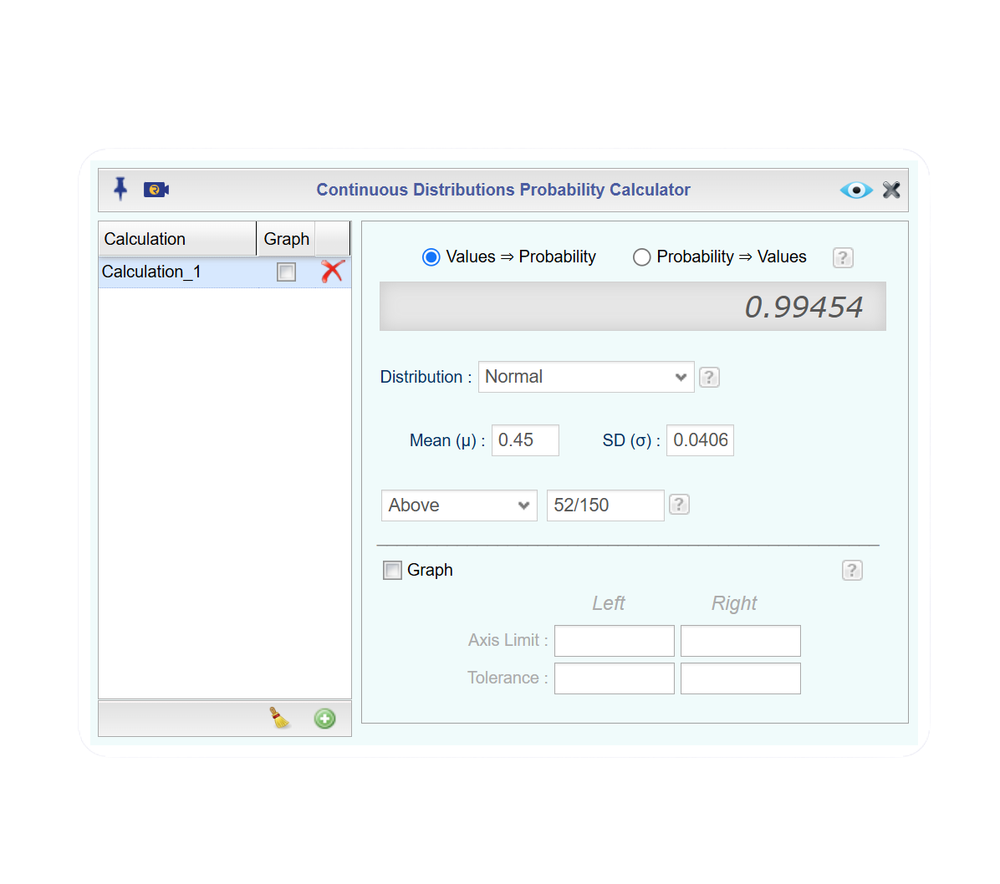
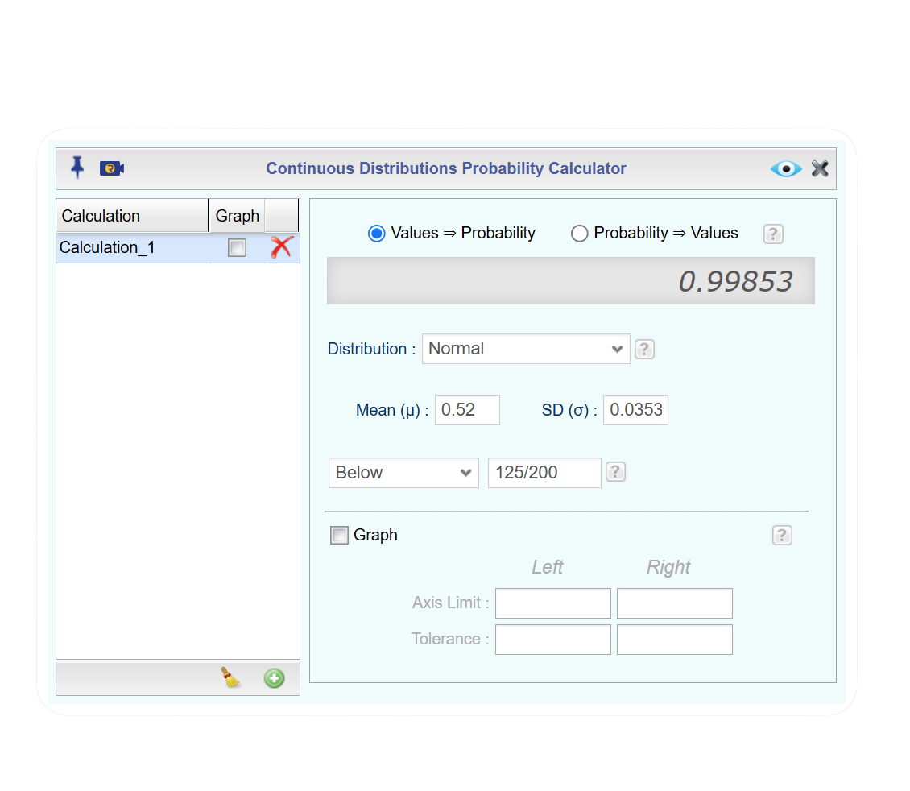
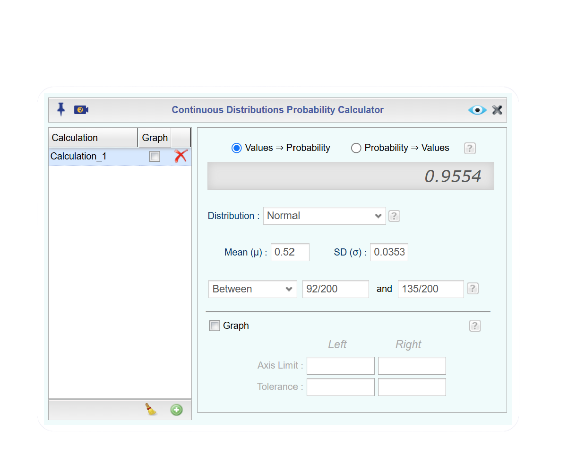
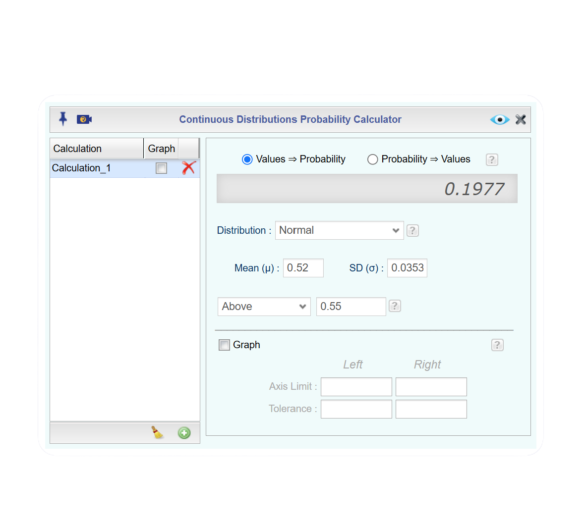
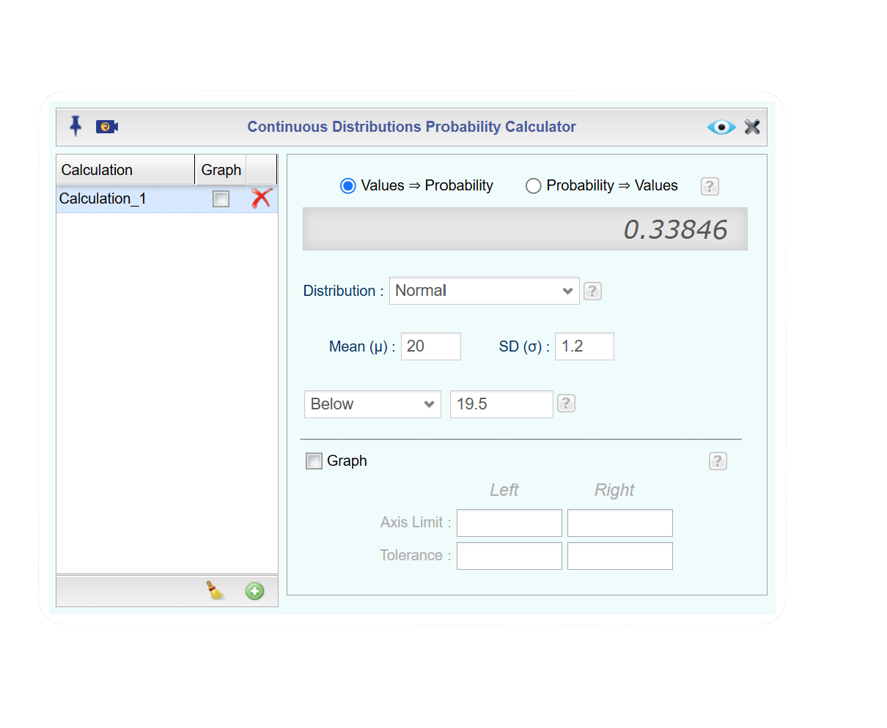
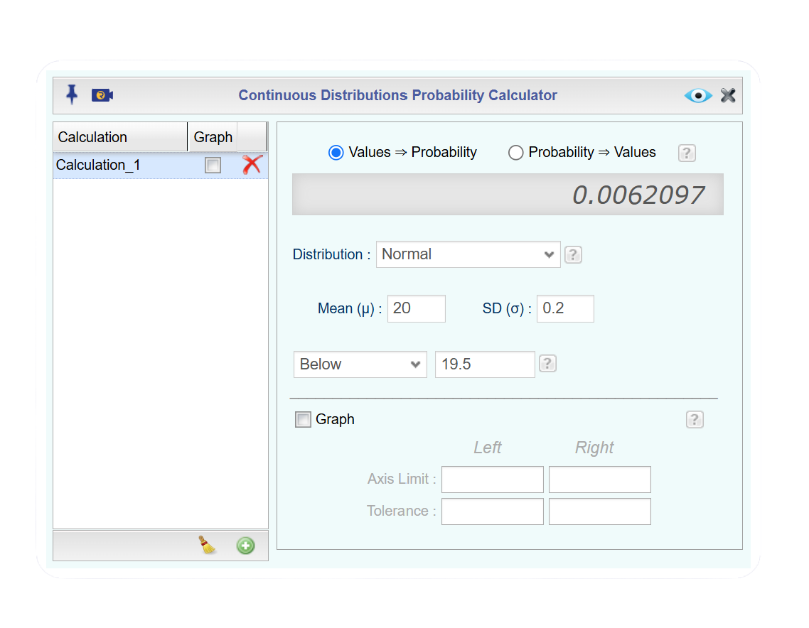
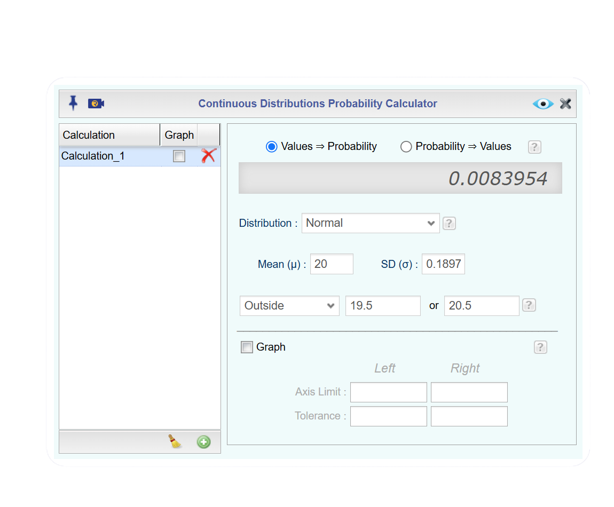
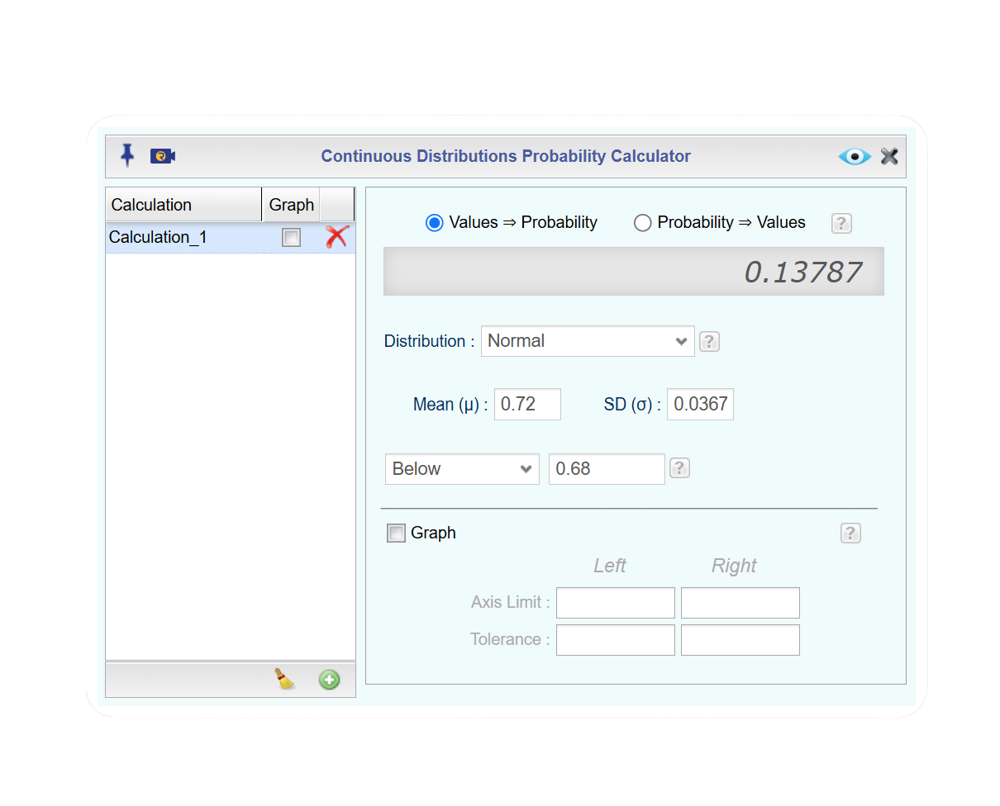
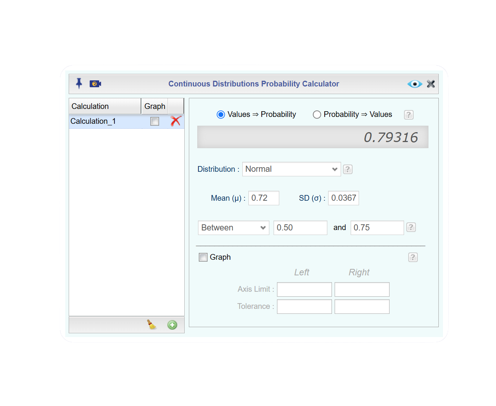
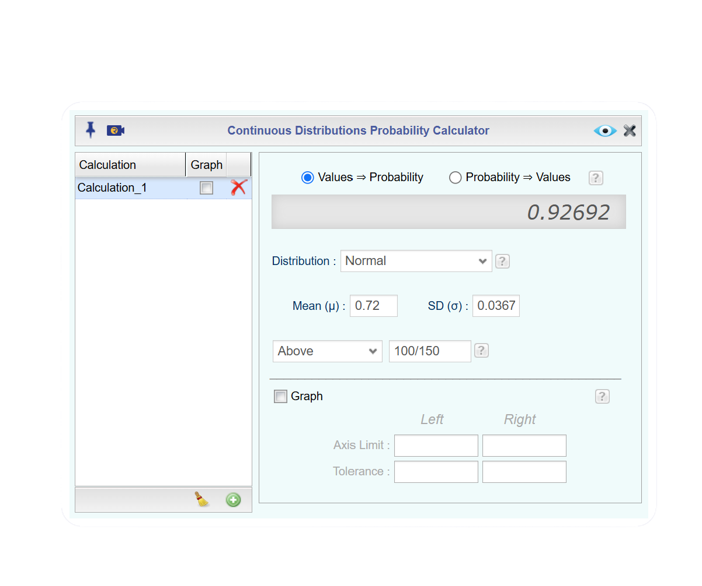

## Sampling Distribution of the Mean and Central Limit Theorem

### Sampling Distribution of the Mean

### The Law of Large Numbers

### The Central Limit Theorem

## Sampling Distribution of the Sample Proportion

Imagine that a university wants to determine the proportion of its students who prefer online courses. Surveying every student would be expensive and time-consuming, so the university randomly selects 100 students and asks whether they prefer online courses. Suppose 62 of the 100 students respond "yes."

To describe this result, we use the **sample proportion**, which is the proportion of individuals in a sample who possess the characteristic of interest. The sample proportion is denoted by the symbol $\hat{p}$​ (pronounced "p-hat") and is calculated as

$$\hat{p}=\frac{x}{n}$$
where

$x =$ the number of individuals in the sample with the characteristic of interest, and 

$n =$ the sample size

For the university survey,

$$\hat{p}=\frac{62}{100}=0.62$$

This means that 62% of the students in the sample prefer online courses.

Now suppose a different random sample of 100 students is selected. The new sample might contain 58 students who prefer online courses, giving $\hat{p}=0.58$, or 65 students, giving $\hat{p}=0.65$. Because different random samples produce different values of $\hat{p}$​, the sample proportion is a random variable.

### Describing the Sampling Distribution of the Sample Proportion

The **sampling distribution of the sample proportion** is the probability distribution of all possible values of $\hat{p}$​ that could occur from repeated random samples of the same size taken from the population. This distribution describes how the sample proportion varies from one sample to another and helps us assess how accurately a sample proportion estimates the true population proportion.

If $p$ denotes the true population proportion, then the sampling distribution of $\hat{p}$​ has the following properties:

$$\text{Mean:} \quad \mu_{\hat{p}} = p$$

and

$$\text{Standard Deviation:} \quad \sigma_{\hat{p}} = \sqrt{\frac{p(1-p)}{n}}.$$​​
The standard deviation is often called the **standard error** of $\hat{p}$, since it measures how much we expect $\hat{p}$ to vary from sample to sample. 

When the sample size is sufficiently large, the sampling distribution of $\hat{p}$​ is approximately normal provided that

$$
np \ge 10 \qquad \text{and} \qquad n(1-p) \ge 10.
$$

Under these conditions,

$$\hat{p} \sim N\left(p,\sqrt{\frac{p(1-p)}{n}}\right)$$

This normal approximation makes it possible to construct confidence intervals and perform hypothesis tests about population proportions, which we will learn about in in the next few chapters. This makes the sampling distribution of the sample proportion a fundamental concept in statistical inference.

::: {#exm-describe-sampling-distribution-p-hat}
## Desribe the Sampling Distribution

A large online retailer wants to estimate the proportion of customers who are satisfied with their shopping experience. Company records show that approximately 70% of all customers are satisfied. Instead of surveying every customer, the retailer randomly selects 100 customers and records whether each customer is satisfied or not. Describe the sampling distribution of the sample proportion.

:::

::: {.callout-tip .solution-callout collapse="true" icon="false"}
## 🔎 Solution

To describe the sampling distribution of $\hat{p}$, we need to check that the two conditions are met and then find the mean and standard deviation. 

Since the company records show that 70% of **all** customers are satisfied, we know $p=0.70$.  In addition, since the company randomly selects 100 cutomers, we know $n=100$.

$\text{Check Conditions:} \quad np \ge 10 \quad \text{and} \quad n(1-p) \ge 10$

$(100)(0.70)=70 \ge 10 \quad \text{and} \quad (100)(1-0.70)=(100)(0.30)=30 \ge 10$

So the conditions are satisfied.

Next, we find the mean and standard deviation.

$\text{Mean:} \quad \mu_{\hat{p}} = 0.70$

$\text{Standard Deviation:} \quad \sigma_{\hat{p}} = \sqrt{\frac{(0.70)(1-0.70)}{100}} = 0.046$​​.

:::

### Calculating Probabilities of the Sample Proportion

Once we have established that the sampling distribution of a sample proportion $\hat{p}$​ is approximately normal, we can use the distribution to answer probability questions about sample outcomes.

Continuing with our customer satisfaction survey example, recall that the population proportion of satisfied customers is $p=0.70$, and we are taking random samples of $n=100$ customers. Now that we know the sampling distribtuion for $\hat{p}$, we can answer probability questions about the sample proportion.

For example, suppose the company wanted to know 

- What is the probability that a random sample of 100 customers will contain at least 75% satisfied customers?
- What is the probability that a random sample of 100 customers will contain at most 65% satisfied customers?
- What is the probability that a random sample of 100 customers will contain between 50% and 80% satisfied customers?

The sampling distribution of the sample proportion allows us to answer these types of questions. Thus, the sampling distribution of the sample proportion not only describes the behavior of sample proportions across repeated samples, but also allows us to quantify the likelihood of observing particular sample results. This forms the basis for confidence intervals, hypothesis testing, and many other statistical inference procedures in later chapters.

::: {#exm-probability-proportion1}
## Calculating Probabilities

Consider a university where 45% of all students participate in at least one extracurricular club. Suppose the university randomly selects samples of 150 students and records the proportion of students in each sample who participate in a club.

a\. Describe the sampling distribution of $\hat{p}$.

b\. What is the probability that at least 52 students participate in extracurricular clubs?

:::

:::: {.callout-tip .solution-callout collapse="true" icon="false"}
## 🔎 Solution

a\. As in the previous example, to describe the sampling distribution of $\hat{p}$, we need to check that the two conditions are met and then find the mean and standard deviation. In this case, $p=0.44$ and $n=150$.

$\text{Check Conditions:} \quad np \ge 10 \quad \text{and} \quad n(1-p) \ge 10$

$(150)(0.45)=67.5 \ge 10 \quad \text{and} \quad (150)(1-0.45)=(150)(0.55)=82.5 \ge 10$

The conditions are satisfied.

Next, 

$\text{Mean:} \quad \mu_{\hat{p}} = 0.45$

$\text{Standard Deviation:} \quad \sigma_{\hat{p}} = \sqrt{\frac{(0.45)(1-0.45)}{150}} = 0.0406$​​

b\. We want to find the probability that at least 52 out of 150 students participate in extracurricular activities.  Since we are finidng a probability using the sampling distribution of the sample proportion, we need to find the sample proportion, $\hat{p}$.

Recall that $\hat{p}=\frac{x}{n}.$  In this case, $\hat{p}=\frac{52}{150}=0.35$.

Since the question states *at least* 52, we will be finidng $P(x \ge 52)=P(\hat{p} \ge 0.35)$. To find the probability, we will use Rguroo.

Click to expand the box below see how to calculate the probability.

::: {#Finding-Probabilities-in-Rguroo .callout-note appearance="simple" collapse="true" icon="none" title="{width=22px style='vertical-align:middle;'} Finding Probabilities in Rguroo"}

1.  Open the **Probability-Simulation** toolbox in Rguroo.\
2.  Open the [Probability]{.dpd} dropdown, and select [Probability Calculator]{.fun} and [Continuous]{.fun}. This opens the [Continuous Probability]{.dialog} dialog.\
3.  Since we were given the values and want the probability, select Values $\Rightarrow$ Probability.
4.  Select Normal, since we verified that the distribution was approximately normal.
5.  Enter the mean, [0.40]{.typein}, and standard deviation, [0.0406]{.typein}.
6.  Next, select [Above]{.dpd} in the dropdown menu since it is greater than and enter $\hat{p}$, [$\frac{52}{150}$]{.typein} in the box. *Note: We enter the fraction since our decimal value is rounded above and we want to be as precise as possible*
7.  Click the preview icon  to see a preview of the barplot.

::: {.callout-tip .inner-callout appearance="simple" collapse="true" icon="none" title="Click here to see the Rguroo dialog"}
{width="500px"}
:::
::::

So $P(x \ge 52) = P(\hat{p} \ge \frac{52}{150}) = 0.9945$

:::

::: {#exm-probability-proportion2}
## Calculating Probabilities

Suppose a school district is proposing a bond measure that would raise property taxes to fund the construction of two new elementary schools and renovate aging classrooms. Before the election, a polling organization conducts research and finds that approximately 52% of registered voters support the measure.

To gauge public opinion leading up to the election, the polling organization repeatedly selects random samples of 200 registered voters and records the proportion in each sample who say they support the bond measure.

a\. Describe the sampling distribution of $\hat{p}$.

b\. What is the probability that less than 125 registered voters support the measure?

c\. What is the probability that between 92 and 135 registered voters support the measure?  

d\. The bond measure needs at least 55% of registered voters to support the measure to pass.  What is the probability that the bond measure will pass?

:::

::: {.callout-tip .solution-callout collapse="true" icon="false"}
## 🔎 Solution

a\. Again, we need to check that the two conditions are met and then find the mean and standard deviation. In this case, $p=0.52$ and $n=200$.

   $\text{Check Conditions:} \quad np \ge 10 \quad \text{and} \quad n(1-p) \ge 10$

   $(200)(0.52)=104 \ge 10 \quad \text{and} \quad (200)(1-0.52)=(200)(0.47)=96 \ge 10$

   The conditions are satisfied.

   Next, 

   $\text{Mean:} \quad \mu_{\hat{p}} = 0.52$

   $\text{Standard Deviation:} \quad \sigma_{\hat{p}} = \sqrt{\frac{(0.52)(1-0.52)}{200}} = 0.0353$​​

b\. We need to find $P(x < 125) = P(\hat{p} < \frac{125}{200}) = P(\hat{p} < 0.625).$ We use Rguroo as in the last example to find the probability.

In this case we enter the mean, [0.52]{.typein}, and standard deviation, [0.0353]{.typein}. Next, select [Below]{.dpd} in the dropdown menu since it is less than and enter $\hat{p}$, [125/200]{.typein} in the box. Click the preview icon to see the probability 

::: {.callout-tip .inner-callout appearance="simple" collapse="true" icon="none" title="Click here to see the Rguroo dialog"}
{width="500px"}
:::

So $P(x < 125) = P(\hat{p} < \frac{125}{200}) = P(\hat{p} < 0.625) = 0.9985.$

c\. To find the probability that between 92 and 135 registered voters support the measure, we calculate $P(92 < x<135)=P(\frac{92}{200} < x < \frac{135}{200}) = P(0.46 x < 0.675).$  Notice that we need two sample proportions since it is between two values.

In Rguroo, the mean and standard deviarion has not changed from part (b), so we need to select [Between]{.dpd} and then enter the two values [92/200]{.typein} and [135/200]{.typein}. Click the preview button to see the probability.

::: {.callout-tip .inner-callout appearance="simple" collapse="true" icon="none" title="Click here to see the Rguroo dialog"}
{width="500px"}

:::

So, $P(92 < x<135)=P(\frac{92}{200} < x < \frac{135}{200}) = P(0.46 x < 0.675) = 0.9554.$

d\. If we want to find the probability that the bond measure will pass and we need $\hat{p}$ to be at least 55%, we will find $P(\hat{p} \ge 0.55)$.  Notice that we did not have to calculate $\hat{p}$ since we were given the percentage versus the number of people, $x$, who support the bond measure.

The mean and standard deviation did not change, so we select [Above]{.dpd} and enter the value [0.55]{.typein}.

::: {.callout-tip .inner-callout appearance="simple" collapse="true" icon="none" title="Click here to see the Rguroo dialog"}
{width="500px"}

:::

So, $P(\hat{p} \ge 0.55)= 0.1997$.  
   
This means that there is about a 20% chance that the bond measure will pass with minimum support of 55% of the regisetered voters.
:::

## Applications of the Central Limit Theorem

In the previous sections, we used sampling distributions to describe how sample means and sample proportions vary from sample to sample. Once the appropriate sampling distribution has been identified, we can use it to answer probability questions about the likelihood of obtaining particular sample results. For sample means, these probabilities are based on the sampling distribution of $\bar{x}$, while for sample proportions, they are based on the sampling distribution of $\hat{p}$​. In this section, we will practice finding probabilities involving both types of sampling distributions. These exercises will reinforce the process of identifying the correct distribution, calculating probabilities, and interpreting the resulting probabilities in context.

::: callout-note
## Summary of Sampling Distributions

**Sampling Distribution of $\bar{x}$**

1. The shape of the distribution is approximately normal if $n \ge 30.$

2. Mean: $\mu_{\bar{x}}= \mu$

3. Standard Deviation: $\sigma_{\bar{x}}=\frac{\sigma}{\sqrt{n}}$

**Sampling Distribution of $\hat{p}$**

1. The shape of the distribution is approximately normal if $np \ge 10 \quad \text{and} \quad n(1-p) \ge 10$.

2. Mean: $\mu_{\hat{p}} = p$

3. Standard Deviation: $\sigma_{\hat{p}} = \sqrt{\frac{p(1-p)}{n}}$

:::

::: {#exm-probability-mixed1}
## Calculating Probabilities

A bottling company fills soda bottles with a mean volume of 20 ounces and a population standard deviation of 1.2 ounces.

a\. Suppose the bottling company knows their bottles have volumes that are approximately normally distributed.  If one bottle is selected, what is the probability that the volume is less 19.7 ounces? Interpret the result.

b\. Now suppose the bottling company does not know if there bottle volumes follow a normal distribution.  If 36 bottels are selected, what is the probability that the mean volume is less than 19.7 ounces? Interpret the result.

c\. Because there can be penalties for underfilling bottles and profit loss from overfilling bottles, the bottling machine is shut down for recalibration if the volume is less than 19.5 ounces or more than 20.5 ounces. Suppose the bottling company randomly selects 40 bottles. What is the probability that the machine will be shut down for recalibraition?

:::

::: {.callout-tip .solution-callout collapse="true" icon="false"}
## 🔎 Solution

Before we begin to find the probabilities, we need to identify if this is a *mean* or a *proportion*.  To do this, w look at the wording and what we are recording.  In this scenario, the company is recording the mean volume (in ounces) in each bottle.  Not only does the scenario use the specific wording of *mean volume*, but the data the company is recording is a measurement, not a proportion.

a\.  We need to calculate $P(x < 19.5).$ Since we are selecting *one* bottle we are not finding a sample mean.  The company states that the bottle volumes are normally distributed, so we use $\mu=20$ and $\sigma=1.2.$ To find the probability, use the Continuous Probability Calculator in Rguroo. To review the process of finding probabalities in Rguroo, click [here](#Finding-Probabilities-in-Rguroo). **Need to link to directions in 7.1**

::: {.callout-tip .inner-callout appearance="simple" collapse="true" icon="none" title="Click here to see the Rguroo dialog"}
{width="500px"}

:::

So $P(x < 19.5)= 0.3385.$ This means that if the company samples one bottle, we hae a 33.85% chance of it being filled less than 19.5 ounces.

b\. In this case, we do not know that the distribution is normally distributed, and we have a sample size, $n=36.$ We first check that conditions for the distribution being approximately normal are met.

For means, we check $n \ge 30$.  Since $n=36$, $36 \ge 30$, so the distribution is approximately normal.

Now we find $P(\bar{x} < 19.5)$ using $\mu=20$ and $\sigma=\frac{1.2}{\sqrt36}=0.2.$

::: {.callout-tip .inner-callout appearance="simple" collapse="true" icon="none" title="Click here to see the Rguroo dialog"}
{width="500px"}

:::

So $P(\bar{x} < 19.5)= 0.0062.$ This means that if the company samples 36 bottles, we hae a 0.62% chance of an average fill amount of less than 19.5 ounces. Since 0.006 is less than 0.05, this would be considered unusual.

c\. The company decides to select 40 bottles this time, so $n=40$.  Since the sample size changed, we need to check conditions and recalculate the stadard deviation.

$40 \ge 30$ so this distribution is approximately normal.  Using $n=40$, we have $\mu=20$ and $\sigma=\frac{1.2}{\sqrt40}=0.1897.$

Since the company does not want to incur a penalty or lose profit, we need to find $P(\bar{x} < 19.5)$ or $P(\bar{x} > 20.5)$  Recall that or means addition, so we could find each probability and add them. However, we can select [Outside]{.dpd} in Rguroo and it will find both and add it for us.

::: {.callout-tip .inner-callout appearance="simple" collapse="true" icon="none" title="Click here to see the Rguroo dialog"}
{width="500px"}

:::

From Rguroo, we get $P(\bar{x} < 19.5)$ or $P(\bar{x} > 20.5) = 0.0084.$ There is only about a 0.84% chance that a sample of 40 bottles will have an average fill outside 19.5 to 20.5 oz. Since this probability is also less than 0.05, it would be unusual to have to shut down the machine for recalibration in this sample.

:::

::: {#exm-probability-mixed2}
## Calculating Probabilities

A streaming service reports that 72% of its subscribers watch at least one original series each month. A random sample of 150 subscribers is selected. 

a\. Find the probability no more than 68% of the subscribers watch at least one original series each month. Interpret the results.

b\. Find the probability that between 50% and 75% of the subscribers watch at least one original series each month. Interpret the results.

c\. Find the probability that at least 100 subscribers watch at least one original series each month. Interpret the results.

:::

::: {.callout-tip .solution-callout collapse="true" icon="false"}
## 🔎 Solution

Before we begin to find the probabilities, we need to identify if this is a *mean* or a *proportion*.  To do this, w look at the wording and what we are recording. This scenario is a proportion since we are recording (yes or no) if a selected subscriber watches at least one original series each month, which is not a numerical measurement. This defines success as, $x=$ number of subscribers that watches at least one original series each month. 

Looking at parts (a) - (c), we use the same sample size, $n$, for each part.  Thus, we can define 

$\mu_{\hat{p}}=0.72$ $\quad$ and $\sigma_{\hat{p}}= \sqrt{\frac{0.72(1-0.72)}{150}} = 0.0367$

To review the process of finding probabalities in Rguroo, click [here](#Finding-Probabilities-in-Rguroo).

a\. The wording of *no more than 68%* means we need to find $P(\hat{p} \le  0.68)$. 

::: {.callout-tip .inner-callout appearance="simple" collapse="true" icon="none" title="Click here to see the Rguroo dialog"}
{width="500px"}

:::

So, $P(\hat{p} \le  0.68)= 0.1379$ This means, out of 150 subscribers, there is a 13.79% chance that no more than 68% watch at least one original series each month.

b\.  Here, we want to find *between*, so we find $P(0.50 < \hat{p} < 0.75)$

::: {.callout-tip .inner-callout appearance="simple" collapse="true" icon="none" title="Click here to see the Rguroo dialog"}
{width="500px"}

:::

So $P(0.50 < \hat{p} < 0.75) = 0.7932.$ This means, out of 150 subscribers, there is a 79.32% chance that between 50% and 75% watch at least one original series each month.

c\. In this last part, we want to find *at least 100*. Notice that this time we are given $n$ not $\hat{p}$ so we find $P(x \ge 100) = P(\hat{p} \ge \frac{100}{150}) = P(\hat{p} \ge 0.67).$

::: {.callout-tip .inner-callout appearance="simple" collapse="true" icon="none" title="Click here to see the Rguroo dialog"}
{width="500px"}

:::

So, $P(x \ge 100) = P(\hat{p} \ge \frac{100}{150}) = P(\hat{p} \ge 0.67) = 0.9269.$ This means, out of 150 subscribers, there is a 92.69% chance that at least 100 subscribers watch at least one original series each month.

:::