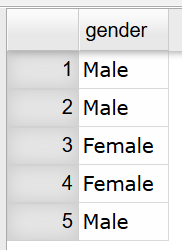
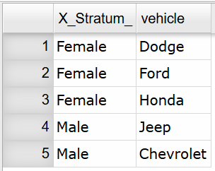
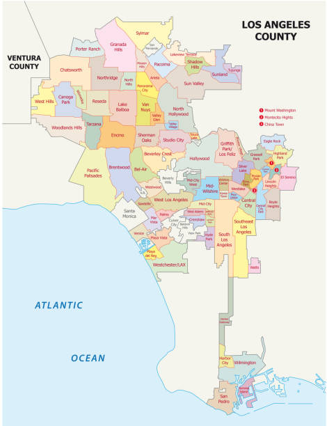
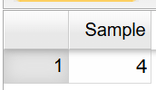

::: {.callout-note}
## Chapter 1 Objectives

By the end of Chapter 1, you should be able to:

-  Recognize and differentiate between key statistical terms.
-  Identify levels of measurement.
-  Differentiate between and apply various types of sampling techniques.
-  Recognize and differentiate between various types of observational studies and designed experiments.
-  Identify sources of errors and bias.

:::

**Before you begin, review the process for importing a dataset.** Click on the box below to expand the directions for importing a dataset into your Data Toolbox.

::: {#Importing-Data-to-Rguroo-Chapter-1 .callout-note appearance="simple" collapse="true" icon="none" title="{width=22px style='vertical-align:middle;'}  Importing Data to Rguroo"}
1.  Open the **Data** toolbox in Rguroo.\
2.  From the [Data Import]{.dpd} dropdown, select [Dataset Repository]{.fun}.\
3.  In the top search box, type [kozak]{.typein}, then select the [Statistics Using Technology – Kozak]{.repo} repository.\
4.  In the middle search box, type the first few letters of the dataset, and choose your dataset that appears in the lower panel.\
5.  Click the [Import]{.button}. The dataset will be imported into your Rguroo account.\
6.  Click the [Close]{.button} to close the dialog.\
7.  To view the dataset, double-click the dataset under the **Data** toolbox list.
:::

```{r setup, include=FALSE}
knitr::opts_chunk$set(echo = TRUE)
library("mosaic")
#library("latexpdf")
library("MASS")

```

You encounter statistics in many parts of everyday life. A sports fan follows player performance numbers, while someone interested in politics pays attention to polling data. Environmental advocates study measurements such as arsenic levels in local water or trends in global temperatures. In business, people track monthly sales or monitor product quality. In health fields, professionals examine the success rates of procedures or the percentage of a population affected by a disease. These are only a few of the many ways statistics appear across different areas of life. To develop the ability to gather data and interpret it effectively, it is essential to understand the nature of statistics and the fundamental concepts that define the field.

## What is Statistics?

**Statistics** is the study of how to collect, organize, analyze, and interpret data collected from a group.

There are two main branches of statistics. **Descriptive statistics** focuses on collecting, organizing, and summarizing data. **Inferential statistics** involves using that data to draw conclusions or make informed judgments about a larger group. Because inferential work depends on well‑organized information, it is important to begin with descriptive statistics.

To learn how to create descriptive summaries and then use them to reach broader conclusions, you will need to understand several key definitions. Many of these terms also appear in everyday language, but their meanings in statistics can differ slightly. Paying attention to these distinctions and using the statistical definitions accurately is essential.

## Key Concepts in Statistics

A statistical study begins by identifying the **population**, which is the entire group of individuals, items, or objects a researcher wants to understand. Because populations are often too large or difficult to measure directly, researchers collect data from a **sample**, a smaller subset selected from that population. The goal of sampling is to gather enough information to make reliable conclusions about the broader population. Understanding how populations and samples relate is essential, because the quality of any statistical conclusion depends on how well the sample represents the population it comes from.

Since we are interested in the entire population, then ideally you want to calculate a **parameter**, a numerical measurement from the population. As mentioned, it can be difficult or impossible to collect information from the entire population. Instead you use a numerical measurement from the sample, called a **statistic**, to estimate the parameter. Parameters are usually labeled with a letter from the Greek alphabet, while statistics are usually labeled with letters from the Latin alphabet with or without special markers. Since no sample is exactly the same, the statistic values are going to be different from sample to sample. They estimate the value of the parameter, but again, you do not know for sure if your answer is correct.

A concern in Statistics is how well the sample represents the population it is meant to describe. Because a sample includes only part of the larger group, it may differ from the population in ways that affect the values we calculate from it. These differences can occur by chance or because of the way the sample was collected. When a sample does not accurately represent the population, the statistics calculated from it may give a misleading picture of the true population values. Because of this, much of statistical practice focuses on choosing samples that are as representative as possible and on understanding the uncertainty that comes from working with only part of the population.

In a sample, an **observation** is a single person, item, or object from which data are collected, and a **variable** is the specific piece of information recorded about that observation. For example, in a survey of students, each student is an observation, and variables might include age, grade level, or number of hours spent studying. In a study of cars, each car is an observation, while variables could be mileage, color, or fuel efficiency. In every statistical study, observations supply the “who,” and variables supply the “what.”

Choosing which variables to collect from a sample depends on the goals of the study, the structure of the population, and the kinds of conclusions you hope to draw. The starting point is always the research question. The variables you collect must directly relate to what you want to understand, estimate, or compare about your population. These may include demographic characteristics, environmental conditions, or other measurable features that could help to understand the population or draw conclusions. Practical constraints also matter when choosing variables. Some variables are easy to measure accurately, while others require time, equipment, or expertise.

There are two different types of variables: categorical (also called qualitative) and numerical (also called quantitative). **Categorical variables** describe qualities, categories, or labels rather than numerical amounts. Their values place individuals into groups based on characteristics or attributes. **Numerical variables** are numerical measurements that represent amounts or counts. Their values can be ordered, compared, and used in mathematical operations.

::: {.callout-note}
## Key Terms Summary

| Key Term | Definition|
|----|-----------|
|Population|Entire group of individuals or items that a study|
|Sample|Subset of the population|
|Parameter|Numerical value that describes a characteristic of an entire population|
|Statistic|Numerical value that describes a characteristic of the sample|
|Observation|Single individual or item on which data are collected|
|Variable|Characteristic of an observation that can take different values|
|Categorical variable|Observations are groups or categories|
|Numerical variable|Observations are numerical values that can be counted or measured|

:::

A **dataset** or **data frame** is built from the observations and variables you collect. To organize it as clean data, each row should represent a single observation, and each variable should be clearly defined and easy to identify in its own column. A data frame that follows this structure is shown in @tbl-dataframe_example below.

```{r dataframe}
#| tbl-alt: "example of a clean dataset"
#| label: tbl-dataframe_example
#| tbl-cap: "Example of a Clean Dataset"
#| echo: FALSE
Sugar <- read.csv(
        "https://krkozak.github.io/MAT160/sugar.csv")
options(width = 60)
knitr::kable(head(Sugar))
```

@tbl-dataframe_example shows a dataset of breakfast cereals, where each row corresponds to a single cereal and each column is a variable that records a specific attribute, such as nutritional measures (calories, sugar content, fiber, protein, sodium) or characteristics of the cereal (brand, cereal type, shelf placement, manufacturer).

Collecting several variables from a single field observation is efficient because one trip into the field can generate many useful measurements. When you’re measuring the diameter at breast height (DBH) of Ponderosa pines in the Coconino National Forest, you already have to walk to each tree and take a physical measurement. While you’re there, it’s practical to record additional characteristics such as tree height, signs of bark‑beetle infestation, estimated age, bark color, or branch count. Even if your primary goal is to estimate the average DBH, gathering these extra variables gives you the ability to analyze other patterns and relationships later. There’s little reason to hike through the forest and come away with only one piece of information when the same effort can yield a much richer dataset.

::: {#exm-key-temrs-qualitative1}
## Identifying Key Terms for Categorical Variable

In 2010, the Pew Research Center questioned 1500 adults in the U.S. to estimate the proportion of the population favoring marijuana use for medical purposes. It was found that 73% are in favor of using marijuana for medical purposes. State the population, sample, variable, observation, parameter, and statistic.
:::

::: {.solution}
*Note: This is categorical data since you are recording a person's response, yes (they are in favor of medical marijuana) or no (they are not in favor medical marijuana).*

Population: All U.S adults

Sample: 1500 U.S. adults

Variable: whether an adult favors medical marijuana use (the response to the question "should marijuana be used for medical purposes?")

Observation: an individual adult's response

Parameter: proportion of all U.S. adults who favor marijuana for medical purposes

Statistic: proportion of 1500 U.S. adults who favor marijuana for medical purposes
:::

::: {#exm-key-temrs-qualitative2}
## Identifying Key Terms for Categorical Variable

A parking control officer records the manufacturer of every $5^{th}$ car in the college parking lot in order to determine the most common manufacturer. State the population, sample, variable, observation, parameter, and statistic.
:::

::: {.solution}
*Note: This is categorical data since you are recording car manufacturer.*

Population: All cars in the college parking lot

Sample: Every $5^{th}$ car in the college parking lot

Variable: the car's manufacturer

Observation: the manufacturer of a car

Parameter: proportion of all cars in the college parking lot that belong to each manufacturer

Statistic: proportion of the cars sampled in the college parking lot that belong to each manufacturer
:::

::: {#exm-key-temrs-quantitative1}
## Identifying Key Terms for Numerical Variable

A biologist wants to estimate the average height of a plant that is given a new plant food. She gives 10 plants the new plant food and measures the plant height on day 50. State the population, sample, variable, observation, parameter, and statistic.
:::

::: {.solution}
*Note: This is numerical data since you will be recording a height (numerical value).*

Population: All plants that could be given the new plant food

Sample: 10 plants that are given the new plant food

Variable: The height of the plant at 50 days

Observation: The height of a plant at 50 days

Parameter: Average height on day 50 of all plants when the new plant food is used

Statistic: Average height on day 50 of 10 plants when the new plant food is used

Real World Design: In a real world scenario, you are usually comparing plants given the new plant food to plants given the old or standard plant food. That means your study will involve more than just the plants receiving the new food, and each plant represents one unit of observation. You will also want to record measurements from multiple days, not only day 50. A well‑organized data frame should include several variables, such as a plant ID number, the type of fertilizer each plant received, and height measurements from different days (for example, day 20, day 30, and day 50). Choose variable names that are clear, meaningful, and written as single words so they are easy to use in data analysis.
:::

::: {#exm-key-temrs-quantitative2}
## Identifying Key Terms for Numerical Variable

A doctor wants to see if a new treatment for cancer extends the life expectancy of a patient versus the old treatment. She gives one group of 25 cancer patients the new treatment and another group of 25 the old treatment. She then measures the life expectancy of each of the patients. State the populations, samples, variables, observations, parameters, and statistics.
:::

::: {.solution}
*Note: This is numerical data since the doctor is recording life expectancy (numerical value).*

In this example there are two groups that will be measured. That means we will need two groups for each key term.

Population 1: All cancer patients who receive the new treatment\
Polulation 2: All cancer patients who receive the old treatment

Sample 1: The 25 cancer patients in the study who receive the new treatment\
Sample 2: The 25 cancer patients in the study who receive the old treatment

Variable 1: Life expectancy of a cancer patient given the new treatment\
Variable 2: Life expectancy of a cancer patient given the old treatment

Observation 1: Each individual cancer patient's life expectancy given the new treatment\
Observation 2: Each individual cancer patient's life expectancy given the old treatment

Parameter 1: The mean life expectancy of all cancer patients given the new treatment\
Parameter 2: The mean life expectancy of all cancer patients given the old treatment

Statistic 1: The mean life expectancy of the 25 patients given the new treatment\
Statistic 2: The mean life expectancy of the 25 patients given the old treatment
:::

Numerical data can be further classified into two different types of variables. **Discrete variables** are numerical variables that take on countable, separate values. Discrete variables are usually things that you count. **Continuous variables** are numerical variables can assume any value. Continuous variables are usually things that you measure.

::: {#exm-key-temrs-discrete-continuous}
## Determining if a Variable is Discrete or Continuous

Classify the numerical variable as discrete or continuous.

a.  The weight of a cat.

b.  The number of fleas on a cat.

c.  The size of a shoe.
:::

::: {.solution}
a.  The weight of a cat.

    This is continuous since it is something you measure.

b.  The number of fleas on a cat.

    This is discrete since it is something you count.

c.  The size of a shoe.

    This is discrete since you can only be certain values, such as 7, 7.5, 8, 8.5, 9. You can't buy a 9.73 shoe.
:::

### Measurement Scales

When we collect data, we don’t always measure things the same way. Some data describe categories, some show order, and others involve actual numerical measurements. The levels of measurement help us understand what kind of data we’re working with and guide us in choosing the right graphs, calculations, and statistical methods. There are four measurement scales for different types of data with each building on the ones below it. They are:

**Nominal**: Data is just a name or category. There is no order to any data and since there are no numbers, you cannot do any arithmetic on this level of data. Examples of this are gender, car name, ethnicity, and race.

**Ordinal**: Data that is nominal, but you can now put the data in order, since one value is more or less than another value. You cannot do arithmetic on this data, but you can now put data values in order. Examples of this are grades (A, B, C, D, F), place value in a race (1st, 2nd, 3rd), and size of a drink (small, medium, large).

**Interval**: Data that is ordinal, but you can now add or subtract values and the arithmetic is meaningful. If a data value is 0, that does not mean the absence of quantity. Examples of this are temperature and time on a clock.

**Ratio**: Data that is interval, but you can now divide one value by another and that ratio is meaningful. You can now do all arithmetic on this data. If a data value is 0, this does mean the absence of quantity. Examples of this are height, weight, distance, and length of time.

Most people have a hard time deciding if the data are nominal, ordinal, interval, or ratio. First, if the variable is categorical (words instead of numbers) then it is either nominal or ordinal. Now ask yourself if you can put the data in a particular order. If you can it is ordinal. Otherwise, it is nominal. If the variable is numerical, then it is either interval or ratio. For ratio data, a value of 0 means there is no quantity. This is known as the absolute zero. If there is an absolute zero in the data, then it means it is ratio. If there is no absolute zero, then the data are interval. An example of an absolute zero is if you have \\\$0 in your bank account, then you are without money. The amount of money in your bank account is ratio data. An example where 0 is not an absolute zero would be temperature. If it was 0 degrees celsius out, that does not mean the absence of temperature, it is just really cold! So temperature would be interval data.

**Word of caution**: Sometimes ordinal data is displayed using numbers, such as 5 being strongly agree, and 1 being strongly disagree. These numbers are not really numbers. Instead they are used to assign numerical values to ordinal data. In reality you should not perform any computations on this data, though many people do. If there are numbers, make sure the numbers are inherent numbers, and not numbers that were assigned.

::: {#exm-key-temrs-measurement}
## Identify Measurement Scale

State which measurement scale each is.

a.  Time of first class

b.  Hair color

c.  Length of time to take a test

d.  Age groupings (baby, toddler, adolescent, teenager, adult, elderly)
:::

::: {.solution}
a.  Time of first class

    This is interval since it is a number, but 0 o'clock means midnight and not the absence of time.

b.  Hair color

    This is nominal since it is not a number, and there is no specific order for hair color.

c.  Length of time to take a test.

    This is ratio since it is a number, and if you take 0 minutes to take a test, it means you didn't take any time to complete it.

d.  Age groupings (baby, toddler, adolescent, teenager, adult, elderly)

    This is ordinal since it is not a number, but you could put the data in order from youngest to oldest or the other way around.
:::

### Homework for What is Statistics Section

1.  Suppose you want to know how Arizona workers age 16 or older travel to work. To estimate the percentage of people who use the different modes of travel, you take a sample containing 500 Arizona workers age 16 or older. State the observation, variable, population, sample, parameter, and statistic.

2.  You wish to estimate the mean cholesterol levels of patients two days after they had a heart attack. To estimate the mean you collect data from 28 heart patients. State the observation, variable, population, sample, parameter, and statistic.

3.  Print-O-Matic would like to estimate their mean salary of all employees. To accomplish this they collect the salary of 19 employees. State the observation, variable, population, sample, parameter, and statistic.

4.  To estimate the percentage of households in Connecticut which use fuel oil as a heating source, a researcher collects information from 1000 Connecticut households about what fuel is their heating source. State the observation, variable, population, sample, parameter, and statistic.

5.  The U.S. Census Bureau needs to estimate the median income of males in the U.S., they collect incomes from 2500 males. State the observation, variable, population, sample, parameter, and statistic.

6.  The U.S. Census Bureau needs to estimate the median income of females in the U.S., they collect incomes from 3500 females. State the observation, variable, population, sample, parameter, and statistic.

7.  Eyeglassmatic manufactures eyeglasses and they would like to know the percentage of each defect type made. They review 25,891 defects and classify each defect that is made. State the observation, variable, population, sample, parameter, and statistic.

8.  The World Health Organization wishes to estimate the mean density of people per square kilometer, they collect data on 56 countries. State the observation, variable, population, sample, parameter, and statistic

9.  State the measurement scale for each.

<!-- -->

a. Cholesterol level

b. Defect type

c. Time of first class

d. Opinion on a 5 point scale, with 5 being strongly agree and 1 being strongly disagree

<!-- -->

10. State the measurement scale for each.

<!-- -->

a.  Temperature in degrees Celsius

b.  Ice cream flavors available

c.  Pain levels on a scale from 1 to 10, 10 being the worst pain ever

d.  Salary of employees

## Sampling Methods

As we discussed before, if you want to know something about a population, it is often impossible or impractical to examine the whole population. It might be too expensive in terms of time or money. It might be impractical --- you can't test all batteries for their length of lifetime because there wouldn't be any batteries left to sell. You need to look at a sample. Hopefully the sample behaves the same as the population.

When you choose a sample you want it to be as similar to the population as possible. If you want to test a new painkiller for adults you would want the sample to include people who are fat, skinny, old, young, healthy, not healthy, male, female, etc.

There are many different ways to collect a sample, and none of them are perfect. With sampling, there is no guarantee that your sample will perfectly represent the entire population. That is one of the main limitations of sampling. Even so, some sampling methods are better than others and can give you a fairly accurate picture of the population. It is always important to remember that a sample might not be representative, even if you do everything correctly. For example, you could take a random sample from a group that has the same number of males and females, but just by chance, everyone selected could be female. If that happens, and if you have enough time and money, it may be a good idea to take a new sample.
There are many different sampling techniques, but we will focus on four main methods.

The simplest type of sampling is a **simple random sample (SRS)**. A simple random sample is a sample in which every individual in the population has an equal chance of being selected. Selection is made completely by chance, so no person is favored over another. This can be done by drawing names out of a hat, using a random number table, or using statistical software (like Rguroo) to randomly select individuals from a list. Simple random samples are easy to understand and help reduce bias, but because they rely entirely on chance, the resulting sample may still not perfectly represent the population. This type of sample is actually hard to collect, since it is sometimes difficult to obtain a complete list of the population. 

:::{#exm-srs}
# Taking a Simple Random Sample

You would like to sample 5 students out of a class of 30 (treating the students in the class as the population). Describe how you could take a simple random sample with and without technology.

:::

:::{.solution}

With Technology: You could upload the class roster into Rguroo and use Rguroo to generate a random sample of 5 students.

Without Technology: You could write each students' name on a piece of paper and draw five names from a hat.

:::

Statistical softwares use a **seed** so that random results can be reproduced consistently. Although computers generate numbers that appear random, they actually use mathematical formulas called pseudo‑random number generators, which follow a specific sequence. The seed tells the software where to start in that sequence. When the same seed is used, the software follows the same steps and produces the same random results every time.

When taking a sample, selections can be made with replacement or without replacement. Sampling **with replacement** means that each item selected is returned to the population before the next selection, so the same item can be chosen more than once. In contrast, sampling **without replacement** means that once an item is selected, it is not returned to the population, so it cannot be chosen again. In practice, most real‑world sampling is done without replacement, especially when sampling from a finite population, while sampling with replacement is often used in theoretical probability (we will discuss this in Chapter 4) or simulation settings.

::: {#exm-srs-with-Rguroo}
## Taking a Simple Random Sample 

Data was collected for two semesters in a statistics class on students’ transportation, demographics, living expenses, preferences, and academic majors.  Take a simple random sample of size 5 without replacement for the variable [gender]{.var}. Use a seed of 35.

 The dataset for this example is available in the Rguroo dataset repository [Kozak]{.repo}, with the dataset name [class_survey1]{.data}. @tbl-Class shows the variables and the first 6 rows of the data set. A complete description of the variables is provided in the [dataset code book](#code-book-class) that follows.


:::

```{r class-data1-table,echo=FALSE}
#| tbl-alt: "Table showing first 6 rows of statistics class survey dataset"
#| label: tbl-Class
#| tbl-cap: "Class Survey"
Class <- read.csv("https://krkozak.github.io/MAT160/class_survey.csv")
knitr::kable(head(Class))
```

::: {#code-book-class .callout-tip .codebook collapse="true"}
## Code book for Class Survey1 Dataset

**Description** The dataset gives survey results from two semesters of statistics classes at Coconino Community College in the years 2018-2019.

Format

This dataset contains the following columns:

[vehicle]{.var}: Type of car a student drives

[gender]{.var}: Self-declared gender of a student

[distance_campus]{.var}: How far a student lives from the Lone Tree Campus of Coconino Community College (miles)

[ice_cream]{.var}: Favorite ice cream flavor

[rent]{.var}: How much a student pays in rent

[major]{.var}: Students declared major

[height]{.var}: Height of the student (inches)

[winter]{.var}: Student's opinion of winter (Love it, Like it, Don't like, No opinion)

Source

Kozak K (2019). Survey results form surveys collected in statistics class at Coconino Community College.

References

Kozak, 2019

:::

:::{.solution}

To take a simple random sample using Rguroo, we first need to identify which column our variable [gender]{.var} is in.  To do this, open your **Data** toolbox in the left menu in Rguroo.  Find the dataset [class_survey1]{.data} and double click on it.  The dataset will appear in the main screen of Rguroo. When looking at the [class_survey1]{.data} dataset, [gender]{.var} is in the second column.  Keep this in mind when we generate a simple random sample.

Click to expand the box below see how to take a simple random sample of size 5 for [gender]{.var} type.

:::: {#Creating-SRS-in-Rguroo .callout-note appearance="simple" collapse="true" icon="none" title="{width=22px style='vertical-align:middle;'} Taking a Simple Random Sample in Rguroo"}

**Before you begin:** Make sure you have already imported the [class_survey1]{.data} dataset into your Rguroo account, as was shown [here](#Importing-Data-to-Rguroo-Chapter-1).

1. Open the **Probability-Simulation** toolbox in Rguroo.  
2. Open the [Probability]{.dpd} dropdown, and select [Random Selection]{.fun}. This opens the Random Selection dialog.  
3. In the Random Selection dialog, choose the [class_survey1]{.data} dataset from the [Dataset]{.dpd} dropdown.  
4. Enter the information for sample size (5) and seed (35).
5. Click without replacement (since the directions stated without replacement).
6. In the columns box, enter 2 (since the variable [gender]{.var} was in column 2).    
7. Click the preview icon  to see the simple random sample.

::: {.callout-tip .inner-callout appearance="simple" collapse="true" icon="none" title="Click here to see the Rguroo dialog"}

{width=500px}

:::

::::

When you click on the preview button, Rguroo outputs the following sample.

```{r,echo=FALSE}
#| fig-alt: "Rguroo output of simple random sample of size 5 for gender, yielding 3 males and 2 females"
#| warning: FALSE
#| label: fig-srs-gender
#| fig-cap: "Rguroo Output of Simple Random Sample"

```

@fig-srs-gender shows the simple random sample of five individuals' genders from the [class_survey1]{.data} dataset. These individuals were selected randomly from the dataset, meaning the selection process did not favor any particular group. Because the selection was random, the sample itself is unbiased; however, it may or may not be representative of the full dataset. The original dataset contains 16 females and 11 males. In this sample, there are 3 males and 2 females, while the population has more females than males overall. Since the sample size is small, it does not closely reflect the gender distribution of the population, which could lead to less accurate conclusions about gender. With a larger simple random sample, the proportions of males and females would be more likely to resemble those of the entire dataset.
:::

A **stratified sample** is collected by first dividing the population into groups, called **strata**, based on a shared characteristic such as gender, age, or grade level. Then, a random sample is taken from each group. This method ensures that all important groups in the population are represented in the sample. Stratified sampling is especially useful when groups differ in meaningful ways and when accurate representation of those groups is important. As a result, stratified samples often produce more accurate and reliable results than simple random samples. For example, if a school has freshmen, sophomores, juniors, and seniors, you could randomly sample students from each grade (stratified sample) instead of just sampling from the entire school (simple random sample). This would ensure that all grade levels are represented in the sample.

:::{#exm-stratified-simple}
# Taking a Stratified Sample

Use the [class_survey1]{.data} dataset to take a stratified sample of size 5 of [vehicle]{.var} using [gender]{.var} as the strata. Use a seed of 35 and take the sample without replacement.

 The dataset for this example is available in the Rguroo dataset repository [Kozak]{.repo}, with the dataset name [class_survey1]{.data}. @tbl-Class shows the variables and the first 6 rows of the data set. A complete description of the variables is provided in the [dataset code book](#code-book-class).

:::

:::{.solution}

Just as we did in the last example, we need to know what column the variable [vehicle]{.var} is in.  When looking at the dataset, we see that [vehicle]{.var} is in column 1.  Another thing that we noticed from the simple random sample, is that the proportion of males and females selected in our sample was not representative of the dataset.  When conducting a stratified sample, Rguroo has an option to make the stratified sample proportional to the strata.  This means that when we take our sample of size 5, Rguroo will ensure that a proportional number of males and females are chosen.

Click to expand the box below see how to take a proportional stratified sample of size 5 for [vehicle]{.var} using [gender]{.var} as the strata.

:::: {#Creating-stratified-in-Rguroo .callout-note appearance="simple" collapse="true" icon="none" title="{width=22px style='vertical-align:middle;'} Taking a Stratified Sample in Rguroo"}

**Before you begin:** Make sure you have already imported the [class_survey1]{.data} dataset into your Rguroo account, as was shown [here](#Importing-Data-to-Rguroo-Chapter-1).

1. Open the **Probability-Simulation** toolbox in Rguroo.  
2. Open the [Probability]{.dpd} dropdown, and select [Random Selection]{.fun}. This opens the Random Selection dialog.  
3. In the Random Selection dialog, choose the [class_survey1]{.data} dataset from the [Dataset]{.dpd} dropdown.  
4. Enter the information for sample size (5) and seed (35).
5. Click without replacement (since the directions stated without replacement).
6. In the **Stratified Sample** section, select [gender]{.var} from the [Statify by]{.dpd} and and select proportional from the [Method]{.dpd}.
7. In the columns box, enter 1 (since the variable [vehicle]{.var} was in column 1).    
8. Click the preview icon  to see the simple random sample.

::: {.callout-tip .inner-callout appearance="simple" collapse="true" icon="none" title="Click here to see the Rguroo dialog"}

{width=500px}

:::

::::

When you click on the preview button, Rguroo outputs the following sample.

```{r,echo=FALSE}
#| fig-alt: "Rguroo output of stratified sample of size 5 for vehicle, straified by gender"
#| warning: FALSE
#| label: fig-strat-gender-vehicle
#| fig-cap: "Rguroo Output of Stratified Sample"

```

The resulting sample of vehicles is Dodge, Ford, Honda, Jeep, and Chevrolet. Notice that Rguroo selected 3 female and 2 male students, keeping with the dataset's proportionality of females to males. This strategy to select proportional genders makes the sample more representative of the dataset.

:::


A **cluster sample** is a sampling method in which the population is divided into naturally occurring groups, called **clusters**, and a random sample of those clusters is selected. Then, all individuals within the selected clusters are included in the sample. Clusters are often based on location, such as schools, city blocks, or neighborhoods, but they do not have to be geographic. Cluster sampling is commonly used because it is practical and cost‑effective, especially when the population is large or spread out. However, if the selected clusters are not representative of the population, the results may be biased.

:::{#exm-cluster}
# Taking a Cluster Sample

Los Angeles county wants to estimate how many hours per week residents spend using public parks. Surveying every resident is too expensive, so the county decides to use a cluster sample.

a. Describe how a cluster sample could be designed for this situation.

b. Explain why this is a cluster sample, and any limitations of using this sampling method.

:::

:::{.solution}

a. Los Angeles County would divide the population into naturally occurring groups, such as cities (see city map in @fig-map-LA below). These city groups serve as the clusters. The county would then randomly select a sample of these cities and all residents within the selected cities would be surveyed to record how many hours per week they spend using public parks.

```{r,echo=FALSE}
#| fig-alt: "Map of LA County divided by neighborhood"
#| warning: FALSE
#| label: fig-map-LA
#| fig-cap: "Map of LA County by Neighborhood"

```

b. This is a cluster sample because the county randomly selects entire cities (clusters) and includes every individual within those selected cities, rather than sampling individuals from across all cities.

   A key limitation of cluster sampling is that the selected cities may not be representative of the entire county. For example, some neighborhoods may have more parks or different usage habits than others, which could bias the results. 
:::

Many people confuse stratified sampling and cluster sampling. In stratified sampling you use **all** the groups and **some** of the members in each group. Cluster sampling is the other way around. It uses **some** of the groups and **all** the members in each group.

A **systematic sample** is a sampling method where individuals are selected by choosing a random starting point and then selecting every $k^{th}$ individual from the population, where $k$ is a fixed interval. For example, after randomly selecting a starting position, every $10^{th}$ individual on a list might be chosen. This method is easy to use and works well in situations such as assembly lines or ordered lists, where waiting to sample until the end would be inefficient. For example, if you were manufacturing life vests, you often would not want to wait until all vests are manufactured before taking a sample and discovering there is a defect.  Instead, the company might sample every 20th life vest as they are being made. This allows quality issues to be identified and fixed quickly, saving time, money, and materials, and helping ensure that the final products meet quality standards. 

To conduct a systematic sample, we first find $k$ by computing $N/n$, where $N$ is the population size (or approximate population size) and $n$ is the desired sample size.  If you get a decimal when dividing, round down to the nearest whole number. Then, we pick a random starting place between 1 and $k$.

:::{#exm-systematic-simple}
# Taking a Systematic Sample

The school library wants to survey its visitors to estimate how many hours per week they spend reading. On a particular day, approximately 300 people enter the library, and the librarian wants a sample of 30 visitors. Describe how a systematic sample could be taken.

:::

:::{.solution}

To create a systematic sample, the librarian would first calculate the sampling interval by dividing the population size by the desired sample size: $300/30=10$. Next, the librarian would randomly select a starting number between 1 and 10, for example 4. The librarian would then survey every $10^{th}$ visitor entering the library, starting with the $4^{th}$ visitor (4th, 14th, 24th, and so on) until 30 visitors are surveyed.

:::

:::{#exm-systematic-technology}
# Taking a Systematic Sample

Use the [class_survey1]{.data} dataset to take a systematic sample of size 5 of [gender]{.var}. Use a seed of 103.

 The dataset for this example is available in the Rguroo dataset repository [Kozak]{.repo}, with the dataset name [class_survey1]{.data}. @tbl-Class shows the variables and the first 6 rows of the data set. A complete description of the variables is provided in the [dataset code book](#code-book-class).

:::

:::{.solution}

First, we need to determine $k$, $N/n$.  For this dataset, there are 27 students in the dataset.  We will use this as the population.  Next divide, $N/n = 27/5 = 5.4$. Since we can't count by 5.4 people, round down to the nearest whole number which is 5.  So, $k = 5$. Now, we need the starting place which is a random number between 1 and 5 (we will use the random number generator in Rguroo).

:::: {#Creating-systematic-in-Rguroo .callout-note appearance="simple" collapse="true" icon="none" title="{width=22px style='vertical-align:middle;'} Choosing Random Starting Value in Rguroo"}

**Before you begin:** Make sure you have already imported the [class_survey1]{.data} dataset into your Rguroo account, as was shown [here](#Importing-Data-to-Rguroo-Chapter-1).

1. Open the **Probability-Simulation** toolbox in Rguroo.  
2. Open the [Probability]{.dpd} dropdown, and select [Random Generator]{.fun}. This opens the Random Number Generator dialog.  
3. In the Random Number Generator dialog, choose [Discrete Uniform]{.fun} dataset from the [Distribution]{.dpd} dropdown.  
4. Enter 1 for the min and $k$ for the max (in this case 5).
5. Enter 1 for the sample size (we only need one starting number).
6. Enter the seed (103).   
7. Click the preview icon  to see the starting value.

::: {.callout-tip .inner-callout appearance="simple" collapse="true" icon="none" title="Click here to see the Rguroo dialog"}

{width=500px}

:::

::::

When you click on the preview button, Rguroo outputs the following sample.

```{r,echo=FALSE}
#| fig-alt: "Rguroo output of random number between 1 and 5"
#| warning: FALSE
#| label: fig-systematic
#| fig-cap: "Rguroo Output of Random Number Between 1 and 5"

```

This means that we will start with student number 4 and select every $5^{th}$ student after that until we select 5 students. So, our sample students would be student 4, 9, 14, 19, and 24.  To find the genders, we need to open the dataset and look at the genders for these students.  Our sample would be Female, Male, Female, Female, Female.  Notice that this sample is not representative of the dataset since the sample is based on the order of how the data was inputted.

:::

One last type of sample that is sometimes conducted is called a **convenience sample**. This sample is not one that should be conducted since the idea of a convenience sample is that the sample is collected using the most convenient process for the researcher. The researcher may ask people who they know or who are easy to get ahold of, and it is in no way representative of the population.

On a rare occasion, you do want to collect the entire population. In which case you conduct a census. A **census** is when every observation is measured.

::: {.callout-note}
## Sampling Method Summary

|Sampling Method|Description|
|--------|-----------------------|
|Simple Random|Each individual or item has the same chance of being selected|
|Stratified|Divide the population into groups (strata) based on characteristics and randomly sample from each group|
|Cluster|Divide the population into groups (clusters) usually based on location, randomly select groups and sample all within the groups|
|Systematic|Select individuals at regular intervals from an ordered list after a random starting point|
|Convenience|Include individuals who are easiest to reach - Quick but often biased|

:::

:::{#exm-type-of-sample}
## Identify the Sampling Type

Banner Health is a several state nonprofit chain of hospitals. Management wants to assess the incident of complications after surgery. They wish to use a sample of surgery patients. Several sampling techniques are described below. Categorize each technique as simple random sample, stratified sample, systematic sample, cluster sample, or convenience sampling.

a.  Obtain a list of patients who had surgery at all Banner Health facilities. Divide the patients according to type of surgery. Draw simple random samples from each group.

b.  Obtain a list of patients who had surgery at all Banner Health facilities. Number these patients, and then use a random number table to obtain the sample.

c.  Randomly select some Banner Health facilities from each of the seven states, and then include all the patients on the surgery lists of the states.

d.  At the beginning of the year, instruct each Banner Health facility to record any complications from every 100\^th\^ surgery.

e.  Instruct each Banner Health facilities to record any complications from 20 surgeries this week and send in the results.

:::

:::{.solution}

a.  Obtain a list of patients who had surgery at all Banner Health facilities. Divide the patients according to type of surgery. Draw simple random samples from each group.

    This is a stratified sample since the patients where separated into different stratum and then random samples were taken from each strata. The problem with this is that some types of surgeries may have more chances for complications than others. Of course, the stratified sample would show you this.

b.  Obtain a list of patients who had surgery at all Banner Health facilities. Number these patients, and then use a random number table to obtain the sample.

    This is a random sample since each patient has the same chance of being chosen. The problem with this one is that it will take a while to collect the data.

c.  Randomly select some Banner Health facilities from each of the seven states, and then include all the patients on the surgery lists of the states.

    This is a cluster sample since all patients are questioned in each of the selected hospitals. The problem with this is that you could have by chance selected hospitals that have no complications.

d.  At the beginning of the year, instruct each Banner Health facility to record any complications from every 100\^th\^ surgery.

    This is a systematic sample since they selected every $100^{th}$ surgery. The problem with this is that if every $90^{th}$ surgery has complications, you wouldn't see this come up in the data.

e.  Instruct each Banner Health facilities to record any complications from 20 surgeries this week and send in the results.

    This is a convenience sample since they left it up to the facility how to do it. The problem with convenience samples is that the person collecting the data will probably collect data from surgeries that had no complications.

:::

### Homework for Sampling Methods Section

1.  Researchers want to collect cholesterol levels of U.S. patients who had a heart attack two days prior. The following are different sampling techniques that the researcher could use. Classify each as simple random sample, stratified sample, systematic sample, cluster sample, or convenience sample.

    a.  The researchers randomly select 5 hospitals in the U.S. then measure the cholesterol levels of all the heart attack patients in each of those hospitals.
    b.  The researchers list all of the heart attack patients and measure the cholesterol level of every $25^{th}$ person on the list.
    c.  The researchers go to one hospital on a given day and measure the cholesterol level of the heart attack patients at that time.
    d.  The researchers list all of the heart attack patients. They then measure the cholesterol levels of randomly selected patients.
    e.  The researchers divide the heart attack patients based on race, and then measure the cholesterol levels of randomly selected patients in each race grouping.

2.  The quality control officer at a manufacturing plant needs to determine what percentage of items in a batch are defective. The following are different sampling techniques that could be used by the officer. Classify each as simple random sample, stratified sample, systematic sample, cluster sample, or convenience sample.

<!-- -->

a.  The officer lists all of the batches in a given month. The number of defective items is counted in randomly selected batches.

b.  The officer takes the first 10 batches and counts the number of defective items.

c.  The officer groups the batches made in a month into which shift they are made. The number of defective items is counted in randomly selected batches in each shift.

d.  The officer chooses every $15^{th}$ batch off the line and counts the number of defective items in each chosen batch.

The officer divides the batches made in a month into which day they were made. Then certain days are picked and every batch made that day is counted to determine the number of defective items.

3.  You wish to determine the GPA of students at your school. Describe what process you would go through to collect a sample if you use a simple random sample.

4.  You wish to determine the GPA of students at your school. Describe what process you would go through to collect a sample if you use a stratified sample.

5.  You wish to determine the GPA of students at your school. Describe what process you would go through to collect a sample if you use a systematic sample.

6.  You wish to determine the GPA of students at your school. Describe what process you would go through to collect a sample if you use a cluster sample.

7.  You wish to determine the GPA of students at your school. Describe what process you would go through to collect a sample if you use a convenience sample.

## Observational Study and Experimental Design

This section provides an introduction to observational studies and experimental design—how to plan experiments or surveys so that the resulting conclusions are statistically sound. Because experimental design is a complex and detailed process, this section offers only a brief overview of the key ideas and best practices.

There are two main types of statistical studies: observational studies and experiments. In an **observational study**, the researcher collects data by observing or asking questions. No variables are manipulated or controlled. It is a hands-off approach.  Observational studies do not allow you to claim a cause and effect. In a **designed experiment**, the researcher applies a treatment to individuals within the population and attempts to isolate the effects of the treatment. 

:::{#exm-observational-experiment}
## Identifying the Type of Study

Determine whether each scenario describes an observational study or a designed experiment. Explain your reasoning.

a. Researchers survey adults to record how many hours they sleep per night and compare this with their reported stress levels.

b. Some patients with high cholesterol are randomly assigned to take a new medication, while others are given a placebo. After six months, cholesterol levels are compared.

c. A school administrator examines past attendance records and compares graduation rates between students who missed more than 20 days and those who missed fewer than 20 days.

d. A farmer applies two different fertilizers to randomly selected plots of land to determine which produces a higher crop yield.

:::

:::{.solution}

a. This is an observational study. The researchers are only collecting survey data and are not assigning any treatment or changing any variables.

b. This is a designed experiment. The researchers deliberately assign a treatment (the new medication) and use a placebo group to study its effect.

c. This is an observational study. The administrator is using existing records and observing relationships without imposing a treatment.

d. This is a designed experiment. The farmer actively applies different fertilizers (treatments) and compares the outcomes.

:::


### Observational Studies

Observational studies are research studies in which the investigator observes and collects data without manipulating variables, and they are commonly classified into three types. A **cross-sectional study** collects data from a population at a single point in time (or over a short period of time), providing a snapshot of characteristics or behaviors as they currently exist. A **case-control**, also known as a **retrospective study study**, looks backward in time by using past records, interviews, or historical data to examine relationships between variables and outcomes that have already occurred. In contrast, a **cohort study**, also called a **longitudinal or prospective study**, follows individuals or groups into the future, collecting data over time to observe how certain factors influence outcomes as they develop. Many observational studies involve surveys. A **survey** uses questions to collect the data and needs to be written so that there is no bias.

::: {.callout-note}
## Observational Study Summary

|Observational Study|Description|
|--------|-----------------------|
|Cross-sectional|Collects data at a single point in time (or over a short period of time)|
|Case-Control (retrospective)|Collects data collected in the past (records, interview, historical data, etc.)|
|Cohort (longitudinal or prospective)|Collects data over a longer period of time|

:::

:::{#exm-observational-study-types}
## Identify Type of Observational Study

For each situation below, identify whether the study is cross-sectional, retrospective (case-control), or prospective (longitudinal/cohort).

a. A public health researcher surveys a group of adults in 2026 and records their current exercise habits and blood pressure levels.

b. Researchers use hospital records from the past 15 years to compare patients who developed heart disease with those who did not, focusing on their smoking history.

c. A group of college freshmen is followed for four years, and their academic performance is recorded at the end of each year.

d. Scientists study census data collected in 2020 to examine the relationship between income level and residential location.

:::

:::{.solution}

a. This is a cross-sectional study. The data are collected at a single point in time to examine current characteristics of the subjects.

b. This is a retrospective (case-control) study. The researchers look backward in time using existing records to study factors related to an outcome that has already occurred.

c. This is a prospective (longitudinal or cohort) study. The researchers follow a group forward in time and record data as events occur.

d. This is a retrospective study. The data were collected in the past and are now being analyzed to explore relationships among variables.

:::

### Experiment Designs

In an experiment, there are different options. The four most common types of experimental designs are provided below.

**Completely Randomized Experiment (Two-Treatment Experiment)**: In this type of experiment, there are two (or more) treatments, and subjects are randomly placed into two (or more) groups. If there are two groups, either both groups get a treatment, or one group gets a treatment and the other gets either nothing or a **placebo** (fake treatment without any active ingredient - like a sugar pill). The group getting either an old treatment, no treatment or a placebo is called the control group. The group getting the treatment is called the treatment group. The idea of the placebo is that a person thinks they are receiving a treatment, but in reality they are receiving a sugar pill or fake treatment. Doing this helps to account for the placebo effect, which is where a person's mind makes their body respond to a treatment because they think they are taking the treatment when they are not really taking the treatment. Note, not every experiment needs a placebo, such when using animals or plants. Also, you can't always use a placebo or no treatment. As an example, if you are testing a new blood pressure medication you can't give a person with high blood pressure a placebo or no treatment because of moral reasons.

**Randomized Block Design**: A block is a group of subjects that are similar, but the blocks differ from each other. Then, treatments are randomly assigned to subjects inside each block. An example would be separating students into full-time versus part-time, and then randomly picking a certain number full-time students to get the treatment and a certain number part-time students to get the treatment. This way some of each type of student gets the treatment and some do not.

**Rigorously Controlled Design**: Carefully assign subjects to different treatment groups, so that those given each treatment are similar in ways that are important to the experiment. An example would be if you want to have a full-time student who is male, takes only night classes, has a full-time job, and has children in one treatment group, then you need to have the same type of student getting the other treatment. This type of design is hard to implement since you don't know how many differentiation you would use, and should be avoided.

**Matched Pairs Design**: The treatments are given to two groups that can be matched up with each other in some ways. One example would be to measure the effectiveness of a muscle relaxer cream on the right arm and the left arm of observations, and then for each observation you can match up their right arm measurement with their left arm. Other examples would be before and after experiments, such as weight before and weight after a diet, or matching with a person with similar characteristics (like twins).

::: {.callout-note}
## Experimental Design Summary

|Experimental Design|Description|
|--------|-----------------------|
|Completely Randomized|All subjects are randomly assigned to treatment groups|
|Randomized Block|Subjects are first grouped into similar blocks, and then treatments are randomly assigned within each block|
|Rigorously Controlled|Subjects are carefully assigned so that treatment groups are as similar as possible in important characteristics|
|Matched-Pairs|Subjects are paired based on similarity or measured under two conditions, and treatments are compared within each pair|

:::

No matter which experiment type you conduct, you should also consider the following:

**Replication**: Repetition of an experiment on more than one observation so you can make sure that the sample is large enough to distinguish true effects from random effects. It is also the ability for someone else to duplicate the results of the experiment.

**Blind study** The subject used in the study does not know which treatment they are getting or if they are getting the treatment or a placebo.

**Double-blind study** Neither the subject used in the study nor the researcher knows who is getting which treatment or who is getting the treatment and who is getting the placebo. This is important so that there can be no bias created by either the subject or the researcher.

:::{#exm-type-of-experiment}
## Identifying the Type of Experiment

For each scenario, identify the experimental design being used. Briefly explain your choice.

a. A researcher measures participants’ resting heart rates before they begin a new exercise program. After eight weeks on the program, the resting heart rates are measured again and compared to the original measurements.

b. Patients are separated into age groups (under 40 and 40 or older). Within each age group, patients are randomly assigned to receive either a new medication or the standard medication.

c. Participants are carefully selected so that both treatment groups contain subjects of similar age, gender, lifestyle, and health history before given different treatments.

d. Study volunteers are randomly assigned to receive either a new diet plan or no diet plan at all. The weight loss of the two groups is then compared after three months.

:::

:::{.solution}

a. This is a matched pairs design. Each participant acts as their own match, with measurements taken before and after the treatment. The comparison is made within each individual.

b. This is a randomized block design. Subjects are first grouped into blocks based on age, and treatments are randomly assigned within each block.

c. This is a rigorously controlled design. Subjects are deliberately assigned so that the treatment groups are as similar as possible in important characteristics.

d. This is a completely randomized design (randomized two‑treatment experiment). Subjects are randomly assigned to either the treatment group or the control group.

:::

### **Guidelines for Planning a Statistical Study**

When planning and conducting a statistical study, the following guidelines help ensure that the results are meaningful, reliable, and statistically sound:

1. *Identify the Observations/Topics of Interest*. Clearly define what or whom is being studied. Conclusions can only be made about these observations, so the scope of the study must be explicit. 

2. *Specify the Variables*. Determine which variables will be measured and ensure they are measurable. If you are using a designed experiment,  control other factors that could influence results (if possible). Note that if you are using a hand-off approach and not controlling any variables, it will force you to use an observational study.

3. *Specify the Population* Identify the population to which the conclusions will apply. This clarifies the scope and prevents overgeneralization.

4. *Choose a Data Collection Method*. Decide how observations or measurements will be obtained (e.g., surveys, direct measurement, records).

5. *Determine Census or Sample*. Decide whether data will be collected from the entire population (census) or a subset (sample). If sampling, select an appropriate sampling method to reduce bias.

6. *Design the Study Type*. Determine whether the study is an observational study or a designed experiment. If you are using a designed experiment, choose the appropriate design.

7. *Collect the Data*. Gather data carefully and consistently according to the study plan.

8. *Analyze the Data*. Use appropriate descriptive statistics to summarize the data and appropriate inferential statistics to draw conclusions. Use of descriptive and inferential statistics will be discussed in later chapters.

9. *Interpret and Evaluate Results*. Consider and note limitations, potential sources of bias, and assumptions made during the study. State valid conclusions and recommend improvements or future studies if needed.

### Homework for Experimental Design Section

1.  You want to determine if cinnamon reduces a person's insulin sensitivity. You give patients who are insulin sensitive a certain amount of cinnamon and then measure their glucose levels. Is this an observation or an experiment? Why?

2.  You want to determine if eating more fruits reduces a person's chance of developing cancer. You watch people over the years and ask them to tell you how many servings of fruit they eat each day. You then record who develops cancer. Is this an observation or an experiment? Why?

3.  A researcher wants to evaluate whether countries with lower fertility rates have a higher life expectancy. They collect the fertility rates and the life expectancies of countries around the world. Is this an observation or an experiment? Why?

4.  To evaluate whether a new fertilizer improves plant growth more than the old fertilizer, the fertilizer developer gives some plants the new fertilizer and others the old fertilizer. Is this an observation or an experiment? Why?

5.  A researcher designs an experiment to determine if a new drug lowers the blood pressure of patients with high blood pressure. The patients are randomly selected to be in the study and they randomly pick which group to be in. Is this a randomized experiment? Why or why not?

6.  Doctors trying to see if a new stent works longer for kidney patients, asks patients if they are willing to have one of two different stents put in. During the procedure the doctor decides which stent to put in based on which one is on hand at the time. Is this a randomized experiment? Why or why not?

7.  A researcher wants to determine if diet and exercise together helps people lose weight over just exercising. The researcher solicits volunteers to be part of the study, randomly picks which volunteers are in the study, and then lets each volunteer decide if they want to be in the diet and exercise group or the exercise only group. Is this a randomized experiment? Why or why not?

8.  To determine if lack of exercise reduces flexibility in the knee joint, physical therapists ask for volunteers to join their trials. They then randomly select the volunteers to be in the group that exercises and to be in the group that doesn't exercise. Is this a randomized experiment? Why or why not?

9.  You collect the weights of tagged fish in a tank. You then put an extra protein fish food in water for the fish and then measure their weight a month later. Are the two samples matched pairs or not? Why or why not?

10. A mathematics instructor wants to see if a computer homework system improves the scores of the students in the class. The instructor teaches two different sections of the same course. One section utilizes the computer homework system and the other section completes homework with paper and pencil. Are the two samples matched pairs or not? Why or why not?

11. A business manager wants to see if a new procedure improves the processing time for a task. The manager measures the processing time of the employees then trains the employees using the new procedure. Then each employee performs the task again and the processing time is measured again. Are the two samples matched pairs or not? Why or why not?

12. The prices of generic items are compared to the prices of the equivalent named brand items. Are the two samples matched pairs or not? Why or why not?

13. A doctor gives some of the patients a new drug for treating acne and the rest of the patients receive the old drug. Neither the patient nor the doctor knows who is getting which drug. Is this a blind experiment, double blind experiment, or neither? Why?

14. One group is told to exercise and one group is told to not exercise. Is this a blind experiment, double blind experiment, or neither? Why?

15. The researchers at a hospital want to see if a new surgery procedure has a better recovery time than the old procedure. The patients are not told which procedure that was used on them, but the surgeons obviously did know. Is this a blind experiment, double blind experiment, or neither? Why?

16. To determine if a new medication reduces headache pain, some patients are given the new medication and others are given a placebo. Neither the researchers nor the patients know who is taking the real medication and who is taking the placebo. Is this a blind experiment, double blind experiment, or neither? Why?

17. A new study is underway to track the eating and exercise patterns of people at different time periods in the future, and see who is afflicted with cancer later in life. Is this a cross-sectional study, a retrospective study, or a prospective study? Why?

18. To determine if a new medication reduces headache pain, some patients are given the new medication and others are given a placebo. The pain levels of a patient are then recorded. Is this a cross-sectional study, a retrospective study, or a prospective study? Why?

19. To see if there is a link between smoking and bladder cancer, patients with bladder cancer are asked if they currently smoke or if they smoked in the past. Is this a cross-sectional study, a retrospective study, or a prospective study? Why?

20. The Nurses Health Survey was a survey where nurses were asked to record their eating habits over a period of time, and their general health was recorded. Is this a cross-sectional study, a retrospective study, or a prospective study? Why?

21. Consider a question that you would like to answer. Describe how you would design your own experiment. Make sure you state the question you would like to answer, then determine if an experiment or an observation is to be done, decide if the question needs one or two samples, if two samples are the samples matched, if this is a randomized experiment, if there is any blinding, and if this is a cross-sectional, retrospective, or prospective study.

## Errors, Bias, and Ethics in Statistics

Many studies are conducted and conclusions are drawn using statistical methods. However, not all studies are conducted properly, and conclusions are not always supported by the data. As a result, it is important to approach statistical studies with a critical eye. When reading or conducting a study, there are several issues you should consider to determine whether the results are accurate, unbiased, and ethically presented.

### Errors 

Errors in statistics occur when a study is not conducted correctly or when conclusions are not accurately made based on the data. These errors are often unintentional, but they can still lead to misleading or incorrect conclusions. When reading or conducting a statistical study, it is important to recognize common sources of error and understand how they affect results.

An experiment may contain **lurking or confounding variables** when it is not possible to rule out that an observed effect is due to some variable other than the one being studied. Confounding variables make it difficult to determine whether the factor being tested actually caused the observed outcome. An example of this is when you give fertilizer to some plants and no fertilizer to others, but the no fertilizer plants also are placed in a location that doesn't receive direct sunlight. You won't know if the plants that received the fertilizer grew taller because of the fertilizer or the sunlight. Make sure you design experiments to eliminate the effects of confounding variables by controlling all the factors that you can.

::: {#exm-lurking-variable}
## Lurking Variable

A city notices that neighborhoods with more parks tend to have lower crime rates. Based on this observation, city officials conclude that building more parks will reduce crime.
What is the potential problem with this conclusion?

:::

:::{.solution}

The conclusion may be incorrect because of a lurking variable. Neighborhoods with more parks may also have higher average incomes, more community resources, or greater access to recreational and social programs. Any of these factors could contribute to lower crime rates. Because these variables were not controlled for, it is unclear whether the presence of parks caused the reduction in crime. To establish cause and effect, a controlled study would be needed.

:::

**Cause and effect** errors occur when people decide that one variable causes the other just because the variables are related. Unless the study was done as an experiment where a variable was controlled, you cannot say that one variable caused the other. There is the possibility that another variable caused both to change. As an example, there is a relationship between number of drownings at the beach and ice cream sales. This does not mean that ice cream sales increasing causes people to drown. Most likely the cause for both increasing is the heat.

:::{#exm-cause-effect}
## Cause and Effect Error

Determine if the one variable did cause the change in the other variable.

a. Cinnamon was giving to a group of people who have diabetes, and then their blood glucose levels were measured a time period later. All other factors for each person were kept the same. Their glucose levels went down. Did the cinnamon cause the reduction?

b. There is a link between spray on tanning products and lung cancer. Does that mean that spray on tanning products cause lung cancer?

:::

:::{.solution}

a.  Cinnamon was giving to a group of people who have diabetes, and then their blood glucose levels were measured a time period later. All other factors for each person were kept the same. Their glucose levels went down. Did the cinnamon cause the reduction?

    Since this was a study where the use of cinnamon was controlled, and all other factors were kept constant from person to person, then any changes in glucose levels can be attributed to the use of cinnamon.

b.  There is a link between spray on tanning products and lung cancer. Does that mean that spray on tanning products cause lung cancer?

    Since there is only a link, and not a study controlling the use of the tanning spray, then you cannot say that increased use causes lung cancer. You can say that there is a link, and that there could be a cause, but you cannot say for sure that the spray causes the cancer.

:::

**Over generalization** is when you do a study on one group and then try to say that it will happen on all groups. An example is doing cancer treatments on rats. Just because the treatment works on rats does not mean it will work on humans. Another example is that until recently most FDA medication testing had been done on white males of a particular age. There is no way to know how the medication affects other genders, ethnic groups, age groups, and races. The new FDA guidelines stresses using subjects from different groups.

:::{#exm-over-generalization}
## Over Generalization Error

a.  A researcher conducts a study on the use of ibuprofen on humans and finds that it is safe. Does that mean that all species can use ibuprofen?

b.  Aspirin has been used for years to bring down fevers in humans. Originally it was tested on white males between the ages of 25 and 40 and found to be safe. Is it safe to give to everyone?

:::

:::{.solution}

a.  A researcher conducts a study on the use of ibuprofen on humans and finds that it is safe. Does that mean that all species can use ibuprofen?

    No. Just because a drug is safe to use on one species doesn't mean it is safe to use for all species. In fact, ibuprofen is toxic to cats.

b.  Aspirin has been used for years to bring down fevers in humans. Originally it was tested on white males between the ages of 25 and 40 and found to be safe. Is it safe to give to everyone?

    No. Just because one age group can use it doesn't mean it is safe to use for all age groups. In fact, there has been a link between giving a child under the age of 19 aspirin when they have a fever and Reye's syndrome.

:::

**Sampling Errors** occur when the sample does not accurately represent the population. People within a population naturally vary, and when a sample is selected, it captures only some of that variation. Because of random chance, different samples drawn from the same population will include different individuals and therefore produce different results. Smaller samples tend to show more variation from the true population value, while larger samples usually give results that are closer to the population. Sampling error is unavoidable whenever conclusions about a population are based on sample data, and it does not necessarily indicate that a study is flawed or biased—it simply reflects the natural variability that occurs when using samples instead of a full census.  

For example, suppose a college wants to estimate the average number of hours students spend studying per week. A random sample of 40 students is surveyed, and the average study time is found to be 12 hours per week. If a different random sample of 40 students were surveyed, the average might be 10 hours or 14 hours instead. These differences occur because each sample includes different students with different study habits, not because of mistakes or bias. The difference between the sample average and the true average study time for all students is due to sampling error.

In addition to sampling error, studies may be affected by **non‑sampling errors**, which occur when data are collected or recorded incorrectly. These errors are not due to natural variation from using a sample, but instead result from problems such as poor measurement, inaccurate data entry, or flaws in how the data are gathered. Unlike sampling error, non‑sampling errors can often be reduced or prevented through careful study design, accurate measurement, and proper data collection procedures. 

Recognizing non‑sampling errors is important because they can distort results and lead to incorrect conclusions even when a sample size is large. For example, suppose in the study that estimated the average weekly study time of a college student, some students misunderstand the question and report how many hours they study in a single day instead of per week. As a result, the recorded data are inaccurate. This error is not due to the sample itself, but to how the data were collected and reported, making it a non‑sampling error.

:::{#exm-sampling-non-sampling-errors}
## Identifying Sampling and Non-Sampling Errors

For each of the following scenarios, identify whether the situation describes a sampling error or a non‑sampling error. Briefly explain your reasoning.

a. A polling organization randomly surveys 1,000 voters before an election and estimates that 52% support a particular candidate. The actual election result shows that 49% of voters supported that candidate.

b. In a health survey, some participants accidentally record their weight in pounds instead of kilograms, even though the survey requested kilograms.

c. While entering survey responses into a spreadsheet, several responses are typed incorrectly due to human error.

d. A researcher randomly samples households to estimate average monthly electricity usage. A different random sample of households would likely produce a slightly different average usage.

:::

:::{.solution}

a. This is a sampling error. The difference between the sample estimate and the true population value occurs because only a sample of voters was surveyed. Sampling error is expected and unavoidable when using samples.

b. This is a non‑sampling error. The problem occurs because of incorrect measurement and reporting of data, not because of natural variation from sampling.

c. This is a non‑sampling error. Data entry mistakes occur during recording or processing of data and can distort results if not corrected.

d. This is a sampling error. Different random samples will naturally include different households, leading to different sample results even when the study is well designed.

:::

Lastly, there should be care taken in considering the difference between **statistical significance versus practical significance**. This is a major issue in statistics. Something could be statistically significance, which means that a statistical test shows there is evidence to show what you are trying to prove. However, in practice it doesn't mean much or there are other issues to consider. As an example, suppose you find that a new drug for high blood pressure does reduce the blood pressure of patients. When you look at the improvement it actually doesn't amount to a large difference. Even though statistically there is a change, it may not be worth marketing the product because it really isn't that big of a change. Another consideration is that you find the blood pressure medication does improve a person's blood pressure, but it has serious side effects or it costs a great deal for a prescription. In this case, it wouldn't be practical to use it. 

In both cases, the study is shown to be statistically significant, but practically you don't want to use the medication. The main thing to remember in a statistical study is that the statistics is only part of the process. You also want to make sure that there is practical significance. 

One more comment on statistical significance, the American Statistical Association (ASA) recently came out with a statement, "Based on our review of the articles in this special issue and the broader literature, we conclude that it is time to stop using the term 'statistically significant' entirely." (Advanced Solutions International, Inc, 2019) Though the ASA suggests not using this term anymore, there are many studies that have been done in the past that uses this term, so it is presented here. However, it is not a term that should be used and will be down played in the rest of this book.

### Bias

**Bias** in statistics occurs when a study or data collection process systematically favors certain outcomes or perspectives, leading to results that do not accurately represent the population of interest. Bias can arise at many stages of a study, including how questions are asked, who chooses to respond, and how data are collected or reported. Unlike random error, bias tends to push results in a particular direction and can significantly affect the validity of conclusions. Recognizing common sources of bias is essential for critically evaluating studies and determining whether their results can be trusted.

Surveys are especially susceptible to bias. Several factors can influence survey results, including question wording, question order, how the survey is conducted, and who responds. The following are examples of bias that can occur in surveys.

The wording of the questions can cause **hidden bias**, which is where the questions are asked in a way that makes a person respond a certain way. For example, in a survey, students were asked whether they support “increasing tuition to fund campus improvements,” and many responded no. In another survey, students were asked whether they support “investing in improved classrooms, technology, and student services,” and many responded yes. Even though both questions describe the same issue, the wording affected the responses.

The ordering of the question can also cause hidden bias. For example, if you were asked if there should be a fine for texting while driving, but proceeding that question is the question asking if you text while drive. By asking a person if they actually partake in the activity, that person now personalizes the question and that might affect how they answer the next question of creating the fine.

**Non-response** is where you send out a survey but not everyone returns the survey. We can calculate the response rate by dividing the number of returns by the number of surveys sent. Most response rates are around 30-50%. A response rate less than 30% is very poor and the results of the survey may not be valid. To reduce non-response, it is better to conduct the surveys in person, though these are very expensive. Phones are the next best way to conduct surveys, emails can be effective, and physical mailings are the least desirable way to conduct surveys.

**Voluntary response** is where people are asked to respond via phone, email or online. The problem with these is that only people who really care about the topic are likely to call or email. These surveys are not scientific and the results from these surveys are not valid. Note: all studies involve volunteers. The difference between a voluntary response survey and a scientific study is that in a scientific study the researchers ask the subjects to be involved, while in a voluntary response survey the subjects become involved on their own choosing.

:::{#exm-bias1}
## Bias in Study

Suppose a mathematics department at a community college would like to assess whether computer-based homework improves students' test scores. They use computer-based homework in one classroom with one teacher and use traditional paper and pencil homework in a different classroom with a different teacher. The students using the computer-based homework had higher test scores. What is wrong with this experiment?

:::

:::{.solution}

Since there were different teachers, you do not know if the better test scores are because of the teacher or the computer-based homework. A better design would be have the same teacher teach both classes. The control group would utilize traditional paper and pencil homework and the treatment group would utilize the computer-based homework. Both classes would have the same teacher, and the students would be split between the two classes randomly. The only difference between the two groups should be the homework method. Of course, there is still variability between the students, but utilizing the same teacher will reduce any other confounding variables.

:::

:::{#exm-bias2}
## Identify Type of Bias in Study

a. A survey asks residents, “Do you agree that responsible citizens should support clean energy initiatives?”

b. A company emails a customer satisfaction survey to 5,000 customers but receives responses from only 18% of them.

c. A news website posts an online poll asking readers whether they support a proposed policy and invites anyone to click and vote.

d. In a survey about campus parking, students are first asked how often they personally struggle to find parking, and later asked whether parking fees should be increased to fund improvements.

:::

:::{.solution}

a. This is wording bias (hidden bias). The wording of the question uses value‑laden language (“responsible citizens”), which may encourage respondents to answer in a particular way. This can influence responses and introduce hidden bias.

b. This is non‑response bias. Only a small portion of the selected sample responded, the results may not represent the opinions of all customers. Those who chose not to respond may differ systematically from those who did.

c. This is voluntary response bias. The poll relies on individuals choosing to participate. People with strong opinions are more likely to respond, making the results unrepresentative of the broader population.

d. This is question order bias (hidden bias). Asking respondents about their personal difficulties with parking before asking about fee increases may influence how they answer the second question. Earlier questions can shape respondents’ thinking and introduce bias.

:::

### Ethics

Ethics in statistics refers to the responsibility statisticians and researchers have to use data honestly, fairly, and transparently. While errors and bias can occur unintentionally, ethical concerns arise when results are misrepresented, important information is omitted, or conclusions are communicated in ways that may mislead others. Ethical statistical practice requires careful consideration of how data are collected, analyzed, interpreted, and shared.

A **conflict of interest** occurs when the individuals or organizations conducting a study stand to benefit financially, professionally, or socially from a particular outcome. When such conflicts exist, there is a risk—intentional or unintentional—that the study design, analysis, or reporting may favor certain results. One of the first questions to ask when evaluating a study is who conducted and who funded the research. If the sponsoring entity stands to gain profits or notoriety from the results, the findings should be examined carefully. This does not mean the results are necessarily wrong, but it does mean the potential for influence exists and should be considered.

Ethical statistical practice requires **transparency and disclosure**. Researchers should clearly disclose funding sources, methods, and limitations so that readers can properly evaluate the study. When funding sources or relevant information are not disclosed, readers cannot fully assess potential influences on the research. Transparency allows others to determine whether additional scrutiny is warranted and supports informed interpretation of the results.

The **credibility of a study** depends not only on correct calculations, but also on how honestly and completely the results are presented. Selectively reporting only results that support a desired outcome while ignoring unfavorable findings can mislead others, even if the analysis itself is technically correct. A study’s conclusions should accurately reflect what the data show and should not exaggerate findings or ignore limitations. Ethical statistical practice strengthens credibility by ensuring results are reported clearly, completely, and without distortion.

**Accountability in statistics** refers to the responsibility researchers and statisticians have for how their data, analyses, and conclusions are interpreted and used. Being accountable means ensuring that results are reported accurately, limitations are acknowledged, and conclusions do not go beyond what the data support. Ethical accountability also involves careful interpretation of results. Claiming cause‑and‑effect relationships when a study only shows an association, exaggerating the importance of statistically significant results, or ignoring practical consequences can all lead to unethical use of statistics. Even when calculations are correct, conclusions should accurately reflect what the data can and cannot show.

Because statistical results can influence public opinion, policy decisions, and individual behavior, statisticians must consider the broader impact of their work. Accountability requires not only producing correct calculations, but also communicating findings fairly, responsibly, and with an awareness of their potential consequences.

:::{#exm-ethics}
## Identifying Ethical Concerns

For each scenario below, identify the primary ethical concern involved. More than one ethical issue may be present, but identify the most relevant one and briefly explain.

a. A study finds a statistically significant relationship between screen time and academic performance. The authors conclude that increased screen time causes lower academic achievement, even though the study was observational.

b. A research article presents statistical results supporting a new educational program but does not mention who conducted the study or who funded the research.

c. Researchers report only the statistical results that support their hypothesis and omit several outcomes that showed no meaningful effect, even though all outcomes were part of the original study.

d. A pharmaceutical company funds a study evaluating the effectiveness of its own new medication. The study concludes that the drug is highly effective, but the report does not include discussion of alternative treatments.

:::

:::{.solution}

a. The primary ethical concern is accountability. The researchers are responsible for accurately communicating what their data can and cannot show. Claiming a cause‑and‑effect relationship from an observational study overstates the conclusions and may mislead readers.

b. The primary ethical concern is a lack of disclosure. Ethical statistical practice requires transparency about who conducted and funded a study. Without this information, readers cannot fully evaluate potential influences or assess the study’s credibility.


c. The primary ethical concern is credibility. Selectively reporting only favorable results while omitting unfavorable or null findings misrepresents the overall evidence and can mislead others, even if the reported results are statistically correct.


d. The primary ethical concern is a conflict of interest. Because the funding organization stands to profit from positive results, there is a risk that the study design, analysis, or reporting may favor a desired outcome. This does not mean the results are incorrect, but it does require careful scrutiny.

:::

### Homework for How Not to Do Statistics Section

1.  Suppose there is a study where a researcher conducts an experiment to show that deep breathing exercises helps to lower blood pressure. The researcher takes two groups of people and has one group to perform deep breathing exercises and a series of aerobic exercises every day and the other group was asked to refrain from any exercises. The researcher found that the group performing the deep breathing exercises and the aerobic exercises had lower blood pressure. Discuss any issue with this study.

2.  Suppose a car dealership offers a low interest rate and a longer payoff period to customers or a high interest rate and a shorter payoff period to customers, and most customers choose the low interest rate and longer payoff period, does that mean that most customers want a lower interest rate? Explain.

3.  Over the years it has been said that coffee is bad for you. When looking at the studies that have shown that coffee is linked to poor health, you will see that people who tend to drink coffee don't sleep much, tend to smoke, don't eat healthy, and tend to not exercise. Can you say that the coffee is the reason for the poor health or is there a lurking variable that is the actual cause? Explain.

4.  When researchers were trying to figure out what caused polio, they saw a connection between ice cream sales and polio. As ice cream sales increased so did the incident of polio. Does that mean that eating ice cream causes polio? Explain your answer.

5.  There is a positive correlation between having a discussion of gun control, which usually occur after a mass shooting, and the sale of guns. Does that mean that the discussion of gun control increases the likelihood that people will buy more guns? Explain.

6.  There is a study that shows that people who are obese have a vitamin D deficiency. Does that mean that obesity causes a deficiency in vitamin D? Explain.

7.  A study was conducted that shows that polytetrafluoroethylene (PFOA) (Teflon is made from this chemical) has an increase risk of tumors in lab mice. Does that mean that PFOA's have an increased risk of tumors in humans? Explain.

8.  Suppose a telephone poll is conducted by contacting U.S. citizens via landlines about their view of gay marriage. Suppose over 50% of those called do not support gay marriage. Does that mean that you can say over 50% of all people in the U.S. do not support gay marriage? Explain.

9.  Suppose that it can be shown to be statistically significant that a smaller percentage of the people are satisfied with your business. The percentage before was 87% and is now 85%. Do you change how you conduct business? Explain?

10. You are testing a new drug for weight loss. You find that the drug does in fact statistically show a weight loss. Do you market the new drug? Why or why not?

11. There was an online poll conducted about whether the mayor of Auckland, New Zealand, should resign due to an affair. The majority of people participating said he should. Should the mayor resign due to the results of this poll? Explain.

12. An online poll showed that the majority of Americans believe that the government covered up events of 9/11. Does that really mean that most Americans believe this? Explain.

13. A survey was conducted at a college asking all employees if they were satisfied with the level of security provided by the security department. Discuss how the results of this question could be biased.

14. An employee survey says, "Employees at this institution are very satisfied with working here. Please rate your satisfaction with the institution." Discuss how this question could create bias.

15. A survey has a question that says, "Most people are afraid that they will lose their house due to economic collapse. Choose what you think is the biggest issue facing the nation today. a) Economic collapse, b) Foreign policy issues, c) Environmental concerns." Discuss how this question could create bias.

16. A survey says, "Please rate the career of Roberto Clemente, one of the best right field baseball players in the world." Discuss how this question could create bias.

17. A study reports that a new productivity app significantly increases workplace efficiency. The study was conducted by researchers employed by the company that developed the app. Only positive outcomes are presented in the report, and no information is provided about the study’s funding or limitations. Identify two ethical concerns present in this study. Explain why each concern could affect how the results should be interpreted.

18. Researchers analyze survey data and find a statistically significant relationship between hours spent exercising per week and reported happiness levels. Based on this result, the researchers claim that exercising more causes people to be happier. The study was observational and did not control for other factors. What ethical concern is raised by the researchers’ conclusion? How could the researchers communicate the results more ethically?