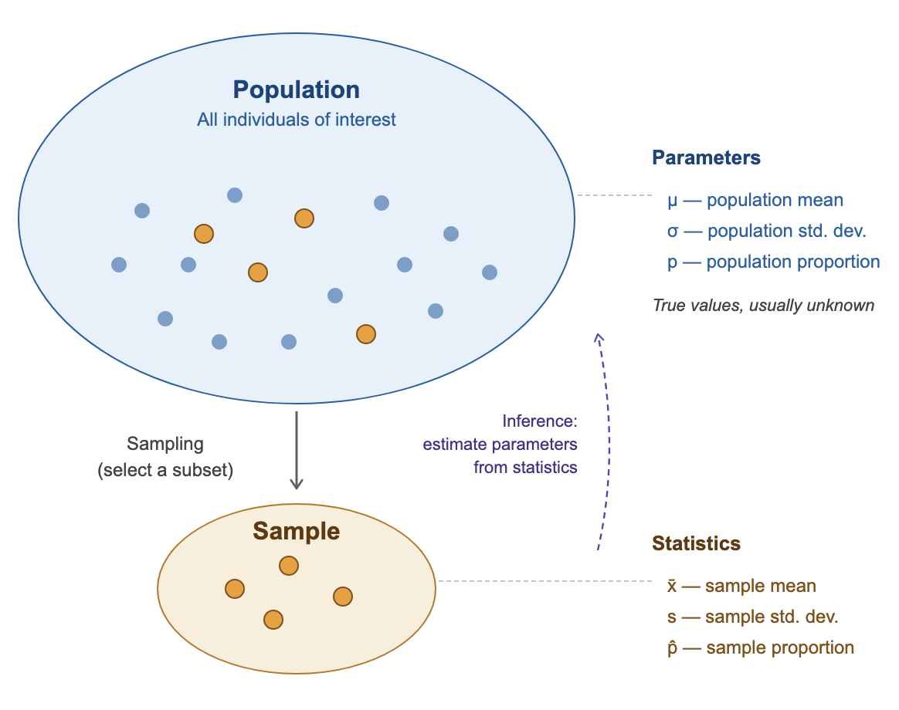
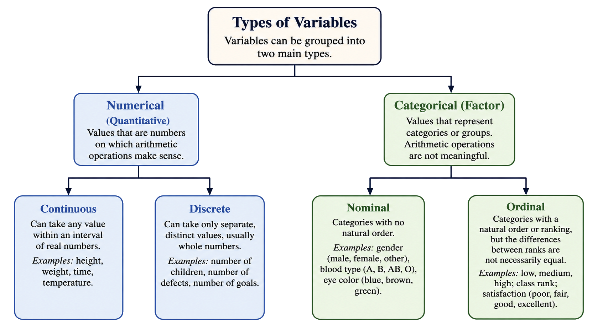
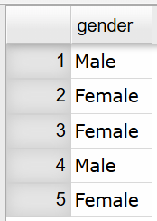
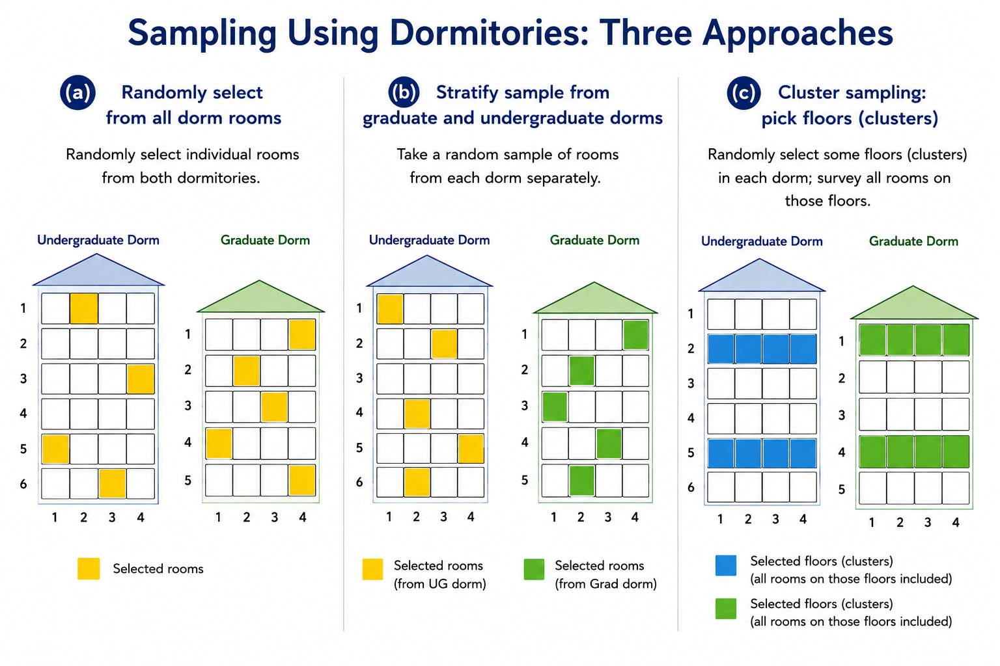

::: {.callout-note}
## Chapter 1 Objectives

By the end of Chapter 1, you should be able to:

-  Recognize and differentiate between key statistical terms.
-  Identify types of variables.
-  Differentiate between and apply various types of sampling techniques.
-  Recognize and differentiate between various types of observational studies and designed experiments.
-  Identify sources of errors and bias.

:::

**Before you begin, review the process for importing a dataset.** Click on the box below to expand the directions for importing a dataset into your Data Toolbox.

::: {#Importing-Data-to-Rguroo-Chapter-1 .callout-note appearance="simple" collapse="true" icon="none" title="{width=22px style='vertical-align:middle;'}  Importing Data to Rguroo"}
1.  Open the **Data** toolbox in Rguroo.\
2.  From the [Data Import]{.dpd} dropdown, select [Dataset Repository]{.fun}.\
3.  In the top search box, type [kozak]{.typein}, then select the [Statistics Using Technology – Kozak]{.repo} repository.\
4.  In the middle search box, type the first few letters of the dataset, and choose your dataset that appears in the lower panel.\
5.  Click the [Import]{.button}. The dataset will be imported into your Rguroo account.\
6.  Click the [Close]{.button} to close the dialog.\
7.  To view the dataset, double-click the dataset under the **Data** toolbox list.
:::

```{r setup, include=FALSE}
knitr::opts_chunk$set(echo = TRUE)
library("mosaic")
#library("latexpdf")
library("MASS")

```

You encounter statistics in many parts of everyday life. A sports fan follows player performance numbers, while someone interested in politics pays attention to polling data. Environmental advocates study measurements such as arsenic levels in local water or trends in global temperatures. In business, people track monthly sales or monitor product quality. In health fields, professionals examine the success rates of procedures or the percentage of a population affected by a disease. These are only a few of the many ways statistics appear across different areas of life. To develop the ability to gather data and interpret it effectively, it is essential to understand the nature of statistics and the fundamental concepts that define the field.

## What is Statistics?

**Statistics** is the study of how to collect, organize, analyze, and interpret data.

There are two main branches of statistics: descriptive and inferential. **Descriptive statistics** focuses on collecting, organizing, and summarizing data. **Inferential statistics** involves using that data to draw conclusions or make informed judgments about a larger group. Because inferential work depends on well‑organized information, we begin with descriptive statistics.

To learn how to create descriptive summaries and then use them to reach broader conclusions, you will need to understand several key terms. Many of these terms also appear in everyday language, but their meanings in statistics can differ slightly. It is important to pay attention to these distinctions and use the statistical definitions accurately.

### Key Statistical Concepts

A statistical study begins by identifying the **population**, the entire group of individuals, items, or objects a researcher wants to learn about. Because populations are often too large or difficult to measure directly, researchers collect data from a **sample**, a smaller subset selected from that population. The goal of sampling is to gather enough information to draw reliable conclusions about the population. Understanding how populations and samples relate is essential, because the quality of any statistical conclusion depends on how well the sample represents the population it was drawn from.

A **parameter** is a numerical measurement that describes a characteristic of the population. As mentioned, it can be difficult or impossible to collect information from the entire population. Therefore, the true value of a parameter is typically unknown and must be estimated from sample data. To do this, we use a numerical measurement from the sample, called a **statistic**. Parameters are usually labeled with letters mostly from the Greek alphabet, while statistics are typically labeled with letters from the Latin alphabet, with special symbols such as a bar or hat placed above the letter. Because different samples drawn from the same population will generally produce different values, a statistic varies from sample to sample and provides only an estimate of the true parameter value. 

```{r,echo=FALSE}
#| fig-alt: "Diagram showing the relationship between a population and a sample. A large blue oval labeled Population contains many small dots representing individuals, four of which are highlighted in orange. A downward arrow labeled Sampling (select a subset) points from the population to a smaller orange oval labeled Sample, which contains the same four highlighted dots. To the right, the population is associated with parameters (μ, σ, p), described as the true but usually unknown values. The sample is associated with statistics (x-bar, s, p-hat). A dashed upward arrow labeled Inference: estimate parameters from statistics curves from the sample back to the population."
#| warning: FALSE
#| label: fig-sample-pop
#| fig-cap: "Populations, Samples, Parameters, and Statistics"

```

A key concern in statistics is whether the sample accurately represents the population. Because a sample includes only part of the population, the statistics we compute from it will almost always differ from the true parameter values. These differences can arise by chance or from the way the sample was collected. A sample that does not represent the population well can give a misleading picture of the population. For this reason, much of statistics focuses on two things: selecting samples that represent the population as closely as possible and understanding the uncertainty that comes from working with only part of the population. 

In a sample, an **observation** is a single person, item, or object from which data are collected, and a **variable** is the specific piece of information recorded about each observation. For example, in a survey of students, each student is an observation, and variables might include age, grade level, or number of hours spent studying. In a study of cars, each car is an observation, while variables could be mileage, color, or fuel efficiency. In every statistical study, observations answer the “who,” or “what is being studied,” and variables answer the “what is being measured.”

Choosing which variables to collect depends on the goals of the study, the structure of the population, and the kinds of questions you hope to answer. The starting point is always the research question. The variables you collect must directly relate to what you want to measure, estimate, or compare about your population. These may include demographic characteristics, environmental conditions, or other measurable features that help to understand the population or draw conclusions. Practical constraints also matter when choosing variables. Some variables are easy to measure accurately, while others require significant time, equipment, or expertise.

### Types of Vairables and Datasets

There are two types of variables: categorical (also called qualitative) and numerical (also called quantitative). **Categorical variables** or **factors** describe qualities, categories, or labels rather than numerical amounts. Their values place observations into groups based on characteristics or attributes; for example, eye color, political party, or type of car. **Numerical variables** are numerical measurements that represent amounts or counts. Their values can be ordered, compared, and used in arithmetic operations, such as computing averages, for example, height, temperature, or number of siblings.

::: {.callout-note}
## Key Terms Summary

| Key Term | Definition|
|----|-----------|
|Population|The entire group of individuals, items, or objects that a study aims to learn about|
|Sample|A subset of the population from which data are collected |
|Parameter|A numerical value that describes a characteristic of the population |
|Statistic|A numerical value that describes a characteristic of the sample, used to estimate the parameter |
|Observation|A single individual item, or object from which data are collected |
|Variable|A characteristic of an observation that can take different values across observations |
|Categorical variable|A variable whose values place observations into groups or categories |
|Numerical variable|A variable whose values are numbers that represent amounts or counts|

:::

A **dataset** is built from the observations and variables you collect. In a well-organized dataset, each row represent a single observation, and each column represents a single variable. An example of a dataset that follows this structure is shown in @tbl-dataframe_example below.

```{r dataframe}
#| tbl-alt: "example of a clean dataset"
#| label: tbl-dataframe_example
#| tbl-cap: "Example of a Clean Dataset"
#| echo: FALSE
Sugar <- read.csv(
        "https://krkozak.github.io/MAT160/sugar.csv")
options(width = 60)
knitr::kable(head(Sugar))
```

@tbl-dataframe_example shows a dataset of breakfast cereals, where each row corresponds to a single cereal and each column is a variable that records a specific attribute, such as if it is made for children, nutritional measures (calories, sugar content, fiber, protein, sodium) or characteristics of the cereal (brand, cereal type, shelf placement, manufacturer).


::: {#exm-key-temrs-qualitative1}
## Identifying Key Terms for Categorical Variable

In 2010, the Pew Research Center surveyed 1500 adults in the U.S. to estimate the proportion of the population who favor the use of marijuana for medical purposes. The survey showed that 73% are in favor of using marijuana for medical purposes. Identify the population, sample, variable, observation, parameter, and statistic for this study. Also identify the type of variable.
:::

::: {.callout-tip .solution-callout collapse="true" icon=false}
## 🔎 Solution

Population: All U.S adults

Sample: 1500 U.S. adults

Variable: whether an adult favors medical marijuana use (the response to the question "should marijuana be used for medical purposes?")

Observation: an individual adult's response

Parameter: proportion of all U.S. adults who favor marijuana for medical purposes

Statistic: proportion of 1500 U.S. adults who favor marijuana for medical purposes

Type of variable: The variable is categorical because each person's response falls into one of two categories: yes, they are in favor of using marijuana for medical purposes, or no, they are not in favor.
:::

::: {#exm-key-temrs-qualitative2}
## Identifying Key Terms for Categorical Variable

A parking control officer records the manufacturer of every $5^{th}$ car in the college parking lot in order to determine which car manufacturer appears most frequently. identify the population, sample, variable, observation, parameter, and statistic. Also identify the type of variable.
:::

::: {.callout-tip .solution-callout collapse="true" icon=false}
## 🔎 Solution

Population: All cars in the college parking lot

Sample: Every $5^{th}$ car in the college parking lot

Variable: The car's manufacturer

Observation: The manufacturer of a car

Parameter: The proportion of all cars in the college parking lot that belong to each manufacturer

Statistic: The proportion of the cars sampled in the college parking lot that belong to each manufacturer

Type of variable: The variable is categorical because the manufacturer of a car is a label or category, such as Toyota, Ford, or Honda, rather than a numerical amount.
:::

::: {#exm-key-temrs-quantitative1}
## Identifying Key Terms for Numerical Variable

A biologist wants to estimate the average height of a specific type of plant that is given a new plant food. She gives 10 plants the new plant food and measures the plant height on day 50. Identify the population, sample, variable, observation, parameter, and statistic. Also identify the type of variable.
:::

::: {.callout-tip .solution-callout collapse="true" icon=false}
## 🔎 Solution

Population: All plants that could be given the new plant food

Sample: 10 plants that are given the new plant food

Variable: The height of the plant at 50 days

Observation: The height of a plant at 50 days

Parameter: Average height on day 50 of all plants when the new plant food is used

Statistic: Average height on day 50 of 10 plants when the new plant food is used

Type of variable: This is numerical data since you will be recording a height (numerical value).

:::

::: {#exm-key-temrs-quantitative2}
## Identifying Key Terms for Numerical Variable

A doctor wants to see if a new cancer treatment leads to longer survival times than the old treatment. She gives one group of 25 cancer patients the new treatment and another group of 25 the old treatment. She then measures the survival time of each of the patients. Identify the populations, samples, variables, observations, parameters, and statistics. Also identify the type of variable.
:::

::: {.callout-tip .solution-callout collapse="true" icon=false}
## 🔎 Solution

In this example, there are two groups that will be measured. That means we will need two groups for each key term.

Population 1: All cancer patients who receive the new treatment\
Population 2: All cancer patients who receive the old treatment

Sample 1: The 25 cancer patients in the study who receive the new treatment\
Sample 2: The 25 cancer patients in the study who receive the old treatment

Variable 1: Survival time of a cancer patient given the new treatment\
Variable 2: Survival time of a cancer patient given the old treatment

Observation 1: Each individual cancer patient's survival time given the new treatment\
Observation 2: Each individual cancer patient's survival time given the old treatment

Parameter 1: The mean survival time of all cancer patients given the new treatment\
Parameter 2: The mean survival time of all cancer patients given the old treatment

Statistic 1: The mean survival time of the 25 patients given the new treatment\
Statistic 2: The mean survival time of the 25 patients given the old treatment

Type of variable: This is numerical data since the doctor is recording survival time (numerical value).*
:::

Numerical variables can be further classified into two types: discrete and continuous. **Discrete variables** are numerical variables that take on countable, separate values; they are typically things that you count. For example, the number of students in a classroom; it can be 25 or 26, but not 25.3. **Continuous variables**, on the other hand, can take on any value within a range, including decimals and fractions; they are typically things you measure. For example, the height of a person could be any value, such as 165.4 cm or 172.85 cm.

::: {#exm-key-temrs-discrete-continuous}
## Determining if a Variable is Discrete or Continuous

Classify the numerical variable as discrete or continuous.

a.  The weight of a cat measured in pounds.

b.  The number of fleas on a cat.

c.  The size of a shoe as recorded from a standard set of sizes, such as 7, 7.5, etc.
:::

::: {.callout-tip .solution-callout collapse="true" icon=false}
## 🔎 Solution
a.  The weight of a cat in pounds is continuous since it is something you measure and can take on fractional values.

b.  The number of fleas on a cat is discrete since it is something you count.

c.  The size of a shoe is discrete since you can only be certain values, such as 7, 7.5, 8, 8.5, 9. You can't buy a 9.73 shoe.
:::

Categorical data (or factors) can also be classified into two types: nominal and ordinal. **Nominal** data are categorical data that are names or categories. There is no order and since the values are not numerical, you cannot perform any arithmetic on them. Examples of this are gender, car name, ethnicity, and race. **Ordinal** data are categorical data that you can arrange in a meaningful order, since one value is more or less than another value. You cannot do arithmetic on this data. Examples of this are grades (A, B, C, D, F), place value in a race (1st, 2nd, 3rd), and size of a drink (small, medium, large).

**Word of caution**: Sometimes ordinal data is displayed using numbers, such as 5 for “strongly agree”, and 1 for “strongly disagree”. These numbers do not represent true numerical quantities; they simply label ordered categories. Although the values have a ranking, the differences between them are not necessarily equal, so arithmetic operations (such as averaging) are not strictly meaningful. When working with numerical data, be sure the values represent actual measurements or counts, not codes assigned to categories.

```{r,echo=FALSE}
#| fig-alt: "A flowchart titled “Types of Variables” shows how variables are grouped into two main types: numerical (quantitative) and categorical (factor). Numerical variables are defined as values that are numbers and support arithmetic operations, and they are divided into continuous variables, which can take any value within an interval (examples: height, weight, time, temperature), and discrete variables, which take distinct values, often whole numbers (examples: number of children, defects, or goals). Categorical variables are defined as values representing groups where arithmetic is not meaningful, and they are divided into nominal variables, which have no natural order (examples: gender, blood type, eye color), and ordinal variables, which have a ranked order but unequal differences between ranks (examples: low, medium, high; class rank; satisfaction levels)."
#| warning: FALSE
#| label: fig-types-variables
#| fig-cap: "Types of Variables"

```

::: {#exm-key-temrs-variables}
## Identify Variable Type

State whether the variable is categorical or numerical. Then classify as nominal, ordinal, discrete, or continuous.

a.  Time of first class

b.  Hair color

c.  Number of siblings

d.  Age groupings (baby, toddler, adolescent, teenager, adult, elderly)
:::

::: {.callout-tip .solution-callout collapse="true" icon=false}
## 🔎 Solution
a.  Time of first class is *numerical data*, since it is a numerical value that can be measured. It is considered to be *continuous* because it can take any value within a given interval. For example, a class might start at exactly 8:00, 8:01, or even 8:00:30. Since it is not limited to separate, countable values, time classified as continuous, even if it is sometimes recorded in rounded units like minutes.

b.  Hair color is *categorical data* since it represents a characteristic. It is considered *nominal* since it is not a number, and there is no specific order for hair color.

c.  Number of siblings is *numerical data* since it involves numerical quantities that can be compared and used in calculations. It is considered *discrete* because the values are separate and distinct whole numbers, such as 0, 1, 2, or 3 siblings, and cannot include fractions or decimals (since you cannot have a partial sibling).

d.  Age groupings (such as baby, toddler, adolescent, teenager, adult, and elderly) is *categorical data*  because they represent groups rather than numerical values. These categories describe stages of life instead of exact ages, so arithmetic operations are not meaningful. It is considered *ordinal* because the categories follow a natural order from youngest to oldest.
:::

### Homework for Section 1.1

1.  Suppose you want to know how Arizona workers age 16 or older travel to work. To estimate the percentage of people who use the different modes of travel, you take a sample containing 500 Arizona workers aged 16 or older. State the observation, variable, population, sample, parameter, and statistic.

2.  You wish to estimate the mean cholesterol levels of patients two days after they had a heart attack. To estimate the mean you collect data from 28 heart patients. State the observation, variable, population, sample, parameter, and statistic.

3.  Print-O-Matic would like to estimate their mean salary of all employees. To accomplish this they collect the salary of 19 employees. State the observation, variable, population, sample, parameter, and statistic.

4.  To estimate the percentage of households in Connecticut which use fuel oil as a heating source, a researcher collects information from 1000 Connecticut households about what fuel is their heating source. State the observation, variable, population, sample, parameter, and statistic.

5.  The U.S. Census Bureau needs to estimate the median income of males in the U.S., they collect incomes from 2500 males. State the observation, variable, population, sample, parameter, and statistic.

6.  The U.S. Census Bureau needs to estimate the median income of females in the U.S., they collect incomes from 3500 females. State the observation, variable, population, sample, parameter, and statistic.

7.  Eyeglassmatic manufactures eyeglasses and they would like to know the percentage of each defect type made. They review 25,891 defects and classify each defect that is made. State the observation, variable, population, sample, parameter, and statistic.

8.  The World Health Organization wishes to estimate the mean density of people per square kilometer, they collect data on 56 countries. State the observation, variable, population, sample, parameter, and statistic

9.  State the type of variable (numerical, categorical, continuous, discrete) for each variable.

<!-- -->

a. Cholesterol level measured in milligrams per deciliter of blood

b. Type of car body defect, such as scratch, dent, discoloration, etc.

c. Time of your first meal

d. Opinion on a 5 point scale, with 5 being strongly agree and 1 being strongly disagree

<!-- -->

10. State the type of variable (numerical, categorical, continuous, discrete) for each variable.

<!-- -->

a.  Temperature in degrees Celsius

b.  Ice cream flavors available

c.  Pain levels on a scale from 1 to 10, 10 being the worst pain ever

d.  Mean salary of employees in dollars

## Sampling Methods

As we discussed before, if you want to learn something about a population, it is often impossible or impractical to examine the whole population. It might be too expensive in terms of time or money. In other cases, it might be impractical — you can’t test all batteries for their length of lifetime because there wouldn’t be any batteries left to sell. Instead, we collect data from a sample.  

The goal is for the sample to be similar to, and be representative of, the population. For example, if you want to test a new painkiller for adults, you would want the sample to include people who vary in characteristics such as body type, age, health status, and gender, so that the results can be generalized to the broader population. 

There are many different ways to collect a sample, and some methods are better than others at giving you a fairly accurate picture of the population. While no sampling method is perfect, good sampling techniques help minimize this limitation. It's important to remember that even when you do everything correctly, a sample might not be perfectly representative just by chance. For example, you could take a random sample from a group that has equal numbers of males and females, but just by chance, everyone selected could be female. If that happens, and if you have enough time and resources, it may be a good idea to take a new sample. There are many different sampling techniques, but we will focus on four main methods. 

### Simple Random Sample

The simplest type of sampling is a **simple random sample (SRS)**. A simple random sample is a sample in which every individual in the population has an equal chance of being selected. Selection is made completely by chance, so no person or object is favored over another. This can be done by drawing names out of a hat, using a random number table, or using statistical software (like Rguroo) to randomly select individuals from a list. Simple random samples are easy to understand, and because selection is based entirely on chance it helps reduce bias in the sampling process. 

However, chance alone doesn't guarantee perfect representation; just by random variation, the sample might not represent the population perfectly. This type of sample can also be hard to collect in practice. To ensure every individual has an equal chance of selection, you need a **sampling frame**, a complete list of everyone or everything in the population. A sampling frame can be difficult to obtain. For example, there's no complete list of all adults in the United States, or may not even be a complete list of people in a particular city.  On the other hand, if a university wants to do a survey of its students, it can use the official enrollment list as a sampling frame that is available to the university.

:::{#exm-srs}
# Taking a Simple Random Sample

You would like to sample 5 students out of a class of 30 (treating the students in the class as the population). Describe how you could take a simple random sample with and without technology.

:::

::: {.callout-tip .solution-callout collapse="true" icon=false}
## 🔎 Solution

With Technology: You could upload the class roster into Rguroo and use Rguroo to generate a random sample of 5 students.

Without Technology: You could write each student's name on a piece of paper and draw five names from a hat.

:::

When taking a sample, selections can be made with replacement or without replacement. Sampling **with replacement** means that each item selected is returned to the population before the next selection, so the same item can be chosen more than once. In contrast, sampling **without replacement** means that once an item is selected, it is not returned to the population, so it cannot be chosen again. In practice, most real‑world sampling is done without replacement, especially when sampling from a finite population. For example, if you're surveying 50 students from a class, once you've interviewed a student, you wouldn't interview them again. Sampling with replacement is less common in real surveys, but it is often used in theoretical probability problems (we will discuss this in Chapter 4) or when running computer simulations

When using statistical software to select a random sample, you might notice something unexpected: if you run the selection process multiple times, you get different results each time. This makes sense for randomness, but it can create a problem if you're writing a report or doing a homework assignment. You want to be able to get the same sample again so your results are reproducible. This is where a seed becomes useful. Statistical software use a **seed** so that random results can be reproduced consistently. Although computers generate numbers that appear random, they use mathematical formulas called pseudo‑random number generators, which follow a specific sequence. The seed tells the software where to start in that sequence. When the same seed is used, the software follows the same steps and produces the same random results every time.

::: {#exm-srs-with-Rguroo}
## Taking a Simple Random Sample 

Data was collected for two semesters in a statistics class on students’ transportation, demographics, living expenses, preferences, and academic majors.  Take a simple random sample of size 5 without replacement and record the variable [gender]{.var}. Use a seed of 35. Then, repeat the process with a seed of 106.

 The dataset for this example is available in the Rguroo dataset repository [Kozak]{.repo}, with the dataset name [class_survey1]{.data}. @tbl-Class shows the variables and the first 6 rows of the data set. A complete description of the variables is provided in the [dataset code book](#code-book-class) that follows.

:::

```{r class-data1-table,echo=FALSE}
#| tbl-alt: "Table showing first 6 rows of statistics class survey dataset"
#| label: tbl-Class
#| tbl-cap: "Class Survey"
Class <- read.csv("https://krkozak.github.io/MAT160/class_survey.csv")
knitr::kable(head(Class))
```

::: {#code-book-class .callout-tip .codebook collapse="true"}
## Code book for Class Survey1 Dataset

**Description** The dataset gives survey results from two semesters of statistics classes at Coconino Community College in the years 2018-2019.

Format

This dataset contains the following columns:

[vehicle]{.var}: Type of car a student drives

[gender]{.var}: Self-declared gender of a student

[distance_campus]{.var}: How far a student lives from the Lone Tree Campus of Coconino Community College (miles)

[ice_cream]{.var}: Favorite ice cream flavor

[rent]{.var}: How much a student pays in rent

[major]{.var}: Students declared major

[height]{.var}: Height of the student (inches)

[winter]{.var}: Student's opinion of winter (Love it, Like it, Don't like, No opinion)

Source

Kozak K (2019). Survey results form surveys collected in statistics class at Coconino Community College.

References

Kozak, 2019

:::

::: {.callout-tip .solution-callout collapse="true" icon=false}
## 🔎 Solution

To take a simple random sample using Rguroo, we first need to identify which column our variable [gender]{.var} is in.  To do this, open your **Data** toolbox in the left menu in Rguroo.  Find the dataset [class_survey1]{.data} and double click on it.  The dataset will appear in the main screen of Rguroo. When looking at the [class_survey1]{.data} dataset, [gender]{.var} is in the second column.  Keep this in mind when we generate a simple random sample.

Click to expand the box below to see how to take a simple random sample of size 5 for [gender]{.var} type.

:::: {#Creating-SRS-in-Rguroo .callout-note appearance="simple" collapse="true" icon="none" title="{width=22px style='vertical-align:middle;'} Taking a Simple Random Sample in Rguroo"}

**Before you begin:** Make sure you have already imported the [class_survey1]{.data} dataset into your Rguroo account, as was shown [here](#Importing-Data-to-Rguroo-Chapter-1).

1. Open the **Probability-Simulation** toolbox in Rguroo.  
2. Open the [Probability]{.dpd} dropdown, and select [Random Selection]{.fun}. This opens the Random Selection dialog.  
3. In the Random Selection dialog, choose the [class_survey1]{.data} dataset from the [Dataset]{.dpd} dropdown.  
4. Enter the information for sample size [5]{.typein} and seed [35]{.typein}.
5. Select without replacement (since the directions stated without replacement).
6. In the columns box, enter [2]{.typein} (since the variable [gender]{.var} was in column 2).    
7. Click the preview icon  to see the simple random sample.

::: {.callout-tip .inner-callout appearance="simple" collapse="true" icon="none" title="Click here to see the Rguroo dialog"}

{width=500px}

:::

::::

When you click on the preview button, Rguroo outputs the following sample.

```{r,echo=FALSE}
#| fig-alt: "Rguroo output of simple random sample of size 5 for gender, yielding 3 males and 2 females"
#| warning: FALSE
#| label: fig-srs-gender
#| fig-cap: "Rguroo Output of Simple Random Sample (seed 35)"
knitr::include_graphics(
  "Rguroo_outputs/Statistical_Basics/srs_gender.png"
)
```

@fig-srs-gender shows the simple random sample of five individuals' genders from the [class_survey1]{.data} dataset, using a seed of 35. These individuals were selected randomly from the dataset, meaning the selection process did not favor any particular group. Because the selection was random, the sample itself is unbiased; however, it may or may not be representative of the full dataset. The original dataset contains 16 females and 11 males. In this sample, there are 3 males and 2 females, while the population has more females than males overall. Since the sample size is small, it does not closely reflect the gender distribution of the population, which could lead to less accurate conclusions about gender. With a larger simple random sample, the proportions of males and females would be more likely to resemble those of the entire dataset.

Repeating the process with a seed of 106, we get the following sample.

```{r,echo=FALSE}
#| fig-alt: "Rguroo output of simple random sample of size 5 for gender, yielding 2 males and 3 females"
#| warning: FALSE
#| label: fig-srs-gender2
#| fig-cap: "Rguroo Output of Simple Random Sample (seed 106)"

```

Notice that the sample (using a seed of 106) is different, resulting in 2 males and 3 females. When choosing a seed, there is no right or wrong. We choose a seed depending on our goal. If we want reproducible results, we pick and fix a specific seed so that the same “random” outcomes can be repeated exactly. If we want true variability, we allow the seed to be random, so each run produces different results.

:::

### Stratified Sample 

A **stratified sample** is collected by first dividing the population into groups, called **strata**, based on a shared characteristic such as gender, age, or grade level. Then, a random sample is taken from each group. This method ensures that all important groups in the population are represented in the sample. Stratified sampling is especially useful when groups differ in meaningful ways and when accurate representation of those groups is important. As a result, stratified samples often produce more accurate and reliable results than simple random samples. For example, if a school has freshmen, sophomores, juniors, and seniors, you could randomly sample students from each grade (a stratified sample) instead of sampling from the entire school (a simple random sample). This approach ensures that all grade levels are represented in the sample.

:::{#exm-stratified-simple}
# Taking a Stratified Sample

Use the [class_survey1]{.data} dataset to take a stratified sample of size 5 of [vehicle]{.var} using [gender]{.var} as the strata. Use a seed of 35 and take the sample without replacement.

 The dataset for this example is available in the Rguroo dataset repository [Kozak]{.repo}, with the dataset name [class_survey1]{.data}. @tbl-Class shows the variables and the first 6 rows of the data set. A complete description of the variables is provided in the [dataset code book](#code-book-class).

:::

::: {.callout-tip .solution-callout collapse="true" icon=false}
## 🔎 Solution

Just as we did in the last example, we need to know what column the variable [vehicle]{.var} is in.  When looking at the dataset, we see that [vehicle]{.var} is in column 1.  Another thing that we noticed from the simple random sample, is that the proportion of males and females selected in our sample was not representative of the dataset.  When conducting a stratified sample, Rguroo has an option to make the stratified sample proportional to the strata.  This means that when we take our sample of size 5, Rguroo will ensure that a proportional number of males and females are chosen.

Click to expand the box below see how to take a proportional stratified sample of size 5 for [vehicle]{.var} using [gender]{.var} as the strata.

:::: {#Creating-stratified-in-Rguroo .callout-note appearance="simple" collapse="true" icon="none" title="{width=22px style='vertical-align:middle;'} Taking a Stratified Sample in Rguroo"}

**Before you begin:** Make sure you have already imported the [class_survey1]{.data} dataset into your Rguroo account, as was shown [here](#Importing-Data-to-Rguroo-Chapter-1).

1. Open the **Probability-Simulation** toolbox in Rguroo.  
2. Open the [Probability]{.dpd} dropdown, and select [Random Selection]{.fun}. This opens the [Random Selection]{.dialog} dialog.  
3. In the [Random Selection]{.dialog}, choose the [class_survey1]{.data} dataset from the [Dataset]{.dpd} dropdown.  
4. Enter the information for sample size [5]{.typein} and seed [35]{.typein}.
5. Select [Replace -> Without]{.des} since the directions stated without replacement.
6. In the **Stratified Sample** section, select [gender]{.var} from the [Stratify by]{.dpd} and select proportional from the [Method]{.dpd}.
7. In the columns box, enter 1 (since the variable [vehicle]{.var} was in column 1).    
8. Click the preview icon  to see the simple random sample.

::: {.callout-tip .inner-callout appearance="simple" collapse="true" icon="none" title="Click here to see the Rguroo dialog"}

{width=500px}

:::

::::

When you click on the preview button, Rguroo outputs the following sample.

```{r,echo=FALSE}
#| fig-alt: "Rguroo output of stratified sample of size 5 for vehicle, straified by gender"
#| warning: FALSE
#| label: fig-strat-gender-vehicle
#| fig-cap: "Rguroo Output of Stratified Sample"
knitr::include_graphics(
  "Rguroo_outputs/Statistical_Basics/stratified_gender_vehicle.png"
)
```

The resulting sample of vehicles is Dodge, Ford, Honda, Jeep, and Chevrolet. Notice that Rguroo selected 3 female and 2 male students, keeping with the dataset's proportionality of females to males. This strategy to select proportional genders makes the sample more representative of the dataset.

:::

### Cluster Sample

A **cluster sample** is a sampling method in which the population is divided into naturally occurring groups, called **clusters**, and a random sample of those clusters is selected. Then, all individuals within the selected clusters are included in the sample. Clusters are often based on location, such as schools, city blocks, or neighborhoods, but they do not have to be geographic. Cluster sampling is commonly used because it is practical and cost‑effective, especially when the population is large or spread out. This method is often effective if the variation within a cluster is representative of the variation in the population. 

However, if the selected clusters are not representative of the population, the results may be biased. For example, suppose a district wants to study student performance and selects a few schools as clusters. If each selected school has a mix of high- and low-performing students similar to the entire district, the sample can work well. However, if the selected schools are all high-performing schools, the results will likely overestimate student performance for the district. 

:::{#exm-cluster}
# Taking a Cluster Sample

Los Angeles county wants to estimate the average price of 87 octane gasoline. Surveying every gas station is too expensive, so the county decides to use a cluster sample.

a. Describe how a cluster sample could be designed for this situation.

b. Explain why this is a cluster sample, and describe any limitations of using this sampling method.

:::

::: {.callout-tip .solution-callout collapse="true" icon=false}
## 🔎 Solution

a. Los Angeles County would divide the population into naturally occurring groups, such as cities (see city map in @fig-map-LA below). These city groups serve as the clusters. The county would then randomly select a sample of these cities and all gas stations within those cities would be visited and the gas prices for 87 octane would be recorded.

```{r,echo=FALSE}
#| fig-alt: "Map of LA County divided by neighborhood"
#| warning: FALSE
#| label: fig-map-LA
#| fig-cap: "Map of LA County by Neighborhood"
knitr::include_graphics(
  "Rguroo_outputs/Statistical_Basics/la_county_map.jpg"
)
```

b. This is a cluster sample because the county randomly selects entire cities (clusters) and includes every gas station within those selected cities, rather than sampling gas stations from across all cities.

   A key limitation of cluster sampling is that the selected cities may not be representative of the entire county. For example, some cities may have higher prices (such as next to a freeway or the ocean), which could bias the results. 
:::

Stratified sampling and cluster sampling can often be confused. In stratified sampling, we divide the population into groups and take a random sample from each group. In cluster sampling, we divide the population into groups, randomly select some of those groups, and survey **all** the members in each group. 

@fig-sampling-compared compares simple random, stratified, and cluster samples using college dormitories. Part (a) illustrates a simple random sample by selecting individual rooms scattered across both dorms. Part (b) illustrates a stratified sample by separately sampling rooms from each dorm type. Part (c) illustrates a cluster sample depicted by selecting entire floors within each dorm, and then all rooms are selected.

```{r,echo=FALSE}
#| fig-alt: "A three-part diagram titled Sampling Using Dormitories: Three Approaches compares different sampling methods using illustrations of an undergraduate dorm and a graduate dorm, each shown as multi-floor buildings with rooms arranged in grids.In part (a), simple random sampling is shown by selecting individual rooms scattered across both dorms, highlighted in yellow, indicating that rooms are chosen randomly from all available rooms.In part (b), stratified sampling is illustrated by separately sampling rooms from each dorm type. Selected undergraduate dorm rooms are highlighted in yellow, while selected graduate dorm rooms are highlighted in green, showing that random samples are taken within each group.In part (c), cluster sampling is depicted by selecting entire floors within each dorm. Chosen floors in the undergraduate dorm are shaded blue and chosen floors in the graduate dorm are shaded green, indicating that all rooms on those selected floors are included in the sample."
#| warning: FALSE
#| label: fig-sampling-compared
#| fig-cap: "Sampling Methods Compared"

```

### Systematic Sample

A **systematic sample** is a sampling method where individuals are selected by choosing a random starting point and then selecting every $k^{th}$ individual from the population, where $k$ is a fixed interval. For example, after randomly selecting a starting position, every $10^{th}$ individual on a list might be chosen. This method is easy to use and works well in situations such as assembly lines or ordered lists, where waiting to sample until the end would be inefficient. For example, if you were manufacturing life vests, you often would not want to wait until all vests are manufactured before taking a sample and discovering there is a defect.  Instead, the company might sample every $20^{th}$ life vest as they are being made. This allows quality issues to be identified and fixed quickly, saving time, money, and materials, and helping ensure that the final products meet quality standards. 

To conduct a systematic sample, we first find $k$ by computing $N/n$, where $N$ is the population size (or approximate population size) and $n$ is the desired sample size.  If you get a decimal when dividing, round down to the nearest whole number. Then, we pick a random starting place between 1 and $k$.

:::{#exm-systematic-simple}
# Taking a Systematic Sample

The school library wants to survey its visitors to estimate how many hours per week they spend reading. On a particular day, approximately 300 people enter the library, and the librarian wants a sample of 30 visitors. Describe how a systematic sample could be taken.

:::

::: {.callout-tip .solution-callout collapse="true" icon=false}
## 🔎 Solution

To create a systematic sample, the librarian would first calculate the sampling interval by dividing the population size by the desired sample size: $300/30=10$. Next, the librarian would randomly select a starting number between 1 and 10, for example 4. The librarian would then survey every $10^{th}$ visitor entering the library, starting with the $4^{th}$ visitor (4th, 14th, 24th, and so on) until 30 visitors are surveyed.

:::

:::{#exm-systematic-technology}
# Taking a Systematic Sample

Use the [class_survey1]{.data} dataset to take a systematic sample of size 5 and record [gender]{.var}. Use a seed of 103.

 The dataset for this example is available in the Rguroo dataset repository [Kozak]{.repo}, with the dataset name [class_survey1]{.data}. @tbl-Class shows the variables and the first 6 rows of the data set. A complete description of the variables is provided in the [dataset code book](#code-book-class).

:::

::: {.callout-tip .solution-callout collapse="true" icon=false}
## 🔎 Solution

First, we need to determine $k$, $N/n$.  For this dataset, there are 27 students in the dataset.  We will use this as the population.  Next divide, $N/n = 27/5 = 5.4$. Since we can't count by 5.4 people, round down to the nearest whole number which is 5.  So, $k = 5$. Now, we need the starting place which is a random number between 1 and 5 (we will use the random number generator in Rguroo).

:::: {#Creating-systematic-in-Rguroo .callout-note appearance="simple" collapse="true" icon="none" title="{width=22px style='vertical-align:middle;'} Choosing Random Starting Value in Rguroo"}

**Before you begin:** Make sure you have already imported the [class_survey1]{.data} dataset into your Rguroo account, as was shown [here](#Importing-Data-to-Rguroo-Chapter-1).

1. Open the **Probability-Simulation** toolbox in Rguroo.  
2. Open the [Probability]{.dpd} dropdown, and select [Random Generator]{.fun}. This opens the [Random Number Generator]{.dialog} dialog.  
3. In the [Random Number Generator]{.dialog} dialog, choose the [Discrete Uniform]{.fun} distribution from the [Distribution]{.dpd} dropdown.  
4. Enter [1]{.typein} for the min and $k$ for the max (in this case 5).
5. Enter [1]{.typein} for the sample size (we only need one starting number).
6. Enter the seed [103]{.typein}.   
7. Click the preview icon  to see the starting value.

::: {.callout-tip .inner-callout appearance="simple" collapse="true" icon="none" title="Click here to see the Rguroo dialog"}

{width=500px}

:::

::::

When you click on the preview button, Rguroo outputs the following sample.

```{r,echo=FALSE}
#| fig-alt: "Rguroo output of random number between 1 and 5"
#| warning: FALSE
#| label: fig-systematic
#| fig-cap: "Rguroo Output of Random Number Between 1 and 5"
knitr::include_graphics(
  "Rguroo_outputs/Statistical_Basics/systematic_starting_number.png"
)
```

This means that we will start with student number 4 and select every $5^{th}$ student after that until we select 5 students. So, our sample students would be student 4, 9, 14, 19, and 24.  To find the genders, we need to open the dataset and look at the genders for these students.  Our sample would be Female, Male, Female, Female, Female.  Notice that this sample is not representative of the dataset since the sample is based on the order of how the data was inputted.

:::

### Convenience Sample

One last type of sample that is sometimes conducted is called a **convenience sample**. In a convenience sample, individuals are selected based on how easy they are to reach. For example,  a researcher might ask people who they know or people who are easy to get ahold of. While this method is simple and quick, it often does not produce a representative sample of the population and can lead to biased results. 

::: {.callout-note}
## Sampling Method Summary

|Sampling Method|Description|
|--------|-----------------------|
|Simple Random|Each individual or item has the same chance of being selected from the population|
|Stratified|Divide the population into groups (strata) based on characteristics and randomly sample from each group|
|Cluster|Divide the population into groups (clusters) usually based on location, randomly select groups and sample all subjects within the selected groups|
|Systematic|Select individuals at regular intervals from an ordered list after a random starting point|
|Convenience|Include individuals who are easiest to reach - Quick but often biased|

:::

On a rare occasion, you may want to collect data from the entire population. In this case you conduct a census. A **census** is a process in which every individual in the population is measured.  For example, the U.S. Census attempts to count every person living in the United States.

:::{#exm-type-of-sample}
## Identify the Sampling Type

Banner Health is a several state nonprofit chain of hospitals. Management wants to assess the incident of complications after surgery. They wish to use a sample of surgery patients. Several sampling techniques are described below. Categorize each technique as simple random sample, stratified sample, systematic sample, cluster sample, or convenience sampling.

a.  Obtain a list of patients who had surgery at all Banner Health facilities. Divide the patients according to type of surgery. Draw simple random samples from each group.

b.  Obtain a list of patients who had surgery at all Banner Health facilities. Number these patients, and then use a random number table to obtain the sample.

c.  Randomly select some Banner Health facilities from each of the seven states, and then include all the patients on the surgery lists of the states.

d.  At the beginning of the year, instruct each Banner Health facility to record any complications from every $100^{th}$ surgery.

e.  Instruct each Banner Health facilities to record any complications from 20 surgeries this week and send in the results.

:::

::: {.callout-tip .solution-callout collapse="true" icon=false}
## 🔎 Solution

a.  This is a stratified sample since the patients were separated into different strata (type of surgery a patient had) and then random samples were taken from each stratum. The problem with this is that some types of surgeries may have more chances for complications than others. Of course, the stratified sample would show you this.

b.  This is a random sample since each patient has the same chance of being chosen.  The problem with this is that you could have selected hospitals by chance that have no complications, or you might miss patterns that exist in unselected hospitals. 

c. This is a cluster sample since all patients are questioned in each of the selected hospitals, which serve as the clusters. The problem with this is that you could have selected hospitals by chance that have no complications, or you might miss patterns that exist in unselected hospitals.

d.  This is a systematic sample since they selected every $100^{th}$ surgery. The problem with this is that if there's any pattern in when complications occur (for example, complications related to day of the week, time of day, or surgeon schedules), a systematic sample might miss it entirely. Instruct each Banner Health facility to record any complications from 20 surgeries this week and send in the results. 

e.  This is a convenience sample since they left it up to the facility how to do it. The problem with convenience samples is that the person collecting the data will probably collect data from surgeries that had no complications.

:::

### Homework for Section 1.2

1.  Researchers want to collect cholesterol levels of U.S. patients who had a heart attack two days prior. The following are different sampling techniques that the researcher could use. Classify each as simple random sample, stratified sample, systematic sample, cluster sample, or convenience sample.

    a.  The researchers randomly select 5 hospitals in the U.S. then measure the cholesterol levels of all the heart attack patients in each of those hospitals.
    b.  The researchers list all of the heart attack patients and measure the cholesterol level of every $25^{th}$ person on the list.
    c.  The researchers go to one hospital on a given day and measure the cholesterol level of the heart attack patients at that time.
    d.  The researchers list all of the heart attack patients. They then measure the cholesterol levels of randomly selected patients.
    e.  The researchers divide the heart attack patients based on race, and then measure the cholesterol levels of randomly selected patients in each race grouping.

2.  The quality control officer at a manufacturing plant needs to determine what percentage of items in a batch are defective. The following are different sampling techniques that could be used by the officer. Classify each as simple random sample, stratified sample, systematic sample, cluster sample, or convenience sample.

<!-- -->

a.  The officer lists all of the batches in a given month. The number of defective items is counted in randomly selected batches.

b.  The officer takes the first 10 batches produced this month and counts the number of defective items.

c.  The officer groups the batches made in a month into which shift they are made. The number of defective items is counted in randomly selected batches in each shift.

d.  The officer chooses every $15^{th}$ batch off the production line and counts the number of defective items in each chosen batch.

e. The officer divides the batches made in a month into which day they were made. Then certain days are picked and every batch made that day is counted to determine the number of defective items.

3.  You wish to determine the GPA of students at your school. Describe what process you would go through to collect a sample if you use a simple random sample.

4.  You wish to determine the GPA of students at your school. Describe what process you would go through to collect a sample if you use a stratified sample.

5.  You wish to determine the GPA of students at your school. Describe what process you would go through to collect a sample if you use a systematic sample.

6.  You wish to determine the GPA of students at your school. Describe what process you would go through to collect a sample if you use a cluster sample.

7.  You wish to determine the GPA of students at your school. Describe what process you would go through to collect a sample if you use a convenience sample.

8. Data was collected for two semesters in a statistics class drive. Use Rguroo to take a simple random sample of size 7 and record the variable [major]{.var}. Use a seed of 29. The first six rows of the dataset are in @tbl-Class.

::: {tabindex="0" style="width:85%; margin:auto;"}
 The dataset for this exercise is available in the Rguroo dataset repository [Kozak]{.repo}, with the dataset name [class_survey1]{.data}.
:::

**Code book for Dataset Class Survey is below @tbl-Class**

9. Data was collected from the Chronicle of Higher Education for tuition from public four-year colleges, private four-year colleges, and for-profit four-year colleges. The first 6 rows of the dataset is in @tbl-Tuition. Using [type]{.var} of institution as your cluster, use Rguroo to take a cluster sample of [INSTATE_TUTION]{.var} (sample size of 10). Use a seed of 47.

::: {tabindex="0" style="width:85%; margin:auto;"}
 The dataset for this example is available in the Rguroo dataset repository [Kozak]{.repo}, with the dataset name [tuition_4_year]{.data}. The first six rows of the dataset are in @tbl-Tuition. A complete description of the variables is provided in the [dataset code book](#code-book-tuition) that follows.
:::


```{r tuition-table,echo=FALSE}
#| tbl-alt: "Table showing first 6 rows of Tuition dataset with difference column added"
#| warning: FALSE
#| label: tbl-Tuition
#| tbl-cap: "Head of Tuition Dataset"
Tuition <- read.csv("https://krkozak.github.io/MAT160/Tuition_4_year.csv")
knitr::kable(head(Tuition))
```


::: {#code-book-tuition .callout-tip .codebook collapse="true"}
## Code book for Tuition Dataset

**Description** Cost of four year institutions.

Format

This dataset contains the following columns:

[INSTITUTION]{.var}: Name of four-year institution

[TYPE]{.var}: Type of four-year institution, Public_4_year, Private_4_year, For_profit_4_year.

[STATE]{.var}: What state the institution resides

[ROOM_BOARD]{.var}: The cost of room and board at the institution (\\\$)

[INSTATE_TUTION]{.var}: The cost of instate tuition (\\\$)

[INSTATE_TOTAL]{.var}: The cost of room and board and instate tuition (\\\$ per year)

[OUTOFSTATE_TUTION]{.var}: The cost of out of state tuition (\\\$ per year)

[OUTOFSTATE_TOTAL]{.var}: The cost of room and board and out of state tuition (\\\$ per year)

Source Tuition and Fees, 1998-99 Through 2018-19. (2018, December 31). Retrieved from https://www.chronicle.com/interactives/tuition-and-fees

References Chronicle of Higher Education \*, December 31, 2018.

:::


## Observational Study and Experimental Design

This section provides an introduction to observational studies and experimental design—how to plan experiments or surveys so that the resulting conclusions are statistically sound. Because experimental design is a complex and detailed process, this section offers only a brief overview of the key ideas and best practices.

There are two main types of statistical studies: observational studies and experiments. In an **observational study**, the researcher collects data by observing or asking questions. No variables are manipulated or controlled; it is a hands-off approach.  Observational studies do not allow you to establish a cause and effect relationship. In a **designed experiment**, the researcher applies a treatment to individuals and attempts to isolate the effects of the treatment. Unlike observational studies, well-designed experiments can establish cause-and-effect relationships.

:::{#exm-observational-experiment}
## Identifying the Type of Study

Determine whether each scenario describes an observational study or a designed experiment. Explain your reasoning.

a. Researchers survey adults to record how many hours they sleep per night and compare this with their reported stress levels.

b. Some patients with high cholesterol are randomly assigned to take a new medication, while others are given a placebo. After six months, cholesterol levels are compared.

c. A school administrator examines past attendance records and compares graduation rates between students who missed more than 20 days and those who missed fewer than 20 days.

d. A farmer applies two different fertilizers to randomly selected plots of land to determine which produces a higher crop yield.

:::

::: {.callout-tip .solution-callout collapse="true" icon=false}
## 🔎 Solution

a. This is an observational study. The researchers are only collecting survey data and are not assigning any treatment or changing any variables.

b. This is a designed experiment. The researchers deliberately assign a treatment (the new medication) and use a placebo group to study its effect.

c. This is an observational study. The administrator is using existing records and observing relationships without imposing a treatment.

d. This is a designed experiment. The farmer actively applies different fertilizers (treatments) and compares the outcomes.

:::


### Observational Studies

Observational studies are research studies in which the investigator observes and collects data without manipulating variables, and they are commonly classified into three types. A **cross-sectional study** collects data from a population at a single point in time (or over a short period of time), providing a snapshot of characteristics or behaviors as they currently exist. A **case-control**, also known as a **retrospective study**, looks backward in time by using past records, interviews, or historical data to examine relationships between variables and outcomes that have already occurred. A **cohort study**, also called a **longitudinal or prospective study**, follows individuals or groups into the future, collecting data at multiple points to observe how certain factors influence outcomes as they develop. Many observational studies collect data through surveys, which are sets of questions designed to gather information. Survey questions must be carefully written to avoid introducing bias.

::: {.callout-note}
## Observational Study Summary

|Observational Study|Description|
|--------|-----------------------|
|Cross-sectional|Collects data at a single point in time (or over a short period of time)|
|Case-Control (retrospective)|Uses data collected in the past (records, interviews, historical data, etc.)|
|Cohort (longitudinal or prospective)|Follows subjects over a longer period of time, collecting data at multiple points|

:::

:::{#exm-observational-study-types}
## Identify Type of Observational Study

For each situation below, identify whether the study is cross-sectional, retrospective (case-control), or prospective (longitudinal/cohort).

a. A public health researcher surveys a group of adults in 2026 and records their current exercise habits and blood pressure levels.

b. Researchers use hospital records from the past 15 years to compare patients who developed heart disease with those who did not, focusing on their smoking history.

c. A group of college freshmen is followed for four years, and their academic performance is recorded at the end of each year.

d. Scientists study census data collected in 2020 to examine the relationship between income level and residential location.

:::

::: {.callout-tip .solution-callout collapse="true" icon=false}
## 🔎 Solution

a. This is a cross-sectional study. The data are collected at a single point in time to examine current characteristics of the subjects.

b. This is a retrospective (case-control) study. The researchers look backward in time using existing records to study factors related to an outcome that has already occurred.

c. This is a prospective (longitudinal or cohort) study. The researchers follow a group forward in time and record data as events occur.

d. This is a retrospective study. The data were collected in the past and are now being analyzed to explore relationships among variables.

:::

### Experiment Designs

Before looking at different ways experiments can be designed, it helps to understand the key components they all have in common. An experiment includes **treatments** (the specific conditions or actions applied to subjects), an **explanatory variable** (what the researcher changes or compares), and a **response variable** (the outcome that is measured to see the effect). The most common types of experimental designs are described below.

**Completely Randomized Experiment**: In this type of experiment, subjects are randomly assigned to two (or more) treatment groups. In a two-group design, both groups may receive different treatments, or one group receives the new treatment while the other receives either a  **placebo** (a fake treatment with no active ingredient - like a sugar pill) or standard (not new) treatment. The group receiving either the standard, no treatment or a placebo is called the **control group**. The group receiving the treatment is called the **treatment group**.  

The idea of a placebo is that a person believes they are receiving a treatment, but in reality, they are receiving a sugar pill or another fake treatment. This helps to account for the placebo effect, which occurs when a person’s body responds to a treatment simply because they believe they are taking the treatment even though they are not. Note that; not every experiment requires a placebo, such as studies involving animals or plants. Additionally, a placebo is not always appropriate. For example, when testing a new blood pressure medication, it would be unethical to give a person with high blood pressure a placebo or no treatment. 

**Randomized Block Design**: A block is a group of subjects that are similar in some important way, while different blocks differ from each other. Then, treatments are randomly assigned to subjects within each block. For example, suppose we separate students into full-time and part-time groups. Within each group, we randomly assign some students to receive the treatment and others not to receive the treatment (the control group). This way, each type of student is represented in both the treatment and control groups.

**Matched Pairs Design**: The treatments are applied to pairs of subjects that are matched in some meaningful way. In some cases, the same subject is used for both treatments. For example, to measure the effectiveness of a muscle relaxer cream, the cream could be applied to one arm, while the other arm serves as a comparison. Then, the results are compared for each individual. Other examples include before and after experiments, such as measuring weight before and after a diet, or matching two different individuals with similar characteristics (like twins).

::: {.callout-note}
## Experimental Design Summary

|Experimental Design|Description|
|--------|-----------------------|
|Completely Randomized|All subjects are randomly assigned to treatment groups|
|Randomized Block|Subjects are first grouped into similar blocks based on a characteristic, then treatments are randomly assigned within each block|
|Matched-Pairs|Subjects are paired based on similarity or measured under two conditions, and treatments are compared within each pair|

:::

No matter which experiment type you conduct, you should also consider the following:

**Replication**: Replication means applying the treatment to more than one subject. This ensures that the sample size is large enough to distinguish true effects from random variation. It also allows other researchers to repeat the experiment and check whether similar results are obtained. 

**Blind study**: In a blind study, the subject does not know which treatment they are receiving or whether they are receiving the treatment or a placebo. 

**Double-blind study**: In a double-blind study, neither the subject nor the researcher knows who is receiving which treatment or who is receiving the placebo. This helps prevent bias from influencing the results. 

:::{#exm-type-of-experiment}
## Identifying the Type of Experiment

For each scenario, identify the experimental design being used. Briefly explain your choice.

a. A researcher measures participants’ resting heart rates before they begin a new exercise program. After eight weeks on the program, the resting heart rates are measured again and compared to the original measurements.

b. Patients are separated into age groups (under 40 and 40 or older). Within each age group, patients are randomly assigned to receive either a new medication or the standard medication.

c. Participants are carefully selected so that both treatment groups contain subjects of similar age, gender, lifestyle, and health history before given different treatments.

d. Study volunteers are randomly assigned to receive either a new diet plan or no diet plan at all. The weight loss of the two groups is then compared after three months.

:::

::: {.callout-tip .solution-callout collapse="true" icon=false}
## 🔎 Solution

a. This is a matched pairs design. Each participant acts as their own match, with measurements taken before and after the treatment. The comparison is made within each individual.

b. This is a randomized block design. Subjects are first grouped into blocks based on age, and treatments are randomly assigned within each block.

c. This is a rigorously controlled design. Subjects are deliberately assigned so that the treatment groups are as similar as possible in important characteristics.

d. This is a completely randomized design (randomized two‑treatment experiment). Subjects are randomly assigned to either the treatment group or the control group.

:::

### **Guidelines for Planning a Statistical Study**

When planning and conducting a statistical study, the following guidelines help ensure that the results are meaningful, reliable, and statistically sound:

1. *Identify the Observations/Topics of Interest*. Clearly define what or whom is being studied. Conclusions can only be made about these observations, so the scope of the study must be clearly defined. 

2. *Specify the Variables*. Determine which variables will be measured and ensure that they can be measured. If you are conducting a designed experiment, control other factors that could influence the results (if possible). If you are using a hands-off approach and not controlling any variables, you are conducting an observational study.

3. *Specify the Population*. Identify the population to which the conclusions will apply. This helps clarify the scope of the study and prevents overgeneralization.

4. *Choose a Data Collection Method*. Decide how observations or measurements will be obtained (e.g., surveys, direct measurement, existing records).

5. *Determine Census or Sample*. Decide whether data will be collected from the entire population (a census) or from a subset (a sample). If sampling is used, select an appropriate method to reduce bias.

6. *Design the Study Type*. Determine whether the study is an observational study or a designed experiment. If you are conducting a designed experiment, choose an appropriate experimental design.

7. *Collect the Data*. Gather the data carefully and consistently according to the study plan.

8. *Analyze the Data*. Use appropriate descriptive statistics to summarize the data and appropriate inferential statistics to draw conclusions. These topics will be discussed in later chapters.

9. *Interpret and Evaluate Results*. Consider and note limitations, potential sources of bias, and any assumptions made during the study. State valid conclusions, if appropriate. Suggest improvements or directions for further studies.

### Homework for Section 1.3

1.  You want to determine if cinnamon reduces a person's insulin sensitivity. You give patients who are insulin sensitive a certain amount of cinnamon and then measure their glucose levels. Is this an observation or an experiment? Why?

2.  You want to determine if eating more fruits reduces a person's chance of developing cancer. You watch people over the years and ask them to tell you how many servings of fruit they eat each day. You then record who develops cancer. Is this an observation or an experiment? Why?

3.  A researcher wants to evaluate whether countries with lower fertility rates have a higher life expectancy. They collect the fertility rates and the life expectancies of countries around the world. Is this an observation or an experiment? Why?

4.  To evaluate whether a new fertilizer improves plant growth more than the old fertilizer, the fertilizer developer gives some plants the new fertilizer and others the old fertilizer. Is this an observation or an experiment? Why?

5.  A researcher designs an experiment to determine if a new drug lowers the blood pressure of patients with high blood pressure. The patients are randomly selected to be in the study, and then the patients choose which group they want to be in.  Is this a randomized experiment? Why or why not? 

6.  Doctors trying to see if a new stent works longer for kidney patients, asks patients if they are willing to have one of two different stents put in. During the procedure the doctor decides which stent to put in based on which one is on hand at the time. Is this a randomized experiment? Why or why not?

7.  A researcher wants to determine if diet and exercise together helps people lose weight over just exercising. The researcher solicits volunteers to be part of the study, randomly picks which volunteers are in the study, and then lets each volunteer decide if they want to be in the diet and exercise group or the exercise only group. Is this a randomized experiment? Why or why not?

8.  To determine if lack of exercise reduces flexibility in the knee joint, physical therapists ask for volunteers to join their trials. They then randomly select the volunteers to be in the group that exercises and to be in the group that doesn't exercise. Is this a randomized experiment? Why or why not?

9.  You collect the weights of tagged fish in a tank. You then put an extra protein fish food in water for the fish and then measure their weight a month later. Are the two samples matched pairs or not? Why or why not?

10. A mathematics instructor wants to see if a computer homework system improves the scores of the students in the class. The instructor teaches two different sections of the same course. One section utilizes the computer homework system and the other section completes homework with paper and pencil. Are the two samples matched pairs or not? Why or why not?

11. A business manager wants to see if a new procedure improves the processing time for a task. The manager measures the processing time of the employees then trains the employees using the new procedure. Then each employee performs the task again and the processing time is measured again. Are the two samples matched pairs or not? Why or why not?

12. The prices of generic items are compared to the prices of the equivalent named brand items. Are the two samples matched pairs or not? Why or why not?

13. A doctor gives some of the patients a new drug for treating acne and the rest of the patients receive the old drug. Neither the patient nor the doctor knows who is getting which drug. Is this a blind experiment, double blind experiment, or neither? Why?

14. One group is told to exercise and one group is told to not exercise. Is this a blind experiment, double blind experiment, or neither? Why?

15. The researchers at a hospital want to see if a new surgery procedure has a better recovery time than the old procedure. The patients are not told which procedure that was used on them, but the surgeons obviously did know. Is this a blind experiment, double blind experiment, or neither? Why?

16. To determine if a new medication reduces headache pain, some patients are given the new medication and others are given a placebo. Neither the researchers nor the patients know who is taking the real medication and who is taking the placebo. Is this a blind experiment, double blind experiment, or neither? Why?

17. A new study is underway to track the eating and exercise patterns of people at different time periods in the future, and see who is afflicted with cancer later in life. Is this a cross-sectional study, a retrospective study, or a prospective study? Why?

18. To determine if a new medication reduces headache pain, researchers survey a group of headache patients at one point in time, recording their current pain levels and current medication use. Is this a cross-sectional study, a retrospective study, or a prospective study? Why? 

19. To see if there is a link between smoking and bladder cancer, patients with bladder cancer are asked if they currently smoke or if they smoked in the past. Is this a cross-sectional study, a retrospective study, or a prospective study? Why?

20. The Nurses Health Survey was a survey where nurses were asked to record their eating habits over a period of time, and their general health was recorded. Is this a cross-sectional study, a retrospective study, or a prospective study? Why?

21. Consider a question that you would like to answer. Describe how you would design your own experiment. Make sure you state the question you would like to answer, then determine if an experiment or an observation is to be done, decide if the question needs one or two samples, if two samples are the samples matched, if this is a randomized experiment, if there is any blinding, and if this is a cross-sectional, retrospective, or prospective study.

## Errors, Bias, and Ethics in Statistics

Many studies are conducted and conclusions are drawn using statistical methods. However, not all studies are conducted properly, and conclusions are not always supported by the data. As a result, it is important to approach statistical studies with a critical eye. When reading or conducting a study, there are several issues you should consider to determine whether the results are accurate, unbiased, and ethically presented.

### Errors 

Errors in statistics occur when a study is not conducted correctly or when conclusions are not accurately drawn based on the data. These errors are often unintentional, but they can still lead to misleading or incorrect conclusions. When reading or conducting a statistical study, it is important to recognize common sources of error and understand how they affect results.

An experiment may contain **lurking or confounding variables**, which are factors other than the one being studied that could influence the outcome. Confounding variables make it difficult to determine whether the factor being tested actually caused the observed outcome, or whether the effect was due to something else. An example of this occurs when you give fertilizer to some plants and no fertilizer to others, but the no-fertilizer plants are also placed in a location that does not receive direct sunlight. You cannot determine if the plants that received the fertilizer grew taller because of the fertilizer or the sunlight. Experiments should be designed to control for potential confounding variables whenever possible.

::: {#exm-lurking-variable}
## Lurking Variable

A city notices that neighborhoods with more parks tend to have lower crime rates. Based on this observation, city officials conclude that building more parks will reduce crime.
What is the potential problem with this conclusion?

:::

::: {.callout-tip .solution-callout collapse="true" icon=false}
## 🔎 Solution

The conclusion may be incorrect because of a lurking variable. Neighborhoods with more parks may also have higher average incomes, more community resources, or greater access to recreational and social programs. Any of these factors could contribute to lower crime rates. Because these variables were not controlled for, it is unclear whether the presence of parks caused the reduction in crime. To establish cause and effect, a controlled study would be needed.

:::

**Cause-and-effect** errors occur when people conclude that one variable causes another simply because the variables are related. Unless the study was conducted as an experiment where a variable was controlled, you cannot say that one variable caused the other. There is the possibility that a third variable caused variables to change. As an example, there is a relationship between the number of drownings at the beach and ice cream sales. This does not mean that an increase in ice cream sales causes people to drown. Most likely, a third variable, hot weather, causes both ice cream sales and beach visits (and thus drownings) to increase.

:::{#exm-cause-effect}
## Cause and Effect Error

Determine if the one variable did cause the change in the other variable.

a. Cinnamon was given to a group of people who have diabetes, and then their blood glucose levels were measured a time period later. All other factors for each person were kept the same. Their glucose levels went down. Did the cinnamon cause the reduction?

b. There is a link between spray on tanning products and lung cancer. Does that mean that spray on tanning products cause lung cancer?

:::

::: {.callout-tip .solution-callout collapse="true" icon=false}
## 🔎 Solution

a.  Since this was an experiment where the use of cinnamon was controlled, and all other factors were kept constant, then any changes in glucose levels can likely be attributed to the use of cinnamon. However, to be more confident, we would want to see this result replicated with a larger sample and ideally compared to a control group that received a placebo. 

b.  Since there is only a link, and not a study controlling the use of the tanning spray, then you cannot say that increased use causes lung cancer. You can say that there is a link, and that there could be a cause, but you cannot say for sure that the spray causes the cancer.

:::

**Overgeneralization** occurs when you conduct a study on one group and incorrectly assume the results will apply to all groups or other groups. An example is testing cancer treatments on rats. Just because the treatment works on rats does not mean it will work on humans. Another example is that until recently most FDA medication testing had been done on white males of a particular age. There is no way to know how the medication affects other genders, ethnic groups, age groups, or races. The new FDA guidelines stress using subjects from diverse groups. Overgeneralization can lead to treatments or policies that are ineffective or even harmful for populations not represented in the original study.

:::{#exm-over-generalization}
## Over Generalization Error

a.  A researcher conducts a study on the use of ibuprofen on humans and finds that it is safe. Does that mean that all species can use ibuprofen?

b.  Aspirin has been used for years to bring down fevers in humans. Originally it was tested on white males between the ages of 25 and 40 and found to be safe. Is it safe to give to everyone?

:::

::: {.callout-tip .solution-callout collapse="true" icon=false}
## 🔎 Solution

a.  No. Just because a drug is safe to use on one species doesn't mean it is safe to use for all species. In fact, ibuprofen is toxic to cats.

b.  No. Just because one age group can use it doesn't mean it is safe to use for all age groups. In fact, there has been a link between giving a child under the age of 19 aspirin when they have a fever and Reye's syndrome.

:::

**Sampling errors** occur when the sample does not accurately represent the population. People within a population naturally vary, and when a sample is selected, it captures only some of that variation. Because of random chance, different samples drawn from the same population will include different individuals and therefore produce different results. Smaller samples tend to show more variation from the true population value, while larger samples usually give results that are closer to the population value. Sampling error is unavoidable whenever conclusions about a population are based on sample data, and it does not necessarily indicate that a study is flawed or biased—it simply reflects the natural variability that occurs when using samples instead of a full census.  

For example, suppose a college wants to estimate the average number of hours students spend studying per week. A random sample of 40 students is surveyed, and the average study time is found to be 12 hours per week. If a different random sample of 40 students were surveyed, the average might be 10 hours or 14 hours instead. These differences occur because each sample includes different students with different study habits, not because of mistakes or bias. The difference between the sample average and the true average study time for all students is due to sampling error.

In addition to sampling error, studies may be affected by **non‑sampling errors**, which occur when data are collected or recorded incorrectly. These errors are not due to natural variation from using a sample, but instead can result from problems such as poor measurement, inaccurate data entry, or flaws in how the data are gathered. Unlike sampling error, which arises from natural variation when using a sample, non‑sampling errors can often be reduced or prevented through careful study design and proper data collection procedures. 

Recognizing non‑sampling errors is important because they can distort results and lead to incorrect conclusions even when a sample size is large. For example, suppose in a study estimating the average weekly study time of a college student, some students misunderstand the question and report how many hours they study in a single day instead of per week. As a result, the recorded data are inaccurate. This error is not due to the sample itself, but to how the data were collected and reported, making it a non‑sampling error.

:::{#exm-sampling-non-sampling-errors}
## Identifying Sampling and Non-Sampling Errors

For each of the following scenarios, identify whether the situation describes a sampling error or a non‑sampling error. Briefly explain your reasoning.

a. A polling organization randomly surveys 1,000 voters before an election and estimates that 52% support a particular candidate. The actual election result shows that 49% of voters supported that candidate.

b. In a health survey, some participants accidentally record their weight in pounds instead of kilograms, even though the survey requested kilograms.

c. While entering survey responses into a spreadsheet, several responses are typed incorrectly due to human error.

d. A researcher randomly samples households to estimate average monthly electricity usage. A different random sample of households would likely produce a slightly different average usage.

:::

::: {.callout-tip .solution-callout collapse="true" icon=false}
## 🔎 Solution

a. This is a sampling error. The difference between the sample estimate and the true population value occurs because only a sample of voters was surveyed. Sampling error is expected and unavoidable when using samples.

b. This is a non‑sampling error. The problem occurs because of incorrect measurement and reporting of data, not because of natural variation from sampling.

c. This is a non‑sampling error. Data entry mistakes occur during recording or processing of data and can distort results if not corrected.

d. This is a sampling error. Different random samples will naturally include different households, leading to different sample results even when the study is well designed.

:::

Lastly, we should carefully consider the difference between **statistical significance** and **practical significance**. A result is statistically significant if a statistical test provides evidence that an effect or relationship exists. However, statistical significance does not necessarily mean that the effect is large or meaningful in practice. For example, suppose you find that a new drug for high blood pressure reduces blood pressure. The results may be statistically significant, but the actual reduction may be very small; too small to justify using or marketing the new drug. Another consideration is that even if the blood pressure medication meaningfully lowers blood pressure, it may have serious side effects or be very expensive. In this case, the treatment may not be practical, despite being statistically significant. 

In both cases, the results are statistically significant, but practically you don’t want to use the medication. The main thing to remember is that statistics are only part of the process. You must also consider whether the results are practically significant.

### Bias

**Bias** in statistics occurs when a study or data collection process systematically favors certain outcomes or perspectives, leading to results that do not accurately represent the population of interest. Bias can arise at many stages of a study, including how questions are asked, who chooses to respond, and how data are collected or reported. Unlike random error, bias tends to push results in a particular direction and can significantly affect the validity of conclusions. Recognizing common sources of bias is essential for critically evaluating studies and determining whether their results can be trusted.

Surveys are especially susceptible to bias. Several factors can influence survey results, including question wording, question order, how the survey is conducted, and who responds. The following are examples of bias that can occur in surveys.

**Question wording.** The way a question is phrased can introduce **bias** by encouraging a particular response. For example, in a survey, students were asked whether they support “increasing tuition to fund campus improvements,” and many responded no. In another survey, students were asked whether they support “investing in improved classrooms, technology, and student services,” and many responded yes. Even though both questions describe the same issue, the wording affected the responses.

**Question order.** The ordering of questions can also introduce bias. For example, suppose you are asked whether there should be a fine for texting while driving.  If this question is preceded by a question asking whether you personally text while driving, you may respond differently. Being asked about your own behavior can make the issue more personal, which may influence how you answer the question about imposing a fine. 

**Non-response** occurs when individuals selected for a survey do not participate or provide data. We can calculate the response rate by dividing the number of responses by the number of surveys sent. Response rates vary widely depending on the survey method and population; but typically, response rates are often around 30% to 50%. A response rate below 30% is considered poor and the results of the survey may not be reliable. 

Response rates also vary by survey method. In-person surveys tend to produce higher response rates and more reliable data, but they are often impractical due to cost and time constraints. Phone surveys are the next most effective, followed by email and mailed surveys, though response rates typically decrease with each method. 

**Voluntary response** surveys are those in which people choose whether to participate after seeing an open invitation, such as a call-in poll, online survey link, or email request. The problem with these is that only people who feel strongly about the topic are likely to respond. As a result, the responses tend to reflect the views of a vocal minority rather than the population, and the results are not considered scientifically valid. For example, typically only students who feel strongly about a professor (either positive or negative) tend to leave reviews on rate my professor. As a result, the reviews can be biased, based on a single personal experience, and not be representative of how that intructor conducts their class.

Note that all studies involve volunteers. The difference between a voluntary response survey and a scientific study is that in a scientific study the researchers select and invite the subjects to participate, while in a voluntary response survey the subjects select themselves to participate.

:::{#exm-bias1}
## Bias in Study

Suppose a mathematics department at a community college would like to assess whether computer-based homework improves students' test scores. They use computer-based homework in one classroom with one teacher and use traditional paper and pencil homework in a different classroom with a different teacher. The students using the computer-based homework had higher test scores. What is wrong with this experiment?

:::

::: {.callout-tip .solution-callout collapse="true" icon=false}
## 🔎 Solution

Since there were different teachers, you do not know if the better test scores are because of the teacher or the computer-based homework. A better design would be have the same teacher teach both classes. The control group would utilize traditional paper and pencil homework and the treatment group would utilize the computer-based homework. Both classes would have the same teacher, and the students would be split between the two classes randomly. The only difference between the two groups should be the homework method. Of course, there is still variability between the students, but utilizing the same teacher will reduce any other confounding variables.

:::

:::{#exm-bias2}
## Identify Type of Bias in Study

a. A survey asks residents, “Do you agree that responsible citizens should support clean energy initiatives?”

b. A company emails a customer satisfaction survey to 5,000 customers but receives responses from only 18% of them.

c. A news website posts an online poll asking readers whether they support a proposed policy and invites anyone to click and vote.

d. In a survey about campus parking, students are first asked how often they personally struggle to find parking, and later asked whether parking fees should be increased to fund improvements.

:::

::: {.callout-tip .solution-callout collapse="true" icon=false}
## 🔎 Solution

a. This is wording bias (hidden bias). The wording of the question uses value‑laden language (“responsible citizens”), which may encourage respondents to answer in a particular way. This can influence responses and introduce hidden bias.

b. This is non‑response bias. Only a small portion of the selected sample responded, the results may not represent the opinions of all customers. Those who chose not to respond may differ systematically from those who did.

c. This is voluntary response bias. The poll relies on individuals choosing to participate. People with strong opinions are more likely to respond, making the results unrepresentative of the broader population.

d. This is question order bias (hidden bias). Asking respondents about their personal difficulties with parking before asking about fee increases may influence how they answer the second question. Earlier questions can shape respondents’ thinking and introduce bias.

:::

### Ethics

Ethics in statistics refers to the responsibility statisticians and researchers have to use data honestly, fairly, and transparently. While errors and bias can occur unintentionally, ethical concerns arise when results are misrepresented, important information is omitted, or conclusions are communicated in ways that may mislead others. Ethical statistical practice requires careful consideration of how data are collected, analyzed, interpreted, and shared.

A **conflict of interest** occurs when the individuals or organizations conducting a study stand to benefit financially, professionally, or socially from a particular outcome. When such conflicts exist, there is a risk—intentional or unintentional—that the study design, analysis, or reporting may favor certain results. One of the first questions to ask when evaluating a study is who conducted and funded the research. If the funder or sponsor stands to gain profits or notoriety from the results, the findings should be examined carefully. This does not mean the results are necessarily wrong, but it does mean the potential for influence exists and should be considered.

Ethical statistical practice requires **transparency and disclosure**. Researchers should clearly disclose funding sources, methods, and limitations so that readers can properly evaluate the study. When funding sources or relevant information are not disclosed, readers cannot fully assess potential influences on the research. Transparency allows others to determine whether additional scrutiny is warranted and supports informed interpretation of the results.

The **credibility of a study** depends not only on correct calculations, but also on how honestly and completely the results are presented. Selectively reporting only results that support a desired outcome while ignoring unfavorable findings can mislead others, even if the analysis itself is technically correct. A study’s conclusions should accurately reflect what the data show and should not exaggerate findings or ignore limitations. Ethical statistical practice strengthens credibility by ensuring results are reported clearly, completely, and without distortion.

**Accountability in statistics** refers to the responsibility researchers and statisticians have for how their data, analyses, and conclusions are interpreted and used. Being accountable means ensuring that results are reported accurately, limitations are acknowledged, and conclusions do not go beyond what the data support. Ethical accountability also involves careful interpretation of results. Claiming cause‑and‑effect relationships when a study only shows an association, exaggerating the importance of statistically significant results, or ignoring practical consequences can all lead to unethical use of statistics. Even when calculations are correct, conclusions should accurately reflect what the data can and cannot show.

Because statistical results can influence public opinion, policy decisions, and individual behavior, statisticians must consider the broader impact of their work. Accountability requires not only producing correct calculations, but also communicating findings fairly, responsibly, and with an awareness of their potential consequences.

:::{#exm-ethics}
## Identifying Ethical Concerns

For each scenario below, identify the primary ethical concern involved. More than one ethical issue may be present, but identify the most relevant one and briefly explain.

a. A study finds a statistically significant relationship between screen time and academic performance. The authors conclude that increased screen time causes lower academic achievement, even though the study was observational.

b. A research article presents statistical results supporting a new educational program but does not mention who conducted the study or who funded the research.

c. Researchers report only the statistical results that support their hypothesis and omit several outcomes that showed no meaningful effect, even though all outcomes were part of the original study.

d. A pharmaceutical company funds a study evaluating the effectiveness of its own new medication. The study concludes that the drug is highly effective, but the report does not include discussion of alternative treatments.

:::

::: {.callout-tip .solution-callout collapse="true" icon=false}
## 🔎 Solution

a. The primary ethical concern is accountability. The researchers are responsible for accurately communicating what their data can and cannot show. Claiming a cause‑and‑effect relationship from an observational study overstates the conclusions and may mislead readers.

b. The primary ethical concern is a lack of disclosure. Ethical statistical practice requires transparency about who conducted and funded a study. Without this information, readers cannot fully evaluate potential influences or assess the study’s credibility.


c. The primary ethical concern is credibility. Selectively reporting only favorable results while omitting unfavorable or null findings misrepresents the overall evidence and can mislead others, even if the reported results are statistically correct.


d. The primary ethical concern is a conflict of interest. Because the funding organization stands to profit from positive results, there is a risk that the study design, analysis, or reporting may favor a desired outcome. This does not mean the results are incorrect, but it does require careful scrutiny.

:::

### Homework for Section 1.4

1.  Suppose there is a study where a researcher conducts an experiment to show that deep breathing exercises helps to lower blood pressure. The researcher takes two groups of people and has one group to perform deep breathing exercises and a series of aerobic exercises every day and the other group was asked to refrain from any exercises. The researcher found that the group performing the deep breathing exercises and the aerobic exercises had lower blood pressure. Discuss any issue with this study.

2.  Suppose a car dealership offers a low interest rate and a longer payoff period to customers or a high interest rate and a shorter payoff period to customers, and most customers choose the low interest rate and longer payoff period, does that mean that most customers want a lower interest rate? Explain.

3.  Over the years it has been said that coffee is bad for you. When looking at the studies that have shown that coffee is linked to poor health, you will see that people who tend to drink coffee don't sleep much, tend to smoke, don't eat healthy, and tend to not exercise. Can you say that the coffee is the reason for the poor health or is there a lurking variable that is the actual cause? Explain.

4.  When researchers were trying to figure out what caused polio, they saw a connection between ice cream sales and polio. As ice cream sales increased so did the incident of polio. Does that mean eating ice cream causes polio? Explain your answer.

5.  There is a positive correlation between having a discussion of gun control, which usually occur after a mass shooting, and the sale of guns. Does that mean the discussion of gun control increases the likelihood that people will buy more guns? Explain.

6.  There is a study that shows that people who are obese have a vitamin D deficiency. Does that mean obesity causes a deficiency in vitamin D? Explain.

7.  A study was conducted that shows that polytetrafluoroethylene (PFOA) (Teflon is made from this chemical) has an increase risk of tumors in lab mice. Does that mean PFOA's have an increased risk of tumors in humans? Explain.

8.  Suppose a telephone poll is conducted by contacting U.S. citizens via landlines about their view of gay marriage. Suppose over 50% of those called do not support gay marriage. Does that mean you can say over 50% of all people in the U.S. do not support gay marriage? Explain.

9.  Suppose that it can be shown to be statistically significant that a smaller percentage of the people are satisfied with your business. The percentage before was 87% and is now 85%. Do you change how you conduct business? Explain?

10. You are testing a new drug for weight loss. You find that the drug does in fact statistically show a weight loss. Do you market the new drug? Why or why not?

11. There was an online poll conducted about whether the mayor of Auckland, New Zealand, should resign due to an affair. The majority of people participating said he should. Should the mayor resign due to the results of this poll? Explain.

12. An online poll showed that the majority of Americans believe that the government covered up events of 9/11. Does that really mean that most Americans believe this? Explain.

13. A survey was conducted at a college asking all employees if they were satisfied with the level of security provided by the security department. Discuss how the results of this question could be biased.

14. An employee survey says, "Employees at this institution are very satisfied with working here. Please rate your satisfaction with the institution." Discuss how this question could create bias.

15. A survey has a question that says, "Most people are afraid that they will lose their house due to economic collapse. Choose what you think is the biggest issue facing the nation today. a) Economic collapse, b) Foreign policy issues, c) Environmental concerns." Discuss how this question could create bias.

16. A survey says, "Please rate the career of Roberto Clemente, one of the best right field baseball players in the world." Discuss how this question could create bias.

17. A study reports that a new productivity app significantly increases workplace efficiency. The study was conducted by researchers employed by the company that developed the app. Only positive outcomes are presented in the report, and no information is provided about the study’s funding or limitations. Identify two ethical concerns present in this study. Explain why each concern could affect how the results should be interpreted.

18. Researchers analyze survey data and find a statistically significant relationship between hours spent exercising per week and reported happiness levels. Based on this result, the researchers claim that exercising more causes people to be happier. The study was observational and did not control for other factors. What ethical concern is raised by the researchers’ conclusion? How could the researchers communicate the results more ethically?