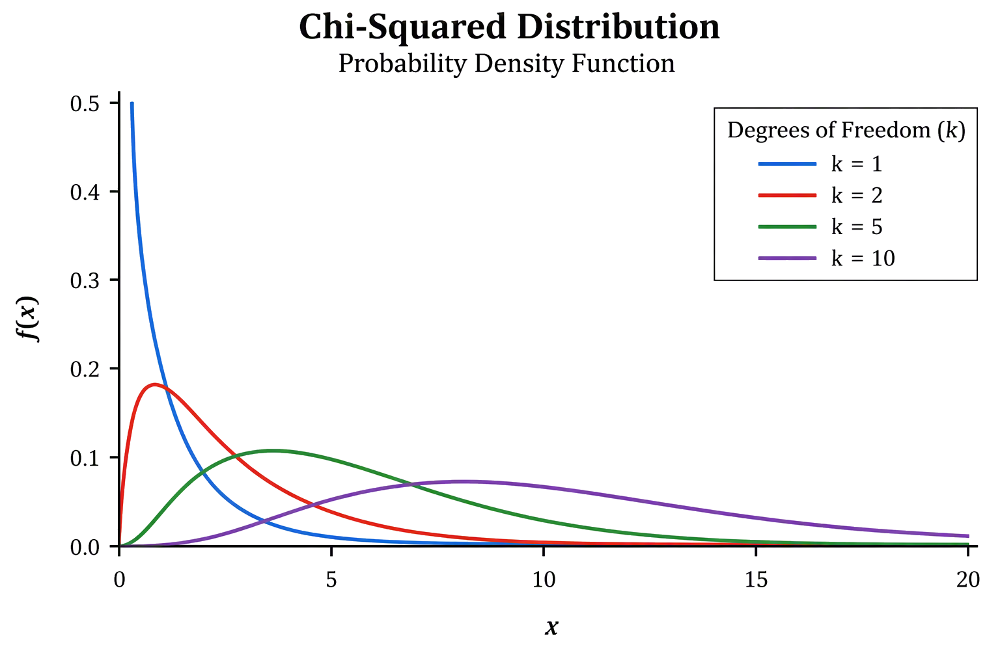
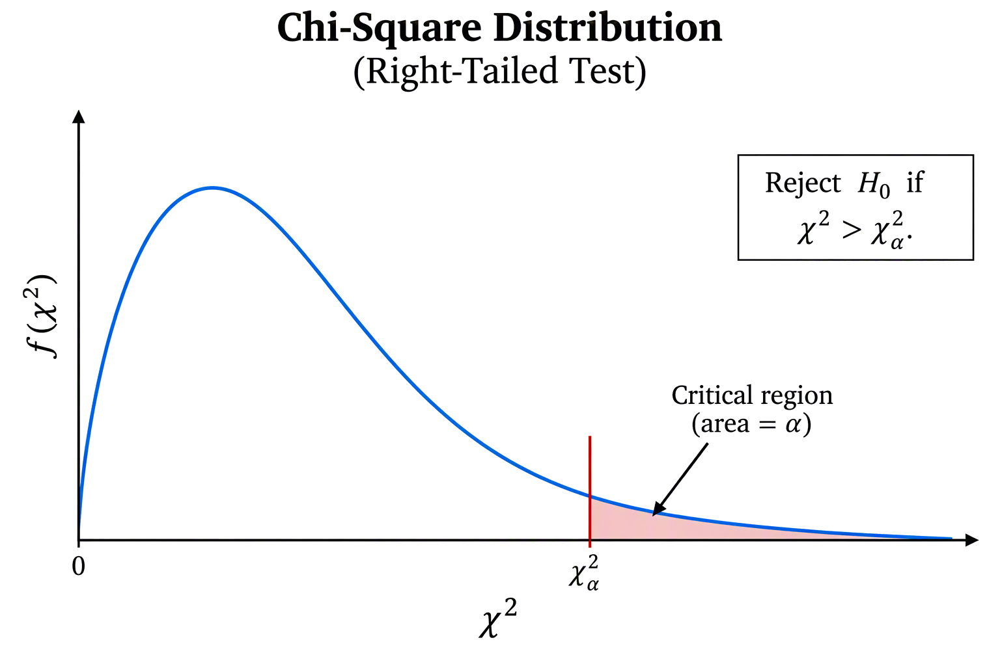

::: callout-note
## Chapter 12 Objectives

By the end of Chapter 12, you should be able to:

- Recognize situations involving categorical data in which a chi-squared test is appropriate.
- Distinguish among goodness-of-fit, independence, and homogeneity tests.
- Conduct and interpret chi-square goodness-of-fit hypothesis tests.
- Conduct and interpret chi-square test for independence hypothesis tests.
- Conduct and interpret chi-square test for homogeneity hypothesis tests.
:::

**Before you begin, review the process for importing a dataset.** Click on the box below to expand the directions for importing a dataset into your Data Toolbox.

::: {#Importing-Data-to-Rguroo-Chapter-5 .callout-note appearance="simple" collapse="true" icon="none" title="{width=22px style='vertical-align:middle;'}  Importing Data to Rguroo"}
1.  Open the **Data** toolbox in Rguroo.\
2.  From the [Data Import]{.dpd} dropdown, select [Dataset Repository]{.fun}.\
3.  In the top search box, type [kozak]{.typein}, then select the [Statistics Using Technology – Kozak]{.repo} repository.\
4.  In the middle search box, type the first few letters of the dataset, and choose your dataset that appears in the lower panel.\
5.  Click the [Import]{.button}. The dataset will be imported into your Rguroo account.\
6.  Click the [Close]{.button} to close the dialog.\
7.  To view the dataset, double-click the dataset under the **Data** toolbox list.
:::

```{r chapter-11-setup, include= FALSE, echo=FALSE, warning=FALSE}
library(mosaic)
Defects<- read.csv( "https://krkozak.github.io/MAT160/defects.csv")
MaM<- read.csv( "https://krkozak.github.io/MAT160/M_and_Ms.csv") 
Car_pref<- read.csv( "https://krkozak.github.io/MAT160/carprefs.csv") 
```

Many questions involving categorical data ask us to compare what we observe in a sample with what we would expect under a particular assumption. Chi-square tests are hypothesis tests designed for categorical data and provide a way to determine whether the differences between observed and expected counts are large enough to provide evidence against that assumption. In this chapter, we will study three types of chi-square tests. The chi-square goodness-of-fit test determines whether the distribution of a single categorical variable follows a specified distribution. The chi-square test of independence examines whether two categorical variables are associated within a population, while the chi-square test for homogeneity determines whether the distribution of a categorical variable is the same across two or more populations or groups. Although these tests address different questions, they share the same underlying idea: comparing observed counts with the counts we would expect if the null hypothesis were true.

As with the other hypothesis tests you have studied, the general testing process remains the same. What changes are the conditions that must be satisfied, calculating expected counts, and the test statistic used to calculate the p-value. The following summarizes the general steps used in hypothesis testing, no matter the type of test.

::: callout-note
## General Hypothesis Test Steps

1.  State the null and alternative hypotheses, $H_o$ and $H_a$.
2.  Select $\alpha$
3.  Use Rguroo to conduct the test using either the P-value approach or the Critical Region approach.
4.  Make a decision.
5.  State the conclusion
:::

## The Chi-Squared Distribution

The **chi-squared distribution**, denoted by $\chi^2$, is a probability distribution that plays an important role in statistical methods involving categorical data. Unlike the normal distribution, which is symmetric, the chi-squared distribution is right-skewed and can only take values greater than or equal to zero. The exact shape of the distribution depends on its degrees of freedom (df). With fewer degrees of freedom, the distribution is more strongly skewed to the right. As the degrees of freedom increase, the distribution becomes less skewed and more symmetric.

@fig-chi-square-df below shows how the shape of the chi-squared distribution changes for different degrees of freedom. Notice that each curve begins at zero or above, is skewed to the right, and becomes less skewed as the degrees of freedom increase.

```{r, echo=FALSE}
#| label: fig-chi-square-df
#| fig-cap: 'Comparison of the chi-squared distribution with various degrees of freedom'
#| fig-alt: 'Graph of chi-square distributions for 1, 2, 5, and 10 degrees of freedom. All distributions take nonnegative values and are skewed to the right. As the degrees of freedom increase, the peak shifts to the right and the distribution becomes less skewed.'
#| out-width: "80%"

```

::: callout-note
## Summary of Chi-Square Distribution

- The chi-square distribution is denoted by $\chi^2$.
- Chi-square values are always greater than or equal to 0.
- The distribution is skewed to the right.
- The shape of the distribution depends on the degrees of freedom (dfdfdf).
- As the degrees of freedom increase, the distribution becomes less skewed.
:::

## Chi-Square Goodness of Fit Test

When working with categorical data, we are often interested in whether the distribution of a variable follows a particular pattern. For example, suppose a college claims that 40% of its students take primarily in-person courses, 35% take primarily online courses, and 25% take primarily hybrid courses. We could select a random sample of students and record each student's course modality. We could then compare the observed counts, the number of students actually found in each category, with the expected counts, the number we would expect in each category if the college's claim were true.

If the observed counts are close to the expected counts, the data are consistent with the claimed distribution. If the observed and expected counts differ substantially, however, we may have evidence that the actual distribution does not follow the claimed distribution.

The hypothesis test used to determine whether the distribution of a categorical variable follows a specified distribution is called the **Chi-Square Goodness-of-Fit Test**. The test considers the differences between the observed and expected counts across all categories to determine whether those differences are large enough to provide evidence that the specified distribution does not fit the data.

### Null and Alternative Hypotheses

As with other hypothesis tests, a chi-square goodness-of-fit test begins by stating the null and alternative hypotheses. In a goodness-of-fit test, the hypotheses describe the distribution of a categorical variable in the population. The null hypothesis states that the population follows a specified distribution. In other words, it specifies the proportion of the population expected to fall into each category.

The alternative hypothesis states that the population does not follow the specified distribution. This means that at least one of the population proportions differs from the value given in the null hypothesis.

::: {#exm-modality-gof}
## Modality Preference

Suppose a college claims that its students are distributed among course modalities as follows:

- 40% primarily take in-person courses
- 35% primarily take online courses
- 25% primarily take hybrid courses

State the null and alternative hypotheses.
:::

::: {.callout-tip .solution-callout collapse="true" icon="false"}
## 🔎 Solution

To write the null hypothesis, we state the proportions given in the distribution. The alternative will state that the population does not follow the distribution as stated.

$H_o:$ $p_\text{in-person}=0.40$, $p_\text{online}=0.35$, $p_\text{hybrid}=0.25$

$H_a:$ The population does not follow the stated distribution.

Notice that the alternative hypothesis does not specify which proportion is different. It simply states that the population distribution is not the distribution specified in the null hypothesis.
:::

::: {#exm-study-gof}
## Study Location Preference

A university believes that students are equally likely to prefer each of four locations for studying: the library, home, a coffee shop, or a campus study lounge. A researcher selects a random sample of university students and asks each student which of these locations they prefer for studying. State the null and alternative hypotheses.
:::

::: {.callout-tip .solution-callout collapse="true" icon="false"}
## 🔎 Solution

Since the university states that all locations are *equally likely*, the null hypothesis will state that the proportion for each location is equal. Since there are four locations, the proportion for all will be $\frac{1}{4}$. The alternative will be similar to the last example where we do not specify which location is different, only that at least one of locaitons differ.

$H_o:$ $p_\text{library}=p_\text{home}=p_\text{coffee shop}=p_\text{campus} = \frac{1}{4}$

$H_a:$ The population does not follow the stated distribution.
:::

### Observed and Expected Counts

Chi-squared tests involve comparing what we actually observe in the data with what we would expect to observe if the null hypothesis were true. The observed counts are the actual frequencies recorded for each category in the sample, while the expected counts represent the frequencies we would anticipate under the null hypothesis. The chi-squared test evaluates how much the observed counts differ from the expected counts. Larger differences provide stronger evidence that the observed pattern is not consistent with what we would expect under the null hypothesis.

For a goodness-of-fit test, the expected count is the number of observations we would expect to fall into each category if the null hypothesis were true. To calculate an expected count, multiply the total sample size by the proportion expected for that category:

$$E= (n)(p)$$ where:

$E$ = expected count for the category

$n$ = total sample size

$p$ = expected proportion for the category.

::: {#exm-modality-exp-counts}
## Expected Counts for Modality

Let's revisit the problem where a college claims that its students are distributed among course modalities as follows:

- 40% primarily take in-person courses
- 35% primarily take online courses
- 25% primarily take hybrid courses.

The college surveys 120 students and records the modality. The observed counts are below.

| Course Modality | Observed Count |
|-----------------|----------------|
| In-Person       | 52             |
| Online          | 51             |
| Hybrid          | 17             |

: Modality

Calculate the expected counts for each modality.
:::

::: {.callout-tip .solution-callout collapse="true" icon="false"}
## 🔎 Solution

To find the expected counts, we use each expected proportion stated by the college and the sample size, $n=120$.

In-person: $E=(120)(0.40)=48$

Online: $E=(120)(0.35)=42$

Hybrid: $E=(120)(0.25)=30$

We can organize this into a table as follows.

| Course Modality | Claimed Proportion | Observed Count | Expected Count |
|-----------------|--------------------|----------------|----------------|
| In-Person       | 0.40               | 52             | 48             |
| Online          | 0.35               | 51             | 42             |
| Hybrid          | 0.25               | 17             | 30             |

: Modality Summary
:::

### The Chi-Squared Test Statistic

Before conducting a chi-square goodness-of-fit test, we need to make sure the conditions for the test are satisfied:

1.  Categorical data: The variable being analyzed is categorical, and the data are counts of observations within the categories.
2.  Randomness: The data should come from a random sample or a randomized process.
3.  Independence: The observations should be independent. When sampling without replacement from a finite population, the sample should generally be no more than 10% of the population.
4.  Expected counts: The expected counts must be sufficiently large for the chi-square distribution to provide a reasonable approximation. A commonly used guideline is that each expected count should be at least 5.

Once these conditions are satisfied, we can calculate the chi-square test statistic and p-value and use them to make a decision about the null hypothesis.

**Test Statistic**

The question now becomes: Are the differences between the observed and expected counts small enough to be explained by random sampling variability, or are they large enough to provide evidence that the population does not follow the specified distribution?

To answer this question, we calculate a chi-square test statistic. For each category, we compare the observed count, $O$, with the expected count, $E$:

$$\chi^2=\sum\frac{(O-E)^2}{E}$$ where,

$O$ are the observed counts and $E$ are the expected counts.

The quantity

$$\frac{(O-E)^2}{E}$$

measures how much a particular category contributes to the overall chi-square statistic. Categories in which the observed and expected counts are close together contribute relatively little, while categories with larger differences contribute more.

Because the differences are squared, the chi-square statistic is always nonnegative. In general, a small value of $\chi^2$ indicates that the observed counts are reasonably close to the expected counts, while a large value of $\chi^2$ indicates greater disagreement between what was observed and what was expected under the null hypothesis.

The chi-square distribution used for a goodness-of-fit test depends on the number of categories. If there are $k$ categories, the degrees of freedom are

$$df=k−1$$

The chi-square test statistic and the degrees of freedom are then used to find the p-value. Similar to previous tests, the p-value represents the probability, assuming the null hypothesis is true, of obtaining a chi-square statistic at least as large as the one calculated from the sample.

Although the formula above shows how the chi-squared test statistic is calculated, we will not calculate the test statistic by hand. Instead, we will use Rguroo to obtain both the chi-squared test statistic and the corresponding p-value. Understanding the formula, however, helps us see how the observed and expected frequencies contribute to the test statistic.

### P-value Approach

We can use the p-value approach to determine whether the observed counts differ significantly from what would be expected under the null hypothesis. The chi-squared test statistic measures the overall discrepancy between the observed and expected counts, while the p-value tells us how unusual that discrepancy would be if the null hypothesis were true. Just as in previous tests, we compare the p-value to the significance level, $\alpha$, to make our decision about the null hypothesis. In this text, Rguroo will be used to obtain the chi-squared test statistic and p-value.

::: callout-note
## Hypothesis Test Decision Using P-value Approach

If the p-value is less than $\alpha$, we reject the null hypothesis; otherwise, we fail to reject the null hypothesis.
:::

::: {#exm-modality-gof-test-pvalue}
## GOF Test for Modality - Using P-value Approach

We will revisit @exm-modality-exp-counts. A college states that 40% of its students prefer in-person courses, 35% prefer online courses, and 25% prefer hybrid courses. A random sample of 120 students was asked to identify their preferred course modality. The results are shown below.

| Course Modality | Claimed Proportion | Observed Count |
|-----------------|--------------------|----------------|
| In-Person       | 0.40               | 52             |
| Online          | 0.35               | 51             |
| Hybrid          | 0.25               | 17             |

Is there sufficient evidence to conclude that students' preferences for course modality differ from the distribution stated by the college at the $\alpha=0.05$ significance level? Use the p-value approach.
:::

::: {.callout-tip .solution-callout collapse="true" icon="false"}
## 🔎 Solution

To determine if there is sufficient evidence that the preferences for course modality differs from the stated distribution, we need to conduct a full hypothesis test. This is a goodness-of-fit test since we are determining if a catagorical variable matches a specific distribution.
:::

::: {#exm-payment-gof-test-pvalue}
## GOF Test for Method of Payment - Using P-value Approach

A retail company reports that customers typically use the following methods of payment: 50% use a credit or debit card, 30% use a mobile payment method, 20% use cash.

A random sample of 200 customers at one of the company's stores produced the following results:

| Payment Method    | Observed Count |
|-------------------|----------------|
| Credit/Debit Card | 112            |
| Mobile Payment    | 48             |
| Cash              | 40             |

The store manager wants to determine whether the distribution of payment methods at this store differs from the company's reported distribution. Use the p-value approach and a significance level of $\alpha = 0.05$.
:::

::: {.callout-tip .solution-callout collapse="true" icon="false"}
## 🔎 Solution
:::

### Critical Region Approach

An alternative to the p-value approach is the critical region approach. Instead of comparing the p-value to the significance level, $\alpha$, this approach compares the chi-square test statistic to a critical value determined by $\alpha$ and the degrees of freedom. The critical value marks the boundary between values that are reasonably likely under the null hypothesis and values that provide sufficient evidence to reject it. Because chi-square tests are right-tailed, the critical region is located in the right tail of the chi-square distribution. If the test statistic falls in the critical region, we reject the null hypothesis; otherwise, we fail to reject the null hypothesis.

```{r, echo=FALSE}
#| label: fig-chi-square-dist
#| fig-cap: 'Critical region for chi-squared test'
#| fig-alt: 'Right-skewed chi-square distribution with a critical value marking the beginning of the critical region. The area to the right of the critical value is shaded and represents alpha. The null hypothesis is rejected when the chi-square test statistic is greater than the critical value.'
#| out-width: "80%"

```

@fig-chi-square-dist shows the critical value, $\chi^2_\alpha$, that separates the chi-square distribution into the noncritical region and the critical region. The critical region, shown in the right tail (shaded), has an area equal to $\alpha$. If the chi-square test statistic is greater than the critical value, we reject the null hypothesis.

::: {#exm-modality-gof-test-critical-region}
## GOF Test for Modality - Using Critical Region Approach

We will revisit @exm-modality-exp-counts and show how to conduct the same hypothesis test using the critcal region approach. A college states that 40% of its students prefer in-person courses, 35% prefer online courses, and 25% prefer hybrid courses. A random sample of 120 students was asked to identify their preferred course modality. The results are shown below.

| Course Modality | Claimed Proportion | Observed Count |
|-----------------|--------------------|----------------|
| In-Person       | 0.40               | 52             |
| Online          | 0.35               | 51             |
| Hybrid          | 0.25               | 17             |

Is there sufficient evidence to conclude that students' preferences for course modality differ from the distribution stated by the college at the $\alpha=0.05$ significance level? Use the critical region approach.
:::

::: {.callout-tip .solution-callout collapse="true" icon="false"}
## 🔎 Solution
:::

::: {#exm-payment-gof-test-critical-region}
## GOF Test for Method of Payment - Using Critical Region Approach

A retail company reports that customers typically use the following methods of payment: 50% use a credit or debit card, 30% use a mobile payment method, 20% use cash.

A random sample of 200 customers at one of the company's stores produced the following results:

| Payment Method    | Observed Count |
|-------------------|----------------|
| Credit/Debit Card | 112            |
| Mobile Payment    | 48             |
| Cash              | 40             |

The store manager wants to determine whether the distribution of payment methods at this store differs from the company's reported distribution. Use the critical region approach and a significance level of $\alpha = 0.05$.
:::

::: {.callout-tip .solution-callout collapse="true" icon="false"}
## 🔎 Solution
:::

### Homework for Section 12.1

1.  According to the M&M candy company, the expected proportion can be found in @tbl-MandM. In addition, the table contains the number of M&M's of each color that were found in a case of candy (Madison, 2013). At the 5% level, do the observed frequencies support the claim of M&M?

```{r, echo=FALSE}
#| tbl-alt: "M&M Observed and Expected"
#| label: tbl-MandM
#| tbl-cap: "M&M Observed and Expected"
MandM <- data.frame(
  Color = c("Blue", "Brown", "Green", "Orange", "Red", "Yellow"),
  Observed = c(78, 87, 87, 76, 85, 87),
  Expected = c(0.24, 0.13, 0.16, 0.20, 0.13, 0.14)
)
knitr::kable(MandM)
```

2.  Eyeglassomatic manufactures eyeglasses for different retailers. The data frame is in @tbl-Defects. They test to see how many defective lenses they made the time period of January 1 to March 31. @tbl-Defect_table gives the defect and the number of defects.

    **Code book for Data Frame Defects** below @tbl-Defects.

```{r, echo=FALSE}
#| tbl-alt: "Number of Defective Lenses"
#| label: tbl-Defect_table
#| tbl-cap: "Number of Defective Lenses"
Defect_table <- tally(~type, data=Defects)
knitr::kable(Defect_table)
```

Do the data support the notion that each defect type occurs in the same proportion? Test at the 5% level.

3.  On occasion, medical studies need to model the proportion of the population that has a disease and compare that to observed frequencies of the disease actually occurring. Suppose the end-stage renal failure in south-west Wales was collected for different age groups. Do the data in @tbl-Renal show that the observed frequencies are in agreement with proportion of people in each age group (Boyle, Flowerdew & Williams, 1997)? Test at the 1% level.

    **Table Renal Failure Frequencies**

    ```{r, echo=FALSE}
    #| tbl-alt: "Renal Failure Frequencies"
    #| label: tbl-Renal
    #| tbl-cap: "Renal Failure Frequencies"
    Renal <- data.frame(
      Age_group = c("16-29", "30-44", "45-59", "60-75", "75+"),
      Observed = c(32, 66, 132, 218, 91),
      Expected = c(0.23, 0.25, 0.22, 0.21, 0.09)
    )
    knitr::kable(Renal)
    ```

4.  In Africa in 2011, the number of deaths of a female from cardiovascular disease for different age groups are in @tbl-Deaths ("Global health observatory," 2013). In addition, the proportion of deaths of females from all causes for the same age groups are also in table Deaths of Females for Different Age Groups. Do the data show that the death from cardiovascular disease are in the same proportion as all deaths for the different age groups? Test at the 5% level.

    ```{r females, echo=FALSE}
    #| tbl-alt: "Deaths of Females for Different Age Groups"
    #| label: tbl-Deaths
    #| tbl-cap: "Deaths of Females for Different Age Groups"
    Deaths <- data.frame(
      Age = c("5-14", "14-29", "30-49", "50-69"),
      Observed = c(8, 16, 56, 433),
      Expected = c(0.10, 0.12, 0.226, 0.52)
    )
    knitr::kable(Deaths)
    ```

<!-- -->

5.  In Australia in 1995, there was a question of whether indigenous people are more likely to die in prison than non-indigenous people. To figure out, the data in @tbl-Prisoners was collected. ("Aboriginal deaths in," 2013). Do the data show that indigenous people die in the same proportion as non-indigenous people? Test at the 1% level.

    ```{r Prisoners, echo=FALSE}
    #| tbl-alt: "Death of Indigenous Prisoners"
    #| label: tbl-Prisoners
    #| tbl-cap: "Death of Indigenous Prisoners"
    Prisoners <- data.frame(
      Died = c("Yes", "No"),
      Observed = c(17, 3890),
      Expected = c(0.003, 0.997))
    knitr::kable(Prisoners)
    ```

6.  A project conducted by the Australian Federal Office of Road Safety asked people many questions about their cars. One question was the reason that a person chooses a given car, and that data is in @tbl-Car_table ("Car preferences," 2013).

```{r, echo=FALSE}
#| tbl-alt: "Reason for Choosing a Car"
#| label: tbl-Car_table
#| tbl-cap: "Reason for Choosing a Car"
Car_table <- tally(~Reason, data=Car_pref)
knitr::kable(Car_table)
```

Do the data show that the frequencies observed substantiate the claim that the reasons for choosing a car are equally likely? Test at the 5% level.

## Chi-Square Test for Independence

## Chi-Square Test for Homogeneity