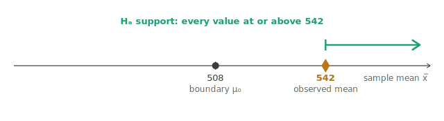
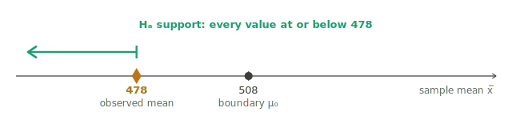
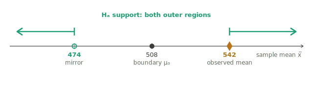
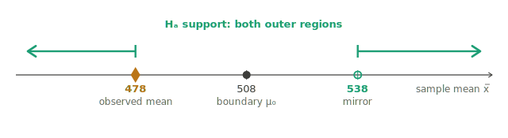
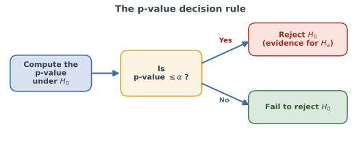
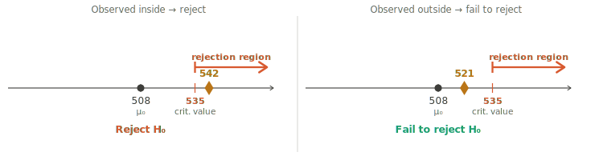
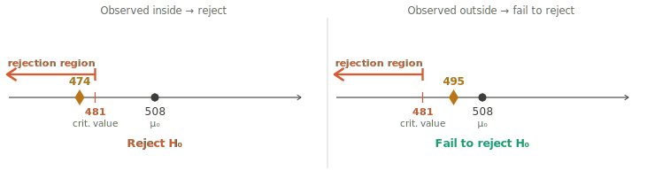
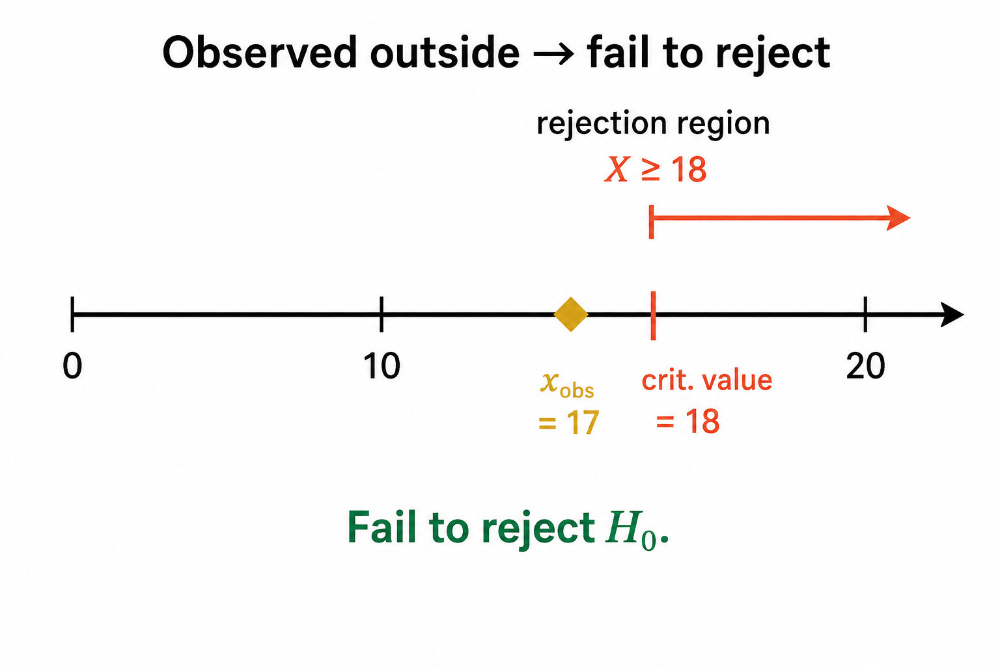
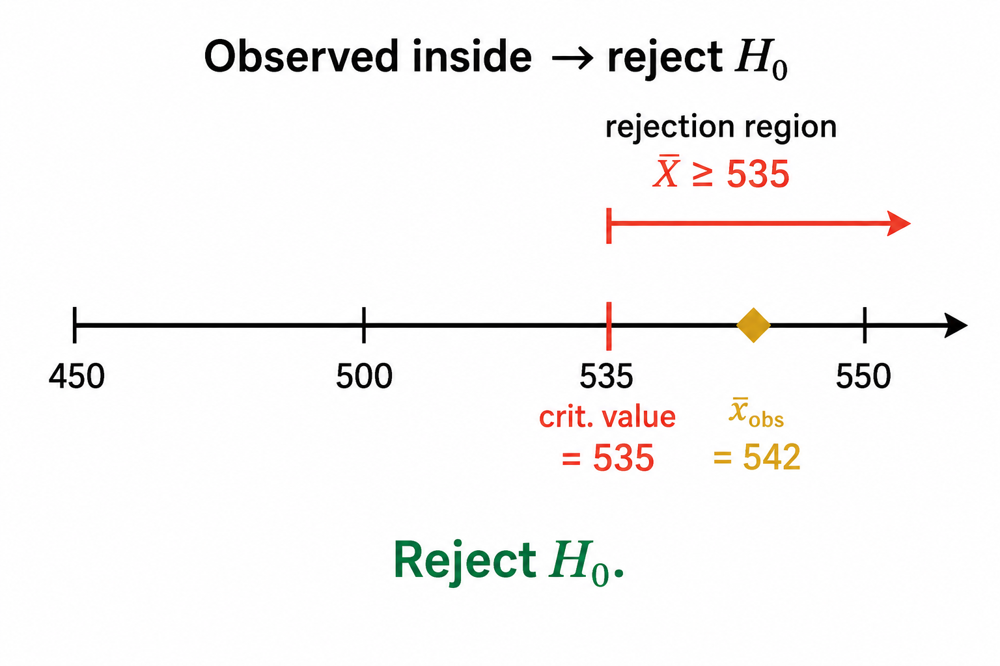

In the previous chapters we learned how probability distributions describe the variability of random outcomes. We are now ready to put those ideas to work for **statistical inference**, where we use information from a sample to draw conclusions about a population.

This chapter develops the core *ideas* of inference. The focus is on understanding the main ideas and reasoning behind inference. We will introduce the vocabulary and the reasoning that all inference methods share — research questions, null and alternative hypotheses, the two kinds of mistakes we can make, the two equivalent ways of reaching a conclusion, and the idea of a confidence interval — without performing any computations. The calculations, along with the distributions and software needed to carry them out, are introduced in the chapters that follow: one for inference about a population proportion and one for inference about a population mean.

We draw our examples from both of those settings. A central message of this chapter is that the logic of inference does not depend on *which* parameter we happen to be studying. Whether the question concerns a proportion $p$ (the fraction of a population with some characteristic), a mean $\mu$ (the average value of some measurement), or other parameters, the framework is the same. By seeing the same ideas play out in two different settings, you will come to recognize the parts of inference that do not change, so that when the computational details arrive in later chapters, they fit into a framework you already understand.

## Populations, Parameters, and Sampling Variability {#sec-foundations-populations}

Every inference problem begins with a **population** — the entire collection of individuals or objects we want to learn about — and a numerical characteristic of that population called a **parameter**. A parameter is a fixed but typically unknown number. Throughout this and the following chapters, two parameters will recur:

- The **population proportion** $p$: the fraction of the population that falls into a category of interest. For example, the proportion of students at a university who prefer online classes.
- The **population mean** $\mu$: the average value of a numerical measurement across the population. For example, the mean nightly sleep, in hours, of all students at a university.

Because we can rarely examine an entire population, we collect a **sample**: a smaller, randomly chosen subset of the population. From the sample we compute a **statistic**, a number that estimates the parameter.

For a proportion, the natural starting point is a **count**. Before the sample is collected, let $X$ denote the number of sampled individuals who will fall into the category of interest. Because the sample is random, $X$ is a random variable. After the sample is collected, its observed value is denoted $x_{\text{obs}}$. Dividing $X$ by the sample size gives the **sample proportion** $\hat{p}=X/n$, our estimate of $p$, and after sampling its observed value is denoted $\hat{p}_{\text{obs}}=x_{\text{obs}}/n$. Both $X$ and $\hat{p}$ carry the same information, but it will be convenient to work with $X$ when we describe the sampling distribution in the proportion chapter, because $X$ is the quantity whose distribution we know directly. For a mean, the statistic is the **sample mean** $\bar{X}$, our estimate of $\mu$, and its observed value after sampling is denoted $\bar{x}_{\text{obs}}$.

::: {.callout-note}
## Notation for Parameters and Statistics

| Setting | Parameter | Statistic | Random | Observed |
|---------|-----------|-----------|--------|----------|
| Proportion | $p$ | count | $X$ | $x_{\text{obs}}$ |
| Proportion | $p$ | sample proportion | $\hat{p} = X/n$ | $\hat{p}_{\text{obs}}$ |
| Mean | $\mu$ | sample mean | $\bar{X}$ | $\bar{x}_{\text{obs}}$ |
:::

Here we meet the central difficulty of inference. A statistic is computed from a random sample, so its value depends on *which* individuals happen to be selected. Draw a different sample and you will generally get a different value, even when nothing about the population has changed. This sample-to-sample variation is called **sampling variability**, and it is unavoidable whenever we study a population through a sample.

::: {.callout-note}
## Sampling Variability

Different random samples generally contain different individuals, so statistics such as $X$, $\hat{p}$, or $\bar{X}$ will usually take different values from one sample to another. A single observed statistic is therefore only an estimate of the parameter, and it will rarely equal the parameter exactly.
:::

Sampling variability is what makes inference more complicated than simply comparing a sample statistic to a claimed value. If a sample statistic differs from a claimed value, we cannot immediately conclude that the claim is wrong, because some difference is expected purely by chance. Even if the claim is true, different random samples will naturally produce somewhat different statistics. The entire apparatus of inference is built to answer one question: *is the difference we observe larger than what sampling variability alone would reasonably produce by chance?* The probability distributions from earlier chapters give us a way to answer this question, because they describe how a statistic behaves across all possible samples.

We use two complementary tools to draw conclusions about a parameter: **hypothesis tests** and **confidence intervals**. A hypothesis test weighs two competing claims about the parameter — a *null hypothesis*, which represents no effect or no change, and an *alternative hypothesis*, which is the claim the investigator is looking to support — and asks whether the sample provides enough evidence to favor the alternative over the null. A confidence interval instead reports a whole range of values for the parameter that are consistent with the observed data. We develop hypothesis testing first, and then show that confidence intervals arise naturally from it.

## Hypothesis Testing: The Core Idea {#sec-foundations-core-idea}

A **hypothesis test** is a structured way of deciding whether sample evidence supports a particular claim about a population parameter. To see why structure is needed, consider two motivating questions, one about a proportion and one about a mean.

Suppose a school district claims that *more than 70%* of its students use YouTube daily. A random sample of $n = 20$ students is surveyed, and the observed count of daily users turns out to be $x_{\text{obs}} = 17$. This corresponds to an observed sample proportion of $\hat{p}_{\text{obs}} = 17/20 = 0.85$, which is larger than 0.70, so at first glance the claim seems supported. But if the true population proportion were really 0.70 or smaller, could random sampling variability alone produce a sample proportion as large as 0.85 just by chance? That is exactly the kind of question a hypothesis test is built to answer.

Now suppose we wish to know whether the mean math SAT score of incoming freshmen at a university is *higher than* the national mean of 508 points. A random sample of freshmen gives an observed sample mean of $\bar{x}_{\text{obs}} = 542$ points. Again the observed value points in the direction of the claim — 542 is above 508 — but again we must ask whether a sample mean this large could plausibly occur even if the true mean were 508.

::: {.callout-note}
## Consistent With a Claim Is Not the Same as Strong Evidence

A sample result that points in the direction of a claim does not by itself establish the claim. Because of sampling variability, such a result can occur by chance even when the claim is false. The question a hypothesis test answers is whether the observed result would be *unlikely to occur by chance* if there were no real effect — that is, if the null hypothesis were true.
:::

The reasoning of a hypothesis test follows a few steps that are identical for proportions, for means, and for any other parameter:

1. State two competing claims about the parameter: a **null hypothesis** and an **alternative hypothesis**.
2. Tentatively assume **the null hypothesis is true**, and describe how the statistic would behave across samples under that assumption.
3. Compare the observed statistic to that behavior. If the observed value would be unlikely under the null hypothesis, take this as evidence against it.
4. Reach a decision: either reject the null hypothesis in favor of the alternative, or fail to reject the null hypothesis.

The rest of this chapter unpacks each of these steps. We begin with the two hypotheses.

## Null and Alternative Hypotheses {#sec-foundations-hypotheses}

Every hypothesis test begins with two competing claims about a population parameter.

The claim we are trying to find evidence *for* — the new effect, the difference, the departure from the status quo — is called the **research hypothesis**, more commonly the **alternative hypothesis**, denoted $H_a$. It is the statement the investigator suspects is true and wishes to support with data.

Its counterpart is the **null hypothesis**, denoted $H_0$. The null hypothesis represents the absence of the effect described by $H_a$ — the status quo, "no change," or "no difference." The null hypothesis is the claim we temporarily assume is true unless the data provide strong enough evidence against it.

Two principles govern how these hypotheses are used, and both are worth stating explicitly because they shape everything that follows.

First, hypotheses are always statements about the **population parameter**, never about the sample. They are written in terms of $p$ or $\mu$, not in terms of $\hat{p}_{\text{obs}}$ or $\bar{x}_{\text{obs}}$. The sample is the evidence we use to decide between the hypotheses; it is not the subject of the hypotheses themselves.

Second, the null hypothesis is the **default assumption**. We do not begin by assuming the alternative is true and look for reasons to doubt it; we begin by assuming the null is true and ask whether the data give us strong enough reason to reject it. The burden of proof lies on the alternative.

### The Three Forms of the Hypotheses {#sec-foundations-three-forms}

Whatever the parameter, the pair of hypotheses always takes one of three forms, depending on the direction of the research question. We write the value that separates the null from the alternative — as $p_0$ for a proportion and $\mu_0$ for a mean, and we call it the **boundary value** (sometimes the *hypothesized value*). The three possible forms are the same for proportions and means; only the symbol for the parameter changes:

$$
\textbf{Proportion:}\quad
\underbrace{\begin{cases} H_0: p \leq p_0 \\ H_a: p > p_0 \end{cases}}_{\text{Case 1}}
\qquad
\underbrace{\begin{cases} H_0: p \geq p_0 \\ H_a: p < p_0 \end{cases}}_{\text{Case 2}}
\qquad
\underbrace{\begin{cases} H_0: p = p_0 \\ H_a: p \neq p_0 \end{cases}}_{\text{Case 3}}
$$

$$
\textbf{Mean:}\quad
\underbrace{\begin{cases} H_0: \mu \leq \mu_0 \\ H_a: \mu > \mu_0 \end{cases}}_{\text{Case 1}}
\qquad
\underbrace{\begin{cases} H_0: \mu \geq \mu_0 \\ H_a: \mu < \mu_0 \end{cases}}_{\text{Case 2}}
\qquad
\underbrace{\begin{cases} H_0: \mu = \mu_0 \\ H_a: \mu \neq \mu_0 \end{cases}}_{\text{Case 3}}
$$

In Cases 1 and 2 the alternative points in a single direction — the parameter is claimed to be either greater than $(>)$ or less than $(<)$ the boundary value. These are **one-sided** (or **one-tailed**) hypotheses. In Case 3 the alternative says only that the parameter *differs* #(\neq)$ from the boundary value, with no direction specified. This is a **two-sided** (or **two-tailed**) hypothesis.

The form of the hypotheses is dictated by the research question, not by the data. The phrase "more than," "increased," or "exceeds" signals a Case 1 alternative $(>)$; "less than," "fewer," or "decreased" signals Case 2 $(<)$; and "differs from," "changed," or "is not equal to" signals a two-sided Case 3 alternative $(\neq)$. For instance, asking whether *more than* 70% of students use YouTube daily, or whether mean math SAT scores are *higher than* the national mean of 508, gives a Case 1 alternative; asking whether *fewer than* 35% of adults are physically inactive, or whether mean nightly sleep is *less than* 7 hours, gives a Case 2 alternative; asking whether the proportion getting their news from social media *differs from* 36%, or whether mean commute time *differs from* the national figure, gives a two-sided Case 3 alternative.

### Why We Test at the Boundary Value {#sec-foundations-boundary}

As noted before, to carry out a hypothesis test, we begin by assuming the null hypothesis is true and ask how the statistic would behave under that assumption. For this we need to work with one specific value of the parameter. In the two-sided Case 3 the answer is immediate: the null hypothesis $H_0: p = p_0$ (or $H_0: \mu = \mu_0$) names a single value, so "$H_0$ is true" means the parameter equals that one value, so there is no question about which value to use. In the one-sided Cases 1 and 2, however, the null hypothesis is not a single value but a whole range — for example, $H_0: p \leq 0.70$ allows any proportion at or below 0.70. In principle, any value in this range could be the true population proportion. Which value of the range do we use?

The answer is the **boundary value** — the value $p_0$ or $\mu_0$ at the edge between the null and the alternative. The reason comes from the need to control errors in hypothesis testing, which we take up in @sec-foundations-errors: every test must keep the probability of incorrectly rejecting $H_0$ at or below a chosen level, and to do this we must focus on the value of the parameter that is hardest to distinguish from the alternative. That value is the boundary. A claim like $p \leq 0.70$ is most easily mistaken for "$p > 0.70$" when the truth sits right at $0.70$; a true proportion well below 0.70 would almost never produce a sample that looks like evidence for $p > 0.70$. Using the boundary value therefore gives the most conservative test: if the error rate is controlled at the boundary, it is automatically controlled everywhere else in the null region. For a more detailed treatment of why the maximum error probability occurs at the boundary, see @sec-boundary-value in the next chapter.

::: {.callout-note}
## Evaluating $H_0$ at the Boundary Value

From this point on, whenever we speak of "the null hypothesis being true" for the purpose of computing probabilities, we take the parameter equal to the **boundary value** ($p_0$ for a proportion, $\mu_0$ for a mean). This is the value within the null hypothesis that is hardest to distinguish from the alternative hypothesis. Using the boundary value gives a conservative test.
:::

### Is the Parameter a Mean or a Proportion? {#sec-foundations-mean-vs-prop}

Before working through specific examples, it is worth pausing to address a question that often trips students up: in a given real-world problem, how do you tell whether the parameter of interest is a population proportion $p$ or a population mean $\mu$? The distinction is important because it determines everything that follows — the notation, the hypotheses, the sampling distribution, and the computations. Fortunately, the diagnostic is simple.

The key is to identify the **variable measured on each individual** in the population and ask whether that variable is **categorical** or **numerical**.

- If the variable is **categorical** with two outcomes (success/failure, yes/no, agree/disagree, has/does not have), the parameter is a **proportion** $p$ — the fraction of the population that is a success.
- If the variable is **numerical** (a score, a quantity, a measurement), the parameter is a **mean** $\mu$ — the average value of that variable in the population.

::: {.callout-tip}
## Quick Check: Mean or Proportion?

Identify the variable measured on each individual.

- **Categorical** (yes/no, success/failure) → **proportion** $p$
- **Numerical** (a quantity, a score, a measurement) → **mean** $\mu$

A useful test: does the problem ask what *fraction* or *percentage* of the population has some characteristic, or what *average value* a measurement takes?
:::

Two common sources of confusion are the words **percentage** and **average**.

The word **percentage** can describe either type of parameter. For example, *"What percentage of voters support the candidate?"* is a proportion question because each voter either supports the candidate or does not. In contrast, *"What is the average exam percentage among students?"* is a mean question because each student has a numerical percentage score, and we are averaging those scores.

The word **average** usually signals a mean, but not always. A question such as *"What is the average number of hours students sleep each night?"* is clearly about a mean. However, a statement such as *"On average, 60% of voters support the candidate"* is really describing a proportion. Rather than relying on keywords, focus on the variable measured on each individual: is it categorical or numerical?

In the examples that follow, the first three concern a population proportion $p$ — the YouTube example, the physical inactivity example, and the social media news example. The next three concern a population mean $\mu$ — the SAT example, the sleep example, and the commute time example. As you read each setup, try to identify the variable measured on each individual before reading the parameter. The categorical-versus-numerical diagnostic should quickly tell you whether the problem is about a proportion or a mean.

:::{#exm-foundations-hypotheses-prop}
## Writing Hypotheses: Proportions

For each scenario, identify the boundary value and write the null and alternative hypotheses for the population proportion $p$.

a. A school district claims that **more than 70%** of its students use YouTube daily.
b. A health agency hopes that **fewer than 35%** of adults in its country are physically inactive.
c. A university administration wants to know whether the proportion of students who get most of their news from social media **differs from 36%**.
:::

::: {.callout-tip .solution-callout collapse="true" icon=false}
## 🔎 Solution

a. The phrase "more than" gives a one-sided alternative in the upper direction, with boundary value $p_0 = 0.70$:
$$
\begin{cases}
H_0: p \leq 0.70 \\
H_a: p > 0.70
\end{cases}
$$

b. The phrase "fewer than" gives a one-sided alternative in the lower direction, with boundary value $p_0 = 0.35$:
$$
\begin{cases}
H_0: p \geq 0.35 \\
H_a: p < 0.35
\end{cases}
$$

c. The phrase "differs from" gives a two-sided alternative, with boundary value $p_0 = 0.36$:
$$
\begin{cases}
H_0: p = 0.36 \\
H_a: p \neq 0.36
\end{cases}
$$
:::

:::{#exm-foundations-hypotheses-mean}
## Writing Hypotheses: Means

For each scenario, identify the boundary value and write the null and alternative hypotheses for the population mean $\mu$.

a. We wish to investigate whether the mean math SAT score of incoming freshmen at a university is **higher than** the national mean of 508 points.
b. We wish to investigate whether the mean nightly sleep among students at a university is **less than** 7 hours.
c. We wish to investigate whether the mean one-way commute time among workers in a metropolitan area **differs from** the national mean of 26.8 minutes.
:::

::: {.callout-tip .solution-callout collapse="true" icon=false}
## 🔎 Solution

a. The phrase "higher than" gives a one-sided alternative in the upper direction, with boundary value $\mu_0 = 508$:
$$
\begin{cases}
H_0: \mu \leq 508 \\
H_a: \mu > 508
\end{cases}
$$

b. The phrase "less than" gives a one-sided alternative in the lower direction, with boundary value $\mu_0 = 7$:
$$
\begin{cases}
H_0: \mu \geq 7 \\
H_a: \mu < 7
\end{cases}
$$

c. The phrase "differs from" gives a two-sided alternative, with boundary value $\mu_0 = 26.8$:
$$
\begin{cases}
H_0: \mu = 26.8 \\
H_a: \mu \neq 26.8
\end{cases}
$$
:::

Notice that the two examples are structurally identical. Only the symbol for the parameter and the units of the boundary value differ; the logic of translating a research question into a pair of hypotheses is the same.

## Two Types of Error {#sec-foundations-errors}

Because a hypothesis test reaches a conclusion from a sample rather than from the whole population, it can be wrong. There are exactly two ways to be wrong, and distinguishing them is essential to understanding how tests are designed.

A **Type I error** occurs when we **reject $H_0$ even though $H_0$ is actually true**. We have declared an effect that does not exist — a false alarm.

A **Type II error** occurs when we **fail to reject $H_0$ even though $H_a$ is actually true**. We have missed an effect that is genuinely present — a missed discovery.

These outcomes, together with the two ways of being right, are summarized below. The truth (which we never actually know) runs across the top; our decision runs down the side.

|  | $H_0$ is true | $H_a$ is true |
|---|---|---|
| **Reject $H_0$** | Type I error | Correct decision |
| **Fail to reject $H_0$** | Correct decision | Type II error |

@fig-types-of-error traces the same four outcomes as a flow from the unknown truth, through our decision, to the result.

{#fig-types-of-error width="90%"}

The meaning of each error is always tied to the context of the problem. The next two examples translate the abstract definitions into plain language, once for a proportion and once for a mean.

:::{#exm-foundations-error-prop}
## Interpreting Errors: YouTube Use (Proportion)

Recall the claim that more than 70% of a district's students use YouTube daily, with hypotheses
$$
\begin{cases}
H_0: p \leq 0.70 \\
H_a: p > 0.70
\end{cases}
$$
Describe what a Type I error and a Type II error would mean in this context.
:::

::: {.callout-tip .solution-callout collapse="true" icon=false}
## 🔎 Solution

A **Type I error** occurs if we reject $H_0$ and conclude that more than 70% of students use YouTube daily, when in fact the true proportion is 70% or less ($H_0$ is true). We would be claiming a higher usage rate than really exists.

A **Type II error** occurs if we fail to reject $H_0$ and therefore do not conclude that more than 70% use YouTube daily, when in fact the true proportion does exceed 70% ($H_a$ is true). We would be missing a real difference.
:::

:::{#exm-foundations-error-mean}
## Interpreting Errors: SAT Scores (Mean)

Recall the claim that the mean math SAT score of incoming freshmen is higher than the national mean of 508, with hypotheses
$$
\begin{cases}
H_0: \mu \leq 508 \\
H_a: \mu > 508
\end{cases}
$$
Describe what a Type I error and a Type II error would mean in this context.
:::

::: {.callout-tip .solution-callout collapse="true" icon=false}
## 🔎 Solution

A **Type I error** occurs if we reject $H_0$ and conclude that the mean SAT score exceeds 508, when in fact the true mean is 508 or less ($H_0$ is true). We would be claiming the freshmen score higher than they really do.

A **Type II error** occurs if we fail to reject $H_0$ and therefore do not conclude that the mean exceeds 508, when in fact the true mean is greater than 508 ($H_a$ is true). We would be missing a genuine difference.
:::

### "Fail to Reject" Is Not "Accept" {#sec-foundations-fail-to-reject}

Throughout these chapters we say "fail to reject $H_0$" rather than "accept $H_0$," and the distinction is deliberate. A hypothesis test is designed to look for evidence *against* the null hypothesis, not to confirm it. When the evidence is insufficient, we have simply failed to find grounds to reject $H_0$; we have not shown it to be true.

A courtroom analogy is helpful. A jury that returns a verdict of "not guilty" is not declaring the defendant innocent — it is saying the evidence was not strong enough to establish guilt beyond a reasonable doubt. In the same way, failing to reject $H_0$ means the data were not strong enough to rule it out, not that $H_0$ is correct.

### The Trade-Off Between the Two Errors {#sec-foundations-tradeoff}

We would like to make both kinds of error, Type I and Type II, as rarely as possible, but the two are connected: for a fixed sample size, reducing the chance of one error increases the chance of the other.

Let's look at a smoke detector example to clarify this trade-off. Let $H_0$ be "there is no fire" and $H_a$ be "there is a fire."" If we make the detector less sensitive to avoid false alarms from burnt toast or steam, we reduce Type I errors but increase the risk that the detector stays silent during a real fire, creating more Type II errors. If we make the detector more sensitive so it rarely misses a real fire, we reduce Type II errors but increase false alarms, creating more Type I errors. The same trade-off appears in every hypothesis test: making it harder to reject $H_0$ reduces Type I errors but increases Type II errors, while making it easier to reject $H_0$ does the opposite.

{#fig-tradeoff-seesaw width="80%"}


Faced with this trade-off, statisticians choose to focus first on controlling Type I errors: *we keep the probability of a Type I error at a small, prespecified level called significance level, and then try to make the probability of a Type II error as small as possible within that constraint.* One reason for focusing on Type I errors is that falsely claiming an effect exists — for example, saying a new drug works when it does not — can have serious consequences. 

::: {.callout-note}
## Type I and Type II error possibilities

If we reject $H_0$, a Type I error is possible, but a Type II error is not.

If we fail to reject $H_0$, a Type II error is possible, but a Type I error is not.
:::

::: {.callout-note}
## The Significance Level

The largest probability of a Type I error that we are willing to tolerate is called the **significance level** of the test, denoted by $\alpha$ (the Greek letter alpha). It is chosen *before* looking at the data. The most common choice is $\alpha = 0.05$, meaning we accept at most a 5% chance of rejecting a true null hypothesis; values of $\alpha = 0.10$ and $\alpha = 0.01$ are also used. A smaller $\alpha$ makes the test more conservative — less willing to reject $H_0$, and therefore less prone to a Type I error but more prone to a Type II error.
:::

With the significance level fixed, every test must answer the same practical question: given the data, do we reject $H_0$ or not? There are two standard ways to answer it, the **p-value approach** and the **critical region approach**, and they always lead to the same conclusion. We present the p-value approach first, because it is the most widely reported in practice and the most directly interpretable, and then the critical region approach.

### Homework for @sec-foundations-hypotheses and @sec-foundations-errors {#sec-foundations-hyp-error-hw}

For each of the following scenarios, do the following:

a. Identify the population of interest and the parameter ($p$ for a proportion, $\mu$ for a mean).
b. State the null and alternative hypotheses in words.
c. Write the null and alternative hypotheses using mathematical notation, and identify the boundary value.
d. State whether the test is one-sided or two-sided.
e. Describe what happens if a Type I error occurs in the context of the problem.
f. Describe what happens if a Type II error occurs in the context of the problem.

---

1. **YouTube Use Among Teens.** A school district claims that more than 70% of its students use YouTube daily.

2. **Physical Inactivity Among Adults.** A national health agency hopes that fewer than 35% of adults in its country are physically inactive.

3. **Social Media as a News Source.** A university administration wants to know whether the proportion of its students who get most of their news from social media differs from 36%.

4. **SAT Math Scores.** A researcher wishes to investigate whether the mean math SAT score of incoming freshmen at a university is higher than the national mean of 508 points.

5. **Nightly Sleep.** A researcher wishes to investigate whether the mean nightly sleep among students at a university is less than 7 hours.

6. **Commute Time.** A researcher wishes to investigate whether the mean one-way commute time among workers in a metropolitan area differs from the national mean of 26.8 minutes.

7. **Battery Life.** A manufacturer advertises that its rechargeable batteries last 12 hours on average. A consumer group suspects the true mean is less than 12 hours and tests a random sample of batteries.

8. **Defect Rate.** A factory's quality-control standard requires that no more than 2% of its parts be defective. An inspector wants to determine whether the true defect rate exceeds 2%.

## Making a Decision: The p-Value Approach {#sec-foundations-pvalue}

The p-value approach measures *how consistent* the observed data are with the null hypothesis, and rejects $H_0$ when the data are sufficiently inconsistent with it.

To make the idea of "consistent" more precise, we tentatively assume that $H_0$ is true. This means using the boundary value of the null hypothesis: $p = p_0$ for a proportion or $\mu = \mu_0$ for a mean. Under this assumption, each of the statistics — the count $X$, the sample proportion $\hat{p}$, and the sample mean $\bar{X}$ — has a sampling distribution describing how it varies from sample to sample. Using this distribution, we then ask the central question: what is the probability of obtaining a value of the statistic ($x_{\text{obs}}$, $\hat{p}_{\text{obs}}$, or $\bar{x}_{\text{obs}}$) at least as far in the direction of $H_a$ as the observed value?

::: {.callout-note}
## The p-Value

The **p-value** is the probability, computed *assuming the null hypothesis is true*, of obtaining a value of the statistic at least as supportive of the alternative hypothesis $H_a$ as the observed value.

A small p-value means the observed data are inconsistent with $H_0$, and therefore count as evidence *against* $H_0$. A large p-value means the data are consistent with $H_0$, and therefore do not undermine it.
:::

To compute the probability that defines the p-value, we need a sampling distribution. The specific sampling distribution depends on the statistic and is taken up in the next two chapters; here we only need to know that such a distribution exists.

What counts as "at least as supportive of $H_a$" depends on the direction of the alternative. We call the collection of such values the **$H_a$ support**, and the p-value is the probability of the statistic landing in this region when $H_0$ is true. The crucial point is that the $H_a$ support is anchored at the *observed value* — it is defined by which outcomes are as convincing as, or more convincing than, what we actually saw. We illustrate all three cases with the SAT example, where the boundary value is $\mu_0 = 508$.

**Case 1: upper-tail alternative ($H_a: \mu > 508$).** Here larger values of the sample mean are more supportive of $H_a$, so the $H_a$ support consists of the observed value and everything above it. If the observed mean is $\bar{x}_{\text{obs}} = 542$, the support is every value at or above 542, and the p-value is the probability of a sample mean at least as large as 542. As @fig-ha-support-case1 shows, the support begins at the observed value, not at the boundary; the boundary $508$ is marked only for reference.

{#fig-ha-support-case1 width="100%"}

**Case 2: lower-tail alternative ($H_a: \mu < 508$).** Now smaller values are more supportive of $H_a$, so the $H_a$ support consists of the observed value and everything below it. If the observed mean is $\bar{x}_{\text{obs}} = 478$, the support is every value at or below 478, and the p-value is the probability of a sample mean at least as small as 478 (@fig-ha-support-case2).

{#fig-ha-support-case2 width="100%"}

**Case 3: two-sided alternative ($H_a: \mu \neq 508$).** Describing the $H_a$ support is a bit more involved here because values on *both* sides of the boundary can support $H_a$. The support still includes the observed value and everything beyond it, but it also includes a *mirror-image* region on the opposite side of the boundary — the values that are just as far from the boundary as the observed value, and farther. The picture depends on which side of the boundary the observed value falls on:

- *If the observed value lies above the boundary* (say $\bar{x}_{\text{obs}} = 542$, which is 34 above the boundary), the support is every value at or above 542, together with every value at or below the mirror value $508 - 34 = 474$ (@fig-ha-support-case3a).
- *If the observed value lies below the boundary* (say $\bar{x}_{\text{obs}} = 478$, which is 30 below the boundary), the support is every value at or below 478, together with every value at or above the mirror value $508 + 30 = 538$ (@fig-ha-support-case3b).

Either way, the p-value collects probability from both tails: the tail containing the observed value, plus the symmetric mirror tail on the opposite side.

{#fig-ha-support-case3a width="100%"}

{#fig-ha-support-case3b width="100%"}


To see all three cases in the running examples: the YouTube test ($H_a: p > 0.70$) and the SAT test ($H_a: \mu > 508$) are both Case 1, so their p-values come from the upper tail. The physical inactivity test ($H_a: p < 0.35$) and the sleep test ($H_a: \mu < 7$) are Case 2, drawing their p-values from the lower tail. The social media test ($H_a: p \neq 0.36$) and the commute-time test ($H_a: \mu \neq 26.8$) are two-sided Case 3, collecting probability from both tails at once.

Once the p-value is in hand, the decision rule is the same in every case and compares the p-value to the significance level chosen in advance.

::: {.callout-note}
## Decision Rule Using the p-Value

$$
\text{If } \text{p-value} \leq \alpha, \text{ reject } H_0. 
\qquad 
\text{If } \text{p-value} > \alpha, \text{ fail to reject } H_0.
$$
:::

The logic is direct. If the observed result, and results even more extreme, would be unlikely to occur under $H_0$ — unlikely enough that their combined probability falls at or below $\alpha$ — we treat that as sufficient evidence to reject $H_0$. If instead the result is the sort of thing that happens fairly often under $H_0$, we have no strong reason to abandon the null. @fig-pvalue-decision summarizes this rule.

{#fig-pvalue-decision width="90%"}

A useful feature of the p-value is that it conveys not just a yes-or-no decision but the *strength* of the evidence. A p-value far below $\alpha$ indicates very strong evidence against $H_0$; a p-value just barely below $\alpha$ indicates evidence that clears the bar only narrowly.

The following examples illustrate how a p-value is read once it has been computed — by software such as Rguroo in the later chapters — without our performing the computation here.

:::{#exm-foundations-pvalue-prop}
## Reading a p-Value: YouTube Use (Proportion)

For the YouTube test with $H_0: p \leq 0.70$ versus $H_a: p > 0.70$, suppose the analysis returns a p-value of $0.107$. Using $\alpha = 0.05$, state the decision and interpret it.
:::

::: {.callout-tip .solution-callout collapse="true" icon=false}
## 🔎 Solution

The p-value of $0.107$ means that *if the true proportion were exactly 0.70*, there would be about an 10.7% chance of observing a sample result at least as supportive of $H_a$ as the one we obtained. Because $0.107 > 0.05$, we **fail to reject $H_0$**. The observed result is not unusual enough under $H_0$ to provide strong evidence that more than 70% of students use YouTube daily.

:::

:::{#exm-foundations-pvalue-mean}
## Reading a p-Value: SAT Scores (Mean)

For the SAT test with $H_0: \mu \leq 508$ versus $H_a: \mu > 508$, suppose the analysis returns a p-value of $0.029$. Using $\alpha = 0.05$, state the decision and interpret it.
:::

::: {.callout-tip .solution-callout collapse="true" icon=false}
## 🔎 Solution

The p-value of $0.029$ means that *if the true mean were exactly 508*, there would be about a 3% chance of observing a sample mean at least as large as the one we obtained. Because $0.029 \leq 0.05$, we **reject $H_0$** in favor of $H_a: \mu > 508$. A sample mean this high would be unusual if the true mean were only 508, providing evidence that the mean SAT score of incoming freshmen exceeds the national figure.
:::

Once again the two examples differ only in their surface details. In both, the p-value is a probability computed under $H_0$, and in both the decision comes from comparing that probability to the same $\alpha$.

## Making a Decision: The Critical Region Approach {#sec-foundations-critical-region}

The critical region approach decides *in advance* which values of the statistic are extreme enough to warrant rejecting $H_0$, and then simply checks whether the observed value is among them. It needs no probability computed from the observed value; the threshold is fixed before the data are examined.

As with the p-value, we begin by tentatively assuming that $H_0$ is true, using the boundary value of the null hypothesis ($p = p_0$ for a proportion, $\mu = \mu_0$ for a mean). Under this assumption each statistic — the count $X$, the sample proportion $\hat{p}$, or the sample mean $\bar{X}$ — has a sampling distribution describing how it varies from sample to sample. We use that distribution to mark off the values that would be unusual under $H_0$.

::: {.callout-note}
## The Critical Region

The **critical region** (or **rejection region**) is the set of values of the statistic for which we reject $H_0$. The value or values that separate "reject" from "fail to reject" are called **critical values**. The critical values are chosen so that, *when $H_0$ is true*, the probability that the statistic falls in the critical region equals the significance level $\alpha$.

Because the critical region is built to have probability $\alpha$ under $H_0$, rejecting $H_0$ whenever the statistic lands in it guarantees that the probability of a Type I error is exactly $\alpha$. This is what controls the error rate.
:::

The shape of the critical region matches the direction of the alternative hypothesis: we reject $H_0$ when the statistic falls in the direction that $H_a$ predicts. We illustrate all three cases with the SAT example, where the boundary value is $\mu_0 = 508$. The critical values shown are hypothetical, chosen only to illustrate; their actual computation is taken up in the later chapters.

**Case 1: upper-tail alternative ($H_a: \mu > 508$).** Large values of the sample mean support $H_a$, so the critical region sits in the **upper tail** — reject $H_0$ when the sample mean is at or above an upper critical value. In @fig-critical-case1 the critical value is $535$, so the rejection region is every value at or above $535$. The left panel shows an observed mean of $542$, which falls inside the rejection region, so we reject $H_0$; the right panel shows an observed mean of $521$, which falls outside, so we fail to reject $H_0$.

{#fig-critical-case1 width="100%"}

**Case 2: lower-tail alternative ($H_a: \mu < 508$).** Small values support $H_a$, so the critical region sits in the **lower tail** — reject $H_0$ when the sample mean is at or below a lower critical value. In @fig-critical-case2 the critical value is $481$, so the rejection region is every value at or below $481$. The left panel shows an observed mean of $474$ (inside — reject $H_0$); the right panel shows an observed mean of $495$ (outside — fail to reject $H_0$).

{#fig-critical-case2 width="100%"}

**Case 3: two-sided alternative ($H_a: \mu \neq 508$).** Extreme values in *either* direction support $H_a$, so the critical region occupies **both tails** — reject $H_0$ when the sample mean is at or below a lower critical value or at or above an upper critical value. Because rejection can happen on either side, the significance level is split evenly between the two tails, with probability $\alpha/2$ assigned to each. In @fig-critical-case3 the critical values are $481$ and $535$, so the rejection region is every value at or below $481$ together with every value at or above $535$. The left panel shows an observed mean of $542$, which falls in the upper tail (inside — reject $H_0$); the right panel shows an observed mean of $515$, which falls in the middle (outside — fail to reject $H_0$).

{#fig-critical-case3 width="100%"}

::: {.callout-note}
## Decision Rule Using the Critical Region

Construct the critical region so that, under $H_0$, the probability the statistic falls in it equals $\alpha$. Then:

- If the observed statistic **falls in the critical region**, reject $H_0$.
- If the observed statistic **falls outside the critical region**, fail to reject $H_0$.
:::

Locating the critical values requires a sampling distribution, just as the p-value does, and the actual computation — carried out with Rguroo in the later chapters — depends on the statistic. The conceptual point that matters here is independent of those details: the critical region is a fixed target set up before the data are examined, and the decision is simply a matter of seeing whether the observed value lands inside it.

The two worked examples below show how a critical-region decision is read once the critical value has been found, without our performing the computation here.

:::{#exm-foundations-critical-prop}
## Using the Critical Region: YouTube Use (Proportion)

For the YouTube test with $H_0: p \leq 0.70$ versus $H_a: p > 0.70$, suppose that for a sample of $n = 20$ students and $\alpha = 0.05$ the critical region is found to be $X \geq 18$, where $X$ is the count of daily users. The observed count is $x_{\text{obs}} = 17$. State the decision.
:::

::: {.callout-tip .solution-callout collapse="true" icon=false}
## 🔎 Solution

The critical region is $X \geq 18$. The observed count $x_{\text{obs}} = 17$ does not reach $18$, so it falls *outside* the critical region. We therefore **fail to reject $H_0$**: the data do not provide strong enough evidence that more than 70% of students use YouTube daily.


```{r,echo=FALSE}
#| fig-alt: "Critical-region diagram for a right-tailed hypothesis test of a population proportion. A number line for the count statistic X runs from 0 to 20. The rejection region, labeled X greater than or equal to 18, begins at the critical value 18 and extends to the right. The observed count x sub obs=17 is shown as a gold diamond to the left of the critical value, outside the rejection region. Because the observed value does not fall in the rejection region, the decision is to fail to reject H00."
#| fig-cap: "YouTube use example: observed count outside the critical region; fail to reject $H_0.$"
#| label: cr-image-youtube 
#| out-width: "80%"

```


:::

:::{#exm-foundations-critical-mean}
## Using the Critical Region: SAT Scores (Mean)

For the SAT test with $H_0: \mu \leq 508$ versus $H_a: \mu > 508$, suppose that for $\alpha = 0.05$ the critical region is found to be $\bar{X} \geq 535$. The observed sample mean is $\bar{x}_{\text{obs}} = 542$. State the decision.
:::

::: {.callout-tip .solution-callout collapse="true" icon=false}
## 🔎 Solution

The critical region is $\bar{X} \geq 535$. The observed mean $\bar{x}_{\text{obs}} = 542$ exceeds $535$, so it falls *inside* the critical region. We therefore **reject $H_0$** in favor of $H_a: \mu > 508$: the data provide evidence that the mean SAT score of incoming freshmen exceeds the national figure.

```{r,echo=FALSE}
#| fig-alt: "Critical-region diagram for a right-tailed hypothesis test of a population mean. A number line for the sample mean bar{X} shows the critical value at 535. The rejection region, labeled bar{X} greater tan or equal to 535, begins at 535 and extends to the right. The observed sample mean bar{x}obs}=542 is shown to the right of the critical value, inside the rejection region. Because the observed value falls in the rejection region, the decision is to reject H0."
#| fig-cap: "SAT scores example: observed mean inside the rejection region; reject $H_0.$"
#| label: cr-image-SAT 
#| out-width: "80%"

```
:::

As with the p-value examples, the two differ only in their surface details. In both, the critical region is fixed in advance to have probability $\alpha$ under $H_0$, and in both the decision comes from checking whether the observed value lands inside it.

### The Two Approaches Always Agree {#sec-foundations-equivalence}

The p-value approach and the critical region approach are two descriptions of one and the same test. They are guaranteed to reach the identical decision, because each is built from the same significance level $\alpha$ and the same sampling distribution under $H_0$.

The connection is easiest to see by picturing the boundary of the critical region. The observed statistic falls inside the critical region precisely when it is at least as extreme as the critical value — and that is exactly the situation in which the probability of a result this extreme or more so, the p-value, is at or below $\alpha$. The two statements

$$
\text{the observed value lies in the critical region} 
\qquad \Longleftrightarrow \qquad 
\text{p-value} \leq \alpha
$$

are therefore equivalent, and the corresponding decisions always match.

::: {.callout-note}
## Two Routes, One Decision

The critical region approach answers the question "for which values of the statistic would we reject $H_0$?" and checks whether the observed value is among them. The p-value approach answers the question "given the value we observed, how strong is the evidence against $H_0$?" and compares that strength to $\alpha$. Both control the Type I error probability at $\alpha$, and both always lead to the same conclusion. The p-value approach has the added advantage of quantifying *how* strong the evidence is, not merely whether it crosses the threshold.
:::

## From Hypothesis Tests to Confidence Intervals {#sec-foundations-confidence-intervals}

A hypothesis test answers a yes-or-no question about a *single* candidate value of the parameter: is that value (call it the boundary value, $p_0$ or $\mu_0$) consistent with the data, or not? Often, though, we want something more informative — not a verdict on one value, but a whole range of values that the data find plausible. This is the role of a **confidence interval**.

The key realization is that we already possess everything needed to build such a range. A two-sided hypothesis test is, in effect, a *consistency check* for a proposed value: test the parameter against that single value, and if we fail to reject, the value is consistent with our data; if we reject, it is not. Nothing stops us from running that check not for one candidate value but for *every* candidate value. Collect all the values that survive — all the values we would fail to reject — and the resulting set is a confidence interval. Turning a test into an interval this way is called **inverting the test**.

::: {.callout-note}
## Confidence Interval by Inverting a Test

A $(1-\alpha)\times 100\%$ confidence interval for a parameter (a proportion $p$ or a mean $\mu$) consists of **all candidate values that would *not* be rejected** by a two-sided test of that value at significance level $\alpha$.

The confidence level and the significance level are complementary: $\alpha = 0.05$ corresponds to a 95% confidence interval, $\alpha = 0.10$ to a 90% interval, and so on.
:::

To picture the inversion, imagine sweeping a candidate value along the number line and testing each one, as in @fig-ci-inversion. We illustrate with the SAT example, where the observed sample mean is $\bar{x}_{\text{obs}} = 542$. For each candidate value of the mean we ask: would a two-sided test reject this value, or not? Candidate values close to the observed mean of 542 are consistent with the data, and the test fails to reject them (teal). Candidate values far from 542, in either direction, are inconsistent, and the test rejects them (coral). The stretch of non-rejected values between the two switching points *is* the confidence interval — the band of mean values the data deem plausible. (No computation is shown here; the figure simply records, for a grid of candidate values, which ones a test would reject.)

{#fig-ci-inversion width="100%"}

This construction also explains what the confidence level *means*, and it is worth being careful here because the idea is easy to misstate. The confidence level describes the long-run reliability of the *method*, not the certainty of any one interval.

::: {.callout-note}
## Interpreting the Confidence Level

Imagine repeating the whole study many times: each time we draw a fresh random sample and build an interval by this method. Because of sampling variability, the intervals shift from sample to sample, and some capture the true parameter while others miss it. The **confidence level** is the long-run percentage of intervals that capture the true value. A 95% confidence interval comes from a method that succeeds in 95% of such repetitions.

In practice we collect a single sample and build a single interval. That one interval either contains the true parameter or it does not — we cannot know which. What we *can* say is that it was produced by a method with a known, high success rate over the long run.
:::

Two consequences of this relationship between tests and intervals are worth highlighting, because they will reappear in both later chapters.

First, a confidence interval can stand in for a two-sided test. To test whether a particular value (say $p_0$ or $\mu_0$) is consistent with the data at level $\alpha$, simply check whether that value lies inside the $(1-\alpha)\times 100\%$ confidence interval. If the value falls *outside* the interval, it would have been rejected, so we reject $H_0$. If it falls *inside* the interval, we fail to reject $H_0$.

Second, the interval is generally more informative than the test alone. A test tells us only whether a single value is or is not consistent with the data. The interval reports the entire collection of consistent values, and so conveys both the likely magnitude and the direction of the effect — not merely whether an effect is present.

### Homework for @sec-foundations-pvalue, @sec-foundations-critical-region, and @sec-foundations-confidence-intervals {#sec-foundations-decision-hw}

No computations are required for these problems; they ask you to reason with the concepts of this chapter.

1. In your own words, explain what a p-value measures. Why is a *small* p-value considered evidence *against* the null hypothesis?

2. A test of $H_0: p = 0.50$ versus $H_a: p \neq 0.50$ produces a p-value of $0.21$. Using $\alpha = 0.05$, state the decision and explain what it does and does not tell us about $H_0$.

3. Two researchers test the same hypotheses on the same data at the same significance level. One uses the p-value approach and the other uses the critical region approach. Explain why they must reach the same decision.

4. For the SAT example ($H_a: \mu > 508$), describe in which tail the critical region lies and explain why. Do the same for the sleep example ($H_a: \mu < 7$) and the commute-time example ($H_a: \mu \neq 26.8$).

5. Explain the difference between a Type I error and a Type II error in terms of the decision rule "reject $H_0$ when the p-value is at most $\alpha$." If you lowered $\alpha$ from $0.05$ to $0.01$, which error becomes more likely and which becomes less likely?

6. A 95% confidence interval for a population mean $\mu$ is reported as $(508, 576)$. Without doing any computation, state whether a two-sided test of $H_0: \mu = 508$ at $\alpha = 0.05$ would reject or fail to reject. Explain your reasoning. What about $H_0: \mu = 600$?

7. Explain the statement: "The confidence level describes the long-run behavior of the method, not the certainty of any single interval." Why is it incorrect to say that a particular 95% confidence interval "has a 95% chance of containing $\mu$"?

8. Describe, in words and without formulas, how you could build a confidence interval for a parameter if all you had was the ability to carry out a two-sided hypothesis test at level $\alpha$ for any candidate value.

::: {.callout-note}
## Looking Ahead

This chapter has laid out the logic that every inference procedure shares: a research question expressed as null and alternative hypotheses, the two types of error and the strategy of controlling the Type I error at a significance level $\alpha$, the two equivalent decision rules based on the p-value and the critical region, and the construction of a confidence interval by inverting a test. None of this reasoning depends on the parameter being studied.

What remains is to fill in the parameter-specific machinery — the sampling distribution of the statistic under $H_0$, the formulas for the p-value and the critical region, and the software steps to compute them. The next chapter does this for a population proportion $p$, using the sampling distribution of the count $X$, and the chapter after that does the same for a population mean $\mu$, using the sampling distribution of the sample mean $\bar{X}$. In each case the computations are new, but the framework is the one you have just learned.
:::
