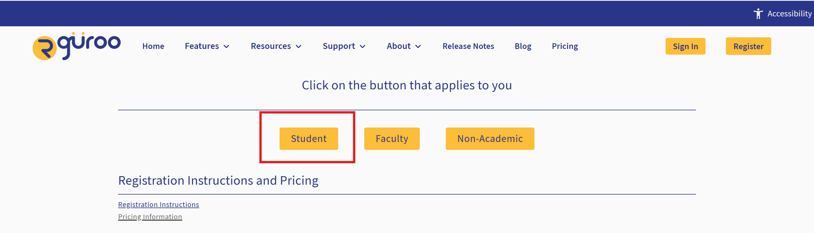

# Getting Started with Rguroo {.unnumbered}

## What is Rguroo?

Rguroo is a statistical software program designed to help students explore data and perform statistical analyses. Throughout this text, Rguroo will be used to carry out calculations, create graphs, and conduct statistical inferences. Using Rguroo allows us to focus on understanding statistical concepts and interpreting results rather than spending excessive time on complicated calculations. As new statistical methods are introduced, you will learn how to use the corresponding tools in Rguroo to perform the analysis and interpret the output.

## Creating a Student Account

To use Rguroo, you will first need to create a student account. 

**Step 1: Registration Page**

Go to the [Rguroo website](https://www.rguroo.com) and select **Register** in the upper-right corner of the page. 

```{r, echo=FALSE}
#| label: fig-rguroo-home
#| fig-cap: 'Rguroo home screen with Register button in upper right-hand corner'
#| fig-alt: 'Rguroo home screen with Register button in upper right-hand corner'
#| out-width: "80%"

```


On the registration page, select **Student**.


```{r, echo=FALSE}
#| label: fig-rguroo-student
#| fig-cap: 'Registration page'
#| fig-alt: 'Registration page showing options of student, faculty, and non-academic'
#| out-width: "80%"

```

**Step 2: Select Acount Type and Verify Email**

Select the type of account needed. Students can choose from the following account types.

- *Create a free trial account*: Try Rguroo for free for ten days. Only one trial account per individual is allowed.
- *Create a new account*: Don’t have an Rguroo account? Select this option to register for a new account.
- *Renew your account*: Extend the subscription for your existing Rguroo account.
- *Extend your trial account*: Is your trial account is about to expire, or is expired? Purchase an Rguroo subscription

Next, select they type of subscription needed.  The following options are available.

- *Purchase Premium Support*: Premium Support is optional and can be added by checking this box.  All accounts come with standard support.
- *Have Access Key*: If you have an Access Key, select this option. Note: This is not a group code.
- If you don’t have an Access Key, select one of the two subscription lengths: 6 Months or 12 Months (check with your instructor on the length you need).

Now, type and retype your student email address in the next two boxes. Your email address will be your Rguroo username. Then, click the **Submit** button.

After clicking submit, check your email.  A verification code will be sent to the email address you provided in the registration page.

::: {.callout-note appearance="simple" icon="false"}
**Don’t see the email in your Inbox?** If you don’t see the verification email in your Inbox within a few minutes, check your Spam or Junk Mail folder.

:::


## Creating and Importing Datasets

### Creating Datasets in One Variable

### Creating a Coningency (Two-Way) Table

### Copy and Paste Data from External Sources

### Importing Datasets

**Rguroo Repository**

**Computer or External File**

**Class Group**

## Dataset Editor

### Inspecting Datasets

### Reclassifying Variables

### Search and Replce Text

### Sorting Data

