# Getting Started with Rguroo {.unnumbered}

## 0.1 What is Rguroo?

Rguroo is a statistical software program designed to help students explore data and perform statistical analyses. Throughout this text, Rguroo will be used to carry out calculations, create graphs, and conduct statistical inferences. Using Rguroo allows us to focus on understanding statistical concepts and interpreting results rather than spending excessive time on complicated calculations. As new statistical methods are introduced, you will learn how to use the corresponding tools in Rguroo to perform the analysis and interpret the output.

[Click Here](https://www.youtube.com/watch?v=vla0uFydqW8) to watch a video overview of Rguroo.

## 0.2 Creating a Student Account

To use Rguroo, you will first need to create a student account.

**Step 1: Registration Page**

Go to the [Rguroo website](https://www.rguroo.com) and select **Register** in the upper-right corner of the page.

```{r, echo=FALSE}
#| label: fig-rguroo-home
#| fig-cap: 'Rguroo home screen with Register button in upper right-hand corner'
#| fig-alt: 'Rguroo home screen with Register button in upper right-hand corner'
#| out-width: "80%"
knitr::include_graphics("Rguroo_outputs/Chapter_0/register_button.png")
```

On the registration page, select **Student**.

```{r, echo=FALSE}
#| label: fig-rguroo-student
#| fig-cap: 'Registration page'
#| fig-alt: 'Registration page showing options of student, faculty, and non-academic'
#| out-width: "80%"
knitr::include_graphics("Rguroo_outputs/Chapter_0/student.png")
```

**Step 2: Select Account Type and Verify Email**

Select the type of account needed. Students can choose from the following account types.

- *Create a free trial account*: Try Rguroo for free for ten days. Only one trial account per individual is allowed.
- *Create a new account*: Don’t have an Rguroo account? Select this option to register for a new account.
- *Renew your account*: Extend the subscription for your existing Rguroo account.
- *Extend your trial account*: Is your trial account is about to expire, or is expired? Purchase an Rguroo subscription

Next, select the type of subscription needed. The following options are available.

- *Purchase Premium Support*: Premium Support is optional and can be added by checking this box. All accounts come with standard support.
- *Have Access Key*: If you have an Access Key, select this option. Note: This is not a group code.
- If you don’t have an Access Key, select one of the two subscription lengths: 6 Months or 12 Months (check with your instructor on the length you need).

Now, type and retype your student email address in the next two boxes. Your email address will be your Rguroo username. Then, click the **Submit** button.

After clicking submit, check your email. A verification code will be sent to the email address you provided in the registration page.

::: {.callout-note appearance="simple" icon="false"}
**Don’t see the email in your Inbox?** If you don’t see the verification email in your Inbox within a few minutes, check your Spam or Junk Mail folder.
:::

Open the email and follow the directions by typing or copy/paste the **Email Verification Code** in the form. Then, click the submit button.

```{r, echo=FALSE}
#| label: fig-email-verification
#| fig-cap: 'Email Verification Page'
#| fig-alt: 'Email verification page showing email and box for verification code.'
#| out-width: "60%"
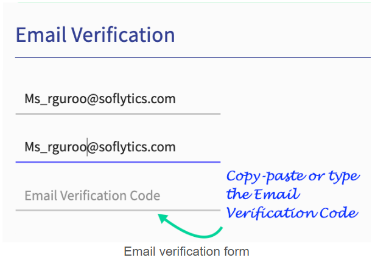
```

**Step 3: Enter Your Information**

If you are creating a new account, fill out the information in the **Your Information** page. You will enter:

- First and last name
- Select U.S. or International
- Your institution/college name.

::: {.callout-note appearance="simple" icon="false"}
**Tips on finding U.S. institution’s names**

Type in the first few letters of your university or college, and you should see the full name in the list. If your university or college has an acronym, type out the first few words. For example, instead of UCLA, type “University of California” and select the campus that you attend.
:::

If you have an Access Key, type it in the space provided, read and check the box for the *Terms of Service*, and click the Submit button. Then, proceed to Step 5.

**Step 4: Billing Information**

If you do not have an access key and need to purchase an Rguroo subscription, enter your credit card number and billing information. Click Submit and go to Step 5.

**Step 5: Sign-in to Rguroo**

If your registration is complete, you should have received an email with a temporary password. You can now log into Rguroo by following the steps below.

- Open the email, and copy your temporary password.
- Go to the link [https://www.rguroo.com](https://rguroo.com).
- Click the Sign in button.
- Type in your Username. Your username is your email address.
- You will be asked for the temporary password that was emailed to you. Type or paste it into the Temporary Password box.
- Type-in a new password, and retype your new password.
- Click the **LOGIN** button.

**Congratulations! Your Rguroo account is ready to use. Have an enjoyable and productive journey with Rguroo!**

::: {.callout-note appearance="simple" icon="false"}
**Always login to Rguroo through Rguroo’s main website**

To sign-in to Rguroo, use the sign in button button on Rguroo’s main website [https://www.rguroo.com](https://rguroo.com). This ensures that you get the latest version of Rguroo, and the Rguroo application gets loaded into your browser correctly.
:::

## 0.3 Rguroo Dashboard and Icons

Before you begin using Rguroo, take a few minutes to explore the dashboard and become familiar with its main features. You do not need to learn every feature at once. As you work through the examples in this book, you will be directed to the appropriate menus and tools. The numbered items below highlight the main areas of the dashboard that you will use. @fig-dashboard illustrates the main areas of the Rguroo dashboard. More detail of each follows.

```{r, echo=FALSE}
#| label: fig-dashboard
#| fig-cap: 'Rguroo Dashboard'
#| fig-alt: 'Rguroo dashboard with ten numbered annotations identifying key areas of the interface. The left side contains menus for Data, Plots, Analytics, Prediction-Classification, Probability-Simulation, and Applets-Calculators. The top contains navigation and account tools. The center displays the dataset workspace with variables arranged in columns and observations in rows, and the right side contains the Columns and Filters panel.'
#| out-width: "100%"
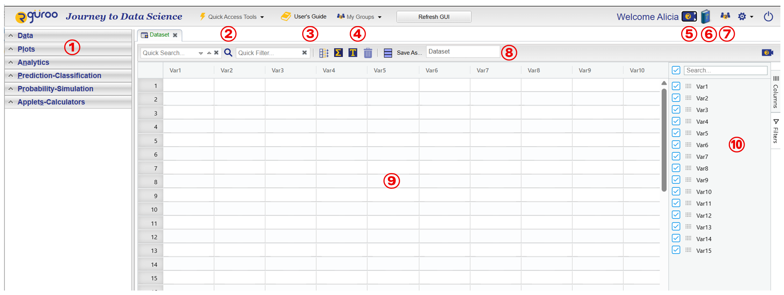
```

[1]{.circle-number} **Toolbox Menu**

The menu on the left organizes Rguroo's statistical tools into categories. Expand Data, Plots, Analytics, Prediction-Classification, Probability-Simulation, or Applets-Calculators to access the tools available within each category.

[2]{.circle-number} **Quick Access Tools**

Provides shortcuts to commonly used Rguroo features, including importing datasets and RGR files, opening the Scientific Calculator, viewing shortcut keys, accessing the Dataset Repository, and opening Jupyter Lite.

[3]{.circle-number} **User's Guide**

Opens the web-based Rguroo User Guide, where you can find instructions and additional help for using Rguroo’s features and tools.

[4]{.circle-number} **My Groups**

Provides access to groups associated with your Rguroo account, such as groups created for your class or course.

[5]{.circle-number} **Tutorial Videos**

Provides access to instructional videos that demonstrate how to use Rguroo’s features and statistical tools.

[6]{.circle-number} **Documentation**

Opens a PDF Rguroo User Guide, where you can find instructions and additional help for using Rguroo’s features and tools.

[7]{.circle-number} **Faculty Dashboard**

Provides instructors with access to course and group management tools and other faculty resources.

[8]{.circle-number} **Save As**

Allows you to name and save the current dataset, plot, or output for later use. Saved tabs will appear in the Data Toolbox.

[9]{.circle-number} **Data Workspace**

Displays a dataset template in a spreadsheet-style format, with variables in columns and observations in rows.

[10]{.circle-number} **Columns and Filters Panel**

Allows you to control which variables are displayed and filter the dataset to focus on selected observations.

[Click Here](https://www.youtube.com/watch?v=gD-V-Jy8i-4) to watch a video walkthrough of the Rguroo dashboard.

::: {.callout-note appearance="simple" icon="false"}
**Common Rguroo Icons**

The following icons are used in Rguroo and throughout the text.

 Preview Icon - Preview your graph or output

 Camera - A video is available

 Folder - The dataset in in a Rguroo repository

:::

## 0.4 Creating and Importing Datasets

Before you can analyze data in Rguroo, the data must first be entered or imported into the program. Rguroo provides several ways to create and work with datasets, depending on how your data are organized and where they are located. In this section, you will learn how to create a dataset containing one variable, enter data organized as a contingency (two-way) table, copy and paste data from an external source, and import an existing dataset into Rguroo. These skills will allow you to prepare your data for the statistical analyses and graphical displays introduced throughout this book.

### 0.4.1 Creating Datasets in One Variable

You can create a dataset directly in Rguroo by entering your observations into the Dataset Editor. For a dataset containing one variable, each value is entered in a separate row of a single column. Follow the steps below to create a dataset in one variable.

1.  Open the **Data** toolbox on the left side of the Rguroo window.
2.  Click the [Data Import]{.dpd} drop-down menu and select [Create New Dataset]{.fun}.
3.  In the [Create New Dataset]{.fun} window:
    - Enter the number of observations in the Rows field.
    - Enter [1]{.typein} for the number of columns.

```{r, echo=FALSE}
#| label: fig-dataset-row-column
#| fig-cap: 'Dialog for Entering Number of Rows and Columns (default set to 200 rows, 15 columns)'
#| fig-alt: 'Dialog for Entering Number of Rows and Columns'
#| out-width: "70%"
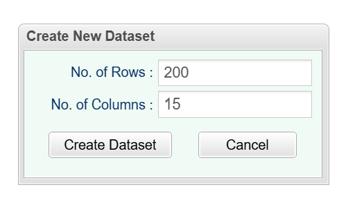
```

4.  Click Create Dataset. A dataset containing one column will open in the Dataset Editor. The variable is initially named Var1. You can rename the variable with a meaningful name that describes the data, such as Height, ExamScore, or StudyHours. To rename the variable, select the three horizontal bars 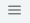 to the right of Var1. Then click *Rename*.
5.  Enter the data values in the column, placing one observation in each row.
6.  In the Save As box, enter a descriptive name for the dataset and save it. The dataset will now show in your **Data** toolbox.

[Click Here](https://www.youtube.com/watch?v=ps://www.youtube.com/watch?v=Is819ogn7sU) to watch a video of how to create a dataset.

[Walkthrough Example: Creating a Dataset in One Variable]{style="color: blue; font-weight: bold;"}

Suppose a student surveys five students in their class and record the number of hours they study per week. The data is recorded in the table below. Enter the data into Rguroo and save as *Study Hours*.

| Study Hours |
|-------------|
| 6           |
| 10          |
| 8           |
| 5           |
| 12          |

::: {style="height: 1rem;"}
:::

**Let's Create the Dataset:** For this dataset, we will need 5 rows and 1 column, so enter [5]{.typein} for No. of Rows and [1]{.typein} for No. of Columns. 

```{r, echo=FALSE}
#| label: fig-example-row-column
#| fig-cap: 'Dialog for Entering Number of Rows and Columns (5 rows, 1 column)'
#| fig-alt: 'Dialog for Entering Number of Rows and Columns (5 rows, 1 column)'
#| out-width: "50%"
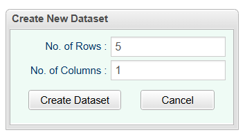
```

Once you have opened the workspace for 5 rows and 1 column, click on the first row to enter your data. Use the *Tab* key on your keyboard to move to the next entry. Once you are finished entering your data, rename your Var1 to "Hours" and save the dataset as *Study Hours*.

Below is an image of the completed and saved dataset.

```{r, echo=FALSE}
#| label: fig-dataset-one
#| fig-cap: 'Study Hours Dataset'
#| fig-alt: 'Study hours dataset entered into Rguroo and saved'
#| out-width: "95%"
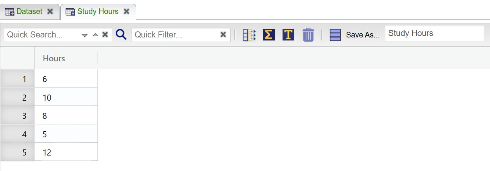
```

Now that you have saved your dataset, it will appear in your **Data** toolbox.

```{r, echo=FALSE}
#| label: fig-data-toolbox
#| fig-cap: 'Data toolbox showing Study Hours dataset'
#| fig-alt: 'Data toolbox showing Study Hours dataset'
#| out-width: "95%"
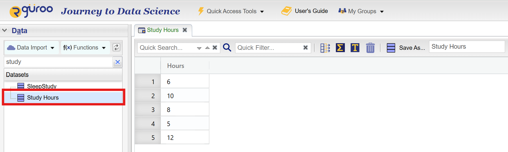
```

*Note: If you have many datasets, you can type the first few letters of the dataset name in the search bar which will narrow the list.*

### 0.4.2 Creating Tables

The Table Editor in Rguroo lets you easily create one-way or two-way frequency tables directly within the application. Follow the steps below to create a table.

1.  Open the **Data** toolbox located on the left-hand side of the Rguroo application window.
2.  Click on the [Data Import]{.dpd} dropdown and select the [Create New Table]{.fun} option.
3.  In the three textboxes at the top left of the Table Editor window, enter a row variable name (*Row Variable*), a column variable name (*Col. Variable*), and a name for the frequency or a numerical variable (*Frequency*).
4.  In the cells with gray backgrounds in the first row of the grid, enter the levels for the column variable.
5.  In the cells with gray backgrounds in the first column, enter the levels for the row variable.
6.  In the white-background cells (i.e., the body of the table), enter values corresponding to the specified row and column levels.
7.  To save your table as a table, enter a name for your table in the Save As Table textbox on the top, and click the Save as table button.
8.  To save your table as a dataset (with variables in columns) enter a name for your dataset in the Save As Dataset textbox on the top, and click the Save as button button to save your dataset. To see your dataset as a table click the View dataset icon.

[Click Here](https://www.youtube.com/watch?v=t8JmZJyUQRc) to watch a video of how to create a table.

[Walkthrough Example: Creating a One-Way Table]{style="color: blue; font-weight: bold;"}

Suppose a pet store records the number of pets of each type currently available for adoption. The data are summarized in the frequency table below. Enter the table into Rguroo and save as *PetStore*

| Pet    | Frequency |
|--------|-----------|
| Dog    | 8         |
| Cat    | 6         |
| Fish   | 4         |
| Bird   | 3         |
| Rabbit | 2         |

::: {style="height: 1rem;"}
:::

**Let's Create the Table:** This table only has one variable, Pet, and the corresponding frequencies of each pet type, so we make a one-way table. Open the table workspace and enter *Pet* for the Row Variable and *Frequency* in the Frequency box. We do not have a column variable, so we will leave that blank. Next, enter the frequencies. Once you have completed entering the frequencies, your table should look like @fig-one-way-table.

```{r, echo=FALSE}
#| label: fig-one-way-table
#| fig-cap: 'Workspace showing table and saved names for Pet Store'
#| fig-alt: 'Workspace showing table and saved names for pet store example'
#| out-width: "95%"
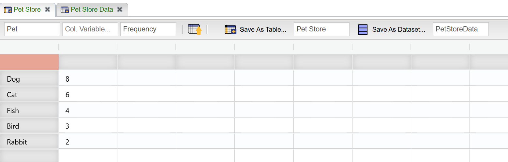
```

For tables, you can save in two ways; a table and/or a dataset. It is recommended that you save as both, so you have both forms available to you for future analysis. For this example, the table is saved as *Pet Store* and it is also saved as a dataset, named *Pet Store Dataset*. Saving the table as a dataset allows you to make charts, graphs, and perform analysis later on.

Once you have saved your table as both a table and dataset, look at your **Data** toolbox. You will see both versions which you can use later. @fig-data-toolbox-pet shows the dataset first and the table saved directly below.

```{r, echo=FALSE}
#| label: fig-data-toolbox-pet
#| fig-cap: 'Data toolbox showing table saved as a table and dataset'
#| fig-alt: 'Data toolbox showing table saved as a table and dataset'
#| out-width: "50%"
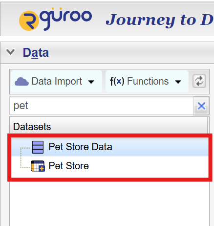
```

[Walkthrough Example: Creating a Two-Way Table]{style="color: blue; font-weight: bold;"}

Suppose students are asked about their preferred type of exercise and whether they prefer to exercise indoors or outdoors. The results are summarized below. Enter the table into Rguroo and save as *Exercise*.

| Type of Exercise | Indoors | Outdoors |
|------------------|---------|----------|
| Walking          | 3       | 8        |
| Running          | 4       | 7        |
| Cycling          | 5       | 9        |

::: {style="height: 1rem;"}
:::

**Let's Create the Table:** This table has two variables, Type of Exercise and Location, so we will create a two-way table. Similar to the example for a one-way table, open the table workspace. For this table, we will enter *Type of Exercise* as the row variable, *Location* for the column variable, and *Counts* as the frequency. Next, enter the counts as shown in the table. When you are finished entering the table, it should look like @fig-two-way.

```{r, echo=FALSE}
#| label: fig-two-way
#| fig-cap: 'Workspace showing table and saved names for Exercise'
#| fig-alt: 'Workspace showing table and saved names for Exercise'
#| out-width: "95%"
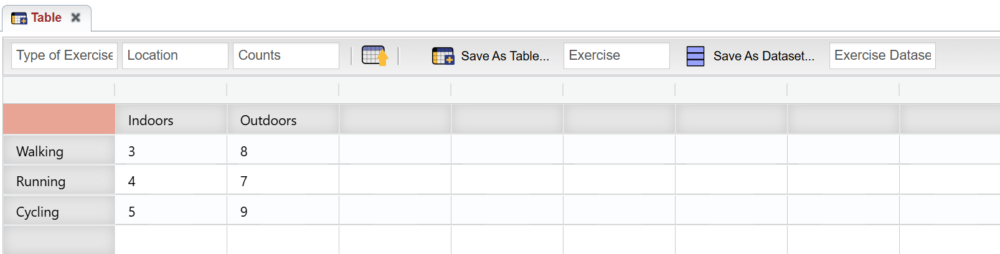
```

As before, we will save the table both as a table and dataset. In this example, the table is named *Exercise* and the dataset is named *Exercise Dataset*.

*Note*: If a table is not saved, the tab in the workspace will show as red. Once saved, the tab will change to green. @fig-not-saved shows the red tab and @fig-saved shows the tab green after saving.

```{r, echo=FALSE}
#| label: fig-not-saved
#| fig-cap: 'Table showing red tab, not saved'
#| fig-alt: 'Table showing red tab, not saved'
#| out-width: "95%"
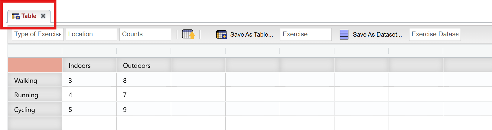
```

```{r, echo=FALSE}
#| label: fig-saved
#| fig-cap: 'Table showing green tab, saved'
#| fig-alt: 'Table showing green tab, saved'
#| out-width: "95%"
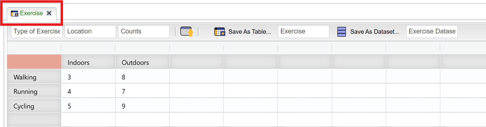
```

As before, once saved, your tables and datasets appear in your **Data** toolbox.

### 0.4.3 Copy and Paste Data from External Sources

Sometimes the data you need may already be available from an external source, such as MyOpenMath, a spreadsheet, or another course resource. Rather than entering each value individually, you can copy and paste the data directly into Rguroo. This is a quick and efficient way to transfer datasets while reducing the chance of errors that can occur when entering data manually.Follow the steps below to copy and paste from an external source.

1.  Open both the program with your external data source (such as MyOpenMath) and Rguroo. Note that Rguroo automatically opens a dataset editor when you login. You can use this workspace to paste your data into.
2.  Go to the external data source and highlight data. Copy the data by pressing Control + C (PC) or Command + C (Mac) on your keyboard.
3.  Go to your dataset workspace in Rguroo and click on the first cell in the dataset editor. Then paste your data by pressing Control + V (PC) or Command + V (Mac) on your keyboard. This will paste the data exactly as shown from the external dataset.
4.  If your dataset is one variable but is showing as multiple variables in Rguroo, cut and paste the columns into one column. To cut the column, highlight the column and press Control + X (PC) or Command + X (Mac) on your keyboard. Then go to the next available space in Var1, click on that empty space and paste using the keyboard commands as above. Continue this until all of your data is in the Var1 column.
5.  Save your data so you can use it for analysis later.

[Click Here](https://www.youtube.com/watch?v=hS-TdldDhB4) to watch a video of how to copy and paste a large dataset from MyOpenMath.

### 0.4.4 Importing Datasets

Rguroo provides several options for importing existing data, making it easy to begin working with a dataset without entering the values manually. You can import a dataset from an external file, select a dataset from the Rguroo Repository, or access datasets that have been shared with you through My Groups. Once imported, the dataset is available in your Data toolbox, where you can view, organize, and analyze the data.

**Rguroo Repository**

The Rguroo Repository provides access to public datasets that are already available within Rguroo. Rather than creating a dataset from scratch or importing one from an external source, you can browse the repository, select a dataset, and add it to your Data Workspace. This is a convenient way to explore existing datasets and quickly begin working with data for statistical analysis. Faculty can create their own private dataset repository to share data with students. For more information on creating your private dataset repository see <span style="background-color: yellow;">Need to link to instructor dashboard section when sections are done</span>. Follow the steps below to import a dataset from the Rguroo repository.

1.  Open the **Data** toolbox located on the left-hand side of the Rguroo application window.
2.  Click on the [Data Import]{.dpd} dropdown and select the [Dataset Repository]{.fun} option. This will open the [Rguroo Dataset Repository]{.fun} dialog box.

```{r, echo=FALSE}
#| label: fig-dataset-import
#| fig-cap: 'Data toolbox showing Rguroo Repository'
#| fig-alt: 'Data toolbox showing Rguroo Repository'
#| out-width: "50%"
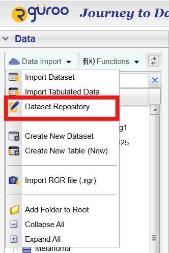
```

3.  If you know the file name, enter the name (or first few letters) in the *Quick Filter* search box. This will narrow the files listed and you can select your dataset.

```{r, echo=FALSE}
#| label: fig-import-quick-filter
#| fig-cap: 'Dataset Repository showing Quick Filter'
#| fig-alt: 'Dataset Repository showing Quick Filter'
#| out-width: "50%"
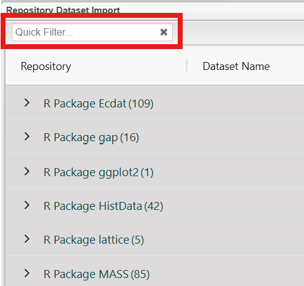
```

4.  Select your dataset, and click import. Your dataset will now be saved in your Data toolbox.

If you are not searching for a specific dataset, feel free to browse the dataset repository. You can still enter key words in the *Quick Filter* search box to narrow down your search.

<span style="background-color: yellow;">Need video</span>

**Computer or External File**

If your dataset is saved on your computer or another storage location, you can import the file directly into Rguroo. You can import files in various formats such as Excel, CSV, text, SPSS, SAS, etc. Once imported, the dataset is added to your Data toolbox, where you can view the data and begin your statistical analysis. Follow the steps below to import a dataset from your computer or external file.

1.  Open the **Data** toolbox located on the left-hand side of the Rguroo application window.
2.  Click on the [Data Import]{.dpd} dropdown and select the [Import Dataset]{.fun} option. This will open the [File Import]{.fun} dialog box.

```{r, echo=FALSE}
#| label: fig-import
#| fig-cap: 'Dataset toolbox showing Import Dataset'
#| fig-alt: 'Dataset toolbox showing Import Dataset'
#| out-width: "50%"
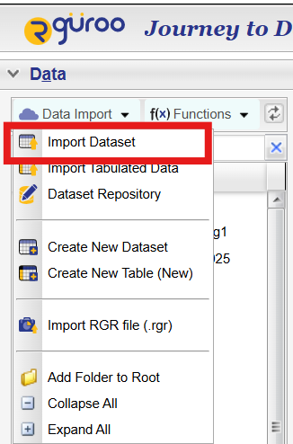
```

3.  If the file is saved on your computer or external drive (such as USB), select *Choose Folder* and select the folder. If the file is from a URL, select *URL* and type or paste the URL in the space provided.

```{r, echo=FALSE}
#| label: fig-import-file
#| fig-cap: 'File Import Dialog'
#| fig-alt: 'File Import Dialog'
#| out-width: "75%"
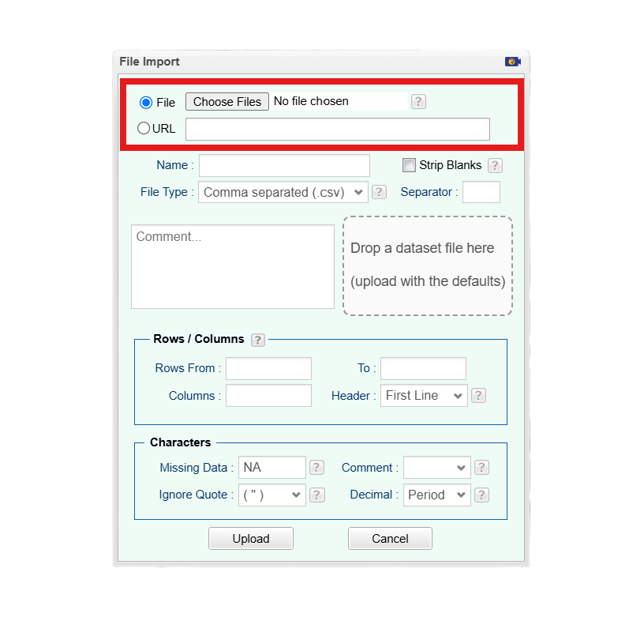
```

4.  Click *Upload* and your dataset will now be available in your Data toolbox.

<span style="background-color: yellow;">Need video</span>

**My Groups**

The My Groups area in Rguroo provides access to datasets that have been shared within a group, such as those provided by your instructor for a course or assignment. You can select a shared dataset and import it into your Data toolbox, where it is ready to view, explore, and analyze. In order to import a dataset from My Groups, your instructor must provide you with the group code where you can join the group. Follow the steps below to join a group and then import a dataset from your group.

1.  To import a dataset from a shared group, you will first need to join the group. To do this, click *My Groups* and select *Join a Group*.

```{r, echo=FALSE}
#| label: fig-join-group
#| fig-cap: 'My Groups Showing Option to Join Group'
#| fig-alt: 'My Groups Showing Option to Join Group'
#| out-width: "75%"
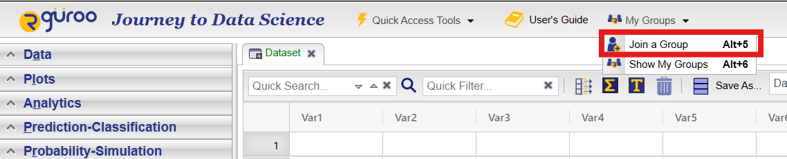
```

2.  Enter the join code provided by your instructor (or group leader) and click *Join Group*.

```{r, echo=FALSE}
#| label: fig-join-group-dialog
#| fig-cap: 'Join Group Dialog with Box to Enter Group Code'
#| fig-alt: 'Join Group Dialog with Box to Enter Group Code'
#| out-width: "75%"
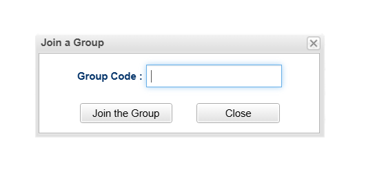
```

3.  Now that you have successfully joined a group, you will have access to import the datasets within that group. To access and import the group datasets, click back on *My Groups*, but now select *Show My Groups*. This will open the [Dataset/Archive repository]{.fun} dialog box.

```{r, echo=FALSE}
#| label: fig-show-groups
#| fig-cap: 'My Groups Showing Option to Show My Groups'
#| fig-alt: 'My Groups Showing Option to Show My Groups'
#| out-width: "75%"
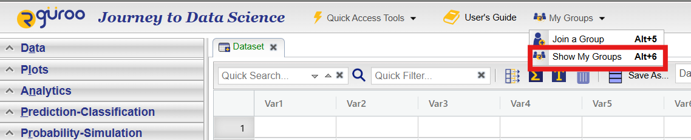
```

4.  In the Dataset/Archive repository dialog box, click on your group and it will show the accessible repositories. Click on the repository you want, and it will display the datasets. Click on a dataset and click *Import Selected Datasets*. You can select mulitple datasets and import them at once by clicking on a dataset, press and hold Control (PC) or Command (Mac) while selecting additional datasets.

```{r, echo=FALSE}
#| label: fig-show-group-dialog
#| fig-cap: 'Dataset/Archive repository dialog'
#| fig-alt: 'Dataset/Archive repository dialog'
#| out-width: "75%"
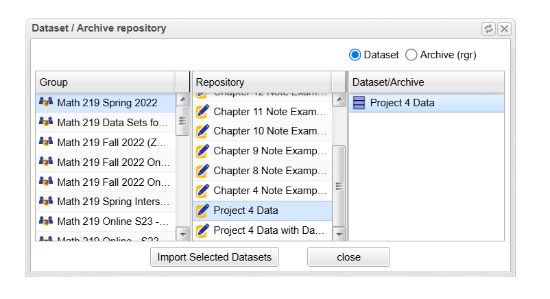
```

<span style="background-color: yellow;">Need video</span>

### 0.4.5 Practice: Try It Yourself

The following practice problems provide an opportunity to become familiar with creating and importing datasets in Rguroo. Use them to build confidence working with different methods of entering and importing data before completing graded assignments.

{width=45px} **Try It: Create a Dataset in One Variable**


A fitness instructor recorded the number of minutes 5 participants exercised during a morning workout session. Create a one-variable dataset in Rguroo using the data below. Name the variable Exercise Time. Save the dataset with an appropriate name.

| Exercise Time |
|---------------|
| 32            |
| 45            |
| 28            |
| 40            |
| 35            |

<br>

{width=45px} **Try It: Create a One-Way Table**

A group of students was asked to identify their preferred way to study for an exam. Their responses are summarized in the table below. Create a one-way table in Rguroo using the data below. Use Study Method as the row variable and enter the corresponding frequencies. Save the table and dataset with appropriate names.

| Study Method      | Frequency |
|-------------------|-----------|
| Practice Problems | 12        |
| Flashcards        | 8         |
| Study Groups      | 6         |
| Reviewing Notes   | 10        |
| Videos            | 4         |

<br>

{width=45px} **Try It: Create a Two-Way Table**

A local animal shelter recorded the type of pet adopted and whether the adoption occurred on a weekday or weekend. Create a two-way table in Rguroo using the data below. Use Adoption Day as the row variable and Type of Pet as the column variable. Save the table and dataset with appropriate names.

| Adoption Day | Dog | Cat | Other |
|--------------|-----|-----|-------|
| Weekday      | 18  | 14  | 6     |
| Weekend      | 22  | 17  | 8     |

<br>

{width=45px} **Try It: Copy and Paste a Large Dataset from External Source**

A coffee shop recorded the number of customers who visited during the first hour after opening on 25 different days. The results are shown below. Create a one-variable dataset in Rguroo by copying and pasting the values into Rguroo. Then, move the data into one column in Rguroo. Name the variable Customers. Save your dataset with an appropriate name.

|     |     |     |     |     |
|----:|----:|----:|----:|----:|
|  24 |  31 |  28 |  35 |  27 |
|  33 |  29 |  38 |  26 |  32 |
|  30 |  36 |  25 |  34 |  29 |
|  37 |  28 |  31 |  40 |  33 |
|  26 |  35 |  30 |  32 |  34 |

<br>

{width=45px} **Try It: Import a Dataset from Rguroo Repository**

Data was collected for two semesters in a statistics class on students’ transportation, demographics, living expenses, preferences, and academic majors. Import the dataset from the Rguroo dataset repository. Remember, you can type in the first part of the dataset name to filter and narrow the list.

 The dataset is available in the Rguroo dataset repository, with the dataset name [class_survey1]{.data}. @tbl-class-survey shows the variables and the first 6 rows of the data set. A complete description of the variables is provided in the [dataset code book](#code-book-class) that follows. 


```{r class-data1-table,echo=FALSE}
#| tbl-alt: "Table showing first 6 rows of statistics class survey dataset"
#| label: tbl-class-survey
#| tbl-cap: "Class Survey"
Class <- read.csv("https://krkozak.github.io/MAT160/class_survey.csv")
knitr::kable(head(Class))
```

::: {#code-book-class .callout-tip .codebook collapse="true"}
## Code book for Class Survey1 Dataset

**Description** The dataset gives survey results from two semesters of statistics classes at Coconino Community College in the years 2018-2019.

Format

This dataset contains the following columns:

[vehicle]{.var}: Type of car a student drives

[gender]{.var}: Self-declared gender of a student

[distance_campus]{.var}: How far a student lives from the Lone Tree Campus of Coconino Community College (miles)

[ice_cream]{.var}: Favorite ice cream flavor

[rent]{.var}: How much a student pays in rent

[major]{.var}: Students declared major

[height]{.var}: Height of the student (inches)

[winter]{.var}: Student's opinion of winter (Love it, Like it, Don't like, No opinion)

Source

Kozak K (2019). Survey results form surveys collected in statistics class at Coconino Community College.

References

Kozak, 2019
:::

## 0.5 Dataset Editor

The Dataset Editor in Rguroo provides tools for viewing and editing an existing dataset. As you work with data, you may need to make changes such as adding or removing observations, renaming variables, or correcting values. The Dataset Editor allows you to make these changes directly within Rguroo so that your data are organized and ready for analysis.

### 0.5.1 Dataset Summary

Once you have imported a dataset into the Data toolbox, you can inspect the data using the Dataset Summary. The Dataset Summary in Rguroo provides an overview of the variables and observations contained in a dataset. It allows you to quickly review the structure and characteristics of the data before beginning an analysis. Examining the dataset summary can help you become familiar with the data and verify that the dataset contains the information you expect. Follow the steps below to inspect the dataset summary.

1. Import your dataset.
2. Go to the **Data** toolbox and right click on the dataset you would like to inspect. Select *Dataset Summary*.

```{r, echo=FALSE}
#| label: fig-dataset-summary-toolbox
#| fig-cap: 'Data toolbox showing Dataset Summary'
#| fig-alt: 'Data toolbox showing Dataset Summary'
#| out-width: "50%"
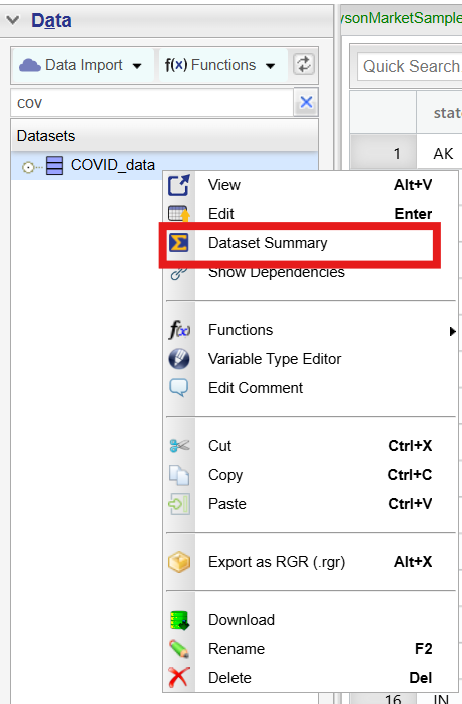
```

3. The dataset summary will now show in your workspace.

```{r, echo=FALSE}
#| label: fig-dataset-summary
#| fig-cap: 'Dataset summary for COVID_data dataset'
#| fig-alt: 'Dataset summary for COVID_data dataset'
#| out-width: "85%"
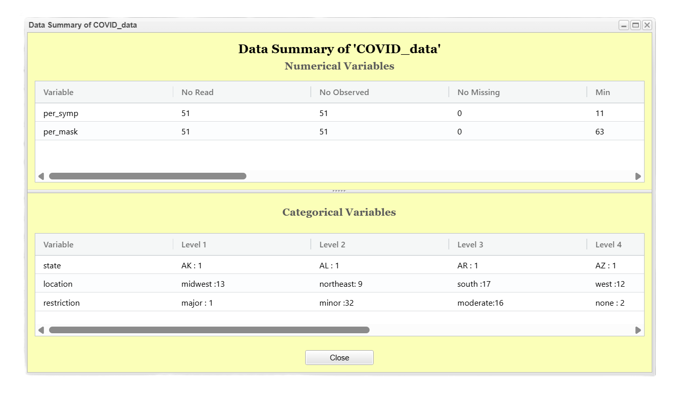
```

[Walkthrough Example: Inspecting Data Using the Dataset Summary]{style="color: blue; font-weight: bold;"}

A sleep study collected information from college students about their sleep habits, academic experiences, and overall well-being. Variables include sleep and wake times, average amount of sleep, class schedules, GPA, classes missed, and measures related to cognition, stress, anxiety, depression, and happiness. Import and inspect the data.

 The dataset is available in the Rguroo dataset repository, with the dataset name [SleepStudy]{.data}. @tbl-sleep shows the variables and the first 6 rows of the data set. A complete description of the variables is provided in the [dataset code book](#code-book-sleep) that follows. 


```{r,echo=FALSE}
#| tbl-alt: "Table showing first 6 rows of SleepStudy"
#| label: tbl-sleep
#| tbl-cap: "Sleep Study"
SleepStudy <- read.csv("https://krkozak.github.io/MAT160/SleepStudy.csv")
knitr::kable(head(SleepStudy))
```

::: {#code-book-sleep .callout-tip .codebook collapse="true"}
## Code book for SleepStudy Dataset

**Description** The dataset gives survey results from a sleep study conducted.

Format

This dataset contains the following columns:

[Gender]{.var}: Gender category reported by the student (0 represents male, 1 represents female).

[ClassYear]{.var}: Student's year in college

[LarkOwl]{.var}: Student's preference for being more active or alert in the morning or evening

[NumEarlyClass]{.var}: Number of early classes the student has

[EarlyClass]{.var}: Indicates whether the student has an early class (0 represents no, 1 represents yes)

[GPA]{.var}: Student's grade point average

[ClassesMissed]{.var}: Number of classes the student has missed

[CognitionZscore]{.var}: Standardized score measuring cognitive performance

[PoorSleepQuality]{.var}: Measure of poor sleep quality

[DepressionScore]{.var}: Score measuring symptoms associated with depression

[AnxietyScore]{.var}: Score measuring symptoms associated with anxiety

[StressScore]{.var}: Score measuring stress-related symptoms

[DepressionStatus]{.var}: Categorical classification based on the student's depression score

[AnxietyStatus]{.var}: Categorical classification based on the student's anxiety score

[Stress]{.var}: Categorical classification of the student's stress level

[DASScore]{.var}: Combined score related to depression, anxiety, and stress

[Happiness]{.var}: Score measuring the student's reported level of happiness

[AlcoholUse]{.var}: Measure or category describing the student's alcohol use

[Drinks]{.var}: Number of alcoholic drinks reported

[WeekdayBed]{.var}: Typical bedtime on weekdays

[WeekdayRise]{.var}: Typical wake-up time on weekdays

[WeekdaySleep]{.var}: Amount of sleep obtained on weekdays

[WeekendBed]{.var}: Typical bedtime on weekends

[WeekendRise]{.var}: Typical wake-up time on weekends

[WeekendSleep]{.var}: Amount of sleep obtained on weekends

[AverageSleep]{.var}: Average amount of sleep obtained

[AllNighter]{.var}: Indicates whether the student has stayed awake all night (0 represents no, 1 represents yes)
:::

**Let's Inspect the Dataset:** First we need to import the dataset. Go to the dataset repository and type in [SleepStudy]{.typein} to the *Quick Filter* search box. Notice that there are a few datasets with a similar name. Select the one that has 253 rows and 27 columns, then click Import.  

```{r, echo=FALSE}
#| label: fig-repository-sleep
#| fig-cap: 'Repository Dataset Import showing SleepStudy data'
#| fig-alt: 'Repository Dataset Import showing SleepStudy data'
#| out-width: "70%"
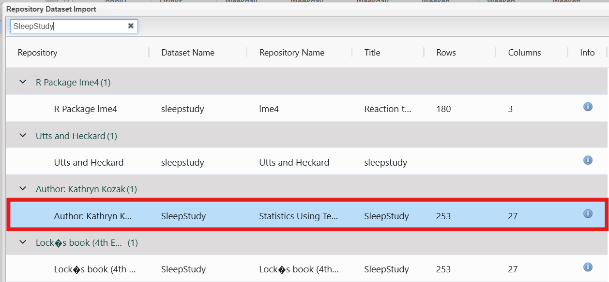
```

The dataset will now show in your Data toolbox. Right-click on the dataset and select [Dataset Summary]{.fun}.

```{r, echo=FALSE}
#| label: fig-summary-select
#| fig-cap: 'Dataset Summary Option after right-clicking SleepStudy dataset'
#| fig-alt: 'Dataset Summary Option after right-clicking SleepStudy dataset'
#| out-width: "40%"
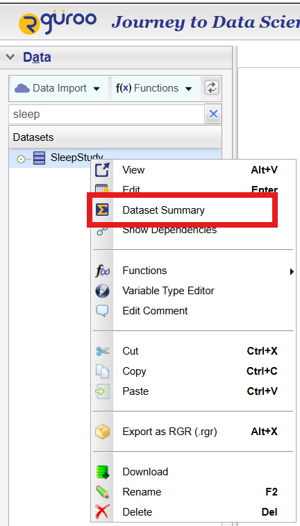
```

You should now see the dataset summary for the [SleepStudy]{.data} data.

```{r, echo=FALSE}
#| label: fig-summary-output-sleep
#| fig-cap: 'Dataset Summary for SleepStudy dataset'
#| fig-alt: 'Dataset Summary for SleepStudy dataset'
#| out-width: "80%"
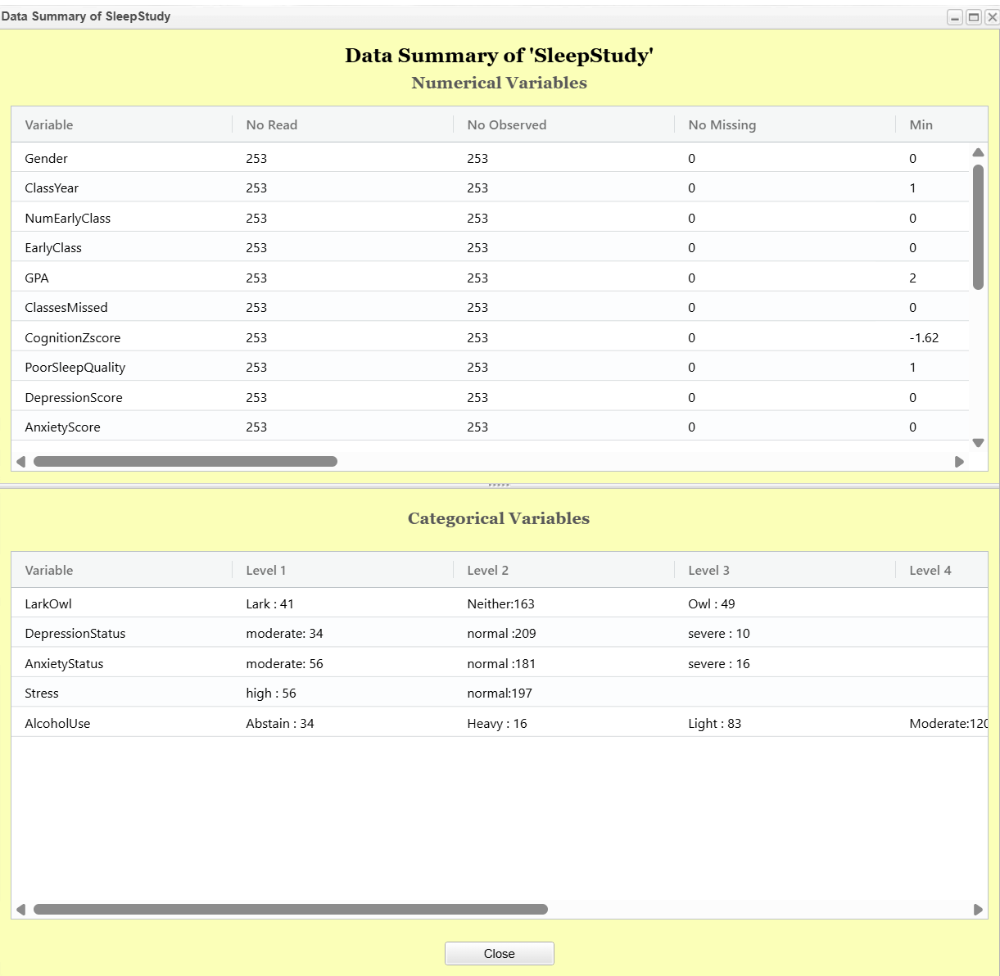
```

The Data Summary of [SleepStudy]{.data} window provides an overview of the numerical and categorical variables in the dataset. The Numerical Variables section shows the number of values read, observed, and missing for each variable. Scroll to the right within this section to view additional summary statistics for each numerical variable, including the minimum, maximum, mean, median, and standard deviation. The Categorical Variables section lists the levels for each categorical variable and the number of observations in each level. For example, LarkOwl contains 41 Larks, 163 Neither, and 49 Owls.

Also notice that gender was categorized as a numerical variable since it was either a 0 for male or 1 for female. We will work on reclassifying categorical variables recorded as numbers in the next subsection.

### 0.5.2 Reclassifying Variables

As we saw with the [SleepStudy]{.data} data, sometimes, numbers in a dataset are used to represent categories rather than numerical values. For example, in the SleepStudy data 0 represented male and a 1 represented female. In Rguroo, reclassifying a variable allows you to identify these values as categories so that the variable is treated appropriately during statistical analysis. Follow the steps below to reclassify a variable.

1. Right click on the dataset and select [Variable Type Editor]{.fun}. This will open the [Variable Type Editor]{.fun} dialog box.

```{r, echo=FALSE}
#| label: fig-data-editor0
#| fig-cap: 'Variable Type Editor from Right-Clicking Dataset'
#| fig-alt: 'Variable Type Editor from Right-Clicking Dataset'
#| out-width: "30%"
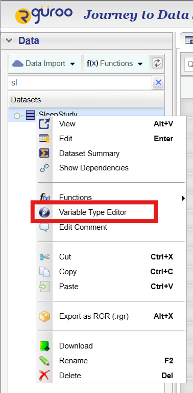
```

2. Click and hold the variable that needs to be reclassified. Drag the variable into the Factor/Categorical Box. 
3. Click Update and your variable will now be reclassified as a categorical variable.
4. If you would like to assign labels to the numbers recorded, click on the variable in the Factor/Categorical box. Notice that the rightmost box is now populated.
5. Click under the Label heading and type in a label name for the number. Repeat for all numbers.
6. Click Update.

[Click Here](https://www.youtube.com/watch?v=iOdHHDHOaAA) to watch a video of how to reclassify a variable.

[Walkthrough Example: Reclassifying a Variable]{style="color: blue; font-weight: bold;"}

We will work with the [SleepStudy]{.data} data since we already noticed that gender was recorded as a number when we know it is a categorical variable.

**Let's Reclassify the Variable:** You should have imported the SleepStudy data if you followed the last Walkthrough example. If not, import the dataset now.

To access the [Dataset Variable Editor]{.fun}, right click on the [SleepStudy]{.data} dataset in your **Data** toolbox. Select [Variable Type Editor]{.fun}. You should now see the dialog box on your screen.

```{r, echo=FALSE}
#| label: fig-data-editor1
#| fig-cap: 'Variable Type Editor from Right-Clicking Dataset'
#| fig-alt: 'Variable Type Editor from Right-Clicking Dataset'
#| out-width: "30%"

```

Click and drag the variable [Gender]{.var} into the Factor/Categorical Box. Click update to save.  

```{r, echo=FALSE}
#| label: fig-data-editor2
#| fig-cap: 'Moving Gender to Factor/Categorical Box for SleepStudy Dataset'
#| fig-alt: 'Moving Gender to Factor/Categorical Box for SleepStudy Dataset'
#| out-width: "80%"
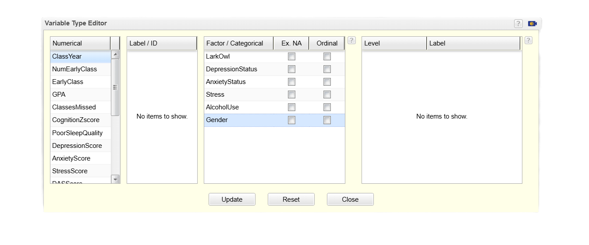
```

Since we were told in the code book that 0 represents male and 1 represents female, let's go one extra step and assign a label to each number. Click on the variable [Gender]{.var} and the Label box will populate. Double-click on the label space next to 0 and enter [Male]{.typein}. Repeat this process and enter [Female]{.typein} for 1. Click update to save.

```{r, echo=FALSE}
#| label: fig-data-editor3
#| fig-cap: 'Labeling 0 as Male and 1 as Female'
#| fig-alt: 'Labeling 0 as Male and 1 as Female'
#| out-width: "90%"
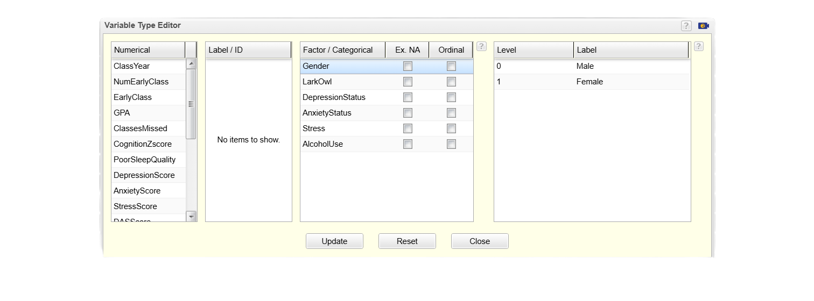
```


### 0.5.3 Search and Replace

The Search and Replace feature in Rguroo allows you to quickly locate specific values in a dataset and replace them with new values. This is especially useful for correcting data-entry errors, updating values, or making consistent changes throughout a dataset without editing each observation individually. Follow the steps below to search for entries or search and replace.

1. Open a dataset you wish to inspect.
2. To quickly locate a data entry, type the text into the *Quick Search* box. Click the down-arrow to search forward (down the column) or click the up-arrow to search backward (up the column) from your cursor location. The first instance of your search will be highlighted in green, while all instances will be highlighted in yellow, shown in @fig-quick-search-output.

```{r, echo=FALSE}
#| label: fig-quick-search
#| fig-cap: 'Rgruoo Dashboard Showing Quick Search'
#| fig-alt: 'Rgruoo Dashboard Showing Quick Search'
#| out-width: "90%"
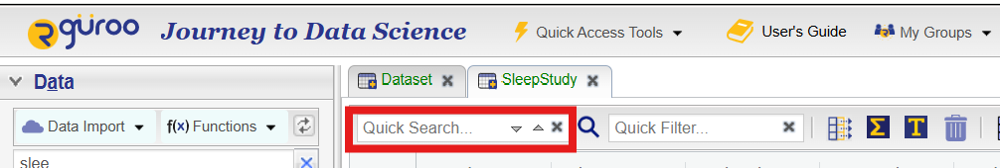
```

```{r, echo=FALSE}
#| label: fig-quick-search-output
#| fig-cap: 'Data Search for "Lark" Output'
#| fig-alt: 'Data Search for "Lark" Output'
#| out-width: "50%"
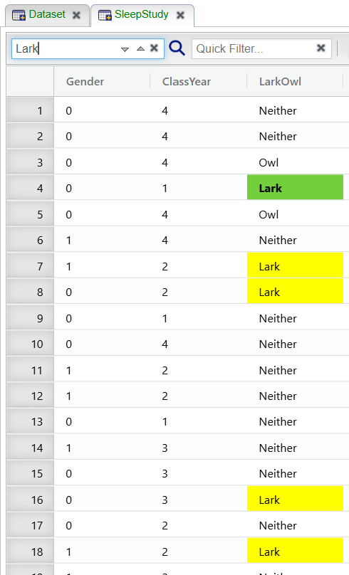
```

3. To perform a refined search or search and replace, click the *Search and Replace* icon ⌕. This will open the [Search and Replace]{.fun} dialog.

```{r, echo=FALSE}
#| label: fig-advanced-search
#| fig-cap: 'Rgruoo Dashboard Showing Advanced Search'
#| fig-alt: 'Rgruoo Dashboard Showing Advanced Search'
#| out-width: "90%"
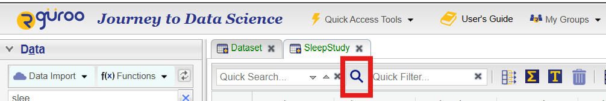
```

```{r, echo=FALSE}
#| label: fig-advanced-search-dialog
#| fig-cap: 'Dialog Box for Advanced Search'
#| fig-alt: 'Dialog Box for Advanced Search'
#| out-width: "60%"
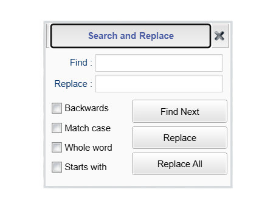
```

4. In the *Find* textbox, type the text or value you want to search. You can also refine your search by selecting one of the following options: Match case, Whole word, or Starts with.
5. Click the *Find Next* button and the first instance of the searched text will be highlighted in green. All other instances will be highlighted in yellow. Note: the output will be the same format as using the *Quick Search*
6. To move to the next occurrence, click the *Find Next* button. Alternatively, if you want to move backwards, check the *Backwards* box and then click the *Find Next* button.
7. Once you search for text and are sure you want to replace, you can enter the replacement and click *Replace* or *Replace All*.

::: {.callout-note appearance="simple" icon="false"}
⚠️ You cannot undo cells that you replace using the [Search and Replace]{.fun} dialog.
:::

<span style="background-color: yellow;">Need video</span>

[Walkthrough Example: Search a Dataset]{style="color: blue; font-weight: bold;"}

Use the [SleepStudy]{.data} dataset to search for severe anxiety.

**Let's Search the Dataset:** To search the dataset for severe anxiety, first we need to open the dataset.  Once open, we can either use the *Quick Search* or *Advanced Search* by clicking the eyeglass.  Since we are simply searching, let's use the *Quick Search*.

Begin by typing "severe" into the *Quick Search* textbox. Then click on the down-arrow. Your data should now be highlighted wherever it has "severe" as an entry. All occurrences are highlighted in yellow and the occurrence where the cursor is located is highlighted in green.

```{r, echo=FALSE}
#| label: fig-output-sleep-search
#| fig-cap: 'Dataset with "severe" Highlighted'
#| fig-alt: 'Dataset with "severe" Highlighted'
#| out-width: "60%"
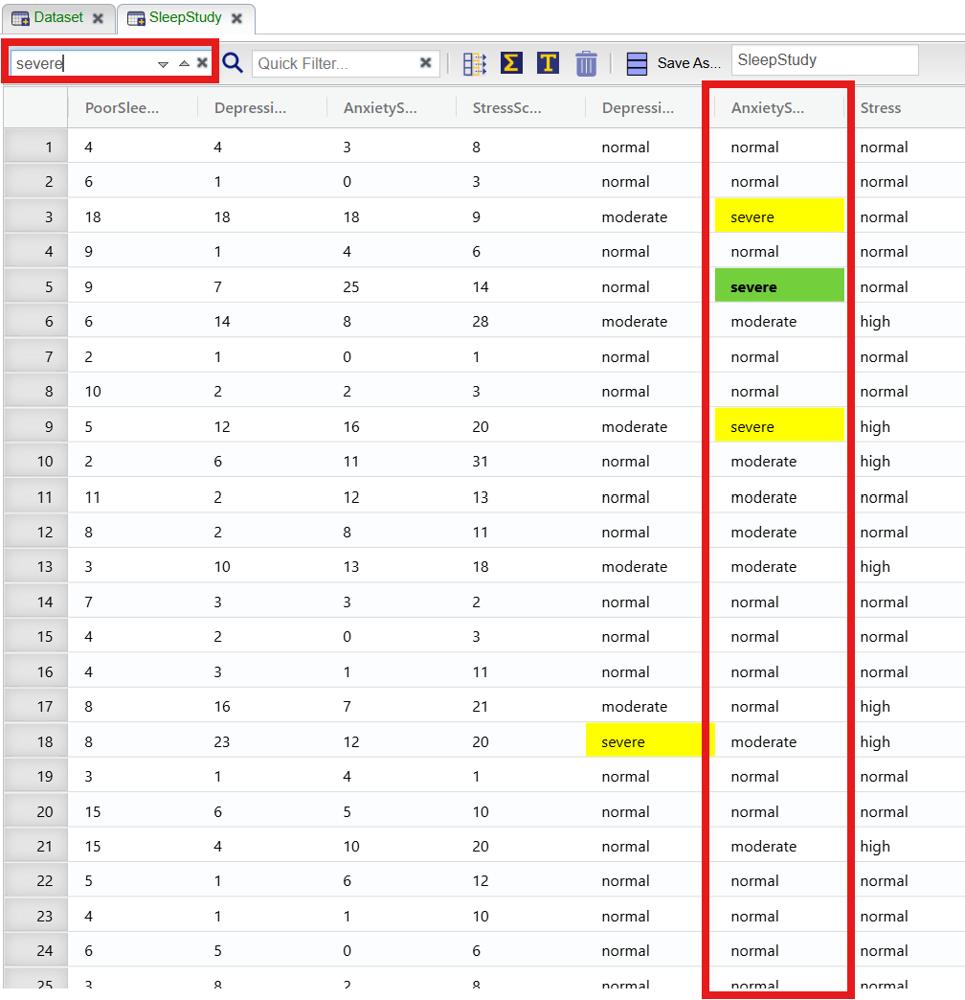
```

Notice that "severe" is also highlighted in the [DepressionScore]{.var} column since that was a label used for that variable as well. Since we are only interested in severe cases of the variable [AnxietyScore]{.var}, we will focus on that column only. If you scroll down the dataset, we can see that "severe" is not an overwhelming occurence, since most of the column is not highlighted as "severe."

### 0.5.4 Sorting and Filtering Data

Sorting and filtering in Rguroo can help you organize a dataset and focus on the observations that are most relevant to your analysis. Sorting rearranges the rows based on the values of one or more variables, making it easier to identify patterns, compare values, or locate specific observations. Filtering temporarily limits the displayed data to observations that meet specified conditions, allowing you to examine a particular group or subset without changing the original data. 

**Sorting**
When you click on a variable name (column label) for the first time, the values in that column get sorted in ascending order, and an up-arrow appears next to the variable name. If you click on the variable name for a second time, the values in the column will be sorted in descending order, and a down-arrow appears next to the variable name. Clicking on the variable name for a third time will return the values of the variable to their original order.

You can repeat this process by clicking on the variable name again to toggle the sorting between original, ascending, and descending orders. Each click on the variable name will cycle through these three orders.

```{r, echo=FALSE}
#| label: fig-sorting
#| fig-cap: 'Rguroo Sorting Options'
#| fig-alt: 'Rguroo Sorting Options: (a) unsorted, (b) sorted in ascending order, (c) sorted in descending order'
#| out-width: "90%"
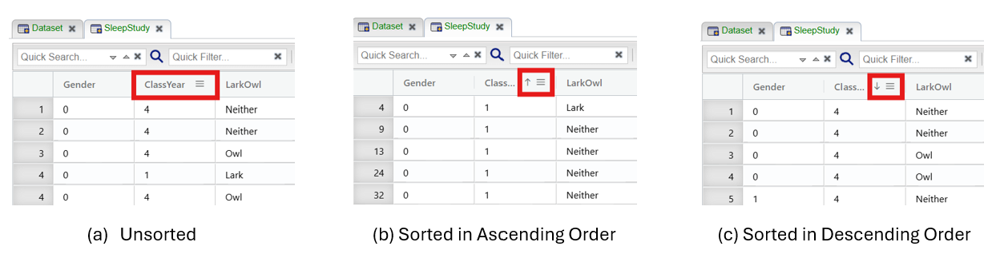
```

**Filtering**

To open and close the Filters Sidebar menu, click on the Filters tab. Variable names are listed in this tab. When you click on a variable name, you will see all of its unique values. You can filter the values of a selected variable by deselecting them. Note that when you filter a value from a variable, all rows containing that value will be removed from the dataset. To restore a filtered value, simply select the value again.

```{r, echo=FALSE}
#| label: fig-filter-tab
#| fig-cap: 'Filter Tab Showing Class Year Expanded'
#| fig-alt: 'Filter Tab Showing Class Year Expanded'
#| out-width: "90%"
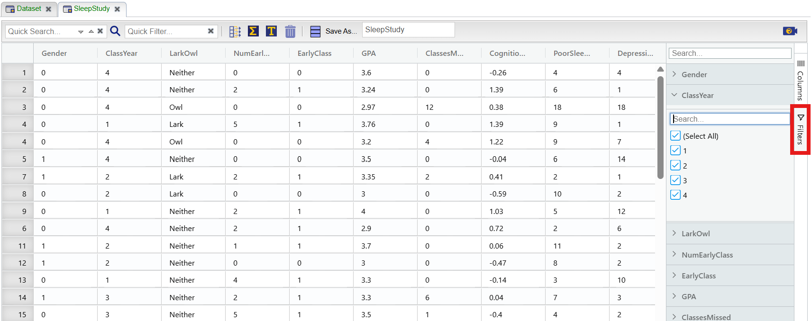
```

[Walkthrough Example: Sort and Filter a Dataset]{style="color: blue; font-weight: bold;"}

Use the [SleepStudy]{.data} dataset to sort [GPA]{.var} in descending order. Then filter to show only females.

**Let's Sort and Filter:** Open the [SleepStudy]{.data} dataset. To sort [GPA]{.var} in descending order, click on [GPA]{.var} twice. Now that we have sorted the variable, we want to filter to show only females.  Remember that the [SleepStudy Code Book] (#code-book-sleep) defined 0 as male and 1 as female. To only show females (1), click the filter menu on the left of the dataset workspace. Then click [Gender]{.var}. This will open the options of what is visible. Click 0 to unselect males. The dataset should now be sorted by [GPA]{.var} and only include females.

```{r, echo=FALSE}
#| label: fig-sort-filter
#| fig-cap: 'SleepStudy with GPA Sorted in Descending Order and Filtered to Show Females'
#| fig-alt: 'SleepStudy with GPA Sorted in Descending Order and Filtered to Show Females'
#| out-width: "90%"
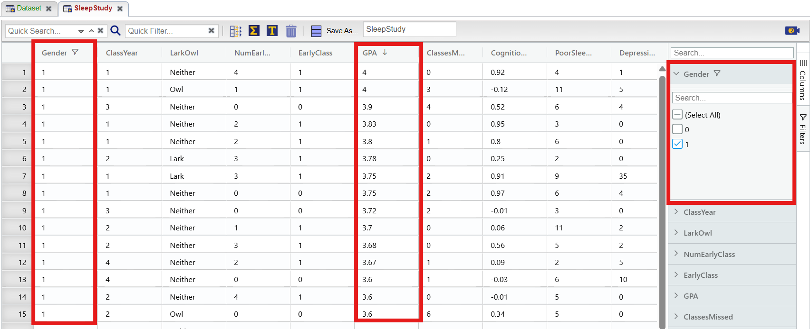
```


### 0.5.5 Practice: Try It Yourself

The following practice problems provide an opportunity to become familiar with inspecting, reclassifying, and sorting datasets in Rguroo. Use them to build confidence working with different methods of entering and importing data before completing graded assignments.

{width=45px} **Try It: Inspect Data Using the Dataset Summary**

Import the [Tuition_4_year]{.data} dataset. Open the Dataset Summaries box and make observations about the variables. Remember to scroll right to see summary statistics for numerical variables. 

{width=45px} **Try It: Reclassify a Variable**

Use the [SleepStudy]{.data} to reclassify the variable [AllNighter]{.var} to a categorical variable. Review the [SleepStudy Code Book] (#code-book-sleep) to determine the definitions of 0 and 1.

{width=45px} **Try It: Sort and Filter Data**

Use the [Tuition_4_year]{.data} dataset to sort [INSTATE_TUITION]{.var} in ascending order. Then filter to include only colleges in California (CA).