**Before you begin, click to expand the box below to review the process for importing a dataset.**

::: {#Importing-GSS2024-to-Rguroo .callout-note appearance="simple" collapse="true" icon="none" title="{width=22px style='vertical-align:middle;'}  Importing Data to Rguroo"} 

1. Open the **Data** toolbox in Rguroo.  
2. From the [Data Import]{.dpd} dropdown, select [Dataset Repository]{.fun}.  
3. In the top search box, type [kozak]{.typein}, then select the [Statistics Using Technology – Kozak]{.repo} repository.  
4. In the middle search box, type the first few letters of the dataset name, and choose your desired dataset name that appears in the lower panel.  
5. Click the [Import]{.button}. The dataset will be imported to your Rguroo account.
6. Click [Close]{.button} to exit the dialog.  
7. To view the dataset, double-click the dataset name under the **Data** toolbox list.
:::

In this chapter we develop methods for drawing inferences about a population mean $\mu$ (read mu). Examples of population means abound in practice: the mean SAT math score among incoming freshmen at a particular university, the mean nightly sleep hours among college students, the mean one-way commute time in a metropolitan area, and the mean flipper length of Adélie penguins in the Palmer Archipelago. These are four of the running examples we use throughout the chapter, and many other applications follow the same pattern.

The framework established in the Foundations of Inference chapter applies here unchanged. We still begin with a research question about a population parameter — now $\mu$. We collect a random sample, compute a statistic from it, and study how that statistic varies from sample to sample through its sampling distribution (see @sec-foundations-populations). We test claims by examining where our observed statistic falls within the null distribution(@sec-foundations-hypotheses), and make decisions using p-values (@sec-foundations-pvalue) or critical regions (@sec-foundations-critical-region). Confidence intervals (@sec-foundations-confidence-intervals), significance levels, Type I and Type II errors (@sec-foundations-errors), and confidence levels all retain the meanings established in the foundations chapter.

How do we tell, in a real-world problem, whether the parameter of interest is a mean or a proportion? As discussed in @sec-foundations-mean-vs-prop, the key is the variable measured on each individual in the population. If the variable is **numerical** — a score, a quantity, a measurement — the parameter is a population **mean** $\mu$. All the examples in this chapter are of this type: SAT scores in points, sleep duration in hours, commute time in minutes, flipper length in millimeters. If instead the variable is categorical (success/failure, yes/no), the parameter is a population **proportion** $p$, and the methods from the previous chapter apply.

What changes between the two chapters is not the logic of inference, but the type of data we analyze and the distributions used to model sampling variability. In the previous chapter the variable was binary, so the natural statistic was the count of successes $X$, with its binomial distribution; the sample proportion $\hat{p} = X/n$ served as an estimator of $p$. In this chapter the variable is numerical, so neither the count $X$ nor the binomial distribution apply. The natural statistic is the sample mean, the arithmetic average of the numerical measurements in the sample. As a random variable—that is, before we collect data—we denote it by $\bar{X}$. Once we have actually collected the data, we obtain a specific numerical value of this average, which we denote by $\bar{x}_{\text{obs}}$ and call the **observed sample mean**. As before, inference is based on determining where the observed statistic lies within the sampling distribution of the statistic.

We begin with situations in which the variable under study has a normal distribution in the population. Later in the chapter, we will see that many of the same methods remain valid even when the population distribution is not normal. We will cover both one-population and two-population settings. In the one-population setting we draw inferences about a single population mean $\mu$. In the two-population setting we compare two population means $\mu_1$ and $\mu_2$ through their difference $\mu_1 - \mu_2$. We begin with the one-population case.

## Basics of Hypothesis Testing for a Population Mean {#sec-concept-setup-mean}

In this section we set up the elements common to all hypothesis tests for a population mean: the form of the null and alternative hypotheses, and the null distribution of $\bar{X}$. The specifics of this null distribution depend on what we assume about the population, leading to two cases that we develop in the subsections that follow.

### Null and Alternative Hypotheses {#sec-null-alternative-mean}

As established in @sec-foundations-three-forms, the null and alternative hypotheses always come in one of three forms, depending on the nature of the research question. For a population mean $\mu$, with $\mu_0$ denoting a specific value, the three cases are:

$$
\begin{aligned}
\text{Case 1: } 
&\begin{cases}
H_0: \mu \leq \mu_0 \\
H_a: \mu > \mu_0
\end{cases}
\qquad
\text{Case 2: } 
\begin{cases}
H_0: \mu \geq \mu_0 \\
H_a: \mu < \mu_0
\end{cases} \\
\\
\text{Case 3: } 
&\begin{cases}
H_0: \mu = \mu_0 \\
H_a: \mu \neq \mu_0
\end{cases}
\end{aligned}
$$

The value $\mu_0$ is the **boundary value** of $H_0$ — the value at which the Type I error probability is maximized for one-sided tests (see @sec-foundations-boundary).

Recall from @sec-foundations-three-forms that in Cases 1 and 2, the alternative hypothesis claims that $\mu$ is either greater than $(>)$ or less than $(<)$ $\mu_0$, pointing in a single direction. These are called **one-sided** (or **one-tailed**) hypotheses. In Case 3, the alternative hypothesis claims only that $\mu$ is different from $(\neq)$ $\mu_0$, without specifying a direction. This is called a **two-sided** (or **two-tailed**) hypothesis. The form of the hypotheses determines how we set up our decision rules.

Let's begin with a few examples.

:::{#exm-sat-csuf-mean}
## SAT Math Scores at CSUF

According to the [College Board](https://reports.collegeboard.org/media/pdf/2025-total-group-sat-suite-of-assessments-annual-report%20ADA-v0.2_0.pdf), the mean score on the math portion of the SAT for the high school graduating class of 2025 was 508 points, with a standard deviation of 113 points. These figures are computed from the more than 2 million high school students who took the exam that year.

We wish to investigate whether the mean math SAT score among incoming freshmen in fall 2025 at California State University, Fullerton (CSUF) is *higher* than the national mean. Since CSUF does not require the SAT for admission, the exact record is not available, so we take a random sample of $n = 40$ incoming CSUF freshmen and obtain a sample mean of $\bar{x}_{\text{obs}} = 542$ points. Using this information, answer the following questions:

a\. What is the population of interest?
b\. Describe the parameter $\mu$ in words.
c\. Write the null and alternative hypotheses.
:::

::: {.callout-tip .solution-callout collapse="true" icon=false}
## 🔎 Solution

a\. The population of interest is all incoming freshmen in fall 2025 at California State University, Fullerton (CSUF).

b\. $\mu$ is the mean math SAT score for all incoming freshmen in fall 2025 at CSUF.

c\. The null and alternative hypotheses are as follows:
$$
\begin{cases}
H_0: \mu \leq 508 \\
H_a: \mu > 508
\end{cases}
$$
:::

:::{#exm-sleep-university-mean}
## Sleep Hours Among University Students

The [National Sleep Foundation](https://www.thensf.org/how-many-hours-of-sleep-do-you-really-need/) and the American Academy of Sleep Medicine recommend that young adults sleep between 7 and 9 hours per night, with 7 hours often cited as the minimum needed for healthy cognitive and physical functioning. There is widespread concern, however, that college students fall short of this recommendation.

We wish to investigate whether the mean nightly sleep among students at our university is *less than* 7 hours. We take a random sample of $n = 15$ students and ask each student how many hours they slept the previous night. The resulting sample has a mean of $\bar{x}_{\text{obs}} = 6.4$ hours and a standard deviation of $s=1.2$ hours. Using this information, answer the following questions:

a\. What is the population of interest?
b\. Describe the parameter $\mu$.
c\. Write the null and alternative hypotheses.
:::

::: {.callout-tip .solution-callout collapse="true" icon=false}
## 🔎 Solution

a\. The population of interest is all students at our university.

b\. $\mu$ is the mean nightly sleep, in hours, for all students at our university.

c\. The null and alternative hypotheses are as follows:
$$
\begin{cases}
H_0: \mu \geq 7 \\
H_a: \mu < 7
\end{cases}
$$
:::

:::{#exm-commute-metro-mean}
## Commute Time in a Metropolitan Area

According to the [U.S. Census Bureau's American Community Survey](https://www.census.gov/topics/employment/commuting/guidance/acs-1yr.html), the mean one-way commute time for U.S. workers in 2023 was 26.8 minutes. Local commuting patterns can differ substantially from the national average, however, because of differences in population density, transportation infrastructure, and the prevalence of remote work.

We wish to investigate whether the mean one-way commute time among workers in our metropolitan area *differs* from the national mean. We take a random sample of $n = 15$ commuters from the area and record each person's one-way commute time. The sample has a mean of $\bar{x}_{\text{obs}} = 24.8$ minutes and a standard deviation of $s = 9.6$ minutes. Using this information, answer the following questions:

a\. What is the population of interest?
b\. Describe the parameter $\mu$.
c\. Write the null and alternative hypotheses.
:::

::: {.callout-tip .solution-callout collapse="true" icon=false}
## 🔎 Solution

a\. The population of interest is all workers in our metropolitan area\.

b\. $\mu$ is the mean one-way commute time, in minutes, for all workers in our metropolitan area\.

c\. The null and alternative hypotheses are as follows:
$$
\begin{cases}
H_0: \mu = 26.8 \\
H_a: \mu \neq 26.8
\end{cases}
$$
:::

:::{#exm-penguin-flipper-mean}
## Flipper Length of Adélie Penguins

The [Palmer Penguins](https://allisonhorst.github.io/palmerpenguins/) dataset contains body measurements collected between 2007 and 2009 on 342 penguins from three species — Adélie, Chinstrap, and Gentoo — at three islands in the Palmer Archipelago, Antarctica. The data were assembled by Dr. Kristen Gorman and the Palmer Station Long Term Ecological Research (LTER) program and have since become a widely used dataset in introductory statistics and data science. Among Adélie penguins, flipper length is an important morphological measurement used in studies of body condition and adaptation, and a commonly cited reference value for the mean flipper length of Adélie penguins is 188 mm.

We wish to investigate whether the mean flipper length among Adélie penguins in the Palmer Archipelago *differs* from this reference value. Rather than working from summary statistics, in this example we use the raw flipper length measurements of all $n = 151$ Adélie penguins recorded in the dataset. Using this information, answer the following questions:

a\. What is the population of interest?
b\. Describe the parameter $\mu$.
c\. Write the null and alternative hypotheses.
:::

Click to open the codebook for the [PalmerPenguin]{.dataset} dataset:

::: {#code-book-palmerpenguins .callout-tip .codebook collapse="true"}

## Code book for Dataset PalmerPenguins

Dataset Name: [PalmerPenguins]{.data}

This dataset contains measurements collected from penguins observed near Palmer Station, Antarctica, as part of the Palmer Penguins study. The dataset includes $n = 342$ penguins from three species.

The variables included in this dataset are described below.

[Species]{.var}: Penguin species

- Adélie   
- Chinstrap  
- Gentoo  

[Island]{.var}: Island where the penguin was observed

- Biscoe  
- Dream  
- Torgersen  

**Penguin Anatomy and Measurements**

{width=60% fig-align="center"}

[BillLength]{.var}: Bill length of the penguin (in millimeters)

[BillDepth]{.var}: Bill depth of the penguin (in millimeters)

[FlipperLength]{.var}: Flipper length of the penguin (in millimeters)

[BodyMass]{.var}: Body mass of the penguin (in grams)

[Sex]{.var}: Sex of the penguin

- Male  
- Female  

[Year]{.var}: Year in which the observation was recorded

- 2007  
- 2008  
- 2009  

Source

Horst, A. M., Hill, A. P., & Gorman, K. B. palmerpenguins: [Palmer Archipelago (Antarctica)penguin data](https://allisonhorst.github.io/palmerpenguins/).

:::

::: {.callout-tip .solution-callout collapse="true" icon=false}
## 🔎 Solution

a\. The population of interest is all Adélie penguins in the Palmer Archipelago.

b\. $\mu$ is the mean flipper length, in millimeters, of all Adélie penguins in the Palmer Archipelago.

c\. The null and alternative hypotheses are as follows:
$$
\begin{cases}
H_0: \mu = 188 \\
H_a: \mu \neq 188
\end{cases}
$$
:::

### Homework for @sec-concept-setup-mean

1. The Kyoto Protocol, signed in 1997, required participating countries to begin reducing their carbon emissions; it became enforceable in February 2005. In 2004, the mean CO2 emission was 4.87 metric tons per capita. A researcher wants to determine whether the mean CO2 emission per capita in 2010 *differs* from the 2004 mean.

   a. What is the population of interest?
   b. Describe the parameter $\mu$.
   c. Write the null and alternative hypotheses.

2. The U.S. Food and Drug Administration (FDA) sets 1.0 mg/kg as the allowable amount of mercury in fish that is consumed. To assess whether fish in Florida lakes meet this standard, largemouth bass were collected from 53 different lakes and the mercury concentration in each was measured. A researcher wants to determine whether the mean amount of mercury in Florida bass *differs* from the allowable amount of 1.0 mg/kg.

   a. What is the population of interest?
   b. Describe the parameter $\mu$.
   c. Write the null and alternative hypotheses.

## The Null Distribution of the Sample Mean {#sec-null-distribution-mean}

As we noted in @sec-foundations-populations, to make inferences about $\mu$, we use the sample mean $\bar{X}$ as our statistic, and we work with its sampling distribution.

To make this distribution concrete, we will **assume that the variable under study has a normal distribution** in the population. Two reasons motivate this assumption. First, the normal distribution provides a reasonable model for many naturally occurring numerical variables, including adult heights, weights, exam scores, and a wide range of biological and physical measurements. Second, under this assumption, the sampling distribution of $\bar{X}$ takes a clean, exact form that allows us to focus on the main ideas of inference without the distraction of approximations or special cases. In @sec-QQ-Plot-mean we discuss how to assess this assumption graphically with a statistical test and normal probability plot, and in @sec-large-sample-mean we show that the methods developed under the normality assumption remain approximately valid for large samples even when the population is not normal.

The sampling distribution of $\bar{X}$ depends on the unknown population mean $\mu$ — the very quantity we want to make an inference about. As in foundations (@sec-foundations-boundary), we proceed by evaluating the sampling distribution at the boundary value of $H_0$: the value $\mu_0$ where the Type I error probability is maximized. For two-sided tests, $H_0$ specifies $\mu = \mu_0$ directly. For one-sided tests, $\mu_0$ is the boundary of the range of $\mu$ values allowed by $H_0$.

::: {.callout-note appearance="minimal"}
## The Null Distribution

The **null distribution** of $\bar{X}$ is the sampling distribution of $\bar{X}$ evaluated at $\mu = \mu_0$, the boundary value of $H_0$. This is the distribution we use for hypothesis testing — to compute p-values and to determine critical regions. 
::: 

Under the normality assumption introduced above, the form of this null distribution depends on whether the population standard deviation $\sigma$ is known. When $\sigma$ is known, the null distribution is exactly normal. When $\sigma$ is unknown — the typical situation in practice — we estimate it from the sample, and the resulting null distribution is a Student $t$ distribution. The subsections that follow develop each case in turn.

### When $\sigma$ Is Known {#sec-mean-inference-known-sigma}

In practice, the population standard deviation $\sigma$ is rarely known exactly. There are, however, situations in which a value of $\sigma$ has been established from extensive prior data and can reasonably be treated as known. The SAT example in @exm-sat-csuf-mean is one such case: the standard deviation of $\sigma = 113$ points is computed from the scores of more than 2 million students who took the exam in 2025, a population large enough that we can reasonably treat this value as known when investigating the mean score among a particular subgroup such as incoming CSUF freshmen. 

Beyond examples of this kind, beginning with the known-$\sigma$ case is helpful pedagogically because it allows us to focus on the main ideas of statistical inference while working with a simpler sampling distribution. Once these ideas are established, we will turn to the more realistic setting in which $\sigma$ is unknown and must be estimated from the sample data.

Before stating the result, we pause to clarify a phrase that will appear repeatedly throughout this chapter.

::: {.callout-note}
## A Convention on "When $H_0$ Is True"

For a two-sided test $H_0: \mu = \mu_0$, the phrase "when $H_0$ is true" is unambiguous: it means $\mu = \mu_0$.

For a one-sided test such as $H_0: \mu \leq \mu_0$, however, $H_0$ allows many values of $\mu$ (namely, every $\mu \leq \mu_0$), and "when $H_0$ is true" could in principle refer to any of them. As established in @sec-foundations-boundary, the **boundary value** $\mu_0$ is the value within $H_0$ at which the Type I error probability is maximized; controlling the error rate at $\mu_0$ automatically controls it at every other value of $\mu$ allowed under $H_0$.

**Convention.** For the remainder of this chapter, whenever we say *"when $H_0$ is true,"* *"under $H_0$,"* or *"assuming the null hypothesis,"* we mean **at the boundary value $\mu_0$**. We adopt this shorthand once and for all, and will not repeat the justification.
:::

Under the assumptions introduced earlier, the sample mean $\bar{X}$ has a normal distribution when $H_0$ is true. This distribution serves as the null distribution for hypothesis testing about the population mean $\mu$.

::: {.callout-note appearance="minimal" title="The Null Distribution"}
\ 

Under the assumptions that

- the variable under study has a **normal distribution** in the population,
- the population standard deviation $\sigma$ is known,
- the sample size is $n$, and
- the boundary value specified by $H_0$ is $\mu = \mu_0$,

the null distribution of the sample mean $\bar{X}$ is

$$
\bar{X} \sim N\left(\mu_0,\ \frac{\sigma}{\sqrt{n}}\right).
$$

:::

The result above tells us that, when $H_0$ is true, the sample mean $\bar{X}$ is centered at $\mu_0$ and varies around it with standard deviation $\sigma/\sqrt{n}$. For instance, in the SAT example with hypothesis $H_0: \mu \leq 508$, the random variable $\bar{X}$ has a normal distribution centered at 508 with standard deviation $113/\sqrt{40} \approx 17.87$ points. Roughly 95% of all possible sample means from random samples of size 40 would fall within about 35 points of 508. Sample means much larger than 508 would be unusual and would provide evidence against $H_0$.

Some texts work with a standardized version of the sample mean, namely

$$
Z = \frac{\bar{X} - \mu_0}{\sigma/\sqrt{n}} \sim N(0,1),
$$

and for this reason the procedure is commonly called the **$z$-test**. Rguroo reports critical regions and p-values using both the standardized statistic $Z$ and the sample mean $\bar{X}$ on its original scale.

In this text, we will primarily use the null distribution of $\bar{X}$ directly rather than its standardized version. Working on the original scale of the data allows us to interpret critical regions and p-values more naturally in the context of the problem and avoids the additional step of converting observations to standardized scores. In the SAT example, for instance, it is easier to reason about a sample mean of 542 points relative to a hypothesized population mean of 508 points than to translate everything into the unitless $z$ scale.


### When $\sigma$ Is Unknown {#sec-mean-inference-unknown-sigma}

In practice, only in rare cases do we know the population standard deviation $\sigma$. The good news is that the sample standard deviation $s$ provides a good estimate of $\sigma$, and statisticians have developed theory for using $s$ in place of $\sigma$ when the population distribution is normal. As in the known-$\sigma$ case, we therefore continue to assume that the variable under study has a normal distribution in the population.

When $\sigma$ is estimated by $s$, the sample mean $\bar{X}$ no longer has a normal sampling distribution. Instead, $\bar{X}$ follows a closely related distribution called the **Student $t$ distribution** (or simply $t$ distribution). The $t$ distribution is similar to the normal — symmetric, bell-shaped, and (in our setting) centered at $\mu_0$ — but has heavier tails to reflect the extra uncertainty introduced by estimating $\sigma$ from the sample. It has one shape parameter called the **degrees of freedom**, denoted $\text{df}$, which equals $n - 1$ in mean inference. We give the full description of the $t$ distribution in @sec-t-distribution at the end of this subsection.

::: {.callout-note appearance="minimal" title="What has a $t$ distribution?"}
\

It is important to be clear about *what* is assumed to be normal and *what* follows a $t$ distribution. The assumption is that the **variable under study** has a normal distribution in the population. Under this assumption, the **statistic** $\bar{X}$ follows a $t$ distribution. In other words, the normality assumption is about the individual measurements, while the $t$ distribution describes the behavior of the sample mean computed from those measurements.
:::

::: {.callout-note appearance="minimal" title="The Null Distribution"}
\ 

Under the assumptions that

- the variable under study has a **normal distribution** in the population,
- the population standard deviation $\sigma$ is unknown and is estimated by the sample standard deviation $s$,
- the sample size is $n$, and
- the boundary value specified by the null hypothesis is $\mu = \mu_0$,

the null distribution of the sample mean $\bar{X}$ is

$$
\bar{X} \sim t_{n-1}\left(\mu_0,\ \frac{s}{\sqrt{n}}\right),
$$

a $t$ distribution with $n - 1$ degrees of freedom, centered at $\mu_0$ and with estimated standard error

$$
\hat\sigma_{\bar X} = \frac{s}{\sqrt{n}}.
$$

:::

The result above parallels the known-$\sigma$ case, with two changes. First, the normal distribution is replaced by a $t$ distribution. Second, because $\sigma$ is no longer available, we replace it with the sample standard deviation $s$, so the scale of the distribution is the **estimated** standard error $\hat\sigma_{\bar X} = s/\sqrt{n}$ rather than the known standard error $\sigma/\sqrt{n}$. As in the known-$\sigma$ case, the distribution is centered at $\mu_0$ when the null hypothesis is true, and sample means far from $\mu_0$ constitute evidence against $H_0$.

For instance, in the sleep example, suppose the null hypothesis is $H_0: \mu \geq 7$ and we have a sample of size $n = 15$ with sample standard deviation $s = 1.2$ hours. Then $\bar{X}$ follows a $t$ distribution with $n - 1 = 14$ degrees of freedom, centered at 7 hours and with estimated standard error $1.2/\sqrt{15} \approx 0.310$ hours. Sample means much smaller than 7 with this scale would be unusual under $H_0$.

Some texts work with a standardized version of the sample mean, namely

$$
T = \frac{\bar{X} - \mu_0}{s/\sqrt{n}} \sim t_{n-1}.
$$

This distribution, like the standard normal distribution is centered at zero, and its scale is determined only by the degrees of freedom. Rguroo reports critical regions and p-values using both the standardized statistic $T$ and the sample mean $\bar{X}$ on its original scale.

As in the known-$\sigma$ case, in this text we will primarily use the null distribution of $\bar{X}$ directly rather than its standardized version. Working on the original scale of the data allows us to interpret critical regions and p-values in the units of the problem. In the sleep example, for instance, it is more natural to reason about a sample mean of 6.4 hours relative to a hypothesized mean of 7 hours than to translate everything into the unitless $t$ scale.

::: {.callout-tip appearance="minimal" title="When the $t$ and normal distributions agree"}
\

As discussed in @sec-t-distribution below, the $t$ distribution becomes closer to the standard normal distribution as the degrees of freedom increase. By the time the degrees of freedom reach about 30 — that is, a sample size of roughly $n = 30$ or more — the two distributions are nearly indistinguishable, and the critical values and p-values they produce are essentially the same. For this reason, with large samples it makes little practical difference whether one uses the $t$ distribution or the normal distribution, and the resulting inference is usually nearly identical. We nonetheless recommend using the $t$ distribution whenever $\sigma$ is unknown, regardless of sample size: it is always at least as appropriate as the normal, and it requires no judgment about whether the sample is "large enough."
:::

#### The Student $t$ Distribution {#sec-t-distribution}

The name *Student* was the pen name of William Sealy Gosset, a statistician working for Guinness Brewery in Ireland in the early 1900s. At the time, Guinness restricted employees from publishing research under their own names in order to protect company information and trade secrets. As a result, Gosset published his work under the pseudonym *Student*. His research led to the development of the $t$ distribution, which allows us to make reliable inferences about population means when the population standard deviation is unknown.

The standard Student $t$ distribution is similar in shape to the standard normal distribution: both are symmetric, bell-shaped, and centered at 0. However, unlike the standard normal distribution, the $t$ distribution depends on its degrees of freedom $\text{df}$, with different values of $\text{df}$ producing slightly different shapes. @fig-three-t-distributions compares several $t$ distributions with different degrees of freedom to the standard normal distribution. When the degrees of freedom are small, the $t$ distribution is more spread out and has heavier tails. As the degrees of freedom increase, the $t$ distribution becomes closer and closer to the standard normal distribution.

```{r, echo=FALSE}
#| fig-cap: "Three $t$ distributions, with 1, 3, and 10 degrees of freedom, compared with the standard normal distribution (dashed gray). As the degrees of freedom increase, the $t$ distribution becomes taller at its center, its tails grow lighter, and its shape approaches that of the standard normal."
#| label: fig-three-t-distributions
#| fig-alt: "Four overlaid bell-shaped density curves on a horizontal axis from -4 to 4, distinguished by both color and line style. The t distribution with 1 degree of freedom (orange, dotted) is the lowest and flattest at the center with the heaviest tails. The t distribution with 3 degrees of freedom (green, dashed) is taller, and the t distribution with 10 degrees of freedom (blue, solid) is taller still with lighter tails. The standard normal distribution (gray, finely dashed) is the tallest and narrowest. As the degrees of freedom increase, the t curves rise at the center, pull in their tails, and approach the standard normal."
#| out-width: "80%"
knitr::include_graphics("Rguroo_outputs/Mean Inference/three_t_distributions_by_df.png")
```

The heavier tails of the $t$ distribution are shown more clearly in @fig-normal-two-tail, which compares the standard normal distribution to a $t$ distribution with 4 degrees of freedom. Notice that the $t$ distribution places more probability in the tails and less probability near the center. This difference is important because, when $\sigma$ is unknown, we replace it with the sample standard deviation $s$. Since $s$ varies from sample to sample, additional uncertainty is introduced into the inference procedure. The heavier tails of the $t$ distribution account for this extra uncertainty.

```{r, echo=FALSE}
#| label: fig-normal-two-tail
#| fig-cap: 'Comparison of the standard normal distribution and the $t$ distribution with 4 degrees of freedom.'
#| fig-alt: 'Two overlaid bell-shaped density curves on a horizontal axis ranging from -4 to 4. The standard normal distribution is shown as a solid blue curve, while the t distribution with 4 degrees of freedom is shown as a dashed orange curve. The normal curve is taller near the center at 0 and decreases more quickly in the tails. The t curve is lower at the center and lies above the normal curve in the tails. The right-tail region beyond x = 2 is shaded for both distributions, and the shaded area for the t distribution is visibly larger, illustrating that the t distribution with 4 degrees of freedom has heavier tails than the standard normal distribution.'
#| out-width: "80%"
knitr::include_graphics("Rguroo_outputs/Mean Inference/t4_vs_normal_tail_comparison.png")
```

The amount of additional uncertainty depends on the sample size. Small samples provide less information about the population standard deviation, so the uncertainty is larger and the $t$ distribution has noticeably heavier tails. As the sample size increases, $s$ becomes a more stable estimate of $\sigma$, the additional uncertainty decreases, and the $t$ distribution moves closer to the standard normal distribution. In mean inference, the degrees of freedom equals $\text{df} = n - 1$, tied directly to the sample size. When $n$ is small, $s$ is an unreliable estimate of $\sigma$, the degrees of freedom is small, and the $t$ distribution has heavy tails to reflect this added uncertainty. As $n$ grows, the degrees of freedom increase and the tails of the $t$ distribution become lighter. In this way, the $t$ distribution automatically adjusts the amount of uncertainty in the inference to match the amount of information in the sample.

Just as the standard normal distribution can be shifted and rescaled to obtain a general normal distribution with any center and standard deviation, the standard $t$ distribution also has a more general form. We write this as

$$
X \sim t_{\text{df}}(\text{location}, \text{scale}),
$$

where $\text{df}$ denotes the degrees of freedom. The *location* parameter determines the center of the distribution, while the *scale* parameter controls its spread. In mean inference, the location is the hypothesized population mean $\mu_0$, and the scale is the estimated standard error $s/\sqrt{n}$, giving the null distribution $\bar{X} \sim t_{n-1}(\mu_0,\ s/\sqrt{n})$ stated above.


## Making a Decision: P-value and Critical Region {#sec-making-decision-mean}

There are two equivalent ways to make a decision in a hypothesis test, both of which we developed in the proportion chapter: the p-value approach and the critical region approach. The two approaches present the same evidence in different forms. The critical region approach answers the question "for which values of $\bar{X}$ would we reject $H_0$?", while the p-value approach answers the question "given $x_{\text{obs}}$, our observed value of $\bar{X}$, how strong is the evidence against $H_0$?". Rejecting $H_0$, using significance level $\alpha$ and using the critical region is equivalent to obtaining a p-value less than $\alpha$, so the two approaches always lead to the same decision.

### p-value Approach

Conceptually, the p-value measures how strongly the evidence in our observed sample favors the alternative hypothesis, assuming that the null hypothesis is true. As in the proportion setting, we develop the idea of p-value through the $H_a$ *support*: the set of values of the sample mean $\bar{X}$ that are as favorable, or more favorable, to the alternative hypothesis than the value we actually observed.

To make this concrete, recall that our observed sample mean is denoted $\bar{x}_{\text{obs}}$, and that we evaluate evidence using the null distribution of $\bar{X}$. This null distribution is $N\!\left(\mu_0,\, \sigma/\sqrt{n}\right)$ when $\sigma$ is known, and $t_{n-1}\!\left(\mu_0,\, s/\sqrt{n}\right)$ when $\sigma$ is unknown; in both cases, the probabilities below are computed under the appropriate distribution. The $H_a$ support depends on the form of the alternative hypothesis. The three callouts that follow summarize the $H_a$ support and the corresponding p-value for each type of alternative hypothesis.


::: {.callout-note appearance="minimal"}
## p-value for the One-Sample Test of $\mu$

In each case, the p-value is computed under the null distribution of $\bar{X}$, which depends on whether $\sigma$ is known:

- When $\sigma$ is known: $\bar{X} \sim N\!\left(\mu_0,\, \sigma/\sqrt{n}\right)$.
- When $\sigma$ is unknown: $\bar{X} \sim t_{n-1}\!\left(\mu_0,\, s/\sqrt{n}\right)$.

| Alternative Hypothesis | $H_a$ Support | p-value |
|---|---|---|
| $H_a: \mu > \mu_0$ | $\bar{X} \geq \bar{x}_{\text{obs}}$ | $P\!\left(\bar{X} \geq \bar{x}_{\text{obs}} \mid \mu = \mu_0\right)$ |
| $H_a: \mu < \mu_0$ | $\bar{X} \leq \bar{x}_{\text{obs}}$ | $P\!\left(\bar{X} \leq \bar{x}_{\text{obs}} \mid \mu = \mu_0\right)$ |
| $H_a: \mu \neq \mu_0$ | $\lvert \bar{X} - \mu_0 \rvert \geq \lvert \bar{x}_{\text{obs}} - \mu_0 \rvert$ | $2 \times \begin{cases} P\!\left(\bar{X} \leq \bar{x}_{\text{obs}} \mid \mu = \mu_0\right) & \text{if } \bar{x}_{\text{obs}} < \mu_0 \\[4pt] P\!\left(\bar{X} \geq \bar{x}_{\text{obs}} \mid \mu = \mu_0\right) & \text{if } \bar{x}_{\text{obs}} \geq \mu_0 \end{cases}$ |
:::

In each case, the p-value is the probability, computed under the null distribution, of observing a sample mean at least as favorable to $H_a$ as the one actually observed.

Once the p-value has been computed, the decision rule is the same regardless of the form of the alternative hypothesis: reject $H_0$ if the p-value is less than the significance level $\alpha$, and fail to reject $H_0$ otherwise.

Intuitively, a small p-value means that the observed sample mean would be unusual under the null hypothesis, providing evidence against the null hypothesis. A p-value larger than $\alpha$ means that the observed sample mean is reasonably consistent with the null hypothesis, and we have insufficient evidence to reject it.

### Critical Region Approach

To implement the critical region approach for testing hypotheses about $\mu$, we need a rule that ensures the probability of a Type I error, when $\mu$ equals the boundary value $\mu_0$, is equal to a given significance level $\alpha$. That is, the critical region must satisfy
$$
P(\text{Rejecting } H_0 \mid \mu = \mu_0) = \alpha.
$$
The form of the critical region depends on the alternative hypothesis: large values of $\bar{X}$ are evidence against $H_0$ when $H_a$ points to large values of $\mu$, small values of $\bar{X}$ are evidence against $H_0$ when $H_a$ points to small values of $\mu$, and values of $\bar{X}$ far from $\mu_0$ in either direction are evidence against $H_0$ when $H_a$ allows departure in either direction. The callout that follow summarize the critical region in each of these cases.

::: {.callout-note appearance="minimal"}
## Critical Region for the One-Sample Test of $\mu$

All critical values are found using the null distribution of $\bar{X}$, which depends on whether $\sigma$ is known:

- When $\sigma$ is known: $\bar{X} \sim N\!\left(\mu_0,\, \sigma/\sqrt{n}\right)$.
- When $\sigma$ is unknown: $\bar{X} \sim t_{n-1}\!\left(\mu_0,\, s/\sqrt{n}\right)$.

| Alternative Hypothesis | Critical Region | Critical Value Condition |
|---|---|---|
| $H_a: \mu > \mu_0$ | $\bar{x}_{\text{obs}} \geq c$ | $P(\bar{X} \geq c \mid \mu = \mu_0) = \alpha$ |
| $H_a: \mu < \mu_0$ | $\bar{x}_{\text{obs}} \leq c$ | $P(\bar{X} \leq c \mid \mu = \mu_0) = \alpha$ |
| $H_a: \mu \neq \mu_0$ | $\bar{x}_{\text{obs}} \leq c_1$ or $\bar{x}_{\text{obs}} \geq c_2$ | $P(\bar{X} \leq c_1) = P(\bar{X} \geq c_2) = \alpha/2$ |
:::

Finally, in the critical region approach, we reject $H_0$ in favor of $H_a$ if the observed sample mean $\bar{x}_{\text{obs}}$ falls in the rejection region. Otherwise, we fail to reject $H_0$.


#### Worked Example: $\sigma$ Known {#sec-worked-examples-known-sigma}

We now apply the framework to the SAT example. As noted earlier, the SAT setting is one of the rare cases in which the population standard deviation $\sigma$ can reasonably be treated as known (here, $\sigma = 113$ points, computed from the scores of more than 2 million students). The remaining three running examples — sleep, commute time, and Adélie penguin flipper length — are taken up in @sec-worked-examples-unknown-sigma, where we treat $\sigma$ as unknown and use the Student $t$ distribution.

:::{#exm-sat-csuf-mean-known}
## SAT Math Scores at CSUF

We return to the SAT setting introduced in @exm-sat-csuf-mean. Recall that the national mean math SAT score for the high school graduating class of 2025 was 508 points, with a standard deviation of 113 points, and that we wished to investigate whether the mean math SAT score among incoming CSUF freshmen in fall 2025 was higher than the national mean. A random sample of $n = 40$ incoming CSUF freshmen yielded a sample mean of $\bar{x}_{\text{obs}} = 542$ points.

The hypotheses are
$$
\begin{cases}
H_0: \mu \leq 508 \\
H_a: \mu > 508
\end{cases}
$$
where $\mu$ denotes the mean math SAT score among incoming CSUF freshmen in fall 2025. Assume that the population of math SAT scores is Adélie , and treat the population standard deviation as known with $\sigma = 113$ points. Perform a test of hypothesis at the $\alpha = 0.05$ significance level by answering the following questions:

a\. What is the null distribution of $\bar{X}$?
b\. Use Rguroo's [Mean Inference]{.fun} function to obtain the critical region. Interpret the critical region in the context of the problem, and using the observed value, state whether you reject or fail to reject $H_0$.
c\. State a probability statement that defines the p-value for this test, and describe it in words.
d\. Use Rguroo to obtain the p-value, interpret it in the context of the problem, and state whether you reject or fail to reject $H_0$.
e\. Give your overall conclusion.
:::

:::: {.callout-tip .solution-callout collapse="true" icon=false}
## 🔎 Solution

a\. The null distribution is 

$$\bar{X}\sim N\left(508, \frac{113}{\sqrt{40}}\right)\approx N\left(508,17.867 \right)
$$

b\. Click to expand the box below to see how to use the [Mean Inference]{.fun}  function in Rguroo to answer this question.

::: {#mean-inference-sat .callout-note appearance="simple" collapse="true" icon="none" title="{width=22px style='vertical-align:middle;'} One-Population mean hypothesis test - CSUF SAT example"}

1. Open the **Analytics** toolbox in Rguroo.  

2. From the [Analysis]{.dpd} dropdown, select [Mean Inference]{.fun} --> [One Population]{.fun}. This opens the [One Population Mean Inference]{.dialog} dialog.

3. Fill out the textboxes in the **Data** section of the dialog with the following values:

   - [Sample Mean]{.des}: [542]{.typein}, the value of $\bar{x}_{\text{obs}}$.
   - [Pop S.d.]{.des}: [113]{.typein}, the population standard deviation.
   - [Sample Size]{.des}: [40]{.typein}, the size of the sample $n$.

4. In the text box [$\mu$ = Mean of]{.des} enter a label for the parameter. For this example we enter [CSUF SAT Math Scores]{.typein}.

5. Open the [Test of Hypothesis]{.tab} tab and enter the following:
   - Leave the [Significance Level]{.des} textbox at the default value of [0.05]{.typein}.
   - In the [Alternative Hypothesis $\mu$]{.dpd} dropdown, select [>]{.typein} and enter [508]{.typein}, the value stated in $H_a$.
   - Select the [z-statistic]{.des} checkbox to use the normal distribution.

6. Click the  button to open the [Advanced Features]{.dialog} dialog. In the **Test of Hypothesis** section select [P-value Graph]{.des} and [Critical Region Graph]{.des}. This will instruct Rguroo to give results for both critical regions and p-value.

7. Click the preview icon  to view the output.

8. Click the  button and save the result as [CSUFSAT]{.typein}.

::: {.callout-tip .inner-callout collapse="false" title="Rguroo One-Population Mean Inference dialogs"}

```{r,echo=FALSE}
#| fig-alt: "Rguroo dialog boxes for conducting a one-population mean hypothesis test for the CSUF SAT Math example. The left panel shows the main One Population Mean Inference dialog with sample mean 542, population standard deviation 113, sample size 40, significance level 0.05, and alternative hypothesis μ > 508 using the z-statistic method. The right panel shows the Advanced Features dialog with options for displaying p-value and critical region graphs."
#| fig-cap: "Rguroo setup for the CSUF SAT Math one-sample mean hypothesis test."
#| out-width: "100%"
knitr::include_graphics("Rguroo_dialogs/Mean Inference/CSUFSAT.png")
```

:::
:::

::: {.callout-tip .inner-callout collapse="false" title="Rguroo Output: CSUF SAT example"}
<div tabindex="0" class="rg-iframe-wrapper">
  <iframe
    src="Rguroo_html_output/Mean Inference/CSUFSAT_docx/CSUFSAT.html"
    class="rg-iframe"
    title="Rguroo output: One Population Mean Hypothesis Test - CSUF SAT Example">
  </iframe>
</div>
:::

<!-- @fig-sat-math-cr -->

The right-hand side plot of the **_Critical Region Graph_** in the Rguroo output displays the critical region in the observed data scale. As shown, the critical value for a significance level of $\alpha =0.05$ is 537.39 and thus the critical region is $\bar{X} >537.39$. Thus, if an observed sample mean is larger than 537.39, we would reject $H_0$.

Our observed sample mean is $\bar{x}_{\text{obs}} = 542$ (shown by the green triangle) falls in the rejection region since it is greater than 537.39. Therefore we reject $H_0$ at 5\% level of significance.

<!--

```{r,echo=FALSE}
#| fig-alt: "Critical region graphs for the CSUF SAT Math one-sample z-test with alternative hypothesis μ > 508. The left panel shows the null distribution of the sample mean on the original SAT score scale with mean 508 and standard deviation 17.867. The rejection region is shaded in the upper tail beyond the critical value 537.39, and the observed sample mean 542 is marked with a green triangle inside the rejection region. The right panel shows the equivalent graph on the standardized z scale with critical value 1.6449 and observed z statistic 1.903."
#| warning: FALSE
#| label: fig-sat-math-cr
#| fig-cap: "Critical region graphs for the CSUF SAT Math one-sample z-test."
#| out-width: "80%"
knitr::include_graphics("Rguroo_outputs/Mean Inference/SATMATH_cr.png")
```

-->

c\. The p-value is the probability of observing a sample mean greater than or equal to our observed value of $\bar{x}_{\text{obs}} = 542$ given that the true value of the population mean is $\mu = 508$. This can be written mathematically as 

$$\text{p-value} = P(\bar{X} \geq 542 \mid \mu = 508).$$

d\. <!-- @fig-sat-math-pvalue --> Both the **_Test of Hypothesis_** table and the right-hand side plot of the **_P-value Graph_** in the Rguroo output show the p-value is $0.028523\approx 2.9\%$. This means that if in fact the true population mean is 508, the probability of having observed a sample mean of 542 or larger is approximately 2.9\%. Because this probability is small, and more specifically is less than 5\%, there is sufficient evidence to reject $H_0$.

e\. The final decision is that based on the observed sample mean of 542, there is sufficient evidence at 5\% significance level that the mean SAT math scores of CSUF students is more than the national average.

<!--

```{r,echo=FALSE}
#| fig-alt: "P-value graphs for the CSUF SAT Math one-sample z-test with alternative hypothesis μ > 508. The left panel shows the null distribution of the sample mean on the original SAT score scale with mean 508 and standard deviation 17.867. The observed sample mean 542 is marked with a green triangle, and the shaded upper-tail area to the right represents the p-value of 0.028523. The right panel shows the equivalent graph on the standardized z scale with observed z statistic 1.903 and the same shaded p-value area."
#| warning: FALSE
#| label: fig-sat-math-pvalue
#| fig-cap: "P-value graphs for the CSUF SAT Math one-sample z-test."
#| out-width: "80%"
knitr::include_graphics("Rguroo_outputs/Mean Inference/SATMATH_pvalue.png")
```

-->
::::


#### Worked Examples: $\sigma$ Unknown {#sec-worked-examples-unknown-sigma}

We now turn to the more realistic setting in which the population standard deviation $\sigma$ is unknown and is estimated from the sample by $s$. The three running examples in this section — sleep hours, commute time, and Adélie penguin flipper length — all use the Student $t$ distribution as the null distribution of $\bar{X}$. Each example reuses the setup introduced earlier in the chapter; we now carry out the full hypothesis test.

:::{#exm-sleep-university-mean-unknown}
## Sleep Hours Among University Students

We return to the sleep setting introduced in @exm-sleep-university-mean. Recall that the recommended minimum nightly sleep for young adults is 7 hours, and that we wished to investigate whether the mean nightly sleep among students at our university is less than 7 hours. A random sample of $n = 15$ students yielded a sample mean of $\bar{x}_{\text{obs}} = 6.4$ hours and a sample standard deviation of $s = 1.2$ hours.

The hypotheses are
$$
\begin{cases}
H_0: \mu \geq 7 \\
H_a: \mu < 7
\end{cases}
$$
where $\mu$ denotes the mean nightly sleep, in hours, among students at our university. Assume that the population of nightly sleep hours is Adélie . Because the population standard deviation $\sigma$ is unknown, we estimate it from the sample by $s = 1.2$ hours and use the Student $t$ distribution. Perform a test of hypothesis at the $\alpha = 0.05$ significance level by answering the following questions:

a\. What is the null distribution of $\bar{X}$?
b\. State a probability statement that defines the p-value for this test, and describe it in words.
c\. Use Rguroo's [Mean Inference]{.fun} function to obtain the p-value, interpret it in the context of the problem, and state whether you reject or fail to reject $H_0$.
d\. Use Rguroo to obtain the critical region. Interpret the critical region in the context of the problem, and using the observed value, state whether you reject or fail to reject $H_0$.
e\. Give your overall conclusion.
:::

:::: {.callout-tip .solution-callout collapse="true" icon=false}
## 🔎 Solution

a\. Because $\sigma$ is unknown, the null distribution of $\bar{X}$ is a Student $t$ distribution with $n - 1 = 14$ degrees of freedom, centered at $\mu_0 = 7$ with estimated standard error $s/\sqrt{n} = 1.2/\sqrt{15} \approx 0.3098$ hours:

$$
\bar{X}\sim t_{14}\left(7,\ \frac{1.2}{\sqrt{15}}\right)\approx t_{14}\!\left(7,\ 0.3098\right).
$$

b\. The p-value is the probability of observing a sample mean less than or equal to our observed value of $\bar{x}_{\text{obs}} = 6.4$, given that the true value of the population mean is $\mu = 7$. This can be written mathematically as

$$
\text{p-value} = P(\bar{X} \leq 6.4 \mid \mu = 7),
$$

with the probability computed under the $t_{14}(7,\ 0.3098)$ null distribution.

c\. Click to expand the box below to see how to use the [Mean Inference]{.fun} function in Rguroo to answer this question.

::: {.callout-note appearance="simple" collapse="true" icon="none" title="{width=22px style='vertical-align:middle;'} One-Population mean hypothesis test - Sleep example"}

The steps for using Rguroo's [Mean Inference]{.fun} function are the same as those in @exm-sat-csuf-mean-known, with the following differences in the [One Population Mean Inference]{.dialog} dialog:

- [Sample Mean]{.des}: [6.4]{.typein}, the value of $\bar{x}_{\text{obs}}$.
- [Sample S.d.]{.des}: [1.2]{.typein}, the sample standard deviation $s$. (Leave [Pop S.d.]{.des} empty since $\sigma$ is unknown.)
- [Sample Size]{.des}: [15]{.typein}, the size of the sample $n$.
- In the text box [$\mu$ = Mean of]{.des} enter the label [Nightly Sleep]{.typein}.
- In the [Alternative Hypothesis $\mu$]{.dpd} dropdown, select [<]{.typein} and enter [7]{.typein}, the value stated in $H_a$.
- Select the [t-statistic]{.des} checkbox (instead of z-statistic) to use the $t$ distribution.

::: {.callout-tip .inner-callout collapse="false" title="Rguroo One-Population Mean Inference dialog"}

```{r,echo=FALSE}
#| label: fig-sleep-dialog
#| fig-alt: "Rguroo One Population Mean Inference dialog for the Nightly Sleep example, showing sample mean 6.4, sample standard deviation 1.2, sample size 15, parameter label Nightly Sleep, significance level 0.05, and alternative hypothesis μ < 7 using the t-statistic method."
#| fig-cap: "Rguroo setup for the Nightly Sleep one-sample t-test."
#| out-width: "80%"
knitr::include_graphics("Rguroo_dialogs/Mean Inference/sleep_dialog_mean.png")
```

:::

:::

::: {.callout-tip .inner-callout collapse="false" title="Rguroo Output: Sleep example"}
```{=html}
<div tabindex="0" class="rg-iframe-wrapper">
     <iframe
  src="Rguroo_html_output/Mean%20Inference/sleep_mean_docx/sleep_mean.html"
  class="rg-iframe"
  title="Rguroo output: One Population Mean Hypothesis Test - Nightly Sleep Example">
</iframe>
</div>
```
:::

<!-- @fig-sleep-pvalue -->

Both the **_Test of Hypothesis_** table and the right-hand side plot of the **_P-value Graph_** in the Rguroo output show the p-value is approximately $0.0366 \approx 3.6\%$. This means that if the true population mean is in fact 7 hours, then the probability of having observed a sample mean of 6.4 hours or less in a sample of size 15 is approximately 3.6%. Because this probability is small, and in particular is smaller than 5%, there is sufficient evidence to reject $H_0$.

<!--

```{r,echo=FALSE}
#| fig-alt: "P-value graphs for the Nightly Sleep one-sample t-test with alternative hypothesis μ < 7. The left panel shows the null t distribution of the sample mean on the original sleep-hours scale with mean 7 and estimated standard error 0.3098, on 14 degrees of freedom. The observed sample mean 6.4 is marked with a green triangle, and the shaded lower-tail area to the left represents the p-value of 0.0366. The right panel shows the equivalent graph on the standardized t scale with observed t statistic -1.937 and the same shaded p-value area."
#| warning: FALSE
#| label: fig-sleep-pvalue
#| fig-cap: "P-value graphs for the Nightly Sleep one-sample t-test."
#| out-width: "100%"
knitr::include_graphics("Rguroo_outputs/Mean Inference/sleep-pvalue.png")
```

-->

d\. <!--@fig-sleep-cr shows the Critical Region Graph from the Rguroo output. The left-hand plot --> The right-hand side plot of the **_Critical Region Graph_** in the Rguroo output displays the critical region in the observed data scale. The critical value for a significance level of $\alpha = 0.05$ is 6.4543, and because the alternative hypothesis is of the form less than ($H_a: \mu < 7$), the critical region is $\bar{X} \leq 6.4543$. Thus, if an observed sample mean is less than 6.4543, we would reject $H_0$.

Our observed sample mean is $\bar{x}_{\text{obs}} = 6.4$ (shown by the green triangle), which falls in the rejection region since it is less than 6.4543. Therefore, we reject $H_0$ at the 5% level of significance.

<!-- 

```{r,echo=FALSE}
#| fig-alt: "Critical region graphs for the Nightly Sleep one-sample t-test with alternative hypothesis μ < 7. The left panel shows the null t distribution of the sample mean on the original sleep-hours scale with mean 7 and estimated standard error 0.3098, on 14 degrees of freedom. The rejection region is shaded in the lower tail below the critical value 6.4543, and the observed sample mean 6.4 is marked with a green triangle inside the rejection region. The right panel shows the equivalent graph on the standardized t scale with critical value -1.7613 and observed t statistic -1.937."
#| warning: FALSE
#| label: fig-sleep-cr
#| fig-cap: "Critical region graphs for the Nightly Sleep one-sample t-test."
#| out-width: "100%"
knitr::include_graphics("Rguroo_outputs/Mean Inference/sleep-cr.png")
```

-->

e\. The final decision is that, based on the observed sample mean of 6.4 hours, there is sufficient evidence at the 5% significance level to conclude that the mean nightly sleep among students at our university is less than the recommended 7 hours.

::::

:::{#exm-commute-metro-mean-unknown}
## Commute Time in a Metropolitan Area

We return to the commute setting introduced in @exm-commute-metro-mean. Recall that the national mean one-way commute time for U.S. workers in 2023 was 26.8 minutes, and that we wished to investigate whether the mean one-way commute time among workers in our metropolitan area differs from the national mean. A random sample of $n = 15$ commuters yielded a sample mean of $\bar{x}_{\text{obs}} = 24.8$ minutes and a sample standard deviation of $s = 9.6$ minutes.

The hypotheses are
$$
\begin{cases}
H_0: \mu = 26.8 \\
H_a: \mu \neq 26.8
\end{cases}
$$
where $\mu$ denotes the mean one-way commute time, in minutes, among workers in our metropolitan area. Assume that the population of commute times is Adélie .  Perform a test of hypothesis at the $\alpha = 0.05$ significance level by answering the following questions:

a\. What is the null distribution of $\bar{X}$?
b\. State a probability statement that defines the $p$-value for this test, and describe it in words.
c\. Use Rguroo's [Mean Inference]{.fun} function to obtain the $p$-value, interpret it in the context of the problem, and state whether you reject or fail to reject $H_0$.
d\. Use Rguroo to obtain the critical region. Interpret the critical region in the context of the problem, and using the observed value, state whether you reject or fail to reject $H_0$.
e\. Give your overall conclusion.
:::

:::: {.callout-tip .solution-callout collapse="true" icon=false}
## 🔎 Solution

a\. Because $\sigma$ is unknown, the null distribution of $\bar{X}$ is a Student $t$ distribution with $n - 1 = 14$ degrees of freedom, centered at $\mu_0 = 26.8$ with estimated standard error $s/\sqrt{n} = 9.6/\sqrt{15} \approx 2.4787$ minutes:

$$
\bar{X}\sim t_{14}\left(26.8,\ \frac{9.6}{\sqrt{15}}\right)\approx t_{14}\!\left(26.8,\ 2.4787\right).
$$

b\. Because the test is two-sided, a sample mean that is far from 26.8 in *either* direction is evidence against $H_0$. The $p$-value is therefore the probability, under the null distribution, of observing a sample mean at least as far from 26.8 as our observed value of $\bar{x}_{\text{obs}} = 24.8$. Since 24.8 is 2 units below 26.8, this means a sample mean of 24.8 or less, or equally far above at 28.8 or more. This can be written mathematically as

$$
\text{p-value} = P(\bar{X} \leq 24.8 \mid \mu = 26.8) + P(\bar{X} \geq 28.8 \mid \mu = 26.8).
$$

Because the null $t$ distribution is symmetric about 26.8, this is equal to

$$
\text{p-value} = 2 \times P(\bar{X} \leq 24.8 \mid \mu = 26.8),
$$

with the probability computed under the $t_{14}(26.8,\ 2.4787)$ null distribution.

c\. The steps for using Rguroo's [Mean Inference]{.fun} function are the same as those in @exm-sat-csuf-mean-known. To see the differences in the [One Population Mean Inference]{.dialog} dialog click to open the box below:

::: {.callout-tip .inner-callout collapse="true" title="Rguroo One-Population Mean Inference dialog"}

   - [Sample Mean]{.des}: [24.8]{.typein}, the value of $\bar{x}_{\text{obs}}$.
   - [Sample S.d.]{.des}: [9.6]{.typein}, the sample standard deviation $s$. (Leave [Pop S.d.]{.des} empty since $\sigma$ is unknown.)
   - [Sample Size]{.des}: [15]{.typein}, the size of the sample $n$.
   - In the text box [$\mu$ = Mean of]{.des} enter the label [Commute Times]{.typein}.
   - In the [Alternative Hypothesis $\mu$]{.dpd} dropdown, select [!=]{.typein} and enter [26.8]{.typein}, the value stated in $H_a$.
   - Select the [t-statistic]{.des} checkbox (instead of z-statistic) to use the $t$ distribution.

   This is a two-sided test, so the [!=]{.typein} option produces a critical region with two parts, one in each tail of the null distribution.

@fig-commute-dialog  shows the Rguroo dialog for the setup.

```{r,echo=FALSE}
#| fig-alt: "Rguroo One Population Mean Inference dialog for the Commute Times example, showing sample mean 24.8, sample standard deviation 9.6, sample size 15, parameter label Commute Times, significance level 0.05, and two-sided alternative hypothesis μ ≠ 26.8 using the t-statistic method."
#| fig-cap: "Rguroo setup for the Commute Times one-sample t-test."
#| label: fig-commute-dialog
#| out-width: "80%"
knitr::include_graphics("Rguroo_dialogs/Mean Inference/commute_mean_dialog.png")
```

:::

<!-- Click to expand the box below to see the Rguroo output. -->


::: {.callout-tip .inner-callout collapse="false" title="Rguroo Output: Commute Time in a Metropolitan Area"}

```{=html}
   <div tabindex="0" class="rg-iframe-wrapper">
     <iframe
       src="Rguroo_html_output/Mean Inference/commute_mean_docx/commute_mean.html"
       class="rg-iframe"
       title="Rguroo output: One Population Mean Hypothesis Test - Commute Times Example">
     </iframe>
   </div>
```
:::

<!-- @fig-commute-pvalue shows the P-value Graph from the Rguroo output. --> 
Both the **_Test of Hypothesis_** table and the right-hand side plot of the **_P-value Graph_** in the Rguroo output show the p-value is approximately $0.4332 \approx 43.3\%$. This means that if the true population mean is in fact 26.8 minutes, then the probability of observing a sample mean at least as far from 26.8 as 24.8 is approximately 43.3%. Because this probability is large, and in particular is greater than 5%, there is insufficient evidence to reject $H_0$.

<!--

```{r,echo=FALSE}
#| fig-alt: "P-value graphs for the Commute Times one-sample t-test with two-sided alternative hypothesis μ ≠ 26.8. The left panel shows the null t distribution of the sample mean on the original commute-time scale with mean 26.8 and estimated standard error 2.4787, on 14 degrees of freedom. The observed sample mean 24.8 is marked with a green triangle, and the shaded area in both tails, below 24.8 and above the symmetric point 28.8, represents the p-value of 0.4332. The right panel shows the equivalent graph on the standardized t scale with observed t statistic -0.807 and the same shaded p-value area in both tails."
#| warning: FALSE
#| label: fig-commute-pvalue
#| fig-cap: "P-value graphs for the Commute Times one-sample t-test."
#| out-width: "100%"
knitr::include_graphics("Rguroo_outputs/Mean Inference/commute_pvalue.png")
```

-->

d\. <!-- @fig-commute-cr shows the Critical Region Graph from the Rguroo output. The left-hand plot displays the critical region in the observed data scale. --> The right-hand side plot of the **_Critical Region Graph_** in the Rguroo output displays the critical region in the observed data scale. Because the alternative hypothesis is two-sided, $H_a: \mu \neq 26.8$, the significance level $\alpha = 0.05$ is split evenly between the two tails, with $0.025$ in each. This produces two critical values, approximately $c_1 = 21.484$ and $c_2 = 32.116$, and the critical region is $\bar{X} \leq 21.484$ or $\bar{X} \geq 32.116$. Thus, we would reject $H_0$ if an observed sample mean is less than 21.484 or greater than 32.116.

Our observed sample mean is $\bar{x}_{\text{obs}} = 24.8$ (shown by the green triangle), which does not fall in either part of the rejection region since it lies between 21.484 and 32.116. Therefore, we fail to reject $H_0$ at the 5% level of significance.

<!-- 

```{r,echo=FALSE}
#| fig-alt: "Critical region graphs for the Commute Times one-sample t-test with two-sided alternative hypothesis μ ≠ 26.8. The left panel shows the null t distribution of the sample mean on the original commute-time scale with mean 26.8 and estimated standard error 2.4787, on 14 degrees of freedom. The rejection region is shaded in both tails, below the lower critical value 21.484 and above the upper critical value 32.116, and the observed sample mean 24.8 is marked with a green triangle between the two critical values, outside the rejection region. The right panel shows the equivalent graph on the standardized t scale with critical values ±2.1448 and observed t statistic -0.807."
#| warning: FALSE
#| label: fig-commute-cr
#| fig-cap: "Critical region graphs for the Commute Times one-sample t-test."
#| out-width: "100%"
knitr::include_graphics("Rguroo_outputs/Mean Inference/commute_cr.png")
```

-->

e\. The final decision is that, based on the observed sample mean of 24.8 minutes, there is insufficient evidence at the 5% significance level to conclude that the mean one-way commute time among workers in our metropolitan area differs from the national mean of 26.8 minutes.

::::


:::{#exm-penguin-flipper-mean-unknown}
## Flipper Length of Adélie Penguins

We return to the penguin setting introduced in @exm-penguin-flipper-mean. Recall that the Palmer Penguins dataset contains flipper length measurements for $n = 151$ Adélie penguins in the Palmer Archipelago, and that we wished to investigate whether the mean flipper length among Adélie penguins differs from the reference value of 188 mm. Computed from the raw data, the sample mean is $\bar{x}_{\text{obs}} = 189.95$ mm and the sample standard deviation is $s = 6.539$ mm.

The hypotheses are
$$
\begin{cases}
H_0: \mu = 188 \\
H_a: \mu \neq 188
\end{cases}
$$
where $\mu$ denotes the mean flipper length, in millimeters, of Adélie penguins in the Palmer Archipelago. Assume that the population of Adélie flipper lengths is Adélie .  Perform a test of hypothesis at the $\alpha = 0.05$ significance level by answering the following questions:

a\. What is the null distribution of $\bar{X}$?
b\. State a probability statement that defines the p-value for this test, and describe it in words.
c\. Use Rguroo's [Mean Inference]{.fun} function to obtain the p-value, interpret it in the context of the problem, and state whether you reject or fail to reject $H_0$.
d\. Use Rguroo to obtain the critical region. Interpret the critical region in the context of the problem, and using the observed value, state whether you reject or fail to reject $H_0$.
e\. Give your overall conclusion.

:::

See the codebook for the dataset [here](#code-book-palmerpenguins)


:::: {.callout-tip .solution-callout collapse="true" icon=false}
## 🔎 Solution

a\. Because $\sigma$ is unknown, the null distribution of $\bar{X}$ is a Student $t$ distribution with $n - 1 = 150$ degrees of freedom, centered at $\mu_0 = 188$ with estimated standard error $s/\sqrt{n} = 6.539/\sqrt{151} \approx 0.5321$ mm:

$$
\bar{X}\sim t_{150}\left(188,\ \frac{6.539}{\sqrt{151}}\right)\approx t_{150}\!\left(188,\ 0.5321\right).
$$

b\. Because the test is two-sided, a sample mean that is far from 188 in *either* direction is evidence against $H_0$. The p-value is therefore the probability, under the null distribution, of observing a sample mean at least as far from 188 as our observed value of $\bar{x}_{\text{obs}} = 189.95$. Since 189.95 is 1.95 units above 188, this means a sample mean of 189.95 or more, or equally far below at 186.05 or less. This can be written mathematically as

$$
\text{p-value} = P(\bar{X} \geq 189.95 \mid \mu = 188) + P(\bar{X} \leq 186.05 \mid \mu = 188).
$$

Because the null $t$ distribution is symmetric about 188, this is equal to

$$
\text{p-value} = 2 \times P(\bar{X} \geq 189.95 \mid \mu = 188),
$$

with the probability computed under the $t_{150}(188,\ 0.5321)$ null distribution.

c\. Because this example uses raw data, the data entry differs from the previous examples. Before using the [Mean Inference]{.fun} function, import the [palmerpenguins_Adélie ]{.typein} dataset from the book's Rguroo dataset repository. This dataset was obtained by filtering the full [palmerpenguins]{.typein} dataset for the Adélie species.

The steps for using Rguroo's [Mean Inference]{.fun} function are the same as those in @exm-sat-csuf-mean-known, with the differences in the [One Population Mean Inference]{.dialog} dialog shown in the box belo (click to open the box):

::: {.callout-tip .inner-callout collapse="true" title="Rguroo One-Population Mean Inference dialog"}

- In the [Dataset]{.des} dropdown, select [palmerpenguins_Adélie ]{.typein}, and in the [Variable]{.des} dropdown, select [flipper_length_mm]{.typein}. Once the variable is selected, the [Sample Mean]{.des}, [Sample S.d.]{.des}, and [Sample Size]{.des} boxes are populated automatically from the data, showing $\bar{x}_{\text{obs}} = 189.95$, $s = 6.539$, and $n = 151$.
- Leave the [Pop S.d.]{.des} box empty since $\sigma$ is unknown.
- In the text box [$\mu$ = Mean of]{.des} enter the label [flipper_length_mm]{.typein}.
- In the [Alternative Hypothesis $\mu$]{.dpd} dropdown, select [!=]{.typein} and enter [188]{.typein}, the value stated in $H_a$.
- Select the [t-statistic]{.des} checkbox (instead of z-statistic) to use the $t$ distribution.

This is a two-sided test, so the [!=]{.typein} option produces a critical region with two parts, one in each tail of the null distribution.

@fig-adelie-dialog shows the Rguroo dialog for the setup.

```{r,echo=FALSE}
#| fig-alt: "Rguroo One Population Mean Inference dialog for the Adélie flipper length example, with the palmerpenguins_Adélie  dataset and flipper_length_mm variable selected. The sample mean 189.95, sample standard deviation 6.539, and sample size 151 are populated automatically from the data. The population standard deviation field is left empty since σ is unknown. The significance level is 0.05, and the alternative hypothesis is the two-sided μ ≠ 188 using the t-statistic method."
#| fig-cap: "Rguroo setup for the Adélie flipper length one-sample t-test."
#| label: fig-adelie-dialog
#| out-width: "80%"
knitr::include_graphics("Rguroo_dialogs/Mean Inference/adelie_dialog.png")
```

:::

<!--
Click to expand the box below to see the Rguroo output.
--> 

::: {.callout-tip .inner-callout collapse="true" title="Rguroo output: Adélie Flipper Length"}

```{=html}
<div tabindex="0" class="rg-iframe-wrapper">
  <iframe
    src="Rguroo_html_output/Mean Inference/adelie_mean_docx/adelie_mean.html"
    class="rg-iframe"
    title="Rguroo output: One Population Mean Hypothesis Test - Adélie  Flipper Length Example">
  </iframe>
</div>
```
:::

<!-- @fig-adelie-pvalue shows the P-value Graph from the Rguroo output. -->

Both the **_Test of Hypothesis_** table and the right-hand side plot of the **_P-value Graph_** in the Rguroo output show the p-value is approximately $0.000343 \approx 0.034\%$. This means that if the true population mean is in fact 188 mm, then the probability of observing a sample mean at least as far from 188 as 189.95 is approximately 0.034%. Because this probability is very small, and in particular is less than 5%, there is sufficient evidence to reject $H_0$.

<!--

```{r,echo=FALSE}
#| fig-alt: "P-value graphs for the Adélie flipper length one-sample t-test with two-sided alternative hypothesis μ ≠ 188. The left panel shows the null t distribution of the sample mean on the original flipper-length scale with mean 188 and estimated standard error 0.5321, on 150 degrees of freedom. The observed sample mean 189.95 is marked with a green triangle, and the shaded area in both tails, above 189.95 and below the symmetric point 186.05, represents the p-value of 0.000343. The right panel shows the equivalent graph on the standardized t scale with observed t statistic 3.664 and the same shaded p-value area in both tails."
#| warning: FALSE
#| label: fig-adelie-pvalue
#| fig-cap: "P-value graphs for the Adélie flipper length one-sample t-test."
#| out-width: "100%"
knitr::include_graphics("Rguroo_outputs/Mean Inference/adelie_pvalue.png")
```

-->

d\. <!-- @fig-adelie-cr shows the Critical Region Graph from the Rguroo output. The left-hand plot displays the critical region in the observed data scale. -->  The right-hand side plot of the **_Critical Region Graph_** in the Rguroo output displays the critical region in the observed data scale.. Because the alternative hypothesis is two-sided, $H_a: \mu \neq 188$, the significance level $\alpha = 0.05$ is split evenly between the two tails, with $0.025$ in each. This produces two critical values, approximately $c_1 = 186.95$ and $c_2 = 189.05$, and the critical region is $\bar{X} \leq 186.95$ or $\bar{X} \geq 189.05$. Thus, we would reject $H_0$ if an observed sample mean is less than 186.95 or greater than 189.05.

Our observed sample mean is $\bar{x}_{\text{obs}} = 189.95$ (shown by the green triangle), which falls in the upper part of the rejection region since it is greater than 189.05. Therefore, we reject $H_0$ at the 5% level of significance.

<!--

```{r,echo=FALSE}
#| fig-alt: "Critical region graphs for the Adélie flipper length one-sample t-test with two-sided alternative hypothesis μ ≠ 188. The left panel shows the null t distribution of the sample mean on the original flipper-length scale with mean 188 and estimated standard error 0.5321, on 150 degrees of freedom. The rejection region is shaded in both tails, below the lower critical value 186.95 and above the upper critical value 189.05, and the observed sample mean 189.95 is marked with a green triangle in the upper rejection region. The right panel shows the equivalent graph on the standardized t scale with critical values ±1.976 and observed t statistic 3.664."
#| warning: FALSE
#| label: fig-adelie-cr
#| fig-cap: "Critical region graphs for the Adélie flipper length one-sample t-test."
#| out-width: "100%"
knitr::include_graphics("Rguroo_outputs/Mean Inference/adelie_cr.png")
```

-->

e\. The final decision is that, based on the observed sample mean of 189.95 mm, there is sufficient evidence at the 5% significance level to conclude that the mean flipper length of Adélie penguins in the Palmer Archipelago differs from the reference value of 188 mm.

::::

### Homework for @sec-null-distribution-mean and @sec-making-decision-mean

1. The Kyoto Protocol, signed in 1997, required participating countries to begin reducing their carbon emissions; it became enforceable in February 2005. In 2004, the mean CO2 emission was 4.87 metric tons per capita. The dataset [Emission]{.dataset} contains a random sample of CO2 emissions in 2010, in metric tons per capita. We wish to investigate whether the mean CO2 emission in 2010 *differs* from the 2004 mean. The hypotheses are
$$
\begin{cases}
H_0: \mu = 4.87 \\
H_a: \mu \neq 4.87
\end{cases}
$$
where $\mu$ denotes the mean CO2 emission, in metric tons per capita, in 2010. Assume that the population of CO2 emissions is normally distributed. Because the population standard deviation $\sigma$ is unknown, it is estimated from the sample, and the Student $t$ distribution is used. Import the [Emission]{.dataset} dataset into Rguroo from the book's Rguroo dataset repository and use the variable [y2010]{.var}. Perform a test of hypothesis at the $\alpha = 0.01$ significance level by answering the following questions:

   a. What is the null distribution of $\bar{X}$?
   b. State a probability statement that defines the p-value for this test, and describe it in words.
   c. Use Rguroo's [Mean Inference]{.fun} function to obtain the p-value, interpret it in the context of the problem, and state whether you reject or fail to reject $H_0$.
   d. Use Rguroo to obtain the critical region. Interpret the critical region in the context of the problem, and using the observed value, state whether you reject or fail to reject $H_0$.
   e. Give your overall conclusion.

::: {#code-book-emission .callout-tip .codebook collapse="true"}
## Code book for Dataset Emission

Dataset Name: [Emission]{.data}

Carbon dioxide emissions are those stemming from the burning of fossil fuels and the manufacture of cement. They include carbon dioxide produced during consumption of solid, liquid, and gas fuels and gas flaring.

The variables included in this dataset are described below.

[country]{.var}: Country around the world

[y1960]{.var}–[y2018]{.var}: Weighted averages of CO2 emission for the years 1960 through 2018 (in metric tons per capita)

**Source**

CO2 emissions (metric tons per capita). (n.d.). Retrieved July 18, 2019, from <https://data.worldbank.org/indicator/EN.ATM.CO2E.PC>

Carbon Dioxide Information Analysis Center, Environmental Sciences Division, Oak Ridge National Laboratory, Tennessee, United States.
:::

```{r, echo=FALSE}
#| tbl-alt: "First rows of the CO2 Emissions dataset"
#| label: tbl-Emission
#| tbl-cap: "CO2 Emissions (in metric tons per capita)"
Emission <- read.csv("https://krkozak.github.io/MAT160/CO2_emission.csv")
knitr::kable(head(Emission))
```

2. The amount of sugar in a Krispy Kreme glazed donut is 10 g. Many people feel that cereal is a healthier alternative to glazed donuts for children. The dataset [Sugar_children]{.dataset} contains the amount of sugar, in grams, in a sample of cereals geared toward children. We wish to investigate whether the mean amount of sugar in children's cereal *differs* from the 10 g found in a glazed donut. The hypotheses are
$$
\begin{cases}
H_0: \mu = 10 \\
H_a: \mu \neq 10
\end{cases}
$$
where $\mu$ denotes the mean amount of sugar, in grams, in children's cereal. Assume that the population of sugar amounts is normally distributed. Because the population standard deviation $\sigma$ is unknown, it is estimated from the sample, and the Student $t$ distribution is used. Import the [Sugar_children]{.dataset} dataset into Rguroo from the book's Rguroo dataset repository and use the variable [sugars]{.var}. This dataset was obtained by filtering the full [Sugar]{.dataset} dataset for cereals geared toward children. Perform a test of hypothesis at the $\alpha = 0.05$ significance level by answering the following questions:

   a. What is the null distribution of $\bar{X}$?
   b. State a probability statement that defines the p-value for this test, and describe it in words.
   c. Use Rguroo's [Mean Inference]{.fun} function to obtain the p-value, interpret it in the context of the problem, and state whether you reject or fail to reject $H_0$.
   d. Use Rguroo to obtain the critical region. Interpret the critical region in the context of the problem, and using the observed value, state whether you reject or fail to reject $H_0$.
   e. Give your overall conclusion.

::: {#code-book-sugar-children .callout-tip .codebook collapse="true"}
## Code book for Dataset Sugar_children

Dataset Name: [Sugar_children]{.data}

Nutritional information about breakfast cereals geared toward children, obtained by filtering the full cereal dataset for the age group "child."

The variables included in this dataset are described below.

[name]{.var}: The cereal brand

[manf]{.var}: Manufacturer

[age]{.var}: Whether the cereal is geared toward children or adults

[type]{.var}: Whether the cereal is considered a hot or cold cereal

[calories]{.var}: The number of calories in a serving

[protein]{.var}: The amount of protein in a serving (g)

[fat]{.var}: The amount of fat in a serving (g)

[sodium]{.var}: The amount of sodium in a serving (mg)

[fiber]{.var}: The amount of fiber in a serving (g)

[carb]{.var}: The amount of complex carbohydrates in a serving (g)

[sugars]{.var}: The amount of sugar in a serving (g)

[shelf]{.var}: Which shelf the cereal is on, counting from the floor

[potassium]{.var}: The amount of potassium in a serving (mg)

[vit]{.var}: The amount of vitamins and minerals in a serving (0, 25, or 100)

[weight]{.var}: Weight in ounces of one serving

[serving]{.var}: Cups per serving

**Source**

The Breakfast Cereal Data Set. (n.d.). Retrieved July 18, 2019, from <https://www.idvbook.com/teaching-aid/data-sets/the-breakfast-cereal-data-set/>

Ward, M., Grinstein, G., & Keim, D. *Interactive Data Visualization: Foundations, Techniques, Applications.*
:::

```{r, echo=FALSE}
#| tbl-alt: "First rows of the Children's Cereal dataset"
#| label: tbl-Sugar_children
#| tbl-cap: "Nutrition Amounts in Children's Cereal"
Sugar <- read.csv("https://krkozak.github.io/MAT160/cereal.csv")
Sugar_children <- Sugar[Sugar$age == "child", ]
knitr::kable(head(Sugar_children))
```

3. The U.S. Food and Drug Administration (FDA) sets 1.0 mg/kg as the allowable amount of mercury in fish that is consumed. To examine the health of Florida lakes, largemouth bass were collected from 53 different lakes and the mercury concentration in each was measured. The dataset [Mercury]{.dataset} contains these measurements. We wish to investigate whether the mean amount of mercury in Florida bass *differs* from the allowable amount of 1.0 mg/kg. The hypotheses are
$$
\begin{cases}
H_0: \mu = 1.0 \\
H_a: \mu \neq 1.0
\end{cases}
$$
where $\mu$ denotes the mean mercury concentration, in mg/kg, in Florida bass. Assume that the population of mercury concentrations is normally distributed. Because the population standard deviation $\sigma$ is unknown, it is estimated from the sample, and the Student $t$ distribution is used. Import the [Mercury]{.dataset} dataset into Rguroo from the book's Rguroo dataset repository and use the variable [mercury]{.var}. Perform a test of hypothesis at the $\alpha = 0.10$ significance level by answering the following questions:

   a. What is the null distribution of $\bar{X}$?
   b. State a probability statement that defines the p-value for this test, and describe it in words.
   c. Use Rguroo's [Mean Inference]{.fun} function to obtain the p-value, interpret it in the context of the problem, and state whether you reject or fail to reject $H_0$.
   d. Use Rguroo to obtain the critical region. Interpret the critical region in the context of the problem, and using the observed value, state whether you reject or fail to reject $H_0$.
   e. Give your overall conclusion.

::: {#code-book-mercury .callout-tip .codebook collapse="true"}
## Code book for Dataset Mercury

Dataset Name: [Mercury]{.data}

Largemouth bass were studied in 53 different Florida lakes to examine the factors that influence mercury contamination. For each lake, a regression estimate of the expected mercury concentration in a three-year-old fish was used as a standardized value, so that fish of different ages could be compared fairly across lakes.

The variables included in this dataset are described below.

[ID]{.var}: ID number

[Lake]{.var}: Name of lake

[alkalinity]{.var}: Alkalinity (mg/L as calcium carbonate)

[pH]{.var}: pH

[calcium]{.var}: Calcium (mg/L)

[chlorophyll]{.var}: Chlorophyll (mg/L)

[mercury]{.var}: Average mercury concentration (parts per million) in the muscle tissue of the fish sampled from that lake

[no.samples]{.var}: How many fish were sampled from the lake

[min]{.var}: Minimum mercury concentration among the sampled fish

[max]{.var}: Maximum mercury concentration among the sampled fish

[X3_yr_Standard_mercury]{.var}: Regression estimate of the mercury concentration in a three-year-old fish from the lake

[age_data]{.var}: Indicator of the availability of age data on fish sampled

**Source**

Lange, T. L., Royals, H. E., & Connor, L. L. (1993). Influence of water chemistry on mercury concentration in largemouth bass from Florida lakes. *Transactions of the American Fisheries Society, 122*, 74–84.

NISER 081107 ID Data. (n.d.). Retrieved July 18, 2019, from <http://wiki.stat.ucla.edu/socr/index.php/NISER_081107_ID_Data>
:::

```{r, echo=FALSE}
#| tbl-alt: "First rows of the Florida Lake Fish Mercury dataset"
#| label: tbl-Mercury
#| tbl-cap: "Health of Florida Lake Fish"
Mercury <- read.csv("https://krkozak.github.io/MAT160/mercury.csv")
knitr::kable(head(Mercury))
```

4. The dataset [Pulse]{.dataset} contains several variables for each subject, including pulse rates measured before exercise and after the subject ran in place for one minute. The mean pulse rate after running for one minute among females who do *not* drink alcohol is 97 beats per minute. We wish to investigate whether the mean pulse rate after running, among females who *do* drink alcohol, is *higher* than this value. The hypotheses are
$$
\begin{cases}
H_0: \mu \leq 97 \\
H_a: \mu > 97
\end{cases}
$$
where $\mu$ denotes the mean pulse rate after running for one minute, in beats per minute, among females who drink alcohol. Assume that the population of pulse rates is normally distributed. Because the population standard deviation $\sigma$ is unknown, it is estimated from the sample, and the Student $t$ distribution is used. Import the [Females]{.dataset} dataset into Rguroo from the book's Rguroo dataset repository and use the variable [pulse_after]{.var}. This dataset was obtained by filtering the full [Pulse]{.dataset} dataset for females who drink alcohol. Perform a test of hypothesis at the $\alpha = 0.05$ significance level by answering the following questions:

   a. What is the null distribution of $\bar{X}$?
   b. State a probability statement that defines the p-value for this test, and describe it in words.
   c. Use Rguroo's [Mean Inference]{.fun} function to obtain the p-value, interpret it in the context of the problem, and state whether you reject or fail to reject $H_0$.
   d. Use Rguroo to obtain the critical region. Interpret the critical region in the context of the problem, and using the observed value, state whether you reject or fail to reject $H_0$.
   e. Give your overall conclusion.

::: {#code-book-pulse .callout-tip .codebook collapse="true"}
## Code book for Dataset Females

Dataset Name: [Females]{.data}

Pulse rates measured before and after exercise, for female subjects who drink alcohol. This dataset was obtained by filtering the full [Pulse]{.dataset} dataset for female subjects who reported drinking alcohol.

The variables included in this dataset are described below.

[pulse_before]{.var}: Pulse rate before exercise (beats per minute)

[pulse_after]{.var}: Pulse rate after running in place for one minute (beats per minute)

[gender]{.var}: Subject's gender

[alcohol]{.var}: Whether the subject drinks alcohol (yes or no)

**Source**

[Confirm the source and full variable list from your Pulse dataset.]
:::

```{r, echo=FALSE}
#| tbl-alt: "First rows of the Females (drinkers) Pulse dataset"
#| label: tbl-Females
#| tbl-cap: "Pulse Rates Before and After Exercise of Females Who Drink Alcohol"
Pulse <- read.csv("https://krkozak.github.io/MAT160/pulse.csv")
Females <- Pulse[Pulse$gender == "female" & Pulse$alcohol == "yes", ]
knitr::kable(head(Females))
```

5. Economic dynamism is an index of productive growth, measured in dollars. The dataset [Economics]{.dataset} contains economic data for many countries. Countries that are considered high-income have a mean economic dynamism of 60.29. We wish to investigate whether the mean economic dynamism of middle-income countries is *less than* the high-income mean. The hypotheses are
$$
\begin{cases}
H_0: \mu \geq 60.29 \\
H_a: \mu < 60.29
\end{cases}
$$
where $\mu$ denotes the mean economic dynamism of middle-income countries. Assume that the population of economic dynamism values is normally distributed. Because the population standard deviation $\sigma$ is unknown, it is estimated from the sample, and the Student $t$ distribution is used. Import the [Middle_economics]{.dataset} dataset into Rguroo from the book's Rguroo dataset repository and use the variable [ED]{.var}. This dataset was obtained by filtering the full [Economics]{.dataset} dataset for middle-income countries. Perform a test of hypothesis at the $\alpha = 0.05$ significance level by answering the following questions:

   a. What is the null distribution of $\bar{X}$?
   b. State a probability statement that defines the p-value for this test, and describe it in words.
   c. Use Rguroo's [Mean Inference]{.fun} function to obtain the p-value, interpret it in the context of the problem, and state whether you reject or fail to reject $H_0$.
   d. Use Rguroo to obtain the critical region. Interpret the critical region in the context of the problem, and using the observed value, state whether you reject or fail to reject $H_0$.
   e. Give your overall conclusion.

::: {#code-book-economics .callout-tip .codebook collapse="true"}
## Code book for Dataset Middle_economics

Dataset Name: [Middle_economics]{.data}

Commonly accepted measures for ranking countries on a variety of factors, restricted to middle-income countries. This dataset was obtained by filtering the full [Economics]{.dataset} dataset for the middle-income group.

The variables included in this dataset are described below.

[id]{.var}: Unique country identifier

[incGroup]{.var}: Income group (Low, Middle, High)

[key]{.var}: Unique 2-letter country code

[name]{.var}: Country name

[popGroup]{.var}: Population group (Small, Medium, Large)

[region]{.var}: Relative geographic position of the country

[ED]{.var}: Economic dynamism — index of productive growth (100 = best, 0 = worst)

[Edu]{.var}: Education/literacy rate (percent of population able to read and write)

[HI]{.var}: Health index — average number of years a person lives in full health

[QOL]{.var}: Quality of life — percent of population living on less than \$2/day

[PE]{.var}: Political environment — rating of political participation

[OA]{.var}: Overall country ranking

[Relig]{.var}: Religiosity of the country (percent of population)

**Source**

SOCR Data 2008 World Countries Rankings. (n.d.). Retrieved July 19, 2019, from <http://wiki.stat.ucla.edu/socr/index.php/SOCR_Data_2008_World_CountriesRankings>
:::

```{r, echo=FALSE}
#| tbl-alt: "First rows of the Middle-Income Countries Economics dataset"
#| label: tbl-Middle_economics
#| tbl-cap: "Economic Data for Middle-Income Countries"
Economics <- read.csv("https://krkozak.github.io/MAT160/Economics_country.csv")
Middle_economics <- Economics[Economics$incGroup == "Middle", ]
knitr::kable(head(Middle_economics))
```

6. In 1999, the mean percentage of women who received prenatal care per country was 80.1%. The dataset [Fert_prenatal]{.dataset} contains the percentage of women receiving prenatal care in a sample of countries over several years. We wish to investigate whether the mean percentage of women receiving prenatal care in 2009 *differs* from the 1999 mean. The hypotheses are
$$
\begin{cases}
H_0: \mu = 80.1 \\
H_a: \mu \neq 80.1
\end{cases}
$$
where $\mu$ denotes the mean percentage of women receiving prenatal care across countries in 2009. Assume that the population of percentages is normally distributed. Because the population standard deviation $\sigma$ is unknown, it is estimated from the sample, and the Student $t$ distribution is used. Import the [Fert_prenatal]{.dataset} dataset into Rguroo from the book's Rguroo dataset repository and use the variable [p2009]{.var}. Perform a test of hypothesis at the $\alpha = 0.05$ significance level by answering the following questions:

   a. What is the null distribution of $\bar{X}$?
   b. State a probability statement that defines the p-value for this test, and describe it in words.
   c. Use Rguroo's [Mean Inference]{.fun} function to obtain the p-value, interpret it in the context of the problem, and state whether you reject or fail to reject $H_0$.
   d. Use Rguroo to obtain the critical region. Interpret the critical region in the context of the problem, and using the observed value, state whether you reject or fail to reject $H_0$.
   e. Give your overall conclusion.

::: {#code-book-prenatal .callout-tip .codebook collapse="true"}
## Code book for Dataset Fert_prenatal

Dataset Name: [Fert_prenatal]{.data}

The percentage of women receiving prenatal care, by country, over several years.

The variables included in this dataset are described below.

[country]{.var}: Country name

[p1999]{.var}: Percentage of women receiving prenatal care in 1999

[p2009]{.var}: Percentage of women receiving prenatal care in 2009

**Source**

[Confirm the source and full variable list from your Fert_prenatal dataset.]
:::

```{r, echo=FALSE}
#| tbl-alt: "First rows of the Prenatal Care dataset"
#| label: tbl-Fert_prenatal
#| tbl-cap: "Percentage of Women Receiving Prenatal Care"
Fert_prenatal <- read.csv("https://krkozak.github.io/MAT160/prenatal.csv")
knitr::kable(head(Fert_prenatal))
```

7. Maintaining balance may become harder with age. In a study of steadiness, elderly subjects stood on a force platform and reacted to an unpredictable noise; the platform measured how much each subject swayed, in millimeters, in the forward/backward direction. The dataset [Sway_elderly]{.dataset} contains the forward/backward sway measurements for the elderly subjects. The mean forward sway of younger people is 18.125 mm. We wish to investigate whether the elderly sway *more* than this value, on average. The hypotheses are
$$
\begin{cases}
H_0: \mu \leq 18.125 \\
H_a: \mu > 18.125
\end{cases}
$$
where $\mu$ denotes the mean forward/backward sway, in millimeters, among elderly subjects. Assume that the population of sway measurements is normally distributed. Because the population standard deviation $\sigma$ is unknown, it is estimated from the sample, and the Student $t$ distribution is used. Import the [sway_elderly]{.dataset} dataset into Rguroo from the book's Rguroo dataset repository and use the variable [fbsway]{.var}. This dataset was obtained by filtering the full [sway]{.dataset} dataset for elderly subjects. Perform a test of hypothesis at the $\alpha = 0.05$ significance level by answering the following questions:

   a. What is the null distribution of $\bar{X}$?
   b. State a probability statement that defines the p-value for this test, and describe it in words.
   c. Use Rguroo's [Mean Inference]{.fun} function to obtain the p-value, interpret it in the context of the problem, and state whether you reject or fail to reject $H_0$.
   d. Use Rguroo to obtain the critical region. Interpret the critical region in the context of the problem, and using the observed value, state whether you reject or fail to reject $H_0$.
   e. Give your overall conclusion.

::: {#code-book-sway .callout-tip .codebook collapse="true"}
## Code book for Dataset Sway_elderly

Dataset Name: [Sway_elderly]{.data}

In an experiment on balance, each subject stood barefoot on a force platform and was asked to maintain a stable upright position while reacting as quickly as possible to an unpredictable noise. The platform measured how much each subject swayed, in millimeters, in both the forward/backward and side-to-side directions. This dataset contains the elderly subjects only.

The variables included in this dataset are described below.

[age]{.var}: Age group (Elderly or Young)

[fbsway]{.var}: Sway in the forward/backward direction (mm)

[sidesway]{.var}: Sway in the side-to-side direction (mm)

**Source**

Maintaining Balance while Concentrating. (n.d.). Retrieved July 19, 2019, from <http://www.statsci.org/data/general/balaconc.html>

Teasdale, N., Bard, C., La Rue, J., & Fleury, M. (1993). On the cognitive penetrability of posture control. *Experimental Aging Research, 19*, 1–13.
:::

```{r, echo=FALSE}
#| tbl-alt: "First rows of the Elderly Sway dataset"
#| label: tbl-Sway_elderly
#| tbl-cap: "Sway (in mm) of Elderly Subjects"
Sway <- read.csv('FJK_datasets/sway.csv')
Sway_elderly <- Sway[Sway$age == "Elderly", ]
knitr::kable(head(Sway_elderly))
```

## Confidence Interval for a Population Mean {#sec-confidence-interval-one-mean}

In the previous sections, the sample mean $\bar{x}_{\text{obs}}$ played a central role: we used it to test a single candidate value $\mu_0$ for the population mean. The sample mean is also our best single-number guess for the unknown population mean. This single-number guess is called a **point estimate** of $\mu$. In the SAT setting of @exm-sat-csuf-mean, our sample of $n = 40$ incoming CSUF freshmen produced $\bar{x}_{\text{obs}} = 542$ points. We offer 542 as the point estimate of the mean math SAT score $\mu$ at CSUF.

A point estimate has an obvious limitation. The sample mean $\bar{X}$ varies from sample to sample, so $\bar{x}_{\text{obs}}$ will rarely equal $\mu$ exactly. The report "our point estimate is 542" leaves an important question unanswered: how close to $\mu$ is 542 likely to be? Could $\mu$ be 540? 530? 510? Reporting just $\bar{x}_{\text{obs}} = 542$ tells the reader nothing about the accuracy of the estimate.

A more informative report is a range of plausible values for $\mu$, constructed so that the long-run reliability of the construction is known. This range is called a **confidence interval** for $\mu$. As introduced in @sec-foundations-confidence-intervals and applied to proportions in @sec-confidence-interval-one-pop, the construction rests on a single idea called **test inversion**. We already know how to test, for any candidate value $\mu_0$, whether the data are consistent with $\mu = \mu_0$. The confidence interval is the collection of candidate values that survive the test — the values for which a two-sided test would fail to reject $H_0: \mu = \mu_0$ at significance level $\alpha$.

To see what this means in numbers, consider the SAT data. Based on the sample SAT scores observed value of $\bar{x}_{\text{obs}} = 542$,  a two-sided test of $H_0: \mu = 540$ at $\alpha = 0.05$ would fail to reject the value 540, so 540 belongs in the 95% confidence interval. In the other hand, a two-sided test of $H_0: \mu = 580$ at $\alpha = 0.05$ is rejected since the value 580 is too far from $\bar{x}_{\text{obs}} = 542$, so 580 does not belong in the interval. The endpoints of the interval are the two boundary values where the test switches from "fail to reject" to "reject." This is illustrated graphically in @fig-ci-inversion of the foundations chapter. 

::: {.callout-note appearance="minimal"}
## Confidence Interval for $\mu$ by Test Inversion

A $(1-\alpha) \times 100\%$ confidence interval for $\mu$ is the set of values $\mu_0$ for which a two-sided test of $H_0: \mu = \mu_0$ at significance level $\alpha$ fails to reject. The significance level $\alpha$ and the confidence level $(1-\alpha) \times 100\%$ are complementary: $\alpha = 0.05$ gives a 95% confidence interval, $\alpha = 0.10$ gives a 90% interval, and so on.
:::

::: {.callout-note appearance="minimal"}
## Confidence Intervals and Two-Sided Tests

A two-sided hypothesis test and a confidence interval at matching levels lead to the same decision. For any candidate value $\mu_0$:

- If $\mu_0$ lies **outside** the $(1-\alpha) \times 100\%$ confidence interval, a two-sided test of $H_0: \mu = \mu_0$ at significance level $\alpha$ rejects $H_0$.
- If $\mu_0$ lies **inside** the $(1-\alpha) \times 100\%$ confidence interval, a two-sided test of $H_0: \mu = \mu_0$ at significance level $\alpha$ fails to reject $H_0$.

This equivalence is a direct consequence of the test-inversion construction: the confidence interval is, by definition, the collection of values $\mu_0$ that the two-sided test does not reject. The equivalence applies only to **two-sided** tests; a one-sided test may reject a value that lies inside the corresponding two-sided confidence interval.
:::

The assumption from the hypothesis-testing sections continues to apply: the variable under study has a normal distribution in the population. The form of the resulting interval depends on whether the population standard deviation $\sigma$ is known. We treat the two cases separately in the next two subsections. Conditions under which the normality assumption can be relaxed are discussed in @sec-large-sample-mean.

The general form of a confidence interval for $\mu$ is the same in both cases:

$$
\text{point estimate} \;\pm\; (\text{critical value}) \times (\text{standard error}).
$$

For the SAT example, this becomes $542 \pm z^* \cdot (113/\sqrt{40})$. With 95% confidence, $z^* = 1.960$, giving $542 \pm 1.960 \times 17.867 \approx 542 \pm 35.0$, or the interval $(507.0,\ 577.0)$. We work through this example in detail below.

The largest plausible difference between the point estimate and the true value of $\mu$, at the stated confidence level, is called the **margin of error**. It equals the product of the critical value and the standard error, and it is the half-width of the interval. @fig-ci-anatomy shows the anatomy of a confidence interval, with the point estimate at the center, the margin of error extending equally to either side, and the endpoints marked.

{#fig-ci-anatomy width="80%"}

### Confidence Interval When $\sigma$ Is Known {#sec-ci-known-sigma}

When the population standard deviation $\sigma$ is known and the variable under study has a normal distribution in the population, the sample mean $\bar{X}$ has a normal sampling distribution centered at $\mu$ with standard deviation $\sigma/\sqrt{n}$. The $(1-\alpha) \times 100\%$ confidence interval for $\mu$ takes the form

$$
\bar{X} \pm z^* \cdot \frac{\sigma}{\sqrt{n}},
$$

where $z^*$ is the critical value from the standard normal distribution corresponding to the desired confidence level.

The interval above is a **random** interval. Its endpoints depend on the random variable $\bar{X}$, so the whole interval shifts from sample to sample. By construction, the probability that this random interval contains $\mu$ is $(1-\alpha) \times 100\%$:

$$
P\!\left(\bar{X} - z^* \cdot \frac{\sigma}{\sqrt{n}} \;\leq\; \mu \;\leq\; \bar{X} + z^* \cdot \frac{\sigma}{\sqrt{n}}\right) \;=\; 1 - \alpha.
$$

The probability statement above is best understood through repeated sampling. Suppose we draw many independent samples of size $n = 40$ from the population of CSUF SAT scores, compute $\bar{x}_{\text{obs}}$ for each, and form the 95% interval $\bar{x}_{\text{obs}} \pm 35$. The intervals shift from sample to sample because $\bar{x}_{\text{obs}}$ does. Some intervals capture the true mean $\mu$, others miss. @fig-ci-repeated-samples shows the result of one such simulation: 20 random samples, 20 random intervals, drawn against the fixed (but unknown) true mean. Roughly 1 in 20 — that is, 5% — misses $\mu$, as we would expect for a 95% method.

![Twenty 95% confidence intervals from twenty independent random samples of size $n = 40$ drawn from a normal population with mean $\mu$. The vertical line marks $\mu$. Each interval is drawn as a horizontal segment with its center shown by a dot being a $\bar{x}_{\text{obs}}$ which is a random draw for $\bar{X}$ . Intervals that capture $\mu$ are drawn in blue; intervals that miss are drawn in red. With a 95% confidence method, we expect about 1 in 20 intervals to miss $\mu$. In this simulation, 1 of the 20 intervals (drawn in red) misses.](Rguroo_outputs/Mean Inference/ci-repeated-samples.png){#fig-ci-repeated-samples width="80%"}

Once we have collected the data and computed $\bar{x}_{\text{obs}}$, we plug it in for $\bar{X}$ to obtain a specific numerical interval. The SAT example gives the specific interval $(507,\ 577)$. This specific interval either contains the true $\mu$ or it does not, and we cannot tell which. The method that produced it captures $\mu$ in 95% of repeated samples.

::: {.callout-note appearance="minimal"}
## Confidence Interval for $\mu$, $\sigma$ Known

When the variable under study has a normal distribution in the population and $\sigma$ is known, the $(1-\alpha) \times 100\%$ confidence interval for $\mu$ is

$$
\bar{X} \;\pm\; \underbrace{z^* \cdot \frac{\sigma}{\sqrt{n}}}_{\text{margin of error}},
$$

where $z^*$ is the critical value from the standard normal distribution corresponding to the confidence level $(1-\alpha) \times 100\%$. To compute the interval from a specific sample, replace $\bar{X}$ with the observed value $\bar{x}_{\text{obs}}$.
:::

The critical values most commonly used for the standard normal distribution are:

| Confidence Level | $\alpha$ | $z^*$ |
|------------------|----------|-------|
| 90% | 0.10 | 1.645 |
| 95% | 0.05 | 1.960 |
| 99% | 0.01 | 2.576 |

:::{#exm-sat-csuf-mean-ci-known}
## SAT Math Scores at CSUF: Confidence Interval

We return to the SAT setting introduced in @exm-sat-csuf-mean. The national mean math SAT score for the high school graduating class of 2025 was 508 points, with a standard deviation of $\sigma = 113$ points. A random sample of $n = 40$ incoming CSUF freshmen in fall 2025 yielded a sample mean of $\bar{x}_{\text{obs}} = 542$ points. Assume that the population of math SAT scores is normally distributed and that $\sigma = 113$ is known.

a\. What is the sampling distribution of $\bar{X}$?
b\. Use Rguroo's [Mean Inference]{.fun} function to construct a 95% confidence interval for the mean math SAT score $\mu$ among incoming CSUF freshmen in fall 2025. Report the margin of error and the interval.
c\. Interpret the interval in the context of the problem.
:::

:::: {.callout-tip .solution-callout collapse="true" icon=false}
## 🔎 Solution

a\. The sampling distribution of $\bar{X}$ is

$$
\bar{X} \sim N\!\left(\mu,\ \frac{\sigma}{\sqrt{n}}\right) = N\!\left(\mu,\ \frac{113}{\sqrt{40}}\right) \approx N(\mu,\ 17.867),
$$

centered at the unknown population mean $\mu$ with standard error $113/\sqrt{40} \approx 17.867$ points.

b\. The following box describes how to obtain the confidence interval using Rguroo's [Mean Inference]{.fun} function.

::: {.callout-note appearance="simple" collapse="true" icon="none" title="{width=22px style='vertical-align:middle;'} Confidence Interval for a Population Mean — SAT example"}

1. Open the **Analytics** toolbox in Rguroo.

2. From the [Analysis]{.dpd} dropdown, select [Mean Inference]{.fun} → [One Population]{.fun}. This opens the [One Population Mean Inference]{.dialog} dialog.

3. In the **Data Summary** section of the dialog, enter the following:
   - [Sample Mean]{.des}: [542]{.typein}, the observed sample mean $\bar{x}_{\text{obs}}$.
   - [Pop S.d.]{.des}: [113]{.typein}, the known population standard deviation $\sigma$.
   - [Sample Size]{.des}: [40]{.typein}, the sample size $n$.
   - In the text box [$\mu$ = Mean of]{.des} enter the label [Math SAT Score]{.typein}.

4. Click the [Confidence Interval]{.tab} tab and specify:
   - In the [Confidence Level]{.des} textbox, enter [0.95]{.typein}.
   - In the **Methods** section, select the [z-statistic]{.des} checkbox (since $\sigma$ is known).

5. Click the preview icon  to view the output.

6. Click the  button and save the result as [SATCI]{.typein}.

::: {.callout-tip .inner-callout collapse="false" title="Rguroo dialog for the SAT confidence interval"}

```{r, echo=FALSE}
#| label: fig-sat-ci-dialog
#| fig-alt: "Rguroo One Population Mean Inference dialog for the SAT confidence interval, showing sample mean 542, population standard deviation 113, sample size 40, parameter label Math SAT Score, confidence level 0.95, and the z-statistic method selected."
#| fig-cap: "Rguroo setup for the SAT one-population mean confidence interval."
#| out-width: "80%"
knitr::include_graphics("Rguroo_dialogs/Mean Inference/sat_ci_dialog.png")
```

:::

:::

::: {.callout-tip .inner-callout collapse="false" title="Rguroo Output: SAT Math Scores at CSUF"}

```{=html}
<div tabindex="0" class="rg-iframe-wrapper">
  <iframe
    src='Rguroo_html_output/Mean Inference/CSUFSAT_CI_docx/CSUFSAT_CI.html'
    class="rg-iframe"
    title="Rguroo output: One Population Mean Confidence Interval - SAT Example">
  </iframe>
</div>
```
:::

The **_Normal-Based Confidence Interval_** table in the Rguroo output contains all the information for answering this question:

<!--

```{r, echo=FALSE}
#| label: fig-sat-ci-output
#| fig-alt: "Rguroo Output from a normal-based 95% confidence interval for the mean CSUF SAT Math score. The table reports a sample mean of 542, a standard error of 17.87, a lower confidence limit of 506.98, an upper confidence limit of 577.02, and a margin of error of 35.02."
#| fig-cap: "Normal-based 95% confidence interval for the mean CSUF SAT Math score."
#| out-width: "1000%"
knitr::include_graphics("Rguroo_outputs/Mean Inference/sat_ci_output.png")
```

--> 

The margin of error reported by Rguroo is approximately $35.02$ points, and the 95% confidence interval for $\mu$ is

$$
(506.98,\ 577.02) \text{ points}.
$$

c\. **Interpretation:** We are 95% confident that the true mean math SAT score among incoming CSUF freshmen in fall 2025 is between 506.98 and 577.02 points. 

::::

**Note.** The value $\mu_0 = 508$ (the national mean) lies inside the 95% confidence interval $(506.98,\ 577.02)$. A two-sided 5% test of $H_0: \mu = 508$ vs. $H_a: \mu \neq 508$ therefore fails to reject $H_0$, and concludes that the SAT Math scores of the 2025 incoming freshmen is not different from the national average.

You may notice that this two-sided test reaches a different conclusion from the one-sided test of @exm-sat-csuf-mean-known, which rejected $H_0: \mu \leq 508$ in favor of $H_a: \mu > 508$. The two results are not in conflict. A one-sided test focuses all of $\alpha$ in the direction of $H_a$ (the mean being larger than 508) and so detects departures that a two-sided test cannot.

### Confidence Interval When $\sigma$ Is Unknown {#sec-ci-unknown-sigma}

When the population standard deviation $\sigma$ is unknown and the variable under study has a normal distribution in the population, we estimate $\sigma$ by the sample standard deviation $s$ and use the Student $t$ distribution in place of the normal (see @sec-mean-inference-unknown-sigma). The form of the confidence interval is the same as in the known-$\sigma$ case, with two substitutions: the sample standard deviation $s$ replaces $\sigma$, and the critical value $t^*_{n-1}$ from the Student $t$ distribution with $n - 1$ degrees of freedom replaces $z^*$.

::: {.callout-note appearance="minimal"}
## Confidence Interval for $\mu$, $\sigma$ Unknown

When the variable under study has a normal distribution in the population and $\sigma$ is unknown, the $(1-\alpha) \times 100\%$ confidence interval for $\mu$ is

$$
\bar{X} \;\pm\; \underbrace{t^*_{n-1} \cdot \frac{s}{\sqrt{n}}}_{\text{margin of error}},
$$

where $t^*_{n-1}$ is the critical value from the Student $t$ distribution with $n - 1$ degrees of freedom, corresponding to the confidence level $(1-\alpha) \times 100\%$. To compute the interval from a specific sample, replace $\bar{X}$ with the observed value $\bar{x}_{\text{obs}}$.
:::

The critical value $z^*$ takes the same value regardless of sample size. The critical value $t^*_{n-1}$, by contrast, depends on the degrees of freedom $n - 1$. The following table compares the 95% critical values for $z^*$ and $t^*_{n-1}$ at several common sample sizes:

| Sample size $n$ | Degrees of freedom $n-1$ | $t^*_{n-1}$ at 95% |
|----------------|--------------------------|--------------------|
| 5 | 4 | 2.776 |
| 10 | 9 | 2.262 |
| 15 | 14 | 2.145 |
| 30 | 29 | 2.045 |
| 100 | 99 | 1.984 |
| (large $n$, normal limit) | $\infty$ | $z^* = 1.960$ |

The $t$ critical value is noticeably larger than the normal value $z^* = 1.960$ for small samples, and the difference produces a wider interval — the extra width reflects the additional uncertainty introduced by estimating $\sigma$ from the data. The values approach $z^* = 1.960$ as $n$ grows: by $n = 30$ the difference is already small, and by $n = 100$ the two are essentially identical. This reflects the broader fact, discussed in @sec-t-distribution, that the $t$ distribution approaches the standard normal as the degrees of freedom increase. Rguroo computes $t^*_{n-1}$ and reports the margin of error automatically, so we do not look up these values by hand in practice.

:::{#exm-sleep-university-mean-ci}
## Sleep Hours Among University Students: Confidence Interval

We return to the sleep setting introduced in @exm-sleep-university-mean. A random sample of $n = 15$ students yielded a sample mean of $\bar{x}_{\text{obs}} = 6.4$ hours and a sample standard deviation of $s = 1.2$ hours. Assume that the population of nightly sleep hours is normally distributed.

a\. What is the sampling distribution of $\bar{X}$?
b\. Use Rguroo's [Mean Inference]{.fun} function to construct a 95% confidence interval for the mean nightly sleep $\mu$ among students at our university. Report the margin of error and the interval.
c\. Interpret the interval in the context of the problem.
:::

:::: {.callout-tip .solution-callout collapse="true" icon=false}
## 🔎 Solution

a\. The population standard deviation $\sigma$ is unknown and is estimated by $s = 1.2$. The sampling distribution of $\bar{X}$ is a Student $t$ distribution with $n - 1 = 14$ degrees of freedom, centered at $\mu$ with estimated standard error $s/\sqrt{n} = 1.2/\sqrt{15} \approx 0.3098$ hours:

$$
\bar{X} \sim t_{14}\!\left(\mu,\ \frac{1.2}{\sqrt{15}}\right) \approx t_{14}(\mu,\ 0.3098).
$$

b\. The Rguroo steps follow those in @exm-sat-csuf-mean-ci-known. The differences in the [One Population Mean Inference]{.dialog} dialog are these:

   - [Sample Mean]{.des}: [6.4]{.typein}, [Sample S.d.]{.des}: [1.2]{.typein} (leave [Pop S.d.]{.des} empty since $\sigma$ is unknown), [Sample Size]{.des}: [15]{.typein}.
   - In the text box [$\mu$ = Mean of]{.des} enter the label [Nightly Sleep]{.typein}.
   - In the **Methods** section of the [Confidence Interval]{.tab} tab, select the [t-statistic]{.des} checkbox.

::: {.callout-tip .inner-callout collapse="true" title="Rguroo dialog for the Sleep confidence interval"}

```{r, echo=FALSE}
#| label: fig-sleep-ci-dialog
#| fig-alt: "Rguroo One Population Mean Inference dialog for the Sleep confidence interval, showing sample mean 6.4, sample standard deviation 1.2, sample size 15, parameter label Nightly Sleep, confidence level 0.95, and the t-statistic method selected."
#| fig-cap: "Rguroo setup for the Sleep one-population mean confidence interval."
#| out-width: "80%"
knitr::include_graphics("Rguroo_dialogs/Mean Inference/sleep_dialog_ci.png")
```

:::

::: {.callout-tip .inner-callout collapse="false" title="Rguroo Output: Sleep Hours Among University StudentsF"}

```{=html}
<div tabindex="0" class="rg-iframe-wrapper">
  <iframe
    src='Rguroo_html_output/Mean Inference/sleep_mean_ci_docx/sleep_mean_ci.html'
    class="rg-iframe"
    title="Rguroo output: One Population Mean Confidence Interval - Sleep Example">
  </iframe>
</div>
```
:::

<!--
@tbl-sleep-ci shows the Rguroo output:

```{r, echo=FALSE}
#| label: tbl-sleep-ci
#| tbl-alt: "Rguroo Output from a t-based 95% confidence interval for mean nightly sleep duration. The table reports a sample mean of 6.4 hours, a standard error of 0.310, 14 degrees of freedom, a lower confidence limit of 5.74 hours, an upper confidence limit of 7.06 hours, and a margin of error of 0.66 hours."
#| tbl-cap: "t-based 95% confidence interval for mean nightly sleep duration."
#| out-width: "100%"
knitr::include_graphics("Rguroo_outputs/Mean Inference/sleep_ci_output.png")
```

-->

The table **_t-Based Confidence Interval_** in the Rguroo output includes all the information needed to answer this question

The margin of error reported by Rguroo is approximately $0.665$ hours, and the 95% confidence interval for $\mu$ is

$$
(5.735,\ 7.065) \text{ hours}.
$$

c\. **Interpretation:** We are 95% confident that the true mean nightly sleep among students at our university is between 5.74 and 7.07 hours. 

::::

**Note.** The value $\mu_0=7$ lies just barely inside the 95% confidence interval $(5.735,\ 7.065)$. A two-sided 5% test of $H_0: \mu = 7$ vs. $H_a: \mu \neq 7$ therefore fails to reject $H_0$.

you may notice that this two-sided test reaches a different conclusion from the one-sided test of @exm-sleep-university-mean-unknown, which rejected $H_0: \mu \geq 7$ in favor of $H_a: \mu < 7$. The two results are not in conflict. A one-sided test focuses all of $\alpha$ in the direction of $H_a$ and so detects departures that a two-sided test cannot.

:::{#exm-commute-metro-mean-ci}
## Commute Time in a Metropolitan Area: Confidence Interval

We return to the commute setting introduced in @exm-commute-metro-mean. A random sample of $n = 15$ commuters yielded a sample mean of $\bar{x}_{\text{obs}} = 24.8$ minutes and a sample standard deviation of $s = 9.6$ minutes. Assume that the population of commute times is normally distributed.

a\. What is the sampling distribution of $\bar{X}$?
b\. Use Rguroo's [Mean Inference]{.fun} function to construct a 95% confidence interval for the mean one-way commute time $\mu$ among workers in our metropolitan area. Report the margin of error and the interval.
c\. Interpret the interval in the context of the problem.
:::

:::: {.callout-tip .solution-callout collapse="true" icon=false}
## 🔎 Solution

a\. The population standard deviation $\sigma$ is unknown and is estimated by $s = 9.6$. The sampling distribution of $\bar{X}$ is a Student $t$ distribution with $n - 1 = 14$ degrees of freedom, centered at $\mu$ with estimated standard error $s/\sqrt{n} = 9.6/\sqrt{15} \approx 2.479$ minutes:

$$
\bar{X} \sim t_{14}\!\left(\mu,\ \frac{9.6}{\sqrt{15}}\right) \approx t_{14}(\mu,\ 2.479).
$$

b\. The Rguroo steps follow those in @exm-sleep-university-mean-ci, with sample mean 24.8, sample standard deviation 9.6, sample size 15, and label [Commute Times]{.typein}.

::: {.callout-tip .inner-callout collapse="true" title="Rguroo dialog for the Commute confidence interval"}

```{r, echo=FALSE}
#| label: fig-commute-ci-dialog
#| fig-alt: "Rguroo One Population Mean Inference dialog for the Commute confidence interval, showing sample mean 24.8, sample standard deviation 9.6, sample size 15, parameter label Commute Times, confidence level 0.95, and the t-statistic method selected."
#| fig-cap: "Rguroo setup for the Commute one-population mean confidence interval."
#| out-width: "80%"
knitr::include_graphics("Rguroo_dialogs/Mean Inference/commute_dialog_ci.png")
```

:::

::: {.callout-tip .inner-callout collapse="false" title="Rguroo Output: Commute Time in a Metropolitan Area"}

```{=html}
<div tabindex="0" class="rg-iframe-wrapper">
  <iframe
    src='Rguroo_html_output/Mean Inference/commute_ci_docx/commute_ci.html'
    class="rg-iframe"
    title="Rguroo output: One Population Mean Confidence Interval - Commute Example">
  </iframe>
</div>
```
:::

<!--
@tbl-commute-ci shows the Rguroo output:

```{r, echo=FALSE}
#| label: tbl-commute-ci
#| tbl-alt: "Output from a t-based 95% confidence interval for mean one-way commute time. The table reports a sample mean of 24.8 minutes, a standard error of 2.48 minutes, 14 degrees of freedom, a lower confidence limit of 19.48 minutes, an upper confidence limit of 30.12 minutes, and a margin of error of 5.32 minutes."
#| tbl-cap: "t-based 95% confidence interval for mean one-way commute time."
#| out-width: "100%" 
knitr::include_graphics("Rguroo_outputs/Mean Inference/commute_ci_output.png")
```

-->

From the **_t-Based Confidence Interval_** table in the Rguroo output, the margin of error reported by Rguroo is approximately $5.32$ minutes, and the 95% confidence interval for $\mu$ is

$$
(19.48,\ 30.12) \text{ minutes}.
$$

c\. **Interpretation:** We are 95% confident that the true mean one-way commute time among workers in our metropolitan area is between 19.48 and 30.12 minutes. 

::::

**Note.** The value 26.8 (the national mean) lies inside the 95% confidence interval $(19.48,\ 30.12)$. This is consistent with the failure to reject $H_0: \mu = 26.8$ in the two-sided hypothesis test of @exm-commute-metro-mean-unknown.

:::{#exm-penguin-flipper-mean-ci}
## Flipper Length of Adélie Penguins: Confidence Interval

We return to the penguin setting introduced in @exm-penguin-flipper-mean. The Palmer Penguins dataset contains flipper length measurements for $n = 151$ Adélie penguins, with sample mean $\bar{x}_{\text{obs}} = 189.95$ mm and sample standard deviation $s = 6.539$ mm. Assume that the population of Adélie flipper lengths is normally distributed.

a\. What is the sampling distribution of $\bar{X}$?
b\. Use Rguroo's [Mean Inference]{.fun} function with the [palmerpenguins_Adelie]{.dataset} dataset to construct a 95% confidence interval for the mean flipper length $\mu$ of Adélie penguins in the Palmer Archipelago. Report the margin of error and the interval.
c\. Interpret the interval in the context of the problem.
:::

:::: {.callout-tip .solution-callout collapse="true" icon=false}
## 🔎 Solution

a\. The population standard deviation $\sigma$ is unknown and is estimated by $s = 6.539$. The sampling distribution of $\bar{X}$ is a Student $t$ distribution with $n - 1 = 150$ degrees of freedom, centered at $\mu$ with estimated standard error $s/\sqrt{n} = 6.539/\sqrt{151} \approx 0.5321$ mm:

$$
\bar{X} \sim t_{150}\!\left(\mu,\ \frac{6.539}{\sqrt{151}}\right) \approx t_{150}(\mu,\ 0.5321).
$$

b\. The Rguroo steps follow those in @exm-sleep-university-mean-ci, with the raw [palmerpenguins_Adelie]{.dataset} dataset and the variable [flipper_length_mm]{.var} selected. The sample mean, sample standard deviation, and sample size are populated automatically from the data.

::: {.callout-tip .inner-callout collapse="true" title="Rguroo dialog for the Adélie flipper-length confidence interval"}

```{r, echo=FALSE}
#| label: fig-adelie-ci-dialog
#| fig-alt: "Rguroo One Population Mean Inference dialog for the Adélie flipper-length confidence interval, with the palmerpenguins_Adelie dataset and flipper_length_mm variable selected, confidence level 0.95, and the t-statistic method selected."
#| fig-cap: "Rguroo setup for the Adélie flipper-length one-population mean confidence interval."
#| out-width: "80%"
knitr::include_graphics("Rguroo_dialogs/Mean Inference/adelie_ci_dialog.png")
```

:::

::: {.callout-tip .inner-callout collapse="false" title="Rguroo Output: Flipper Length of Adélie Penguins"}

```{=html}
<div tabindex="0" class="rg-iframe-wrapper">
  <iframe
    src='Rguroo_html_output/Mean Inference/flipper_ci_docx/flipper_ci.html'
    class="rg-iframe"
    title="Rguroo output: One Population Mean Confidence Interval - Flipper Length Example">
  </iframe>
</div>
```
:::

<!--
@tbl-adeli-ci show the Rguroo output:

```{r, echo=FALSE}
#| label: tbl-adeli-ci
#| tbl-alt: "Output from a t-based 95% confidence interval for mean penguin flipper length. The table reports a sample mean of 189.95 mm, a standard error of 0.53 mm, 150 degrees of freedom, a lower confidence limit of 188.90 mm, an upper confidence limit of 191.01 mm, and a margin of error of 1.05 mm."
#| tbl-cap: "t-based 95% confidence interval for mean penguin flipper length."
#| out-width: "100%" 
knitr::include_graphics("Rguroo_outputs/Mean Inference/adeli_ci_output.png")
```

-->

As shown in the **_t-Based Confidence Interval_** table in the Rguroo table, the margin of error reported by Rguroo is approximately $1.052$ mm, and the 95% confidence interval for $\mu$ is

$$
(188.90,\ 191.00) \text{ mm}.
$$

c\. **Interpretation:** We are 95% confident that the true mean flipper length of Adélie penguins in the Palmer Archipelago is between 188.90 and 191.00 mm.

::::

**Note.** The reference value $\mu_0 = 188$ lies outside the 95% confidence interval $(188.90,\ 191.00)$. This is consistent with the rejection of $H_0: \mu = 188$ in the two-sided hypothesis test of @exm-penguin-flipper-mean-unknown.

### Homework for @sec-confidence-interval-one-mean

1. The Kyoto Protocol, signed in 1997, required participating countries to begin reducing their carbon emissions; it became enforceable in February 2005. In 2004, the mean CO2 emission was 4.87 metric tons per capita. The dataset [Emission]{.dataset} contains a random sample of CO2 emissions in 2010, in metric tons per capita. We wish to estimate the mean CO2 emission per capita in 2010. Assume that the population of CO2 emissions is normally distributed. Because the population standard deviation $\sigma$ is unknown, it is estimated from the sample, and the Student $t$ distribution is used. Import the [Emission]{.dataset} dataset into Rguroo from the book's Rguroo dataset repository and use the variable [y2010]{.var}. The first rows of the dataset are shown in @tbl-Emission, and the [codebook is here](#code-book-emission).

   a. What is the sampling distribution of $\bar{X}$?
   b. Use Rguroo's [Mean Inference]{.fun} function to construct a 99% confidence interval for the mean CO2 emission $\mu$ in 2010. Report the margin of error and the interval.
   c. Interpret the interval in the context of the problem.
   d. Using the confidence interval, determine whether the mean CO2 emission in 2010 differs from the 2004 mean of 4.87 metric tons per capita. Is your conclusion consistent with a two-sided test of $H_0: \mu = 4.87$ at the 1% significance level?

2. The amount of sugar in a Krispy Kreme glazed donut is 10 g. The dataset [Sugar_children]{.dataset} contains the amount of sugar, in grams, in a sample of cereals geared toward children. We wish to estimate the mean amount of sugar in children's cereal. Assume that the population of sugar amounts is normally distributed. Because the population standard deviation $\sigma$ is unknown, it is estimated from the sample, and the Student $t$ distribution is used. Import the [Sugar_children]{.dataset} dataset into Rguroo from the book's Rguroo dataset repository and use the variable [sugars]{.var}. This dataset was obtained by filtering the full [Sugar]{.dataset} dataset for cereals geared toward children. The first rows of the dataset are shown in @tbl-Sugar_children, and the [codebook is here](#code-book-sugar-children).

   a. What is the sampling distribution of $\bar{X}$?
   b. Use Rguroo's [Mean Inference]{.fun} function to construct a 95% confidence interval for the mean amount of sugar $\mu$ in children's cereal. Report the margin of error and the interval.
   c. Interpret the interval in the context of the problem.
   d. Using the confidence interval, determine whether the mean amount of sugar in children's cereal differs from the 10 g found in a glazed donut. Is your conclusion consistent with a two-sided test of $H_0: \mu = 10$ at the 5% significance level?

3. The U.S. Food and Drug Administration (FDA) sets 1.0 mg/kg as the allowable amount of mercury in fish that is consumed. To examine the health of Florida lakes, largemouth bass were collected from 53 different lakes and the mercury concentration in each was measured. The dataset [Mercury]{.dataset} contains these measurements. We wish to estimate the mean amount of mercury in Florida bass. Assume that the population of mercury concentrations is normally distributed. Because the population standard deviation $\sigma$ is unknown, it is estimated from the sample, and the Student $t$ distribution is used. Import the [Mercury]{.dataset} dataset into Rguroo from the book's Rguroo dataset repository and use the variable [mercury]{.var}. The first rows of the dataset are shown in @tbl-Mercury, and the [codebook is here](#code-book-mercury).

   a. What is the sampling distribution of $\bar{X}$?
   b. Use Rguroo's [Mean Inference]{.fun} function to construct a 90% confidence interval for the mean mercury concentration $\mu$ in Florida bass. Report the margin of error and the interval.
   c. Interpret the interval in the context of the problem.
   d. Using the confidence interval, determine whether the mean amount of mercury in Florida bass differs from the allowable amount of 1.0 mg/kg. Is your conclusion consistent with a two-sided test of $H_0: \mu = 1.0$ at the 10% significance level?

4. The dataset [Pulse]{.dataset} contains several variables for each subject, including pulse rates measured before exercise and after the subject ran in place for one minute. The mean pulse rate after running for one minute among females who do not drink alcohol is 97 beats per minute. We wish to estimate the mean pulse rate after running among females who *do* drink alcohol. Assume that the population of pulse rates is normally distributed. Because the population standard deviation $\sigma$ is unknown, it is estimated from the sample, and the Student $t$ distribution is used. Import the [Females]{.dataset} dataset into Rguroo from the book's Rguroo dataset repository and use the variable [pulse_after]{.var}. This dataset was obtained by filtering the full [Pulse]{.dataset} dataset for females who drink alcohol. The first rows of the dataset are shown in @tbl-Females, and the [codebook is here](#code-book-pulse).

   a. What is the sampling distribution of $\bar{X}$?
   b. Use Rguroo's [Mean Inference]{.fun} function to construct a 95% confidence interval for the mean pulse rate after running $\mu$ among females who drink alcohol. Report the margin of error and the interval.
   c. Interpret the interval in the context of the problem.
   d. Using the confidence interval, determine whether the mean pulse rate after running among females who drink alcohol differs from 97 beats per minute. Note that the test in the previous section was one-sided ($H_a: \mu > 97$), while the confidence interval corresponds to a two-sided test; comment on whether the two conclusions agree and why they may differ.

5. Economic dynamism is an index of productive growth, measured in dollars. The dataset [Economics]{.dataset} contains economic data for many countries. Countries that are considered high-income have a mean economic dynamism of 60.29. We wish to estimate the mean economic dynamism of middle-income countries. Assume that the population of economic dynamism values is normally distributed. Because the population standard deviation $\sigma$ is unknown, it is estimated from the sample, and the Student $t$ distribution is used. Import the [Middle_economics]{.dataset} dataset into Rguroo from the book's Rguroo dataset repository and use the variable [ed]{.var}. This dataset was obtained by filtering the full [Economics]{.dataset} dataset for middle-income countries. The first rows of the dataset are shown in @tbl-Middle_economics, and the [codebook is here](#code-book-economics).

   a. What is the sampling distribution of $\bar{X}$?
   b. Use Rguroo's [Mean Inference]{.fun} function to construct a 95% confidence interval for the mean economic dynamism $\mu$ of middle-income countries. Report the margin of error and the interval.
   c. Interpret the interval in the context of the problem.
   d. Using the confidence interval, determine whether the mean economic dynamism of middle-income countries differs from the high-income mean of 60.29. Note that the test in the previous section was one-sided ($H_a: \mu < 60.29$), while the confidence interval corresponds to a two-sided test; comment on whether the two conclusions agree and why they may differ.

6. In 1999, the mean percentage of women who received prenatal care per country was 80.1%. The dataset [Fert_prenatal]{.dataset} contains the percentage of women receiving prenatal care in a sample of countries over several years. We wish to estimate the mean percentage of women receiving prenatal care across countries in 2009. Assume that the population of percentages is normally distributed. Because the population standard deviation $\sigma$ is unknown, it is estimated from the sample, and the Student $t$ distribution is used. Import the [Fert_prenatal]{.dataset} dataset into Rguroo from the book's Rguroo dataset repository and use the variable [p2009]{.var}. The first rows of the dataset are shown in @tbl-Fert_prenatal, and the [codebook is here](#code-book-prenatal).

   a. What is the sampling distribution of $\bar{X}$?
   b. Use Rguroo's [Mean Inference]{.fun} function to construct a 95% confidence interval for the mean percentage $\mu$ of women receiving prenatal care in 2009. Report the margin of error and the interval.
   c. Interpret the interval in the context of the problem.
   d. Using the confidence interval, determine whether the mean percentage of women receiving prenatal care in 2009 differs from the 1999 mean of 80.1%. Is your conclusion consistent with a two-sided test of $H_0: \mu = 80.1$ at the 5% significance level?

7. Maintaining balance may become harder with age. In a study of steadiness, elderly subjects stood on a force platform and reacted to an unpredictable noise; the platform measured how much each subject swayed, in millimeters, in the forward/backward direction. The dataset [Sway_elderly]{.dataset} contains the forward/backward sway measurements for the elderly subjects. The mean forward sway of younger people is 18.125 mm. We wish to estimate the mean forward/backward sway among elderly subjects. Assume that the population of sway measurements is normally distributed. Because the population standard deviation $\sigma$ is unknown, it is estimated from the sample, and the Student $t$ distribution is used. Import the [Sway_elderly]{.dataset} dataset into Rguroo from the book's Rguroo dataset repository and use the variable [fbsway]{.var}. This dataset was obtained by filtering the full [Sway]{.dataset} dataset for elderly subjects. The first rows of the dataset are shown in @tbl-Sway_elderly, and the [codebook is here](#code-book-sway).

   a. What is the sampling distribution of $\bar{X}$?
   b. Use Rguroo's [Mean Inference]{.fun} function to construct a 95% confidence interval for the mean forward/backward sway $\mu$ among elderly subjects. Report the margin of error and the interval.
   c. Interpret the interval in the context of the problem.
   d. Using the confidence interval, determine whether the mean sway among elderly subjects differs from 18.125 mm. Note that the test in the previous section was one-sided ($H_a: \mu > 18.125$), while the confidence interval corresponds to a two-sided test; comment on whether the two conclusions agree and why they may differ.

## Checking the Normality Assumption with a Normal Probability Plot or a Statisticsl Test {#sec-QQ-Plot-mean}

As we will see in @sec-large-sample-mean, the role of the normality assumption diminishes as the sample size increases. For larger samples (often $n > 30$), the inferential procedures developed in this chapter remain approximately valid under moderate departures from normality, though severe skewness or outliers can still affect their accuracy. For smaller samples, the assumption that the population distribution is approximately normal plays a more central role in the validity of both the normal and $t$-based procedures, and checking it is important.

In some applications, the plausibility of the normality assumption is supported by subject-matter knowledge and prior experience with the variable being studied. When raw data are available, we can also assess the assumption directly from the sample. In this section, we introduce two commonly used approaches: a graphical method based on a **normal probability plot** and a formal hypothesis test known as the **Shapiro–Wilk test**. Both methods are available in Rguroo.

A **normal probability plot** (also called a **Q-Q plot**, short for *quantile-quantile plot*) assesses normality by plotting the ordered values from the sample against the values we would expect to see if the data came from a normal distribution. If the population distribution really is normal, the plotted points should fall close to a straight line. Systematic departures from a straight line — a curve, an S-shape, or points that drift away in the tails — indicate that the data do not come from a normal distribution. Rguroo's normal probability plot also displays a pair of dashed bands around the reference line; these bands indicate the range in which the points would typically fall if the data were normal. Points that stray outside the bands are evidence of departure from normality.

The Shapiro–Wilk test assesses normality formally through a hypothesis test. A large p-value, for example greater than 0.05,  indicates that the data are consistent with a normal distribution, whereas a small p-value provides evidence against normality.

To assess normality in Rguroo, open the [One Population Mean Inference]{.dialog} as you did in the worked examples earlier in the chapter, select your dataset and variable, and check the boxes labeled [Normal Probability Plot]{.des} and [Test of Normality]{.des}. As an example, @fig-QQ-dialog shows the dialog with the [palmerpenguins_Adelie]{.dataset} dataset and the variable [flipper_length_mm]{.var} selected, both normality assessment options checked.

```{r,echo=FALSE}
#| fig-alt: "Screenshot of the Rguroo One Population Mean Inference dialog showing the Palmer Penguins dataset with the variable flipper_length_mm selected. The options “Normal Probability Plot” and “Test of Normality” are checked, indicating that both a normal probability plot and a Shapiro–Wilk normality test will be produced."
#| fig-cap: "Rguroo settings for generating a normal probability plot and conducting a Shapiro–Wilk test of normality."
#| label: fig-QQ-dialog
#| out-width: "80%"
knitr::include_graphics('Rguroo_dialogs/Mean Inference/QQ_dialog.png')
```

The normal probability plot for these data is shown @fig-QQ-plot. As you can see all data points follow a straight line closely and they are all within the dashed band. This indicates that the data for Adélie  flipper lengths is normaly distributed. 

A few points outside the bands does not necessarily indicate non-normality, especially in larger samples where some scatter is expected. When the plot is ambiguous — most points on the line, but a few outliers — the Shapiro–Wilk test can supply a more formal assessment.

```{r,echo=FALSE}
#| fig-alt: "Normal probability plot for penguin flipper lengths. The plotted points closely follow a straight reference line and remain within the confidence bands, indicating that the distribution is approximately normal."
#| fig-cap: "Normal probability plot indicating that the flipper length data are approximately Adélie ."
#| label: fig-QQ-plot
#| out-width: "60%"
knitr::include_graphics('Rguroo_html_output/Mean Inference/QQ_flipper_adelie_docx/G_NormalProbPlot1.svg')
```

@fig-SW-test shows the Rguroo output for the Shapiro-Wilk test for the same data. The test reports a W-statistic of 0.993 and a p-value of 0.720, providing no evidence against the assumption of normality for the Adélie  flipper length data. The Shapiro-Wilk test's null hypothesis is that the population from which the data were drawn is normally distributed. A large p-value, such as 0.720, indicates that the sample is consistent with this hypothesis, while a small p-value (say less than 0.05) provides evidence against it. The W-statistic is computed by a formula whose details are beyond the scope of this text; for our purposes, it is the p-value that drives the decision. Note that the result of this test is consistent with the normal probability plot, both of which suggest that the normality assumption is reasonable for the Adélie  flipper length data.

```{r,echo=FALSE}
#| fig-alt: "Output from a Shapiro–Wilk test of normality for penguin flipper lengths. The table reports a W-statistic of 0.993 and a p-value of 0.720, providing no evidence against the assumption of normality."
#| fig-cap: "Shapiro–Wilk test results indicating that the flipper length data are consistent with a normal distribution."
#| label: fig-SW-test
#| out-width: "80%"
knitr::include_graphics('Rguroo_html_output/Mean Inference/QQ_flipper_adelie_docx/Shapiro_wilk_adellie.png')
```

It is instructive to see an example of a normal probability plot and Shapiro-Wilk test that indicate a departure from normality. @fig-QQ-plot-non-normal shows the normal probability plot for the variable [flipper_length_mm] for all the species in the [palmerpenguins]{.dataset}. The points deviate from the straight reference line, in both the lower and upper tails, and many points are outside the dashed confidence bands. This suggests that the distribution of flipper lengths for all penguins is not normal. The Shapiro-Wilk test for these data, shown in @fig-SW-test-non-normal, reports a W-statistic of 0.915 and a p-value of 3.5 times 10 to the power minus nine, providing strong evidence against the assumption of normality for the all species combined flipper length data.

```{r,echo=FALSE}
#| fig-alt: "Normal probability plot for penguin flipper lengths for all species. The plotted points deviate from the straight reference line, particularly in the tails, and many points fall outside the confidence bands, indicating that the distribution is not normal."
#| fig-cap: "Normal probability plot indicating that the flipper length data for all penguins are not Adélie ."
#| label: fig-QQ-plot-non-normal
#| out-width: "60%"
knitr::include_graphics('Rguroo_html_output/Mean Inference/QQ_flipper_palmerpenguins_docx/G_NormalProbPlot1.svg')
```
```{r,echo=FALSE}
#| fig-alt: "Output from a Shapiro–Wilk test of normality for penguin flipper lengths for all species. The table reports a W-statistic of 0.915 and a p-value of $3.5\times 10^{-9}$ (very close to zero), providing strong evidence against the assumption of normality."
#| fig-cap: "Shapiro–Wilk test results indicating that the flipper length data for all penguins are not consistent with a normal distribution."
#| label: fig-SW-test-non-normal
#| out-width: "80%"
knitr::include_graphics('Rguroo_html_output/Mean Inference/QQ_flipper_palmerpenguins_docx/Shapiro_wilk_palmerpenguins.png')
```

Together, the normal probability plot and the Shapiro–Wilk test provide complementary ways to check the normality assumption. The plot reveals the shape of the departure (skewness, heavy tails, outliers); the test offers a numerical summary. When both agree, the conclusion is clear. When they disagree — for instance, when a Shapiro–Wilk test rejects normality but the plot shows only a few mild departures — it is reasonable to favor the visual evidence, since the test can be sensitive to minor deviations in large samples. In small samples, the test may have low power to detect real departures, so the plot remains essential. In the next section, we discuss what to do when the normality assumption is *not* satisfied.

### Homework for @sec-QQ-Plot-mean

1. The dataset [Mercury]{.dataset} contains the mercury concentration, in mg/kg, in largemouth bass collected from 53 Florida lakes. Before applying a $t$-based procedure to these data, we wish to check whether the normality assumption is reasonable. Import the [Mercury]{.dataset} dataset into Rguroo from the book's Rguroo dataset repository and use the variable [mercury]{.var}. The first rows of the dataset are shown in @tbl-Mercury, and the [codebook is here](#code-book-mercury).

   a. Use Rguroo's [Mean Inference]{.fun} function to produce a normal probability plot for the mercury concentrations. Do the points fall close to the straight reference line and within the dashed bands, or do they show systematic departures?
   b. Use Rguroo to conduct a Shapiro–Wilk test of normality. Report the W-statistic and the p-value, and state whether the test provides evidence against normality at the 5% level.
   c. Based on the plot and the test together, is the normality assumption reasonable for the mercury data?

2. The dataset [Emission]{.dataset} contains a random sample of CO2 emissions, in metric tons per capita, for the year 2010. Before applying a $t$-based procedure to these data, we wish to check whether the normality assumption is reasonable. Import the [Emission]{.dataset} dataset into Rguroo from the book's Rguroo dataset repository and use the variable [y2010]{.var}. The first rows of the dataset are shown in @tbl-Emission, and the [codebook is here](#code-book-emission).

   a. Use Rguroo's [Mean Inference]{.fun} function to produce a normal probability plot for the 2010 CO2 emissions. Do the points fall close to the straight reference line and within the dashed bands, or do they show systematic departures?
   b. Use Rguroo to conduct a Shapiro–Wilk test of normality. Report the W-statistic and the p-value, and state whether the test provides evidence against normality at the 5% level.
   c. Based on the plot and the test together, is the normality assumption reasonable for the CO2 emission data?

3. The dataset [Middle_economics]{.dataset} contains the economic dynamism index for middle-income countries. Before applying a $t$-based procedure to these data, we wish to check whether the normality assumption is reasonable. Import the [Middle_economics]{.dataset} dataset into Rguroo from the book's Rguroo dataset repository and use the variable [ed]{.var}. The first rows of the dataset are shown in @tbl-Middle_economics, and the [codebook is here](#code-book-economics).

   a. Use Rguroo's [Mean Inference]{.fun} function to produce a normal probability plot for the economic dynamism values. Do the points fall close to the straight reference line and within the dashed bands, or do they show systematic departures?
   b. Use Rguroo to conduct a Shapiro–Wilk test of normality. Report the W-statistic and the p-value, and state whether the test provides evidence against normality at the 5% level.
   c. Based on the plot and the test together, is the normality assumption reasonable for the economic dynamism data?

## Large-Sample Mean Inference: Dropping the Normality Assumption {#sec-large-sample-mean}

Every method in this chapter so far has rested on one assumption: the variable under study has a normal distribution in the population. This assumption gave the sample mean $\bar{X}$ an exact sampling distribution — normal when $\sigma$ is known, and Student $t$ when $\sigma$ is unknown. For small samples, the assumption matters, and we check it using the methods of @sec-QQ-Plot-mean.

For large samples, the normality assumption can be dropped. The justification is the **Central Limit Theorem**: when the sample size is large, the sampling distribution of $\bar{X}$ is approximately normal, whatever the shape of the population distribution. We no longer need the population itself to be normal, because the sampling distribution of $\bar{X}$ is approximately normal on its own.

As a rule of thumb, a sample of size $n \geq 30$ is large enough for the approximation to be reasonable. Populations that are strongly skewed or contain extreme outliers may require a larger sample, while populations that are already roughly symmetric need less.

When the sample is large, every method developed in this chapter for the normal case continues to apply, now as an approximation rather than an exact result. We use the normal distribution to obtain critical regions, p-values, and confidence intervals exactly as before.

The one point that needs care is the role of $\sigma$. When $\sigma$ is known, the sampling distribution of $\bar{X}$ is approximately $N(\mu_0,\ \sigma/\sqrt{n})$, and we proceed as in the known-$\sigma$ case. When $\sigma$ is unknown, we replace it with the sample standard deviation $s$. This replacement is justified by the same large-sample reasoning: for a large sample, $s$ is a reliable estimate of $\sigma$, so little is lost by substituting one for the other. The sampling distribution of $\bar{X}$ is then approximately $N(\mu_0,\ s/\sqrt{n})$, and we again use the normal distribution.

This use of the normal distribution when $\sigma$ is unknown is consistent with what we saw in @sec-t-distribution. The Student $t$ distribution approaches the standard normal as the degrees of freedom increase, so for a large sample the $t$ and normal distributions produce nearly identical critical regions, p-values, and confidence intervals. In the large-sample setting it is conventional to use the normal distribution directly.

Several examples earlier in the chapter already involve large samples. The Adélie penguin example (@exm-penguin-flipper-mean-unknown and @exm-penguin-flipper-mean-ci) uses $n = 151$ measurements, well above the rule-of-thumb threshold. We carried out that analysis using the $t$ distribution, but because the sample is large, the normal distribution would produce essentially the same result. The SAT example, with $n = 40$, is likewise large enough for the approximation to apply.

In Rguroo, the large-sample analysis is carried out exactly as in the earlier sections, with one change: in the **Methods** section of the dialog, select the [z-statistic]{.des} checkbox rather than the [t-statistic]{.des} checkbox. All other steps — entering the sample mean, the sample standard deviation, the sample size, and the hypothesis or confidence level — are unchanged.

::: {.callout-note appearance="minimal"}
## Large-Sample Mean Inference

When the sample is large (as a rule of thumb, $n \geq 30$), the Central Limit Theorem makes the sampling distribution of $\bar{X}$ approximately normal, regardless of the shape of the population distribution. The normality assumption is therefore not needed, and all the methods of this chapter apply as approximations:

- **When $\sigma$ is known**, the sampling distribution of $\bar{X}$ is approximately $N(\mu_0,\ \sigma/\sqrt{n})$ for hypothesis testing, and the confidence interval is $\bar{X} \pm z^* \cdot \sigma/\sqrt{n}$.
- **When $\sigma$ is unknown**, replace $\sigma$ with the sample standard deviation $s$. For a large sample, $s$ is a reliable estimate of $\sigma$. The sampling distribution of $\bar{X}$ is then approximately $N(\mu_0,\ s/\sqrt{n})$, and the confidence interval is $\bar{X} \pm z^* \cdot s/\sqrt{n}$.

In both cases we use the standard normal critical value $z^*$. In Rguroo, select the [z-statistic]{.des} method. This applies equally to hypothesis tests and confidence intervals.
:::

::: {.callout-note appearance="simple" icon="none" title="{width=22px style='vertical-align:middle;'} Rguroo: Large-Sample Mean Inference"}

The large-sample analysis follows the same steps as the earlier mean inference examples, with one change. In the **Methods** section of the [One Population Mean Inference]{.dialog} dialog, select the [z-statistic]{.des} checkbox instead of the [t-statistic]{.des} checkbox.

All other entries are unchanged:

- [Sample Mean]{.des}, [Sample S.d.]{.des} (or [Pop S.d.]{.des} when $\sigma$ is known), and [Sample Size]{.des} are entered as before.
- For a hypothesis test, the alternative hypothesis is specified in the [Alternative Hypothesis $\mu$]{.dpd} dropdown as before.
- For a confidence interval, the [Confidence Level]{.des} is entered in the [Confidence Interval]{.tab} tab as before.

This single change — [t-statistic]{.des} to [z-statistic]{.des} — applies to both hypothesis tests and confidence intervals.
:::

### Homework for @sec-large-sample-mean

1. The dataset [Mercury]{.dataset} contains the mercury concentration, in mg/kg, in largemouth bass from 53 Florida lakes. Because the sample size $n = 53$ is large, the Central Limit Theorem allows us to use the large-sample (normal) method without assuming the population is normal. Import the [Mercury]{.dataset} dataset into Rguroo from the book's Rguroo dataset repository and use the variable [mercury]{.var}. The first rows of the dataset are shown in @tbl-Mercury, and the [codebook is here](#code-book-mercury).

   a. State the null and alternative hypotheses for testing whether the mean mercury concentration differs from the allowable amount of 1.0 mg/kg.
   b. What is the approximate sampling distribution of $\bar{X}$ under the null hypothesis for the large-sample method?
   c. Use Rguroo's [Mean Inference]{.fun} function with the [z-statistic]{.des} method to obtain the p-value. Interpret it in the context of the problem, and state whether you reject or fail to reject $H_0$ at the 10% significance level.
   d. Compare your result to the $t$-based test you carried out for these data in the homework for @sec-null-distribution-mean and @sec-making-decision-mean. Do the two methods lead to the same conclusion? Explain why this is expected for a sample of this size.

2. The dataset [Emission]{.dataset} contains a random sample of CO2 emissions, in metric tons per capita, for the year 2010. The sample is large enough to apply the large-sample (normal) method without assuming the population is normal. Import the [Emission]{.dataset} dataset into Rguroo from the book's Rguroo dataset repository and use the variable [y2010]{.var}. The first rows of the dataset are shown in @tbl-Emission, and the [codebook is here](#code-book-emission).

   a. What is the approximate sampling distribution of $\bar{X}$ for the large-sample method?
   b. Use Rguroo's [Mean Inference]{.fun} function with the [z-statistic]{.des} method to construct a 99% confidence interval for the mean CO2 emission $\mu$ in 2010. Report the margin of error and the interval.
   c. Interpret the interval in the context of the problem.
   d. Compare this large-sample interval to the $t$-based interval you constructed for these data in the homework for @sec-confidence-interval-one-mean. How close are the two intervals, and why?

3. The dataset [Middle_economics]{.dataset} contains the economic dynamism index for middle-income countries. The sample is large enough to apply the large-sample (normal) method. Import the [Middle_economics]{.dataset} dataset into Rguroo from the book's Rguroo dataset repository and use the variable [ed]{.var}. The first rows of the dataset are shown in @tbl-Middle_economics, and the [codebook is here](#code-book-economics).

   a. State the null and alternative hypotheses for testing whether the mean economic dynamism of middle-income countries is less than the high-income mean of 60.29.
   b. What is the approximate sampling distribution of $\bar{X}$ under the null hypothesis for the large-sample method?
   c. Use Rguroo's [Mean Inference]{.fun} function with the [z-statistic]{.des} method to obtain the p-value. Interpret it in the context of the problem, and state whether you reject or fail to reject $H_0$ at the 5% significance level.
   d. Compare your result to the $t$-based test you carried out for these data in the homework for @sec-null-distribution-mean and @sec-making-decision-mean. Do the two methods lead to the same conclusion?

4. The dataset [Pulse]{.dataset} contains pulse rates measured before exercise and after the subject ran in place for one minute. The mean pulse rate after running among females who do not drink alcohol is 97 beats per minute. The sample of females who drink alcohol is large enough to apply the large-sample (normal) method. Import the [Females]{.dataset} dataset into Rguroo from the book's Rguroo dataset repository and use the variable [pulse_after]{.var}. This dataset was obtained by filtering the full [Pulse]{.dataset} dataset for females who drink alcohol. The first rows of the dataset are shown in @tbl-Females, and the [codebook is here](#code-book-pulse).

   a. State the null and alternative hypotheses for testing whether the mean pulse rate after running among females who drink alcohol is higher than 97 beats per minute.
   b. What is the approximate sampling distribution of $\bar{X}$ under the null hypothesis for the large-sample method?
   c. Use Rguroo's [Mean Inference]{.fun} function with the [z-statistic]{.des} method to obtain the p-value. Interpret it in the context of the problem, and state whether you reject or fail to reject $H_0$ at the 5% significance level.
   d. Compare your result to the $t$-based test you carried out for these data in the homework for @sec-null-distribution-mean and @sec-making-decision-mean. Do the two methods lead to the same conclusion?

## Comparing Two Means with Paired Measurements {#sec-mean-paired}

So far in this chapter we have drawn inferences about a single population mean. We now turn to comparing *two* means. Many questions take this form: comparing the mean SAT Math scores of incoming CSUF freshmen and incoming Cal Poly students, the mean blood pressure of patients who receive a new drug and those who receive a placebo, the mean flipper lengths of Adélie and Gentoo penguins, or the mean ages of individuals who agree versus disagree with legalizing marijuana.

Although all of these involve comparing two means, the structure of the data can differ. In some studies, the observations in one group are unrelated to the observations in the other. A student's SAT score at CSUF is not naturally linked to any particular student's score at Cal Poly, and an Adélie penguin is not paired with a specific Gentoo penguin. Data of this kind are called **independent groups**, and we take them up in @sec-mean-independent.

In other studies, each observation in one group is naturally linked to an observation in the other. We might measure a person's blood pressure before and after taking a drug, or compare the cholesterol levels of identical twins when one twin receives a treatment and the other does not. Here the observations come in pairs, and the two measurements within a pair are related. Data of this kind are called **paired measurements** (or **dependent samples**), and they are the subject of this section.

We begin with paired measurements because inference for paired data reduces to a one-mean problem. The comparison of two means is carried out by working with the differences between the paired measurements. For example, with blood pressure measured before and after taking a drug for each individual, we compute the difference for each person (After − Before) and then analyze these differences as a single sample. The mean of the differences tells us whether there is an average change associated with the drug.

Let's begin with a simple blood pressure example before introducing the notation.

A researcher wants to determine whether a 6-week exercise program lowers systolic blood pressure. Ten participants are selected, and each person's blood pressure is measured before the program and again after completing the program. Because the same individuals are measured twice, this is a matched-pairs design. The analysis is based on the differences between the two measurements for each participant.

| Participant | Before | After | Difference (After − Before) |
|:-----------:|-------:|------:|----------------------------:|
| 1 | 142 | 139 | -3 |
| 2 | 138 | 140 | 2 |
| 3 | 150 | 147 | -3 |
| 4 | 147 | 145 | -2 |
| 5 | 135 | 136 | 1 |
| 6 | 144 | 142 | -2 |
| 7 | 139 | 140 | 1 |
| 8 | 152 | 149 | -4 |
| 9 | 141 | 140 | -1 |
| 10 | 146 | 146 | 0 |
| **Total** | **1434** | **1424** | **-10** |

The matched-pairs analysis focuses on the differences rather than on the two columns separately. Once the differences have been computed, the original measurements play no further role in the analysis. A negative difference indicates that the participant's blood pressure decreased after completing the exercise program. 

Let's denote the observed mean difference by $\bar{d}_{\text{obs}}$. In this example, the observed mean difference is $\bar{d}_{\text{obs}} = -10/10 = -1$ mmHg, indicating that on average, participants experienced a decrease of 1 mmHg in systolic blood pressure after the exercise program. To determine whether this observed mean difference is statistically significant, we can perform a hypothesis test or construct a confidence interval for the mean difference. The methods for doing so are based on the same principles as those for one mean, but we will use the differences as our data.

Let $D$ denote the difference for a randomly selected pair (for example, After − Before). The population mean of these differences is denoted by $\mu_D$. For a sample of $n$ pairs, let $\bar{D}$ denote the sample mean of the differences and $\sigma_D$ denote the standard deviation of the pair differences. Then, assuming that the pair differences are approximately normally distributed, the sampling distribution of $\bar{D}$ is given by

$$
\bar{D} \sim N\!\left(\mu_D,\ \frac{\sigma_D}{\sqrt{n}}\right),
$$
where $\mu_D$ is the true mean difference in the population. 

As in the one mean case, if $\sigma_D$ is unknown, we estimate it with the sample standard deviation $s_D$ of the pair differences, and the sampling distribution of $\bar{D}$ is approximately a Student $t$ distribution with $n - 1$ degrees of freedom:
$$
\bar{D} \sim t_{n-1}\!\left(\mu_D,\ \frac{s_D}{\sqrt{n}}\right).
$$

These two sampling distributions are the basis for what we use for inference about the mean difference $\mu_D$ between the paired measurements. Essentially, in all the methods that we described for one mean, we replace $\bar{X}$ with $\bar{D}$, $\sigma$ with $\sigma_D$ (or $s_D$ when $\sigma_D$ is unknown), and $\mu$ with $\mu_D$. The rest of the procedure — the choice of critical values, the construction of confidence intervals, and the interpretation of results — follows directly from the one-mean case.

::: {.callout-note appearance="minimal"}
## The Normality Assumption Applies to the Differences

In paired inference, the normality assumption is about the pair differences $D$, not about the two sets of measurements separately. We assume the *differences* are approximately normally distributed in the population. The before-measurements and after-measurements need not be normal themselves, and we never analyze them separately once the differences have been computed.
:::

As in the one-mean case, the normality assumption can be relaxed when the number of pairs is large. By the Central Limit Theorem, for a large sample of pairs (as a rule of thumb, $n \geq 30$) the sampling distribution of $\bar{D}$ is approximately normal regardless of the shape of the population of differences, and the methods of @sec-large-sample-mean apply with $\bar{X}$ replaced by $\bar{D}$. The blood pressure example has only $n = 10$ pairs, so the normality assumption matters here, and we proceed under the assumption that the pair differences are approximately normal.

Because paired inference is one-mean inference applied to the differences, every method from the one-mean sections carries over by substituting the paired-data quantities for their one-mean counterparts. The following dictionary makes the correspondence explicit:

| One-mean quantity | Paired-data counterpart |
|---|---|
| Variable $X$ | Pair difference $D$ |
| Population mean $\mu$ | Mean difference $\mu_D$ |
| Boundary value $\mu_0$ | $\mu_{D,0}$ (typically 0) |
| Sample mean $\bar{X}$ | Mean of differences $\bar{D}$ |
| Observed value $\bar{x}_{\text{obs}}$ | $\bar{d}_{\text{obs}}$ |
| Population SD $\sigma$ | SD of differences $\sigma_D$ |
| Sample SD $s$ | SD of differences $s_D$ |

With these substitutions, the null distribution, the p-value and critical-region approaches, the choice between the normal and $t$ distributions, and the confidence interval all transfer without modification. For instance, when $\sigma_D$ is unknown, the $(1-\alpha)\times 100\%$ confidence interval for $\mu_D$ is

$$
\bar{D}\pm t^*_{n-1} \cdot \frac{s_D}{\sqrt{n}},
$$

exactly the one-mean confidence interval of @sec-ci-unknown-sigma with the paired-data quantities in place. To compute the interval from a specific sample, the observed value $\bar{d}_{\text{obs}}$ is substituted for $\bar{D}$.

For a paired test, the hypotheses are stated in terms of the mean difference $\mu_D$, in one of the three forms from @sec-null-alternative-mean. The boundary value is almost always $\mu_{D,0} = 0$, since the usual question is whether there is *any* mean difference between the paired measurements. The three forms are:

$$
\text{Case 1: } \begin{cases} H_0: \mu_D \leq 0 \\ H_a: \mu_D > 0 \end{cases}
\qquad
\text{Case 2: } \begin{cases} H_0: \mu_D \geq 0 \\ H_a: \mu_D < 0 \end{cases}
\qquad
\text{Case 3: } \begin{cases} H_0: \mu_D = 0 \\ H_a: \mu_D \neq 0 \end{cases}
$$

In the blood pressure example, the researcher wants to know whether the exercise program *lowers* systolic blood pressure. With the difference defined as After − Before, a decrease corresponds to a negative difference, so the alternative is $H_a: \mu_D < 0$. This is a Case 2 test:

$$
\begin{cases} H_0: \mu_D \geq 0 \\ H_a: \mu_D < 0. \end{cases}
$$

The direction of the alternative depends on how the difference is defined. Had we defined the difference as Before − After, a decrease in blood pressure would correspond to a *positive* difference, and the same research question would give $H_a: \mu_D > 0$. Either convention is correct, as long as the alternative hypothesis is stated to match it.

::: {.callout-note appearance="minimal"}
## Paired-Difference Inference

Let $D$ denote the pair difference (for example, After − Before), with population mean difference $\mu_D$. For a sample of $n$ pairs, let $\bar{D}$ be the sample mean of the differences and $s_D$ the sample standard deviation of the differences. Assume the pair differences are approximately normally distributed in the population. The boundary value of the null hypothesis is taken to be $\mu_{D,0} = 0$, so the hypotheses are one of

$$
\begin{cases} H_0: \mu_D \leq 0 \\ H_a: \mu_D > 0 \end{cases}
\qquad
\begin{cases} H_0: \mu_D \geq 0 \\ H_a: \mu_D < 0 \end{cases}
\qquad
\begin{cases} H_0: \mu_D = 0 \\ H_a: \mu_D \neq 0. \end{cases}
$$

**Null distribution of $\bar{D}$.**

- When $\sigma_D$ is known:
$$
\bar{D} \sim N\!\left(0,\ \frac{\sigma_D}{\sqrt{n}}\right).
$$

- When $\sigma_D$ is unknown, it is estimated by $s_D$:
$$
\bar{D} \sim t_{n-1}\!\left(0,\ \frac{s_D}{\sqrt{n}}\right).
$$

**Confidence interval for $\mu_D$.** The $(1-\alpha)\times 100\%$ confidence interval is

$$
\bar{D} \pm z^* \cdot \frac{\sigma_D}{\sqrt{n}} \quad (\sigma_D \text{ known}),
\qquad
\bar{D} \pm t^*_{n-1} \cdot \frac{s_D}{\sqrt{n}} \quad (\sigma_D \text{ unknown}),
$$

where $z^*$ and $t^*_{n-1}$ are the critical values for confidence level $(1-\alpha)\times 100\%$. To compute the interval from a specific sample, replace $\bar{D}$ with its observed value $\bar{d}_{\text{obs}}$.
:::

Now we begin with a worked example of paired inference, and we will see how to carry it out in Rguroo. To analyze paired data in Rguroo, we can either enter summary statistics for the differences or provide the raw data and allow Rguroo to compute the differences internally.

When entering raw data, the paired measurements can be organized in one of two ways. In the wide format, the two measurements are stored in separate columns (for example, Before and After), and each row corresponds to a single pair of observations.

Table @tbl-paired-wide illustrates the wide format for paired data. Each row corresponds to a single participant, and the paired measurements are stored in separate columns.

| Participant | Before | After |
|----|--------:|-------:|
| 1 | 142 | 139 |
| 2 | 138 | 140 |
| 3 | 150 | 147 |

: Example of paired data in wide format. {#tbl-paired-wide}

Table @tbl-paired-long shows the same data in long format. The measurements are stored in a single column, and a second column identifies the measurement type. All observations from the first measurement are entered first, followed by all observations from the second measurement in the same order so that the pairs can be matched correctly.

| Participant| Measurement | Value |
|------------|-------------|------:|
| 1 | Before | 142 |
| 2 | Before | 138 |
| 3 | Before | 150 |
| 1 | After  | 139 |
| 2 | After  | 140 |
| 3 | After  | 147 |

: Example of paired data in long format. {#tbl-paired-long}

Rguroo can analyze paired data in either format. When the raw data are provided, Rguroo computes the differences internally and carries out the inference based on those differences. The user does not need to compute the differences separately; Rguroo handles that step automatically.

:::{#exm-blood-pressure-paired-wide}
## Blood Pressure and Exercise: Paired Inference (Wide Format)
A researcher wants to determine whether a 6-week exercise program lowers systolic blood pressure. Ten participants are selected, and each person's blood pressure is measured before the program and again after completing the program. The dataset [BP_Paired_wide]{.dataset} contains these data in wide format, with the variables [Before]{.var} and [After]{.var} recording the blood pressure measurements before and after the exercise program, respectively. The first four rows of the dataset are shown in @tbl-BP-wide. The dataset is available in the book's Rguroo dataset repository.

Define the difference for each participant as

$$
D=\text{After}-\text{Before}.
$$

Use Rguroo's [Mean Inference]{.fun} function to conduct a paired \(t\)-test to determine whether the exercise program lowers mean systolic blood pressure.

a\. State the null and alternative hypotheses in terms of the population mean difference \(\mu_D\).
b\. Obtain the observed mean difference \(\bar d_{\text{obs}}\) and the standard error of the mean difference from the Rguroo output.
c\. State the sampling distribution of the test statistic under the null hypothesis.
d\. Use Rguroo to obtain the rejection region and determine whether the observed mean difference \(\bar d_{\text{obs}}\) falls in the rejection region.
e\. Report the p-value and state whether you would reject \(H_0\).
f\. Interpret the results in the context of the exercise program and blood pressure.

To answer this question, import the [BP_Paired_wide]{.dataset} dataset into Rguroo from the book's Rguroo dataset repository.

::: {#code-book-bp-pairs-wide .callout-tip .codebook collapse="true"}

## Code book for Dataset BP_Pairs_Wide

Dataset Name: [BP_Pairs_Wide]{.data}

This dataset contains systolic blood pressure measurements collected from 10 participants before and after completing a 6-week exercise program. The data are organized in a wide format suitable for paired-sample analysis, where each row corresponds to a single participant and the two measurements form a matched pair.

The variables included in this dataset are described below.

[Participant]{.var}: Participant identification number

[Before]{.var}: Systolic blood pressure measured before the exercise program (in mmHg)

[After]{.var}: Systolic blood pressure measured after completing the exercise program (in mmHg)

**Source**

Artificial dataset generated for instructional purposes.
:::

```{r , echo=FALSE}
#| tbl-alt: "Blood Pressure Data Wide Format"
#| label: tbl-BP-wide
#| tbl-cap: "Blood Pressure Data Wide Format"
BP_wide <- read.csv('FJK_datasets/BP_Pairs_wide.csv') 
knitr::kable(
  head(BP_wide, 4),
  row.names = FALSE,
  align = "l"
)
```

:::

:::: {.callout-tip .solution-callout collapse="true" icon=false}
## 🔎 Solution

a\. The parameter of interest is the population mean difference $\mu_D$ between the paired measurements, where $D$ is defined as After − Before. The null and alternative hypotheses are:    
$$
\begin{cases} H_0: \mu_D \geq 0 \\ H_a: \mu_D < 0. \end{cases}
$$

b\. We begin by setting up the problem in Rguroo. Click to expand the box below to see how to use the [Mean Inference]{.fun}  function in Rguroo to answer this question.

::: {#mean-inference-bp-wide .callout-note appearance="simple" collapse="true" icon="none" title="{width=22px style='vertical-align:middle;'} Rguroo: Paired t-test with Wide Format Data"}

1. Open the **Analytics** toolbox in Rguroo.  

2. From the [Analysis]{.dpd} dropdown, select [Mean Inference]{.fun} --> [One \& Two Population]{.fun}. This opens the [One & Two Population Mean Inference]{.dialog} dialog.

3. In the dialog, select the [BP_Paired_wide]{.dataset} dataset from the dropdown menu.

4. From the [Variable 1]{.dpd} dropdown, select the variable [After]{.var} and from the [Variable 2]{.dpd} dropdown, select the variable [Before]{.var}. This tells Rguroo to compute the differences as After − Before. The summary statistics for each variable appears under **Population 1** and **Population 2** in the [Summary]{.tab} tab.

5. Select the [Paired]{.des} checkbox to indicate that the data are paired measurements. This tells Rguroo to compute the differences. Once this box is checked, the summary statistics for the differences appear under the **Paired Differences** section of the [Summary]{.tab} tab. 

6. Select the [Population 1-2]{.tab} tab and the [Test of Hypothesis]{.tab} sub-tab to specify the hypothesis test. In the [Alternative Hypothesis $\mu_d$]{.dpd} dropdown, select the option less than ([<]{.des}) and type in the value [0]{.typein}. 

7. Under the [Methods]{.des} section, select the [t-statistic]{.des} checkbox to specify that the test statistic follows a Student $t$ distribution.

8.  Click the  button to open the [Advanced Features]{.dialog} dialog. In the [Test of Hypothesis and Simulation Methods]{.tab} section, select [P-value Graph]{.des} and [Critical Region Graph]{.des}. This will instruct Rguroo to give results for both critical regions and p-value.

9. Click the preview icon  to view the output.

10. Click the  button and save the result as [BP_Paired_wide]{.typein}.

::: {.callout-tip .inner-callout collapse="false" title="Rguroo One & Two Population Mean Inference dialogs"}

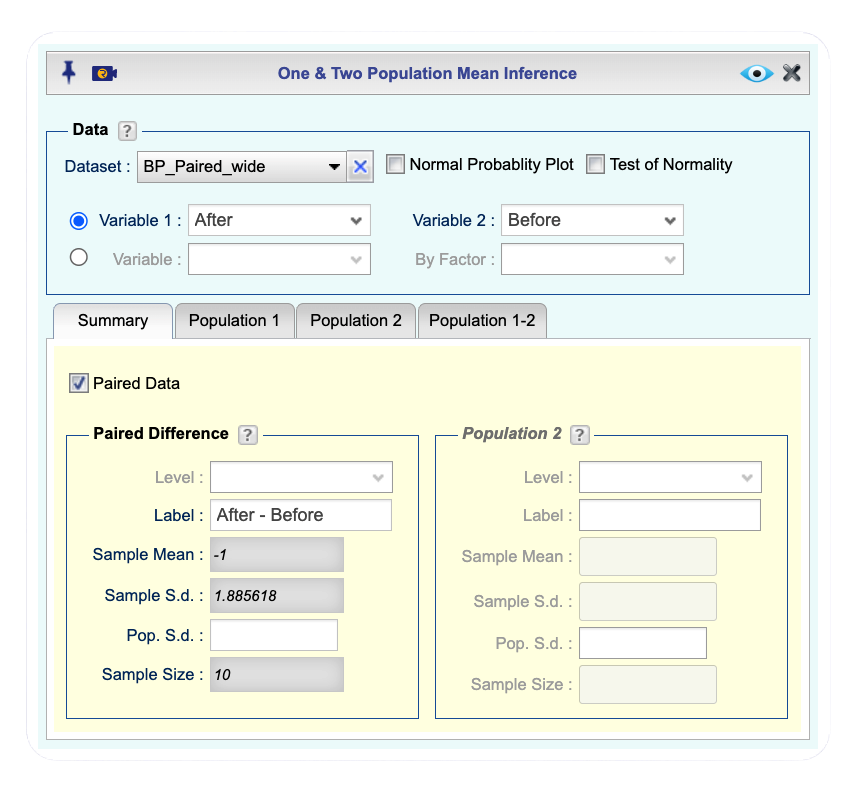

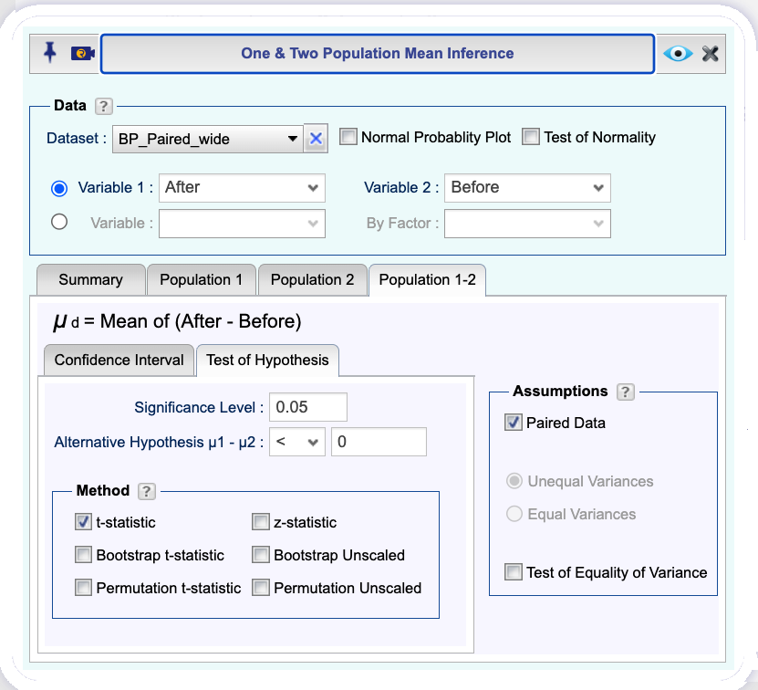

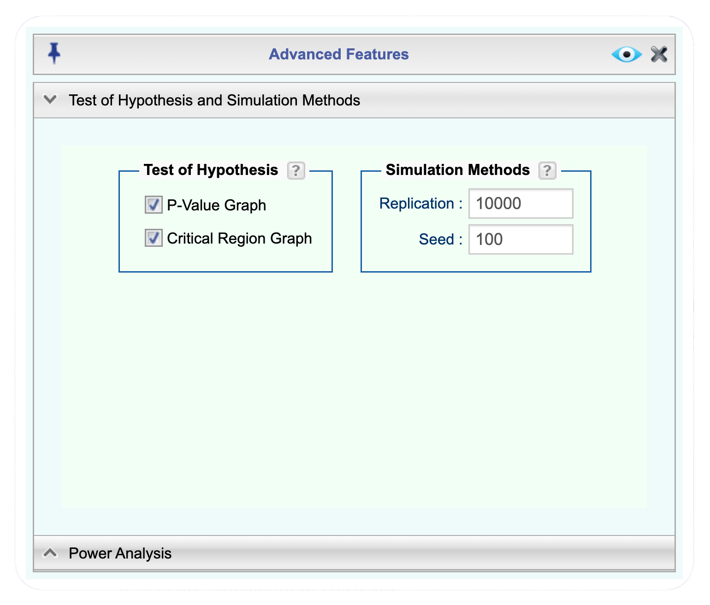

Rguroo setup for a paired-samples t test comparing blood pressure before and after an exercise program.

:::
:::


::: {.callout-tip .inner-callout collapse="false" title="Rguroo output: Blood Pressure Example"}

<div tabindex="0" class="rg-iframe-wrapper">
  <iframe
    src='Rguroo_html_output/Mean Inference/BP_Paired_wide_docx/BP_Paired_wide.html'
    class="rg-iframe"
    title="Rguroo output: Mean Inference - Paired t-test for Blood Pressure Example">
  </iframe>
</div>

:::

From the Rguroo output, The observed mean of paireddifferences is $\bar{d}_{\text{obs}} = -1$ mmHg, and the standard error of the mean difference is 0.596 mmHg.

<!--

```{r,echo=FALSE}
#| fig-alt: "Screenshot of Rguroo output showing the observed mean difference and standard error for the paired t-test comparing blood pressure before and after an exercise program. The observed mean difference is -1 mmHg, and the standard error of the mean difference is approximately 0.596 mmHg."
#| fig-cap: ""
#| label: fig-BP-paired-output
#| out-width: "100%"
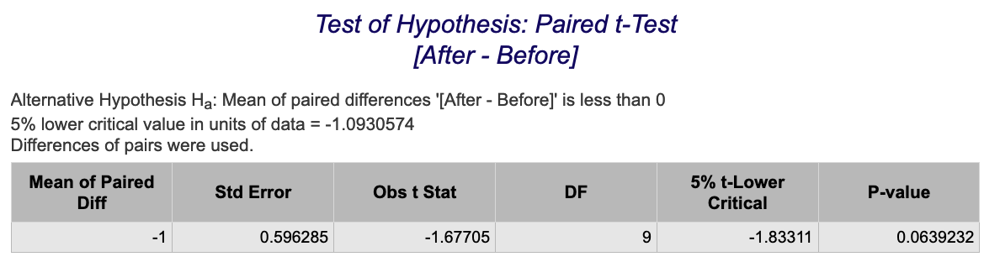
```

-->

c\. Under the null hypothesis $H_0: \mu_D \geq 0$, the sampling distribution of the test statistic $\bar{D}$ is approximately a Student $t$ distribution with $n - 1 = 9$ degrees of freedom, centered at 0, and with standard error $s_D/\sqrt{n}$. In other words,
$$
\bar{D} \sim t_9\!\left(0,\ 0.596\right).
$$

d\. The left panel of the **_Critical Region Graph: Paired t-Test_** in the Rguroo table shows the critical value in the data scale. This value for the test at the 5% significance level on the data scale is -1.0931. This means that the rejection region for the test is $\bar{D} < -1.0931$. Since the observed mean difference $\bar{d}_{\text{obs}} = -1$ mmHg does not fall in the rejection region (it is greater than -1.0931), we do not reject the null hypothesis. See the critical region graph in the Rguroo output for a visual representation of this result.

<!--

```{r,echo=FALSE}
#| fig-alt: "Critical region graph from Rguroo output for the paired t-test comparing blood pressure before and after an exercise program. The graph shows the sampling distribution of the mean difference under the null hypothesis, with the rejection region shown in red. The observed mean difference of -1 mmHg is indicated on the graph."
#| fig-cap: "Critical region graph from Rguroo output for the paired t-test comparing blood pressure before and after an exercise program."
#| label: fig-BP-paired-critical
#| out-width: "80%"
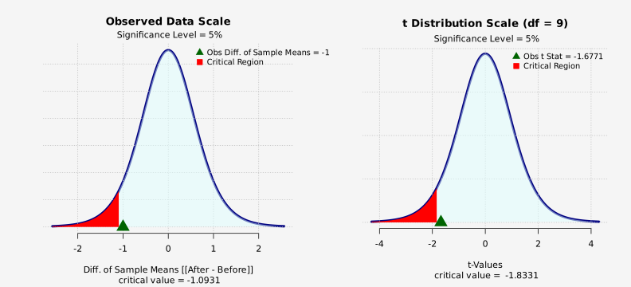
```

-->

e\. The **_P-value Graph: Paired t-Test_** in the Rguroo output shows that the p-value for the test is 0.0639, which is greater than the significance level of 0.05. Therefore, we do not reject the null hypothesis. See the p-value graph in the Rguroo output for a visual representation of this result.

<!--

```{r,echo=FALSE}
#| fig-alt: "P-value graph from Rguroo output for the paired t-test comparing blood pressure before and after an exercise program. The graph shows the sampling distribution of the mean difference under the null hypothesis, with the observed mean difference indicated on the graph. The p-value is represented as the area in the tail of the distribution beyond the observed mean difference."
#| fig-cap: "P-value graph from Rguroo output for the paired t-test comparing blood pressure before and after an exercise program."
#| label: fig-BP-paired-pvalue
#| out-width: "80%"
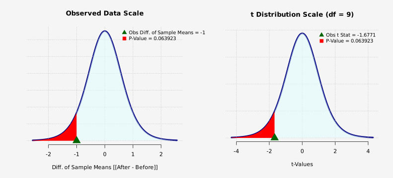
```

-->

f\. Since the p-value of 0.0639 is greater than the significance level of 0.05, we do not reject the null hypothesis. This means that we do not have sufficient evidence to conclude that the exercise program lowers mean systolic blood pressure. The same result is obtained from the critical region approach, where the observed mean difference does not fall in the rejection region.
::::

In the next example, we will obtain a confidence interval for the mean difference using the same blood pressure data entered in long format. In addition to showing how a confidence interval is constructed, this example will illustrate how to analyze paired data in Rguroo when the raw data are provided in long format.

:::{#exm-blood-pressure-paired-long}
## Blood Pressure and Exercise: Paired Inference (Long Format)
A researcher wants to determine whether a 6-week exercise program lowers systolic blood pressure. Ten participants are selected, and each person's blood pressure is measured before the program and again after completing the program. The dataset [BP_Paired_long]{.dataset} contains these data in long format, with the variable [Timing]{.var} indicating whether the measurement is Before or After, and the variable [BP]{.var} recording the blood pressure measurement in mmHg. The first four rows of the dataset together with the matching rows (rows 11–14) are shown in @tbl-BP-long. The dataset is available in the book's Rguroo dataset repository with the name [BP_Pairs_long]{.dataset}.

a\. Obtain a 95% confidence interval for the mean difference in systolic blood pressure before and after the exercise program. Use Rguroo's [Mean Inference]{.fun} function to carry out the analysis.

b\. Interpret the confidence interval in the context of the exercise program and blood pressure.

c\. Use the confidence interval to determine whether the exercise program significantly lowers mean systolic blood pressure.

::: {#code-book-bp-pairs-long .callout-tip .codebook collapse="true"}
## Code book for Dataset BP_Pairs_Long

Dataset Name: [BP_Pairs_Long]{.data}

This dataset contains systolic blood pressure measurements collected from 10 participants before and after completing a 6-week exercise program. The data are organized in a long format suitable for paired-sample analysis. Each participant contributes two observations: one before the exercise program and one after the program.

The variables included in this dataset are described below.

[Participant]{.var}: Participant identification number

[Timing]{.var}: Timing of the blood pressure measurement

  - Before
  - After

[BP]{.var}: Systolic blood pressure measurement (in mmHg)

**Source**

Artificial dataset generated for instructional purposes.

:::

```{r, echo=FALSE}
#| tbl-alt: "Blood Pressure Data Long Format"
#| label: tbl-BP-long
#| tbl-cap: "Blood Pressure Data Long Format"

BP_long <- read.csv('FJK_datasets/BP_Pairs_long.csv',
                    stringsAsFactors = FALSE)

ellipsis_row <- data.frame(
  Participant = "...",
  Timing = "...",
  BP = "...",
  stringsAsFactors = FALSE
)

BP_display <- rbind(
  BP_long[1:4, ],
  ellipsis_row,
  BP_long[11:14, ]
)

knitr::kable(
  BP_display,
  row.names = FALSE,
  align = "l"
)
```

:::

:::: {.callout-tip .solution-callout collapse="true" icon=false}
## 🔎 Solution

a\. We begin by setting up the problem in Rguroo. Click to expand the box below to see how to use the [Mean Inference]{.fun}  function in Rguroo to answer this question.

::: {#mean-inference-bp-long .callout-note appearance="simple" collapse="true" icon="none" title="{width=22px style='vertical-align:middle;'} Rguroo: Confidence Interval for Paired Difference with Long Format Data"}

1. Open the **Analytics** toolbox in Rguroo.
2. From the [Analysis]{.dpd} dropdown, select [Mean Inference]{.fun} --> [One \& Two Population]{.fun}. This opens the [One & Two Population Mean Inference]{.dialog} dialog.
3. In the dialog, select the [BP_Paired_long]{.dataset} dataset from the dropdown menu.
4. From the [Variable]{.dpd} dropdown (second set of radio buttons), select the variable [BP]{.var} and from the [BY Factor]{.dpd} dropdown, select the variable [Timing]{.var}. 
5. In the [Summary Statistics]{.tab} tab, before checking the [Paired Data]{.des} option,  under the **Population 1** section, select the level _After_ from the [Level]{.dpd} dropdown and under the **Population 2** section, select the level _Before_ from the [Level]{.dpd} dropdown. 
6. Select the [Paired Data]{.des} checkbox to indicate that the data are paired measurements. This tells Rguroo to compute the differences. Once this box is checked, the summary statistics for the differences appear under the **Paired Differences** section of the [Summary]{.tab} tab.
7. Select the [Population 1-2]{.tab} tab and the [Confidence Interval]{.tab} sub-tab to specify the confidence interval settings. In the [Confidence Level]{.des} field, enter [0.95]{.typein} and select the [t-statistic]{.des} checkbox to specify that the confidence interval should be based on the Student $t$ distribution.
8. Click the preview icon  to view the output.
9. Click the  button and save the result as [BP_Paired_long_CI]{.typein}.

::: {.callout-tip .inner-callout collapse="false" title="Rguroo One & Two Population Mean Inference dialogs for confidence interval with long format data"}
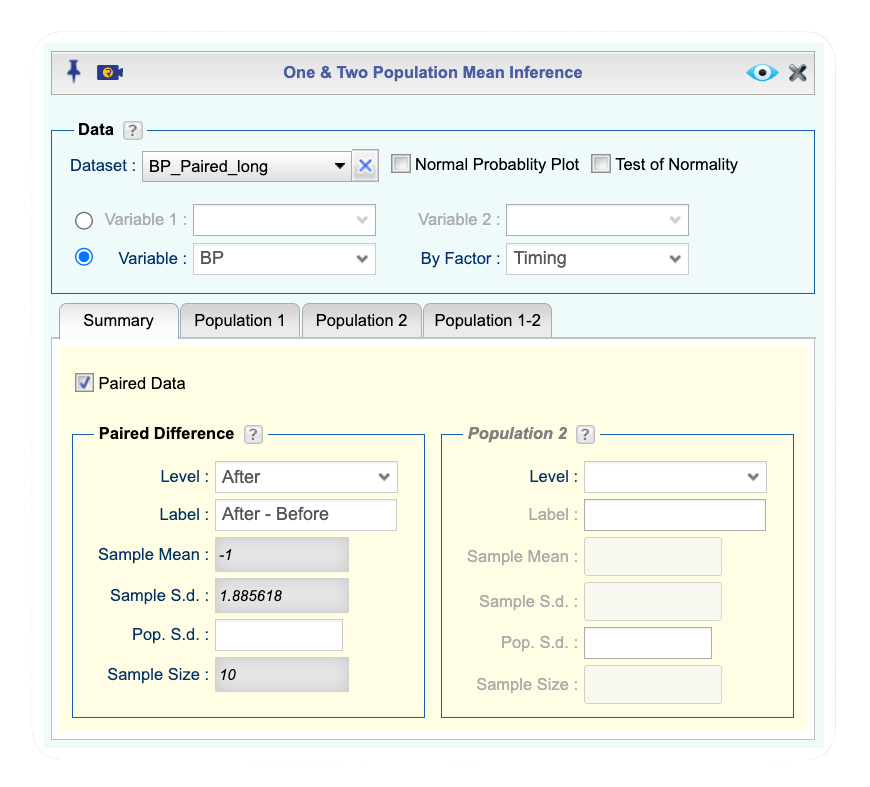
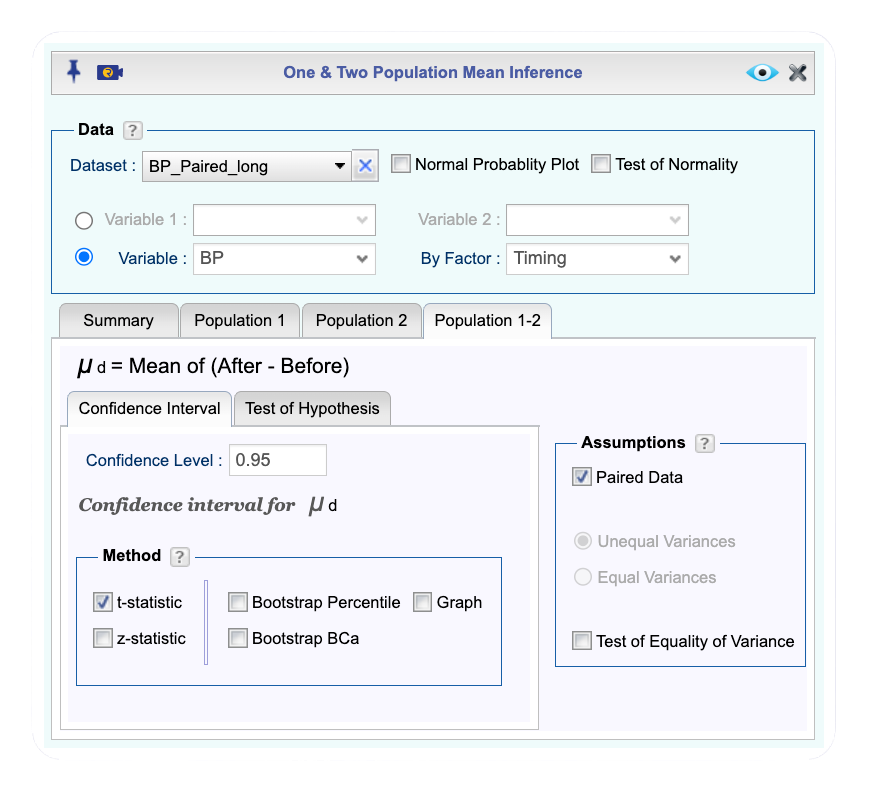
Rguroo setup for a confidence interval for the mean difference in blood pressure before and after an exercise program with long format data.
:::

:::


::: {.callout-tip .inner-callout collapse="false" title="Rguroo Output: Blood Pressure and Exercise"}

<div tabindex="0" class="rg-iframe-wrapper">
  <iframe
    src='Rguroo_html_output/Mean Inference/BP_Paired_long_CI_docx/BP_Paired_long_CI.html'
    class="rg-iframe"
    title="Rguroo output: Confidence Interval for Paired Difference with Long Format Data">
  </iframe>

  </div>

:::

The table **_t-Based Confidence Interval_** in the Rguroo output includes all the information needed to answer this question. As shown in the table, the 95% confidence interval for the mean difference in systolic blood pressure before and after the exercise program is approximately (-2.348, 0.349) mmHg.

<!--

```{r,echo=FALSE}
#| fig-alt: "Screenshot of Rguroo output showing the 95% confidence interval for the mean difference in systolic blood pressure before and after an exercise program. The confidence interval is approximately (-2.348, 0.349) mmHg."
#| fig-cap: "Screenshot of Rguroo output showing the 95% confidence interval for the mean difference in systolic blood pressure before and after an exercise program."
#| label: fig-BP-paired-CI
#| out-width: "100%"
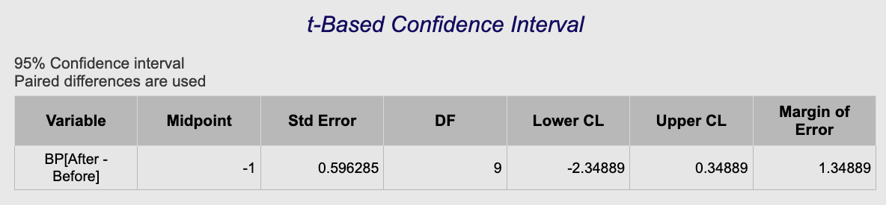
```

-->

b\. The 95% confidence interval for the mean difference in systolic blood pressure before and after the exercise program is approximately (-2.348, 0.349) mmHg. This means that we are 95% confident that the true mean difference in systolic blood pressure (After − Before) in the population of participants lies between -2.348 mmHg and 0.349 mmHg. In other words, based on our sample data, we estimate that the exercise program may lower mean systolic blood pressure by as much as 2.348 mmHg or may increase it by as much as 0.349 mmHg, but we cannot rule out the possibility of no change (0 mmHg) since it is included in the interval.

c\. To determine whether the exercise program significantly lowers mean systolic blood pressure, we check whether the confidence interval includes 0. Since the confidence interval (-2.348, 0.349) includes 0, we do not have sufficient evidence to conclude that the exercise program significantly lowers mean systolic blood pressure, since zero is a plausible value for the mean difference. This conclusion is consistent with the hypothesis test results from the previous example, where we also failed to reject the null hypothesis of no mean difference.

::::

You can also analyze paired data in Rguroo by entering summary statistics for the pair differences directly, without providing the raw data. This analysis can be performed using the [Mean Inference --> One & Two Population]{.fun} function.

To do so, select the [Paired Data]{.des} checkbox. Then, in the **Population Difference** section of the [Summary Statistics]{.tab} tab, enter a label for the differences, the observed mean difference, the sample standard deviation of the differences, and the sample size. Next, specify the hypothesis test or confidence interval settings as described in the previous examples.

Note that all summary statistics entered in this section refer to the **pair differences**. In particular, the sample mean is the mean of the differences, and the sample standard deviation is the standard deviation of the differences, not the standard error.

Finally, click the  button to view the analysis results.

This approach is useful when the raw data are unavailable but summary statistics for the pair differences have been reported. Figure @fig-BP-paired-summary shows the Rguroo setup for a paired t-test using summary statistics for the pair differences.

```{r,echo=FALSE}
#| fig-alt: "Screenshot of Rguroo setup for a paired t-test using summary statistics for the pair differences. The Paired Data option is selected, and the summary statistics for the pair differences are entered in the Population Difference section of the Summary Statistics tab."
#| fig-cap: "Screenshot of Rguroo setup for a paired t-test using summary statistics for the pair differences."
#| label: fig-BP-paired-summary
#| out-width: "80%"

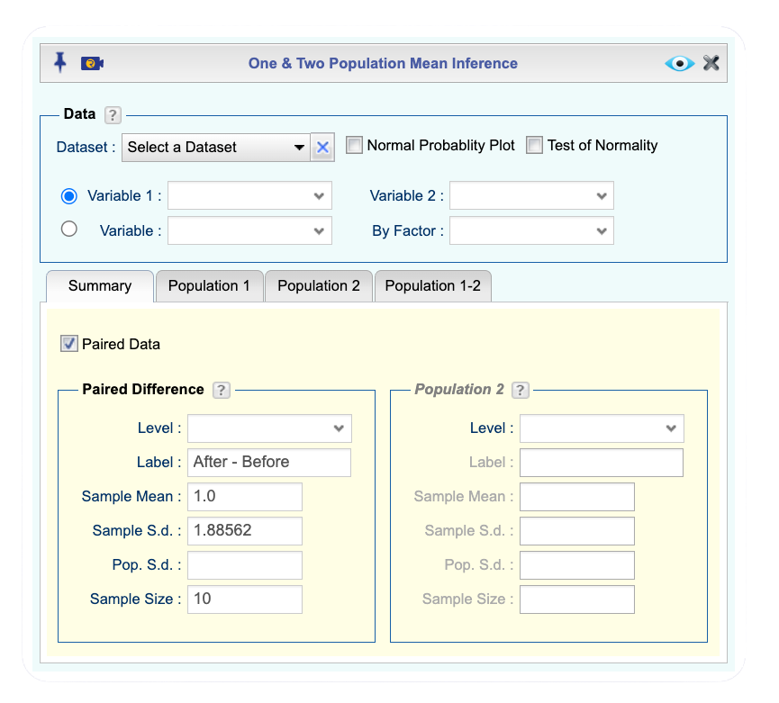
```

### Homework for @sec-mean-paired

1. The cholesterol level of patients who had heart attacks was measured multiple times after the heart attack. Researchers want to determine whether the mean cholesterol level changes as time since the heart attack increases. Each patient's cholesterol was measured on day 2 and again on day 4, so the two measurements form a matched pair. Define the difference for each patient as $D = \text{day4} - \text{day2}$. We wish to investigate whether the mean cholesterol level *changes* from day 2 to day 4. Import the [Cholesterol]{.dataset} dataset into Rguroo from the book's Rguroo dataset repository and use the variables [day2]{.var} and [day4]{.var}. The first rows of the dataset are shown in @tbl-Cholesterol, and the [codebook is here](#code-book-cholesterol). Conduct a paired test at the 1% significance level by answering the following questions:

   a. State the null and alternative hypotheses in terms of the population mean difference $\mu_D$.
   b. Use Rguroo's [Mean Inference]{.fun} function to obtain the observed mean difference $\bar{d}_{\text{obs}}$ and the standard error of the mean difference.
   c. State the sampling distribution of the test statistic under the null hypothesis.
   d. Use Rguroo to obtain the critical region, and determine whether the observed mean difference falls in the rejection region.
   e. Report the p-value and state whether you reject $H_0$.
   f. Interpret the results in the context of cholesterol levels and time since heart attack.

::: {#code-book-cholesterol .callout-tip .codebook collapse="true"}
## Code book for Dataset Cholesterol

Dataset Name: [Cholesterol]{.data}

[Add description of the cholesterol dataset.]

The variables included in this dataset are described below.

[patient]{.var}: Patient identification number

[day2]{.var}: Cholesterol level measured two days after the heart attack

[day4]{.var}: Cholesterol level measured four days after the heart attack

**Source**

[Confirm the source for the Cholesterol dataset.]
:::

```{r, echo=FALSE}
#| tbl-alt: "First rows of the Cholesterol dataset"
#| label: tbl-Cholesterol
#| tbl-cap: "Cholesterol Levels After a Heart Attack"
Cholesterol <- read.csv('FJK_datasets/cholesterol.csv')
knitr::kable(head(Cholesterol))
```

2. Using the same cholesterol data described in Problem 1, we now estimate the mean change in cholesterol level from day 2 to day 4 with a confidence interval. The difference for each patient is $D = \text{day4} - \text{day2}$. Import the [Cholesterol]{.dataset} dataset into Rguroo from the book's Rguroo dataset repository and use the variables [day2]{.var} and [day4]{.var}. The first rows of the dataset are shown in @tbl-Cholesterol, and the [codebook is here](#code-book-cholesterol).

   a. Use Rguroo's [Mean Inference]{.fun} function to construct a 98% confidence interval for the mean difference $\mu_D$ in cholesterol level from day 2 to day 4. Report the margin of error and the interval.
   b. Interpret the confidence interval in the context of cholesterol levels and time since heart attack.
   c. Use the confidence interval to determine whether the mean cholesterol level changes from day 2 to day 4. Is your conclusion consistent with the test in Problem 1?

3. All Fresh Seafood is a wholesale fish company based on the U.S. east coast, and Catalina Offshore Products is a wholesale fish company based on the U.S. west coast. For each type of fish, the price was recorded from both companies, so the two prices form a matched pair linked by fish type. Define the difference for each fish as $D = \text{east} - \text{west}$. We wish to investigate whether the mean wholesale price *differs* between the east coast and west coast suppliers. Import the [Price]{.dataset} dataset into Rguroo from the book's Rguroo dataset repository and use the variables [east]{.var} and [west]{.var}. The first rows of the dataset are shown in @tbl-Price-seafood, and the [codebook is here](#code-book-price). Conduct a paired test at the 5% significance level by answering the following questions:

   a. State the null and alternative hypotheses in terms of the population mean difference $\mu_D$.
   b. Use Rguroo's [Mean Inference]{.fun} function to obtain the observed mean difference $\bar{d}_{\text{obs}}$ and the standard error of the mean difference.
   c. State the sampling distribution of the test statistic under the null hypothesis.
   d. Use Rguroo to obtain the critical region, and determine whether the observed mean difference falls in the rejection region.
   e. Report the p-value and state whether you reject $H_0$.
   f. Interpret the results in the context of east coast and west coast wholesale fish prices.

::: {#code-book-price .callout-tip .codebook collapse="true"}
## Code book for Dataset Price

Dataset Name: [Price]{.data}

The price of fish was collected in 2013 from two websites: Catalina Offshore Products (west coast) and All Fresh Seafood (east coast).

The variables included in this dataset are described below.

[fish]{.var}: Type of fish for sale

[east]{.var}: Price of fish from the east coast supplier (\$)

[west]{.var}: Price of fish from the west coast supplier (\$)

**Source**

Seafood online. (2013, November 20). Retrieved from <http://www.allfreshseafood.com/>

Buy sushi grade fish online. (2013, November 20). Retrieved from <http://www.catalinaop.com/>
:::

```{r, echo=FALSE}
#| tbl-alt: "First rows of the Seafood Price dataset"
#| label: tbl-Price-seafood
#| tbl-cap: "Wholesale Prices of Fish in Dollars"
Price <- read.csv('FJK_datasets/price.csv')
knitr::kable(head(Price))
```

4. Using the same seafood price data described in Problem 3, we now estimate the mean difference in wholesale price between the east coast and west coast suppliers with a confidence interval. The difference for each fish is $D = \text{east} - \text{west}$. Import the [Price]{.dataset} dataset into Rguroo from the book's Rguroo dataset repository and use the variables [east]{.var} and [west]{.var}. The first rows of the dataset are shown in @tbl-Price-seafood, and the [codebook is here](#code-book-price).

   a. Use Rguroo's [Mean Inference]{.fun} function to construct a 95% confidence interval for the mean difference $\mu_D$ in wholesale price. Report the margin of error and the interval.
   b. Interpret the confidence interval in the context of east coast and west coast wholesale fish prices.
   c. Use the confidence interval to determine whether the mean wholesale price differs between the two suppliers. Is your conclusion consistent with the test in Problem 3?

5. The British Department of Transport studied whether people change their behavior on Friday the 13th. For each location, the number of vehicles was recorded on Friday the 6th and on the following Friday the 13th, so the two counts form a matched pair linked by location. Define the difference for each location as $D = \text{x13th} - \text{x6th}$. We wish to investigate whether the mean number of vehicles *differs* between the 6th and the 13th. Import the [Traffic]{.dataset} dataset into Rguroo from the book's Rguroo dataset repository and use the variables [x6th]{.var} and [x13th]{.var}. The first rows of the dataset are shown in @tbl-Traffic, and the [codebook is here](#code-book-traffic). Conduct a paired test at the 5% significance level by answering the following questions:

   a. State the null and alternative hypotheses in terms of the population mean difference $\mu_D$.
   b. Use Rguroo's [Mean Inference]{.fun} function to obtain the observed mean difference $\bar{d}_{\text{obs}}$ and the standard error of the mean difference.
   c. State the sampling distribution of the test statistic under the null hypothesis.
   d. Use Rguroo to obtain the critical region, and determine whether the observed mean difference falls in the rejection region.
   e. Report the p-value and state whether you reject $H_0$.
   f. Interpret the results in the context of traffic on Friday the 6th versus Friday the 13th.

::: {#code-book-traffic .callout-tip .codebook collapse="true"}
## Code book for Dataset Traffic

Dataset Name: [Traffic]{.data}

Data collected to study whether superstitions about Friday the 13th affect behavior. Traffic flow was recorded between motorway junctions on Friday the 6th and the following Friday the 13th, for Fridays between October 1989 and November 1992.

The variables included in this dataset are described below.

[source]{.var}: Which data set the data were obtained from

[year]{.var}: Year the data were collected

[month]{.var}: Month in which the Friday occurred

[x6th]{.var}: Number of vehicles passing through the junction on Friday the 6th

[x13th]{.var}: Number of vehicles passing through the junction on Friday the 13th

[location]{.var}: Motorway junction to which the data correspond

**Source**

Scanlon, T. J., Luben, R. N., Scanlon, F. L., & Singleton, N. (1993). Is Friday the 13th bad for your health? *BMJ, 307*, 1584–1586.
:::

```{r, echo=FALSE}
#| tbl-alt: "First rows of the Friday the 13th Traffic dataset"
#| label: tbl-Traffic
#| tbl-cap: "Traffic Counts on Friday the 6th and the 13th"
Traffic <- read.csv('FJK_datasets/traffic.csv')
knitr::kable(head(Traffic))
```

6. Using the same Friday the 13th traffic data described in Problem 5, we now estimate the mean difference in vehicle count between the 6th and the 13th with a confidence interval. The difference for each location is $D = \text{x13th} - \text{x6th}$. Import the [Traffic]{.dataset} dataset into Rguroo from the book's Rguroo dataset repository and use the variables [x6th]{.var} and [x13th]{.var}. The first rows of the dataset are shown in @tbl-Traffic, and the [codebook is here](#code-book-traffic).

   a. Use Rguroo's [Mean Inference]{.fun} function to construct a 95% confidence interval for the mean difference $\mu_D$ in vehicle count. Report the margin of error and the interval.
   b. Interpret the confidence interval in the context of traffic on Friday the 6th versus Friday the 13th.
   c. Use the confidence interval to determine whether the mean number of vehicles differs between the two days. Is your conclusion consistent with the test in Problem 5?

7. To determine whether Reiki is an effective method for treating pain, a pilot study was carried out in which a certified Reiki therapist treated volunteers. Pain was measured on a visual analogue scale (VAS) immediately before and after the treatment, so the two scores form a matched pair for each volunteer. Define the difference for each volunteer as $D = \text{after} - \text{before}$. We wish to investigate whether Reiki *reduces* mean pain, that is, whether the mean difference is negative. Import the [Reiki]{.dataset} dataset into Rguroo from the book's Rguroo dataset repository and use the variables [vas_before]{.var} and [vas_after]{.var}. The first rows of the dataset are shown in @tbl-Reiki, and the [codebook is here](#code-book-reiki). Conduct a paired test at the 5% significance level by answering the following questions:

   a. State the null and alternative hypotheses in terms of the population mean difference $\mu_D$.
   b. Use Rguroo's [Mean Inference]{.fun} function to obtain the observed mean difference $\bar{d}_{\text{obs}}$ and the standard error of the mean difference.
   c. State the sampling distribution of the test statistic under the null hypothesis.
   d. Use Rguroo to obtain the critical region, and determine whether the observed mean difference falls in the rejection region.
   e. Report the p-value and state whether you reject $H_0$.
   f. Interpret the results in the context of Reiki treatment and pain.

::: {#code-book-reiki .callout-tip .codebook collapse="true"}
## Code book for Dataset Reiki

Dataset Name: [Reiki]{.data}

[Add description of the Reiki dataset.] Pain was measured on a visual analogue scale (VAS) immediately before and after a Reiki treatment.

The variables included in this dataset are described below.

[volunteer]{.var}: Volunteer identification number

[vas_before]{.var}: Pain on the visual analogue scale before the Reiki treatment

[vas_after]{.var}: Pain on the visual analogue scale after the Reiki treatment

**Source**

Olson, K., & Hanson, J. (1997). [Confirm the full source for the Reiki dataset.]
:::

```{r, echo=FALSE}
#| tbl-alt: "First rows of the Reiki dataset"
#| label: tbl-Reiki
#| tbl-cap: "Pain Scores Before and After Reiki Treatment"
Reiki <- read.csv('FJK_datasets/reiki.csv')
knitr::kable(head(Reiki))
```

8. Using the same Reiki data described in Problem 7, we now estimate the mean difference in VAS pain score from before to after treatment with a confidence interval. The difference for each volunteer is $D = \text{after} - \text{before}$. Import the [Reiki]{.dataset} dataset into Rguroo from the book's Rguroo dataset repository and use the variables [vas_before]{.var} and [vas_after]{.var}. The first rows of the dataset are shown in @tbl-Reiki, and the [codebook is here](#code-book-reiki).

   a. Use Rguroo's [Mean Inference]{.fun} function to construct a 90% confidence interval for the mean difference $\mu_D$ in VAS pain score. Report the margin of error and the interval.
   b. Interpret the confidence interval in the context of Reiki treatment and pain.
   c. Use the confidence interval to determine whether Reiki changes mean pain. Note that the test in Problem 7 was one-sided ($H_a: \mu_D < 0$), while the confidence interval corresponds to a two-sided test; comment on whether the two conclusions agree and why they may differ.

9. The female labor force participation rate (FLFPR) is the percentage of the female population aged 15 and older that is in the labor force. For each country, this rate was recorded in 1990 and again in 2018, so the two rates form a matched pair linked by country. Define the difference for each country as $D = \text{y2018} - \text{y1990}$. We wish to investigate whether the mean female labor force participation rate *differs* between 1990 and 2018. Import the [Labor]{.dataset} dataset into Rguroo from the book's Rguroo dataset repository and use the variables [y1990]{.var} and [y2018]{.var}. The first rows of the dataset are shown in @tbl-Labor, and the [codebook is here](#code-book-labor). Conduct a paired test at the 5% significance level by answering the following questions:

   a. State the null and alternative hypotheses in terms of the population mean difference $\mu_D$.
   b. Use Rguroo's [Mean Inference]{.fun} function to obtain the observed mean difference $\bar{d}_{\text{obs}}$ and the standard error of the mean difference.
   c. State the sampling distribution of the test statistic under the null hypothesis.
   d. Use Rguroo to obtain the critical region, and determine whether the observed mean difference falls in the rejection region.
   e. Report the p-value and state whether you reject $H_0$.
   f. Interpret the results in the context of female labor force participation in 1990 versus 2018.

::: {#code-book-labor .callout-tip .codebook collapse="true"}
## Code book for Dataset Labor

Dataset Name: [Labor]{.data}

Female labor force participation rate (percentage of the female population aged 15 and older in the labor force), by country, for the years 1990 through 2018.

The variables included in this dataset are described below.

[country_name]{.var}: Name of the country

[country_code]{.var}: Three-letter country code

[region]{.var}: Location of the country in the world

[incomegroup]{.var}: The World Bank's income classification

[y1990]{.var}–[y2018]{.var}: Female labor force participation rate (% of female population aged 15+) for the years 1990 through 2018

**Source**

Labor force participation rate, female (% of female population ages 15+) (modeled ILO estimate). (n.d.). Retrieved July 20, 2019, from <https://data.worldbank.org/indicator/SL.TLF.CACT.FE.ZS>

International Labour Organization, ILOSTAT database.
:::

```{r, echo=FALSE}
#| tbl-alt: "First rows of the Female Labor Force Participation dataset"
#| label: tbl-Labor
#| tbl-cap: "Female Labor Force Participation Rates"
Labor <- read.csv('FJK_datasets/labor.csv')
knitr::kable(head(Labor))
```

10. Using the same female labor force data described in Problem 9, we now estimate the mean difference in participation rate between 1990 and 2018 with a confidence interval. The difference for each country is $D = \text{y2018} - \text{y1990}$. Import the [Labor]{.dataset} dataset into Rguroo from the book's Rguroo dataset repository and use the variables [y1990]{.var} and [y2018]{.var}. The first rows of the dataset are shown in @tbl-Labor, and the [codebook is here](#code-book-labor).

    a. Use Rguroo's [Mean Inference]{.fun} function to construct a 95% confidence interval for the mean difference $\mu_D$ in female labor force participation rate. Report the margin of error and the interval.
    b. Interpret the confidence interval in the context of female labor force participation in 1990 versus 2018.
    c. Use the confidence interval to determine whether the mean participation rate differs between 1990 and 2018. Is your conclusion consistent with the test in Problem 9?

11. The dataset [Pulse]{.dataset} contains pulse rates measured before and after exercise, along with information on each subject's sex, drinking, and smoking. For each subject the two pulse rates form a matched pair. We restrict attention to males who drink alcohol but do not smoke. Define the difference for each such subject as $D = \text{pulse\_after} - \text{pulse\_before}$. We wish to investigate whether the mean pulse rate *differs* before and after exercise for these subjects. Import the [Pulse_males]{.dataset} dataset into Rguroo from the book's Rguroo dataset repository and use the variables [pulse_before]{.var} and [pulse_after]{.var}. This dataset was obtained by filtering the full [Pulse]{.dataset} dataset for males who drink alcohol but do not smoke. The first rows of the dataset are shown in @tbl-Pulse_males, and the [codebook is here](#code-book-pulse-males). Conduct a paired test at the 5% significance level by answering the following questions:

    a. State the null and alternative hypotheses in terms of the population mean difference $\mu_D$.
    b. Use Rguroo's [Mean Inference]{.fun} function to obtain the observed mean difference $\bar{d}_{\text{obs}}$ and the standard error of the mean difference.
    c. State the sampling distribution of the test statistic under the null hypothesis.
    d. Use Rguroo to obtain the critical region, and determine whether the observed mean difference falls in the rejection region.
    e. Report the p-value and state whether you reject $H_0$.
    f. Interpret the results in the context of pulse rate before and after exercise.

::: {#code-book-pulse-males .callout-tip .codebook collapse="true"}
## Code book for Dataset Pulse_males

Dataset Name: [Pulse_males]{.data}

Pulse rates measured before and after exercise, restricted to male subjects who drink alcohol but do not smoke. This dataset was obtained by filtering the full [Pulse]{.dataset} dataset.

The variables included in this dataset are described below.

[pulse_before]{.var}: Pulse rate before exercise (beats per minute)

[pulse_after]{.var}: Pulse rate after exercise (beats per minute)

[gender]{.var}: Subject's sex

[alcohol]{.var}: Whether the subject drinks alcohol (yes or no)

[smoke]{.var}: Whether the subject smokes (yes or no)

**Source**

[Confirm the source and full variable list for the Pulse dataset.]
:::

```{r, echo=FALSE}
#| tbl-alt: "First rows of the Pulse (males, drink, non-smoker) dataset"
#| label: tbl-Pulse_males
#| tbl-cap: "Pulse Rates Before and After Exercise for Males Who Drink but Do Not Smoke"
Pulse <- read.csv('FJK_datasets/pulse.csv')
Pulse_males <- Pulse[Pulse$gender == "male" & Pulse$alcohol == "yes" & Pulse$smoke == "no", ]
knitr::kable(head(Pulse_males))
```

12. Using the same data described in Problem 11 (males who drink alcohol but do not smoke), we now estimate the mean difference in pulse rate from before to after exercise with a confidence interval. The difference for each subject is $D = \text{pulse\_after} - \text{pulse\_before}$. Import the [Pulse_males]{.dataset} dataset into Rguroo from the book's Rguroo dataset repository and use the variables [pulse_before]{.var} and [pulse_after]{.var}. The first rows of the dataset are shown in @tbl-Pulse_males, and the [codebook is here](#code-book-pulse-males).

    a. Use Rguroo's [Mean Inference]{.fun} function to construct a 95% confidence interval for the mean difference $\mu_D$ in pulse rate. Report the margin of error and the interval.
    b. Interpret the confidence interval in the context of pulse rate before and after exercise.
    c. Use the confidence interval to determine whether the mean pulse rate differs before and after exercise. Is your conclusion consistent with the test in Problem 11?

## Comparing Two Means with Independent Groups {#sec-mean-independent}

We now turn to the second setting introduced at the start of @sec-mean-paired: two **independent groups**, where the observations in one group are unrelated to those in the other. Unlike the paired case, the two samples need not even be the same size, and there is no pairing of individual observations across groups. The paired trick of reducing to a single sample of differences is therefore unavailable, and we need a different approach.

As in the one-sample and paired cases, we begin by introducing the notation and assumptions for inference about two means with independent groups. We then describe the methods for hypothesis testing and confidence interval construction, and illustrate them with examples and Rguroo analyses.

Table @tbl-two-mean-notation summarizes the notation used when comparing two independent population means. The parameter of interest is the difference in population means, $\mu_1-\mu_2$. We estimate this parameter using the difference in sample means, $\bar{X}_1-\bar{X}_2$, whose observed value is $\bar{x}_1-\bar{x}_2$.

| Quantity | Group 1 | Group 2 | Difference |
|:----------|:----------|:----------|:----------|
| Population variable | $X_1$ | $X_2$ | — |
| Population mean | $\mu_1$ | $\mu_2$ | $\mu_1-\mu_2$ |
| Population standard deviation | $\sigma_1$ | $\sigma_2$ | — |
| Sample size | $n_1$ | $n_2$ | — |
| Sample mean (random variable) | $\bar{X}_1$ | $\bar{X}_2$ | $\bar{X}_1-\bar{X}_2$ |
| Observed sample mean | $\bar{x}_1$ | $\bar{x}_2$ | $\bar{x}_1-\bar{x}_2$ |
| Sample standard deviation | $s_1$ | $s_2$ | — |

: Notation for comparing two independent population means. {#tbl-two-mean-notation}

As in the one-sample case, we will have two versions of the methods for comparing two means, depending on whether the population standard deviations $\sigma_1$ and $\sigma_2$ are known or unknown. We also begin with the assumption that the two populations are normally distributed. We present the sampling distributions, hypothesis testing procedures, and confidence interval formulas for each case in the subsections that follow.

The parameter of interest throughout is the difference $\mu_1 - \mu_2$, and the natural estimator is the difference in sample means $\bar{X}_1 - \bar{X}_2$. Because the two samples are independent, the variance of the difference is the *sum* of the two individual variances. This single fact — variances add for independent samples — is what distinguishes the standard error here from the one-sample and paired cases, and it drives the formulas in both subsections below.

### The Case When the Population Standard Deviations Are Known {#sec-two-mean-known-sigma}

When both population standard deviations $\sigma_1$ and $\sigma_2$ are known and both populations are normally distributed, the difference in sample means $\bar{X}_1 - \bar{X}_2$ has a normal sampling distribution. It is centered at the true difference $\mu_1 - \mu_2$, and its standard error combines the two population standard deviations:

$$
\text{SE}(\bar{X}_1 - \bar{X}_2) = \sqrt{\frac{\sigma_1^2}{n_1} + \frac{\sigma_2^2}{n_2}}.
$$

The two variances are added, not subtracted, because the samples are independent. Under the null hypothesis, the boundary value of the difference is typically $\mu_1 - \mu_2 = 0$, corresponding to equal population means.

::: {.callout-note appearance="minimal"}
## Two Independent Means, $\sigma_1$ and $\sigma_2$ Known

When both populations are normally distributed and $\sigma_1$ and $\sigma_2$ are known, the difference in sample means has the sampling distribution

$$
\bar{X}_1 - \bar{X}_2 \sim N\!\left(\mu_1 - \mu_2,\ \sqrt{\frac{\sigma_1^2}{n_1} + \frac{\sigma_2^2}{n_2}}\right).
$$

**Hypotheses.** The boundary value is typically $\mu_1 - \mu_2 = 0$, giving one of the three forms

$$
\begin{cases} H_0: \mu_1 - \mu_2 \leq 0 \\ H_a: \mu_1 - \mu_2 > 0 \end{cases}
\qquad
\begin{cases} H_0: \mu_1 - \mu_2 \geq 0 \\ H_a: \mu_1 - \mu_2 < 0 \end{cases}
\qquad
\begin{cases} H_0: \mu_1 - \mu_2 = 0 \\ H_a: \mu_1 - \mu_2 \neq 0. \end{cases}
$$

**Confidence interval.** The $(1-\alpha)\times 100\%$ confidence interval for $\mu_1 - \mu_2$ is

$$
(\bar{X}_1 - \bar{X}_2) \pm z^* \cdot \sqrt{\frac{\sigma_1^2}{n_1} + \frac{\sigma_2^2}{n_2}},
$$

where $z^*$ is the standard normal critical value for confidence level $(1-\alpha)\times 100\%$. To compute the interval from a specific sample, replace $\bar{X}_1 - \bar{X}_2$ with its observed value $\bar{x}_1 - \bar{x}_2$.
:::

As in the one-mean case, the known-$\sigma$ setting is mostly of conceptual value, since the population standard deviations are rarely known in practice. The realistic case, in which $\sigma_1$ and $\sigma_2$ are estimated from the data, is taken up next.

### The Case When the Population Standard Deviations Are Unknown {#sec-two-mean-unknown-sigma}

When the population standard deviations are unknown, we estimate them separately from the data using the sample standard deviations $s_1$ and $s_2$, making no assumption about whether the two population variances are equal. The standard error of $\bar{X}_1 - \bar{X}_2$ becomes the **estimated standard error**

$$
\widehat{\text{SE}}(\bar{X}_1 - \bar{X}_2) = \sqrt{\frac{s_1^2}{n_1} + \frac{s_2^2}{n_2}}.
$$

As in the one-mean case, replacing the unknown standard deviations with sample estimates introduces additional uncertainty, and the sampling distribution of $\bar{X}_1 - \bar{X}_2$ is approximated by a Student $t$ distribution rather than a normal. The degrees of freedom are computed from the two sample sizes and standard deviations by a formula that statistical software evaluates automatically; the resulting value need not be a whole number. We do not compute the degrees of freedom by hand. Rguroo reports the degrees of freedom along with the critical values and p-values.

::: {.callout-note appearance="minimal"}
## Two Independent Means, $\sigma_1$ and $\sigma_2$ Unknown

When both populations are normally distributed and $\sigma_1$ and $\sigma_2$ are unknown, the difference in sample means has the approximate sampling distribution

$$
\bar{X}_1 - \bar{X}_2 \sim t_{\text{df}}\!\left(\mu_1 - \mu_2,\ \sqrt{\frac{s_1^2}{n_1} + \frac{s_2^2}{n_2}}\right),
$$

where the degrees of freedom $\text{df}$ are computed from the data by software.

**Hypotheses.** The boundary value is typically $\mu_1 - \mu_2 = 0$, giving one of the three forms

$$
\begin{cases} H_0: \mu_1 - \mu_2 \leq 0 \\ H_a: \mu_1 - \mu_2 > 0 \end{cases}
\qquad
\begin{cases} H_0: \mu_1 - \mu_2 \geq 0 \\ H_a: \mu_1 - \mu_2 < 0 \end{cases}
\qquad
\begin{cases} H_0: \mu_1 - \mu_2 = 0 \\ H_a: \mu_1 - \mu_2 \neq 0. \end{cases}
$$

**Confidence interval.** The $(1-\alpha)\times 100\%$ confidence interval for $\mu_1 - \mu_2$ is

$$
(\bar{X}_1 - \bar{X}_2) \pm t^*_{\text{df}} \cdot \sqrt{\frac{s_1^2}{n_1} + \frac{s_2^2}{n_2}},
$$

where $t^*_{\text{df}}$ is the Student $t$ critical value for confidence level $(1-\alpha)\times 100\%$ on the software-computed degrees of freedom. To compute the interval from a specific sample, replace $\bar{X}_1 - \bar{X}_2$ with its observed value $\bar{x}_1 - \bar{x}_2$.
:::

This is the version used in nearly all practical two-group comparisons. The known-$\sigma$ formulas of @sec-two-mean-known-sigma are the conceptual special case; the unknown-$\sigma$ formulas here are what we apply to real data.

### The Case of Equal Population Variances {#sec-two-mean-equal-var}

The unknown-$\sigma$ method of @sec-two-mean-unknown-sigma makes no assumption about how the two population standard deviations compare: $\sigma_1$ and $\sigma_2$ may be equal or unequal, and each is estimated separately by its own sample standard deviation. In some studies, however, there is good reason to believe the two populations have the **same** standard deviation, even though its common value is unknown. For example, when two groups differ only in the treatment they receive and are otherwise drawn from similar populations, it is often reasonable to assume their spreads are equal.

When the two population variances can be assumed equal, $\sigma_1 = \sigma_2 = \sigma$, we no longer estimate two separate standard deviations. Instead, we combine the information from both samples into a single estimate of the common standard deviation, called the **pooled standard deviation**:

$$
s_p = \sqrt{\frac{(n_1 - 1)s_1^2 + (n_2 - 1)s_2^2}{n_1 + n_2 - 2}}.
$$

The pooled standard deviation is a weighted average of the two sample variances, with more weight given to the larger sample. Using $s_p$ in place of the two separate estimates, the estimated standard error of $\bar{X}_1 - \bar{X}_2$ becomes

$$
\widehat{\text{SE}}(\bar{X}_1 - \bar{X}_2) = s_p \sqrt{\frac{1}{n_1} + \frac{1}{n_2}}.
$$

Because the common variance is estimated from the data, the sampling distribution of $\bar{X}_1 - \bar{X}_2$ is again a Student $t$ distribution. Unlike the unequal-variance case, however, the degrees of freedom are now a simple whole number: $n_1 + n_2 - 2$.

::: {.callout-note appearance="minimal"}
## Two Independent Means, Equal Population Variances

When both populations are normally distributed with equal but unknown variances, $\sigma_1 = \sigma_2$, the difference in sample means has the sampling distribution

$$
\bar{X}_1 - \bar{X}_2 \sim t_{\,n_1 + n_2 - 2}\!\left(\mu_1 - \mu_2,\ s_p \sqrt{\frac{1}{n_1} + \frac{1}{n_2}}\right),
$$

where the pooled standard deviation is

$$
s_p = \sqrt{\frac{(n_1 - 1)s_1^2 + (n_2 - 1)s_2^2}{n_1 + n_2 - 2}}.
$$

**Hypotheses.** The boundary value is typically $\mu_1 - \mu_2 = 0$, giving one of the three forms

$$
\begin{cases} H_0: \mu_1 - \mu_2 \leq 0 \\ H_a: \mu_1 - \mu_2 > 0 \end{cases}
\qquad
\begin{cases} H_0: \mu_1 - \mu_2 \geq 0 \\ H_a: \mu_1 - \mu_2 < 0 \end{cases}
\qquad
\begin{cases} H_0: \mu_1 - \mu_2 = 0 \\ H_a: \mu_1 - \mu_2 \neq 0. \end{cases}
$$

**Confidence interval.** The $(1-\alpha)\times 100\%$ confidence interval for $\mu_1 - \mu_2$ is

$$
(\bar{X}_1 - \bar{X}_2) \pm t^*_{\,n_1 + n_2 - 2} \cdot s_p \sqrt{\frac{1}{n_1} + \frac{1}{n_2}},
$$

where $t^*_{\,n_1 + n_2 - 2}$ is the Student $t$ critical value for confidence level $(1-\alpha)\times 100\%$ on $n_1 + n_2 - 2$ degrees of freedom. To compute the interval from a specific sample, replace $\bar{X}_1 - \bar{X}_2$ with its observed value $\bar{x}_1 - \bar{x}_2$.
:::

The equal-variance method and the unequal-variance method of @sec-two-mean-unknown-sigma answer the same question and use the same hypotheses; they differ only in how the standard error and degrees of freedom are computed. When the two population variances really are equal, the equal-variance method is slightly more powerful, since it uses a single pooled estimate and a larger degrees of freedom. When the variances are not equal, however, the equal-variance method can be misleading, while the unequal-variance method remains valid.

::: {.callout-note appearance="simple"}
## Which Method Should You Use?

The unequal-variance (unpooled) method of @sec-two-mean-unknown-sigma is the safer default. It does not require the two population variances to be equal, and it performs almost as well as the equal-variance method even when the variances happen to be equal. For this reason, many statistical software packages, including Rguroo, use the unequal-variance method by default.

Use the equal-variance (pooled) method only when there is a sound reason to believe the two population variances are equal. A common rule of thumb is that the assumption is reasonable when neither sample standard deviation is more than about twice the other. When in doubt, use the unequal-variance method.
:::

In Rguroo, the choice between the two methods is made with a single checkbox. The unequal-variance method is obtained as described in @sec-two-mean-unknown-sigma; to use the equal-variance method instead, select the [Equal Variances]{.des} option in the [One & Two Population Mean Inference]{.dialog} dialog. All other steps — selecting the variables, specifying the hypotheses or confidence level, and choosing the [t-statistic]{.des} method — are unchanged.

:::{#exm-two-mean-unknown-sigma}

## Comparing Two Independent Means - Marijuana Legalization and Age

Recall the GSS2024 dataset, a subset of the 2024 General Social Survey (GSS) conducted by NORC at the University of Chicago. After removing observations with missing values, the dataset contains information on $n = 399$ individuals.

Although the dataset includes many variables, we focus on two variables:

* [age]{.var}, which records the respondent’s age in years.
* [Grass]{.var}, which indicates whether the respondent supports legalizing marijuana (Yes) or does not support legalizing marijuana (No).

Our goal is to investigate whether respondents who support legalizing marijuana tend to be younger, on average, than respondents who do not support legalization.

a\. Let $\mu_1$ denote the mean age of respondents who do not support legalizing marijuana (No), and let $\mu_2$ denote the mean age of respondents who support legalizing marijuana (Yes). State the null and alternative hypotheses for testing whether the mean age of respondents who support legalization is less than the mean age of respondents who do not support legalization.

b\. Set up the problem in Rguroo’s [Mean Inference]{.fun} function to perform a hypothesis test comparing the mean ages of the two independent groups using the GSS2024 dataset. From the output, obtain the mean age for each group and the observed difference between the sample means.

c\. From the output, obtain the standard error and degrees of freedom used in the test. Then state the sampling distribution of the test statistic under the null hypothesis.

d\. Determine the critical value for the test in the scale of the data at the 5% significance level. Does the observed difference between the sample means fall in the rejection region?

e\. State the p-value and determine whether you should reject or fail to reject the null hypothesis.

f\. Interpret the results in the context of the relationship between age and support for legalizing marijuana.

<div tabindex="0" style="width:85%; margin:auto;">

 The dataset for this example is available in the Rguroo dataset repository [Kozak]{.repo}, with the dataset name [GSS2024]{.data}.

**Code book for Dataset GSS2024 is given [here](#code-book-gss2024).**

</div>
:::

:::: {.callout-tip .solution-callout collapse="true" icon=false}
## 🔎 Solution

a\. The null and alternative hypotheses for testing whether the mean age of respondents who support legalization is less than the mean age of respondents who do not support legalization are:

$$\begin{cases} H_0: \mu_1 \leq \mu_2 \\ H_a: \mu_1 > \mu_2 \end{cases}$$ 

where $\mu_1$ is the mean age of respondents who do not support legalizing marijuana (No), and $\mu_2$ is the mean age of respondents who support legalizing marijuana (Yes).

This can also be expressed as:
$$
\begin{cases} H_0: \mu_1 - \mu_2 \leq 0 \\ H_a: \mu_1 - \mu_2 > 0 \end{cases}
$$

b\. Click to expand the box below to see how to set up the problem in Rguroo’s [Mean Inference]{.fun} function.

::: {#two-mean-gss .callout-note appearance="simple" collapse="true" icon="none" title="{width=22px style='vertical-align:middle;'} Rguroo: Two Independent Means - Marijuana Legalization and Age"}

1. Open the **Analytics** toolbox in Rguroo.
2. From the [Analysis]{.dpd} dropdown, select [Mean Inference]{.fun} --> [One \& Two Population]{.fun}. This opens the [One & Two Population Mean Inference]{.dialog} dialog.
3. In the **Data** section of the dialog,
    a\. select the [GSS2024]{.dataset} dataset from the dropdown menu
    b\. select the [Variable]{.des} radio button (second set of radio buttons), and from the dropdown, select the variable [age]{.var}.
    c\. From the [BY Factor]{.des} dropdown, select the variable [Grass]{.var}.
4. In the [Summary]{.tab} tab, 
    a\. under the **Population 1** section, from the [Level]{.dpd} dropdown, select the level _No_.
    b\. under the **Population 2** section, from the [Level]{.dpd} dropdown, select the level _Yes_.
    from the [Level]{.dpd} dropdown and under the **Population 2** section, select the level _Yes_ from the [Level]{.dpd} dropdown.
5. Select the [Population 1-2]{.tab} tab, and select the [Hypothesis Test]{.tab} sub-tab to specify the hypothesis test settings. 
    a\. In the [Alternative Hyp $\mu_1-\mu_2$]{.des} dropdown, select the option [>]{.typein}  and type in [0]{.typein} in the corresponding textbox.
    b\. In the [Significance Level]{.des} field, enter [0.05]{.typein} (this is the default).
    c\. Select the [t-statistic]{.des} checkbox to specify that the test should be based on the Student $t$ distribution.
6. Under the **Assumptions** section, select [Unequal variances] to indicate that the variances of the two populations are not assumed to be equal.
7. Click the  button to open the [Advanced Features]{.dialog} dialog. In the [Test of Hypothesis and Simulation Methods]{.tab} section, select [P-value Graph]{.des} and [Critical Region Graph]{.des}. This will instruct Rguroo to give results for both critical regions and p-value.
7. Click the preview icon  to view the output.
8. Click the  button and save the result as [GSS2024_Grass_Age]{.typein}.

::: {.callout-tip .inner-callout collapse="false" title="Rguroo One & Two Population Mean Inference dialogs for two independent means with GSS2024 dataset"}
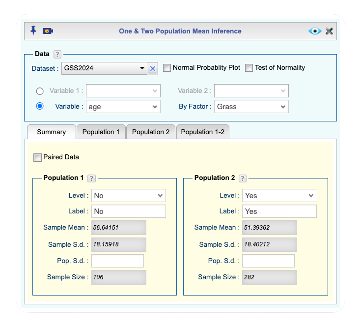
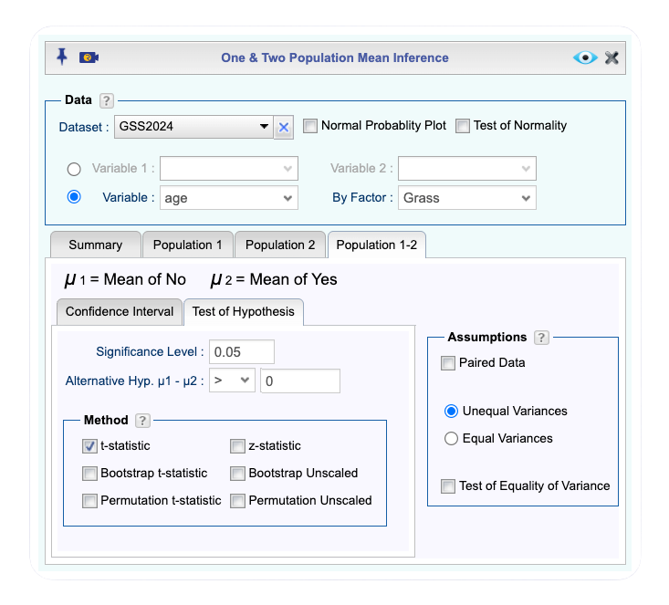
Rguroo setup for a hypothesis test comparing the mean ages of respondents who support and do not support legalizing marijuana using the GSS2024 dataset.
:::
:::

::: {.callout-tip .inner-callout collapse="false" title="Rguroo Output: Marijuana Legalization and Age"}

<div tabindex="0" class="rg-iframe-wrapper">
  <iframe
    src='Rguroo_html_output/Mean Inference/GSS_Grass_age_docx/GSS_Grass_age.html'
    class="rg-iframe"
    title="Rguroo output: Two Independent Means - Marijuana Legalization and Age">
  </iframe>
  </div>

:::

Refering to the Rguroo output **_Data Summary_** table, the mean age for respondents who do not support legalizing marijuana (No) is approximately 56.642 years, and the mean age for respondents who support legalizing marijuana (Yes) is approximately 51.394 years. Therefore, the observed difference between the sample means is approximately $56.642 - 51.394 = 5.248$ years.

c\. From the Rguroo output **_Test of Hypothesis - t-Test_** table, the standard error of the difference in sample means is approximately 2.076 years, and the degrees of freedom used in the test is approximately 191.1. The sampling distribution of the test statistic under the null hypothesis is approximately t-distributed with  center at 0, standard error 2.076 and 191.1 degrees of freedom:
$$
\bar{X}_1 - \bar{X}_2 \sim t_{191.1}\!\left(0,\ 2.076\right).
$$

d\. The left panel of the Rguroo output **_Critical Region Graph: t-Test_**, shows the critical value for the test in the scale of the data. This value at the 5% significance level is approximately 3.432. Since the observed difference between the sample means (5.248) is greater than the critical value (3.432), it falls in the rejection region, and we reject the null hypothesis.

e\. The **_Test of Hypothesis: t-test_** table and the **__P-value Graph: t-Test_** in the Rguroo output show a p-value of 0.0061. Since this value is less than 5%, we reject the null hypothesis.

f\. We reject the null hypothesis and conclude that there is sufficient evidence at 5% level of significance mean age of those who do not support legalization of marijuana is more than those who agree with legalization.

::::

:::{#exm-two-mean-unknown-sigma-ci}

## Comparing Two Independent Means Using Summary Statistics — Marijuana Legalization and Age

In @exm-two-mean-unknown-sigma we carried out a hypothesis test from the raw GSS2024 data. We now construct a confidence interval for the same comparison, and in doing so we illustrate a second way to enter data into Rguroo: directly from **summary statistics**. When the raw data are not available — for example, when only the group means, standard deviations, and sample sizes are reported in a published study — we can still carry out the analysis by entering these summaries.

The summary statistics for the two groups are:

| Group | Description | Sample size | Sample mean | Sample SD |
|:------|:------------|:-----------:|:-----------:|:---------:|
| 1 | Does not support legalization (No) | $n_1 = 106$ | $\bar{x}_1 = 56.6415$ | $s_1 = 18.1592$ |
| 2 | Supports legalization (Yes) | $n_2 = 282$ | $\bar{x}_2 = 51.3936$ | $s_2 = 18.4021$ |

As before, let $\mu_1$ denote the mean age of respondents who do not support legalizing marijuana and $\mu_2$ the mean age of those who do.

a. Use Rguroo's [Mean Inference]{.fun} function, entering the summary statistics above, to construct a 95% confidence interval for the difference in mean ages $\mu_1 - \mu_2$. Use the unequal-variance method.
b. Report the observed difference in sample means, the margin of error, and the confidence interval from the Rguroo output.
c. Interpret the confidence interval in the context of the problem.
d. Use the confidence interval to determine whether the mean ages of the two groups differ. Is your conclusion consistent with the hypothesis test of @exm-two-mean-unknown-sigma?
:::

:::: {.callout-tip .solution-callout collapse="true" icon=false}
## 🔎 Solution

a. Click to expand the box below to see how to enter the summary statistics and construct the confidence interval in Rguroo's [Mean Inference]{.fun} function.

::: {#two-mean-gss-ci .callout-note appearance="simple" collapse="true" icon="none" title="{width=22px style='vertical-align:middle;'} Rguroo: Confidence Interval from Summary Statistics — Marijuana Legalization and Age"}

1. Open the **Analytics** toolbox in Rguroo.
2. From the [Analysis]{.dpd} dropdown, select [Mean Inference]{.fun} --> [One \& Two Population]{.fun}. This opens the [One & Two Population Mean Inference]{.dialog} dialog.
3. In the [Summary]{.tab} tab, enter the summary statistics for each group:
    a. Under the **Population 1** section, enter [Sample Mean]{.des}: [56.6415]{.typein}, [Sample S.d.]{.des}: [18.1592]{.typein}, and [Sample Size]{.des}: [106]{.typein}.
    b. Under the **Population 2** section, enter [Sample Mean]{.des}: [51.3936]{.typein}, [Sample S.d.]{.des}: [18.4021]{.typein}, and [Sample Size]{.des}: [282]{.typein}.
5. Select the [Population 1-2]{.tab} tab, and select the [Confidence Interval]{.tab} sub-tab to specify the confidence interval settings.
    a. In the [Confidence Level]{.des} field, enter [0.95]{.typein}.
    b. Select the [t-statistic]{.des} checkbox to specify that the interval should be based on the Student $t$ distribution.
6. Under the **Assumptions** section, select [Unequal Variances]{.des} to indicate that the variances of the two populations are not assumed to be equal.
7. Click the preview icon  to view the output.
8. Click the  button and save the result as [GSS2024_Grass_Age_CI]{.typein}.

::: {.callout-tip .inner-callout collapse="false" title="Rguroo One & Two Population Mean Inference dialog for the confidence interval from summary statistics"}
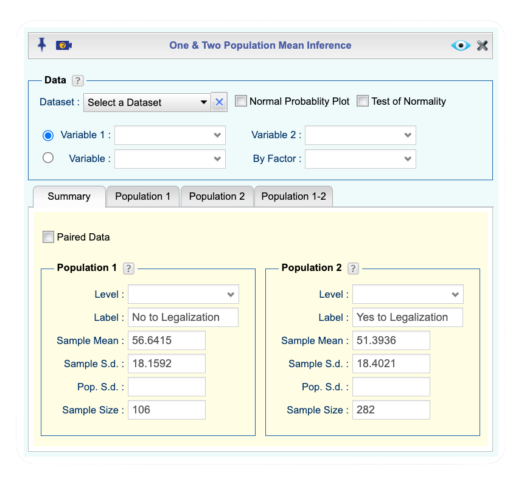

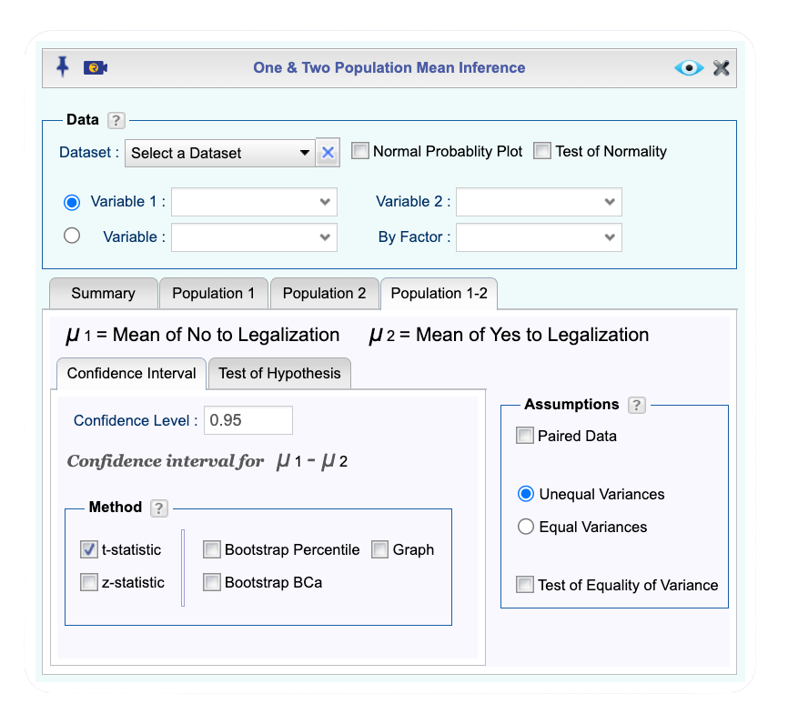

Rguroo setup for a confidence interval for the difference in mean ages, entered from summary statistics.
:::
:::

::: {.callout-tip .inner-callout collapse="false" title="Rguroo Output: Confidence Interval — Marijuana Legalization and Age"}

<div tabindex="0" class="rg-iframe-wrapper">
  <iframe
    src='Rguroo_html_output/Mean Inference/GSS2024_Grass_Age_CI_docx/GSS2024_Grass_Age_CI.html'
    class="rg-iframe"
    title="Rguroo output: Confidence Interval - Marijuana Legalization and Age">
  </iframe>
</div>

:::

b. From the Rguroo output, the observed difference in sample means is $\bar{x}_1 - \bar{x}_2 = 56.642 - 51.394 = 5.248$ years. The margin of error is approximately 4.096 years, and the 95% confidence interval for $\mu_1 - \mu_2$ is approximately

$$
(1.154,\ 9.343) \text{ years}.
$$

c. We are 95% confident that the true difference in mean age between respondents who do not support legalizing marijuana and those who do is between approximately 1.15 and 9.34 years. Because the entire interval is positive, the respondents who do not support legalization are, on average, older than those who support it, by somewhere between about 1 and 9 years. 

d. The value 0 lies outside the 95% confidence interval $(1.153,\ 9.343)$. A two-sided 5% test of $H_0: \mu_1 - \mu_2 = 0$ would therefore reject $H_0$, indicating that the mean ages of the two groups differ. This is consistent with the conclusion of @exm-two-mean-unknown-sigma, where the one-sided test rejected $H_0$ in favor of $H_a: \mu_1 - \mu_2 > 0$. Both analyses point to the same finding: respondents who do not support legalization are older, on average, than those who do.

::::

::: {.callout-note appearance="minimal"}
## Choosing a Method for Two Independent Means

Two questions determine which method to use.

**1. Are the population standard deviations known?**

- **Known** $\sigma_1$ and $\sigma_2$ (rare in practice): use the normal-based method of @sec-two-mean-known-sigma, with critical value $z^*$.
- **Unknown** $\sigma_1$ and $\sigma_2$ (the usual case): estimate them from the data and use a $t$-based method. Proceed to question 2.

**2. Can the two population variances be assumed equal?**

- **No, or unsure** (the safer default): use the unequal-variance method of @sec-two-mean-unknown-sigma. The standard error is $\sqrt{s_1^2/n_1 + s_2^2/n_2}$, and software computes the degrees of freedom (generally not a whole number).
- **Yes, with good reason**: use the equal-variance method of @sec-two-mean-equal-var. The standard error uses the pooled standard deviation $s_p$, and the degrees of freedom are $n_1 + n_2 - 2$.

**Large samples.** When both samples are large (as a rule of thumb, $n_1 \geq 30$ and $n_2 \geq 30$), the normality assumption is not needed, and the normal-based large-sample method of @sec-two-mean-large-sample applies, with critical value $z^*$.

**When in doubt, use the unequal-variance $t$ method.** It requires no assumption about equal variances, performs almost as well as the equal-variance method when the variances are in fact equal, and is the default in most software, including Rguroo.
:::

### Homework for @sec-mean-independent

1. The NHANES dataset contains many variables measured on a sample of U.S. residents. One variable, [hhincomemid]{.var}, records household income derived from the midpoint of income categories. We treat males and females as two independent groups and wish to investigate whether the mean household income *differs* between them. Let $\mu_1$ be the mean income for males and $\mu_2$ the mean income for females. Import the [NHANES]{.dataset} dataset into Rguroo from the book's Rguroo dataset repository, and use the variable [hhincomemid]{.var} with the BY factor [gender]{.var}. Set Population 1 to the level [male]{.typein} and Population 2 to the level [female]{.typein}. The first rows of the dataset are shown in @tbl-NHANES, and the [codebook is here](#code-book-nhanes). Using the unequal-variance method, conduct a test at the 1% significance level by answering the following questions:

   a. State the null and alternative hypotheses in terms of $\mu_1 - \mu_2$.
   b. Use Rguroo's [Mean Inference]{.fun} function to obtain the mean income for each group and the observed difference in sample means.
   c. From the output, obtain the standard error and degrees of freedom, and state the sampling distribution of the test statistic under the null hypothesis.
   d. Use Rguroo to obtain the critical region, and determine whether the observed difference falls in the rejection region.
   e. Report the p-value and state whether you reject $H_0$.
   f. Interpret the results in the context of male and female household incomes.

::: {#code-book-nhanes .callout-tip .codebook collapse="true"}
## Code book for Dataset NHANES

Dataset Name: [NHANES]{.data}

A sample of survey and physical-examination data on U.S. residents from the National Health and Nutrition Examination Survey. [Confirm the description and full variable list for your NHANES dataset.]

The variables included in this dataset are described below.

[gender]{.var}: Sex of the respondent (male or female)

[hhincomemid]{.var}: Household income, derived from the midpoint of income categories (\$)

[Add any additional variables used in your version of the dataset.]

**Source**

National Health and Nutrition Examination Survey (NHANES). [Confirm the full source for your NHANES dataset.]
:::

```{r, echo=FALSE, eval = FALSE }
#| tbl-alt: "First rows of the NHANES dataset"
#| label: tbl-NHANES
#| tbl-cap: "Household Income and Sex from NHANES"
NHANES <- read.csv('FJK_datasets/nhanes.csv')
knitr::kable(head(NHANES[, c("gender", "hhincomemid")]))
```

-->

2. Using the same NHANES data described in Problem 1, we now estimate the difference in mean household income between males and females with a confidence interval. Let $\mu_1$ be the mean income for males and $\mu_2$ the mean income for females. Import the [NHANES]{.dataset} dataset into Rguroo from the book's Rguroo dataset repository, and use the variable [hhincomemid]{.var} with the BY factor [gender]{.var}, with Population 1 the level [male]{.typein} and Population 2 the level [female]{.typein}. The first rows of the dataset are shown in @tbl-NHANES, and the [codebook is here](#code-book-nhanes).

   a. Use Rguroo's [Mean Inference]{.fun} function with the unequal-variance method to construct a 95% confidence interval for $\mu_1 - \mu_2$.
   b. Report the observed difference in sample means, the margin of error, and the interval.
   c. Interpret the confidence interval in the context of male and female household incomes.
   d. Use the confidence interval to determine whether the mean incomes differ. Does 0 fall inside the interval, and what does that imply?

3. A study measured the total brain volume (TBV) of patients with schizophrenia and patients without schizophrenia. We treat the two diagnoses as independent groups and wish to investigate whether the mean TBV *differs* between them. Let $\mu_1$ be the mean TBV for patients with schizophrenia and $\mu_2$ the mean TBV for patients without schizophrenia. Import the [Brain]{.dataset} dataset into Rguroo from the book's Rguroo dataset repository, and use the variable [volume]{.var} with the BY factor [type]{.var}. Set Population 1 to the level [s]{.typein} (schizophrenia) and Population 2 to the level [n]{.typein} (no schizophrenia). The first rows of the dataset are shown in @tbl-Brain, and the [codebook is here](#code-book-brain). Using the unequal-variance method, conduct a test at the 10% significance level by answering the following questions:

   a. State the null and alternative hypotheses in terms of $\mu_1 - \mu_2$.
   b. Use Rguroo's [Mean Inference]{.fun} function to obtain the mean TBV for each group and the observed difference in sample means.
   c. From the output, obtain the standard error and degrees of freedom, and state the sampling distribution of the test statistic under the null hypothesis.
   d. Use Rguroo to obtain the critical region, and determine whether the observed difference falls in the rejection region.
   e. Report the p-value and state whether you reject $H_0$.
   f. Interpret the results in the context of brain volume and schizophrenia.

::: {#code-book-brain .callout-tip .codebook collapse="true"}
## Code book for Dataset Brain

Dataset Name: [Brain]{.data}

A study measuring the total brain volume (TBV) of patients with and without schizophrenia.

The variables included in this dataset are described below.

[type]{.var}: Whether the patient had schizophrenia (s) or did not have schizophrenia (n)

[volume]{.var}: Total brain volume of the patient (mm³)

**Source**

SOCR Data Oct2009 ID NI. (2013, November 16). Retrieved from <http://wiki.stat.ucla.edu/socr/index.php/SOCR_Data_Oct2009_ID_NI>
:::

```{r, echo=FALSE}
#| tbl-alt: "First rows of the Brain Volume dataset"
#| label: tbl-Brain
#| tbl-cap: "Total Brain Volume of Patients"
Brain <- read.csv('FJK_datasets/brain.csv')
knitr::kable(head(Brain))
```

4. Using the same brain volume data described in Problem 3, we now estimate the difference in mean TBV between patients with and without schizophrenia with a confidence interval. Let $\mu_1$ be the mean TBV for patients with schizophrenia and $\mu_2$ the mean TBV for patients without schizophrenia. Import the [Brain]{.dataset} dataset into Rguroo from the book's Rguroo dataset repository, and use the variable [volume]{.var} with the BY factor [type]{.var}, with Population 1 the level [s]{.typein} and Population 2 the level [n]{.typein}. The first rows of the dataset are shown in @tbl-Brain, and the [codebook is here](#code-book-brain).

   a. Use Rguroo's [Mean Inference]{.fun} function with the unequal-variance method to construct a 90% confidence interval for $\mu_1 - \mu_2$.
   b. Report the observed difference in sample means, the margin of error, and the interval.
   c. Interpret the confidence interval in the context of brain volume and schizophrenia.
   d. Use the confidence interval to determine whether the mean TBV differs between the two groups. Is your conclusion consistent with a two-sided test at the 10% significance level?

5. The lengths, in kilometers, of rivers on the South Island of New Zealand were recorded, along with the body of water each river flows into. We treat rivers flowing to the Pacific Ocean and rivers flowing to the Tasman Sea as two independent groups, and wish to investigate whether the mean river length *differs* between them. Let $\mu_1$ be the mean length of Pacific-bound rivers and $\mu_2$ the mean length of Tasman-bound rivers. Import the [Length]{.dataset} dataset into Rguroo from the book's Rguroo dataset repository, and use the variable [length]{.var} with the BY factor [outflow]{.var}. Set Population 1 to the level [Pacific]{.typein} and Population 2 to the level [Tasman]{.typein}. The first rows of the dataset are shown in @tbl-Length, and the [codebook is here](#code-book-length). Using the unequal-variance method, conduct a test at the 5% significance level by answering the following questions:

   a. State the null and alternative hypotheses in terms of $\mu_1 - \mu_2$.
   b. Use Rguroo's [Mean Inference]{.fun} function to obtain the mean length for each group and the observed difference in sample means.
   c. From the output, obtain the standard error and degrees of freedom, and state the sampling distribution of the test statistic under the null hypothesis.
   d. Use Rguroo to obtain the critical region, and determine whether the observed difference falls in the rejection region.
   e. Report the p-value and state whether you reject $H_0$.
   f. Interpret the results in the context of river lengths and outflow.

::: {#code-book-length .callout-tip .codebook collapse="true"}
## Code book for Dataset Length

Dataset Name: [Length]{.data}

The lengths of rivers on the South Island of New Zealand and the body of water each flows into. [Confirm the description and variable names for your Length dataset.]

The variables included in this dataset are described below.

[river]{.var}: Name of the river

[length]{.var}: Length of the river (km)

[outflow]{.var}: Body of water the river flows into (Pacific or Tasman)

**Source**

Lee, A. (1994). [Confirm the full source for the Length dataset.]
:::

```{r, echo=FALSE}
#| tbl-alt: "First rows of the New Zealand Rivers dataset"
#| label: tbl-Length
#| tbl-cap: "Lengths of South Island Rivers in Kilometers"
Length <- read.csv('FJK_datasets/length.csv')
knitr::kable(head(Length))
```

6. Using the same New Zealand rivers data described in Problem 5, we now estimate the difference in mean river length between Pacific-bound and Tasman-bound rivers with a confidence interval. Let $\mu_1$ be the mean length of Pacific-bound rivers and $\mu_2$ the mean length of Tasman-bound rivers. Import the [Length]{.dataset} dataset into Rguroo from the book's Rguroo dataset repository, and use the variable [length]{.var} with the BY factor [outflow]{.var}, with Population 1 the level [Pacific]{.typein} and Population 2 the level [Tasman]{.typein}. The first rows of the dataset are shown in @tbl-Length, and the [codebook is here](#code-book-length).

   a. Use Rguroo's [Mean Inference]{.fun} function with the unequal-variance method to construct a 95% confidence interval for $\mu_1 - \mu_2$.
   b. Report the observed difference in sample means, the margin of error, and the interval.
   c. Interpret the confidence interval in the context of river lengths and outflow.
   d. Use the confidence interval to determine whether the mean lengths differ. Does 0 fall inside the interval, and what does that imply?

7. A vitamin K shot is given to infants soon after birth. Nurses at Northbay Healthcare studied whether the way infants are handled could reduce the pain they feel, measuring how long each infant cried, in seconds, after the shot. Infants given the shot using conventional methods and infants given the shot using a new method (held by the mother before and during the shot) form two independent groups. We wish to investigate whether the mean crying time *differs* between the two methods. Let $\mu_1$ be the mean crying time under the conventional method and $\mu_2$ the mean crying time under the new method. Import the [Crying]{.dataset} dataset into Rguroo from the book's Rguroo dataset repository, and use the variable [crying]{.var} with the BY factor [method]{.var}. Set Population 1 to the level [convent]{.typein} and Population 2 to the level [new]{.typein}. The first rows of the dataset are shown in @tbl-Crying, and the [codebook is here](#code-book-crying). Using the unequal-variance method, conduct a test at the 5% significance level by answering the following questions:

   a. State the null and alternative hypotheses in terms of $\mu_1 - \mu_2$.
   b. Use Rguroo's [Mean Inference]{.fun} function to obtain the mean crying time for each group and the observed difference in sample means.
   c. From the output, obtain the standard error and degrees of freedom, and state the sampling distribution of the test statistic under the null hypothesis.
   d. Use Rguroo to obtain the critical region, and determine whether the observed difference falls in the rejection region.
   e. Report the p-value and state whether you reject $H_0$.
   f. Interpret the results in the context of infant crying time and handling method.

::: {#code-book-crying .callout-tip .codebook collapse="true"}
## Code book for Dataset Crying

Dataset Name: [Crying]{.data}

Nurses at Northbay Healthcare studied whether the way infants are handled could reduce the pain they feel during a vitamin K shot. One measurement was how long, in seconds, the infant cried after the shot. A random sample was taken from infants given the shot using conventional methods, and another from infants given the shot using a new method, in which the mother held the infant before and during the shot.

The variables included in this dataset are described below.

[method]{.var}: Whether the infant was given the conventional method (convent) or the new method (new)

[crying]{.var}: How long the infant cried after the vitamin K shot (seconds)

**Source**

SOCR Data NIPS InfantVitK ShotData. (2013, November 16). Retrieved from <http://wiki.stat.ucla.edu/socr/index.php/SOCR_Data_NIPS_InfantVitK_ShotData>
:::

```{r, echo=FALSE}
#| tbl-alt: "First rows of the Infant Crying dataset"
#| label: tbl-Crying
#| tbl-cap: "Crying Time of Infants Given Vitamin K Shots"
Crying <- read.csv('FJK_datasets/crying.csv')
knitr::kable(head(Crying))
```

8. Using the same infant crying data described in Problem 7, we now estimate the difference in mean crying time between the conventional and new methods with a confidence interval. Let $\mu_1$ be the mean crying time under the conventional method and $\mu_2$ the mean crying time under the new method. Import the [Crying]{.dataset} dataset into Rguroo from the book's Rguroo dataset repository, and use the variable [crying]{.var} with the BY factor [method]{.var}, with Population 1 the level [convent]{.typein} and Population 2 the level [new]{.typein}. The first rows of the dataset are shown in @tbl-Crying, and the [codebook is here](#code-book-crying).

   a. Use Rguroo's [Mean Inference]{.fun} function with the unequal-variance method to construct a 95% confidence interval for $\mu_1 - \mu_2$.
   b. Report the observed difference in sample means, the margin of error, and the interval.
   c. Interpret the confidence interval in the context of infant crying time and handling method.
   d. Use the confidence interval to determine whether the mean crying times differ. Is your conclusion consistent with a two-sided test at the 5% significance level?

## The Large-Sample Case {#sec-two-mean-large-sample}

As in the one-mean case, the assumption that the two populations are normally distributed can be relaxed when both samples are large. By the Central Limit Theorem, when $n_1$ and $n_2$ are both large (as a rule of thumb, each at least 30), the difference in sample means $\bar{X}_1 - \bar{X}_2$ is approximately normally distributed regardless of the shape of the two population distributions. The methods of this section then apply as approximations.

When the population standard deviations are unknown, we replace them with the sample standard deviations $s_1$ and $s_2$, just as in the one-mean large-sample case. For large samples these are reliable estimates, and the difference in sample means is approximately

$$
\bar{X}_1 - \bar{X}_2 \sim N\!\left(\mu_1 - \mu_2,\ \sqrt{\frac{s_1^2}{n_1} + \frac{s_2^2}{n_2}}\right).
$$

In Rguroo, the only change from the unknown-$\sigma$ procedure is to select the [z-statistic]{.des} method rather than the [t-statistic]{.des} method, exactly as in the one-mean large-sample case (@sec-large-sample-mean). Because the $t$ distribution is nearly identical to the normal for large degrees of freedom, the two methods give essentially the same critical regions, p-values, and confidence intervals.

::: {.callout-note appearance="minimal"}
## Large-Sample Inference for Two Independent Means

When both samples are large (as a rule of thumb, $n_1 \geq 30$ and $n_2 \geq 30$), the Central Limit Theorem makes $\bar{X}_1 - \bar{X}_2$ approximately normal regardless of the shape of the two populations, so the normality assumption is not needed. When $\sigma_1$ and $\sigma_2$ are unknown, replace them with $s_1$ and $s_2$. The difference in sample means then has the approximate sampling distribution

$$
\bar{X}_1 - \bar{X}_2 \sim N\!\left(\mu_1 - \mu_2,\ \sqrt{\frac{s_1^2}{n_1} + \frac{s_2^2}{n_2}}\right).
$$

**Hypotheses.** The boundary value is typically $\mu_1 - \mu_2 = 0$, giving one of the three forms

$$
\begin{cases} H_0: \mu_1 - \mu_2 \leq 0 \\ H_a: \mu_1 - \mu_2 > 0 \end{cases}
\qquad
\begin{cases} H_0: \mu_1 - \mu_2 \geq 0 \\ H_a: \mu_1 - \mu_2 < 0 \end{cases}
\qquad
\begin{cases} H_0: \mu_1 - \mu_2 = 0 \\ H_a: \mu_1 - \mu_2 \neq 0. \end{cases}
$$

**Confidence interval.** The $(1-\alpha)\times 100\%$ confidence interval for $\mu_1 - \mu_2$ is

$$
(\bar{X}_1 - \bar{X}_2) \pm z^* \cdot \sqrt{\frac{s_1^2}{n_1} + \frac{s_2^2}{n_2}},
$$

where $z^*$ is the standard normal critical value for confidence level $(1-\alpha)\times 100\%$. To compute the interval from a specific sample, replace $\bar{X}_1 - \bar{X}_2$ with its observed value $\bar{x}_1 - \bar{x}_2$.

In Rguroo, select the [z-statistic]{.des} method.
:::

### Homework for @sec-two-mean-large-sample

1. We return to the NHANES household income comparison of Problem 1 in the homework for @sec-mean-independent. Because both the male and female groups are large, the Central Limit Theorem allows the large-sample (normal) method without assuming the populations are normal. Let $\mu_1$ be the mean income for males and $\mu_2$ the mean income for females. Import the [NHANES]{.dataset} dataset into Rguroo from the book's Rguroo dataset repository, and use the variable [hhincomemid]{.var} with the BY factor [gender]{.var}, with Population 1 the level [male]{.typein} and Population 2 the level [female]{.typein}. The first rows of the dataset are shown in @tbl-NHANES, and the [codebook is here](#code-book-nhanes). Use the unequal-variance, [z-statistic]{.des} method.

   a. State the null and alternative hypotheses for testing whether the mean incomes differ, in terms of $\mu_1 - \mu_2$.
   b. What is the approximate sampling distribution of $\bar{X}_1 - \bar{X}_2$ under the null hypothesis for the large-sample method?
   c. Use Rguroo's [Mean Inference]{.fun} function with the [z-statistic]{.des} method to obtain the p-value. Interpret it in context, and state whether you reject $H_0$ at the 1% significance level.
   d. Compare your result to the $t$-based test you carried out for these data in the homework for @sec-mean-independent. Do the two methods lead to the same conclusion? Explain why this is expected for samples of this size.

2. We return to the NHANES household income comparison once more, now to estimate the difference in mean income with the large-sample method. Let $\mu_1$ be the mean income for males and $\mu_2$ the mean income for females. Import the [NHANES]{.dataset} dataset into Rguroo from the book's Rguroo dataset repository, and use the variable [hhincomemid]{.var} with the BY factor [gender]{.var}, with Population 1 the level [male]{.typein} and Population 2 the level [female]{.typein}. The first rows of the dataset are shown in @tbl-NHANES, and the [codebook is here](#code-book-nhanes). Use the unequal-variance, [z-statistic]{.des} method.

   a. What is the approximate sampling distribution of $\bar{X}_1 - \bar{X}_2$ for the large-sample method?
   b. Use Rguroo's [Mean Inference]{.fun} function with the [z-statistic]{.des} method to construct a 95% confidence interval for $\mu_1 - \mu_2$. Report the observed difference, the margin of error, and the interval.
   c. Interpret the confidence interval in context.
   d. Compare this large-sample interval to the $t$-based interval you constructed for these data in the homework for @sec-mean-independent. How close are the two intervals, and why?

3. A subset of the 2024 General Social Survey, the [GSS2024]{.dataset} dataset, records each respondent's age and whether they support legalizing marijuana. We treat respondents who support legalization and those who do not as two independent groups, both of which are large. We wish to investigate whether the mean age *differs* between the two groups. Let $\mu_1$ be the mean age of respondents who do not support legalization and $\mu_2$ the mean age of those who do. Import the [GSS2024]{.dataset} dataset into Rguroo from the book's Rguroo dataset repository, and use the variable [age]{.var} with the BY factor [grass]{.var}, with Population 1 the level [No]{.typein} and Population 2 the level [Yes]{.typein}. The [codebook is here](#code-book-gss2024). Use the unequal-variance, [z-statistic]{.des} method.

   a. State the null and alternative hypotheses in terms of $\mu_1 - \mu_2$.
   b. What is the approximate sampling distribution of $\bar{X}_1 - \bar{X}_2$ under the null hypothesis for the large-sample method?
   c. Use Rguroo's [Mean Inference]{.fun} function with the [z-statistic]{.des} method to construct a 95% confidence interval for $\mu_1 - \mu_2$, and report the interval.
   d. The worked example @exm-two-mean-unknown-sigma-ci constructed a $t$-based 95% confidence interval for this same comparison and obtained approximately $(1.15,\ 9.34)$ years. Compare your large-sample interval to that result. How close are the two, and why?

4. We return to the brain volume comparison of Problem 3 in the homework for @sec-mean-independent, now applying the large-sample method. (Confirm that both the schizophrenia and non-schizophrenia groups have at least 30 patients before using this method.) Let $\mu_1$ be the mean TBV for patients with schizophrenia and $\mu_2$ the mean TBV for patients without. Import the [Brain]{.dataset} dataset into Rguroo from the book's Rguroo dataset repository, and use the variable [volume]{.var} with the BY factor [type]{.var}, with Population 1 the level [s]{.typein} and Population 2 the level [n]{.typein}. The first rows of the dataset are shown in @tbl-Brain, and the [codebook is here](#code-book-brain). Use the unequal-variance, [z-statistic]{.des} method.

   a. State the null and alternative hypotheses in terms of $\mu_1 - \mu_2$.
   b. What is the approximate sampling distribution of $\bar{X}_1 - \bar{X}_2$ under the null hypothesis for the large-sample method?
   c. Use Rguroo's [Mean Inference]{.fun} function with the [z-statistic]{.des} method to obtain the p-value. Interpret it in context, and state whether you reject $H_0$ at the 10% significance level.
   d. Compare your result to the $t$-based test you carried out for these data in the homework for @sec-mean-independent. Do the two methods lead to the same conclusion?