**Before you begin, click to expand the box below to review the process for importing a dataset.**

::: {#Importing-GSS2024-to-Rguroo .callout-note appearance="simple" collapse="true" icon="none" title="{width=22px style='vertical-align:middle;'}  Importing Data to Rguroo"} 

1. Open the **Data** toolbox in Rguroo.  
2. From the [Data Import]{.dpd} dropdown, select [Dataset Repository]{.fun}.  
3. In the top search box, type [kozak]{.typein}, then select the [Statistics Using Technology – Kozak]{.repo} repository.  
4. In the middle search box, type the first few letters of the dataset name, and choose your desired dataset name that appears in the lower panel.  
5. Click the [Import]{.button}. The dataset will be imported to your Rguroo account.
6. Click [Close]{.button} to exit the dialog.  
7. To view the dataset, double-click the dataset name under the **Data** toolbox list.
:::

In this chapter we develop methods for drawing inferences about a population mean $\mu$ (read mu). Examples of population means abound in practice: the mean SAT math score among incoming freshmen at a particular university, the mean nightly sleep hours among college students, the mean one-way commute time in a metropolitan area, and the mean flipper length of Adélie penguins in the Palmer Archipelago. These are four of the running examples we use throughout the chapter, and many other applications follow the same pattern.

The framework established in the Foundations of Inference chapter applies here unchanged. We still begin with a research question about a population parameter — now $\mu$. We collect a random sample, compute a statistic from it, and study how that statistic varies from sample to sample through its sampling distribution (see @sec-foundations-populations). We test claims by examining where our observed statistic falls within the null distribution(@sec-foundations-hypotheses), and make decisions using p-values (@sec-foundations-pvalue) or critical regions (@sec-foundations-critical-region). Confidence intervals (@sec-foundations-confidence-intervals), significance levels, Type I and Type II errors (@sec-foundations-errors), and confidence levels all retain the meanings established in the foundations chapter.

How do we tell, in a real-world problem, whether the parameter of interest is a mean or a proportion? As discussed in @sec-foundations-mean-vs-prop, the key is the variable measured on each individual in the population. If the variable is **numerical** — a score, a quantity, a measurement — the parameter is a population **mean** $\mu$. All the examples in this chapter are of this type: SAT scores in points, sleep duration in hours, commute time in minutes, flipper length in millimeters. If instead the variable is categorical (success/failure, yes/no), the parameter is a population **proportion** $p$, and the methods from the previous chapter apply.

What changes between the two chapters is not the logic of inference, but the type of data we analyze and the distributions used to model sampling variability. In the previous chapter the variable was binary, so the natural statistic was the count of successes $X$, with its binomial distribution; the sample proportion $\hat{p} = X/n$ served as an estimator of $p$. In this chapter the variable is numerical, so neither the count $X$ nor the binomial distribution apply. The natural statistic is the sample mean, the arithmetic average of the numerical measurements in the sample. As a random variable—that is, before we collect data—we denote it by $\bar{X}$. Once we have actually collected the data, we obtain a specific numerical value of this average, which we denote by $\bar{x}_{\text{obs}}$ and call the **observed sample mean**. As before, inference is based on determining where the observed statistic lies within the sampling distribution of the statistic.

We begin with situations in which the variable under study has a normal distribution in the population. Later in the chapter, we will see that many of the same methods remain valid even when the population distribution is not normal. We will cover both one-population and two-population settings. In the one-population setting we draw inferences about a single population mean $\mu$. In the two-population setting we compare two population means $\mu_1$ and $\mu_2$ through their difference $\mu_1 - \mu_2$. We begin with the one-population case.

## Basics of Hypothesis Testing for a Population Mean {#sec-concept-setup-mean}

In this section we set up the elements common to all hypothesis tests for a population mean: the form of the null and alternative hypotheses, and the null distribution of $\bar{X}$. The specifics of this null distribution depend on what we assume about the population, leading to two cases that we develop in the subsections that follow.

### Null and Alternative Hypotheses {#sec-null-alternative-mean}

As established in @sec-foundations-three-forms, the null and alternative hypotheses always come in one of three forms, depending on the nature of the research question. For a population mean $\mu$, with $\mu_0$ denoting a specific value, the three cases are:

$$
\begin{aligned}
\text{Case 1: } 
&\begin{cases}
H_0: \mu \leq \mu_0 \\
H_a: \mu > \mu_0
\end{cases}
\qquad
\text{Case 2: } 
\begin{cases}
H_0: \mu \geq \mu_0 \\
H_a: \mu < \mu_0
\end{cases} \\
\\
\text{Case 3: } 
&\begin{cases}
H_0: \mu = \mu_0 \\
H_a: \mu \neq \mu_0
\end{cases}
\end{aligned}
$$

The value $\mu_0$ is the **boundary value** of $H_0$ — the value at which the Type I error probability is maximized for one-sided tests (see @sec-foundations-boundary).

Recall from @sec-foundations-three-forms that in Cases 1 and 2, the alternative hypothesis claims that $\mu$ is either greater than $(>)$ or less than $(<)$ $\mu_0$, pointing in a single direction. These are called **one-sided** (or **one-tailed**) hypotheses. In Case 3, the alternative hypothesis claims only that $\mu$ is different from $(\neq)$ $\mu_0$, without specifying a direction. This is called a **two-sided** (or **two-tailed**) hypothesis. The form of the hypotheses determines how we set up our decision rules.

Let's begin with a few examples.

:::{#exm-sat-csuf-mean}
## SAT Math Scores at CSUF

According to the [College Board](https://reports.collegeboard.org/media/pdf/2025-total-group-sat-suite-of-assessments-annual-report%20ADA-v0.2_0.pdf), the mean score on the math portion of the SAT for the high school graduating class of 2025 was 508 points, with a standard deviation of 113 points. These figures are computed from the more than 2 million high school students who took the exam that year.

We wish to investigate whether the mean math SAT score among incoming freshmen in fall 2025 at California State University, Fullerton (CSUF) is *higher* than the national mean. Since CSUF does not require the SAT for admission, the exact record is not available, so we take a random sample of $n = 40$ incoming CSUF freshmen and obtain a sample mean of $\bar{x}_{\text{obs}} = 542$ points. Using this information, answer the following questions:

a. What is the population of interest?
b. Describe the parameter $\mu$ in words.
c. Write the null and alternative hypotheses.
:::

::: {.callout-tip .solution-callout collapse="true" icon=false}
## 🔎 Solution

a. The population of interest is all incoming freshmen in fall 2025 at California State University, Fullerton (CSUF).

b. $\mu$ is the mean math SAT score for all incoming freshmen in fall 2025 at CSUF.

c. The null and alternative hypotheses are as follows:
$$
\begin{cases}
H_0: \mu \leq 508 \\
H_a: \mu > 508
\end{cases}
$$
:::

:::{#exm-sleep-university-mean}
## Sleep Hours Among University Students

The [National Sleep Foundation](https://www.thensf.org/how-many-hours-of-sleep-do-you-really-need/) and the American Academy of Sleep Medicine recommend that young adults sleep between 7 and 9 hours per night, with 7 hours often cited as the minimum needed for healthy cognitive and physical functioning. There is widespread concern, however, that college students fall short of this recommendation.

We wish to investigate whether the mean nightly sleep among students at our university is *less than* 7 hours. We take a random sample of $n = 15$ students and ask each student how many hours they slept the previous night. The resulting sample has a mean of $\bar{x}_{\text{obs}} = 6.4$ hours and a standard deviation of $s=1.2$ hours. Using this information, answer the following questions:

a. What is the population of interest?
b. Describe the parameter $\mu$.
c. Write the null and alternative hypotheses.
:::

::: {.callout-tip .solution-callout collapse="true" icon=false}
## 🔎 Solution

a. The population of interest is all students at our university.

b. $\mu$ is the mean nightly sleep, in hours, for all students at our university.

c. The null and alternative hypotheses are as follows:
$$
\begin{cases}
H_0: \mu \geq 7 \\
H_a: \mu < 7
\end{cases}
$$
:::

:::{#exm-commute-metro-mean}
## Commute Time in a Metropolitan Area

According to the [U.S. Census Bureau's American Community Survey](https://www.census.gov/topics/employment/commuting/guidance/acs-1yr.html), the mean one-way commute time for U.S. workers in 2023 was 26.8 minutes. Local commuting patterns can differ substantially from the national average, however, because of differences in population density, transportation infrastructure, and the prevalence of remote work.

We wish to investigate whether the mean one-way commute time among workers in our metropolitan area *differs* from the national mean. We take a random sample of $n = 15$ commuters from the area and record each person's one-way commute time. The sample has a mean of $\bar{x}_{\text{obs}} = 24.8$ minutes and a standard deviation of $s = 9.6$ minutes. Using this information, answer the following questions:

a. What is the population of interest?
b. Describe the parameter $\mu$.
c. Write the null and alternative hypotheses.
:::

::: {.callout-tip .solution-callout collapse="true" icon=false}
## 🔎 Solution

a. The population of interest is all workers in our metropolitan area.

b. $\mu$ is the mean one-way commute time, in minutes, for all workers in our metropolitan area.

c. The null and alternative hypotheses are as follows:
$$
\begin{cases}
H_0: \mu = 26.8 \\
H_a: \mu \neq 26.8
\end{cases}
$$
:::

:::{#exm-penguin-flipper-mean}
## Flipper Length of Adélie Penguins

The [Palmer Penguins](https://allisonhorst.github.io/palmerpenguins/) dataset contains body measurements collected between 2007 and 2009 on 342 penguins from three species — Adélie, Chinstrap, and Gentoo — at three islands in the Palmer Archipelago, Antarctica. The data were assembled by Dr. Kristen Gorman and the Palmer Station Long Term Ecological Research (LTER) program and have since become a widely used dataset in introductory statistics and data science. Among Adélie penguins, flipper length is an important morphological measurement used in studies of body condition and adaptation, and a commonly cited reference value for the mean flipper length of Adélie penguins is 188 mm.

We wish to investigate whether the mean flipper length among Adélie penguins in the Palmer Archipelago *differs* from this reference value. Rather than working from summary statistics, in this example we use the raw flipper length measurements of all $n = 151$ Adélie penguins recorded in the dataset. Using this information, answer the following questions:

a. What is the population of interest?
b. Describe the parameter $\mu$.
c. Write the null and alternative hypotheses.
:::

Click to open the codebook for the [PalmerPenguin]{.dataset} dataset:

::: {#code-book-palmerpenguins .callout-tip .codebook collapse="true"}

## Code book for Dataset PalmerPenguins

Dataset Name: [PalmerPenguins]{.data}

This dataset contains measurements collected from penguins observed near Palmer Station, Antarctica, as part of the Palmer Penguins study. The dataset includes $n = 342$ penguins from three species.

The variables included in this dataset are described below.

[Species]{.var}: Penguin species

- Adélie   
- Chinstrap  
- Gentoo  

[Island]{.var}: Island where the penguin was observed

- Biscoe  
- Dream  
- Torgersen  

**Penguin Anatomy and Measurements**

{width=60% fig-align="center"}

[BillLength]{.var}: Bill length of the penguin (in millimeters)

[BillDepth]{.var}: Bill depth of the penguin (in millimeters)

[FlipperLength]{.var}: Flipper length of the penguin (in millimeters)

[BodyMass]{.var}: Body mass of the penguin (in grams)

[Sex]{.var}: Sex of the penguin

- Male  
- Female  

[Year]{.var}: Year in which the observation was recorded

- 2007  
- 2008  
- 2009  

Source

Horst, A. M., Hill, A. P., & Gorman, K. B. palmerpenguins: [Palmer Archipelago (Antarctica)penguin data](https://allisonhorst.github.io/palmerpenguins/).

:::

::: {.callout-tip .solution-callout collapse="true" icon=false}
## 🔎 Solution

a. The population of interest is all Adélie penguins in the Palmer Archipelago.

b. $\mu$ is the mean flipper length, in millimeters, of all Adélie penguins in the Palmer Archipelago.

c. The null and alternative hypotheses are as follows:
$$
\begin{cases}
H_0: \mu = 188 \\
H_a: \mu \neq 188
\end{cases}
$$
:::

### Homework for @sec-concept-setup-mean

<!-- to be filled --> 


## The Null Distribution of the Sample Mean {#sec-null-distribution-mean}

As we noted in @sec-foundations-populations, to make inferences about $\mu$, we use the sample mean $\bar{X}$ as our statistic, and we work with its sampling distribution.

To make this distribution concrete, we will **assume that the variable under study has a normal distribution** in the population. Two reasons motivate this assumption. First, the normal distribution provides a reasonable model for many naturally occurring numerical variables, including adult heights, weights, exam scores, and a wide range of biological and physical measurements. Second, under this assumption, the sampling distribution of $\bar{X}$ takes a clean, exact form that allows us to focus on the main ideas of inference without the distraction of approximations or special cases. In @sec-QQ-Plot-mean we discuss how to assess this assumption graphically with a statistical test and normal probability plot, and in @sec-large-sample-mean we show that the methods developed under the normality assumption remain approximately valid for large samples even when the population is not normal.

The sampling distribution of $\bar{X}$ depends on the unknown population mean $\mu$ — the very quantity we want to make an inference about. As in foundations (@sec-foundations-boundary), we proceed by evaluating the sampling distribution at the boundary value of $H_0$: the value $\mu_0$ where the Type I error probability is maximized. For two-sided tests, $H_0$ specifies $\mu = \mu_0$ directly. For one-sided tests, $\mu_0$ is the boundary of the range of $\mu$ values allowed by $H_0$.

::: {.callout-note appearance="minimal"}
## The Null Distribution

The **null distribution** of $\bar{X}$ is the sampling distribution of $\bar{X}$ evaluated at $\mu = \mu_0$, the boundary value of $H_0$. This is the distribution we use for hypothesis testing — to compute p-values and to determine critical regions. 
::: 

Under the normality assumption introduced above, the form of this null distribution depends on whether the population standard deviation $\sigma$ is known. When $\sigma$ is known, the null distribution is exactly normal. When $\sigma$ is unknown — the typical situation in practice — we estimate it from the sample, and the resulting null distribution is a Student $t$ distribution. The subsections that follow develop each case in turn.

### When $\sigma$ Is Known {#sec-mean-inference-known-sigma}

In practice, the population standard deviation $\sigma$ is rarely known exactly. There are, however, situations in which a value of $\sigma$ has been established from extensive prior data and can reasonably be treated as known. The SAT example in @exm-sat-csuf-mean is one such case: the standard deviation of $\sigma = 113$ points is computed from the scores of more than 2 million students who took the exam in 2025, a population large enough that we can reasonably treat this value as known when investigating the mean score among a particular subgroup such as incoming CSUF freshmen. 

Beyond examples of this kind, beginning with the known-$\sigma$ case is helpful pedagogically because it allows us to focus on the main ideas of statistical inference while working with a simpler sampling distribution. Once these ideas are established, we will turn to the more realistic setting in which $\sigma$ is unknown and must be estimated from the sample data.

Before stating the result, we pause to clarify a phrase that will appear repeatedly throughout this chapter.

::: {.callout-note}
## A Convention on "When $H_0$ Is True"

For a two-sided test $H_0: \mu = \mu_0$, the phrase "when $H_0$ is true" is unambiguous: it means $\mu = \mu_0$.

For a one-sided test such as $H_0: \mu \leq \mu_0$, however, $H_0$ allows many values of $\mu$ (namely, every $\mu \leq \mu_0$), and "when $H_0$ is true" could in principle refer to any of them. As established in @sec-foundations-boundary, the **boundary value** $\mu_0$ is the value within $H_0$ at which the Type I error probability is maximized; controlling the error rate at $\mu_0$ automatically controls it at every other value of $\mu$ allowed under $H_0$.

**Convention.** For the remainder of this chapter, whenever we say *"when $H_0$ is true,"* *"under $H_0$,"* or *"assuming the null hypothesis,"* we mean **at the boundary value $\mu_0$**. We adopt this shorthand once and for all, and will not repeat the justification.
:::

Under the assumptions introduced earlier, the sample mean $\bar{X}$ has a normal distribution when $H_0$ is true. This distribution serves as the null distribution for hypothesis testing about the population mean $\mu$.

::: {.callout-note appearance="minimal" title="The Null Distribution"}
\ 

Under the assumptions that

- the variable under study has a **normal distribution** in the population,
- the population standard deviation $\sigma$ is known,
- the sample size is $n$, and
- the boundary value specified by $H_0$ is $\mu = \mu_0$,

the null distribution of the sample mean $\bar{X}$ is

$$
\bar{X} \sim N\left(\mu_0,\ \frac{\sigma}{\sqrt{n}}\right).
$$

:::

The result above tells us that, when $H_0$ is true, the sample mean $\bar{X}$ is centered at $\mu_0$ and varies around it with standard deviation $\sigma/\sqrt{n}$. For instance, in the SAT example with hypothesis $H_0: \mu \leq 508$, the random variable $\bar{X}$ has a normal distribution centered at 508 with standard deviation $113/\sqrt{40} \approx 17.87$ points. Roughly 95% of all possible sample means from random samples of size 40 would fall within about 35 points of 508. Sample means much larger than 508 would be unusual and would provide evidence against $H_0$.

Some texts work with a standardized version of the sample mean, namely

$$
Z = \frac{\bar{X} - \mu_0}{\sigma/\sqrt{n}} \sim N(0,1),
$$

and for this reason the procedure is commonly called the **$z$-test**. Rguroo reports critical regions and p-values using both the standardized statistic $Z$ and the sample mean $\bar{X}$ on its original scale.

In this text, we will primarily use the null distribution of $\bar{X}$ directly rather than its standardized version. Working on the original scale of the data allows us to interpret critical regions and p-values more naturally in the context of the problem and avoids the additional step of converting observations to standardized scores. In the SAT example, for instance, it is easier to reason about a sample mean of 542 points relative to a hypothesized population mean of 508 points than to translate everything into the unitless $z$ scale.


### When $\sigma$ Is Unknown {#sec-mean-inference-unknown-sigma}

In practice, only in rare cases do we know the population standard deviation $\sigma$. The good news is that the sample standard deviation $s$ provides a good estimate of $\sigma$, and statisticians have developed theory for using $s$ in place of $\sigma$ when the population distribution is normal. As in the known-$\sigma$ case, we therefore continue to assume that the variable under study has a normal distribution in the population.

When $\sigma$ is estimated by $s$, the sample mean $\bar{X}$ no longer has a normal sampling distribution. Instead, $\bar{X}$ follows a closely related distribution called the **Student $t$ distribution** (or simply $t$ distribution). The $t$ distribution is similar to the normal — symmetric, bell-shaped, and (in our setting) centered at $\mu_0$ — but has heavier tails to reflect the extra uncertainty introduced by estimating $\sigma$ from the sample. It has one shape parameter called the **degrees of freedom**, denoted $\text{df}$, which equals $n - 1$ in mean inference. We give the full description of the $t$ distribution in @sec-t-distribution at the end of this subsection.

::: {.callout-note appearance="minimal" title="What has a $t$ distribution?"}
\

It is important to be clear about *what* is assumed to be normal and *what* follows a $t$ distribution. The assumption is that the **variable under study** has a normal distribution in the population. Under this assumption, the **statistic** $\bar{X}$ follows a $t$ distribution. In other words, the normality assumption is about the individual measurements, while the $t$ distribution describes the behavior of the sample mean computed from those measurements.
:::

::: {.callout-note appearance="minimal" title="The Null Distribution"}
\ 

Under the assumptions that

- the variable under study has a **normal distribution** in the population,
- the population standard deviation $\sigma$ is unknown and is estimated by the sample standard deviation $s$,
- the sample size is $n$, and
- the boundary value specified by the null hypothesis is $\mu = \mu_0$,

the null distribution of the sample mean $\bar{X}$ is

$$
\bar{X} \sim t_{n-1}\left(\mu_0,\ \frac{s}{\sqrt{n}}\right),
$$

a $t$ distribution with $n - 1$ degrees of freedom, centered at $\mu_0$ and with estimated standard error

$$
\hat\sigma_{\bar X} = \frac{s}{\sqrt{n}}.
$$

:::

The result above parallels the known-$\sigma$ case, with two changes. First, the normal distribution is replaced by a $t$ distribution. Second, because $\sigma$ is no longer available, we replace it with the sample standard deviation $s$, so the scale of the distribution is the **estimated** standard error $\hat\sigma_{\bar X} = s/\sqrt{n}$ rather than the known standard error $\sigma/\sqrt{n}$. As in the known-$\sigma$ case, the distribution is centered at $\mu_0$ when the null hypothesis is true, and sample means far from $\mu_0$ constitute evidence against $H_0$.

For instance, in the sleep example, suppose the null hypothesis is $H_0: \mu \geq 7$ and we have a sample of size $n = 15$ with sample standard deviation $s = 1.2$ hours. Then $\bar{X}$ follows a $t$ distribution with $n - 1 = 14$ degrees of freedom, centered at 7 hours and with estimated standard error $1.2/\sqrt{15} \approx 0.310$ hours. Sample means much smaller than 7 with this scale would be unusual under $H_0$.

Some texts work with a standardized version of the sample mean, namely

$$
T = \frac{\bar{X} - \mu_0}{s/\sqrt{n}} \sim t_{n-1}.
$$

This distribution, like the standard normal distribution is centered at zero, and its scale is determined only by the degrees of freedom. Rguroo reports critical regions and p-values using both the standardized statistic $T$ and the sample mean $\bar{X}$ on its original scale.

As in the known-$\sigma$ case, in this text we will primarily use the null distribution of $\bar{X}$ directly rather than its standardized version. Working on the original scale of the data allows us to interpret critical regions and p-values in the units of the problem. In the sleep example, for instance, it is more natural to reason about a sample mean of 6.4 hours relative to a hypothesized mean of 7 hours than to translate everything into the unitless $t$ scale.

::: {.callout-tip appearance="minimal" title="When the $t$ and normal distributions agree"}
\

As discussed in @sec-t-distribution below, the $t$ distribution becomes closer to the standard normal distribution as the degrees of freedom increase. By the time the degrees of freedom reach about 30 — that is, a sample size of roughly $n = 30$ or more — the two distributions are nearly indistinguishable, and the critical values and p-values they produce are essentially the same. For this reason, with large samples it makes little practical difference whether one uses the $t$ distribution or the normal distribution, and the resulting inference is usually nearly identical. We nonetheless recommend using the $t$ distribution whenever $\sigma$ is unknown, regardless of sample size: it is always at least as appropriate as the normal, and it requires no judgment about whether the sample is "large enough."
:::

#### The Student $t$ Distribution {#sec-t-distribution}

The name *Student* was the pen name of William Sealy Gosset, a statistician working for Guinness Brewery in Ireland in the early 1900s. At the time, Guinness restricted employees from publishing research under their own names in order to protect company information and trade secrets. As a result, Gosset published his work under the pseudonym *Student*. His research led to the development of the $t$ distribution, which allows us to make reliable inferences about population means when the population standard deviation is unknown.

The standard Student $t$ distribution is similar in shape to the standard normal distribution: both are symmetric, bell-shaped, and centered at 0. However, unlike the standard normal distribution, the $t$ distribution depends on its degrees of freedom $\text{df}$, with different values of $\text{df}$ producing slightly different shapes. @fig-three-t-distributions compares several $t$ distributions with different degrees of freedom to the standard normal distribution. When the degrees of freedom are small, the $t$ distribution is more spread out and has heavier tails. As the degrees of freedom increase, the $t$ distribution becomes closer and closer to the standard normal distribution.

```{r, echo=FALSE}
#| fig-cap: "Three $t$ distributions, with 1, 3, and 10 degrees of freedom, compared with the standard normal distribution (dashed gray). As the degrees of freedom increase, the $t$ distribution becomes taller at its center, its tails grow lighter, and its shape approaches that of the standard normal."
#| label: fig-three-t-distributions
#| fig-alt: "Four overlaid bell-shaped density curves on a horizontal axis from -4 to 4, distinguished by both color and line style. The t distribution with 1 degree of freedom (orange, dotted) is the lowest and flattest at the center with the heaviest tails. The t distribution with 3 degrees of freedom (green, dashed) is taller, and the t distribution with 10 degrees of freedom (blue, solid) is taller still with lighter tails. The standard normal distribution (gray, finely dashed) is the tallest and narrowest. As the degrees of freedom increase, the t curves rise at the center, pull in their tails, and approach the standard normal."
#| out-width: "80%"
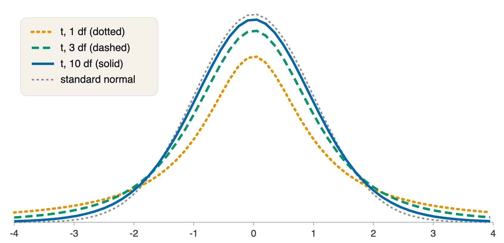
```

The heavier tails of the $t$ distribution are shown more clearly in @fig-normal-two-tail, which compares the standard normal distribution to a $t$ distribution with 4 degrees of freedom. Notice that the $t$ distribution places more probability in the tails and less probability near the center. This difference is important because, when $\sigma$ is unknown, we replace it with the sample standard deviation $s$. Since $s$ varies from sample to sample, additional uncertainty is introduced into the inference procedure. The heavier tails of the $t$ distribution account for this extra uncertainty.

```{r, echo=FALSE}
#| label: fig-normal-two-tail
#| fig-cap: 'Comparison of the standard normal distribution and the $t$ distribution with 4 degrees of freedom.'
#| fig-alt: 'Two overlaid bell-shaped density curves on a horizontal axis ranging from -4 to 4. The standard normal distribution is shown as a solid blue curve, while the t distribution with 4 degrees of freedom is shown as a dashed orange curve. The normal curve is taller near the center at 0 and decreases more quickly in the tails. The t curve is lower at the center and lies above the normal curve in the tails. The right-tail region beyond x = 2 is shaded for both distributions, and the shaded area for the t distribution is visibly larger, illustrating that the t distribution with 4 degrees of freedom has heavier tails than the standard normal distribution.'
#| out-width: "80%"
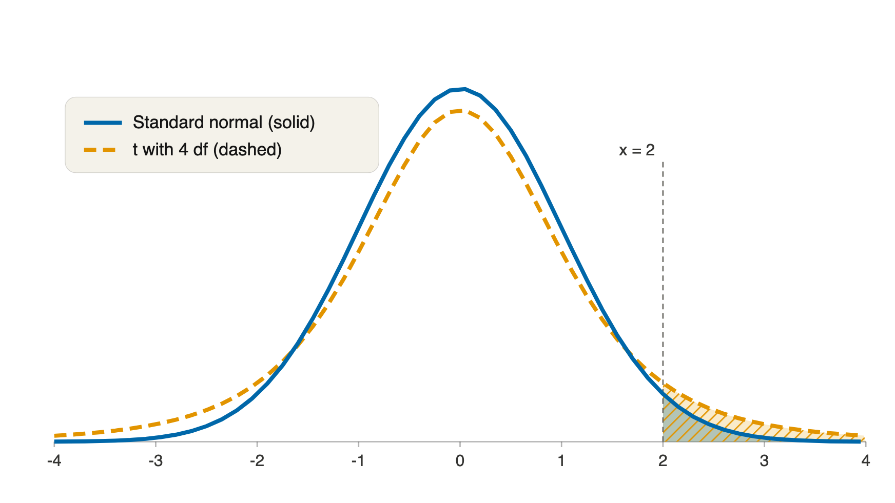
```

The amount of additional uncertainty depends on the sample size. Small samples provide less information about the population standard deviation, so the uncertainty is larger and the $t$ distribution has noticeably heavier tails. As the sample size increases, $s$ becomes a more stable estimate of $\sigma$, the additional uncertainty decreases, and the $t$ distribution moves closer to the standard normal distribution. In mean inference, the degrees of freedom equals $\text{df} = n - 1$, tied directly to the sample size. When $n$ is small, $s$ is an unreliable estimate of $\sigma$, the degrees of freedom is small, and the $t$ distribution has heavy tails to reflect this added uncertainty. As $n$ grows, the degrees of freedom increase and the tails of the $t$ distribution become lighter. In this way, the $t$ distribution automatically adjusts the amount of uncertainty in the inference to match the amount of information in the sample.

Just as the standard normal distribution can be shifted and rescaled to obtain a general normal distribution with any center and standard deviation, the standard $t$ distribution also has a more general form. We write this as

$$
X \sim t_{\text{df}}(\text{location}, \text{scale}),
$$

where $\text{df}$ denotes the degrees of freedom. The *location* parameter determines the center of the distribution, while the *scale* parameter controls its spread. In mean inference, the location is the hypothesized population mean $\mu_0$, and the scale is the estimated standard error $s/\sqrt{n}$, giving the null distribution $\bar{X} \sim t_{n-1}(\mu_0,\ s/\sqrt{n})$ stated above.

### Homework for @sec-null-distribution-mean

<!-- to be filled -->

## Making a Decision: P-value and Critical Region {#sec-making-decision-mean}

There are two equivalent ways to make a decision in a hypothesis test, both of which we developed in the proportion chapter: the p-value approach and the critical region approach. The two approaches present the same evidence in different forms. The critical region approach answers the question "for which values of $\bar{X}$ would we reject $H_0$?", while the p-value approach answers the question "given $x_{\text{obs}}$, our observed value of $\bar{X}$, how strong is the evidence against $H_0$?". Rejecting $H_0$, using significance level $\alpha$ and using the critical region is equivalent to obtaining a p-value less than $\alpha$, so the two approaches always lead to the same decision.

### p-value Approach

Conceptually, the p-value measures how strongly the evidence in our observed sample favors the alternative hypothesis, assuming that the null hypothesis is true. As in the proportion setting, we develop the idea of p-value through the $H_a$ *support*: the set of values of the sample mean $\bar{X}$ that are as favorable, or more favorable, to the alternative hypothesis than the value we actually observed.

To make this concrete, recall that our observed sample mean is denoted $\bar{x}_{\text{obs}}$, and that we evaluate evidence using the null distribution of $\bar{X}$. This null distribution is $N\!\left(\mu_0,\, \sigma/\sqrt{n}\right)$ when $\sigma$ is known, and $t_{n-1}\!\left(\mu_0,\, s/\sqrt{n}\right)$ when $\sigma$ is unknown; in both cases, the probabilities below are computed under the appropriate distribution. The $H_a$ support depends on the form of the alternative hypothesis. The three callouts that follow summarize the $H_a$ support and the corresponding p-value for each type of alternative hypothesis.


::: {.callout-note appearance="minimal"}
## p-value for the One-Sample Test of $\mu$

In each case, the p-value is computed under the null distribution of $\bar{X}$, which depends on whether $\sigma$ is known:

- When $\sigma$ is known: $\bar{X} \sim N\!\left(\mu_0,\, \sigma/\sqrt{n}\right)$.
- When $\sigma$ is unknown: $\bar{X} \sim t_{n-1}\!\left(\mu_0,\, s/\sqrt{n}\right)$.

| Alternative Hypothesis | $H_a$ Support | p-value |
|---|---|---|
| $H_a: \mu > \mu_0$ | $\bar{X} \geq \bar{x}_{\text{obs}}$ | $P\!\left(\bar{X} \geq \bar{x}_{\text{obs}} \mid \mu = \mu_0\right)$ |
| $H_a: \mu < \mu_0$ | $\bar{X} \leq \bar{x}_{\text{obs}}$ | $P\!\left(\bar{X} \leq \bar{x}_{\text{obs}} \mid \mu = \mu_0\right)$ |
| $H_a: \mu \neq \mu_0$ | $\lvert \bar{X} - \mu_0 \rvert \geq \lvert \bar{x}_{\text{obs}} - \mu_0 \rvert$ | $2 \times \begin{cases} P\!\left(\bar{X} \leq \bar{x}_{\text{obs}} \mid \mu = \mu_0\right) & \text{if } \bar{x}_{\text{obs}} < \mu_0 \\[4pt] P\!\left(\bar{X} \geq \bar{x}_{\text{obs}} \mid \mu = \mu_0\right) & \text{if } \bar{x}_{\text{obs}} \geq \mu_0 \end{cases}$ |
:::

In each case, the p-value is the probability, computed under the null distribution, of observing a sample mean at least as favorable to $H_a$ as the one actually observed.

Once the p-value has been computed, the decision rule is the same regardless of the form of the alternative hypothesis: reject $H_0$ if the p-value is less than the significance level $\alpha$, and fail to reject $H_0$ otherwise.

Intuitively, a small p-value means that the observed sample mean would be unusual under the null hypothesis, providing evidence against the null hypothesis. A p-value larger than $\alpha$ means that the observed sample mean is reasonably consistent with the null hypothesis, and we have insufficient evidence to reject it.

### Critical Region Approach

To implement the critical region approach for testing hypotheses about $\mu$, we need a rule that ensures the probability of a Type I error, when $\mu$ equals the boundary value $\mu_0$, is equal to a given significance level $\alpha$. That is, the critical region must satisfy
$$
P(\text{Rejecting } H_0 \mid \mu = \mu_0) = \alpha.
$$
The form of the critical region depends on the alternative hypothesis: large values of $\bar{X}$ are evidence against $H_0$ when $H_a$ points to large values of $\mu$, small values of $\bar{X}$ are evidence against $H_0$ when $H_a$ points to small values of $\mu$, and values of $\bar{X}$ far from $\mu_0$ in either direction are evidence against $H_0$ when $H_a$ allows departure in either direction. The callout that follow summarize the critical region in each of these cases.

::: {.callout-note appearance="minimal"}
## Critical Region for the One-Sample Test of $\mu$

All critical values are found using the null distribution of $\bar{X}$, which depends on whether $\sigma$ is known:

- When $\sigma$ is known: $\bar{X} \sim N\!\left(\mu_0,\, \sigma/\sqrt{n}\right)$.
- When $\sigma$ is unknown: $\bar{X} \sim t_{n-1}\!\left(\mu_0,\, s/\sqrt{n}\right)$.

| Alternative Hypothesis | Critical Region | Critical Value Condition |
|---|---|---|
| $H_a: \mu > \mu_0$ | $\bar{x}_{\text{obs}} \geq c$ | $P(\bar{X} \geq c \mid \mu = \mu_0) = \alpha$ |
| $H_a: \mu < \mu_0$ | $\bar{x}_{\text{obs}} \leq c$ | $P(\bar{X} \leq c \mid \mu = \mu_0) = \alpha$ |
| $H_a: \mu \neq \mu_0$ | $\bar{x}_{\text{obs}} \leq c_1$ or $\bar{x}_{\text{obs}} \geq c_2$ | $P(\bar{X} \leq c_1) = P(\bar{X} \geq c_2) = \alpha/2$ |
:::

Finally, in the critical region approach, we reject $H_0$ in favor of $H_a$ if the observed sample mean $\bar{x}_{\text{obs}}$ falls in the rejection region. Otherwise, we fail to reject $H_0$.


#### Worked Example: $\sigma$ Known {#sec-worked-examples-known-sigma}

We now apply the framework to the SAT example. As noted earlier, the SAT setting is one of the rare cases in which the population standard deviation $\sigma$ can reasonably be treated as known (here, $\sigma = 113$ points, computed from the scores of more than 2 million students). The remaining three running examples — sleep, commute time, and Adélie penguin flipper length — are taken up in @sec-worked-examples-unknown-sigma, where we treat $\sigma$ as unknown and use the Student $t$ distribution.

:::{#exm-sat-csuf-mean-known}
## SAT Math Scores at CSUF

We return to the SAT setting introduced in @exm-sat-csuf-mean. Recall that the national mean math SAT score for the high school graduating class of 2025 was 508 points, with a standard deviation of 113 points, and that we wished to investigate whether the mean math SAT score among incoming CSUF freshmen in fall 2025 was higher than the national mean. A random sample of $n = 40$ incoming CSUF freshmen yielded a sample mean of $\bar{x}_{\text{obs}} = 542$ points.

The hypotheses are
$$
\begin{cases}
H_0: \mu \leq 508 \\
H_a: \mu > 508
\end{cases}
$$
where $\mu$ denotes the mean math SAT score among incoming CSUF freshmen in fall 2025. Assume that the population of math SAT scores is Adélie , and treat the population standard deviation as known with $\sigma = 113$ points. Perform a test of hypothesis at the $\alpha = 0.05$ significance level by answering the following questions:

a. What is the null distribution of $\bar{X}$?
b. Use Rguroo's [Mean Inference]{.fun} function to obtain the critical region. Interpret the critical region in the context of the problem, and using the observed value, state whether you reject or fail to reject $H_0$.
c. State a probability statement that defines the p-value for this test, and describe it in words.
d. Use Rguroo to obtain the p-value, interpret it in the context of the problem, and state whether you reject or fail to reject $H_0$.
e. Give your overall conclusion.
:::

::: {.callout-tip .solution-callout collapse="true" icon=false}
## 🔎 Solution

a. The null distribution is 

$$\bar{X}\sim N\left(508, \frac{113}{\sqrt{40}}\right)\approx N\left(508,17.867 \right)
$$

b. Click to expand the box below to see how to use the [Mean Inference]{.fun}  function in Rguroo to answer this question.

:::: {#mean-inference-sat .callout-note appearance="simple" collapse="true" icon="none" title="{width=22px style='vertical-align:middle;'} One-Population mean hypothesis test - CSUF SAT example"}

1. Open the **Analytics** toolbox in Rguroo.  

2. From the [Analysis]{.dpd} dropdown, select [Mean Inference]{.fun} --> [One Population]{.fun}. This opens the [One Population Mean Inference]{.dialog} dialog.

3. Fill out the textboxes in the **Data** section of the dialog with the following values:

   - [Sample Mean]{.des}: [542]{.typein}, the value of $\bar{x}_{\text{obs}}$.
   - [Pop S.d.]{.des}: [113]{.typein}, the population standard deviation.
   - [Sample Size]{.des}: [40]{.typein}, the size of the sample $n$.

4. In the text box [$\mu$ = Mean of]{.des} enter a label for the parameter. For this example we enter [CSUF SAT Math Scores]{.typein}.

5. Open the [Test of Hypothesis]{.tab} tab and enter the following:
   - Leave the [Significance Level]{.des} textbox at the default value of [0.05]{.typein}.
   - In the [Alternative Hypothesis $\mu$]{.dpd} dropdown, select [>]{.typein} and enter [508]{.typein}, the value stated in $H_a$.
   - Select the [z-statistic]{.des} checkbox to use the normal distribution.

6. Click the  button to open the [Advanced Features]{.dialog} dialog. In the **Test of Hypothesis** section select [P-value Graph]{.des} and [Critical Region Graph]{.des}. This will instruct Rguroo to give results for both critical regions and p-value.

7. Click the preview icon  to view the output.

8. Click the  button and save the result as [CSUFSAT]{.typein}.

::: {.callout-tip .inner-callout collapse="false" title="Rguroo One-Population Mean Inference dialogs"}

```{r,echo=FALSE}
#| fig-alt: "Rguroo dialog boxes for conducting a one-population mean hypothesis test for the CSUF SAT Math example. The left panel shows the main One Population Mean Inference dialog with sample mean 542, population standard deviation 113, sample size 40, significance level 0.05, and alternative hypothesis μ > 508 using the z-statistic method. The right panel shows the Advanced Features dialog with options for displaying p-value and critical region graphs."
#| fig-cap: "Rguroo setup for the CSUF SAT Math one-sample mean hypothesis test."
#| out-width: "100%"
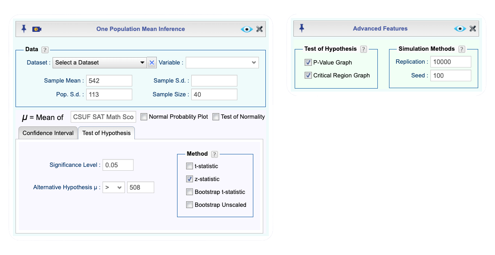
```

:::

Click to expand the box below to see the Rguroo output.

::: {.callout-tip .inner-callout collapse="true" title="Rguroo output: One-Population Mean Inference - CSUF SAT"}

<div tabindex="0" class="rg-iframe-wrapper">
  <iframe
    src="Rguroo_html_output/Mean Inference/CSUFSAT_docx/CSUFSAT.html"
    class="rg-iframe"
    title="Rguroo output: One Population Mean Hypothesis Test - CSUF SAT Example">
  </iframe>
</div>

:::

:::

@fig-sat-math-cr shows the Critical Region Graph from the Rguroo output. The right-hand side plot displays the critical region in the observed data scale. As shown, the critical value for a significance level of $\alpha =0.05$ is 537.39 and thus the critical region is $\bar{X} >537.39$. Thus, if an observed sample mean is larger than 537.39, we would reject $H_0$.

Our observed sample mean is $\bar{x}_{\text{obs}} = 542$ (shown by the green triangle) falls in the rejection region since it is greater than 537.39. Therefore we reject $H_0$ at 5\% level of significance.

```{r,echo=FALSE}
#| fig-alt: "Critical region graphs for the CSUF SAT Math one-sample z-test with alternative hypothesis μ > 508. The left panel shows the null distribution of the sample mean on the original SAT score scale with mean 508 and standard deviation 17.867. The rejection region is shaded in the upper tail beyond the critical value 537.39, and the observed sample mean 542 is marked with a green triangle inside the rejection region. The right panel shows the equivalent graph on the standardized z scale with critical value 1.6449 and observed z statistic 1.903."
#| warning: FALSE
#| label: fig-sat-math-cr
#| fig-cap: "Critical region graphs for the CSUF SAT Math one-sample z-test."
#| out-width: "80%"
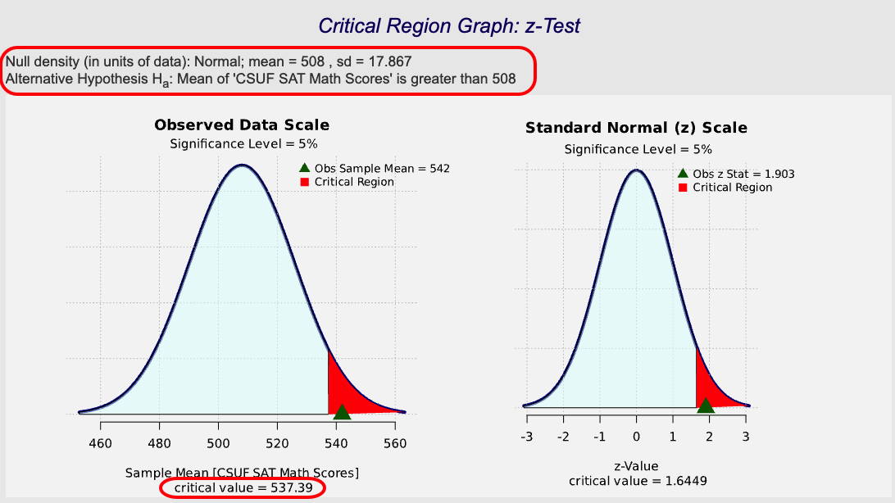
```

c. p-value is the probability of observing a sample mean greater than or equal to our observed value of $\bar{x}_{\text{obs}} = 542$ given that the true value of the population mean is $\mu = 508$. This can be written mathematically as 

$$\text{p-value} = P(\bar{X} \geq 542 \mid \mu = 508).$$

d. @fig-sat-math-pvalue shows the P-value Graph from the Rguroo output. As shown on the graph, the p-value is $0.028523\approx 2.9\%$. This means that if in fact the true population mean is 508, the probability of having observed a sample mean of 542 or larger is approximately 2.9\%. Because this probability is small, and more specifically is less than 5\%, there is sufficient evidence to reject $H_0$.

e. The final decision is that based on the observed sample mean of 542, there is sufficient evidence at 5\% significance level that the mean SAT math scores of CSUF students is more than the national average.

```{r,echo=FALSE}
#| fig-alt: "P-value graphs for the CSUF SAT Math one-sample z-test with alternative hypothesis μ > 508. The left panel shows the null distribution of the sample mean on the original SAT score scale with mean 508 and standard deviation 17.867. The observed sample mean 542 is marked with a green triangle, and the shaded upper-tail area to the right represents the p-value of 0.028523. The right panel shows the equivalent graph on the standardized z scale with observed z statistic 1.903 and the same shaded p-value area."
#| warning: FALSE
#| label: fig-sat-math-pvalue
#| fig-cap: "P-value graphs for the CSUF SAT Math one-sample z-test."
#| out-width: "80%"
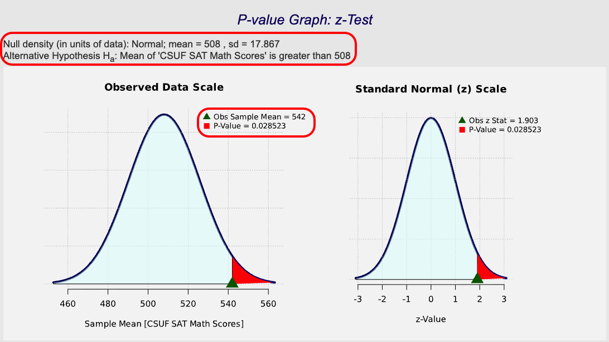
```

::::


#### Worked Examples: $\sigma$ Unknown {#sec-worked-examples-unknown-sigma}

We now turn to the more realistic setting in which the population standard deviation $\sigma$ is unknown and is estimated from the sample by $s$. The three running examples in this section — sleep hours, commute time, and Adélie penguin flipper length — all use the Student $t$ distribution as the null distribution of $\bar{X}$. Each example reuses the setup introduced earlier in the chapter; we now carry out the full hypothesis test.

:::{#exm-sleep-university-mean-unknown}
## Sleep Hours Among University Students

We return to the sleep setting introduced in @exm-sleep-university-mean. Recall that the recommended minimum nightly sleep for young adults is 7 hours, and that we wished to investigate whether the mean nightly sleep among students at our university is less than 7 hours. A random sample of $n = 15$ students yielded a sample mean of $\bar{x}_{\text{obs}} = 6.4$ hours and a sample standard deviation of $s = 1.2$ hours.

The hypotheses are
$$
\begin{cases}
H_0: \mu \geq 7 \\
H_a: \mu < 7
\end{cases}
$$
where $\mu$ denotes the mean nightly sleep, in hours, among students at our university. Assume that the population of nightly sleep hours is Adélie . Because the population standard deviation $\sigma$ is unknown, we estimate it from the sample by $s = 1.2$ hours and use the Student $t$ distribution. Perform a test of hypothesis at the $\alpha = 0.05$ significance level by answering the following questions:

a. What is the null distribution of $\bar{X}$?
b. State a probability statement that defines the p-value for this test, and describe it in words.
c. Use Rguroo's [Mean Inference]{.fun} function to obtain the p-value, interpret it in the context of the problem, and state whether you reject or fail to reject $H_0$.
d. Use Rguroo to obtain the critical region. Interpret the critical region in the context of the problem, and using the observed value, state whether you reject or fail to reject $H_0$.
e. Give your overall conclusion.
:::

:::: {.callout-tip .solution-callout collapse="true" icon=false}
## 🔎 Solution

a. Because $\sigma$ is unknown, the null distribution of $\bar{X}$ is a Student $t$ distribution with $n - 1 = 14$ degrees of freedom, centered at $\mu_0 = 7$ with estimated standard error $s/\sqrt{n} = 1.2/\sqrt{15} \approx 0.3098$ hours:

$$
\bar{X}\sim t_{14}\left(7,\ \frac{1.2}{\sqrt{15}}\right)\approx t_{14}\!\left(7,\ 0.3098\right).
$$

b. The p-value is the probability of observing a sample mean less than or equal to our observed value of $\bar{x}_{\text{obs}} = 6.4$, given that the true value of the population mean is $\mu = 7$. This can be written mathematically as

$$
\text{p-value} = P(\bar{X} \leq 6.4 \mid \mu = 7),
$$

with the probability computed under the $t_{14}(7,\ 0.3098)$ null distribution.

c. Click to expand the box below to see how to use the [Mean Inference]{.fun} function in Rguroo to answer this question.

::: {.callout-note appearance="simple" collapse="true" icon="none" title="{width=22px style='vertical-align:middle;'} One-Population mean hypothesis test - Sleep example"}

The steps for using Rguroo's [Mean Inference]{.fun} function are the same as those in @exm-sat-csuf-mean-known, with the following differences in the [One Population Mean Inference]{.dialog} dialog:

- [Sample Mean]{.des}: [6.4]{.typein}, the value of $\bar{x}_{\text{obs}}$.
- [Sample S.d.]{.des}: [1.2]{.typein}, the sample standard deviation $s$. (Leave [Pop S.d.]{.des} empty since $\sigma$ is unknown.)
- [Sample Size]{.des}: [15]{.typein}, the size of the sample $n$.
- In the text box [$\mu$ = Mean of]{.des} enter the label [Nightly Sleep]{.typein}.
- In the [Alternative Hypothesis $\mu$]{.dpd} dropdown, select [<]{.typein} and enter [7]{.typein}, the value stated in $H_a$.
- Select the [t-statistic]{.des} checkbox (instead of z-statistic) to use the $t$ distribution.

::: {.callout-tip .inner-callout collapse="true" title="Rguroo One-Population Mean Inference dialog"}

```{r,echo=FALSE}
#| label: fig-sleep-dialog
#| fig-alt: "Rguroo One Population Mean Inference dialog for the Nightly Sleep example, showing sample mean 6.4, sample standard deviation 1.2, sample size 15, parameter label Nightly Sleep, significance level 0.05, and alternative hypothesis μ < 7 using the t-statistic method."
#| fig-cap: "Rguroo setup for the Nightly Sleep one-sample t-test."
#| out-width: "80%"
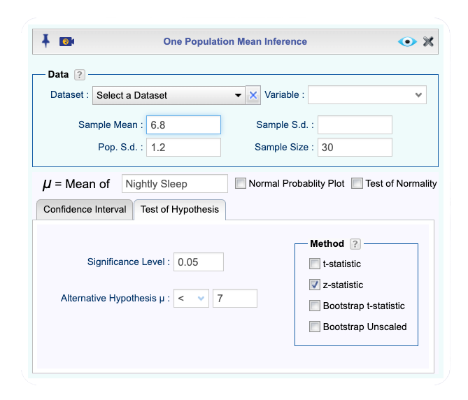
```

:::

:::

Click to expand the box below to see the Rguroo output.

::: {.callout-tip .inner-callout collapse="true" title="Rguroo output: One-Population Mean Inference - Nightly Sleep"}

```{=html}
<div tabindex="0" class="rg-iframe-wrapper">
     <iframe
  src="Rguroo_html_output/Mean%20Inference/sleep_mean_docx/sleep_mean.html"
  class="rg-iframe"
  title="Rguroo output: One Population Mean Hypothesis Test - Nightly Sleep Example">
</iframe>
</div>
```

:::

@fig-sleep-pvalue shows the P-value Graph from the Rguroo output. As shown on the graph, the p-value is approximately $0.0366 \approx 3.6\%$. This means that if the true population mean is in fact 7 hours, then the probability of having observed a sample mean of 6.4 hours or less in a sample of size 15 is approximately 3.6%. Because this probability is small, and in particular is smaller than 5%, there is sufficient evidence to reject $H_0$.

```{r,echo=FALSE}
#| fig-alt: "P-value graphs for the Nightly Sleep one-sample t-test with alternative hypothesis μ < 7. The left panel shows the null t distribution of the sample mean on the original sleep-hours scale with mean 7 and estimated standard error 0.3098, on 14 degrees of freedom. The observed sample mean 6.4 is marked with a green triangle, and the shaded lower-tail area to the left represents the p-value of 0.0366. The right panel shows the equivalent graph on the standardized t scale with observed t statistic -1.937 and the same shaded p-value area."
#| warning: FALSE
#| label: fig-sleep-pvalue
#| fig-cap: "P-value graphs for the Nightly Sleep one-sample t-test."
#| out-width: "100%"
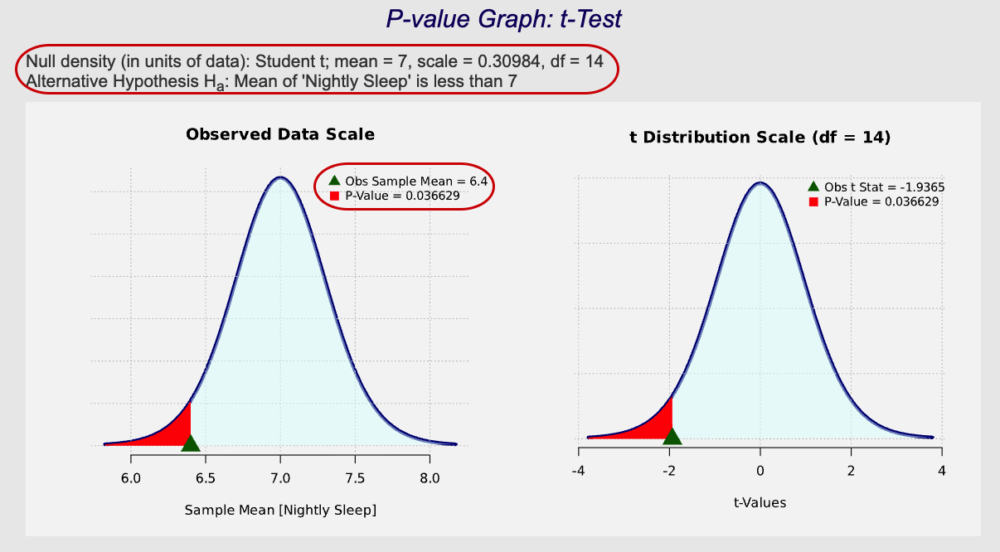
```

d. @fig-sleep-cr shows the Critical Region Graph from the Rguroo output. The left-hand plot displays the critical region in the observed data scale. The critical value for a significance level of $\alpha = 0.05$ is 6.4543, and because the alternative hypothesis is of the form less than ($H_a: \mu < 7$), the critical region is $\bar{X} \leq 6.4543$. Thus, if an observed sample mean is less than 6.4543, we would reject $H_0$.

Our observed sample mean is $\bar{x}_{\text{obs}} = 6.4$ (shown by the green triangle), which falls in the rejection region since it is less than 6.4543. Therefore, we reject $H_0$ at the 5% level of significance.

```{r,echo=FALSE}
#| fig-alt: "Critical region graphs for the Nightly Sleep one-sample t-test with alternative hypothesis μ < 7. The left panel shows the null t distribution of the sample mean on the original sleep-hours scale with mean 7 and estimated standard error 0.3098, on 14 degrees of freedom. The rejection region is shaded in the lower tail below the critical value 6.4543, and the observed sample mean 6.4 is marked with a green triangle inside the rejection region. The right panel shows the equivalent graph on the standardized t scale with critical value -1.7613 and observed t statistic -1.937."
#| warning: FALSE
#| label: fig-sleep-cr
#| fig-cap: "Critical region graphs for the Nightly Sleep one-sample t-test."
#| out-width: "100%"
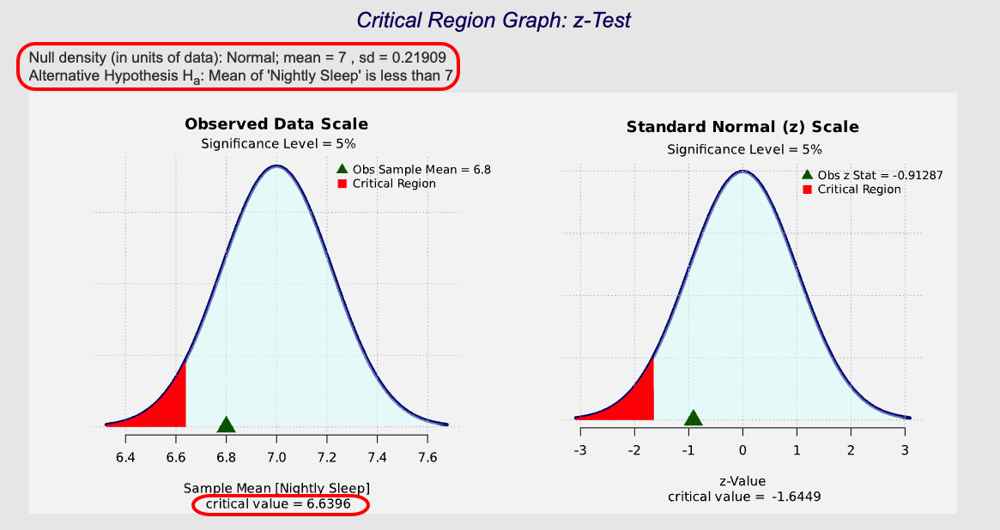
```

e. The final decision is that, based on the observed sample mean of 6.4 hours, there is sufficient evidence at the 5% significance level to conclude that the mean nightly sleep among students at our university is less than the recommended 7 hours.

::::

:::{#exm-commute-metro-mean-unknown}
## Commute Time in a Metropolitan Area

We return to the commute setting introduced in @exm-commute-metro-mean. Recall that the national mean one-way commute time for U.S. workers in 2023 was 26.8 minutes, and that we wished to investigate whether the mean one-way commute time among workers in our metropolitan area differs from the national mean. A random sample of $n = 15$ commuters yielded a sample mean of $\bar{x}_{\text{obs}} = 24.8$ minutes and a sample standard deviation of $s = 9.6$ minutes.

The hypotheses are
$$
\begin{cases}
H_0: \mu = 26.8 \\
H_a: \mu \neq 26.8
\end{cases}
$$
where $\mu$ denotes the mean one-way commute time, in minutes, among workers in our metropolitan area. Assume that the population of commute times is Adélie .  Perform a test of hypothesis at the $\alpha = 0.05$ significance level by answering the following questions:

a. What is the null distribution of $\bar{X}$?
b. State a probability statement that defines the $p$-value for this test, and describe it in words.
c. Use Rguroo's [Mean Inference]{.fun} function to obtain the $p$-value, interpret it in the context of the problem, and state whether you reject or fail to reject $H_0$.
d. Use Rguroo to obtain the critical region. Interpret the critical region in the context of the problem, and using the observed value, state whether you reject or fail to reject $H_0$.
e. Give your overall conclusion.
:::

::: {.callout-tip .solution-callout collapse="true" icon=false}
## 🔎 Solution

a. Because $\sigma$ is unknown, the null distribution of $\bar{X}$ is a Student $t$ distribution with $n - 1 = 14$ degrees of freedom, centered at $\mu_0 = 26.8$ with estimated standard error $s/\sqrt{n} = 9.6/\sqrt{15} \approx 2.4787$ minutes:

$$
\bar{X}\sim t_{14}\left(26.8,\ \frac{9.6}{\sqrt{15}}\right)\approx t_{14}\!\left(26.8,\ 2.4787\right).
$$

b. Because the test is two-sided, a sample mean that is far from 26.8 in *either* direction is evidence against $H_0$. The $p$-value is therefore the probability, under the null distribution, of observing a sample mean at least as far from 26.8 as our observed value of $\bar{x}_{\text{obs}} = 24.8$. Since 24.8 is 2 units below 26.8, this means a sample mean of 24.8 or less, or equally far above at 28.8 or more. This can be written mathematically as

$$
\text{p-value} = P(\bar{X} \leq 24.8 \mid \mu = 26.8) + P(\bar{X} \geq 28.8 \mid \mu = 26.8).
$$

Because the null $t$ distribution is symmetric about 26.8, this is equal to

$$
\text{p-value} = 2 \times P(\bar{X} \leq 24.8 \mid \mu = 26.8),
$$

with the probability computed under the $t_{14}(26.8,\ 2.4787)$ null distribution.

c. The steps for using Rguroo's [Mean Inference]{.fun} function are the same as those in @exm-sat-csuf-mean-known, with the following differences in the [One Population Mean Inference]{.dialog} dialog:

   - [Sample Mean]{.des}: [24.8]{.typein}, the value of $\bar{x}_{\text{obs}}$.
   - [Sample S.d.]{.des}: [9.6]{.typein}, the sample standard deviation $s$. (Leave [Pop S.d.]{.des} empty since $\sigma$ is unknown.)
   - [Sample Size]{.des}: [15]{.typein}, the size of the sample $n$.
   - In the text box [$\mu$ = Mean of]{.des} enter the label [Commute Times]{.typein}.
   - In the [Alternative Hypothesis $\mu$]{.dpd} dropdown, select [!=]{.typein} and enter [26.8]{.typein}, the value stated in $H_a$.
   - Select the [t-statistic]{.des} checkbox (instead of z-statistic) to use the $t$ distribution.

   This is a two-sided test, so the [!=]{.typein} option produces a critical region with two parts, one in each tail of the null distribution.

Click to open the box below to see @fig-commute-dialog that shows the Rguroo dialog for the setup.

::: {.callout-tip .inner-callout collapse="true" title="Rguroo One-Population Mean Inference dialog"}

```{r,echo=FALSE}
#| fig-alt: "Rguroo One Population Mean Inference dialog for the Commute Times example, showing sample mean 24.8, sample standard deviation 9.6, sample size 15, parameter label Commute Times, significance level 0.05, and two-sided alternative hypothesis μ ≠ 26.8 using the t-statistic method."
#| fig-cap: "Rguroo setup for the Commute Times one-sample t-test."
#| label: fig-commute-dialog
#| out-width: "80%"
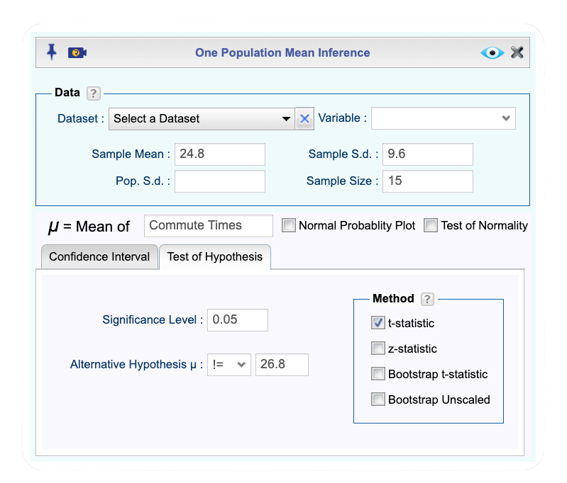
```

:::

Click to expand the box below to see the Rguroo output.

::: {.callout-tip .inner-callout collapse="true" title="Rguroo output: One-Population Mean Inference - Commute Times"}

```{=html}
   <div tabindex="0" class="rg-iframe-wrapper">
     <iframe
       src="Rguroo_html_output/Mean Inference/commute_mean_docx/commute_mean.html"
       class="rg-iframe"
       title="Rguroo output: One Population Mean Hypothesis Test - Commute Times Example">
     </iframe>
   </div>
```

:::

@fig-commute-pvalue shows the P-value Graph from the Rguroo output. As shown on the graph, the p-value is approximately $0.4332 \approx 43.3\%$. This means that if the true population mean is in fact 26.8 minutes, then the probability of observing a sample mean at least as far from 26.8 as 24.8 is approximately 43.3%. Because this probability is large, and in particular is greater than 5%, there is insufficient evidence to reject $H_0$.

```{r,echo=FALSE}
#| fig-alt: "P-value graphs for the Commute Times one-sample t-test with two-sided alternative hypothesis μ ≠ 26.8. The left panel shows the null t distribution of the sample mean on the original commute-time scale with mean 26.8 and estimated standard error 2.4787, on 14 degrees of freedom. The observed sample mean 24.8 is marked with a green triangle, and the shaded area in both tails, below 24.8 and above the symmetric point 28.8, represents the p-value of 0.4332. The right panel shows the equivalent graph on the standardized t scale with observed t statistic -0.807 and the same shaded p-value area in both tails."
#| warning: FALSE
#| label: fig-commute-pvalue
#| fig-cap: "P-value graphs for the Commute Times one-sample t-test."
#| out-width: "100%"
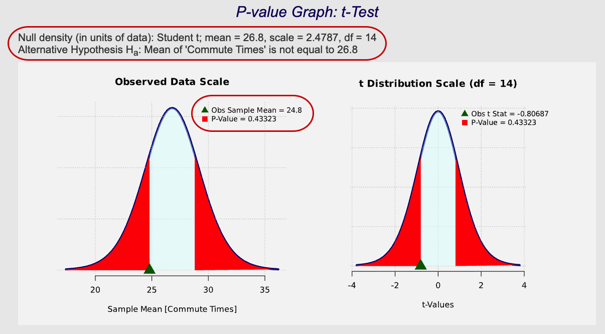
```

d. @fig-commute-cr shows the Critical Region Graph from the Rguroo output. The left-hand plot displays the critical region in the observed data scale. Because the alternative hypothesis is two-sided, $H_a: \mu \neq 26.8$, the significance level $\alpha = 0.05$ is split evenly between the two tails, with $0.025$ in each. This produces two critical values, approximately $c_1 = 21.484$ and $c_2 = 32.116$, and the critical region is $\bar{X} \leq 21.484$ or $\bar{X} \geq 32.116$. Thus, we would reject $H_0$ if an observed sample mean is less than 21.484 or greater than 32.116.

Our observed sample mean is $\bar{x}_{\text{obs}} = 24.8$ (shown by the green triangle), which does not fall in either part of the rejection region since it lies between 21.484 and 32.116. Therefore, we fail to reject $H_0$ at the 5% level of significance.

```{r,echo=FALSE}
#| fig-alt: "Critical region graphs for the Commute Times one-sample t-test with two-sided alternative hypothesis μ ≠ 26.8. The left panel shows the null t distribution of the sample mean on the original commute-time scale with mean 26.8 and estimated standard error 2.4787, on 14 degrees of freedom. The rejection region is shaded in both tails, below the lower critical value 21.484 and above the upper critical value 32.116, and the observed sample mean 24.8 is marked with a green triangle between the two critical values, outside the rejection region. The right panel shows the equivalent graph on the standardized t scale with critical values ±2.1448 and observed t statistic -0.807."
#| warning: FALSE
#| label: fig-commute-cr
#| fig-cap: "Critical region graphs for the Commute Times one-sample t-test."
#| out-width: "100%"
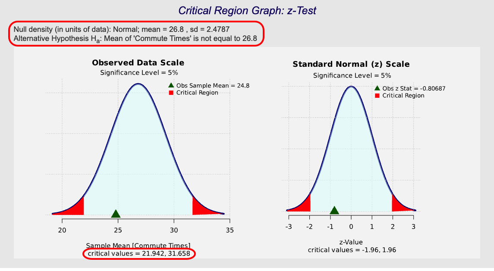
```

e. The final decision is that, based on the observed sample mean of 24.8 minutes, there is insufficient evidence at the 5% significance level to conclude that the mean one-way commute time among workers in our metropolitan area differs from the national mean of 26.8 minutes.
:::


:::{#exm-penguin-flipper-mean-unknown}
## Flipper Length of Adélie Penguins

We return to the penguin setting introduced in @exm-penguin-flipper-mean. Recall that the Palmer Penguins dataset contains flipper length measurements for $n = 151$ Adélie penguins in the Palmer Archipelago, and that we wished to investigate whether the mean flipper length among Adélie penguins differs from the reference value of 188 mm. Computed from the raw data, the sample mean is $\bar{x}_{\text{obs}} = 189.95$ mm and the sample standard deviation is $s = 6.539$ mm.

The hypotheses are
$$
\begin{cases}
H_0: \mu = 188 \\
H_a: \mu \neq 188
\end{cases}
$$
where $\mu$ denotes the mean flipper length, in millimeters, of Adélie penguins in the Palmer Archipelago. Assume that the population of Adélie flipper lengths is Adélie .  Perform a test of hypothesis at the $\alpha = 0.05$ significance level by answering the following questions:

a. What is the null distribution of $\bar{X}$?
b. State a probability statement that defines the p-value for this test, and describe it in words.
c. Use Rguroo's [Mean Inference]{.fun} function to obtain the p-value, interpret it in the context of the problem, and state whether you reject or fail to reject $H_0$.
d. Use Rguroo to obtain the critical region. Interpret the critical region in the context of the problem, and using the observed value, state whether you reject or fail to reject $H_0$.
e. Give your overall conclusion.

:::

See the codebook for the dataset [here](#code-book-palmerpenguins)


::: {.callout-tip .solution-callout collapse="true" icon=false}
## 🔎 Solution

a. Because $\sigma$ is unknown, the null distribution of $\bar{X}$ is a Student $t$ distribution with $n - 1 = 150$ degrees of freedom, centered at $\mu_0 = 188$ with estimated standard error $s/\sqrt{n} = 6.539/\sqrt{151} \approx 0.5321$ mm:

$$
\bar{X}\sim t_{150}\left(188,\ \frac{6.539}{\sqrt{151}}\right)\approx t_{150}\!\left(188,\ 0.5321\right).
$$

b. Because the test is two-sided, a sample mean that is far from 188 in *either* direction is evidence against $H_0$. The p-value is therefore the probability, under the null distribution, of observing a sample mean at least as far from 188 as our observed value of $\bar{x}_{\text{obs}} = 189.95$. Since 189.95 is 1.95 units above 188, this means a sample mean of 189.95 or more, or equally far below at 186.05 or less. This can be written mathematically as

$$
\text{p-value} = P(\bar{X} \geq 189.95 \mid \mu = 188) + P(\bar{X} \leq 186.05 \mid \mu = 188).
$$

Because the null $t$ distribution is symmetric about 188, this is equal to

$$
\text{p-value} = 2 \times P(\bar{X} \geq 189.95 \mid \mu = 188),
$$

with the probability computed under the $t_{150}(188,\ 0.5321)$ null distribution.

c. Because this example uses raw data, the data entry differs from the previous examples. Before using the [Mean Inference]{.fun} function, import the [palmerpenguins_Adélie ]{.typein} dataset from the book's Rguroo dataset repository. This dataset was obtained by filtering the full [palmerpenguins]{.typein} dataset for the Adélie species.

The steps for using Rguroo's [Mean Inference]{.fun} function are the same as those in @exm-sat-csuf-mean-known, with the following differences in the [One Population Mean Inference]{.dialog} dialog:

- In the [Dataset]{.des} dropdown, select [palmerpenguins_Adélie ]{.typein}, and in the [Variable]{.des} dropdown, select [flipper_length_mm]{.typein}. Once the variable is selected, the [Sample Mean]{.des}, [Sample S.d.]{.des}, and [Sample Size]{.des} boxes are populated automatically from the data, showing $\bar{x}_{\text{obs}} = 189.95$, $s = 6.539$, and $n = 151$.
- Leave the [Pop S.d.]{.des} box empty since $\sigma$ is unknown.
- In the text box [$\mu$ = Mean of]{.des} enter the label [flipper_length_mm]{.typein}.
- In the [Alternative Hypothesis $\mu$]{.dpd} dropdown, select [!=]{.typein} and enter [188]{.typein}, the value stated in $H_a$.
- Select the [t-statistic]{.des} checkbox (instead of z-statistic) to use the $t$ distribution.

This is a two-sided test, so the [!=]{.typein} option produces a critical region with two parts, one in each tail of the null distribution.

Click to open the box below to see @fig-adelie-dialog that shows the Rguroo dialog for the setup.

::: {.callout-tip .inner-callout collapse="true" title="Rguroo One-Population Mean Inference dialog"}

```{r,echo=FALSE}
#| fig-alt: "Rguroo One Population Mean Inference dialog for the Adélie flipper length example, with the palmerpenguins_Adélie  dataset and flipper_length_mm variable selected. The sample mean 189.95, sample standard deviation 6.539, and sample size 151 are populated automatically from the data. The population standard deviation field is left empty since σ is unknown. The significance level is 0.05, and the alternative hypothesis is the two-sided μ ≠ 188 using the t-statistic method."
#| fig-cap: "Rguroo setup for the Adélie flipper length one-sample t-test."
#| label: fig-adelie-dialog
#| out-width: "80%"
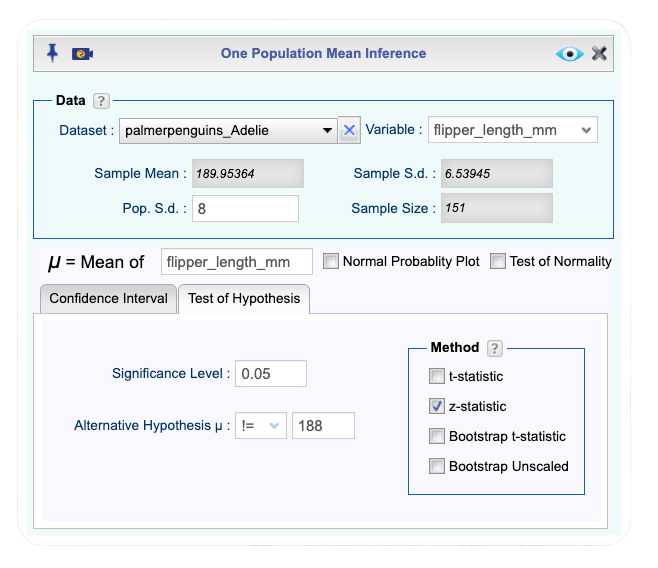
```

:::

Click to expand the box below to see the Rguroo output.

::: {.callout-tip .inner-callout collapse="true" title="Rguroo output: One-Population Mean Inference - Adélie Flipper Length"}

```{=html}
<div tabindex="0" class="rg-iframe-wrapper">
  <iframe
    src="Rguroo_html_output/Mean Inference/adelie_mean_docx/adelie_mean.html"
    class="rg-iframe"
    title="Rguroo output: One Population Mean Hypothesis Test - Adélie  Flipper Length Example">
  </iframe>
</div>
```

:::

@fig-adelie-pvalue shows the P-value Graph from the Rguroo output. As shown on the graph, the p-value is approximately $0.000343 \approx 0.034\%$. This means that if the true population mean is in fact 188 mm, then the probability of observing a sample mean at least as far from 188 as 189.95 is approximately 0.034%. Because this probability is very small, and in particular is less than 5%, there is sufficient evidence to reject $H_0$.

```{r,echo=FALSE}
#| fig-alt: "P-value graphs for the Adélie flipper length one-sample t-test with two-sided alternative hypothesis μ ≠ 188. The left panel shows the null t distribution of the sample mean on the original flipper-length scale with mean 188 and estimated standard error 0.5321, on 150 degrees of freedom. The observed sample mean 189.95 is marked with a green triangle, and the shaded area in both tails, above 189.95 and below the symmetric point 186.05, represents the p-value of 0.000343. The right panel shows the equivalent graph on the standardized t scale with observed t statistic 3.664 and the same shaded p-value area in both tails."
#| warning: FALSE
#| label: fig-adelie-pvalue
#| fig-cap: "P-value graphs for the Adélie flipper length one-sample t-test."
#| out-width: "100%"
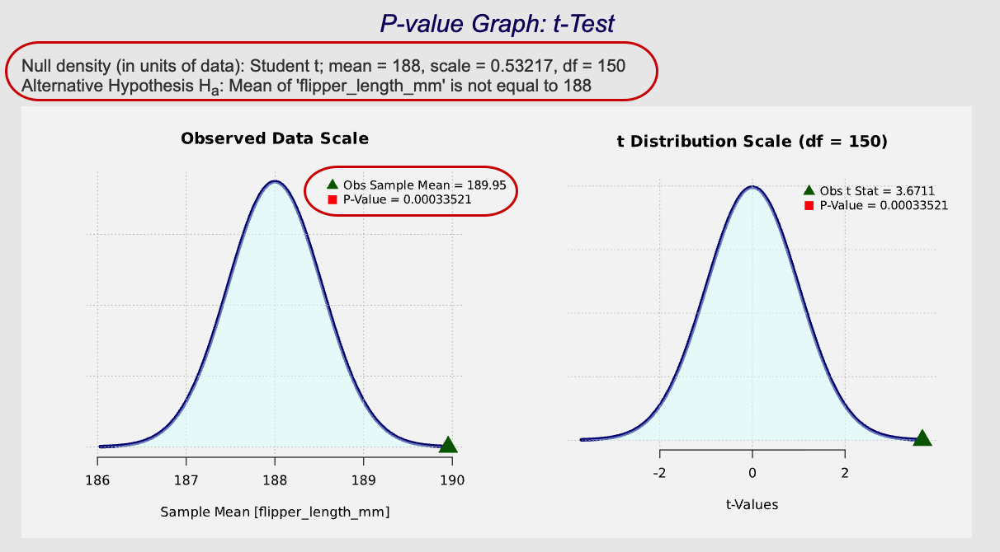
```

d. @fig-adelie-cr shows the Critical Region Graph from the Rguroo output. The left-hand plot displays the critical region in the observed data scale. Because the alternative hypothesis is two-sided, $H_a: \mu \neq 188$, the significance level $\alpha = 0.05$ is split evenly between the two tails, with $0.025$ in each. This produces two critical values, approximately $c_1 = 186.95$ and $c_2 = 189.05$, and the critical region is $\bar{X} \leq 186.95$ or $\bar{X} \geq 189.05$. Thus, we would reject $H_0$ if an observed sample mean is less than 186.95 or greater than 189.05.

Our observed sample mean is $\bar{x}_{\text{obs}} = 189.95$ (shown by the green triangle), which falls in the upper part of the rejection region since it is greater than 189.05. Therefore, we reject $H_0$ at the 5% level of significance.

```{r,echo=FALSE}
#| fig-alt: "Critical region graphs for the Adélie flipper length one-sample t-test with two-sided alternative hypothesis μ ≠ 188. The left panel shows the null t distribution of the sample mean on the original flipper-length scale with mean 188 and estimated standard error 0.5321, on 150 degrees of freedom. The rejection region is shaded in both tails, below the lower critical value 186.95 and above the upper critical value 189.05, and the observed sample mean 189.95 is marked with a green triangle in the upper rejection region. The right panel shows the equivalent graph on the standardized t scale with critical values ±1.976 and observed t statistic 3.664."
#| warning: FALSE
#| label: fig-adelie-cr
#| fig-cap: "Critical region graphs for the Adélie flipper length one-sample t-test."
#| out-width: "100%"
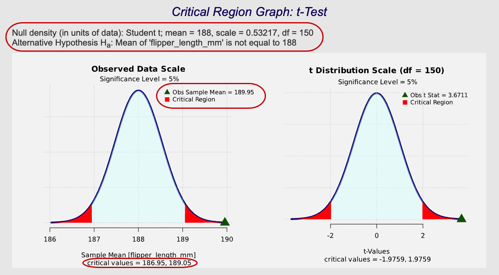
```

e. The final decision is that, based on the observed sample mean of 189.95 mm, there is sufficient evidence at the 5% significance level to conclude that the mean flipper length of Adélie penguins in the Palmer Archipelago differs from the reference value of 188 mm.
:::

### Homework for @sec-making-decision-mean

<!-- to be filled -->
<!-- to be filled -->

## Confidence Interval for a Population Mean {#sec-confidence-interval-one-mean}

In the previous sections, the sample mean $\bar{x}_{\text{obs}}$ played a central role: we used it to test a single candidate value $\mu_0$ for the population mean. The sample mean is also our best single-number guess for the unknown population mean. This single-number guess is called a **point estimate** of $\mu$. In the SAT setting of @exm-sat-csuf-mean, our sample of $n = 40$ incoming CSUF freshmen produced $\bar{x}_{\text{obs}} = 542$ points. We offer 542 as the point estimate of the mean math SAT score $\mu$ at CSUF.

A point estimate has an obvious limitation. The sample mean $\bar{X}$ varies from sample to sample, so $\bar{x}_{\text{obs}}$ will rarely equal $\mu$ exactly. The report "our point estimate is 542" leaves an important question unanswered: how close to $\mu$ is 542 likely to be? Could $\mu$ be 540? 530? 510? Reporting just $\bar{x}_{\text{obs}} = 542$ tells the reader nothing about the accuracy of the estimate.

A more informative report is a range of plausible values for $\mu$, constructed so that the long-run reliability of the construction is known. This range is called a **confidence interval** for $\mu$. As introduced in @sec-foundations-confidence-intervals and applied to proportions in @sec-confidence-interval-one-pop, the construction rests on a single idea called **test inversion**. We already know how to test, for any candidate value $\mu_0$, whether the data are consistent with $\mu = \mu_0$. The confidence interval is the collection of candidate values that survive the test — the values for which a two-sided test would fail to reject $H_0: \mu = \mu_0$ at significance level $\alpha$.

To see what this means in numbers, consider the SAT data. Based on the sample SAT scores observed value of $\bar{x}_{\text{obs}} = 542$,  a two-sided test of $H_0: \mu = 540$ at $\alpha = 0.05$ would fail to reject the value 540, so 540 belongs in the 95% confidence interval. In the other hand, a two-sided test of $H_0: \mu = 580$ at $\alpha = 0.05$ is rejected since the value 580 is too far from $\bar{x}_{\text{obs}} = 542$, so 580 does not belong in the interval. The endpoints of the interval are the two boundary values where the test switches from "fail to reject" to "reject." This is illustrated graphically in @fig-ci-inversion of the foundations chapter. 

::: {.callout-note appearance="minimal"}
## Confidence Interval for $\mu$ by Test Inversion

A $(1-\alpha) \times 100\%$ confidence interval for $\mu$ is the set of values $\mu_0$ for which a two-sided test of $H_0: \mu = \mu_0$ at significance level $\alpha$ fails to reject. The significance level $\alpha$ and the confidence level $(1-\alpha) \times 100\%$ are complementary: $\alpha = 0.05$ gives a 95% confidence interval, $\alpha = 0.10$ gives a 90% interval, and so on.
:::

::: {.callout-note appearance="minimal"}
## Confidence Intervals and Two-Sided Tests

A two-sided hypothesis test and a confidence interval at matching levels lead to the same decision. For any candidate value $\mu_0$:

- If $\mu_0$ lies **outside** the $(1-\alpha) \times 100\%$ confidence interval, a two-sided test of $H_0: \mu = \mu_0$ at significance level $\alpha$ rejects $H_0$.
- If $\mu_0$ lies **inside** the $(1-\alpha) \times 100\%$ confidence interval, a two-sided test of $H_0: \mu = \mu_0$ at significance level $\alpha$ fails to reject $H_0$.

This equivalence is a direct consequence of the test-inversion construction: the confidence interval is, by definition, the collection of values $\mu_0$ that the two-sided test does not reject. The equivalence applies only to **two-sided** tests; a one-sided test may reject a value that lies inside the corresponding two-sided confidence interval.
:::

The assumption from the hypothesis-testing sections continues to apply: the variable under study has a normal distribution in the population. The form of the resulting interval depends on whether the population standard deviation $\sigma$ is known. We treat the two cases separately in the next two subsections. Conditions under which the normality assumption can be relaxed are discussed in @sec-large-sample-mean.

The general form of a confidence interval for $\mu$ is the same in both cases:

$$
\text{point estimate} \;\pm\; (\text{critical value}) \times (\text{standard error}).
$$

For the SAT example, this becomes $542 \pm z^* \cdot (113/\sqrt{40})$. With 95% confidence, $z^* = 1.960$, giving $542 \pm 1.960 \times 17.867 \approx 542 \pm 35.0$, or the interval $(507.0,\ 577.0)$. We work through this example in detail below.

The largest plausible difference between the point estimate and the true value of $\mu$, at the stated confidence level, is called the **margin of error**. It equals the product of the critical value and the standard error, and it is the half-width of the interval. @fig-ci-anatomy shows the anatomy of a confidence interval, with the point estimate at the center, the margin of error extending equally to either side, and the endpoints marked.

{#fig-ci-anatomy width="80%"}

### Confidence Interval When $\sigma$ Is Known {#sec-ci-known-sigma}

When the population standard deviation $\sigma$ is known and the variable under study has a normal distribution in the population, the sample mean $\bar{X}$ has a normal sampling distribution centered at $\mu$ with standard deviation $\sigma/\sqrt{n}$. The $(1-\alpha) \times 100\%$ confidence interval for $\mu$ takes the form

$$
\bar{X} \pm z^* \cdot \frac{\sigma}{\sqrt{n}},
$$

where $z^*$ is the critical value from the standard normal distribution corresponding to the desired confidence level.

The interval above is a **random** interval. Its endpoints depend on the random variable $\bar{X}$, so the whole interval shifts from sample to sample. By construction, the probability that this random interval contains $\mu$ is $(1-\alpha) \times 100\%$:

$$
P\!\left(\bar{X} - z^* \cdot \frac{\sigma}{\sqrt{n}} \;\leq\; \mu \;\leq\; \bar{X} + z^* \cdot \frac{\sigma}{\sqrt{n}}\right) \;=\; 1 - \alpha.
$$

The probability statement above is best understood through repeated sampling. Suppose we draw many independent samples of size $n = 40$ from the population of CSUF SAT scores, compute $\bar{x}_{\text{obs}}$ for each, and form the 95% interval $\bar{x}_{\text{obs}} \pm 35$. The intervals shift from sample to sample because $\bar{x}_{\text{obs}}$ does. Some intervals capture the true mean $\mu$, others miss. @fig-ci-repeated-samples shows the result of one such simulation: 20 random samples, 20 random intervals, drawn against the fixed (but unknown) true mean. Roughly 1 in 20 — that is, 5% — misses $\mu$, as we would expect for a 95% method.

![Twenty 95% confidence intervals from twenty independent random samples of size $n = 40$ drawn from a normal population with mean $\mu$. The vertical line marks $\mu$. Each interval is drawn as a horizontal segment with its center shown by a dot being a $\bar{x}_{\text{obs}}$ which is a random draw for $\bar{X}$ . Intervals that capture $\mu$ are drawn in blue; intervals that miss are drawn in red. With a 95% confidence method, we expect about 1 in 20 intervals to miss $\mu$. In this simulation, 1 of the 20 intervals (drawn in red) misses.](Rguroo_outputs/Mean Inference/ci-repeated-samples.png){#fig-ci-repeated-samples width="80%"}

Once we have collected the data and computed $\bar{x}_{\text{obs}}$, we plug it in for $\bar{X}$ to obtain a specific numerical interval. The SAT example gives the specific interval $(507,\ 577)$. This specific interval either contains the true $\mu$ or it does not, and we cannot tell which. The method that produced it captures $\mu$ in 95% of repeated samples.

::: {.callout-note appearance="minimal"}
## Confidence Interval for $\mu$, $\sigma$ Known

When the variable under study has a normal distribution in the population and $\sigma$ is known, the $(1-\alpha) \times 100\%$ confidence interval for $\mu$ is

$$
\bar{X} \;\pm\; \underbrace{z^* \cdot \frac{\sigma}{\sqrt{n}}}_{\text{margin of error}},
$$

where $z^*$ is the critical value from the standard normal distribution corresponding to the confidence level $(1-\alpha) \times 100\%$. To compute the interval from a specific sample, replace $\bar{X}$ with the observed value $\bar{x}_{\text{obs}}$.
:::

The critical values most commonly used for the standard normal distribution are:

| Confidence Level | $\alpha$ | $z^*$ |
|------------------|----------|-------|
| 90% | 0.10 | 1.645 |
| 95% | 0.05 | 1.960 |
| 99% | 0.01 | 2.576 |

:::{#exm-sat-csuf-mean-ci-known}
## SAT Math Scores at CSUF: Confidence Interval

We return to the SAT setting introduced in @exm-sat-csuf-mean. The national mean math SAT score for the high school graduating class of 2025 was 508 points, with a standard deviation of $\sigma = 113$ points. A random sample of $n = 40$ incoming CSUF freshmen in fall 2025 yielded a sample mean of $\bar{x}_{\text{obs}} = 542$ points. Assume that the population of math SAT scores is normally distributed and that $\sigma = 113$ is known.

a. What is the sampling distribution of $\bar{X}$?
b. Use Rguroo's [Mean Inference]{.fun} function to construct a 95% confidence interval for the mean math SAT score $\mu$ among incoming CSUF freshmen in fall 2025. Report the margin of error and the interval.
c. Interpret the interval in the context of the problem.
:::

:::: {.callout-tip .solution-callout collapse="true" icon=false}
## 🔎 Solution

a. The sampling distribution of $\bar{X}$ is

$$
\bar{X} \sim N\!\left(\mu,\ \frac{\sigma}{\sqrt{n}}\right) = N\!\left(\mu,\ \frac{113}{\sqrt{40}}\right) \approx N(\mu,\ 17.867),
$$

centered at the unknown population mean $\mu$ with standard error $113/\sqrt{40} \approx 17.867$ points.

b. The following box describes how to obtain the confidence interval using Rguroo's [Mean Inference]{.fun} function.

::: {.callout-note appearance="simple" collapse="true" icon="none" title="{width=22px style='vertical-align:middle;'} Confidence Interval for a Population Mean — SAT example"}

1. Open the **Analytics** toolbox in Rguroo.

2. From the [Analysis]{.dpd} dropdown, select [Mean Inference]{.fun} → [One Population]{.fun}. This opens the [One Population Mean Inference]{.dialog} dialog.

3. In the **Data Summary** section of the dialog, enter the following:
   - [Sample Mean]{.des}: [542]{.typein}, the observed sample mean $\bar{x}_{\text{obs}}$.
   - [Pop S.d.]{.des}: [113]{.typein}, the known population standard deviation $\sigma$.
   - [Sample Size]{.des}: [40]{.typein}, the sample size $n$.
   - In the text box [$\mu$ = Mean of]{.des} enter the label [Math SAT Score]{.typein}.

4. Click the [Confidence Interval]{.tab} tab and specify:
   - In the [Confidence Level]{.des} textbox, enter [0.95]{.typein}.
   - In the **Methods** section, select the [z-statistic]{.des} checkbox (since $\sigma$ is known).

5. Click the preview icon  to view the output.

6. Click the  button and save the result as [SATCI]{.typein}.

::: {.callout-tip .inner-callout collapse="true" title="Rguroo dialog for the SAT confidence interval"}

```{r, echo=FALSE}
#| label: fig-sat-ci-dialog
#| fig-alt: "Rguroo One Population Mean Inference dialog for the SAT confidence interval, showing sample mean 542, population standard deviation 113, sample size 40, parameter label Math SAT Score, confidence level 0.95, and the z-statistic method selected."
#| fig-cap: "Rguroo setup for the SAT one-population mean confidence interval."
#| out-width: "80%"
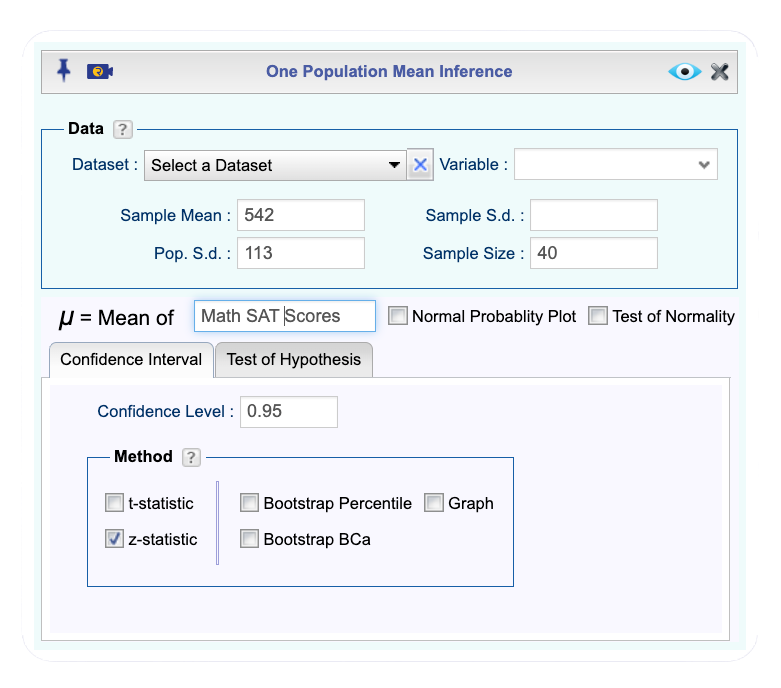
```

:::

:::

The following box shows the Rguroo output.

::: {.callout-tip .inner-callout collapse="true" title="Rguroo output: One-Population Mean Confidence Interval — SAT"}

```{=html}
<div tabindex="0" class="rg-iframe-wrapper">
  <iframe
    src='Rguroo_html_output/Mean Inference/CSUFSAT_CI_docx/CSUFSAT_CI.html'
    class="rg-iframe"
    title="Rguroo output: One Population Mean Confidence Interval - SAT Example">
  </iframe>
</div>
```

:::

The following table from the Rguroo output contains all the information for answering this question:

```{r, echo=FALSE}
#| label: fig-sat-ci-output
#| fig-alt: "Rguroo Output from a normal-based 95% confidence interval for the mean CSUF SAT Math score. The table reports a sample mean of 542, a standard error of 17.87, a lower confidence limit of 506.98, an upper confidence limit of 577.02, and a margin of error of 35.02."
#| fig-cap: "Normal-based 95% confidence interval for the mean CSUF SAT Math score."
#| out-width: "1000%"
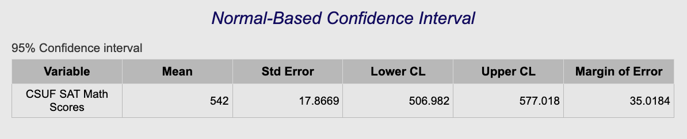
```

The margin of error reported by Rguroo is approximately $35.02$ points, and the 95% confidence interval for $\mu$ is

$$
(506.98,\ 577.02) \text{ points}.
$$

c. **Interpretation:** We are 95% confident that the true mean math SAT score among incoming CSUF freshmen in fall 2025 is between 506.98 and 577.02 points. 

::::

**Note.** The value $\mu_0 = 508$ (the national mean) lies inside the 95% confidence interval $(506.98,\ 577.02)$. A two-sided 5% test of $H_0: \mu = 508$ vs. $H_a: \mu \neq 508$ therefore fails to reject $H_0$, and concludes that the SAT Math scores of the 2025 incoming freshmen is not different from the national average.

You may notice that this two-sided test reaches a different conclusion from the one-sided test of @exm-sat-csuf-mean-known, which rejected $H_0: \mu \leq 508$ in favor of $H_a: \mu > 508$. The two results are not in conflict. A one-sided test focuses all of $\alpha$ in the direction of $H_a$ (the mean being larger than 508) and so detects departures that a two-sided test cannot.

### Confidence Interval When $\sigma$ Is Unknown {#sec-ci-unknown-sigma}

When the population standard deviation $\sigma$ is unknown and the variable under study has a normal distribution in the population, we estimate $\sigma$ by the sample standard deviation $s$ and use the Student $t$ distribution in place of the normal (see @sec-mean-inference-unknown-sigma). The form of the confidence interval is the same as in the known-$\sigma$ case, with two substitutions: the sample standard deviation $s$ replaces $\sigma$, and the critical value $t^*_{n-1}$ from the Student $t$ distribution with $n - 1$ degrees of freedom replaces $z^*$.

::: {.callout-note appearance="minimal"}
## Confidence Interval for $\mu$, $\sigma$ Unknown

When the variable under study has a normal distribution in the population and $\sigma$ is unknown, the $(1-\alpha) \times 100\%$ confidence interval for $\mu$ is

$$
\bar{X} \;\pm\; \underbrace{t^*_{n-1} \cdot \frac{s}{\sqrt{n}}}_{\text{margin of error}},
$$

where $t^*_{n-1}$ is the critical value from the Student $t$ distribution with $n - 1$ degrees of freedom, corresponding to the confidence level $(1-\alpha) \times 100\%$. To compute the interval from a specific sample, replace $\bar{X}$ with the observed value $\bar{x}_{\text{obs}}$.
:::

The critical value $z^*$ takes the same value regardless of sample size. The critical value $t^*_{n-1}$, by contrast, depends on the degrees of freedom $n - 1$. The following table compares the 95% critical values for $z^*$ and $t^*_{n-1}$ at several common sample sizes:

| Sample size $n$ | Degrees of freedom $n-1$ | $t^*_{n-1}$ at 95% |
|----------------|--------------------------|--------------------|
| 5 | 4 | 2.776 |
| 10 | 9 | 2.262 |
| 15 | 14 | 2.145 |
| 30 | 29 | 2.045 |
| 100 | 99 | 1.984 |
| (large $n$, normal limit) | $\infty$ | $z^* = 1.960$ |

The $t$ critical value is noticeably larger than the normal value $z^* = 1.960$ for small samples, and the difference produces a wider interval — the extra width reflects the additional uncertainty introduced by estimating $\sigma$ from the data. The values approach $z^* = 1.960$ as $n$ grows: by $n = 30$ the difference is already small, and by $n = 100$ the two are essentially identical. This reflects the broader fact, discussed in @sec-t-distribution, that the $t$ distribution approaches the standard normal as the degrees of freedom increase. Rguroo computes $t^*_{n-1}$ and reports the margin of error automatically, so we do not look up these values by hand in practice.

:::{#exm-sleep-university-mean-ci}
## Sleep Hours Among University Students: Confidence Interval

We return to the sleep setting introduced in @exm-sleep-university-mean. A random sample of $n = 15$ students yielded a sample mean of $\bar{x}_{\text{obs}} = 6.4$ hours and a sample standard deviation of $s = 1.2$ hours. Assume that the population of nightly sleep hours is normally distributed.

a. What is the sampling distribution of $\bar{X}$?
b. Use Rguroo's [Mean Inference]{.fun} function to construct a 95% confidence interval for the mean nightly sleep $\mu$ among students at our university. Report the margin of error and the interval.
c. Interpret the interval in the context of the problem.
:::

:::: {.callout-tip .solution-callout collapse="true" icon=false}
## 🔎 Solution

a. The population standard deviation $\sigma$ is unknown and is estimated by $s = 1.2$. The sampling distribution of $\bar{X}$ is a Student $t$ distribution with $n - 1 = 14$ degrees of freedom, centered at $\mu$ with estimated standard error $s/\sqrt{n} = 1.2/\sqrt{15} \approx 0.3098$ hours:

$$
\bar{X} \sim t_{14}\!\left(\mu,\ \frac{1.2}{\sqrt{15}}\right) \approx t_{14}(\mu,\ 0.3098).
$$

b. The Rguroo steps follow those in @exm-sat-csuf-mean-ci-known. The differences in the [One Population Mean Inference]{.dialog} dialog are these:

   - [Sample Mean]{.des}: [6.4]{.typein}, [Sample S.d.]{.des}: [1.2]{.typein} (leave [Pop S.d.]{.des} empty since $\sigma$ is unknown), [Sample Size]{.des}: [15]{.typein}.
   - In the text box [$\mu$ = Mean of]{.des} enter the label [Nightly Sleep]{.typein}.
   - In the **Methods** section of the [Confidence Interval]{.tab} tab, select the [t-statistic]{.des} checkbox.

::: {.callout-tip .inner-callout collapse="true" title="Rguroo dialog for the Sleep confidence interval"}

```{r, echo=FALSE}
#| label: fig-sleep-ci-dialog
#| fig-alt: "Rguroo One Population Mean Inference dialog for the Sleep confidence interval, showing sample mean 6.4, sample standard deviation 1.2, sample size 15, parameter label Nightly Sleep, confidence level 0.95, and the t-statistic method selected."
#| fig-cap: "Rguroo setup for the Sleep one-population mean confidence interval."
#| out-width: "80%"
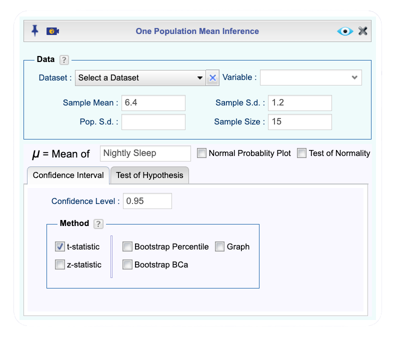
```

:::

@tbl-sleep-ci shows the Rguroo output:

```{r, echo=FALSE}
#| label: tbl-sleep-ci
#| tbl-alt: "Rguroo Output from a t-based 95% confidence interval for mean nightly sleep duration. The table reports a sample mean of 6.4 hours, a standard error of 0.310, 14 degrees of freedom, a lower confidence limit of 5.74 hours, an upper confidence limit of 7.06 hours, and a margin of error of 0.66 hours."
#| tbl-cap: "t-based 95% confidence interval for mean nightly sleep duration."
#| out-width: "100%"
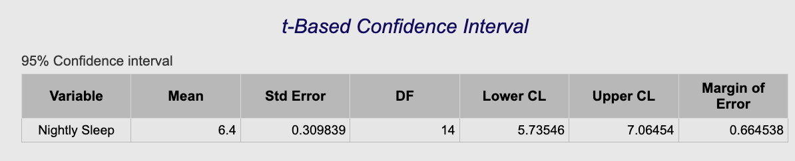
```

The margin of error reported by Rguroo is approximately $0.665$ hours, and the 95% confidence interval for $\mu$ is

$$
(5.735,\ 7.065) \text{ hours}.
$$

c. **Interpretation:** We are 95% confident that the true mean nightly sleep among students at our university is between 5.74 and 7.07 hours. 

::::

**Note.** The value $\mu_0=7$ lies just barely inside the 95% confidence interval $(5.735,\ 7.065)$. A two-sided 5% test of $H_0: \mu = 7$ vs. $H_a: \mu \neq 7$ therefore fails to reject $H_0$.

you may notice that this two-sided test reaches a different conclusion from the one-sided test of @exm-sleep-university-mean-unknown, which rejected $H_0: \mu \geq 7$ in favor of $H_a: \mu < 7$. The two results are not in conflict. A one-sided test focuses all of $\alpha$ in the direction of $H_a$ and so detects departures that a two-sided test cannot.

:::{#exm-commute-metro-mean-ci}
## Commute Time in a Metropolitan Area: Confidence Interval

We return to the commute setting introduced in @exm-commute-metro-mean. A random sample of $n = 15$ commuters yielded a sample mean of $\bar{x}_{\text{obs}} = 24.8$ minutes and a sample standard deviation of $s = 9.6$ minutes. Assume that the population of commute times is normally distributed.

a. What is the sampling distribution of $\bar{X}$?
b. Use Rguroo's [Mean Inference]{.fun} function to construct a 95% confidence interval for the mean one-way commute time $\mu$ among workers in our metropolitan area. Report the margin of error and the interval.
c. Interpret the interval in the context of the problem.
:::

:::: {.callout-tip .solution-callout collapse="true" icon=false}
## 🔎 Solution

a. The population standard deviation $\sigma$ is unknown and is estimated by $s = 9.6$. The sampling distribution of $\bar{X}$ is a Student $t$ distribution with $n - 1 = 14$ degrees of freedom, centered at $\mu$ with estimated standard error $s/\sqrt{n} = 9.6/\sqrt{15} \approx 2.479$ minutes:

$$
\bar{X} \sim t_{14}\!\left(\mu,\ \frac{9.6}{\sqrt{15}}\right) \approx t_{14}(\mu,\ 2.479).
$$

b. The Rguroo steps follow those in @exm-sleep-university-mean-ci, with sample mean 24.8, sample standard deviation 9.6, sample size 15, and label [Commute Times]{.typein}.

::: {.callout-tip .inner-callout collapse="true" title="Rguroo dialog for the Commute confidence interval"}

```{r, echo=FALSE}
#| label: fig-commute-ci-dialog
#| fig-alt: "Rguroo One Population Mean Inference dialog for the Commute confidence interval, showing sample mean 24.8, sample standard deviation 9.6, sample size 15, parameter label Commute Times, confidence level 0.95, and the t-statistic method selected."
#| fig-cap: "Rguroo setup for the Commute one-population mean confidence interval."
#| out-width: "80%"
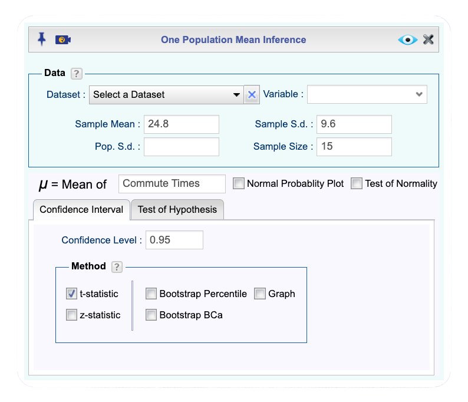
```

:::

@tbl-commute-ci shows the Rguroo output:

```{r, echo=FALSE}
#| label: tbl-commute-ci
#| tbl-alt: "Output from a t-based 95% confidence interval for mean one-way commute time. The table reports a sample mean of 24.8 minutes, a standard error of 2.48 minutes, 14 degrees of freedom, a lower confidence limit of 19.48 minutes, an upper confidence limit of 30.12 minutes, and a margin of error of 5.32 minutes."
#| tbl-cap: "t-based 95% confidence interval for mean one-way commute time."
#| out-width: "100%" 
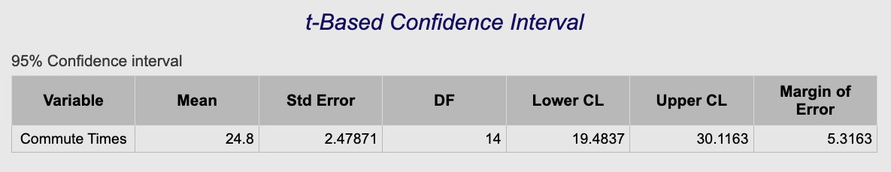
```

The margin of error reported by Rguroo is approximately $5.32$ minutes, and the 95% confidence interval for $\mu$ is

$$
(19.48,\ 30.12) \text{ minutes}.
$$

c. **Interpretation:** We are 95% confident that the true mean one-way commute time among workers in our metropolitan area is between 19.48 and 30.12 minutes. 

::::

**Note.** The value 26.8 (the national mean) lies inside the 95% confidence interval $(19.48,\ 30.12)$. This is consistent with the failure to reject $H_0: \mu = 26.8$ in the two-sided hypothesis test of @exm-commute-metro-mean-unknown.

:::{#exm-penguin-flipper-mean-ci}
## Flipper Length of Adélie Penguins: Confidence Interval

We return to the penguin setting introduced in @exm-penguin-flipper-mean. The Palmer Penguins dataset contains flipper length measurements for $n = 151$ Adélie penguins, with sample mean $\bar{x}_{\text{obs}} = 189.95$ mm and sample standard deviation $s = 6.539$ mm. Assume that the population of Adélie flipper lengths is normally distributed.

a. What is the sampling distribution of $\bar{X}$?
b. Use Rguroo's [Mean Inference]{.fun} function with the [palmerpenguins_Adelie]{.dataset} dataset to construct a 95% confidence interval for the mean flipper length $\mu$ of Adélie penguins in the Palmer Archipelago. Report the margin of error and the interval.
c. Interpret the interval in the context of the problem.
:::

:::: {.callout-tip .solution-callout collapse="true" icon=false}
## 🔎 Solution

a. The population standard deviation $\sigma$ is unknown and is estimated by $s = 6.539$. The sampling distribution of $\bar{X}$ is a Student $t$ distribution with $n - 1 = 150$ degrees of freedom, centered at $\mu$ with estimated standard error $s/\sqrt{n} = 6.539/\sqrt{151} \approx 0.5321$ mm:

$$
\bar{X} \sim t_{150}\!\left(\mu,\ \frac{6.539}{\sqrt{151}}\right) \approx t_{150}(\mu,\ 0.5321).
$$

b. The Rguroo steps follow those in @exm-sleep-university-mean-ci, with the raw [palmerpenguins_Adelie]{.dataset} dataset and the variable [flipper_length_mm]{.var} selected. The sample mean, sample standard deviation, and sample size are populated automatically from the data.

::: {.callout-tip .inner-callout collapse="true" title="Rguroo dialog for the Adélie flipper-length confidence interval"}

```{r, echo=FALSE}
#| label: fig-adelie-ci-dialog
#| fig-alt: "Rguroo One Population Mean Inference dialog for the Adélie flipper-length confidence interval, with the palmerpenguins_Adelie dataset and flipper_length_mm variable selected, confidence level 0.95, and the t-statistic method selected."
#| fig-cap: "Rguroo setup for the Adélie flipper-length one-population mean confidence interval."
#| out-width: "80%"
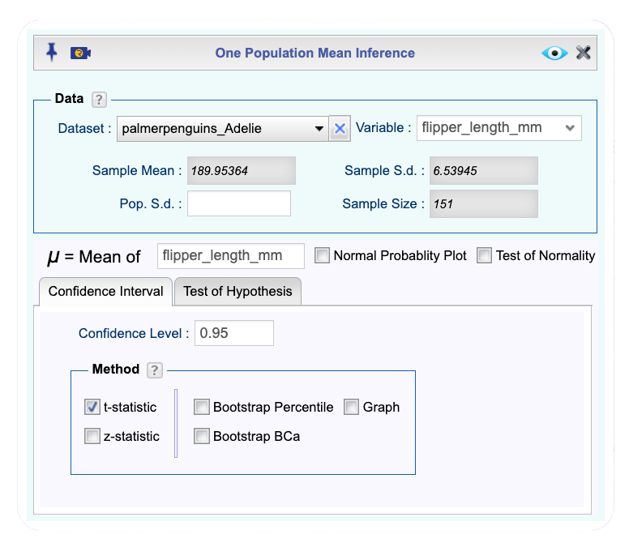
```

:::

@tbl-adeli-ci show the Rguroo output:

```{r, echo=FALSE}
#| label: tbl-adeli-ci
#| tbl-alt: "Output from a t-based 95% confidence interval for mean penguin flipper length. The table reports a sample mean of 189.95 mm, a standard error of 0.53 mm, 150 degrees of freedom, a lower confidence limit of 188.90 mm, an upper confidence limit of 191.01 mm, and a margin of error of 1.05 mm."
#| tbl-cap: "t-based 95% confidence interval for mean penguin flipper length."
#| out-width: "100%" 
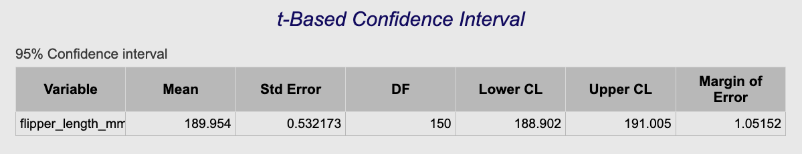
```

The margin of error reported by Rguroo is approximately $1.052$ mm, and the 95% confidence interval for $\mu$ is

$$
(188.90,\ 191.00) \text{ mm}.
$$

c. **Interpretation:** We are 95% confident that the true mean flipper length of Adélie penguins in the Palmer Archipelago is between 188.90 and 191.00 mm.

::::

**Note.** The reference value $\mu_0 = 188$ lies outside the 95% confidence interval $(188.90,\ 191.00)$. This is consistent with the rejection of $H_0: \mu = 188$ in the two-sided hypothesis test of @exm-penguin-flipper-mean-unknown.

### Homework for @sec-confidence-interval-one-mean

<!-- to be filled -->

## Checking the Normality Assumption with a Normal Probability Plot or a Statisticsl Test {#sec-QQ-Plot-mean}

As we will see in @sec-large-sample-mean, the role of the normality assumption diminishes as the sample size increases. For larger samples (often $n > 30$), the inferential procedures developed in this chapter remain approximately valid under moderate departures from normality, though severe skewness or outliers can still affect their accuracy. For smaller samples, the assumption that the population distribution is approximately normal plays a more central role in the validity of both the normal and $t$-based procedures, and checking it is important.

In some applications, the plausibility of the normality assumption is supported by subject-matter knowledge and prior experience with the variable being studied. When raw data are available, we can also assess the assumption directly from the sample. In this section, we introduce two commonly used approaches: a graphical method based on a **normal probability plot** and a formal hypothesis test known as the **Shapiro–Wilk test**. Both methods are available in Rguroo.

A **normal probability plot** (also called a **Q-Q plot**, short for *quantile-quantile plot*) assesses normality by plotting the ordered values from the sample against the values we would expect to see if the data came from a normal distribution. If the population distribution really is normal, the plotted points should fall close to a straight line. Systematic departures from a straight line — a curve, an S-shape, or points that drift away in the tails — indicate that the data do not come from a normal distribution. Rguroo's normal probability plot also displays a pair of dashed bands around the reference line; these bands indicate the range in which the points would typically fall if the data were normal. Points that stray outside the bands are evidence of departure from normality.

The Shapiro–Wilk test assesses normality formally through a hypothesis test. A large p-value, for example greater than 0.05,  indicates that the data are consistent with a normal distribution, whereas a small p-value provides evidence against normality.

To assess normality in Rguroo, open the [One Population Mean Inference]{.dialog} as you did in the worked examples earlier in the chapter, select your dataset and variable, and check the boxes labeled [Normal Probability Plot]{.des} and [Test of Normality]{.des}. As an example, @fig-QQ-dialog shows the dialog with the [palmerpenguins_Adelie]{.dataset} dataset and the variable [flipper_length_mm]{.var} selected, both normality assessment options checked.

```{r,echo=FALSE}
#| fig-alt: "Screenshot of the Rguroo One Population Mean Inference dialog showing the Palmer Penguins dataset with the variable flipper_length_mm selected. The options “Normal Probability Plot” and “Test of Normality” are checked, indicating that both a normal probability plot and a Shapiro–Wilk normality test will be produced."
#| fig-cap: "Rguroo settings for generating a normal probability plot and conducting a Shapiro–Wilk test of normality."
#| label: fig-QQ-dialog
#| out-width: "80%"
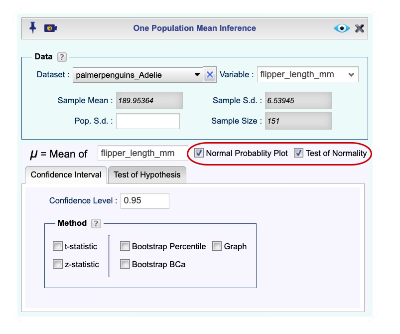
```

The normal probability plot for these data is shown @fig-QQ-plot. As you can see all data points follow a straight line closely and they are all within the dashed band. This indicates that the data for Adélie  flipper lengths is normaly distributed. 

A few points outside the bands does not necessarily indicate non-normality, especially in larger samples where some scatter is expected. When the plot is ambiguous — most points on the line, but a few outliers — the Shapiro–Wilk test can supply a more formal assessment.

```{r,echo=FALSE}
#| fig-alt: "Normal probability plot for penguin flipper lengths. The plotted points closely follow a straight reference line and remain within the confidence bands, indicating that the distribution is approximately normal."
#| fig-cap: "Normal probability plot indicating that the flipper length data are approximately Adélie ."
#| label: fig-QQ-plot
#| out-width: "60%"
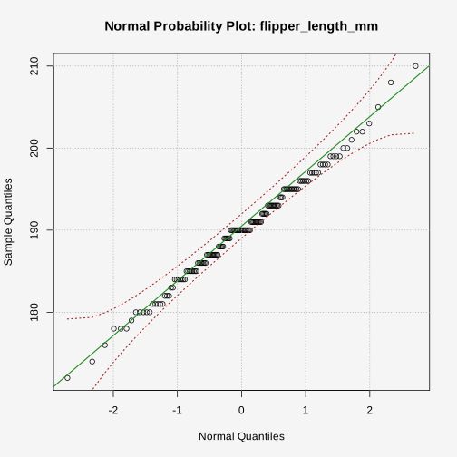
```

@fig-SW-test shows the Rguroo output for the Shapiro-Wilk test for the same data. The test reports a W-statistic of 0.993 and a p-value of 0.720, providing no evidence against the assumption of normality for the Adélie  flipper length data. The Shapiro-Wilk test's null hypothesis is that the population from which the data were drawn is normally distributed. A large p-value, such as 0.720, indicates that the sample is consistent with this hypothesis, while a small p-value (say less than 0.05) provides evidence against it. The W-statistic is computed by a formula whose details are beyond the scope of this text; for our purposes, it is the p-value that drives the decision. Note that the result of this test is consistent with the normal probability plot, both of which suggest that the normality assumption is reasonable for the Adélie  flipper length data.

```{r,echo=FALSE}
#| fig-alt: "Output from a Shapiro–Wilk test of normality for penguin flipper lengths. The table reports a W-statistic of 0.993 and a p-value of 0.720, providing no evidence against the assumption of normality."
#| fig-cap: "Shapiro–Wilk test results indicating that the flipper length data are consistent with a normal distribution."
#| label: fig-SW-test
#| out-width: "80%"
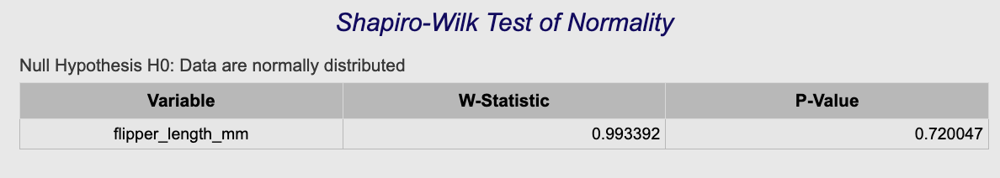
```

It is instructive to see an example of a normal probability plot and Shapiro-Wilk test that indicate a departure from normality. @fig-QQ-plot-non-normal shows the normal probability plot for the variable [flipper_length_mm] for all the species in the [palmerpenguins]{.dataset}. The points deviate from the straight reference line, in both the lower and upper tails, and many points are outside the dashed confidence bands. This suggests that the distribution of flipper lengths for all penguins is not normal. The Shapiro-Wilk test for these data, shown in @fig-SW-test-non-normal, reports a W-statistic of 0.915 and a p-value of 3.5 times 10 to the power minus nine, providing strong evidence against the assumption of normality for the all species combined flipper length data.

```{r,echo=FALSE}
#| fig-alt: "Normal probability plot for penguin flipper lengths for all species. The plotted points deviate from the straight reference line, particularly in the tails, and many points fall outside the confidence bands, indicating that the distribution is not normal."
#| fig-cap: "Normal probability plot indicating that the flipper length data for all penguins are not Adélie ."
#| label: fig-QQ-plot-non-normal
#| out-width: "60%"
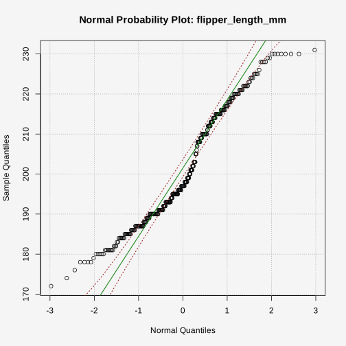
```
```{r,echo=FALSE}
#| fig-alt: "Output from a Shapiro–Wilk test of normality for penguin flipper lengths for all species. The table reports a W-statistic of 0.915 and a p-value of $3.5\times 10^{-9}$ (very close to zero), providing strong evidence against the assumption of normality."
#| fig-cap: "Shapiro–Wilk test results indicating that the flipper length data for all penguins are not consistent with a normal distribution."
#| label: fig-SW-test-non-normal
#| out-width: "80%"
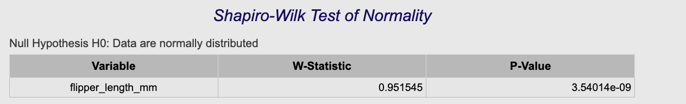
```

Together, the normal probability plot and the Shapiro–Wilk test provide complementary ways to check the normality assumption. The plot reveals the shape of the departure (skewness, heavy tails, outliers); the test offers a numerical summary. When both agree, the conclusion is clear. When they disagree — for instance, when a Shapiro–Wilk test rejects normality but the plot shows only a few mild departures — it is reasonable to favor the visual evidence, since the test can be sensitive to minor deviations in large samples. In small samples, the test may have low power to detect real departures, so the plot remains essential. In the next section, we discuss what to do when the normality assumption is *not* satisfied.

### Homework for @sec-QQ-Plot-mean

## Large-Sample Mean Inference: Dropping the Normality Assumption {#sec-large-sample-mean}

Every method in this chapter so far has rested on one assumption: the variable under study has a normal distribution in the population. This assumption gave the sample mean $\bar{X}$ an exact sampling distribution — normal when $\sigma$ is known, and Student $t$ when $\sigma$ is unknown. For small samples, the assumption matters, and we check it using the methods of @sec-QQ-Plot-mean.

For large samples, the normality assumption can be dropped. The justification is the **Central Limit Theorem**: when the sample size is large, the sampling distribution of $\bar{X}$ is approximately normal, whatever the shape of the population distribution. We no longer need the population itself to be normal, because the sampling distribution of $\bar{X}$ is approximately normal on its own.

As a rule of thumb, a sample of size $n \geq 30$ is large enough for the approximation to be reasonable. Populations that are strongly skewed or contain extreme outliers may require a larger sample, while populations that are already roughly symmetric need less.

When the sample is large, every method developed in this chapter for the normal case continues to apply, now as an approximation rather than an exact result. We use the normal distribution to obtain critical regions, p-values, and confidence intervals exactly as before.

The one point that needs care is the role of $\sigma$. When $\sigma$ is known, the sampling distribution of $\bar{X}$ is approximately $N(\mu_0,\ \sigma/\sqrt{n})$, and we proceed as in the known-$\sigma$ case. When $\sigma$ is unknown, we replace it with the sample standard deviation $s$. This replacement is justified by the same large-sample reasoning: for a large sample, $s$ is a reliable estimate of $\sigma$, so little is lost by substituting one for the other. The sampling distribution of $\bar{X}$ is then approximately $N(\mu_0,\ s/\sqrt{n})$, and we again use the normal distribution.

This use of the normal distribution when $\sigma$ is unknown is consistent with what we saw in @sec-t-distribution. The Student $t$ distribution approaches the standard normal as the degrees of freedom increase, so for a large sample the $t$ and normal distributions produce nearly identical critical regions, p-values, and confidence intervals. In the large-sample setting it is conventional to use the normal distribution directly.

Several examples earlier in the chapter already involve large samples. The Adélie penguin example (@exm-penguin-flipper-mean-unknown and @exm-penguin-flipper-mean-ci) uses $n = 151$ measurements, well above the rule-of-thumb threshold. We carried out that analysis using the $t$ distribution, but because the sample is large, the normal distribution would produce essentially the same result. The SAT example, with $n = 40$, is likewise large enough for the approximation to apply.

In Rguroo, the large-sample analysis is carried out exactly as in the earlier sections, with one change: in the **Methods** section of the dialog, select the [z-statistic]{.des} checkbox rather than the [t-statistic]{.des} checkbox. All other steps — entering the sample mean, the sample standard deviation, the sample size, and the hypothesis or confidence level — are unchanged.

::: {.callout-note appearance="minimal"}
## Large-Sample Mean Inference

When the sample is large (as a rule of thumb, $n \geq 30$), the Central Limit Theorem makes the sampling distribution of $\bar{X}$ approximately normal, regardless of the shape of the population distribution. The normality assumption is therefore not needed, and all the methods of this chapter apply as approximations:

- **When $\sigma$ is known**, the sampling distribution of $\bar{X}$ is approximately $N(\mu_0,\ \sigma/\sqrt{n})$ for hypothesis testing, and the confidence interval is $\bar{X} \pm z^* \cdot \sigma/\sqrt{n}$.
- **When $\sigma$ is unknown**, replace $\sigma$ with the sample standard deviation $s$. For a large sample, $s$ is a reliable estimate of $\sigma$. The sampling distribution of $\bar{X}$ is then approximately $N(\mu_0,\ s/\sqrt{n})$, and the confidence interval is $\bar{X} \pm z^* \cdot s/\sqrt{n}$.

In both cases we use the standard normal critical value $z^*$. In Rguroo, select the [z-statistic]{.des} method. This applies equally to hypothesis tests and confidence intervals.
:::

::: {.callout-note appearance="simple" icon="none" title="{width=22px style='vertical-align:middle;'} Rguroo: Large-Sample Mean Inference"}

The large-sample analysis follows the same steps as the earlier mean inference examples, with one change. In the **Methods** section of the [One Population Mean Inference]{.dialog} dialog, select the [z-statistic]{.des} checkbox instead of the [t-statistic]{.des} checkbox.

All other entries are unchanged:

- [Sample Mean]{.des}, [Sample S.d.]{.des} (or [Pop S.d.]{.des} when $\sigma$ is known), and [Sample Size]{.des} are entered as before.
- For a hypothesis test, the alternative hypothesis is specified in the [Alternative Hypothesis $\mu$]{.dpd} dropdown as before.
- For a confidence interval, the [Confidence Level]{.des} is entered in the [Confidence Interval]{.tab} tab as before.

This single change — [t-statistic]{.des} to [z-statistic]{.des} — applies to both hypothesis tests and confidence intervals.
:::

### Homework for @sec-large-sample-mean

<!-- to be filled -->

### Homework for @sec-large-sample-mean

<!-- to be filled -->
