**Before you begin, click to expand the box below to review the process for importing a dataset.**

::: {#Importing-GSS2024-to-Rguroo .callout-note appearance="simple" collapse="true" icon="none" title="{width=22px style='vertical-align:middle;'}  Importing Data to Rguroo"} 

1. Open the **Data** toolbox in Rguroo.  
2. From the [Data Import]{.dpd} dropdown, select [Dataset Repository]{.fun}.  
3. In the top search box, type [kozak]{.typein}, then select the [Statistics Using Technology – Kozak]{.repo} repository.  
4. In the middle search box, type the first few letters of the dataset name, and choose your desired dataset name that appears in the lower panel.  
5. Click the [Import]{.button}. The dataset will be imported to your Rguroo account.
6. Click [Close]{.button} to exit the dialog.  
7. To view the dataset, double-click the dataset name under the **Data** toolbox list.

:::


In the foundations chapter we developed the *logic* of statistical inference — null and alternative hypotheses, the two types of error, the significance level, the p-value and critical region approaches to making a decision, and the idea of a confidence interval — without performing any computations. That development and reasoning does not depend on which parameter we study. In this chapter we put it to work for a **population proportion** $p$, filling in the parameter-specific machinery the foundations chapter deferred: the statistics and their sampling distribution, the calculations that produce a p-value and a critical region, and the software steps to carry them out in Rguroo. We treat both the one-population and two-population proportion settings.

Because the conceptual framework is already in place, this chapter focuses on computation. We will recall each idea briefly as we use it, with a pointer back to the foundations chapter for the full discussion, and spend our effort on how the ideas are actually carried out for a proportion. The same pattern will repeat in the next chapter for a population mean: new computations, the same framework.

We begin with hypothesis testing for one population proportion.

## Hypothesis Testing: Concepts and Setup {#sec-concept-setup}

In many real situations, we encounter numerical claims about population proportions: the proportion of teenagers who use a particular app, the proportion of adults who meet health guidelines, or the proportion of students who rely on social media for news. But how can we determine whether such claims are reasonable? When does sample evidence support a claim, and when should we question it?

To see how we might answer such questions, we will work through examples and develop the reasoning needed to evaluate claims and reach conclusions. We begin by establishing the framework and notation we will use throughout this chapter.

### Setting the Stage: A Running Example {#sec-stage}

Suppose we want to know what proportion of students at our university prefer online classes. The **population** is all students at our university. The **response variable** is _class mode preference_, a categorical variable (also called a **factor**) that classifies each student into one of two categories: prefers online classes or does not prefer online classes. We define "prefers online classes" as a **success** and the other category as a **failure**.

The parameter of interest is the **population proportion**, denoted by $p$—the fraction of all students at our university who prefer online classes. Since we cannot survey every student, we collect data from a random **sample** and use it to learn about $p$.

This example illustrates the key elements of proportion inference:

- A population with a characteristic we want to measure
- A categorical response variable with two outcomes (success/failure)
- A parameter $p$ representing the true population proportion of successes
- A sample from which we compute a **statistic** to estimate $p$

Let's develop this framework more formally.

### From Samples to Statistics {#sec-samples-to-stats}

When we collect a sample of size $n$, we count how many individuals have a success outcome. Before the sample is collected, this count is unknown, so we treat it as a **random variable** and denote it by $X$. The corresponding **sample proportion** is also a random variable, given by $\hat{p}=X/n$ (read "p-hat").  

After the data are collected, we observe the count of successes in our sample, which we denote by $x_{\text{obs}}$ (read "x-observed"). The corresponding **observed sample proportion** is $\hat{p}_{\text{obs}}=\frac{x_{\text{obs}}}{n}$ (read "p-hat-observed") which provides an estimate of the population proportion $p$.

In our example of students who prefer online classes, suppose we randomly select $n = 100$ students. Before we collect the sample, $X$ represents the number of students who will say they prefer online classes in a random sample of 100 students. The value of $X$ could be anywhere from 0 to 100. Correspondingly, $\hat{p}$ represents the proportion of students in the sample who say that they prefer online classes. After we survey the students, suppose 62 say they prefer online classes. Then, the observed count is $x_{\text{obs}} = 62$ and the observed proportion is $\hat{p}_{\text{obs}} = 62/100 = 0.62$ or 62%. .

::: {.callout-note appearance="minimal"}
$X$ is a random variable representing the number of successes across all possible samples; $x_{\text{obs}}$ is the specific count from our actual sample. Similarly, $\hat{p}=X/n$ is a random variable representing the sample proportion across all possible samples, while $\hat{p}_{\text{obs}}=x_{\text{obs}}/n$ is the observed sample proportion from our actual sample. We use $x_{\text{obs}}$, or equivalently $\hat{p}_{\text{obs}}$, to make decisions about $p$.
:::


::: {.callout-note}
## Notation Summary

As we work through the examples in this chapter, keep the following symbols straight:

| Symbol | Name | Description |
|-----|------|-------------|
| $p$ | Population proportion | The true, unknown proportion in the population |
| $n$ | Sample size | The number of individuals in the sample |
| $X$ | Random variable (count) | The number of successes across all possible samples of size $n$|
| $x_{\text{obs}}$ | Observed count | The actual number of successes in our sample |
| $\hat{p}$ | Random variable (proportion) | The sample proportion $X/n$ across all possible samples of size $n$|
| $\hat{p}_{\text{obs}}$ | Observed sample proportion | The proportion of success we observed in our sample; estimate of $p$ computed as $x_{\text{obs}}/n$ |

:::

:::{#exm-youtube-ppss} 
## Daily YouTube Use Among Teens

According to a [Pew Research Center report](https://www.pewresearch.org/internet/2023/12/11/teens-social-media-and-technology-2023/){target="_blank"}, about 71% of U.S. teenagers say they visit YouTube every day (Pew Research Center, *Teens, Social Media and Technology*, 2023).

Suppose a school district claims that more than 70% of students in its district use YouTube daily. To examine this claim, a random sample of 20 students is selected, and 17 of them report that they use YouTube daily.

Describe or compute the following related to the claim:

a. The response variable and its possible categories
b. The success category of the response variable
c. The population of interest  
d. The parameter of interest $p$ 
e. The sample 
f. The statistic $X$ and its observed value $x_{\text{obs}}$
g. The observed sample proportion $\hat{p}_{\text{obs}}$ that is an estimate of $p$

:::


::: {.callout-tip .solution-callout collapse="true" icon=false}
## 🔎 Solution
a. The response variable is _Daily Use of YouTube_ with two possible response categories "Yes" and "No".

b. The success category is "Yes", that is if the student uses YouTube daily.

a. The population of interest is all students in the district.

b. The parameter of interest $p$ is the proportion of students in the district who use YouTube daily.

c. The sample is the 20 students who were randomly selected and questioned about their YouTube use.

d. The statistic $X$ is the number of students in a sample of size $n = 20$ who use YouTube daily. From our sample, the observed value is $x_{\text{obs}} = 17$.

e. The observed sample proportion (an estimate of $p$) is 

$$\hat{p}_{\text{obs}} = \frac{x_{\text{obs}}}{n}=\frac{17}{20} = 0.85.$$

:::

:::{#exm-physical-inactivity-ppss} 
## Physical Inactivity Among Adults

The [World Health Organization reports](https://www.who.int/news/item/26-06-2024-nearly-1.8-billion-adults-at-risk-of-disease-from-not-doing-enough-physical-activity){target="_blank"} that approximately 31% of adults worldwide do not meet recommended levels of physical activity (World Health Organization, 2024).

Suppose a national health agency hopes that fewer than 35% of adults in its country are physically inactive. To examine this claim, a random sample of 50 adults is selected, and 10 of them are found to be physically inactive.

Describe, and when relevant compute, the following related to the claim:

a. The response variable and its possible categories
b. The success category of the response variable
a. The population of interest  
b. The parameter of interest $p$ 
c. The sample 
d. The statistic $X$ and its observed value $x_{\text{obs}}$
e. The observed sample proportion $\hat{p}_{\text{obs}}$ that is an estimate of $p$

:::

::: {.callout-tip .solution-callout collapse="true" icon=false}
## 🔎 Solution

a. The variable of interest is _Physical Activity_, with possible categories of "Inactive" and "Active".

b. The success category is "Inactive", since we want to make inference about those who are physically inactive. 

a. The population of interest is all adults in the country.

b. The parameter of interest $p$ is the proportion of adults in the country who are physically inactive.

c. The sample is the 50 adults who were randomly selected and their physical activity levels were recorded.

d. The statistic $X$ is the number of individuals in a sample of size 50 who are inactive, and its observed value is $x_{\text{obs}} = 10$.

e. The observed sample proportion (an estimate of $p$) is 

$$\hat{p}_{\text{obs}} = \frac{x_{\text{obs}}}{n}=\frac{10}{50} = 0.20.$$

:::

:::{#exm-social-media-news-ppss} 
## Social Media as a Primary News Source

According to a [Pew Research Center report](https://www.pewresearch.org/journalism/fact-sheet/social-media-and-news-fact-sheet/){target="_blank"}, 36% of U.S. adults ages 18–29 say they regularly get news from social media (Shearer, 2023).

Suppose the university administration is unsure whether the same percentage applies to students at their university and wants to determine whether the true proportion of students who get most of their news from social media differs from 36%.

To investigate this question, a random sample of 15 students is selected, and 9 of them report that they get most of their news from social media.

Describe, and when relevant compute, the following related to the claim:

a. The response variable and its possible categories
b. The success category of the response variable
a. The population of interest  
b. The parameter of interest $p$ 
c. The sample 
d. The statistic $X$ and its observed value $x_{\text{obs}}$
e. The observed sample proportion $\hat{p}_{\text{obs}}$ that is an estimate of $p$

:::

::: {.callout-tip .solution-callout collapse="true" icon=false}
## 🔎 Solution

a. The response variable is regarding how students get their news, We call the variable  "_Use Social Media_", and the possible categories are "Yes", and "No".

b. The success category is "Yes".

a. The population of interest is all students at the university.

b. The parameter of interest $p$ is the proportion of students at the university who get most of their news from social media.

c. The sample is the 15 students who were randomly selected and surveyed about their primary news source.

d. The statistic $X$ is the number of students in a sample of size 15 who get most of their news from social media, and its observed value is $x_{\text{obs}} = 9$.

e. The observed sample proportion (an estimate of $p$) is  

$$\hat{p}_{\text{obs}} = \frac{x_{\text{obs}}}{n}=\frac{9}{15} = 0.60.$$

:::

To use sample evidence to evaluate a claim about a population proportion, we first need to state clearly the claims we are considering. Because our decision is based on a sample rather than the entire population, however, there is always a possibility of reaching the wrong conclusion. As we saw in Chapter 8, we might reject a claim that is actually true, or we might fail to reject a claim that is actually false. These two possibilities correspond to Type I and Type II errors, which we will now consider in the context of inference for a population proportion.

### Null and Alternative Hypotheses and Errors for a Proportion {#sec-null-alternative}

The foundations chapter (@sec-foundations-hypotheses) developed the null and alternative hypotheses, the three forms they take, and the two types of error in full. Here we recall just enough to fix notation for a proportion and then apply it to our running examples.

For a population proportion, the **alternative hypothesis** $H_a$ is the claim we seek evidence for, and the **null hypothesis** $H_0$ is its complement, the value or range we assume true unless the data force us to abandon it. Both are statements about the population proportion $p$, not about the sample, so they are written using $p$ and not $\hat{p}_{\text{obs}}$. Writing $p_0$ for the **boundary value** that separates the null from the alternative, the three forms are:

$$
\text{Case 1: } 
\begin{cases} H_0: p \leq p_0 \\ H_a: p > p_0 \end{cases}
\qquad
\text{Case 2: } 
\begin{cases} H_0: p \geq p_0 \\ H_a: p < p_0 \end{cases}
\qquad
\text{Case 3: } 
\begin{cases} H_0: p = p_0 \\ H_a: p \neq p_0 \end{cases}
$$

Cases 1 and 2 are **one-sided** and Case 3 is **two-sided**, exactly as in @sec-foundations-three-forms.

Recall too the two ways a test can be wrong: a **Type I error** rejects $H_0$ when $H_0$ is in fact true, and a **Type II error** fails to reject $H_0$ when $H_a$ is in fact true (see @sec-foundations-errors). The following examples write the hypotheses and interpret both errors for our three proportion scenarios.

:::{#exm-youtube-error} 
## Daily YouTube Use Among Teens (continued)

Recall @exm-youtube-ppss where a school district was interested to test the claim that more than 70% of students in its district use YouTube daily. 

a. State the null and alternative hypotheses in words.
b. Write the null and alternative hypotheses using mathematical notation.
c. Describe what happens if a Type I error occurs in the context of the problem.
d. Describe what happens if a Type II error occurs in the context of the problem.
:::

::: {.callout-tip .solution-callout collapse="true" icon=false}
## 🔎 Solution

a. The null hypothesis states that 70% or fewer students in the district use YouTube daily. The alternative hypothesis states that more than 70% of students in the district use YouTube daily.

b.
$$
\begin{cases}
H_0: p \leq 0.70 \\
H_a: p > 0.70
\end{cases}
$$

c. A Type I error occurs if we reject $H_0$ and conclude that more than 70% of students in the district use YouTube daily when, in fact, the true proportion is 70% or less ($H_0$ is true).

d. A Type II error occurs if we fail to reject $H_0$ and therefore do not conclude that more than 70% of students in the district use YouTube daily when, in fact, the true proportion is greater than 70% ($H_a$ is true).
:::

:::{#exm-physical-inactivity-error} 
## Physical Inactivity Among Adults (continued)

Recall @exm-physical-inactivity-ppss where a national health agency wanted to examine the claim that fewer than 35% of adults in its country are physically inactive.  

a. State the null and alternative hypotheses in words.
b. Write the null and alternative hypotheses using mathematical notation.
c. Describe what happens if a Type I error occurs in the context of the problem.
d. Describe what happens if a Type II error occurs in the context of the problem.
:::

::: {.callout-tip .solution-callout collapse="true" icon=false}
## 🔎 Solution

a. The null hypothesis states that 35% or more adults in the country are physically inactive. The alternative hypothesis states that fewer than 35% of adults in the country are physically inactive.

b.
$$
\begin{cases}
H_0: p \geq 0.35 \\
H_a: p < 0.35
\end{cases}
$$

c. A Type I error occurs if we reject $H_0$ and conclude that fewer than 35% of adults in the country are physically inactive when, in fact, the true proportion is 35% or greater ($H_0$ is true).

d. A Type II error occurs if we fail to reject $H_0$ and therefore do not conclude that fewer than 35% of adults in the country are physically inactive when, in fact, the true proportion is less than 35% ($H_a$ is true).
:::

:::{#exm-social-media-news-error} 
## Social Media as a Primary News Source (continued)

Recall @exm-social-media-news-ppss where a university administration wanted to determine whether the true proportion of students who get most of their news from social media differs from 36% at their university.

a. State the null and alternative hypotheses in words.
b. Write the null and alternative hypotheses using mathematical notation.
c. Describe what happens if a Type I error occurs in the context of the problem.
d. Describe what happens if a Type II error occurs in the context of the problem.
:::

::: {.callout-tip .solution-callout collapse="true" icon=false}
## 🔎 Solution

a. The null hypothesis states that 36% of students at the university get most of their news from social media. The alternative hypothesis states that the proportion of students at the university who get most of their news from social media is different from 36%.

b.
$$
\begin{cases}
H_0: p = 0.36 \\
H_a: p \ne 0.36
\end{cases}
$$

c. A Type I error occurs if we reject $H_0$ and conclude that the proportion of students at the university who get most of their news from social media is different from 36% when, in fact, the true proportion is 36% ($H_0$ is true).

d. A Type II error occurs if we fail to reject $H_0$ and therefore do not conclude that the proportion of students at the university who get most of their news from social media is different from 36% when, in fact, the true proportion is not 36% ($H_a$ is true).
::: 

### Homework for Section @sec-concept-setup {#sec-stage-hw}

For each of the following scenarios, describe or compute the items listed below as they relate to the research question:

a. The response variable and its possible categories
b. The success category of the response variable
a. The population of interest
b. The parameter of interest $p$
c. The sample
d. The statistic $X$ and its observed value $x_{\text{obs}}$
e. The observed sample proportion $\hat{p}_{\text{obs}}$ that is an estimate of $p$
f. State the null and alternative hypotheses in words.
g. Write the null and alternative hypotheses using mathematical notation.
h. Describe what happens if a Type I error occurs in the context of the problem.
i. Describe what happens if a Type II error occurs in the context of the problem.

---

1. **Arizona Marijuana Legalization** A poll conducted by The Arizona Republic/Morrison/Cronkite News, published on October 20, 2016, surveyed 779 registered voters in Arizona between October 10 and October 15, 2016. Of those surveyed, 390 reported favoring Proposition 205, which would legalize marijuana for adults (Sanchez, 2016). At the same time,
55% of Colorado residents supported the legalization of marijuana. Do Arizona
registered voters differ from Colorado residents in their support for marijuana
legalization?

2. **Australian Unemployment Outlook**
In July 1997, 47% of Australians surveyed believed that unemployment would
increase. In November 1997, the same question was asked again in a poll of
631 Australians, and 284 of them said they believed unemployment would increase
(Morgan Gallup Poll, 2013). Did Australian sentiment about unemployment shift
between July and November of 1997?

3. **Arkansas Identity Theft Complaints**
According to the February 2008 Federal Trade Commission report on consumer
fraud and identity theft, 23% of all complaints in 2007 were for identity theft.
In that same year, Arkansas recorded 1,601 identity theft complaints out of a
total of 3,482 consumer complaints (Consumer Fraud and, 2008). Was the proportion
of identity theft complaints in Arkansas larger than the national figure
of 23%?

4. **Alaska Identity Theft Complaints**
According to the February 2008 Federal Trade Commission report on consumer
fraud and identity theft, 23% of all complaints in 2007 were for identity
theft. In that same year, Alaska recorded 321 identity theft complaints out
of a total of 1,432 consumer complaints (Consumer Fraud and, 2008). Was Alaska's
proportion of identity theft complaints significantly less than the national proportion
of 23%?

5. **Kennedy Assassination Conspiracy Belief**
In 2001, a Gallup poll found that 81% of American adults believed there was
a conspiracy behind the death of President Kennedy. In 2013, the same
question was posed to a Gallup poll of 1,039 American adults, and 634 of
them believed there was a conspiracy behind the assassination (Gallup News
Service, 2013). Is there evidence that American belief in a conspiracy behind
President Kennedy's assassination changed between 2001 and 2013?

6. **Autism Spectrum Disorder in Arizona**
In 2008, 507 out of 32,601 children in Arizona were diagnosed with Autism
Spectrum Disorder (ASD) (Autism and Developmental, 2008). Nationally, 1 in
88 children are diagnosed with ASD (CDC Features, 2013). Is the rate of
ASD diagnosis among children in Arizona larger than the national rate?

7. **Graduate Degree Attainment: GSS2024**
According to the U.S. Census Bureau's 2024 educational attainment data,
approximately 15% of U.S. adults aged 25 and older have earned a graduate
degree, defined as a master's degree, professional degree, or doctoral degree (U.S. Census Bureau, 2025). The [GSS2024]{.data} dataset contains responses from $n = 388$ U.S. adults. The variable [Degree]{.var} records the highest degree earned by each respondent, and 33 of the 388 respondents reported a graduate degree as their highest level of education. Does the GSS2024 data provide evidence that the proportion of U.S. adults who hold a graduate degree differs from the 15% reported by the U.S. Census Bureau?

<div tabindex="0" style="width:85%; margin:auto;">

 The dataset for
this exercise is available in the Rguroo dataset repository [Kozak]{.repo},
with the dataset name [GSS2024]{.data}.

**Code book for Dataset GSS2024 is given [here](#code-book-gss2024).**

</div>

## Making a Decision about a Population Proportion

In some situations, it is easy to see that the sample evidence does not lead us to reject $H_0$. For instance, in @exm-youtube-ppss, the Daily YouTube Use Among Teens example, the hypotheses are $H_0: p \leq 0.70$ versus $H_a: p > 0.70$. If a sample of $n = 20$ students had resulted in only $x_{\text{obs}} = 12$ students reporting daily use, then $\hat{p}_{\text{obs}} = \frac{12}{20} = 0.60$. Because $0.60$ is below $0.70$, the sample result points in the direction of $H_0$, not $H_a$, and gives us no reason to reject $H_0$.

For a two-sided test, the idea is similar, except that values on either side of the null value can support $H_a$. For example, in the social media example with $H_0: p = 0.36$ versus $H_a: p \neq 0.36$, sample proportions close to $0.36$ give us no reason to reject $H_0$.

 Now consider sample results that point in the direction of $H_a$. For the YouTube example ($H_a: p > 0.70$), $x_{\text{obs}} = 17$ out of $n = 20$ gives $\hat{p}_{\text{obs}} = 0.85$, which is greater than $0.70$. For the physical inactivity example ($H_a: p < 0.35$), $x_{\text{obs}} = 10$ out of $n = 50$ gives $\hat{p}_{\text{obs}} = 0.20$, which is less than $0.35$. For the social media example ($H_a: p \neq 0.36$), $x_{\text{obs}} = 9$ out of $n = 15$ gives $\hat{p}_{\text{obs}} = 0.60$, which is noticeably different from $0.36$. Each of these results points in the direction of $H_a$. But is that enough to reject $H_0$?

Not necessarily!

::: {.callout-note}
## Consistency With $H_a$ Is Not the Same as Strong Evidence in Favor of $H_a$

A sample result that points in the direction of $H_a$ does not by itself constitute strong evidence in favor of $H_a$. Because of sampling variability, such a result can occur by chance even when $H_0$ is true. The key question is whether the sample result would be **unlikely to occur by chance** if $H_0$ were true. If so, we have strong evidence against $H_0$ and in favor of $H_a$.
:::

We now turn to actually carrying out a hypothesis test for a proportion. Recall from @sec-foundations-tradeoff that, because reducing one type of error tends to increase the other, we control the probability of a Type I error by holding it to a small, prespecified **significance level** $\alpha$. Recall also that there are two equivalent ways to reach a decision: the **p-value approach** and the **critical region approach**. These approaches always lead to the same decision. 

There are two methods we will use to carry out a hypothesis test for one population proportion: a **large-sample approach** based on the normal distribution and an **exact approach** based on the binomial distribution. We begin with the large-sample approach in @sec-large-sample-one-prop, which relies on the central limit theorem and requires a sufficiently large sample for the normal approximation to work well. We then consider the exact binomial approach in @sec-making-decision-binomial, which uses the binomial distribution directly and does not require a large sample.

It is important to distinguish these two methods from the p-value and critical region approaches. The large-sample and exact binomial methods determine how we calculate the probabilities for the test. The p-value and critical region approaches determine how we use those probabilities to make a decision about $H_0$.

The exact binomial method is an ideal choice when we want to avoid relying on a large-sample approximation because it uses the binomial distribution directly to calculate exact probabilities. It does not require a large sample for the normal approximation to be valid. Nevertheless, there are good reasons to begin with the large-sample approach. Most importantly, the basic ideas generalize naturally to other inference problems, such as comparing two population proportions and drawing inferences about population means. In addition, large-sample methods have historically been widely used, so you will frequently encounter them in published research. Finally, because the large-sample approach builds on the familiar normal distribution, it provides an accessible starting point for learning how hypothesis tests are carried out.


## Large Sample Hypothesis Testing {#sec-large-sample-one-prop}

The large sample approach rests on the **Central Limit Theorem (CLT)**,
which you have already seen in Chapter 7. Recall that the CLT tells us that, for a sufficiently large sample, the sampling distribution of a sample mean is approximately normal, even when the population distribution itself is not normal. At first, this may seem unrelated to proportions: the CLT concerns sample means, while our interest here is in a sample proportion. However, as we will see next, a sample proportion can itself be viewed as a sample mean. This connection allows us to apply the CLT directly to sample proportions and provides the foundation for the large-sample approach.

### A Proportion Is a Mean {#sec-prop-is-mean}

Suppose we record whether each individual in our sample has the
characteristic of interest, assigning a value of 1 to each success and a
value of 0 to each failure. For example, in the YouTube study (@exm-youtube-ppss) where the question is about the proportion of students who use YouTube daily, a student
who uses YouTube daily receives a 1, and one who does not receives a 0. If
our sample of $n = 20$ students produced $x_{\text{obs}} = 17$ daily users,
the data would consist of 17 ones and 3 zeros.  The sum of these 20 values is 17, the observed number of successes, and their average is $17/20=0.85$, the observed sample proportion.

Thus if $x_{\text{obs}}$ is the observed number of successes (1's) that is observed in a smple of size $n$, then the **observed sample proportion** $\hat{p}_{\text{obs}}$ is simply the
average of these zeros and ones:

$$
\hat{p}_{\text{obs}} = \frac{x_{\text{obs}}}{n}
        = \frac{\text{sum of zeros and ones}}{n}
        = \bar{x}_{\text{obs}}.
$$
The same connection holds for the random variables we introduced earlier. When each observation is coded as 0 or 1, $X$, the number of successes in the sample, is also the sum of the 0/1 values. Therefore,

$$\hat{p}= \frac{X}{n}= \frac{\text{sum of the 0/1 values}}{n}= \bar{X}.$$

Thus, a sample proportion is a special case of a sample mean: it is the mean of observations that can take only the values 0 and 1. 

Recall from the CLT that when the sample size is large, the sampling distribution of a sample mean is approximately normal, regardless of the shape of the original population distribution. Since $\hat{p}$ is a sample mean, the CLT applies to it as well.

::: {.callout-note appearance="minimal"}
## A Sample Proportion Is a Mean

The sample proportion $\hat{p}$ is the mean of a collection of zeros and ones, and the observed sample proportion $\hat{p}_{\text{obs}}$ is the mean of the zeros and ones in the sample we actually observe. Because the Central Limit Theorem applies to sample means when $n$ is large, it applies to the sampling distribution of $\hat{p}$ as well.
:::

### Applying the Central Limit Theorem to $\hat p$

Since $\hat{p}$ is a sample mean of 0s and 1s, its sampling distribution follows the same general pattern as other sample means. For a population with proportion of successes $p$, the sampling distribution of $\hat{p}$ has:

* Mean: $\mu_{\hat{p}}=p$
* Standard deviation: $\sigma_{\hat{p}} = \sqrt{\dfrac{p(1-p)}{n}}$

This standard deviation is often called the **standard error** of $\hat{p}$.
It measures how much we expect $\hat{p}$ to vary from sample to sample. 
By the CLT, when $n$ is sufficiently large, $\hat{p}$
follows approximately a normal distribution:

$$
\hat{p} \sim N\!\left(p,\; \sqrt{\frac{p(1-p)}{n}}\right).
$$

Since $p$ is unknown, we need to specify a value for it to use this
result for inference. Recall that in hypothesis testing we assume the null hypothesis is true, and that the maximum Type I error occurs at the
boundary value $p_0$ of $H_0$ (see @sec-foundations-boundary). We therefore evaluate the sampling
distribution of $\hat{p}$ at $p = p_0$, giving:

$$
\hat{p} \sim N\!\left(p_0,\; \sqrt{\frac{p_0(1-p_0)}{n}}\right).
$$

We call this the **null distribution** of $\hat{p}$, since it describes
the behavior of $\hat{p}$ at the boundary value $p_0$ of the null hypothesis $H_0$, where
the Type I error is at its maximum. This normal null distribution of $\hat{p}$ is the
foundation for decisions in hypotesis testing in the large sample method. 

Most textbooks present the large sample test using a standardized
statistic called the $z$-score, obtained by subtracting $p_0$ from
$\hat{p}$ and dividing by the standard error:

$$
z = \frac{\hat{p} - p_0}{\sqrt{\dfrac{p_0(1-p_0)}{n}}}.
$$

This unit-less quantity is then compared to a standard normal
distribution. In this textbook, we instead work directly with $\hat{p}$
and compare it to its null distribution. This requires fewer computational steps and, more importantly, keeps our decisions on the original scale — conclusions are about a sample proportion rather than an abstract standardized value.

### What is Considered a Large Sample Size?

What constitutes a large sample size for the normal approximation to hold? A common rule of thumb is to check the expected numbers of successes and failures. In particular, the approximation is typically considered reliable when
$np_0 \geq 10$ and $n(1 - p_0) \geq 10$. When both of these conditions are satisfied, the binomial distribution tends to be reasonably symmetric, and the normal model provides a good fit. A less strict guideline sometimes used is $np_0 \geq 5$ and $n(1 - p_0) \geq 5$, but this weaker condition can lead to noticeable inaccuracies, especially in tail probabilities. For this reason, the more conservative "10-10" rule is generally preferred in practice. 

::: {.callout-note appearance="minimal"}
## Large Sample Condition: The 10-10 Rule

The normal approximation for $\hat{p}$ is considered reliable when both of
the following hold:

$$np_0 \geq 10 \qquad \text{and} \qquad n(1-p_0) \geq 10.$$

These conditions ensure that the sample is large enough for the CLT to
provide a good approximation. If either condition fails, the exact binomial
method (see @sec-pvalue and @sec-critical-region) is the appropriate choice.
:::

To illustrate the 10–10 rule, consider the YouTube Daily Use example, where $n=20$ and $p_0=0.70$:

* Expected successes: $np_0 = 20\times 0.70 = 14$
* Expected failures: $n(1-p_0) = 20\times 0.30 = 6$

Since the expected number of failures is less than 10, the 10–10 rule is not satisfied. Therefore, the normal approximation may not be reliable for this example.

In contrast, for the Physical Inactivity example, where $n=50$ and $p_0=0.35$:

* Expected successes: $np_0 = 50\times 0.35 = 17.5$
* Expected failures: $n(1-p_0) = 50\times 0.65 = 32.5$

Since both values exceed 10, the 10–10 rule is satisfied. Therefore, the normal approximation is appropriate for the Physical Inactivity example.

### Decision Based on a p-value {#sec-large-sample-pvalue}

We explained the idea behind the p-value approach in @sec-foundations-pvalue. In this section we show how p-values are computed using the **large sample** method for a population proportion. 

To compute a p-value, we first need to identify which possible sample results provide at least as much support for $H_a$ as the result we actually observed. For this purpose, we define what we call the $H_a$ support.

The $H_a$ **support** is the set of all possible values of the sample proportion $\hat{p}$ that are as favorable or more favorable to $H_a$ than the observed sample proportion $\hat{p}_{\text{obs}}$. 


For one-sided tests, this is straightforward: as shown in @fig-onetailed-pvalue, if
$H_a: p > p_0$, larger values of $\hat{p}$ are more favorable to
$H_a$, so the $H_a$ support consists of $\hat{p}_{\text{obs}}$ and all
values above it. Symmetrically, for $H_a: p < p_0$, the $H_a$ support
consists of $\hat{p}_{\text{obs}}$ and all values below it.

```{r, echo=FALSE}
#| label: fig-onetailed-pvalue
#| fig-cap: 'One-tailed p-value regions. Top: right-tailed test, p-value is the area where p-hat is greater than or equal to the observed value. Bottom: left-tailed test, p-value is the area where p-hat is less than or equal to the observed value'
#| #| fig-alt: "Two number lines. Top: right-tailed p-value with p0 marked by a black tick and an orange ray extending rightward from p-hat-obs to the end of the line. Bottom: left-tailed p-value with p0 marked by a black tick and a sky-blue ray extending leftward from the start of the line to p-hat-obs."
#| out-width: "85%"
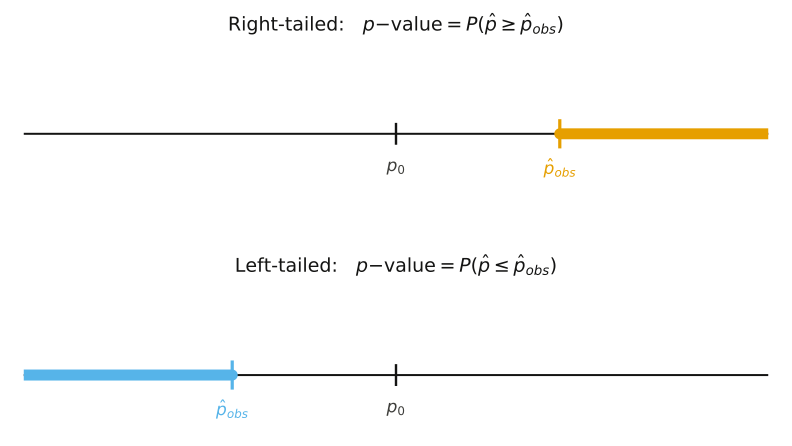
```


For the two-sided test $H_a: p \neq p_0$, the $H_a$ support consists
of values in both tails of the null distribution that are at least the same distance $d$ from $p_0$ as $\hat{p}_{\text{obs}}$ (see @fig-ha-support). Because the normal null distribution is symmetric about $p_0$, these values are symmetrically positioned about $p_0$ . If $\hat{p}_{\text{obs}} > p_0$, the $H_a$ support is the set of values
$\hat{p} \geq \hat{p}_{\text{obs}}$ together with their mirror image
relative to $p_0$ in the left tail. If $\hat{p}_{\text{obs}} < p_0$,
the $H_a$ support is the set of values $\hat{p} \leq \hat{p}_{\text{obs}}$
together with their mirror image relative to $p_0$ in the right tail.

```{r, echo=FALSE}
#| label: fig-ha-support
#| fig-cap: "The $H_a$ support for a two-sided test. The shaded segments
#|   show the values of $\\hat{p}$ that are as favorable or more favorable
#|   to $H_a$ than $\\hat{p}_{\\text{obs}}$. The dashed tick marks the
#|   mirror image of $\\hat{p}_{\\text{obs}}$ relative to $p_0$, each being a distance $d$ from $p_0$."
#| fig-alt: "Two number lines illustrating the Ha support for a two-sided
#|   test. In Case 1 where p-hat-obs is greater than pi-0, the Ha support
#|   is highlighted in orange on the right tail beyond p-hat-obs and the
#|   left tail beyond its mirror image. In Case 2 where p-hat-obs is less
#|   than pi-0, the Ha support is highlighted in blue on the left tail
#|   beyond p-hat-obs and the right tail beyond its mirror image."
#| out-width: "85%"

```

Once the $H_a$ support has been identified, the p-value is the probability, assuming $H_0$ is true, that $\hat{p}$ falls in the $H_a$ support. For the large-sample method, we compute this probability using the normal null distribution at the boundary value $p=p_0$. Thus,
$$
\text{p-value} = P(\hat{p}\text{ is in the $H_a$ support), assuming that $p=p_0$}.
$$
Recall from @sec-foundations-boundary why we use the boundary value $p=p_0$. A more detailed explanation is provided in the optional @sec-closer-look-cr-pvalue.

::: {.callout-note appearance="minimal"}
## p-value for the Large Sample Test

All probabilities are computed using the null distribution
$\hat{p} \sim N\!\left(p_0,\, \sqrt{p_0(1-p_0)/n}\right)$.

| Alternative Hypothesis | $H_a$ Support | p-value |
|---|---|---|
| $H_a: p > p_0$ | $\hat{p} \geq \hat{p}_{\text{obs}}$ | $P(\hat{p} \geq \hat{p}_{\text{obs}})$ |
| $H_a: p < p_0$ | $\hat{p} \leq \hat{p}_{\text{obs}}$ | $P(\hat{p} \leq \hat{p}_{\text{obs}})$ |
| $H_a: p \neq p_0$, if $\hat{p}_{\text{obs}} > p_0$ | $\hat{p} \geq \hat{p}_{\text{obs}}$ and its mirror relative to $p_0$ | $2 \times P(\hat{p} \geq \hat{p}_{\text{obs}})$ |
| $H_a: p \neq p_0$, if $\hat{p}_{\text{obs}} < p_0$ | $\hat{p} \leq \hat{p}_{\text{obs}}$ and its mirror relative to $p_0$ | $2 \times P(\hat{p} \leq \hat{p}_{\text{obs}})$ |
:::

As explained in @sec-foundations-pvalue, we compare the p-value to the significance level $\alpha$ to make our decision:
$$
\text{If p-value} \leq \alpha, \text{ reject } H_0. \qquad \text{If p-value} > \alpha, \text{ fail to reject } H_0.
$$
Recall that a small p-value means that $\hat{p}_{\text{obs}}$ and values at least as supportive of $H_a$ would be unlikely to occur if $H_0$ were true. Thus, a small p-value provides evidence against $H_0$ and in favor of $H_a$.


The p-value approach also indicates the strength of the evidence: a very small p-value indicates strong evidence against $H_0$, while a p-value just below $\alpha$ indicates weaker evidence.

:::{#exm-inactivity-large-sample}
## Physical Inactivity Among Adults (continued)

Recall @exm-physical-inactivity-ppss. A national health agency hopes that
fewer than 35% of adults in its country are physically inactive. A random
sample of $n = 50$ adults was selected and $x_{\text{obs}} = 10$ were found
to be physically inactive. The hypotheses are:
$$
\begin{cases}
H_0: p \geq 0.35 \\
H_a: p < 0.35
\end{cases}
$$

a. Check the 10-10 rule to see whether the conditions for the normal approximation hold.
b. Determine the $H_a$ support.
c. Write a probability statement that describes the p-value.
d. Use Rguroo's [Proportion Inference]{.fun} function to obtain the p-value, and state your conclusion in the context of the problem using significance level of $\alpha=0.05$.

:::

::: {#inactivity-large-sample-steps .callout-tip .solution-callout collapse="true" icon=false}
## 🔎 Solution

a\. To check the large sample condition, we compute the expected number of
successes and failures under $H_0$. Using the boundary value $p_0 = 0.35$:

$$np_0 = 50 \times 0.35 = 17.5 \geq 10$$


$$n(1 - p_0) = 50 \times 0.65 = 32.5 \geq 10.$$

Both conditions are satisfied, so the large sample normal approximation is appropriate
for this example.

b\. We have $x_{\text{obs}}=10$ and $n=50$, which gives
$$
\hat{p}_{\text{obs}}=\frac{10}{50}=0.20.
$$
Since the alternative hypothesis is $H_a: p<0.35$, smaller values of $\hat{p}$ provide stronger evidence in favor of $H_a$. Therefore, the $H_a$ support consists of all sample proportions less than or equal to the observed value:
$$
\text{\bf{$H_a$ Support:}}\;\; \hat{p} \le 0.20.
$$

c\. The p-value is computed as
$$
\text{p-value} = P\left(\hat{p} \le 0.2),\; \text{ assuming }  p=0.35\right.
$$

d\. Click to expand the box below to see how to use the [Proportion Inference]{.fun}  function to obtain the p-value.

::: {#prop-inference-inactivity-steps .callout-note appearance="simple" collapse="true" icon="none" title="{width=22px style='vertical-align:middle;'} One-Population proportion hypothesis test - Physical Inactivity example"}

1. Open the **Analytics** toolbox in Rguroo.  

2. From the [Analysis]{.dpd} dropdown, select [Proportion Inference]{.fun} → [One Population]{.fun}. This opens the [One Population Proportion Inference]{.dialog} dialog.

3. In the **Data** section of the dialog, enter the following:
   - In the [Factor Label]{.des} textbox, type a label for the categorical variable. In Rguroo, a “factor” refers to a categorical variable. For this example, enter [Physical Activity]{.typein}.
   - In the [Success Label]{.des} textbox, type [Inactive]{.typein}. A success corresponds to an inactive individual.
   - In the [Failure Label]{.des} textbox, type [Active]{.typein}.
   - In the [Sample Size]{.des} textbox, type [50]{.typein}.
   - In the [\# of Successes]{.des} textbox, type [10]{.typein}.

4. In the **Test of Hypothesis** section of the dialog, enter the following:
   - In the [Alternative Hyp. p]{.dpd} dropdown, select [<]{.typein} and enter [0.35]{.typein}.
   - Select the [Large sample z (p=p0)]{.des} checkbox to use the large sample normal distribution method.
   - Leave the [Significance Level]{.des} textbox at the default value of [0.05]{.typein}.

6. Click the preview icon  to view the output.

7. Click the  button and save the result as [PhysicalProp]{.typein}.

::: {.callout-tip .inner-callout collapse="true" title="Rguroo One-Population Proportion dialogs"}

::: {#fig-inactivity-rguroo fig-cap="Rguroo One-Population Proportion dialog for the Physical Inactivity example."}
```{r,echo=FALSE}
#| fig-alt: "Rguroo One-Population Proportion dialog configured for the Physical Inactivity Use example with sample size 50, observed count 10, hypothesized proportion 0.35, and left-tailed alternative."
#| out-width: "100%"
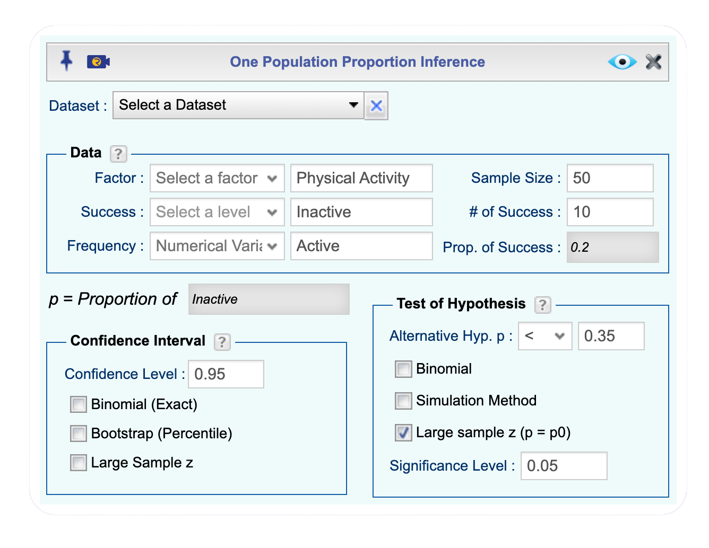
```
:::

:::

:::

Click to expand the box below to see the Rguroo output.

::: {.callout-tip .inner-callout collapse="true" title="Rguroo output: One-Population Proportion Inference - Physical Inactivity"}

<div tabindex="0" class="rg-iframe-wrapper">
  <iframe
    src="Rguroo_html_output/Proportion Inference/Physical_inactivity_ztest_docx/Physical_inactivity.html"
    class="rg-iframe"
    title="Rguroo output: One Population Proportion Hypothesis Test - Physical Inactivity Example">
  </iframe>
</div>

:::

@fig-inactivity-pvalue is the p-value graph from the Rguroo output with its left panel showing the p-value graph in the scale of the data. The red colored area corresponds to the $H_a$ support, consisting of all sample proportions $\hat{p} \le 0.20$. The area under the curve over this region is the p-value, 0.01308. Since this p-value is less than the significance level of 0.05, we reject $H_0$ and conclude that there is sufficient evidence to support the claim that fewer than 35% of adults in the population are physically inactive.

```{r,echo=FALSE}
#| fig-alt: "A bell-shaped curve labeled “Observed Data Scale” with the horizontal axis showing the proportion of “Yes.” The left tail of the curve is shaded red to represent the p-value region. A green triangle marks the observed sample proportion at 0.20, located in the left tail. The legend indicates “Observed Sample Prop = 0.2” and “p-value = 0.013083."
#| label: fig-inactivity-pvalue
#| fig-cap: "A Portion of Rguroo Output: p-value Graph for the Physical Inactivity Example"
#| out-width: "80%"
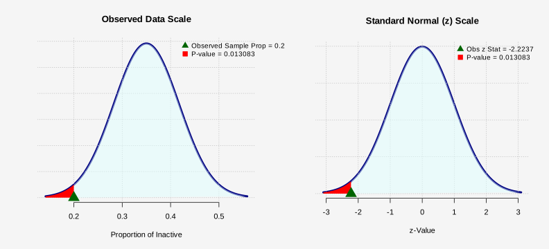
```

:::

:::{#exm-social-media-pvalue-large-sample}
## Social Media as a Primary News Source (continued)

Recall @exm-social-media-news-ppss, where a Pew Research Center report stated that 36% of U.S. adults ages 18–29 say they regularly get news from social media. A university administration was unsure whether the same percentage applied to students at their university. Thus, they set out to test the hypotheses
$$
\begin{cases}
H_0: p = 0.36 \\
H_a: p \neq 0.36.
\end{cases}
$$
To investigate this claim, the university initially took a sample of 15 students. However, they realized that this sample was too small to apply the large-sample test. So, they increased their sample to 35 students. In their sample of 35 students, they found that 21 students stated that they regularly get news from social media. 

a. Check the 10-10 rule to determine whether the conditions for the normal approximation hold.
b. Determine the $H_a$ support.
c. Write a probability statement that describes the p-value.
d. Use Rguroo's [Proportion Inference]{.fun} function to obtain the p-value, and state your conclusion in the context of the problem using significance level of $\alpha=0.01$.

:::

::: {#social-media-large-sample-steps .callout-tip .solution-callout collapse="true" icon=false}
## 🔎 Solution

a\. To check the large sample condition, we compute the expected number of
successes and expected number of failures under $H_0$. Using the boundary value $p_0 = 0.36$:

$$np_0 = 35 \times 0.36 = 12.6 \geq 10$$


$$n(1 - p_0) = 35 \times 0.64 = 22.4 \geq 10.$$

Both conditions are satisfied, so the large sample normal approximation is appropriate
for this example.

b\. We have $x_{\text{obs}}=21$ and $n=35$, which gives
$$
\hat{p}_{\text{obs}}=\frac{21}{35}=0.60.
$$
Since $p_0=0.36$, and $\hat{p}_{\text{obs}}=0.60$, the $H_a$ support is given by

$$
\text{\bf{$H_a$ Support:}}\;\; \hat{p} \geq 0.60 \text{ or } \hat{p} \leq 0.12. 
$$

```{r, echo=FALSE}
#| label: fig-ha-support-example
#| fig-cap: Two-sided $H_a$ support for $p_0=0.36$ and $\hat{p}_{\text{obs}} = 0.60$. 
#| fig-alt: "Number line showing the null value p0 = 0.36 marked with a black tick in the center. Two orange line segments extend outward from p₀: the right segment starts at the observed proportion p-hat-observed = 0.60 and continues to the end of the line, and the left segment starts at the beginning of the line and ends at the mirrored value 0.12. Double-headed arrows below the line show that both 0.60 and 0.12 are exactly 0.24 away from p₀ = 0.36, marking the rejection region for the two-sided alternative hypothesis."
#| out-width: "85%"
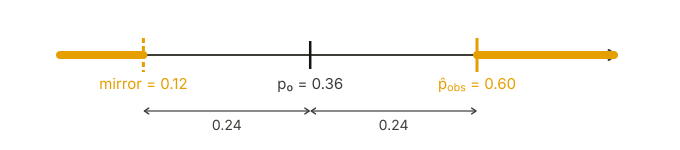
```

Note that the value $0.12$ is the same distance from $p_0=0.36$ as our observed value of $0.60$.

c\. The p-value is computed as
$$
\begin{aligned}
\text{p-value}
&= P\left(\hat{p} \le 0.12\right) + P\left(\hat{p} \ge 0.60\right) \\
&= 2\times P\left(\hat{p} \ge 0.60\right), \qquad \text{assuming } p=0.36.
\end{aligned}$$
The last equalty holds, since the normal distribution is symmetric about $p_0=0.36$,

d\. Click to expand the box below to see how to use the [Proportion Inference]{.fun}  function to obtain the p-value.

::: {#prop-inference-social-media-pvalue-ls .callout-note appearance="simple" collapse="true" icon="none" title="{width=22px style='vertical-align:middle;'} One-Population proportion hypothesis test - Social Media News Source example"}

1. Open the **Analytics** toolbox in Rguroo.  

2. From the [Analysis]{.dpd} dropdown, select [Proportion Inference]{.fun} → [One Population]{.fun}. This opens the [One Population Proportion Inference]{.dialog} dialog.

3. In the **Data** section of the dialog, enter the following:
   - In the [Factor Label]{.des} textbox, type a label for the categorical variable. In Rguroo, a “factor” refers to a categorical variable. For this example, enter [Uses Social Media News]{.typein}.
   - In the [Success Label]{.des} textbox, type [Yes]{.typein}. A success corresponds to astudent who use social media as their source of news.
   - In the [Failure Label]{.des} textbox, type [No]{.typein}.
   - In the [Sample Size]{.des} textbox, type [35]{.typein}.
   - In the [\# of Successes]{.des} textbox, type [21]{.typein}.

4. In the **Test of Hypothesis** section of the dialog, enter the following:
   - In the [Alternative Hyp. p]{.dpd} dropdown, select [!=]{.typein} and enter [0.36]{.typein}.
   - Select the [Large sample z (p=p0)]{.des} checkbox to use the large sample normal distribution method.
   - In the [Significance Level]{.des} textbox enter [0.01]{.typein}.

6. Click the preview icon  to view the output.

7. Click the  button and save the result as [SocialMediaNews]{.typein}.

::: {.callout-tip .inner-callout collapse="true" title="Rguroo One-Population Proportion dialog"}

::: {#fig-inactivity-rguroo fig-cap="Rguroo One-Population Proportion dialog for the Social Media News Example."}
```{r,echo=FALSE}
#| fig-alt: "Rguroo One-Population Proportion dialog configured for the Social Media News example with sample size 30, observed count 21, hypothesized proportion 0.36, and two-sided alternative."
#| out-width: "100%"
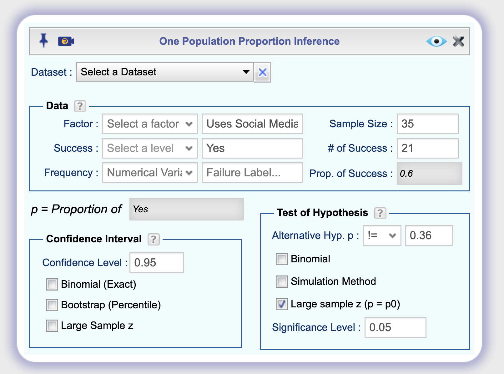
```
:::

:::

:::

Click to expand the box below to see the Rguroo output.

::: {.callout-tip .inner-callout collapse="true" title="Rguroo output: One-Population Proportion Inference - Social Media News"}

<div tabindex="0" class="rg-iframe-wrapper">
  <iframe
    src='Rguroo_html_output/Proportion Inference/prop-inference-social-media-ztest/SocialMediaNews.html'
    class="rg-iframe"
    title="Rguroo output: One Population Proportion Hypothesis Test - Social Media News Example">
  </iframe>
</div>

:::

@fig-social-media-pvalue-ls is the p-value graph from the Rguroo output. The left panel shows the p-value graph on the scale of the data. The red colored areas in both tails correspond to the $H_a$ support, consisting of all sample proportions $\hat{p} \le 0.12$ and $\hat{p} \ge 0.6$. The area under the curve over these regions is the p-value 0.003096. Since this p-value is less than the significance level of 0.01, we reject $H_0$ and conclude that there is sufficient evidence to support the claim that the proportion of students who use social media as their news source is not 36%.

```{r,echo=FALSE}
#| fig-alt: "A bell-shaped curve labeled “Observed Data Scale” with the horizontal axis showing the proportion of “Yes.” The left tail of the curve is shaded red to represent the p-value region. A green triangle marks the observed sample proportion at 0.20, located in the left tail. The legend indicates “Observed Sample Prop = 0.6” and “p-value = 0.003096."
#| label: fig-social-media-pvalue-ls
#| fig-cap: "A Portion of Rguroo Output: p-value Graph for the Social Media News Example"
#| out-width: "80%"
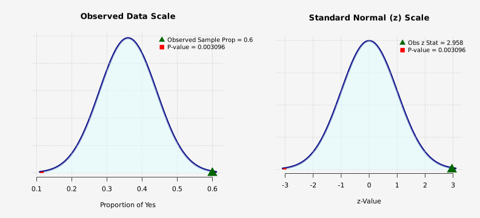
```

:::


**Using Raw Data**

So far, we have performed proportion inference using a summary of the sample, namely the sample size $n$ and the observed count $x_{\text{obs}}$. In practice, however, we often work directly with a raw dataset rather than a pre-computed summary. Now, we show how to perform proportion inference from raw data using Rguroo.

We illustrate this using data from the General Social Survey (GSS), one of the longest-running and most widely used surveys in the United States. Conducted by NORC at the University of Chicago, the GSS has collected data on the attitudes, behaviors, and characteristics of American adults since 1972, covering topics such as social values, political views, religion, and lifestyle. The dataset that we use here, [GSS2024]{.data}, is a subset of the 2024 GSS data. After removing observations with missing values, the dataset contains $n = 388$ respondents.


:::{#exm-gss-marijuana-pvalue}
## Marijuana Legalization: p-Value Approach Using Raw Data

The [GSS2024]{.data} dataset contains responses from $n = 399$ adults in the United States. The variable [Grass]{.var} records whether each respondent supports the legalization of marijuana, with possible responses of *Yes* (supports legalization) or *No* (does not support legalization). A researcher claims that more than 70% of American adults support the legalization of marijuana, that is, $H_a: p > 0.70$.

a. Check the 10-10 rule to determine whether the conditions for the normal approximation hold.
b. Determine the $H_a$ support.
c. Write a probability statement that describes the p-value.
d. Use Rguroo's [Proportion Inference]{.fun} function to obtain the p-value, and state your conclusion in the context of the problem using significance level of $\alpha=0.05$.

 The dataset for this example is available in the Rguroo dataset repository [Kozak]{.repo}, with the dataset name [GSS2024]{.data}. @tbl-GSS2024 displays the first six rows of the dataset. A complete description of the variables is provided in the [dataset code book](#code-book-gss2024) that follows.

:::

```{r , echo=FALSE}
#| tbl-alt: "Head of GSS2024 Dataset"
#| label: tbl-GSS2024
#| tbl-cap: "A subset of the 2024 General Social Survey (GSS) data"
GSS <- read.csv( 'Datasets Revised or New/GSS2024.csv') 
knitr::kable(head(GSS))
```

::: {#code-book-gss2024 .callout-tip .codebook collapse="true"}

## Code book for Dataset GSS2024
Dataset Name: [GSS2024]{.data}

This dataset is a subset of the 2024 General Social Survey (GSS) data, obtained from NORC at the University of Chicago. After removing observations with missing values, the dataset contains $n = 399$ individuals.

The variables included in this dataset are described below.

[Age]{.var}: Age of the respondent (in years). 

[Sex]{.var}: Sex of the respondent

  - Male  
  - Female  

[Degree]{.var}:   Highest degree earned by the respondent.

  - No HS (Less than high school) 
  - HS (High school)  
  - JC (Junior college) 
  - Bachelor (Bachelor's degree) 
  - Graduate (Graduate degree) 

[Race]{.var}: Race of the respondent

  - White  
  - Black  
  - Other  

[Grass]{.var}: Respondent's opinion on whether marijuana should be made legal 

  - Yes (supports legalization)  
  - No (does not support legalization)

[Life]{.var}: Respondent's general satisfaction with life

  - Very satisfied  
  - Pretty satisfied  
  - Not too satisfied 

[Tax]{.var}: Respondent's opinion on whether taxes are too high

  - High (Too high) 
  - OK (About right) 
  - Low (Too low) 

[Mode]{.var}: Mode of data collection

  - In-person  
  - Phone  
  - Web  

**Source**

Smith, T. W., Davern, M., Freese, J., & Morgan, S. L. *General Social Survey, 1972–2024*. NORC at the University of Chicago. <https://gss.norc.org>

:::

::: {#prop-inference-gss2024-pvalue-solution .callout-tip .solution-callout collapse="true" icon=false}
## 🔎 Solution

a\. To check the large sample condition, we compute the expected number of
successes and expected number of failures under $H_0$. Using the boundary value $p_0 = 0.70$:

$$np_0 = 388 \times 0.70 = 271.6 \geq 10$$


$$n(1 - p_0) = 388 \times 0.30 = 116.4 \geq 10.$$

Both conditions are satisfied, so the normal approximation is appropriate for this example.

b\. From the Rguroo output, we have $x_{\text{obs}}=282$ and $n=388$, which gives
$$
\hat{p}_{\text{obs}}=\frac{282}{388}\approx 0.727.
$$
Since the alternative hypothesis is $H_a: p>0.70$, larger values of $\hat{p}$ provide stronger evidence in favor of $H_a$. Therefore, the $H_a$ support consists of all sample proportions greater than or equal to the observed value:
$$
\text{\bf{$H_a$ Support:}}\;\; \hat{p} \ge 0.727.
$$

c\. The p-value is computed as 
$$
\text{p-value} = P\left(\hat{p} \ge 0.727\right), \text{assuming } p=0.70.
$$

d\. Click to expand the box below to see how to use the [Proportion Inference]{.fun}  function to obtain the p-value.

::: {#prop-inference-gss2024-pvalue-ls .callout-note appearance="simple" collapse="true" icon="none" title="{width=22px style='vertical-align:middle;'} One-Population proportion hypothesis test - Marijuana Legalization example"}

Before following the instructions below, make sure to import the GSS2024 dataset from the books dataset repository.

1. Open the **Analytics** toolbox in Rguroo.  

2. From the [Analysis]{.dpd} dropdown, select [Proportion Inference]{.fun} → [One Population]{.fun}. This opens the [One Population Proportion Inference]{.dialog} dialog.

3. From the [Dataset]{.dpd} dropdown select the dataset [GSS2024]{.dataset}.

3. Complete the **Data** section of the dialog as follows:
   - In the [Factor]{.dpd} dropdown, select the variable [Grass]{.var}.
   - In the [Success]{.dpd} dropdown, select [Yes]{.typein}. The sample size, number of successes and proportion of successes textboxes fill-in automatically..

4. In the **Test of Hypothesis** section of the dialog, enter the following:
   - In the [Alternative Hyp. p]{.dpd} dropdown, select []>]{.typein} and enter [0.7]{.typein}.
   - Select the [Large sample z (p=p0)]{.des} checkbox to use the large sample normal distribution method.
   - In the [Significance Level]{.des} textbox enter [0.05]{.typein} (this is the default value).

6. Click the preview icon  to view the output.

7. Click the  button and save the result as [GSS2024Pvalue]{.typein}.

::: {.callout-tip .inner-callout collapse="true" title="Rguroo One-Population Proportion dialog"}

::: {#fig-GSS2024-rguroo fig-cap="Rguroo One-Population Proportion dialog for the Marijuana Legalization (GSS2024) Example."}
```{r,echo=FALSE}
#| fig-alt: "Rguroo One-Population Proportion dialog configured for the Marijuana Legalization example with sample size 388, observed count 282, hypothesized proportion 0.70, and right-tailed alternative."
#| label: fig-GSS2024_prop_normal_dialog
#| out-width: "85%"
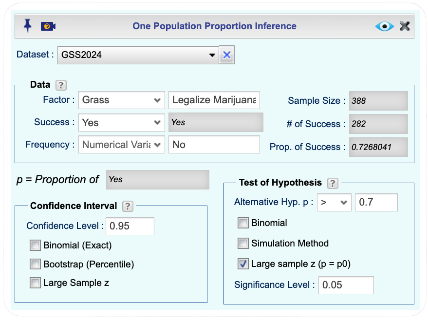
```
:::

:::

:::


Click to expand the box below to see the Rguroo output.

::: {.callout-tip .inner-callout collapse="true" title="Rguroo output: One-Population Proportion Inference - Marijuana Legalization"}
<div tabindex="0" class="rg-iframe-wrapper">
  <iframe
    src="Rguroo_html_output/Proportion Inference/GSS2024PropNormal_docx/GSS2024PropNormal.html"
    class="rg-iframe"
    title="Rguroo output: One Population Proportion Hypothesis Test - Marijuana Legalization Example">
  </iframe>
</div>
:::

The left panel of @fig-GSS2024_pvalue shows the p-value graph from the Rguroo output in the scale of the data. The red colored area corresponds to the $H_a$ support, consisting of all sample proportions $\hat{p} \ge 0.7268$. The area under the curve over this region is the p-value, 0.12463, as shown in the graph. Since this p-value is greater than the significance level of 0.05, we fail to reject $H_0$ and conclude that there is not sufficient evidence to support that more than 70% of American adults support the legalization of marijuana.

```{r,echo=FALSE}
#| fig-alt: "A bell-shaped curve labeled “Observed Data Scale” with the horizontal axis showing the proportion of “Yes.” The right tail of the curve is shaded red to represent the p-value region. A green triangle marks the observed sample proportion at 0.7268, located just below the red shaded critical region. The legend indicates “Observed Sample Prop = 0.7268” and “p-value = 0.12463."
#| fig-cap: "A portion of Rguroo output: p-value Graph for the Marijuana Legalization Example"
#| label: fig-GSS2024_pvalue
#| out-width: "80%"
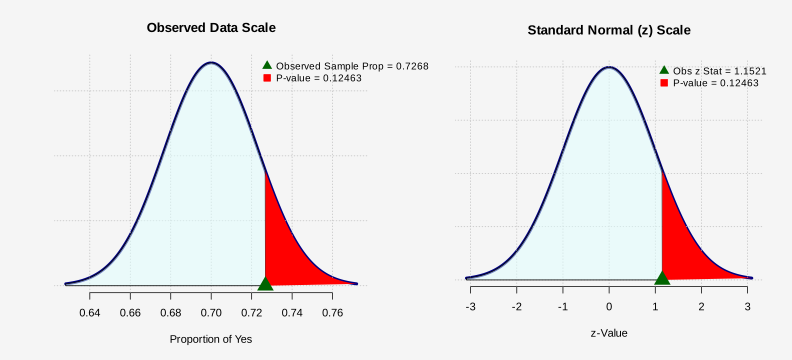
```
:::
:::

### Decision Based on a Critical Region {#sec-large-sample-cr}

We now turn to the **critical region approach**, the other standard way to reach a decision. Recall from  @sec-foundations-critical-region that the critical region is the set of values of the statistic for which we reject $H_0$ in favor of $H_a$. Whereas the p-value approach summarizes the evidence with a probability computed from the observed proportion $\hat{p}_{\text{obs}}$, the critical region approach decides *in advance* which values of $\hat{p}$ are extreme enough to reject $H_0$, and then simply checks whether $\hat{p}_{\text{obs}}$ falls in the critical region.

The decision is governed by a **decision rule**: a rule that specifies which values of $\hat{p}$ lead to rejecting $H_0$. For a one-sided test with $H_a: p > p_0$, large values of $\hat{p}$ favor the alternative hypothesis, so the critical region lies in the right tail of the null distribution. To determine the critical region, we use the distribution of $\hat{p}$ under the null hypothesis $p=p_0$, namely
$$
\hat{p}\sim N\left(p_0, \sqrt{\frac{p_0(1-p_0)}{n}}\right).
$$
We choose the critical value so that the probability of falling in the critical region when $H_0$ is true equals the significance level $\alpha$. The shape of the critical region — right tail, left tail, or both — depends on the alternative hypothesis, as shown in @fig-critical-regions.

```{r,echo=FALSE}
#| fig-alt: "Three normal curves centered at p0, each with axis labeled p-hat. Top: right-tailed test with the region to the right of c shaded orange, area alpha. Middle: left-tailed test with the region to the left of c shaded sky blue, area alpha. Bottom: two-tailed test with the region to the left of c1 shaded sky blue and the region to the right of c2 shaded orange, each area alpha/2."
#| fig-cap: 'Critical regions for right-tailed, left-tailed, and two-tailed tests on the null distribution of $\hat{p}$.'
#| label: fig-critical-regions
#| out-width: "95%"

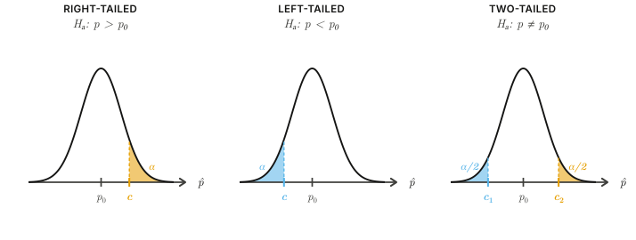
```


For the right-tailed test, we find the critical value $c$ so that there is probability $\alpha$ in the right tail:
$$
P(\hat{p} \geq c)=\alpha.
$$
We then reject $H_0$ if the observed sample proportion satisfies $\hat{p}_{\text{obs}} \geq c$.

Similarly, for a one-sided test with $H_a: p < p_0$, small values of $\hat{p}$ favor the alternative hypothesis, so the critical region lies in the left tail. We find $c$ such that
$$
P(\hat{p} \leq c)=\alpha,
$$
and reject $H_0$ if $\hat{p}_{\text{obs}} \leq c$.

For a two-sided test with $H_a: p \neq p_0$, both unusually small and unusually large values of $\hat{p}$ favor the alternative hypothesis. The critical region therefore lies in both tails. We find lower and upper critical values, $c_1$ and $c_2$, that leave probability $\alpha/2$ in each tail:
$$
P\left(\hat{p} \leq c_1 \right)=\frac{\alpha}{2}
\qquad\text{and}\qquad
P\left(\hat{p} \geq c_2 \right)=\frac{\alpha}{2}.
$$
We reject $H_0$ if $\hat{p}_{\text{obs}} \leq c_1$ or $\hat{p}_{\text{obs}} \geq _U$.

::: {.callout-note appearance="minimal"}
## Critical Region for the Large Sample Test

All critical values are found using the null distribution
$\hat{p} \sim N\!\left(p_0,\, \sqrt{p_0(1-p_0)/n}\right)$.

| Alternative Hypothesis | Critical Region | Critical Value Condition |
|---|---|---|
| $H_a: p > p_0$ | $\hat{p}_{\text{obs}} \geq \hat{p}^*$ | $P(\hat{p} \geq \hat{p}^*) = \alpha$ |
| $H_a: p < p_0$ | $\hat{p}_{\text{obs}} \leq \hat{p}^*$ | $P(\hat{p} \leq \hat{p}^*) = \alpha$ |
| $H_a: p \neq p_0$ | $\hat{p}_{\text{obs}} \leq \hat{p}^*_L$ or $\hat{p}_{\text{obs}} \geq \hat{p}^*_U$ | $P(\hat{p} \leq \hat{p}^*_L) = P(\hat{p} \geq \hat{p}^*_U) = \alpha/2$ |
:::

In practice, we will use Rguroo's [One-Population Proportion]{.fun} inference function to find the critical region, as shown in the following examples.


:::{#exm-inactivity-large-sample-cr}
## Physical Inactivity Among Adults (continued)

Recall @exm-physical-inactivity-ppss. A national health agency hopes that fewer than 35% of adults in its country are physically inactive. A random sample of $n = 50$ adults was selected and $x_{\text{obs}} = 10$ were found to be physically inactive. The hypotheses are:
$$
\begin{cases}
H_0: p \geq 0.35 \\
H_a: p < 0.35
\end{cases}
$$

Use Rguroo's [Proportion Inference]{.fun} function to obtain the critical region, and state your conclusion in the context of the problem.
:::

::: {#inactivity-large-sample-steps-cr .callout-tip .solution-callout collapse="true" icon=false}
## 🔎 Solution

As we have seen than the 10-10 rule is satisfied for this example, since 
$np_0 = 50 \times 0.35 = 17.5 > 10$ and  $n(1 - p_0) = 50 \times 0.65 = 32.5 > 10.$

To obtain critical regions in Rguroo, we use the same Rguroo steps as shown in the [solution](#inactivity-large-sample-steps) of   @exm-inactivity-large-sample with the following additional steps, before you click on the preview icon :

::: {#cr-rguroo-steps-large-sample .callout-note appearance="simple" icon="none" title="{width=22px style='vertical-align:middle;'} Rguroo steps to display the critical region"}

- Click the [Details]{.des} button to open the [Advanced Features]{.dialog} dialog.
- Click on the [Test of Hypothesis]{.tab} tab, and in the **Graphs** section select [Critical Region Graph]{.des}.
- (optional) Uncheck the default [p-value Graph]{.des}.

```{r,echo=FALSE}
#| fig-alt: "Rguroo Advanced Features dialog showing the Confidence Interval and Test of Hypothesis tab. In the Graphs section, the Critical Region Graph option is selected."
#| label: fig-advanced-features-cr-large-sample
#| fig-cap: "Rguroo Advanced Features dialog with Critical Region Graph selected"
#| out-width: "70%"
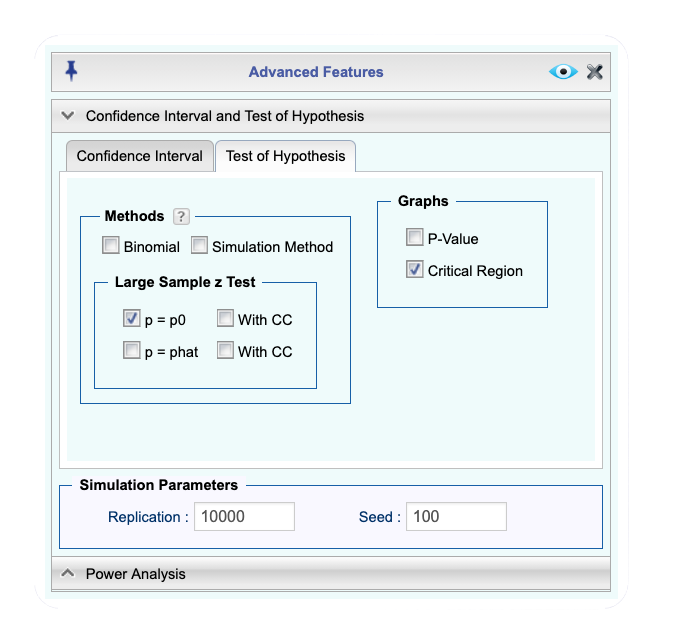
```
:::

Click to expand the box below to see the Rguroo output.

::: {.callout-tip .inner-callout collapse="true" title="Rguroo output: One-Population Proportion Inference - Physical Inactivity"}

<div tabindex="0" class="rg-iframe-wrapper">
  <iframe
    src="Rguroo_html_output/Proportion Inference/Physical_inactivity_ztest_cr_docx/Physical_inactivity_ztest_cr.html"
    class="rg-iframe"
    title="Rguroo output: One Population Proportion Hypothesis Test - Physical Inactivity Example">
  </iframe>
</div>

:::

The left panel of @fig-inactivity-cr displays the critical region graph in the scale of the data, shown in the Rguroo output. The red shaded region corresponds to the critical region and consists of all sample proportions
$$
\hat{p} \le 0.23905,
$$
shown below the graph. 

The probability associated with the red-colored region is the significance level, 0.05. Since the observed sample proportion, $\hat{p}_{\text{obs}}=0.20$ (shown by the green up-right triangle), falls within the critical region, we reject $H_0$ and conclude that there is sufficient evidence to support the claim that fewer than 35% of adults in the population are physically inactive.

```{r,echo=FALSE}
#| fig-alt: "Two normal-distribution curves illustrating a left-tailed critical region. In each panel, the left tail is shaded red to represent the critical region, while the remaining area under the curve is shaded light blue. A green triangle marks the observed sample proportion. In the left panel, the observed value lies outside the critical region. In the right panel, the observed value lies inside the critical region, leading to rejection of the null hypothesis."
#| label: fig-inactivity-cr
#| fig-cap: "Left-tailed critical regions for a large-sample proportion test. We reject $H_0$ when the observed sample proportion falls in the red critical region."
#| out-width: "80%"
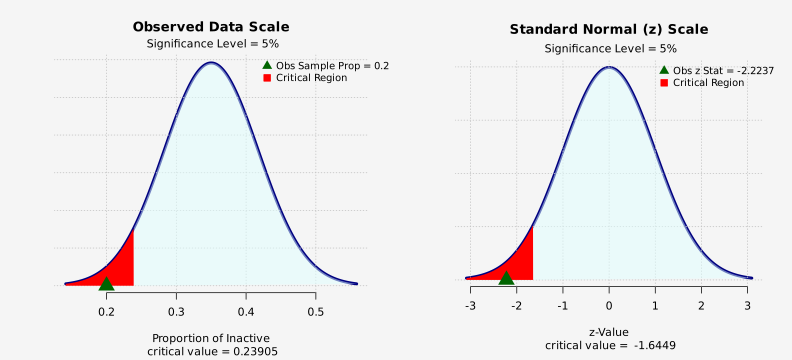
```

:::

:::{#exm-gss-large-sample-cr}
## Marijuana Legalization (continued)

Recall @exm-gss-marijuana-pvalue. A researcher claims that more than 70% of American adults support the legalization of marijuana. Using the [GSS2024]{.data} dataset, which contains responses from $n = 388$ respondents, $x_{\text{obs}} = 282$ answered *Yes* to supporting legalization. The hypotheses are:
$$
\begin{cases}
H_0: p \leq 0.70 \\
H_a: p > 0.70
\end{cases}
$$

Use Rguroo's [Proportion Inference]{.fun} function to obtain the critical region, and state your conclusion in the context of the problem using significance level $\alpha = 0.05$.
:::

::: {.callout-tip .solution-callout collapse="true" icon=false}
## 🔎 Solution

As we have seen that the 10-10 rule applies for this example, since 
$np_0 = 388 \times 0.70 = 271.6 > 10$ and 
$n(1 - p_0) = 388 \times 0.30 = 116.4 > 10.$

To obtain critical regions in Rguroo, we use the same Rguroo steps as shown in the [solution](#prop-inference-gss2024-pvalue-solution) of   @exm-gss-large-sample-cr with the following additional steps, before you click on the preview icon :


::: {.callout-note appearance="simple" icon="none" title="{width=22px style='vertical-align:middle;'} Rguroo steps to display the critical region"}

- Click the [Details]{.des} button to open the [Advanced Features]{.dialog} dialog.
- Click on the [Test of Hypothesis]{.tab} tab, and in the **Graphs** section select [Critical Region Graph]{.des}.
- (optional) Uncheck the default [p-value Graph]{.des}.

```{r,echo=FALSE}
#| fig-alt: "Rguroo Advanced Features dialog showing the Confidence Interval and Test of Hypothesis tab. In the Graphs section, the Critical Region Graph option is selected."
#| label: fig-advanced-features-cr-large-sample2
#| fig-cap: "Rguroo Advanced Features dialog with Critical Region Graph selected"
#| out-width: "70%"

```
:::

Click to expand the box below to see the Rguroo output.

::: {.callout-tip .inner-callout collapse="true" title="Rguroo output: One-Population Proportion Inference - Marijuana Legalization "}

<div tabindex="0" class="rg-iframe-wrapper">
  <iframe
    src="Rguroo_html_output/Proportion Inference/GSS2024_ztest_cr_docx/GSS2024_ztest_cr.html"
    class="rg-iframe"
    title="Rguroo output: One Population Proportion Hypothesis Test - Marijuana Legalization Example">
  </iframe>
</div>

:::

The left panel of @fig-GSS2024-cr from the Rguroo output shows the critical region graph on the scale of the data. The red shaded region corresponds to the critical region and consists of all sample proportions
$\hat{p} \ge 0.73827$.

The probability associated with this region is the significance level, $\alpha = 0.05$. Since the observed sample proportion, $\hat{p}_{\text{obs}}=0.7268$ (displayed by the green triangle), does not fall within the critical region, we fail to reject $H_0$ and conclude that there is not sufficient evidence to support that more than 70% of American adults support the legalization of marijuana.

```{r,echo=FALSE}
#| fig-alt: "Two normal-distribution graphs illustrating a right-tailed critical region. In both graphs, the red shaded area in the right tail represents the critical region. A green triangle on the horizontal axis marks the critical value that defines the boundary of the critical region, and a second green triangle marks the observed sample proportion. In the left graph, the observed value lies outside the critical region, so the null hypothesis is not rejected. In the right graph, the observed value lies inside the critical region, so the null hypothesis is rejected."
#| label: fig-GSS2024-cr
#| fig-cap: "Right-tailed critical regions for a large-sample proportion test. We reject $H_0$ when the observed sample  falls in the red critical region."
#| out-width: "80%"
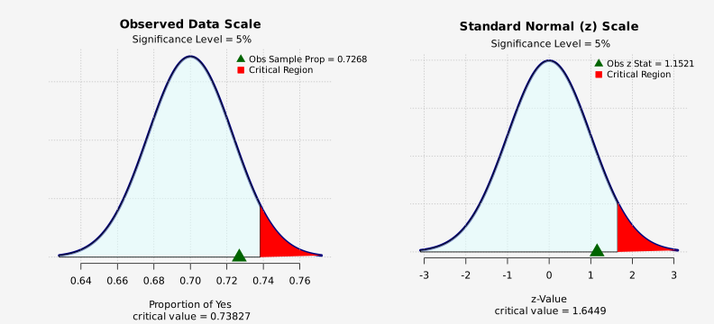
```

:::

### Homework for Section @sec-large-sample-one-prop

For each of the scenarios described below,
use Rguroo's [One-Population Proportion]{.fun} inference function with the [Large Sample z (p=p0)]{.des} option to carry out the hypothesis test at
the given significance level. Before running the analysis, check whether
the large sample condition is satisfied. If it is, continue with the following instructions:

**(a)** Before running the analysis, identify the following inputs for the Rguroo dialog:

- [Factor Label]{.des}: A descriptive name for the variable being studied  
- [Success]{.des}: The outcome that counts as a success  
- [Failure]{.des}: The outcome that counts as a failure  
- [Sample Size]{.des}: The value of $n$  
- [\# of Successes]{.des}: The value of $x_{\text{obs}}$  
- [Proportion of ...]{.des}: A descriptive label for what the population proportion represents  

**(b)** State the null and alternative hypotheses.

**(c)** Carry out the test using the **critical region (rejection region) approach**:  
&nbsp;&nbsp;&nbsp;&nbsp;(i) Specify the critical region.  
&nbsp;&nbsp;&nbsp;&nbsp;(ii) Identify $x_{\text{obs}}$ and determine whether you reject or fail to reject $H_0$.

**(d)** Carry out the test using the **p-value approach**:  
&nbsp;&nbsp;&nbsp;&nbsp;(i) Specify the $H_a$ support.  
&nbsp;&nbsp;&nbsp;&nbsp;(ii) State the p-value and determine whether you reject or fail to reject $H_0$.

**(e)** State your conclusion in the context of the problem.
---

1. **Arizona Marijuana Legalization**
In Problem 1 (Arizona Marijuana Legalization) of @sec-stage-hw, $p$ is
the true proportion of Arizona registered voters who support marijuana
legalization. Do Arizona registered voters differ from Colorado residents
in their support for marijuana legalization? The sample consisted of
$n = 779$ voters, of whom $x_{\text{obs}} = 390$ favored legalization.
Use $\alpha = 0.05$.

2. **Australian Unemployment Outlook**
In Problem 2 (Australian Unemployment Outlook) of @sec-stage-hw, $p$ is
the true proportion of Australians in November 1997 who believed
unemployment would increase. Did Australian sentiment about unemployment
shift between July and November of 1997? The sample consisted of
$n = 631$ Australians, of whom $x_{\text{obs}} = 284$ believed
unemployment would increase. Use $\alpha = 0.05$.

3. **Arkansas Identity Theft Complaints**
In Problem 3 (Arkansas Identity Theft Complaints) of @sec-stage-hw, $p$
is the true proportion of consumer complaints in Arkansas that were for
identity theft. Was the proportion of identity theft complaints in Arkansas
greater than the national figure of 23%? The sample consisted of
$n = 3{,}482$ complaints, of which $x_{\text{obs}} = 1{,}601$ were for
identity theft. Use $\alpha = 0.10$.

4. **Alaska Identity Theft Complaints**
In Problem 4 (Alaska Identity Theft Complaints) of @sec-stage-hw, $p$
is the true proportion of consumer complaints in Alaska that were for
identity theft. Was Alaska's proportion of identity theft complaints less
than the national proportion of 23%? The sample consisted of
$n = 1{,}432$ complaints, of which $x_{\text{obs}} = 321$ were for
identity theft. Use $\alpha = 0.05$.

5. **Kennedy Assassination Conspiracy Belief**
In Problem 5 (Kennedy Assassination Conspiracy Belief) of @sec-stage-hw,
$p$ is the true proportion of American adults in 2013 who believed there
was a conspiracy behind President Kennedy's assassination. Is there evidence
that American belief in a conspiracy behind President Kennedy's assassination
changed between 2001 and 2013? The sample consisted of $n = 1{,}039$
adults, of whom $x_{\text{obs}} = 634$ believed in a conspiracy.
Use $\alpha = 0.05$.

6. **Autism Spectrum Disorder in Arizona**
In Problem 6 (Autism Spectrum Disorder in Arizona) of @sec-stage-hw, $p$
is the true proportion of children in Arizona diagnosed with ASD. Is the
rate of ASD diagnosis among children in Arizona greater than the national
rate of 1 in 88 children? The sample consisted of $n = 32{,}601$ children,
of whom $x_{\text{obs}} = 507$ were diagnosed with ASD. Use $\alpha = 0.05$.

7. **Graduate Degree Attainment: GSS2024**
In Problem 7 (Graduate Degree Attainment: GSS2024) of @sec-stage-hw, $p$
is the true proportion of U.S. adults who hold a graduate degree. Does the
GSS2024 data provide evidence that the proportion of U.S. adults who hold
a graduate degree differs from the 15% reported by the U.S. Census Bureau?
Use $\alpha = 0.01$.

<div tabindex="0" style="width:85%; margin:auto;">

 The dataset for
this exercise is available in the Rguroo dataset repository [Kozak]{.repo},
with the dataset name [GSS2024]{.data}.

**Code book for Dataset GSS2024 is given [here](#code-book-gss2024).**

</div>

## Exact Binomial Hypothesis Testing {#sec-making-decision-binomial}

In the previous section, we used the large-sample method to carry out a hypothesis test for a population proportion. This method uses the normal distribution to approximate the sampling distribution of $\hat{p}$ and works well when the sample is sufficiently large. We now consider the exact binomial method, which uses the binomial distribution directly and therefore does not require a large-sample approximation. The basic reasoning of the hypothesis test remains the same: we determine how unusual the observed sample result would be if $H_0$ were true and use either the p-value or critical region approach to make a decision.
The main difference is the statistic we use. With the large-sample method, we worked with the sample proportion $\hat{p}$. With the exact binomial method, we work directly with $X$, the number of successes in the sample. Since $\hat{p}=X/n$, these two statistics contain the same information; we are simply expressing the sample result in a different way.

### The Distribution of $X$ {#sec-distribution-x}

To use $X$ for inference, we need to know its probability distribution. Since we are sampling from a population and counting successes, the binomial distribution provides the appropriate model. Recall from @sec-binomial-probability-distribution that a random variable follows a **binomial distribution** when:

- The number of trials $n$ is fixed
- Each trial results in one of two outcomes: success or failure
- The probability of success $p$ is the same for every trial
- The trials are independent of one another

In our sampling context, each individual in the sample either has the characteristic of interest (success) or does not (failure). Since the sample is selected randomly, the trials are independent. The probability of success $p$ is constant—it equals the population proportion. (Strictly speaking, sampling without replacement causes $p$ to change slightly with each draw, but when the sample is small relative to the population, this change is negligible and we treat $p$ as constant.)

Therefore,
$$
X \sim \text{Binomial}(n, p).
$$

This distribution will be the foundation for computing probabilities and making decisions about $p$.

### Decision Based on a  p-Value {#sec-pvalue}


The p-value approach measures *how unusual* the observed count $x_{\text{obs}}$ would be if the null hypothesis were true, and rejects $H_0$ when the data are sufficiently unusual under $H_0$. To make this concrete for a proportion, we evaluate probabilities at the boundary value $p_0$ (see @sec-foundations-boundary), using the binomial distribution of the count $X$.

Using the definition of **$H_a$ support** from @sec-foundations-pvalue, the **$H_a$ support** for the exact binomial method consists of the values of $X$ that are at least as supportive of $H_a$ as the observed value $x_{\text{obs}}$. The p-value then is the probability, assuming $p=p_0$, that $X$ takes a value in the $H_a$ support:

$$
\text{p-value} = P(X \text{ is a value in the } H_a \text{ support),  assuming }  p = p_0.
$$


A small p-value is evidence against $H_0$. 

What counts as "the $H_a$ support" depends on the form of the alternative hypothesis.

::: {.callout-note appearance="simple"}
## Case 1: $H_a: p > p_0$ (e.g., $H_a: p > 0.70$)

Larger values of $X$ are more supportive of $H_a$. The $H_a$ support consists of $x_{\text{obs}}$ and all values larger than $x_{\text{obs}}$, so the p-value is
$$
\text{p-value} = P(X \geq x_{\text{obs}}), \text{ assuming } p = p_0.
$$
:::

To understand Case 1, note that a larger value of $X$ means more successes in the sample, which corresponds to a higher sample proportion $\hat{p}$. A higher sample proportion is less consistent with $H_0$ and more supportive of the claim that the true population proportion exceeds $p_0$. For example, in the YouTube example where $x_{\text{obs}} = 17$ out of $n = 20$, the $H_a$ support consists of the values $\{17, 18, 19, 20\}$ — the observed count and every larger possibility.

::: {.callout-note appearance="simple"}
## Case 2: $H_a: p < p_0$ (e.g., $H_a: p < 0.35$)

Smaller values of $X$ are more supportive of $H_a$. The $H_a$ support consists of $x_{\text{obs}}$ and all values smaller than $x_{\text{obs}}$, so the p-value is
$$
\text{p-value} = P(X \leq x_{\text{obs}}), \text{ assuming } p = p_0.
$$
:::

Case 2 is the mirror image of Case 1: a smaller value of $X$ means fewer successes in the sample, which corresponds to a lower sample proportion $\hat{p}$. A lower sample proportion is less consistent with $H_0$ and more supportive of the claim that the true population proportion is less than $p_0$. For example, in the Physical Inactivity example where $x_{\text{obs}} = 10$ out of $n = 50$, the $H_a$ support is $\{0, 1, 2, \ldots, 9, 10\}$ — the observed count and every smaller possibility.

::: {.callout-note appearance="simple"}
## Case 3: $H_a: p \neq p_0$ (e.g., $H_a: p \neq 0.36$)

A value $x$ is in the $H_a$ support if it is at least as unlikely as the observed value $x_{\text{obs}}$ under $H_0$, that is,
$$
P(X = x) \leq P(X = x_{\text{obs}}), \text{ assuming } p = p_0.
$$

Such values can occur in either tail of the distribution.
:::

The two-sided case is easiest to see in a picture. For the Social Media News example with $x_{\text{obs}} = 9$ out of $n = 15$ and $p_0 = 0.36$, @fig-social-media-pvalue shows the binomial distribution of $X$ under $H_0$, where $X \sim \text{Binomial}(15, 0.36)$.

```{r}
#| label: fig-social-media-pvalue
#| echo: false
#| fig-cap: "Two-sided p-value for the Social Media example; shaded regions represent outcomes at least as unlikely as x_obs = 9 under H0, when p = 0.36."
#| fig-alt: "Bar graph of the binomial distribution X with n = 15 and p = 0.36. The observed value x_obs = 9 is highlighted, and bars corresponding to values X <= 1 and X >= 9 are shaded to show the two-tailed p-value region. The shaded areas represent outcomes at least as unlikely as the observed value under H0, with total probability approximately 0.062."
#| out-width: "60%"
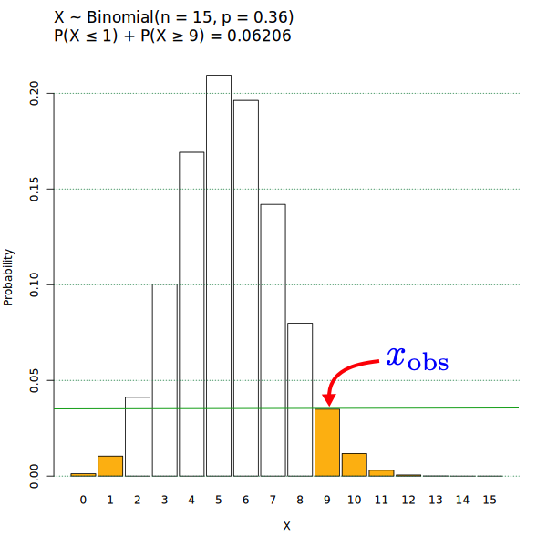
```

The $X$ values corresponding to the orange bars are the values of $X$ whose probability under $H_0$ is at most equal to $P(X = 9)$. Therefore, the $H_a$ support appears in both tails: large values $9, 10, 11, \ldots$ on the right and small values $0, 1$ on the left. The p-value is the total probability of the orange bars.

::: {.callout-note}
## Decision Rule Using the p-Value
When testing at significance level $\alpha$,
$$
\text{If p-value} \leq \alpha, \text{ reject } H_0. \qquad \text{If p-value} > \alpha, \text{ fail to reject } H_0.
$$
:::

The decision rule using the p-value is the same as the one introduced in @sec-foundations-pvalue and used with the large-sample method: we reject $H_0$ when the p-value is less than or equal to the significance level $\alpha$. The interpretation is also the same. A small p-value means that the observed result and results at least as supportive of $H_a$ would be unlikely if $H_0$ were true. The difference is that with the exact binomial method, we express the observed result as the number of successes $x_{\text{obs}}$ and calculate the p-value directly from the binomial distribution of $X$.

In practice, we use statistical software such as Rguroo to compute p-values. Rguroo's [One-Population Proportion]{.fun} inference function carries out a complete hypothesis test from the inputs $n$, $x_{\text{obs}}$, and the form of $H_a$ (including $p_0$). The next four examples illustrate how to obtain the p-value and reach a decision, using our three running examples plus the raw-dataset example from the GSS. 

:::{#exm-youtube-pvalue}
## Daily YouTube Use Among Teens (continued)

Recall @exm-youtube-ppss. A school district claims that more than 70% of students in its district use YouTube daily, that is, $H_a: p > 0.70$. A random sample of $n = 20$ students is selected, and $x_{\text{obs}} = 17$ of them report daily YouTube use. The hypotheses are
$$
\begin{cases}
H_0: p \leq 0.70 \\
H_a: p > 0.70
\end{cases}
$$

Use Rguroo's One-Population Proportion inference function to obtain the p-value, and use it to make a decision at significance level $\alpha = 0.05$.
:::

:::: {#solution-pvalue-youtube-binomial .callout-tip .solution-callout collapse="true" icon=false}
## 🔎 Solution

Our sample of $n = 20$ students yielded $x_{\text{obs}} = 17$ daily users, giving $\hat{p}_{\text{obs}} = 17/20 = 0.85$. We use Rguroo to compute the p-value and decide whether this result is statistically significant.

Click to expand the box below to see how to use the [Proportion Inference]{.fun} function in Rguroo.

::: {#prop-inference-youtube .callout-note appearance="simple" collapse="true" icon="none" title="{width=22px style='vertical-align:middle;'} One-Population proportion hypothesis test — YouTube example"}

1. Open the **Analytics** toolbox in Rguroo.  

2. From the [Analysis]{.dpd} dropdown, select [Proportion Inference]{.fun} → [One Population]{.fun}. This opens the [One Population Proportion Inference]{.dialog} dialog.

3. In the **Data** section of the dialog, enter the following:
   - In the [Factor Label]{.des} textbox, type a label for the categorical variable. In Rguroo, a "factor" refers to a categorical variable. For this example, enter [Daily YouTube Use]{.typein}.
   - In the [Success Label]{.des} textbox, type [Yes]{.typein}. A success corresponds to a student who uses YouTube daily.
   - In the [Failure Label]{.des} textbox, type [No]{.typein}.
   - In the [Sample Size]{.des} textbox, type [20]{.typein}.
   - In the [\# of Successes]{.des} textbox, type [17]{.typein}.

4. In the **Test of Hypothesis** section of the dialog, enter the following:
   - In the [Alternative Hyp. p]{.dpd} dropdown, select [>]{.typein} and enter [0.7]{.typein}.
   - Select the [Binomial]{.des} checkbox to use the binomial distribution.
   - Leave the [Significance Level]{.des} textbox at the default value of [0.05]{.typein}.

5. Click the preview icon  to view the output.

6. Click the  button and save the result as [YoutubeProp]{.typein}.

::: {.callout-tip .inner-callout collapse="true" title="Rguroo One-Population Proportion dialog"}

```{r,echo=FALSE}
#| fig-alt: "Rguroo One-Population Proportion dialog configured for the Daily YouTube Use example with sample size 20, observed count 17, hypothesized proportion 0.70, and right-tailed alternative."
#| fig-cap: "Rguroo One-Population Proportion dialog for the YouTube example"
#| label: fig-youtube-rguroo-dialog
#| out-width: "80%"
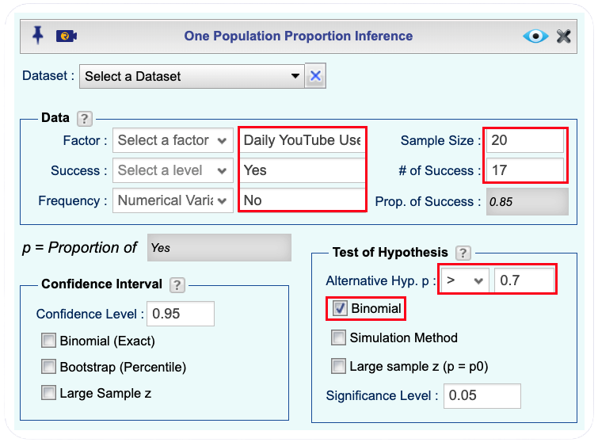
```

:::

:::

Click to expand the box below to see the Rguroo output.

::: {.callout-tip .inner-callout collapse="true" title="Rguroo output: One-Population Proportion Inference — YouTube"}

<div tabindex="0" class="rg-iframe-wrapper">
  <iframe
    src="Rguroo_html_output/Proportion Inference/YoutubeProp_docx/YoutubeProp.html"
    class="rg-iframe"
    title="Rguroo output: One Population Proportion Hypothesis Test - YouTube Example">
  </iframe>
</div>

:::

@fig-youtube-rguroo-pvalue shows the p-value graph from the Rguroo output. The p-value is approximately $0.107$, with $H_a$ support $X \geq 17$, highlighted by the red bars. Since the p-value $0.107 > \alpha = 0.05$, we fail to reject $H_0$. The data do not provide sufficient evidence at the $5\%$ significance level to conclude that more than 70% of students in the district use YouTube daily.

```{r,echo=FALSE}
#| fig-alt: "Bar chart of the binomial distribution for the number of Yes responses under the null hypothesis. The observed count, 17, is marked with a green triangle. Bars for counts 17 and greater are shaded red to indicate the values in the alternative-hypothesis support region. The p-value is shown as P(X greater than or equal to 17) = 0.10709, representing the probability, assuming the null hypothesis is true, of obtaining the observed count or a more extreme count in the direction of the alternative hypothesis."
#| fig-cap: "Binomial distribution under the null hypothesis with observed count 17. The red bars show the $H_a$ support, and their total probability is the p-value."
#| label: fig-youtube-rguroo-pvalue
#| out-width: "80%"
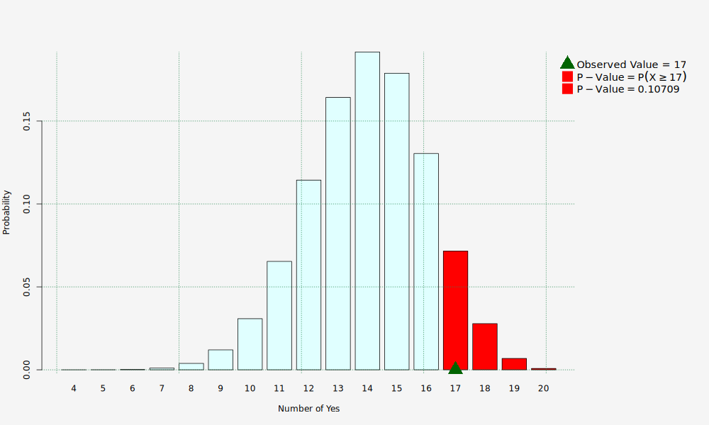
```

::::

:::{#exm-inactivity-pvalue}
## Physical Inactivity Among Adults (continued)

Recall @exm-physical-inactivity-ppss. A national health agency hopes that fewer than 35% of adults in its country are physically inactive, that is, $H_a: p < 0.35$. A random sample of $n = 50$ adults is selected, and $x_{\text{obs}} = 10$ are found to be physically inactive. The hypotheses are
$$
\begin{cases}
H_0: p \geq 0.35 \\
H_a: p < 0.35
\end{cases}
$$

Use Rguroo's One-Population Proportion inference function to obtain the p-value, and use it to make a decision at significance level $\alpha = 0.05$.
:::

:::: {.callout-tip .solution-callout collapse="true" icon=false}
## 🔎 Solution

We use the same instructions as in the [solution](#solution-pvalue-youtube-binomial) of  [the YouTube example](#prop-inference-youtube) to open the [One Population Proportion Inference]{.dialog}. The filled-out dialog for this problem is given in @fig-inactivity-test. We input the [Factor]{.des} (categorical variable) label as [Physical Activity]{.typein}, [Success]{.des} is labeled as [Inactive]{.typein}, since we are using the count of those who are physically inactive, and for the [Failure]{.des} label we use [Active]{.typein}. As shown in @fig-inactivity-test, we have also input the sample size, number of successes, the alternative hypothesis, and selected the method [Binomial]{.des}.

```{r,echo=FALSE}
#| fig-alt: "Rguroo One Population Proportion Inference dialog configured for the Physical Inactivity example, showing a sample size of 50, 10 successes labeled as 'Inactive', alternative hypothesis p < 0.35, binomial method selected, and significance level 0.05."
#| warning: FALSE
#| label: fig-inactivity-test
#| fig-cap: "Rguroo One Population Proportion Inference dialog for performing a hypothesis test for the Physical Inactivity example"
#| out-width: "80%"
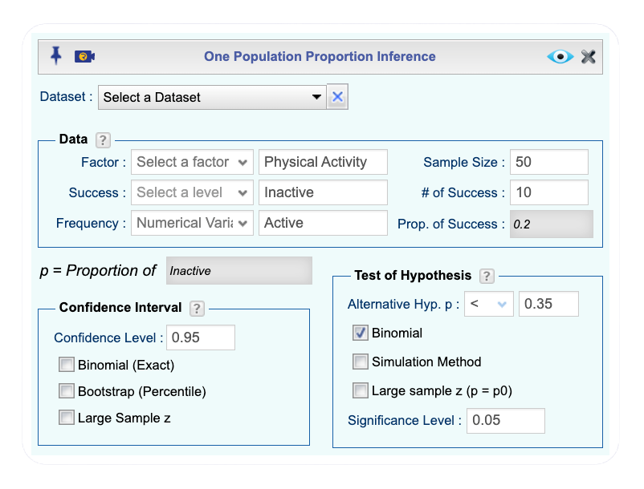
```

Click to expand the box below to see the Rguroo output.

::: {.callout-tip .inner-callout collapse="true" title="Rguroo output: One-Population Proportion Inference — Physical Inactivity"}

<div tabindex="0" class="rg-iframe-wrapper">
  <iframe
    src="Rguroo_html_output/Proportion Inference/Physical_inactivity_docx/Physical_inactivity.html"
    class="rg-iframe"
    title="Rguroo output: One Population Proportion Hypothesis Test - Physical Inactivity Example">
  </iframe>
</div>

:::

@fig-inactivity-test-pvalue shows the Rguroo p-value graph output. As shown in the figure, the p-value is approximately $0.0160$, with $H_a$ support $X \leq 10$, shown by red bars. Since the p-value $0.0160 < \alpha = 0.05$, we reject $H_0$ in favor of $H_a: p < 0.35$. The data provide sufficient evidence at the $5\%$ significance level to conclude that fewer than 35% of adults in the country are physically inactive.

```{r,echo=FALSE}
#| fig-alt: "Bar chart showing the null distribution of the number of inactive individuals under a binomial model with n = 50 and p = 0.35. The observed count of 10 inactive individuals is marked on the graph. Bars for counts 10 and below are highlighted to show the values at least as supportive of the alternative hypothesis that the proportion inactive is less than 0.35. The highlighted area represents the p-value, P(X ≤ 10) = 0.016."
#| warning: FALSE
#| label: fig-inactivity-test-pvalue
#| fig-cap: "Rguroo Output: Binomial null distribution with observed count $x_{obs} = 10$. The highlighted bars show the $H_a$ support, and their total probability is the p-value."
#| out-width: "80%"
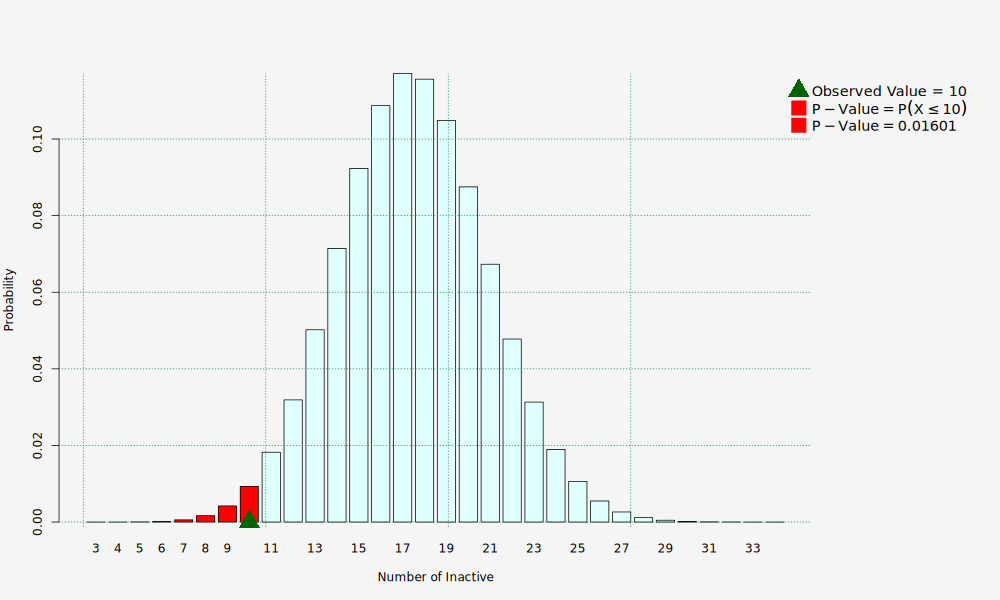
```
::::

:::{#exm-social-pvalue}
## Social Media as a Primary News Source (continued)

Recall @exm-social-media-news-ppss. A university administration wants to determine whether the proportion of students who get most of their news from social media differs from 36%, that is, $H_a: p \neq 0.36$. A random sample of $n = 15$ students is selected, and $x_{\text{obs}} = 9$ report using social media as their primary news source. The hypotheses are
$$
\begin{cases}
H_0: p = 0.36 \\
H_a: p \neq 0.36
\end{cases}
$$

Use Rguroo's One-Population Proportion inference function to obtain the p-value, and use it to make a decision at significance level $\alpha = 0.10$.
:::

:::: {.callout-tip .solution-callout collapse="true" icon=false}
## 🔎 Solution

We use the same instructions as in the [solution](#solution-pvalue-youtube-binomial) of  [the YouTube example](#prop-inference-youtube) to open the [One Population Proportion Inference]{.dialog}. @fig-social-test shows the completed Rguroo dialog for this example. We input the [Factor]{.des} label as [Use Social Media]{.typein}, the [Success]{.des} label as [Yes]{.typein} (a student who uses social media as their primary news source), and the [Failure]{.des} label as [No]{.typein}. We enter a sample size of [15]{.typein} and number of successes of [9]{.typein}. In the **Test of Hypothesis** section, we select [!=]{.typein} (not equal to) from the [Alternative Hyp. p]{.dpd} dropdown and enter [0.36]{.typein}. We select the [Binomial]{.des} checkbox and leave the [Significance Level]{.des} at the default value of [0.05]{.typein}.

```{r,echo=FALSE}
#| fig-alt: "Rguroo One Population Proportion Inference dialog configured for the Social Media example, showing a sample size of 15, 9 successes labeled as 'Yes', alternative hypothesis p not equal to 0.36, binomial method selected, and significance level 0.05."
#| warning: FALSE
#| label: fig-social-test
#| fig-cap: "Rguroo One Population Proportion Inference dialog for performing a hypothesis test for the Social Media example"
#| out-width: "80%"
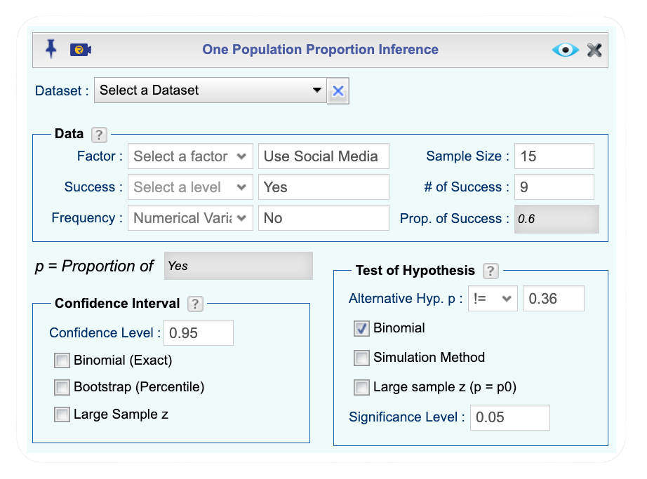
```

Click to expand the box below to see the Rguroo output.

::: {.callout-tip .inner-callout collapse="true" title="Rguroo output: One-Population Proportion Inference — Social Media"}

<div tabindex="0" class="rg-iframe-wrapper">
  <iframe
    src="Rguroo_html_output/Proportion Inference/social_media_docx/social_media.html"
    class="rg-iframe"
    title="Rguroo output: One Population Proportion Hypothesis Test - Social Media Example">
  </iframe>
</div>
:::

@fig-social-test-pvalue shows the p-value graph from the Rguroo output. As shown in the figure, the p-value is approximately $0.06206$, with $H_a$ support $X \leq 1$ or $X \geq 9$, highlighted by red bars. Since the p-value $0.06206 < \alpha = 0.10$, we reject $H_0$ and coclude that the data provide sufficient evidence at the $10\%$ significance level that the proportion of students who get most of their news from social media differs from 36%.

```{r,echo=FALSE}
#| fig-alt: "Bar chart of the null distribution for the number of Yes responses. The observed count of 9 is marked on the graph. Bars in both tails are highlighted to show the values at least as supportive of the alternative hypothesis as the observed result. The highlighted areas represent the p-value."
#| fig-cap: "Binomial distribution under $H_0$ with observed count $x_{\text{obs}}=9$. The highlighted bars show the $H_a$ support, and their total probability is the p-value."#| warning: FALSE
#| label: fig-social-test-pvalue
#| out-width: "80%"
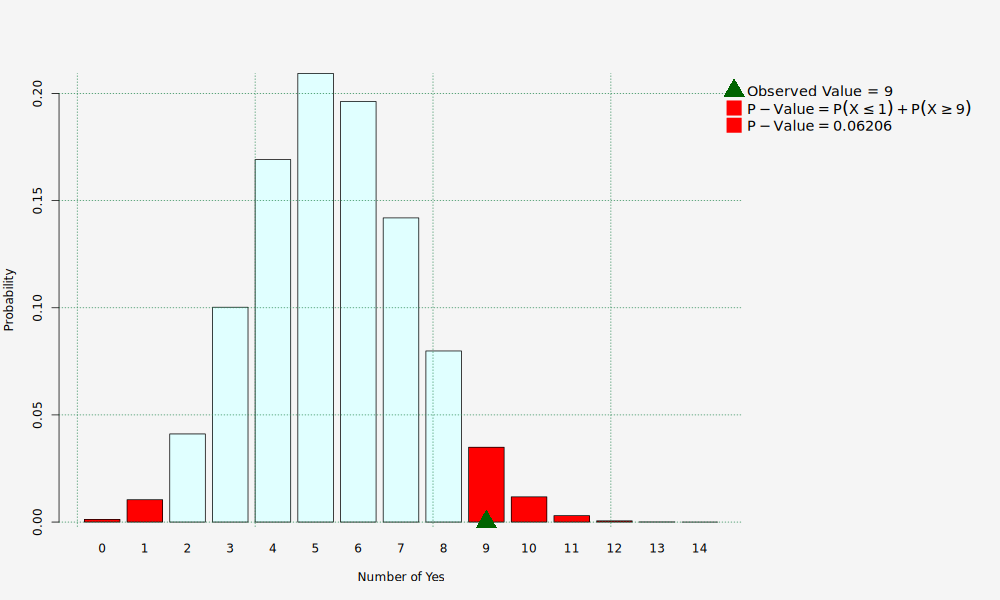
```

::::


:::{#exm-gss-marijuana-pvalue-binomial}
## Marijuana Legalization: p-Value Approach Using Raw Data

Recall @exm-gss-marijuana-pvalue,  the [GSS2024]{.data} dataset containing responses from $n = 388$ adults in the United States. The variable [Grass]{.var} was whether each respondent supports the legalization of marijuana, with possible responses of *Yes* (supports legalization) or *No* (does not support legalization). The problem was to test the claim that more than 70% of American adults support the legalization of marijuana. That is test the hypotheses
$$
\begin{cases}
H_0: p \leq 0.70 \\
H_a: p \geq 0.70
\end{cases}
$$

Use Rguroo’s One-Population Proportion inference function to obtain the p-value, and make a decision at $\alpha = 0.10$ significance level.

 The dataset for this example is available in the Rguroo dataset repository [Kozak]{.repo}, with the dataset name [GSS2024]{.data}. Table @tbl-GSS2024 displays the first six rows of the dataset. A complete description of the variables is provided in the [dataset code book](#code-book-gss2024) that follows.

:::

:::: {#gss-marijuana-pvalue-solution .callout-tip .solution-callout collapse="true" icon=false}
## 🔎 Solution

Click to expand the box below to see how to use the [Proportion Inference]{.fun} function in Rguroo for raw data.

::: {#prop-inference-gss2024 .callout-note appearance="simple" collapse="true" icon="none" title="{width=22px style='vertical-align:middle;'} One-Population proportion hypothesis test — Marijuana Legalization Example"}

**Before you begin:** Make sure you have already imported the [GSS2024]{.data} dataset into your Rguroo account, as shown [here](#Importing-GSS2024-to-Rguroo).

1. Open the **Analytics** toolbox in Rguroo.  
2. From the [Analysis]{.dpd} dropdown, select [Proportion Inference]{.fun} → [One Population]{.fun}. This opens the [One Population Proportion Inference]{.dialog} dialog.
3. From the [Dataset]{.dpd} dropdown select the dataset [GSS2024]{.data}.
4. From the [Factor]{.dpd} dropdown select the categorical variable [Grass]{.var}. 
5. (Optional) In the [Factor Label]{.des} textbox type in [Legalize Marijuana]{.typein}. The label is usually a more descriptive version of the variable name.
6. From the [Success]{.dpd} dropdown select [Yes]{.typein}. This indicates those who agree with legalization of marijuana. (Once you select these values, the sample size, number of successes, and proportion of successes will be populated automatically on the dialog.)
7. In the **Test of Hypothesis** section of the dialog, enter the following:
   - In the [Alternative Hyp. p]{.dpd} dropdown, select [>]{.typein} and enter [0.7]{.typein}.
   - Select the [Binomial]{.des} checkbox to use the binomial distribution.
   - Leave the [Significance Level]{.des} textbox at the default value of [0.05]{.typein}.

8. Click the preview icon  to view the output.

9. Click the  button and save the result as [GSS2024Prop]{.typein}.

::: {.callout-tip .inner-callout collapse="true" title="Rguroo One-Population Proportion dialog"}

```{r,echo=FALSE}
#| fig-alt: "Rguroo One Population Proportion Inference dialog showing analysis for dataset GSS2024. The factor variable is Grass with success defined as Yes. The sample size is 388 with 282 successes, giving a sample proportion of 0.7268. The hypothesis test is set up with alternative hypothesis p > 0.7, using the binomial method and a significance level of 0.05."
#| fig-cap: "Rguroo One-Population Proportion dialog for the Marijuana Legalization example"
#| label: fig-gss-rguroo-dialog
#| out-width: "80%"
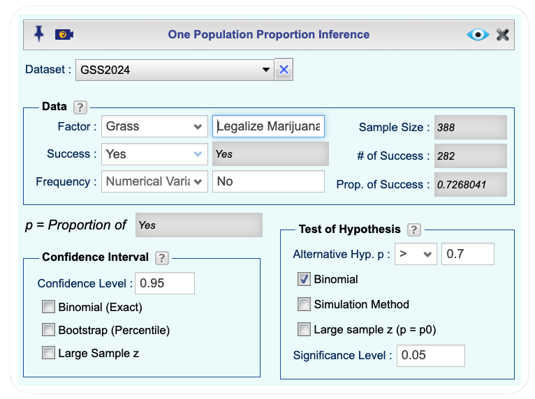
```

:::

:::

Click to expand the box below to see the Rguroo output.

::: {.callout-tip .inner-callout collapse="true" title="Rguroo output: One-Population Proportion Inference — Marijuana Legalization Example"}

<div tabindex="0" class="rg-iframe-wrapper">
  <iframe
    src="Rguroo_html_output/Proportion Inference/GSS2024Prop_docx/GSS2024.html"
    class="rg-iframe"
    title="Rguroo output: One Population Proportion Hypothesis Test - Marijuana Example">
  </iframe>
</div>

:::

The data summary shows that out of $n = 388$ respondents, $x_{\text{obs}} = 282$ answered *Yes*, giving a sample proportion of $\hat{p}_{\text{obs}} = 0.7268$. From the Rguroo p-value graph, shown in @fig-gss-pvalue, the p-value is approximately $0.136$, with $H_a$ support $X \geq 282$, shown by red bars.

Since the p-value $0.136 > \alpha = 0.10$, we fail to reject $H_0$. The data do not provide sufficient evidence at the $10\%$ significance level that more than 70% of American adults support legalization of marijuana.

```{r,echo=FALSE}
#| fig-alt: "Binomial distribution histogram for n = 388 and p = 0.70 showing the p-value support highlighted in red, with the observed value of 282 marked by a green triangle and the p-value of 0.13601 indicated."
#| warning: FALSE
#| label: fig-gss-pvalue
#| fig-cap: "Rguroo P-Value Output for the Marijuana Legalization Example"
#| out-width: "80%"
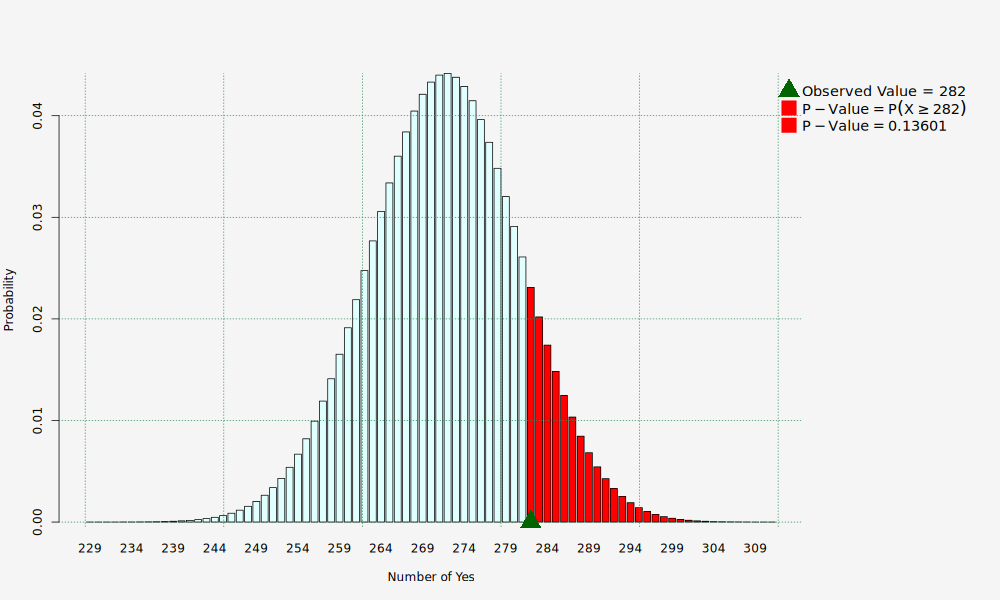
```

::::

### Decision Based on a Critical Region {#sec-critical-region}

Recall from @sec-foundations-critical-region that the critical region approach identifies, in advance, the values of the statistic that lead us to reject $H_0$. We used this same approach with the large-sample method. For the exact binomial method, the reasoning is unchanged; the difference is that the critical region is now defined in terms of the possible values of $X$, the number of successes. As before, the location of the critical region is determined by the direction of the alternative hypothesis $H_a$:

::: {.callout-note appearance="minimal"}
$$\text{Reject } H_0 \text{ if } 
\begin{cases}
X \geq c & \text{when } H_a: p > p_0 \\
X \leq c & \text{when } H_a: p < p_0 \\
X \leq c_1 \text{ or } X \geq c_2 & \text{when } H_a: p \neq p_0
\end{cases}$$
The values $c$, $c_1$, and $c_2$ are called **critical values**, and the corresponding values of $X$ form the **critical region** (also called the **rejection region**).
:::

To find the critical values, we use the null distribution
$$
X\sim\text{Binomial}(n,p_0).
$$
We choose the largest critical region for which the probability of a Type I error does not exceed the significance level $\alpha$. 

::: {.callout-note appearance="simple"}
## Sometimes the Actual Significance Level Is Less Than $\alpha$

Because the binomial distribution is discrete, $X$ takes only whole-number values. As a result, changing a critical value causes the probability of the critical region to change in steps rather than continuously. Therefore, we often cannot find a critical region with a probability exactly equal to $\alpha$.

 Rguroo returns the **largest** critical region whose probability under $H_0$ is at or below $\alpha$. The probability of this critical region is the actual significance level of the test and is reported as the **Exact Significance Level** in the Rguroo output.
 
  For example, if we choose $\alpha = 0.05$, Rguroo might return a critical region with an actual significance level $0.0476$ or $0.0342$. In either case, the probability of a Type I error is below the chosen significance level of $0.05$.
:::

In practice, we use Rguroo's [One-Population Proportion]{.fun} inference function to find this critical region. 


:::{#exm-youtube-rejection}
## Daily YouTube Use Among Teens (continued)

Recall @exm-youtube-ppss and @exm-youtube-pvalue. We test
$$
\begin{cases}
H_0: p \leq 0.70 \\
H_a: p > 0.70
\end{cases}
$$
with $n = 20$ and $x_{\text{obs}} = 17$.

Use Rguroo's One-Population Proportion inference function to obtain the critical region, and use it to make a decision at significance level $\alpha = 0.05$.
:::

:::: {.callout-tip .solution-callout collapse="true" icon=false}
## 🔎 Solution

We use the same instructions as in the [solution](#solution-pvalue-youtube-binomial) of  [the YouTube example](#prop-inference-youtube) to open the [One Population Proportion Inference]{.dialog}.

 In the **Data** section, the [Factor Label]{.des} is [Daily YouTube Use]{.typein}, [Success Label]{.des} is [Yes]{.typein}, [Failure Label]{.des} is [No]{.typein}, [Sample Size]{.des} is [20]{.typein}, and [\# of Successes]{.des} is [17]{.typein}. In the **Test of Hypothesis** section, the [Alternative Hyp. p]{.dpd} dropdown is set to [>]{.typein} with value [0.7]{.typein}, the [Binomial]{.des} method is selected, and the [Significance Level]{.des} is left at [0.05]{.typein}.

```{r,echo=FALSE}
#| fig-alt: "Rguroo One-Population Proportion dialog configured for the Daily YouTube Use example with sample size 20, observed count 17, hypothesized proportion 0.70, and right-tailed alternative."
#| warning: FALSE
#| label: fig-youtube-test-cr
#| fig-cap: "Rguroo One-Population Proportion dialog for the Daily YouTube Use example (critical region approach)"
#| out-width: "80%"

```
We then use the following additional steps to obtain the critical region graph:

- Click the [Details]{.des} button to open the [Advanced Features]{.dialog} dialog.
- Click on the [Test of Hypothesis]{.tab} tab.
- In the **Graphs** section, select [Critical Region Graph]{.des}.
- (optional) Uncheck the default [p-value Graph]{.des}.

```{r,echo=FALSE}
#| fig-alt: "Rguroo Advanced Features dialog showing the Confidence Interval and Test of Hypothesis tab. In the Graphs section, the Critical Region Graph option is selected."
#| label: fig-advanced-features-cr
#| fig-cap: "Rguroo Advanced Features dialog with Critical Region Graph selected"
#| out-width: "70%"
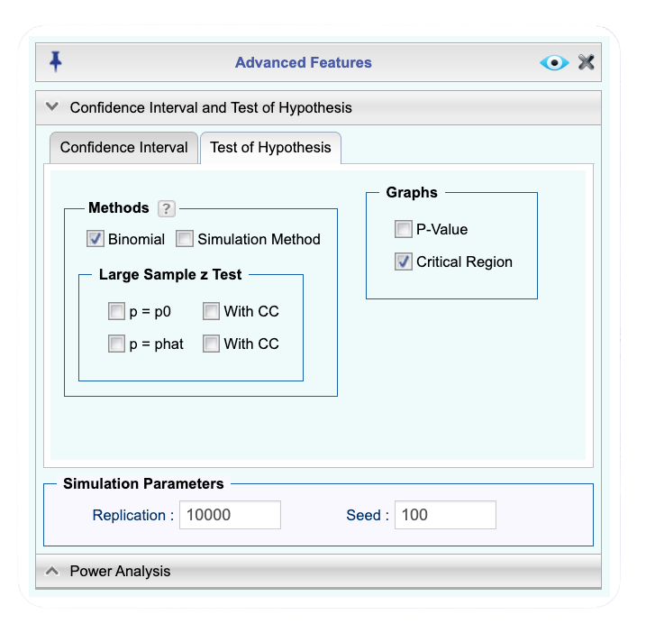
```


Click to expand the box below to see the Rguroo output.

::: {.callout-tip .inner-callout collapse="true" title="Rguroo output: One-Population Proportion Inference — YouTube (Critical Region)"}

<div tabindex="0" class="rg-iframe-wrapper">
  <iframe
    src='Rguroo_html_output/Proportion Inference/YoutubePropCR_docx/YoutubePropCR.html'
    class="rg-iframe"
    title="Rguroo output: One Population Proportion Hypothesis Test - YouTube Example (Critical Region)">
  </iframe>
</div>

:::

@fig-youtube-test-cr-graph shows the Rguroo critical region graph output. The critical region is $X \geq 18$, with an exact significance level which is less than $5\%$. The rejection region is shown by red bars, and the observed value $x_{\text{obs}} = 17$ is marked with a green triangle. 

Since $x_{\text{obs}} = 17$ does not fall in the rejection region, we fail to reject $H_0$. The data do not provide sufficient evidence at the $5\%$ significance level to conclude that more than 70% of students in the district use YouTube daily.

```{r,echo=FALSE}
#| fig-alt: "Bar chart showing the null distribution of the number of daily YouTube users under a binomial model with n = 20 and p = 0.70. The observed count of 17 is marked on the graph. The critical region X >= 18 is highlighted in red, with an exact significance level of 4.76%."
#| warning: FALSE
#| label: fig-youtube-test-cr-graph
#| fig-cap: "Rguroo Output: Binomial null distribution with observed count $x_{\\text{obs}} = 17$. The highlighted bars show the critical region $X \\geq 18$."
#| out-width: "80%"
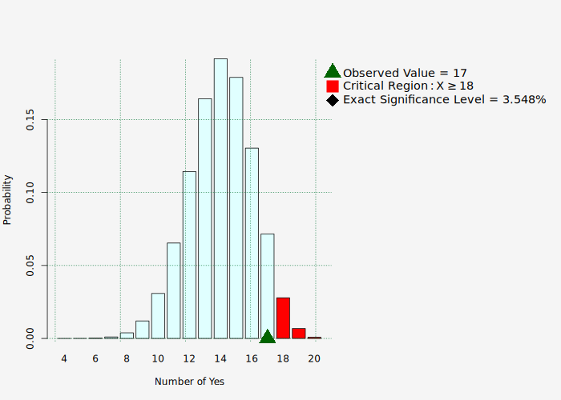
```

::::

:::{#exm-inactivity-rejection}
## Physical Inactivity Among Adults (continued)

Recall @exm-physical-inactivity-ppss and @exm-inactivity-pvalue. We test
$$
\begin{cases}
H_0: p \geq 0.35 \\
H_a: p < 0.35
\end{cases}
$$
with $n = 50$ and $x_{\text{obs}} = 10$.

Use Rguroo's One-Population Proportion inference function to obtain the critical region, and use it to make a decision at significance level $\alpha = 0.05$.
:::

:::: {.callout-tip .solution-callout collapse="true" icon=false}
## 🔎 Solution

We use the same instructions as in the [solution](#solution-pvalue-youtube-binomial) of  [the YouTube example](#prop-inference-youtube) to open the [One Population Proportion Inference]{.dialog}.

 The filled-out dialog is shown in @fig-inactivity-test-cr. We input the [Factor]{.des} label as [Physical Activity]{.typein}, [Success]{.des} as [Inactive]{.typein} (since we are counting those who are physically inactive), and [Failure]{.des} as [Active]{.typein}. We also input the sample size, number of successes, the alternative hypothesis, and select the method [Binomial]{.des}. 

```{r,echo=FALSE}
#| fig-alt: "Rguroo One Population Proportion Inference dialog configured for the Physical Inactivity example, showing a sample size of 50, 10 successes labeled as 'Inactive', alternative hypothesis p < 0.35, binomial method selected, and significance level 0.05."
#| warning: FALSE
#| label: fig-inactivity-test-cr
#| fig-cap: "Rguroo One Population Proportion Inference dialog for the Physical Inactivity example (critical region approach)"
#| out-width: "80%"

```

We then use the following additional steps to obtain the critical region graph:

- Click the [Details]{.des} button to open the [Advanced Features]{.dialog} dialog.
- Click on the [Test of Hypothesis]{.tab} tab.
- In the **Graphs** section, select [Critical Region Graph]{.des}.
- (optional) Uncheck the default [p-value Graph]{.des}.

```{r,echo=FALSE}
#| fig-alt: "Rguroo Advanced Features dialog showing the Confidence Interval and Test of Hypothesis tab. In the Graphs section, the Critical Region Graph option is selected."
#| label: fig-advanced-features-cr1
#| fig-cap: "Rguroo Advanced Features dialog with Critical Region Graph selected"
#| out-width: "70%"

```

Click to expand the box below to see the Rguroo output.

::: {.callout-tip .inner-callout collapse="true" title="Rguroo output: One-Population Proportion Inference — Physical Inactivity (Critical Region)"}

<div tabindex="0" class="rg-iframe-wrapper">
  <iframe
    src='Rguroo_html_output/Proportion Inference/Physical_inactivityCR_docx/Physical_inactivityCR.html'
    class="rg-iframe"
    title="Rguroo output: One Population Proportion Hypothesis Test - Physical Inactivity Example (Critical Region)">
  </iframe>
</div>

:::

@fig-inactivity-test-cr-graph shows the Rguroo critical region graph output. The critical region is $X \leq 11$, with a significance level less than $5\%$. The rejection region is shown by red bars, and the observed value $x_{\text{obs}} = 10$ is marked with a green triangle. 

Since $x_{\text{obs}} = 10$ falls in the rejection region, we reject $H_0$ in favor of $H_a: p < 0.35$. The data provide sufficient evidence at the $5\%$ significance level to conclude that fewer than 35% of adults in the country are physically inactive.

```{r,echo=FALSE}
#| fig-alt: "Bar chart showing the null distribution of the number of inactive individuals under a binomial model with n = 50 and p = 0.35. The observed count of 10 is marked on the graph. The critical region X <= 11 is highlighted in red, with an exact significance level of 3.42%."
#| warning: FALSE
#| label: fig-inactivity-test-cr-graph
#| fig-cap: "Rguroo Output: Binomial null distribution with observed count $x_{\\text{obs}} = 10$. The highlighted bars show the critical region $X \\leq 11$."
#| out-width: "80%"
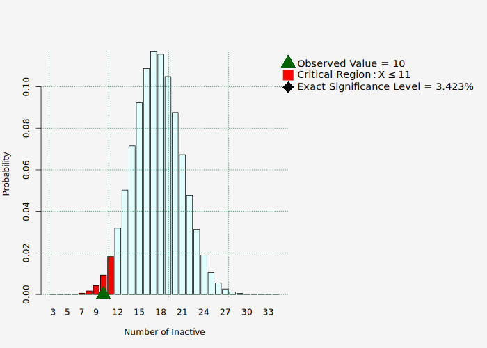
```

::::

:::{#exm-social-rejection}
## Social Media as a Primary News Source (continued)

Recall @exm-social-media-news-ppss and @exm-social-pvalue. We test
$$
\begin{cases}
H_0: p = 0.36 \\
H_a: p \neq 0.36
\end{cases}
$$
with $n = 15$ and $x_{\text{obs}} = 9$.

Use Rguroo's One-Population Proportion inference function to obtain the critical region, and use it to make a decision at significance level $\alpha = 0.05$.
:::

:::: {.callout-tip .solution-callout collapse="true" icon=false}
## 🔎 Solution

We use the same instructions as in the [solution](#solution-pvalue-youtube-binomial) of  [the YouTube example](#prop-inference-youtube) to open the [One Population Proportion Inference]{.dialog}.

The filled-out dialog is shown in @fig-social-test-cr. We input the [Factor]{.des} label as [Use Social Media]{.typein}, the [Success]{.des} label as [Yes]{.typein} (a student who uses social media as their primary news source), and the [Failure]{.des} label as [No]{.typein}. We enter a sample size of [15]{.typein} and number of successes of [9]{.typein}. In the **Test of Hypothesis** section, we select [!=]{.typein} (not equal to) from the [Alternative Hyp. p]{.dpd} dropdown and enter [0.36]{.typein}. We select the [Binomial]{.des} checkbox and leave the [Significance Level]{.des} at the default value of [0.05]{.typein}. 

```{r,echo=FALSE}
#| fig-alt: "Rguroo One Population Proportion Inference dialog configured for the Social Media example, showing a sample size of 15, 9 successes labeled as 'Yes', alternative hypothesis p not equal to 0.36, binomial method selected, and significance level 0.05."
#| warning: FALSE
#| label: fig-social-test-cr
#| fig-cap: "Rguroo One Population Proportion Inference dialog for the Social Media example (critical region approach)"
#| out-width: "80%"

```
We then use the following additional steps to obtain the critical region graph:

- Click the [Details]{.des} button to open the [Advanced Features]{.dialog} dialog.
- Click on the [Test of Hypothesis]{.tab} tab.
- In the **Graphs** section, select [Critical Region Graph]{.des}.
- (optional) Uncheck the default [p-value Graph]{.des}.

```{r,echo=FALSE}
#| fig-alt: "Rguroo Advanced Features dialog showing the Confidence Interval and Test of Hypothesis tab. In the Graphs section, the Critical Region Graph option is selected."
#| label: fig-advanced-features-cr2
#| fig-cap: "Rguroo Advanced Features dialog with Critical Region Graph selected"
#| out-width: "70%"

```

Click to expand the box below to see the Rguroo output.

::: {.callout-tip .inner-callout collapse="true" title="Rguroo output: One-Population Proportion Inference — Social Media (Critical Region)"}

<div tabindex="0" class="rg-iframe-wrapper">
  <iframe
    src='Rguroo_html_output/Proportion Inference/social_mediaCR_docx/social_mediaCR.html'
    class="rg-iframe"
    title="Rguroo output: One Population Proportion Hypothesis Test - Social Media Example (Critical Region)">
  </iframe>
</div>

:::

@fig-social-test-cr-graph shows the Rguroo critical region graph output. The critical region is $X \leq 1$ or $X \geq 10$, with a significance level less than  $5\%$. The rejection region is shown by red bars, and the observed value $x_{\text{obs}} = 9$ is marked with a green triangle. 

Since $x_{\text{obs}} = 9$ does not fall in the rejection region, we fail to reject $H_0$. The data do not provide sufficient evidence at the $5\%$ significance level to conclude that the proportion of students who get most of their news from social media differs from 36%.

```{r,echo=FALSE}
#| fig-alt: "Bar chart showing the null distribution under a binomial model with n = 15 and p = 0.36. The observed count of 9 is marked on the graph. The two-sided critical region X <= 1 or X >= 10 is highlighted in red, with an exact significance level of 2.71%."
#| warning: FALSE
#| label: fig-social-test-cr-graph
#| fig-cap: "Rguroo Output: Binomial null distribution with observed count $x_{\\text{obs}} = 9$. The highlighted bars show the two-sided critical region $X \\leq 1$ or $X \\geq 10$."
#| out-width: "80%"
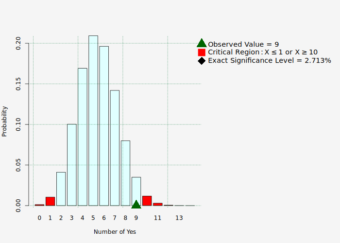
```

::::

**Using Raw Data**

We close with the marijuana legalization example, which uses raw data from the GSS.

:::{#exm-gss-marijuana-rejection}
## Marijuana Legalization: Critical Region Approach Using Raw Data

Using the [GSS2024]{.data} dataset (see @exm-gss-marijuana-pvalue for the full setup and the code book), test whether more than 70% of American adults support the legalization of marijuana ($H_a: p > 0.70$), using the **critical region approach** at significance level $\alpha = 0.05$.
:::

:::: {.callout-tip .solution-callout collapse="true" icon=false}
## 🔎 Solution

We use the same instructions as in the [solution](#gss-marijuana-pvalue-solution) of @exm-gss-marijuana-pvalue to open the [One Population Proportion Inference]{.dialog} dialog. 

From the [Dataset]{.dpd} dropdown we select [GSS2024]{.data}, from the [Factor]{.dpd} dropdown we select [Grass]{.var}, and from the [Success]{.dpd} dropdown we select [Yes]{.typein}. The sample size and number of successes populate automatically. In the **Test of Hypothesis** section, the [Alternative Hyp. p]{.dpd} dropdown is set to [>]{.typein} with value [0.7]{.typein}, the [Binomial]{.des} method is selected, and the [Significance Level]{.des} is left at [0.05]{.typein}. We then apply the [additional steps](#cr-rguroo-steps) to display the Critical Region Graph.

```{r,echo=FALSE}
#| fig-alt: "Rguroo One Population Proportion Inference dialog showing analysis for dataset GSS2024. The factor variable is Grass with success defined as Yes. The sample size is 388 with 282 successes. The hypothesis test is set up with alternative hypothesis p > 0.7, using the binomial method and a significance level of 0.05."
#| warning: FALSE
#| label: fig-gss-test-cr
#| fig-cap: "Rguroo One-Population Proportion dialog for the Marijuana Legalization example (critical region approach)"
#| out-width: "80%"

```
We then use the following additional steps to obtain the critical region graph:

- Click the [Details]{.des} button to open the [Advanced Features]{.dialog} dialog.
- Click on the [Test of Hypothesis]{.tab} tab.
- In the **Graphs** section, select [Critical Region Graph]{.des}.
- (optional) Uncheck the default [p-value Graph]{.des}.

```{r,echo=FALSE}
#| fig-alt: "Rguroo Advanced Features dialog showing the Confidence Interval and Test of Hypothesis tab. In the Graphs section, the Critical Region Graph option is selected."
#| label: fig-advanced-features-cr3
#| fig-cap: "Rguroo Advanced Features dialog with Critical Region Graph selected"
#| out-width: "70%"

```

Click to expand the box below to see the Rguroo output.

::: {.callout-tip .inner-callout collapse="true" title="Rguroo output: One-Population Proportion Inference — Marijuana Legalization (Critical Region)"}

<div tabindex="0" class="rg-iframe-wrapper">
  <iframe
    src='Rguroo_html_output/Proportion Inference/GSS2024PropCR_docx/GSS2024PropCR.html'
    class="rg-iframe"
    title="Rguroo output: One Population Proportion Hypothesis Test - Marijuana Example (Critical Region)">
  </iframe>
</div>

:::

@fig-gss-cr4 shows the Rguroo critical region graph output. The critical region is $X \geq 287$, for a significance level of $5\%$. The rejection region is shown by red bars, and the observed value $x_{\text{obs}} = 282$ is marked with a green triangle. 

Since $x_{\text{obs}} = 282$ does not fall in the rejection region, we fail to reject $H_0$. The data do not provide sufficient evidence at the $5\%$ significance level to conclude that more than 70% of American adults support the legalization of marijuana, even though the sample proportion of $0.7268$ is slightly above 0.70.

```{r,echo=FALSE}
#| fig-alt: "Binomial distribution histogram for n = 388 and p = 0.70 showing the critical region X greater than or equal to 287 highlighted in red, with the observed value of 282 marked by a green triangle and the exact significance level of 4.799% indicated."
#| warning: FALSE
#| label: fig-gss-cr4
#| fig-cap: "Rguroo Output: Binomial null distribution with observed count $x_{\\text{obs}} = 282$. The highlighted bars show the critical region $X \\geq 287$."
#| out-width: "80%"
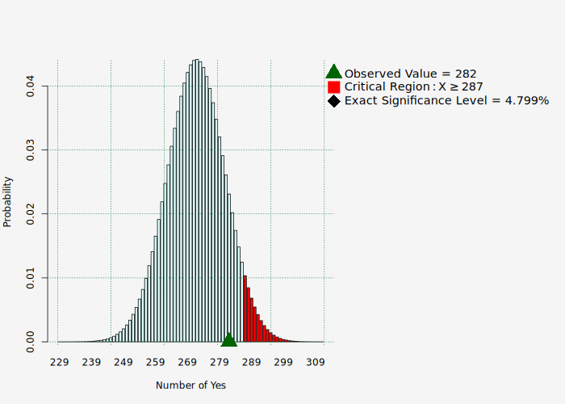
```

::::


### Homework for Section @sec-making-decision-binomial

For each of the scenarios described below, use Rguroo’s [One-Population Proportion]{.fun} inference function with the [Binomial]{.des} option to carry out the hypothesis test at the given significance level.

**(a)** Before running the analysis, identify the following inputs for the Rguroo dialog:

- [Factor Label]{.des}: A descriptive name for the variable being studied  
- [Success]{.des}: The outcome that counts as a success  
- [Failure]{.des}: The outcome that counts as a failure  
- [Sample Size]{.des}: The value of $n$  
- [\# of Successes]{.des}: The value of $x_{\text{obs}}$  
- [Proportion of ...]{.des}: A descriptive label for what the population proportion represents  

**(b)** State the null and alternative hypotheses.

**(c)** Carry out the test using the **critical region (rejection region) approach**:  
&nbsp;&nbsp;&nbsp;&nbsp;(i) Specify the critical region.  
&nbsp;&nbsp;&nbsp;&nbsp;(ii) Identify $x_{\text{obs}}$ and determine whether you reject or fail to reject $H_0$.

**(d)** Carry out the test using the **p-value approach**:  
&nbsp;&nbsp;&nbsp;&nbsp;(i) Specify the $H_a$ support.  
&nbsp;&nbsp;&nbsp;&nbsp;(ii) State the p-value and determine whether you reject or fail to reject $H_0$.

**(e)** State your conclusion in the context of the problem.
---

1. **Arizona Marijuana Legalization**
In Problem 1 (Arizona Marijuana Legalization) of @sec-stage-hw, $p$ is
the true proportion of Arizona registered voters who support marijuana
legalization. Do Arizona registered voters differ from Colorado residents
in their support for marijuana legalization? The sample consisted of
$n = 779$ voters, of whom $x_{\text{obs}} = 390$ favored legalization.
Use $\alpha = 0.05$.

2. **Australian Unemployment Outlook**
In Problem 2 (Australian Unemployment Outlook) of @sec-stage-hw, $p$ is
the true proportion of Australians in November 1997 who believed
unemployment would increase. Did Australian sentiment about unemployment
shift between July and November of 1997? The sample consisted of
$n = 631$ Australians, of whom $x_{\text{obs}} = 284$ believed
unemployment would increase. Use $\alpha = 0.05$.

3. **Arkansas Identity Theft Complaints**
In Problem 3 (Arkansas Identity Theft Complaints) of @sec-stage-hw, $p$
is the true proportion of consumer complaints in Arkansas that were for
identity theft. Was the proportion of identity theft complaints in Arkansas
greater than the national figure of 23%? The sample consisted of
$n = 3{,}482$ complaints, of which $x_{\text{obs}} = 1{,}601$ were for
identity theft. Use $\alpha = 0.05$.

4. **Alaska Identity Theft Complaints**
In Problem 4 (Alaska Identity Theft Complaints) of @sec-stage-hw, $p$
is the true proportion of consumer complaints in Alaska that were for
identity theft. Was Alaska's proportion of identity theft complaints less
than the national proportion of 23%? The sample consisted of
$n = 1{,}432$ complaints, of which $x_{\text{obs}} = 321$ were for
identity theft. Use $\alpha = 0.05$.

5. **Kennedy Assassination Conspiracy Belief**
In Problem 5 (Kennedy Assassination Conspiracy Belief) of @sec-stage-hw,
$p$ is the true proportion of American adults in 2013 who believed there
was a conspiracy behind President Kennedy's assassination. Is there evidence
that American belief in a conspiracy behind President Kennedy's assassination
changed between 2001 and 2013? The sample consisted of $n = 1{,}039$
adults, of whom $x_{\text{obs}} = 634$ believed in a conspiracy.
Use $\alpha = 0.05$.

6. **Autism Spectrum Disorder in Arizona**
In Problem 6 (Autism Spectrum Disorder in Arizona) of @sec-stage-hw, $p$
is the true proportion of children in Arizona diagnosed with ASD. Is the
rate of ASD diagnosis among children in Arizona greater than the national
rate of 1 in 88 children? The sample consisted of $n = 32{,}601$ children,
of whom $x_{\text{obs}} = 507$ were diagnosed with ASD. Use $\alpha = 0.05$.

7. **Graduate Degree Attainment: GSS2024**
In Problem 7 (Graduate Degree Attainment: GSS2024) of @sec-stage-hw, $p$
is the true proportion of U.S. adults who hold a graduate degree. Does the GSS2024 data provide evidence that the proportion of U.S. adults who hold a graduate degree differs from the 15% reported by the U.S. Census Bureau? Use $\alpha = 0.05$.

<div tabindex="0" style="width:85%; margin:auto;">

 The dataset for
this exercise is available in the Rguroo dataset repository [Kozak]{.repo},
with the dataset name [GSS2024]{.data}.

**Code book for Dataset GSS2024 is given [here](#code-book-gss2024).**

</div>

## A Closer Look at Critical Regions and p-values ** {#sec-closer-look-cr-pvalue}

::: {.callout-note}
This section is optional. The material here is not required for performing hypothesis tests, but it is highly recommended for readers who want a firmer conceptual grasp of what is happening behind the procedures.
:::


In the previous sections, you learned two equivalent approaches for testing a hypothesis about a population proportion: the **critical region approach** and the **p-value approach**. In both approaches, we computed probabilities for our decisions using the boundary value of the null hypothesis, and we relied on Rguroo's [Proportion Infrence]{.fun} function to produce the critical region or the p-value automatically.

This section is intended to deepen your understanding of *why* these procedures work the way they do. Specifically, we address two questions:

1. **Why do we use the boundary value of $H_0$ when computing probabilities required for our decisions?** The null hypothesis in many tests is a statement such as $H_0: p \leq p_0$ or $H_0: p \geq p_0$, which encompasses many possible values of $p$. Yet we always use the single boundary value $p_0$ in our calculations. There is a principled reason for this, and understanding it clarifies what a hypothesis test is really doing.

2. **How are critical regions and p-values actually obtained from a probability distribution?** Rguroo's [Proportion Inference]{.fun} function returns these quantities directly, but doing so hides the underlying probability calculation. By using Rguroo's **probability calculator** instead, we can see exactly which area under a sampling distribution corresponds to the critical region or the p-value. 


### Why Use the Boundary Value in $H_0$? ** {#sec-boundary-value}

In this section we explain *why* we use the boundary value of $H_0$ when computing the probability of a Type I error. The front-half discussion stated this as a fact: for a composite $H_0$ such as $H_0: p \leq p_0$, the maximum Type I error probability over the values allowed by $H_0$ occurs at the boundary $p_0$, so controlling the error there automatically controls it everywhere in $H_0$. Here we *demonstrate* this empirically: we compute the probability of a Type I error for several specific values of $p$ within $H_0$, for one decision rule, and observe that the maximum occurs at the boundary. A formal account, including worked examples and the underlying mathematics, is given in [Jamshidian and Jamshidian (2026)](https://www.tandfonline.com/doi/full/10.1080/26939169.2025.2610942).


:::{#exm-youtube-type1}
## Daily YouTube Use Among Teens (continued)

Recall @exm-youtube-ppss where a school district claimed that more than 70% of 
students in its district use YouTube daily, and a random sample of $n = 20$ 
students was selected. The null and alternative hypotheses are:
$$
\begin{cases}
H_0: p \leq 0.70 \\
H_a: p > 0.70
\end{cases}
$$

Consider the critical region: Reject $H_0$ if $X \geq 17$.

For this critical region, compute $P(\text{Type I error})$ when 

a. $p = 0.60$
b. $p = 0.65$
c. $p = 0.70$.

In each case, interpret the probability in the context of the problem.
:::

:::: {.callout-tip .solution-callout collapse="true" icon=false}
## 🔎 Solution
a\. Since the sample size is $n = 20$ and $p = 0.60$, we have 
$X \sim \text{Binomial}(20, 0.60)$. Using Rguroo's probability calculator, 
we compute
$$P(\text{Type I error}) = P(\text{Reject } H_0 \mid H_0 \text{ is true})$$
$$= P(X \geq 17 \mid p = 0.60).$$

Click to expand the box below to see how to calculate the probability of Type I error.

:::{#calculating-typeI-error .callout-note appearance="simple" 
collapse="true" icon="none" 
title="{width=22px 
style='vertical-align:middle;'} Calculating Type I Error Probability"}

1. Open the **Probability-Simulation** toolbox in Rguroo.  
2. From the [Probability]{.dpd} dropdown, select 
[Probability Calculator --> Discrete]{.fun}.
3. (Optional) In the `Calculation` textbox, type a name for the calculation 
(e.g., `Type I error`).  
4. In the [Distribution]{.dpd} dropdown, select [Binomial]{.fun}.
5. In the [No. of Trials]{.des} textbox, enter [20]{.typein}.
6. In the [Prob. of Success]{.des} textbox, enter [0.60]{.typein}.
7. In the next dropdown menu, select [Above]{.dpd}, and in the textbox next 
to it, enter [17]{.typein}.
8. (Optional) Select the [Graph]{.des} checkbox to see a graph showing 
calculation details.
9. Click the preview icon  
to see the result.
10. (Optional) In the  textbox, enter 
the name [TypeI_Error]{.typein} to save this calculation to your Rguroo 
account.

::: {.callout-tip .inner-callout appearance="simple" collapse="true" 
icon="none" title="Click here to see the Rguroo dialog"}
{width=500px}
:::

::::

@fig-youtube-type1a shows the Rguroo Probability Calculator output for 
$X \sim \text{Binomial}(20, 0.60)$, giving 

::: {.callout-note appearance="minimal"}
$$P(\text{Type I error}) = P(X \geq 17\mid p=0.60) \approx 0.016.$$
:::

That is, if the true proportion of students in the district who use YouTube 
daily is $p = 0.60$, and our decision rule is to reject $H_0$ whenever 
$X \geq 17$ in a sample of $n = 20$ students, then there is only a $1.6\%$ 
chance of committing a Type I error; that is, incorrectly concluding that 
more than 70% of students in the district use YouTube daily.
```{r,echo=FALSE}
#| fig-cap: "Binomial distribution for $X \\sim \\text{Binomial}(n = 20, p = 0.60)$ showing the Type I error probability as the upper-tail area $P(X \\geq 17) = 0.016$."
#| warning: FALSE
#| label: fig-youtube-type1a
#| out-width: "80%"
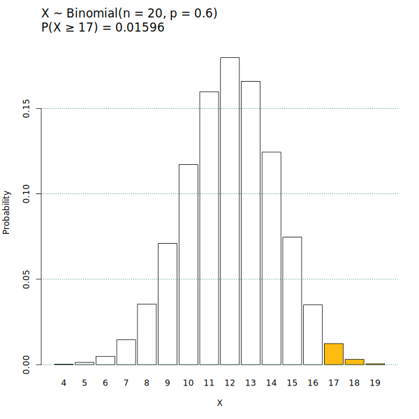
```

b\. To compute the probability of Type I error for the critical region 
$X \geq 17$ when $p = 0.65$, we follow the same steps as in 
the [part (a)](#calculating-typeI-error), but enter [0.65]{.typein} in the 
[Prob. of Success]{.des} box. The Rguroo output gives 

::: {.callout-note appearance="minimal"}
$$P(\text{Type I error}) = P(X \geq 17\mid p=0.65) \approx 0.044.$$
:::

That is, if the true proportion of students in the district who use YouTube 
daily is $p = 0.65$, and our decision rule is to reject $H_0$ whenever 
$X \geq 17$ in a sample of $n = 20$ students, then there is approximately a 
$4.4\%$ chance of committing a Type I error; that is, incorrectly concluding 
that more than 70% of students in the district use YouTube daily.

c\. Entering [0.70]{.typein} in the [Prob. of Success]{.des} box gives

::: {.callout-note appearance="minimal"}
$$P(\text{Type I error}) = P(X \geq 17\mid p=0.70) \approx 0.107.$$
:::

That is, if the true proportion of students in the district who use YouTube 
daily is $p = 0.70$, and our decision rule is to reject $H_0$ whenever 
$X \geq 17$ in a sample of $n = 20$ students, then there is approximately a 
$10.7\%$ chance of committing a Type I error; that is, incorrectly concluding 
that more than 70% of students in the district use YouTube daily.
:::

:::{#exm-physical-inactivity-type1}
## Physical Inactivity Among Adults (continued)

Recall @exm-physical-inactivity-ppss where a national health agency claimed 
that fewer than 35% of adults in its country are physically inactive, and a 
random sample of $n = 50$ adults was selected. The null and alternative 
hypotheses are:
$$
\begin{cases}
H_0: p \geq 0.35 \\
H_a: p < 0.35
\end{cases}
$$

Consider the critical region: Reject $H_0$ if $X \leq 13$.

For this critical region, compute $P(\text{Type I error})$ when 

a. $p = 0.35$ 
b. $p = 0.40$
c. $p = 0.50$.

In each case, interpret the probability in the context of the problem.
:::

:::: {.callout-tip .solution-callout collapse="true" icon=false}
## 🔎 Solution

a\. Since the sample size is $n = 50$ and $p = 0.35$, we have 
$X \sim \text{Binomial}(50, 0.35)$. Using Rguroo's probability calculator, 
we compute
$$P(\text{Type I error}) = P(\text{Reject } H_0 \mid H_0 \text{ is true})$$
$$= P(X \leq 13 \mid p = 0.35).$$

Use the same Rguroo Probability Calculator steps as in the [YouTube example](#calculating-typeI-error), with [No. of Trials]{.des} = 50, [Prob. of Success]{.des} = 0.35, and the direction set to [Below]{.dpd} with value 13:

::: {.callout-tip .inner-callout appearance="simple" collapse="true" 
icon="none" title="Click here to see the Rguroo dialog"}
{width=500px}
:::


@fig-inactivity-type1 shows the Rguroo Probability Calculator output for 
$X \sim \text{Binomial}(50, 0.35)$, giving 

::: {.callout-note appearance="minimal"}
$$P(\text{Type I error}) = P(X \leq 13\mid p=0.35) \approx 0.1163.$$
:::

That is, if the true proportion of inactive adults in the population is 
$p = 0.35$, and our decision rule is to reject $H_0$ whenever $X \leq 13$ 
in a sample of $n = 50$ adults, then there is approximately an $11.63\%$ chance 
of committing a Type I error; that is, incorrectly concluding that fewer than 
35% of adults in the population are physically inactive.
```{r,echo=FALSE}
#| fig-cap: "Binomial distribution for $X \\sim \\text{Binomial}(n = 50, p = 0.35)$ showing the Type I error probability as the lower-tail area $P(X \\leq 13) = 0.1163$."
#| warning: FALSE
#| label: fig-inactivity-type1
#| out-width: "80%"
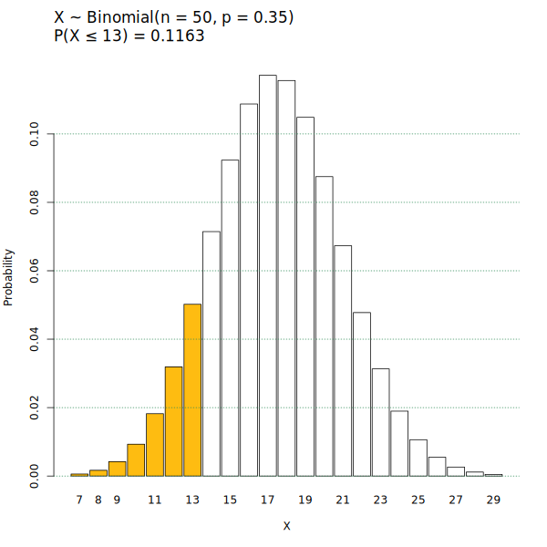
```

\ 

b\. Entering [0.40]{.typein} in the [Prob. of Success]{.des} box gives

::: {.callout-note appearance="minimal"}
$$P(\text{Type I error}) = P(X \leq 13\mid p=0.40) \approx 0.028.$$
:::

That is, if the true proportion of inactive adults in the population is 
$p = 0.40$, and our decision rule is to reject $H_0$ whenever $X \leq 13$ 
in a sample of $n = 50$ adults, then there is approximately a $2.8\%$ chance 
of committing a Type I error; that is, incorrectly concluding that fewer than 
35% of adults in the population are physically inactive.

c\. Entering [0.50]{.typein} in the [Prob. of Success]{.des} box gives

::: {.callout-note appearance="minimal"}
$$P(\text{Type I error}) = P(X \leq 13\mid p=0.50) \approx 0.00046.$$
:::

That is, if the true proportion of inactive adults in the population is 
$p = 0.50$, and our decision rule is to reject $H_0$ whenever $X \leq 13$ 
in a sample of $n = 50$ adults, then there is approximately a $0.046\%$ chance 
of committing a Type I error; that is, incorrectly concluding that fewer than 
35% of adults in the population are physically inactive.

::::

Now that we have computed the probability of a Type I error at various values 
of $p$, let us look back at what we observed in our examples. 

For the one-sided cases,  there is a range of values of $p$ in
$H_0$, and we computed the probability of a Type I error at several of them. 
You may have noticed a pattern: in both the YouTube example and the Physical 
Inactivity example, the probability of a Type I error was largest at the value 
of $p$ where $H_0$ and $H_a$ meet, the **boundary value of $p$ in $H_0$**. 
For the YouTube example, this is $p = 0.70$, and for the Physical Inactivity example, this is $p = 0.35$. Is this a coincidence that the probability of a Type I error is largest at the boundary value? 

The answer is, it is not a coincident. @fig-type-range shows the probability of a Type I error across a range of values of $p$ in $H_0$, 
for the two examples that we considerd here and for three different decision rules in each case.

```{r,echo=FALSE}
#| fig-cap: 'Type I error probabilities for binomial tests as a function of $p$. Panel (a) shows $X \sim \text{Binomial}(20, p)$ with $P(X \geq 16, 17, 18)$; panel (b) shows $X \sim \text{Binomial}(50, p)$ with $P(X \leq 11, 12, 13)$. The red dashed line marks $\alpha = 0.05$. The gray dotted line shows the boundary of $H_0$.'
#| fig-alt: 'Two side-by-side line graphs showing how Type I error changes with the true proportion π. In panel (a), for a binomial model with n = 20, three curves show P(X ≥ 16), P(X ≥ 17), and P(X ≥ 18) increasing as p increases from 0 to 0.70, with values up to about 0.25. In panel (b), for n = 50, three curves show P(X ≤ 11), P(X ≤ 12), and P(X ≤ 13) decreasing as π increases from 0.35 to 1, with values up to about 0.12. A horizontal red dashed line at 0.05 marks the significance level in both plots.'
#| warning: FALSE
#| label: fig-type-range
#| out-width: "90%"
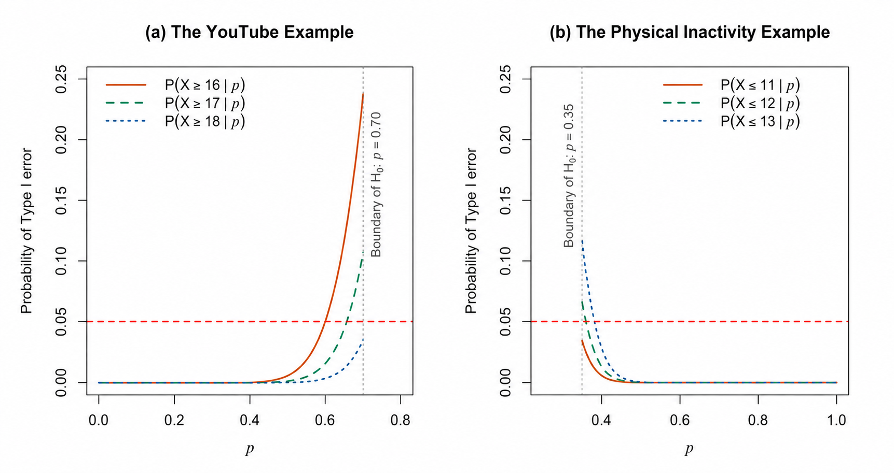
```

In panel (a), for the YouTube example, the null hypothesis is 
$H_0: p \leq 0.70$, so the boundary value is $p = 0.70$. The three curves 
correspond to the decision rules $X \geq 16$, $X \geq 17$, and $X \geq 18$. 
For all three rules, the probability of a Type I error increases as $p$ gets 
closer to the boundary value of $0.70$, and reaches its maximum at $p = 0.70$. 

In panel (b), for the Physical Inactivity example, the null hypothesis is 
$H_0: p \geq 0.35$, so the boundary value is $p = 0.35$. The three curves 
correspond to the decision rules $X \leq 11$, $X \leq 12$, and $X \leq 13$. 
Again, for all three rules, the probability of a Type I error is largest at the 
boundary value $p = 0.35$ and decreases as $p$ moves away from it. 

::: {.callout-note}
## Key Result: Maximum Type I Error Occurs at the Boundary Value
For the one-sided tests, the probability of a Type I error is largest at the boundary value of $H_0$.
:::

Notice also that the horizontal dashed red line in each panel is drawn at $0.05$. This represents a commonly chosen upper bound for the probability of a Type I error — that is, the significance level $\alpha = 0.05$. As discussed in the previous sections, the decision rule (critical region) that we use is chosen to satisfy two requirements:

1. At the boundary value of $H_0$, the probability of a Type I error does not exceed the desired significance level $\alpha$.
2. Among all critical regions satisfying (1), we choose the one containing the largest number of $X$ values, so that the probability of a Type II error is as small as possible.

Therefore, as shown in @fig-type-range, the critical region corresponding to the significance level $\alpha = 0.05$ for the YouTube example is $X\geq 18$, and that for the Physical Inactivity example is $X\leq 11$.


### Obtaining Critical Regions and p-values Using Rguroo's Probability Calculator{#sec-prob-calculator}

In this subsection, we revisit examples from earlier in the chapter, but instead of using Rguroo's [Proportion Inference]{.fun} function, we compute critical values and p-values directly from the sampling distribution under $H_0$ using Rguroo's [Probability Calculator]{.fun} function. This approach makes visible the area-under-the-curve interpretation of both quantities.

#### Using Inverse Probability to Find the Critical Region

When using a probability calculator, we could find a critical region by trying different candidate decision rules and checking their Type I error probabilities one at a time, as illustrated in @fig-type-range. For example, we might check whether the rule "$X \ge 17$” has a Type I error probability close to 0.05, then try “$X \ge 18$,” and so on. While this trial-and-error approach works, there is a more direct method.

Many calculators provide an inverse probability function. A probability function starts with a value of $X$ and returns the corresponding probability. An inverse probability function works in the opposite direction: we provide a probability, such as $\alpha=0.05$, and it returns the value of $X$ that creates that probability. This allows us to find the rejection-region boundary directly rather than testing several possible decision rules one at a time.

To find the critical region, we use the binomial distribution with the boundary value of $p$ from $H_0$ as the probability of success and $n$ as the number of trials. Instead of providing a value of $X$ and asking for a probability, we provide the significance level $\alpha$ as the probability. The inverse probability function then returns the corresponding boundary value of $X$, which we use to determine the critical region. Below, we show how this is done in Rguroo using its built-in probability calculator.

::: {#exm-youtube-rejection-calc}
## YouTube Use: Finding the Critical Region

In the YouTube Use example (@exm-youtube-ppss), we are testing 
$H_0: p \leq 0.70$ versus $H_a: p > 0.70$, where $p$ is the true 
proportion of students in the district who use YouTube daily. Using a sample of $n = 20$ students and a significance level of $\alpha = 0.05$, find the critical region for this test.
:::

::: {.callout-tip .solution-callout collapse="true" icon=false}
## 🔎 Solution
Since the alternative hypothesis is $H_a: p > 0.70$, large values of $X$ provide evidence in favor of $H_a$. Therefore, we need a critical region in the upper tail of the binomial distribution. We use Rguroo’s [Probability Calculator]{.fun} and the significance level $\alpha$ to find the boundary value of $X$ that defines this region.

Click to expand the box below to see how to use the [Probability Calulator]{.fun} function in Rguroo.

::: {#probability-youtube .callout-note appearance="simple" collapse="true" icon="none" title="{width=22px style='vertical-align:middle;'} Critical Region Using Calculator — YouTube example"}

1.  Open the **Probability-Simulation** toolbox

2. Select [Probability $\Rightarrow$ Values]{.des} to use the inverse probability function.

3. In the [Distribution]{.dpd} dropdown, set the distribution to _Binomial_.

4. Set the [No. of Trials]{.des} to [20]{.typein} and the [Prob. of Success]{.des} 
to [0.70]{.typein}.

5. From the dropdown, select [Upper Tail]{.dpd} and enter [$0.05$]{.typein} as the significance level $\alpha$.

6. Select the checkbox [Graph]{.des} to see a detailed output.

::: {.callout-tip .inner-callout collapse="true" title="Rguroo Discrete Probability Calculator  dialog"}


```{r,echo=FALSE}
#| fig-alt: "Rguroo Discrete Distributions Probability Calculator configured for the YouTube example with Binomial distribution, 20 trials, probability of success 0.70, upper tail selected, and significance level 0.05 entered."
#| warning: FALSE
#| label: fig-youtube-rejection-dialog
#| fig-cap: "Rguroo Probability Calculator Settings for the YouTube Critical Region Example"
#| out-width: "90%"

```
:::

:::

The output, shown in @fig-youtube-rejection, gives
$$
P(X \geq 17)=0.1071 > 0.05
\quad\text{and}\quad
P(X \geq 18)=0.03548 < 0.05.
$$
```{r,echo=FALSE}
#| fig-alt: "Binomial distribution histogram for n = 20 and p = 0.70, with the critical region X greater than or equal to 18 highlighted in gold, showing that P(X greater than or equal to 17) = 0.1071 exceeds 0.05 and P(X greater than or equal to 18) = 0.03548 does not."
#| warning: FALSE
#| label: fig-youtube-rejection
#| fig-cap: "Rguroo Probability Calculator Output for the YouTube Critical Region Example"
#| out-width: "80%"
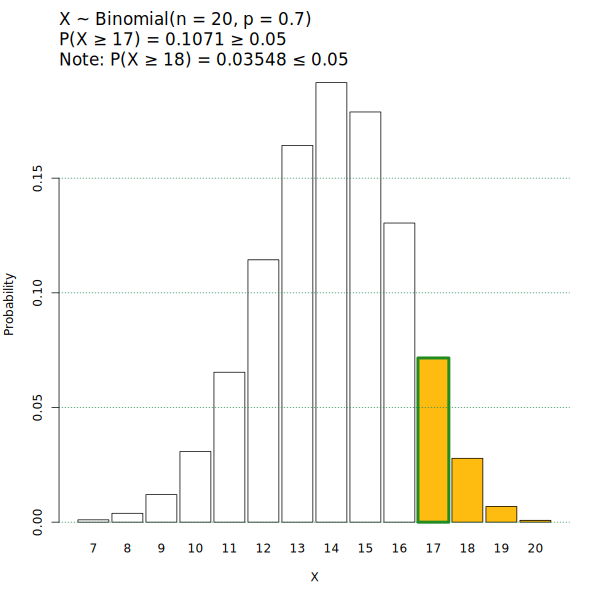
```

Thus, the decision rule $X \geq 17$ would produce a Type I error probability greater than our significance level and cannot be used. However, the decision rule $X \geq 18$ has a Type I error probability below 0.05 and therefore satisfies the significance-level requirement.

Therefore, the critical region at significance level $\alpha=0.05$ is
$$
X \geq 18.
$$
In other words, if 18 or more of the $n=20$ students in the sample report daily YouTube use, we reject $H_0$ in favor of $H_a: p>0.70$.

:::


::: {#exm-inactivity-rejection-calc}
## Physical Inactivity: Finding the Critical Region

In the Physical Inactivity example (@exm-physical-inactivity-error), we are 
testing $H_0: p \geq 0.35$ versus $H_a: p < 0.35$, where $p$ is the 
true proportion of adults in the population who are physically inactive. Using a sample of $n = 50$ adults and a significance level of $\alpha = 0.05$, find the critical region for this test.
:::

::: {.callout-tip .solution-callout collapse="true" icon=false}
## 🔎 Solution
Since the alternative hypothesis is $H_a: p < 0.35$, small values of $X$ provide evidence in favor of $H_a$. Therefore, we are looking for a critical region in the lower tail of the binomial distribution. We use Rguroo’s Discrete Distributions Probability Calculator with the settings shown in  @fig-inactivity-rejection-dialog:

* Set the [No. of Trials]{.des} to [50]{.typein} and the [Prob. of Success]{.des} to [0.35]{.typein}, the boundary value of $p$ in $H_0$.
* From the dropdown, select [Lower Tail]{.dpd} and enter [$0.05$]{.typein} as the significance level $\alpha$.

Because we are using the inverse probability function, the calculator returns the boundary value of $X$ that leaves probability $0.05$ in the lower tail. We then use this value to determine the critical region.

```{r,echo=FALSE}
#| fig-alt: "Rguroo Discrete Distributions Probability Calculator configured for the Physical Inactivity example with Binomial distribution, 50 trials, probability of success 0.35, lower tail selected, and significance level 0.05 entered."
#| warning: FALSE
#| label: fig-inactivity-rejection-dialog
#| fig-cap: "Rguroo Probability Calculator Settings for the Physical Inactivity Critical Region Example"
#| out-width: "80%"
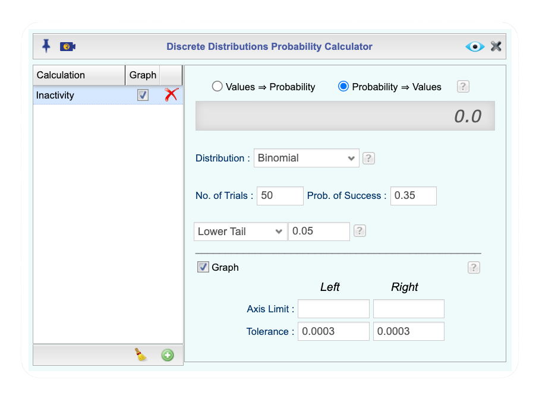
```

The output, shown in @fig-inactivity-rejection, gives
$$P(X \leq 12) = 0.06613 \geq 0.05 \quad \text{and} \quad 
P(X \leq 11) = 0.03423 \leq 0.05.$$

we reject $H_0$ in favor of $H_a: p < 0.35$.
```{r,echo=FALSE}
#| fig-alt: "Binomial distribution histogram for n = 50 and p = 0.35, with the critical region X less than or equal to 11 highlighted in gold, showing that P(X less than or equal to 12) = 0.06613 exceeds 0.05 and P(X less than or equal to 11) = 0.03423 does not."
#| warning: FALSE
#| label: fig-inactivity-rejection
#| fig-cap: "Rguroo Probability Calculator Output for the Physical Inactivity Critical Region Example"
#| out-width: "80%"
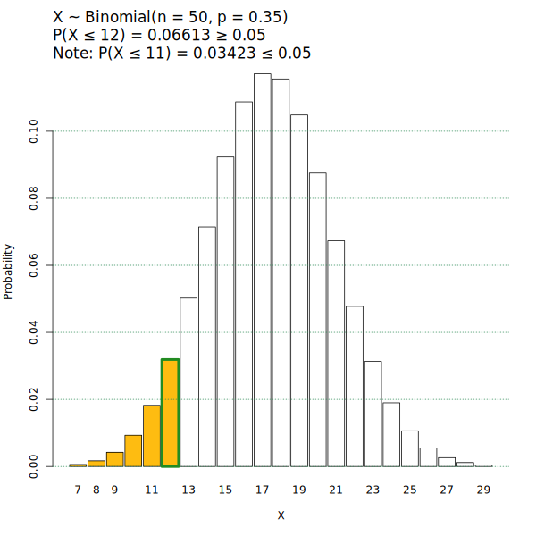
```

This means that the decision rule $X \leq 12$ exceeds our significance level, 
while the decision rule $X \leq 11$ satisfies it. Therefore, the rejection 
region at significance level $\alpha = 0.05$ is 
$$X \leq 11.$$
That is, if we observe 11 or fewer inactive adults in our sample of $n = 50$, 
:::

::: {#exm-social-rejection-calc}
## Social Media as a Primary News Source: Finding the Critical Region

In the Social Media as a Primary News Source example 
(@exm-social-media-news-error), we are testing $H_0: p = 0.36$ versus 
$H_a: p \neq 0.36$, where $p$ is the true proportion of students who use 
social media as their primary news source. Using a sample of $n = 15$ students and a significance level of $\alpha = 0.05$, find the critical region for this test.
:::

::: {.callout-tip .solution-callout collapse="true" icon=false}
## 🔎 Solution

Since the alternative hypothesis is $H_a: p \neq 0.36$, both unusually small and unusually large values of $X$ provide evidence in favor of $H_a$. Therefore, we are looking for a two-sided critical region. For a two-sided test at significance level $\alpha = 0.05$, we split the significance level equally between the two tails, allocating $0.025$ to each tail so that the total Type I error probability is $0.05$.

We use Rguroo’s Discrete Distributions Probability Calculator with the settings shown in @fig-social-rejection-dialog:

* Set the [No. of Trials]{.des} to [15]{.typein} and the [Prob. of Success]{.des} to [0.36]{.typein}, the value of $p$ specified by $H_0$.
* From the dropdown, select [Outside Tails]{.dpd} and enter [$0.025$]{.typein} in each tail box.

Because we are using the inverse probability function, the calculator returns the boundary values of $X$ that leave probability $0.025$ in each tail. These boundaries determine the two-sided critical region.

```{r,echo=FALSE}
#| fig-alt: "Rguroo Discrete Distributions Probability Calculator configured for the Social Media example with Binomial distribution, 15 trials, probability of success 0.36, Outside Tails selected, and 0.025 entered in each tail."
#| warning: FALSE
#| label: fig-social-rejection-dialog
#| fig-cap: "Rguroo Probability Calculator Settings for the Social Media Critical Region Example"
#| out-width: "80%"
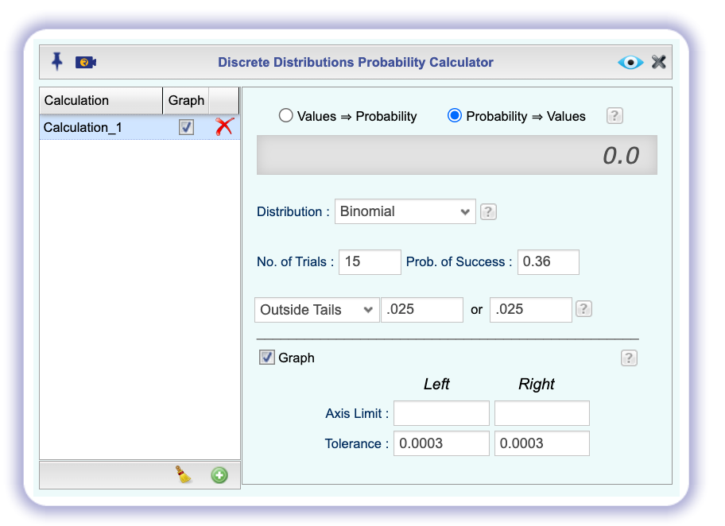
```

The output, shown in @fig-social-rejection, gives
$$P(X \leq 2) + P(X \geq 9) = 0.1032 \geq 0.05,$$
with the additional note that
$$P(X \leq 2) = 0.05281, \quad P(X \geq 9) = 0.05038,$$
$$P(X \leq 1) = 0.01168, \quad P(X \geq 10) = 0.01545.$$
```{r,echo=FALSE}
#| fig-alt: "Binomial distribution histogram for n = 15 and p = 0.36, with the critical region X less than or equal to 2 and X greater than or equal to 9 highlighted in gold, showing that P(X less than or equal to 2) plus P(X greater than or equal to 9) = 0.1032 exceeds 0.05, with additional tail probabilities noted."
#| warning: FALSE
#| label: fig-social-rejection
#| fig-cap: "Rguroo Probability Calculator Output for the Social Media Critical Region Example"
#| out-width: "80%"
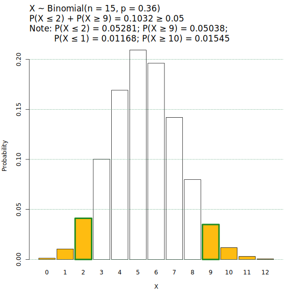
```

The decision rule $X \leq 2$ or $X \geq 9$ exceeds our 
significance level of $\alpha = 0.05$. Moving one step further in each tail, the decision rule $X \leq 1$ or $X \geq 10$ satisfies our significance level since 
$$P(X \leq 1) + P(X \geq 10) = 0.01168 + 0.01545 = 0.02713 \leq 0.05$$.
 Therefore, the critical region at significance level $\alpha = 0.05$ is $$X \leq 1 \quad \text{or} \quad X \geq 10.$$
That is, if we observe 1 or fewer, or 10 or more students in our sample of 
$n = 15$ who use social media as their primary news source, we reject $H_0$ 
in favor of $H_a: p \neq 0.36.$
:::


#### Using Probability Calculator to Compute the p-Value

We now illustrate how to compute the p-value and use it to make a decision, 
starting with the two one-sided examples that we have seen.

:::{#exm-youtube-pvalue-calc}
## YouTube Use: Computing the p-Value and Making a Decision

In the YouTube Use example (@exm-youtube-ppss), we are testing 
$H_0: p \leq 0.70$ versus $H_a: p > 0.70$, where $p$ is the true 
proportion of students in the district who use YouTube daily. A random sample of $n = 20$ students is selected and $x_{\text{obs}} = 17$ report daily YouTube use.

a. Obtain the $H_a$ support.
b. Compute the p-value.
c. At significance level $\alpha = 0.05$, make a decision and state your 
conclusion in the context of the problem.
:::

:::: {.callout-tip .solution-callout collapse="true" icon=false}
## 🔎 Solution
a\. **Obtain the $H_a$ support.**

Since $H_a: p > 0.70$, values of $X$ that are at least as supportive of $H_a$ 
as $x_{\text{obs}} = 17$ are values greater than or equal to 17. Therefore the $H_a$ 
support is $\{17, 18, 19, 20\}$.

b\. **Compute the p-value.**

The p-value is computed at the boundary value $p_0 = 0.70$:
$$\text{p-value} = P(X \geq 17 \mid p = 0.70).$$

We compute this probability using Rguroo's Discrete Distributions Probability 
Calculator with $X \sim \text{Binomial}(20, 0.70)$.

@fig-youtube-pvalue-calc shows the Rguroo dialog and the output, giving

::: {.callout-note appearance="minimal"}
$$\text{p-value} = P(X \geq 17 \mid p = 0.70) \approx 0.1071.$$
:::

::: {#fig-youtube-pvalue-calc layout-ncol=2 layout-valign="top" fig-cap="Rguroo setup (left) and p-value output (right) for the YouTube example. "}

```{r,echo=FALSE}
#| fig-alt: "Rguroo Probability Calculator dialog configured for the YouTube p-value example with Binomial distribution, 20 trials, probability of success 0.70, and upper tail selected."
#| fig-cap: Rguroo dialog for computing the p-value
#| out-width: "100%"
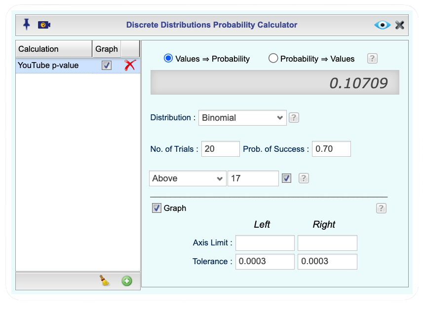
```
```{r,echo=FALSE}
#| fig-alt: "Binomial distribution histogram for n = 20 and p = 0.70, with the p-value support highlighted, showing P(X greater than or equal to 17) = 0.1071."
#| fig-cap: "Rguroo output showing the p-value"
#| out-width: "100%"
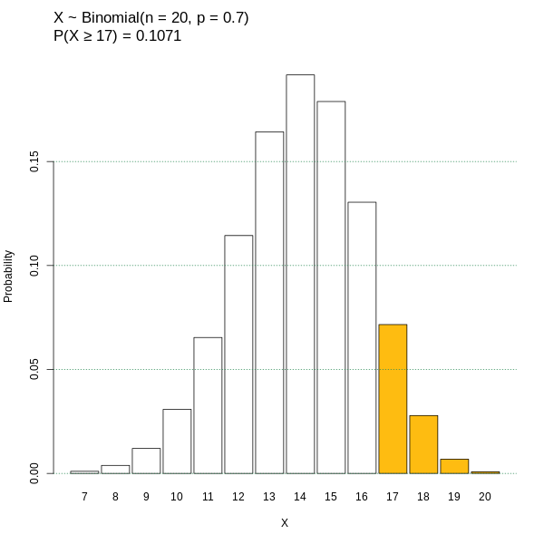
```
:::

c\. **Make a decision.**

Since the p-value $0.1071 > \alpha = 0.05$, we fail to reject $H_0$. The data 
do not provide sufficient evidence at the 5% significance level to conclude that 
more than 70% of students in the district use YouTube daily. Note that this 
conclusion is consistent with the critical region approach: $x_{\text{obs}} = 17$ 
does not fall in the critical region $X \geq 18$ determined in 
@exm-youtube-rejection-calc.

::::

:::{#exm-inactivity-pvalue-calc}
## Physical Inactivity: Computing the p-Value and Making a Decision

In the Physical Inactivity example (@exm-physical-inactivity-ppss), we are 
testing $H_0: p \geq 0.35$ versus $H_a: p < 0.35$, where $p$ is the 
true proportion of adults in the population who are physically inactive. A 
random sample of $n = 50$ adults is selected and $x_{\text{obs}} = 10$ are found to be physically inactive.

a. Obtain the $H_a$ support.
b. Compute the p-value.
c. At significance level $\alpha = 0.05$, make a decision and state your 
conclusion in the context of the problem.
:::

:::: {.callout-tip .solution-callout collapse="true" icon=false}
## 🔎 Solution
a\. **Obtain the $H_a$ support.**

Since $H_a: p < 0.35$, values of $X$ that are at least as supportive of $H_a$ as $x_{\text{obs}} = 10$ are values less than or equal to 10. Therefore the $H_a$ support is $\{0, 1, \ldots, 10\}$.

b\. **Compute the p-value.**

The p-value is computed at the boundary value $p_0 = 0.35$:
$$\text{p-value} = P(X \leq 10 \mid p = 0.35).$$

We compute this probability using Rguroo's Discrete Probability 
Calculator with $X \sim \text{Binomial}(50, 0.35)$. @fig-inactivity-pvalue-calc shows the Rguroo dialog setup (left panel) and the Rguroo output (right panel) giving

::: {.callout-note appearance="minimal"}
$$\text{p-value} = P(X \leq 10 \mid p = 0.35) \approx 0.0160.$$
:::

::: {#fig-inactivity-pvalue-calc layout-ncol=2 layout-valign="bottom" fig-cap="Rguroo setup (left) and p-value output (right) for the Physical Inactivity example."}

```{r,echo=FALSE}
#| fig-alt: "Rguroo Probability Calculator dialog configured for the Physical Inactivity p-value example with Binomial distribution, 50 trials, probability of success 0.35, and lower tail selected."
#| fig-cap: "Rguroo dialog for computing the p-value"
#| out-width: "100%"
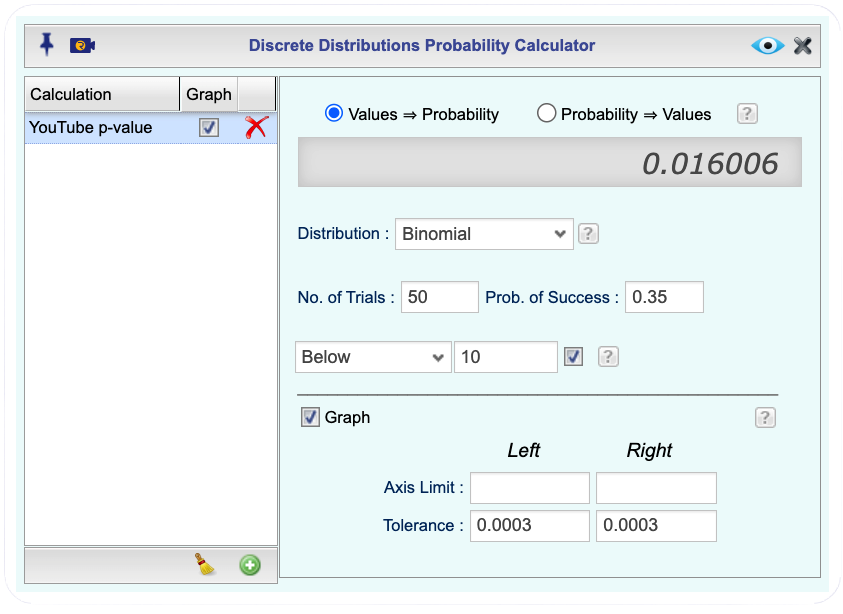
```
```{r,echo=FALSE}
#| fig-alt: "Binomial distribution histogram for n = 50 and p = 0.35, with the p-value support highlighted, showing P(X less than or equal to 10)."
#| fig-cap: "Rguroo output showing the p-value"
#| out-width: "100%"
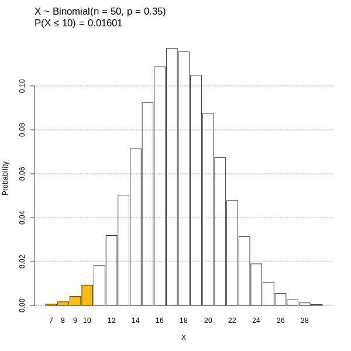
```
:::

c\. **Make a decision.**

Since the p-value $0.0160 < \alpha = 0.05$, we reject $H_0$ in favor of 
$H_a: p < 0.35$. The data provide sufficient evidence at the 5% significance 
level to conclude that fewer than 35% of adults in the population are physically 
inactive. Note that this conclusion is consistent with the critical region 
approach: $x_{\text{obs}} = 10$ falls in the critical region $X \leq 11$ determined 
in @exm-inactivity-rejection-calc.

::::

The two-sided case requires a bit more care. Since $H_a: p \neq p_0$ does not specify a direction, evidence against $H_0$ can come from either tail of the distribution. Recall from Case 3 that a value $x$ is in the $H_a$ support if $P(X = x \mid p = p_0) \leq P(X = x_{\text{obs}} \mid p = p_0)$, that is, if it is at least as unlikely as $x_{\text{obs}}$ under $H_0$.

:::{#exm-social-pvalue-calc}
## Social Media as a Primary News Source: Computing the p-Value and Making a Decision

In the Social Media as a Primary News Source example (@exm-social-media-news-ppss), we are testing $H_0: p = 0.36$ versus $H_a: p \neq 0.36$, where $p$ is the true proportion of students who use social media as their primary news source. A random sample of $n = 15$ students is selected and $x_{\text{obs}} = 9$ report using social media as their primary news source.

a. Obtain the $H_a$ support.
b. Compute the p-value.
c. At significance level $\alpha = 0.05$, make a decision and state your 
conclusion in the context of the problem.
:::

:::: {.callout-tip .solution-callout collapse="true" icon=false}
## 🔎 Solution
a\. **Obtain the $H_a$ support.**

Since $H_a: p \neq 0.36$, values of $X$ that are at least as supportive of 
$H_a$ as the observed value $x_{\text{obs}} = 9$ are those that are at least as unlikely 
as $x_{\text{obs}} = 9$ under $H_0$. That is, the $H_a$ support consists of $x_{\text{obs}} = 9$ 
and all values $x$ for which
$$
P(X = x \mid p = 0.36) \leq P(X = 9 \mid p = 0.36).
$$

Figure @fig-social-pvalue-calc shows the Rguroo dialog and output used to compute 
$P(X = x \mid p = 0.36)$. The probability of the observed value is 
$P(X = 9 \mid p = 0.36) \approx 0.0349$. Therefore, any value of $x$ with 
probability less than or equal to $0.0349$ is included in the $H_a$ support, 
in addition to $x_{\text{obs}} = 9$.

From the graph, the $H_a$ support consists of $\{0, 1\}$ in the left tail and 
$\{9, 10, 11, \ldots, 15\}$ in the right tail.

Note that the graph is truncated at $X = 12$, since the probabilities for 
values greater than 12 are extremely small.

::: {#fig-social-pvalue-calc layout-ncol=2 layout-valign="bottom" fig-cap="Rguroo setup (left) and Rguroo output for $P(X=9)$ (right) for the Social Media example."}

```{r,echo=FALSE}
#| fig-alt: "Rguroo Probability Calculator dialog configured for the Social Media p-value example with Binomial distribution, 15 trials, probability of success 0.36, and probability of x = 9 computed."
#| fig-cap: 'Rguroo dialog'
#| out-width: "100%"
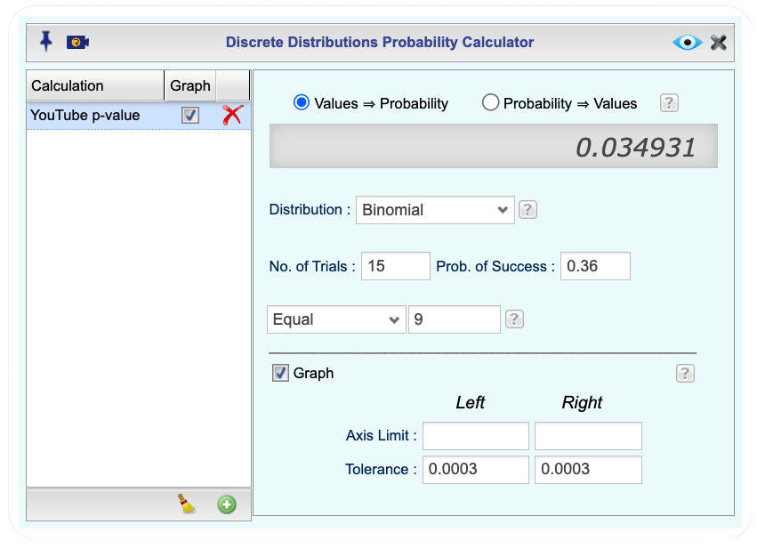
```
```{r,echo=FALSE}
#| fig-alt: 'Binomial distribution histogram for n = 15 and p = 0.36,  showing the probabilty of $X = 9$'
#| fig-cap: 'Rguroo output'
#| out-width: "100%"
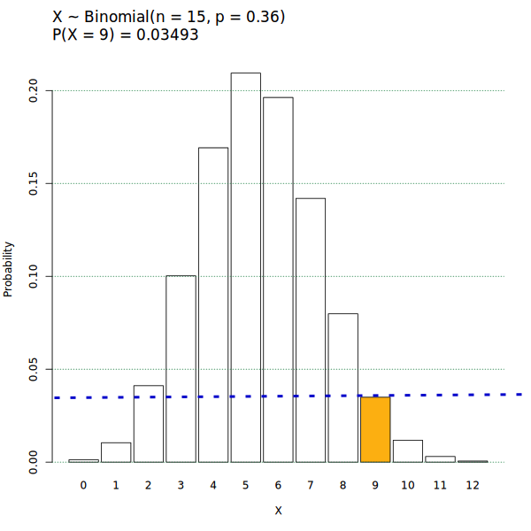
```
:::

b\. **Compute the p-value.**

The p-value is computed at the boundary value $p_0 = 0.36$. Using Rguroo’s 
Discrete Probability Calculator with $X \sim \text{Binomial}(15, 0.36)$, we 
compute the probability that $X$ falls in the $H_a$ support.

Recall that the $H_a$ support consists of the values $\{0, 1, 9, 10, 11, \ldots, 15\}$. 
Therefore, the p-value is the total probability of these values under $H_0$.

Figure @fig-social-pvalue-calc shows the Rguroo output, giving

::: {.callout-note appearance="minimal"}
$$
\text{p-value} = P\left(X \text{ is a value in the } H_a \text{ support} 
\mid p = 0.36\right) \approx 0.0621.
$$
:::

::: {#fig-social-pvalue-calc layout-ncol=2 layout-valign="bottom" fig-cap="Rguroo setup (left) and Rguroo output (right) for computing the p-value for the Social Media example."}

```{r,echo=FALSE}
#| fig-alt: "Rguroo Probability Calculator dialog configured for the Social Media p-value example with Binomial distribution, 15 trials, probability of success 0.36, and probability of x <=0 and x>=9 computed."
#| fig-cap: 'Rguroo dialog'
#| out-width: "100%"
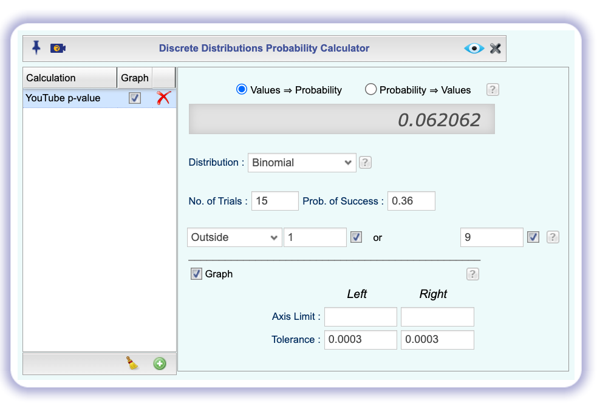
```
```{r,echo=FALSE}
#| fig-alt: 'Binomial distribution histogram for n = 15 and p = 0.36,  showing the p-value for the social media example$'
#| fig-cap: 'Rguroo output'
#| out-width: "100%"
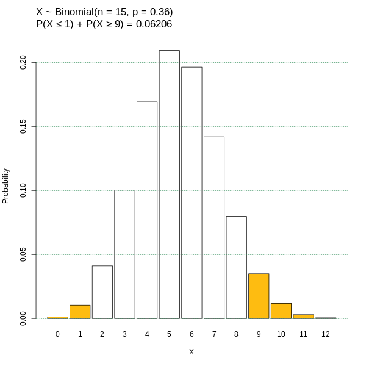
```
:::

c\. **Make a decision.**

Since the p-value $0.0621 > \alpha = 0.05$, we fail to reject $H_0$ in favor of $H_a: p \neq 0.36$. The data do not provide sufficient evidence at the 5% significance level to conclude that the proportion of students who use social media as their primary news source differs from 0.36.

This conclusion is consistent with the critical region approach: the observed value $x_{\text{obs}} = 9$ does not fall in the critical region $X \leq 1$ or $X \geq 10$ determined in @exm-social-rejection-calc.

::::

### Homework for Section @sec-closer-look-cr-pvalue ** {#sec-rr-hw}

For each of the following scenarios, answer these questions:

a. Write the null and alternative hypotheses using mathematical notation.
b. Use Rguroo's Probability Calculator to find the critical region at
the given significance level.
c. Does $x_{\text{obs}}$ fall in the critical region? Do you reject or fail to reject $H_0$?
d. Obtain the $H_a$ support.
e. Use Rguroo's Probability Calculator to compute the p-value.
f. Is the p-value smaller than the significance level? Do you reject or fail to reject $H_0$?
g. State your decision in the context of the problem.

---

1. **Arizona Marijuana Legalization**
In Problem 1 (Arizona Marijuana Legalization) of @sec-stage-hw, $p$ is
the true proportion of Arizona registered voters who support marijuana
legalization. Do Arizona registered voters differ from Colorado residents
in their support for marijuana legalization? The sample consisted of
$n = 779$ voters, of whom $x_{\text{obs}} = 390$ favored legalization.
Use $\alpha = 0.05$.

2. **Australian Unemployment Outlook**
In Problem 2 (Australian Unemployment Outlook) of @sec-stage-hw, $p$ is
the true proportion of Australians in November 1997 who believed
unemployment would increase. Did Australian sentiment about unemployment
shift between July and November of 1997? The sample consisted of
$n = 631$ Australians, of whom $x_{\text{obs}} = 284$ believed
unemployment would increase. Use $\alpha = 0.05$.

3. **Arkansas Identity Theft Complaints**
In Problem 3 (Arkansas Identity Theft Complaints) of @sec-stage-hw, $p$
is the true proportion of consumer complaints in Arkansas that were for
identity theft. Was the proportion of identity theft complaints in Arkansas
greater than the national figure of 23%? The sample consisted of
$n = 3{,}482$ complaints, of which $x_{\text{obs}} = 1{,}601$ were for
identity theft. Use $\alpha = 0.01$.

4. **Alaska Identity Theft Complaints**
In Problem 4 (Alaska Identity Theft Complaints) of @sec-stage-hw, $p$
is the true proportion of consumer complaints in Alaska that were for
identity theft. Was Alaska's proportion of identity theft complaints less
than the national proportion of 23%? The sample consisted of
$n = 1{,}432$ complaints, of which $x_{\text{obs}} = 321$ were for
identity theft. Use $\alpha = 0.05$.

5. **Kennedy Assassination Conspiracy Belief**
In Problem 5 (Kennedy Assassination Conspiracy Belief) of @sec-stage-hw,
$p$ is the true proportion of American adults in 2013 who believed there
was a conspiracy behind President Kennedy's assassination. Is there evidence
that American belief in a conspiracy behind President Kennedy's assassination
changed between 2001 and 2013? The sample consisted of $n = 1{,}039$
adults, of whom $x_{\text{obs}} = 634$ believed in a conspiracy.
Use $\alpha = 0.05$.

6. **Autism Spectrum Disorder in Arizona**
In Problem 6 (Autism Spectrum Disorder in Arizona) of @sec-stage-hw, $p$
is the true proportion of children in Arizona diagnosed with ASD. Is the
rate of ASD diagnosis among children in Arizona greater than the national
rate of 1 in 88 children? The sample consisted of $n = 32{,}601$ children,
of whom $x_{\text{obs}} = 507$ were diagnosed with ASD. Use $\alpha = 0.05$.

7. **Graduate Degree Attainment: GSS2024**
In Problem 7 (Graduate Degree Attainment: GSS2024) of @sec-stage-hw, $p$
is the true proportion of U.S. adults who hold a graduate degree. Does the GSS2024 data provide evidence that the proportion of U.S. adults who hold a graduate degree differs from the 15% reported by the U.S. Census Bureau?
The sample consisted of $n = 388$ adults, of whom $x_{\text{obs}} = 33$
reported a graduate degree as their highest level of education.
Use $\alpha = 0.05$.

## Confidence Interval for a Population Proportion {#sec-confidence-interval-one-pop}

Recall from @sec-foundations-confidence-intervals that a confidence interval gives us a range of plausible values for a population parameter. In this section, our parameter is the population proportion $p$, and we use the sample proportion $\hat{p}$ as our estimate of it. Because $\hat{p}$ varies from sample to sample, we do not expect it to equal $p$ exactly. Instead, we use the observed sample proportion $\hat{p}_{\text{obs}}$ to construct an interval of plausible values for $p$.

As discussed in @sec-foundations-confidence-intervals, the confidence level describes the long-run success rate of the method used to construct the interval. For example, a 95% confidence interval comes from a method that captures the true value of $p$ in about 95% of repeated samples. In practice, however, we collect one sample and construct one interval.

::: {.callout-note appearance="minimal"}
## Confidence Level
Imagine that we repeatedly take random samples from the same population and construct a confidence interval for $p$ using the same method each time. Because the samples differ, the intervals will also differ. Some intervals will contain the true population proportion $p$, while others will not.

The confidence level tells us the percentage of these intervals that we expect to contain the true value of $p$. For example, a 95% confidence level means that, over many repeated samples, about 95% of the intervals constructed using this method would contain the true population proportion $p$.
:::

Recall from @sec-foundations-confidence-intervals that we can construct a confidence interval by inverting a two-sided hypothesis test. For a population proportion, we consider different candidate values $p_0$ and test
$$
H_0:p=p_0
\qquad\text{versus}\qquad
H_a:p\neq p_0.
$$
If we fail to reject $H_0$, our data are consistent with $p_0$, so we consider $p_0$ a plausible value for $p$. If we reject $H_0$, we do not consider $p_0$ plausible.  We repeat this process for different values of $p_0$. The collection of all values for which we fail to reject $H_0$ forms our confidence interval.

::: {.callout-note appearance="minimal"}
## Confidence Interval by Test Inversion

A $(1-\alpha) \times 100\%$ confidence interval for $p$ consists of all candidate values $p_0$ for which we fail to reject

$$
H_0:p=p_0
$$

in a two-sided hypothesis test at significance level $\alpha$.
:::

The following example illustrates this idea by testing
a grid of values of $p_0$ and identifying which ones are consistent
with the observed data.

:::{#exm-youtube-ci-grid}
## Daily YouTube Use Among Teens: Building a Confidence Interval from a Grid

Recall @exm-youtube-ppss. A sample of $n = 20$ students produced
$x_{\text{obs}} = 17$ daily YouTube users, giving an observed sample proportion of
$\hat{p}_{\text{obs}} = 17/20 = 0.85$.

For each candidate value of $p_0$ shown in the grid below, carry out the two-sided
hypothesis test $H_0: p = p_0$ versus $H_a: p \neq p_0$ at
significance level $\alpha = 0.05$, using the binomial distribution with
$n = 20$ and $x_{\text{obs}} = 17$. Based on the results, identify the
range of values of $p_0$ for which we fail to reject $H_0$. 

```{r,echo=FALSE}
#| fig-alt: "A horizontal number line showing values from about 0.50 to 0.99 marked with evenly spaced dots. One value, 0.85, is highlighted with a diamond shape and labeled “p_obs = 0.85,” indicating the observed proportion among the possible values."
#| fig-cap: ""
#| out-width: "80%"

```

:::


::: {.callout-tip .solution-callout collapse="true" icon=false}
## 🔎 Solution

For each candidate value of $p_0$ in the grid, we compute the two-sided p-value
using the binomial distribution $X \sim \text{Binomial}(20, p_0)$. The
p-value is the probability of observing values of $X$ that are at least as supportive of $H_a$ as the observed value $x_{\text{obs}}=17$, assuming $H_0$ is true. We
then compare each p-value to $\alpha = 0.05$ to decide whether to reject
or fail to reject $H_0$.

| $p_0$ | p-value | Decision |
|---------|---------|----------|
| 0.55 | 0.006 | Reject $H_0$ |
| 0.60 | 0.022 | Reject $H_0$ |
| 0.65 | 0.064 | Fail to reject $H_0$ |
| 0.70 | 0.220 | Fail to reject $H_0$ |
| 0.75 | 0.439 | Fail to reject $H_0$ |
| 0.80 | 0.781 | Fail to reject $H_0$ |
| 0.85 | 1.000 | Fail to reject $H_0$ |
| 0.90 | 0.445 | Fail to reject $H_0$ |
| 0.95 | 0.075 | Fail to reject $H_0$ |
| 0.99 | 0.001 | Reject $H_0$ |

The graph below shows the result graphically:

```{r,echo=FALSE}
#| fig-alt: "A number line of possible proportion values with the observed value 0.85 highlighted. A central range is indicated as the “fail to reject” region, while values farther from the center fall into the critical regions."
#| fig-cap: ""
#| out-width: "80%"

```

As shown in the table and the graph, we fail to reject $H_0$ for candidate values of $p_0$
ranging from 0.65 to 0.95, and reject $H_0$ for the candidate values 0.55, 0.60 and 0.99. Based on this grid, the range of plausible values for $p$ is approximately $0.65$ to $0.95$.

This gives us an approximate 95% confidence interval based on the candidate values in our grid. If we tested more closely spaced values of $p_0$, we could locate the endpoints of the confidence interval more precisely.

:::

The confidence interval that we obtained in the example above is an approximation to
the collection of values of $p_0$$ that are consistent with our observed data at significance level $\alpha = 0.05$. Notice that the interval is not symmetric around
$\hat{p}_{\text{obs}} = 0.85$: it extends further below $\hat{p}_{\text{obs}}$
(down to approximately 0.65) than above it (up to approximately 0.95).
This asymmetry is not surprising when the sample proportion is close to 0 or 1. Recall the large-sample condition from @sec-large-sample-one-prop. Using $\hat{p}_{\text{obs}} = 0.85$ as our estimate of $p$, we compute:

$$
$$n\hat{p}_{\text{obs}} = 20 \times 0.85 = 17 \geq 10,
\; \text{but}\;
n(1-\hat{p}_{\text{obs}}) = 20 \times 0.15 = 3 < 10.
$$

The large-sample condition fails because there are 3 observed failures. With a relatively small sample and a sample proportion close to 1, the binomial distribution can be noticeably skewed rather than approximately normal. As a result, an exact confidence interval need not be symmetric around $\hat{p}_{\text{obs}}$. A method based on a symmetric normal approximation may not work well in this situation.

This example illustrates that the choice of method for constructing a confidence interval matters. In the subsections that follow, we study two methods in detail. We begin in @sec-ci-large-sample with the large-sample method, which uses the normal approximation and produces a confidence interval that is symmetric around $\hat{p}_{\text{obs}}$. We consider this method first because it is widely used in practice and builds directly on the large-sample methods we have already developed for hypothesis testing. When the large-sample condition is satisfied, the normal approximation generally works well; however, it may be misleading when the condition is not satisfied, as in this example.

We then consider the exact binomial method in @sec-ci-binomial. This method does not rely on the normal approximation and can produce an asymmetric confidence interval. It is particularly useful when the large-sample condition is not satisfied.

::: {.callout-tip}
## Symmetry of the Normal-Approximation Interval

Because the normal distribution is symmetric, the large-sample confidence interval we will construct is symmetric around $\hat{p}_{\text{obs}}$. In contrast, an exact binomial confidence interval does not need to be symmetric. This difference can be especially noticeable when the sample size is small or $\hat{p}_{\text{obs}}$ is close to 0 or 1.
:::

### Confidence Interval Based on the Large Sample Normal Approximation {#sec-ci-large-sample}

We begin with the large-sample method for constructing a confidence interval for a population proportion. This method uses the normal approximation to the sampling distribution of $\hat{p}$ and is one of the most commonly used methods for confidence intervals for a proportion. It also builds directly on the large-sample methods we used earlier for hypothesis testing.

Recall from @sec-large-sample-one-prop that when the large sample condition is satisfied, the sampling distribution of $\hat{p}$ is approximately normal. We can use this normal distribution to determine how far we should extend on either side of the observed sample proportion $\hat{p}_{\text{obs}}$ to obtain a range of plausible values for $p$.

To construct the interval, we first need to estimate the variability of $\hat{p}$. Recall that the standard deviation of the sampling distribution of $\hat{p}$ is
$$\sqrt{\frac{p(1-p)}{n}}.$$
Because the population proportion $p$ is unknown, we use the observed sample proportion $\hat{p}_{\text{obs}}$ in its place. The resulting estimate of the standard deviation is called the standard error of $\hat{p}$:
$$\text{SE}(\hat{p}) = \sqrt{\frac{\hat{p}_{\text{obs}}(1 - \hat{p}_{\text{obs}})}{n}}.$$

For a confidence interval, we check the large sample condition using $\hat{p}_{\text{obs}}$:
$$n\hat{p}_{\text{obs}} \geq 10 \qquad \text{and} \qquad
n(1-\hat{p}_{\text{obs}}) \geq 10.$$

When this condition is satisfied, the $(1-\alpha) \times 100\%$ 
confidence interval for $p$ takes the form

$$\hat{p}_{\text{obs}} \pm z^* \times \text{SE}(\hat{p}),$$

where $z^*$ is the **critical value** from the standard normal
distribution corresponding to the desired confidence level. 

The quantity
$z^* \times \text{SE}(\hat{p})$ is called the **margin of error**. It tells us how far we extend below and above $\hat{p}_{\text{obs}}$ when constructing the interval. A larger margin of error produces a wider interval and reflects greater uncertainty in our estimate of $p$.

Common critical values are:

| Confidence Level | $\alpha$ | $z^*$ |
|-----------------|----------|-------|
| 90% | 0.10 | 1.645 |
| 95% | 0.05 | 1.960 |
| 99% | 0.01 | 2.576 |

::: {.callout-note}
## Large Sample Confidence Interval for a Population Proportion

When the large sample condition $n\hat{p}_{\text{obs}} \geq 10$ and
$n(1-\hat{p}_{\text{obs}}) \geq 10$ is satisfied, an approximate
$(1-\alpha) \times 100\%$ confidence interval for $p$ is:

$$\hat{p}_{\text{obs}} \pm \underbrace{z^* \times
\sqrt{\frac{\hat{p}_{\text{obs}}(1-\hat{p}_{\text{obs}})}{n}}}_{\text{margin of error}},$$

which gives the interval

$$\left(\hat{p}_{\text{obs}} - z^* \times
\sqrt{\frac{\hat{p}_{\text{obs}}(1-\hat{p}_{\text{obs}})}{n}},\;
\hat{p}_{\text{obs}} + z^* \times
\sqrt{\frac{\hat{p}_{\text{obs}}(1-\hat{p}_{\text{obs}})}{n}}\right).$$

This interval is always symmetric around $\hat{p}_{\text{obs}}$. When the large sample condition is satisfied, the normal approximation generally works well; when it is not, the resulting confidence interval may be misleading.
:::


:::{#exm-inactivity-ci-large-sample}
## Physical Inactivity Among Adults: Large Sample Confidence Interval

Recall @exm-physical-inactivity-ppss. A sample of $n = 50$ adults
produced $x_{\text{obs}} = 10$ physically inactive individuals, giving
a sample proportion of $\hat{p}_{\text{obs}} = 10/50 = 0.20$.

a. Use Rguroo's [One-Population Proportion]{.fun} inference function
to obtain a 95% large sample normal approximation confidence interval
for $p$, the true proportion of adults in the country who are physically
inactive. Interpret the interval.

b. Use Rguroo's [One-Population Proportion]{.fun} inference function
to obtain a 99% large sample normal approximation confidence interval
for $p$, and compare its width to the interval you obtained in part (a).

:::


::: {#solution-inactivity-ci-large-sample .callout-tip .solution-callout collapse="true" icon=false}
## 🔎 Solution

a\. Click to expand the box below to see how to use the [Proportion Inference]{.fun}  function in Rguroo to obtain a large sample normal confidence interval for this problem.

::: {#prop-ci-normal-youtube .callout-note appearance="simple" collapse="true" icon="none" title="{width=22px style='vertical-align:middle;'} Large Sample Normal Confidence Interval - Physical Inactivity example"}

1. Open the **Analytics** toolbox in Rguroo.  

2. From the [Analysis]{.dpd} dropdown, select [Proportion Inference]{.fun} → [One Population]{.fun}. This opens the [One Population Proportion Inference]{.dialog} dialog.

3. In the **Data** section of the dialog, enter the following:
   - In the [Factor Label]{.des} textbox, type a label for the categorical variable. In Rguroo, a “factor” refers to a categorical variable. For this example, enter [Physically Inactive]{.typein}.
   - In the [Success Label]{.des} textbox, type [Yes]{.typein}. A success corresponds to a person who is physically inactive.
   - In the [Failure Label]{.des} textbox, type [No]{.typein}.
   - In the [Sample Size]{.des} textbox, type [50]{.typein}.
   - In the [\# of Successes]{.des} textbox, type [10]{.typein}.

4. In the **Confidence Interval** section of the dialog, enter the following:
   - In the [Confidence Level]{.des} textbox enter [0.95]{.typein}. This is the default value corresponding to the confidence level 95%.
   - Select the [Large Sample z]{.des} checkbox to obtain the large sample normal confidence interval.

6. Click the preview icon  to view the output.

7. Click the  button and save the result as [YoutubenormalCi]{.typein}.

::: {.callout-tip .inner-callout collapse="true" title="Rguroo One-Population Proportion dialogs"}

```{r,echo=FALSE}
#| fig-alt: "Interface for one population proportion inference using a dataset on physical inactivity. The sample size is 50 with 10 successes, giving a sample proportion of 0.20. The confidence interval section shows a 95% confidence level with the “Large Sample z” method selected."
#| fig-cap: "Rguroo Basics dialog showing how to obtain large sample normal CI"
#| out-width: "100%"
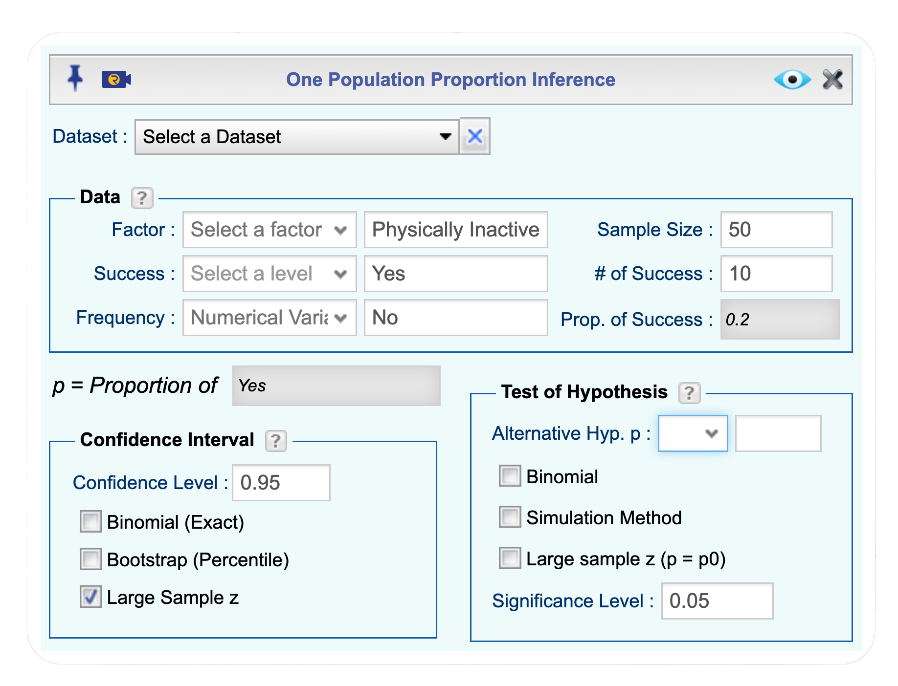
```
:::

:::

Click to expand the box below to see the Rguroo output.

::: {.callout-tip .inner-callout collapse="true" title="Rguroo output: One-Population Proportion Inference Output - Physical Activity"}

<div tabindex="0" class="rg-iframe-wrapper">
  <iframe
    src="Rguroo_html_output/Proportion Inference/Physical_activity_ci_normal_docx/Physical_activity_ci_normal.html"
    class="rg-iframe"
    title="Rguroo output: One Population Proportion Large Sample Normal CI - Physical Activity Example">
  </iframe>
</div>

:::

From the Rguroo output, the 95% large sample confidence interval for
$p$ is $(0.089, 0.311)$. We are 95% confident that
the true proportion of adults in the country who are physically
inactive is between 0.089 (8.9%) and 0.311 (31.1%).

b\. To obtain a 99% confidence interval, we use the same steps as in part (a) except for Step 4 of the Rguroo instructions, we enter [0.99]{.typein} instead of [0.95]{.typein} in the [Confidence Level]{.des} textbox.

The 99% confidence interval reported in the Rguroo output is $(0.0543, 0.3457)$ with width of 0.2914. This compares with the 95% confidence interval of $(0.0891, 0.3109)$ with a width of 0.2217. 

The 99% confidence interval is wider than the 95% confidence interval. For the same sample size and observed sample proportion, a higher confidence level produces a wider confidence interval. 
:::

As we saw in the example above, increasing the confidence level resulted in a wider confidence interval. This illustrates an important relationship between confidence level and interval width.

::: {.callout-note appearance="minimal"}
## Confidence Level and Interval Width

For the same sample size and observed sample proportion, a higher confidence level produces a wider confidence interval. To be more confident that the interval captures the true population proportion, we must include a wider range of plausible values for $p$. This wider interval reflects the tradeoff we make to be more confident that the interval captures the true population proportion.
:::

:::{#exm-social-ci-large-sample}
## Social Media as a Primary News Source: Large Sample Confidence Interval

Recall @exm-social-media-pvalue-large-sample. A sample of $n = 35$ students
produced $x_{\text{obs}} = 21$ who reported using social media as their
primary news source, giving an observed sample proportion of
$\hat{p}_{\text{obs}} = 21/35 = 0.60$.

a. Check the 10-10 rule and determine whether the large sample normal approximation applies.


b. Use Rguroo's [One-Population Proportion]{.fun} inference function
to obtain a 95% large sample normal approximation confidence interval
for the true proportion of students at the university who get most of
their news from social media.

c. What is the margin of error for this interval?

d. In @exm-social-media-pvalue-large-sample, we tested the hypotheses
$$
\begin{cases}
H_0: p = 0.36 \\
H_a: p \neq 0.36.
\end{cases}
$$
Based on the confidence interval that you obtained in part (b), is $p=0.36$ a plausible value for the true proportion of students at the university who get most of their news from social media? How does your conclusion here compare to the conclusion from the hypothesis test in @exm-social-media-pvalue-large-sample?

:::

:::: {.callout-tip .solution-callout collapse="true" icon=false}
## 🔎 Solution

a\. $$n\hat{p}_{\text{obs}} = 35 \times 0.6 = 21 \geq 10, \;
\text{and} \,
n(1-\hat{p}_{\text{obs}}) = 35 \times 0.4 = 14 \geq 10.$$

Both quantities satisfy the 10-10 rule. Therefore, the large sample normal approximation is appropriate.

b\. The following is a screenshot of the [One Population Proportion Inference]{.dialog} dialog for obtaining the large sample normal confidence interval for this example.

```{r,echo=FALSE}
#| fig-alt: "Interface for one population proportion inference using a dataset on social media use. The sample size is 35 with 21 successes, giving a sample proportion of 0.60. The confidence interval section shows a 95% confidence level with the “Large Sample z” method selected, and no hypothesis test options are selected."
#| fig-cap: "Rguroo Basics dialog showing how to obtain large sample normal CI"
#| out-width: "100%"
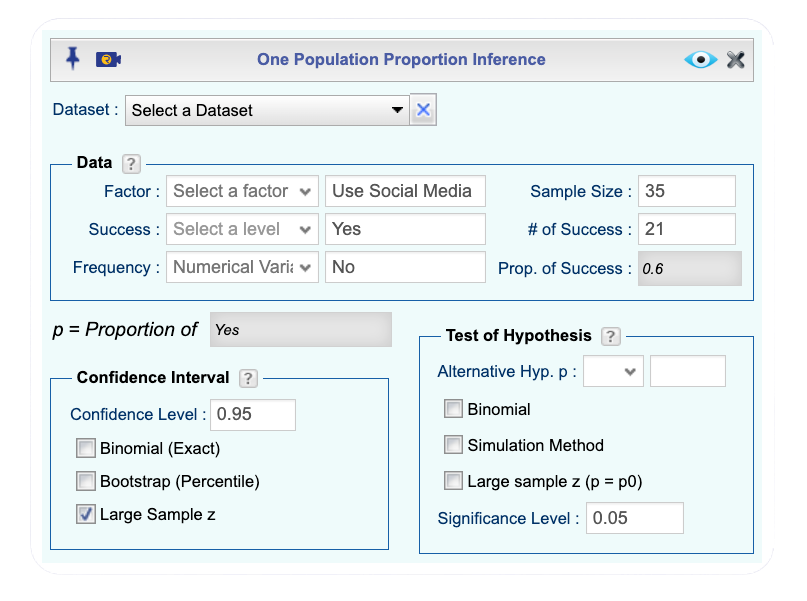
```
Click to expand the box below to see the Rguroo output.

::: {.callout-tip .inner-callout collapse="true" title="Rguroo output: One-Population Proportion Inference Output - Social Media"}

<div tabindex="0" class="rg-iframe-wrapper">
  <iframe
    src='Rguroo_html_output/Proportion Inference/socialNormalCI_docx/1_Population_Prop_3.html'
    class="rg-iframe"
    title="Rguroo output: One Population Proportion Large Sample Normal CI - Social Media Example">
  </iframe>
</div>

:::

From the Rguroo output, the 95% large sample confidence interval for
$p$ is $(0.4377, 0.7623)$. We are 95% confident that
the true proportion of students at the university who get most of
their news from social media is between 0.438 (43.8%) and 0.762 (76.2%).

c\. From the Rguroo output, the standard error is $0.0828079$. For a 95% confidence level, $z^*= 1.96$. Using these two values, 

$$\text{Margin of Error} = 0.0828079\times 1.96 \approx 0.1623$$
The Rguroo output also reports the width of the interval as $0.324601$. Using this value, you can also obtain the margin of error as
$$\text{Margin of Error}=\frac{\text{width of the interval}}{2} = \frac{0.324601}{2}\approx 0.1623.$$
d\. The interval $(0.4377, 0.7623)$ does not contain the null value of 0.36, so 0.36 is not a plausible value for $p$. This is consistent with the result of the hypothesis test in @exm-social-media-pvalue-large-sample, where we rejected the null hypothesis $H_0:p=0.36$.
::::

As we saw in @exm-social-ci-large-sample, the 95% confidence interval did not contain the null value $p_0=0.36$, and the corresponding two-sided hypothesis test at $\alpha=0.05$ rejected $H_0:p=0.36$. This is not a coincidence. Recall from @sec-foundations-confidence-intervals that a confidence interval can be constructed by inverting a two-sided hypothesis test.

More generally, a $(1-\alpha)\times100\%$ confidence interval and a two-sided hypothesis test at significance level $\alpha$ lead to the same decision. If the null value $p_0$ is inside the confidence interval, it is a plausible value for $p$ based on the observed data, and we fail to reject $H_0$. If $p_0$ is outside the confidence interval, it is not a plausible value for $p$, and we reject $H_0$.

::: {.callout-note appearance="minimal"}
## Using a Confidence Interval to Make a Decision

For a two-sided hypothesis test
$$
H_0:p=p_0
\qquad\text{versus}\qquad
H_a:p\neq p_0,
$$ at significance level $\alpha$, use the corresponding $(1-\alpha)\times100%$ confidence interval:
If $p_0$ is inside the confidence interval, fail to reject $H_0$.
If $p_0$ is outside the confidence interval, reject $H_0$.
For example, a two-sided test at $\alpha=0.05$ corresponds to a 95% confidence interval.
:::

:::{#exm-gss-ci-large-sample}
## Marijuana Legalization: Large Sample Confidence Interval

Recall @exm-gss-marijuana-pvalue. The [GSS2024]{.data} dataset contains
responses from $n = 388$ U.S. adults, of whom $x_{\text{obs}} = 282$
supported the legalization of marijuana, giving a sample proportion of
$\hat{p}_{\text{obs}} = 282/388 \approx 0.7268$.

a. Check the 10-10 rule and determine whether the large sample normal approximation applies.

b. Use Rguroo's [One-Population Proportion]{.fun} inference function
to obtain a 95% large sample normal approximation confidence interval
for the true proportion of American adults who support the legalization
of marijuana.

c. What is the margin of error for this interval?

<div tabindex="0" style="width:85%; margin:auto;">

 The dataset
for this example is available in the Rguroo dataset repository
[Kozak]{.repo}, with the dataset name [GSS2024]{.data}.

**Code book for Dataset GSS2024 is given [here](#code-book-gss2024).**

</div>

:::

::: {#solution-gss-ci-large-sample .callout-tip .solution-callout collapse="true" icon=false}
## 🔎 Solution

a\. Checking the 10-10 rule:

$$
\begin{aligned}
n\hat{p}_{\text{obs}}
&= 388 \times 0.7268 \approx 282 \geq 10, \\
n(1-\hat{p}_{\text{obs}})
&= 388 \times 0.2732 \approx 106 \geq 10.
\end{aligned}
$$
Both values satisfy the 10-10 rule. Therefore, the large sample normal approximation is appropriate.

b\.  Click to see Rguroo instructions for obtaining a confidence interval:

::: {#prop-inference-gss2024-CI-ls .callout-note appearance="simple" collapse="true" icon="none" title="{width=22px style='vertical-align:middle;'} One-Population proportion hypothesis test — Marijuana Legalization Example"}

**Before you begin:** Make sure you have already imported the [GSS2024]{.data} dataset into your Rguroo account, as shown [here](#Importing-GSS2024-to-Rguroo).

1. Open the **Analytics** toolbox in Rguroo.  
2. From the [Analysis]{.dpd} dropdown, select [Proportion Inference]{.fun} → [One Population]{.fun}. This opens the [One Population Proportion Inference]{.dialog} dialog.
3. From the [Dataset]{.dpd} dropdown select the dataset [GSS2024]{.data}.
4. From the [Factor]{.dpd} dropdown select the categorical variable [Grass]{.var}. 
5. (Optional) In the [Factor Label]{.des} textbox type in [Legalize Marijuana]{.typein}. The label is usually a more descriptive version of the variable name.
6. From the [Success]{.dpd} dropdown select [Yes]{.typein}. This indicates those who agree with legalization of marijuana. (Once you select these values, the sample size, number of successes, and proportion of successes will be populated automatically on the dialog.)
7. In the **Confidence Interval** section of the dialog, enter the following:
   - In the [Confidence Level]{.des} textbox, type in [0.95]{.typein}.
   - Select the [Large Sample z]{.des} checkbox to use the large sample normal approximation method.
   
8. Click the preview icon  to view the output.

9. Click the  button and save the result as [GSS2024PropCI]{.typein}.

::: {.callout-tip .inner-callout collapse="true" title="Rguroo One-Population Proportion dialog"}

The following is a screenshot of the [One Population Proportion Inference]{.dialog} dialog for obtaining the large sample normal confidence interval for this example.

```{r,echo=FALSE}
#| fig-alt: "Interface for one population proportion inference using the GSS2024 dataset on support for legalizing marijuana. The sample size is 388 with 282 successes, giving a sample proportion of about 0.727. The confidence interval section shows a 95% confidence level with the “Large Sample z” method selected."
#| fig-cap: "Rguroo Basics dialog showing how to obtain a large sample normal confidence interval"
#| out-width: "100%"
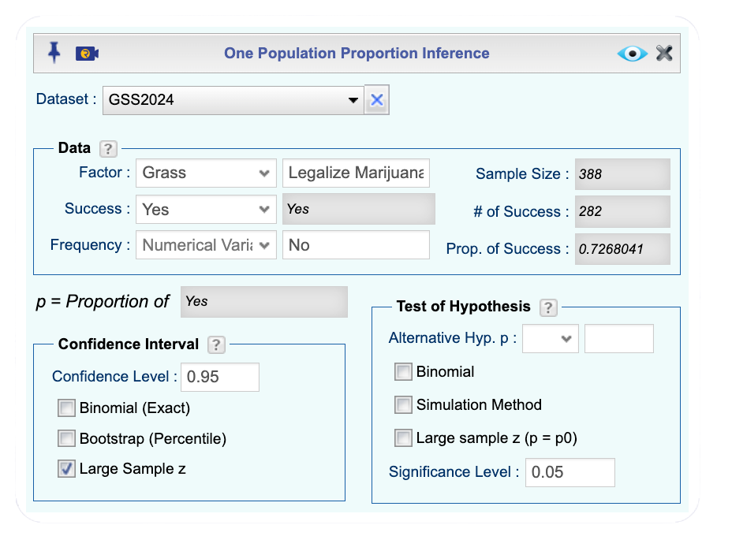
```

:::
:::

Click to expand the box below to see the Rguroo output.

::: {.callout-tip .inner-callout collapse="true" title="Rguroo output: One-Population Proportion Inference Output - Marijuana Legalization"}

<div tabindex="0" class="rg-iframe-wrapper">
  <iframe
    src="Rguroo_html_output/Proportion Inference/GSS2024NormalCI_docx/GSS2024NormalCI.html"
    class="rg-iframe"
    title="Rguroo output: One Population Proportion Large Sample Normal CI - Marijuana Legalization Example">
  </iframe>
</div>
:::

From the Rguroo output, the 95% large sample confidence interval for $p$ is $(0.682, 0.771)$. We are 95% confident that the true proportion of American adults who support the legalization of marijuana is between 0.682 (68.2%) and 0.771 (77.1%).

c\. The Rguroo output shows that the width of the interval is 0.0886764. Therefore, the margin of error is half the interval width:
$$\text{Margin of Error}
=
\frac{0.0886764}{2}
\approx 0.0443.$$
:::

### Confidence Interval Based on the Exact Binomial Method {#sec-ci-binomial}

As we saw in @exm-youtube-ci-grid, we can construct a confidence interval
for the population proportion $p$ by testing a grid of null hypotheses
$H_0: p = p_0$ and collecting all values of $p_0$ for which we fail
to reject $H_0$. When this approach uses the exact binomial distribution
to carry out each test, the resulting interval is called the **exact
binomial confidence interval**. As we noted in that example, this method
has an important advantage: it correctly reflects any asymmetry in the
data, which can occur when the large sample condition fails and the
binomial distribution is skewed.

Of course, testing every conceivable value of $p_0$ between 0 and 1
is not practical. Fortunately, efficient algorithms can locate the exact
endpoints of the interval directly, without testing each value one by
one. These algorithms are implemented in Rguroo, making it straightforward
to obtain the exact binomial confidence interval in practice. The
following example illustrates how.

:::{#exm-youtube-ci-binomial}
## Daily YouTube Use Among Teens: Exact Binomial Confidence Interval

Recall @exm-youtube-ppss. A sample of $n = 20$ students produced
$x_{\text{obs}} = 17$ daily YouTube users, giving a sample proportion of
$\hat{p}_{\text{obs}} = 17/20 = 0.85$. 

a. Use Rguroo's [One-Population Proportion]{.fun} inference function to construct a 95%
exact binomial confidence interval for the true proportion of students
in the district who use YouTube daily, and interpret the interval in the
context of the problem.

b. Check the 10-10 rule to determine whether we can use the large sample normal approximation for this problem?
:::

:::: {.callout-tip .solution-callout collapse="true" icon=false}
## 🔎 Solution

a\. Click to expand the box below to see how to use the [Proportion Inference]{.fun}  function in Rguroo to obtain an exact binomial confidence interval for this problem.

::: {#prop-ci-binomial-youtube .callout-note appearance="simple" collapse="true" icon="none" title="{width=22px style='vertical-align:middle;'} Exact binomial confidence interval - YouTube example"}

1. Open the **Analytics** toolbox in Rguroo.  

2. From the [Analysis]{.dpd} dropdown, select [Proportion Inference]{.fun} → [One Population]{.fun}. This opens the [One Population Proportion Inference]{.dialog} dialog.

3. In the **Data** section of the dialog, enter the following:
   - In the [Factor Label]{.des} textbox, type a label for the categorical variable. In Rguroo, a “factor” refers to a categorical variable. For this example, enter [Daily YouTube Use]{.typein}.
   - In the [Success Label]{.des} textbox, type [Yes]{.typein}. A success corresponds to a student who uses YouTube daily.
   - In the [Failure Label]{.des} textbox, type [No]{.typein}.
   - In the [Sample Size]{.des} textbox, type [20]{.typein}.
   - In the [\# of Successes]{.des} textbox, type [17]{.typein}.

4. In the **Confidence Interval** section of the dialog, enter the following:
   - In the [Confidence Level]{.des} textbox, enter [0.95]{.typein}. This is the default value for a 95% confidence level.
   - Select the [Binomial (Exact)]{.des} checkbox to obtain the exact binomial confidence interval.

5. Click the preview icon  to view the output.

6. Click the  button and save the result as [YoutubeBinomCi]{.typein}.

::: {.callout-tip .inner-callout collapse="true" title="Rguroo One-Population Proportion dialogs"}

```{r,echo=FALSE}
#| fig-alt: "Screenshot of a “One Population Proportion Inference” interface. The dataset is not selected. The factor is “Daily YouTube Use,” with success defined as “Yes.” The sample size is 20 with 17 successes, giving a sample proportion of 0.85. In the Confidence Interval section, the 95% level is selected and the “Binomial (Exact)” option is checked (highlighted with a red circle). Other options such as Bootstrap and Large Sample z are unchecked. The Test of Hypothesis panel is shown but not filled in."
#| fig-cap: "Rguroo Basics dialog"
#| out-width: "100%"
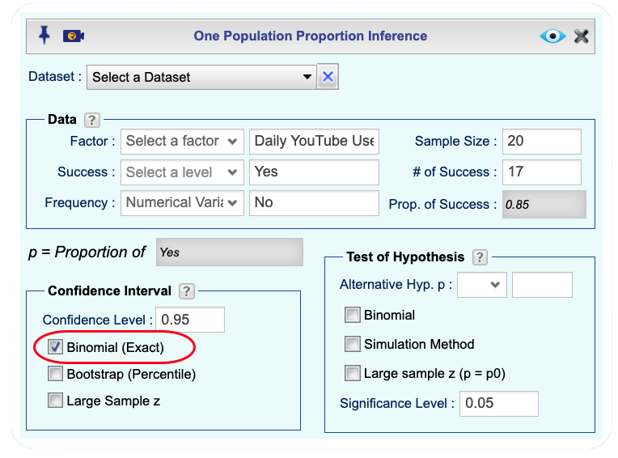
```
:::

:::

Click to expand the box below to see the Rguroo output.

::: {.callout-tip .inner-callout collapse="true" title="Rguroo output: One-Population Proportion Inference Output - YouTube"}

<div tabindex="0" class="rg-iframe-wrapper">
  <iframe
    src="Rguroo_html_output/Proportion Inference/YoutubeBinomCi_docx/YoutubeBinomCi.html"
    class="rg-iframe"
    title="Rguroo output: One Population Proportion Exact Binomial CI - Youtube Example">
  </iframe>
</div>

:::

From the Rguroo output, the 95% exact binomial confidence interval for
$p$ is $(0.628, 0.958)$. The following is an interpretation of this interval:

We are 95% confident that the true proportion of students in the district who use YouTube daily is between 0.628 (62.8%) and 0.958 (95.8%).

Notice that this interval is consistent with what we found using the grid in @exm-youtube-ci-grid, where we identified the range of plausible values as approximately 0.65 to 0.95. The exact interval extends the lower endpoint to 0.628, which lies between the grid values 0.60 and 0.65, where the p-value crossed the 0.05 threshold, just as we anticipated. The upper endpoint, 0.958, also agrees with the grid analysis, which placed the upper crossing between 0.95 (fail to reject) and 0.99 (reject). Thus, the grid approach gave us a good approximation to the range of plausible values, while the exact binomial method determines the endpoints more precisely.

b\. To check whether the large sample normal approximation is appropriate, we apply the 10-10 rule:
$$
\begin{aligned}
n\hat{p}_{\text{obs}}
&=20(0.85)=17\geq10,\\
n(1-\hat{p}_{\text{obs}})
&=20(0.15)=3<10.
\end{aligned}
$$
The second condition is not satisfied because there are only 3 observed failures. Therefore, the large sample normal approximation is not appropriate for this example.

Notice also that the exact binomial interval is not symmetric around $\hat{p}_{\text{obs}}=0.85$. Its midpoint, as reported in the Rguroo output, is approximately 0.793. Unlike the normal-approximation interval, the exact binomial interval does not need to be centered at the observed sample proportion.
::::


:::{#exm-inactivity-ci-binomial}
## Physical Inactivity Among Adults: Exact Binomial Confidence Interval

Recall @exm-physical-inactivity-ppss. A sample of $n = 50$ adults
produced $x_{\text{obs}} = 10$ physically inactive individuals, giving
a sample proportion of $\hat{p}_{\text{obs}} = 10/50 = 0.20$. 

a. Use Rguroo's [One-Population Proportion]{.fun} inference function to
construct a 95% exact binomial confidence interval for the true
proportion of adults in the country who are physically inactive, and
interpret the interval in the context of the problem.

b. Compare the exact binomial interval from part (a) to the large sample confidence interval you obtained in @exm-inactivity-ci-large-sample. Are they close? Explain.
:::

::: {.callout-tip .solution-callout collapse="true" icon=false}
## 🔎 Solution

a\. The following is a screenshot of the [One Population Proportion Inference]{.dialog} for obtaining the exact binomial confidence interval for this example.

```{r,echo=FALSE}
#| fig-alt: "Screenshot of a “One Population Proportion Inference” interface. The factor is “Physically Inactive,” with success defined as “Yes.” The sample size is 50 with 10 successes, giving a sample proportion of 0.20. In the Confidence Interval section, the 95% level is selected and the “Binomial (Exact)” option is checked, while Bootstrap and Large Sample z are unchecked. In the Test of Hypothesis panel, an alternative proportion value of 0.35 is entered, but no test method is selected, and the significance level is 0.05."
#| fig-cap: "Rguroo Basics dialog showing how to obtain exact binomial CI"
#| out-width: "100%"
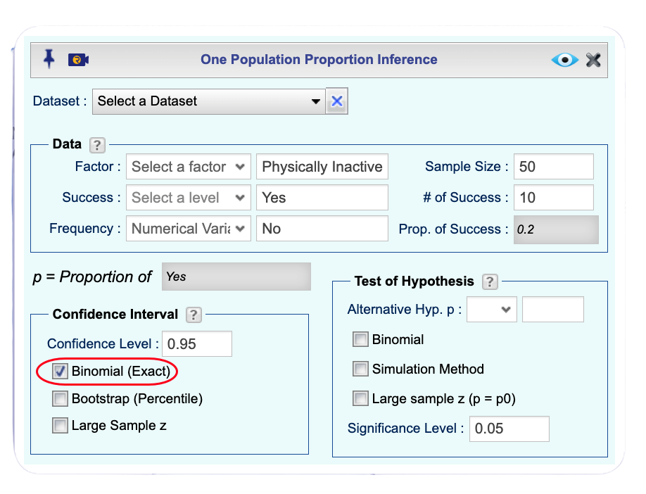
```
Click to expand the box below to see the Rguroo output.

::: {.callout-tip .inner-callout collapse="true" title="Rguroo output: One-Population Proportion Inference Output - Physical Inactivity"}

<div tabindex="0" class="rg-iframe-wrapper">
  <iframe
    src="Rguroo_html_output/Proportion Inference/Physical_exactCI_docx/Physical_exactCI.html"
    class="rg-iframe"
    title="Rguroo output: One Population Proportion Exact Binomial CI - Physical Inactivity Example">
  </iframe>
</div>

:::

From the Rguroo output, the 95% exact binomial confidence interval for
$p$ is $(0.106, 0.338)$. We are 95% confident that the true proportion
of adults in the country who are physically inactive is between 0.106 (10.6%)
and 0.338 (33.8%).

b\. The large sample normal approximation 95% confidence interval for this example was computed to be $(0.0891,0.3109).$  The two intervals are fairly close, although the exact binomial interval is slightly shifted to the right and is somewhat wider. As noted in @exm-inactivity-ci-large-sample, the 10-10 rule is satisfied for this example, so the large sample normal approximation is appropriate. Therefore, we expect the two methods to give similar, but not identical, intervals.
:::


<!--
:::{#exm-social-ci-binomial}
## Social Media as a Primary News Source: Exact Binomial Confidence Interval

Recall @exm-social-media-news-ppss. A sample of $n = 15$ students
produced $x_{\text{obs}} = 9$ who reported using social media as their
primary news source, giving a sample proportion of
$\hat{p}_{\text{obs}} = 9/15 = 0.60$. Use Rguroo's
[One-Population Proportion]{.fun} inference function to construct a 95%
exact binomial confidence interval for the true proportion of students
at the university who get most of their news from social media, and
interpret the interval in the context of the problem.
:::

::: {.callout-tip .solution-callout collapse="true" icon=false}
## 🔎 Solution

The following is a screenshot of the [One Population Proportion Inference]{.dialog} for obtaining the exact binomial confidence interval for this example.

```{r,echo=FALSE}
#| fig-alt: "Screenshot of a “One Population Proportion Inference” interface. The factor is “Use Social media,” with success defined as “Yes.” The sample size is 15 with 9 successes, giving a sample proportion of 0.60. In the Confidence Interval section, the 95% level is selected and the “Binomial (Exact)” option is checked, while Bootstrap and Large Sample z are unchecked. In the Test of Hypothesis panel, a left-tailed alternative hypothesis (p < 0.35) is selected, the Binomial test method is checked, and the significance level is 0.05."
#| fig-cap: "Rguroo Basics dialog showing how to obtain exact binomial CI"
#| out-width: "100%"
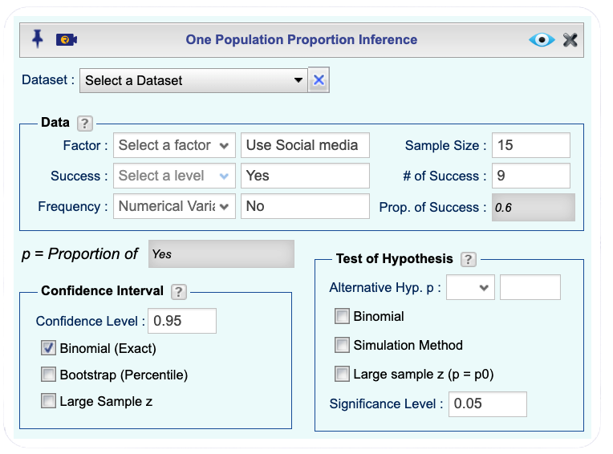
```

Click to expand the box below to see the Rguroo output.

::: {.callout-tip .inner-callout collapse="true" title="Rguroo output: One-Population Proportion Inference Output - Social Media"}

<div tabindex="0" class="rg-iframe-wrapper">
  <iframe
    src="Rguroo_html_output/Proportion Inference/socialBinomCI_docx/socialBinomCI.html"
    class="rg-iframe"
    title="Rguroo output: One Population Proportion Large Sample Normal CI - Social Media Example">
  </iframe>
</div>

:::

From the Rguroo output, the 95% exact binomial confidence interval for
$p$ is $(0.352, 0.848)$. We are 95% confident that the true proportion
of students at the university who get most of their news from social
media is between 0.352 (35.2%) and 0.848 (84.8%).

The midpoint of the interval is reported as 0.60, which in this case agrees exactly with the observed sample proportion. This is consistent with the fact that the 10-10 rule is satisfied:

$$
n\hat{p}_{\text{obs}} = 100 \times 0.60 = 60 > 10
\qquad \text{and} \qquad
n(1-\hat{p}_{\text{obs}}) = 100 \times 0.40 = 40 > 10.
$$

When the 10-10 rule is satisfied, the normal approximation works well, so we expect the confidence interval to be approximately centered at the observed sample proportion.

:::
 -->


:::{#exm-gss-ci-binomial}
## Marijuana Legalization: Exact Binomial Confidence Interval

Recall @exm-gss-marijuana-pvalue. The [GSS2024]{.data} dataset contains
responses from $n = 388$ U.S. adults, of whom $x_{\text{obs}} = 282$
supported the legalization of marijuana, giving a sample proportion of
$\hat{p}_{\text{obs}} = 282/388 \approx 0.7268$. 

Use Rguroo's [One-Population Proportion]{.fun} inference function to construct a 95%
exact binomial confidence interval for the true proportion of American
adults who support the legalization of marijuana, and interpret the
interval in the context of the problem.

<div tabindex="0" style="width:85%; margin:auto;">

 The dataset
for this example is available in the Rguroo dataset repository
[Kozak]{.repo}, with the dataset name [GSS2024]{.data}.

**Code book for Dataset GSS2024 is given [here](#code-book-gss2024).**

</div>

:::

:::: {.callout-tip .solution-callout collapse="true" icon=false}
## 🔎 Solution

Follow the same steps as in the [solution](#solution-gss-ci-large-sample) of @exm-gss-ci-large-sample to open the [One Population Proportion Inference]{.dialog} dialog and select the [GSS2024]{.data} dataset. The following is a screenshot of the dialog for obtaining the exact binomial confidence interval for this example.

```{r,echo=FALSE}
#| fig-alt: "Interface for one population proportion inference using the GSS2024 dataset on support for legalizing marijuana. The sample size is 388 with 282 successes, giving a sample proportion of about 0.727. The confidence interval section shows a 95% confidence level with the “Binomial (Exact)” method selected."
#| fig-cap: "Rguroo Basics dialog showing how to obtain exact binomial CI"
#| out-width: "100%"
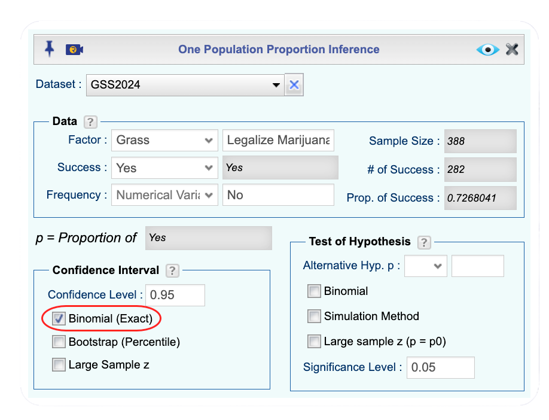
```
Click to expand the box below to see the Rguroo output.

::: {.callout-tip .inner-callout collapse="true" title="Rguroo output: One-Population Proportion Inference Output - Marijuana Legalization"}

<div tabindex="0" class="rg-iframe-wrapper">
  <iframe
    src="Rguroo_html_output/Proportion Inference/GSS2024ExactCI_docx/GSS2024ExactCI.html"
    class="rg-iframe"
    title="Rguroo output: One Population Proportion Exact Binomial CI - Marijuana Legalization Example">
  </iframe>
</div>
:::

From the Rguroo output, the 95% exact binomial confidence interval for
$p$ is $(0.679,0.769)$. We are 95% confident that
the true proportion of American adults who support the legalization of
marijuana is between 0.679 (67.9%) and 0.769 (76.9%).

::::


### Homework for @sec-confidence-interval-one-pop

For each of the scenarios described below,
answer the following:

a. Check whether the large sample condition is satisfied using the
10-10 rule. Based on your answer, determine whether the large sample
normal approximation confidence interval is appropriate.
b. Use Rguroo's [One-Population Proportion]{.fun} inference function
with the [Binomial]{.des} option to obtain a 95% exact binomial
confidence interval for $p$. Interpret the interval in the context
of the problem.
c. Use Rguroo's [One-Population Proportion]{.fun} inference function
with the [Large Sample z]{.des} option to obtain a 95% large sample
normal approximation confidence interval for $p$. Interpret the
interval in the context of the problem
d. Compare the exact binomial confidence interval of part b to the  large sample z confidence interval in part d. Are the intervals approximately the same? Is this comparison consistent
with what you found in part (a)?

---

1. **Arizona Marijuana Legalization**
In Problem 1 (Arizona Marijuana Legalization) of @sec-stage-hw, $p$
is the true proportion of Arizona registered voters who support
marijuana legalization. The sample consisted of $n = 779$ voters, of
whom $x_{\text{obs}} = 390$ favored legalization.

2. **Australian Unemployment Outlook**
In Problem 2 (Australian Unemployment Outlook) of @sec-stage-hw, $p$
is the true proportion of Australians in November 1997 who believed
unemployment would increase. The sample consisted of $n = 631$
Australians, of whom $x_{\text{obs}} = 284$ believed unemployment
would increase.

3. **Arkansas Identity Theft Complaints**
In Problem 3 (Arkansas Identity Theft Complaints) of @sec-stage-hw,
$p$ is the true proportion of consumer complaints in Arkansas that
were for identity theft. The sample consisted of $n = 3{,}482$
complaints, of which $x_{\text{obs}} = 1{,}601$ were for identity
theft.

4. **Daily YouTube Use Among Teens: Small Sample**
Recall @exm-youtube-ppss. Suppose that instead of a sample of $n = 20$
students, only $n = 15$ students were available, and $x_{\text{obs}} = 13$
of them reported using YouTube daily.

5. **Social Media as a Primary News Source: Small Sample**
Recall @exm-social-media-news-ppss. Suppose that instead of a sample
of $n = 15$ students, only $n = 12$ students were available, and
$x_{\text{obs}} = 7$ of them reported using social media as their
primary news source.

6. **Alaska Identity Theft Complaints**
In Problem 4 (Alaska Identity Theft Complaints) of @sec-stage-hw,
$p$ is the true proportion of consumer complaints in Alaska that
were for identity theft. The sample consisted of $n = 1{,}432$
complaints, of which $x_{\text{obs}} = 321$ were for identity theft.

7. **Kennedy Assassination Conspiracy Belief**
In Problem 5 (Kennedy Assassination Conspiracy Belief) of
@sec-stage-hw, $p$ is the true proportion of American adults in
2013 who believed there was a conspiracy behind President Kennedy's
assassination. The sample consisted of $n = 1{,}039$ adults, of whom
$x_{\text{obs}} = 634$ believed in a conspiracy.

8. **Autism Spectrum Disorder in Arizona**
In Problem 6 (Autism Spectrum Disorder in Arizona) of @sec-stage-hw,
$p$ is the true proportion of children in Arizona diagnosed with
ASD. The sample consisted of $n = 32{,}601$ children, of whom
$x_{\text{obs}} = 507$ were diagnosed with ASD.

9. **Graduate Degree Attainment: GSS2024**
In Problem 7 (Graduate Degree Attainment: GSS2024) of @sec-stage-hw,
$p$ is the true proportion of U.S. adults who hold a graduate
degree. The sample consisted of $n = 388$ adults, of whom
$x_{\text{obs}} = 33$ reported a graduate degree as their highest
level of education.

<div tabindex="0" style="width:85%; margin:auto;">

 The dataset
for this exercise is available in the Rguroo dataset repository
[Kozak]{.repo}, with the dataset name [GSS2024]{.data}.

**Code book for Dataset GSS2024 is given [here](#code-book-gss2024).**

</div>

## Hypothesis Testing for Two Proportions {#sec-hyp-test-two-prop}

Many important research questions require comparing proportions between two groups. In medical research, clinical trials compare treatment outcomes between patients receiving a new therapy and those receiving a placebo or standard care. In the social sciences, researchers investigate differences between demographic groups. In educational research, teachers evaluate whether new instructional methods outperform traditional approaches. Understanding how to compare two population proportions allows us to evaluate whether observed differences in sample data reflect genuine population differences or are due to chance variation.

Consider a few recent examples: A Phase 3 trial of the mRNA-1273 vaccine (Moderna) with over 30,000 participants found that 0.4% of the vaccinated group developed symptomatic COVID-19 compared to 4.9% in the placebo group—a substantial difference. A 2022 study examining 1,166 articles in *Political Psychology* found that 35.1% of lead authors were women compared to 64.9% men, highlighting a gender gap in academic publishing. In each case, researchers collected data from two independent samples, observed different sample proportions, and found statistical evidence that the population proportions differed.

While these large-scale studies demonstrate striking differences, many research questions involve smaller samples and more subtle effects where the statistical evidence is less clear-cut. In this section, we develop the concepts and tools for comparing two population proportions by working with examples where the answer is not immediately obvious and careful statistical reasoning is required.

We extend the hypothesis testing framework from one proportion to two proportions. The same core concepts—null and alternative hypotheses, test statistics, p-values, Type I and Type II errors, and significance levels—continue to apply. However, we now focus on the **difference between two population proportions** rather than a single proportion.

### The Null and Alternative Hypotheses

To develop these concepts and tools, we'll work with four examples: an educational intervention comparing instructional approaches for teaching proportional reasoning, a health behavior study evaluating text message reminders for medication adherence, a workplace wellness program assessing nicotine patches for smoking cessation, and an analysis of gender differences in attitudes toward marijuana legalization from the General Social Survey.

When comparing two population proportions, we focus on the difference between them. We have two populations—let's call one population 1 and the other population 2. It does not matter which population you designate as population 1 and which as population 2, as long as you clearly define your choice. We denote the population proportion for population 1 by $p_1$ and the population proportion for population 2 by $p_2$. Our goal is to make inferences about the difference between these proportions: $p_1 - p_2$. To do this, we begin by formulating hypotheses about this difference.

Just as in the one-population case, we can formulate both one-sided and two-sided tests. The three cases are:

$$
\begin{aligned}
\text{Case 1: } 
&\begin{cases}
H_0: p_1 \leq p_2 \\
H_a: p_1 > p_2
\end{cases}
\qquad
\text{Case 2: } 
\begin{cases}
H_0: p_1 \geq p_2 \\
H_a: p_1 < p_2
\end{cases} \\
\\
\text{Case 3: } 
&\begin{cases}
H_0: p_1 = p_2 \\
H_a: p_1 \neq p_2
\end{cases}
\end{aligned}
$$

We can equivalently write these hypotheses in terms of the difference $p_1 - p_2$:

$$
\begin{aligned}
\text{Case 1: } 
&\begin{cases}
H_0: p_1 - p_2 \leq 0 \\
H_a: p_1 - p_2 > 0
\end{cases}
\qquad
\text{Case 2: } 
\begin{cases}
H_0: p_1 - p_2 \geq 0 \\
H_a: p_1 - p_2 < 0
\end{cases} \\
\\
\text{Case 3: } 
&\begin{cases}
H_0: p_1 - p_2 = 0 \\
H_a: p_1 - p_2 \neq 0
\end{cases}
\end{aligned}
$$

Cases 1 and 2 are one-sided tests, while Case 3 is a two-sided test. In practice, the choice of case depends on the research question—specifically, whether we are testing for an increase, a decrease, or any difference. Let's see how to set up the hypotheses for each of our examples.

:::{#exm-schema-hypotheses}
## Schema-Based Instruction: Stating Hypotheses

Researchers want to know whether a new schema-based instructional approach improves seventh-grade students' mastery of proportional reasoning compared to traditional instruction. They randomly assign 50 students to the new approach and 50 students to traditional instruction. Let $p_1$ represent the proportion of all students who would achieve mastery under the new approach, and $p_2$ represent the proportion who would achieve mastery under traditional instruction. State the appropriate null and alternative hypotheses to address the research question.
:::

:::: {.callout-tip .solution-callout collapse="true" icon=false}
## 🔎 Solution

Since the researchers want to know whether the new approach *improves* mastery (that is, whether $p_1 > p_2$), this is a Case 1 situation. The hypotheses are:

$$
\begin{cases}
H_0: p_1 \leq p_2 \quad \text{or equivalently} \quad H_0: p_1 - p_2 \leq 0\\
H_a: p_1 > p_2 \quad \text{or equivalently} \quad H_a: p_1 - p_2 > 0
\end{cases}
$$

The null hypothesis states that the new approach is no better than (or is worse than) traditional instruction. The alternative hypothesis states that the new approach produces a higher mastery rate.
::::

:::{#exm-text-hypotheses}
## Text Message Reminders: Stating Hypotheses

Researchers are piloting a text message reminder system for diabetes patients. They want to know whether daily text reminders improve medication adherence compared to standard care, but they're also open to the possibility that the reminders might perform worse (perhaps by being annoying or overwhelming). They randomly assign 40 patients to receive text reminders and 50 patients to receive standard care. Let $p_1$ represent the proportion of all patients who would have good adherence with text reminders, and $p_2$ represent the proportion who would have good adherence with standard care. State the appropriate null and alternative hypotheses.
:::

:::: {.callout-tip .solution-callout collapse="true" icon=false}
## 🔎 Solution

Since the researchers have no strong directional prediction and want to detect a difference in either direction, this is a Case 3 situation. The hypotheses are:

$$
\begin{cases}
H_0: p_1 = p_2 \quad \text{or equivalently} \quad H_0: p_1 - p_2 = 0\\
H_a: p_1 \neq p_2 \quad \text{or equivalently} \quad H_a: p_1 - p_2 \neq 0
\end{cases}
$$

The null hypothesis states that the difference between the two population proportions, $p_1$ and $p_2$, is zero. A difference of zero means that the two population proportions are equal, so there is no difference in adherence rates between the two approaches. The alternative hypothesis states that the difference is not zero, meaning that the adherence rates differ between the two approaches.
::::

:::{#exm-smoking-hypotheses}
## Smoking Cessation: Stating Hypotheses

A workplace wellness program is comparing two approaches to smoking cessation. Employees are randomly assigned to either receive free nicotine patches (60 employees - Group 1) or participate in a self-guided quitting program (60 employees - Group 2). However, the researchers believe that the self-guided approach might actually be more effective because it emphasizes personal commitment and doesn't rely on external aids. Let $p_1$ represent the proportion of all employees who would quit smoking with nicotine patches, and $p_2$ represent the proportion who would quit with the self-guided approach. State the appropriate null and alternative hypotheses to test whether the self-guided approach is more effective.
:::

:::: {.callout-tip .solution-callout collapse="true" icon=false}
## 🔎 Solution

Since the researchers want to test whether the self-guided approach is *more effective* than nicotine patches (that is, whether $p_2 > p_1$, or equivalently $p_1 < p_2$), this is a Case 2 situation. The hypotheses are:

$$
\begin{cases}
H_0: p_1 \geq p_2 \quad \text{or equivalently} \quad H_0: p_1 - p_2 \geq 0\\
H_a: p_1 < p_2 \quad \text{or equivalently} \quad H_a: p_1 - p_2 < 0
\end{cases}
$$

The null hypothesis states that nicotine patches are at least as effective as (or more effective than) the self-guided approach. The alternative hypothesis states that the self-guided approach produces a higher quit rate.
::::

:::{#exm-gss-hypotheses}
## GSS 2024: Gender and Marijuana Legalization

The General Social Survey (GSS) is a long-running national survey that monitors societal change and studies the growing complexity of American society. In a representative sample from the GSS 2024 data, there are 204 females and 184 males who were asked whether they support the legalization of marijuana. Of the 204 females, 142 said they support legalization. Of the 184 males, 140 said they support legalization. Researchers want to know whether this sample provides evidence that the proportion of females who support legalization differs from the proportion of males who support legalization. Let $p_1$ represent the proportion of females in the population who support legalization, and $p_2$ represent the proportion of males who support legalization. State the appropriate null and alternative hypotheses.
:::

:::: {.callout-tip .solution-callout collapse="true" icon=false}
## 🔎 Solution

Since the researchers want to know whether the proportions *differ* (in either direction) without specifying which gender should have higher support, this is a Case 3 situation. The hypotheses are:

$$
\begin{cases}
H_0: p_1 = p_2 \quad \text{or equivalently} \quad H_0: p_1 - p_2 = 0\\
H_a: p_1 \neq p_2 \quad \text{or equivalently} \quad H_a: p_1 - p_2 \neq 0
\end{cases}
$$

The null hypothesis states that females and males support marijuana legalization at the same rate. The alternative hypothesis states that the support rates differ between the two groups.
::::

### Data, Statistic, and Sampling Distribution {#sec-data-stat-dist}

To make inferences about $p_1 - p_2$, we collect a sample of size $n_1$ from population 1 and a sample of size $n_2$ from population 2. Note that these sample sizes don't have to be equal—researchers often work with unequal group sizes due to practical constraints or deliberate design choices.

Let $X_1$ denote the number of successes (favorable outcomes) in our sample from population 1, and let $X_2$ denote the number of successes in our sample from population 2. Although we could compare the counts through $X_1-X_2$, differences in counts are difficult to analyze and can be misleading when the sample sizes differ. Instead, we compare sample proportions and rely on the Central Limit Theorem for large samples.


The sample proportions are $\hat{p}_1 = X_1/n_1$ and $\hat{p}_2 = X_2/n_2$. These are our point estimates of $p_1$ and $p_2$, respectively. To make inferences about the difference $p_1 - p_2$, we naturally use the difference in sample proportions: $\hat{p}_1 - \hat{p}_2$.

**The Sampling Distribution of $\hat{p}_1 - \hat{p}_2$**

When the sample sizes $n_1$ and $n_2$ are both sufficiently large, the Central Limit Theorem tells us that the sampling distribution of $\hat{p}_1 - \hat{p}_2$ is approximately normal. The rule of thumb for "sufficiently large" is that each group must have at least 10 successes and 10 failures: $n_1\hat{p}_1 \geq 10$, $n_1(1-\hat{p}_1) \geq 10$, $n_2\hat{p}_2 \geq 10$, and $n_2(1-\hat{p}_2) \geq 10$.

When these conditions are met, the sampling distribution of $\hat{p}_1 - \hat{p}_2$ is approximately normal with mean $p_1 - p_2$ and standard error

$$
\hat{p}_1 - \hat{p}_2 \sim N\left(p_1 - p_2, \; \text{SE}(\hat{p}_1 - \hat{p}_2)\right),
$$
where 
$$
\text{SE}(\hat{p}_1 - \hat{p}_2) = \sqrt{\frac{p_1(1-p_1)}{n_1} + \frac{p_2(1-p_2)}{n_2}}.
$$

Notice that the variability depends on both sample sizes and population proportions.

**Simplification Under the Null Hypothesis**

Recall that when testing hypotheses, we work at the boundary of the null hypothesis, since the Type I error is maximized there. For all three cases above, the boundary value is $p_1 - p_2 = 0$, which means $p_1 = p_2$.

At this boundary, the two population proportions are equal. We denote their common value by $p$, so that $p_1=p_2=p$. As a result, the standard error simplifies to:

$$
\text{SE}(\hat{p}_1 - \hat{p}_2)
= \sqrt{\frac{p(1-p)}{n_1} + \frac{p(1-p)}{n_2}}
= \sqrt{p(1-p)\left(\frac{1}{n_1} + \frac{1}{n_2}\right)}.
$$

Therefore, under the null hypothesis, the sampling distribution of $\hat{p}_1 - \hat{p}_2$ is:

$$
\hat{p}_1 - \hat{p}_2 \sim N\left(0, \; \sqrt{p(1-p)\left(\frac{1}{n_1} + \frac{1}{n_2}\right)}\right).
$$

This is the distribution we will use for hypothesis testing.

**Estimating the Common Proportion**

There is one practical issue: we do not know $p$, the common population proportion under $H_0$. Because $H_0$ assumes that $p_1=p_2$, we treat the two samples as coming from populations with the same proportion. We therefore combine the number of successes from both samples and divide by the combined sample size. This gives us an estimate of the common population proportion called the **pooled sample proportion**:
$$\hat{p} = \frac{X_1 + X_2}{n_1 + n_2}.$$

Using $\hat{p}$ in place of $p$ gives the **estimated standard error**:

$$
\widehat{\text{SE}}(\hat{p}_1 - \hat{p}_2) 
= \sqrt{\hat{p}(1-\hat{p})\left(\frac{1}{n_1} + \frac{1}{n_2}\right)}.
$$

This estimated standard error is used in our test statistic and in determining critical regions and p-values, just as we did in the one-population case.

The following example works through all of these computations for one of our four studies. The remaining three are summarized in @tbl-two-prop-summary.

:::{#exm-schema-quantities}
## Schema-Based Instruction: Computing the Key Quantities

In the schema-based instruction study, 50 students were assigned to the new approach and 50 to traditional instruction. After the intervention, 34 students in the new approach group achieved mastery, while 24 students in the traditional instruction group achieved mastery.

a. Compute the sample proportions $\hat{p}_1$ and $\hat{p}_2$ and their difference.
b. Verify the large sample conditions.
c. Compute the pooled sample proportion $\hat{p}$.
d. Compute the estimated standard error of $\hat{p}_1 - \hat{p}_2$.
:::

:::: {.callout-tip .solution-callout collapse="true" icon=false}
## 🔎 Solution

a\. **Sample proportions.**

$$\hat{p}_1 = \frac{34}{50} = 0.68, \qquad \hat{p}_2 = \frac{24}{50} = 0.48, \qquad \hat{p}_1 - \hat{p}_2 = 0.20.$$

The new approach shows a 20 percentage point higher mastery rate in the sample. We will test whether this provides sufficient evidence that $p_1 > p_2$ or whether it could reasonably arise by chance when both approaches are equally effective.

b\. **Large sample conditions.**

We check whether each group has at least 10 successes and 10 failures.

For Group 1 (new approach):

$$n_1 \hat{p}_1 = 50 \times 0.68 = 34, \qquad n_1(1 - \hat{p}_1) = 50 \times 0.32 = 16.$$

For Group 2 (traditional instruction):

$$n_2 \hat{p}_2 = 50 \times 0.48 = 24, \qquad n_2(1 - \hat{p}_2) = 50 \times 0.52 = 26.$$

All four counts are at least 10, so the large-sample conditions are satisfied and the Central Limit Theorem applies.

c\. **Pooled sample proportion.**

$$\hat{p} = \frac{34 + 24}{50 + 50} = \frac{58}{100} = 0.58.$$

Under the null hypothesis, we estimate that 58% of students would achieve mastery if both approaches were equally effective.

d\. **Estimated standard error.**

$$
\widehat{\text{SE}}(\hat{p}_1 - \hat{p}_2) 
= \sqrt{0.58 \times 0.42 \times \left(\frac{1}{50} + \frac{1}{50}\right)}
= \sqrt{0.009744}
\approx 0.0987.
$$

This is the typical sample-to-sample variability in $\hat{p}_1 - \hat{p}_2$ if the null hypothesis is true.
::::

The same computations for all four studies are summarized in @tbl-two-prop-summary. We will refer back to this table when working through hypothesis tests in the next subsection.

```{r, echo=FALSE}
#| label: tbl-two-prop-summary
#| tbl-cap: "Sample proportions, pooled proportion, large-sample check, and estimated standard error of $\\hat{p}_1 - \\hat{p}_2$ for the four studies. All four studies satisfy the large-sample conditions, since each group has at least 10 successes and 10 failures."

library(knitr)
df <- data.frame(
  Study  = c("Schema-Based Instruction", "Text Message Reminders",
             "Smoking Cessation", "GSS 2024 Marijuana Legalization"),
  n1     = c(50, 40, 60, 204),
  X1     = c(34, 32, 24, 142),
  n2     = c(50, 50, 60, 184),
  X2     = c(24, 28, 30, 140),
  p1hat  = c("0.680", "0.800", "0.400", "0.696"),
  p2hat  = c("0.480", "0.560", "0.500", "0.761"),
  diff   = c("0.200", "0.240", "$-0.100$", "$-0.065$"),
  phat   = c("0.580", "0.667", "0.450", "0.727"),
  SE     = c("0.0987", "0.1000", "0.0908", "0.0453")
)
colnames(df) <- c("Study",
                  "$n_1$", "$X_1$",
                  "$n_2$", "$X_2$",
                  "$\\hat{p}_1$", "$\\hat{p}_2$",
                  "$\\hat{p}_1 - \\hat{p}_2$",
                  "$\\hat{p}$",
                  "$\\widehat{\\text{SE}}$")
kable(df, align = "lrrrrrrrrr")
```

::: {.callout-note icon=false}
## Section Summary: Comparing Two Proportions

**Notation**

| Quantity | Population 1 | Population 2 |
|----------|--------------|--------------|
| Proportion (parameter) | $p_1$ | $p_2$ |
| Sample size | $n_1$ | $n_2$ |
| Number of successes | $X_1$ | $X_2$ |
| Proportion (statistic) | $\hat{p}_1 = X_1/n_1$ | $\hat{p}_2 = X_2/n_2$ |

The **pooled sample proportion**, used under $H_0: p_1 = p_2$, is
$$\hat{p} = \frac{X_1 + X_2}{n_1 + n_2}.$$

**Large Sample Conditions**

The normal approximation is appropriate when each sample has at least 10 successes and 10 failures:
$$n_1\hat{p}_1 \geq 10, \quad n_1(1-\hat{p}_1) \geq 10, \quad n_2\hat{p}_2 \geq 10, \quad n_2(1-\hat{p}_2) \geq 10.$$

**Null Distribution Under $H_0: p_1 = p_2$**

When $H_0$ is true and the large-sample conditions hold,
$$\hat{p}_1 - \hat{p}_2 \sim N\left(0, \; \sqrt{\hat{p}(1-\hat{p})\left(\frac{1}{n_1} + \frac{1}{n_2}\right)}\right).$$

The **estimated standard error** is
$$\widehat{\text{SE}}(\hat{p}_1 - \hat{p}_2) = \sqrt{\hat{p}(1-\hat{p})\left(\frac{1}{n_1} + \frac{1}{n_2}\right)}.$$

This distribution and its standard error are used to compute critical regions and p-values for all three forms of $H_a$ (right-tailed, left-tailed, two-tailed).
:::

### Hypothesis Testing: p-Value and Critical Region Approaches

As we explained earlier, there are two equivalent approaches to making decisions in hypothesis testing: the p-value approach and the critical region approach. We now apply both approaches to testing hypotheses about the difference between two population proportions, $p_1-p_2$, and show how to carry them out using Rguroo.

Recall that we developed the sampling distribution of $\hat{p}_1-\hat{p}_2$ at the null boundary $p_1-p_2=0$ in the previous section. When the large-sample conditions are satisfied, we use this approximately normal distribution, together with the pooled sample proportion, to carry out the test. Both the p-value and critical region approaches use this same sampling distribution to determine whether the observed difference $\hat{p}_1 - \hat{p}_2$ provides sufficient evidence against $H_0$ and favors $H_a$.

::: {.callout-note}
## A Note on Notation

In the one-sample sections, we used $\hat{p}_{\text{obs}}$ to distinguish the observed sample proportion from the random variable $\hat{p}$. For two proportions, that notation becomes cumbersome — we would need $\hat{p}_{1,\text{obs}}$ and $\hat{p}_{2,\text{obs}}$. To keep the notation simpler, we use $\hat{p}_1$ and $\hat{p}_2$ for both meanings. The context will make the meaning clear: when discussing sampling distributions or probabilities, they represent random variables; when working with the observed data or making a decision, they represent the observed sample proportions.
:::

The p-value approach asks: "How much support does the observed difference provide for $H_a$?" The critical region approach asks: "Does the observed difference fall in the critical region?"  Both approaches lead to the same conclusion, and we will use Rguroo to carry out both approaches.

Let's examine each case in detail.

#### Case 1: Right-Tailed Test ($H_a: p_1 - p_2 > 0$)

In this case, we want to test whether $p_1 > p_2$. The alternative hypothesis $H_a: p_1 - p_2 > 0$ is supported when $\hat{p}_1 - \hat{p}_2$ is positive, with larger positive differences providing stronger support for $H_a$. Values near zero or negative provide little or no support for $H_a$.

**p-Value Approach:**

The p-value measures he strength of the evidence against $H_0$ and in favor of $H_a$. For a right-tailed test, the p-value is the probability of observing a difference that provides at least as much support for $H_a$ as our observed difference, assuming $p_1=p_2$:

$$\text{p-value}
=
P\left(\hat{p}_1-\hat{p}_2
\geq \text{observed difference}\right),\;
\text{assuming } p_1=p_2.$$

This is the area to the right of the observed difference under the $N\left(0, \sqrt{\hat{p}(1-\hat{p})\left(\frac{1}{n_1} + \frac{1}{n_2}\right)}\right)$ distribution. A small p-value indicates strong evidence against $H_0$ and in favor of $H_a$, while a large p-value indicates that the data do not provide strong evidence against $H_0$.

**Decision Rule:**
- Reject $H_0$ if p-value $< \alpha$ (observed difference strongly support $H_a$)
- Fail to reject $H_0$ if p-value $\geq \alpha$ (data do not strongly support $H_a$)

**Critical Region Approach:**

The critical region consists of values in the upper tail of the sampling distribution. These are the values of $\hat{p}_1-\hat{p}_2$ that are sufficiently large to lead us to reject $H_0$ in favor of $H_a: p_1-p_2>0$. We find the critical value $c$ o that the probability of falling in the critical region is equal to the significant level $\alpha$, assuming $p_1=p_2$:

$$P\left(\hat{p}_1-\hat{p}_2 \geq c\right) = \alpha,\;
\text{assuming }p_1=p_2.$$

Using the sampling distribution under this assumption,

$$\hat{p}_1-\hat{p}_2\sim N\left(0, \sqrt{\hat{p}(1-\hat{p})\left(\frac{1}{n_1} + \frac{1}{n_2}\right)}\right)$$ 

we choose $c$ so that the area to the right of $c$ is $\alpha$. We reject $H_0$ if the observed difference $\hat{p}_1-\hat{p}_2$ falls in this critical region.

**Decision Rule:**
- Reject $H_0$ if $\hat{p}_1 - \hat{p}_2 > c$ (observed difference strongly supports $H_a$)
- Fail to reject $H_0$ if $\hat{p}_1 - \hat{p}_2 \leq c$ (observed difference does not strongly support $H_a$)

```{r, echo = FALSE}
#| label: fig-right-tail-critical-pvalue
#| fig-cap: "Critical region and p-value for a right-tailed test"
#| fig-alt: "Two side-by-side normal curves for the distribution of p-hat1 minus p-hat2. The left shows the upper-tail critical region beyond c, and the right shows the p-value area to the right of the observed difference. Both curves are centered at zero."

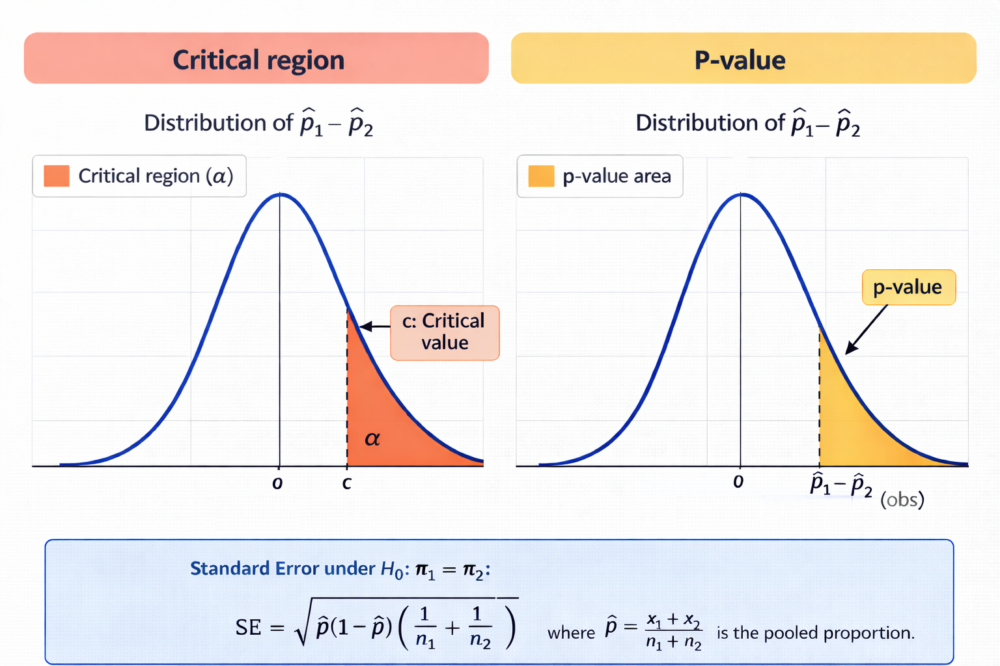
```

:::{#exm-schema-test-pvalue}
## Schema-Based Instruction: Hypothesis Test - p-Value Example

For the schema-based instruction study, we want to test whether the new approach has a higher mastery rate than the traditional approach. Recall:

- $n_1 = 50$, $X_1 = 34$, $\hat{p}_1 = 0.68$
- $n_2 = 50$, $X_2 = 24$, $\hat{p}_2 = 0.48$
- $\hat{p}_1 - \hat{p}_2 = 0.20$
- $\hat{p} = 0.58$

Hypotheses:
$$
\begin{cases}
H_0: p_1 - p_2 \leq 0\\
H_a: p_1 - p_2 > 0.
\end{cases}
$$

a. Give a probability statement that describes the p-value.

b. Use Rguroo to obtain the p-value for the test and state your conclusion based on the significance level $\alpha = 0.05$.
:::


:::: {#schema-test-pvalue .callout-tip .solution-callout collapse="true" icon=false}
## 🔎 Solution

a\. As discussed in @sec-data-stat-dist, assuming $p_1 = p_2$, the statistic $\hat{p}_1 - \hat{p}_2$ is approximately normally distributed with mean 0 and standard error 0.0987. The standard error is reported in the Rguroo output. Since $H_a:p_1-p_2>0$, differences that are at least as large as the observed difference of $0.20$ provide at least as much support for $H_a$. Therefore, the p-value is the probability of observing a difference of $0.20$ or greater,

$$
\text{p-value} = P(\hat{p}_1 - \hat{p}_2 \geq 0.20), \; \text{assuming}\; p_1 = p_2.
$$
See @fig-pvalue-schema.

b\. **Using Rguroo**

Click to expand the box below to see how to use the [Proportion Inference]{.fun}  function in Rguroo to answer this question.

::: {#prop-inference-Schema .callout-note appearance="simple" collapse="true" icon="none" title="{width=22px style='vertical-align:middle;'} Two-Population Proportion Hypothesis Test: Schema-Based Instruction Example"}

1. Open the **Analytics** toolbox in Rguroo.  

2. From the [Analysis]{.dpd} dropdown, select [Proportion Inference]{.fun} → [Two Populations]{.fun}. This opens the [Two Population Proportion Inference]{.dialog} dialog.

3. In the **Response/Success** section of the dialog, enter the following:

   - In the [Response Label]{.des} textbox, type a label for the response variable. For this example, enter [Improves Mastery]{.typein}.
   - In the [Success Label]{.des} textbox, type [Yes]{.typein}. A success corresponds to a student improving mastery.
   - In the [Failure Label]{.des} textbox, type [No]{.typein}.

4. In the **Population** section of the dialog, enter the following:
   - In the [Population]{.des} textbox, enter a label for the population. In this example we enter [Seventh Graders]{.typein}.

5. In the [Data Summary]{.tab} tab, enter the sample information for populations 1 and 2.
   - In the **Population 1** section enter the following:
      - [Label]{.des}: [New]{.typein}
      - [Sample Size]{.des}: [50]{.typein}
      - [# of Successes]{.des}: [34]{.typein}
   - In the **Population 2** section enter the following:
      - [Label]{.des}: [Traditional]{.typein}
      - [Sample Size]{.des}: [50]{.typein}
      - [# of Successes]: [24]{.typein}

6. Click on the [Test of Hypothesis]{.tab} tab and specify the following:

   - From the dropdown next to [Alternative Hypothesis p1 - p2]{.des} select [>]{.typein}, the greater than sign, and in the corresponding textbox type in [0]{.typein}.
   - For [Significance Level]{.des} type in [0.05]{.typein}. This is the default value.
   - In the **Methods** section, select the [Large Sample z]{.des} checkbox.

7. Click the preview icon  to view the output.

8. Click the  button and save the result as [SchemaProp2]{.typein}.

::: {.callout-tip .inner-callout collapse="true" title="Rguroo Two-Population Proportion dialogs for the Schema-Based Instruction example"}

```{r,echo=FALSE}
#| fig-alt: "Two Rguroo Two Population Proportion Inference dialogs for comparing mastery rates between Traditional and New teaching approaches. The Data Summary shows sample sizes of 50, with 34 successes for Traditional and 24 for New. The Test of Hypothesis tab shows a right-tailed test for the difference in population proportions using the Large Sample z method at significance level 0.05."
#| fig-cap: "Rguroo setup for a right-tailed large-sample test comparing two population proportions."
#| out-width: "100%"
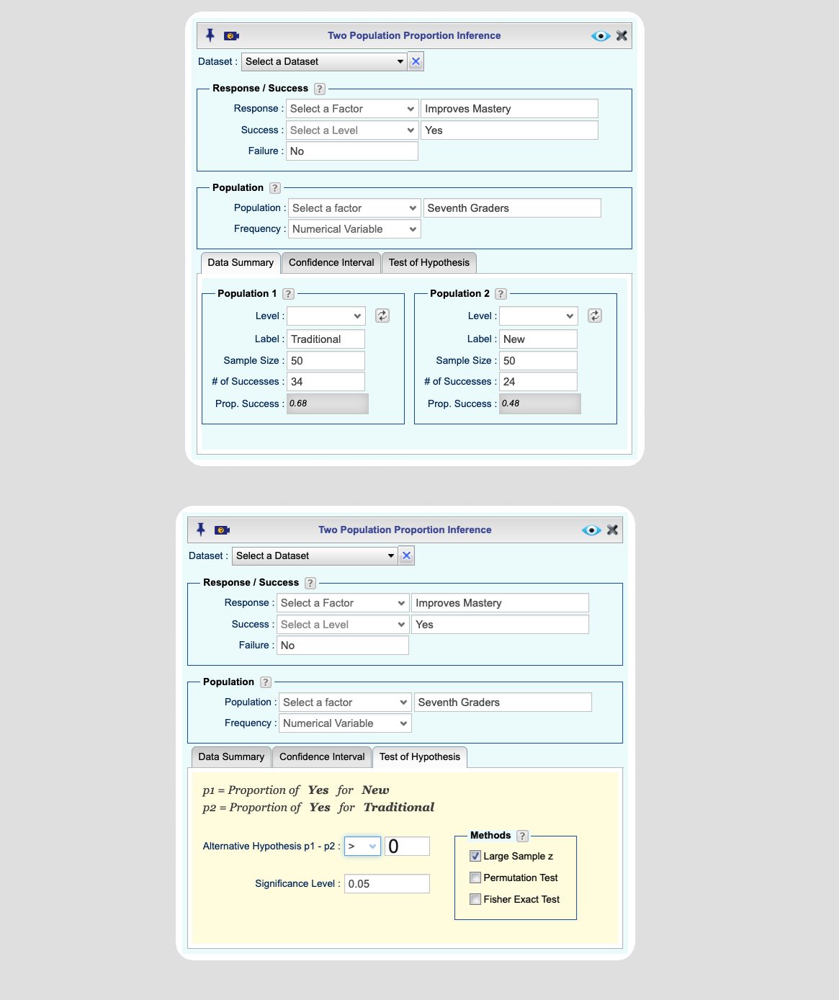
```
:::

:::

Click to expand the box below to see the Rguroo output.

::: {.callout-tip .inner-callout collapse="true" title="Rguroo output: Two-Population Proportion Inference - Schema-Based Instruction"}

<div tabindex="0" class="rg-iframe-wrapper">
  <iframe
    src='Rguroo_html_output/Proportion Inference/SchemaProp2pvalue_docx/SchemaProp2pvalue.html'
    class="rg-iframe"
    title="Rguroo output: Two-Population Proportion Hypothesis test - Schema-Based Instruction Example">
  </iframe>
</div>

:::


The p-value is shown in the Rguroo graph labeled P-Value Graph: Large Sample z, Pooled SE (shown in @fig-pvalue-schema). In the left panel, labeled Observed Data Scale, the area representing the p-value is shaded in red,. The p-value is 0.021377. This value is also reported in the results table.

```{r}
#| echo: false
#| fig-cap: "p-value for the schema-based instruction study."
#| label: fig-pvalue-schema
#| fig-alt: "Two side-by-side normal curves illustrating a right-tailed p-value calculation. The left panel (Observed Data Scale) shows the sampling distribution of the proportion difference centered at zero, with the observed difference at 0.2 marked by a green triangle. The area to the right of the observed value is shaded red, representing the p-value of 0.021377. The right panel shows the same test on the Standard Normal (z) Scale with the corresponding z-statistic and p-value."
#| out-width: "100%"
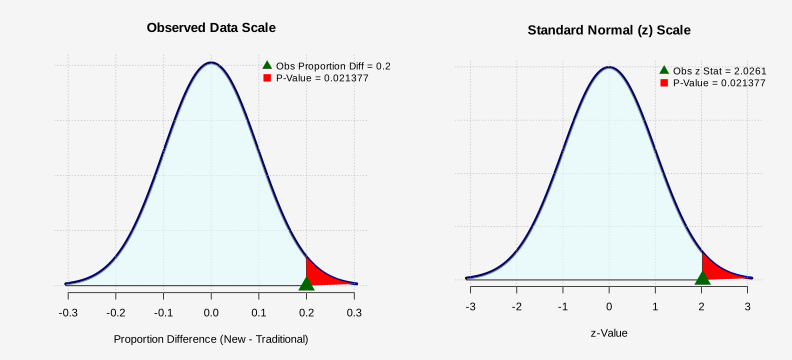
```

Since the $p$-value is $ 0.021 < 0.05$, we reject $H_0$ at the significance level of 0.05 and conclude that there is sufficient evidence in favor of $H_a:p_1-p_2>0$. Therefore, the data provide sufficient evidence that the mastery rate is higher for the new instructional approach than for the traditional approach.

::::


:::{#exm-schema-test-cr}
## Schema-Based Instruction: Hypothesis Test - Critical Region Example

For the schema-based instruction study, we want to test whether the new approach ihas a higher mastery rate than the traditional approach. Recall:

- $n_1 = 50$, $X_1 = 34$, $\hat{p}_1 = 0.68$
- $n_2 = 50$, $X_2 = 24$, $\hat{p}_2 = 0.48$
- $\hat{p}_1 - \hat{p}_2 = 0.20$
- $\hat{p} = 0.58$

Hypotheses:
$$
\begin{cases}
H_0: p_1 - p_2 \leq 0\\
H_a: p_1 - p_2 > 0.
\end{cases}
$$

a. Using Rguroo, obtain the critical region for a test at significance level $\alpha = 0.05$.

b. Based on the observed difference and the critical region in part (a), state the conclusion of the hypothesis test.
:::


:::: {#sol_schema-test-cr .callout-tip .solution-callout collapse="true" icon=false}
## 🔎 Solution

a\. Click to expand the box below to see how to use the [Proportion Inference]{.fun}  function in Rguroo to answer this question.

::: {#prop-inference-Schema .callout-note appearance="simple" collapse="true" icon="none" title="{width=22px style='vertical-align:middle;'} Two-Population Proportion Hypothesis Test: Schema-Based Instruction Example (Critical region Approach)"}

1. Open the **Analytics** toolbox in Rguroo.  

2. From the [Analysis]{.dpd} dropdown, select [Proportion Inference]{.fun} → [Two Populations]{.fun}. This opens the [Two Population Proportion Inference]{.dialog} dialog.

3. In the **Response/Success** section of the dialog, enter the following:

   - In the [Response Label]{.des} textbox, type a label for the response variable. For this example, enter [Improves Mastery]{.typein}.
   - In the [Success Label]{.des} textbox, type [Yes]{.typein}. A success corresponds to a student improving mastery.
   - In the [Failure Label]{.des} textbox, type [No]{.typein}.

4. In the **Population** section of the dialog, enter the following:
   - In the [Population]{.des} textbox, enter a label for the population. In this example we enter [Seventh Graders]{.typein}.

5. In the [Data Summary]{.tab} tab enter the sample information for populations 1 and 2.
   - In the **Population 1** section enter the following:
      - [Label]{.des}: [New]{.typein}
      - [Sample Size]{.des}: [50]{.typein}
      - [# of Successes]: [34]{.typein}
   - In the **Population 2** section enter the following:
      - [Label]{.des}: [Traditional]{.typein}
      - [Sample Size]{.des}: [50]{.typein}
      - [# of Successes]: [24]{.typein}

6. Click on the [Test of Hypothesis]{.tab} tab and specify the following:

   - From the dropdown next to [Alternative Hypothesis p1 - p2]{.des} select [>]{.typein}, the greater than sign, and in the corresponding textbox type in [0]{.typein}.
   - For [Significance Level]{.des} type [0.05]{.typein}. This is the default value.
   - In the **Methods** section, select the [Large Sample z]{.des} checkbox.

7. To obtain the critical region click the  button to open the [Advanced Features]{.dialog} dialog.
   - In the **Test of Hypothesis Graphs** section, select [Critical Region Graph]{.des}.
   - (Optional) Uncheck the [P-Value Graph]{.des}.

8. Click the preview icon  to view the output.

9. Click the  button and save the result as [SchemaProp2cr]{.typein}.

::: {.callout-tip .inner-callout collapse="true" title="Rguroo Two-Population Proportion dialogs for the Schema-Based Instruction example"}

```{r,echo=FALSE}
#| fig-alt: "Screenshot of a Two Population Proportion Inference interface showing setup and analysis for comparing two proportions. The top panel includes fields for selecting a dataset, defining the response variable (Improves Mastery), and specifying success (Yes) and failure (No). The population is set to Seventh Graders. In the data summary section, Population 1 (new) has sample size 50 with 34 successes (proportion 0.68), and Population 2 (Traditional) has sample size 50 with 24 successes (proportion 0.48). The lower panel shows hypothesis test settings with alternative hypothesis p_1 - p_2 > 0, significance level 0.05, and method set to Large Sample z. A side panel labeled Advanced Features includes options for displaying p-value and critical region graphs, selecting confidence interval and test methods, and setting simulation parameters (replications and seed)."
#| fig-cap: "Rguroo Basics and Advanced Features dialog for Two-Population Inference"
#| out-width: "100%"
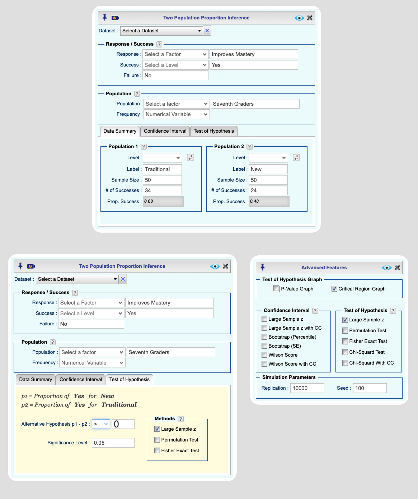
```
:::

:::

Click to expand the box below to see the Rguroo output.

::: {.callout-tip .inner-callout collapse="true" title="Rguroo output: Two-Population Proportion Inference - Schema-Based Instruction"}

<div tabindex="0" class="rg-iframe-wrapper">
  <iframe
    src='Rguroo_html_output/Proportion Inference/SchemaProp2_docx/SchemaProp2pvalue.html'
    class="rg-iframe"
    title="Rguroo output: Two-Population Proportion Hypothesis test - Schema-Based Instruction Example">
  </iframe>
</div>

:::


From the Rguroo output graph labeled **Critical Region Graph: Large Sample z, Pooled SE** (shown in @fig-cr-schema), the critical region is 
$$\hat{p}_1-\hat{p}_2 > 0.16237$$.
The critical value $0.16237$ is shown at the bottom of the left panel, labeled "Observed Data Scale," and is also reported in the results table.

```{r}
#| echo: false
#| fig-cap: "Critical region for the schema-based instruction study with α = 0.05."
#| label: fig-cr-schema
#| fig-alt: "Two side-by-side normal curves illustrating a right-tailed critical region test. The left panel (Observed Data Scale) shows the sampling distribution of the proportion difference with the critical value marked at 0.16237 and the observed difference at 0.2, both indicated by markers. The right-tail critical region beyond the critical value is shaded red. The right panel shows the same test on the Standard Normal (z) Scale. In both panels, the observed value (green triangle) falls within the red critical region."
#| out-width: "100%"
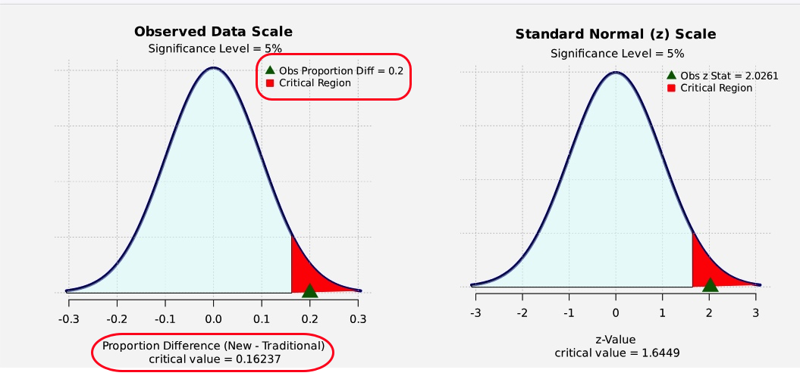
```

b\. Since the observed difference $\hat{p}_1 - \hat{p}_2 = 0.20 > 0.16237$, the observed difference falls in the critical region (shown by the green triangle in the red critical region). Therefore, we reject $H_0$ at the significance level $\alpha=0.05$  and conclude that there is sufficient evidence in favor of $H_a: p_1 - p_2 > 0$. Thus, the data provide sufficient evidence that the mastery rate is higher for the new instructional approach than for the traditional approach.
::::


#### Case 2: Left-Tailed Test ($H_a: p_1 - p_2 < 0$)

Case 2 is the mirror of Case 1. Small (negative) values of $\hat{p}_1 - \hat{p}_2$ support $H_a$, so the p-value and critical region lie in the **lower** tail of the null distribution.

::: {.callout-note appearance="minimal"}
**p-value:** $\quad \text{p-value} = P(\hat{p}_1 - \hat{p}_2 \leq \text{observed difference} \mid p_1 = p_2)$

**Critical value $c$:** $\quad P(\hat{p}_1 - \hat{p}_2 \leq c \mid p_1 = p_2) = \alpha$

**Decision:** Reject $H_0$ if p-value $< \alpha$, equivalently if $\hat{p}_1 - \hat{p}_2 \leq c$.
:::

```{r, echo = FALSE}
#| label: fig-left-tail-critical-pvalue
#| fig-cap: "Critical region and p-value for a left-tailed test"
#| fig-alt: "..."

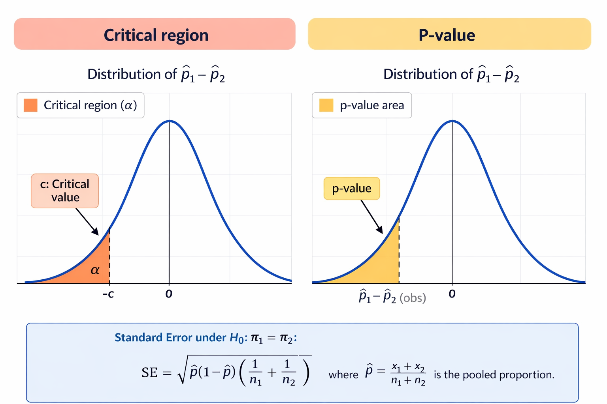
```

**Critical Region Approach:**

The critical region consists of values in the lower tail of the sampling distribution—these are the values that strongly support $H_a: p_1 - p_2 < 0$. We find the critical value $c$ such that at the boundary where $p_1 = p_2$:

$$P(\hat{p}_1 - \hat{p}_2 < c \mid p_1 = p_2) = \alpha$$

Using the sampling distribution at the boundary, we find $c$ from $N\left(0, \sqrt{\hat{p}(1-\hat{p})\left(\frac{1}{n_1} + \frac{1}{n_2}\right)}\right)$ such that the area to the left equals $\alpha$.

**Decision Rule:**
- Reject $H_0$ if $\hat{p}_1 - \hat{p}_2 < c$ (observed difference strongly supports $H_a$)
- Fail to reject $H_0$ if $\hat{p}_1 - \hat{p}_2 \geq c$ (observed difference does not strongly support $H_a$)

:::{#exm-smoking-test-pvalue}
## Smoking Cessation: Hypothesis Test - p-Value Example

For the smoking cessation study, we want to test whether the self-guided approach has a higher quit-smoking rate than the nicotine patch approach.  Recall:

- $n_1 = 60$, $X_1 = 24$, $\hat{p}_1 = 0.40$
- $n_2 = 60$, $X_2 = 30$, $\hat{p}_2 = 0.50$
- $\hat{p}_1 - \hat{p}_2 = -0.10$

Hypotheses:
$$
\begin{cases}
H_0: p_1 - p_2 \geq 0\\
H_a: p_1 - p_2 < 0.
\end{cases}
$$

a. Give a probability statement that describes the p-value.
b. Use Rguroo to obtain the p-value for the test and state your conclusion based on the significance level $\alpha = 0.10$.
:::

:::: {.callout-tip .solution-callout collapse="true" icon=false}
## 🔎 Solution

a\. As discussed in @sec-data-stat-dist, assuming $p_1 = p_2$, the statistic $\hat{p}_1 - \hat{p}_2$ is approximately normally distributed with mean 0 and standard error 0.09083. Note that this standard error is reported in the Rguroo output.

The $p$-value is the probability of observing a difference at least as small as the observed difference of $-0.10$, assuming $p_1 = p_2$:
$$
\text{p-value} = P(\hat{p}_1 - \hat{p}_2 \leq -0.10)\;\text{assuming}\;p_1 = p_2.
$$


b\. **Using Rguroo**

To perform this hypothesis test in Rguroo, follow the same steps given in the [solution](#schema-test-pvalue) of @exm-schema-test-pvalue. One difference is that in the [Test of Hypothesis]{.tab} tab, for [Alternative Hypothesis p1 − p2]{.des}, you should select the [<]{.typein} (less than) option because this is a left-tailed test, and set the [Significance Level]{.des} to 0.10. In addition, the values in the Basics dialog of [Two Population Proportion Inference]{.dialog} and in the [Data Summary]{.tab} tab should match those shown in @fig-smoking-inputs.

```{r, echo=FALSE}
#| fig-cap: "Rguroo input setup comparing quit-smoking success rates for nicotine patch and self-guided groups"
#| label: fig-smoking-inputs
#| fig-alt: "Screenshot of a Two Population Proportion Inference interface. The response variable is Quit Smoking with success defined as Yes and failure as No. The population variable is Treatment. Population 1 Nicotine Patch has a sample size of 60 with 24 successes proportion 0.4. Population 2 Self-Guided has a sample size of 60 with 30 successes proportion 0.5. Tabs for Data Summary, Confidence Interval, and Test of Hypothesis are visible."
knitr::include_graphics('Rguroo_dialogs/Proportion_inference/G_smoking_idialog.png')
```

Click to expand the box below to see the Rguroo output.

::: {.callout-tip .inner-callout collapse="true" title="Rguroo output: Two-Population Proportion Inference - Smoking Cessation Example"}

<div tabindex="0" class="rg-iframe-wrapper">
  <iframe
    src='Rguroo_html_output/Proportion Inference/smoking_prop2_pvalue_docx/smoking_prop2_pvalue.html'
    class="rg-iframe"
    title="Rguroo output: Two-Population Proportion Hypothesis Test - Smoking Cessation Example">
  </iframe>
</div>

:::

The p-value is depicted in the Rguroo output graph labeled **P-Value Graph: Large Sample z, Pooled SE** (shown in @fig-pvalue-smoke). In the left panel (labeled "Observed Data Scale"), the area corresponding to the $p$-value is shaded in red, and its value is 0.13546. This value is also reported in the results table.

```{r}
#| echo: false
#| fig-cap: "p-value for the Smoking Cessation study."
#| label: fig-pvalue-smoke
#| fig-alt: "Two side-by-side plots illustrating a left-tailed test using p-values. The left panel shows the observed data scale for the proportion difference Nicotine Patch minus Self-Guided with a normal curve centered at 0. The observed difference −0.1 is marked, and the left-tail area shaded in red represents the p-value of 0.13546. The right panel shows the standard normal z scale with the observed z statistic −1.101 marked. The left-tail area shaded in red represents the same p-value of 0.13546."
#| out-width: "100%"
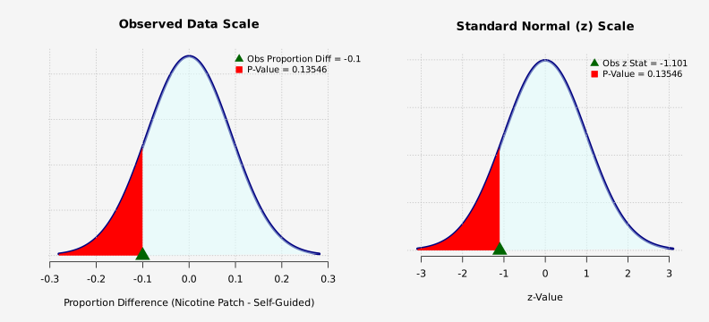
```

Since the p-value is $0.13546 > 0.10$, we fail to reject $H_0$ at the 10% significance level. There is not sufficient evidence in favor of  $H_a: p_1 - p_2 < 0$.

Although the observed difference of $-0.10$ is in the direction of $H_a$  (the self-guided approach showed a 50% quit rate compared to 40% for nicotine patches), the p-value of 0.13546 indicates that a difference at least this supportive of $H_a$ is not particularly unusual, assuming $p_1=p_2$. Therefore, the data do not provide sufficient evidence that the self-guided approach has a higher quit-smoking rate than the nicotine patch approach.
::::

:::{#exm-smoking-test-cr}
## Smoking Cessation: Hypothesis Test - Critical Region Example

For the smoking cessation study, we want to test whether the self-guided approach has a higher quit-smoking rate than the nicotine patch approach. Recall:

- $n_1 = 60$, $X_1 = 24$, $\hat{p}_1 = 0.40$
- $n_2 = 60$, $X_2 = 30$, $\hat{p}_2 = 0.50$
- $\hat{p}_1 - \hat{p}_2 = -0.10$

Hypotheses:
$$
\begin{cases}
H_0: p_1 - p_2 \geq 0\\
H_a: p_1 - p_2 < 0.
\end{cases}
$$

a. Using Rguroo, obtain the critical region for a test at significance level $\alpha =0.10$.
b. Based on the observed difference and the critical region in part (a), state the conclusion of the hypothesis test. 
:::

:::: {.callout-tip .solution-callout collapse="true" icon=false}
## 🔎 Solution

a\. **Using Rguroo**

To perform this hypothesis test in Rguroo, follow the same steps given in the [solution](#exm-schema-test-cr) of @exm-schema-test-cr.  One difference is that in the [Test of Hypothesis]{.tab} tab, for [Alternative Hypothesis p1 − p2]{.des}, you should select the [<]{.typein} (less than) option because this is a left-tailed test, and set the [Significance Level]{.des} to [0.10]{.typein}. In addition, the values in the Basics dialog of [Two Population Proportion Inference]{.dialog} and in the [Data Summary]{.tab} tab should match those shown in @fig-smoking-inputs1.

```{r, echo=FALSE}
#| fig-cap: "Rguroo input setup comparing quit-smoking success rates for nicotine patch and self-guided groups"
#| label: fig-smoking-inputs1
#| fig-alt: "Screenshot of a Two Population Proportion Inference interface. The response variable is Quit Smoking with success defined as Yes and failure as No. The population variable is Treatment. Population 1 Nicotine Patch has a sample size of 60 with 24 successes proportion 0.4. Population 2 Self-Guided has a sample size of 60 with 30 successes proportion 0.5. Tabs for Data Summary, Confidence Interval, and Test of Hypothesis are visible."
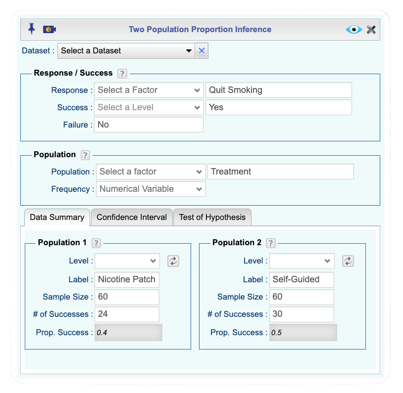
```

Click to expand the box below to see the Rguroo output.

::: {.callout-tip .inner-callout collapse="true" title="Rguroo output: Two-Population Proportion Inference - Smoking Cessation Example"}

<div tabindex="0" class="rg-iframe-wrapper">
  <iframe
    src='Rguroo_html_output/Proportion Inference/smoking_prop2_cr_docx/smoking_prop2_cr.html'
    class="rg-iframe"
    title="Rguroo output: Two-Population Proportion Hypothesis Test - Smoking Cessation Example">
  </iframe>
</div>

:::

As discussed in @sec-data-stat-dist, assuming $p_1=p_2$, the statistic $\hat{p}_1-\hat{p}_2$ is approximately normally distributed with mean 0 and standard error 0.09083. We use this null distribution to determine the critical region.

```{r}
#| echo: false
#| fig-cap: "p-value for the Smoking Cessation study."
#| label: fig-cr-smoke
#| fig-alt: "Two side-by-side plots illustrating a left-tailed test using p-values. The left panel shows the observed data scale for the proportion difference Nicotine Patch minus Self-Guided with a normal curve centered at 0. The observed difference −0.1 is marked, and the left-tail area shaded in red represents the p-value of 0.13546. The right panel shows the standard normal z scale with the observed z statistic −1.101 marked. The left-tail area shaded in red represents the same p-value of 0.13546."
#| out-width: "100%"
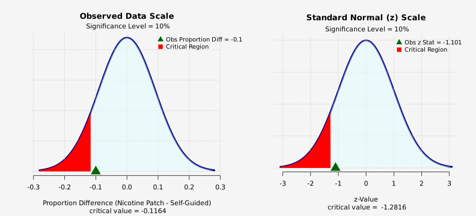
```

From the Rguroo output graph labeled **Critical Region Graph: Large Sample z, Pooled SE** (shown in @fig-cr-smoke), the **critical value** is $c=-0.1164$, displayed at the bottom of the left panel. Therefore, the critical region is

$$
\hat{p}_1-\hat{p}_2<-0.1164.
$$


Since the observed difference $\hat{p}_1-\hat{p}_2=-0.10$ is greater than **$-0.1164$**, it does *not* fall in the critical region, as shown by the green triangle outside the red-shaded region. Therefore, we fail to reject $H_0$ at the **10%** significance level.


Although the observed difference of $-0.10$ is in the direction of $H_a$ (the self-guided approach had a 50% quit-smoking rate compared with 40% for the nicotine patch approach), the observed difference does not fall in the critical region. Therefore, the data do not provide sufficient evidence that the self-guided approach has a higher quit-smoking rate than the nicotine patch approach.
::::

#### Case 3: Two-Tailed Test ($H_a: p_1 - p_2 \neq 0$)

In Case 3, $H_a$ is supported when $\hat{p}_1 - \hat{p}_2$ is far from zero in *either* direction. The p-value is therefore a *two-tail* probability, and the critical region occupies both tails with $\alpha/2$ in each.

::: {.callout-note appearance="minimal"}
**p-value:** $\quad \text{p-value} = P(|\hat{p}_1 - \hat{p}_2| \geq |\text{observed difference}| \mid p_1 = p_2)$

**Critical values $c_1, c_2$:** $\quad P(\hat{p}_1 - \hat{p}_2 \leq c_1 \mid p_1 = p_2) = P(\hat{p}_1 - \hat{p}_2 \geq c_2 \mid p_1 = p_2) = \alpha/2$

**Decision:** Reject $H_0$ if p-value $< \alpha$, equivalently if $\hat{p}_1 - \hat{p}_2 \leq c_1$ or $\hat{p}_1 - \hat{p}_2 \geq c_2$.
:::


```{r, echo = FALSE}
#| label: fig-two-tail-test-critical-pvalue
#| fig-cap: "Critical region and p-value for a two-tailed test"
#| fig-alt: "Two side-by-side normal curves centered at zero illustrating a two-tailed test. In the left panel, both tails are shaded to represent the critical regions, with each tail labeled $\alpha/2$ and dashed vertical lines at the negative and positive critical values. In the right panel, both tails beyond the observed statistic and its negative (labeled as observed) are shaded to represent the p-value, with dashed vertical lines marking these symmetric observed values."

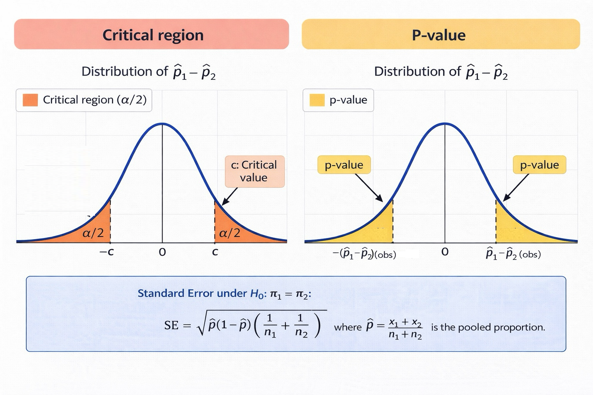
```

**Critical Region Approach:**

The critical region consists of values in both tails of the sampling distribution—these are the values that strongly support $H_a: p_1 - p_2 \neq 0$. We find two critical values, $c_1$ and $c_2$, such that at the boundary where $p_1 = p_2$:

$$P(\hat{p}_1 - \hat{p}_2 < c_1 \text{ or } \hat{p}_1 - \hat{p}_2 > c_2 \mid p_1 = p_2) = \alpha$$

We split $\alpha$ equally between the two tails ($\alpha/2$ in each tail). Using the sampling distribution at the boundary:

- $c_1$ is the value with area $\alpha/2$ to its left
- $c_2$ is the value with area $\alpha/2$ to its right

**Decision Rule:**
- Reject $H_0$ if $\hat{p}_1 - \hat{p}_2 < c_1$ or $\hat{p}_1 - \hat{p}_2 > c_2$ (observed difference strongly supports $H_a$)
- Fail to reject $H_0$ if $c_1 \leq \hat{p}_1 - \hat{p}_2 \leq c_2$ (observed difference does not strongly support $H_a$)

:::{#exm-text-test-pvalue}
## Text Message Reminders: Hypothesis Test - p-Value Example

For the text message reminder study, we want to test whether adherence rates differ. Recall:

- $n_1 = 40$, $X_1 = 32$, $\hat{p}_1 = 0.80$
- $n_2 = 50$, $X_2 = 28$, $\hat{p}_2 = 0.56$
- $\hat{p}_1 - \hat{p}_2 = 0.24$
- $\hat{p} = 0.667$

Hypotheses:
$$
\begin{cases}
H_0: p_1 - p_2 = 0\\
H_a: p_1 - p_2 \neq 0
\end{cases}
$$

a. Give a probability statement that describes the p-value.

b. Use Rguroo to obtain the p-value for the test and state your conclusion based on the significance level $\alpha = 0.05$ .

:::

:::: {.callout-tip .solution-callout collapse="true" icon=false}
## 🔎 Solution

a\. The $p$-value is the probability of observing an absolute difference at least as large as the observed difference of $0.24$, assuming $p_1 = p_2$:
$$
\text{p-value} = P(|\hat{p}_1 - \hat{p}_2| \geq 0.24), \;\text{assuming}\;  p_1 = p_2.
$$
See @fig-pvalue-text.

b\. To perform this hypothesis test in Rguroo, follow the same steps given in the [solution](#schema-test-pvalue) of @exm-schema-test-pvalue. One difference is that in the [Test of Hypothesis]{.tab} tab, for [Alternative Hypothesis p1 − p2]{.des}, you should select the [!=]{.typein} (not equal to) option because this is a two-tailed test, and set the [Significance Level]{.des} to [0.05]{.typein}. In addition, the values in the Basics dialog of [Two Population Proportion Inference]{.dialog} and in the [Data Summary]{.tab} tab should match those shown in @fig-text-test-pvalue.

```{r, echo=FALSE}
#| fig-cap: "Rguroo input setup comparing success rates for text reminders and standard care"
#| label: fig-text-test-pvalue
#| fig-alt: "Screenshot of a Two Population Proportion Inference interface. The response variable is Medication Adherence with success defined as Yes and failure as No. The population variable is not yet selected. Population 1 Receive Text has a sample size of 40 with 32 successes proportion 0.8. Population 2 Standard care has a sample size of 50 with 28 successes proportion 0.56. Tabs for Data Summary, Confidence Interval, and Test of Hypothesis are visible."
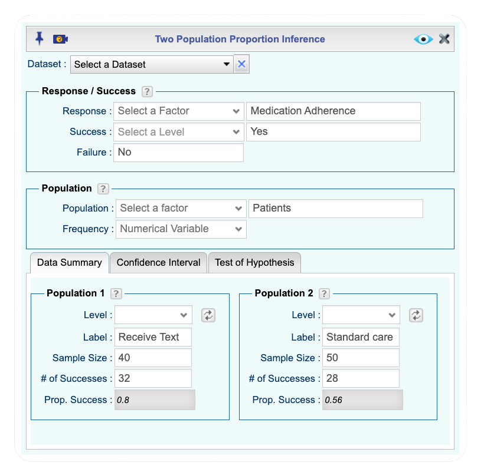
```

Click to expand the box below to see the Rguroo output.

::: {.callout-tip .inner-callout collapse="true" title="Rguroo output: Two-Population Proportion Inference - Text Message Reminder Example"}

<div tabindex="0" class="rg-iframe-wrapper">
  <iframe
    src='Rguroo_html_output/Proportion Inference/text_prop2_pvalue_docx/text_prop2_pvalue.html'
    class="rg-iframe"
    title="Rguroo output: Two-Population Proportion Hypothesis Test- Text Message Example">
  </iframe>
</div>

:::

The p-value is shown in the Rguroo output graph labeled **P-Value Graph: Large Sample z, Pooled SE** (see @fig-pvalue-text). In the left panel, labeled "Observed Data Scale", the areas representing the $p$-value are shaded in red, and the p-value is 0.016395. This value is also reported in the results table.

```{r}
#| echo: false
#| fig-cap: "p-value for the Text Message study."
#| label: fig-pvalue-text
#| fig-alt: "Two side-by-side plots illustrating a two-tailed test using p-values. The left panel shows the observed data scale for the proportion difference Receive Text minus Standard care with a normal curve centered at 0. The observed difference 0.24 is marked, and the areas in both tails shaded in red represent the p-value of 0.016395. The right panel shows the standard normal z scale with the observed z statistic 2.4 marked. The areas in both tails shaded in red represent the same p-value of 0.016395."
#| out-width: "100%"
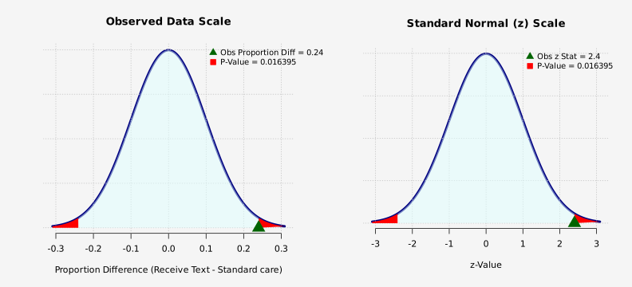
```

Since the p-value is $0.016 < 0.05$, we reject $H_0$ at the significance level $\alpha =0.05$. There is sufficient evidence in favor of $H_a: p_1 - p_2 \neq 0$. Therefore, the data provide sufficient evidence that adherence rates differ between the two approaches. Since the observed adherence rate is higher for the text message reminder group (80%) than for the standard care group (56%), the results suggest that text message reminders are associated with higher adherence.
::::

:::{#exm-text-test-cr}
## Text Message Reminders: Hypothesis Test - Critical Region Example

For the text message reminder study, we want to test whether adherence rates differ. Recall:

- $n_1 = 40$, $X_1 = 32$, $\hat{p}_1 = 0.80$
- $n_2 = 50$, $X_2 = 28$, $\hat{p}_2 = 0.56$
- $\hat{p}_1 - \hat{p}_2 = 0.24$
- $\hat{p} = 0.667$

Hypotheses:
$$
\begin{cases}
H_0: p_1 - p_2 = 0\\
H_a: p_1 - p_2 \neq 0
\end{cases}
$$


a. Using Rguroo, obtain the critical region for a test at significance level $\alpha =0.05$.

b. Based on the observed difference and the critical region in part (a), state the conclusion of the hypothesis test. 
:::

:::: {.callout-tip .solution-callout collapse="true" icon=false}
## 🔎 Solution

a\. To perform this hypothesis test in Rguroo, follow the same steps given in the [solution](#schema-test-cr) of @exm-schema-test-cr. One difference is that in the [Test of Hypothesis]{.tab} tab, for [Alternative Hypothesis p1 − p2]{.des}, you should select the [!=]{.typein} (not equal to) option because this is a two-tailed test, and set the [Significance Level]{.des} to 0.05. In addition, the values in the Basics dialog of [Two Population Proportion Inference]{.dialog} and in the [Data Summary]{.tab} tab should match those shown in @fig-text-test-pvalue2.

```{r, echo=FALSE}
#| fig-cap: "Rguroo input setup comparing success rates for text reminders and standard care"
#| label: fig-text-test-pvalue2
#| fig-alt: "Screenshot of a Two Population Proportion Inference interface. The response variable is Medication Adherence with success defined as Yes and failure as No. The population variable is not yet selected. Population 1 Receive Text has a sample size of 40 with 32 successes proportion 0.8. Population 2 Standard care has a sample size of 50 with 28 successes proportion 0.56. Tabs for Data Summary, Confidence Interval, and Test of Hypothesis are visible."

```

Click to expand the box below to see the Rguroo output.

::: {.callout-tip .inner-callout collapse="true" title="Rguroo output: Two-Population Proportion Inference - Text Message Reminder Example"}

<div tabindex="0" class="rg-iframe-wrapper">
  <iframe
    src='Rguroo_html_output/Proportion Inference/text_prop2_cr_docx/text_prop2_cr.html'
    class="rg-iframe"
    title="Rguroo output: Two-Population Proportion Hypothesis Test- Text Message Example">
  </iframe>
</div>

:::

Since this is a two-sided test, the 5% cutoff values $c_1$ and $c_2$ are determined so that 
$$
P(\hat{p}_1 - \hat{p}_2 \leq c_1 \text{ or }  \hat{p}_1 - \hat{p}_2 \geq c_2) = 0.05, \; \text{assuming}\; p_1 = p_2.
$$

From the Rguroo output graph labeled **Critical Region Graph: Large Sample z, Pooled SE** (shown in @fig-cr-text), these cutoff values are $c_1=-0.196$ and $c_2=0.196$, and are displayed at the bottom of the left panel labeled "Observed Data Scale". Therefore, the critical region is
$$
\hat{p}_1-\hat{p}_2 \leq -0.196
\qquad \text{or} \qquad
\hat{p}_1-\hat{p}_2 \geq 0.196.
$$
This means that observed differences falling in either tail are sufficiently extreme to lead us to reject $H_0$ at significance level $\alpha=0.05$.

```{r}
#| echo: false
#| fig-cap: "Critical region for the text messaging example with $\alpha = 0.05$."
#| label: fig-cr-text
#| fig-alt: "Two side-by-side plots illustrating a two-tailed test at a 5% significance level. The left panel shows the observed data scale for the proportion difference Receive Text minus Standard care with a normal curve centered at 0 and red shaded critical regions in both tails. The critical values are −0.196 and 0.196. The observed difference 0.24 is marked and lies in the right critical region. The right panel shows the standard normal z scale with red shaded critical regions in both tails and critical values −1.96 and 1.96. The observed z statistic 2.4 is marked and lies in the right critical region."
#| out-width: "100%"
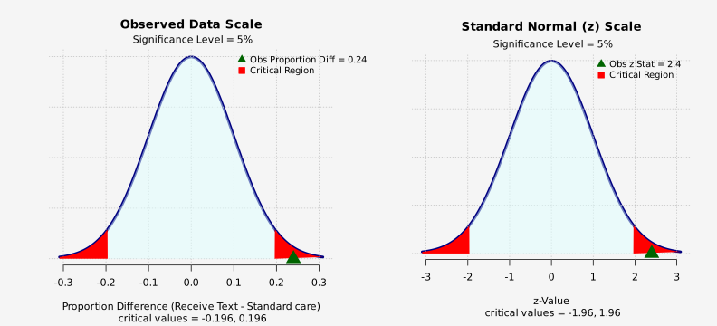
```

Since the observed difference $\hat{p}_1-\hat{p}_2=0.24>0.196$, it falls in the critical region, as shown by the green triangle inside the red-shaded region. Therefore, we reject $H_0$ at significance level $\alpha=0.05$ and conclude that there is sufficient evidence in favor of $H_a:p_1-p_2\neq0$.

The data therefore provide sufficient evidence that adherence rates differ between the two approaches. Since the observed adherence rate is higher for the text message reminder group (80%) than for the standard care group (56%), the results suggest that text message reminders are associated with higher adherence.
::::


So far, in the examples above, we have performed two-population proportion inference using summarized data—namely, the sample sizes and the number of successes for each group. In practice, however, we often begin with raw data rather than pre-computed summaries. By raw data, we mean datasets where each individual observation is recorded as a separate row, with variables indicating group membership and the outcome for each case. The following example demonstrates how we can carry out two-population proportion inference directly from raw data using Rguroo.

:::{#exm-gss-test}
## GSS 2024: Hypothesis Test Using Raw data

Consider the GSS marijuana legalization study. We want to test whether the proportion of U.S. adults who support the legalization of marijuana differs between females and males. Use the [GSS2024]{.data} to test the hypotheses:

$$
\begin{cases}
H_0: p_1 - p_2 = 0\\
H_a: p_1 - p_2 \neq 0,
\end{cases}
$$

where $p_1$ is the proportion of females who support legalization and $p_2$ is the proportion of males who support legalization. 

Using significance level $\alpha=0.05$, test these hypotheses using:

a. the p-value approach.
b. the critical region approach.

:::

:::: {.callout-tip .solution-callout collapse="true" icon=false}
## 🔎 Solution

**Using Rguroo**

Click to expand the box below to see how to use the [Proportion Inference]{.fun}  function in Rguroo to answer this question.

::: {#prop2-inference-gss2024 .callout-note appearance="simple" collapse="true" icon="none" title="{width=22px style='vertical-align:middle;'} Two-Population proportion hypothesis test - Marijuana Legalization Example"}

**Before you begin:** Make sure you have already imported the [GSS2024]{.data} dataset into your Rguroo account, as shown [here](#Importing-GSS2024-to-Rguroo).

1. Open the **Analytics** toolbox in Rguroo.  
2. From the [Analysis]{.dpd} dropdown, select [Proportion Inference]{.fun} → [Two Populations]{.fun}. This opens the [Two Population Proportion Inference]{.dialog} dialog.
3. From the [Dataset]{.dpd} dropdown, select the dataset [GSS2024]{.data}.
4. Fill in the **Response/Success** section of the dialog as follows:

   - From the [Response]{.dpd} dropdown, select the factor [Grass]{.var}, the variable that indicates whether the respondents support legalization of marijuana.
   - From the [Success]{.dpd} dropdown, select the success level [Yes]{.typein}.
   - In the [Failure]{.dpd} textbox, enter [No]{.typein} (this is the default).
   - (Optional) In the [Response Label]{.des} textbox, enter [Legalize Marijuana]{.typein}. The label is usually a more descriptive version of the variable name.
5. In the **Population** section of the dialog, from the [Population]{.dpd} dropdown, select the variable [Sex]{.var}. You can optionally change the label for the population in the given textbox.
6. In the [Data Summary]{.tab} tab, select [Female]{.typein} from the [Level]{.dpd} dropdown for population 1, and [Male]{.typein} from the [Level]{.dpd} dropdown for population 2. Then click the refresh icon  to display the summary statistics for each group.
7. Click the [Test of Hypothesis]{.tab} tab and enter the following:
   - In the [Alternative Hypothesis p1 - p2]{.dpd} dropdown, select [!=]{.typein} (not equal to) and enter [0]{.typein} in the textbox.
   - In the **Methods** section, select [Large Sample z]{.des}.
   - Leave the [Significance Level]{.des} textbox at the default value of [0.05]{.typein}.

8. (Optional) Click the  button to open the [Advanced Features]{.dialog} dialog, and in the **Test of Hypothesis Graph**, select both [P-Value]{.des} and [Critical Region]{.des}. The default is [P-Value]{.des}; selecting [Critical Region]{.des} will also display the critical region.

9. Click the preview icon  to view the output.

10. Click the  button and save the result as [GSS2024Prop2]{.typein}.

::: {.callout-tip .inner-callout collapse="true" title="Rguroo Two-Population Proportion Inference and Advanced Features dialogs for the Marijuana Legalization example"}

```{r,echo=FALSE}
#| fig-alt: "Screenshot of the Rguroo Two Population Proportion Inference dialog using the GSS2024 dataset, where the response variable is Legalize Marijuana with success defined as Yes and population defined by Sex, showing Population 1 as Female with sample size 204, successes 142, and proportion about 0.696, and Population 2 as Male with sample size 184, successes 140, and proportion about 0.761, with the Test of Hypothesis tab selected, alternative hypothesis p_1 - p_2 not equal to 0, significance level 0.05, Large Sample z method checked, and advanced features panel displaying options for P-Value Graph and Critical Region Graph."
#| fig-cap: "Rguroo dialogs for Two-Population Proportion Inference"
#| out-width: "100%"
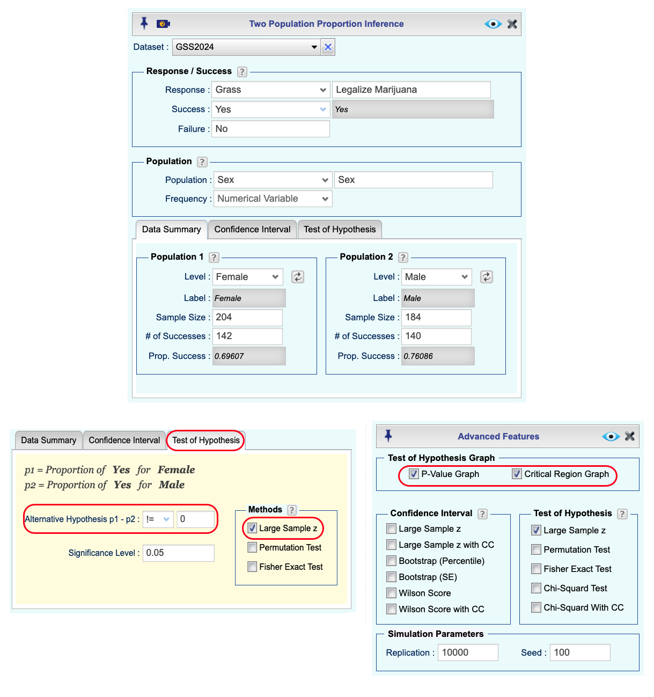
```

:::

:::


Click to expand the box below to see the Rguroo output.

::: {.callout-tip .inner-callout collapse="true" title="Rguroo output: Two-Population Proportion Inference - Marijuana Legalization Example"}

<div tabindex="0" class="rg-iframe-wrapper">
  <iframe
    src="Rguroo_html_output/Proportion Inference/GSS2024Prop2_docx/GSS2024Prop2.html"
    class="rg-iframe" 
    title="Rguroo output: Two-Population Proportion Hypothesis Test - Marijuana Example">
  </iframe>
</div>

:::

a\. p-Value Approach:**

The $p$-value measures the strength of evidence the data provide against $H_0$ and in favor of $H_a: p_1 - p_2 \neq 0$. Because this is a two-sided test, differences at least as far from 0 as the observed difference of $-0.064791$, in either direction, are at least as supportive of $H_a$. Therefore, the p-value is
$$
\text{p-value}
=
P\left(|\hat{p}_1-\hat{p}_2|\geq0.064791\right),\;\text{assuming}\; p_1=p_2.
$$

This probability is shown in the Rguroo output graph labeled **P-Value Graph: Large Sample z, Pooled SE** (also shown in @fig-pvalue2-GSS). In the panel labeled "Observed Data Scale", the areas representing to the $p$-value are shaded in red, and the p-value is 0.15268. This value is also reported in the results table.

```{r}
#| echo: false
#| fig-cap: "p-value for the marijuana legalization example."
#| label: fig-pvalue2-GSS
#| fig-alt: "Plot titled Observed Data Scale showing a normal curve for the sampling distribution of the difference in proportions Female minus Male, centered at 0, with both tails shaded in red representing the p-value for a two-sided test, a green triangle marking the observed proportion difference of about −0.0648, and annotation indicating a p-value of approximately 0.1527."
#| out-width: "70%"
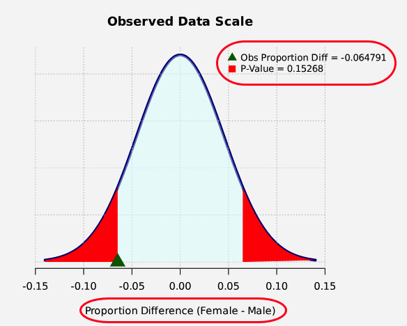
```

Since the p-value is $0.15268 > 0.05$, we fail to reject $H_0$ at significance level $\alpha = 0.05$. There is insufficient evidence in favor of $H_a: p_1 - p_2 \neq 0$. Therefore, the data do not provide sufficient evidence that support for marijuana legalization differs between females and males.

b\. **Critical Region Approach:**

Since this is a two-sided test, the critical values values $c_1$ and $c_2$ are determined so that 
$$
P(\hat{p}_1 - \hat{p}_2 \leq c_1 \text{ or }  \hat{p}_1 - \hat{p}_2 \geq c_2)= 0.05, \;\text{assuming}\; p_1 = p_2 .
$$

From the Rguroo output graph labeled **Critical Region Graph: Large Sample z, Pooled SE** (also shown in @fig-cr-GSS), these cutoff values are $c_1=-0.088794$ and $c_2=0.088794$. These values are displayed at the bottom of the panel labeled Observed Data Scale. Therefore, the critical region is
$$
\hat{p}_1-\hat{p}_2\leq-0.088794
\qquad\text{or}\qquad
\hat{p}_1-\hat{p}_2\geq0.088794.
$$
An observed difference that falls in either of these regions leads us to reject $H_0$ at significance level $\alpha=0.05$.

```{r}
#| echo: false
#| fig-cap: "Critical region for the marijuana legalization example, with $\alpha = 0.05$."
#| label: fig-cr-GSS
#| fig-alt: "Plot titled Observed Data Scale with significance level 5 percent showing a normal curve for the sampling distribution of the difference in proportions Female minus Male, centered at 0, with both tails shaded in red indicating the critical regions, a green triangle marking the observed proportion difference of about −0.0648, and labeled critical values at approximately −0.0888 and 0.0888."
#| out-width: "70%"
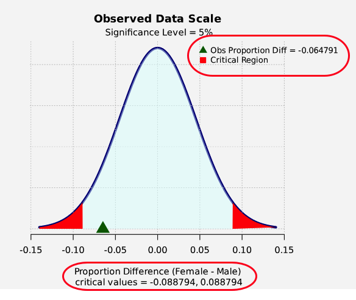
```

Since the observed difference $\hat{p}_1 - \hat{p}_2 = -0.064791$ lies between the two critical values, it does not fall in the critical region, as shown by the green triangle outside the red critical region. Therefore, we fail to reject $H_0$ at  significance level $\alpha = 0.05$ and conclude that there is **not** sufficient evidence in favor of $H_a: p_1 - p_2 \neq 0$.

**Conclusion:**

Both approaches lead to the same decision. At significance level $\alpha = 0.05$ , the data do not provide sufficient evidence that the proportion who support marijuana legalization differs between females and males.
::::

### Homework for @sec-hyp-test-two-prop

For each of the following scenarios, complete these steps:

a. State the null and alternative hypotheses. In each case, clearly describe what the population proportions $p_1$ and $p_2$ represent in the context of the problem.

b. Calculate the observed sample proportions $\hat{p}_1$ and $\hat{p}_2$ and their difference $\hat{p}_1 - \hat{p}_2$. Based on this observed difference, does the sample data appear consistent with the alternative hypothesis?

c. Compute the pooled sample proportion $\hat{p}$ and use it to obtain an estimate of the standard error of $\hat{p}_1 - \hat{p}_2$.

d. Check whether the large sample test is valid by verifying that $n_1\hat{p} \geq 10$, $n_1(1-\hat{p}) \geq 10$, $n_2\hat{p} \geq 10$, and $n_2(1-\hat{p}) \geq 10$. If these conditions are not satisfied, stop here and note that the large sample test is not appropriate for this scenario and skip parts e, f, and g.

e. Use Rguroo to conduct the test of hypothesis using the critical region approach. Does the observed sample difference fall in the critical region? Based on this, do you reject $H_0$ at the 5% significance level?

f. Use Rguroo to obtain the $p$-value for the test of hypothesis. Is the $p$-value less than 0.05? Based on the $p$-value, do you reject $H_0$?

g. Write your conclusion in the context of the problem, stating what the results tell you about the scenario.

---

1. A researcher wants to determine whether male college students have a higher smoking rate than female college students. In a survey of 120 male students, 18 reported being regular smokers. Among 150 female students, 12 reported being regular smokers. Is there enough evidence to show that the proportion of male smokers is higher than the proportion of female smokers among college students? Test at the 5% level.

2. A school district is evaluating whether a new reading program is more effective for students with previous tutoring than for those without. Of 85 students with previous tutoring, 68 passed the reading assessment. Of 92 students without previous tutoring, 59 passed the assessment. Is there enough evidence to show that the proportion of students passing the assessment is higher for those with previous tutoring than for those without? Test at the 5% level.

3. A small clinic wants to compare the effectiveness of two different treatments for a skin condition. In a trial, 8 out of 25 patients receiving Treatment A showed improvement, while 12 out of 28 patients receiving Treatment B showed improvement. Is there enough evidence to show that the proportion of patients improving differs between the two treatments? Test at the 5% level.

4. A coffee shop owner wants to know if customer satisfaction is higher during the morning shift than the evening shift. Of 45 morning customers surveyed, 38 reported being satisfied with their service. Of 52 evening customers surveyed, 35 reported being satisfied. Is there enough evidence to show that the proportion of satisfied customers is higher in the morning than in the evening? Test at the 5% level.

5. Many high school students take the AP tests in different subject areas. In 2007, of the 211,693 students who took the calculus AB exam, 102,598 of them were female and 109,095 of them were male ("AP exam scores," 2013). Is there enough evidence to show that the proportion of female students taking the calculus AB exam is different from the proportion of male students taking the calculus AB exam? Test at the 5% level.

6. Are there more children diagnosed with Autism Spectrum Disorder (ASD) in states that have larger urban areas than in states that are mostly rural? In the state of Pennsylvania, a fairly urban state, there are 245 eight-year-olds diagnosed with ASD out of 18,440 eight-year-olds evaluated. In the state of Utah, a fairly rural state, there are 45 eight-year-olds diagnosed with ASD out of 2,123 eight-year-olds evaluated ("Autism and developmental," 2008). Is there enough evidence to show that the proportion of children diagnosed with ASD in Pennsylvania is higher than the proportion in Utah? Test at the 1% level.

7. A child dying from an accidental poisoning is a terrible incident. Is it more likely that a male child will get into poison than a female child? To find this out, data was collected that showed that out of 1,830 children between the ages of one and four who died from poisoning, 1,031 were males and 799 were females (Flanagan, Rooney & Griffiths, 2005). Do the data show that the proportion of male children dying of poisoning is higher than the proportion of female children? Test at the 1% level.

8. Many high school students take the AP tests in different subject areas. In 2007, of the 144,796 students who took the biology exam, 84,199 of them were female. In that same year, of the 211,693 students who took the calculus AB exam, 102,598 of them were female ("AP exam scores," 2013). Is there enough evidence to show that the proportion of female students taking the biology exam is different from the proportion of female students taking the calculus AB exam? Test at the 5% level.

9. The General Social Survey (GSS) collects data through different survey modes, including in-person interviews and telephone interviews. Researchers want to investigate whether the survey mode affects responses to sensitive questions. Using the GSS2024 dataset, test whether the proportion of respondents who support the legalization of marijuana differs between those surveyed in person and those surveyed by phone. The variable [Mode]{.var} indicates the survey mode (In Person or Phone), and the variable [Grass]{.var} indicates support for marijuana legalization (Yes or No). Test at the 5% level. **Note:** The `Mode` variable in the GSS2024 dataset includes three categories: In Person, Phone, and Web. When you select only the In Person and Phone groups in Rguroo for your analysis, Rguroo will automatically exclude respondents who completed the survey via the Web.

## Confidence Interval for the Difference Between Two Population Proportions {#sec-confidence-interval-two-prop}

In @sec-hyp-test-two-prop, we learned how to test whether two population proportions differ. For example, in the schema-based instruction study (@exm-schema-test-pvalue), we found strong evidence that the new instructional approach produced higher mastery rates than traditional instruction. The hypothesis test told us that a difference exists, but it didn't tell us how large that difference might be. Does the new approach improve mastery by 5 percentage points? 20 percentage points? 35 percentage points? The hypothesis test alone cannot answer this question.

This is where confidence intervals become valuable. A confidence interval for $p_1 - p_2$ provides a range of plausible values for the true difference between the two proportions, addressing the question "How large is the difference?" It tells us not just that a difference exists, but also gives us insight into the magnitude and direction of that difference. For instance, a confidence interval might tell us: "We are 95% confident that the new approach improves mastery rates by somewhere between 4 and 36 percentage points compared to traditional instruction." This additional information helps researchers, educators, and policymakers make more informed decisions.

Just as in the one-population case (@sec-confidence-interval-one-pop), a confidence interval for $p_1 - p_2$ can be derived by inverting hypothesis tests: given the observed difference $\hat{p}_1 - \hat{p}_2$, the $(1-\alpha) \times 100\%$ interval consists of all values $d$ for which we would fail to reject $H_0: p_1 - p_2 = d$ in a two-sided test at significance level $\alpha$. And as in the one-population case, the **confidence level** describes the long-run behavior of the construction method, not any single interval — a 95% method captures the true difference in 95% of repeated samples. In practice we use a direct formula based on the normal approximation rather than carrying out the test inversion by hand, but the logic is the same.


### Large Sample Confidence Interval for $p_1 - p_2$ {#sec-ci-two-prop-large-sample}

When the large sample conditions are satisfied, we can construct a confidence interval for $p_1 - p_2$ using the normal approximation. Recall from @sec-data-stat-dist that when both samples are sufficiently large, the difference in sample proportions $\hat{p}_1 - \hat{p}_2$ follows an approximately normal distribution.

However, there is an important difference between constructing a confidence interval and conducting a hypothesis test. In hypothesis testing, we assumed $H_0: p_1 = p_2$ was true, which allowed us to use a pooled estimate $\hat{p}$ for the common proportion. When constructing a confidence interval, we do not assume the proportions are equal—in fact, we're trying to estimate how different they are! Therefore, we cannot use the pooled proportion.

Instead, for a confidence interval, we estimate the standard error using the individual sample proportions $\hat{p}_1$ and $\hat{p}_2$:

$$\text{SE}(\hat{p}_1 - \hat{p}_2) = \sqrt{\frac{\hat{p}_1(1-\hat{p}_1)}{n_1} + \frac{\hat{p}_2(1-\hat{p}_2)}{n_2}}.$$

This is called the **unpooled standard error**, or simply the **standard error**, because we do not pool the two samples together.

::: {.callout-note appearance="minimal"}
## Pooled vs. Unpooled Standard Error

The two-proportion confidence interval uses the **unpooled** standard error, based on $\hat{p}_1$ and $\hat{p}_2$ separately:
$$\text{SE}(\hat{p}_1 - \hat{p}_2) = \sqrt{\frac{\hat{p}_1(1-\hat{p}_1)}{n_1} + \frac{\hat{p}_2(1-\hat{p}_2)}{n_2}}.$$

The two-proportion **hypothesis test**, by contrast, uses the **pooled** standard error, based on the common proportion $\hat{p}$ under $H_0: p_1 = p_2$ (see @sec-data-stat-dist):
$$\widehat{\text{SE}}(\hat{p}_1 - \hat{p}_2) = \sqrt{\hat{p}(1-\hat{p})\left(\frac{1}{n_1} + \frac{1}{n_2}\right)}.$$

The reason is the assumption being made. The hypothesis test assumes $p_1 = p_2$, so we pool. The confidence interval makes no such assumption — we're trying to estimate the difference, not assume it away — so we estimate each proportion's variance from its own sample.
:::

The large sample conditions for a confidence interval are the same as those for hypothesis testing. We need at least 10 successes and at least 10 failures in each group:

$$n_1\hat{p}_1 \geq 10, \quad n_1(1-\hat{p}_1) \geq 10, \quad n_2\hat{p}_2 \geq 10, \quad n_2(1-\hat{p}_2) \geq 10.$$

When these conditions are satisfied, the $(1-\alpha) \times 100\%$ confidence interval for $p_1 - p_2$ takes the form:

$$(\hat{p}_1 - \hat{p}_2) \pm z^* \times \text{SE}(\hat{p}_1 - \hat{p}_2),$$

where $z^*$ is the critical value from the standard normal distribution corresponding to the desired confidence level, just as in the one-population case.

::: {.callout-note icon=false}
## Large Sample Confidence Interval for $p_1 - p_2$

When the large sample conditions are satisfied, an approximate $(1-\alpha) \times 100\%$ confidence interval for $p_1 - p_2$ is:

$$(\hat{p}_1 - \hat{p}_2) \pm \underbrace{z^* \times \sqrt{\frac{\hat{p}_1(1-\hat{p}_1)}{n_1} + \frac{\hat{p}_2(1-\hat{p}_2)}{n_2}}}_{\text{margin of error}}.$$

That is, the lower endpoint is $(\hat{p}_1 - \hat{p}_2) - z^* \cdot \text{SE}$ and the upper endpoint is $(\hat{p}_1 - \hat{p}_2) + z^* \cdot \text{SE}$, where $\text{SE}$ is the unpooled standard error given above.
:::

Common critical values remain the same:

| Confidence Level | $\alpha$ | $z^*$ |
|-----------------|----------|-------|
| 90% | 0.10 | 1.645 |
| 95% | 0.05 | 1.960 |
| 99% | 0.01 | 2.576 |

Let's see how to construct and interpret confidence intervals for the difference between two proportions using our earlier examples.


### Relationship Between Confidence Intervals and Hypothesis Tests

There is an important connection between confidence intervals and two-sided hypothesis tests. A $(1-\alpha)\times100%$ confidence interval and a two-sided hypothesis test at significance level $\alpha$ lead to the same conclusion about the null value $p_1-p_2=0$:

- If a $(1-\alpha) \times 100\%$ confidence interval for $p_1 - p_2$ **does not contain 0**, then 0 is not a plausible value for $p_1-p_2$, and we **reject** $H_0: p_1 - p_2 = 0$ at significance level $\alpha$ in a two-sided test.

- If a $(1-\alpha) \times 100\%$ confidence interval for $p_1 - p_2$ **contains 0**, 0 is a plausible value for $p_1-p_2$, and we **fail to reject** $H_0: p_1 - p_2 = 0$ at significance level $\alpha$ in a two-sided test.

This relationship provides a quick way to connect the confidence interval to the corresponding two-sided hypothesis test. As noted, however, confidence intervals provide more information than hypothesis tests alone. They tell us not just whether the data provide evidence of a difference, but also which values are plausible for the size and direction of the difference.

This direct relationship applies only to two-sided hypothesis tests. For a one-sided hypothesis test, you should not use this confidence interval rule to determine whether to reject $H_0$.

:::{#exm-schema-ci}
## Schema-Based Instruction: Confidence Interval

Recall @exm-schema-test-pvalue. In the schema-based instruction study, 50 students were assigned to the new approach and 50 to traditional instruction. After the intervention, 34 students in the new approach group achieved mastery ($\hat{p}_1 = 0.68$), while 24 students in the traditional instruction group achieved mastery ($\hat{p}_2 = 0.48$).

a. Check whether the large sample conditions are satisfied for constructing a confidence interval.
b. Use Rguroo's [Two-Population Proportion]{.fun} inference function to construct a 95% confidence interval for the true difference in mastery rates between the two approaches, and interpret the interval in the context of the problem.
:::

:::: {.callout-tip .solution-callout collapse="true" icon=false}
## 🔎 Solution

a\. We check the large sample conditions using the individual sample proportions:

   - Group 1 (new approach): $n_1\hat{p}_1 = 50 \times 0.68 = 34 \geq 10$ and $n_1(1-\hat{p}_1) = 50 \times 0.32 = 16 \geq 10$
   - Group 2 (traditional): $n_2\hat{p}_2 = 50 \times 0.48 = 24 \geq 10$ and $n_2(1-\hat{p}_2) = 50 \times 0.52 = 26 \geq 10$

All four conditions are satisfied, so the large-sample normal approximation is appropriate for constructing the confidence interval.

b\. Click to expand the box below to see how to use the [Proportion Inference]{.fun} function in Rguroo to obtain a large sample confidence interval for this problem.

::: {#prop-ci-two-prop-schema .callout-note appearance="simple" collapse="true" icon="none" title="{width=22px style='vertical-align:middle;'} Two-population large sample confidence interval - Schema example"}

1. Open the **Analytics** toolbox in Rguroo.  

2. From the [Analysis]{.dpd} dropdown, select [Proportion Inference]{.fun} → [Two Populations]{.fun}. This opens the [Two Population Proportion Inference]{.dialog} dialog.

3. In the **Response/Success** section of the dialog, enter the same information as in @exm-schema-test-pvalue:
   - [Response Label]{.des}: [Improves Mastery]{.typein}
   - [Success Label]{.des}: [Yes]{.typein}
   - [Failure Label]{.des}: [No]{.typein}

4. In the **Population** section, enter [Seventh Graders]{.typein}.

5. In the [Data Summary]{.tab} tab, enter the data for both populations:
   - **Population 1**: [Label]{.des}: [New]{.typein}, [Sample Size]{.des}: [50]{.typein}, [# of Successes]{.des}: [34]{.typein}
   - **Population 2**: [Label]{.des}: [Traditional]{.typein}, [Sample Size]{.des}: [50]{.typein}, [# of Successes]{.des}: [24]{.typein}

6. Click on the [Confidence Interval]{.tab} tab and specify the following:
   - In the [Confidence Level]{.des} textbox, enter [0.95]{.typein}. This is the default value corresponding to 95% confidence.
   - In the **Methods** section, select the checkbox [Large Sample z]{.des}.

7. Click the preview icon  to view the output.

8. Click the  button and save the result as [SchemaCI]{.typein}.

::: {.callout-tip .inner-callout collapse="true" title="Rguroo Two-Population Proportion dialog for Schema-Based Instruction confidence interval"}

```{r,echo=FALSE}
#| fig-alt: "Screenshot of the Rguroo Two Population Proportion Inference interface showing setup for a study comparing a new instructional approach and traditional instruction among seventh graders, with Population 1 labeled New (sample size 50, successes 34, proportion 0.68) and Population 2 labeled Traditional (sample size 50, successes 24, proportion 0.48), and the Confidence Interval tab selected with confidence level 0.95 and the Large Sample z method checked."
#| fig-cap: "Rguroo dialog for constructing a confidence interval"
#| out-width: "100%"
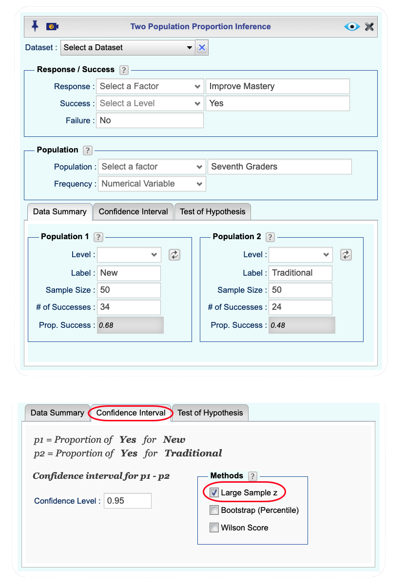
```
:::

:::

Click to expand the box below to see the Rguroo output.

::: {.callout-tip .inner-callout collapse="true" title="Rguroo output: Two-Population Proportion Confidence Interval - Schema-Based Instruction"}

<div tabindex="0" class="rg-iframe-wrapper">
  <iframe
    src="Rguroo_html_output/Proportion Inference/SchemaCI_docx/SchemaCI.html"
    class="rg-iframe"
    title="Rguroo output: Two-Population Proportion CI - Schema Example">
  </iframe>
</div>

:::

From the Rguroo output, the 95% confidence interval for $p_1 - p_2$ is approximately $(0.0105, 0.3895)$. 

**Interpretation:** We are 95% confident that the true difference in mastery rates (new approach minus traditional instruction) is between about 0.011 and 0.379, or between about 1.1 and 38.9 percentage points. Since the entire interval is positive the data suggest that the mastery rate is higher for the new instructional approach than for traditional instruction.

::::

:::{#exm-text-ci}
## Text Message Reminders: Confidence Interval

Recall @exm-text-test-pvalue. In the text message reminder study, 40 patients received text reminders and 50 received standard care. After three months, 32 patients in the text reminder group had good adherence ($\hat{p}_1 = 0.80$), while 28 patients in the standard care group had good adherence ($\hat{p}_2 = 0.56$).

a. Check whether the large sample conditions are satisfied for constructing a confidence interval.
b. Use Rguroo's [Two-Population Proportion]{.fun} inference function to construct a 95% confidence interval for the true difference in adherence rates between the two approaches, and interpret the interval in the context of the problem.
c. Compare this confidence interval to the hypothesis test result in @exm-text-test-pvalue. Are they consistent?
:::

:::: {.callout-tip .solution-callout collapse="true" icon=false}
## 🔎 Solution

a\. We check the large sample conditions using the individual sample proportions:

   - Group 1 (text reminders): $n_1\hat{p}_1 = 40 \times 0.80 = 32 \geq 10$ and $n_1(1-\hat{p}_1) = 40 \times 0.20 = 8 < 10$
   - Group 2 (standard care): $n_2\hat{p}_2 = 50 \times 0.56 = 28 \geq 10$ and $n_2(1-\hat{p}_2) = 50 \times 0.44 = 22 \geq 10$

   The condition $n_1(1-\hat{p}_1) \geq 10$ is not satisfied. We have only 8 observed failures in the text reminder group. Therefore, the 10-10 rule is not fully satisfied, and we should use caution when applying the large-sample normal approximation. We will proceed with the large-sample method here so that we can examine the resulting interval.

b\. Follow the same Rguroo instructions as shown in @exm-schema-ci. The following is a screenshot of the [Two Population Proportion Inference]{.dialog} dialog for obtaining the large sample confidence interval for this example.

```{r,echo=FALSE}
#| fig-alt: "Screenshot of the Rguroo Two Population Proportion Inference interface showing setup for a study comparing text reminders and standard care for medication adherence, with Population 1 labeled Text Reminder (sample size 40, successes 32, proportion 0.80) and Population 2 labeled Standard Care (sample size 50, successes 28, proportion 0.56), and the Data Summary tab displaying the sample information for both groups."
#| fig-cap: "Rguroo dialog for constructing a confidence interval for the text message study"
#| out-width: "100%"
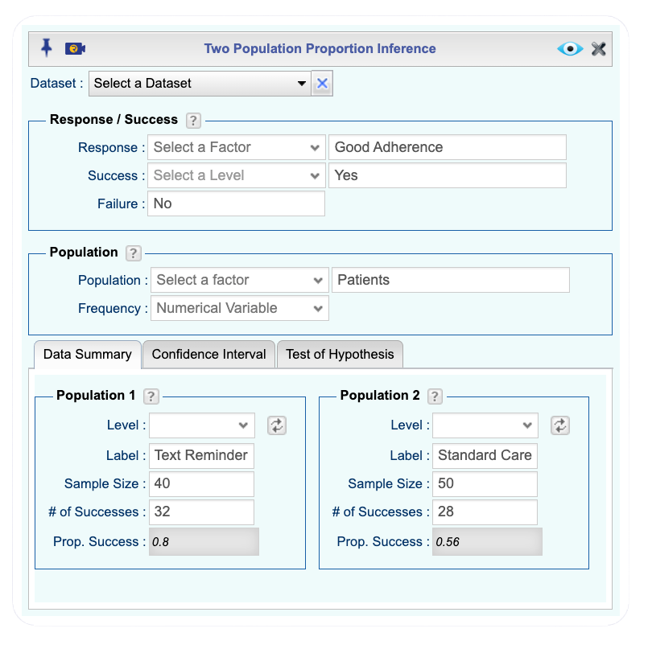
```

Click to expand the box below to see the Rguroo output.

::: {.callout-tip .inner-callout collapse="true" title="Rguroo output: Two-Population Proportion Confidence Interval - Text Message Reminders"}

<div tabindex="0" class="rg-iframe-wrapper">
  <iframe
    src="Rguroo_html_output/Proportion Inference/TextCI_docx/TextCI.html"
    class="rg-iframe"
    title="Rguroo output: Two-Population Proportion CI - Text Message Example">
  </iframe>
</div>

:::

From the Rguroo output, the 95% confidence interval for $p_1 - p_2$ is $(0.0548067, 0.425193)$.

**Interpretation:** We are 95% confident that the true difference in adherence rates (text message reminders minus standard care) is between 0.0548067 (about 5.5 percentage points) and 0.425193 (about 42.5 percentage points). 

c\. Since the entire interval is positive, the data suggest that the adherence rate is higher for the text message reminder group than for the standard care group. This is consistent with the two-sided hypothesis test in @exm-text-test-pvalue, where we rejected $H_0: p_1 - p_2 = 0$ at significance level $\alpha=0.05$. The value 0 lies outside the 95% confidence interval.

As expected, the two-sided test at $\alpha=0.05$ and the corresponding 95% confidence interval lead to the same conclusion.
::::

:::{#exm-smoking-ci}
## Smoking Cessation: Confidence Interval

Recall @exm-smoking-test-pvalue. In the smoking cessation study, 60 employees received nicotine patches and 60 participated in the self-guided program. After six months, 24 employees in the nicotine patch group had quit smoking ($\hat{p}_1 = 0.40$), while 30 in the self-guided group had quit ($\hat{p}_2 = 0.50$).

a. Check whether the large sample conditions are satisfied for constructing a confidence interval.
b. Use Rguroo's [Two-Population Proportion]{.fun} inference function to construct a 95% confidence interval for the true difference in quit rates between the two approaches, and interpret the interval in the context of the problem.
:::

:::: {.callout-tip .solution-callout collapse="true" icon=false}
## 🔎 Solution

a\. We check the large sample conditions using the individual sample proportions:

   - Group 1 (nicotine patches): $n_1\hat{p}_1 = 60 \times 0.40 = 24 \geq 10$ and $n_1(1-\hat{p}_1) = 60 \times 0.60 = 36 \geq 10$
   - Group 2 (self-guided): $n_2\hat{p}_2 = 60 \times 0.50 = 30 \geq 10$ and $n_2(1-\hat{p}_2) = 60 \times 0.50 = 30 \geq 10$

   All conditions are satisfied, so tthe large-sample normal approximation is appropriate for constructing the confidence interval.

b\. The following is a screenshot of the [Two Population Proportion Inference]{.dialog} dialog for obtaining the large sample confidence interval for this example.

```{r,echo=FALSE}
#| fig-alt: "Screenshot of the Rguroo Two Population Proportion Inference interface showing setup for a study comparing nicotine patches and a self-guided quitting program among employee smokers, with Population 1 labeled Nicotine Patch (sample size 60, successes 24, proportion 0.40) and Population 2 labeled Self-Guided (sample size 60, successes 30, proportion 0.50), and the Data Summary tab displaying the sample information for both groups."
#| fig-cap: "Rguroo dialog for constructing a confidence interval for the smoking cessation study"
#| out-width: "100%"
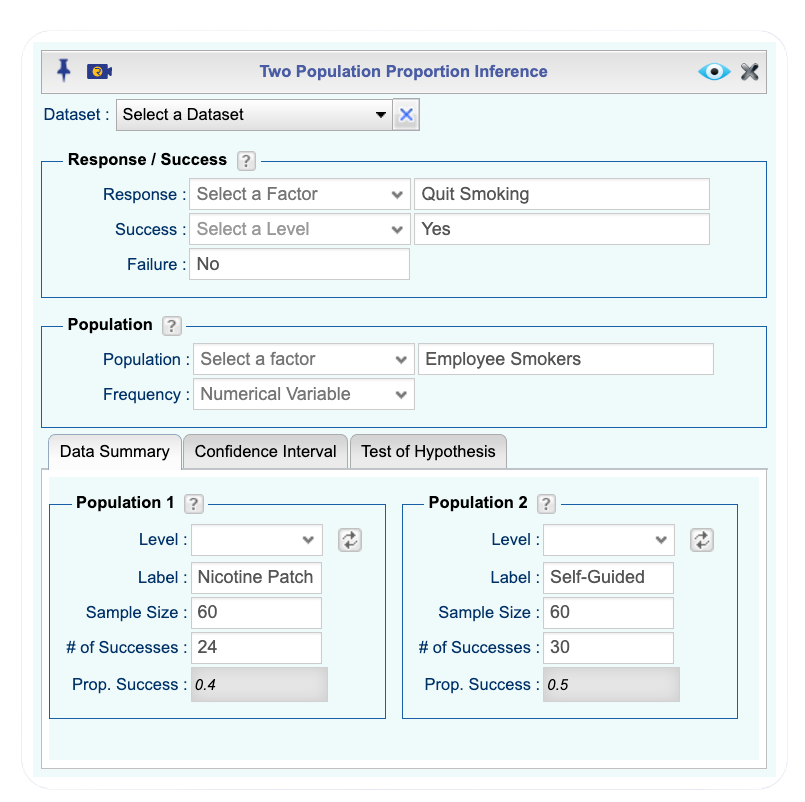
```

Click to expand the box below to see the Rguroo output.

::: {.callout-tip .inner-callout collapse="true" title="Rguroo output: Two-Population Proportion Confidence Interval - Smoking Cessation"}

<div tabindex="0" class="rg-iframe-wrapper">
  <iframe
    src="Rguroo_html_output/Proportion Inference/SmokingCI_docx/SmokingCI.html"
    class="rg-iframe"
    title="Rguroo output: Two-Population Proportion CI - Smoking Cessation Example">
  </iframe>
</div>

:::

From the Rguroo output, the 95% confidence interval for $p_1 - p_2$ is $(-0.277121, 0.0771212)$.

**Interpretation:** We are 95% confident that the true difference in quit rates (nicotine patches minus self-guided) is between $-0.2771$ (about $-27.7$ percentage points) and $0.07712$ (about $7.7$ percentage points). Negative values indicate a higher quit rate for the self-guided approach, while positive values indicate a higher quit rate for the nicotine patch approach. Because the interval includes 0, the data are consistent with no difference in the population quit rates.

::::

:::{#exm-gss-ci}
## GSS 2024: Gender and Marijuana Legalization - Confidence Interval Using Raw Data

Recall @exm-gss-test. The GSS 2024 sample included 204 females, of whom 142 support marijuana legalization ($\hat{p}_1 \approx 0.696$), and 184 males, of whom 140 support legalization ($\hat{p}_2 \approx 0.761$).

a. Check whether the large sample conditions are satisfied for constructing a confidence interval.
b. Use Rguroo's [Two-Population Proportion]{.fun} inference function with the [GSS2024]{.data} dataset to construct a 95% confidence interval for the true difference in support for marijuana legalization between females and males, and interpret the interval in the context of the problem.
c. Compare this confidence interval to the hypothesis test result in @exm-gss-test. Are they consistent?

<div tabindex="0" style="width:85%; margin:auto;">

 The dataset for this example is available in the Rguroo dataset repository [Kozak]{.repo}, with the dataset name [GSS2024]{.data}.

**Code book for Dataset GSS2024 is given [here](#code-book-gss2024).**

</div>

:::

:::: {.callout-tip .solution-callout collapse="true" icon=false}
## 🔎 Solution

a\. We check the large sample conditions using the individual sample proportions:

   - Group 1 (females): $n_1\hat{p}_1 = 204 \times 0.696 \approx 142 \geq 10$ and $n_1(1-\hat{p}_1) = 204 \times 0.304 \approx 62 \geq 10$
   - Group 2 (males): $n_2\hat{p}_2 = 184 \times 0.761 \approx 140 \geq 10$ and $n_2(1-\hat{p}_2) = 184 \times 0.239 \approx 44 \geq 10$

   All conditions are comfortably satisfied, the large-sample normal approximation is appropriate for constructing the confidence interval.

b\. Click to expand the box below to see how to use the [Proportion Inference]{.fun} function in Rguroo to obtain a confidence interval from raw data.

::: {#prop-ci-two-prop-gss .callout-note appearance="simple" collapse="true" icon="none" title="{width=22px style='vertical-align:middle;'} Two-population confidence interval using raw data - GSS example"}

**Before you begin:** Make sure you have already imported the [GSS2024]{.data} dataset into your Rguroo account, as shown [here](#Importing-GSS2024-to-Rguroo).

1. Open the **Analytics** toolbox in Rguroo.  

2. From the [Analysis]{.dpd} dropdown, select [Proportion Inference]{.fun} → [Two Populations]{.fun}. This opens the [Two Population Proportion Inference]{.dialog} dialog.

3. From the [Dataset]{.dpd} dropdown, select the dataset [GSS2024]{.data}.

4. Fill in the **Response/Success** section of the dialog as follows:
   - From the [Response]{.dpd} dropdown, select the factor [Grass]{.var}.
   - From the [Success]{.dpd} dropdown, select the success level [Yes]{.typein}.
   - In the [Failure]{.dpd} textbox, enter [No]{.typein}.
   - (Optional) In the [Response Label]{.des} textbox, enter [Legalize Marijuana]{.typein}.

5. In the **Population** section of the dialog, from the [Population]{.dpd} dropdown, select the variable [Sex]{.var}.

6. In the [Data Summary]{.tab} tab, select [Female]{.typein} from the [Level]{.dpd} dropdown for population 1, and [Male]{.typein} from the [Level]{.dpd} dropdown for population 2. Then click the refresh icon  to display the summary statistics for each group.

7. Click on the [Confidence Interval]{.tab} tab and specify the following:
   - In the [Confidence Level]{.des} textbox, enter [0.95]{.typein}.
   - In the **Methods** section, select the checkbox [Large Sample z]{.des}.

8. Click the preview icon  to view the output.

9. Click the  button and save the result as [GSS2024CI]{.typein}.

::: {.callout-tip .inner-callout collapse="true" title="Rguroo Two-Population Proportion dialog for GSS2024 confidence interval"}

```{r,echo=FALSE}
#| fig-alt: "Screenshot of the Rguroo Two Population Proportion Inference interface using the GSS2024 dataset, with response variable Legalize Marijuana and success defined as Yes, population defined by Sex, showing Population 1 as Female with sample size 204, successes 142, and proportion about 0.696, and Population 2 as Male with sample size 184, successes 140, and proportion about 0.761, with the Data Summary tab displaying the sample information for both groups."
#| fig-cap: "Rguroo dialog for constructing a confidence interval from raw data"
#| out-width: "100%"
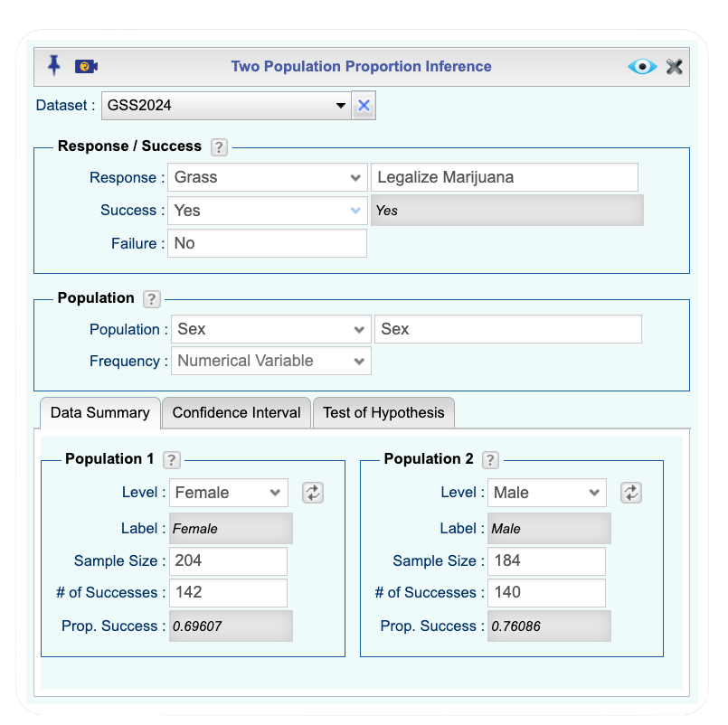
```
:::

:::

Click to expand the box below to see the Rguroo output.

::: {.callout-tip .inner-callout collapse="true" title="Rguroo output: Two-Population Proportion Confidence Interval - GSS 2024 Marijuana Legalization"}

<div tabindex="0" class="rg-iframe-wrapper">
  <iframe
    src="Rguroo_html_output/Proportion Inference/GSS2024CI_docx/GSS2024CI.html"
    class="rg-iframe"
    title="Rguroo output: Two-Population Proportion CI - GSS 2024 Example">
  </iframe>
</div>

:::

From the Rguroo output, the 95% confidence interval for $p_1 - p_2$ is $(-0.153008, 0.0234262)$.

**Interpretation:** We are 95% confident that the true difference in support for marijuana legalization (females minus males) is between $-0.1530$ (about $-15.3$ percentage points) and $0.0234$ (about $2.3$ percentage points). Negative values indicate lower support among females than males, while positive values indicate higher support among females. Since the interval includes 0, the data are consistent with no difference in the population proportions who support marijuana legalization between females and males.

Note that the observed difference was $\hat{p}_1 - \hat{p}_2 \approx -0.065$, meaning the sample showed about 6.5 percentage points lower support among females. However, the confidence interval indicates that plausible values for the true difference range from about 15 percentage points lower support among females to about 2 percentage points higher support among females.

c\. This confidence interval is consistent with our hypothesis test result in @exm-gss-test. In that test, we failed to reject $H_0: p_1 - p_2 = 0$ at significance level $\alpha=0.05$, with a p-value of 0.153. The value 0 lies inside the 95% confidence interval, which corresponds to failing to reject $H_0$ in the corresponding two-sided test. Both the hypothesis test and the confidence interval lead us to the same conclusion: the data do not provide sufficient evidence that support for marijuana legalization differs between females and males.

::::

### Homework for @sec-confidence-interval-two-prop

For each of the scenarios described below, answer the following:

a. Check whether the large sample conditions are satisfied using the individual sample proportions. Based on your answer, determine whether the large sample normal approximationis appropriate for constructing the confidence interval.

b. Use Rguroo's [Two-Population Proportion]{.fun} inference function with the [Large Sample z]{.des} option to obtain a 95% confidence interval for $p_1 - p_2$. Interpret the interval in the context of the problem.

c. Does the confidence interval contain 0? What does this tell you about whether $p_1-p_2=0$ is a plausible value for the difference in population proportions? If the hypothesis test you conducted in the homework for @sec-hyp-test-two-prop was two-sided, compare your confidence interval conclusion with the hypothesis test conclusion. Are they consistent?

---

1. **College Student Smoking Rates by Gender**
Recall Problem 1 from @sec-hyp-test-two-prop. In a survey of 120 male students, 18 reported being regular smokers. Among 150 female students, 12 reported being regular smokers. Construct a 95% confidence interval for the difference in smoking rates between male and female college students.

2. **Reading Program Effectiveness by Prior Tutoring**
Recall Problem 2 from @sec-hyp-test-two-prop. Of 85 students with previous tutoring, 68 passed the reading assessment. Of 92 students without previous tutoring, 59 passed the assessment. Construct a 95% confidence interval for the difference in pass rates between students with and without previous tutoring.

3. **Skin Treatment Effectiveness Comparison**
Recall Problem 3 from @sec-hyp-test-two-prop. In a trial, 8 out of 25 patients receiving Treatment A showed improvement, while 12 out of 28 patients receiving Treatment B showed improvement. Construct a 95% confidence interval for the difference in improvement rates between the two treatments.

4. **Coffee Shop Customer Satisfaction by Shift**
Recall Problem 4 from @sec-hyp-test-two-prop. Of 45 morning customers surveyed, 38 reported being satisfied with their service. Of 52 evening customers surveyed, 35 reported being satisfied. Construct a 95% confidence interval for the difference in satisfaction rates between morning and evening shifts.

5. **AP Calculus AB Exam by Gender**
Recall Problem 5 from @sec-hyp-test-two-prop. In 2007, of the 211,693 students who took the calculus AB exam, 102,598 were female and 109,095 were male. Construct a 95% confidence interval for the difference in the proportion of female versus male students taking the calculus AB exam. (Note: For this problem, let $p_1$ represent the proportion of all AP calculus AB test-takers who are female, and $p_2$ represent the proportion who are male.)

6. **Autism Spectrum Disorder: Pennsylvania vs. Utah**
Recall Problem 6 from @sec-hyp-test-two-prop. In Pennsylvania, 245 eight-year-olds were diagnosed with ASD out of 18,440 evaluated. In Utah, 45 eight-year-olds were diagnosed with ASD out of 2,123 evaluated. Construct a 99% confidence interval for the difference in ASD diagnosis rates between Pennsylvania and Utah.

7. **Child Poisoning Deaths by Gender**
Recall Problem 7 from @sec-hyp-test-two-prop. Out of 1,830 children between the ages of one and four who died from poisoning, 1,031 were males and 799 were females. Construct a 99% confidence interval for the difference in the proportion of poisoning deaths between male and female children.

8. **AP Biology vs. Calculus AB Exam by Gender**
Recall Problem 8 from @sec-hyp-test-two-prop. In 2007, of the 144,796 students who took the biology exam, 84,199 were female. Of the 211,693 students who took the calculus AB exam, 102,598 were female. Construct a 95% confidence interval for the difference in the proportion of female students between these two exams. (Note: For this problem, let $p_1$ represent the proportion of biology test-takers who are female, and $p_2$ represent the proportion of calculus AB test-takers who are female.)

9. **GSS 2024: Marijuana Legalization by Survey Mode**
Recall Problem 9 from @sec-hyp-test-two-prop. Using the GSS2024 dataset, construct a 95% confidence interval for the difference in the proportion of respondents who support marijuana legalization between those surveyed in person and those surveyed by phone. The variable [Mode]{.var} indicates the survey mode (In Person or Phone), and the variable [Grass]{.var} indicates support for marijuana legalization (Yes or No). 

<div tabindex="0" style="width:85%; margin:auto;">

 The dataset for this exercise is available in the Rguroo dataset repository [Kozak]{.repo}, with the dataset name [GSS2024]{.data}.

**Code book for Dataset GSS2024 is given [here](#code-book-gss2024).**

</div>

**Note:** The [Mode]{.var} variable in the GSS2024 dataset includes three categories: In Person, Phone, and Web. When you select only the In Person and Phone groups in Rguroo for your analysis, Rguroo will automatically exclude respondents who completed the survey via the Web.

---

**Additional Practice Problems:**

For the following problems, construct the specified confidence interval and interpret it in context:

10. **Vaccine Effectiveness Study**
A clinical trial randomly assigned 500 participants to receive a new vaccine and 500 to receive a placebo. After exposure, 12 vaccinated participants developed the disease, while 48 placebo recipients developed the disease. Construct a 95% confidence interval for the difference in disease rates between the two groups.

11. **Online vs. In-Person Course Success**
A university compared success rates for a statistics course offered online versus in-person. Of 180 online students, 126 earned a grade of C or better. Of 220 in-person students, 165 earned a grade of C or better. Construct a 90% confidence interval for the difference in success rates between the two delivery methods.

12. **Political Poll on Policy Support**
A political poll asked 400 urban residents and 350 rural residents whether they support a new environmental policy. Among urban residents, 248 expressed support. Among rural residents, 182 expressed support. Construct a 95% confidence interval for the difference in support rates between urban and rural residents.

