**Before you begin, click to expand the box below to review the process for importing a dataset.**

::: {#Importing-GSS2024-to-Rguroo .callout-note appearance="simple" collapse="true" icon="none" title="{width=22px style='vertical-align:middle;'}  Importing Data to Rguroo"} 

1. Open the **Data** toolbox in Rguroo.  
2. From the [Data Import]{.dpd} dropdown, select [Dataset Repository]{.fun}.  
3. In the top search box, type [kozak]{.typein}, then select the [Statistics Using Technology – Kozak]{.repo} repository.  
4. In the middle search box, type the first few letters of the dataset name, and choose your desired dataset name that appears in the lower panel.  
5. Click the [Import]{.button}. The dataset will be imported to your Rguroo account.
6. Click [Close]{.button} to exit the dialog.  
7. To view the dataset, double-click the dataset name under the **Data** toolbox list.

:::

## Sampling Variability and Inference {#sec-sampling-variability}

Now that we understand how probability distributions describe variability in random outcomes, we can use these ideas to draw conclusions about a population from sample data. This process is called **statistical inference**. In this chapter, we develop the ideas and tools needed to evaluate claims about a population proportion using sample data through hypothesis testing. We then extend these ideas to construct confidence intervals for a population proportion. The key concepts of hypothesis testing—such as null and alternative hypotheses, Type I and Type II errors, and the significance level—will serve as a foundation for similar methods in other settings throughout the course. We build these ideas gradually, returning to the same three examples so that each new concept can be understood in a familiar context.

In statistical inference, we use information from a sample to make statements about an unknown population parameter. Note that different random samples from the same population will not produce exactly the same results. For example, suppose we want to estimate the proportion of students at a university who prefer online courses. A random sample of 100 students might show that 62% prefer online courses. If we take a different random sample of 100 students, we might find that 57% prefer online courses. A third sample might give 65%. Even though each sample is drawn from the same population, the sample proportions are not identical.

This unavoidable variation from one sample to another is called **sampling variability**. 
It occurs because each sample includes different individuals and therefore produces 
slightly different results. Because we rely on the sample we happen to collect 
rather than the entire population, we should expect some difference between a 
sample statistic and the corresponding population value. This raises a fundamental 
question that will guide us throughout this chapter: could the result we observed 
in our sample reasonably happen by chance, or does it suggest something meaningful 
about the population? As we will see, the probability distributions we studied in 
earlier chapters will help us answer this question.

There are two main tools of statistical inference: hypothesis tests and confidence intervals. A **hypothesis test** begins with a specific claim about a population parameter and uses sample data to evaluate that claim. A **confidence interval**, on the other hand, provides a range of plausible values for the population parameter based on the sample data. 

We begin with hypothesis testing, the first of these two tools.

## Hypothesis Testing: Concepts and Setup {#sec-concept-setup}
In many real situations, we encounter numerical claims about percentages;  the percentage of teenagers who use a particular app, the percentage of adults who meet health guidelines, or the percentage of students who rely on social media for news. But how can we determine whether such claims are reasonable? When does sample evidence support a claim, and when should we question it?

To see how we might answer such questions, we will work through a few examples and think carefully about what information and reasoning we would need to evaluate such claims to reach conclusions.

### Setting the Stage: Populations, Samples, and Statisitics {#sec-stage}

In earlier chapters, we defined the concepts of population, parameter, sample, 
and statistic. At that time, we used these ideas to describe data and summarize 
information. Now we take an important step forward. We are no longer simply 
summarizing what the sample tells us , we are using the sample to draw 
conclusions about the population. This shift, from describing data to making 
decisions about a population, is what statistical inference is all about.

Our goal is to draw conclusions about a population proportion, using information obtained from a sample. Recall that a **population** is the entire group of interest, and a **parameter** is a numerical value that describes a characteristic of that population. Since observing every member of the population is usually not possible, we collect data from a **sample** and compute a **statistic** that provides evidence about the parameter. 

 In this section, the parameter of interest is a **population proportion** (often expressed as a percentage), denoted by $\pi$ (the Greek letter pi, not to be confused with the number $\pi \approx 3.14$). When we collect a sample of size $n$ to learn about $\pi$, we observe how many individuals in the sample have the characteristic of interest. We call this count the **number of successes**. Before we collect the sample, we treat this count as a random variable and denote it by $X$; once we have our sample in hand, the observed value is a fixed number, which we denote it by $x_{\text{obs}}$.

For example, suppose we randomly select $n=100$ students and ask whether they prefer online classes. A **success** is a student who says they prefer online classes, and $X$ is the number of successes we might observe across all possible samples of size 100. Once we go out and actually collect our sample, we get a specific count , for instance, suppose 62 out of the 100 students say they prefer online classes. That observed count is $x_{\text{obs}} = 62$. 

::: {.callout-note appearance="minimal"}
$X$ is a random variable representing the number of successes across all possible samples; $x_{\text{obs}}$ is the specific count from our sample. We use $x_{\text{obs}}$ to make decisions about $\pi$.
:::

To use $X$ for inference, we need to know how it behaves. Recall from Chapter (?) that a random variable follows a **binomial distribution** when the following 
conditions are met:

- The number of trials $n$ is fixed.
- Each trial results in one of two outcomes: a success or a failure.
- The probability of success $\pi$ is the same for every trial.
- The trials are independent of one another.

When we take a random sample from a population, these conditions are satisfied: 
each individual in the sample either has the characteristic of interest (a success) or does not (a failure), and since the sample is selected randomly, the trials are independent. The probability of success $\pi$ is the proportion of individuals with the characteristic in the population. Strictly speaking,   sampling without replacement causes $\pi$ to change slightly with each draw, but when the sample is small relative to the population, this change is negligible and we treat $\pi$ as constant. Therefore,

$$
X \sim \text{Binomial}(n, \pi).
$$
This distribution will be the foundation for computing probabilities and making 
decisions about $\pi$.


Note that the count $X$ can also be used to estimate $\pi$ directly. 
The **sample proportion** $\hat{p} = X/n$ (read p-hat) gives the fraction 
of individuals in a sample with the characteristic of interest, and serves 
as a natural estimator of $\pi$. Like $X$, $\hat{p}$ is a random variable, 
 it varies from sample to sample. Once we have our data in hand, the 
**observed sample proportion** $\hat{p}_{obs} = x_{\text{obs}}/n$ is the specific 
estimated value of $\pi$ from our sample.

:::{#exm-youtube-ppss} 
## Daily YouTube Use Among Teens

According to a [Pew Research Center report](https://www.pewresearch.org/internet), about 73% of U.S. teenagers say they visit YouTube every day (Pew Research Center, *Teens, Social Media and Technology*, 2023).

Suppose a school district claims that more than 70% of students in its district use YouTube daily. To examine this claim, a random sample of 20 students is selected, and 17 of them report that they use YouTube daily.

Describe or compute the following related to the claim:

a. The population of interest  
b. The parameter of interest $\pi$ 
c. The sample 
d. The statistic $X$ and its observed value $x_{\text{obs}}$
e. The observed sample proportion $\hat{p}_{obs}$ that is an estimate of $\pi$
f. The district's claim as a mathematical inequality 

:::


::: {.callout-tip .solution-callout collapse="true" icon=false}
## 🔎 Solution
a. The population of interest is all students in the district.

b. The parameter of interest $\pi$ is the proportion of students in the district who use YouTube daily.

c. The sample is the 20 students who were randomly selected and questioned about their YouTube use.

d. The statistic $X$ is the number of students in a sample of size $n = 20$ who use YouTube daily. From our sample, the observed value is $x_{\text{obs}} = 17$.

e. The estimate of $\pi$ based on our sample is 

$$\hat{p}_{obs} = \frac{x_{obs}}{n}=\frac{17}{20} = 0.85.$$

f. The district’s claim is written mathematically as $\pi > 0.70$.
:::

:::{#exm-physical-inactivity-ppss} 
## Physical Inactivity Among Adults

The [World Health Organization reports](https://www.who.int/news/item/26-06-2024-nearly-1.8-billion-adults-at-risk-of-disease-from-not-doing-enough-physical-activity) that approximately 31% of adults worldwide do not meet recommended levels of physical activity (World Health Organization, 2024).

Suppose a national health agency hopes that fewer than 35% of adults in its country are physically inactive. To examine this claim, a random sample of 50 adults is selected, and 10 of them are found to be physically inactive.

Describe, and when relevant compute, the following related to the claim:

a. The population of interest  
b. The parameter of interest $\pi$ 
c. The sample 
d. The statistic $X$ and its observed value $x_{\text{obs}}$
e. The observed sample proportion $\hat{p}_{obs}$ that is an estimate of $\pi$
f. The national health agency claim as a mathematical inequality 

:::

::: {.callout-tip .solution-callout collapse="true" icon=false}
## 🔎 Solution

a. The population of interest is all adults in the country.

b. The parameter of interest $\pi$ is the proportion of adults in the country who are physically inactive.

c. The sample is the 50 adults who were randomly selected and their physical activity levels were recorded.

d. The statistic $X$ is the number of individuals in a sample of size 50 who are inactive, and its observed value is $x_{obs} = 10$.

e. The estimate of $\pi$ based on our sample is 

$$\hat{p}_{obs} = \frac{x_{obs}}{n}=\frac{10}{50} = 0.20.$$


f. The national health agency claim is written mathematically as $\pi < 0.35$.
:::

:::{#exm-social-media-news-ppss} 
## Social Media as a Primary News Source

According to a [Pew Research Center report](https://www.pewresearch.org/journalism/fact-sheet/social-media-and-news-fact-sheet/), 36% of U.S. adults ages 18–29 say they regularly get news from social media (Shearer, 2023).

Suppose the university administration is unsure whether the same percentage applies to students at their university and wants to determine whether the true proportion of students who get most of their news from social media differs from 36%. Notice that this example differs from the previous two: rather than claiming 
that the proportion is greater than or less than a specific value, the claim here 
is simply that the proportion is *different* from 36%, without specifying a 
direction. As we will see, this makes the problem slightly more complex because 
evidence in support of the claim can come from either direction.

To investigate this question, a random sample of 15 students is selected, and 9 of them report that they get most of their news from social media.

Describe, and when relevant compute, the following related to the claim:

a. The population of interest  
b. The parameter of interest $\pi$ 
c. The sample 
d. The statistic $X$ and its observed value $x_{\text{obs}}$
e. The observed sample proportion $\hat{p}_{obs}$ that is an estimate of $\pi$
f. The university administration's claim as a mathematical inequality   

:::

::: {.callout-tip .solution-callout collapse="true" icon=false}
## 🔎 Solution

a. The population of interest is all students at the university.

b. The parameter of interest $\pi$ is the proportion of students at the university who get most of their news from social media.

c. The sample is the 15 students who were randomly selected and surveyed about their primary news source.

d. The statistic $X$ is the number of students in a sample of size 15 who get most of their news from social media, and its observed value is $x_{obs} = 9$.

e. The estimate of $\pi$ based on our sample is 

$$\hat{p}_{obs} = \frac{x_{obs}}{n}=\frac{9}{15} = 0.60.$$

f. The university administration's claim is written mathematically as $\pi \ne 0.36$.
:::

::: {.callout-note}
## Notation Summary

As we work through the examples in this chapter, it is important to keep 
the following symbols straight:

| Symbol | Name | Description |
|--------|------|-------------|
| $\pi$ | Population proportion | The true, unknown proportion in the population |
| $X$ | Random variable | The number of successes across all possible samples |
| $x_{\text{obs}}$ | Observed count | The actual number of successes in our sample |
| $\hat{p}_{obs}$ | Sample proportion | The estimate of $\pi$ computed as $x_{\text{obs}}/n$ |
:::

In some situations, it is easy to see that the sample evidence does not support a claim. For example, in the YouTube case, the claim is that more than 70% of students use YouTube daily. If a sample of $n = 20$ students had resulted in only $x_{obs} = 12$ students reporting daily use, then $\hat{p}_{obs} = \frac{12}{20} = 0.60$. Only 12 out of 20 students, giving a sample proportion of 0.60, is clearly not consistent with the claim that the population proportion exceeds 0.70.

Similarly, in the physical inactivity example, the claim is that fewer than 35% of adults are inactive. If a sample of $n = 40$ adults had shown $x_{obs} = 20$ inactive individuals, then $\hat{p}_{obs} = \frac{20}{40} = 0.50$. Finding 20 out of 40 inactive adults, giving a sample proportion of 0.50, would clearly not support the claim that the population proportion is less than 0.35.

In the social media example, the claim is that the true proportion differs from 0.36. In this case, it is less obvious what values of $x_{obs}$ would fail to support the claim. However, counts $x_{obs}$ that produce sample proportions very close to 0.36 would likely not provide strong evidence that the true proportion is different from 0.36.

Now consider the actual sample results in our examples. In each case, both the count $x_{obs}$ and the sample proportion $\hat{p}$ fall in the direction of the claim. For the YouTube example, $x_{obs} = 17$ out of $n = 20$, giving $\hat{p}_{obs} = 0.85$, which is greater than 0.70. For the physical inactivity example, $x_{obs} = 10$ out of $n = 50$, giving $\hat{p}_{obs} = 0.20$, which is less than 0.35. For the social media example, $x_{obs} = 9$ out of $n = 15$, giving $\hat{p}_{obs} = 0.60$, which differs from 0.36. These sample results do not contradict the claims. In fact, they are consistent with them.

But does being consistent automatically mean the claim is correct? Not necessarily!

::: {.callout-note}
## Consistent With a Claim Is Not the Same as Strong Evidence

A sample result that is consistent with a claim, meaning it points in the 
right direction, does not automatically mean the claim is correct. Because of 
sampling variability, such a result could occur by chance even if the claim is 
false. The real question is: is the sample result strong enough that it would 
be unlikely to occur by chance if the claim were not true?
:::

As we explained before, when we take a random sample it is just one of many possible samples we could have drawn, and because of sampling variability different samples of the same size would likely produce different counts $x_{obs}$ and therefore different sample proportions $\hat{p}_{obs}$. Because of this natural variability, some difference between a sample proportion and a claimed population proportion is expected. The question is, if a sample of size $n = 20$ produces $x_{obs} = 17$ students who use YouTube daily, is that sufficient evidence to conclude that the true population proportion exceeds 0.70? Or could such a count reasonably occur simply by chance, even if the true proportion is less than or equal to 0.70? Similar question can be asked about the other two examples given above. In this chapter we will use probability models to help answer these types of questions and guide our decisions.


As we can see, because we make decisions about a population using only a sample, there is always some uncertainty and a chance of being wrong. We might conclude that the evidence supports a claim when in fact it does not, or we might fail to 
support a claim that is actually true. In the next section we examine the types of errors that can arise in statistical decision-making and how statistical procedures can help us understand and manage these risks.

### Null and Alternative Hypotheses and Errors {#sec-null-alternative}

Now that we have a clear picture of what we are trying to learn and what 
statistic we will use, we need a formal way to state the claims we are 
investigating and to describe what can go wrong when we make decisions based 
on sample data.

In this section, we consider hypotheses involving a claim about a population proportion $\pi$. The claim we want to investigate, to see whether our sample data support it, is called the **research hypothesis**; it is more commonly referred to as the **alternative hypothesis**. We denote the alternative hypothesis by $H_a$, and it is usually written as a mathematical inequality involving $\pi$.

The counterpart to the alternative hypothesis is the **null hypothesis**, denoted by $H_0$. The null hypothesis is generally the complement of the alternative hypothesis. The wording null indicates that the effect that is stated in the alternative hypothesis is "null" or does not exist. Or intuitively we can think of it as nullifying our claim in the alternative hypothesis. The null hypothesis is usually written in the form of a mathematical equality or inequality involving the population parameter $\pi$.

Together, $H_0$ and $H_a$ frame the decision we are trying to make. We do not 
assume the claim is true from the outset, the sample data must support it before 
we are willing to accept it. $H_0$ serves as the default assumption that we start 
with, and we only move away from it if the sample data provide sufficient evidence 
to support $H_a$.

Keep in mind that the null and alternative hypotheses are claims about the population proportion $\pi$, so they are written using $\pi$. They do not involve the observed sample proportion $\hat{p}_{obs}$, because the claim is not about the sample.

Together, the null and alternative hypotheses always come in one of three forms, 
depending on the nature of the research question. Using $\pi_0$ to denote the 
specific value of $\pi$ stated in the hypotheses, the three cases are:

$$
\text{Case 1: }
\begin{cases}
H_0: \pi \leq \pi_0 \\
H_a: \pi > \pi_0
\end{cases}
\qquad
\text{Case 2: }
\begin{cases}
H_0: \pi \geq \pi_0 \\
H_a: \pi < \pi_0
\end{cases}
\qquad
\text{Case 3: }
\begin{cases}
H_0: \pi = \pi_0 \\
H_a: \pi \neq \pi_0
\end{cases}
$$

Note that $\pi_0$ is the notation tat we use for the bondary value stated in $H_0$ and $H_a$.

In Cases 1 and 2, the alternative hypothesis claims that $\pi$ is either greater than or less than $\pi_0$, pointing in a single direction. These are called **one-sided** (or **one-tailed**) hypotheses. In Case 3, the alternative hypothesis claims only that $\pi$ is different from $\pi_0$, without specifying a direction. This is called a **two-sided** (or **two-tailed**) hypothesis. As we will see, the 
form of the hypotheses determines how we set up our decision rule and compute the probability of a Type I error.

Now that we have our complementary hypothesis $H_0$ and $H_a$ we can define the two types of errors that can occur in hypothesis testing.

**Type I Error** occurs when we reject the null hypothesis $H_0$  even though $H_0$ is actually true.

**Type II Error** occurs when we fail to reject the null hypothesis $H_0$ even though $H_a$ is actually true.

@fig-types-of-error illustrates these definitions diagrammatically. Notice that we make the correct decision in two situations: when we reject $H_0$ and $H_a$ is actually true, and when we fail to reject $H_0$ and $H_0$ is actually true.

```{r,echo=FALSE}
#| fig-alt: "Three-column flowchart illustrating hypothesis testing outcomes. The left column is labeled Fact (Unknown to us) and shows two possible true states of the null hypothesis. The middle column is labeled “Our Decision” and contains boxes labeled Reject and Accept. The right column is labeled “Result” and shows the consequences of each decision: Reject when the null is true leads to Type I Error, Accept when the null is true leads to No Error, Reject when the null is false leads to No Error, and Accept when the null is false leads to Type II Error. Light background colors distinguish the three"
#| warning: FALSE
#| label: fig-types-of-error
#| fig-cap: "Type I and Type II Errors in Hypothesis Testing"
#| out-width: "80%"
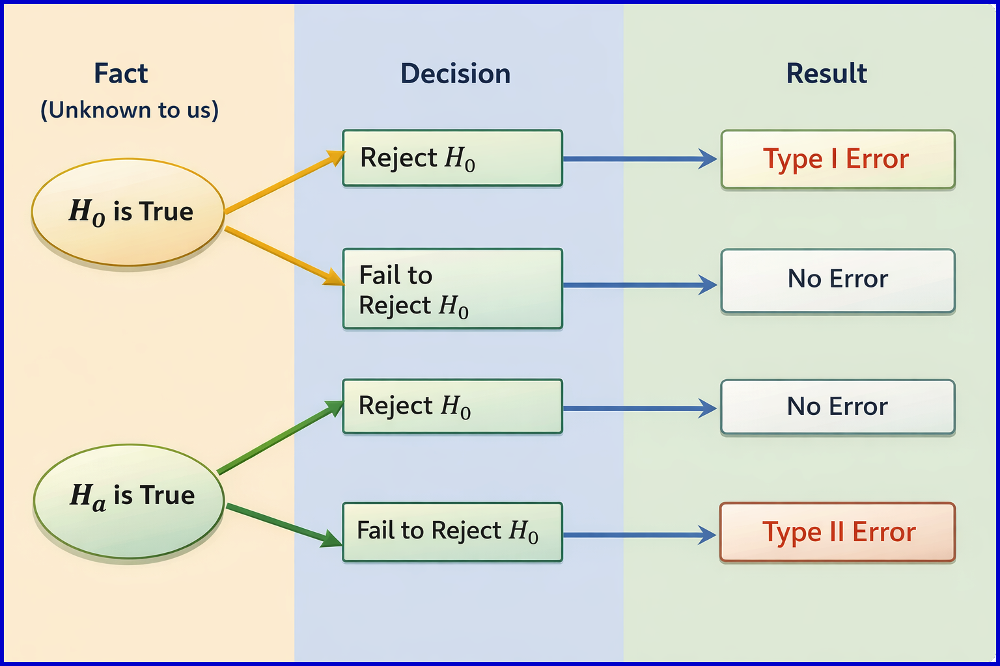
```

:::{#exm-youtube-error} 
## Daily YouTube Use Among Teens (continued)

Recall @exm-youtube-ppss where a school district was interested to test the claim that more than 70% of students in its district use YouTube daily. 

a. State the null and alternative hypotheses in words.
b. Write the null and alternative hypotheses using mathematical notation.
c. Describe what happens if a Type I error occurs in the context of the problem.
d. Describe what happens if a Type II error occurs in the context of the problem.
:::

::: {.callout-tip .solution-callout collapse="true" icon=false}
## 🔎 Solution

a. The null hypothesis states that 70% or fewer students in the district use YouTube daily. The alternative hypothesis states that more than 70% of students in the district use YouTube daily.

b.
$$
\begin{cases}
H_0: \pi \leq 0.70 \\
H_a: \pi > 0.70
\end{cases}
$$

c. A Type I error occurs if we reject $H_0$ and conclude that more than 70% of students in the district use YouTube daily when, in fact, the true proportion is 70% or less ($H_0$ is true).

d. A Type II error occurs if we fail to reject $H_0$ and therefore do not conclude that more than 70% of students in the district use YouTube daily when, in fact, the true proportion is greater than 70% ($H_a$ is true).
:::

:::{#exm-physical-inactivity-error} 
## Physical Inactivity Among Adults (continued)

Recall @exm-physical-inactivity-ppss where a national health agency wanted to examine the claim that fewer than 35% of adults in its country are physically inactive.  

a. State the null and alternative hypotheses in words.
b. Write the null and alternative hypotheses using mathematical notation.
c. Describe what happens if a Type I error occurs in the context of the problem.
d. Describe what happens if a Type II error occurs in the context of the problem.
:::

::: {.callout-tip .solution-callout collapse="true" icon=false}
## 🔎 Solution

a. The null hypothesis states that 35% or more adults in the country are physically inactive. The alternative hypothesis states that fewer than 35% of adults in the country are physically inactive.

b.
$$
\begin{cases}
H_0: \pi \geq 0.35 \\
H_a: \pi < 0.35
\end{cases}
$$

c. A Type I error occurs if we reject $H_0$ and conclude that fewer than 35% of adults in the country are physically inactive when, in fact, the true proportion is 35% or greater ($H_0$ is true).

d. A Type II error occurs if we fail to reject $H_0$ and therefore do not conclude that fewer than 35% of adults in the country are physically inactive when, in fact, the true proportion is less than 35% ($H_a$ is true).
:::

:::{#exm-social-media-news-error} 
## Social Media as a Primary News Source (continued)

Recall @exm-social-media-news-ppss where a university administration wanted to determine whether the true proportion of students who get most of their news from social media differs from 36% at their university.

a. State the null and alternative hypotheses in words.
b. Write the null and alternative hypotheses using mathematical notation.
c. Describe what happens if a Type I error occurs in the context of the problem.
d. Describe what happens if a Type II error occurs in the context of the problem.
:::

::: {.callout-tip .solution-callout collapse="true" icon=false}
## 🔎 Solution

a. The null hypothesis states that 36% of students at the university get most of their news from social media. The alternative hypothesis states that the proportion of students at the university who get most of their news from social media is different from 36%.

b.
$$
\begin{cases}
H_0: \pi = 0.36 \\
H_a: \pi \ne 0.36
\end{cases}
$$

c. A Type I error occurs if we reject $H_0$ and conclude that the proportion of students at the university who get most of their news from social media is different from 36% when, in fact, the true proportion is 36% ($H_0$ is true).

d. A Type II error occurs if we fail to reject $H_0$ and therefore do not conclude that the proportion of students at the university who get most of their news from social media is different from 36% when, in fact, the true proportion is not 36% ($H_a$ is true).
:::

Notice that we use the phrase "fail to reject $H_0$" rather than "accept $H_0$." 
This distinction is important. When $x_{obs}$ does not fall in the rejection 
region, we are not concluding that $H_0$ is true, we are simply saying that our 
sample did not provide sufficient evidence to reject it. Think of it like a jury 
verdict: a verdict of "not guilty" does not mean the defendant is innocent, it 
means the evidence presented was not strong enough to conclude guilt. In the same 
way, failing to reject $H_0$ does not mean $H_0$ is correct, it means the sample 
data were not strong enough to rule it out.

This is largely because the hypothesis testing procedure we have set up is not 
designed to control or measure the probability of a Type II error. Recall that we 
only control the probability of a Type I error through our choice of significance 
level $\alpha$. This means that if we were to claim that $H_0$ is true based on 
our sample, we would be risking a Type II error; that is, failing to detect an 
effect that actually exists, without knowing how large that risk is. For this 
reason, the cautious and honest conclusion is to say that we fail to reject $H_0$, 
not that we accept it.

### Homework for Section @sec-concept-setup {#sec-stage-hw}

For each of the following scenarios, describe or compute the items listed below
as they relate to the research question:

a. The population of interest
b. The parameter of interest $\pi$
c. The sample
d. The statistic $X$ and its observed value $x_{\text{obs}}$
e. The observed sample proportion $\hat{p}_{\text{obs}}$ that is an estimate of $\pi$
f. State the null and alternative hypotheses in words.
g. Write the null and alternative hypotheses using mathematical notation.
h. Describe what happens if a Type I error occurs in the context of the problem.
i. Describe what happens if a Type II error occurs in the context of the problem.

---

1. **Arizona Marijuana Legalization** A poll conducted by The Arizona Republic/Morrison/Cronkite News, published on October 20, 2016, surveyed 779 registered voters in Arizona between October 10 and October 15, 2016. Of those surveyed, 390 reported favoring Proposition 205, which would legalize marijuana for adults (Sanchez, 2016). At the same time,
55% of Colorado residents supported the legalization of marijuana. Do Arizona
registered voters differ from Colorado residents in their support for marijuana
legalization?

2. **Australian Unemployment Outlook**
In July 1997, 47% of Australians surveyed believed that unemployment would
increase. In November 1997, the same question was asked again in a poll of
631 Australians, and 284 of them said they believed unemployment would increase
(Morgan Gallup Poll, 2013). Did Australian sentiment about unemployment shift
between July and November of 1997?

3. **Arkansas Identity Theft Complaints**
According to the February 2008 Federal Trade Commission report on consumer
fraud and identity theft, 23% of all complaints in 2007 were for identity theft.
In that same year, Arkansas recorded 1,601 identity theft complaints out of a
total of 3,482 consumer complaints (Consumer Fraud and, 2008). Was the proportion
of identity theft complaints in Arkansas larger than the national figure
of 23%?

4. **Alaska Identity Theft Complaints**
According to the February 2008 Federal Trade Commission report on consumer
fraud and identity theft, 23% of all complaints in 2007 were for identity
theft. In that same year, Alaska recorded 321 identity theft complaints out
of a total of 1,432 consumer complaints (Consumer Fraud and, 2008). Was Alaska's
proportion of identity theft complaints significantly less than the national proportion
of 23%?

5. **Kennedy Assassination Conspiracy Belief**
In 2001, a Gallup poll found that 81% of American adults believed there was
a conspiracy behind the death of President Kennedy. In 2013, the same
question was posed to a Gallup poll of 1,039 American adults, and 634 of
them believed there was a conspiracy behind the assassination (Gallup News
Service, 2013). Is there evidence that American belief in a conspiracy behind
President Kennedy's assassination changed between 2001 and 2013?

6. **Autism Spectrum Disorder in Arizona**
In 2008, 507 out of 32,601 children in Arizona were diagnosed with Autism
Spectrum Disorder (ASD) (Autism and Developmental, 2008). Nationally, 1 in
88 children are diagnosed with ASD (CDC Features, 2013). Is the rate of
ASD diagnosis among children in Arizona larger than the national rate?

7. **Graduate Degree Attainment: GSS2024**
According to the U.S. Census Bureau's 2024 educational attainment data,
approximately 15% of U.S. adults aged 25 and older have earned a graduate
degree, defined as a master's degree, professional degree, or doctoral degree
(U.S. Census Bureau, 2025). The [GSS2024]{.data} dataset contains responses
from $n = 388$ U.S. adults. The variable [Degree]{.var} records the highest
degree earned by each respondent, and 33 of the 388 respondents reported a
graduate degree as their highest level of education. Does the GSS2024 data
provide evidence that the proportion of U.S. adults who hold a graduate degree
differs from the 15% reported by the U.S. Census Bureau?

<div tabindex="0" style="width:85%; margin:auto;">

 The dataset for
this exercise is available in the Rguroo dataset repository [Kozak]{.repo},
with the dataset name [GSS2024]{.data}.

**Code book for Dataset GSS2024 is given [here](#code-book-gss2024).**

</div>

## Making Decisions in Hypothesis Testing {#sec-making-decision}
We now explore how Type I and Type II errors inform the decisions we make when testing a claim.
When making decisions in hypothesis testing, we want a procedure that keeps the 
chance of making incorrect decisions as small as possible. A natural question is: how do we quantify this chance? In hypothesis testing, we do so by considering the probability of making a Type I error and the probability of making a Type II error.

A challenge in hypothesis testing is that these two types of errors are connected. For a given testing situation, decreasing the probability of one type of error typically increases the probability of the other. Think of it like a security screening system: if you make the rules very strict so that no innocent person is ever flagged (reducing Type I errors), you risk letting more actual threats through undetected (increasing Type II errors). Similarly in hypothesis testing, if we make it very difficult to reject $H_0$, we reduce the chance of a Type I error but increase the chance of a Type II error.

Because of this trade-off, statisticians adopt a clear strategy: they fix and control the probability of a Type I error at a low value. The reasoning is that rejecting a true 
null hypothesis leads us to claim that an effect or difference exists when it does not. In many settings, such a false claim can have serious consequences. For example, concluding that a new drug is effective when it is not could lead to patients receiving a treatment that provides no benefit or even causes harm. For this reason, we need to evaluate the probability of a Type I error,
$$
P(\text{Type I error}) = P(\text{reject } H_0 \mid H_0 \text{ is true}).
$$

However, as you have seen the above examples, $H_0$ can include a range of values for the parameter, so it is not immediately clear at which value this probability should be computed. To begin, in the next section we will learn how to compute the probability of a Type I error at a single fixed value of the parameter, and from there we will discover which value makes the most sense to use in practice.


### The Critical Region and Type I Error Control {#sec-typeI-rejection}

**What We Need to Compute a Type I Error Probability**

To make a decision in a hypothesis test, we need a clear rule: for which values 
of $X$ should we reject $H_0$? And how do we evaluate whether a given rule is 
a good one? The answer lies in the probability of a Type I error:
$$P(\text{Type I error}) = P(\text{Reject } H_0 \mid H_0 \text{ is true}).$$

::: {.callout-note appearance="minimal"}
**The Big Idea:** To choose a critical region, we compute the probability of 
a Type I error at the boundary value of $\pi$ in $H_0$, and we select the 
largest critical region that keeps this probability at or below $\alpha$. 
Do not worry if these terms are unfamiliar, by the end of this section, 
you will understand exactly what each part of this statement means and why it 
makes sense.
:::

Computing this probability requires two things:

(i) **A decision rule:** a specific rule, written in terms of $X$, that tells 
us when to reject $H_0$.

(ii) **A value of $\pi$:** since $H_0$ is true, $\pi$ must be one of the values 
allowed by $H_0$.

To elaborate on (ii), consider our three examples. In the YouTube example 
(@exm-youtube-ppss), $H_0: \pi \leq 0.70$, so a Type I error can only occur 
if the true value of $\pi$ is at most $0.70$; it could be $0.70$, $0.65$, or 
any value in that range. In the Physical Inactivity example 
(@exm-physical-inactivity-error), $H_0: \pi \geq 0.35$, so a Type I error can 
only occur if the true value of $\pi$ is $0.35$ or larger. In the Social Media 
News example (@exm-social-media-news-error), $H_0$ pins down a single value, 
$\pi = 0.36$, so a Type I error can only occur if the true value of $\pi$ is 
exactly $0.36$. In each case, the probability of a Type I error is computed at 
a value of $\pi$ within the range allowed by $H_0$.

**How the Alternative Hypothesis Determines the Critical Region**

Regarding (i), the decision rule should be consistent with the alternative 
hypothesis. In other words, we reject $H_0$ when the observed value of $X$ is 
in the direction that $H_a$ predicts. Here $\pi_0$ denotes the specific value 
of $\pi$ stated in the hypotheses.

- If $H_a: \pi > \pi_0$ (e.g., $H_a: \pi > 0.70$), then large values of $X$ 
support $H_a$, so we reject $H_0$ when $X$ is large.
- If $H_a: \pi < \pi_0$ (e.g., $H_a: \pi < 0.35$), then small values of $X$ 
support $H_a$, so we reject $H_0$ when $X$ is small.
- If $H_a: \pi \neq \pi_0$ (e.g., $H_a: \pi \neq 0.36$), then both unusually 
large and unusually small values of $X$ support $H_a$, so we reject $H_0$ in 
either extreme.

::: {.callout-note appearance="minimal"}
In each case, the decision rule takes the form:
$$\text{Reject } H_0 \text{ if } 
\begin{cases}
X \geq c & \text{if } H_a: \pi > \pi_0 \\
X \leq c & \text{if } H_a: \pi < \pi_0 \\
X \leq c_1 \text{ or } X \geq c_2 & \text{if } H_a: \pi \ne \pi_0
\end{cases}$$
where $c$, $c_1$, and $c_2$ are cutoff values called **critical values**, and 
the set of values of $X$ that leads to rejecting $H_0$ is called the 
**critical region**.
:::

As we will see, the critical values are chosen to control the probability of a 
Type I error. For a given critical region and a given value of $\pi$ in $H_0$, 
we use the binomial distribution $X \sim \text{Binomial}(n, \pi)$ to compute 
this probability.

**Type I Error at Different Values of $\pi$**

The following examples illustrate how to compute the probability of a Type I 
error for various critical regions and values of $\pi$ in $H_0$.

:::{#exm-youtube-type1}
## Daily YouTube Use Among Teens (continued)

Recall @exm-youtube-ppss where a school district claimed that more than 70% of 
students in its district use YouTube daily, and a random sample of $n = 20$ 
students was selected. The null and alternative hypotheses are:
$$
\begin{cases}
H_0: \pi \leq 0.70 \\
H_a: \pi > 0.70
\end{cases}
$$

Consider the critical region: Reject $H_0$ if $X \geq 17$.

For this critical region, compute $P(\text{Type I error})$ when 

a. $\pi = 0.60$
b. $\pi = 0.65$
c. $\pi = 0.70$.

In each case, interpret the probability in the context of the problem.
:::

:::: {.callout-tip .solution-callout collapse="true" icon=false}
## 🔎 Solution
a\. Since the sample size is $n = 20$ and $\pi = 0.60$, we have 
$X \sim \text{Binomial}(20, 0.60)$. Using Rguroo's probability calculator, 
we compute
$$P(\text{Type I error}) = P(\text{Reject } H_0 \mid H_0 \text{ is true})$$
$$= P(X \geq 17 \mid \pi = 0.60).$$

Click to expand the box below to see how to calculate the probability of Type I error.

:::{#calculating-typeI-error .callout-note appearance="simple" 
collapse="true" icon="none" 
title="{width=22px 
style='vertical-align:middle;'} Calculating Type I Error Probability"}

1. Open the **Probability-Simulation** toolbox in Rguroo.  
2. From the [Probability]{.dpd} dropdown, select 
[Probability Calculator --> Discrete]{.fun}.
3. (Optional) In the `Calculation` textbox, type a name for the calculation 
(e.g., `Type I error`).  
4. In the [Distribution]{.dpd} dropdown, select [Binomial]{.fun}.
5. In the [No. of Trials]{.des} textbox, enter [20]{.typein}.
6. In the [Prob. of Success]{.des} textbox, enter [0.60]{.typein}.
7. In the next dropdown menu, select [Above]{.dpd}, and in the textbox next 
to it, enter [17]{.typein}.
8. (Optional) Select the [Graph]{.des} checkbox to see a graph showing 
calculation details.
9. Click the preview icon  
to see the result.
10. (Optional) In the  textbox, enter 
the name [TypeI_Error]{.typein} to save this calculation to your Rguroo 
account.

::: {.callout-tip .inner-callout appearance="simple" collapse="true" 
icon="none" title="Click here to see the Rguroo dialog"}
{width=500px}
:::

::::

@fig-youtube-type1a shows the Rguroo Probability Calculator output for 
$X \sim \text{Binomial}(20, 0.60)$, giving 

::: {.callout-note appearance="minimal"}
$$P(\text{Type I error}) = P(X \geq 17\mid \pi=0.60) \approx 0.016.$$
:::

That is, if the true proportion of students in the district who use YouTube 
daily is $\pi = 0.60$, and our decision rule is to reject $H_0$ whenever 
$X \geq 17$ in a sample of $n = 20$ students, then there is only a $1.6\%$ 
chance of committing a Type I error; that is, incorrectly concluding that 
more than 70% of students in the district use YouTube daily.
```{r,echo=FALSE}
#| fig-cap: "Binomial distribution for $X \\sim \\text{Binomial}(n = 20, p = 0.60)$ showing the Type I error probability as the upper-tail area $P(X \\geq 17) = 0.016$."
#| warning: FALSE
#| label: fig-youtube-type1a
#| out-width: "80%"
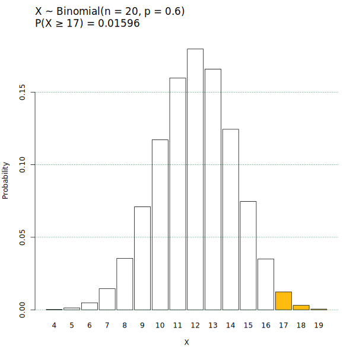
```

b\. To compute the probability of Type I error for the critical region 
$X \geq 17$ when $\pi = 0.65$, we follow the same steps as in 
the [Youtube Example](#calculating-typeI-error), but enter [0.65]{.typein} in the 
[Prob. of Success]{.des} box. The Rguroo output gives 

::: {.callout-note appearance="minimal"}
$$P(\text{Type I error}) = P(X \geq 17\mid\pi=0.65) \approx 0.044.$$
:::

That is, if the true proportion of students in the district who use YouTube 
daily is $\pi = 0.65$, and our decision rule is to reject $H_0$ whenever 
$X \geq 17$ in a sample of $n = 20$ students, then there is approximately a 
$4.4\%$ chance of committing a Type I error; that is, incorrectly concluding 
that more than 70% of students in the district use YouTube daily.

c\. Entering [0.70]{.typein} in the [Prob. of Success]{.des} box gives

::: {.callout-note appearance="minimal"}
$$P(\text{Type I error}) = P(X \geq 17\mid\pi=0.70) \approx 0.107.$$
:::

That is, if the true proportion of students in the district who use YouTube 
daily is $\pi = 0.70$, and our decision rule is to reject $H_0$ whenever 
$X \geq 17$ in a sample of $n = 20$ students, then there is approximately a 
$10.7\%$ chance of committing a Type I error; that is, incorrectly concluding 
that more than 70% of students in the district use YouTube daily.
:::

:::{#exm-physical-inactivity-type1}
## Physical Inactivity Among Adults (continued)

Recall @exm-physical-inactivity-ppss where a national health agency claimed 
that fewer than 35% of adults in its country are physically inactive, and a 
random sample of $n = 50$ adults was selected. The null and alternative 
hypotheses are:
$$
\begin{cases}
H_0: \pi \geq 0.35 \\
H_a: \pi < 0.35
\end{cases}
$$

Consider the critical region: Reject $H_0$ if $X \leq 13$.

For this critical region, compute $P(\text{Type I error})$ when 

a. $\pi = 0.35$ 
b. $\pi = 0.40$
c. $\pi = 0.50$.

In each case, interpret the probability in the context of the problem.
:::

:::: {.callout-tip .solution-callout collapse="true" icon=false}
## 🔎 Solution

a\. Since the sample size is $n = 50$ and $\pi = 0.35$, we have 
$X \sim \text{Binomial}(50, 0.35)$. Using Rguroo's probability calculator, 
we compute
$$P(\text{Type I error}) = P(\text{Reject } H_0 \mid H_0 \text{ is true})$$
$$= P(X \leq 13 \mid \pi = 0.35).$$

Click to expand the box below to see how to calculate the probability of 
Type I error.

:::{#calculating-typeI-errorb .callout-note appearance="simple" 
collapse="true" icon="none" 
title="{width=22px 
style='vertical-align:middle;'} Calculating Type I Error Probability"}

1. Open the **Probability-Simulation** toolbox in Rguroo.  
2. From the [Probability]{.dpd} dropdown, select 
[Probability Calculator --> Discrete]{.fun}.
3. (Optional) In the `Calculation` textbox, type a name for the calculation 
(e.g., `Type I error`).  
4. In the [Distribution]{.dpd} dropdown, select [Binomial]{.fun}.
5. In the [No. of Trials]{.des} textbox, enter [50]{.typein}.
6. In the [Prob. of Success]{.des} textbox, enter [0.35]{.typein}.
7. In the next dropdown menu, select [Below]{.dpd}, and in the textbox next 
to it, enter [13]{.typein}.
8. (Optional) Select the [Graph]{.des} checkbox to see a graph showing 
calculation details.
9. Click the preview icon  
to see the result.
10. (Optional) In the  textbox, enter 
the name [Type I Error Inactivity]{.typein} to save this calculation to your 
Rguroo account.

::: {.callout-tip .inner-callout appearance="simple" collapse="true" 
icon="none" title="Click here to see the Rguroo dialog"}
{width=500px}
:::
:::

@fig-youtube-type1b shows the Rguroo Probability Calculator output for 
$X \sim \text{Binomial}(50, 0.35)$, giving 

::: {.callout-note appearance="minimal"}
$$P(\text{Type I error}) = P(X \leq 13\mid \pi=0.35) \approx 0.1163.$$
:::

That is, if the true proportion of inactive adults in the population is 
$\pi = 0.35$, and our decision rule is to reject $H_0$ whenever $X \leq 13$ 
in a sample of $n = 50$ adults, then there is approximately an $11.63\%$ chance 
of committing a Type I error; that is, incorrectly concluding that fewer than 
35% of adults in the population are physically inactive.
```{r,echo=FALSE}
#| fig-cap: "Binomial distribution for $X \\sim \\text{Binomial}(n = 50, p = 0.35)$ showing the Type I error probability as the lower-tail area $P(X \\leq 13) = 0.1163$."
#| warning: FALSE
#| label: fig-youtube-type1b
#| out-width: "80%"
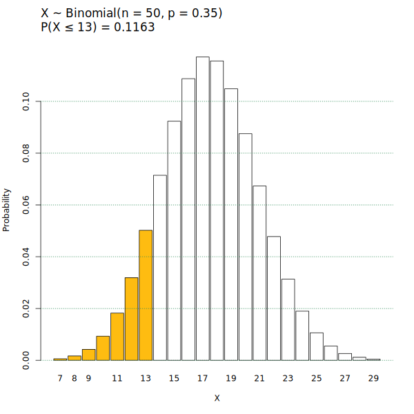
```

b\. Entering [0.40]{.typein} in the [Prob. of Success]{.des} box gives

::: {.callout-note appearance="minimal"}
$$P(\text{Type I error}) = P(X \leq 13\mid\pi=0.40) \approx 0.028.$$
:::

That is, if the true proportion of inactive adults in the population is 
$\pi = 0.40$, and our decision rule is to reject $H_0$ whenever $X \leq 13$ 
in a sample of $n = 50$ adults, then there is approximately a $2.8\%$ chance 
of committing a Type I error; that is, incorrectly concluding that fewer than 
35% of adults in the population are physically inactive.

c\. Entering [0.50]{.typein} in the [Prob. of Success]{.des} box gives

::: {.callout-note appearance="minimal"}
$$P(\text{Type I error}) = P(X \leq 13\mid\pi=0.50) \approx 0.00046.$$
:::

That is, if the true proportion of inactive adults in the population is 
$\pi = 0.50$, and our decision rule is to reject $H_0$ whenever $X \leq 13$ 
in a sample of $n = 50$ adults, then there is approximately a $0.046\%$ chance 
of committing a Type I error; that is, incorrectly concluding that fewer than 
35% of adults in the population are physically inactive.

::::

:::{#exm-social-media-news-type1}
## Social Media as a Primary News Source (continued)

Recall @exm-social-media-news-ppss where a university administration wanted 
to determine whether the proportion of students who get most of their news from 
social media differs from 36%, and a random sample of $n = 15$ students was 
selected. The null and alternative hypotheses are:
$$
\begin{cases}
H_0: \pi = 0.36 \\
H_a: \pi \ne 0.36
\end{cases}
$$

Note that the two-sided case is slightly more complicated than the one-sided 
cases above: since the alternative hypothesis claims that $\pi$ differs from 
$0.36$ in either direction, evidence against $H_0$ can come from either tail 
of the distribution.

Consider the critical region: Reject $H_0$ if $X \leq 3$ or $X \geq 8$.

For this critical region, compute $P(\text{Type I error})$ when $\pi = 0.36$.
:::

:::: {.callout-tip .solution-callout collapse="true" icon=false}
## 🔎 Solution

Since $H_0$ specifies only a single value $\pi = 0.36$, we have 
$X \sim \text{Binomial}(15, 0.36)$. The probability of Type I error is
$$P(\text{Type I error}) = P(\text{Reject } H_0 \mid H_0 \text{ is true})$$
$$= P(X \leq 3 \text{ or } X \geq 8 \mid \pi = 0.36).$$

Click to expand the box below to see how to calculate the probability of 
Type I error.

:::{#calculating-typeI-errorc .callout-note appearance="simple" 
collapse="true" icon="none" 
title="{width=22px 
style='vertical-align:middle;'} Calculating Type I Error Probability"}

1. Open the **Probability-Simulation** toolbox in Rguroo.  
2. From the [Probability]{.dpd} dropdown, select 
[Probability Calculator --> Discrete]{.fun}.
3. (Optional) In the `Calculation` textbox, type a name for the calculation 
(e.g., `Type I error`).  
4. In the [Distribution]{.dpd} dropdown, select [Binomial]{.fun}.
5. In the [No. of Trials]{.des} textbox, enter [15]{.typein}.
6. In the [Prob. of Success]{.des} textbox, enter [0.36]{.typein}.
7. In the next dropdown menu, select [Outside]{.dpd}, and in the textboxes 
next to it, enter [3]{.typein} and [8]{.typein}.
8. (Optional) Select the [Graph]{.des} checkbox to see a graph showing 
calculation details.
9. Click the preview icon  
to see the result.
10. (Optional) In the  textbox, enter 
the name [Type I Error Social]{.typein} to save this calculation to your 
Rguroo account.

::: {.callout-tip .inner-callout appearance="simple" collapse="true" 
icon="none" title="Click here to see the Rguroo dialog"}
{width=500px}
:::
:::

@fig-youtube-type1c shows the Rguroo Probability Calculator output for 
$X \sim \text{Binomial}(15, 0.36)$, giving 

::: {.callout-note appearance="minimal"}
$$P(\text{Type I error}) = P(X \leq 3 \text{ or } X \geq 8 \mid \pi = 0.36) 
\approx 0.2833.$$
:::

That is, if the true proportion of students who use social media as their 
primary news source is $\pi = 0.36$, and our decision rule is to reject $H_0$ 
whenever $X \leq 3$ or $X \geq 8$ in a sample of $n = 15$ students, then there 
is approximately a $28.33\%$ chance of committing a Type I error; that is, 
incorrectly concluding that the true proportion of students who use social media 
as their primary news source differs from 0.36.
```{r,echo=FALSE}
#| fig-cap: "Binomial distribution for $X \\sim \\text{Binomial}(n = 15, p = 0.36)$ showing the Type I error probability as the two-tail areas $P(X \\leq 3 \\text{ or } X \\geq 8) = 0.2833$."
#| warning: FALSE
#| label: fig-youtube-type1c
#| out-width: "80%"
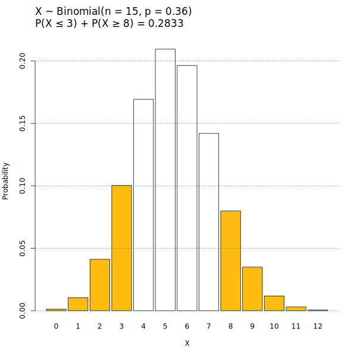
```
::::

**Why the Boundary Value Matters**

Now that we have computed the probability of a Type I error at various values 
of $\pi$, let us look back at what we observed in our examples.

We begin with the two-sided case. In the Social Media News example, $H_0$ 
specifies only a single value, $\pi = 0.36$, so there is only one possible 
value at which the probability of a Type I error can be computed. There is 
nothing further to compare in this case.

For the one-sided cases, however, there are many values of $\pi$ allowed by 
$H_0$, and we computed the probability of a Type I error at several of them. 
You may have noticed a pattern: in both the YouTube example and the Physical 
Inactivity example, the probability of a Type I error was largest at the value 
of $\pi$ where $H_0$ and $H_a$ meet. For the YouTube example, this is 
$\pi = 0.70$, and for the Physical Inactivity example, this is $\pi = 0.35$. 
We call this the **boundary value** of $\pi$; it is the value that sits at 
the border between what $H_0$ claims and what $H_a$ claims. Is it a coincidence 
that the probability of a Type I error is largest at the boundary value?

It turns out that this is not a coincidence at all.

::: {.callout-note}
## Key Result: Maximum Type I Error Occurs at the Boundary Value
For any fixed decision rule, the probability of a Type I error is largest when 
$\pi$ equals the boundary value of $H_0$. This holds regardless of the sample 
size or the specific critical region used.
:::

@fig-type-range confirms this result for our two one-sided examples, showing 
the probability of a Type I error across a range of values of $\pi$ in $H_0$, 
for three different decision rules in each case.

In panel (a), for the YouTube example, the null hypothesis is 
$H_0: \pi \leq 0.70$, so the boundary value is $\pi = 0.70$. The three curves 
correspond to the decision rules $X \geq 16$, $X \geq 17$, and $X \geq 18$. 
For all three rules, the probability of a Type I error increases as $\pi$ gets 
closer to the boundary value of $0.70$, and reaches its maximum at $\pi = 0.70$. 
In panel (b), for the Physical Inactivity example, the null hypothesis is 
$H_0: \pi \geq 0.35$, so the boundary value is $\pi = 0.35$. The three curves 
correspond to the decision rules $X \leq 11$, $X \leq 12$, and $X \leq 13$. 
Again, for all three rules, the probability of a Type I error is largest at the 
boundary value $\pi = 0.35$ and decreases as $\pi$ moves away from it. 

Notice also that the horizontal dashed red line in each panel is drawn at 
$0.05$. This will become important shortly, as it represents a commonly chosen 
upper bound for the probability of a Type I error.
```{r,echo=FALSE}
#| fig-cap: 'Type I error probabilities for binomial tests as a function of $\pi$. Panel (a) shows $X \sim \text{Binomial}(20, \pi)$ with $P(X \geq 16, 17, 18)$; panel (b) shows $X \sim \text{Binomial}(50, \pi)$ with $P(X \leq 11, 12, 13)$. The red dashed line marks $\alpha = 0.05$. The gray dotted line shows the boundary of $H_0$.'
#| fig-alt: 'Two side-by-side line graphs showing how Type I error changes with the true proportion π. In panel (a), for a binomial model with n = 20, three curves show P(X ≥ 16), P(X ≥ 17), and P(X ≥ 18) increasing as π increases from 0 to 0.70, with values up to about 0.25. In panel (b), for n = 50, three curves show P(X ≤ 11), P(X ≤ 12), and P(X ≤ 13) decreasing as π increases from 0.35 to 1, with values up to about 0.12. A horizontal red dashed line at 0.05 marks the significance level in both plots.'
#| warning: FALSE
#| label: fig-type-range
#| out-width: "90%"
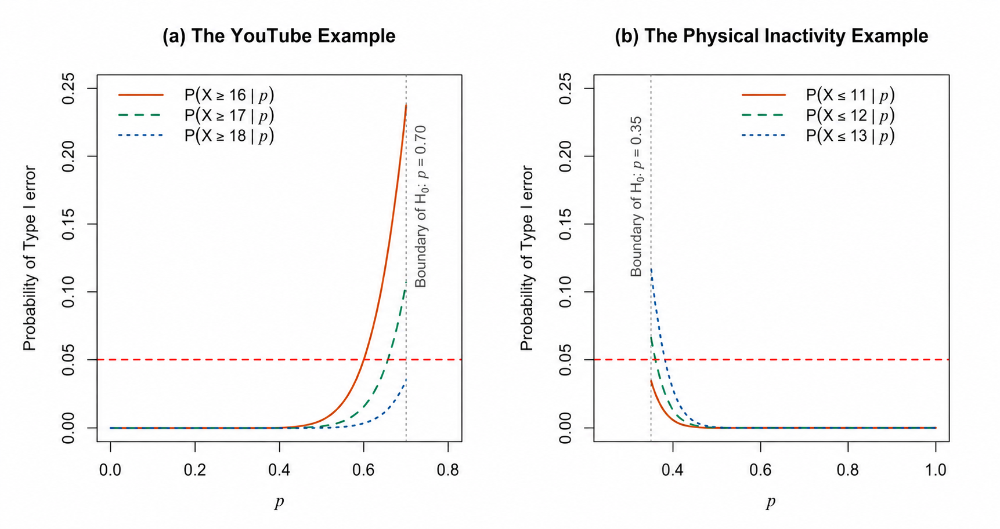
```

### Choosing a Critical Region for a Given $\alpha$ {#sec-choosing-rr}

As noted earlier in @sec-making-decision, statisticians control the probability of a Type I error when making decisions in hypothesis testing. This probability, however, varies depending on which value of $\pi$ in the null hypothesis we consider. A key finding from our examples is that the maximum probability of a Type I error always occurs at the boundary value of $\pi$. This is an important result: it means that if we control the probability of a Type I error at the boundary value, we are automatically controlling it for all other values of $\pi$ in the null hypothesis. This is the conservative and safe approach that statisticians adopt.

The maximum probability of a Type I error, that is, the probability of a Type I error evaluated at the boundary value of $\pi$, is called the **significance level** of the test, and is denoted by $\alpha$ (the Greek letter alpha). It represents the highest tolerable chance of making a Type I error. The most commonly used value is $\alpha = 0.05$, meaning we are willing to tolerate at most a 5% chance of incorrectly rejecting a true null hypothesis. Values of $\alpha = 0.10$ and $\alpha = 0.01$ are also used. The smaller the significance level, the more conservative we are; that is, the less willing we are to risk a Type I error.

A second key observation from @fig-type-range is that the probability of a 
Type I error depends on the decision rule we choose. This is important for our decision making: it means we have control over the probability of a Type I error by carefully selecting our decision rule. Specifically, our goal is to choose a decision rule whose probability of a Type I error at the boundary value does not exceed our chosen significance level $\alpha$. In other words, looking at @fig-type-range, we want the curve for our chosen decision rule to stay at or below the horizontal red dashed line at the boundary value.

For the YouTube example, panel (a) of @fig-type-range shows that the decision rule $X \geq 18$ has a probability of Type I error at the boundary value $\pi = 0.70$ that is less than $0.05$, while the decision rule $X \geq 17$ exceeds $0.05$ at the boundary. Therefore, at significance level $\alpha = 0.05$, we choose the critical region $X \geq 18$. This means that if we observe 18 or more students in our sample of $n = 20$ who report daily YouTube use, we reject $H_0$ in favor of $H_a: \pi > 0.70$.

You might reasonably ask: why not also reject $H_0$ when $X = 17$ or $X = 16$, since these correspond to sample proportions of $\hat{p} = 0.85$ and 
$\hat{p} = 0.80$, both of which are also larger than $0.70$? The answer lies in our significance level criterion. Even though these sample proportions are greater than $0.70$, the decision rules $X \geq 16$ and $X \geq 17$ produce a probability of Type I error at the boundary value $\pi = 0.70$ that exceeds $\alpha = 0.05$, as seen in panel (a) of fig-type-range. They do not meet our significance level criterion, so we do not use them.

You might then ask the opposite question: why not use an even stricter decision rule, such as $X \geq 19$? The answer brings us back to the trade-off between Type I and Type II errors. Recall that when the probability of a Type I error decreases, the probability of a Type II error increases. By requiring $X \geq 19$ instead of $X \geq 18$, we make it harder to reject $H_0$, increasing our chance of a Type II error. For this reason, among all decision rules that satisfy our significance level criterion, we always choose the one that gives us the largest critical region; that is, the rule that rejects $H_0$ for the most values of $X$ while still keeping the probability of a Type I error at or below $\alpha$. 
This ensures that we minimize the probability of a Type II error while still controlling the probability of a Type I error at our chosen ignificance level.

The same reasoning applies to the Physical Inactivity example. Panel (b) of 
@fig-type-range shows that the decision rule $X \leq 11$ has a probability of Type I error at the boundary value $\pi = 0.35$ that is less than $0.05$, while the decision rules $X \leq 12$ and $X \leq 13$ exceed $0.05$ at the boundary, and $X \leq 10$ would satisfy the criterion but at the cost of a larger Type II error. Therefore, $X \leq 11$ is the optimal choice at $\alpha = 0.05$; it is the largest critical region that keeps the probability of a Type I error at or below $\alpha$ while minimizing the probability of a Type II error. This means that if we observe 11 or fewer inactive adults in our sample of $n = 50$, we reject $H_0$ in favor of $H_a: \pi < 0.35$.

The decision rule for two-sided tests follows the same logic, but since the 
critical region has the more complex form $X \leq c_1$ or $X \geq c_2$, we 
will rely on software to determine the appropriate values of $c_1$ and $c_2$ for us.

::: {.callout-note}
## Choosing the Critical Region
At significance level $\alpha$, the critical region is the largest set of 
values of $X$ consistent with $H_a$ such that the probability of a Type I 
error at the boundary value of $\pi$ in $H_0$ does not exceed $\alpha$. 
Specifically:

- If $H_a: \pi > \pi_0$, choose the largest $c$ such that 
$P(X \geq c \mid \pi = \pi_0) \leq \alpha$.
- If $H_a: \pi < \pi_0$, choose the smallest $c$ such that 
$P(X \leq c \mid \pi = \pi_0) \leq \alpha$.
- If $H_a: \pi \neq \pi_0$, choose $c_1$ and $c_2$ such that 
$P(X \leq c_1 \mid \pi = \pi_0) + P(X \geq c_2 \mid \pi = \pi_0) \leq \alpha$, 
with $\alpha/2$ allocated to each tail.
:::

**Using Inverse Probability to Find the Critical Region**

While we could determine the critical region that satisfies our significance 
level by trial and error, testing different decision rules one at a time as we 
did above, there is a more direct approach. We can use what is called an 
**inverse probability function**. Rather than providing a value of $X$ and 
asking for the corresponding probability, an inverse probability function works 
in reverse: we provide a probability and it returns the corresponding value of 
$X$.

To find the critical region, we use the binomial distribution with the boundary value of $\pi$ in $H_0$ as the probability of success and $n$ as the number of trials, and we provide the significance level $\alpha$ as the probability. The inverse probability function then returns the value of $X$ that defines our critical region. Below, we show how this is done in Rguroo using its built-in probability calculator.

::: {#exm-youtube-rejection}
## YouTube Use: Finding the Critical Region

In the YouTube Use example (@exm-youtube-ppss), we are testing 
$H_0: \pi \leq 0.70$ versus $H_a: \pi > 0.70$, where $\pi$ is the true 
proportion of students in the district who use YouTube daily. Using a sample of $n = 20$ students and a significance level of $\alpha = 0.05$, find the critical region for this test.
:::

::: {.callout-tip .solution-callout collapse="true" icon=false}
## 🔎 Solution
Since the alternative hypothesis is $H_a: \pi > 0.70$, large values of $X$ 
support $H_a$, so we are looking for a critical region in the upper tail of the binomial distribution. We use Rguroo's Discrete Distributions Probability Calculator with the following settings (see @fig-youtube-rejection-dialog):

- Open the **Probability-Simulation** toolbox.
- Select [Probability $\Rightarrow$ Values]{.des} to use the inverse probability function.
- In the [Distribution]{.dpd} dropdown, set the distribution to _Binomial_.
- Set the [No. of Trials]{.des} to $n = 20$ and the [Prob. of Success]{.des} 
to $0.70$, which is the boundary value of $\pi$ in $H_0$.
- From the dropdown, select [Upper Tail]{.dpd} and enter [$0.05$]{.typein} as the significance level $\alpha$.
- Select the checkbox [Graph]{.des} to see a detailed output.
```{r,echo=FALSE}
#| fig-alt: "Rguroo Discrete Distributions Probability Calculator configured for the YouTube example with Binomial distribution, 20 trials, probability of success 0.70, upper tail selected, and significance level 0.05 entered."
#| warning: FALSE
#| label: fig-youtube-rejection-dialog
#| fig-cap: "Rguroo Probability Calculator Settings for the YouTube Critical Region Example"
#| out-width: "80%"

```

The output, shown in @fig-youtube-rejection, gives
$$P(X \geq 17) = 0.1071 \geq 0.05 \quad \text{and} \quad P(X \geq 18) = 0.03548 \leq 0.05.$$

This means that the decision rule $X \geq 17$ exceeds our significance level, while the decision rule $X \geq 18$ satisfies it. Therefore, the critical region at significance level $\alpha = 0.05$ is 
$$X \geq 18.$$ That is, if we observe 18 or more students in our sample of $n = 20$ who report daily YouTube use, we reject $H_0$ in favor of $H_a: \pi > 0.70$.

```{r,echo=FALSE}
#| fig-alt: "Binomial distribution histogram for n = 20 and p = 0.70, with the critical region X greater than or equal to 18 highlighted in gold, showing that P(X greater than or equal to 17) = 0.1071 exceeds 0.05 and P(X greater than or equal to 18) = 0.03548 does not."
#| warning: FALSE
#| label: fig-youtube-rejection
#| fig-cap: "Rguroo Probability Calculator Output for the YouTube Critical Region Example"
#| out-width: "80%"
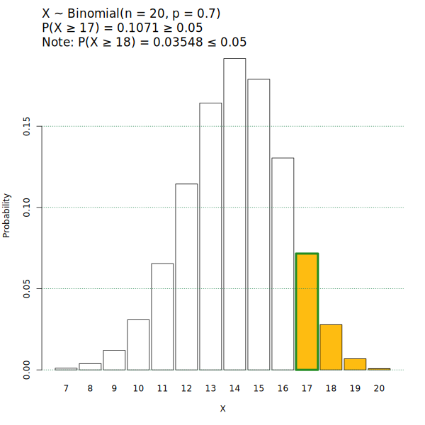
```
:::

::: {#exm-inactivity-rejection}
## Physical Inactivity: Finding the Critical Region

In the Physical Inactivity example (@exm-physical-inactivity-error), we are 
testing $H_0: \pi \geq 0.35$ versus $H_a: \pi < 0.35$, where $\pi$ is the 
true proportion of adults in the population who are physically inactive. Using a sample of $n = 50$ adults and a significance level of $\alpha = 0.05$, find the critical region for this test.
:::

::: {.callout-tip .solution-callout collapse="true" icon=false}
## 🔎 Solution
Since the alternative hypothesis is $H_a: \pi < 0.35$, small values of $X$ 
support $H_a$, so we are looking for a critical region in the lower tail of 
the binomial distribution. We use Rguroo's Discrete Distributions Probability 
Calculator with the following settings (see @fig-inactivity-rejection-dialog), 
changing only the settings that differ from @exm-youtube-rejection:

- Set the [No. of Trials]{.des} to $n = 50$ and the [Prob. of Success]{.des} 
to $0.35$, which is the boundary value of $\pi$ in $H_0$.
- From the dropdown, select [Lower Tail]{.dpd} and enter [$0.05$]{.typein} as 
the significance level $\alpha$.
```{r,echo=FALSE}
#| fig-alt: "Rguroo Discrete Distributions Probability Calculator configured for the Physical Inactivity example with Binomial distribution, 50 trials, probability of success 0.35, lower tail selected, and significance level 0.05 entered."
#| warning: FALSE
#| label: fig-inactivity-rejection-dialog
#| fig-cap: "Rguroo Probability Calculator Settings for the Physical Inactivity Critical Region Example"
#| out-width: "80%"
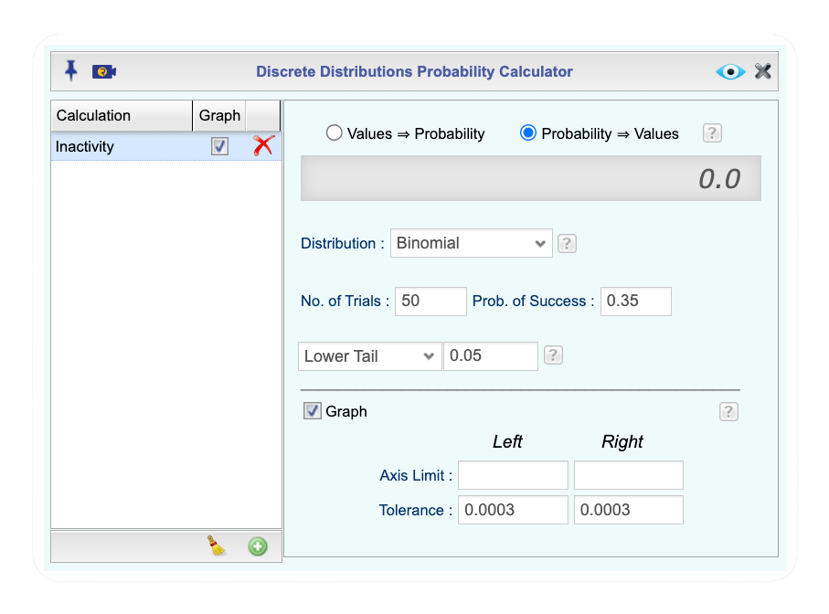
```

The output, shown in @fig-inactivity-rejection, gives
$$P(X \leq 12) = 0.06613 \geq 0.05 \quad \text{and} \quad 
P(X \leq 11) = 0.03423 \leq 0.05.$$

This means that the decision rule $X \leq 12$ exceeds our significance level, 
while the decision rule $X \leq 11$ satisfies it. Therefore, the rejection 
region at significance level $\alpha = 0.05$ is 
$$X \leq 11.$$
That is, if we observe 11 or fewer inactive adults in our sample of $n = 50$, 
we reject $H_0$ in favor of $H_a: \pi < 0.35$.
```{r,echo=FALSE}
#| fig-alt: "Binomial distribution histogram for n = 50 and p = 0.35, with the critical region X less than or equal to 11 highlighted in gold, showing that P(X less than or equal to 12) = 0.06613 exceeds 0.05 and P(X less than or equal to 11) = 0.03423 does not."
#| warning: FALSE
#| label: fig-inactivity-rejection
#| fig-cap: "Rguroo Probability Calculator Output for the Physical Inactivity Critical Region Example"
#| out-width: "80%"
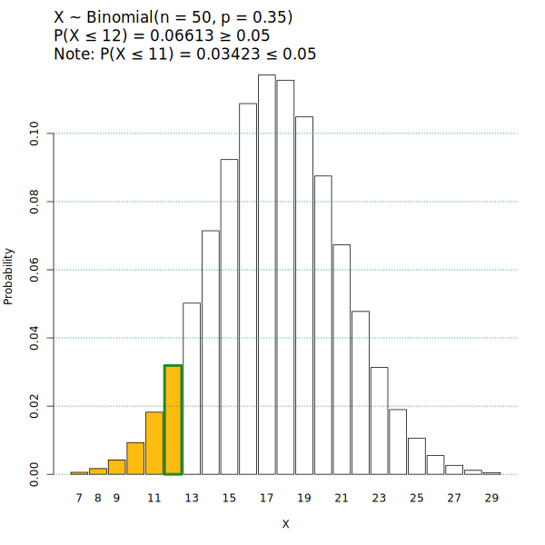
```
:::

::: {#exm-social-rejection}
## Social Media as a Primary News Source: Finding the Critical Region

In the Social Media as a Primary News Source example 
(@exm-social-media-news-error), we are testing $H_0: \pi = 0.36$ versus 
$H_a: \pi \neq 0.36$, where $\pi$ is the true proportion of students who use 
social media as their primary news source. Using a sample of $n = 15$ students and a significance level of $\alpha = 0.05$, find the critical region for this test.
:::

::: {.callout-tip .solution-callout collapse="true" icon=false}
## 🔎 Solution
Since the alternative hypothesis is $H_a: \pi \neq 0.36$, both unusually small and unusually large values of $X$ support $H_a$, so we are looking for a two-sided critical region. For a two-sided test at significance level $\alpha = 0.05$, we split the significance level equally between the two tails, allocating $0.025$ to each tail. We use Rguroo's Discrete Distributions Probability Calculator with the following settings 
(see @fig-social-rejection-dialog), changing only the settings that differ 
from @exm-youtube-rejection:

- Set the [No. of Trials]{.des} to $n = 15$ and the [Prob. of Success]{.des} 
to $0.36$, which is the value of $\pi$ specified by $H_0$.
- From the dropdown, select [Outside Tails]{.dpd} and enter [$0.025$]{.typein} 
in each tail box.
```{r,echo=FALSE}
#| fig-alt: "Rguroo Discrete Distributions Probability Calculator configured for the Social Media example with Binomial distribution, 15 trials, probability of success 0.36, Outside Tails selected, and 0.025 entered in each tail."
#| warning: FALSE
#| label: fig-social-rejection-dialog
#| fig-cap: "Rguroo Probability Calculator Settings for the Social Media Critical Region Example"
#| out-width: "80%"
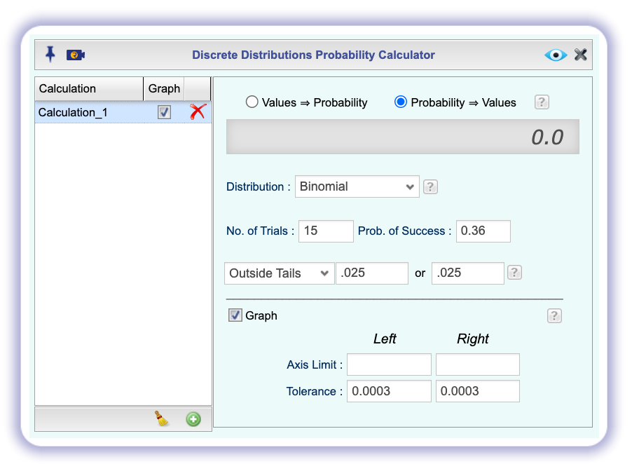
```

The output, shown in @fig-social-rejection, gives
$$P(X \leq 2) + P(X \geq 9) = 0.1032 \geq 0.05,$$
with the additional note that
$$P(X \leq 2) = 0.05281, \quad P(X \geq 9) = 0.05038,$$
$$P(X \leq 1) = 0.01168, \quad P(X \geq 10) = 0.01545.$$

This means that the decision rule $X \leq 2$ or $X \geq 9$ exceeds our 
significance level of $\alpha = 0.05$. Moving one step further in each tail, the decision rule $X \leq 1$ or $X \geq 10$ satisfies our significance level since $P(X \leq 1) + P(X \geq 10) = 0.01168 + 0.01545 = 0.02713 \leq 0.05$. Therefore, the critical region at significance level $\alpha = 0.05$ is $$X \leq 1 \quad \text{or} \quad X \geq 10.$$
That is, if we observe 1 or fewer, or 10 or more students in our sample of 
$n = 15$ who use social media as their primary news source, we reject $H_0$ 
in favor of $H_a: \pi \neq 0.36$.
```{r,echo=FALSE}
#| fig-alt: "Binomial distribution histogram for n = 15 and p = 0.36, with the critical region X less than or equal to 2 and X greater than or equal to 9 highlighted in gold, showing that P(X less than or equal to 2) plus P(X greater than or equal to 9) = 0.1032 exceeds 0.05, with additional tail probabilities noted."
#| warning: FALSE
#| label: fig-social-rejection
#| fig-cap: "Rguroo Probability Calculator Output for the Social Media Critical Region Example"
#| out-width: "80%"
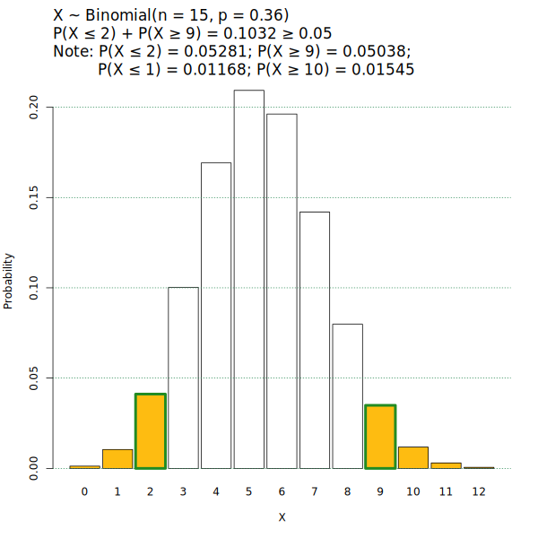
```
:::

Now that we have determined the critical regions for our three examples, we 
can use them to make decisions based on observed sample data. Recall that the 
decision rule is simple: if $x_{obs}$ falls in the critical region, we reject 
$H_0$; otherwise, we fail to reject $H_0$.

:::{#exm-youtube-decision}
## YouTube Use: Making a Decision

In the YouTube Use example (@exm-youtube-ppss), we are testing 
$H_0: \pi \leq 0.70$ versus $H_a: \pi > 0.70$, where $\pi$ is the true 
proportion of students in the district who use YouTube daily, using a sample 
of $n = 20$ students and a significance level of $\alpha = 0.05$.

a. Suppose the observed number of students who report daily YouTube use is 
$x_{obs} = 17$. Make a decision and interpret it in the context of the problem.
b. Suppose instead that $x_{obs} = 19$. Make a decision and interpret it in 
the context of the problem.
:::

::: {.callout-tip .solution-callout collapse="true" icon=false}
## 🔎 Solution
From @exm-youtube-rejection, the critical region at significance level 
$\alpha = 0.05$ is $X \geq 18$.

a. Since $x_{obs} = 17 < 18$, the observed value does not fall in the rejection 
region. Therefore, we **fail to reject $H_0$**. The data do not provide 
sufficient evidence at the 5% significance level to conclude that more than 
70% of students in the district use YouTube daily.

b. Since $x_{obs} = 19 \geq 18$, the observed value falls in the rejection 
region. Therefore, we **reject $H_0$** in favor of $H_a: \pi > 0.70$. The 
data provide sufficient evidence at the 5% significance level to conclude that 
more than 70% of students in the district use YouTube daily.
:::

:::{#exm-inactivity-decision}
## Physical Inactivity: Making a Decision

In the Physical Inactivity example (@exm-physical-inactivity-ppss), we are 
testing $H_0: \pi \geq 0.35$ versus $H_a: \pi < 0.35$, where $\pi$ is the 
true proportion of adults in the population who are physically inactive, using 
a sample of $n = 50$ adults and a significance level of $\alpha = 0.05$.

a. Suppose the observed number of inactive adults is $x_{obs} = 14$. Make a 
decision and interpret it in the context of the problem.
b. Suppose instead that $x_{obs} = 10$. Make a decision and interpret it in 
the context of the problem.
:::

::: {.callout-tip .solution-callout collapse="true" icon=false}
## 🔎 Solution
From @exm-inactivity-rejection, the critical region at significance level 
$\alpha = 0.05$ is $X \leq 11$.

a. Since $x_{obs} = 14 > 11$, the observed value does not fall in the critical region. Therefore, we **fail to reject $H_0$**. The data do not provide sufficient evidence at the 5% significance level to conclude that fewer than 35% of adults in the population are physically inactive.

b. Since $x_{obs} = 10 \leq 11$, the observed value falls in the rejection 
region. Therefore, we **reject $H_0$** in favor of $H_a: \pi < 0.35$. The 
data provide sufficient evidence at the 5% significance level to conclude that fewer than 35% of adults in the population are physically inactive.
:::

:::{#exm-social-decision}
## Social Media as a Primary News Source: Making a Decision

In the Social Media as a Primary News Source example 
(@exm-social-media-news-ppss), we are testing $H_0: \pi = 0.36$ versus 
$H_a: \pi \neq 0.36$, where $\pi$ is the true proportion of students who use social media as their primary news source, using a sample of $n = 15$ students and a significance level of $\alpha = 0.05$.

a. Suppose the observed number of students who use social media as their 
primary news source is $x_{obs} = 7$. Make a decision and interpret it in the context of the problem.
b. Suppose instead that $x_{obs} = 10$. Make a decision and interpret it in 
the context of the problem.
:::

::: {.callout-tip .solution-callout collapse="true" icon=false}
## 🔎 Solution
From @exm-social-rejection, the critical region at significance level 
$\alpha = 0.05$ is $X \leq 1$ or $X \geq 10$.

a. Since $x_{obs} = 7$ does not satisfy $X \leq 1$ or $X \geq 10$, the 
observed value does not fall in the critical region. Therefore, we **fail to reject $H_0$**. The data do not provide sufficient evidence at the 5% 
significance level to conclude that the proportion of students who use social media as their primary news source differs from 0.36.

b. Since $x_{obs} = 10 \geq 10$, the observed value falls in the rejection 
region. Therefore, we **reject $H_0$** in favor of $H_a: \pi \neq 0.36$. The data provide sufficient evidence at the 5% significance level to conclude that the proportion of students who use social media as their primary news source differs from 0.36.
:::

::: {.callout-note}
## Section Summary

- The **critical region** is the set of values of $X$ for which we reject 
$H_0$. Its form depends on the direction of $H_a$.
- The **probability of a Type I error** is computed at a value of $\pi$ 
allowed by $H_0$, using the binomial distribution.
- For one-sided tests, the **maximum** probability of a Type I error always 
occurs at the **boundary value** of $\pi$ in $H_0$.
- The **significance level** $\alpha$ is the maximum tolerable probability of 
a Type I error, evaluated at the boundary value.
- We choose the **largest critical region** whose Type I error probability at 
the boundary does not exceed $\alpha$, thereby minimizing the chance of a 
Type II error.
- Once the critical region is determined, we compare the observed value 
$x_{obs}$ to it: if $x_{obs}$ falls in the critical region we reject $H_0$; 
otherwise we fail to reject $H_0$. Failing to reject $H_0$ does not mean 
$H_0$ is true; it simply means the data did not provide sufficient evidence 
to reject it.
:::

### Homework for Section @sec-making-decision {#sec-rr-hw}

For each of the scenarios described in Problems 1--7 of @sec-stage-hw,
answer the following:

a. Write the null and alternative hypotheses using mathematical notation.
b. Use Rguroo's Probability Calculator to find the critical region at
the given significance level.
c. Does $x_{\text{obs}}$ fall in the critical region? Based on this,
state your decision and write a sentence interpreting your conclusion in
the context of the problem.

---

1. **Arizona Marijuana Legalization**
In Problem 1 (Arizona Marijuana Legalization) of @sec-stage-hw, $\pi$ is
the true proportion of Arizona registered voters who support marijuana
legalization. Do Arizona registered voters differ from Colorado residents
in their support for marijuana legalization? The sample consisted of
$n = 779$ voters, of whom $x_{\text{obs}} = 390$ favored legalization.
Use $\alpha = 0.05$.

2. **Australian Unemployment Outlook**
In Problem 2 (Australian Unemployment Outlook) of @sec-stage-hw, $\pi$ is
the true proportion of Australians in November 1997 who believed
unemployment would increase. Did Australian sentiment about unemployment
shift between July and November of 1997? The sample consisted of
$n = 631$ Australians, of whom $x_{\text{obs}} = 284$ believed
unemployment would increase. Use $\alpha = 0.05$.

3. **Arkansas Identity Theft Complaints**
In Problem 3 (Arkansas Identity Theft Complaints) of @sec-stage-hw, $\pi$
is the true proportion of consumer complaints in Arkansas that were for
identity theft. Was the proportion of identity theft complaints in Arkansas
greater than the national figure of 23%? The sample consisted of
$n = 3{,}482$ complaints, of which $x_{\text{obs}} = 1{,}601$ were for
identity theft. Use $\alpha = 0.01$.

4. **Alaska Identity Theft Complaints**
In Problem 4 (Alaska Identity Theft Complaints) of @sec-stage-hw, $\pi$
is the true proportion of consumer complaints in Alaska that were for
identity theft. Was Alaska's proportion of identity theft complaints less
than the national proportion of 23%? The sample consisted of
$n = 1{,}432$ complaints, of which $x_{\text{obs}} = 321$ were for
identity theft. Use $\alpha = 0.05$.

5. **Kennedy Assassination Conspiracy Belief**
In Problem 5 (Kennedy Assassination Conspiracy Belief) of @sec-stage-hw,
$\pi$ is the true proportion of American adults in 2013 who believed there
was a conspiracy behind President Kennedy's assassination. Is there evidence
that American belief in a conspiracy behind President Kennedy's assassination
changed between 2001 and 2013? The sample consisted of $n = 1{,}039$
adults, of whom $x_{\text{obs}} = 634$ believed in a conspiracy.
Use $\alpha = 0.05$.

6. **Autism Spectrum Disorder in Arizona**
In Problem 6 (Autism Spectrum Disorder in Arizona) of @sec-stage-hw, $\pi$
is the true proportion of children in Arizona diagnosed with ASD. Is the
rate of ASD diagnosis among children in Arizona greater than the national
rate of 1 in 88 children? The sample consisted of $n = 32{,}601$ children,
of whom $x_{\text{obs}} = 507$ were diagnosed with ASD. Use $\alpha = 0.05$.

7. **Graduate Degree Attainment: GSS2024**
In Problem 7 (Graduate Degree Attainment: GSS2024) of @sec-stage-hw, $\pi$
is the true proportion of U.S. adults who hold a graduate degree. Does the
GSS2024 data provide evidence that the proportion of U.S. adults who hold
a graduate degree differs from the 15% reported by the U.S. Census Bureau?
The sample consisted of $n = 388$ adults, of whom $x_{\text{obs}} = 33$
reported a graduate degree as their highest level of education.
Use $\alpha = 0.05$.

## The p-Value Approach to Hypothesis Testing {#sec-pvalue}

In the previous section, we determined the critical region by finding the values of $X$, the number of observations in the sample with the characteristic of interest, that keep the probability of a Type I error at or below the significance level $\alpha$, and we made our decision by checking whether $x_{obs}$ falls in the critical region. In this section, we introduce an alternative approach,  the **p-value approach**, which is widely used in practice and is the default output of most statistical software, including Rguroo.

In the p-value approach, we calculate a probability using the observed value $x_{obs}$, called the **p-value**. The p-value tells us how unusual the observed sample result is under the assumption that the null hypothesis $H_0$ is true. Smaller p-values indicate stronger evidence against $H_0$ and, therefore, stronger support for the alternative hypothesis $H_a$. We use the p-value to decide whether to reject or fail to reject the null hypothesis at a given significance level $\alpha$.

**Defining the p-Value**

Let $X$ denote the number of observations in the sample with the characteristic of interest, and let $x_{obs}$ denote its observed value. We define the **$H_a$ support** as the set of values of $X$ that are at least as supportive of $H_a$ as the observed value $x_{obs}$.

::: {.callout-note appearance="minimal"}

$H_a$ support = values of  $X$ that are at least as supportive of $H_a$ as $x_{obs}$.
:::

Then, the **p-value** is defined as

::: {.callout-note appearance="minimal"}
$$
\text{p-value} = P\left(X \text{ is a value in the } H_a \text{ support} \mid H_0 \text{ is true}\right).
$$
:::

In words, the p-value is the probability, assuming that $H_0$ is true, of 
obtaining a value of the test statistic $X$ that is at least as supportive of $H_a$ as the observed value $x_{obs}$.

In all cases, the p-value is computed at the boundary value of $\pi$ in $H_0$. Recall from @sec-typeI-rejection that the boundary value is the value of $\pi$ where $H_0$ and $H_a$ meet;  we denote it by $\pi_0$. We use the boundary value for the same reason as before: it is the value of $\pi$ in $H_0$ that gives the maximum probability of a Type I error. Therefore, throughout the three cases below, $\pi_0$ always refers to this boundary value.

What counts as "at least as supportive of $H_a$ as $x_{obs}$" depends on the form of the alternative hypothesis.

::: {.callout-note appearance="simple"}
## Case 1: $H_a: \pi > \pi_0$ (e.g., $H_a: \pi > 0.70$)

Larger values of $X$ are more supportive of $H_a$. The $H_a$ support consists 
of $x_{obs}$ and all values larger than $x_{obs}$, so the p-value is
$$
\text{p-value} = P(X \geq x_{obs} \mid \pi = \pi_0).
$$
:::

To understand Case 1, note that a larger value of $X$ means more observations in the sample have the characteristic of interest, which corresponds to a higher sample proportion $\hat{p}$. A higher sample proportion is less consistent with $H_0$ and more supportive of the claim that the true population proportion exceeds $\pi_0$, which is exactly what $H_a$ states.

::: {.callout-note appearance="simple"}
## Case 2: $H_a: \pi < \pi_0$ (e.g., $H_a: \pi < 0.35$)

Smaller values of $X$ are more supportive of $H_a$. The $H_a$ support consists of $x_{obs}$ and all values smaller than $x_{obs}$, so the p-value is
$$
\text{p-value} = P(X \leq x_{obs} \mid \pi = \pi_0).
$$
:::

To understand Case 2, note that a smaller value of $X$ means fewer observations in the sample have the characteristic of interest, which corresponds to a lower sample proportion $\hat{p}$. A lower sample proportion is less consistent with $H_0$ and more supportive of the claim that the true population proportion is less than $\pi_0$, which is exactly what $H_a$ states.

::: {.callout-note appearance="simple"}
## Case 3: $H_a: \pi \neq \pi_0$ (e.g., $H_a: \pi \neq 0.36$)

A value $x$ is in the $H_a$ support if it is at least as unlikely as the 
observed value $x_{obs}$ under $H_0$. That is,
$$
P(X = x \mid \pi = \pi_0) \leq P(X = x_{obs} \mid \pi = \pi_0).
$$

These values may occur in either tail of the distribution, since values far 
from $\pi_0$ in either direction are less consistent with $H_0$. The $H_a$ 
support consists of $x_{obs}$ and all such values $x$, so the p-value is
$$
\text{p-value} = P(X \text{ is a value in the } H_a \text{ support} \mid 
\pi = \pi_0).
$$
:::

To understand Case 3, consider the probability of the observed value $x_{obs}$ under the assumption that $H_0$ is true, namely $P(X = x_{obs} \mid \pi = \pi_0)$. Any other value $x$ that is equally likely or less likely than $x_{obs}$ under $H_0$ is considered at least as supportive 
of $H_a$ as $x_{obs}$. Such values can occur in either tail of the distribution: they may correspond to a sample proportion much higher than $\pi_0$, or much lower than $\pi_0$. In both cases, they represent outcomes that would be at least as surprising as $x_{obs}$ if $H_0$ were true, and therefore provide stronger evidence against $H_0$.


**The Decision Rule**

The decision rule using the p-value is straightforward:

::: {.callout-note}
## Decision Rule Using the p-Value
$$
\text{If p-value} \leq \alpha, \text{ reject } H_0. \qquad 
\text{If p-value} > \alpha, \text{ fail to reject } H_0.
$$
:::

The reasoning behind this rule is simple: a small p-value means that the 
observed value $x_{obs}$ and values at least as supportive of $H_a$ would 
be unlikely to occur if $H_0$ were true. If this probability is small enough; that is, at or below our chosen significance level $\alpha$, we take it as sufficient evidence to reject $H_0$. Conversely, a large p-value means that the observed result is not surprising under $H_0$, and we do not have sufficient evidence to reject it.

This rule is equivalent to the critical region approach. Specifically, the 
following three statements are always equivalent:

- The p-value is less than or equal to $\alpha$.
- The $H_a$ support is contained in the critical region.
- $x_{obs}$ falls in the critical region.

This means that the p-value approach and the critical region approach always lead to the same conclusion. The p-value approach has the added advantage of telling us not just whether to reject $H_0$, but also how strong the evidence against $H_0$ is. A very small p-value indicates very strong evidence against $H_0$, while a p-value just below $\alpha$ indicates borderline evidence.

**Computing the p-Value and Making a Decision: One-Sided Examples**

We now illustrate how to compute the p-value and use it to make a decision, 
starting with the two one-sided examples that we have seen.

:::{#exm-youtube-pvalue}
## YouTube Use: Computing the p-Value and Making a Decision

In the YouTube Use example (@exm-youtube-ppss), we are testing 
$H_0: \pi \leq 0.70$ versus $H_a: \pi > 0.70$, where $\pi$ is the true 
proportion of students in the district who use YouTube daily. A random sample of $n = 20$ students is selected and $x_{obs} = 17$ report daily YouTube use.

a. Obtain the $H_a$ support.
b. Compute the p-value.
c. At significance level $\alpha = 0.05$, make a decision and state your 
conclusion in the context of the problem.
:::

:::: {.callout-tip .solution-callout collapse="true" icon=false}
## 🔎 Solution
a\. **Obtain the $H_a$ support.**

Since $H_a: \pi > 0.70$, values of $X$ that are at least as supportive of $H_a$ 
as $x_{obs} = 17$ are values greater than or equal to 17. Therefore the $H_a$ 
support is $\{17, 18, 19, 20\}$.

b\. **Compute the p-value.**

The p-value is computed at the boundary value $\pi_0 = 0.70$:
$$\text{p-value} = P(X \geq 17 \mid \pi = 0.70).$$

We compute this probability using Rguroo's Discrete Distributions Probability 
Calculator with $X \sim \text{Binomial}(20, 0.70)$.

@fig-youtube-pvalue shows the Rguroo dialog and the output, giving

::: {.callout-note appearance="minimal"}
$$\text{p-value} = P(X \geq 17 \mid \pi = 0.70) \approx 0.1071.$$
:::

::: {#fig-youtube-pvalue layout-ncol=2 layout-valign="top" fig-cap="Rguroo setup (left) and p-value output (right) for the Youtube example. "}

```{r,echo=FALSE}
#| fig-alt: "Rguroo Probability Calculator dialog configured for the YouTube p-value example with Binomial distribution, 20 trials, probability of success 0.70, and upper tail selected."
#| fig-cap: Rguroo dialog for computing the p-value
#| out-width: "100%"
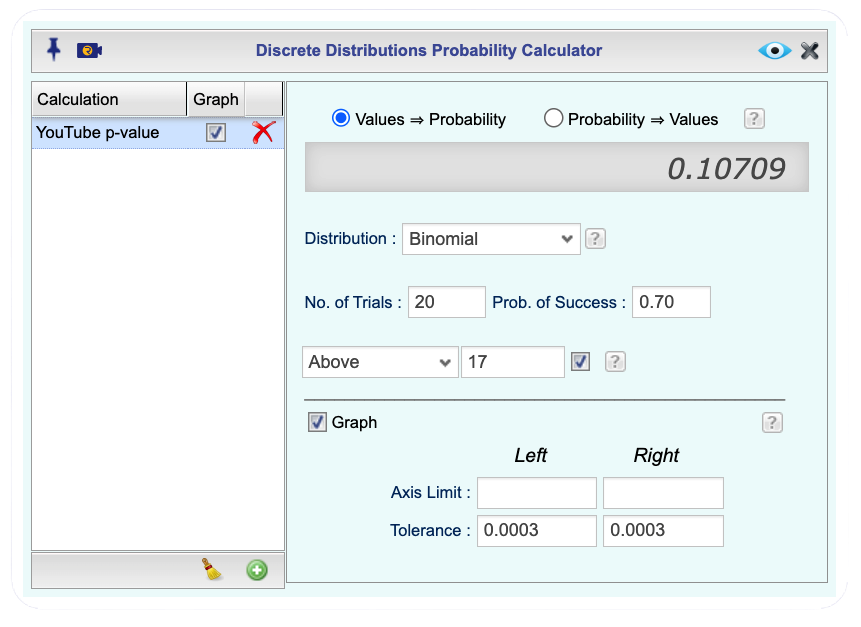
```
```{r,echo=FALSE}
#| fig-alt: "Binomial distribution histogram for n = 20 and p = 0.70, with the p-value support highlighted, showing P(X greater than or equal to 17) = 0.1071."
#| fig-cap: "Rguroo output showing the p-value"
#| out-width: "100%"
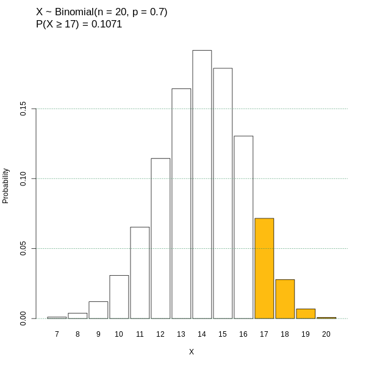
```
:::

c\. **Make a decision.**

Since the p-value $0.1071 > \alpha = 0.05$, we fail to reject $H_0$. The data 
do not provide sufficient evidence at the 5% significance level to conclude that 
more than 70% of students in the district use YouTube daily. Note that this 
conclusion is consistent with the critical region approach: $x_{obs} = 17$ 
does not fall in the critical region $X \geq 18$ determined in 
@exm-youtube-rejection.

::::

:::{#exm-inactivity-pvalue}
## Physical Inactivity: Computing the p-Value and Making a Decision

In the Physical Inactivity example (@exm-physical-inactivity-ppss), we are 
testing $H_0: \pi \geq 0.35$ versus $H_a: \pi < 0.35$, where $\pi$ is the 
true proportion of adults in the population who are physically inactive. A 
random sample of $n = 50$ adults is selected and $x_{obs} = 10$ are found to be physically inactive.

a. Obtain the $H_a$ support.
b. Compute the p-value.
c. At significance level $\alpha = 0.05$, make a decision and state your 
conclusion in the context of the problem.
:::

:::: {.callout-tip .solution-callout collapse="true" icon=false}
## 🔎 Solution
a\. **Obtain the $H_a$ support.**

Since $H_a: \pi < 0.35$, values of $X$ that are at least as supportive of $H_a$ as $x_{obs} = 10$ are values less than or equal to 10. Therefore the $H_a$ support is $\{0, 1, \ldots, 10\}$.

b\. **Compute the p-value.**

The p-value is computed at the boundary value $\pi_0 = 0.35$:
$$\text{p-value} = P(X \leq 10 \mid \pi = 0.35).$$

We compute this probability using Rguroo's Discrete Probability 
Calculator with $X \sim \text{Binomial}(50, 0.35)$. @fig-inactivity-pvalue shows the Rguroo dialog setup (left panel) and the Rguroo output (right panel) giving

::: {.callout-note appearance="minimal"}
$$\text{p-value} = P(X \leq 10 \mid \pi = 0.35) \approx 0.0160.$$
:::

::: {#fig-inactivity-pvalue layout-ncol=2 layout-valign="bottom" fig-cap="Rguroo setup (left) and p-value output (right) for the Physical Inactivity example."}

```{r,echo=FALSE}
#| fig-alt: "Rguroo Probability Calculator dialog configured for the Physical Inactivity p-value example with Binomial distribution, 50 trials, probability of success 0.35, and lower tail selected."
#| fig-cap: "Rguroo dialog for computing the p-value"
#| out-width: "100%"
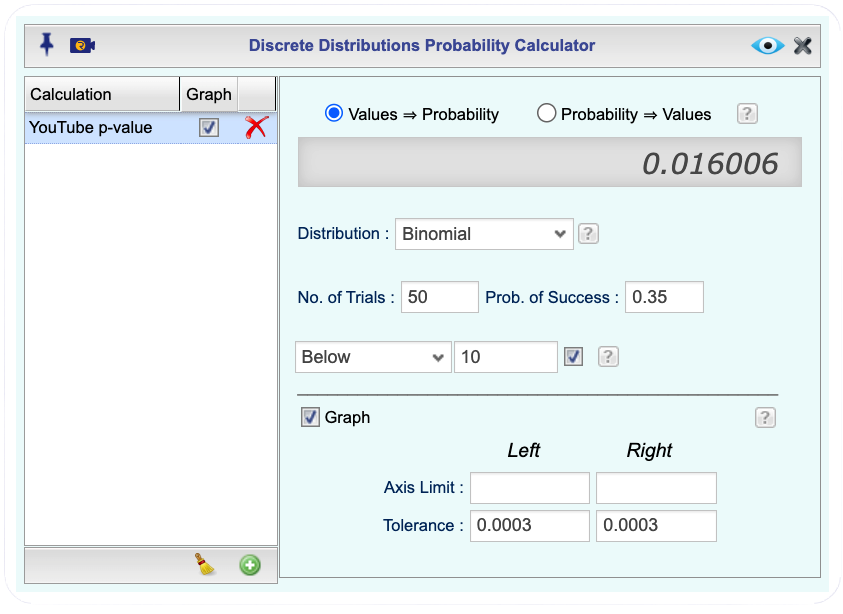
```
```{r,echo=FALSE}
#| fig-alt: "Binomial distribution histogram for n = 50 and p = 0.35, with the p-value support highlighted, showing P(X less than or equal to 10)."
#| fig-cap: "Rguroo output showing the p-value"
#| out-width: "100%"
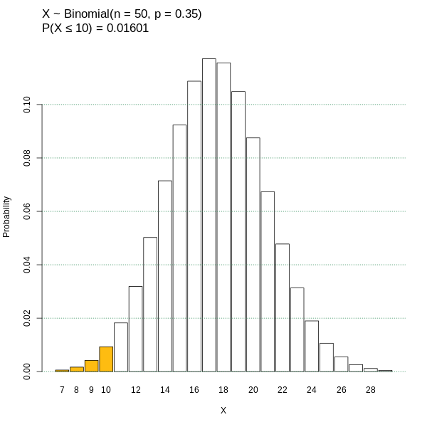
```
:::

c\. **Make a decision.**

Since the p-value $0.0160 < \alpha = 0.05$, we reject $H_0$ in favor of 
$H_a: \pi < 0.35$. The data provide sufficient evidence at the 5% significance 
level to conclude that fewer than 35% of adults in the population are physically 
inactive. Note that this conclusion is consistent with the critical region 
approach: $x_{obs} = 10$ falls in the critical region $X \leq 11$ determined 
in @exm-inactivity-rejection.

::::

**Computing the p-Value and Making a Decision: The Two-Sided Case**

The two-sided case requires a bit more care. Since $H_a: \pi \neq \pi_0$ does not specify a direction, evidence against $H_0$ can come from either tail of the distribution. Recall from Case 3 that a value $x$ is in the $H_a$ support if $P(X = x \mid \pi = \pi_0) \leq P(X = x_{obs} \mid \pi = \pi_0)$, that is, if it is at least as unlikely as $x_{obs}$ under $H_0$.

:::{#exm-social-pvalue}
## Social Media as a Primary News Source: Computing the p-Value and Making a Decision

In the Social Media as a Primary News Source example (@exm-social-media-news-ppss), we are testing $H_0: \pi = 0.36$ versus $H_a: \pi \neq 0.36$, where $\pi$ is the true proportion of students who use social media as their primary news source. A random sample of $n = 15$ students is selected and $x_{obs} = 9$ report using social media as their primary news source.

a. Obtain the $H_a$ support.
b. Compute the p-value.
c. At significance level $\alpha = 0.05$, make a decision and state your 
conclusion in the context of the problem.
:::

:::: {.callout-tip .solution-callout collapse="true" icon=false}
## 🔎 Solution
a\. **Obtain the $H_a$ support.**

Since $H_a: \pi \neq 0.36$, values of $X$ that are at least as supportive of 
$H_a$ as the observed value $x_{obs} = 9$ are those that are at least as unlikely 
as $x_{obs} = 9$ under $H_0$. That is, the $H_a$ support consists of $x_{obs} = 9$ 
and all values $x$ for which
$$
P(X = x \mid \pi = 0.36) \leq P(X = 9 \mid \pi = 0.36).
$$

Figure @fig-social-pvalue0 shows the Rguroo dialog and output used to compute 
$P(X = x \mid \pi = 0.36)$. The probability of the observed value is 
$P(X = 9 \mid \pi = 0.36) \approx 0.0349$. Therefore, any value of $x$ with 
probability less than or equal to $0.0349$ is included in the $H_a$ support, 
in addition to $x_{obs} = 9$.

From the graph, the $H_a$ support consists of $\{0, 1\}$ in the left tail and 
$\{9, 10, 11, \ldots, 15\}$ in the right tail.

Note that the graph is truncated at $X = 12$, since the probabilities for 
values greater than 12 are extremely small.

::: {#fig-social-pvalue0 layout-ncol=2 layout-valign="bottom" fig-cap="Rguroo setup (left) and Rguroo output for $P(X=9)$ (right) for the Social Media example."}

```{r,echo=FALSE}
#| fig-alt: "Rguroo Probability Calculator dialog configured for the Social Media p-value example with Binomial distribution, 15 trials, probability of success 0.36, and probability of x = 9 computed."
#| fig-cap: 'Rguroo dialog'
#| out-width: "100%"
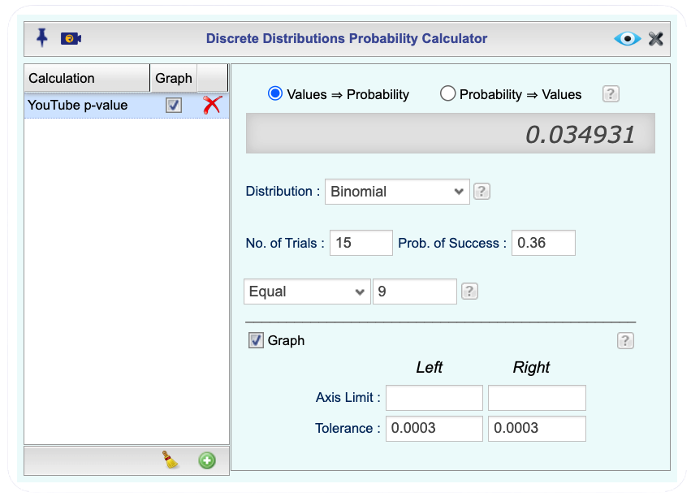
```
```{r,echo=FALSE}
#| fig-alt: 'Binomial distribution histogram for n = 15 and p = 0.36,  showing the probabilty of $X = 9$'
#| fig-cap: 'Rguroo output'
#| out-width: "100%"
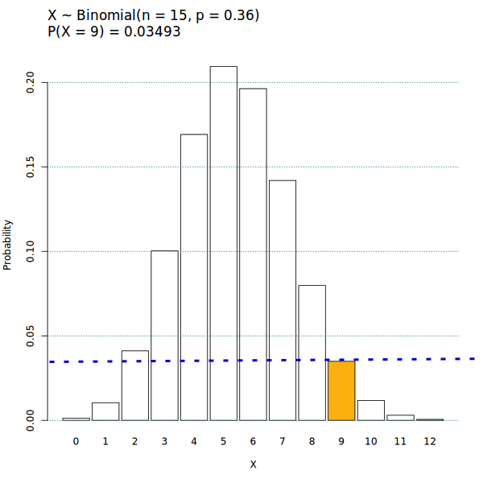
```
:::

b\. **Compute the p-value.**

The p-value is computed at the boundary value $\pi_0 = 0.36$. Using Rguroo’s 
Discrete Probability Calculator with $X \sim \text{Binomial}(15, 0.36)$, we 
compute the probability that $X$ falls in the $H_a$ support.

Recall that the $H_a$ support consists of the values $\{0, 1, 9, 10, 11, \ldots, 15\}$. 
Therefore, the p-value is the total probability of these values under $H_0$.

Figure @fig-social-pvalue shows the Rguroo output, giving

::: {.callout-note appearance="minimal"}
$$
\text{p-value} = P\left(X \text{ is a value in the } H_a \text{ support} 
\mid \pi = 0.36\right) \approx 0.0621.
$$
:::

::: {#fig-social-pvalue layout-ncol=2 layout-valign="bottom" fig-cap="Rguroo setup (left) and Rguroo output (right) for computing the p-value for the Social Media example."}

```{r,echo=FALSE}
#| fig-alt: "Rguroo Probability Calculator dialog configured for the Social Media p-value example with Binomial distribution, 15 trials, probability of success 0.36, and probability of x <=0 and x>=9 computed."
#| fig-cap: 'Rguroo dialog'
#| out-width: "100%"
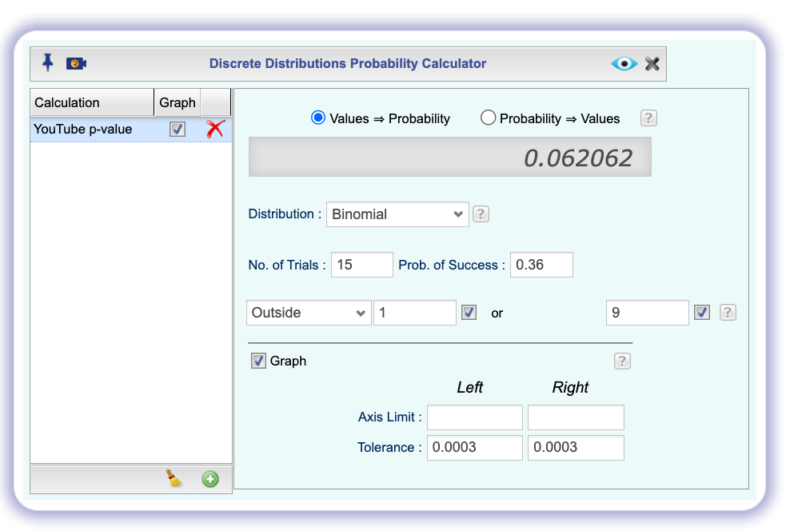
```
```{r,echo=FALSE}
#| fig-alt: 'Binomial distribution histogram for n = 15 and p = 0.36,  showing the p-value for the social media example$'
#| fig-cap: 'Rguroo output'
#| out-width: "100%"
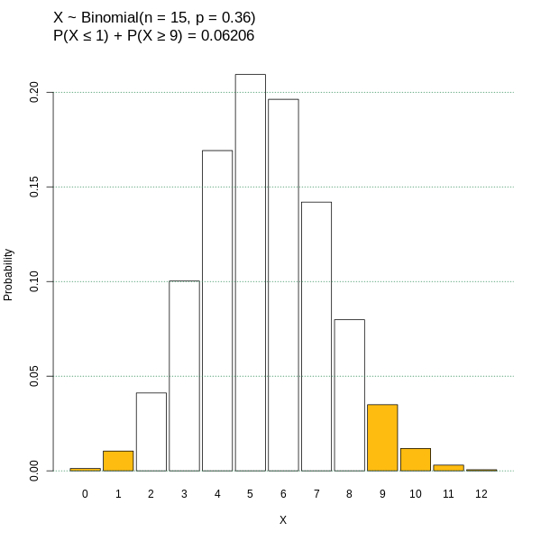
```
:::

c\. **Make a decision.**

Since the p-value $0.0621 > \alpha = 0.05$, we fail to reject $H_0$ in favor of $H_a: \pi \neq 0.36$. The data do not provide sufficient evidence at the 5% significance level to conclude that the proportion of students who use social media as their primary news source differs from 0.36.

This conclusion is consistent with the critical region approach: the observed value $x_{obs} = 9$ does not fall in the critical region $X \leq 1$ or $X \geq 10$ determined in @exm-social-rejection.

::::

### Homework for Section @sec-pvalue

For each of the scenarios described in Problems 1--7 of @sec-stage-hw,
answer the following:

a. Obtain the $H_a$ support.
b. Use Rguroo's Probability Calculator to compute the p-value.
c. At the given significance level, make a decision and state your
conclusion in the context of the problem.

---

1. **Arizona Marijuana Legalization**
In Problem 1 (Arizona Marijuana Legalization) of @sec-stage-hw, $\pi$ is
the true proportion of Arizona registered voters who support marijuana
legalization. Do Arizona registered voters differ from Colorado residents
in their support for marijuana legalization? The sample consisted of
$n = 779$ voters, of whom $x_{\text{obs}} = 390$ favored legalization.
Use $\alpha = 0.05$.

2. **Australian Unemployment Outlook**
In Problem 2 (Australian Unemployment Outlook) of @sec-stage-hw, $\pi$ is
the true proportion of Australians in November 1997 who believed
unemployment would increase. Did Australian sentiment about unemployment
shift between July and November of 1997? The sample consisted of
$n = 631$ Australians, of whom $x_{\text{obs}} = 284$ believed
unemployment would increase. Use $\alpha = 0.05$.

3. **Arkansas Identity Theft Complaints**
In Problem 3 (Arkansas Identity Theft Complaints) of @sec-stage-hw, $\pi$
is the true proportion of consumer complaints in Arkansas that were for
identity theft. Was the proportion of identity theft complaints in Arkansas
greater than the national figure of 23%? The sample consisted of
$n = 3{,}482$ complaints, of which $x_{\text{obs}} = 1{,}601$ were for
identity theft. Use $\alpha = 0.05$.

4. **Alaska Identity Theft Complaints**
In Problem 4 (Alaska Identity Theft Complaints) of @sec-stage-hw, $\pi$
is the true proportion of consumer complaints in Alaska that were for
identity theft. Was Alaska's proportion of identity theft complaints less
than the national proportion of 23%? The sample consisted of
$n = 1{,}432$ complaints, of which $x_{\text{obs}} = 321$ were for
identity theft. Use $\alpha = 0.01$.

5. **Kennedy Assassination Conspiracy Belief**
In Problem 5 (Kennedy Assassination Conspiracy Belief) of @sec-stage-hw,
$\pi$ is the true proportion of American adults in 2013 who believed there
was a conspiracy behind President Kennedy's assassination. Is there evidence
that American belief in a conspiracy behind President Kennedy's assassination
changed between 2001 and 2013? The sample consisted of $n = 1{,}039$
adults, of whom $x_{\text{obs}} = 634$ believed in a conspiracy.
Use $\alpha = 0.05$.

6. **Autism Spectrum Disorder in Arizona**
In Problem 6 (Autism Spectrum Disorder in Arizona) of @sec-stage-hw, $\pi$
is the true proportion of children in Arizona diagnosed with ASD. Is the
rate of ASD diagnosis among children in Arizona greater than the national
rate of 1 in 88 children? The sample consisted of $n = 32{,}601$ children,
of whom $x_{\text{obs}} = 507$ were diagnosed with ASD. Use $\alpha = 0.05$.

7. **Graduate Degree Attainment: GSS2024**
In Problem 7 (Graduate Degree Attainment: GSS2024) of @sec-stage-hw, $\pi$
is the true proportion of U.S. adults who hold a graduate degree. Does the
GSS2024 data provide evidence that the proportion of U.S. adults who hold
a graduate degree differs from the 15% reported by the U.S. Census Bureau?
The sample consisted of $n = 388$ adults, of whom $x_{\text{obs}} = 33$
reported a graduate degree as their highest level of education.
Use $\alpha = 0.05$.

## Using Rguroo for One-Population Proportion Hypothesis Tests {#sec-rguroo-one-prop}

In the previous sections, we built up the ideas of hypothesis testing 
step by step: we identified the null and alternative hypotheses, computed 
Type I error probabilities, determined critical regions, and calculated 
p-values using the binomial distribution. Now that we understand the 
underlying logic of hypothesis testing, we can use Rguroo's **One-Population Proportion** 
inference function to carry out a complete hypothesis test in a single 
step. By entering the sample size, the hypothesized value $\pi_0$, and 
the observed count $x_{\text{obs}}$, Rguroo automatically produces all 
the information needed to reach a conclusion.

We illustrate this using the same three examples from this chapter.

:::{#exm-youtube-rguroo}
## Daily YouTube Use Among Teens (continued)

Recall @exm-youtube-ppss. A school district claims that more than 70% of students in its district use YouTube daily. A random sample of $n = 20$ students is selected, and $x_{\text{obs}} = 17$ of them report daily YouTube use. The hypotheses are:
$$
\begin{cases}
H_0: \pi \leq 0.70 \\
H_a: \pi > 0.70
\end{cases}
$$

Use Rguroo's One-Population Proportion inference function to carry out 
the hypothesis test at significance level $\alpha = 0.05$, and interpret 
the results.
:::

:::: {.callout-tip .solution-callout collapse="true" icon=false}
## 🔎 Solution

We test $H_0: \pi \leq 0.70$ versus $H_a: \pi > 0.70$ at significance 
level $\alpha = 0.05$, where $\pi$ is the true proportion of students in 
the district who use YouTube daily. Our sample of $n = 20$ students 
yielded $x_{\text{obs}} = 17$ daily users, giving an observed sample 
proportion of $\hat{p} = 17/20 = 0.85$. Since $\hat{p} = 0.85 > 0.70$, 
the sample result is in the direction of $H_a$. We now use Rguroo to 
determine whether this result is statistically significant.

Click to expand the box below to see how to use the [Proportion Inference]{.fun}  function in Rguroo to answer this question.

::: {#prop-inference-youtube .callout-note appearance="simple" collapse="true" icon="none" title="{width=22px style='vertical-align:middle;'} One-Population proportion hypothesis test - Youtube example"}

1. Open the **Analytics** toolbox in Rguroo.  

2. From the [Analysis]{.dpd} dropdown, select [Proportion Inference]{.fun} → [One Population]{.fun}. This opens the [One Population Proportion Inference]{.dialog} dialog.

3. In the **Data** section of the dialog, enter the following:
   - In the [Factor Label]{.des} textbox, type a label for the categorical variable. In Rguroo, a “factor” refers to a categorical variable. For this example, enter [Daily YouTube Use]{.typein}.
   - In the [Success Label]{.des} textbox, type [Yes]{.typein}. A success corresponds to a student who uses YouTube daily.
   - In the [Failure Label]{.des} textbox, type [No]{.typein}.
   - In the [Sample Size]{.des} textbox, type [20]{.typein}.
   - In the [\# of Successes]{.des} textbox, type [17]{.typein}.

4. In the **Test of Hypothesis** section of the dialog, enter the following:
   - In the [Alternative Hyp. p]{.dpd} dropdown, select [>]{.typein} and enter [0.7]{.typein}.
   - Select the [Binomial]{.des} checkbox to use the binomial distribution.
   - Leave the [Significance Level]{.des} textbox at the default value of [0.05]{.typein}.

5. (Optional) Click the  button to open the [Advanced Features]{.dialog} dialog.
   - Open the [Confidence Interval and Test of Hypothesis]{.tab}.
   - In the **Graphs** section, select both [P-Value]{.des} and [Critical Region]{.des}. The default is [P-Value]{.des}; selecting [Critical Region]{.des} will also display the critical region.

6. Click the preview icon  to view the output.

7. Click the  button and save the result as [YoutubeProp]{.typein}.

::: {.callout-tip .inner-callout collapse="true" title="Rguroo One-Population Proportion dialogs"}

::: {#fig-youtube-rguroo layout-ncol=2 layout-valign="top" fig-cap="(Left) Rguroo One-Population Proportion dialog for the Daily YouTube Use example and (right) Advanced Features dialog."}
```{r,echo=FALSE}
#| fig-alt: "Rguroo One-Population Proportion dialog configured for the Daily YouTube Use example with sample size 20, observed count 17, hypothesized proportion 0.70, and right-tailed alternative."
#| fig-cap: "Rguroo Basics dialog"
#| out-width: "100%"
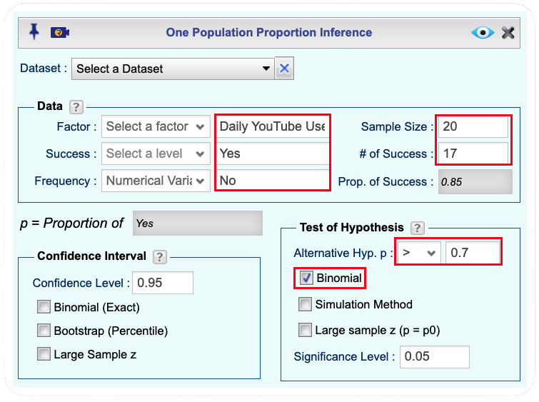
```
```{r,echo=FALSE}
#| fig-alt: "Rguroo Advanced Features dialog for one population proportion inference showing the Confidence Interval and Test of Hypothesis tab. In the Methods section, the Binomial option is selected while Simulation Method and large sample z test options are unchecked. In the Graphs section, both P-Value and Critical Region options are selected and highlighted. At the bottom, Simulation Parameters show 10,000 replications with a seed value of 100."
#| fig-cap: "Advanced Features dialog"
#| out-width: "100%"
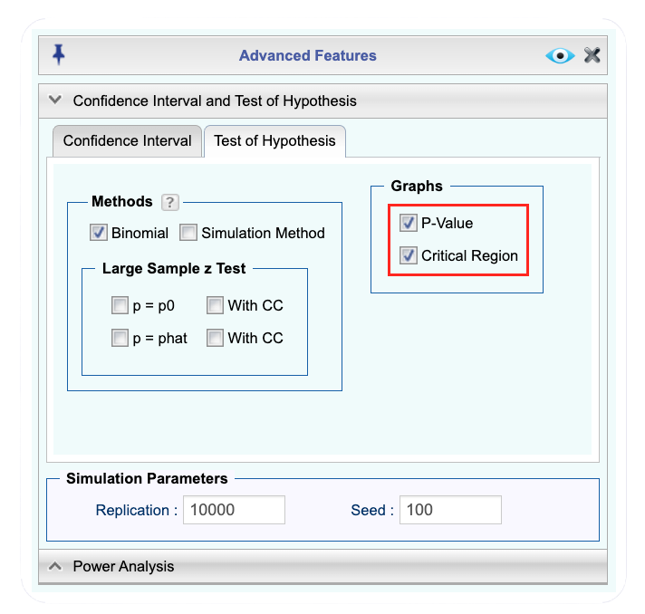
```
:::

:::

:::

Click to expand the box below to see the Rguroo output.

::: {.callout-tip .inner-callout collapse="true" title="Rguroo output: One-Population Proportion Inference - YouTube"}

<div tabindex="0" class="rg-iframe-wrapper">
  <iframe
    src="Rguroo_html_output/Proportion Inference/YoutubeProp_docx/YoutubeProp.html"
    class="rg-iframe"
    title="Rguroo output: One Population Proportion Hypothesis - Youtube Example">
  </iframe>
</div>

:::

The Rguroo output reports a p-value of approximately $0.1071$ and a critical region of $X \geq 18$. Since the p-value $0.1071 > \alpha = 0.05$, we fail to reject $H_0$. Expanding the output above also shows the p-value graph and the critical region graph, the observed value $x_{\text{obs}} = 17$ does not fall in the critical region, which is consistent with our decision. 
The data do not provide sufficient evidence at the 5% ignificance level to conclude that more than 70% of students in the district use YouTube daily.

::::

:::{#exm-inactivity-rguroo}
## Physical Inactivity Among Adults (continued)

Recall @exm-physical-inactivity-ppss. A national health agency hopes that fewer than 35% of adults in its country are physically inactive. A random sample of $n = 50$ adults is selected, and $x_{\text{obs}} = 10$ are found to be physically inactive. The hypotheses are:
$$
\begin{cases}
H_0: \pi \geq 0.35 \\
H_a: \pi < 0.35
\end{cases}
$$

Use Rguroo's One-Population Proportion inference function to carry out the hypothesis test at significance level $\alpha = 0.05$, and interpret the results.
:::

:::: {.callout-tip .solution-callout collapse="true" icon=false}
## 🔎 Solution
We use the same instructions as in [the YouTube example](#prop-inference-youtube) to open the [One Population Proportion Inference]{.dialog}. The filled-out dialog for 
this problem is given in @fig-inactivity-test. We input the [Factor]{.des} 
(categorical variable) label as [Physical Activity]{.typein}, 
[Success]{.des} is labeled as [Inactive]{.typein}, since we are using the 
count of those who are physically inactive, and for the [Failure]{.des} 
label we use [Active]{.typein}. As shown in @fig-inactivity-test, we have 
also input the sample size, number of successes, the alternative hypothesis, and selected the method [Binomial]{.des}.

```{r,echo=FALSE}
#| fig-alt: "Rguroo One Population Proportion Inference dialog configured for the Physical Inactivity example, showing a sample size of 50, 10 successes labeled as 'Inactive', alternative hypothesis p < 0.35, binomial method selected, and significance level 0.05."
#| warning: FALSE
#| label: fig-inactivity-test
#| fig-cap: "Rguroo One Population Proportion Inference dialog for performing a hypothesis test for the Physical Inactivity example"
#| out-width: "80%"
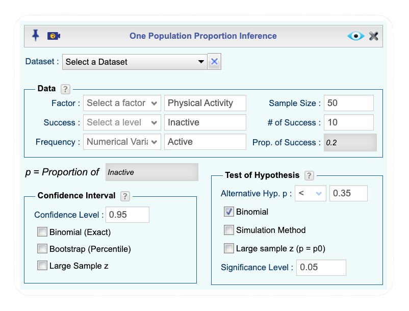
```

Click to expand the box below to see the Rguroo output.

::: {.callout-tip .inner-callout collapse="true" title="Rguroo output: One-Population Proportion Inference - Physical Inactivity"}

<div tabindex="0" class="rg-iframe-wrapper">
  <iframe
    src="Rguroo_html_output/Proportion Inference/Physical_inactivity_docx/Physical_inactivity.html"
    class="rg-iframe"
    title="Rguroo output: One Population Proportion Hypothesis - Physical Inactivity Example">
  </iframe>
</div>

:::

The Rguroo output shows that the observed sample proportion is 
$\hat{p}_{obs} = 10/50 = 0.20$, and the p-value is approximately $0.0160$. 
Since the p-value $0.0160 < \alpha = 0.05$, we reject $H_0$ in favor of 
$H_a: \pi < 0.35$. The data provide sufficient evidence at the 5% 
significance level to conclude that fewer than 35% of adults in the 
country are physically inactive. Expanding the output above also shows 
the p-value graph and the critical region graph. The p-value graph 
displays the lower-tail area $P(X \leq 10 \mid \pi = 0.35) \approx 0.0160$ 
under the null distribution $X \sim \text{Binomial}(50, 0.35)$. The 
critical region graph shows that the critical region is $X \leq 11$, 
with an exact significance level of $3.423\%$, and the observed value 
$x_{\text{obs}} = 10$ falls within this region, consistent with our 
decision to reject $H_0$.

::::


:::{#exm-social-rguroo}
## Social Media as a Primary News Source (continued)

Recall @exm-social-media-news-ppss. A university administration wants to determine whether the proportion of students who get most of their news from social media differs from 36%. A random sample of $n = 15$ students is selected, and $x_{\text{obs}} = 9$ report using social media as their primary news source. The hypotheses are:
$$
\begin{cases}
H_0: \pi = 0.36 \\
H_a: \pi \neq 0.36
\end{cases}
$$

Use Rguroo's One-Population Proportion inference function to carry out the hypothesis test at significance level $\alpha = 0.05$, and interpret the results.
:::

:::: {.callout-tip .solution-callout collapse="true" icon=false}
## 🔎 Solution
We test $H_0: \pi = 0.36$ versus $H_a: \pi \neq 0.36$ at significance level $\alpha = 0.05$, where $\pi$ is the true proportion of students at the university who use social media as their primary news source. Our sample of $n = 15$ students yielded $x_{\text{obs}} = 9$ who use social media as their primary news source, giving an observed sample proportion of $\hat{p} = 9/15 = 0.60$. Since $\hat{p} = 0.60 \neq 0.36$, the sample result is in the direction of $H_a$. We now use Rguroo to determine whether this result is statistically significant.

We use the same instructions as in [the YouTube example](prop-inference-youtube) to open the [One Population Proportion Inference]{.dialog}. As shown in @fig-social-test, we input the [Factor]{.des} label as 
[Use Social Media]{.typein}, the [Success]{.des} label as [Yes]{.typein} (a student who uses social media as their primary news source), and the [Failure]{.des} label as [No]{.typein}. We enter a sample size of [15]{.typein} and number of successes of [9]{.typein}. In the **Test of Hypothesis** section, we select [!=]{.typein} (not equal to) from the [Alternative Hyp. p]{.dpd} dropdown and enter [0.36]{.typein}. We select the [Binomial]{.des} checkbox and leave the [Significance Level]{.des} at the default value of [0.05]{.typein}.

```{r,echo=FALSE}
#| fig-alt: "Rguroo One Population Proportion Inference dialog configured for the Social Media example, showing a sample size of 15, 9 successes labeled as 'Yes', alternative hypothesis p not equal to 0.36, binomial method selected, and significance level 0.05."
#| warning: FALSE
#| label: fig-social-test
#| fig-cap: "Rguroo One Population Proportion Inference dialog for performing a hypothesis test for the Social Media example"
#| out-width: "80%"
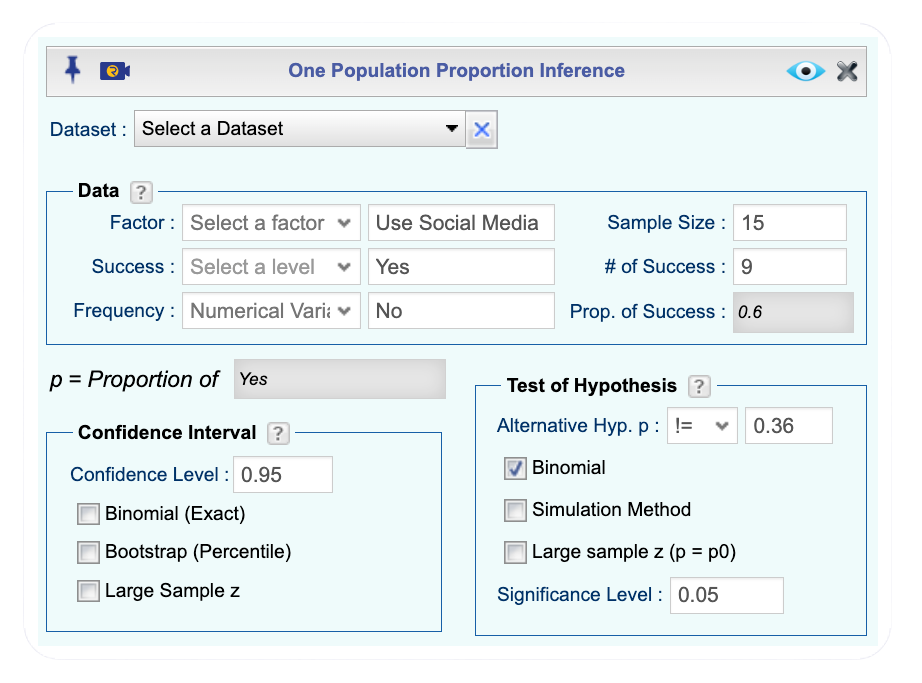
```

Click to expand the box below to see the Rguroo output.

::: {.callout-tip .inner-callout collapse="true" title="Rguroo output: One-Population Proportion Inference - Social Media"}

<div tabindex="0" class="rg-iframe-wrapper">
  <iframe
    src="Rguroo_html_output/Proportion Inference/social_media_docx/social_media.html"
    class="rg-iframe"
    title="Rguroo output: One Population Proportion Hypothesis - Social Media Example">
  </iframe>
</div>
:::

The Rguroo output shows that the observed sample proportion is 
$\hat{p}_{obs} = 9/15 = 0.60$, and the p-value is approximately $0.0621$. 
Since the p-value $0.0621 > \alpha = 0.05$, we fail to reject $H_0$. 
The data do not provide sufficient evidence at the 5% significance level to conclude that the proportion of students who use social media as their primary news source differs from 0.36. Expanding the output above also shows the p-value graph and the critical region graph. The p-value graph displays the two-sided area $P(X \leq 1) + P(X \geq 9 \mid \pi = 0.36) \approx 0.0621$ under the null distribution $X \sim \text{Binomial}(15, 0.36)$. The critical region graph shows that the critical region is $X \leq 1$ or $X \geq 10$, with an exact significance level of $2.713\%$, and the observed value 
$x_{\text{obs}} = 9$ does not fall within this region, consistent with
our decision to fail to reject $H_0$.
::::

**Using Raw Data**

So far, we have performed proportion inference using a summary of the sample, 
namely the sample size $n$ and the observed count $x_{obs}$. In practice, 
however, we often work directly with a raw dataset rather than a pre-computed 
summary. Now, we show how to perform proportion inference from raw 
data using Rguroo.

We illustrate this using data from the General Social Survey (GSS), one of the 
longest-running and most widely used surveys in the United States. Conducted by 
NORC at the University of Chicago, the GSS has collected data on the attitudes, 
behaviors, and characteristics of American adults since 1972, covering topics 
such as social values, political views, religion, and lifestyle. The dataset 
that we use here, [GSS2024]{.data}, is a subset of the 2024 GSS data. After removing 
observations with missing values, the dataset contains $n = 399$ respondents. 
One of the variables included is [Grass]{.var}, which records each respondent's 
opinion on whether marijuana should be made legal, with two possible responses: 
*Yes* (supports legalization) or *No* (does not support legalization).

:::{#exm-gss-marijuana}
## Marijuana Legalization: Testing a Claim Using Raw Data

The [GSS2024]{.data} dataset contains responses from $n = 399$ adults in the United 
States. The variable [Grass]{.var} records whether each respondent supports the 
legalization of marijuana, with possible responses of *Yes* (supports 
legalization) or *No* (does not support legalization). A researcher claims that 
more than 70% of American adults support the legalization of marijuana.

a. State the null and alternative hypotheses.
b. Using the [GSS2024]{.data} dataset and Rguroo's [Proportion Inference]{.fun} function, 
obtain the critical region at significance level $\alpha = 0.05$.
c. Compute the p-value and use it to make a decision at significance level 
$\alpha = 0.05$. 
d. State your conclusion in the context of the problem.

 The dataset for this example is available in the Rguroo dataset repository [Kozak]{.repo}, with the dataset name [GSS2004]{.data}. Table @tbl-GSS2024 displays the first six rows of the dataset. A complete description of the variables is provided in the  [dataset code book](#code-book-gss2024) that follows.

:::


```{r , echo=FALSE}
#| tbl-alt: "Head of GSS2024 Dataset"
#| label: tbl-GSS2024
#| tbl-cap: "A subset of the 2024 General Social Survey (GSS) data"
GSS <- read.csv( 'Datasets Revised or New/GSS2024.csv') 
knitr::kable(head(GSS))
```

::: {#code-book-gss2024 .callout-tip .codebook collapse="true"}

## Code book for Dataset GSS2024
Dataset Name: [GSS2024]{.data}

This dataset is a subset of the 2024 General Social Survey (GSS) data, obtained 
from NORC at the University of Chicago. After removing observations with missing 
values, the dataset contains $n = 399$ individuals.

The variables included in this dataset are described below.

[Age]{.var}: Age of the respondent (in years). 

[Sex]{.var}: Sex of the respondent

  - Male  
  - Female  

[Degree]{.var}:   Highest degree earned by the respondent.

  - No HS (Less than high school) 
  - HS (High school)  
  - JC (Junior college) 
  - Bachelor (Bachelor’s degree) 
  - Graduate (Graduate degree) 

[Race]{.var}: Race of the respondent

  - White  
  - Black  
  - Other  

[Grass]{.var}: Respondent’s opinion on whether marijuana should be made legal 

  - Yes (supports legalization)  
  - No (does not support legalization)

[Life]{.var}: Respondent’s general satisfaction with life

  - Very satisfied  
  - Pretty satisfied  
  - Not too satisfied 

[Tax]{.var}: Respondent’s opinion on whether taxes are too high

  - High (Too high) 
  - OK (About right) 
  - Low (Too low) 

[Mode]{.var}: Mode of data collection

  - In-person  
  - Phone  
  - Web  

**Source**

Smith, T. W., Davern, M., Freese, J., & Morgan, S. L. *General Social Survey, 1972–2024*. NORC at the University of Chicago. <https://gss.norc.org>

:::

:::: {.callout-tip .solution-callout collapse="true" icon=false}
## 🔎 Solution

Click to expand the box below to see how to use the [Proportion Inference]{.fun}  function in Rguroo to answer this question.

::: {#prop-inference-gss2024 .callout-note appearance="simple" collapse="true" icon="none" title="{width=22px style='vertical-align:middle;'} One-Population proportion hypothesis test - Marijuana Legalization Example"}

**Before you begin:** Make sure you have already imported the [GSS2024]{.data} dataset into your Rguroo account, as shown [here](#Importing-GSS2024-to-Rguroo).

1. Open the **Analytics** toolbox in Rguroo.  
2. From the [Analysis]{.dpd} dropdown, select [Proportion Inference]{.fun} → [One Population]{.fun}. This opens the [One Population Proportion Inference]{.dialog} dialog.
3. Drom the [Dataset]{.dpd} dropdown select the dataset [GSS2024]{.data}.
4. From the [Factor]{.dpd} dropdown select the categorical variable [Grass]{.var}. 
5. (Optional) In the [Factor Label]{.des} textbox type in [Legalize Marijuana]{.typein}. The label is usually a more descriptive version of the variable name.
5. From the [Success]{.dpd} dropdown select [Yes]{.typein}. This indicates those who agree with legalization of marijuana.(Once you select these values, the sample soze, number of successes and proportion of successes will be poplated automatically on the dialog)
6. In the **Test of Hypothesis** section of the dialog, enter the following:
   - In the [Alternative Hyp. p]{.dpd} dropdown, select [>]{.typein} and enter [0.7]{.typein}.
   - Select the [Binomial]{.des} checkbox to use the binomial distribution.
   - Leave the [Significance Level]{.des} textbox at the default value of [0.05]{.typein}.

5. (Optional) Click the  button to open the [Advanced Features]{.dialog} dialog.
   - Open the [Confidence Interval and Test of Hypothesis]{.tab}.
   - In the **Graphs** section, select both [P-Value]{.des} and [Critical Region]{.des}. The default is [P-Value]{.des}; selecting [Critical Region]{.des} will also display the critical region.

6. Click the preview icon  to view the output.

7. Click the  button and save the result as [GSS2024Prop]{.typein}.

::: {.callout-tip .inner-callout collapse="true" title="Rguroo One-Population Proportion dialogs"}

::: {#fig-youtube-rguroo layout-ncol=2 layout-valign="top" fig-cap="(left) Rguroo One-Population Proportion dialog and for the Marijuana Legalization example and (right) Advanced Features dialog."}
```{r,echo=FALSE}
#| fig-alt: "Rguroo One Population Proportion Inference dialog showing analysis for dataset GSS2024. The factor variable is Grass with success defined as Yes. The sample size is 388 with 282 successes, giving a sample proportion of 0.7268. The hypothesis test is set up with alternative hypothesis p > 0.7, using the binomial method and a significance level of 0.05. The confidence interval section shows a 95% level with options for binomial, bootstrap, and large sample methods."
#| fig-cap: "Rguroo Basics dialog"
#| out-width: "100%"
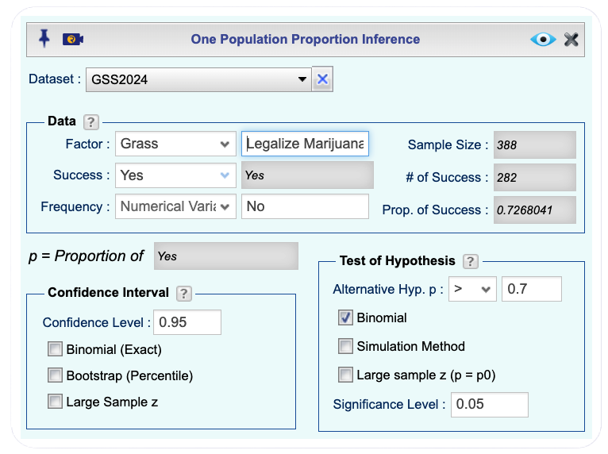
```
```{r,echo=FALSE}
#| fig-alt: "Rguroo Advanced Features dialog for one population proportion inference showing the Confidence Interval and Test of Hypothesis tab. In the Methods section, the Binomial option is selected while Simulation Method and large sample z test options are unchecked. In the Graphs section, both P-Value and Critical Region options are selected and highlighted. At the bottom, Simulation Parameters show 10,000 replications with a seed value of 100."
#| fig-cap: "Advanced Features dialog"
#| out-width: "100%"

```
:::

:::

:::

Click to expand the box below to see the Rguroo output.

::: {.callout-tip .inner-callout collapse="true" title="Rguroo output: One-Population Proportion Inference - Marijuana Legalization Example"}

<div tabindex="0" class="rg-iframe-wrapper">
  <iframe
    src="Rguroo_html_output/Proportion Inference/GSS2024Prop_docx/GSS2024Prop.html"
    class="rg-iframe"
    title="Rguroo output: One Population Proportion Hypothesis - Marijuana Example">
  </iframe>
</div>

:::


a. The null and alternative hypotheses are:
$$
\begin{cases}
H_0: \pi \leq 0.70 \\
H_a: \pi > 0.70
\end{cases}
$$
where $\pi$ is the true proportion of American adults who support the 
legalization of marijuana.

b. From the Rguroo output shown in @fig-gss-cr, the data summary shows that 
out of $n = 388$ respondents, $x_{obs} = 282$ answered *Yes*, giving a sample proportion of $\hat{p}_{obs} = 0.7268$. The critical region at significance level $\alpha = 0.05$ is
$X \geq 287,$ with an exact significance level of $4.799\%$ which is less than 5%. That is, we would reject $H_0$ if in a sample of size 388, 287 or more respondents support legalization.

```{r,echo=FALSE}
#| fig-alt: "Binomial distribution histogram for n = 388 and p = 0.70 showing 
#| the critical region X greater than or equal to 287 highlighted in red, with 
#| the observed value of 282 marked by a green triangle and the exact 
#| significance level of 4.799% indicated."
#| warning: FALSE
#| label: fig-gss-cr
#| fig-cap: "Rguroo Critical Region Output for the Marijuana Legalization Example"
#| out-width: "80%"
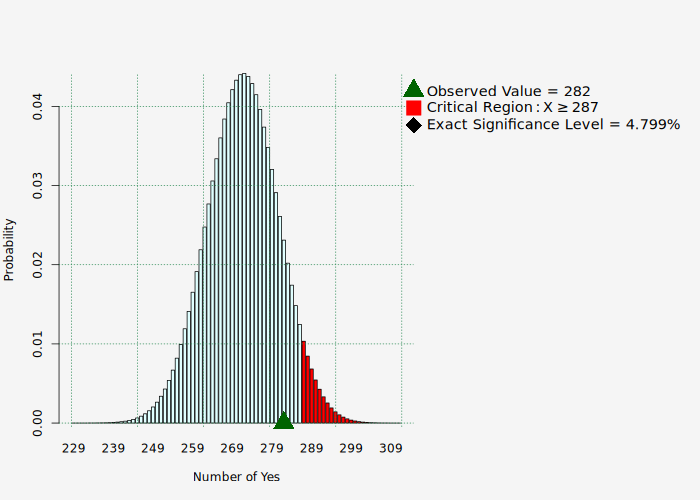
```
c. From the Rguroo output shown in @fig-gss-pvalue, the p-value is

$$\text{p-value} = P(X \geq 282 \mid \pi = 0.70) \approx 0.136.$$

```{r,echo=FALSE}
#| fig-alt: "Binomial distribution histogram for n = 388 and p = 0.70 showing 
#| the p-value support highlighted in red, with the observed value of 282 
#| marked by a green triangle and the p-value of 0.13601 indicated."
#| warning: FALSE
#| label: fig-gss-pvalue
#| fig-cap: "Rguroo P-Value Output for the Marijuana Legalization Example"
#| out-width: "80%"
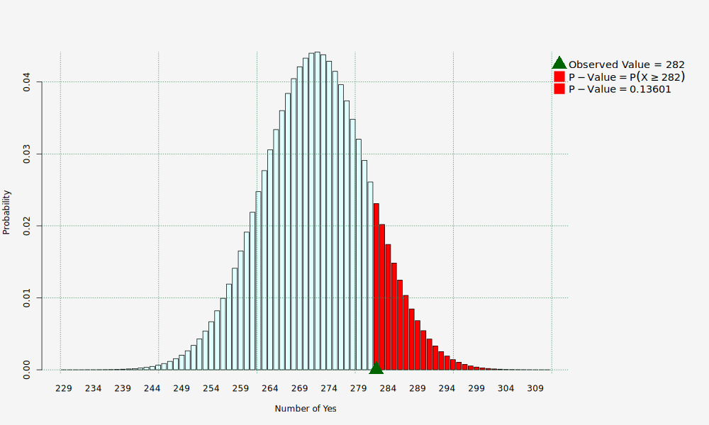
```

d. Since the p-value $0.136 > \alpha = 0.05$, we fail to reject $H_0$. This 
is consistent with the critical region approach: $x_{obs} = 282$ does not 
fall in the critical region $X \geq 287$. The data do not provide sufficient 
evidence at the 5% significance level to conclude that more than 70% of 
American adults support the legalization of marijuana, even though the sample 
proportion of $\hat{p}_{obs} = 0.7268$ is slightly above 0.70.
::::

### Homework for Section @sec-rguroo-one-prop

For each of the scenarios described in Problems 1--7 of @sec-stage-hw,
use Rguroo's [One-Population Proportion]{.fun} inference function with the
[Binomial]{.des} option to carry out the hypothesis test at the given
significance level. Before running the analysis, identify the following
inputs for the Rguroo dialog:

- [Factor Label]{.des}: A descriptive name for the variable being studied
- [Success]{.des}: The outcome that counts as a success
- [Failure]{.des}: The outcome that counts as a failure
- [Sample Size]{.des}: The value of $n$
- [\# of Successes]{.des}: The value of $x_{\text{obs}}$
- [Proportion of ...]{.des}: The label describing what the proportion
represents

Then carry out the test, report Rguroo's p-value, and interpret the results.

---

1. **Arizona Marijuana Legalization**
In Problem 1 (Arizona Marijuana Legalization) of @sec-stage-hw, $\pi$ is
the true proportion of Arizona registered voters who support marijuana
legalization. Do Arizona registered voters differ from Colorado residents
in their support for marijuana legalization? The sample consisted of
$n = 779$ voters, of whom $x_{\text{obs}} = 390$ favored legalization.
Use $\alpha = 0.05$.

2. **Australian Unemployment Outlook**
In Problem 2 (Australian Unemployment Outlook) of @sec-stage-hw, $\pi$ is
the true proportion of Australians in November 1997 who believed
unemployment would increase. Did Australian sentiment about unemployment
shift between July and November of 1997? The sample consisted of
$n = 631$ Australians, of whom $x_{\text{obs}} = 284$ believed
unemployment would increase. Use $\alpha = 0.05$.

3. **Arkansas Identity Theft Complaints**
In Problem 3 (Arkansas Identity Theft Complaints) of @sec-stage-hw, $\pi$
is the true proportion of consumer complaints in Arkansas that were for
identity theft. Was the proportion of identity theft complaints in Arkansas
greater than the national figure of 23%? The sample consisted of
$n = 3{,}482$ complaints, of which $x_{\text{obs}} = 1{,}601$ were for
identity theft. Use $\alpha = 0.05$.

4. **Alaska Identity Theft Complaints**
In Problem 4 (Alaska Identity Theft Complaints) of @sec-stage-hw, $\pi$
is the true proportion of consumer complaints in Alaska that were for
identity theft. Was Alaska's proportion of identity theft complaints less
than the national proportion of 23%? The sample consisted of
$n = 1{,}432$ complaints, of which $x_{\text{obs}} = 321$ were for
identity theft. Use $\alpha = 0.05$.

5. **Kennedy Assassination Conspiracy Belief**
In Problem 5 (Kennedy Assassination Conspiracy Belief) of @sec-stage-hw,
$\pi$ is the true proportion of American adults in 2013 who believed there
was a conspiracy behind President Kennedy's assassination. Is there evidence
that American belief in a conspiracy behind President Kennedy's assassination
changed between 2001 and 2013? The sample consisted of $n = 1{,}039$
adults, of whom $x_{\text{obs}} = 634$ believed in a conspiracy.
Use $\alpha = 0.05$.

6. **Autism Spectrum Disorder in Arizona**
In Problem 6 (Autism Spectrum Disorder in Arizona) of @sec-stage-hw, $\pi$
is the true proportion of children in Arizona diagnosed with ASD. Is the
rate of ASD diagnosis among children in Arizona greater than the national
rate of 1 in 88 children? The sample consisted of $n = 32{,}601$ children,
of whom $x_{\text{obs}} = 507$ were diagnosed with ASD. Use $\alpha = 0.05$.

7. **Graduate Degree Attainment: GSS2024**
In Problem 7 (Graduate Degree Attainment: GSS2024) of @sec-stage-hw, $\pi$
is the true proportion of U.S. adults who hold a graduate degree. Does the
GSS2024 data provide evidence that the proportion of U.S. adults who hold
a graduate degree differs from the 15% reported by the U.S. Census Bureau?
Use $\alpha = 0.05$.

<div tabindex="0" style="width:85%; margin:auto;">

 The dataset for
this exercise is available in the Rguroo dataset repository [Kozak]{.repo},
with the dataset name [GSS2024]{.data}.

**Code book for Dataset GSS2024 is given [here](#code-book-gss2024).**

</div>


## Large Sample Hypothesis Test for One Population Proportion {#sec-large-sample-one-prop}

In the previous section, we carried out hypothesis tests for a population
proportion using the binomial distribution. That approach is conceptually
clean and statistically exact: because $X \sim \text{Binomial}(n, \pi_0)$
under $H_0$, every probability we compute is precise. Generally,
the binomial method is the ideal choice.

However, there are good reasons to also learn an alternative approach based
on large sample theory; that is a method that relies on the central limit theorem and applies to large samples. First, and most importantly, the method generalizes
naturally to other inference problems, comparing two population
proportions, or drawing inferences about population means, where an exact
distribution like the binomial is no longer available. Second, the large sample method is the one most commonly reported
in published research, so understanding it is essential for reading and
interpreting results you will encounter in practice. Finally, because $X$ is a discrete random variable, the binomial method cannot always achieve the target significance level $\alpha$ exactly; when the actual Type I error rate is $\alpha$, the achived value may be somewhat less.
The large sample method does not have this discreteness issue, since it
uses the continuous normal distribution. For example, recall that in @exm-gss-marijuana, the
GSS2024 marijuana legalization example, the binomial method produced an
exact significance level of 4.799% rather than the target 5%.

The large sample approach rests on the **Central Limit Theorem (CLT)**,
which you have already seen in Chapter ???. Recall that the CLT states that for
large samples, the sampling distribution of the sample mean is
approximately normal, regardless of the shape of the population
distribution. We now take a moment to see exactly why it applies to
sample proportions.

### A Proportion Is a Mean {#sec-prop-is-mean}

Suppose we record whether each individual in our sample has the
characteristic of interest, assigning a value of 1 to each success and a
value of 0 to each failure. For example, in the YouTube study, a student
who uses YouTube daily receives a 1, and one who does not receives a 0. If
our sample of $n = 20$ students produced $x_{\text{obs}} = 17$ daily users,
the data would consist of 17 ones and 3 zeros.

Now notice something: the **sample proportion** $\hat{p}$ is simply the
average of these zeros and ones:

$$
\hat{p}_{obs} = \frac{x_{\text{obs}}}{n}
        = \frac{\text{sum of zeros and ones}}{n}
        = \bar{x}.
$$

This means $\hat{p}_{obs}$ is a sample mean; specifically, the sample mean of a
collection of 0/1 values. Recall from the CLT that when the sample size is
large, the sampling distribution of a sample mean is approximately normal,
regardless of the shape of the original population distribution. Since
$\hat{p}$ is a sample mean, the CLT applies to it as well.

::: {.callout-note appearance="minimal"}
## A Proportion Is a Mean

The sample proportion $\hat{p}$ is the mean of a collection of zeros and
ones. Because the Central Limit Theorem applies to sample means when $n$
is large, it applies to $\hat{p}$ as well.
:::

More precisely, applying the CLT to $\hat{p}$ as a sample mean, for a
population with proportion of successes $\pi$, the sample proportion $\hat{p}$
has:

- **Mean:** $\pi$
- **Standard deviation:** $\sigma_{\hat{p}} = \sqrt{\dfrac{\pi(1-\pi)}{n}}$

This standard deviation is often called the **standard error** of $\hat{p}$.
It measures how much we expect $\hat{p}$ to vary from sample to sample. 
By the CLT, when $n$ is sufficiently large, $\hat{p}$
follows approximately a normal distribution:

$$
\hat{p} \sim N\!\left(\pi,\; \sqrt{\frac{\pi(1-\pi)}{n}}\right).
$$

Since $\pi$ is unknown, we need to specify a value for it to use this
result for inference. Recall from Sections @sec-typeI-rejection that in hypothesis testing we assume the null hypothesis is true, and that the maximum Type I error occurs at the
boundary value $\pi_0$ of $H_0$. We therefore evaluate the sampling
distribution of $\hat{p}$ at $\pi = \pi_0$, giving:

$$
\hat{p} \sim N\!\left(\pi_0,\; \sqrt{\frac{\pi_0(1-\pi_0)}{n}}\right).
$$

We call this the **null distribution** of $\hat{p}$, since it describes
the behavior of $\hat{p}$ at the boundary value $\pi_0$ of $H_0$, where
the Type I error is at its maximum. Just as the
binomial null distribution of $X$ was the foundation for decisions in the
previous section, this normal null distribution of $\hat{p}$ is the
foundation for decisions in the large sample method. 

Most textbooks present the large sample test using a standardized
statistic called the $z$-score, obtained by subtracting $\pi_0$ from
$\hat{p}$ and dividing by the standard error:

$$
z = \frac{\hat{p} - \pi_0}{\sqrt{\dfrac{\pi_0(1-\pi_0)}{n}}}.
$$

This unit-less quantity is then compared to a standard normal
distribution. In this textbook, we instead work directly with $\hat{p}$
and compare it to its null distribution. This results in less
computation steps and, more importantly, keeps our decisions grounded in
the context of the data; we make conclusions about a sample proportion,
not an abstract standardized value.

Finally, what constitutes a large sample size wehere the normal approximation to the binomial is good? A common rule of thumb is to check the expected numbers of successes and failures. In particular, the approximation is typically considered reliable when
$n\pi_0 \geq 10$ and n(1 − \pi_0) \geq 10$. When both of hese conditions are satisfied, the binomial distribution tends to be reasonably symmetric, and the normal model provides a good fit. A less strict guideline sometimes used is $n\pi_0 \geq 5$ and $n(1 − \pi_0) \geq 5$, but this weaker condition can lead to noticeable inaccuracies, especially in tail probabilities. For this reason, the more conservative "10 and 10" rule is generally preferred in practice. 

To give examples, in the case of the Youtube Daily Use example, we have $n=20$ and $\pi_0=0.7$. Calculating the expected number of successes and failures, we get:

- Expected successes: $n\pi_0 = 20 \times 0.7 = 14$
- Expected failures: $n(1 - \pi_0) = 20 \times (1 - 0.7) = 20 \times 0.3 = 6$

In this case, the expected number of successes (14) is greater than 10, but the expected number of failures (6) is less than 10 which suggests that the normal approximation may not be reliable for this scenario. The expected number of successes (16) is greater than 10, but since both conditions need to be satisfied for the normal approximation to be considered good, we would conclude that the normal approximation is not appropriate for this example. 

In contrast, for the Physical Inactivity example, we have $n=50$ and $\pi_0=0.35$. Calculating the expected number of successes and failures, we get:

- Expected successes: $n\pi_0 = 50 \times 0.35 = 17.5$
- Expected failures: $n(1 - \pi_0) = 50 \times (1 - 0.35) = 50 \times 0.65 = 32.5$

In this case, both the expected number of successes (17.5) and the expected number of failures (32.5) are greater than 10, which suggests that the normal approximation is likely to be reliable for this scenario. Therefore, we can use the normal approximation to the binomial distribution for the Physical Inactivity example, but we should be cautious about using it for the Youtube Daily Use example due to the small expected number of successes.


::: {.callout-note appearance="minimal"}
## Large Sample Condition: The 10 and 10 Rule

The normal approximation for $\hat{p}$ is considered reliable when both of
the following hold:

$$n\pi_0 \geq 10 \qquad \text{and} \qquad n(1-\pi_0) \geq 10.$$

These conditions ensure that the sample is large enough for the CLT to
provide a good approximation. If either condition fails, the binomial
method from Section @sec-rguroo-one-prop is the appropriate choice.
:::

### Decision Based on a Critical Region {#sec-large-sample-cr}

Recall from Section @sec-null-alternative that the critical region is a
set of values of our statistic that favor the alternative hypothesis, for
which we reject $H_0$. In the binomial method, the critical region was
expressed in terms of the count $X$. In the large sample method, we work
with $\hat{p}$ instead, and we find critical values using the normal null
distribution of $\hat{p}$.

For a one-sided test with $H_a: \pi > \pi_0$, large values of $\hat{p}$
favor the alternative, so the critical region lies in the right tail. We
find the critical value $\hat{p}^*$ such that
$P(\hat{p} \geq \hat{p}^*) = \alpha$ under the null distribution, and
reject $H_0$ if $\hat{p}_{\text{obs}} \geq \hat{p}^*$, where $\hat{p}_{\text{obs}}$ denotes the sample proportion that we have observed.

Analogously, for $H_a: \pi < \pi_0$, the critical region is in the left
tail, and we find $\hat{p}^*$ such that $P(\hat{p} \leq \hat{p}^*) = \alpha$.
For the two-sided test $H_a: \pi \neq \pi_0$, the critical region lies in
both tails, and we find lower and upper critical values $\hat{p}^*_L$ and
$\hat{p}^*_U$ such that $P(\hat{p} \leq \hat{p}^*_L) = \alpha/2$ and
$P(\hat{p} \geq \hat{p}^*_U) = \alpha/2$.

::: {.callout-note appearance="minimal"}
## Critical Region for the Large Sample Test

All critical values are found using the null distribution
$\hat{p} \sim N\!\left(\pi_0,\, \sqrt{\pi_0(1-\pi_0)/n}\right)$.

| Alternative Hypothesis | Critical Region | Critical Value Condition |
|---|---|---|
| $H_a: \pi > \pi_0$ | $\hat{p}_{\text{obs}} \geq \hat{p}^*$ | $P(\hat{p} \geq \hat{p}^*) = \alpha$ |
| $H_a: \pi < \pi_0$ | $\hat{p}_{\text{obs}} \leq \hat{p}^*$ | $P(\hat{p} \leq \hat{p}^*) = \alpha$ |
| $H_a: \pi \neq \pi_0$ | $\hat{p}_{\text{obs}} \leq \hat{p}^*_L$ or $\hat{p}_{\text{obs}} \geq \hat{p}^*_U$ | $P(\hat{p} \leq \hat{p}^*_L) = P(\hat{p} \geq \hat{p}^*_U) = \alpha/2$ |
:::

### Decision Based on a P-value {#sec-large-sample-pvalue}

As in the binomial method, we define the p-value as the probability that
$\hat{p}$ belongs to the $H_a$ support, assuming $H_0$ is true:

$$
\text{p-value} = P\!\left(\hat{p} \text{ belongs to } H_a \text{ support}
                  \mid H_0 \text{ is true}\right),
$$

where the $H_a$ **support** is the set of $\hat{p}$ values that are as
favorable or more favorable to $H_a$ than $\hat{p}_{\text{obs}}$, where $\hat{p}_{\text{obs}}$ is the observed sample proportion. 

For one-sided tests this is straightforward: if
$H_a: \pi > \pi_0$, larger values of $\hat{p}$ are more favorable to
$H_a$, so the $H_a$ support consists of $\hat{p}_{\text{obs}}$ and all
values above it. Symmetrically, for $H_a: \pi < \pi_0$, the $H_a$ support
consists of $\hat{p}_{\text{obs}}$ and all values below it.

For the two-sided test $H_a: \pi \neq \pi_0$, the $H_a$ support consists
of values in both tails of the null distribution, symmetrically positioned about $\pi_0$ due to the normal distribution being symmetric about $\pi_0$ (see @fig-ha-support). If
$\hat{p}_{\text{obs}} > \pi_0$, the $H_a$ support is the set of values
$\hat{p} \geq \hat{p}_{\text{obs}}$ together with their mirror image
relative to $\pi_0$ in the left tail. If $\hat{p}_{\text{obs}} < \pi_0$,
the $H_a$ support is the set of values $\hat{p} \leq \hat{p}_{\text{obs}}$
together with their mirror image relative to $\pi_0$ in the right tail.
@fig-ha-support illustrates these two cases. In all cases, probabilities are computed using the normal null distribution.
```{r, echo=FALSE}
#| label: fig-ha-support
#| fig-cap: "The $H_a$ support for a two-sided test. The shaded segments
#|   show the values of $\\hat{p}$ that are as favorable or more favorable
#|   to $H_a$ than $\\hat{p}_{\\text{obs}}$. The dashed tick marks the
#|   mirror image of $\\hat{p}_{\\text{obs}}$ relative to $\\pi_0$."
#| fig-alt: "Two number lines illustrating the Ha support for a two-sided
#|   test. In Case 1 where p-hat-obs is greater than pi-0, the Ha support
#|   is highlighted in orange on the right tail beyond p-hat-obs and the
#|   left tail beyond its mirror image. In Case 2 where p-hat-obs is less
#|   than pi-0, the Ha support is highlighted in blue on the left tail
#|   beyond p-hat-obs and the right tail beyond its mirror image."
#| out-width: "85%"

```
::: {.callout-note appearance="minimal"}
## P-value for the Large Sample Test

All probabilities are computed using the null distribution
$\hat{p} \sim N\!\left(\pi_0,\, \sqrt{\pi_0(1-\pi_0)/n}\right)$.

| Alternative Hypothesis | $H_a$ Support | P-value |
|---|---|---|
| $H_a: \pi > \pi_0$ | $\hat{p} \geq \hat{p}_{\text{obs}}$ | $P(\hat{p} \geq \hat{p}_{\text{obs}})$ |
| $H_a: \pi < \pi_0$ | $\hat{p} \leq \hat{p}_{\text{obs}}$ | $P(\hat{p} \leq \hat{p}_{\text{obs}})$ |
| $H_a: \pi \neq \pi_0$, if $\hat{p}_{\text{obs}} > \pi_0$ | $\hat{p} \geq \hat{p}_{\text{obs}}$ and its mirror relative to $\pi_0$ | $2 \times P(\hat{p} \geq \hat{p}_{\text{obs}})$ |
| $H_a: \pi \neq \pi_0$, if $\hat{p}_{\text{obs}} < \pi_0$ | $\hat{p} \leq \hat{p}_{\text{obs}}$ and its mirror relative to $\pi_0$ | $2 \times P(\hat{p} \leq \hat{p}_{\text{obs}})$ |
:::

:::{#exm-inactivity-large-sample}
## Physical Inactivity Among Adults (continued)

Recall @exm-physical-inactivity-ppss. A national health agency hopes that
fewer than 35% of adults in its country are physically inactive. A random
sample of $n = 50$ adults was selected and $x_{\text{obs}} = 10$ were found
to be physically inactive. The hypotheses are:
$$
\begin{cases}
H_0: \pi \geq 0.35 \\
H_a: \pi < 0.35
\end{cases}
$$

a. Check whether the conditions for the normal approximation hold.
b. Use Rguroo's Proportion Inference function to obtain an output that includes
both the critical region and the p-value, then answer the following:
   (i) What is the critical region, and in words, what is the decision rule?
   (ii) What is the $H_a$ support, and what is the p-value?
   (iii) Write a probability statement that describes the p-value.
c. In light of the observed data and the critical region and p-value, state
your conclusion in the context of the problem.

:::

::: {.callout-tip .solution-callout collapse="true" icon=false}
## 🔎 Solution

a\. To check the large sample condition, we compute the expected number of
successes and failures under $H_0$, using the boundary value $\pi_0 = 0.35$:

$$n\pi_0 = 50 \times 0.35 = 17.5 \geq 10$$


$$n(1 - \pi_0) = 50 \times 0.65 = 32.5 \geq 10.$$

Both conditions are satisfied, so the normal approximation is appropriate
for this example.

b\. Click to expand the box below to see how to use the [Proportion Inference]{.fun}  function in Rguroo to answer this question.

::: {#prop-inference-inactivity .callout-note appearance="simple" collapse="true" icon="none" title="{width=22px style='vertical-align:middle;'} One-Population proportion hypothesis test - Physical Inactivity example"}

1. Open the **Analytics** toolbox in Rguroo.  

2. From the [Analysis]{.dpd} dropdown, select [Proportion Inference]{.fun} → [One Population]{.fun}. This opens the [One Population Proportion Inference]{.dialog} dialog.

3. In the **Data** section of the dialog, enter the following:
   - In the [Factor Label]{.des} textbox, type a label for the categorical variable. In Rguroo, a “factor” refers to a categorical variable. For this example, enter [Physically Inactive]{.typein}.
   - In the [Success Label]{.des} textbox, type [Yes]{.typein}. A success corresponds to a student who uses YouTube daily.
   - In the [Failure Label]{.des} textbox, type [No]{.typein}.
   - In the [Sample Size]{.des} textbox, type [50]{.typein}.
   - In the [\# of Successes]{.des} textbox, type [10]{.typein}.

4. In the **Test of Hypothesis** section of the dialog, enter the following:
   - In the [Alternative Hyp. p]{.dpd} dropdown, select [<]{.typein} and enter [0.35]{.typein}.
   - Select the [Large sample z (p=p0)]{.des} checkbox to use the large sample normal distribution method.
   - Leave the [Significance Level]{.des} textbox at the default value of [0.05]{.typein}.

5. Click the  button to open the [Advanced Features]{.dialog} dialog.
   - Open the [Confidence Interval and Test of Hypothesis]{.tab}.
   - In the **Graphs** section, select both [P-Value]{.des} and [Critical Region]{.des}. The default is [P-Value]{.des}; selecting [Critical Region]{.des} will also display the critical region.

6. Click the preview icon  to view the output.

7. Click the  button and save the result as [PhysicalProp]{.typein}.

::: {.callout-tip .inner-callout collapse="true" title="Rguroo One-Population Proportion dialogs"}

::: {#fig-inactivity-rguroo layout-ncol=2 layout-valign="top" fig-cap="(Left) Rguroo One-Population Proportion dialog for the Physical Inactivity example and (right) Advanced Features dialog."}
```{r,echo=FALSE}
#| fig-alt: "Rguroo One-Population Proportion dialog configured for the Physical Inactivity Use example with sample size 50, observed count 10, hypothesized proportion 0.35, and left-tailed alternative."
#| fig-cap: "Rguroo Basics dialog"
#| out-width: "100%"
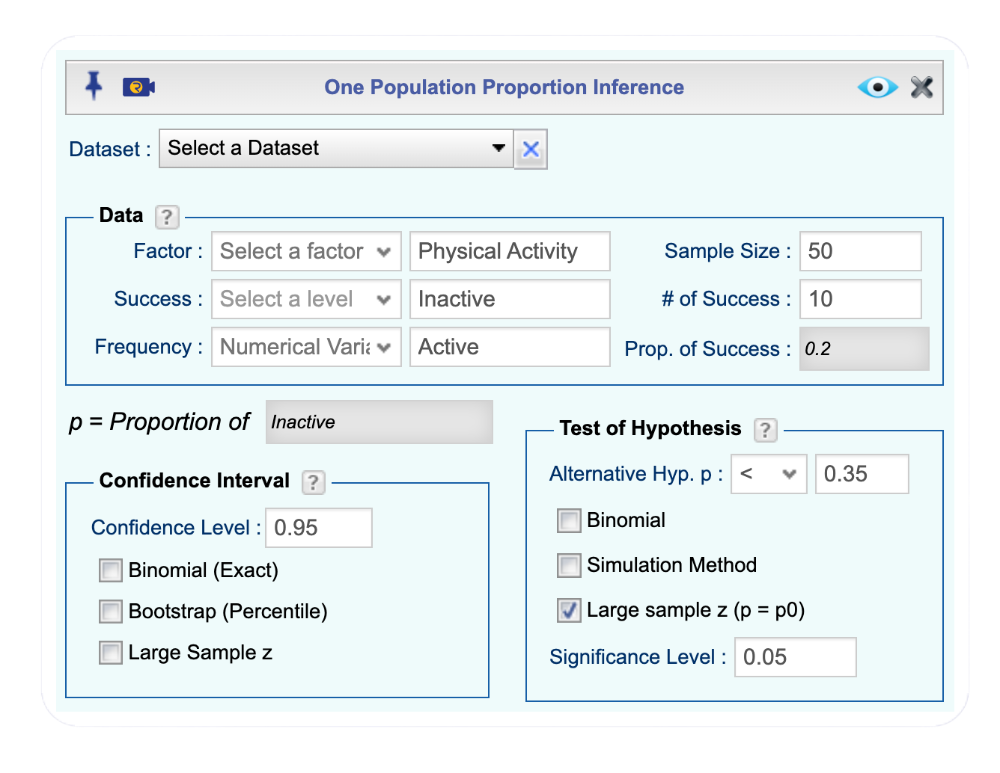
```
```{r,echo=FALSE}
#| fig-alt: "Rguroo Advanced Features dialog for one population proportion inference showing the Confidence Interval and Test of Hypothesis tab. In the Methods section, the large sample z test with p = p0 option is checked. In the Graphs section, both P-Value and Critical Region options are selected and highlighted. At the bottom, Simulation Parameters show 10,000 replications with a seed value of 100."
#| fig-cap: "Advanced Features dialog"
#| out-width: "100%"
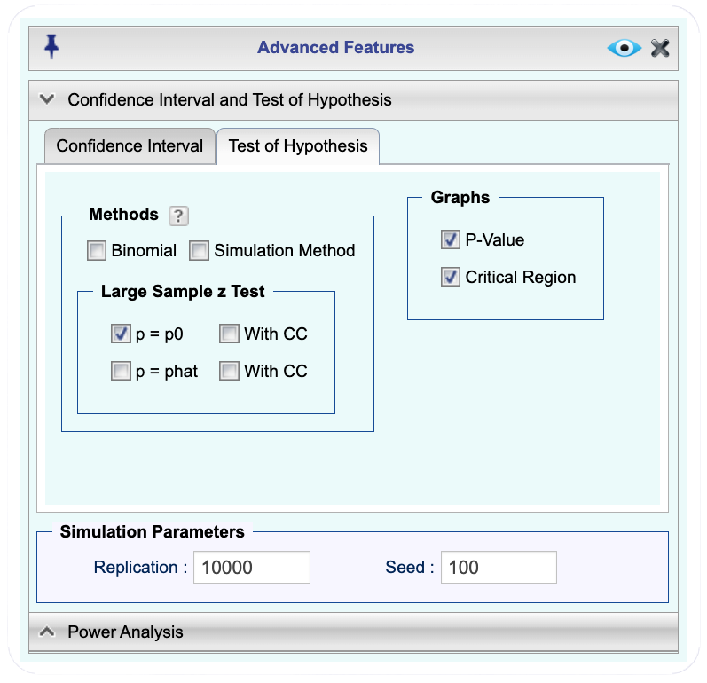
```
:::

:::

:::

Click to expand the box below to see the Rguroo output.

::: {.callout-tip .inner-callout collapse="true" title="Rguroo output: One-Population Proportion Inference - Physical Inactivity"}

<div tabindex="0" class="rg-iframe-wrapper">
  <iframe
    src="Rguroo_html_output/Proportion Inference/Physical_inactivity_ztest_docx/Physical_inactivity.html"
    class="rg-iframe"
    title="Rguroo output: One Population Proportion Hypothesis - Physical Inactivity Example">
  </iframe>
</div>

:::

   (i) From the Rguroo output, the critical region is
   $\hat{p} \leq \hat{p}^*$, where $\hat{p}^* = 0.23905$ (see @fig-inactivity-critical).

```{r,echo=FALSE}
#| fig-alt: "A bell-shaped curve labeled “Observed Data Scale” with significance level 5% displayed above. The horizontal axis represents the proportion of “Yes.” The left tail of the curve is shaded red to indicate the critical region. A green triangle marks the observed sample proportion at 0.20, which lies within the red shaded critical region. Below the axis, the critical value is shown as 0.23905."
#| label: fig-inactivity-critical
#| fig-cap: "A Portion of Rguroo Output: Critical Region Graph for the Physical Inactivity Example"
#| out-width: "80%"
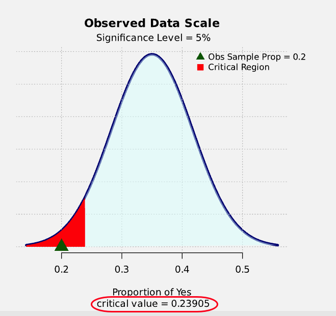
```

   In words: if the observed sample proportion of physically inactive adults
   is 0.23905 or less, we reject $H_0$ and conclude that
   fewer than 35% of adults in the country are physically inactive.

   (ii) Since $H_a: \pi < 0.35$, the $H_a$ support consists of all values of
   $\hat{p}$ that are less than or equal to the observed sample proportion
   $\hat{p}_{\text{obs}} = 10/50 = 0.20$. From the Rguroo output, the
   p-value is approximately 0.01308 (see @fig-inactivity-pvalue).

```{r,echo=FALSE}
#| fig-alt: "A bell-shaped curve labeled “Observed Data Scale” with the horizontal axis showing the proportion of “Yes.” The left tail of the curve is shaded red to represent the p-value region. A green triangle marks the observed sample proportion at 0.20, located in the left tail. The legend indicates “Observed Sample Prop = 0.2” and “P-value = 0.013083."
#| label: fig-inactivity-pvalue
#| fig-cap: "A Portion of Rguroo Output: P-value Graph for the Physical Inactivity Example"
#| out-width: "80%"
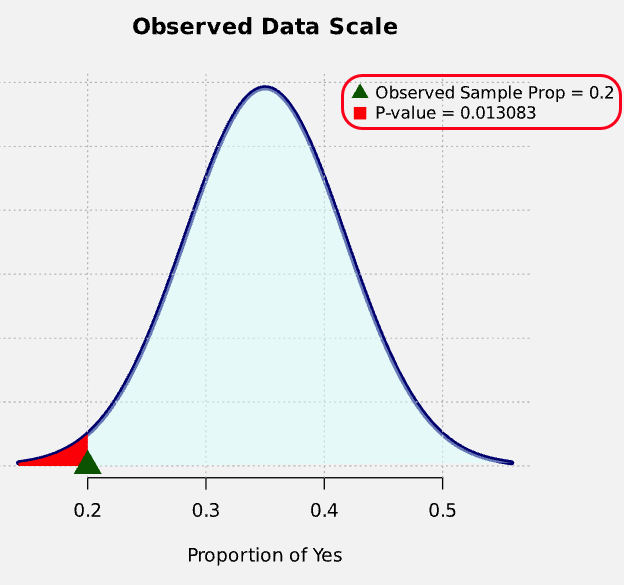
```

   (iii) The p-value can be written as the probability
   $$\text{p-value} = P\!\left(\hat{p} \leq 0.20 \mid \pi = 0.35\right)
   \approx \text{0.01308}.$$
   This is the probability of observing a sample proportion as low as
   $0.20$ or lower, assuming that the true proportion of physically
   inactive adults is $\pi = 0.35$.

c\. Since the p-value (0.01308) is less than the significance level
    (0.05), we reject the null hypothesis $H_0$ and conclude that there is
    sufficient evidence to support the claim that fewer than 35% of adults in the country are physically inactive. 

    The same conclusion can be reached by comparing the observed sample proportion (0.20) to the critical value (0.23905). Since 0.20 is less than 0.23905, it falls within the critical region, leading us to reject $H_0$ and conclude that the data provide evidence in favor of the alternative hypothesis that the true proportion of physically inactive adults is less than 0.35.

:::


:::{#exm-gss-large-sample}
## Marijuana Legalization (continued)

Recall @exm-gss-marijuana. A researcher claims that more than 70% of
American adults support the legalization of marijuana. Using the
[GSS2024]{.data} dataset, which contains responses from $n = 388$
respondents, $x_{\text{obs}} = 282$ answered *Yes* to supporting
legalization. The hypotheses are:
$$
\begin{cases}
H_0: \pi \leq 0.70 \\
H_a: \pi > 0.70
\end{cases}
$$

a. Check whether the conditions for the normal approximation hold.
b. Use Rguroo's Proportion Inference function to obtain an output that includes
both the critical region and the p-value, then answer the following:
   (i) What is the critical region, and in words, what is the decision rule?
   (ii) What is the $H_a$ support, and what is the p-value?
   (iii) Write a probability statement that describes the p-value.
c\. In light of the observed data and the critical region and p-value, state
your conclusion in the context of the problem.

:::

::: {.callout-tip .solution-callout collapse="true" icon=false}
## 🔎 Solution

a\. To check the large sample condition, we compute the expected number of
successes and failures under $H_0$, using the boundary value $\pi_0 = 0.70$:

$$n\pi_0 = 388 \times 0.70 = 271.6 \geq 10$$


$$n(1 - \pi_0) = 388 \times 0.30 = 116.4 \geq 10.$$

Both conditions are satisfied, so the normal approximation is appropriate
for this example.

b\. As in the [Physical Inactivity dialog](#exm-inactivity-rguroo),  we use the [Proportion Inference]{.fun} function. The dialog is shown in @fig-GSS2024_prop_normal_dialog. 

```{r,echo=FALSE}
#| fig-alt: "Rguroo One-Population Proportion dialog configured for the Marijuana Legalization example with sample size 388, observed count 282, hypothesized proportion 0.70, and right-tailed alternative."
#| fig-cap: "Rguroo One-Population Proportion dialog for the Marijuana Legalization example."
#| label: fig-GSS2024_prop_normal_dialog
#| out-width: "100%"
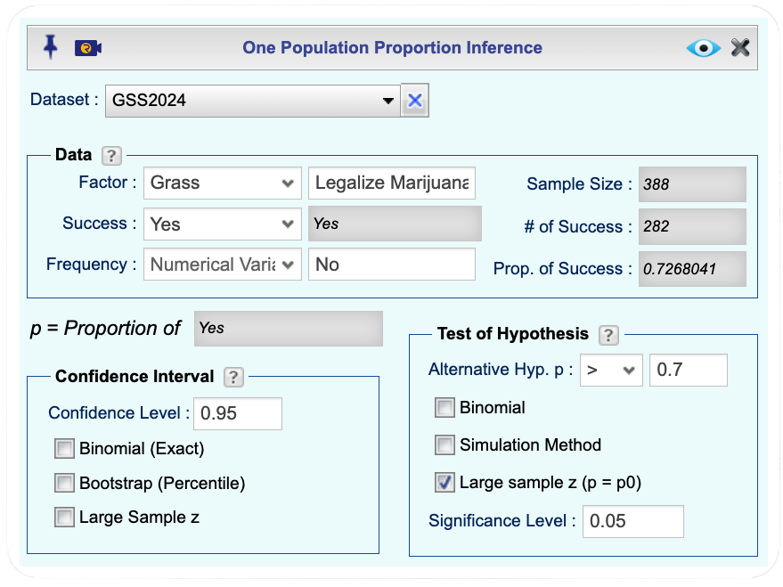
```
Click to expand the box below to see the Rguroo output.

::: {.callout-tip .inner-callout collapse="true" title="Rguroo output: One-Population Proportion Inference - Marijuana Legalization"}
<div tabindex="0" class="rg-iframe-wrapper">
  <iframe
    src="Rguroo_html_output/Proportion Inference/GSS2024PropNormal_docx/GSS2024PropNormal.html"
    class="rg-iframe"
    title="Rguroo output: One Population Proportion Hypothesis - Marijuana Legalization Example">
  </iframe>
</div>
:::

   (i) From the Rguroo output, the critical region is $\hat{p} \geq \hat{p}^*$, where $\hat{p}^* = 0.73827$ (see @fig-GSS2024_critical).

```{r,echo=FALSE}
#| fig-alt: "A bell-shaped curve labeled “Observed Data Scale” with significance level 5% displayed above. The horizontal axis represents the proportion of “Yes.” The right tail of the curve is shaded red to indicate the critical region. A green triangle marks the observed sample proportion at 0.7268, which is just below the red shaded critical region. Below the axis, a vertical line indicates the critical value."
#| fig-cap: "A portion of Rguroo output: Critical Region Graph for the Marijuana Legalization Example"
#| label: fig-GSS2024_critical
#| out-width: "80%"
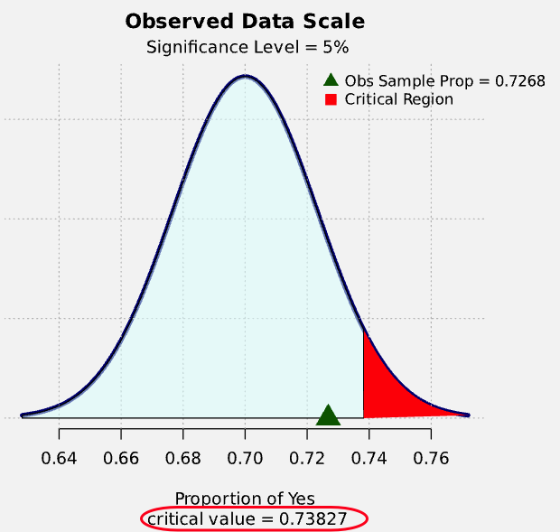
``` 

   In words: if the observed sample proportion of adults who support
   legalization is 0.73827 or greater, we reject $H_0$ and
   conclude that more than 70% of American adults support the legalization
   of marijuana.

   (ii) Since $H_a: \pi > 0.70$, the $H_a$ support consists of all values of $\hat{p}$ that are greater than or equal to the observed sample proportion $\hat{p}_{\text{obs}} = 282/388 \approx 0.7268$. From the Rguroo output, the p-value is approximately 0.0.12463 (see @fig-GSS2024_pvalue).

```{r,echo=FALSE}
#| fig-alt: "A bell-shaped curve labeled “Observed Data Scale” with the horizontal axis showing the proportion of “Yes.” The right tail of the curve is shaded red to represent the p-value region. A green triangle marks the observed sample proportion at 0.7268, located just below the red shaded critical region. The legend indicates “Observed Sample Prop = 0.7268” and “P-value = 0.0625."
#| fig-cap: "A portion of Rguroo output: P-value Graph for the Marijuana Legalization Example"
#| label: fig-GSS2024_pvalue
#| out-width: "80%"
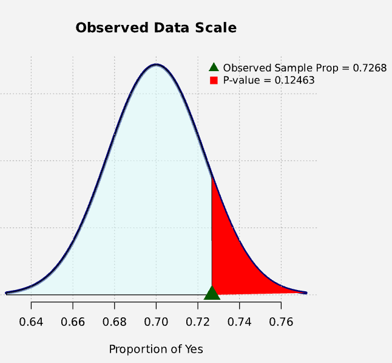
```

   (iii) The p-value can be written as the probability
   $$\text{p-value} = P\!\left(\hat{p} \geq 0.7268 \mid \pi = 0.70\right)
   \approx \text{0.12463}.$$
   This is the probability of observing a sample proportion as high as
   $0.7268$ or higher, assuming that the true proportion of adults who
   support legalization is $\pi = 0.70$.

c\. Since the p-value (0.12463) is greater than the significance level (0.05), we fail to reject the null hypothesis $H_0$. Therefore, we do not have sufficient evidence to support the claim that more than 70% of American adults support the legalization of marijuana. In other words, based on the observed data, we cannot conclude that the true proportion of adults who support marijuana legalization exceeds 0.70.

The same conclusion can be reached by comparing the observed sample proportion (0.7268) to the critical value (0.73827). Since 0.7268 is less than 0.73827, it does not fall within the critical region, leading us to fail to reject $H_0$ and conclude that the data do not provide sufficient evidence in favor of the alternative hypothesis that the true proportion of adults who support marijuana legalization is greater than 0.70.

:::

### Homework for Section @sec-large-sample-one-prop

For each of the scenarios described in Problems 1--7 of @sec-stage-hw,
use Rguroo's [One-Population Proportion]{.fun} inference function with the
[Large Sample z (p=p0)]{.des} option to carry out the hypothesis test at
the given significance level. Before running the analysis, check whether
the large sample condition is satisfied. If it is, identify the following
inputs for the Rguroo dialog:

- [Factor Label]{.des}: A descriptive name for the variable being studied
- [Success]{.des}: The outcome that counts as a success
- [Failure]{.des}: The outcome that counts as a failure
- [Sample Size]{.des}: The value of $n$
- [\# of Successes]{.des}: The value of $x_{\text{obs}}$
- [Proportion of ...]{.des}: The label describing what the proportion
represents

Then carry out the test, report Rguroo's p-value, and interpret the results.

---

1. **Arizona Marijuana Legalization**
In Problem 1 (Arizona Marijuana Legalization) of @sec-stage-hw, $\pi$ is
the true proportion of Arizona registered voters who support marijuana
legalization. Do Arizona registered voters differ from Colorado residents
in their support for marijuana legalization? The sample consisted of
$n = 779$ voters, of whom $x_{\text{obs}} = 390$ favored legalization.
Use $\alpha = 0.05$.

2. **Australian Unemployment Outlook**
In Problem 2 (Australian Unemployment Outlook) of @sec-stage-hw, $\pi$ is
the true proportion of Australians in November 1997 who believed
unemployment would increase. Did Australian sentiment about unemployment
shift between July and November of 1997? The sample consisted of
$n = 631$ Australians, of whom $x_{\text{obs}} = 284$ believed
unemployment would increase. Use $\alpha = 0.05$.

3. **Arkansas Identity Theft Complaints**
In Problem 3 (Arkansas Identity Theft Complaints) of @sec-stage-hw, $\pi$
is the true proportion of consumer complaints in Arkansas that were for
identity theft. Was the proportion of identity theft complaints in Arkansas
greater than the national figure of 23%? The sample consisted of
$n = 3{,}482$ complaints, of which $x_{\text{obs}} = 1{,}601$ were for
identity theft. Use $\alpha = 0.05$.

4. **Alaska Identity Theft Complaints**
In Problem 4 (Alaska Identity Theft Complaints) of @sec-stage-hw, $\pi$
is the true proportion of consumer complaints in Alaska that were for
identity theft. Was Alaska's proportion of identity theft complaints less
than the national proportion of 23%? The sample consisted of
$n = 1{,}432$ complaints, of which $x_{\text{obs}} = 321$ were for
identity theft. Use $\alpha = 0.05$.

5. **Kennedy Assassination Conspiracy Belief**
In Problem 5 (Kennedy Assassination Conspiracy Belief) of @sec-stage-hw,
$\pi$ is the true proportion of American adults in 2013 who believed there
was a conspiracy behind President Kennedy's assassination. Is there evidence
that American belief in a conspiracy behind President Kennedy's assassination
changed between 2001 and 2013? The sample consisted of $n = 1{,}039$
adults, of whom $x_{\text{obs}} = 634$ believed in a conspiracy.
Use $\alpha = 0.05$.

6. **Autism Spectrum Disorder in Arizona**
In Problem 6 (Autism Spectrum Disorder in Arizona) of @sec-stage-hw, $\pi$
is the true proportion of children in Arizona diagnosed with ASD. Is the
rate of ASD diagnosis among children in Arizona greater than the national
rate of 1 in 88 children? The sample consisted of $n = 32{,}601$ children,
of whom $x_{\text{obs}} = 507$ were diagnosed with ASD. Use $\alpha = 0.05$.

7. **Graduate Degree Attainment: GSS2024**
In Problem 7 (Graduate Degree Attainment: GSS2024) of @sec-stage-hw, $\pi$
is the true proportion of U.S. adults who hold a graduate degree. Does the
GSS2024 data provide evidence that the proportion of U.S. adults who hold
a graduate degree differs from the 15% reported by the U.S. Census Bureau?
Use $\alpha = 0.05$.

<div tabindex="0" style="width:85%; margin:auto;">

 The dataset for
this exercise is available in the Rguroo dataset repository [Kozak]{.repo},
with the dataset name [GSS2024]{.data}.

**Code book for Dataset GSS2024 is given [here](#code-book-gss2024).**

</div>

## Confidence Interval for a Population Proportion


We have seen that the sample proportion $\hat{p}$ is a natural estimate
of the population proportion $\pi$. However, because $\hat{p}$ is based
on a random sample, it varies from sample to sample and will rarely equal
$\pi$ exactly. This raises a natural question: given what we observed in
our sample, what can we say about the range of plausible values for $\pi$?

To build intuition, think about what would happen if we repeated our
study many times. Each time, we would draw a new random sample of size
$n$, compute a new observed sample proportion $\hat{p}_{\text{obs}}$,
and use it to build an interval of plausible values for $\pi$ around
$\hat{p}_{\text{obs}}$. Because $\hat{p}_{\text{obs}}$ varies from sample
to sample due to sampling variability, the intervals we construct would
shift around as well. As a result, some intervals would contain the true
value of $\pi$ and some might not, depending on how far
$\hat{p}_{\text{obs}}$ happens to fall from $\pi$ in any given sample
and the method that we use to build the interval. This is the unavoidable
uncertainty that comes with basing our conclusions on a single sample.
The key insight is that by choosing a specific, well-defined method for
constructing the interval, rather than building it arbitrarily, we can
control how often it succeeds in capturing the true value of $\pi$ across
many repetitions. The percentage of intervals that we expect to contain
the true value of $\pi$ when using such a method is called the
**confidence level**. For example, a method that captures the true value
of $\pi$ in 95% of all repetitions produces what we call a **95%
confidence interval**.

::: {.callout-note appearance="minimal"}
## Confidence Level

The **confidence level** is the percentage of times that the interval
construction method is expected to capture the true population parameter,
when applied repeatedly to many different random samples from the same
population. In practice, we collect one sample and construct one
interval, but the confidence level tells us how reliable our method is
in the long run.
:::

Notice that the confidence level describes the long-run behavior of the
method, not any single interval. In practice, we collect one sample and
compute one interval. That specific interval either contains the true
value of $\pi$ or it does not, we just do not know which. What we can
say is that we used a reliable method: one that succeeds in capturing
the true value of $\pi$ at the stated confidence level across many
repetitions.

Now that we have defined the confidence level, we can ask: how do we
actually construct such an interval? We already have a tool that tells
us whether a specific value of $\pi_0$ is consistent with our data: the
two-sided hypothesis test. If we test $H_0: \pi = \pi_0$ versus
$H_a: \pi \neq \pi_0$ at significance level $\alpha = 1 -
\text{confidence level}$ and fail to reject $H_0$, it means our data
are consistent with $\pi_0$. If we reject $H_0$, it means $\pi_0$ is
not a plausible value of $\pi$ given our data. This suggests a natural
strategy: test a range of values of $\pi_0$ and collect all those for
which we fail to reject $H_0$. The collection of all such values forms
our confidence interval.

::: {.callout-note appearance="minimal"}
## Confidence Interval by Test Inversion

A $(1 - \alpha) \times 100\%$ confidence interval for $\pi$ consists
of all values $\pi_0$ for which we would fail to reject
$H_0: \pi = \pi_0$ in a two-sided test at significance level $\alpha$.
Notice that the significance level $\alpha$ and the confidence level
$(1-\alpha) \times 100\%$ are complementary: a 95% confidence interval
corresponds to $\alpha = 0.05$, a 90% confidence interval corresponds
to $\alpha = 0.10$, and so on.
:::

The following example illustrates this idea concretely by working through
a grid of values of $\pi_0$ and identifying which ones are consistent
with the observed data.

:::{#exm-youtube-ci-grid}
## Daily YouTube Use Among Teens: Building a Confidence Interval from a Grid

Recall @exm-youtube-ppss. A sample of $n = 20$ students produced
$x_{\text{obs}} = 17$ daily YouTube users, giving a sample proportion of
$\hat{p}_{\text{obs}} = 17/20 = 0.85$.

For each value of $\pi_0$ shown in the grid below, carry out the two-sided
hypothesis test $H_0: \pi = \pi_0$ versus $H_a: \pi \neq \pi_0$ at
significance level $\alpha = 0.05$, using the binomial distribution with
$n = 20$ and $x_{\text{obs}} = 17$. Based on the results, identify the
range of values of $\pi_0$ for which we fail to reject $H_0$. 

```{r,echo=FALSE}
#| fig-alt: "A horizontal number line showing values from about 0.50 to 0.99 marked with evenly spaced dots. One value, 0.85, is highlighted with a diamond shape and labeled “p_obs = 0.85,” indicating the observed proportion among the possible values."
#| fig-cap: ""
#| out-width: "80%"

```

:::


::: {.callout-tip .solution-callout collapse="true" icon=false}
## 🔎 Solution

For each value of $\pi_0$ in the grid, we compute the two-sided p-value
using the binomial distribution $X \sim \text{Binomial}(20, \pi_0)$. The
p-value is the probability of observing a result at least as extreme as
$x_{\text{obs}} = 17$ in either direction, assuming $H_0$ is true. We
then compare each p-value to $\alpha = 0.05$ to decide whether to reject
or fail to reject $H_0$.

| $\pi_0$ | p-value | Decision |
|---------|---------|----------|
| 0.55 | 0.006 | Reject $H_0$ |
| 0.60 | 0.022 | Reject $H_0$ |
| 0.65 | 0.064 | Fail to reject $H_0$ |
| 0.70 | 0.220 | Fail to reject $H_0$ |
| 0.75 | 0.439 | Fail to reject $H_0$ |
| 0.80 | 0.781 | Fail to reject $H_0$ |
| 0.85 | 1.000 | Fail to reject $H_0$ |
| 0.90 | 0.445 | Fail to reject $H_0$ |
| 0.95 | 0.075 | Fail to reject $H_0$ |
| 0.99 | 0.001 | Reject $H_0$ |

The graph below shows the result graphically:

```{r,echo=FALSE}
#| fig-alt: "A number line of possible proportion values with the observed value 0.85 highlighted. A central range is indicated as the “fail to reject” region, while values farther from the center fall into the rejection regions."
#| fig-cap: ""
#| out-width: "80%"

```


As shown in the table and the graph, we fail to reject $H_0$ for values of $\pi_0$
ranging from 0.65 to 0.95, and reject $H_0$ for values of $\pi_0$ at
or below 0.60 and at or above 0.99. Based on this grid, the range of
plausible values for $\pi$ is approximately $0.65$ to $0.95$.
 This range can be considered a confidence interval based on the grid values that we used.

:::

The confidence interval that we obtained in the example above is 
the collection of all values of
$\pi_0$ that are consistent with our observed data at significance level
$\alpha = 0.05$. Notice that the interval is not symmetric around
$\hat{p}_{\text{obs}} = 0.85$: it extends further below $\hat{p}_{\text{obs}}$
(down to approximately 0.65) than above it (up to approximately 0.95).
To understand why, recall the large sample condition from
@sec-large-sample-one-prop. Using $\hat{p}_{\text{obs}} = 0.85$ as our
estimate of $\pi$, we compute:

$$n\hat{p}_{\text{obs}} = 20 \times 0.85 = 17 \geq 10 \qquad \text{but}
\qquad n(1-\hat{p}_{\text{obs}}) = 20 \times 0.15 = 3 < 10.$$

The condition fails because the expected number of failures is only 3,
which means the binomial distribution is noticeably skewed in this
example. As a result, the interval is asymmetric, and this asymmetry
is real and should be reflected in our confidence interval. A method
that forces a symmetric interval would miss this feature of the data
and could give misleading results.

This example illustrates that the choice of method for constructing a
confidence interval matters. In the subsections that follow, we study
two approaches in detail. The first, presented in
@sec-ci-binomial, inverts the exact binomial test to produce a
confidence interval that correctly captures asymmetry when it is
present. The second, presented in @sec-ci-large-sample, uses the
normal approximation and always produces a symmetric interval, which
is accurate when the large sample condition is satisfied but can be
misleading when it is not, as in this example.

### Confidence Interval Based on the Exact Binomial Method {#sec-ci-binomial}

As we saw in @exm-youtube-ci-grid, we can construct a confidence interval
for the population proportion $\pi$ by testing a grid of null hypotheses
$H_0: \pi = \pi_0$ and collecting all values of $\pi_0$ for which we fail
to reject $H_0$. When this approach uses the exact binomial distribution
to carry out each test, the resulting interval is called the **exact
binomial confidence interval**. As we noted in that example, this method
has an important advantage: it correctly reflects any asymmetry in the
data, which can occur when the large sample condition fails and the
binomial distribution is skewed.

Of course, testing every conceivable value of $\pi_0$ between 0 and 1
is not practical. Fortunately, efficient algorithms can locate the exact
endpoints of the interval directly, without testing each value one by
one. These algorithms are implemented in Rguroo, making it straightforward
to obtain the exact binomial confidence interval in practice. The
following example illustrates how.

:::{#exm-youtube-ci-binomial}
## Daily YouTube Use Among Teens: Exact Binomial Confidence Interval

Recall @exm-youtube-ppss. A sample of $n = 20$ students produced
$x_{\text{obs}} = 17$ daily YouTube users, giving a sample proportion of
$\hat{p}_{\text{obs}} = 17/20 = 0.85$. Use Rguroo's
[One-Population Proportion]{.fun} inference function to construct a 95%
exact binomial confidence interval for the true proportion of students
in the district who use YouTube daily, and interpret the interval in the
context of the problem.
:::

:::: {.callout-tip .solution-callout collapse="true" icon=false}
## 🔎 Solution

Click to expand the box below to see how to use the [Proportion Inference]{.fun}  function in Rguroo to obtain an exact binomial confidence interval for this problem.

::: {#prop-ci-binomial-youtube .callout-note appearance="simple" collapse="true" icon="none" title="{width=22px style='vertical-align:middle;'} Exact binomial confidence interval - Youtube example"}

1. Open the **Analytics** toolbox in Rguroo.  

2. From the [Analysis]{.dpd} dropdown, select [Proportion Inference]{.fun} → [One Population]{.fun}. This opens the [One Population Proportion Inference]{.dialog} dialog.

3. In the **Data** section of the dialog, enter the following:
   - In the [Factor Label]{.des} textbox, type a label for the categorical variable. In Rguroo, a “factor” refers to a categorical variable. For this example, enter [Daily YouTube Use]{.typein}.
   - In the [Success Label]{.des} textbox, type [Yes]{.typein}. A success corresponds to a student who uses YouTube daily.
   - In the [Failure Label]{.des} textbox, type [No]{.typein}.
   - In the [Sample Size]{.des} textbox, type [20]{.typein}.
   - In the [\# of Successes]{.des} textbox, type [17]{.typein}.

4. In the **Confidence Interval** section of the dialog, enter the following:
   - In the [Confidence Level]{.des} textbox enter [0.95]{.typein}. This is the default value corresponding to the confidence level 95%.
   - Select the [Binomial (Exact)]{.des} checkbox to obtain the exact binomial confidence interval.

6. Click the preview icon  to view the output.

7. Click the  button and save the result as [YoutubeBinomCi]{.typein}.

::: {.callout-tip .inner-callout collapse="true" title="Rguroo One-Population Proportion dialogs"}

```{r,echo=FALSE}
#| fig-alt: "Screenshot of a “One Population Proportion Inference” interface. The dataset is not selected. The factor is “Daily YouTube Use,” with success defined as “Yes.” The sample size is 20 with 17 successes, giving a sample proportion of 0.85. In the Confidence Interval section, the 95% level is selected and the “Binomial (Exact)” option is checked (highlighted with a red circle). Other options such as Bootstrap and Large Sample z are unchecked. The Test of Hypothesis panel is shown but not filled in."
#| fig-cap: "Rguroo Basics dialog"
#| out-width: "100%"
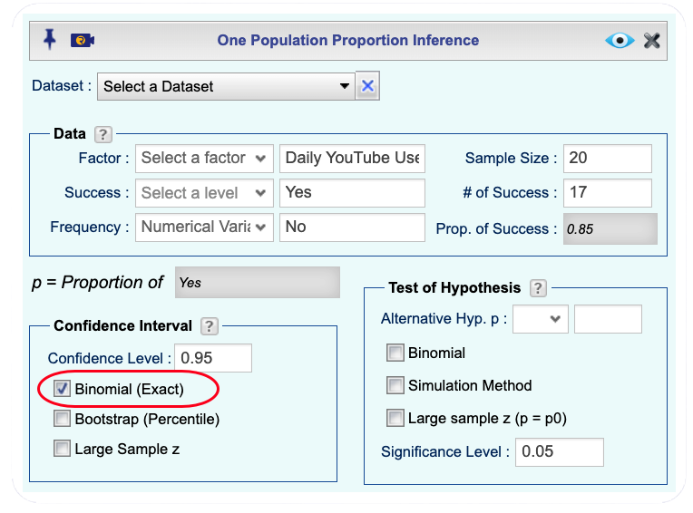
```
:::

:::

Click to expand the box below to see the Rguroo output.

::: {.callout-tip .inner-callout collapse="true" title="Rguroo output: One-Population Proportion Inference Output - YouTube"}

<div tabindex="0" class="rg-iframe-wrapper">
  <iframe
    src="Rguroo_html_output/Proportion Inference/YoutubeBinomCi_docx/YoutubeBinomCi.html"
    class="rg-iframe"
    title="Rguroo output: One Population Proportion Exact Binomial CI - Youtube Example">
  </iframe>
</div>

:::

From the Rguroo output, the 95% exact binomial confidence interval for
$\pi$ is $(0.628, 0.958)$. The following is an interpretation of this interval:

We are 95% confident that the true proportion of students in the district who use YouTube daily is between 0.628 (62.8%) and 0.958 (95.8%).

::::

Notice that this interval is consistent with what we found using the
grid in @exm-youtube-ci-grid, where we identified the range of plausible
values as approximately 0.65 to 0.95. The exact interval extends the
lower endpoint slightly further down to 0.628, which falls between the
grid values 0.60 and 0.65 where we saw the p-value cross the 0.05
threshold, exactly as we anticipated. The exact interval also confirms
the upper endpoint near 0.958, consistent with our grid result of
approximately 0.95. This agreement gives us confidence that the grid
approach captured the right range, while the exact binomial method
pins down the endpoints precisely.

Also notice that the interval is not symmetric around
$\hat{p}_{\text{obs}} = 0.85$: the lower endpoint is $0.85 - 0.628 =
0.222$ below $\hat{p}_{\text{obs}}$, while the upper endpoint is only
$0.958 - 0.85 = 0.108$ above it. This asymmetry is expected given that
the large sample condition fails for this example , as we verified in
@exm-youtube-ci-grid, the expected number of failures is only
$20 \times 0.15 = 3$, which is less than 10.

:::{#exm-inactivity-ci-binomial}
## Physical Inactivity Among Adults: Exact Binomial Confidence Interval

Recall @exm-physical-inactivity-ppss. A sample of $n = 50$ adults
produced $x_{\text{obs}} = 10$ physically inactive individuals, giving
a sample proportion of $\hat{p}_{\text{obs}} = 10/50 = 0.20$. Use
Rguroo's [One-Population Proportion]{.fun} inference function to
construct a 95% exact binomial confidence interval for the true
proportion of adults in the country who are physically inactive, and
interpret the interval in the context of the problem.
:::

::: {.callout-tip .solution-callout collapse="true" icon=false}
## 🔎 Solution

The following is a screenshot of the [One Population Proportion Inference]{.dialog} for obtaining the exact binomial confidence interval for this example.

```{r,echo=FALSE}
#| fig-alt: "Screenshot of a “One Population Proportion Inference” interface. The factor is “Physically Inactive,” with success defined as “Yes.” The sample size is 50 with 10 successes, giving a sample proportion of 0.20. In the Confidence Interval section, the 95% level is selected and the “Binomial (Exact)” option is checked, while Bootstrap and Large Sample z are unchecked. In the Test of Hypothesis panel, an alternative proportion value of 0.35 is entered, but no test method is selected, and the significance level is 0.05."
#| fig-cap: "Rguroo Basics dialog showing how to obtain exact binomial CI"
#| out-width: "100%"
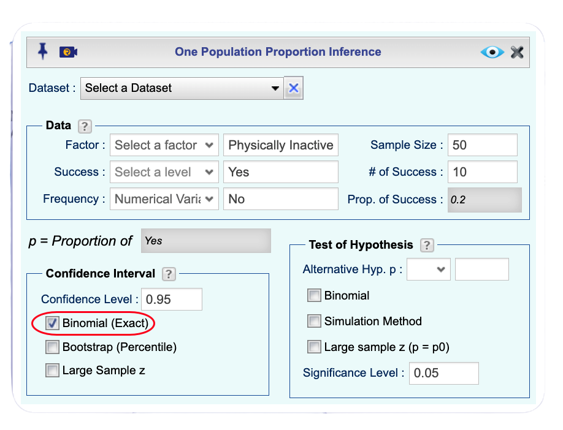
```
Click to expand the box below to see the Rguroo output.

::: {.callout-tip .inner-callout collapse="true" title="Rguroo output: One-Population Proportion Inference Output - Social Media"}

<div tabindex="0" class="rg-iframe-wrapper">
  <iframe
    src="Rguroo_html_output/Proportion Inference/Physical_exactCI_docx/Physical_exactCI.html"
    class="rg-iframe"
    title="Rguroo output: One Population Proportion Large Sample Normal CI - Physical Inactivity Example">
  </iframe>
</div>

:::

From the Rguroo output, the 95% exact binomial confidence interval for
$\pi$ is $(0.106, 0.338)$. We are 95% confident that the true proportion
of adults in the country who are physically inactive is between 0.106 (10.6%)
and 0.338 (33.8%).

:::

It is intersting to check whether the interval is symmetric around
$\hat{p}_{\text{obs}} = 0.20$. We verify the large sample condition
using $\hat{p}_{\text{obs}}$ as our estimate of $\pi$:

$$n\hat{p}_{\text{obs}} = 50 \times 0.20 = 10 \geq 10 \qquad \text{and}
\qquad n(1-\hat{p}_{\text{obs}}) = 50 \times 0.80 = 40 \geq 10.$$

Both conditions are satisfied, so the binomial distribution should be
reasonably symmetric in this case, and we would expect the interval to
be approximately symmetric around $\hat{p}_{\text{obs}} = 0.20$. Indeed,
the lower endpoint is $0.20 - 0.098 = 0.102$ below $\hat{p}_{\text{obs}}$
and the upper endpoint is $0.341 - 0.20 = 0.141$ above it, reasonably
close to symmetric, with only a slight asymmetry.

:::{#exm-social-ci-binomial}
## Social Media as a Primary News Source: Exact Binomial Confidence Interval

Recall @exm-social-media-news-ppss. A sample of $n = 15$ students
produced $x_{\text{obs}} = 9$ who reported using social media as their
primary news source, giving a sample proportion of
$\hat{p}_{\text{obs}} = 9/15 = 0.60$. Use Rguroo's
[One-Population Proportion]{.fun} inference function to construct a 95%
exact binomial confidence interval for the true proportion of students
at the university who get most of their news from social media, and
interpret the interval in the context of the problem.
:::

::: {.callout-tip .solution-callout collapse="true" icon=false}
## 🔎 Solution

The following is a screenshot of the [One Population Proportion Inference]{.dialog} for obtaining the exact binomial confidence interval for this example.

```{r,echo=FALSE}
#| fig-alt: "Screenshot of a “One Population Proportion Inference” interface. The factor is “Use Social media,” with success defined as “Yes.” The sample size is 15 with 9 successes, giving a sample proportion of 0.60. In the Confidence Interval section, the 95% level is selected and the “Binomial (Exact)” option is checked, while Bootstrap and Large Sample z are unchecked. In the Test of Hypothesis panel, a left-tailed alternative hypothesis (p < 0.35) is selected, the Binomial test method is checked, and the significance level is 0.05."
#| fig-cap: "Rguroo Basics dialog showing how to obtain exact binomial CI"
#| out-width: "100%"
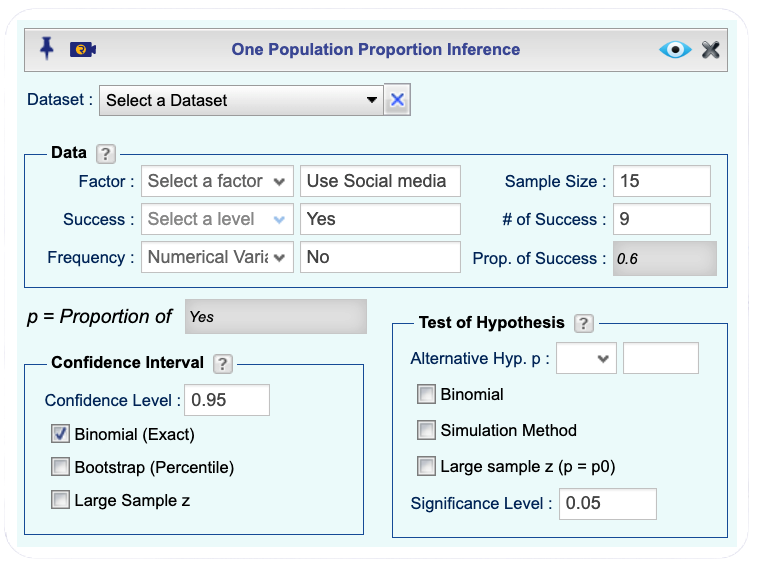
```

Click to expand the box below to see the Rguroo output.

::: {.callout-tip .inner-callout collapse="true" title="Rguroo output: One-Population Proportion Inference Output - Social Media"}

<div tabindex="0" class="rg-iframe-wrapper">
  <iframe
    src="Rguroo_html_output/Proportion Inference/socialNormalCI_docx/socialNormalCI.html"
    class="rg-iframe"
    title="Rguroo output: One Population Proportion Large Sample Normal CI - Social Media Example">
  </iframe>
</div>

:::

From the Rguroo output, the 95% exact binomial confidence interval for
$\pi$ is $(0.332, 0.809)$. We are 95% confident that the true proportion
of students at the university who get most of their news from social
media is between 0.332 (33.2%) and 0.809 (80.9%).

:::

<!--
To check whether we expect the binomial distribution to be symmetric in this example,
we verify the large sample condition using $\hat{p}_{\text{obs}}$ as
our estimate of $\pi$:

$$n\hat{p}_{\text{obs}} = 15 \times 0.60 = 9 \qquad \text{and}
\qquad n(1-\hat{p}_{\text{obs}}) = 15 \times 0.40 = 6.$$

The expected number of successes (9) is close to but slightly below 10,
and the expected number of failures (6) is below 10. Since neither
condition is comfortably satisfied, we expect the binomial distribution
to be moderately skewed, and therefore the confidence interval to show
a slight deviation from symmetry around $\hat{p}_{\text{obs}} = 0.60$.
Indeed, the lower endpoint is $0.60 - 0.323 = 0.277$ below
$\hat{p}_{\text{obs}}$, while the upper endpoint is $0.833 - 0.60 =
0.233$ above it, a modest asymmetry. As with the YouTube
example, the exact binomial method correctly captures this asymmetry,
whereas, as we will see, the large sample method would impose a symmetric interval and
could give a less accurate result in cases like this one.

--> 

:::{#exm-gss-ci-binomial}
## Marijuana Legalization: Exact Binomial Confidence Interval

Recall @exm-gss-marijuana. The [GSS2024]{.data} dataset contains
responses from $n = 388$ U.S. adults, of whom $x_{\text{obs}} = 282$
supported the legalization of marijuana, giving a sample proportion of
$\hat{p}_{\text{obs}} = 282/388 \approx 0.7268$. Use Rguroo's
[One-Population Proportion]{.fun} inference function to construct a 95%
exact binomial confidence interval for the true proportion of American
adults who support the legalization of marijuana, and interpret the
interval in the context of the problem.

<div tabindex="0" style="width:85%; margin:auto;">

 The dataset
for this example is available in the Rguroo dataset repository
[Kozak]{.repo}, with the dataset name [GSS2024]{.data}.

**Code book for Dataset GSS2024 is given [here](#code-book-gss2024).**

</div>

:::

:::: {.callout-tip .solution-callout collapse="true" icon=false}
## 🔎 Solution

The following is a screenshot of the [One Population Proportion Inference]{.dialog} for obtaining the exact binomial confidence interval for this example.

```{r,echo=FALSE}
#| fig-alt: "Interface for one population proportion inference using the GSS2024 dataset on support for legalizing marijuana. The sample size is 388 with 282 successes, giving a sample proportion of about 0.727. The confidence interval section shows a 95% confidence level with the “Binomial (Exact)” method selected."
#| fig-cap: "Rguroo Basics dialog showing how to obtain exact binomial CI"
#| out-width: "100%"
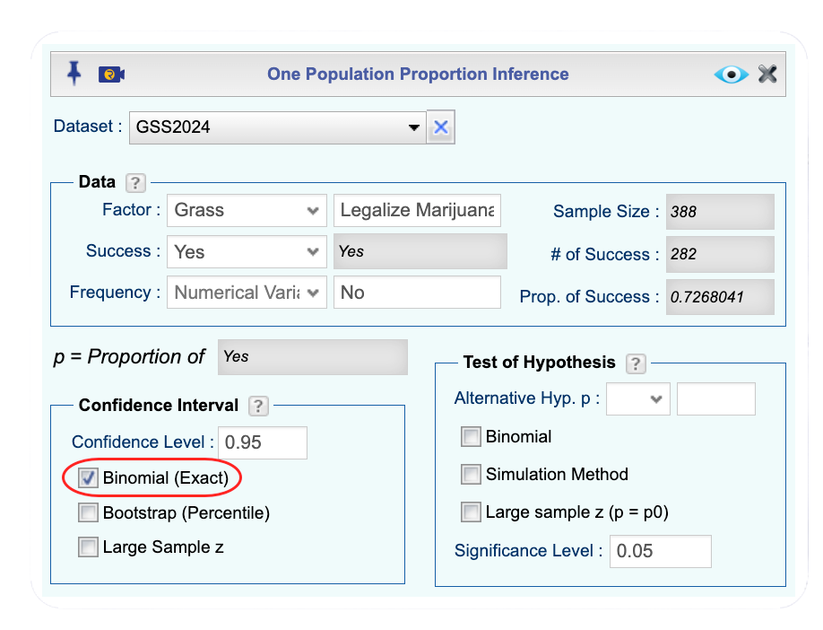
```
Click to expand the box below to see the Rguroo output.

::: {.callout-tip .inner-callout collapse="true" title="Rguroo output: One-Population Proportion Inference Output - Marijuana Legalization"}

<div tabindex="0" class="rg-iframe-wrapper">
  <iframe
    src="Rguroo_html_output/Proportion Inference/GSS2024ExactCI_docx/GSS2024ExactCI.html"
    class="rg-iframe"
    title="Rguroo output: One Population Proportion Large Sample Normal CI - Marijuan Legalization Example">
  </iframe>
</div>
:::

From the Rguroo output, the 95% exact binomial confidence interval for
$\pi$ is $(0.679,0.769)$. We are 95% confident that
the true proportion of American adults who support the legalization of
marijuana is between 0.679 (69.7%) and 0.769 (76.9%).

To check whether we expect the interval to be approximately symmetric,
we verify the large sample condition using $\hat{p}_{\text{obs}}$ as
our estimate of $\pi$:

$$n\hat{p}_{\text{obs}} = 388 \times 0.7268 \approx 282 \geq 10
\qquad \text{and} \qquad
n(1-\hat{p}_{\text{obs}}) = 388 \times 0.2732 \approx 106 \geq 10.$$

Both conditions are satisfied comfortably, so the binomial distribution
is approximately symmetric in this case and we would expect the
interval to be approximately symmetric around
$\hat{p}_{\text{obs}} \approx 0.7268$. We will verify this when we
compare this interval to the large sample normal approximation interval
in @exm-gss-ci-large-sample.
::::

### Confidence Interval Based on the Large Sample Normal Approximation {#sec-ci-large-sample}

In the previous section, we constructed confidence intervals using the
exact binomial distribution. This approach is statistically precise and,
as we saw, correctly captures any asymmetry in the interval when the
large sample condition fails. With modern software like Rguroo, it is
just as easy to compute as any other method.

However, long before computers were widely available, statisticians
needed a way to construct confidence intervals that could be carried out
with nothing more than a printed table of normal probabilities and a
hand calculator. The key insight that made this possible is one we have
already seen: when the large sample condition is satisfied, the sample
proportion $\hat{p}$ is approximately normally distributed. This means
we can replace the exact binomial calculation with a normal-based one,
leading to a simple formula that can be computed by hand.

::: {.callout-note}
## Why Learn the Normal Approximation Method?

Even though software makes the exact binomial interval easy to obtain,
the normal approximation method remains important for two reasons:

- It is the method most commonly reported in published research and
popular media, so understanding it is essential for reading and
interpreting results you will encounter in practice.
- It connects naturally to confidence intervals for other parameters,
such as population means, where an exact distribution is not available
and the normal approximation is the standard tool.
:::

Recall from @sec-large-sample-one-prop that when the large sample
condition is satisfied, the sample proportion $\hat{p}$ is approximately
normally distributed with mean $\pi$ and standard deviation
$\sqrt{\pi(1-\pi)/n}$. In principle, the large sample condition requires
that $n\pi \geq 10$ and $n(1-\pi) \geq 10$. However, since $\pi$ is
unknown, we use $\hat{p}_{\text{obs}}$ in its place to check these
conditions and to estimate the standard deviation of $\hat{p}$. The
resulting estimated standard deviation is called the **standard error**
of $\hat{p}$:

$$\text{SE}(\hat{p}) = \sqrt{\frac{\hat{p}_{\text{obs}}(1 - \hat{p}_{\text{obs}})}{n}}.$$

The large sample condition is therefore checked as:

$$n\hat{p}_{\text{obs}} \geq 10 \qquad \text{and} \qquad
n(1-\hat{p}_{\text{obs}}) \geq 10.$$

When this condition is satisfied, the $(1-\alpha) \times 100\%$
confidence interval for $\pi$ takes the form

$$\hat{p}_{\text{obs}} \pm z^* \times \text{SE}(\hat{p}),$$

where $z^*$ is the **critical value** from the standard normal
distribution corresponding to the desired confidence level. The quantity
$z^* \times \text{SE}(\hat{p})$ is called the **margin of error**. It
represents how far above and below $\hat{p}_{\text{obs}}$ we extend the
interval, and it captures the uncertainty in our estimate of $\pi$ due
to sampling variability. A larger margin of error means more uncertainty
— which happens when the sample size is small, when $\hat{p}_{\text{obs}}$
is close to 0.5, or when a higher confidence level is chosen.

Common critical values are:

| Confidence Level | $\alpha$ | $z^*$ |
|-----------------|----------|-------|
| 90% | 0.10 | 1.645 |
| 95% | 0.05 | 1.960 |
| 99% | 0.01 | 2.576 |

::: {.callout-note}
## Large Sample Confidence Interval for a Population Proportion

When the large sample condition $n\hat{p}_{\text{obs}} \geq 10$ and
$n(1-\hat{p}_{\text{obs}}) \geq 10$ is satisfied, an approximate
$(1-\alpha) \times 100\%$ confidence interval for $\pi$ is:

$$\hat{p}_{\text{obs}} \pm \underbrace{z^* \times
\sqrt{\frac{\hat{p}_{\text{obs}}(1-\hat{p}_{\text{obs}})}{n}}}_{\text{margin of error}},$$

which gives the interval

$$\left(\hat{p}_{\text{obs}} - z^* \times
\sqrt{\frac{\hat{p}_{\text{obs}}(1-\hat{p}_{\text{obs}})}{n}},\;
\hat{p}_{\text{obs}} + z^* \times
\sqrt{\frac{\hat{p}_{\text{obs}}(1-\hat{p}_{\text{obs}})}{n}}\right).$$

Notice that this interval is always symmetric around
$\hat{p}_{\text{obs}}$, which is accurate when the large sample
condition is satisfied but may be misleading when it is not.
:::

:::{#exm-youtube-ci-large-sample}
## Daily YouTube Use Among Teens: Large Sample Confidence Interval

Recall @exm-youtube-ppss. A sample of $n = 20$ students produced
$x_{\text{obs}} = 17$ daily YouTube users, giving a sample proportion
of $\hat{p}_{\text{obs}} = 17/20 = 0.85$. 

a. Use Rguroo's [One-Population Proportion]{.fun} inference function
to obtain a 95% large sample normal approximation confidence interval
for the true proportion of students in the district who use YouTube
daily.
b. Compare this interval to the exact binomial confidence interval
obtained in @exm-youtube-ci-binomial, and comment on the agreement
or discrepancy in light of the 10-10 rule.
:::


:::: {.callout-tip .solution-callout collapse="true" icon=false}
## 🔎 Solution

a. Click to expand the box below to see how to use the [Proportion Inference]{.fun}  function in Rguroo to obtain a large sample normal confidence interval for this problem.

::: {#prop-ci-normal-youtube .callout-note appearance="simple" collapse="true" icon="none" title="{width=22px style='vertical-align:middle;'} large sample normal confidence interval - Youtube example"}

1. Open the **Analytics** toolbox in Rguroo.  

2. From the [Analysis]{.dpd} dropdown, select [Proportion Inference]{.fun} → [One Population]{.fun}. This opens the [One Population Proportion Inference]{.dialog} dialog.

3. In the **Data** section of the dialog, enter the following:
   - In the [Factor Label]{.des} textbox, type a label for the categorical variable. In Rguroo, a “factor” refers to a categorical variable. For this example, enter [Daily YouTube Use]{.typein}.
   - In the [Success Label]{.des} textbox, type [Yes]{.typein}. A success corresponds to a student who uses YouTube daily.
   - In the [Failure Label]{.des} textbox, type [No]{.typein}.
   - In the [Sample Size]{.des} textbox, type [20]{.typein}.
   - In the [\# of Successes]{.des} textbox, type [17]{.typein}.

4. In the **Confidence Interval** section of the dialog, enter the following:
   - In the [Confidence Level]{.des} textbox enter [0.95]{.typein}. This is the default value corresponding to the confidence level 95%.
   - Select the [Large Sampel z]{.des} checkbox to obtain the large sample normal confidence interval.

6. Click the preview icon  to view the output.

7. Click the  button and save the result as [YoutubenormalCi]{.typein}.

::: {.callout-tip .inner-callout collapse="true" title="Rguroo One-Population Proportion dialogs"}

```{r,echo=FALSE}
#| fig-alt: "Interface for one population proportion inference showing a dataset on daily YouTube use. The sample size is 20 with 17 successes, giving a sample proportion of 0.85. In the confidence interval section, the “Large Sample z” method is selected for a 95% confidence level."
#| fig-cap: "Rguroo Basics dialog"
#| out-width: "100%"
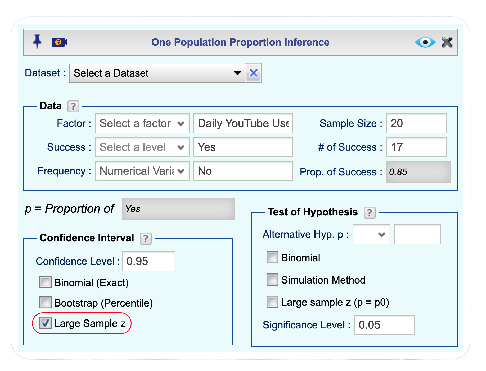
```
:::

:::

Click to expand the box below to see the Rguroo output.

::: {.callout-tip .inner-callout collapse="true" title="Rguroo output: One-Population Proportion Inference Output - YouTube"}

<div tabindex="0" class="rg-iframe-wrapper">
  <iframe
    src="Rguroo_html_output/Proportion Inference/YoutubeNormalCi_docx/YoutubeNormalCi.html"
    class="rg-iframe"
    title="Rguroo output: One Population Proportion Large Sample Normal CI - Youtube Example">
  </iframe>
</div>

:::

From the Rguroo output, the 95% large sample confidence interval for
$\pi$ is $(0.693, 1.00)$. We are 95% confident that
the true proportion of students in the district who use YouTube daily
is between 0.693 (69.3%) and 1.00 (100%).

b. In @exm-youtube-ci-binomial, the 95% exact binomial confidence
interval was $(0.628, 0.958)$. Recall from @exm-youtube-ci-grid that
the 10-10 rule gives:

$$n\hat{p}_{\text{obs}} = 20 \times 0.85 = 17 \geq 10 \qquad
\text{but} \qquad
n(1-\hat{p}_{\text{obs}}) = 20 \times 0.15 = 3 < 10.$$

The large sample condition fails because the expected number of
failures is only 3. We therefore expect the normal approximation
interval to be less accurate than the exact binomial interval.
 Indeed, the large sample interval is different from the exact binomial.
In cases like this one, the exact binomial interval from
@exm-youtube-ci-binomial is the more trustworthy result.
::::


:::{#exm-inactivity-ci-large-sample}
## Physical Inactivity Among Adults: Large Sample Confidence Interval

Recall @exm-physical-inactivity-ppss. A sample of $n = 50$ adults
produced $x_{\text{obs}} = 10$ physically inactive individuals, giving
a sample proportion of $\hat{p}_{\text{obs}} = 10/50 = 0.20$.

a. Use Rguroo's [One-Population Proportion]{.fun} inference function
to obtain a 95% large sample normal approximation confidence interval
for the true proportion of adults in the country who are physically
inactive.
b. Compare this interval to the exact binomial confidence interval
obtained in @exm-inactivity-ci-binomial, and comment on the agreement
or discrepancy in light of the 10-10 rule.
:::


::: {.callout-tip .solution-callout collapse="true" icon=false}
## 🔎 Solution

a.The following is a screenshot of the [One Population Proportion Inference]{.dialog} for obtaining the large sample normal confidence interval for this example.

```{r,echo=FALSE}
#| fig-alt: "Interface for one population proportion inference using a dataset on physical inactivity. The sample size is 50 with 10 successes, giving a sample proportion of 0.20. The confidence interval section shows a 95% confidence level with the “Large Sample z” method selected."
#| fig-cap: "Rguroo Basics dialog showing how to obtain large sample normal CI"
#| out-width: "100%"
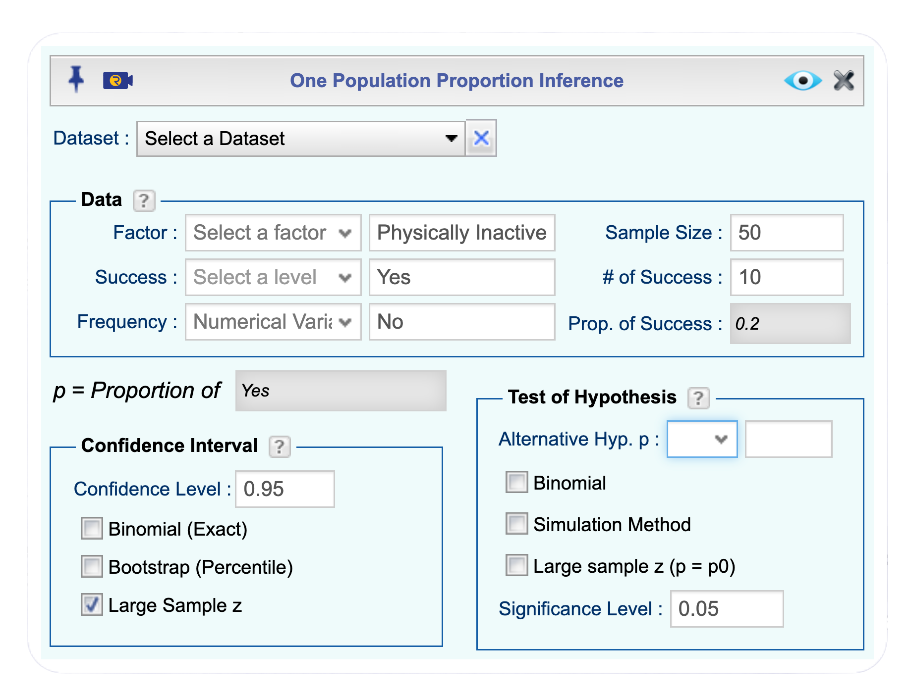
```
Click to expand the box below to see the Rguroo output.

::: {.callout-tip .inner-callout collapse="true" title="Rguroo output: One-Population Proportion Inference Output - Physical Activity"}

<div tabindex="0" class="rg-iframe-wrapper">
  <iframe
    src="Rguroo_html_output/Proportion Inference/Physical_activity_ci_normal_docx/Physical_activity_ci_normal.html"
    class="rg-iframe"
    title="Rguroo output: One Population Proportion Large Sample Normal CI - Physical Activity Example">
  </iframe>
</div>

:::


From the Rguroo output, the 95% large sample confidence interval for
$\pi$ is $(0.089, 0.311)$. We are 95% confident that
the true proportion of adults in the country who are physically
inactive is between 0.089 (8.9%) and 0.311 (31.1%).

b. In @exm-inactivity-ci-binomial, the 95% exact binomial confidence
interval was $(0.098, 0.341)$. Recall from @exm-inactivity-ci-binomial
that the 10-10 rule gives:

$$n\hat{p}_{\text{obs}} = 50 \times 0.20 = 10 \geq 10 \qquad
\text{and} \qquad
n(1-\hat{p}_{\text{obs}}) = 50 \times 0.80 = 40 \geq 10.$$

Both conditions are satisfied, so the normal approximation is
appropriate here and we expect the two intervals to be in close
agreement. Indeed, the large sample interval  is 
close to the exact binomial interval $(0.098, 0.341)$, with only
minor differences due to the approximation.
:::

:::{#exm-social-ci-large-sample}
## Social Media as a Primary News Source: Large Sample Confidence Interval

Recall @exm-social-media-news-ppss. A sample of $n = 15$ students
produced $x_{\text{obs}} = 9$ who reported using social media as their
primary news source, giving a sample proportion of
$\hat{p}_{\text{obs}} = 9/15 = 0.60$.

a. Use Rguroo's [One-Population Proportion]{.fun} inference function
to obtain a 95% large sample normal approximation confidence interval
for the true proportion of students at the university who get most of
their news from social media.
b. Compare this interval to the exact binomial confidence interval
obtained in @exm-social-ci-binomial, and comment on the agreement
or discrepancy in light of the 10-10 rule.
:::

:::: {.callout-tip .solution-callout collapse="true" icon=false}
## 🔎 Solution

a. a.The following is a screenshot of the [One Population Proportion Inference]{.dialog} for obtaining the large sample normal confidence interval for this example.

```{r,echo=FALSE}
#| fig-alt: "Interface for one population proportion inference using a dataset on social media use. The sample size is 15 with 9 successes, giving a sample proportion of 0.60. The confidence interval section shows a 95% confidence level with the “Large Sample z” method selected, and no hypothesis test options are selected."
#| fig-cap: "Rguroo Basics dialog showing how to obtain large sample normal CI"
#| out-width: "100%"
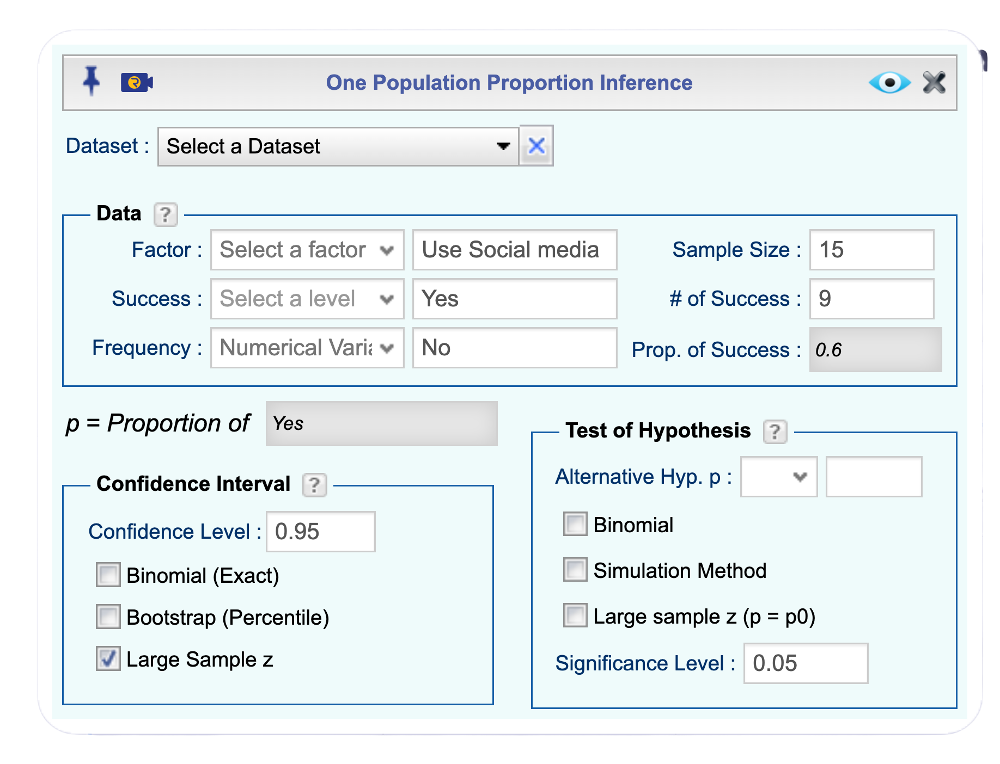
```
Click to expand the box below to see the Rguroo output.

::: {.callout-tip .inner-callout collapse="true" title="Rguroo output: One-Population Proportion Inference Output - Social Media"}

<div tabindex="0" class="rg-iframe-wrapper">
  <iframe
    src="Rguroo_html_output/Proportion Inference/socialBinomCI_docx/socialBinomCI.html"
    class="rg-iframe"
    title="Rguroo output: One Population Proportion Large Sample Normal CI - Social Media Example">
  </iframe>
</div>

:::

From the Rguroo output, the 95% large sample confidence interval for
$\pi$ is $(0.332, 0.809)$. We are 95% confident that
the true proportion of students at the university who get most of
their news from social media is between 0.332 (33.2%) and 0.809 (80.9%).

b. In @exm-social-ci-binomial, the 95% exact binomial confidence
interval was $(0.323, 0.833)$. Recall from @exm-social-ci-binomial
that the 10-10 rule gives:

$$n\hat{p}_{\text{obs}} = 15 \times 0.60 = 9 \qquad
\text{and} \qquad
n(1-\hat{p}_{\text{obs}}) = 15 \times 0.40 = 6.$$

The expected number of successes (9) is close to but slightly below
10, and the expected number of failures (6) is below 10. In cases where
the expected successes and expected failures are above 5, we expect a modest
discrepancy between the two intervals, which is teh case here.
::::

:::{#exm-gss-ci-large-sample}
## Marijuana Legalization: Large Sample Confidence Interval

Recall @exm-gss-marijuana. The [GSS2024]{.data} dataset contains
responses from $n = 388$ U.S. adults, of whom $x_{\text{obs}} = 282$
supported the legalization of marijuana, giving a sample proportion of
$\hat{p}_{\text{obs}} = 282/388 \approx 0.7268$.

a. Use Rguroo's [One-Population Proportion]{.fun} inference function
to obtain a 95% large sample normal approximation confidence interval
for the true proportion of American adults who support the legalization
of marijuana.
b. Compare this interval to the exact binomial confidence interval
obtained in @exm-gss-ci-binomial, and comment on the agreement or
discrepancy in light of the 10-10 rule.

<div tabindex="0" style="width:85%; margin:auto;">

 The dataset
for this example is available in the Rguroo dataset repository
[Kozak]{.repo}, with the dataset name [GSS2024]{.data}.

**Code book for Dataset GSS2024 is given [here](#code-book-gss2024).**

</div>

:::

::: {.callout-tip .solution-callout collapse="true" icon=false}
## 🔎 Solution

a. The following is a screenshot of the [One Population Proportion Inference]{.dialog} for obtaining the exact binomial confidence interval for this example.

```{r,echo=FALSE}
#| fig-alt: "Interface for one population proportion inference using the GSS2024 dataset on support for legalizing marijuana. The sample size is 388 with 282 successes, giving a sample proportion of about 0.727. The confidence interval section shows a 95% confidence level with the “Large Sample z” method selected."
#| fig-cap: "Rguroo Basics dialog showing how to obtain exact binomial CI"
#| out-width: "100%"
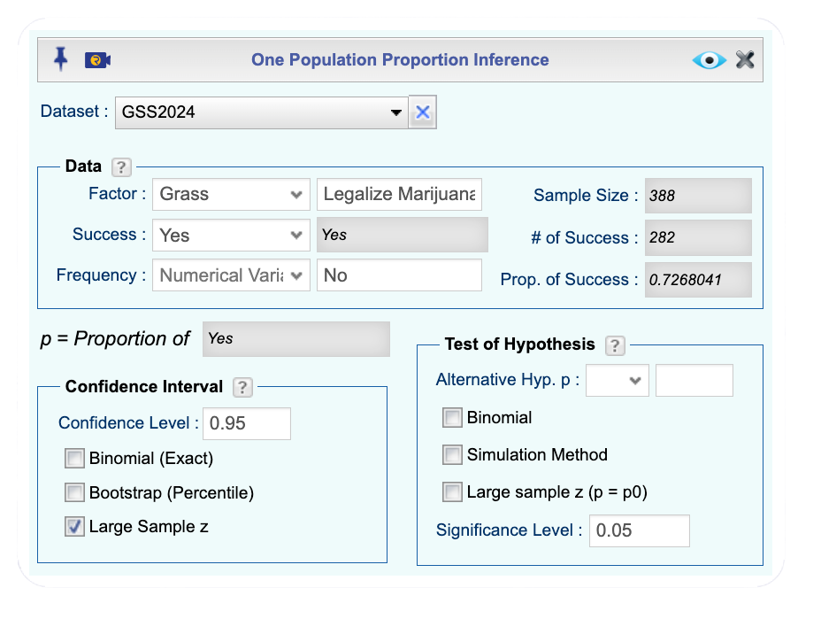
```

Click to expand the box below to see the Rguroo output.

::: {.callout-tip .inner-callout collapse="true" title="Rguroo output: One-Population Proportion Inference Output - Marijuana Legalization"}

<div tabindex="0" class="rg-iframe-wrapper">
  <iframe
    src="Rguroo_html_output/Proportion Inference/GSS2024NormalCI_docx/GSS2024NormalCI.html"
    class="rg-iframe"
    title="Rguroo output: One Population Proportion Large Sample Normal CI - Marijuan Legalization Example">
  </iframe>
</div>
:::

From the Rguroo output, the 95% large sample confidence interval for
$\pi$ is $(0.682, 0.771)$. We are 95% confident that
the true proportion of American adults who support the legalization of
marijuana is between 0.682 (68.2%) and 0.771 (77.1%).

b. In @exm-gss-ci-binomial, the 95% exact binomial confidence interval
was $(0.679, 0.769$. Recall from
@exm-gss-ci-binomial that the 10-10 rule is comfortably satisfied:

$$n\hat{p}_{\text{obs}} = 388 \times 0.7268 \approx 282 \geq 10
\qquad \text{and} \qquad
n(1-\hat{p}_{\text{obs}}) = 388 \times 0.2732 \approx 106 \geq 10.$$

Since both conditions are satisfied by a wide margin, the normal
approximation is highly appropriate here and we expect the two
intervals to be in very close agreement. Indeed, the large sample
interval  $(0.682, 0.771)$ is very close to
the exact binomial interval $(0.679, 0.769$, confirming that when the large sample
condition is comfortably satisfied, the two methods give essentially
the same result. In this case, either interval is appropriate to
report.
:::

### Homework for @sec-ci-binomial and @sec-ci-large-sample

For each of the scenarios described in Problems 1--7 of @sec-stage-hw,
answer the following:

a. Check whether the large sample condition is satisfied using the
10-10 rule. Based on your answer, determine whether the large sample
normal approximation confidence interval is appropriate.
b. Use Rguroo's [One-Population Proportion]{.fun} inference function
with the [Binomial]{.des} option to obtain a 95% exact binomial
confidence interval for $\pi$. Interpret the interval in the context
of the problem.
c. Use Rguroo's [One-Population Proportion]{.fun} inference function
with the [Large Sample z]{.des} option to obtain a 95% large sample
normal approximation confidence interval for $\pi$. Interpret the
interval in the context of the problem, and compare it to the exact
binomial interval obtained in part (b). Is the comparison consistent
with what you found in part (a)?

---

1. **Arizona Marijuana Legalization**
In Problem 1 (Arizona Marijuana Legalization) of @sec-stage-hw, $\pi$
is the true proportion of Arizona registered voters who support
marijuana legalization. The sample consisted of $n = 779$ voters, of
whom $x_{\text{obs}} = 390$ favored legalization.

2. **Australian Unemployment Outlook**
In Problem 2 (Australian Unemployment Outlook) of @sec-stage-hw, $\pi$
is the true proportion of Australians in November 1997 who believed
unemployment would increase. The sample consisted of $n = 631$
Australians, of whom $x_{\text{obs}} = 284$ believed unemployment
would increase.

3. **Arkansas Identity Theft Complaints**
In Problem 3 (Arkansas Identity Theft Complaints) of @sec-stage-hw,
$\pi$ is the true proportion of consumer complaints in Arkansas that
were for identity theft. The sample consisted of $n = 3{,}482$
complaints, of which $x_{\text{obs}} = 1{,}601$ were for identity
theft.

4. **Daily YouTube Use Among Teens: Small Sample**
Recall @exm-youtube-ppss. Suppose that instead of a sample of $n = 20$
students, only $n = 15$ students were available, and $x_{\text{obs}} = 13$
of them reported using YouTube daily.

5. **Social Media as a Primary News Source: Small Sample**
Recall @exm-social-media-news-ppss. Suppose that instead of a sample
of $n = 15$ students, only $n = 12$ students were available, and
$x_{\text{obs}} = 7$ of them reported using social media as their
primary news source.

6. **Alaska Identity Theft Complaints**
In Problem 4 (Alaska Identity Theft Complaints) of @sec-stage-hw,
$\pi$ is the true proportion of consumer complaints in Alaska that
were for identity theft. The sample consisted of $n = 1{,}432$
complaints, of which $x_{\text{obs}} = 321$ were for identity theft.

7. **Kennedy Assassination Conspiracy Belief**
In Problem 5 (Kennedy Assassination Conspiracy Belief) of
@sec-stage-hw, $\pi$ is the true proportion of American adults in
2013 who believed there was a conspiracy behind President Kennedy's
assassination. The sample consisted of $n = 1{,}039$ adults, of whom
$x_{\text{obs}} = 634$ believed in a conspiracy.

8. **Autism Spectrum Disorder in Arizona**
In Problem 6 (Autism Spectrum Disorder in Arizona) of @sec-stage-hw,
$\pi$ is the true proportion of children in Arizona diagnosed with
ASD. The sample consisted of $n = 32{,}601$ children, of whom
$x_{\text{obs}} = 507$ were diagnosed with ASD.

9. **Graduate Degree Attainment: GSS2024**
In Problem 7 (Graduate Degree Attainment: GSS2024) of @sec-stage-hw,
$\pi$ is the true proportion of U.S. adults who hold a graduate
degree. The sample consisted of $n = 388$ adults, of whom
$x_{\text{obs}} = 33$ reported a graduate degree as their highest
level of education.

<div tabindex="0" style="width:85%; margin:auto;">

 The dataset
for this exercise is available in the Rguroo dataset repository
[Kozak]{.repo}, with the dataset name [GSS2024]{.data}.

**Code book for Dataset GSS2024 is given [here](#code-book-gss2024).**

</div>